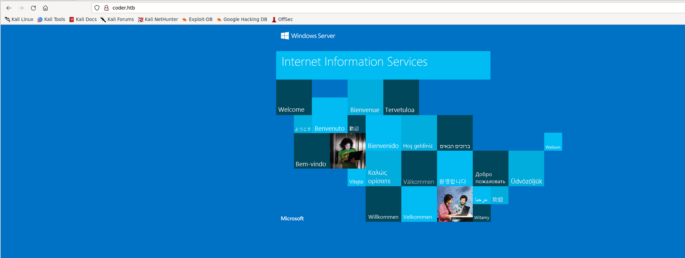
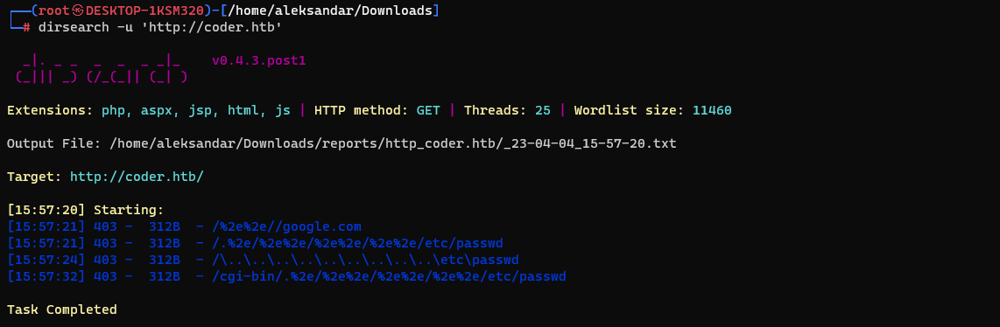
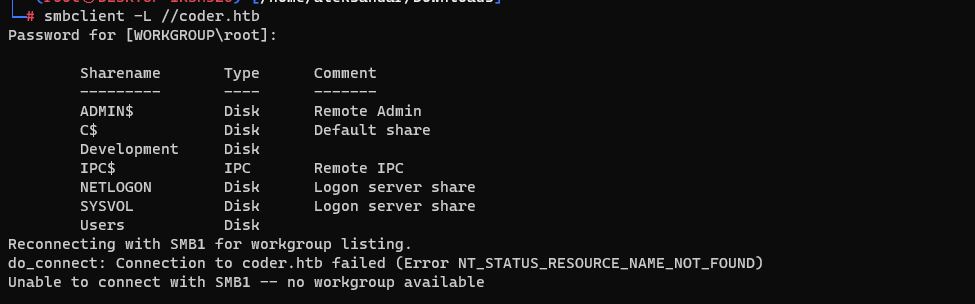
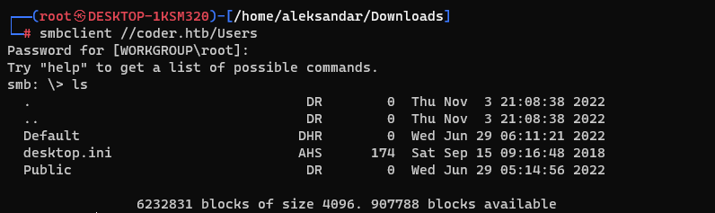
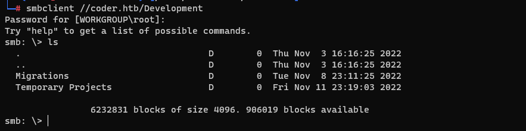
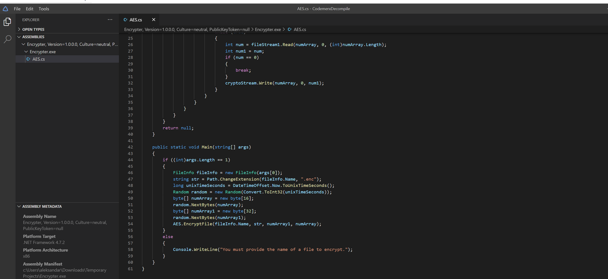

# Footprinting:

# Enumeration:

## DNS:

```bash
└─# dig any coder.htb @10.10.11.207

; <<>> DiG 9.18.12-1-Debian <<>> any coder.htb @10.10.11.207
;; global options: +cmd
;; Got answer:
;; ->>HEADER<<- opcode: QUERY, status: NOERROR, id: 7250
;; flags: qr aa rd ra; QUERY: 1, ANSWER: 7, AUTHORITY: 0, ADDITIONAL: 4

;; OPT PSEUDOSECTION:
; EDNS: version: 0, flags:; udp: 4000
;; QUESTION SECTION:
;coder.htb.                     IN      ANY

;; ANSWER SECTION:
coder.htb.              600     IN      A       10.10.11.207
coder.htb.              3600    IN      NS      dc01.coder.htb.
coder.htb.              3600    IN      SOA     dc01.coder.htb. hostmaster.coder.htb. 885 900 600 86400 3600
coder.htb.              600     IN      AAAA    dead:beef::23ab:e3a0:44ca:7141
coder.htb.              600     IN      AAAA    dead:beef::101
coder.htb.              600     IN      AAAA    dead:beef::250
coder.htb.              600     IN      AAAA    dead:beef::5b36:f8eb:5ad7:879c

;; ADDITIONAL SECTION:
dc01.coder.htb.         1200    IN      A       10.10.11.207
dc01.coder.htb.         1200    IN      AAAA    dead:beef::23ab:e3a0:44ca:7141
dc01.coder.htb.         1200    IN      AAAA    dead:beef::101

;; Query time: 29 msec
;; SERVER: 10.10.11.207#53(10.10.11.207) (TCP)
;; WHEN: Tue Apr 04 15:49:51 CEST 2023
;; MSG SIZE  rcvd: 304
```

## HTTP/HTTPS:

So far if we try to manually surf to the webpage via browser we are presented by default IIS webpage which means that apparently we don't have any website other that default, this behaviour is same for both HTTP and HTTPS protocolls.



It may be other websites but then we have to do a fuzzing in order to find some other FQDN, I think we can come back later if needed. I even run a Webdirectories fuzzing via Dirsearch tool but nothing strange came out so far...



## SMB:

So far i tried to run Enum4Linux-NG and enumerate both RPC and SMB as guest user and random user but nothing special came out so far:

```bash
└─# enum4linux-ng
ENUM4LINUX - next generation (v1.3.1)

usage: enum4linux-ng [-h] [-A] [-As] [-U] [-G] [-Gm] [-S] [-C] [-P] [-O] [-L] [-I] [-R [BULK_SIZE]] [-N] [-w DOMAIN] [-u USER] [-p PW | -K TICKET_FILE | -H NTHASH] [--local-auth] [-d] [-k USERS] [-r RANGES] [-s SHARES_FILE] [-t TIMEOUT] [-v] [--keep]
                     [-oJ OUT_JSON_FILE | -oY OUT_YAML_FILE | -oA OUT_FILE]
                     host
enum4linux-ng: error: the following arguments are required: host

┌──(root㉿DESKTOP-1KSM320)-[/home/aleksandar/Downloads]
└─# enum4linux-ng -A coder.htb
ENUM4LINUX - next generation (v1.3.1)

 ==========================
|    Target Information    |
 ==========================
[*] Target ........... coder.htb
[*] Username ......... ''
[*] Random Username .. 'obywpwnb'
[*] Password ......... ''
[*] Timeout .......... 5 second(s)

 ==================================
|    Listener Scan on coder.htb    |
 ==================================
[*] Checking LDAP
[+] LDAP is accessible on 389/tcp
[*] Checking LDAPS
[+] LDAPS is accessible on 636/tcp
[*] Checking SMB
[+] SMB is accessible on 445/tcp
[*] Checking SMB over NetBIOS
[+] SMB over NetBIOS is accessible on 139/tcp

 =================================================
|    Domain Information via LDAP for coder.htb    |
 =================================================
[*] Trying LDAP
[+] Appears to be root/parent DC
[+] Long domain name is: coder.htb

 ========================================================
|    NetBIOS Names and Workgroup/Domain for coder.htb    |
 ========================================================
[-] Could not get NetBIOS names information via 'nmblookup': timed out

 ======================================
|    SMB Dialect Check on coder.htb    |
 ======================================
[*] Trying on 445/tcp
[+] Supported dialects and settings:
Supported dialects:
  SMB 1.0: false
  SMB 2.02: true
  SMB 2.1: true
  SMB 3.0: true
  SMB 3.1.1: true
Preferred dialect: SMB 3.0
SMB1 only: false
SMB signing required: true

 ========================================================
|    Domain Information via SMB session for coder.htb    |
 ========================================================
[*] Enumerating via unauthenticated SMB session on 445/tcp
[+] Found domain information via SMB
NetBIOS computer name: DC01
NetBIOS domain name: CODER
DNS domain: coder.htb
FQDN: dc01.coder.htb
Derived membership: domain member
Derived domain: CODER

 ======================================
|    RPC Session Check on coder.htb    |
 ======================================
[*] Check for null session
[+] Server allows session using username '', password ''
[*] Check for random user
[+] Server allows session using username 'obywpwnb', password ''
[H] Rerunning enumeration with user 'obywpwnb' might give more results

 ================================================
|    Domain Information via RPC for coder.htb    |
 ================================================
[+] Domain: CODER
[+] Domain SID: S-1-5-21-2608251805-3526430372-1546376444
[+] Membership: domain member

 ============================================
|    OS Information via RPC for coder.htb    |
 ============================================
[*] Enumerating via unauthenticated SMB session on 445/tcp
[+] Found OS information via SMB
[*] Enumerating via 'srvinfo'
[-] Could not get OS info via 'srvinfo': STATUS_ACCESS_DENIED
[+] After merging OS information we have the following result:
OS: Windows 10, Windows Server 2019, Windows Server 2016
OS version: '10.0'
OS release: '1809'
OS build: '17763'
Native OS: not supported
Native LAN manager: not supported
Platform id: null
Server type: null
Server type string: null

 ==================================
|    Users via RPC on coder.htb    |
 ==================================
[*] Enumerating users via 'querydispinfo'
[-] Could not find users via 'querydispinfo': STATUS_ACCESS_DENIED
[*] Enumerating users via 'enumdomusers'
[-] Could not find users via 'enumdomusers': STATUS_ACCESS_DENIED

 ===================================
|    Groups via RPC on coder.htb    |
 ===================================
[*] Enumerating local groups
[-] Could not get groups via 'enumalsgroups domain': STATUS_ACCESS_DENIED
[*] Enumerating builtin groups
[-] Could not get groups via 'enumalsgroups builtin': STATUS_ACCESS_DENIED
[*] Enumerating domain groups
[-] Could not get groups via 'enumdomgroups': STATUS_ACCESS_DENIED

 ===================================
|    Shares via RPC on coder.htb    |
 ===================================
[*] Enumerating shares
[+] Found 0 share(s) for user '' with password '', try a different user

 ======================================
|    Policies via RPC for coder.htb    |
 ======================================
[*] Trying port 445/tcp
[-] SMB connection error on port 445/tcp: STATUS_ACCESS_DENIED
[*] Trying port 139/tcp
[-] SMB connection error on port 139/tcp: session failed

 ======================================
|    Printers via RPC for coder.htb    |
 ======================================
[-] Could not get printer info via 'enumprinters': STATUS_ACCESS_DENIED

Completed after 10.80 seconds
```

 But then persisting wins sometime, trying to list SMB shares on the machines shows us more interesting stuff:



So far all those shares ending by Dollar sign are out of limit without a valid username($ in windows samba means hidden) but Users and Development seems interesting and maybe open to a Anonymous??

- Users share:



But so far nothing seems out of ordinary here so moving forward...

- Development share:



Ok we have more juicy stuff here, so moving with some manual enumeration what came out is, there are several git project folders that I have to anakyze on my Linux host so windows defender doesn't kick in my WSL environment.
Now on all of those folders in the shares the one that stuck my attention was the one under Temporary project:
`┌──(root㉿kali-linux)-[/home/millycash/Downloads/coder.htb/Temporary Projects]
└─# ll
total 12
-rw-r--r-- 1 root root 5632 Apr  4 17:33 Encrypter.exe
-rw-r--r-- 1 root root 3808 Apr  4 17:33 s.blade.enc
`

I really guess that s.blade.enc file need to be decrypted and the key to decrypt it is in the Source code of the Ecrypter.exe file.
I tried on my linux machine with Monodisassembler but the disassembly is kinda messy so I'm trying to install a VM Windows in Linux and try to use Codermex decompile or dnSPY and decompile the code there instead...

## Encrypt.exe Reversing:
Ok after i loaded the encrypt.exe program from the share on my Virtual machine and loaded in Codemerx Decompiler https://decompiler.codemerx.com/

Now we are talking, we have a AES cerypter basically:


The idea here is basically to find the exact Linux(Epoch) time in secound of the filestamp on the share:
`Encrypter.exe                       A     5632  Fri Nov  4 17:51:59 2022`

And then use something like this: https://www.thecodebuzz.com/convert-unix-epoch-time-to-datetime-and-date-to-unix-datecsharp-net/#aioseo-example-2-18-2019-120000-am

To convert time from "human" to second notation, and then having that the code needs to be basically lightly edited to do a Decrypt instead of a Encrypt.
Then lastly we can use mono to compile the AES.cs to exe with following example: https://www.mono-project.com/docs/getting-started/mono-basics/


* * *