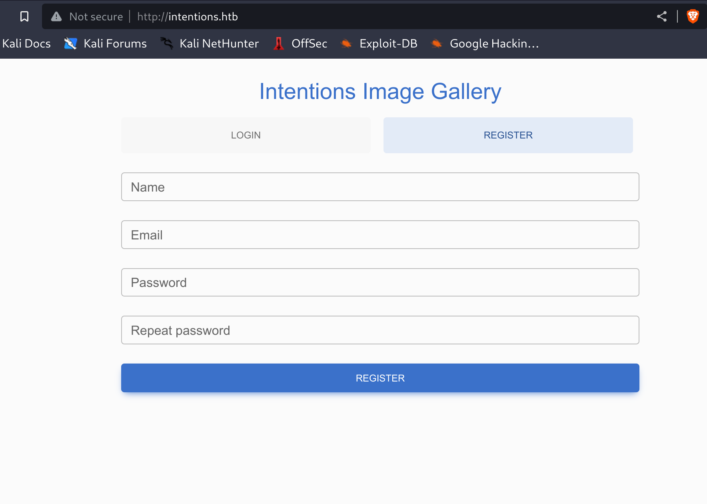
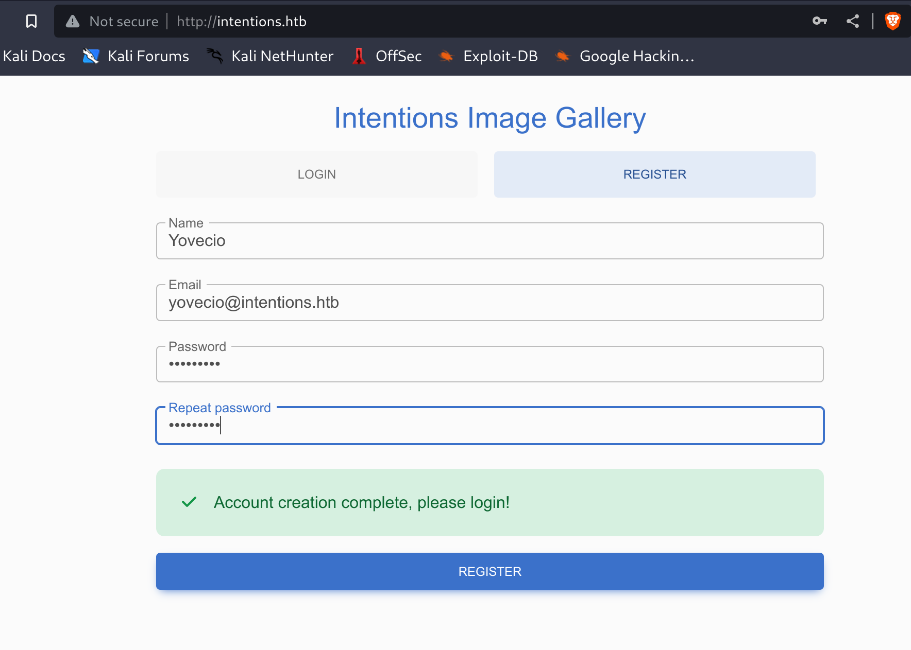
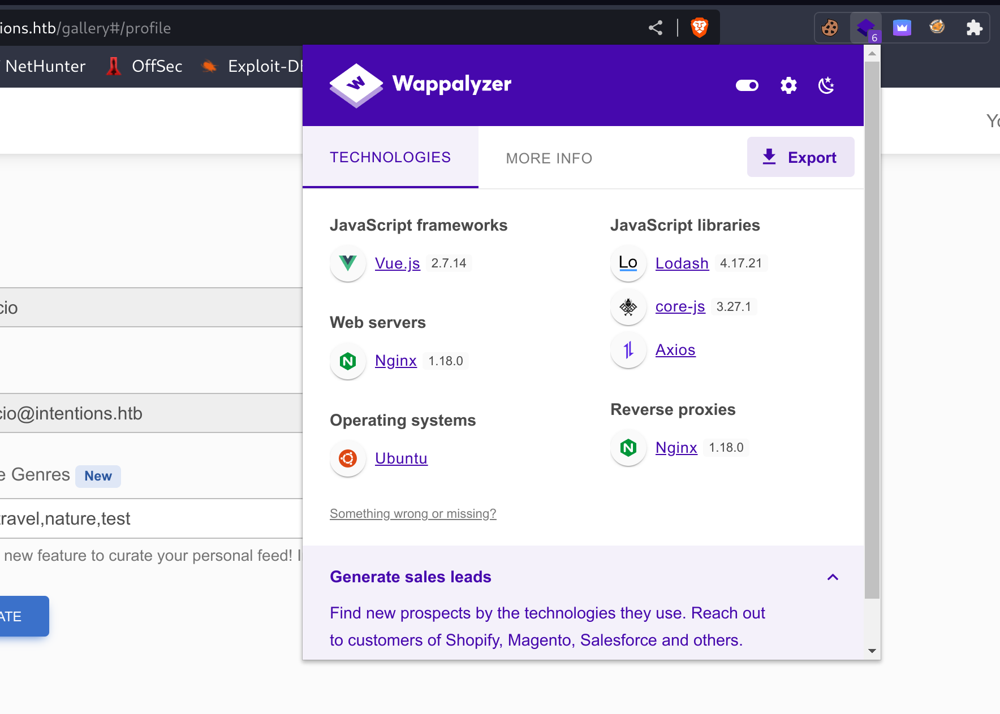

## RUSTSCAN:

```Bash
PORT   STATE SERVICE REASON         VERSION
22/tcp open  ssh     syn-ack ttl 63 OpenSSH 8.9p1 Ubuntu 3ubuntu0.1 (Ubuntu Linux; protocol 2.0)
| ssh-hostkey: 
|   256 47:d2:00:66:27:5e:e6:9c:80:89:03:b5:8f:9e:60:e5 (ECDSA)
| ecdsa-sha2-nistp256 AAAAE2VjZHNhLXNoYTItbmlzdHAyNTYAAAAIbmlzdHAyNTYAAABBBCbEW8beTNeBRfWCUhSxjST5j/gsczjYvLp9vmAsclM2CG/L0KsthRQMThUc1L+eJC0mVYm46K2qkCVwni2zNHU=
|   256 c8:d0:ac:8d:29:9b:87:40:5f:1b:b0:a4:1d:53:8f:f1 (ED25519)
|_ssh-ed25519 AAAAC3NzaC1lZDI1NTE5AAAAIEdBQnXdYum2v3ky5zsqh2jiTOu8kbWYpKiDFJmRJ97m
80/tcp open  http    syn-ack ttl 63 nginx 1.18.0 (Ubuntu)
|_http-title: Intentions
|_http-server-header: nginx/1.18.0 (Ubuntu)
| http-methods: 
|_  Supported Methods: GET HEAD
|_http-favicon: Unknown favicon MD5: D41D8CD98F00B204E9800998ECF8427E
Warning: OSScan results may be unreliable because we could not find at least 1 open and 1 closed port
```

* * *

## SSH:

As usual SSH is a new version with no know exploit available in the wild, bruteforce of the service won't be pursuited.

We may want to got back when and if we find a service available.

* * *

## HTTP:

On first manual enumeration nothing came out from a HTML soucecode , so I decided to start the page and see what can i get. We have a login portal with possibility to Register a username:



Let's try to register a username and see what ca we eventually see from the inside.



Running a webdirectories search unveils some hidden folder like storage and admin but we have no access so far:

```Bash
──(root㉿kali-linux)-[/home/millycash/Downloads]
└─# dirsearch -u "http://intentions.htb/"          

  _|. _ _  _  _  _ _|_    v0.4.2
 (_||| _) (/_(_|| (_| )

Extensions: php, aspx, jsp, html, js | HTTP method: GET | Threads: 30 | Wordlist size: 10927

Output File: /root/.dirsearch/reports/intentions.htb/-_23-07-09_17-35-31.txt

Error Log: /root/.dirsearch/logs/errors-23-07-09_17-35-31.log

Target: http://intentions.htb/

[17:35:31] Starting: 
[17:35:31] 403 -  564B  - /%2e%2e;/test
[17:35:31] 301 -  178B  - /js  ->  http://intentions.htb/js/
[17:35:38] 405 -  825B  - /_ignition/execute-solution
[17:35:39] 302 -  330B  - /admin  ->  http://intentions.htb
[17:35:40] 403 -  564B  - /admin/.config
[17:35:40] 403 -  564B  - /admin/.htaccess
[17:35:40] 302 -  330B  - /admin/?/login  ->  http://intentions.htb
[17:35:40] 302 -  330B  - /admin/  ->  http://intentions.htb
[17:35:47] 403 -  564B  - /administrator/.htaccess
[17:35:49] 403 -  564B  - /admpar/.ftppass
[17:35:49] 403 -  564B  - /admrev/.ftppass
[17:35:50] 403 -  564B  - /app/.htaccess
[17:35:53] 403 -  564B  - /bitrix/.settings
[17:35:53] 403 -  564B  - /bitrix/.settings.bak
[17:35:53] 403 -  564B  - /bitrix/.settings.php.bak
[17:35:58] 301 -  178B  - /css  ->  http://intentions.htb/css/
[17:36:03] 403 -  564B  - /ext/.deps
[17:36:03] 200 -    0B  - /favicon.ico
[17:36:04] 301 -  178B  - /fonts  ->  http://intentions.htb/fonts/
[17:36:04] 302 -  330B  - /gallery  ->  http://intentions.htb
[17:36:07] 200 -    1KB - /index.php
[17:36:08] 403 -  564B  - /js/
[17:36:09] 403 -  564B  - /lib/flex/uploader/.actionScriptProperties
[17:36:09] 403 -  564B  - /lib/flex/uploader/.flexProperties
[17:36:09] 403 -  564B  - /lib/flex/uploader/.project
[17:36:09] 403 -  564B  - /lib/flex/uploader/.settings
[17:36:09] 403 -  564B  - /lib/flex/varien/.actionScriptProperties
[17:36:09] 403 -  564B  - /lib/flex/varien/.project
[17:36:09] 403 -  564B  - /lib/flex/varien/.flexLibProperties
[17:36:09] 403 -  564B  - /lib/flex/varien/.settings
[17:36:11] 302 -  330B  - /logout  ->  http://intentions.htb
[17:36:11] 302 -  330B  - /logout/  ->  http://intentions.htb
[17:36:11] 403 -  564B  - /mailer/.env
[17:36:25] 403 -  564B  - /resources/.arch-internal-preview.css
[17:36:25] 403 -  564B  - /resources/sass/.sass-cache/
[17:36:25] 200 -   24B  - /robots.txt
[17:36:28] 403 -  564B  - /storage/
[17:36:28] 301 -  178B  - /storage  ->  http://intentions.htb/storage/
[17:36:31] 403 -  564B  - /twitter/.env

Task Completed
```

Again running FFUF and check for VHOSTS didn't gave anythign back.

Checking on Wappalyzer for used Technologies shows up that the webserver is running on NGINX 1.18.0 and the website is written in VUE.js:

